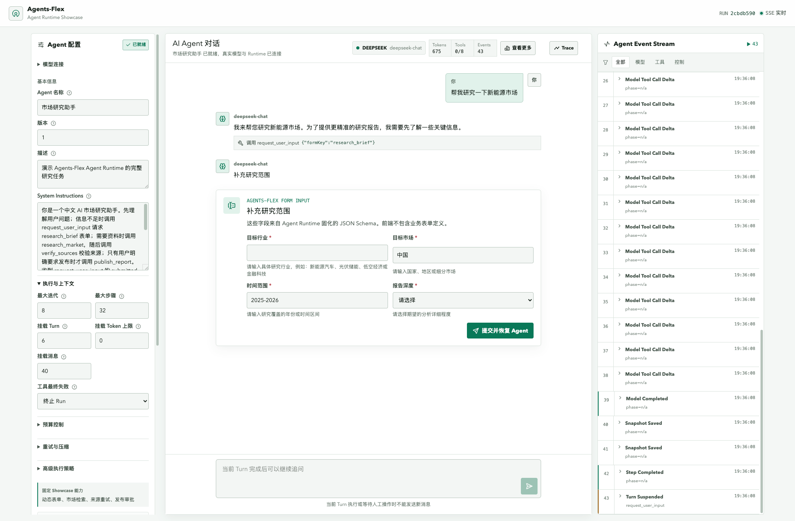

# Agents-Flex Agent Runtime Showcase

一个连接真实 OpenAI-compatible 大模型的全链路 Agent Demo。中央区域是由真实 `ChatMemory` 驱动的持续 AI 对话框，每轮创建独立 `AgentTurn` 并复用同一会话上下文；正文和思考过程通过原生 SSE 增量事件流式显示。

## 能力边界

| 能力 | 实现来源 | Showcase 场景 |
| --- | --- | --- |
| Event | Agents-Flex Native | SSE 实时转发全部 `AgentEvent`；Token Delta 按帧批量更新，右侧通过虚拟滚动展示完整历史 |
| Form Input | Agents-Flex Native | `AgentUserInputTool` 固化 JSON Schema，前端动态渲染 |
| Human Approval | Agents-Flex Native | 发布报告前由 `ToolApprovalPolicy` 挂起原 Turn |
| Message Compression | Agents-Flex Native | 可选择消息数、Turn 数、Token 数、始终或从不触发，并支持整段历史与逐消息两种模型压缩模式 |
| Suspend / Resume | Agents-Flex Native + Demo Control | READY 可立即挂起；运行中请求会在当前原子 Step 完成后的安全检查点生效 |
| Budget Control | Agents-Flex Native | 输入、输出、总 Token、工具次数和墙钟时长由用户创建 Agent 时配置，并展示原生超限原因 |
| Retry | Agents-Flex Native | 来源校验前两次失败，由 `AgentRetryPolicy` 和 `AgentWorker` 恢复同一 ToolCall，同时展示间隔和退避策略 |
| Trace + Metrics | Agents-Flex OpenTelemetry | 每个 Run 使用独立 `TelemetryRoute`，展示真实 Chat/Tool Span、Token、内容和原生 Metrics；生命周期事件单独展示 |
| Cost | Demo Projection | 金额仅按 Token 做展示性估算，标记为 `DEMO_PROJECTION` |

生产运行通过 `agents-flex-chat-openai` 调用真实模型，主对话和上下文摘要都进入 Agents-Flex OpenTelemetry Chat 拦截器链。确定性模型只用于自动化测试；Agent 的状态迁移、快照、工具执行、暂停、恢复、审批、预算、重试、压缩和事件均由框架执行。

## 架构

```text
Vue 3 Console
  |-- create Agent + REST commands ---------------|
  |-- SSE native AgentEvent ---------------------|
                                                   v
Spring Boot API -> ShowcaseRuntime -> AgentRunner -> AgentTurnSnapshot
                                      |-- ChatMemory + compression
                                      |-- tools + approval policy
                                      |-- budget + retry policy
                                      `-- AgentWorker retry lease
                                                   |
                                                   v
                           per-run OpenTelemetry route + in-memory exporter
```

一次运行的主要状态流：

```text
READY -> WAITING_FOR_USER -> RETRY_SCHEDULED -> WAITING_FOR_APPROVAL -> COMPLETED
  |             |                  |                     |
  `-> SUSPENDED `-> form resume    `-> worker resume     `-> approval resume
```

`AgentRunner` 和当前 `AgentTurn` Snapshot 是状态事实来源。`ShowcaseRuntime` 只负责接收命令、调度执行和把原生状态映射为前端视图。前端把 Run ID 写入 `?run=<runId>`；刷新页面后会通过 `GET /runs/{runId}` 与 `/trace` 恢复 Snapshot、事件历史和 Trace，而不是依赖浏览器内存。

## 源码前置

本项目基于 `/Users/michael/git/agents-flex` 当前源码中的 Agent API。该源码与 Maven Central 上同为 `2.2.8` 的构件存在实现漂移：Central 构件缺少本 Demo 使用的压缩包和相关事件。因此首次运行前必须先安装本地源码版本：

```bash
cd /Users/michael/git/agents-flex
mvn -pl agents-flex-agent -am install -DskipTests
```

随后确认 Java 8+、Maven、Node.js 和 pnpm 可用。DuckDB（嵌入式单文件数据库，无需独立服务）与 Ehcache（JCache 缓存）由 Maven 自动下载，无需额外安装。

## 启动

启动后在页面左侧“模型连接”配置服务商、地址、模型和 API Key。配置默认保存在当前浏览器
`localStorage` 并在刷新后恢复；创建 Agent 时发送到后端内存，任何状态接口都不会返回 API Key。

部署环境也可以通过环境变量提供默认连接配置：

```bash
export LLM_API_KEY="your-api-key"
export LLM_PROVIDER="deepseek"
export LLM_ENDPOINT="https://api.deepseek.com"
export LLM_REQUEST_PATH="/chat/completions"
export LLM_MODEL="deepseek-chat"
export LLM_RETRY_ENABLED="true"
export LLM_RETRY_COUNT="2"
export LLM_RETRY_INITIAL_DELAY_MILLIS="600"
```

`src/main/resources/application.yml` 不再包含固定 API Key。DeepSeek、通义千问等兼容 Chat Completions
接口的服务可以直接在 UI 切换。未配置 Key 时应用仍会启动，但创建 Agent 会被后端明确拒绝，避免误走模拟流程。

终端一，在项目根目录启动 Spring Boot：

```bash
cd /Users/michael/git/agents-flex-demo
mvn spring-boot:run
```

终端二，启动前端：

```bash
cd /Users/michael/git/agents-flex-demo/frontend
pnpm install
pnpm dev
```

打开 [http://127.0.0.1:5173](http://127.0.0.1:5173)。Vite 会把 `/api` 代理到 `http://localhost:8080`。

## 演示流程

1. 在左侧完整配置 Agent 名称、描述、System Instructions、模型高级参数、模型 HTTP 重试、执行策略、上下文（消息/Turn/Token）、预算、Agent 重试和压缩参数；预算与上下文 Token 上限填 `0` 表示不限。
2. 点击“创建 Agent”；后端真实 Builder 成功后，中央聊天输入才会解锁。
3. 输入研究任务后界面创建并启动 Run；消息累计达到阈值后可观察原生上下文压缩。
4. 可在 READY 立即挂起，或在运行中请求于下一个安全检查点挂起。
5. 根据 Runtime 返回的 JSON Schema 提交研究范围表单。
6. 观察市场研究工具进度，以及来源验证工具的两次 `RETRY_SCHEDULED`。
7. 在发布报告前批准或拒绝高风险工具调用。
8. 查看完成结果、预算用量、原生事件流、OpenTelemetry Span 树和 Metrics。

默认批准路径的稳定结果为 2 次重试、5 次工具调用，最终发布到 `executive-briefing`。

## 实现边界

- 金额成本是基于 Token 的 `DEMO_PROJECTION`。Agents-Flex 的原生预算不包含货币金额约束。
- Trace 来自 Agents-Flex 原生 OpenTelemetry Chat/Tool 埋点；Human Approval、Retry、Compression 等框架生命周期没有独立 OTel Span，因此以原生 `AgentEvent` 补充展示，不混充 Span。
- 手动挂起是协作式的：运行中请求会等当前模型或工具原子 Step 返回，再使用 Agents-Flex 原生 Suspension 保存；表单与审批继续使用框架自身的 Suspension/Resume 生命周期。
- `maxDurationMillis` 是 Agents-Flex 的墙钟预算，包含表单、审批和手动挂起的人工等待；默认 30 分钟，可在创建 Agent 时调整。
- 运行态数据（OTel 导出结果、ChatMemory、SSE 连接）保存在进程内存中，用于可重复演示，服务重启后不再保留。
- Agent 定义、Run 快照与事件历史会写入 DuckDB 文件数据库（默认 `./data/showcase.duckdb`，可用 `DUCKDB_URL` 覆盖），重启后可在控制台浏览历史 Agent 与 Run；Runner、ChatMemory、SSE 流等运行态对象仍在进程内存，重启后不能继续执行旧 Run。
- 热读路径使用 Ehcache（JCache）缓存：Agent 定义（10 分钟）、终态 Run 快照（10 分钟）与模型状态（1 分钟）；模型状态在创建 Agent 时主动失效，活跃 Run 快照在每次写入时逐条失效，保证不被缓存掩盖。
- Token 估算器和金额成本仅用于展示，不代表供应商的实际 tokenizer 与账单；确定性 ChatModel 仅存在于测试链路。
- 工具函数、审批策略、模型选择器、Middleware、Executor 和重试 Decider 属于进程内 Java 行为，不是可序列化配置；Showcase 使用固定实现。UI 覆盖 Agents-Flex 当前面向 Agent Runtime 的声明式执行、预算、重试、上下文与压缩配置，以及本场景实际使用的文本模型参数。

## API

| Method | Path | 用途 |
| --- | --- | --- |
| `POST` | `/api/agent/agents` | 用完整配置构建并注册真实 Agent |
| `POST` | `/api/agent/runs` | 引用已创建的 `agentId` 创建 READY Run |
| `GET` | `/api/agent/runs` | 列出内存中的 Runs |
| `GET` | `/api/agent/runs/model` | 获取不含 API Key 的模型配置状态 |
| `GET` | `/api/agent/runs/{runId}` | 读取当前 Snapshot 视图 |
| `POST` | `/api/agent/runs/{runId}/start` | 从 READY 开始执行 |
| `POST` | `/api/agent/runs/{runId}/messages` | 在同一 ChatMemory 中创建下一轮 READY Turn |
| `POST` | `/api/agent/runs/{runId}/form` | 提交动态表单并恢复 |
| `POST` | `/api/agent/runs/{runId}/approval` | 批准或拒绝工具调用 |
| `POST` | `/api/agent/runs/{runId}/suspend` | READY 立即挂起，RUNNING 时请求下一个安全检查点挂起 |
| `POST` | `/api/agent/runs/{runId}/resume` | 恢复手动挂起的 Turn |
| `POST` | `/api/agent/runs/{runId}/cancel` | 请求取消 |
| `GET` | `/api/agent/runs/{runId}/events` | 订阅 SSE 原生事件 |
| `GET` | `/api/agent/runs/{runId}/trace` | 获取 Agents-Flex OpenTelemetry Span、Metrics 与补充生命周期事件 |

## 项目结构

```text
agents-flex-demo/
|-- pom.xml               根 Maven / Spring Boot 项目
|-- src/main/java/com/agentsflex/showcase/
|   |-- api/              REST、SSE 与异常映射
|   |-- model/            请求模型
|   |-- runtime/          Runner 控制面、Snapshot 和事件视图
|   |-- demo/             Agent、工具与压缩策略
|   |-- config/           模型连接与 Ehcache 缓存配置
|   `-- persistence/      DuckDB 持久化归档
|-- src/test/             完整 Runtime 生命周期测试
|-- frontend/
|   |-- src/api/          REST/SSE 客户端
|   |-- src/components/   Runtime 控制台组件
|   |-- src/composables/  Pinia 状态与运行编排
|   `-- src/types/        API 和事件类型
`-- README.md
```

## 验证

```bash
cd /Users/michael/git/agents-flex-demo
mvn test

cd /Users/michael/git/agents-flex-demo/frontend
pnpm build
```

后端集成测试使用测试专用确定性模型，覆盖批准后完成、Token 预算超限、拒绝审批，以及同一 Turn 的手动挂起恢复；生产代码始终从 `application.yml` 创建真实模型。
