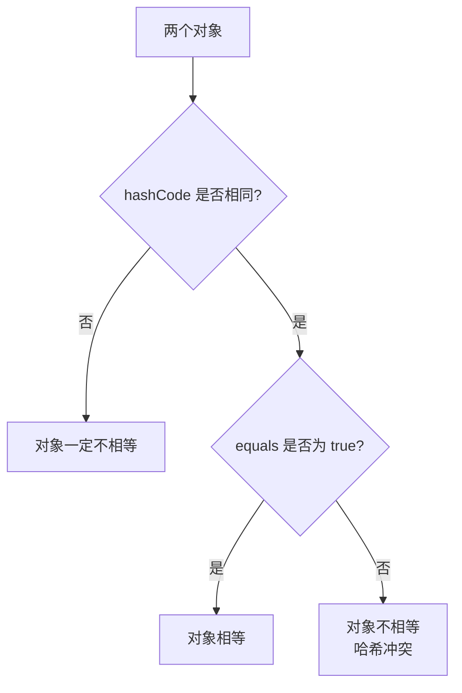

# Java 集合框架与基础知识核心考点总结

## 书籍信息

- **书名**：Java 集合框架常见面试题 / Java 基础知识篇（整合版）
- **来源**：JavaGuide (Snailclimb) 相关面试资料
- **PDF 状态**：文本提取完整，内容清晰
- **OCR 状态**：良好，少量格式符号需清洗

## 目录说明

由于上传的文件为面试知识点合集而非传统线性书籍，本总结将内容重构为两大核心模块，严格按照知识逻辑层级进行组织：
1. **Java 基础核心**（涵盖 JVM、语法、面向对象、异常、IO、多线程基础）
2. **Java 集合框架深度解析**（涵盖 Collection 体系、Map 体系、线程安全集合、底层原理）

## 全书核心主题

本文档旨在系统梳理 Java 后端开发中最核心的基础知识与集合框架原理。重点解决了以下问题：
1. **基础稳固性**：澄清 JVM、JDK、JRE 的关系，深入解析 Java 语法特性（如值传递、泛型擦除、重载重写），以及面向对象的三大特征。
2. **集合选型与原理**：详细对比 List、Set、Map 各实现类（ArrayList, LinkedList, HashMap, ConcurrentHashMap 等）的底层数据结构、扩容机制、线程安全性及适用场景。
3. **并发与安全**：剖析 fail-fast 与 fail-safe 机制，解释 HashMap 在多线程下的死循环问题及 JDK 1.8 的优化，并提供线程安全集合的最佳实践。

---

## 第一部分：Java 基础核心

### 1. Java 入门与 JVM 基础

#### 核心论点
Java 语言通过 JVM 实现“一次编译，到处运行”，其核心在于字节码与 JIT/AOT 编译机制的结合。理解 JDK、JRE、JVM 的区别是 Java 开发的基石。

#### 关键概念
- **JVM (Java Virtual Machine)**：Java 程序的运行环境，负责加载、验证、执行字节码，屏蔽底层操作系统差异。
- **JDK (Java Development Kit)**：Java 开发工具包，包含 JRE 和开发工具（javac, javadoc 等）。
- **JRE (Java Runtime Environment)**：Java 运行环境，包含 JVM 和核心类库，用于运行 Java 程序。
- **Oracle JDK vs OpenJDK**：Oracle JDK 包含更多商业组件和长期支持；OpenJDK 是参考实现，开源免费。两者在核心功能上差异逐渐缩小。

#### 逻辑推演
Java 源代码 (.java) 经编译器编译为字节码 (.class)。JVM 加载字节后，通过解释器逐行解释执行，或通过 JIT (Just-In-Time) 编译器将热点代码编译为本地机器码以提高性能。JDK 9 引入 AOT (Ahead-Of-Time) 编译，进一步启动速度。

#### 经典金句
> “Java 语言‘编译与解释并存’：先编译成字节码，再由 JVM 解释或编译执行。”

---

### 2. Java 语法基础

#### 核心论点
Java 语法设计注重安全性与简洁性，如强制值传递、自动装箱拆箱、以及严格的类型检查。掌握 `==` 与 `equals`、`hashCode` 的关系是避免 Bug 的关键。

#### 关键概念
- **值传递**：Java 中方法参数传递均为值传递。基本类型传值，引用类型传引用的副本（即地址值的拷贝）。
- **== 与 equals**：
    - `==`：基本类型比较值，引用类型比较内存地址。
    - `equals`：默认比较地址，String 等类重写后比较内容。
- **hashCode 与 equals 契约**：
    - 若 `equals` 为 true，则 `hashCode` 必须相等。
    - 若 `hashCode` 相等，`equals` 不一定为 true（哈希冲突）。
    - 重写 `equals` 时必须重写 `hashCode`。

#### 逻辑推演
在哈希表（如 HashMap）中，首先通过 `hashCode` 确定桶位置，再通过 `equals` 判断键是否真正相同。若违反契约，会导致集合行为异常（如无法获取已存入的对象）。

#### 流程图：hashCode 与 equals 关系



---

### 3. 面向对象特性

#### 核心论点
封装、继承、多态是 Java 面向对象的三大支柱。接口与抽象类的选择取决于设计需求：接口定义行为契约，抽象类提供部分实现模板。

#### 关键概念
- **封装**：隐藏内部细节，通过 getter/setter 访问，提高安全性和可维护性。
- **继承**：子类复用父类属性和方法，实现 IS-A 关系。Java 单继承，多实现。
- **多态**：同一操作作用于不同对象产生不同结果。前提：继承、重写、父类引用指向子类对象。
- **接口 vs 抽象类**：
    - 接口：成员变量默认 `public static final`，方法默认 `public abstract` (JDK8+ 可有 default/static 方法)。
    - 抽象类：可有普通成员变量和非抽象方法，构造方法用于子类初始化。

#### 逻辑推演
多态使得代码具有扩展性。例如，定义一个 `Shape` 接口，`Circle` 和 `Rectangle` 实现它。调用 `shape.draw()` 时，无需关心具体形状，运行时动态绑定到具体实现。

---

### 4. 异常处理与 IO 流

#### 核心论点
异常处理机制保障程序健壮性，IO 流体系提供统一的数据读写接口。Try-with-resources 简化资源管理，NIO 提升高并发 IO 性能。

#### 关键概念
- **Exception vs Error**：Exception 可捕获处理（如 IOException），Error 通常不可恢复（如 OutOfMemoryError）。
- **Checked vs Unchecked**：Checked 异常必须显式捕获或声明抛出；Unchecked (RuntimeException) 可选。
- **BIO/NIO/AIO**：
    - BIO：阻塞 IO，一连接一线程，适合低并发。
    - NIO：非阻塞 IO，基于 Channel/Buffer/Selector，适合高并发。
    - AIO：异步 IO，操作系统完成后通知回调，适合长连接高吞吐。

#### 经典金句
> “Try-with-resources 优于 try-finally，因为它能自动关闭资源，且抑制异常处理更优雅。”

---

## 第二部分：Java 集合框架深度解析

### 5. 集合框架概览

#### 核心论点
Java 集合框架分为 Collection 和 Map 两大体系。Collection 存储单一元素，Map 存储键值对。选择合适的集合需考虑有序性、唯一性、线程安全及性能需求。

#### 关键概念
- **List**：有序、可重复。实现类：ArrayList, LinkedList, Vector。
- **Set**：无序（HashSet）、有序（TreeSet）、不可重复。实现类：HashSet, TreeSet, LinkedHashSet。
- **Map**：键值对，键不可重复。实现类：HashMap, TreeMap, LinkedHashMap, Hashtable。

#### 逻辑推演
- 需要快速随机访问？选 ArrayList。
- 需要频繁插入删除？选 LinkedList。
- 需要去重？选 HashSet。
- 需要排序？选 TreeSet 或 TreeMap。
- 需要线程安全？选 ConcurrentHashMap 或 CopyOnWriteArrayList。

---

### 6. List 接口实现详解

#### 核心论点
ArrayList 基于动态数组，适合读多写少；LinkedList 基于双向链表，适合写多读少。Vector 已过时，推荐使用 Collections.synchronizedList 或 CopyOnWriteArrayList。

#### 关键概念
- **ArrayList**：
    - 底层：Object[] 数组。
    - 扩容：默认初始容量 10，扩容为原容量的 1.5 倍。
    - 特点：支持随机访问 (O(1))，尾部插入 O(1)，中间插入 O(n)。
- **LinkedList**：
    - 底层：双向链表。
    - 特点：不支持随机访问，插入删除 O(1)（若已知节点位置），否则需遍历 O(n)。
    - 额外功能：可用作栈、队列、双端队列。

#### 经典金句
> “ArrayList 的空间浪费在预留容量，LinkedList 的空间浪费在每个节点的指针开销。”

---

### 7. Set 接口实现详解

#### 核心论点
Set 的核心在于唯一性。HashSet 基于 HashMap，TreeSet 基于红黑树，LinkedHashSet 维持插入顺序。

#### 关键概念
- **HashSet**：
    - 底层：HashMap 的 Key。
    - 唯一性：依赖 `hashCode` 和 `equals`。
    - 允许 null 值。
- **TreeSet**：
    - 底层：TreeMap (红黑树)。
    - 排序：自然排序 (Comparable) 或定制排序 (Comparator)。
- **LinkedHashSet**：
    - 底层：LinkedHashMap。
    - 特点：维持插入顺序，遍历性能略低于 HashSet。

#### 逻辑推演
HashSet 添加元素时，先计算 hashCode 确定桶位置，若冲突则用 equals 比较。若 equals 返回 true，则覆盖；否则加入链表/红黑树。

---

### 8. Map 接口实现详解 (HashMap 核心)

#### 核心论点
HashMap 是 Java 中最常用的 Map 实现。JDK 1.8 引入红黑树优化哈希冲突性能。理解其扩容机制、哈希算法及线程不安全性至关重要。

#### 关键概念
- **底层结构**：
    - JDK 1.7：数组 + 链表。
    - JDK 1.8：数组 + 链表 + 红黑树（链表长度 > 8 且数组长度 >= 64 时转红黑树）。
- **哈希算法**：`(n - 1) & hash`。n 为数组长度（2 的幂），hash 为 key.hashCode() 经过扰动函数处理后的值。
- **扩容机制**：
    - 默认初始容量 16，加载因子 0.75。
    - 当 size > threshold (capacity * loadFactor) 时扩容为 2 倍。
    - JDK 1.8 优化：扩容时元素要么在原位，要么在原位 + 旧容量位置，无需重新计算 hash。
- **为什么长度是 2 的幂**：
    - 保证 `(n - 1) & hash` 等价于 `hash % n`，但位运算效率更高。
    - 减少哈希冲突，使分布更均匀。

#### 流程图：HashMap Put 操作 (JDK 1.8)

```mermaid
graph TD
    A[Put Key, Value] --> B{Key 为 Null?}
    B -- 是 --> C[放入 table[0]]
    B -- 否 --> D[计算 Hash 值]
    D --> E[定位桶索引 i = (n-1) & hash]
    E --> F{桶为空?}
    F -- 是 --> G[直接插入新节点]
    F -- 否 --> H{首节点 Key 相同?}
    H -- 是 --> I[覆盖 Value]
    H -- 否 --> J{是红黑树节点?}
    J -- 是 --> K[树中插入/更新]
    J -- 否 --> L[遍历链表]
    L --> M{找到相同 Key?}
    M -- 是 --> I
    M -- 否 --> N[尾插法插入链表]
    N --> O{链表长度 > 8?}
    O -- 是 --> P{数组长度 >= 64?}
    P -- 是 --> Q[转为红黑树]
    P -- 否 --> R[数组扩容]
    O -- 否 --> S[结束]
    Q --> S
    R --> S
    G --> S
    I --> S
    K --> S
```

#### 经典金句
> “JDK 1.8 之前 HashMap 并发扩容可能导致死循环，JDK 1.8 改为尾插法并引入红黑树，虽解决死循环但仍非线程安全。”

---

### 9. 线程安全集合与 ConcurrentHashMap

#### 核心论点
Hashtable 因全表锁效率低下已被淘汰。ConcurrentHashMap 是并发场景下的首选，JDK 1.8 采用 CAS + synchronized 锁定桶头节点，粒度更细，性能更高。

#### 关键概念
- **Hashtable**：所有方法 synchronized，效率低，不允许 null 键值。
- **ConcurrentHashMap (JDK 1.7)**：分段锁 (Segment)，每个 Segment 独立加锁。
- **ConcurrentHashMap (JDK 1.8)**：
    - 取消 Segment，采用 Node 数组 + 链表/红黑树。
    - 锁粒度：仅锁定当前桶的头节点 (synchronized)。
    - 并发控制：CAS 乐观锁 + synchronized。
- **其他并发集合**：
    - CopyOnWriteArrayList：写时复制，适合读多写少。
    - ConcurrentLinkedQueue：非阻塞队列，CAS 实现。

#### 逻辑推演
在 JDK 1.8 中，put 操作时，若桶为空，CAS 插入；若不为空，synchronized 锁定头节点，再遍历插入。这样既保证了线程安全，又极大提高了并发度。

---

### 10. 集合遍历与 Fail-Fast 机制

#### 核心论点
Fail-fast 是集合的一种错误检测机制，遍历时若结构被修改则抛出 ConcurrentModificationException。Iterator 是安全遍历的标准方式。

#### 关键概念
- **Fail-Fast**：
    - 原理：维护 `modCount` 和 `expectedModCount`。
    - 触发：遍历时若 `modCount != expectedModCount`，抛出异常。
    - 场景：单线程中误删、多线程并发修改。
- **Fail-Safe**：
    - 原理：遍历副本（如 CopyOnWriteArrayList）。
    - 优点：不抛异常。
    - 缺点：数据可能不一致，内存开销大。
- **Arrays.asList 陷阱**：
    - 返回的是 Arrays 内部类，不支持 add/remove。
    - 传入基本类型数组时，整个数组被视为一个元素。

#### 经典金句
> “增强 for 循环底层也是 Iterator，因此在遍历中直接调用集合的 remove 方法会触发 Fail-fast 异常。应使用 Iterator.remove()。”

---

## 附录：常见面试题速查

1. **ArrayList 与 LinkedList 区别？**
   - 数据结构：数组 vs 双向链表。
   - 访问：ArrayList O(1) vs LinkedList O(n)。
   - 插入删除：ArrayList 尾部 O(1)/中间 O(n) vs LinkedList O(1) (需先定位)。

2. **HashMap 与 Hashtable 区别？**
   - 线程安全：否 vs 是。
   - Null 支持：允许 vs 不允许。
   - 效率：高 vs 低。

3. **ConcurrentHashMap 如何保证线程安全？**
   - JDK 1.8：CAS + synchronized 锁定桶头节点。

4. **HashSet 如何保证元素唯一？**
   - 依赖 `hashCode` 和 `equals`。先比 hash，再比 equals。

5. **为什么 HashMap 长度是 2 的幂？**
   - 为了使用 `(n-1) & hash` 替代取模运算，提高效率并使分布均匀。