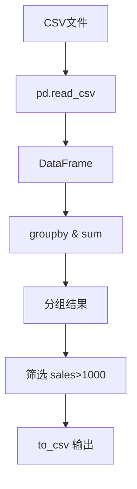
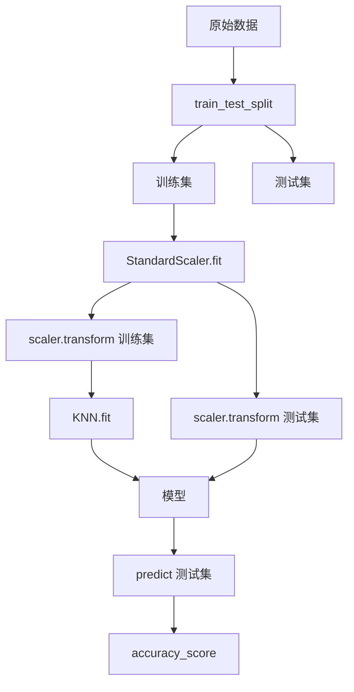
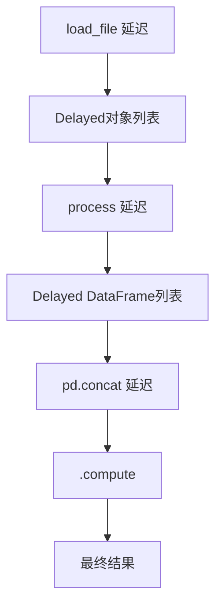

# 《Python数据科学速查手册》章节总结

## 书籍信息

- **书名**：Python数据科学速查手册（Python For Data Science Cheat Sheet 合集）
- **作者**：DataCamp（www.datacamp.com）
- **PDF状态**：基于多张PNG/JPG图片文件，内容通过OCR提取。整体识别度较高，少量格式错乱已按逻辑修正。
- **OCR状态**：已完成文本提取，核心代码片段和说明基本完整。

## 目录说明

本手册由18个独立速查表组成，按以下顺序整理为16个章节（原文件编号缺3、8，但主题连续）：

1. Python基础
2. Pandas基础
3. NumPy基础
4. Matplotlib基础
5. Seaborn基础
6. Bokeh基础
7. scikit-learn基础
8. Keras基础
9. Jupyter基础
10. 数据IO
11. SQL基础
12. Dask基础
13. Dask进阶
14. PySpark基础（SQL）
15. PySpark进阶（RDD）
16. 可视化基础（综合）

## 全书核心主题

本手册是一套面向数据科学家的Python工具速查指南，覆盖从基础语法到高级分布式计算的全栈能力。每个章节以极简的代码示例和参数说明，帮助用户快速回忆常用函数、数据操作、可视化方法和机器学习流程。核心主题包括：Python语法与数据结构、NumPy数组计算、Pandas数据清洗与转换、Matplotlib/Seaborn/Bokeh绘图、scikit-learn建模、Keras深度学习、Jupyter交互环境、多种数据源导入、SQL查询、Dask并行计算、PySpark大数据处理。整体结构清晰，适合作为日常开发的快速参考。

---

## 第1章：Python基础

### 核心论点

本章解决“Python入门数据科学需要掌握哪些最小语法集”的问题。作者观点：掌握变量、基本数据类型、字符串、列表操作以及NumPy数组的简单使用，即可快速进入数据科学实践。

### 关键概念

- **变量与类型**：整数、浮点、字符串、布尔值；类型转换函数`int()`, `float()`, `str()`, `bool()`
- **列表**：可变序列，支持索引、切片、追加、删除、排序等方法
- **NumPy数组**：同质多维数组，支持向量化运算和聚合函数
- **库导入规范**：`import numpy as np`，`from math import pi`

### 逻辑推演

本章从最简单的变量赋值开始，逐步引入算术运算和类型转换。然后介绍字符串的基本操作（重复、拼接、成员检查）。接着重点讲解列表：创建、索引（正负）、切片（`[start:end]`）、嵌套列表取值。列表方法如`index()`, `count()`, `append()`, `remove()`, `reverse()`, `sort()`等一一列出。最后过渡到NumPy数组，强调其与列表的区别（同质、向量化），并给出数组形状、切片、基本运算和统计函数。整体遵循“由易到难、从内置类型到扩展库”的教学逻辑。

### 经典金句/代码片段

```python
x=5
x**2  # 25
my_list = ['my', 'list', 'is', 'nice']
my_list[1:3]  # ['list', 'is']
import numpy as np
my_array = np.array([1,2,3])
my_array.mean()
```

---

## 第2章：Pandas基础

### 核心论点

本章解决“如何用Pandas处理表格型数据”的问题。作者观点：Series（一维标记数组）和DataFrame（二维标记数据结构）是核心，掌握选择、排序、布尔索引、缺失值处理、函数应用和文件读写即可覆盖大部分数据清洗任务。

### 关键概念

- **Series**：带索引的一维数组，`s = pd.Series([3, -5, 7, 4], index=['a','b','c','d'])`
- **DataFrame**：二维表格，可由字典或外部文件创建
- **索引与选择**：`loc`按标签，`iloc`按位置，`at`/`iat`快速访问单值
- **布尔索引**：`df[df['Population'] > 1e7]`
- **内部数据对齐**：不同索引的Series运算会自动对齐，缺失值填入NaN

### 逻辑推演

本章先定义Series和DataFrame的创建方式。然后重点讲解数据选取：按位置（`iloc`）、按标签（`loc`）、单元素快速访问（`at`）。接着介绍排序（`sort_index`, `sort_values`）和排名（`rank`）。布尔索引和条件筛选通过`&`、`|`、`~`组合。设置值通过直接赋值。数据对齐部分展示不同索引相加时自动引入NaN，并通过`fill_value`参数填补。最后介绍apply函数映射、applymap逐元素映射，以及CSV/Excel的读写操作（`read_csv`, `to_csv`, `read_excel`, `to_excel`）。

### 经典金句/代码片段

```python
import pandas as pd
data = {'Country': ['Belgium', 'India'], 'Capital': ['Brussels', 'New Delhi']}
df = pd.DataFrame(data)
df.loc[[0], ['Country']]  # 'Belgium'
s = pd.Series([3, -5, 7, 4], index=['a','b','c','d'])
s[s > 2]  # a 3, c 7, d 4
df.to_csv('out.csv')
```

---

## 第3章：NumPy基础

### 核心论点

本章解决“如何用NumPy进行高效数组计算”的问题。作者观点：NumPy提供ndarray对象，支持向量化运算、广播、各种数学函数和线性代数操作，是科学计算的基础。

### 关键概念

- **ndarray**：N维数组对象，同质数据，创建方式包括`array()`, `zeros()`, `ones()`, `arange()`, `random.random()`
- **轴（axis）**：0轴为行（垂直），1轴为列（水平），高维数组类推
- **向量化运算**：数组与标量或数组之间逐元素运算，无需显式循环
- **聚合函数**：`sum()`, `min()`, `max()`, `mean()`, `std()`, `cumsum()`，可指定axis
- **切片与花式索引**：`a[0:2]`, `b[[1,0,1,0],[0,1,2,0]]`

### 逻辑推演

本章首先说明NumPy的导入惯例和数组的维度概念（轴）。然后展示如何从列表创建1D、2D、3D数组，以及使用占位函数初始化全零、全一、等差数组。接着讲解数组属性查看（shape, ndim, dtype, size）。数组数学部分包括四则运算（`np.add`, `np.subtract`等）、比较运算、三角函数、对数等。聚合函数按轴计算。数组操作包括复制（view/copy）、排序、转置（T）、形状改变（ravel, resize）。组合数组（concatenate, vstack, hstack, column_stack, c_）和拆分（split）也被涵盖。最后强调向量化相对于Python循环的性能优势。

### 经典金句/代码片段

```python
import numpy as np
a = np.array([1,2,3])
b = np.array([[1.5,2,3],[4,5,6]])
a.shape          # (3,)
b.sum(axis=0)    # 按列求和
a[a < 2]         # array([1])
np.concatenate((a, np.array([10,15,20])))
```

---

## 第4章：Matplotlib基础

### 核心论点

本章解决“如何用Matplotlib绘制出版质量的图表”的问题。作者观点：任何绘图都基于Figure和Axes对象，通过subplot组织多子图，然后调用plot、scatter、hist等方法绘制1D数据，或imshow、contour绘制2D数据，最后通过颜色、标记、线型、图例、刻度等定制图形。

### 关键概念

- **Figure与Axes**：Figure是整个画布，Axes是实际绘图区域（子图）
- **subplot**：`fig.add_subplot(2,2,1)` 表示2行2列第1个子图
- **1D数据绘图**：`plot()`, `scatter()`, `bar()`, `barh()`, `hist()`, `boxplot()`, `violinplot()`
- **2D数据绘图**：`imshow()` 显示矩阵为图像，支持colormap
- **定制元素**：`set_xlabel`, `set_title`, `legend`, `xlim`, `ylim`, `spines`, `ticks`

### 逻辑推演

本章开始建议准备数据（如np.linspace生成x, y = cos(x)）。然后创建figure和subplot。绘制最常用的线图`ax.plot(x,y)`，随后介绍散点图、柱状图、水平柱状图、直方图等。对于图像数据，使用`imshow`配合cmap。定制部分包括：颜色（c='k'，alpha透明度），标记（marker='o'），线型（linestyle），图例位置（loc），坐标轴标签和标题，刻度标签设置。轴脊线(spines)可隐藏或移动。子图间距通过`subplots_adjust`调节。最后展示保存图片（savefig）和关闭/清除画布的方法。

### 经典金句/代码片段

```python
import matplotlib.pyplot as plt
import numpy as np
x = np.linspace(0, 10, 100)
y = np.cos(x)
fig, ax = plt.subplots()
ax.plot(x, y, label='cos')
ax.set_xlabel('x')
ax.set_ylabel('y')
ax.legend()
plt.savefig('plot.png')
plt.show()
```

---

## 第5章：Seaborn基础

### 核心论点

本章解决“如何用Seaborn快速绘制统计图形”的问题。作者观点：Seaborn基于Matplotlib，提供高层接口和美观的默认样式，尤其适合探索性数据分析（EDA），可轻松绘制分布图、分类图、回归图、热力图等。

### 关键概念

- **内置数据集**：`tips`, `titanic`, `iris`
- **风格设置**：`sns.set_style("whitegrid")`, `sns.set_context("talk")`
- **调色板**：`sns.color_palette("husl", 3)`, 自定义颜色列表
- **统计绘图函数**：`lmplot`（线性回归图）, `hist`（直方图）, `boxplot`, `violinplot`
- **图形对象**：`sns.lmplot`返回FacetGrid，可继续链式设置坐标轴标签、范围等

### 逻辑推演

本章首先给出Seaborn的典型工作流：准备数据 → 控制图形美学 → 绘图 → 进一步定制。使用`sns.load_dataset`加载示例数据。设置样式（whitegrid, ticks）和上下文（paper, notebook, talk, poster）来调节绘图元素大小。调色板可统一图形颜色方案。绘图函数例如`lmplot`可同时展示散点和回归线，并通过`col`/`row`参数分面。此外，使用`plt.subplots`结合Seaborn绘图可以获得更多控制权。最后展示如何显示和保存图片。

### 经典金句/代码片段

```python
import seaborn as sns
import matplotlib.pyplot as plt
tips = sns.load_dataset("tips")
sns.set_style("whitegrid")
g = sns.lmplot(x="total_bill", y="tip", data=tips, aspect=2)
g.set_axis_labels("Total Bill (USD)", "Tip")
plt.title("Tips Dataset")
plt.show()
```

---

## 第6章：Bokeh基础

### 核心论点

本章解决“如何用Bokeh创建交互式Web可视化”的问题。作者观点：Bokeh以数据（列表、NumPy、Pandas）和图形（glyphs）为核心，可以生成基于HTML/JavaScript的交互图表，支持缩放、平移、框选等工具，并可通过布局组件构建仪表板。

### 关键概念

- **Glyph**：图形的基本视觉元素（线、圆、方形等）
- **ColumnDataSource**：Bokeh内部的数据容器，可从Pandas DataFrame转换
- **工具（Tools）**：`pan`, `box_zoom`, `box_select`, `hover`等
- **布局**：`row`, `column`, `gridplot`, `Tabs` 组织多个图形
- **输出**：`output_file`生成独立HTML，`export_png`/`export_svgs`导出静态图

### 逻辑推演

本章给出Bokeh的标准流程：准备数据（Python列表或NumPy数组）→ 创建figure → 添加glyph（如`p.line(x, y)`）→ 指定输出（`output_file`）→ 显示（`show`）。进一步，可以手动构建ColumnDataSource以利用更高级功能（如颜色映射、选择行为）。定制glyph包括`nonselection_alpha`控制未选中对象的透明度，`HoverTool`添加悬浮信息。颜色映射使用`CategoricalColorMapper`对分类变量赋值颜色。布局方面，可将多个图形放入行、列或网格，甚至使用`Tabs`创建标签页。最后讲解如何输出到Notebook、独立HTML或导出PNG/SVG。

### 经典金句/代码片段

```python
from bokeh.plotting import figure, output_file, show
x = [1,2,3,4,5]
y = [6,7,2,4,5]
p = figure(title="Simple line")
p.line(x, y, line_width=2)
output_file("lines.html")
show(p)
```

---

## 第7章：scikit-learn基础

### 核心论点

本章解决“如何用scikit-learn完成机器学习全流程”的问题。作者观点：统一API使得加载数据、预处理、模型训练、预测和评估变得标准化。核心步骤：数据转为数值数组 → 划分训练/测试集 → 标准化/归一化 → 选择监督或无监督模型 → 拟合 → 预测 → 评估 → 超参数调优（网格搜索/随机搜索）。

### 关键概念

- **监督学习估计器**：LinearRegression, SVC, KNeighborsClassifier, GaussianNB
- **无监督学习估计器**：PCA, KMeans
- **预处理**：StandardScaler（标准化）, Normalizer（归一化）, Binarizer（二值化）
- **模型选择**：train_test_split, GridSearchCV, RandomizedSearchCV
- **评估指标**：accuracy_score, 以及分类/回归各指标

### 逻辑推演

本章以一个完整例子开始：加载iris数据集，划分训练测试集，标准化，训练KNN，预测并评估准确率。随后分模块详述：数据要求（数值型，可用Pandas）；预处理（标准化、归一化、二值化）；监督学习估计器的创建与拟合；无监督估计器的降维和聚类；预测方法（predict, predict_proba, predict_log_proba）；超参数调优中，GridSearchCV对所有参数组合穷举，RandomizedSearchCV随机采样。最后提及模型持久化（未在截图中，但可延伸）。

### 经典金句/代码片段

```python
from sklearn import datasets, neighbors, preprocessing
from sklearn.model_selection import train_test_split
X, y = datasets.load_iris(return_X_y=True)
X_train, X_test, y_train, y_test = train_test_split(X, y, random_state=33)
scaler = preprocessing.StandardScaler().fit(X_train)
X_train = scaler.transform(X_train)
knn = neighbors.KNeighborsClassifier(n_neighbors=5)
knn.fit(X_train, y_train)
y_pred = knn.predict(X_test)
print(accuracy_score(y_test, y_pred))
```

---

## 第8章：Keras基础

### 核心论点

本章解决“如何用Keras快速搭建和训练深度学习模型”的问题。作者观点：Keras提供高层API，通过Sequential模型堆叠层（Dense, Conv2D, LSTM等），编译时指定优化器、损失函数和指标，训练时使用fit，评估用evaluate，预测用predict。支持保存与加载模型、回调函数（如EarlyStopping）。

### 关键概念

- **Sequential模型**：线性堆叠的层容器
- **层类型**：Dense（全连接）, Conv2D（卷积）, MaxPooling2D, Flatten, LSTM, Dropout
- **编译参数**：optimizer（adam, rmsprop）, loss（binary_crossentropy, categorical_crossentropy, mse）, metrics
- **训练**：`fit(x_train, y_train, batch_size, epochs, validation_data)`
- **回调**：EarlyStopping（基于验证集提前停止）

### 逻辑推演

本章从导入Keras开始，然后生成随机数据作为演示。构建Sequential模型，添加Dense层（指定input_dim或input_shape），再添加输出层（sigmoid或softmax）。编译模型。对于多分类问题，损失函数使用categorical_crossentropy。对于CNN，添加Conv2D和MaxPooling2D，最后Flatten接Dense。对于RNN，使用LSTM层。训练后可使用evaluate获得损失和指标，predict得到输出概率。模型可以保存为HDF5文件，并通过load_model重新加载。调优参数包括优化器实例（如RMSProp带学习率衰减）和EarlyStopping回调。

### 经典金句/代码片段

```python
from keras.models import Sequential
from keras.layers import Dense
model = Sequential()
model.add(Dense(32, activation='relu', input_dim=100))
model.add(Dense(1, activation='sigmoid'))
model.compile(optimizer='rmsprop', loss='binary_crossentropy', metrics=['accuracy'])
model.fit(data, labels, epochs=10, batch_size=32)
```

---

## 第9章：Jupyter基础

### 核心论点

本章解决“如何使用Jupyter Notebook进行交互式计算和文档编写”的问题。作者观点：Jupyter将代码、文本、可视化整合在一个文档中，支持多种内核（Python, R, Julia），提供命令模式和编辑模式两种交互方式，以及丰富的快捷键和小部件（widgets），方便创建可重现的数据分析报告。

### 关键概念

- **单元格类型**：Code（代码）, Markdown（文本/公式）, Raw NBConvert（原始输出）
- **命令模式与编辑模式**：命令模式（蓝色边框）用于操作单元格（上下移动、删除、复制等），编辑模式（绿色边框）用于编辑内容
- **内核操作**：重启、中断、切换内核、运行所有单元格
- **小部件（Widgets）**：交互式控件（滑块、文本框），可绑定Python函数
- **导出格式**：.ipynb, .py, .html, .md, .pdf等

### 逻辑推演

本章以Jupyter Notebook界面截图形式展示了菜单和工具栏功能。首先介绍保存/加载笔记本（文件菜单）。然后说明如何添加新单元格（Insert），剪切/粘贴/删除/合并单元格（Edit）。View菜单可切换行号、工具栏等。Cell菜单运行方式多样（运行选中、运行并插入下方等）。Kernel菜单用于重启、中断或切换内核。Widgets菜单可以保存小部件状态。最后列出帮助菜单（用户界面导览、快捷键编辑、各种库的帮助主题）。通过这些功能，用户可以将数据分析流程文档化、可复现。

### 经典金句/代码片段

> 快捷方式：`Shift+Enter` 运行当前单元格，`Esc` 进入命令模式，`Enter` 进入编辑模式，`A/B` 在上/下方插入单元格，`DD` 删除单元格。

---

## 第10章：数据IO

### 核心论点

本章解决“如何从各种数据源导入数据到Python”的问题。作者观点：根据文件格式选择合适的库——文本文件用内建open或with上下文管理器；表格数据（CSV, TXT）用NumPy的loadtxt/genfromtxt或Pandas的read_csv；关系数据库用SQLAlchemy引擎执行SQL查询；其他格式（MATLAB, HDF5等）有相应函数。

### 关键概念

- **文本文件**：`open(filename, mode='r')`, `file.readlines()`, 推荐使用`with`自动关闭
- **扁平文件**：`np.loadtxt`（同质类型）, `np.genfromtxt`（混合类型，可指定names=True）
- **关系数据库**：创建`engine`连接，`execute`执行SQL，将结果转为DataFrame
- **Pandas便捷方法**：`pd.read_sql_query(sql, engine)`
- **其他数据源**：MATLAB .mat文件使用`scipy.io.loadmat`

### 逻辑推演

本章从最基础的文本文件读取开始，演示手动打开、读取行、关闭，以及使用上下文管理器自动释放资源。然后介绍NumPy的loadtxt用于数值型CSV（可指定分隔符、跳行、使用列）。对于含缺失值或混合类型的数据，使用genfromtxt。Pandas的read_csv更加灵活，直接返回DataFrame。数据库部分：使用SQLAlchemy创建连接，然后通过连接执行SQL，将游标结果转为DataFrame，或者直接用`pd.read_sql_query`一步完成。最后展示查看MATLAB文件结构（`mat.keys()`）和访问变量。此外，提示可以使用操作系统命令（ls, cd, pwd）导航文件系统。

### 经典金句/代码片段

```python
import numpy as np
data = np.loadtxt('data.csv', delimiter=',', skiprows=1)
import pandas as pd
df = pd.read_csv('titanic.csv')
from sqlalchemy import create_engine
engine = create_engine('sqlite:///mydb.db')
df = pd.read_sql_query('SELECT * FROM Orders', engine)
```

---

## 第11章：SQL基础

### 核心论点

本章解决“如何用SQL进行关系数据库查询与操作”的问题。作者观点：SQL是数据科学的必备技能，掌握SELECT、WHERE、GROUP BY、HAVING、ORDER BY，以及JOIN、子查询、视图、索引，即可完成大部分数据提取和聚合任务。

### 关键概念

- **查询基础**：`SELECT col1, col2 FROM table WHERE condition GROUP BY col HAVING agg_condition ORDER BY col`
- **关键词**：DISTINCT, BETWEEN, LIKE, IN
- **数据修改**：UPDATE, INSERT INTO ... VALUES / SELECT
- **连接（JOIN）**：LEFT JOIN, INNER JOIN, RIGHT JOIN
- **集合操作**：UNION, EXCEPT, INTERSECT
- **索引**：`CREATE INDEX idx ON table(col)`

### 逻辑推演

本章按SQL语句的逻辑顺序呈现：先SELECT指定列，FROM表，WHERE过滤行，GROUP BY分组，HAVING过滤分组，ORDER BY排序。然后给出DISTINCT, BETWEEN, LIKE, IN等辅助关键字。数据修改部分包括UPDATE（可带JOIN更新）和INSERT（手动值或查询结果）。视图（VIEW）作为虚拟表简化复杂查询。JOIN部分明确三种外连接和INNER JOIN的区别。子查询可以实现半连接（SEMI JOIN）——使用IN而非JOIN。索引能加速查询，但需避免过多列和重叠索引。最后介绍聚合函数（COUNT, SUM, AVG, MIN/MAX）和实用函数（TO_DATE, COALESCE, CURRENT_TIMESTAMP）。

### 经典金句/代码片段

```sql
SELECT col1, col2
FROM table1
WHERE col4 = 1 AND col5 = 2
GROUP BY col1
HAVING COUNT(*) > 1
ORDER BY col2;

LEFT JOIN table2 ON table1.id = table2.t1_id;

CREATE INDEX idx_name ON table1 (col1);
```

---

## 第12章：Dask基础

### 核心论点

本章解决“如何利用Dask在单机或集群上处理超大数据集（超出内存）”的问题。作者观点：Dask提供三个核心集合——DataFrame（类Pandas）、Array（类NumPy）、Bag（类Python列表），它们通过分块和惰性计算实现并行处理，语法与Pandas/NumPy相似，只需在末尾调用`.compute()`执行。

### 关键概念

- **Dask DataFrame**：`dd.read_csv('*.csv')` 读取多个文件，支持Pandas风格的groupby、join、filter
- **Dask Array**：`da.from_array(h5py_dataset, chunks=(1000,1000))`，支持NumPy风格的切片和数学运算
- **Dask Bag**：`db.read_text('*.json').map(json.loads).filter(...)` 处理半结构化或非结构化数据
- **惰性计算**：操作构建任务图，`.compute()`触发并行执行
- **持久化**：`.persist()`将数据保留在内存中以供多次使用

### 逻辑推演

本章首先给出安装指令（conda或pip）。然后分三个集合逐一介绍。Dask DataFrame：通过`read_csv`读取多个文件（支持通配符），之后操作（列运算、groupby、join）与Pandas几乎一样，最后`.compute()`返回Pandas DataFrame或直接`.to_parquet`保存。Dask Array：从HDF5或其他分块格式创建，然后执行矩阵乘法、均值等操作，结果计算为NumPy数组或保存。Dask Bag：适合日志、JSON等非结构化数据，支持map、filter、pluck等函数式操作，可转为文本文件输出。所有集合都支持从云端存储（s3://, hdfs://）读取。

### 经典金句/代码片段

```python
import dask.dataframe as dd
df = dd.read_csv('data.*.csv')
result = df.groupby('id').value.mean().compute()
import dask.array as da
x = da.random.uniform(shape=(10000,10000), chunks=(1000,1000))
y = x.dot(x.T)
result = y.compute()
```

---

## 第13章：Dask进阶

### 核心论点

本章解决“如何使用Dask Delayed自定义并行计算以及搭建分布式集群”的问题。作者观点：对于不能用DataFrame/Array/Bag表示的复杂工作流，使用`dask.delayed`装饰器将普通函数转为惰性任务，自动构建依赖图并并行执行；同时，通过`dask.distributed` Client可以连接本地或云集群，实现弹性扩展。

### 关键概念

- **dask.delayed**：将函数调用封装为惰性任务，返回Delayed对象，可传递依赖
- **分布式Client**：`from dask.distributed import Client`，`client = Client()` 启动本地调度器
- **Future**：`client.submit(func, *args)` 异步提交任务，`.result()`阻塞获取结果
- **集群搭建**：手动启动`scheduler`和`worker`，或使用dask-kubernetes/dask-ec2在云上部署
- **计算优化**：`dask.compute(x, y)`同时计算多个结果

### 逻辑推演

本章首先展示`dask.delayed`用法：用`@dask.delayed`装饰`load`和`process`函数，调用时返回延迟对象，构建任务图，最后`dask.compute(results)`并行执行。同时，`dask.distributed`模块提供了更强大的任务调度器。创建`Client`可立即获得一个本地集群。`client.submit`提交单个任务返回Future，`as_completed`处理流式结果。对于大规模部署，可手动在机器上运行`dask-scheduler`和`dask-worker`命令，然后在Python中`Client('scheduler:8786')`连接。云部署方面，提供了dask-kubernetes和dask-ec2项目。最后列出更多资源（官方文档、分布式调度器文档、GitHub问题追踪）。

### 经典金句/代码片段

```python
import dask
@dask.delayed
def load(fn): ...
@dask.delayed
def process(data): ...
data = [load(fn) for fn in filenames]
results = [process(d) for d in data]
output = dask.compute(results)

from dask.distributed import Client
client = Client()
future = client.submit(func, arg)
result = future.result()
```

---

## 第14章：PySpark基础（SQL）

### 核心论点

本章解决“如何在PySpark中使用Spark SQL处理结构化数据”的问题。作者观点：SparkSession是入口，可以创建DataFrame（从RDD或数据源），注册为临时视图，然后使用SQL查询或DataFrame API进行筛选、分组、连接等操作。相比Pandas，Spark DataFrame适用于分布式大数据场景。

### 关键概念

- **SparkSession**：Spark SQL的入口，通过`builder`创建
- **创建DataFrame**：从RDD（指定或不指定Schema），或从JSON/Parquet/TXT文件读取
- **DataFrame操作**：`select`, `filter`, `groupBy`, `orderBy`, `withColumn`, `drop`
- **SQL查询**：`df.createTempView("name")`，然后`spark.sql("SELECT ...")`
- **输出**：转为RDD、JSON字符串、Pandas DataFrame，或保存为Parquet/JSON文件

### 逻辑推演

本章从初始化SparkSession开始。创建DataFrame的方法：从现有RDD通过Row对象推断Schema，或通过StructType显式定义Schema；也可以直接读取JSON（`spark.read.json`）、Parquet（`spark.read.load`）、文本文件（`spark.read.text`）。接着展示DataFrame的常用操作：`select`选择列，`withColumn`添加新列，`drop`删除列，`filter`条件过滤，`groupBy`聚合，`sort`/`orderBy`排序，`na`处理缺失值，`repartition`/`coalesce`调整分区数。还提供了类似Pandas的方法如`like`, `startswith`, `substr`, `between`等。注册临时视图后，可以使用原生SQL查询。最后输出数据：`df.toPandas()`转Pandas，`df.write.save`存储文件。

### 经典金句/代码片段

```python
from pyspark.sql import SparkSession
spark = SparkSession.builder.appName("example").getOrCreate()
df = spark.read.json("customer.json")
df.createTempView("customer")
result = spark.sql("SELECT firstName, age FROM customer WHERE age > 24")
result.show()
df.select("firstName", df.age + 1).show()
```

---

## 第15章：PySpark进阶（RDD）

### 核心论点

本章解决“如何使用PySpark的低级RDD API进行弹性分布式数据集操作”的问题。作者观点：RDD是Spark的核心数据抽象，提供细粒度的转换（transformation）和动作（action）操作，适合无法用DataFrame表达的处理逻辑，或需要手动控制分区的场景。

### 关键概念

- **SparkContext**：RDD API的入口，`sc = SparkContext(master='local[2]')`
- **创建RDD**：`sc.parallelize(collection)` 并行化本地集合，`sc.textFile('path/*.txt')` 读取外部文件
- **转换操作**：`map`, `filter`, `flatMap`, `distinct`, `groupByKey`, `reduceByKey`, `join`
- **动作操作**：`collect`, `take`, `first`, `count`, `reduce`, `saveAsTextFile`
- **键值对RDD**：`countByKey`, `collectAsMap`, `keys`, `values`

### 逻辑推演

本章先介绍如何初始化SparkContext（包括设置master和应用名）。在PySpark shell中，`sc`已经预定义。配置SparkConf可以自定义executor内存等。加载数据可通过并行化本地列表或读取外部文本文件。获取RDD基本信息：分区数、计数、按key/value计数等。应用函数：`map`, `mapValues`将值映射，`flatMap`压平。数据选取：`collect`返回全部（谨慎），`take(n)`取前n个，`first`第一个，`top`排序取前n，`sample`采样。过滤：`filter`保留满足条件的元素，`distinct`去重。迭代：`foreach`应用函数到每个元素。最后展示一些统计函数：`max`, `min`, `mean`, `variance`, `histogram`, `stats`。

### 经典金句/代码片段

```python
from pyspark import SparkContext
sc = SparkContext(master='local[2]')
rdd = sc.parallelize([('a',7), ('a',2), ('b',2)])
rdd.countByKey()  # {'a':2, 'b':1}
rdd.map(lambda x: (x[0], x[1]+1)).collect()
rdd.filter(lambda x: 'a' in x).collect()
textFile = sc.textFile("/my/*.txt")
words = textFile.flatMap(lambda line: line.split())
```

---

## 第16章：可视化基础（综合）

### 核心论点

本章解决“如何用Python进行数据可视化并选择合适的图表类型”的问题。作者观点：Matplotlib是基础，Seaborn提供统计图表高级接口。根据数据特点选择图表：直方图展示分布，箱线图/小提琴图展示统计摘要，条形图比较类别，饼图展示比例，散点图/气泡图展示关系，堆叠柱状图展示部分与整体。

### 关键概念

- **直方图**：`plt.hist(df['Age'], bins=7)` 展示连续变量分布
- **箱线图**：`sns.boxplot(x='Gender', y='Sales', data=df)` 展示中位数、四分位数、异常值
- **小提琴图**：`sns.violinplot(df['Age'], df['Gender'])` 结合箱线图和核密度估计
- **条形图/堆叠柱状图**：`df.groupby('Gender').Sales.sum().plot(kind='bar')` 以及`unstack().plot(kind='bar', stacked=True)`
- **气泡图**：`plt.scatter(df['Age'], df['Sales'], s=df['Income'])` 用点大小表示第三维

### 逻辑推演

本章以一个示例数据集（含EMPID, Gender, Age, Sales, BMI, Income）演示各种图表的绘制步骤。首先导入matplotlib、pandas，读取Excel数据。然后：直方图展示年龄分布，设置标题和轴标签。散点图展示年龄与性别（虽然性别分类型不合适，但代码演示）。小提琴图展示年龄按性别的分布。条形图汇总各性别的销售额总和。堆叠柱状图进一步细分不同BMI下的销售额。饼图用于比例（示例代码不完整）。气泡图用年龄、销售额为x,y，收入为气泡大小。所有图表都通过`plt.show()`显示。此外，还提到使用Seaborn的`despine`去除边框。

### 经典金句/代码片段

```python
import matplotlib.pyplot as plt
import pandas as pd
df = pd.read_excel("First.xlsx", "Sheet1")
# 直方图
plt.hist(df['Age'], bins=7)
plt.title('Age distribution')
plt.xlabel('Age')
plt.ylabel('#Employee')
plt.show()
# 堆叠柱状图
df.groupby(['Gender','BMI']).Sales.sum().unstack().plot(kind='bar', stacked=True)
# 气泡图
plt.scatter(df['Age'], df['Sales'], s=df['Income'])
plt.show()
```

---

# 代码模板汇总

本章节汇总从各速查表中提炼的典型“指令模板”（Prompt / 代码模式），每个模板包含使用场景、原始代码、结构拆解和结构图。

## 模板1：Pandas数据清洗与分组聚合

### 使用场景
从CSV文件读取销售数据，按类别分组计算总销售额，并筛选出总销售额大于阈值的类别。

### 原始代码
```python
import pandas as pd
df = pd.read_csv('sales.csv')
grouped = df.groupby('category')['sales'].sum().reset_index()
result = grouped[grouped['sales'] > 1000]
result.to_csv('summary.csv', index=False)
```

### 结构拆解
- **导入**：pandas as pd
- **读取**：pd.read_csv
- **分组聚合**：groupby + sum + reset_index
- **筛选**：布尔索引
- **输出**：to_csv

### 结构图


## 模板2：scikit-learn机器学习流水线

### 使用场景
对鸢尾花数据集进行分类，包含数据标准化、KNN训练和评估。

### 原始代码
```python
from sklearn.datasets import load_iris
from sklearn.model_selection import train_test_split
from sklearn.preprocessing import StandardScaler
from sklearn.neighbors import KNeighborsClassifier
from sklearn.metrics import accuracy_score

X, y = load_iris(return_X_y=True)
X_train, X_test, y_train, y_test = train_test_split(X, y, random_state=42)
scaler = StandardScaler().fit(X_train)
X_train_scaled = scaler.transform(X_train)
X_test_scaled = scaler.transform(X_test)
knn = KNeighborsClassifier(n_neighbors=3)
knn.fit(X_train_scaled, y_train)
y_pred = knn.predict(X_test_scaled)
print(accuracy_score(y_test, y_pred))
```

### 结构拆解
- **数据加载**：load_iris
- **划分**：train_test_split
- **标准化**：StandardScaler (fit + transform)
- **分类器**：KNeighborsClassifier (fit)
- **预测与评估**：predict + accuracy_score

### 结构图


## 模板3：NumPy数组向量化计算

### 使用场景
快速生成随机矩阵并计算其行均值和标准差。

### 原始代码
```python
import numpy as np
data = np.random.randn(1000, 50)
row_means = data.mean(axis=1)
row_stds = data.std(axis=1)
normalized = (data - row_means[:, np.newaxis]) / row_stds[:, np.newaxis]
```

### 结构拆解
- **生成随机数组**：np.random.randn
- **轴聚合**：mean(axis=1), std(axis=1)
- **广播运算**：利用np.newaxis对齐维度

### 结构图
```mermaid
graph TD
    A[randn 1000x50] --> B[mean axis=1]
    A --> C[std axis=1]
    B --> D[1000x1]
    C --> E[1000x1]
    A --> F[广播: (A - D) / E]
    F --> G[标准化数组 1000x50]
```

## 模板4：Matplotlib多子图定制

### 使用场景
在一个画布上绘制四个子图：线图、散点图、柱状图、直方图，并添加图例和标题。

### 原始代码
```python
import matplotlib.pyplot as plt
import numpy as np
x = np.linspace(0, 10, 50)
y1 = np.sin(x)
y2 = np.random.randn(50)
fig, axes = plt.subplots(2, 2, figsize=(8,6))
axes[0,0].plot(x, y1, label='sin')
axes[0,0].legend()
axes[0,1].scatter(x, y2, c='red')
axes[1,0].bar(x[:5], y2[:5])
axes[1,1].hist(y2, bins=10)
plt.suptitle('Four Plots')
plt.tight_layout()
plt.savefig('subplots.png')
```

### 结构拆解
- **创建画布和子图**：plt.subplots(2,2)
- **索引子图**：axes[row, col]
- **绘图类型**：plot, scatter, bar, hist
- **添加图例和标题**：legend, suptitle
- **自动布局**：tight_layout
- **保存**：savefig

### 结构图
```mermaid
graph TD
    A[plt.subplots 2x2] --> B[axes[0,0] 线图]
    A --> C[axes[0,1] 散点图]
    A --> D[axes[1,0] 柱状图]
    A --> E[axes[1,1] 直方图]
    B --> F[图例]
    A --> G[suptitle]
    G --> H[tight_layout]
    H --> I[savefig]
```

## 模板5：Dask Delayed自定义并行任务

### 使用场景
并行处理多个文件：加载、处理、汇总，最后合并结果。

### 原始代码
```python
import dask
@dask.delayed
def load_file(fn):
    return pd.read_csv(fn)
@dask.delayed
def process(df):
    return df.groupby('id').value.mean()
futures = [load_file(f'data{i}.csv') for i in range(10)]
processed = [process(f) for f in futures]
total = dask.delayed(pd.concat)(processed)
result = total.compute()
```

### 结构拆解
- **装饰器**：@dask.delayed 使函数惰性
- **创建延迟任务**：调用函数得到Delayed对象
- **构建依赖图**：列表推导式
- **最终聚合**：pd.concat 同样被延迟包装
- **执行**：.compute()

### 结构图


---

本总结基于DataCamp提供的18个Python数据科学速查表整理而成，保留了原始工具的使用逻辑和核心代码，并增加了结构化的流程图和代码模板，便于知识库检索和实际开发参考。