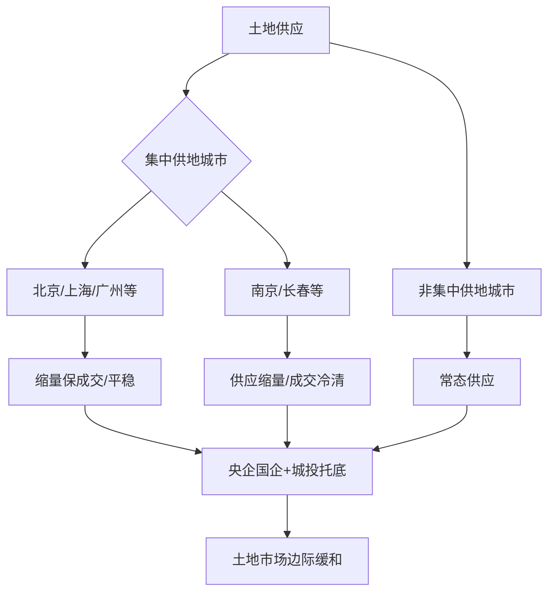
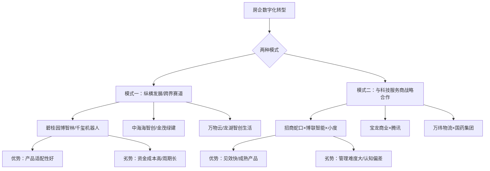
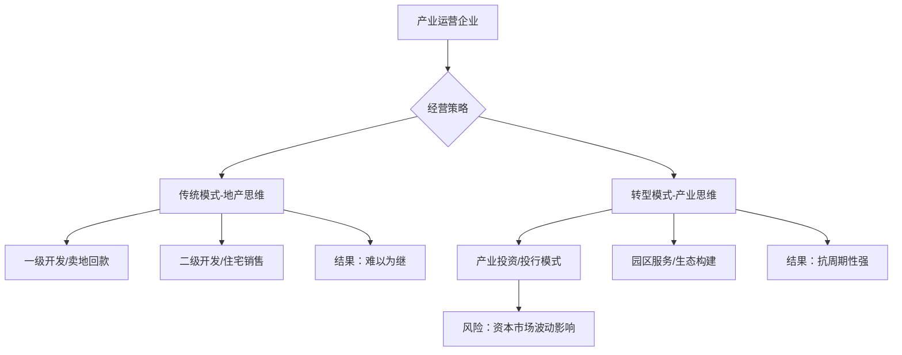
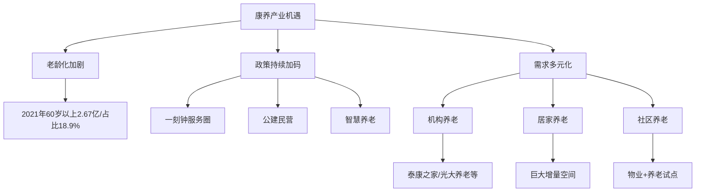
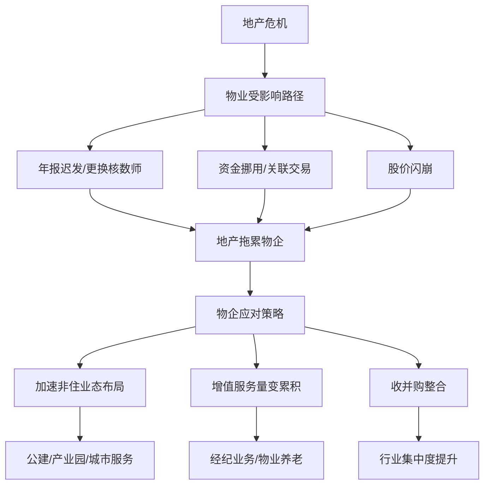
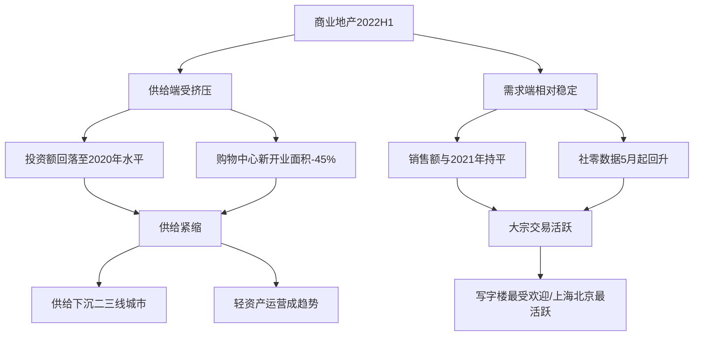

# 《2022中国房地产行业发展白皮书》章节总结

## 书籍信息

- **书名**：《2022中国房地产行业发展白皮书：暨影响力指数·2022年度地产风尚企业表现报告》
- **作者**：观点指数研究院
- **PDF状态**：完整，共计108页
- **OCR状态**：可识别，部分图表文字识别存在一定偏差

## 目录说明

本书按照房地产行业的不同业态和专题进行划分，共包含以下主要章节：

1. 市场篇（销售回顾、土地市场观察）
2. 资本篇（地产金融、地产基金）
3. ESG与数字化篇（ESG发展、数字化发展）
4. 产业物流篇（产业运营、物流资产投资运营）
5. 创新发展篇（康养、文旅、办公空间服务、住房租赁）
6. 物业服务篇
7. 商业篇

**说明**：该PDF部分图表文字识别存在一定模糊，以下内容基于可见文本整理，图表数据已尽量还原。

---

## 全书核心主题

本书是观点指数研究院对2022年上半年中国房地产行业发展状况的全面研究报告。报告指出，2022年上半年房地产市场经历了严峻挑战：销售大幅下滑、房企债务违约频发、土地市场持续低迷。在“房住不炒”总基调下，中央和地方政府密集出台调控纠偏和“救市”政策。

报告的核心判断是：房地产行业正从高速扩张转向高质量发展，住宅业务之外，物业、物流、产业、康养等多元化赛道迎来新机遇。企业需要从“规模导向”转向“精耕细作”，在偿债中求生存，在多元化中谋发展。

---

## 市场篇

### 销售回顾：触底与回暖

#### 核心论点

本章主要回顾2022年上半年房地产市场销售情况。作者认为，6月房地产市场迎来半年业绩冲刺期，销售出现环比大幅回暖，但同比仍处于深度下跌区间，“触底回暖”是上半年销售的核心特征。

#### 关键事件/数据

- **6月销售复苏**：前100房企6月实现权益总销售金额5864亿元，环比增加**50.4%**，同比下降44.4%。
- **上半年累计**：1-6月前100房企累计实现权益总销售金额24448亿元，同比下降**52.2%**。
- **千亿房企锐减**：权益销售金额突破1000亿的房企仅4家，比去年减少8家。
- **头部企业表现**：碧桂园1851亿（-38.9%）、保利发展1411.9亿（-31.2%）、万科1399.4亿（-39.3%）。
- **唯一正增长**：越秀地产成为前20房企中唯一同比上升的企业（+5.6%）。

#### 逻辑推演

报告首先从6月单月数据入手，指出环比大幅改善（+50.4%）是半年业绩冲刺和疫情缓和共同作用的结果。随后，报告通过同比数据揭示行业仍处于深度调整期——上半年整体降幅超过50%。通过房企权益销售区间分布对比，报告进一步说明：中小房企受冲击更大，百亿以下企业从去年同期的1家激增至36家。最后，报告通过前20房企详细变动表，展示各梯队企业的分化情况。

#### 经典金句/数据

> “6月前100房企实现权益总销售金额5864亿元，环比增加50.4%，同比下降44.4%。”(p.6)

> “1-6月，前100房企累计实现权益总销售金额24448亿元，同比下降52.2%，降幅较1-5月收窄2个百分点。”(p.6)

---

### 土地市场观察：边际缓和

#### 核心论点

本章主要分析2022年上半年土地市场走势。作者认为，土地市场成交量价齐跌，宅地成交降幅更为明显；22城首批集中供地呈现明显分化，部分城市“缩量保成交”，整体溢价率处于低位。

#### 关键事件/数据

- **宅地成交暴跌**：1-6月一二三线城市成交住宅用地建面22005万平方米，同比减少**57.6%**；成交总价11091亿元，同比下降57.7%。
- **22城首批供地**：挂牌471宗，成交396宗，成交建筑面积约3898万平方米，成交总价4961亿元，平均撤牌及流拍率约**15.9%**。
- **城市分化**：北京、广州、重庆等城市表现相对平稳；南京、长春等城市成交不理想。
- **拿地主力转变**：央企、国企和地方城投公司成为拿地主力军，民企拿地意愿和能力均较低。

#### 逻辑推演

报告首先用一二三线城市整体数据勾勒出土地市场“量价齐跌”的基本面。随后聚焦22城集中供地，指出挂牌数量普遍下降、供地批次增加（多地确认四批次）等新特征。报告进一步对比各城市成交情况，揭示“冷热不均”的结构性分化——一线和热点二线城市通过让利措施维持了市场温度，而库存高企城市则陷入冷清。最后，报告指出民营房企“以销定投”策略下拿地收缩，央企国企和城投“托底”成为普遍现象。

#### 经典金句/数据

> “2022年1-6月，一二三线城市成交住宅用地建面22005万平方米，同比减少57.6%，成交总价11091亿元，同比下降57.7%。”(p.7)

> “22个重点城市首批集中供地挂牌地块471宗，成交地块396宗，成交建筑面积约3898万平方米，成交总价4961亿元，平均撤牌及流拍率约15.9%。”(p.7)

#### 方法流程图

---

## 资本篇

### 地产金融：偿债中流

#### 核心论点

本章主要分析2022年上半年房地产融资形势。作者认为，行业融资规模维持低位，境内债和美元债市场均呈“净流出”状态，“展期”成为高频词；“保内不保外”或将成为常态，但这将导致行业失去海外市场议价权。

#### 关键概念/事件

- **融资缺口**：月均约80亿元的净融资流出（境内信用债），上半年融资总额约3670亿元，同比下降58.2%。
- **境内债“缺口”**：上半年发行规模约2530亿元，同比减少41.35%；融资成本下行至3.58%，但主因是民企丧失发债权而非环境优化。
- **美元债“腰斩”**：1-6月发行总额约167.8亿美元，同比下降约78%；下半年偿债高峰期（6-7月）集中到期压力巨大。
- **展期常态化**：2021至2022上半年，境内债券违约类型事件48起，“展期”类型数量和规模占比最高。
- **信用保护工具**：5月政策选定龙湖、碧桂园、美的、新城、旭辉为示范房企，增设信用保护工具（CDS/CRMW），但规模有限、需支付保费。

#### 逻辑推演

报告首先呈现融资总额同比腰斩的严峻形势，指出境内债和美元债均呈“净流出”。随后分别剖析两个市场：境内债方面，融资缺口持续存在，融资成本下降是“假象”——央企国企仍能低息发债，民企则被挤出市场；美元债方面，发行量创5年新低，下半年偿债高峰将至，“展期”成为唯一出路。报告进一步分析“展期”的代价——同意费、利率跳升等，指出这只是“以时间换空间”，长期压力并未缓解。最后，报告提出“保内不保外”的行业倾向，警示这将损害海外市场议价能力。

#### 经典金句/数据

> “2022年1-6月，观点指数61家样本房企融资总额约3670亿元，同比下降58.2%。”(p.22)

> “2022年上半年，房企发行信用债的平均利率为3.58%，较去年同期下降约0.6个百分点。行业融资成本下行是一个‘利好’消息，但是造成这一现状的原因并不是整体融资环境优化，而是许多民企‘丧失’了发债权。”(p.23)

> “在融资缺口环境下，‘保内不保外’或将成为常态，后果将致使整个行业失去海外市场的议价权。”(p.26)

---

### 地产基金：风口与重组

#### 核心论点

本章主要分析2022年上半年房地产基金市场动态。作者认为，在住宅开发投资增量不足、房企信用违约频发的背景下，地产私募股权基金将注意力转向硬科技、新经济以及特殊机会领域；信托基金因地产违约潮难以独善其身。

#### 关键概念/事件

- **样本基金规模萎缩**：优钛资管18只基金已注销（占比78.26%）；歌斐资产注销176家（20.16%）。
- **投资方向转移**：硬科技领域（信息科技、生物科技）成为重点；上半年5起重要投资事件中有4起涉及硬科技。
- **机会型不动产基金**：远洋资本联合发起6亿美元地产特殊机会基金，聚焦核心城市住宅开发项目；华平投资28亿美元基金关注物流、数据中心、产业园区等“新经济地产”。
- **信托暴雷**：五矿信托“鼎兴”系列、中融信托（涉及华夏幸福）、平安信托（涉及融侨、荣盛）均出现违约。
- **大宗交易活跃**：商办、物流仓储、数据中心是各大基金青睐的资产；长三角物流资产成为“香饽饽”。

#### 逻辑推演

报告首先从样本基金规模萎缩切入，指出行业整体收缩。随后分析投资方向变化——从传统住宅开发转向硬科技、新经济领域，并解释政策利好（深圳契约型私募基金商事登记试点）对科技投资的刺激。接着，报告聚焦机会型不动产基金和物流基金，指出它们正在“抄底”出险房企的优质项目。报告用较大篇幅分析信托暴雷问题，指出信托公司在房地产领域资产占比较高，难以从违约潮中独善其身。最后，报告梳理上半年大宗交易，揭示商办资产折价成交、物流资产备受追捧的趋势。

#### 经典金句/数据

> “2022年上半年，房地产基金注销的关联公司数量占比基本在20%左右，多则处60%-80%的范围。”(p.29)

> “2022年1-5月，房地产信托违约规模428.43亿元，占总违约规模的比例达到80.45%，房地产企业成为违约的重灾区。”(p.31)

> “物流资产是各大房地产基金眼中的香饽饽，特别是位于长三角的物流仓储资产。”(p.32)

---

## ESG与数字化篇

### ESG发展：潜力标尺

#### 核心论点

本章主要分析房地产行业ESG（环境、社会、公司治理）发展现状。作者认为，规模上市房企逐渐提高ESG信息披露重视程度，但存在“偏科”（重环境轻社会）、“金字塔型”分布（头部少数、尾部大量）、“投入与收益难以衡量”等问题。

#### 关键概念/事件

- **披露率提升**：样本企业中2020年发行ESG报告的占比超过70%，但2021年因年报延期导致数量未明显增长。
- **绿色债券**：2019-2021年样本企业绿债发行规模从52亿增至407亿；发行利率较普通债低约1.5%，但加计审查、认证费用后优势不明显。
- **“双碳”成核心议题**：超过68%房企公布绿色建筑面积与统计口径；产业园区、物流企业披露意愿更强。
- **“S”（社会）被忽视**：住宅客户满意度普遍低于90%，而写字楼客户满意度达98%-99%；投诉解决率也存在明显差距。
- **ESG评级分化**：MSCI评级中，远洋集团获A级最高，但行业中超过30%的企业未披露量化ESG评级。

#### 逻辑推演

报告首先通过披露数量变化展示ESG受重视程度提升的趋势。随后提出核心问题：ESG披露存在“偏科”——环境（E）披露质量明显强于社会（S）和治理（G）。报告用绿色债券数据说明“绿债”名义成本低但实际成本并不显著；用客户满意度数据说明商业地产对S的重视远超住宅；用研发投入数据说明房企间投入分化巨大。最后，报告指出当前ESG发展的三大不足：分化严重、“投入与收益”难以衡量、偏科明显。

#### 经典金句/数据

> “房企环境绩效分析，不仅可以了解企业生产经营活动对于环境的影响，还可以通过投入力度、绿色建筑规模、能源消耗量等，预估企业未来的增长空间与机遇。”(p.39)

> “目前ESG成为了财务信息以外的第二重要指标，未来发展前景值得期待。”(p.41)

---

### 数字化发展：任重而道远

#### 核心论点

本章主要分析房地产及相关企业的数字化转型现状。作者认为，房企数字化转型可划分为三个梯队，投入规模两极分化严重；企业探索出“纵横发展（跨界赛道）”和“与科技服务商战略合作”两种模式，但数字化真正落地仍任重道远。

#### 关键概念/事件

- **三梯队格局**：一梯队11家企业（6家房企+4家物企+1家物流企业），研发投入合计63.54亿元；二梯队合计11.62亿元；三梯队17家，投入规模更小。
- **模式一：纵横发展**：碧桂园旗下博智林（建筑机器人）、千玺机器人（餐饮机器人）为代表，以资金孵化科技公司，创造新增长点。
- **模式二：战略合作**：招商蛇口×博联智能×小度、宝龙商业×腾讯等为代表，借助科技公司成熟产品快速见效。
- **研发团队规模**：一梯队研发团队占总员工比例1-2%，二梯队0.3-0.6%，三梯队0.3%以下。
- **数字化应用场景**：智慧工地（中海）、智慧能源（金茂绿建）、智慧物业（万物云、龙湖智创）等。

#### 逻辑推演

报告首先通过研发投入数据将企业划分为三个梯队，揭示“强者恒强”的分化格局。随后用碧桂园、中海、金茂等案例说明“模式一”（自主研发跨界）的路径与成效；用招商蛇口、宝龙商业等案例说明“模式二”（外部合作）的优势与局限。报告对比两种模式的优缺点——模式一适配性好但资金成本高、周期长；模式二见效快但存在管理难度和认知偏差。最后，报告指出数字化在不同业态中的适用性差异：物业、产业、物流等重服务的业态数字化效果更直观，房地产开发业务因低频、地域性强，数字化难度更大。

#### 经典金句/数据

> “以数字化转型驱动生产、服务和治理方式的变革，将成为房地产及相关行业未来发展的重要命题。”(p.43)

> “样本企业总体的研发费用投入规模合约77.98亿元……从借鉴意义上看，房地产及相关行业企业的数字化发展仍有很大空间和市场。”(p.44)

#### 方法流程图

---

## 产业物流篇

### 产业运营：逆境铸魂

#### 核心论点

本章主要分析产业运营企业2022年上半年发展状况。作者认为，疫情冲击下企业营收承压，但通过结转房地产收入维持了报表业绩；传统“地产思维”经营产业园区模式已难以为继，“产业投行”模式面临市场波动考验。

#### 关键事件/数据

- **营收分化**：12家样本上市企业中9家营收正增长，但部分增长源于房地产收入结转（浦东金桥+523%、市北高新+282%等）。
- **现金流承压**：12家样本企业经营活动产生的现金流均为负值。
- **万洋、联东为拿地大户**：万洋众创城摘得23宗产业用地，联东集团10宗。
- **工业用地出让趋严**：投资强度要求、亩均税收指标、不得建造成套住宅等限制条件普遍存在。
- **PPP模式退潮**：华夏幸福债务问题持续，中国宏泰发展被中国金茂私有化，两大产业园区PPP民营代表企业实质退出。

#### 逻辑推演

报告首先用一季度业绩数据说明产业运营企业面临的压力，同时指出“业绩增长”部分来自房地产收入结转的“粉饰”。通过现金流数据分析企业真实经营困境。随后，报告聚焦土地市场，分析万洋、联东等企业的拿地策略，并指出工业用地出让条件日益严格、产业定位明确化趋势。报告用较大篇幅分析华夏幸福、中国宏泰发展两大PPP模式代表的困境，指出“地产思维”经营产业园的局限性——无论是卖地回款还是住宅销售，本质都是传统地产逻辑，已无法适应新发展阶段。最后，报告提出出路：从“地产思维”转向“产业思维”，真正做好产业培育和招商服务。

#### 经典金句/数据

> “无论是做一级开发、土地整理，依赖卖地回款；还是做类城投业务，依靠二级开发销售住宅等，本质都是在用地产的思维、传统的模式经营产业运营事业。”(p.51)

> “2022年上半年百城住宅类土地成交金额仅为9828.41亿元，同比下降58.08%。”(p.16，房地产金融报告引用)

#### 方法流程图

---

### 物流资产投资运营：资本奔腾

#### 核心论点

本章主要分析物流资产投资运营市场动态。作者认为，物流仓储业受疫情影响但华东率先回暖；多只大型物流基金在上半年设立，“粮草先行”准备抄底；智慧物流和成熟资产交易是资本聚焦的两大方向。

#### 关键事件/数据

- **区域分化**：2022Q1华东地区仓储空置率9.4%较上季下降，其他地区均上升。
- **大型基金密集设立**：普洛斯中国收益基金V（50亿美元）、华平亚洲地产基金（28亿美元）、国寿乐歌壹号物流基金（30亿元）等。
- **智慧物流投资**：上半年15起重要投资，总投资规模超70亿元，涉及无人驾驶、物联网、自动化等领域。
- **资产交易活跃**：ESR收购长三角物流资产包、京东收购德邦、摩根士丹利收购SC Capital长三角资产包等。
- **REITs扩募机制落地**：5月31日沪深交易所发布《基础设施REITs扩募指引》，为物流资产退出提供新渠道。

#### 逻辑推演

报告首先通过空置率数据揭示物流仓储业的区域分化——华东率先回暖。随后聚焦资本端，梳理上半年多只大型物流基金的设立，指出这些基金的特点是规模大、聚焦新经济（物流、数据中心、产业园区），普洛斯、华平投资是核心玩家。报告分析这些基金的投向：一方面投向智慧物流科技（无人驾驶、自动化等），另一方面收购成熟物流资产（尤其是长三角地区）。报告进一步分析在港REITs（领展、顺丰房托）的资产置入动作，以及内地REITs扩募机制落地对行业的影响——为私募基金退出提供了更多渠道。

#### 经典金句/数据

> “多只物流基金设立，颇有准备粮草抄底的迹象。”(p.55)

> “上半年主要的物流资产买家有ESR、京东集团、新创建集团和摩根士丹利房地产。观察上述交易的物流资产，可以看到基本处于华东或长三角地区，这也是上半年仓储物流业率先回暖的地区。”(p.58)

---

## 创新发展篇

### 康养产业综合运营：窗口与机遇

#### 核心论点

本章主要分析康养产业综合运营市场发展。作者认为，“十四五”期间我国将进入中度老龄化社会，养老压力激增；政策持续加码，“一刻钟养老服务圈”成为重点；企业以机构养老为主，居家和社区养老仍有较大发展空间。

#### 关键事件/数据

- **老龄化加剧**：2021年末60岁及以上人口2.6736亿，占比18.9%；65岁及以上2.01亿，占比14.2%。
- **养老床位首次下降**：2021年末养老机构床位813.5万张，较2020年821万张下降。
- **泰康之家扩张**：上半年在杭州、呼和浩特获取地块（浙园、蒙园），累计26城布局。
- **中海锦年康养**：运营效率高、医养结合程度高，十四五期间计划布局不低于18个城市、100多个项目。
- **政策聚焦“一刻钟服务圈”**：江苏要求2023年底前每个城市街道配建1家综合性养老服务中心。

#### 逻辑推演

报告首先用老龄化数据说明养老压力的紧迫性——“十四五”期间60岁及以上人口占比将超过20%。随后梳理上半年政策，指出“一刻钟养老服务圈”成为重点，多个省份跟进出台配套措施。报告以泰康之家、中海锦年康养为典型案例，分析两类企业的扩张策略和运营模式。报告对比日本经验（居家养老费用占比43.7%），指出国内仍以机构养老为主，居家和社区养老有巨大增量空间。最后，报告提出六大聚焦点：人才培训、公建民营、智慧养老、农村养老、居家社区养老、医养结合。

#### 经典金句/数据

> “从世界范围看，造成按揭断供的原因主要有二：一种是负资产导致的，另一种是收入下降导致的。中国购房者集体断供事件的原因可归纳为第三种，是为了给房企、银行施加压力，从而推进‘保交楼’。”(p.12，房地产金融报告引用)

#### 方法流程图

---

### 住房租赁：REITs突破与增长信号

#### 核心论点

本章主要分析住房租赁市场发展。作者认为，2022年上半年保租房REITs取得突破性进展，头部企业实现盈利是市场稳步增长的积极信号；一线城市仍是主战场，租赁社区热度持续。

#### 关键事件/数据

- **REITs突破**：5月27日红土深圳人才安居保租房REITs、中金厦门安居保租房REITs正式申报，首批两单保租房REITs落地在即。
- **首例资产退出**：旭辉瓴寓出让上海浦江华侨城柚米社区项目30%股权，平安人寿接手，实现资产退出。
- **盈利信号**：龙湖冠寓2021年首次实现年度盈利1.4亿元；出租率92.9%，每间房年收入不低于2.1万元。
- **城市集中度**：上半年新开业项目一线城市占比超50%，上海占比35.9%居首。
- **分散式企业回暖**：相寓在管规模稳步提升至25.9万套，出租成交量同比增长23.1%。

#### 逻辑推演

报告首先以政策为切入点，梳理上半年金融支持政策（央行、银保监会、证监会、发改委密集发文）和首批保租房REITs申报这一里程碑事件。随后分析首例资产退出案例（旭辉瓴寓→平安人寿），说明租赁市场已形成“投资-运营-退出”闭环。报告用冠寓盈利数据说明行业盈利模式逐渐成熟，用泊寓数据说明“城中村二房东业务”是盈利障碍。报告通过新开业项目城市分布展示一线城市“主战场”地位，通过租赁社区案例说明产品形态升级趋势。最后，报告对比集中式和分散式企业，指出分散式企业（相寓）已从疫情阴霾中恢复。

#### 经典金句/数据

> “首批两单保租房REITs申报及头部企业宣布实现盈利，均是租赁市场稳步增长的信号。”(p.82)

> “2021年冠寓录得租金收入22.3亿元，实现首年盈利1.4亿元，整体出租率为92.9%。”(p.87)

---

## 物业服务篇

### 物业服务：辅车相依，唇亡齿寒

#### 核心论点

本章主要分析物业服务行业2022年上半年发展。作者认为，物业与地产“唇亡齿寒”，地产危机已实质拖累物业企业；非住业态加速布局、增值服务量变累积、收并购市场持续但烈度略减；资本市场估值已至低点，修复可期。

#### 关键事件/数据

- **地产拖累物业**：地产指数与物业服务指数相关系数r≈0.9732，走势高度一致。
- **非住业态加速**：公建、产业园、城市服务成为物企拓盘重点；万物云、碧桂园服务、保利物业在城市服务领域领先。
- **收并购市场**：上半年主流物企收购案20余起，涉及金额超80亿元；华润万象生活收购禹洲物业、中南服务等。
- **上市节奏放缓**：仅东原仁知服务、力高健康生活、金茂服务3家顺利上市；大量递表物企终止或暂停。
- **估值下挫**：恒生物业服务及管理指数累计下跌15.35%；关联方暴雷的物企跌幅最大（正荣服务-82.5%）。

#### 逻辑推演

报告首先用指数相关性分析论证物业与地产“唇亡齿寒”的关系——两者走势高度一致，多家“房企+物企”组合同日闪崩。随后分析地产危机传导路径：年报迟发、更换核数师、资金挪用、关联交易等。报告指出，尽管物企独立性在提升，但在项目获取、产业链资源、品牌价值等方面仍依赖关联方。报告接着分析物企的应对策略：加速布局非住业态（公建、产业园、城市服务），增值服务量变累积（经纪业务最广泛、物业养老起步）。报告梳理收并购市场，指出PE下行、大量递表物企被收购的趋势。最后，报告评估资本市场现状：估值已至低点，但物企“稳定现金流、强抗周期性”的高估值特性未变，修复可期。

#### 经典金句/数据

> “虽然近年来物业对地产方的依赖度正逐渐降低，但地产对物业仍存在大量隐性托举，二者一荣俱荣，一损均损。”(p.92)

> “地产指数与物业服务指数相关系数r约为0.9732，这也证明了二者在二级市场上的波动情况具备极强的相关性。”(p.97)

#### 方法流程图

---

## 商业篇

### 商业地产纵览：静待复苏

#### 核心论点

本章主要分析商业地产2022年上半年发展。作者认为，疫情影响下供给和需求均受挤压，但六月份已现复苏爬升态势；购物中心供给紧缩、下沉二三线城市；写字楼是大宗交易最受欢迎标的。

#### 关键事件/数据

- **投资回落**：办公楼投资额2616.27亿元，商业营业用房投资额5528.23亿元，均回落至2020年上半年水平。
- **购物中心新开业面积**：上半年794.41万平方米，同比下降45.35%；六月份环比大涨443%。
- **城市分布变化**：一线城市新开业占比仅14%，二三线及以下城市占比56%——下沉趋势明显。
- **大宗交易活跃**：上半年录得20宗重点大宗交易，总规模352.55亿元；写字楼占75%，投资增值为目的占60%。
- **租金分化**：北京商办租金领先（5.5-6元/平/日），上海次之，深圳和广州第三梯队。

#### 逻辑推演

报告首先通过投资额、销售额、施工面积等多维度数据，说明商业物业供给端受挤压、需求端相对稳定的基本面。通过社零数据与购物中心开业的关联分析，论证需求疲软导致供给下滑的逻辑链。报告分析购物中心城市分布变化，指出下沉二三线城市成为趋势，轻资产运营赛道玩家增多。报告梳理大宗交易，揭示写字楼是最受欢迎标的、上海和北京是交易最活跃城市、险资和自用企业是主要买家。最后，报告展望下半年：被积压的供需预计释放，一线城市写字楼租金有望补涨。

#### 经典金句/数据

> “新冠疫情对商业地产行业的影响是挤压式的，一定程度上延后了原本的供给和需求的释放时间。”(p.101)

> “2022年上半年，除去一线城市及新一线城市，其它能级城市新开业购物中心项目数量达到390个，占上半年新开业总数量的56%。”(p.103)

#### 方法流程图

---

## 附录：影响力指数榜单

本书附录部分包含“2022年度影响力地产企业”等系列榜单，涵盖房地产、物业服务、产业运营、物流资产、康养、住房租赁等多个细分领域。

主要上榜企业包括：

| 榜单类别 | 代表企业 |
|---------|---------|
| 影响力地产企业 | 碧桂园、保利发展、万科、中海、华润置地、招商蛇口等 |
| 投资价值地产企业 | 合生创展、旭辉、滨江集团、越秀地产等 |
| 影响力物业服务企业 | 碧桂园服务、万物云、保利物业、龙湖智创生活等 |
| 影响力产业运营企业 | 招商蛇口、中电光谷、联东U谷、张江高科等 |
| 影响力物流资产投资运营企业 | 普洛斯、京东产发、万纬物流等 |
| 影响力康养产业综合运营企业 | 泰康之家、光大养老、中海锦年康养等 |
| 影响力住房租赁运营服务企业 | 自如、万科泊寓、龙湖冠寓等 |

---

> **说明**：本书为观点指数研究院2022年8月发布的行业研究报告，部分图表（如各类指数走势图、城市分布热力图等）在PDF中为图片形式，以上总结已尽力还原图表中的核心数据和逻辑关系。如需原始图表，建议查阅原PDF文件。