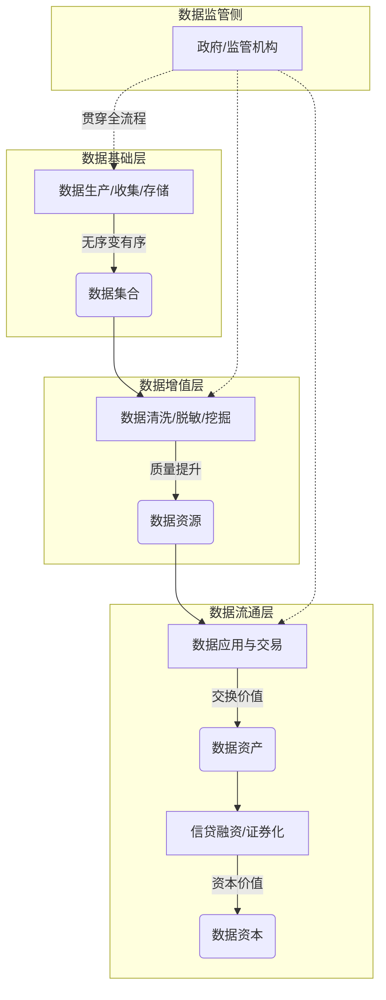
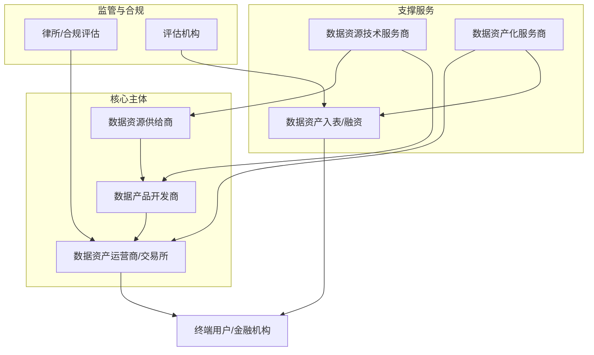
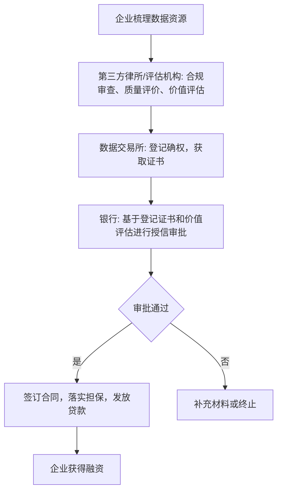

# 《2024数据要素资产化白皮书》章节总结

## 书籍信息
- **书名：** 2024数据要素资产化白皮书
- **总编：** 汤寒林
- **指导单位：** 工业和信息化部电子第五研究所、中国通信学会数据安全委员会、中国经济信息社数据资产运营研究中心
- **PDF 状态：** 扫描版/基于OCR识别，内容可读但存在一定格式偏移。
- **OCR 状态：** 已识别文本，页码存在从1开始但内容不完整的情况（如第1页实际为封面后第一页）。

## 目录说明
- **目录识别情况：** 完整识别了全书七章及下属三级标题。
- **章节对应依据：** 基于PDF文本生成的页码标记（原书页码）。
- **OCR 修复说明：** 部分流程图（如图2.1、图3.2等）因扫描质量无法完美还原视觉样式，已根据描述性文字和逻辑关系使用 Mermaid 重建。部分表格数据内容完整保留。

## 全书核心主题
本白皮书系统阐述了在数字经济时代，数据作为第五大生产要素，从原始资源转化为可量化、可交易、可融资的资产（即“数据要素资产化”）的全过程。全书从宏观政策背景、国际实践对比入手，构建了数据资产化的理论框架（确权、评估、治理），详细拆解了“数据资源化-产品化-资产化-资本化”的价值实现路径，并描绘了包含交易所、运营商、服务商在内的生态图谱。书中重点解读了2024年“数据资产入表”元年的政策落地难点（如质量评价、成本归集、合规审计），并通过大量行业案例（文旅、金融、汽车、医疗等）展示了数据资产在质押融资、交易流通中的实际应用。最后，白皮书展望了政策法规完善、技术创新（隐私计算、AI）及市场机制演进的未来趋势。

---

## 第一章：时代背景

### 1. 核心论点
本章主要解决**为什么要在当下推动数据要素资产化**的问题。
**观点：** 数据要素资产化是全球经济竞争与国家经济转型的战略高地。在宏观经济转型需求（寻找新增长点）与前沿技术（大数据、AI）成熟的双重驱动下，中国通过顶层政策设计（如“数据二十条”），将数据确立为新型生产要素，旨在通过资产化释放数据价值，驱动高质量发展。

### 2. 关键概念
- **数据要素资产化：** 将原始数据通过标准化、规范化流程，转化为具有明确经济价值和可交易性资产的过程。
- **数据确权：** 为资产化提供法律基础，明确数据归谁所有。
- **“数据二十条”：** 2022年发布的《关于构建数据基础制度更好发挥数据要素作用的意见》，确立了数据产权“三权分置”制度框架。
- **数据资产入表元年（2024）：** 标志性时间点，指企业开始正式将数据资源在财务报表中列为资产。

### 3. 逻辑推演
**论证链条：**
1.  **提出问题：** 传统经济增长模式遭遇瓶颈，需要新动力；国际数字竞争激烈。
2.  **分析驱动：** 宏观政策（供给侧改革、数字中国）与微观技术（云计算、AI）共同倒逼数据价值释放。
3.  **构建法律基础：** 梳理了从《网络安全法》到《数据安全法》再到《个人信息保护法》的“三驾马车”法律体系。
4.  **得出结论：** 数据资产化不仅是企业提升竞争力的手段，更是国家在全球数字经济中争夺定价权和话语权的必要举措。

### 4. 经典金句/数据
> “数据要素资产化，作为数字经济时代的标志性事件，不仅是中国经济转型升级的必然选择，更是全球经济竞争格局中中国战略定位的重要一环。” (p.13)

> 2024年一季度，多家上市公司将数据资源列为资产，是中国数据要素资产化实践的历史性突破。 (p.14)

> 2020年4月，国务院印发《关于构建更加完善的要素市场化配置体制机制的意见》，首次将“数据”与土地、劳动力、资本、技术等传统要素并列为生产要素。 (p.15)

---

## 第二章：数据资产化的理论概述

### 1. 核心论点
本章解决**数据资产“是什么”以及“如何从理论上看待它”**的问题。
**观点：** 数据资产是合法拥有或控制的、能货币计量且能带来经济利益的**数据资源**。它既具有信息资源的属性，又具有经济资产的属性。从经济学角度看，其价值在于流通与定价；从法律角度看，核心在于构建“三权分置”的权益束。

### 2. 关键概念
- **数据资产：** 综合国家标准及财政部定义，指合法拥有/控制、能货币计量、能带来直接/间接经济利益的数据资源。
- **三权分置：** 数据资源持有权、数据加工使用权、数据产品经营权。
- **数据价值化三阶段：** 数据资源化 → 数据资产化 → 数据资本化。
- **权益束：** 法律视角下，数据权益是包含知识产权、个人信息、商业秘密等多种权益的综合体。

### 3. 逻辑推演
- **定义梳理：** 通过对比学术、政策、标准、行业四个层面的定义，提炼出数据资产的两大核心属性（信息资源+经济价值）。
- **关系剖析：** 论证了数据要素（原料）与数据资产化（加工）的依存关系：要素是基础，资产化是市场化途径。
- **框架构建：** 提出了“基础层-增值层-流通层-监管层”的四层市场体系框架。
- **交叉视角：** 分别从经济学（定价、交易、边际成本）和法律学（权益保护、确权）两个维度深化理解。

### 方法流程图（数据要素资产化过程）



### 5. 经典金句/数据
> “数据资产化从会计视角看，是将数据视为一种资产，对其进行有效的管理和利用，以实现数据的价值最大化的过程。” (p.20)

> 《数据二十条》明确了探索数据产权结构性分置制度，建立数据资源持有权、数据加工使用权、数据产品经营权“三权分置”的数据产权制度框架。(p.25)

---

## 第三章：数据要素资产化面临阻碍与价值实现路径

### 1. 核心论点
本章解决**“从数据到钱（资产）的路上有哪些坑以及具体怎么走”**的问题。
**观点：** 主要面临高质量供给不足、治理不规范、确权难、定价难四大阻碍。价值实现需经历“挖掘加工→治理→确权登记→质量/价值评估→交易/融资”的闭环路径。

### 2. 关键概念
- **高质量数据供给不足：** 指数据存在孤岛、标准不一、脏数据多，无法直接使用。
- **数据清洗：** 消除重复、处理缺失、修正错误的过程。
- **数据确权实务：** 通过登记、认证、交易等手段明确三权归属。
- **传统评估方法的局限：** 成本法（低估价值）、收益法（未来收益难测）、市场法（缺少可比案例）。

### 3. 逻辑推演
**问题篇：**
1.  **供给端：** 数据挖掘难（量大、杂）、加工难（清洗贵、合规严）。
2.  **治理端：** 缺乏顶层规划（信息孤岛）、传统技术落后、非结构数据多。
3.  **法律端：** 权属不清（无形性、可复制性）、监管机构缺失。
4.  **价值端：** 驱动因素复杂、评估方法局限、交易市场不成熟。

**解决路径篇（流程化论证）：**
1.  **第一步：挖掘与加工** —— 从无序数据变有序数据资源。
2.  **第二步：治理** —— 标准化、提质量、保安全，变数据产品。
3.  **第三步：合规与确权** —— 律师审查+三权登记，变法律认可的资产。
4.  **第四步：评估** —— 质量指标（完整性、准确性）+价值指标（稀缺性、时效性）。
5.  **第五步：变现** —— 交易流通 或 质押融资/信托。

### 方法流程图（数据资产价值评估方法）

```mermaid
graph TD
    subgraph 评估方法体系
    A[数据资产评估] --> B{方法选择}
    B --> C[成本法]
    B --> D[收益法]
    B --> E[市场法]
    
    C --> C1[公式: P = TC × U]
    C1 --> C2[适用：成本可溯源，价值被低估]
    
    D --> D1[公式: P = Σ Ft/(1+i)^t]
    D1 --> D2[适用：未来收益可预测场景]
    
    E --> E1[公式: P = P' × 修正系数]
    E1 --> E2[适用：成熟交易市场]
    end
```

### 5. 经典金句/数据
> 高质量数据供给不足已成为当下数据要素产业化发展的重要阻碍。(p.27)

> 在企业的整体数据架构中，非结构化数据...约占企业数据存储量的 80%。(p.28)

> 数据资产价值评估体系是一个综合评估框架，用于量化和评价数据资产的价值。(p.41)

---

## 第四章：数据要素资产化生态图谱

### 1. 核心论点
本章解决**“数据资产化这盘棋局里有哪些玩家”**的问题。
**观点：** 目前已形成以**数据交易所**为核心，**数据资产运营商**为纽带，**数据资源供给商**为基础，**技术服务商**（存储、安全、治理）为支撑，**数据产品开发商**和**服务商**（评估、律所、会所）为配套的完整生态图谱。

### 2. 关键角色与职责
- **数据资产运营商（交易所）：** 核心架构，提供信任、撮合交易、规范标准。
- **数据经纪商：** 受托行权、风险控制、价值挖掘，类似“数据中介”。
- **数据资产运营公司：** 提供从咨询、整合、治理到入表、融资的一站式服务。
- **合规评估商（律所）：** 负责数据来源、内容、处理、管理的全流程合法性审查。
- **质量评估商：** 依据国家标准（GB/T 36344-2018）进行完整性、准确性等测评。

### 3. 逻辑推演
**生态结构分析：**
1.  **上游（供给）：** 数据资源供给商（原始数据持有方）。
2.  **中游（核心处理）：**
    - *技术支撑：* 存储计算（云、湖仓一体）、安全（加密、审计）、治理（中台）。
    - *价值转化：* 产品开发商（把数据变成产品）。
3.  **下游（流通与变现）：**
    - *通道：* 交易所、经纪商。
    - *服务：* 资产评估（算值钱）、入表（会计处理）、融资（找钱）。
4.  **结论：** 这是一个“国家级+区域性+行业性”的多层次市场格局。

### 方法流程图（数据资产化市场生态）



### 5. 经典金句/数据
> 数据交易所是数据市场的核心架构基础，在数据交易及数据资产化过程中起着举足轻重的作用。(p.50)

> 截至2024年，数据资产化产业图谱生态已基本形成，已逐步建立起“国家级+区域性+行业性”多层次的数据交易格局。(p.50)

---

## 第五章：数据资产入表

### 1. 核心论点
本章解决**“数据资产怎么在财务账本上体现”**的具体操作难题。
**观点：** 数据资产入表（依据《暂行规定》）不仅是会计处理的变化，更是国家抢占数字经济高地、企业增厚资产、金融机构创新产品的基石。实施路径包含“九步法”（规划-质量-合规-安全-评估-确权-测算-计量-披露），但实践中面临质量评价、成本分摊、确权合规、价值评估四大核心难点。

### 2. 关键概念
- **数据资产入表：** 将符合资产定义的数据资源正式计入资产负债表（无形资产或存货）。
- **成本法/收益法/市场法：** 数据资产计量的三种基础会计与评估模型。
- **强制披露+自愿披露：** 企业既需按规定披露数据资产会计信息，也可自愿披露应用场景以展示潜力。
- **数据资产审计：** 作为市场“第三道防线”，确保入表数据的真实性、安全性和合规性。

### 3. 逻辑推演
**宏观意义：** 从全球话语权（定价权）、行业发展（企业融资）、市场完善三个层面论证必要性。

**实施路径（九步法逻辑）：**
1.  **盘清家底**（规划盘点） → **2. 提升质量**（数据治理） → **3. 保证合法**（合规确权） → **4. 确保安全**（安全评估） → **5. 算值多少钱**（价值评估） → **6. 领证**（登记） → **7. 算成本**（经济利益测算） → **8. 做账**（成本计量/摊销/减值） → **9. 公示**（列示及披露）。

**难点聚焦：**
- **质量评价：** 缺乏权威第三方，CQC（中国质量认证中心）正介入统一标准。
- **成本归集：** 数据是“伴生”的，很难分清业务成本和数据制造成本。
- **动力不足：** 投入大、见效慢，中小企业缺乏入表动力。

### 方法流程图（数据入表九步法）


### 5. 经典金句/数据
> 财政部通过《企业数据资源相关会计处理暂行规定》...打通了中国数字化经济发展的最后一环。(p.75)

> 数据治理是确保数据资产有效管理、合规使用和安全存储的关键环节。(p.77)

> 数据质量评价是确保数据准确性、完整性、一致性、可靠性和时效性的关键过程。(p.81)

---

## 第六章：数据要素资产化实践案例

### 1. 核心论点
本章通过**26个真实落地案例**，实证展示数据资产化从概念到“真金白银”的转化过程。
**观点：** 无论是文旅数据、停车数据、供应链数据还是个人数据，只要经过“合规-治理-评估-登记”的标准流程，都能成为银行认可的质押物（融资）或可交易的商品（交易）。

### 2. 案例分类与模式提炼

- **文旅行业（6.1）：** 陕文投云创科技“文旅产业运营数据集”入表，获交行500万授信（陕西首单）。
- **公共事业与城投（6.6、6.17）：** 西安雁塔停车数据、姜堰企业用水数据入表，用于优化公共服务及融资。
- **工业制造与供应链（6.7、6.12、6.26）：** 武义工业企业数智管理服务、南钢审计风控、民慧股份钢板加工数据平台，实现降本增效及数据产品交易。
- **金融科技与征信（6.14、6.15、6.19）：** 深圳微言科技无质押增信贷款、南财“资讯通”融资、光大银行“贵数贷”，开创了数据信用评估新模式。
- **汽车与交通（6.4、6.5）：** 零数科技联合吉利、中汽协，利用区块链和可信数据空间解决自动驾驶事故定责与数据共享难题。

### 3. 流程图提炼（以“数据资产质押贷款”为例）



### 4. 经典案例结论
> “贵数贷”是全国首个数据资产融资产品，依托贷款风险分担机制，向数据资产拥有方提供融资服务。(p.78)

> 江苏钟吾大数据集团开创性地将数据资源以数据知识产权证书为质押物，获得共计2000万元质押贷款。(p.124)

> 深圳微言科技案例展示了“信息增信”机制，允许企业在不影响数据确权的前提下进行数据登记融资。(p.126)

---

## 第七章：数据要素资产化的连锁效应及展望

### 1. 核心论点
本章总结现状并预测未来。
**观点：** 数据资产化已形成不可逆的宏观趋势（政策密集、市场活跃、产业链成型）。未来核心任务是**完善政策法规**（明确所有权、加强监管）、**推动技术创新**（隐私计算、AI）、**探索市场机制**（公共数据授权运营、跨境流动）。

### 2. 关键结论
- **现状判断：** 处于“活跃探索期”，公共数据授权运营将是下一阶段突破口。
- **核心挑战：** 如何解决“有数不敢供，供数怕担责”的合规顾虑。
- **政策建议：**
    - *政府侧：* 明确责权利，做好数据资产清查，培育生态。
    - *企业侧：* 培养人才，激发市场活力，挖掘应用场景。
- **技术方向：** 数据基础设施（存储/计算/网络）与数据安全技术（国密、隐私计算）并重。

### 3. 逻辑推演
1.  **趋势肯定：** 引用数据（2023年数据生产总值32.85ZB，同比增长22.44%）证明市场活跃。
2.  **问题导向：** 指出尽管前景好，但法律法规（如所有权）、监管（如反垄断）、技术（如安全）仍需完善。
3.  **路径建议：** 明确提出“标准化-流动化-融合化”的三步走建议。
4.  **终极愿景：** 发展“新质生产力”，数据要素与各类资源充分融合，催生新产业、新业态。

### 4. 经典金句/数据
> 2023年，我国的数据生产总值达32.85ZB，同比增长 22.44%。(p.150)

> 习近平总书记强调，“发展新质生产力是推动高质量发展的内在要求和重要着力点”。(p.161)

> 运营数据是持续创造数据价值的有效方式，多元化的数据生态...进一步拓展数据应用场景和数据合作方式。(p.160)