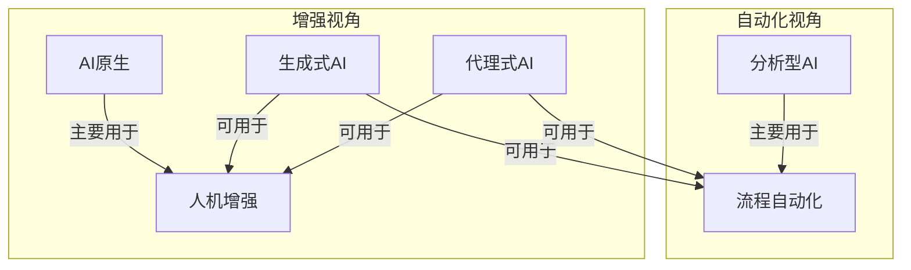
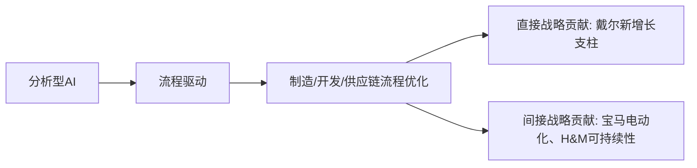
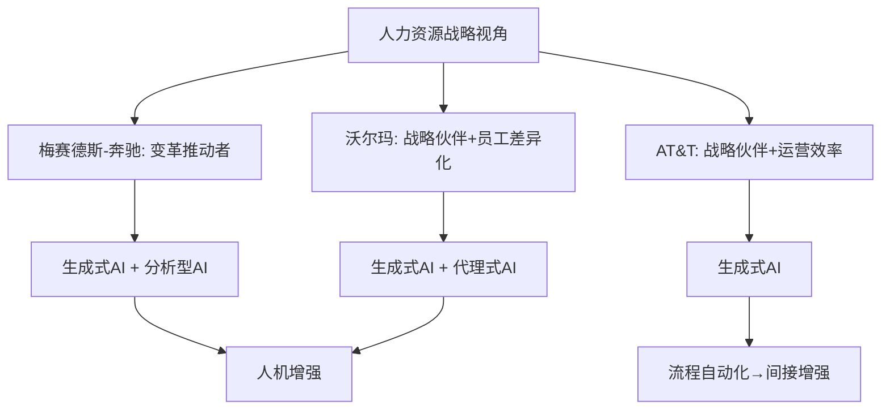
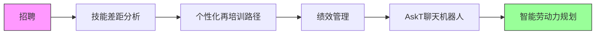
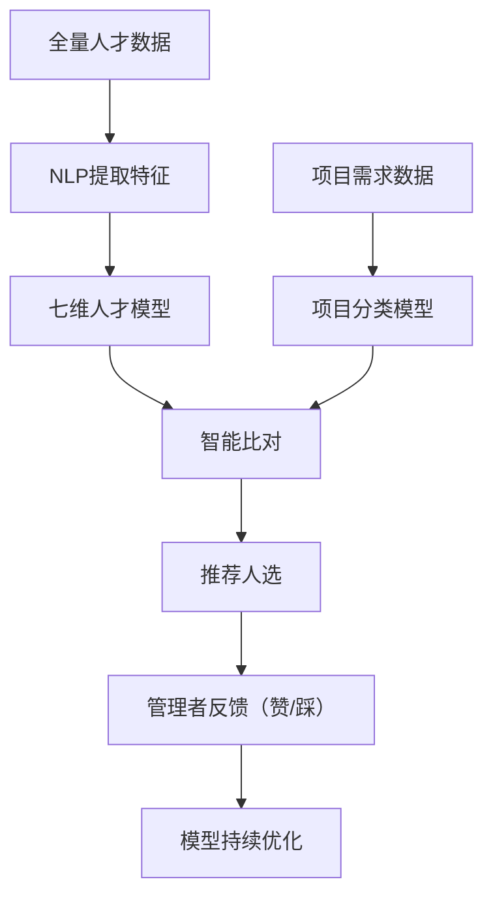
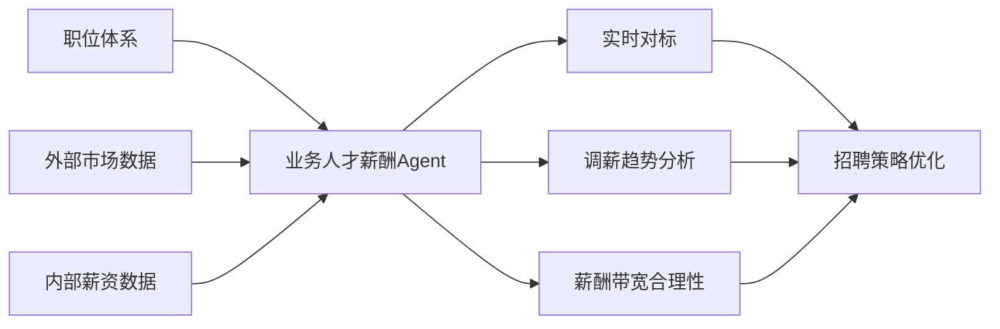
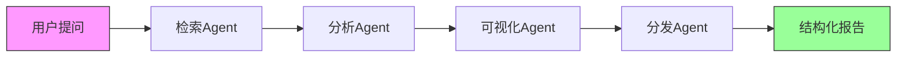
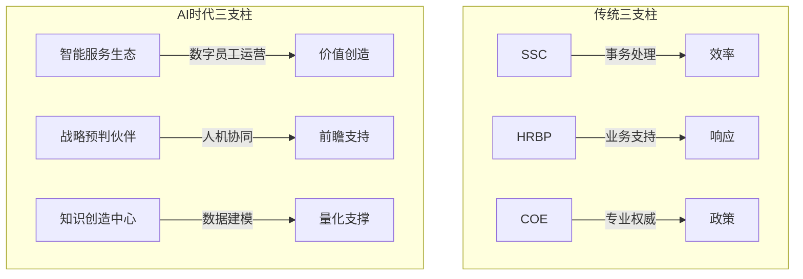
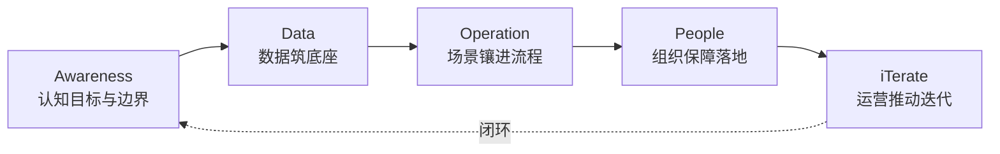
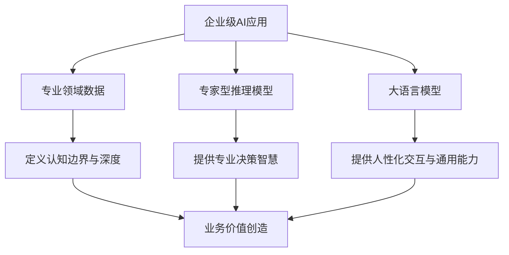

# 《2025年AI在企业人力资源中的应用3.0：AI HR全球化创新实践案例特辑》章节总结

## 书籍信息
- 书名：2025年AI在企业人力资源中的应用3.0——AI HR全球化创新实践案例特辑
- 作者：易路人力资源科技、ABPMP、HR数智研究院（联合发布），董事长&CEO致辞，特邀顾问包括吴峰等
- PDF 状态：文本可识别，存在OCR错漏（部分页码混乱、表格格式丢失、图片占位符）
- OCR 状态：基于提供文本恢复，图表未完整识别，已按逻辑重建

## 目录说明
- 目录识别情况：根据正文标题和页码整理，顺序如下：
  1. 封面/致辞/特邀顾问/特别鸣谢（第1-5页）
  2. 第一部分：AI在全球中的发展趋势（第6-21页）
  3. 第二部分：全球人工智能战略与人力资源案例（第22-50页）
  4. 第三部分：国内AIHR发展及应用现状（第51-128页）
  5. 第四部分：企业AI应用思考（第129-146页）
  6. 第五部分：他们是如何“与智共舞”的？（第147-153页）
  7. 第六部分：观点：AI转型，本质在“人”（第154-156页）
  8. 附录：关于我们、易路介绍、版权（第157-161页）
- 章节对应依据：基于原书标题层级
- OCR修复说明：部分页码错位，表格已重排，图片占位符忽略，Mermaid图根据描述重建

## 全书核心主题
本书围绕“AI在企业人力资源中的应用”展开，通过全球与中国领先企业的实践案例，揭示AI从“流程自动化”向“决策智能化”与“体验个性化”跃迁的趋势。核心观点包括：AI转型不应盲目崇拜技术，而需以业务解构和价值重估为起点；成功的AIHR实践需要“专业领域数据+专家型推理模型+大语言模型”三者结合；组织需建立“人机协同”的新范式，释放人力资源的战略价值。全书提供了从趋势分析、方法论框架到具体案例（招聘、薪酬、培训、共享服务等）的完整知识图谱。

---

## 前言：当世界重构工作

### 核心论点
问题：企业如何避免AI应用的焦虑与误区，真正实现人机协同？作者认为：AI不是取代人的工具，而是让组织更人性化、更高效的“新成员”；成功AI转型始于对业务精准解构，而非技术崇拜。

### 关键概念/事件
- AI生产力悖论：MIT指出95%的AI试点失败，AI自动化对GDP贡献有限。
- 人机协同：AI弥补人类信息处理局限，人类聚焦战略、文化与成长。
- 易路iBuilder智能体平台：覆盖员工“入转调离”全场景39个原生Agent。

### 逻辑推演
作者从全球AI应用焦虑切入，指出“瑞士军刀式”思维和“人员精简”误区。提出真正可持续的竞争力来自技术、数据与组织智慧的整合。通过案例集展示AI在招聘、薪酬、绩效等场景的落地路径，强调小步快跑、快速验证价值。

### 经典金句/数据
> “我们引入的是一位不知疲倦、极具潜力的‘新成员’，旨在弥补人类在信息处理、模式识别和不知疲倦执行方面的局限，而非一把淘汰‘老朋友’的利刃。” (p.2)
> 世界经济论坛：超过85%的企业正在重新设计工作流程以融入人工智能。 (p.2)

---

## 第一部分：AI在全球中的发展趋势

### 第1章：引言——AI生产力悖论

#### 核心论点
问题：为什么AI投资难以体现生产力提升？作者认为：当前AI应用偏重自动化而非增强，导致“AI生产力悖论”；需转向增强员工、创造新服务。

#### 关键概念/事件
- AI自动化 vs AI增强：自动化替代岗位（效率、成本），增强提升专业性/创造力（人机互补）。
- 三大挑战：证明商业价值(37%)、缺乏高管承诺(34%)、选择合适技术(33%)。
- 阿西莫格鲁建议：增强员工而非取代；与熟练员工合作识别价值点；创造新服务。

#### 逻辑推演
从MIT报告和诺贝尔奖得主观点出发，比较自动化与增强的效益差异，指出当前AI只能自动化5%的任务。提出解决悖论的三条路径，引出后续四种AI技术的讨论。

#### 经典金句/数据
> “IT生产力悖论：信息技术无处不在，唯独在生产力统计数据中难以体现。” (p.10)
> AI未来十年可能仅贡献GDP增长0.93%至1.16% (Acemoglu, 2024)。 (p.9)

---

### 第2章：全球企业的AI发展趋势

#### 核心论点
问题：四种关键AI技术（AI原生、生成式AI、代理式AI、分析型AI）如何区分和应用？作者从自动化-增强维度和SPPT框架比较了它们。

#### 关键概念/事件
- AI原生：内在可信AI能力，设计、部署、运营中自然集成；分为技术定义和业务定义。
- 生成式AI：内容生成（文本/图像），经济价值待验证；高盛报告开发人员生产力提高约20%。
- 代理式AI：自主任务执行、流程自动化；Gartner定义自主/半自主软件实体；68%企业准备投资。
- 分析型AI：数据驱动决策基石；可解释AI、实时分析、边缘分析等趋势。

#### 流程图

**四种AI技术比较（图2）**

#### 经典金句/数据
> 92%的公司计划未来三年增加对生成式AI的投资，但只有1%认为达到成熟阶段。(McKinsey, 2025) (p.13)
> 代理式AI被认为是2025年最热门的AI发展趋势。(MIT Sloan, 2025) (p.14)

---

### 第3章：人力资源中的AI趋势

#### 核心论点
问题：AI如何重塑人力资源的战略、人员、流程和技术四个维度？作者认为：AI使HR从行政支持转向战略价值核心，实现“人在回路”的增强。

#### 关键概念/事件
- 战略：AI驱动公司决策速度快5倍，营收增长高50%（埃森哲）。
- 人员：从自动化转向增强，AI影响80%工作岗位，但需“人在回路”。
- 流程：招聘、入职、人才发展、绩效管理显著受益；节省HR工作时间15-20%。
- 技术：IT支出向AI/生成式AI、云服务、安全倾斜；HR数据分析生产力提升30%。

#### 经典金句/数据
> AI成熟度高的公司实现营收增长比成熟度低的同行高出50%，盈利能力高出三倍。(埃森哲) (p.16)
> 生成式AI将影响80%的工作岗位，这不是退缩的理由，而是行动的号角。(麦肯锡) (p.18)

---

## 第二部分：全球人工智能战略与人力资源案例

### 第4章：人工智能在企业战略中的贡献

#### 核心论点
问题：宝马、H&M、戴尔如何利用AI贡献企业战略？作者发现：主要采用分析型AI，侧重人机增强而非自动化，贡献由流程驱动。

#### 关键概念/事件
- 宝马：iFACTORY战略，AIQX质量系统，数字孪生，AI conic多智能体系统。成果：数百个AI应用案例。
- H&M：数据网格架构，预测分析优化供应链，雇佣200+数据科学家。成果：减少库存浪费，提升响应能力。
- 戴尔：AI Factory与NVIDIA合作，解决“试点炼狱”。成果：AI服务器订单额121亿美元。

#### 流程图

**AI对企业战略的贡献（图4）**

#### 经典金句/数据
> 戴尔AI改进型服务器订单额121亿美元（2026财年Q1），积压订单144亿美元。(p.29)

---

### 第5章：AI在人力资源战略中的应用

#### 核心论点
问题：沃尔玛、AT&T、梅赛德斯-奔驰如何将AI融入人力资源战略？作者总结：生成式AI为主，倾向人机增强，贡献路径有业务流程管理和直接战略。

#### 关键概念/事件
- 沃尔玛：“超级代理”框架，Ask Sam助手被90万员工使用，每周300万+查询。成果：形成企业神经系统。
- AT&T：AskAT&T基于Azure OpenAI，自动化HR和遗留代码迁移。成果：显著时间和成本节约。
- 梅赛德斯-奔驰：培训600+员工AI技能，MO360数据平台，147个高潜力流程。成果：向电动化转型基础。

#### 流程图

**AI对人力资源战略的贡献（图5）**

#### 经典金句/数据
> Ask Sam被90万名员工使用，每周提出超过300万个问题。(p.32)
> 梅赛德斯-奔驰培训超过600名员工AI基础知识，提供40,000+课程。(p.35)

---

### 第6章：AI在全生命周期中的应用

#### 核心论点
问题：德国电信和微软如何将AI应用于员工全生命周期？作者指出：分析型+生成式AI融合，向代理式AI发展，由人力资源驱动或流程驱动。

#### 关键概念/事件
- 德国电信：Eightfold平台做技能差距分析，AskT聊天机器人（250万+对话），Pega超自动化。成果：75个用例评估。
- 微软：Copilot驱动AskHR虚拟代理，27%查询分流自助服务，释放13名FTE。成果：响应时间加快26%。

#### 流程图

**AI在全雇佣生命周期中的应用（图6）**

#### 经典金句/数据
> AskT聊天机器人自推出以来已进行超过250万次对话。(p.39)
> 微软AskHR虚拟代理使27%的HR查询分流至自助服务，释放13名全职等效代理。(p.40)

---

### 第7章：AI在人力资源业务流程中的应用

#### 核心论点
问题：欧莱雅（招聘）、谷歌（入职）、西门子（绩效）如何用AI优化核心HR流程？作者强调：AI作为人类增强工具，贡献通过流程改进间接实现业务KPI。

#### 关键概念/事件
- 欧莱雅：内部LLM生成职位描述，AI筛选150万份申请/年。成果：招聘提速10倍，留任率提高25%。
- 谷歌：Gemini AI匹配数百万候选人数据库，自动总结面试反馈。成果：人才匹配时间从小时到分钟。
- 西门子：AI驱动绩效管理系统，多维度评估，支持DEI。成果：实时数据支持反馈文化。

#### 经典金句/数据
> 欧莱雅每个职位平均134名申请者，招聘团队约200人。(p.42)
> 面试比之前多25%的候选人，员工留任率提高25%。(p.43)

---

### 第8章：最终思考——代理式AI或原生AI能否超越人工智能悖论？

#### 核心论点
问题：如何调和AI投资回报率（生产力 vs 增长）的分歧？作者认为：AI原生模型（端到端整合、人类增强）是超越生产力悖论的途径。

#### 关键概念/事件
- 毕马威：AI投资ROI最高指标是生产力(98%)和盈利能力(97%)。
- 波士顿咨询：重点转向增长和数字化转型。
- 代理式AI预期ROI 13.7% > 非智能体生成式AI 12.6%。
- 阿西莫格鲁建议：创造新任务、提高现有工作生产力、建立新平台。

#### 经典金句/数据
> 代理式AI的预期投资回报率为13.7%，超过非智能体生成式AI应用的12.6%。(BCG, 2025) (p.47)
> 2022年财富500强财报电话会议最常提及主题是业务整合(10%)。(p.47)

---

## 第三部分：国内AIHR发展及应用现状

### 第9章：国内AIHR发展及应用现状（引言）

#### 核心论点
问题：AI与HR融合如何重塑组织能力？作者（韩践）认为：管理者能力模型从执行力转向系统性思维、问题洞察；AI接管“做事”，人类重新定义“思考”。

#### 关键概念/事件
- 智能匹配：AI将静态人才库升级为动态意向库。
- 智能薪酬：薪酬智能体打通内外部数据，实时对标。
- 人才发展：培训从标准化到个性化，提升“技商(TQ)”。
- AI智能体：数字员工成为能理解、判断的伙伴。

#### 经典金句/数据
> 管理者执行力的重要性逐步下降，而提出问题、挑战假设、协调人际关系等能力将成为未来管理素质模型的核心。(p.52)

---

### 第10章：数据速递——全行业AI人才渗透趋势

#### 核心论点
问题：各行业AI人才需求如何变化？数据显示：2020-2025年AI相关岗位增长578.02%，渗透率从1.1%升至3.1%。

#### 关键概念/事件
- 专业服务业增长率975%，渗透率4.3%。
- 信息技术业渗透率最高5.7%。
- 半导体、能源化工、金融、汽车行业增长显著。

#### 数据表格（2020-2025 AI岗位需求占比）

| 年份 | 全行业 | 信息技术 | 半导体 | 专业服务 | 金融 |
|------|--------|----------|--------|----------|------|
| 2020 | 1.1%   | 1.8%     | 0.9%   | 0.4%     | 0.4% |
| 2025 | 3.1%   | 5.7%     | 5.3%   | 4.3%     | 1.4% |

#### 经典金句/数据
> AI相关岗位数量在五年间增长了578.02%。(p.55)

---

### 第11章：实践案例——人岗匹配（复星旅文）

#### 核心论点
问题：如何解决多元化业务的人才精准匹配？复星旅文构建七维人才模型+项目分类模型，实现匹配准确度>90%，管理者满意度98%。

#### 关键概念/事件
- 七维人才模型：经营意识、团队管理、客户导向、创新能力等。
- 项目分类模型：通过成长性和管理复杂度交叉分析，划分四类项目。
- 技术架构：智能体机器人工作流+企业AI知识库+大模型。
- 成效：覆盖80%以上项目，高层决策介入30-40%，中层50-60%，基层70-80%。

#### 流程图

**复星旅文人岗匹配流程**

#### 经典金句/数据
> 关键岗位匹配准确度稳定在90%以上，管理者满意度98%。(p.62)

---

### 第12章：实践案例——招聘管理

#### 案例1：丹纳赫中国

##### 核心论点
AI驱动招聘效能革命，通过智能外呼、共享人才库、AI视频面试、移动端方案，将静态人才库升级为动态意向池。

##### 关键成果
- 简历初筛时间控制，智能外呼12万+次互动。
- 历史候选人激活率提升30%+。

##### 经典金句/数据
> 智能外呼系统累计完成超过12万次互动。(p.68)

---

#### 案例2：费森尤斯医疗

##### 核心论点
小步快跑策略，明确护士人才画像，应用AI面试和智能标签体系，降低招聘成本。

##### 关键成果
- AI面试提升选拔一致性。
- 智能标签功能实现简历精准分类，不再依赖猎头。

##### 经典金句/数据
> 招聘能力基本实现自主，不再使用外部猎头，节约招聘成本。(p.71)

---

#### 案例3：江森自控

##### 核心论点
AI招聘助手支持70+语言、24小时在线，实现自动筛选、智能面试安排、全天候响应。

##### 关键成果
- 平均响应时间从10小时缩至10分钟。
- 候选人满意度98%，申请完成率75%，录用量提升14%。

##### 经典金句/数据
> 全局录用量实现14%的提升。(p.75)

---

#### 案例4：埃森哲

##### 核心论点
AI赋能招聘需三大基础：数字核心、高附加值实践、价值导向考核。部署三个AI智能体（寻源、面试、入职）。

##### 关键成果
- 强制全员提升“技商(TQ)”。
- 人机共创模式，AI幻觉需持续应对。

##### 经典金句/数据
> 技术落地的成功，很大程度上依赖于坚实的数字化基础和文化氛围。(p.79)

---

### 第13章：专家观点——AI在招聘各环节的更多可能性（赵阿民）

#### 核心论点
AI可助力外部人才竞争格局分析（动态监测对手、人才流动洞察）、人才搜寻投流技术、智能推荐与匹配（效率提升5倍）。

#### 关键概念
- 人才雷达：将公开数据转化为竞争情报。
- AI Call：自动化结构化访谈、破解跨国合规难题。

#### 经典金句/数据
> 智能简历推荐效果显著，招聘效率相较于仅依赖传统招聘网站提升约5倍。(p.82)

---

### 第14章：专家观点——重视AI招聘技术应用后的算法歧视问题（邹羽）

#### 核心论点
算法歧视（显性、隐性、差别性影响）因数据偏见和模型不成熟而产生，需通过技术优化、监管审计、伦理官职能、去除歧视性字段等避免。

#### 关键概念
- 算法歧视三种形式：显性、隐性、差别性影响。
- 解决方案：优化算法、定期审计、设置AI伦理官、去除性别年龄等字段。

#### 经典金句/数据
> 使用算法本身就可能是一种歧视（莱普利·普鲁诺）。(p.83)
> 若放任算法筛选替代人与人之间的真实评估，最终使得招聘的精准度不升反降。(p.84)

---

### 第15章：实践案例——薪酬管理（某全球化智能家居企业）

#### 核心论点
通过业务人才薪酬Agent实现市场薪酬实时对标、内部体系优化、MCP形式保障数据安全。同时覆盖招聘、培训、绩效、人才库、员工服务全流程。

#### 关键成果
- 薪酬报告实时调取，节约成本，提升效率。
- 竞品招聘动态Agent提升招聘成功率。
- 蓝领AI面试、培训自动翻译、绩效面谈总结等。

#### 流程图

**薪酬智能体工作流**

#### 经典金句/数据
> 在有效控制招聘成本的前提下，新、老业务线的招聘成功率均得到大幅提升。(p.89)

---

### 第16章：实践案例——培训管理

#### 案例1：中国兵工物资集团

##### 核心论点
构建“六维穿透”科技型内训体系，六大AI应用场景（组织调度、内容开发、运营优化、内训师生态、学习生态矩阵、激励转化）。

##### 关键成果
- 中高级职称覆盖率大幅提升（中级+54.89%，高级+41.94%）。
- 科技人才占比从11%提升至21.5%。
- 年均培训人次4700+，同比增长370%。
- 人才流失率从6.4%降至3.7%。

##### 经典金句/数据
> 人才流失率降幅达42.2%，三年累计节省重置成本140万元。(p.101)

---

#### 案例2：美乐家

##### 核心论点
AI数字人培训官系统（3D超写实、声纹克隆、智能字幕），实现培训成本减半、覆盖率翻倍。

##### 关键成果
- 单门课程制作工时从4小时压缩至30分钟，效率提升>85%。
- 培训覆盖率从不足50%提升至98%。
- 总体培训成本下降约50%。

##### 经典金句/数据
> 培训体验评分提升40%以上。(p.104)

---

### 第17章：实践案例——共享服务

#### 案例1：德勤中国

##### 核心论点
以“AI Agent”为核心重构HR SSC，十大Agent场景（AI面试问题生成、每日新闻推送、深度搜索、竞争对手分析、PDF提炼、RAG聊天机器人等），实现信息摩擦到洞见直达。

##### 关键成果
- 信息准备时间（T2I）缩短40%-60%。
- 人力工时节省10%-15%，内容首版可用率80%。
- 证据齐全率>95%，SLA达成率>95%。

##### 流程图

**德勤指挥家Agent团队多Agent协同**

##### 经典金句/数据
> 关键决策的信息准备时间缩短了40%至60%。(p.110)

---

#### 案例2：新奥集团

##### 核心论点
“人才激发智能伙伴”私有化部署，知识库大模型+自然语言交互+流程自动化。成果：服务效率大幅提升，答疑准确率90%。

##### 关键成果
- 三个月服务8000+用户，自助答疑484次。
- 平均响应时间从数小时缩短至秒级。
- 请假/证明办理时间从30分钟缩至5分钟以内。

##### 经典金句/数据
> 智能伙伴的答疑准确率高达90%。(p.114)

---

#### 案例3：蒙牛集团

##### 核心论点
“牛小讯”AI Agent实现HR信息自动化管理，智能资讯抓取、AI处理、多形式推送、知识库问答。

##### 关键成果
- 上线3个月实现6万多人次信息推动，问题解决率60%。
- 知识库回答准确率90%。
- 事务型工作效率提升10倍。

##### 经典金句/数据
> “牛小讯”做的不仅是信息传递，更是通过高频次提供准确信息，促进企业内部知识沉淀。(p.118)

---

#### 案例4：天阳科技

##### 核心论点
“小阳姐姐”智能客服系统（NLP+大模型），7x24小时服务，敏感词风险防控。

##### 关键成果
- 节省全职答疑岗位3.6人/年。
- 平均响应时间从11.7小时压缩至10分钟。
- 月均问答量21916条，问题解决率98%。

##### 经典金句/数据
> 平均响应时间压缩至10分钟/个，效率提升超过98%。(p.121)

---

### 第18章：人工智能助力的人力资源管理变革（崔晓燕）

#### 核心论点
AI推动HRSSC从效率革命到价值重构：运营效率革命、员工体验重构、服务价值升级、风险智能防控、数据资产增值、数据决策赋能。同时重塑三支柱模型。

#### 关键概念/事件
- 对HRSSC：从事务处理中心转向智能服务生态。
- 对HRBP：从业务支持转向战略预判伙伴。
- 对COE：从专业权威转向知识创造中心。

#### 流程图

**AI重塑三支柱模型**

#### 经典金句/数据
> 人工智能推动人力资源三支柱从传统的“三支柱”结构，向“网状协同组织”进化。(p.124)

---

### 第19章：行业洞察——AI赋能共享服务之福利创新管理

#### 核心论点
传统福利管理面临效率、体验、决策三重困境。易路AI福利助手实现7x24小时智能问答、流程自动化、数据驱动洞察。

#### 关键成果（某美食快消品公司）
- 两周上线，支持多端登录。
- 统一福利门户，涵盖大健康全流程。
- 人机协同（AI助手+人工客服）。

#### 经典金句/数据
> 福利体系将不再是简单的成本支出，而将成为激发组织活力、凝聚人心、驱动增长的宝贵战略投资。(p.128)

---

## 第四部分：企业AI应用思考

### 第20章：AI时代的企业行为与决策研究（杨蔚）

#### 核心论点
问题：AI如何从更根本角度影响个体认知和行为？作者提出对比式提示(Contrastive Prompting)和思维镜像(Cognitive Mirror)两种AI系统设计机制，促进探索性学习和认知提升。

#### 关键概念/事件
- 经验性学习：从实践中感知、理解并总结。
- 探索(exploration) vs 利用(exploitation)：AI易强化利用，需设计反思机制。
- 对比式提示：展示替代选项，触发认知冲突和探索。
- 思维镜像：反馈个体思维模式，促进自我反思。

#### 理论假设
- H1: Cognitive Mirror显著提升认知能力。
- H2: Contrastive Prompting显著提升探索行为。
- H3: Cognitive Mirror增强Contrastive Prompting对探索的正向作用。
- H4: Contrastive Prompting增强Cognitive Mirror对认知能力的正向作用。

#### 经典金句/数据
> AI不仅能提供信息处理与优化功能，更能够通过设计性的提示与反馈机制，影响人类的思维方式与学习路径。(p.129)

---

### 第21章：中国企业AI转型：从热闹到成效的五步路线（谭寅亮）

#### 核心论点
提出ADOPT路线：Awareness（认知）、Data（数据）、Operation（落地）、People（组织）、iTerate（迭代）。强调AI转型是系统工程，人力共享服务是最适合率先落地的领域。

#### 关键概念/事件
- Awareness：明确硬指标、数据边界、容错范围。
- Data：数据治理，主数据统一为“黄金记录”。
- Operation：从“最算账”场景切入（JD解析、HR Copilot、异常检测等）。
- People：设立AI项目办公室，分层培训，人机分工演练。
- iTerate：纳入运营节奏，MLOps/LLMOps，A/B测试。

#### 流程图

**ADOPT五步路线**

#### 经典金句/数据
> AI转型的关键在于把热闹落到成效。(p.136)

---

### 第22章：实现企业级AI应用的关键条件有哪些？（赵阿民）

#### 核心论点
企业级AI成功需要“三脚凳”：专业领域数据 + 专家型推理模型 + 大语言模型。三者有机结合，才能打破技术与业务之间的“最后一公里”。

#### 关键概念/事件
- 专业领域数据：企业独特的业务流程、经验、知识。
- 专家型推理模型：封装行业顶尖专家的决策逻辑（如软技能评估）。
- 大语言模型：通用交互界面和效率引擎（如JD生成、问答）。

#### 流程图

**企业级AI三要素**

#### 经典金句/数据
> 企业级AI的成功，绝非仅仅依赖于市面上通用的大语言模型，其核心在于将专业领域数据、专家型推理模型以及大语言模型这三者有机地、系统地结合起来。(p.137)

---

### 第23章：Gartner: AI HR势如破竹，但道阻且长（绿青）

#### 核心论点
Gartner报告指出：2025年AI HR进入“战略差异化”关键期，61%的HR领导者处于规划或部署阶段。优先落地用例包括HR虚拟助手、流失风险分析等。挑战在于数据基础弱、系统整合难、技能缺口大、变革管理缺、法规不确定。

#### 关键概念/事件
- 三大价值支柱：提升效率(77%)、优化员工体验(52%)、增强决策科学性(43%)。
- 优先落地用例：候选人匹配、流失风险分析、HR虚拟助手、劳动力规划。
- 战略布局用例：个性化教练、偏见检测、任务智能化、Agentic AI。
- 建议：结构化AI战略、跨部门协作、赋能组织、强化风险治理。

#### 表格：优先落地型企业实践现状

| 用例分类 | 核心价值 | 当前应用状况 |
|----------|----------|--------------|
| 人才获取 | 缩短招聘周期30-40% | 20%+企业采用AI候选人匹配 |
| 人才保留 | 节省替代成本50%+ | 67%团队通过流失风险制定保留计划 |
| HR运营效率 | 减少行政工作量60%+ | 80%+成熟系统嵌入虚拟助手 |
| 劳动力规划 | 减少技能缺口40% | 38%将技能管理AI作为核心项目 |

#### 经典金句/数据
> 76%的HR领导者认为，若12-24个月内不部署GenAI，组织将在人才竞争中落后。(p.141)

---

## 第五部分：他们是如何“与智共舞”的？

### 第24章：五家领先HR科技公司的AI战略对比

#### 核心论点
SAP、Oracle、Workday、UKG、易路虽然技术基因和客户不同，但均将数据视为“石油”，以员工为中心重塑交互，通过开放平台构建AI生态。

#### 关键概念/事件
- SAP：业务AI + Joule副驾，打通HR与业务数据。
- Oracle：OCI + AI Agent深度嵌入Fusion HCM，业人财一体化。
- Workday：Illuminate OS + 13个AI代理，实时数据驱动人才决策。
- UKG：Bryte AI轻量化入口 + 劳动力智能模块，聚焦一线员工。
- 易路：iBuilder智能体平台，39个原生Agent覆盖六大板块。

#### 共性总结
- 数据统一基座，从“记录系统”到“洞察引擎”。
- 多模态智能体，员工体验智能化重构。
- 开放平台与低代码，生态协同。

#### 经典金句/数据
> HR软件的竞争本质已从“功能完备性”转向“AI驱动的组织价值创造能力”。(p.153)

---

## 第六部分：观点：AI转型，本质在“人”

### 第25章：AI转型的五维领导力

#### 核心论点
AI转型是技术转型、组织转型，但本质是人的转型。需定义新的学习方式、工作内容、工作方式、工作角色和领导方式（爵士领导力）。

#### 关键概念/事件
- 新学习：提升“AI商”，场景化赋能，用中学。
- 新工作内容：数据治理+流程适配，单点突破与顶层设计闭环。
- 新工作方式：从效率思维到管理模式重构，AI作为“可管理的人才库”。
- 新工作角色：AI编排设计师、HR AI产品经理、AI伦理官、AI-人才战略师。
- 新领导方式：爵士领导力（即兴协同、以人为本、去中心化）。

#### 经典金句/数据
> “以人为本中心，让AI释放人类创造力与价值”，不是“跟上未来工作”，而是“定义未来工作”。(p.156)

---

## 附录

### 关于我们
- HR数智研究院：易路发起，中立性研究平台。
- ABPMP：全球业务流程管理专业组织。
- 易路：以薪酬为核心的一站式HR软件及服务，覆盖全球180+国家，服务800万+用户。

### 版权声明
本白皮书属易路人力资源科技、ABPMP、HR数智研究院所有。未经许可不得转载、复制、编辑。