# 《2027年计算机网络考研复习指导》章节总结

## 书籍信息

- **书名**：2027年计算机网络考研复习指导
- **作者**：王道论坛 组编
- **出版社**：电子工业出版社
- **出版年份**：2026年1月第1版
- **ISBN**：978-7-121-51786-0
- **PDF 状态**：扫描版，可识别文本
- **OCR 状态**：已提取文本，存在部分页码标记和格式偏移

## 目录说明

- **目录识别情况**：完整识别，共6章正文
- **章节对应依据**：按原书目录结构
- **OCR 修复说明**：部分页码标注已整合至正文，图表描述已转换为文字或Mermaid格式

## 全书核心主题

本书是计算机专业硕士研究生入学考试“计算机网络”课程的复习用书，严格按照最新计算机考研大纲编写。全书共6章，内容涵盖：计算机网络体系结构、物理层、数据链路层、网络层、传输层、应用层。每章均包含考点讲解、习题精选及解析。本书的特点是考点精炼、重点突出，约40%篇幅为考点讲解，60%为习题讲解。配套视频免费发布在B站“王道计算机教育”账号上。

---

## 第1章：计算机网络体系结构

### 核心论点

本章主要解决计算机网络的基本概念和体系结构理解问题。作者认为：理解计算机网络的层次化体系结构是掌握网络通信原理的基础，重点在于掌握OSI参考模型和TCP/IP模型各层的功能划分，以及三种数据交换方式的特性对比。

### 关键概念

- **计算机网络**：将众多分散的、自治的计算机系统，通过通信设备与线路连接起来，并由功能完善的软件实现资源共享和信息传递的系统。
- **internet与Internet**：internet（互连网）是通用名词，泛指多个网络互连；Internet（互联网）是专有名词，特指全球最大的采用TCP/IP协议的特定计算机网络。
- **三种交换方式**：电路交换（建立连接→传输→释放）、报文交换（存储转发，报文整体传输）、分组交换（存储转发，分组传输）。
- **OSI参考模型**：7层结构（物理层、数据链路层、网络层、传输层、会话层、表示层、应用层），是国际标准但未成为事实标准。
- **TCP/IP模型**：4层结构（网络接口层、网际层、传输层、应用层），是事实上的国际标准。

### 逻辑推演

本章从计算机网络的定义入手，逐步展开：首先介绍计算机网络的组成、功能和分类；然后详细对比三种数据交换方式（电路交换、报文交换、分组交换）的特性，通过时延分析说明分组交换的优势；接着介绍网络性能指标（速率、带宽、吞吐量、时延、时延带宽积、RTT等）；最后重点讲解分层体系结构，对比OSI参考模型和TCP/IP模型的异同，强调5层协议体系结构作为学习框架。

### 方法流程图

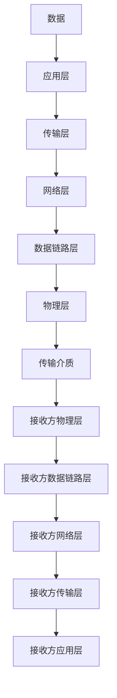

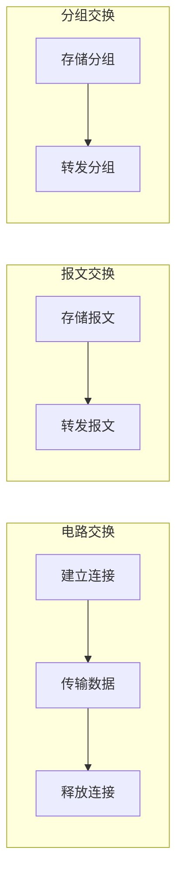

### 经典金句/数据

> “计算机网络是将众多分散的、自治的计算机系统，通过通信设备与线路连接起来，并由功能完善的软件实现资源共享和信息传递的系统。” (p.14)

> “协议是水平的，服务是垂直的。” (p.29-30)

> “总时延 = 发送时延 + 传播时延 + 处理时延 + 排队时延” (p.20)

---

## 第2章：物理层

### 核心论点

本章解决信号如何在传输介质上传输的问题。作者认为：物理层考虑的是怎样在连接各台计算机的传输介质上传输数据比特流，重点在于理解奈奎斯特定理和香农定理的应用，以及编码与调制技术。

### 关键概念

- **奈奎斯特定理**：理想低通信道中，极限码元传输速率为2W波特，极限数据传输速率 = 2W log₂V (b/s)。
- **香农定理**：有噪声信道中，极限数据传输速率 = W log₂(1+S/N) (b/s)。
- **码元与波特**：码元是固定时长的信号波形；波特率表示每秒传输的码元数。
- **编码与调制**：编码将数据转换为数字信号（如曼彻斯特编码）；调制将数据转换为模拟信号（如ASK、FSK、PSK、QAM）。
- **物理层接口特性**：机械特性、电气特性、功能特性、过程特性。

### 逻辑推演

本章从通信基础概念（数据、信号、码元、信道）入手，重点讲解信道的极限容量：奈奎斯特定理（无噪声）和香农定理（有噪声），通过对比说明两者的适用场景。然后介绍编码与调制技术，包括数字数据编码（NRZ、曼彻斯特、差分曼彻斯特等）、模拟数据编码（PCM）、数字数据调制（ASK、FSK、PSK、QAM）。接着介绍传输介质（双绞线、同轴电缆、光纤、无线）和物理层设备（中继器、集线器）。

### 方法流程图

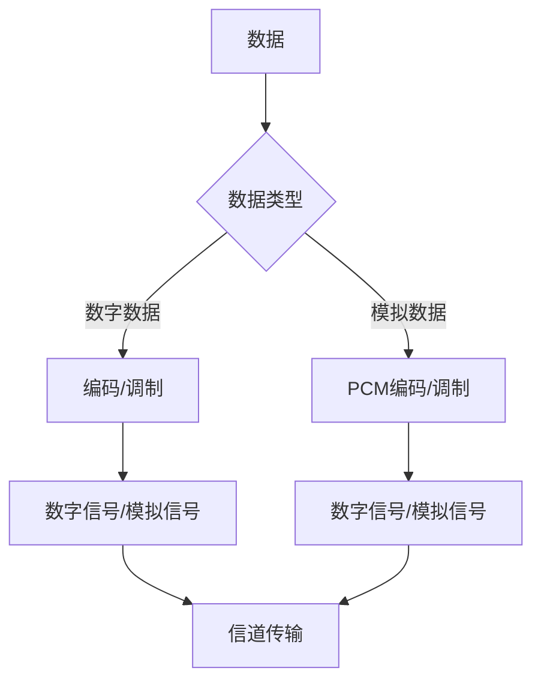

```mermaid
graph LR
    subgraph 奈奎斯特定理
        N1[带宽W] --> N2[最大码元速率=2W]
        N2 --> N3[最大数据速率=2W log₂V]
    end
    subgraph 香农定理
        X1[带宽W] --> X2[最大数据速率=W log₂(1+S/N)]
        X3[信噪比S/N] --> X2
    end
```

### 经典金句/数据

> “奈氏准则仅考虑带宽对码元速率的限制，适用于无噪声的理想信道；香农定理同时考虑了带宽和信噪比，适用于有噪声的实际信道。” (p.45)

> “最短帧长 = 2 × 最大单向传播时延 × 数据传输速率” (p.103)

---

## 第3章：数据链路层

### 核心论点

本章解决相邻节点之间可靠数据传输的问题。作者认为：数据链路层是历年考试的重点，需要重点掌握滑动窗口机制、三种可靠传输协议（停止-等待、GBN、SR）、CSMA/CD协议、CSMA/CA协议和以太网帧格式。

### 关键概念

- **滑动窗口协议**：发送窗口和接收窗口的大小决定协议类型（停止-等待：WT=1,WR=1；GBN：WT>1,WR=1；SR：WT>1,WR>1）。
- **CSMA/CD协议**：载波监听多路访问/冲突检测，用于有线以太网，核心是“先听后发、边听边发、冲突停发、随机重发”。
- **CSMA/CA协议**：载波监听多路访问/冲突避免，用于无线局域网，通过RTS/CTS帧预约信道。
- **以太网MAC帧**：包含目的地址(6B)、源地址(6B)、类型(2B)、数据(46-1500B)、FCS(4B)，最小帧长64B。
- **VLAN**：虚拟局域网，通过802.1Q帧标签（4B）划分广播域，VID字段12位支持4096个VLAN。

### 逻辑推演

本章从数据链路层的功能出发，依次讲解：组帧方法（字符计数、字节填充、零比特填充、违规编码）、差错控制（奇偶检验、CRC、海明码）、流量控制与可靠传输机制（停止-等待、GBN、SR协议的信道利用率分析）、介质访问控制（信道划分、随机访问、轮询访问）。然后详细讲解以太网（CSMA/CD协议、MAC帧格式、高速以太网）、无线局域网（CSMA/CA协议、802.11帧格式）、VLAN。最后讲解数据链路层设备（网桥、交换机、集线器）。

### 方法流程图

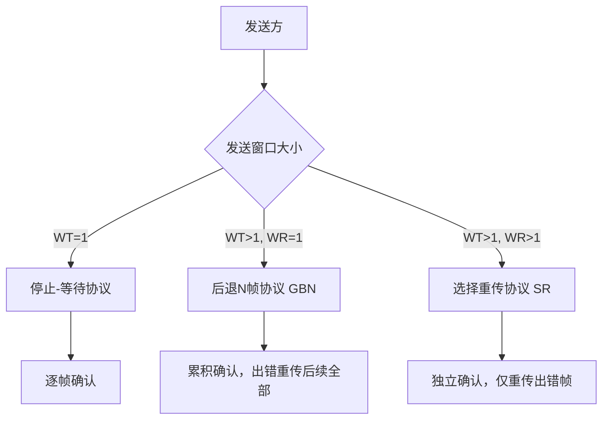

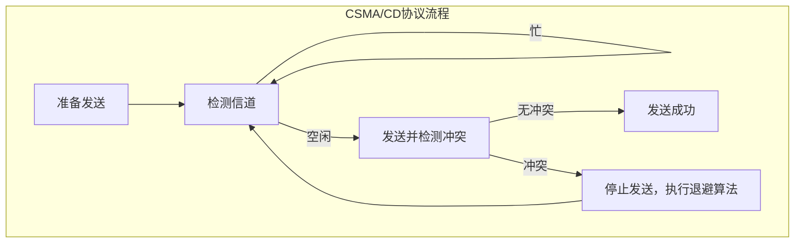

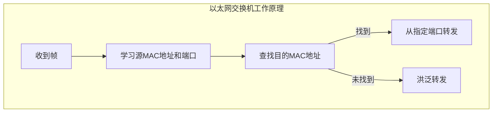

### 经典金句/数据

> “以太网最短帧长为64B，争用期为51.2μs。” (p.103)

> “后退N帧协议发送窗口 WT ≤ 2ⁿ-1，选择重传协议发送窗口 WT ≤ 2ⁿ⁻¹。” (p.78)

> “CSMA/CD协议的核心思想：先听后发，边听边发，冲突停发，随机重发。” (p.102)

---

## 第4章：网络层

### 核心论点

本章解决异构网络互连和分组从源主机到目的主机传输的问题。作者认为：网络层是历年考查的重中之重，尤其是IPv4和路由的相关知识点必须牢固掌握。

### 关键概念

- **IPv4分组格式**：首部固定20B，包含版本、首部长度、总长度、标识、标志、片偏移、TTL、协议、首部检验和、源地址、目的地址等字段。
- **CIDR**：无分类域间路由选择，使用“IP地址/前缀长度”表示，支持路由聚合和最长前缀匹配。
- **NAT**：网络地址转换，将私有IP地址转换为公网IP地址，缓解IPv4地址短缺。
- **路由协议**：RIP（距离-向量，跳数度量）、OSPF（链路状态，Dijkstra算法）、BGP（路径-向量，AS之间）。
- **ARP/DHCP/ICMP**：ARP解析IP到MAC地址；DHCP动态分配IP地址；ICMP用于差错报告和网络探测（PING、Traceroute）。

### 逻辑推演

本章从网络层的功能（异构网络互连、路由与转发）入手，对比虚电路和数据报两种服务。然后详细讲解IPv4：分组格式（含分片计算）、IP地址分类与子网划分、CIDR与路由聚合、NAT原理、ARP解析过程、DHCP四步交互、ICMP报文类型。接着讲解IPv6（128位地址、双协议栈和隧道过渡）。然后重点介绍路由算法（距离-向量、链路状态）和路由协议（RIP、OSPF、BGP）。最后讲解网络层设备（路由器）和分组转发过程。

### 方法流程图

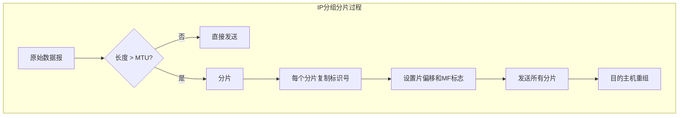

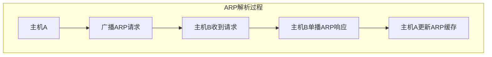

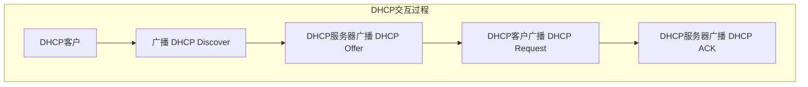

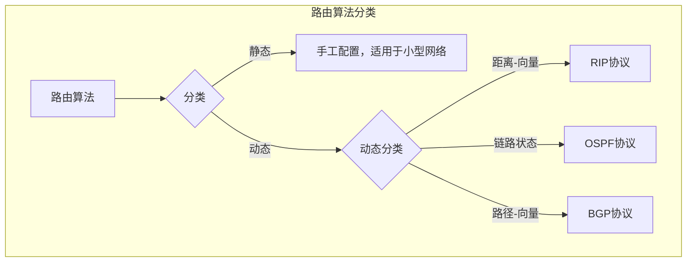

### 经典金句/数据

> “IP地址 ::= {<网络前缀>, <主机号>}，CIDR使用斜线记法。” (p.155)

> “私有IP地址块：10.0.0.0/8、172.16.0.0/12、192.168.0.0/16。” (p.158)

> “最长前缀匹配：选择网络前缀最长的路由项。” (p.156)

> “IPv6地址长度128位，基本首部固定40B。” (p.195)

---

## 第5章：传输层

### 核心论点

本章解决不同主机上应用进程之间端到端通信的问题。作者认为：传输层是连接网络层和应用层的桥梁，需要重点掌握TCP和UDP的区别、TCP的流量控制和拥塞控制机制。

### 关键概念

- **端口**：传输层服务访问点，16位标识，用于区分不同应用进程。熟知端口（0-1023）、登记端口（1024-49151）、短暂端口（49152-65535）。
- **UDP**：用户数据报协议，无连接、不可靠、面向报文的传输，首部8B（源端口、目的端口、长度、检验和）。
- **TCP**：传输控制协议，面向连接、可靠、面向字节流的传输，首部20B（含序号、确认号、数据偏移、标志位、窗口、检验和、紧急指针等）。
- **TCP拥塞控制**：慢开始（cwnd=1，指数增长）、拥塞避免（加法增大）、快重传（收到3个重复ACK立即重传）、快恢复（cwnd减半后执行拥塞避免）。

### 逻辑推演

本章从传输层的功能出发，讲解端口的概念和服务类型。然后分别介绍UDP（数据报格式、检验和计算）和TCP（报文段格式、连接管理的三次握手和四次挥手、可靠传输的序号和确认机制、流量控制的滑动窗口、拥塞控制的四种算法）。最后通过习题巩固理解。

### 方法流程图

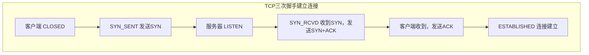

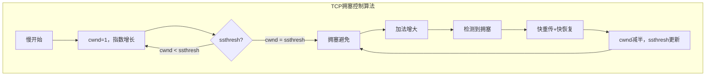

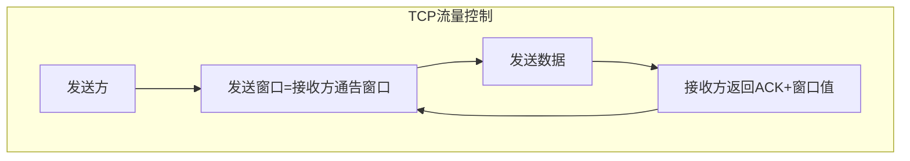

### 经典金句/数据

> “TCP是面向连接的、可靠的、基于字节流的传输协议；UDP是无连接的、不可靠的、面向报文的传输协议。” (p.236)

> “TCP拥塞控制四种算法：慢开始、拥塞避免、快重传、快恢复。” (p.243-245)

> “三次握手建立连接，四次挥手释放连接。” (p.238-239)

---

## 第6章：应用层

### 核心论点

本章解决用户与网络的接口问题，即应用进程如何利用网络服务。作者认为：应用层协议种类繁多，需要重点掌握DNS域名解析过程、FTP的工作模式、电子邮件系统的组成和协议、HTTP的特点和版本演进。

### 关键概念

- **客户/服务器模型**：客户请求服务，服务器提供服务，服务器长期运行，客户间断性运行。
- **P2P模型**：对等网络，每个节点既是客户又是服务器，无中心服务器。
- **DNS**：域名系统，将域名解析为IP地址，采用层次域名空间（根域、顶级域、二级域等），分布式数据库。
- **FTP**：文件传输协议，使用两个TCP连接（控制连接端口21，数据连接端口20）。
- **电子邮件系统**：由用户代理、邮件服务器、邮件传输协议（SMTP）和邮件读取协议（POP3/IMAP）组成。
- **HTTP**：超文本传输协议，无状态协议，持久连接和非持久连接，HTTP/1.1、HTTP/2、HTTP/3演进。

### 逻辑推演

本章从网络应用模型（C/S、P2P）入手，依次讲解：DNS（域名空间、域名服务器、递归与迭代解析）、FTP（控制连接与数据连接分离）、电子邮件（SMTP传输、POP3/IMAP读取）、万维网（HTTP协议、URL、Cookie、Web缓存）。

### 方法流程图

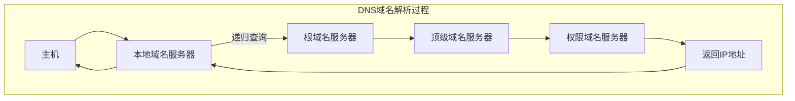

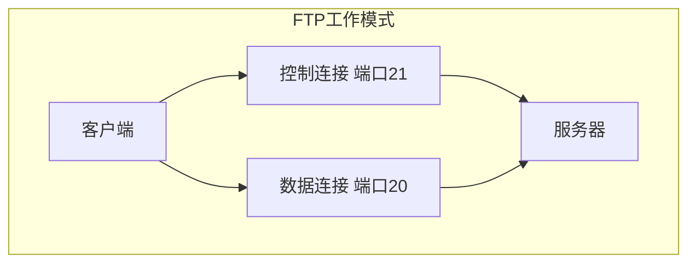

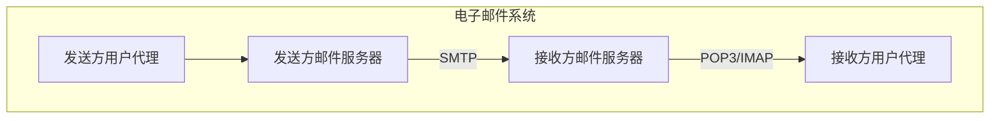

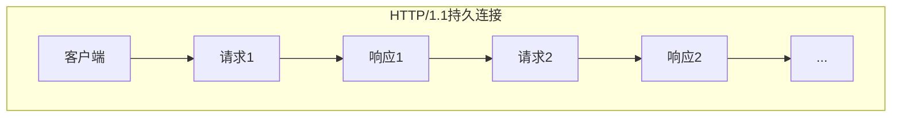

### 经典金句/数据

> “DNS采用分布式数据库，层次域名空间：根域、顶级域、二级域……” (p.270-271)

> “FTP使用两个TCP连接：控制连接（端口21）和数据连接（端口20）。” (p.277)

> “HTTP是无状态协议，Cookie用于识别用户。” (p.291-292)

> “HTTP/1.1默认使用持久连接，支持流水线方式。” (p.293-294)