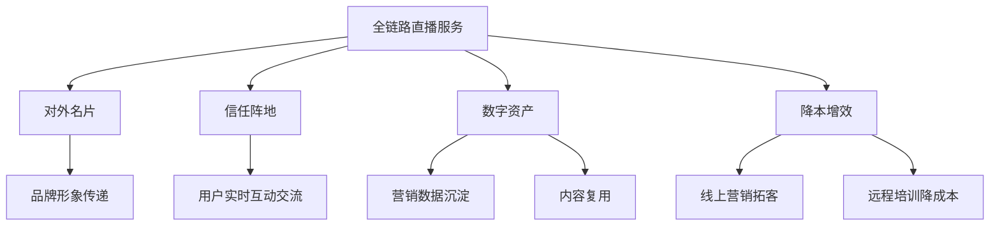
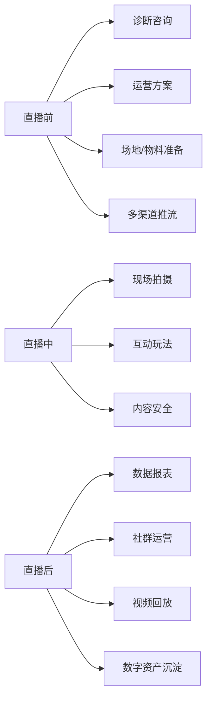
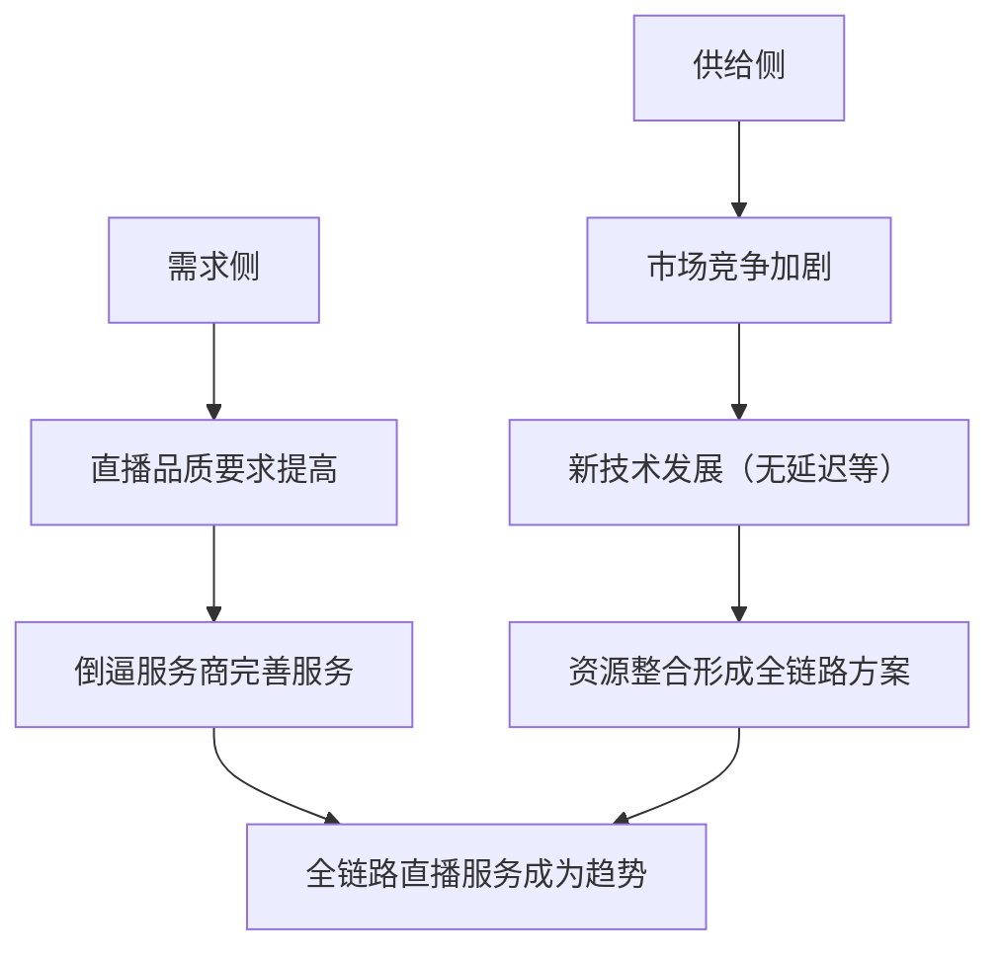
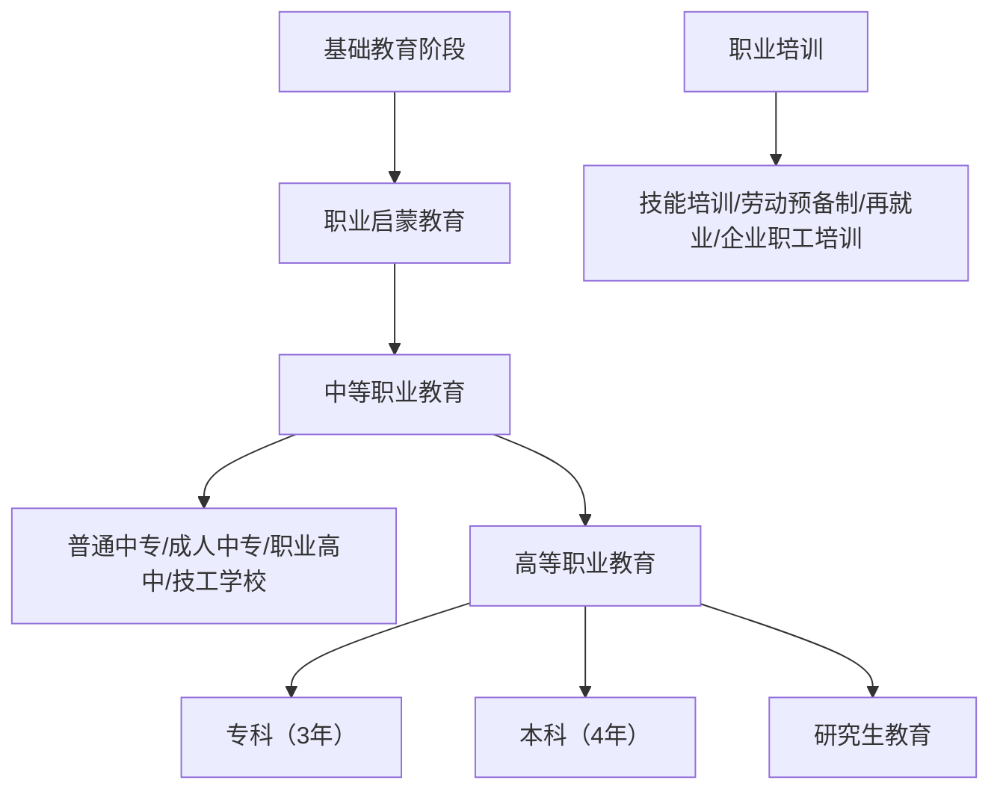
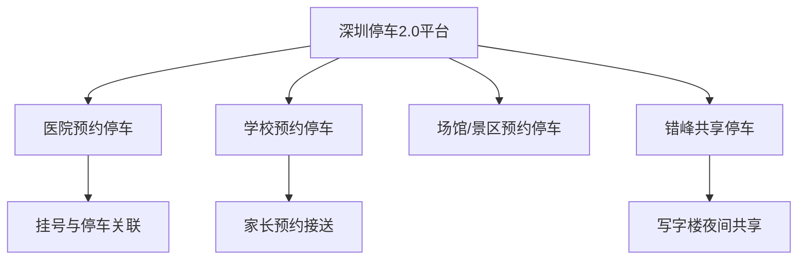

# 《36Kr-2022年企业直播发展与应用研究报告》章节总结

## 书籍信息
- 书名：2022年企业直播发展与应用研究报告
- 作者：36氪研究院 & 直播高研院
- PDF状态：扫描件/可识别
- OCR状态：良好

## 目录说明
- 目录完整，共四章：行业发展概况、行业及场景应用、典型案例分析、发展趋势展望。
- 基于PDF文本逐章整理。

## 全书核心主题
本报告系统梳理了企业直播从萌芽到全链路发展的三个阶段，指出2022年后企业直播进入全链路发展阶段。报告强调，随着直播与业务深度融合，企业对直播品质的要求提升，驱动服务商从单纯技术提供转向“产品+技术+服务”的一站式运营。报告分析了金融、政企、职业教育、医疗等行业的应用痛点与解决方案，并介绍了保利威、飞书等典型案例。最后提出全链路服务、私域直播、新技术（MR/元宇宙）三大趋势。

---

## 第1章：企业直播行业发展概况

### 核心论点
本章回答：企业直播的定义、发展阶段、市场现状与价值。作者认为企业直播已从工具化应用升级为企业数字化转型的基础设施，进入全链路发展阶段，品质直播是核心驱动力。

### 关键概念/事件
- **企业直播**：面向企业客户的视频直播解决方案，通过SaaS/PaaS等技术，赋能数字化营销与学习。
- **全链路直播服务**：将“产品、技术、服务”整合为闭环，提供咨询、短视频制作、全案策划、线下执行、人才培训、场景搭建等一站式运营。
- **发展阶段**：2019年前萌芽（品牌宣传活动）；2020-2021年快速发展（疫情驱动数字化转型）；2022年起全链路发展（品质直播需求）。
- **政策支持**：数字经济、中小企业数字化赋能、国家信息化规划等政策为企业直播提供有利土壤。
- **无延迟直播技术**：基于WebRTC，将延时降至毫秒级，实现高并发实时互动。

### 逻辑推演/叙事脉络
报告首先定义企业直播及其三个阶段。接着从市场需求、技术升级、政策支持三个驱动力论证全链路服务的必然性。市场需求方面，用户对直播体验要求提高，企业需要专业化团队和运营方法；技术方面，5G、无延迟、元宇宙等新技术提升直播品质；政策方面，数字经济相关规划持续利好。随后阐述企业直播四大价值：对外名片、信任阵地、数字资产、降本增效。最后分析市场竞争格局，指出头部玩家（如保利威）通过全链路服务建立优势。

### 流程图

#### 企业直播价值模型

### 经典金句/数据
> “品质直播是企业直播发展的核心驱动力，技术升级是企业直播发展的必要支撑。”(p.7)
> “直播由早期的工具化应用演变为企业数字化转型的重要基础设施。”(p.7)
> 2020-2021年企业直播快速发展，2022年至今进入全链路发展阶段。(p.6)
> 无延迟直播技术将传统直播延时降低至毫秒级，可实现千万级并发实时在线观看与互动。(p.8)

---

## 第2章：企业直播在各行业及场景应用研究

### 核心论点
本章回答：企业直播在金融、政企、职业教育、医疗等行业的具体应用模式和痛点。作者认为不同行业因监管、业务特性差异，对直播内容、技术、运营有差异化需求，全链路解决方案是满足这些需求的关键。

### 关键概念/事件
- **金融直播四大痛点**：内容创作、私域运营、效果量化、合规安全。
- **金融细分领域差异化**：银行侧重培训与多元化营销；券商侧重高质量研讨与投教投顾；保险侧重入职与产品培训直播。
- **金融营销直播全链路**：直播前准备、直播中执行、直播后数据分析与内容二次分发。
- **金融数字化学习**：新员工培训、日常业务培训、职业外培训；无延迟直播技术提升沉浸式学习体验。
- **政务直播**：普法宣传、干部培训、政务咨询三大场景。
- **央国企直播**：私有化部署，定制化需求高，聚焦培训、会议、活动。
- **职业教育**：网课加密、防盗版是关键；应用场景包括招生、线上授课、双师课堂。
- **医疗直播**：画质、流畅度要求高，重视合规；多用于科室会议、医学培训、医学论坛。
- **活动会展直播**：行业峰会、品牌发布会、数字会展；MR技术和数字人技术提升互动体验。

### 逻辑推演/叙事脉络
报告按行业逐一展开。金融行业由于强监管特性，直播起步晚但增长迅猛，四大痛点驱动了全链路运营方案（内容矩阵、社群运营、私域营销闭环）。政企领域分为政务和央国企，强调安全合规与私有化部署。职业教育关注版权保护，双师课堂模式提升教学效果。医疗行业结构化失衡，直播促进资源均衡。活动会展场景下，MR虚拟直播成为新方向，可打造3D沉浸式体验。

### 流程图

#### 金融数字化学习直播运营解决方案

### 经典金句/数据
> “金融业直播场次和时长与两年前相比增长20倍以上，年化增长率超过100%。”(p.16)
> 银行直播营销采取多元化打法和全场景覆盖策略。(p.17)
> 职业教育机构通过互动直播增强课堂体验，优化教学效果。(p.31)
> “MR直播已经在汽车、科技、带货、年会、活动等对视觉呈现要求较高的行业和场景中得到应用。”(p.45)

---

## 第3章：典型案例分析

### 核心论点
本章通过保利威和飞书两个案例，展示全链路企业直播服务商和一站式协作平台如何赋能企业直播。

### 关键概念/事件
- **保利威**：企业直播服务商，提供六大产品矩阵（无延迟直播、点播、MR直播、咨询、运营、直播舱），覆盖23万企业用户，年落地650万场直播。全链路视频服务体系：产品赋能+咨询诊断+全案运营+人才培养+现场执行+直播间搭建。
- **飞书**：一站式企业协作与管理平台，集成即时沟通、日历、音视频会议、云文档等。飞书直播支持最高1000方参会、百万人观看，可预设场景、沉浸式互动、自动统计直播数据。

### 逻辑推演/叙事脉络
保利威部分强调其从技术到运营的全链路能力，通过可集成、可定制的私域直播系统，服务教育、培训、营销、会展等多场景，激活企业私域价值。飞书部分突出其作为协作工具内置直播功能的便捷性，支持商业直播、培训直播等多种场景，降低企业直播门槛。

### 经典金句/数据
> 保利威已服务超过23万企业级用户，年落地超过650万场直播。(p.39)
> 飞书视频会议支持最高1000方同时参会，百万人同时观看直播。(p.41)

---

## 第4章：行业前景展望

### 核心论点
本章预测未来三大趋势：全链路直播服务成为主流、私域直播成竞争重点、新技术带来互动革新。

### 关键概念/事件
- **全链路直播服务趋势**：供需两侧共振——需求侧要求更高品质，供给侧市场竞争加剧，推动服务商提供更完善的全链路运营。
- **私域直播**：公域流量成本上升，私域流量成为新阵地。私域直播能快速触达老客户、建立信任、推动决策，需要企业深度整合业务系统，借助服务商的全链路运营。
- **MR直播**：VR/AR/MR技术将带来互动革新。MR直播融合虚拟与现实，提升沉浸感、实时互动性，已在汽车、科技等领域应用，未来将普及至更多企业和个人主播。

### 流程图

#### 供需两侧驱动全链路直播趋势

### 经典金句/数据
> “私域直播作为直播的深水区，需要企业走向数字化转型的纵深阶段。”(p.44)
> “VR/AR/MR等新技术将成为企业直播互动革新的源动力。”(p.45)
> “MR直播将会应用至更多企业直播乃至个人主播，成为新的直播应用趋势。”(p.45)

---

# 《2012-2022年中国职业教育发展报告（中英）》章节总结

## 书籍信息
- 书名：2012-2022年中国职业教育发展报告
- 作者：中华人民共和国教育部
- PDF状态：可识别
- OCR状态：良好（中英双语）

## 目录说明
- 目录完整，分四大篇：共生发展（现代化进程中的职业教育）、固本培元（改革纪实）、守正创新（制度模式）、开放共享（国际合作与展望）。
- 同时包含英文版。

## 全书核心主题
报告全面回顾2012-2022年中国职业教育的发展成就与改革历程。指出职业教育已成为与普通教育同等重要的类型教育，形成了中国特色现代职业教育体系。报告强调产教融合、校企合作、立德树人、面向市场等六大制度模式，并展示了职业教育在支撑经济高质量发展、推动社会协调、服务教育体系、促进国际交流中的重要作用。最后提出未来合作愿景。

---

## 第一篇：共生发展——现代化进程中的中国职业教育

### 核心论点
本章回答：职业教育如何与中国现代化共生发展？作者认为职业教育在支撑经济、推动社会、服务教育体系、促进国际交流四个方面做出了不可替代的贡献。

### 关键概念/事件
- **经济支撑**：十年来累计培养6100万高素质劳动者，现代制造业、战略性新兴产业新增从业人员70%以上来自职业学校。
- **数字经济先导**：优化5G、AI、大数据等专业设置，与华为、腾讯等企业联合培养数字化人才。
- **绿色技能开发**：设置绿色低碳技术专业，将绿色理念融入技能大赛和教学标准。
- **社会协调**：每年30万退役军人、下岗人员等接受高职教育；中职、高职毕业生就业率分别超过95%和90%。
- **扶贫贡献**：70%以上学生来自农村，“职教一人，就业一人，脱贫一家”成为阻断贫困代际传递最快方式。2013-2020年800多万贫困家庭学生接受职业教育。
- **国际交流**：与70多个国家建立联系，建成20家“鲁班工坊”，开设“中文+职业教育”项目。

### 逻辑推演/叙事脉络
篇首提出职业教育与中国现代化共生发展。然后分四节：经济方面，从产业人才供给、数字技能、绿色技能三方面论证；社会方面，从人的多样化发展、高质量就业、缩小贫富差距三方面论证；教育体系方面，从优化教育结构、促进教育公平论证；国际方面，从产能合作、技术文化交流论证。

### 经典金句/数据
> “职业教育是提升社会流动性、防止阶层固化、保持社会活力的重要途径。”(p.11)
> 职业学校70%以上学生来自农村。(p.12)
> 近十年来累计为各行各业培养输送6100万高素质劳动者和技术技能人才。(p.10)
> “职教一人，就业一人，脱贫一家”成为阻断贫困代际传递见效最快的方式。(p.12)

---

## 第二篇：固本培元——中国职业教育改革纪实

### 核心论点
本章回答：2012年以来中国职业教育如何通过政策供给和制度创新实现类型化转型？作者认为已形成相对独立的教育类型，进入提质培优新阶段。

### 关键概念/事件
- **类型定位确立**：2019年《国家职业教育改革实施方案》首次明确“职业教育与普通教育是两种不同教育类型，具有同等重要地位”。2022年新《职业教育法》从法律上确立。
- **现代职业教育体系**：包括职业启蒙教育、中职、高职专科、职业本科，以及各级职业培训。
- **内涵建设**：国家标准体系（专业、教学、课程、实习实训）；“双师型”教师队伍（专任教师129万人，“双师型”占比超50%）；校企双主体育人（1500个职教集团，3万多家企业参与）；数字化建设（90%以上校园网，203个国家级专业教学资源库）。
- **多方协同治理**：“管办评分离”，行业指导（57个行指委），学校自主办学，社会监督（质量年报）。
- **投入加大**：“十三五”期间职业教育经费累计2.4万亿元，年均增长7.8%。

### 逻辑推演/叙事脉络
按五个方面展开：类型定位确立（政策法律演变）；体系完善（图1现代职业教育体系图）；内涵建设（标准、师资、校企、数字化）；治理体系（政府、行业、学校、社会）；办学投入（财政、社会资本、示范项目）。每部分给出具体数据和成果。

### 流程图

#### 现代职业教育体系结构

### 经典金句/数据
> 2021年，全国设置中等职业学校7294所，在校生1311.81万人；高等职业学校1518所，在校生1603.03万人。(p.20-21)
> “双师型”教师占专业课教师比例超过50%。(p.22)
> 中央财政累计投入53亿元用于“职业院校教师素质提高计划”。(p.22)

---

## 第三篇：守正创新——中国职业教育制度模式

### 核心论点
本章归纳中国职业教育发展的六大制度模式，强调政府主导与多元结合、立德树人、产教融合、实践导向、市场导向、面向人人。

### 关键概念/事件
- **政府主导、多元办学**：政府统筹，社会力量平等参与，企业独立办学、集团化办学、混合所有制办学成为重要形式。
- **立德树人、德技并修**：将职业精神与技术技能培养相融合，弘扬工匠精神。
- **产教融合、校企合作**：同步规划职业教育与经济社会发展，建设产教融合型城市和企业；校企合作贯穿人才培养全过程。
- **面向实践、强化能力**：实践性教学学时占总学时50%以上，推行“学历证书+能力证书”双证书制度，中国特色学徒制。
- **面向市场、促进就业**：专业目录五年一大修、每年动态更新，对接新经济、新业态。
- **面向人人、因材施教**：高职三年扩招413万人，社会生源占28%；建立国家职业教育学分银行，促进学习成果融通。

### 逻辑推演/叙事脉络
六节分别对应六大制度模式。每节先阐释理念，再给出具体政策工具和实施成效。强调中国特色社会主义制度优势在职业教育领域的体现。

### 经典金句/数据
> “职业教育是重大的民生工程，在服务学生就业创业、社会技能提升、终身发展等方面发挥不可替代的重要作用。”(p.34)
> 2019年以来，高职教育连续三年扩大招生规模，共扩招413万多人。(p.35)
> 实践性教学学时占总学时的50%以上。(p.33)

---

## 第四篇：开放共享——面向世界的合作与展望

### 核心论点
本章提出中国职业教育面向世界的合作愿景，包括凝聚数字职教共识、扩大国际合作朋友圈、合作构建人类技能开发体系。

### 关键概念/事件
- **数字职教共识**：加快数字化转型，加大数字技能供给，合作制定数字化建设标准。
- **绿色技能**：将职业教育绿色发展纳入国家规划，构建碳达峰碳中和协作平台。
- **扩大朋友圈**：牵头举办世界职业技术教育发展大会，成立世界职教联盟，实施职业教育服务国际产能合作行动。
- **“一带一路”职业教育升级版**：设立产教协同创新中心，共建区域性职业教育资历框架。
- **“中文+职业技能”**：推动国际中文教育与职业教育融合发展。
- **鲁班工坊**：在19个国家建成20家，采用工程实践创新项目（EPIP），纳入合作国国民教育体系。

### 逻辑推演/叙事脉络
先提出未来发展的新共识（数字、绿色、开放共享）。然后介绍已开展的国际合作机制（中非、东盟、金砖等）。最后具体阐述三项行动计划：一带一路升级版、中文+职业技能、鲁班工坊品牌推广。

### 经典金句/数据
> “鹿鸣得食而相呼，伐木同声而求友。”(p.39)
> 与70多个国家和国际组织建立了稳定联系，与19个国家和地区合作建成20家“鲁班工坊”。(p.13)
> 2022年主办金砖国家职业教育联盟大会。(p.14)

---

# 《2021停车行业发展白皮书》章节总结

## 书籍信息
- 书名：2021停车行业发展白皮书
- 作者：北京清华同衡规划设计研究院静态交通所、中国重型机械工业协会停车设备工作委员会
- PDF状态：扫描件/图表丰富
- OCR状态：良好

## 目录说明
- 目录包括：行业发展综述、政策法规、规划设计、投资与建设、设备与技术、运营管理。

## 全书核心主题
白皮书全面梳理2021年中国停车行业的发展数据与动态，涵盖机动车保有量、新能源汽车及充电桩、停车PPP项目、机械式停车设备、道路停车智能化、重点城市（北京、上海、深圳）停车设施建设与共享模式等。指出停车行业数字化转型、共享停车、全市一个停车场等是年度热点。

---

## 第1章：行业发展综述

### 核心论点
本章提供全国停车行业的核心数据，反映机动车保有量增长与停车设施发展的关系。

### 关键概念/事件
- 全国机动车保有量突破3.95亿辆，小汽车保有量突破3.02亿辆，同比增长7.47%。
- 新能源汽车保有量784万辆（占总量2.6%），公共充电桩114.7万个，车桩比6.84:1。
- 2021年停车行业十大新闻：国家级政策出台、数字化转型、共享停车全面推进、“全市一个停车场”建设、道路停车技术应用、机械式停车充电一体化、欠费追缴突破等。

### 经典金句/数据
> 全国机动车首尾排列可绕地球30圈。(p.5)
> 新能源汽车保有量784万，公共类充电桩总量114.7万。(p.7)

---

## 第2章：政策法规

### 核心论点
本章梳理2021年国家及重点城市停车相关法规标准，体现规范化管理趋势。

### 关键概念/事件
- 国家标准：涉及停车设备、充电设施、智能停车等。
- 北京：《停车场（库）运营服务规范》2021年7月实施，规定服务设施、管理、安全、智能化要求。
- 上海：规范停车场充电设施设置，禁止非充电车占用专用车位，可收取差别化费用。
- 广州：完善机动车停放服务收费管理，实行政府指导价或市场调节价。

### 经典金句/数据
> 上海规定对非充电车辆占用专用充电车位，可收取差别化停车费用。(p.16)

---

## 第3章：规划设计

### 核心论点
本章展示多个城市停车专项规划案例，体现差别化供给、智慧化管理的规划思路。

### 关键概念/事件
- 嘉兴、广州、十堰、成都、运城等13个城市发布停车专项规划。
- 全国性停车论坛（2021年共11场），如“停车产业金融高峰论坛”、“中国城市停车大会”等。

### 经典金句/数据
> 2021年共13个城市和地区发布了停车专项规划。(p.18)

---

## 第4章：投资与建设

### 核心论点
本章提供全国停车PPP项目、产业金融、北京/上海/深圳三城的停车场建设数据。

### 关键概念/事件
- 全国停车PPP项目：截至2021年底，正在进行中的项目58个，投资总额319.9亿元。主要集中在广西、四川、江西。
- 城市停车专项债券：全国累计核准2202亿元，2021年1-10月核准445.1亿元。
- 北京：备案停车场总数？，路外停车位？，路内电子收费车位数？；开通道路停车ETC无感支付功能，覆盖450余个公共停车场。
- 上海：小汽车保有量474.3万辆，经营性公共停车场2965个，停车位91.5万个，路内停车位4.9万个；启动停车综合治理先行项目，60余家机关事业单位错峰开放2400个泊位。
- 深圳：小汽车保有量347.6万辆，经营性停车场停车位209.28万个；出台机械式停车充电一体化地方标准；发布“深圳停车2.0”预约共享平台。

### 流程图

#### 深圳停车2.0平台“1+N”模式

### 经典金句/数据
> 上海60余家机关事业单位错峰开放2400个泊位。(p.33)
> 深圳停车2.0平台接入线上支付停车场1630个，共享停车服务18万人次。(p.36)

---

## 第5章：设备与技术

### 核心论点
本章统计2021年机械式停车设备行业数据及专利分布。

### 关键概念/事件
- 2021年度国内销售总额149.87亿元，新增项目2203个，新增泊位77.4万个。
- 新增机械式停车泊位排名前10城市：西安、上海、南京等。
- 停车设备出口各大洲占比：亚洲、欧洲、非洲等。
- 专利情况：中国主要停车产业城市专利类型分布，广东、江苏、浙江数量领先。

### 经典金句/数据
> 2021年度国内机械式停车设备销售总额149.87亿元，新增泊位77.4万个。(p.38)

---

## 第6章：运营管理

### 核心论点
本章分析道路停车智能化运营数据和技术占比。

### 关键概念/事件
- 2021年全国上线运营的道路停车智能化车位141.6万个，新增道路停车智慧化项目233个。
- 道路停车智能化泊位数量分布前三：广东、贵州、河南。
- 技术占比：视频、地磁、ETC等。

### 经典金句/数据
> 2021年全国新增道路停车智能化项目233个，智能化泊位141.6万个。(p.48)

---

# 《2022-2023跨境出口电商白皮书：寻找确定性》章节总结

## 书籍信息
- 书名：2022-2023跨境出口电商白皮书：寻找确定性
- 作者：Morketing研究院
- PDF状态：可识别，内容丰富
- OCR状态：良好

## 目录说明
- 共五部分：宏观篇、运营篇、展望篇、洞察篇、建议篇，以及附录（全球化洞察名录、增长案例、生态图等）。

## 全书核心主题
本白皮书在全球经济不确定背景下，分析跨境出口电商的现状、挑战与机遇。指出尽管面临贸易限制、物流成本上升、同质化竞争等问题，但国内政策利好（RCEP）、海外仓布局、新兴市场增长、中国智造认可度提升等为行业带来确定性。提出数智化、品牌化、精细化、合规化、多元化五大趋势，以及私域增长、玩法突围、数字化转型等六大增长策略。附录包含135家中国全球化品牌名录和典型增长案例。

---

## 第一部分：宏观篇

### 第1章：现状——全球电商保持增长态势，跨境电商仍存突破口

#### 核心论点
全球电商增速放缓但仍保持增长，2022年全球电商销售额将首次突破5万亿美元。跨境电商成为我国外贸发展新动能，2022年Q1出口总额5.23万亿元，同比增长13.4%。

#### 关键概念/事件
- 全球互联网用户超50亿，渗透率63%。
- eMarketer预测2025年全球电商销售额突破7万亿美元。
- 2022年Q1我国货物贸易出口5.23万亿元，跨境电商出口3104亿元，增长2.6%。
- 9成以上跨境电商出口商品为消费品。

#### 经典金句/数据
> “2022年全球电商销售额将首次突破5万亿美元，占整体全球零售总额的22.5%。”(p.9)
> 2022年第一季度，我国货物贸易出口总额5.23万亿元，同比增长13.4%。(p.11)

### 第2章：挑战——出海面临多层挑战，不确定性凸显

#### 核心论点
跨境出口电商面临贸易限制、平台监管严苛、物流成本激增、供应链外迁、品牌意识薄弱、人才短缺等六大挑战。

#### 关键概念/事件
- 贸易限制：约30个国家限制粮食、能源等贸易，多国出台跨境VAT措施。
- 平台监管：亚马逊封号潮、iOS隐私政策收紧。
- 物流成本：跨境电商物流费用占交易额20%-30%，远高于国内电商的5%。
- 供应链外迁：中国劳动力成本上升，部分产业向东南亚转移。
- 同质化竞争：自主品牌仅占出口商品的17%。
- 人才短板：65%的企业认为人才问题是主要压力。

#### 经典金句/数据
> 跨境电商物流费用通常占到交易额的20%-30%，而国内电商物流成本率仅在5%以内。(p.16)
> 2021年在整个跨境电商出口中，拥有自主品牌的商品仅占17%。(p.18)
> 人才问题在所有影响企业发展的因素中占比高达65%。(p.21)

### 第3章：机遇——跨境出口电商持续向好，存在可抓的“确定性”

#### 核心论点
国内政策持续利好（RCEP、跨境电商综试区）、海外仓布局、资本青睐、新兴市场增长、中国智造认可度提升、B2C模式兴起等为行业带来机遇。

#### 关键概念/事件
- RCEP正式生效，开拓东南亚市场。
- 国务院已分六批设立132个跨境电商综试区。
- 海外仓布局：提升物流时效，降低风险。
- 资本向垂直品类和品牌独立站倾斜。
- 新兴市场：拉美和东南亚电商销售额增长率超20%。
- “中国智造”全球信任度提升（爱德曼报告：中国信任度83%世界第一）。
- B2C成为外贸出海新选择。

#### 经典金句/数据
> 2015年以来，国务院已分六批设立132个跨境电子商务综合试验区。(p.23)
> 拉美和东南亚地区的电商销售额增长率均超过了20%。(p.27)
> 爱德曼《2022年全球信任度调查报告》中国获得83%支持率，位列世界第一。(p.29)

---

## 第二部分：运营篇

### 第4章：渠道——去中心化电商形态形成，全渠道融合成趋势

#### 核心论点
独立站和DTC成为卖家破局方向，多渠道组合布局（平台+独立站+社交电商+线下）是大势所趋。

#### 关键概念/事件
- DTC独立站优势：自主权高，客户数据沉淀；劣势：引流成本高，运营难度大。
- 独立站不等于DTC：DTC是一种商业模式，独立站是呈现形式之一。
- POD模式（按需定制）：降低库存风险，适合个性化产品。
- 社交电商：TikTok、Facebook等社媒电商化。
- 线下渠道：海外线下经济复苏，安克创新等布局线下。

#### 经典金句/数据
> “独立站是最好实现做品牌的路径。”(p.33)
> 59%的跨境电商企业已入驻亚马逊，7%使用Shopify建站。(p.35)

### 第5章：营销——新玩法带来新机会，营销层面尚存认知问题

#### 核心论点
社交媒体（尤其是TikTok）成为新流量入口，KOL、直播、短视频等强互动形式被看好。但获客成本持续攀升，用户转化、粘性、留存均显疲态，精细化运营和数字化程度不足。

#### 关键概念/事件
- TikTok电商：社交电商闭环，兴趣电商模式。
- 获客成本：2022年Q1社交媒体CPM同比增加15%，但广告展示次数仅为去年的95%。
- 营销痛点：用户免疫力高、获客成本高、用户转化低、数字化认知不足。
- 数字化转型尚处初级阶段。

#### 经典金句/数据
> 2022年第一季度的社交媒体广告支出同比增长10%，但广告商仅实现了2021年第一季度社交媒体广告展示次数的95%。(p.41)
> 调研显示，许多企业对数字化理解停留在表层，将GMV当作主要运营指标。(p.44)

---

## 第三部分：展望篇

### 第6章：趋势——跨境出口电商未来发展趋势

#### 核心论点
五大趋势：全链路数智化、品牌化、精细化运营、合规化、多元社交布局。

#### 关键概念/事件
- 数智化：全链路深度数智化成为必要选项，物流、仓储、营销、管理全面数字化。
- 品牌化：品牌DTC独立站是强力渠道，提升溢价和竞争力。
- 精细化运营：从“粗放”走向“精准”，流量利用效率更高。
- 合规化：财务合规、税务合规、数据隐私合规成为头等大事。
- 内容营销回归本质：KOL、直播、短视频等强互动内容成为主流。

#### 经典金句/数据
> “跨境出口电商的DTC、独立站、品牌化是必然趋势。”(p.47)
> “未来跨境电商营销的发展更多会以品牌营销为主。”(p.50)

### 第7章：策略——跨境出口电商增长策略

#### 核心论点
六大增长策略：提升私域重视程度、尝试新技术新玩法、以数字化驱动增长、全面本地化、精细化运营、加强内功修炼。

#### 关键概念/事件
- 私域营销：社媒运营（TikTok、Facebook主页）是助力工具，2022年是出海私域落地年。
- 新技术：CTV、AR/VR、合作伙伴营销、引导式营销。
- 数字化基础：数据驱动增长，构建CDP、AI推荐算法。
- 本地化：产品、营销、人才、团队全面本地化。
- 精细化运营：深耕人群属性，多维细分。
- 内功修炼：供应链、产品力、客户理解是“不确定性”下的“确定性”。

#### 经典金句/数据
> “2022年应是出海私域落地年，2023年将是出海私域的增长年。”(p.55)
> “跨境出口电商拼到最后其实还是拼供应链、拼对产品的理解力和故事的包装性。”(p.71)

---

## 第四部分：洞察篇——从“Copy to China”到“Born to be Global”

### 第8章：纵观——中国企业出海节奏加速，出海类目百花齐放

#### 核心论点
基于135家企业的全球化洞察名录，出海品类向全品类过渡，消费电子、美业仍是热门，细分赛道日益垂直。企业总部集中在北上广深及杭州等产业带城市。

#### 关键概念/事件
- 名录中企业总部：51.1%在北上广深，深圳最多（27家）。
- 出海品类：消费电子（32.2%）、美业（25.2%）、食品饮料、工业制造等。
- 出海时间：2010年后出海项目占74.3%，37.2%的企业创立初就规划全球化。
- 从“Copy To China”到“Born To Be Global”的演变。

#### 经典金句/数据
> 2010年（含2010年）后，出海项目多达110个，占所有出海项目的74.3%。(p.82)
> “Born To Be Global”模式下发展壮大的关键是全球化的视野、灵活适应用户需求的产品、深入本地化的团队及运营。(p.83)

### 第9章：详解——各赛道头部效应形成，细分赛道差异性明显

#### 核心论点
按电子商务、消费电子、美业、食品饮料、工业制造、其他六大类分别分析出海的选址、时间跨度、品类分布。

#### 关键概念/事件
- 电子商务：多点布局，Lazada、JOYBUY等。
- 消费电子：深圳集中，手机占32.69%。
- 美业：上海、广州、深圳为主，服饰和彩妆占近80%。
- 食品饮料：茶饮、酒类为主，出海节奏较缓。
- 工业制造：汽车占58.33%，出海时间较早。
- 其他：潮玩、家居、户外，全球化意识强。

### 第10章：方向——全球化意识关键在提高全方位认知，出海布局应“按需考量”

#### 核心论点
成功出海的品牌具备本地化、品牌化、数字化、资本、团队、供应链等特征。企业应在满足一定条件（差异化产品、品牌壁垒、目标市场洞察）后再考虑出海。

#### 经典金句/数据
> “成功的跨境出海品牌或企业具备长期主义、合规化、品牌化、稳中前进等特征。”(p.99)

---

## 附录：典型案例与生态图（节选）

包含：Adyen、Deliverr、飞书深诺、得势科技、宇宙声量、湖南肆玖科技、Pacvue、Perpetua、Shopline、Shoptop、Snapchat、SparkX、西窗科技、易点天下、汇量科技等16个案例。每个案例展示背景、策略与成果。

### 示例：Deliverr案例
- 帮助美国手工艺品企业Cheekoo's从亚马逊转型独立站，销量提升145%，SKU增长114%。

### 示例：Snapchat案例
- Chicpoint（中东电商）合作后CPI降低69%，CPP降低48%，ROAS提高148%。

---

# 《2022H1西安公寓周期结构分析篇：THEONE黑皮书》章节总结

## 书籍信息
- 书名：2022H1西安公寓周期结构分析篇（THEONE黑皮书）
- 作者：THEONE壹万
- PDF状态：扫描件/图表为主
- OCR状态：基本可读

## 目录说明
报告结构未提供明确目录，按自然段落分为：周期判断、供应顶/成交顶/价格顶、城镇化与房开投、速度与斜率、拥挤过度、均价与销售、大爆发时代、五年周期供销价、单价分档/总价分档、去化陷阱、高海技资产、18个月周期、Loft公寓、长期红海、强现实弱预期、价格箱体等。

## 全书核心主题
本报告分析西安公寓市场2015-2022H1的周期结构，指出公寓供应顶在2020年出现，成交顶可能是2021年，均价已进入平稳期。公寓在住宅供应下行阶段补位，但过度供应导致去化压力。报告细分了不同单价档（2-2.5万、2.5-3万、3万+）和面积段的供需关系，指出高单价大户型公寓存在“去化陷阱”，Loft及小户型公寓更具韧性。

---

## 核心观点提炼（按内容板块）

### 1. 周期顶部判断
- **供应顶**：公寓2017年开始加速，2020年到达顶部；住宅2016年加速，2019年顶部。
- **成交顶**：公寓2015年至今持续上升，若22年下半年不乐观则21年是顶部；住宅16-19年顶部后下行。
- **价格顶**：公寓2020年后结束增长进入平稳期。

### 2. 城镇化率与房开投关系
- 西安城镇化率升至70%后，房地产开发投资增速进入下行通道，2019年首次负值。
- 商品房总供应量同比下滑至-10%（2020）、-19%（2021）。

### 3. 公寓补位效应
- 住宅供销缩水，公寓供货阶段性补位，库存增加了高端大户型、双钥匙loft等产品。
- 公寓成交增速与住宅趋势一致但幅度更大，2021年公寓成交增速上扬与住宅形成反比。

### 4. 拥挤过度与去化陷阱
- 两种系统性风险：购买力透支、库存传导压力。
- 单价>30,000元/㎡的公寓受产品力、品牌、信用背书等因素影响，单盘分化严重，存在去化陷阱。面积<300㎡的供需严重失衡。

### 5. 高海技资产
- 总价>1000万元/套的公寓，单价>30,000元/㎡，面积>300㎡。2020-2021年成交活跃，2022年断崖式下跌。

### 6. 三类公寓对比
- **Loft公寓**：层高优势，面积小，投资客注重收益确定性，近期去化压力激增，价格进入下行区。
- **<100㎡公寓**：最具韧性，价格箱体扁平，受地铁距离影响大，未来是长期红海。
- **>100㎡公寓**：高单价（可破3万），但实际销售高度集中在个盘，多数同类盘去化<5000万，警惕阶段性顶部。

### 经典金句/数据
> “大爆发时代2018-2022，产品的想象空间及价格的想象空间被无限放大直至2022年伴随大市场下行成交腰斩。”(p.17)
> “单价＞30,000元/㎡，面积＜300㎡的供需关系严重失衡区域，面临残酷的去化危机。”(p.24)
> Loft公寓“价格下行区，供货＞成交/差值拉大。”(p.33)
> “<100㎡公寓是最具韧性的小户型公寓，价格箱体最为扁平。”(p.38)

---

# 《2022版广州城市人群健康报告》章节总结

## 书籍信息
- 书名：2022版广州城市人群健康报告
- 作者：爱康集团
- PDF状态：可识别
- OCR状态：良好

## 目录说明
包含引言、重要结果、数据来源、性别年龄构成、癌症随访、健康状况、人工智能眼底健康评估、结直肠癌筛查、肝癌筛查、早发现早治疗等章节。

## 全书核心主题
报告基于2021年7月至2022年6月广州61.31万体检人群数据，统计了体检异常结果检出率、癌症随访结果（637人确诊，甲状腺癌最多）、人工智能眼底健康评估（异常检出率71.95%）、结直肠癌和肝癌筛查阳性率等。强调早发现、早诊断、早治疗的重要性，并介绍了低剂量螺旋CT、液体活检等先进筛查技术。

---

## 核心章节摘要

### 1. 癌症随访数据
- 随访到637人确诊癌症，检出率约千分之一。其中甲状腺癌300人（299人通过甲状腺超声发现），肺癌100人（67人通过低剂量螺旋CT发现），乳腺癌63人，宫颈癌59人。
- 40岁以下有268位确诊，最年轻18岁（甲状腺癌）。癌症发病率随年龄增长而增加。

### 2. 体检异常结果
- 骨量减少/骨质疏松检出率最高（52.80%），其次甲状腺结节（超声）、体重指数增高、总胆固醇增高、脂肪肝。
- 男性最突出问题：体重指数增高（50.72%）；女性：骨量减少/骨质疏松（56.66%）。

### 3. 人工智能眼底健康评估
- 眼底异常检出率71.95%，屈光不正眼底改变和视网膜血管异常均超30%。
- 视网膜血管异常检出率在40岁后跳跃性增长，50岁以上超90%。

### 4. 结直肠癌筛查（常卫清）
- 阳性率9.55%，肠镜检出异常中癌前病变占比86.36%。

### 5. 肝癌筛查（cfDNA液体活检）
- 阳性率0.19%，其中1例确诊早期肝细胞癌（21岁女性）。

### 经典金句/数据
> “2022年广州城市人群的癌症检出率为千分之一。”(p.6)
> 甲状腺超声的参检率超过59%，胸部低剂量螺旋CT的参检率仅在7%左右。(p.13)
> 眼底异常检出率71.95%，其中0.23%检出重要眼底异常。(p.24)
> 常卫清阳性且肠镜检出异常中，广州城市人群结直肠癌前病变人数占比为86.36%。(p.31)

---

# 《2022露营调研报告》章节总结

## 书籍信息
- 书名：2022露营调研报告
- 作者：库润数据研究部
- PDF状态：可识别
- OCR状态：良好

## 目录说明
分为三个部分：谁在露营？怎样安排露营最合适？露营，吃什么？

## 全书核心主题
报告基于1000份一线/新一线城市问卷，分析露营人群画像、偏好、花费、食物选择等。发现露营以90后、85后为主，女性居多；家庭亲子游占比最高；自驾1-2小时车程的湖畔/森林型营地最受欢迎；平均单次花费约700元；食物支出占比较大，预制菜、卤味、自热火锅、啤酒等受青睐。

---

## 核心章节摘要

### 1. 谁在露营？
- 女性露营玩家中7成一年露营2-4次，男性玩家中54.4%一年露营多于4次。
- 90后、85后是主力。以家庭为单位占比44.8%，与朋友一起34.5%。

### 2. 怎样安排露营最合适？
- 74.4%选择小长假露营，2-3天含住宿。
- 自驾1-2小时车程到达的露营地最受欢迎。
- 湖畔型和森林型最受欢迎，66.2%选择帐篷露营。
- 主要目的：释放压力、放松身心、增进感情。
- 单次花费约700元，住宿、食物、娱乐花费最高。

### 3. 露营，吃什么？
- 平均花费116元购买准备食物，糕点、坚果、饼干最受欢迎。
- 75.5%会带啤酒，58%会带预制菜（卤味、自热火锅、烧烤类）。
- 女性更爱小零食，男性更爱大餐。
- 安全卫生、便于携带、口味好是关注因素，摆盘好看最不在意。
- 购买渠道：超市、电商平台。信息渠道：短视频、兴趣社区平台。

### 经典金句/数据
> 露营人群平均会花费116元在购买准备食物上。(p.15)
> 75.5%表示会带一些啤酒去露营。(p.17)
> 58.0%的被告会带上预制菜去露营。(p.19)

---

# 《2022年年中全球手游市场报告》章节总结

## 书籍信息
- 书名：2022年年中全球手游市场报告
- 作者：OpenMediation
- PDF状态：可识别
- OCR状态：良好

## 目录说明
三大部分：疫情第三年游戏发展放缓、全球游戏市场2022玩法机会分析、全球游戏市场2022地区机会分析。

## 全书核心主题
报告指出2022上半年全球手游市场用户活跃度整体下滑，约1/5开发者未熬过寒冬。超休闲游戏用户流失严重，模拟和益智类游戏用户增长。中重度游戏（RPG、卡牌、策略）是营收主力但多数下跌。地区上，仅印尼、菲律宾、马来西亚用户正增长；印度IAP增长显著。报告还分析了各细分玩法（模拟、益智、超休闲、RPG）的DAU和IAP表现，以及欧美、南亚、拉美、东南亚等地区的市场机会。

---

## 核心章节摘要

### 1. 疫情第三年，游戏发展放缓
- 全球游戏数量同比减少近三千款，开发者数量减少909家。
- 美国、俄罗斯、中国（iOS）用户缩水严重；印尼、菲律宾、马来西亚正增长。
- 日本IAP收益超过美国；印度IAP增长主要靠《Garena Free Fire MAX》等新游。
- 2021-2022Q1 Top200游戏中仅50款DAU增长，模拟玩法最集中。

### 2. 全球游戏市场玩法机会分析
- **超休闲**：用户规模最大但流失严重，头部厂商转型（Voodoo进军区块链，Rollic被Zynga收购）。
- **模拟**：DAU增长明显，印度、巴西、美国用户量大，沙盒游戏《Roblox》持续火爆。
- **益智**：消除玩法稳居头部，合成玩法用户激增，中国厂商Magic Tavern凭《Project Makeover》突围。
- **RPG**：中日韩是主要营收地区，MMORPG用户和收益增长，SRPG因《金铲铲之战》用户增长。

### 3. 全球游戏市场地区机会分析
- **欧美**：美国、加拿大偏好泛休闲，俄罗斯重射击游戏。
- **南亚**：印度用户最爱动作类（跑酷、FPS）和博彩游戏；巴基斯坦最爱模拟类。
- **拉美**：巴西模拟类超休闲增长快；墨西哥超休闲DAU仍高但乏力；哥伦比亚偏爱足球游戏。
- **东南亚**：印尼对新游接受度高，尤其模拟类；泰国模拟、益智、桌游棋牌发展向好。

### 经典金句/数据
> 2022上半年全球游戏数量相较去年同期减少近三千款，游戏开发者数量减少909家。(p.12)
> 超休闲游戏2022上半年用户流失严重，头部厂商老游发展乏力，2022年基本无新游上榜。(p.32)
> 模拟游戏中印度DAU最高，实现11%增长。(p.22)
> 创新效率前200名企业中数字化关注平均水平虽高但内部差异不显著。(p.53)

---

# 《2022年上市游戏企业竞争力报告》章节总结

## 书籍信息
- 书名：2022年上市游戏企业竞争力报告
- 作者：伽马数据
- PDF状态：可识别
- OCR状态：良好

## 目录说明
包括：中国上市游戏企业发展状况、证券市场价值、竞争力评估、竞争力及潜力企业来源分析（网易、三七互娱、完美世界、恺英网络、游族网络、盛天网络、中手游、祖龙娱乐、青瓷游戏）、发展预期等。

## 全书核心主题
报告分析了197家上市游戏企业的整体状况，指出上市游戏企业仍是产业主导力量但份额缩减。通过市场地位、成长性、稳定性三维模型评估企业竞争力，评选出网易、三七互娱、完美世界等竞争力企业。分析了各企业的核心竞争力（如网易的产品稳定性、三七互娱的工业化自研、完美世界的研运与出海等）。预测2022年主要上市游戏企业游戏收入超3500亿元，研发费用增速回落，销售费用连续三年下降。

---

## 核心章节摘要

### 1. 上市游戏企业整体发展状况
- 上市游戏企业197家，数量稳定；新增企业超8成选港股。
- 头部产品中上市企业游戏收入占比超50%，但份额有所缩减。

### 2. 证券市场价值
- 相对价值：游戏产业投资回报在传媒子行业中较优，形成“用户需求→市场规模→产品质量→拓展需求”正向循环。
- 绝对价值：产业分化明显，57%企业PE为负，高收入企业大多兼具高增速。

### 3. 竞争力评估模型
- 三大维度：市场地位、成长性、稳定性。下设财务、产品（研发/发行/运营）、出海等指标。

### 4. 竞争力企业分析（部分）
- **网易**：市场地位及成长性得分超90%企业，现有产品流水保值率91.4%。
- **三七互娱**：工业化自研系统（宙斯等），移动端自研收入超60%，出海收入47.77亿元（增速超120%）。
- **完美世界**：多个细分领域年流水超10亿元，研运能力突出，《幻塔》出海登顶近40国免费榜。
- **恺英网络**：“传奇”类研发能力强，多元化初见成效（《高能手办团》月流水过亿）。
- **游族网络**：卡牌赛道深度布局，“少年”系列流水近25亿元，海外收入累计超百亿元。
- **盛天网络**：IP收入增长3倍，《三国志·战略版》持续增长，布局电竞酒店云游戏。
- **中手游**：出海收入增长7260%，IP储备丰富（仙剑奇侠传）。
- **祖龙娱乐**：研发能力突出（虚幻引擎4/5），海外收入占比连续两年超50%。
- **青瓷游戏**：成长性得分超90%企业，《最强蜗牛》日本畅销榜TOP10。

### 5. 证券市场发展预期
- 2022年主要上市游戏企业游戏收入预计超3500亿元，增速放缓。
- 研发费用预计超350亿元，增速由30%回落至5%左右。
- 销售费用增速或迎3连降，精准投放、内容营销成趋势。

### 经典金句/数据
> 平稳运营期产品2023年总流水有望达到今年的84.5%，保值程度较高。(p.10)
> 主要上市游戏企业研发费用增速达30%。(p.13)
> 三七互娱2021年出海收入47.77亿元，增速超120%。(p.26)
> 中手游2021年出海收入同比增长7260%。(p.46)

---

# 《2022网易内容玩家营销趋势白皮书》章节总结

## 书籍信息
- 书名：2022网易内容玩家营销趋势白皮书
- 作者：网易态度营销 & 知萌咨询
- PDF状态：可识别
- OCR状态：良好

## 目录说明
共四部分：内容：营销的源头活水；万物皆可内容；内容玩家：从多元生态到长效驱动；附录（研究方法、访谈实录）。

## 全书核心主题
白皮书提出“内容玩家”营销理念，认为未来所有品牌都将成为内容品牌。在流量见顶、信息过载的背景下，内容成为营销的第一入口。消费者对品质化、故事化、IP化内容需求强烈，且愿意为兴趣和IP付费。网易通过6大内容场（新闻、文创、云音乐、游戏、LOFTER、元力）构建全链路内容共创机制，并拓展元宇宙（虚拟人、数字藏品、沉浸空间）等新场景。提出“内容玩家”的四位一体：共创内容资产、注入全链路、开辟新场景、协同生态孵化。

---

## 核心章节摘要

### 第1部分：内容——营销的源头活水
- 互联网流量见顶，存量博弈成为趋势。63.8%的品牌2021年增加内容营销投入。
- 信息过载让用户获得感下降，46.4%用户对内容不满意。
- 深度内容供给不足，用户期待正向、多样化的内容。

### 第2部分：万物皆可内容
- 内容成为消费者的精神载体和社交工具。Z世代平均每人同时在4-5个兴趣上投入。
- 内容点燃生活技能，拓宽视野。小众爱好（潮玩、国潮、二次元）通过内容破圈。
- 85.2%消费者为IP付费，愉悦自我、展现个性是主因。92.8%购买过国潮产品。
- 元宇宙成为新的内容沉浸世界，消费者期待云旅游、云购物、虚拟电影院。

### 第3部分：内容玩家——从多元生态到长效驱动
- 网易提出“内容玩家”理念，从态度营销升级而来。
- **四位一体**：以内容共创品牌资产；以内容注入全链路（前、中、后链）；开辟元宇宙新场景；协同生态孵化（内容玩家研究局、设计师共创等）。
- **6大内容场**：网易新闻、文创、云音乐、游戏、LOFTER、元力（虚拟人/数字藏品）。
- **元宇宙营销**：虚拟数字人、数字藏品、沉浸空间（瑶台等），构建新的人-货-场。

### 附录：大咖观点
- 赵子忠：视频表达要VR化，营销游戏化。
- 尤可可：打造虚拟IP，品牌元宇宙。
- 设计师邵唯晏：品牌IP化，IP人格化，人格情感化。

### 经典金句/数据
> “内容营销是一种没有天花板的流量入口。”(p.12)
> Z世代平均每人愿意同时在4-5个兴趣上投入时间和金钱。(p.15)
> 85.2%的消费者为IP相关衍生品/内容消费过。(p.22)
> “未来的品牌都是内容品牌。”(p.34)
> 元宇宙长效全景营销：连接数字化营销新触点。(p.64)

---

# 《2022新国货CoolTop100品牌榜》章节总结

## 书籍信息
- 书名：2022新国货CoolTop100品牌榜
- 作者：亿欧智库
- PDF状态：可识别
- OCR状态：良好

## 目录说明
包括：重新定义新国货、数字时代的新国货、新国货·新趋势、CoolTop100评选指标、榜单、品牌案例等。

## 全书主题
报告重新定义新国货：基于中国传统文化内涵，进行新创造或采用新营销资源传播的国产消费品。指出新消费品牌经历“退烧”后进入均值回归期，原创力、供应链数字化、可持续消费成为新趋势。评选出100个新国货品牌（如52TOYS、蕉下、瑞幸、花西子、小牧优品等），并分析典型案例（韶音、52TOYS、小牧优品等）的原创力和出海策略。

---

## 核心章节摘要

### 1. 重新定义新国货
- 新国货“新”在价值链重构：人群变化、技术革新、场景重构。
- 原创力是内核，传统文化与Z世代碰撞出国潮。
- 疫情叠加经济周期，流量红利出尽，新品牌进入“利润陷阱”。

### 2. 数字时代的新国货
- 数字经济新基建（移动支付、物流数字化）推动新品牌冷启动。
- 社交流量杠杆：KOL→KOS→KOC体系化传播。
- 平台型企业（如泡泡玛特、素然）帮助设计师孵化原创品牌。
- 数字化重塑产品决策模式（C2M共创）。

### 3. 新国货·新趋势
- **原创力**：科技属性、适老化、健康化、可持续。
- **全球化**：基于中国供应链的品牌向全球输出（Shein、Anker）。
- **平台化**：柔性供应链催生品牌创新。
- **均值回归期增长三逻辑**：渗透率、市占率、降本增效。

### 4. CoolTop100榜单及案例
- **韶音**：骨传导运动耳机，全球布局1840项专利，2021年全球同比增长63%。
- **52TOYS**：收藏玩具，五大产品线（盲盒、机甲变形等），出海日本、北美。
- **小牧优品**：九牧集团子品牌，年轻化、国潮色系，5G智慧工厂。

### 经典金句/数据
> 近10年，“国潮”相关搜索热度上涨528%。(p.10)
> 2021年有31%的新消费品牌获得较大利润，24%略有亏损。(p.12)
> 新国货品牌从流量品牌转向心智品牌。(p.15)
> 雀巢的发展史是一部全球并购史，2/3业务增长靠收购。(p.18)
> 韶音在全球布局超过1840项专利。(p.27)

---

# 《2022智能清洁家电营销及用户洞察》章节总结

## 书籍信息
- 书名：2022智能清洁家电营销及用户洞察
- 作者：QuestMobile
- PDF状态：可识别
- OCR状态：良好

## 目录说明
无明确目录，内容按主题分为：市场现状与趋势、扫地机器人与洗地机发展历程、用户画像、品牌竞争、直播间运营、用户评论分析、售后服务等。

## 全书主题
报告聚焦扫地机器人和洗地机两类智能清洁家电。指出疫情后用户对健康清洁关注度上升，品类强势崛起。扫地机器人主打“彻底解放双手”，洗地机主打省力清洁重油污。头部品牌（科沃斯、石头、云鲸、追觅、添可等）走高端化路线，新品功能趋同。直播间成为重要转化和私域运营阵地，用户关注核心功能操作、适用场景、耗材价格、以旧换新等。售后服务是薄弱环节，影响复购和口碑。

---

## 核心内容摘要

### 1. 发展历程与市场现状
- 扫地机器人：从随机清扫→全局规划→机器自清洁（自动上下水、抹布烘干）。
- 洗地机：从蒸汽拖把→干湿两用→智能洗地机（添可引领）。
- 2022年1-6月内容互动量持续上升，抖音直播销售额在生活小家电中占比显著。

### 2. 用户画像
- 扫地机器人更受男性、高学历、房产家居内容偏好者关注；洗地机更受已婚女性青睐。
- 两大品类电商受众重合度不高，因使用场景差异。

### 3. 品牌竞争
- 扫地机器人头部品牌：科沃斯、云鲸、石头、追觅；洗地机头部：添可、追觅、美的。
- 品牌加速新品迭代，功能趋同（自清洁、避障、智能交互）。
- 抖音直播间销量领先SKU多为新款，用户更愿为技术和体验买单。

### 4. 直播间运营
- 典型直播流程：产品介绍→现场展示→优惠介绍→答疑→指导下单。
- 用户评论中，产品咨询占45.2%，其中核心功能操作（46.2%）、适用场景（13.2%）、耗材/配件（14.8%）、以旧换新（8.5%）。
- 用户关注多层房屋建图、爬楼能力、机器重量、耗材价格等细节。

### 5. 售后服务痛点
- 客服态度与响应速度、解决问题的能力、维修流程繁琐是主要待提升方向。

### 经典金句/数据
> 扫地机器人直播间用户评论中，核心功能操作相关咨询占比46.2%。(p.29)
> 用户主动提及以旧换新的比例达8.5%。(p.32)
> 洗地机市场集中度低于扫地机器人，因技术壁垒相对更低。(p.17)
> 2022年7月科沃斯、云鲸、石头抖音直播间销售额在五百万上下，追觅与添可超千万元。(p.21)

---

# 《2022中国旅游度假发展报告》章节总结

## 书籍信息
- 书名：2022中国旅游度假发展报告
- 作者：中国旅游研究院
- PDF状态：可识别
- OCR状态：良好

## 目录说明
包括：发展进程回顾、市场需求和消费特征、产品供给与主体培育、投资运营与管理模式、可持续发展战略体系。

## 全书主题
报告回顾了中国旅游度假从职工疗休养制度到现代度假区的演进历程。指出休闲度假已成为旅游消费的重要选项，带薪休假是主要时间选择，新媒体是信息主要来源。经济型酒店仍是主流住宿选择，交通和住宿花费最高。受访者对度假性价比和服务质量满意度较高，但认为服务质量水平不高（50.14%）。提出构建以人民为中心的旅游度假可持续发展体系，强调文化引领、科技赋能、生态文明。

---

## 核心章节摘要

### 1. 发展进程回顾
- 萌芽期（改革开放-80年代末）、成长期（90年代初-90年代末）、快速发展期（1999年黄金周-2012年）、提质增效新阶段（十八大以来）。
- 职工疗休养制度是国民旅游权利的启蒙者。

### 2. 市场需求和消费特征
- 2021年99.63%受访者开展旅游活动，92.21%在2022上半年进行休闲度假型旅游。
- 带薪休假是主要时间选择（55.78%），其次寒暑假（39.05%）。
- 信息渠道：微信/微博/小红书等新媒体（58.13%），亲朋好友推荐（46.62%）。
- 住宿选择：经济型酒店（48.98%）、商务型酒店（39.49%）。
- 花费最高项目：交通（27.20%）、住宿（25.89%）、景区游览（23.35%）。
- 满意度：71.46%认为物有所值，75.71%对服务质量满意。存在问题：服务质量水平不高（50.14%）、设施不完善（39.52%）、产品单一（29.62%）。

### 3. 产品供给与主体培育
- 旅游度假区从空间概念向综合性消费场景转变。
- 微度假、周边度假兴起（露营、房车营地等）。
- 综合性旅游集团是主力，专业化度假企业（众信、途牛等）不断涌现。

### 4. 投资运营与管理模式
- “重模式”（综合体投资）和“轻模式”（管理输出）并行。
- 旅居和第三居所成为新热点，康养旅居市场增长。
- 分时度假探索前行但发展缓慢。
- 旅游度假+体育、健康、教育、交通等融合模式。

### 经典金句/数据
> 带薪休假成为人们进行休闲度假型旅游的主要时间选择，占比达55.78%。(p.8)
> 超过一半的人选择了服务质量水平不高（50.14%）作为休闲度假型旅游存在的问题。(p.14)
> 经济型酒店、商务型酒店仍是人们在休闲度假型旅游中最常选择的住宿方式，占比分别高达48.98%、39.49%。(p.12)

---

# 《2022中国上市公司创新指数报告》章节总结

## 书籍信息
- 书名：2022中国上市公司创新指数报告
- 作者：浙江大学（郭斌等）
- PDF状态：可识别
- OCR状态：良好

## 目录说明
包括：引言、样本篇、指数构造方法篇、城市分析篇、省份分析篇、时间趋势篇、数字化关注分析篇、创新对于企业韧性的影响、投资组合收益篇、附录（创新指数500强、创新势力200强、创新效率200强）。

## 全书主题
报告构建了基于客观数据的中国上市公司创新指数（包含创新势力和创新效率两个维度），评估了2842家A股上市公司。发现创新型公司高度集中在长三角、珠三角及一线城市。创新指数500强企业中，浙江省首次超过广东省成为数量最多省份。创新势力与创新效率并非总是匹配，部分城市存在“高势力-低效率”或“低势力-高效率”现象。数字化关注方面，大数据、物联网是热点，创新指数靠前的企业对数字化关注更高。创新对企业韧性有正向影响，创新指数500强企业在2018-2021年间资产收益率更稳定。投资组合分析显示，以创新势力排名前三十企业构建的组合收益率超过部分主流指数。

---

## 核心章节摘要

### 1. 样本与指数构造方法
- 样本：2842家A股上市公司（不含ST、退市等）。
- 创新势力指标：研发投入、研发人员、专利数量、销售利润率。
- 创新效率指标：研发强度（费用+人员）、技术效率（随机前沿分析）、商业模式新颖性（与行业均值偏离度）。
- 权重通过OLS回归（以EVA为因变量）和穷举法确定，不依赖主观判断。

### 2. 城市分析
- 创新指数500强企业主要分布：上海58、北京49、深圳34、杭州33、南京17、无锡17、广州16、成都13、苏州12、宁波12。
- 无锡、苏州、宁波增长明显；深圳减少5家。
- 创新势力排名前三：珠海、潍坊、青岛；创新效率排名前三：淄博、湖州、上海。
- 十大城市中，上海、北京为高势力-高效率；深圳、南京、杭州为高势力-低效率；成都、苏州、广州为低势力-高效率。

### 3. 省份分析
- 500强企业数量：浙江82、广东75、江苏70、上海58、北京49、山东29、四川19。
- 浙江省首次超过广东，江苏新增最多。
- 创新指数得分前五：上海、四川、河北、浙江、河南。
- 创新势力前五：北京、河北、山东、广东、上海；创新效率前五：上海、四川、浙江、河北、河南。
- 河北省进步明显（2020年第11名升至2021年第3名）。

### 4. 数字化关注分析
- 总样本提及数字化关键词60831次，平均21.4次/家。
- 最热词：大数据、物联网、人工智能、云计算。
- 创新指数500强企业平均关注25.3次，显著高于总样本。
- 创新势力前200强数字化关注显著高于非200强，但创新效率前200强差异不显著。

### 5. 创新与企业韧性
- 韧性 = 2018-2021年ROA均值/标准差。
- 创新指数500强、创新势力200强、创新效率200强企业的韧性均显著高于未上榜企业。

### 6. 投资组合收益
- 以2021年创新势力排名前三十企业构建组合，收益率-20.47%（剔除EVA为负后），优于上证50、沪深300等。
- 2019-2021连续三年创新势力前五十企业组合收益率-18.14%。

### 经典金句/数据
> 创新指数500强企业中，有261家分布在上海、北京、深圳、杭州等前十城市。(p.14)
> 浙江省创新指数500强企业数量首次超过广东省，成为数量最多的省份。(p.28)
> 创新势力排名领先的企业对数字化的平均关注水平显著高于其他企业。(p.52)
> 创新指数500强企业的韧性在5%的显著性水平下高于非500强企业。(p.54)