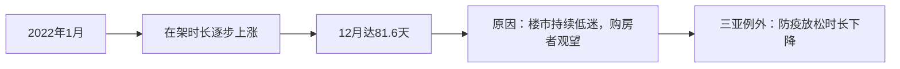
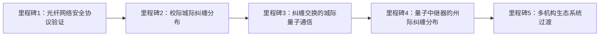
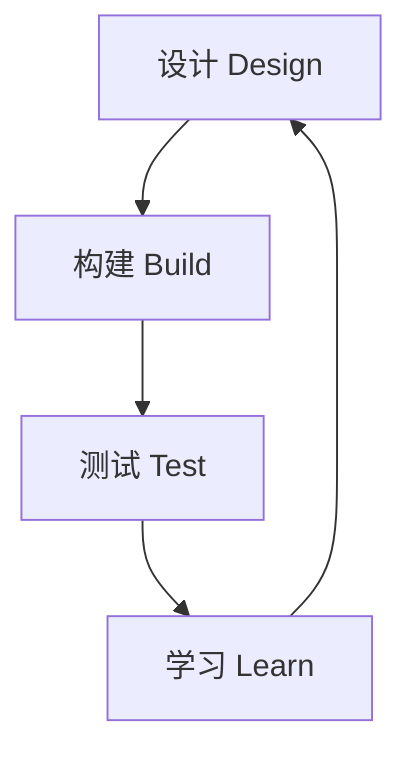
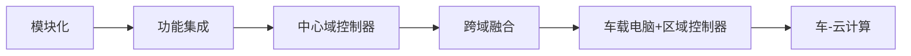

# 《58安居客房产研究院-2022年全国二手房市场报告》章节总结

## 书籍信息
- 书名：2022年58安居客房产研究院全国二手房市场报告
- 作者：58安居客房产研究院（首席分析师：张波；研究总监：陆骑麟；分析师：许之静）
- PDF状态：完整（共18页正文）
- OCR状态：良好

## 目录说明
- 目录识别完整，包含三大部分：一、2022年全国二手房相关政策解读；二、全国40城二手房市场；三、全国40城二手房挂牌价同比涨幅城市排行榜。
- 各章节层级清晰。

## 全书核心主题
本报告系统梳理2022年全国二手房市场运行状况。政策层面，多地取消二手房指导价、放松限售/限购、推行“带押过户”和“认房不认贷”，旨在激活市场。市场层面，在架房源量、新增挂牌量、看房需求热度均呈下降趋势，房源在架时长显著增加，挂牌均价微跌0.6%。报告认为，市场低迷根源在于信心不足，需要经济回升和收入增长等“强心剂”才能全面复苏。此外，报告列出了40城挂牌价同比涨幅排名。

---

## 第1部分：2022年全国二手房相关政策解读

### 核心论点
问题：2022年二手房市场交易低迷，如何通过政策调整改变预期、促进成交？
观点：取消/放松各类限制性政策（指导价、限售、限购）以及推行“带押过户”“认房不认贷”等，有助于降低交易成本、激活改善型需求，但市场信心恢复仍需更长时间。

### 关键概念/事件
- **取消二手房指导价**：多城（北京、广州、西安、成都等）取消指导价，减少行政干预，促进市场成交。
- **取消/放松限售**：因投资性需求消失，哈尔滨、青岛、苏州等城市放松限售，以盘活市场。
- **放松二手房限购**：西安、合肥、大连定向放松，试探市场反应，为全面取消限购做准备。
- **带押过户**：深圳、广州、青岛等城市推行，降低交易风险和成本，激活买卖意愿。
- **认房不认贷**：兰州、郑州、天津等城市实施，减少首付和还贷成本，推动改善型需求入市。

### 逻辑推演
报告首先解释各项政策的初衷与执行细节。例如，指导价曾用于控制虚高挂牌和银行贷款，但降低了流动性；取消后预期逐步改变。限售原为抑制投机，但当前投资需求已不存在，故取消。带押过户将解押环节后置，降低风险。认房不认贷利好改善型需求，降低首付和利率。报告通过政策放松城市明细表，论证政策松绑覆盖一二三线城市，体现出各地对二手房市场复苏的迫切意愿。

### 经典金句/数据
> “取消二手房指导价：能够逐步改变市场预期，促进市场成交。”
> “认房不认贷：减少买房首付和后续还贷成本，更好的推动改善型需求入市。”

---

## 第2部分：全国40城二手房市场

### 核心论点
问题：2022年二手房市场整体表现如何？在架量、时长、价格、热度有何变化？
观点：市场呈现“先平后降”态势，在架房源量下降、在架时长上涨34%、挂牌均价微跌0.6%，看房需求热度持续走低。房东挂牌意愿弱，需求低迷，信心不足是主因。

### 关键概念/事件
- **在架房源量**：全年呈下降趋势，尤其下半年明显，与房东挂牌意愿下降及“一房一码”真房源政策有关。
- **在架时长**：逐月上涨，12月达81.6天历史高位；三亚因防疫政策放松时长下降。
- **新增挂牌量**：持续回落，一线城市年底较年初减幅约七成。
- **看房需求热度指数**：上半年平稳，下半年政策效应弱化后逐步回落。
- **挂牌均价**：全年维持在20300元/平方米左右小幅震荡，广州下跌4.74%，上海上涨3.26%。

### 流程图（在架时长走势）

### 经典金句/数据
> “2022年全国二手房市场整体呈现出先平后降的态势，多维度的楼市刺激政策无法提振楼市。”
> “二手房在架房源的时长出现快速上涨，全年上涨34%，二手房挂牌均价同比下跌0.6%。”
> “最主要还是信心不足导致需求低迷。”
> “上海全年上涨3.26%，北京上涨2.30%，广州下跌4.74%。”

---

## 第3部分：全国40城二手房挂牌价同比涨幅城市排行榜

### 核心论点
问题：2022年40个城市二手房挂牌价同比变化如何？
观点：仅少数城市上涨，多数城市下跌，石家庄涨幅最高（1.63%），南宁跌幅最大（-1.81%）。

### 关键数据
- **涨幅前三**：石家庄（1.63%）、无锡（1.31%）、北京（0.95%）
- **跌幅前三**：南宁（-1.81%）、佛山（-1.20%）、南京（-1.18%）
- 一线城市中深圳微涨0.11%，上海涨0.27%，广州跌0.42%。

### 逻辑推演
报告基于58安居客平台监测数据，统计40城二手房挂牌均价同比涨幅，反映市场冷热不均。涨幅居前的城市多为二三线或一线中的北京上海，跌幅较大的包括部分二线及沿海城市，显示出房价调整的区域差异。

> 说明：该部分PDF中完整列出了40城排名，此处提炼核心。

---

# 《2022企业数字化年度指南》章节总结

## 书籍信息
- 书名：2022企业数字化年度指南
- 作者：红杉中国
- PDF状态：完整（共45页）
- OCR状态：良好

## 目录说明
包含：加速数字化制胜未来、2022企业数字化观察和建议、能打胜仗的数字化组织、技术创新及应用、数字化管理者的自我修养和成长之路、附录等。

## 全书核心主题
本指南基于红杉中国对73家企业的访谈，探讨企业在不确定环境下如何通过数字化实现降本、增收、提效、增强韧性。强调数字化价值观、一把手工程、数据驱动、敏捷组织、技术创新（生成式AI、低代码等）以及数字化管理者成长。认为数字化已成为企业生存和发展的关键。

---

## 第一部分：加速数字化，制胜未来

### 核心论点
问题：在VUCA环境下，企业如何正确认知数字化？
观点：数字化不是IT项目，而是围绕业务价值链的系统工程，目标是降本、增收、提效、降低风险、提升韧性。企业需要建立清晰的数字化认知和价值观。

### 关键概念
- **数字化**：利用技术与数据提升、优化甚至重构业务价值链的全过程。
- **数字化转型**：业务转型的演变，通过数字化技术驱动产品或商业模式创新。
- **VUCA**：不确定性、复杂性、模糊性环境特征。
- **数字化能力体系**：企业从业务转型需求出发形成的有机整合能力。

### 逻辑推演
报告指出企业应回归经营本质，从业务价值链出发构建数字化能力。强调一把手工程、数字化文化、用户思维、产品思维、核心数字资产自主可控。通过增加营收、降本增效、降低有效风险、提升韧性四个方向切入。

### 经典金句
> “数字化以前可能是让一些企业活得更好，而今天是很多企业生存下去的关键。”
> “数字化转型的核心是业务转型。”
> ——红杉中国合伙人刘星

---

## 第二部分：2022企业数字化观察和建议

### 核心论点
问题：2022年企业数字化实践有哪些关键观察和建议？
观点：企业应强化现金流健康度、重新审视PMF、重视伙伴关系、让数据用起来、优化组织、关注数据安全合规。

### 关键概念/事件
- **强化现金流**：保证6个月以上生存线，严控收支，业财一体化。
- **重新审视PMF**：聚焦健康盈利和战略业务，高质量发展。
- **数据驱动**：让业务用起来，解决数据标准、口径、完整性问题。
- **数据安全合规**：遵守《网络安全法》《数据安全法》《个人信息保护法》《数据出境安全评估办法》。
- **规模企业挑战**：合规、创新、自我革命困难突出。

### 案例
- **乡村基**：数字化业财一体化、私域流量、SAP系统，保障现金流和运营效率。
- **安和护养**：六大IT系统互联互通，精细化人效、床效管理，人力节省30%。

### 经典金句
> “企业的存在就是为了用户创造价值，这是所有活动的根本出发点。”
> “使用率比上线更重要。”

---

## 第三部分：能打胜仗的数字化组织

### 核心论点
问题：如何构建适应数字化的组织与文化？
观点：数字化文化是土壤，需要清晰表达、积极主动、团结一心。组织模式需根据企业战略和需求选择（探索式、业务协调式、科技协调式、集中式）。企业应快速调整团队到最佳状态，关注人才市场波动。

### 关键概念
- **数字化文化**：更扁平、更透明、限制特权，挑战既得利益者。
- **组织模式**：四种推动方式——各部门各自为战、业务部门牵头、技术部门牵头、成立独立数字化部门。
- **团队调整**：提升人才密度或降级保证业务持续运转。

### 案例
- **生鲜传奇**：设置平行管理模型、技术赋能、物资储备、“备胎”策略，锤炼打胜仗的团队。

### 经典金句
> “数字化文化是培育企业数字化的土壤。”

---

## 第四部分：技术创新及应用

### 核心论点
问题：哪些新兴技术值得企业关注？如何应用？
观点：关注Gartner2023年十大战略技术趋势，包括数字免疫系统、应用可观测性、AI信任、产业云平台、平台工程、无线价值实现、超级应用、自适应AI、元宇宙、可持续发展技术。企业需根据自身需求选择，避免盲目投入。

### 关键概念
- **生成式AI**：无监督/半监督学习，生成全新内容（文本、图像、视频等）。应用场景：艺术创作、药物研发、虚拟数字人。
- **低代码/无代码**：降低应用搭建门槛，提高灵活性、高效率、低成本。挑战：行业针对性、系统集成、复杂定制。

### 逻辑推演
报告指出企业引入新技术的两大挑战：回报价值评估与人才配套。决策考量因素：价格与投资回报、技术成熟度、业务适配性。生成式AI已进入快速发展阶段，低代码/无代码逐步普及。

### 经典金句
> “技术不是越新越好，适合企业自身发展的技术才是最好的。”
> “生成式AI仍然处于非常早期的阶段。”

---

## 第五部分：数字化管理者的自我修养和成长之路

### 核心论点
问题：数字化管理者（CIO/CTO/CDO）如何成长并实现价值？
观点：CIO角色从职能型向转型型和战略型迁移。需要务实“小胜”建立信任，帮助业务成功。审视职业观，追求市场价值和自我价值。

### 关键概念
- **CIO角色分布**：职能型、转型型、战略型。能力结构各有侧重。
- **三个价值**：企业价值（被替换成本）、市场价值（市场定价）、自我价值（成就感）。
- **工作观**：差事（Job）、职业（Career）、使命（Calling）。

### 逻辑推演
报告认为CIO应深入业务，参与战略制定。通过解决具体问题积累口碑，推动技术与业务融合。建议将职业发展视为自我价值投资，追求“人生无忧+职场无忧”。

### 经典金句
> “智慧帮你看清方向，勇气助你突破困难，耐心保你坚持到底。”
> “天气好的时候你不可能超过15辆车，而阴雨天的时候可以。” ——埃尔顿·塞纳

---

# 《2022全球前沿科技热点》章节总结

## 书籍信息
- 书名：2022全球前沿科技热点
- 作者：上海科学技术情报研究所、科睿唯安
- PDF状态：完整（共110页）
- OCR状态：良好

## 目录说明
包含七个领域：信息技术（5项）、生命与健康（4项）、材料（3项）、能源（3项）、空间及交通运输（1项）、气候生态与环境（2项）、先进制造及其他（2项），共20项前沿科技热点。

## 全书核心主题
本报告采用定性定量结合的方法（文本分析、专利分析、论文聚类、互联网媒体大数据），筛选出2022年20项全球前沿科技热点。总结趋势：基础科学研究为技术创新奠定基础；信息技术与其他产业技术加速融合；智能化成为主场；科技创新以人类需求为导向（能源、环境、健康）。

---

## 第1章：信息技术领域

### 核心论点
问题：信息技术领域有哪些前沿热点？
观点：量子互联网、三维异质集成、生成式AI、元宇宙、Web3.0是当前信息技术领域的五大热点，分别代表了通信、芯片、人工智能、虚拟空间和下一代互联网的发展方向。

### 关键概念/事件

- **量子互联网**：利用量子力学定律进行量子信息交换的网络，不会取代经典互联网而是补充。关键技术：量子中继器、量子存储、纠缠分布。主要国家：美国（DOE/NSF项目）、欧盟（QIA）、中国（潘建伟团队）、日本。
- **三维异质集成（3DHI）**：将在不同材料系统制造的组件堆叠在一个封装中，实现小尺寸、多功能、高性能。核心技术：硅通孔（TSV）、混合键合、背面供电。主要玩家：英特尔、台积电、三星。
- **生成式AI**：无监督/半监督学习生成全新内容（文本、图像、视频）。模型：GAN、Transformer、VAE。应用：内容创作、药物研发。代表：OpenAI DALL·E 2、Google Imagen/Parti。
- **元宇宙**：基于VR/AR/XR、区块链、AI等技术的虚拟与现实交融的数字世界。六大核心技术：AI、交互技术、区块链、网络与运算、物联网、游戏。发展阶段：当前处于探索阶段早期。
- **Web3.0**：基于区块链的去中心化互联网，用户拥有数据所有权。关键技术：区块链、智能合约、DAO、NFT、DeFi。国内探索：联盟链（如长安链）、数字藏品。

### 流程图（量子互联网发展阶段）

### 经典金句/数据
> “量子互联网将是量子技术时代真正到来时的计算机网络基础。”
> “生成式AI被认为是一种衍生的新生产动力，是多领域数字化进程的底层技术。”
> “Gartner预测到2025年超过30%的新药和新材料将使用生成式AI发现。”

---

## 第2章：生命与健康领域

### 核心论点
问题：生命与健康领域有哪些前沿热点？
观点：AI分子发现与合成、生物铸造厂、光免疫疗法、环状RNA是四大热点，分别代表了药物研发、合成生物学、癌症治疗和RNA疗法的前沿。

### 关键概念/事件

- **AI分子发现与合成**：利用深度学习、生成模型发现新药分子和合成路线。代表：英矽智能GENTRL 21天发现DDR1抑制剂；Chemputer系统实现化学数字化。
- **生物铸造厂（Biofoundry）**：高度自动化的合成生物学平台，运行“设计-构建-测试-学习”（DBTL）循环。全球生物铸造厂联盟（GBA）由16家机构组成。
- **光免疫疗法**：将光敏剂与抗体结合，近红外照射破坏癌细胞。日本Akalux已获批用于头颈癌。
- **环状RNA（circRNA）**：单链闭合环状RNA，稳定性高、免疫原性低，被誉为mRNA2.0。代表企业：Orna Therapeutics、Laronde、环码生物、圆因生物。

### 流程图（DBTL循环）

### 经典金句/数据
> “环状RNA技术的出现完美避开mRNA技术上的缺陷，相当于mRNA技术2.0版。”
> “环状RNA经过基础研究开始向临床转化是一个必然趋势。”

---

## 第3章：材料领域

### 核心论点
问题：材料领域有哪些前沿热点？
观点：石墨炔、闭环塑料、储能纤维是三大热点。石墨炔是新型碳同素异形体；闭环塑料强调可回收再利用；储能纤维实现可穿戴设备柔性供电。

### 关键概念/事件

- **石墨炔（Graphdiyne）**：由sp和sp²杂化碳构成的二维全碳材料，2010年李玉良团队首次合成。具有大共轭体系、活性位点多，应用于能源、催化、生物医药。
- **闭环塑料（Closed-loop Plastic）**：可完全回收再利用的塑料，分为物理回收和化学回收（裂解、解聚）。代表性企业：Plastic Energy、Brightmark、Mura。
- **储能纤维（Energy-storage Fibers）**：可编织成织物的纤维状储能器件。制备方法：涂覆法、电沉积法、纺丝法。代表性团队：复旦大学彭慧胜团队、MIT Khudiyev团队。

### 经典金句/数据
> “石墨炔必将在未来的应用中具有巨大的潜力。”
> “目前废塑料的回收利用以物理回收为主，化学回收占比不足1%。”

---

## 第4章：能源领域

### 核心论点
问题：能源领域有哪些前沿热点？
观点：高效钙钛矿太阳能电池、虚拟电厂、绿色制氨是三大热点，代表了光伏技术、电网灵活性、绿氢/绿氨能源载体。

### 关键概念/事件

- **高效钙钛矿太阳能电池**：第三代光伏技术，单结效率25.7%，叠层效率31.3%。优点：成本低、工艺简单。挑战：大尺寸制备、稳定性差。
- **虚拟电厂（VPP）**：通过软件聚合分布式能源、储能、可控负荷，参与电网调度。关键技术：计量、通信、智能调度。国内示范：上海黄浦商业建筑VPP。
- **绿色制氨（Green Ammonia）**：可再生能源电解水制氢，再通过Haber-Bosch工艺合成氨，实现零碳排放。三种电解技术：AWE、PEMWE、SOE。国际项目：NEOM绿氢工厂（Air Products）。

### 经典金句/数据
> “钙钛矿电池是目前最有希望进入光伏市场的第三代光伏技术。”
> “预计到2030年全球绿色氢市场将达到54亿美元。”

---

## 第5章：空间及交通运输领域

### 核心论点
问题：空间及交通运输领域的前沿热点？
观点：卫星通信（SatCom）尤其是低轨通信星座（Starlink、OneWeb等）是当前热点，向高通量、天地一体化、软件定义方向发展。

### 关键概念/事件
- **卫星通信**：利用人造卫星转发无线电波。按轨道分LEO、MEO、GEO。
- **低轨星座**：SpaceX Starlink（已超1700颗）、OneWeb、Telesat、Amazon Kuiper。
- **关键技术**：一体化融合网络架构（SDN/NFV）、多波束天线、激光通信、星上路由。

### 经典金句/数据
> “低轨卫星通信网络成为发展热潮。”
> “截至2021年末，全球共有4852颗在轨卫星，通信卫星占比64.4%。”

---

## 第6章：气候、生态与环境领域

### 核心论点
问题：气候与环境领域的前沿热点？
观点：零碳排放（碳中和）和微塑料处理是两大热点。零碳依赖可再生能源、氢能、CCUS；微塑料处理关注水处理工艺优化和新型降解技术。

### 关键概念/事件
- **零碳排放**：通过可再生能源、氢能、储能、CCUS实现CO2净零排放。主要国家战略：美国、欧盟、日本、韩国、中国。
- **微塑料处理**：优化污水处理工艺（混凝、膜过滤）和新技术（高级氧化、生物降解、锚定技术）。中国发现冰中微塑料反常加速降解。

### 经典金句/数据
> “到2025年，中国数字经济占GDP的比重将提升至50%以上。”（引自零碳章节相关数据）
> “微塑料在冷冻条件下48天即可达到自然水体中30~70年的降解效率。”

---

## 第7章：先进制造及其他领域

### 核心论点
问题：先进制造领域的前沿热点？
观点：软件定义汽车的制造（SDV）和柔性感知机器人是两大热点。SDV强调汽车电子电气架构集中化和软件SOA架构；柔性感知机器人结合柔性材料、感知技术，应用于工业和医疗。

### 关键概念/事件
- **软件定义汽车（SDV）**：软件参与汽车全生命周期，硬件标准化，EEA从分布式向中央集中式演进。博世六阶段路线图。代表：特斯拉Model Y中央计算模块。
- **柔性感知机器人**：由柔性材料构成，具备力觉、视觉等感知能力，可适应复杂环境。驱动方式：电动、气动、化学反应。代表：MIT软体机器人、哈佛Octobot、达特茅斯软体机械鱼。

### 流程图（汽车EEA升级路线图）

### 经典金句/数据
> “软件成为汽车的大脑和灵魂。”
> “柔性感知机器人有望逐步替代传统工业机器人，成为生产线上的主力设备。”

---

# 《2023春节回乡见闻系列：春江水暖，消费新生》章节总结

## 书籍信息
- 书名：2023春节回乡见闻系列：春江水暖，消费新生
- 作者：国泰君安证券研究所（方奕、黄维驰、鲍雁辛等）
- PDF状态：完整（共50页）
- OCR状态：良好

## 目录说明
包含：疫情过峰与消费回归、出行返乡、户外旅行、商超零售、酒店餐饮、影视、服装、家电、汽车、风险提示等。

## 全书核心主题
本报告基于30位分析师与100+投顾的春节回乡调研，展现2023年春节消费复苏的真实图景。结论：疫情快速过峰，春节消费强势回归，尤其是中小城市旅游、商超、餐饮、影视等修复明显，部分领域超预期。三四线城市新能源车渗透率快速提升。同时地产销售仍承压，工业生产节前偏弱。

---

## 第1章：疫情超预期过峰，春节消费强势回归

### 核心论点
问题：2023年春节消费复苏的总体态势如何？
观点：全国疫情在2022年底前快速达峰，春节前新增感染大幅下降，为消费复苏提供前提。出行、旅游、零售、餐饮、票房等数据均较2022年明显增长，部分领域热度超出投资者预期。

### 关键数据
- 春运前15天铁路客运量同比增长27.3%
- 春节前4天携程酒店、民宿、门票等订单超2019年
- 年货节前5天网络零售额同比增4.7%
- 春节档票房超2022年
- 三四线城市景区修复更为强劲，甚至超过疫情前

### 经典金句
> “消费复苏是一致共识，但回乡真切感受到各地春节的超预期火热。”

---

## 第2章：出行返乡

### 核心论点
问题：春节返乡出行恢复情况如何？
观点：民众返乡意愿强烈，航空虽未完全修复但萧条不再；铁路返乡一票难求，进城列车空座率高；冷清的都市与热闹的家乡形成鲜明对比。

### 关键事件
- 深圳机场大排长龙，乌鲁木齐机场客流恢复。
- 上海—六安火车票准点秒光；由郑州开往上海高铁空座率一半。
- 贵州遵义返乡人次是过去三年3倍，堵车超5小时。

---

## 第3章：户外旅行

### 核心论点
问题：春节户外旅行热度如何？
观点：整体热度抬升，海南度假与冬季滑雪火爆超预期；大城市及热门景区修复不及2019年；中小城市景区修复更为明显，甚至超过疫情前水平；部分非热门景点以降价换人气。

### 关键数据/案例
- 三亚：酒店提前爆满，免税城排队超1小时，物价上涨。
- 长白山滑雪：酒店溢价且售罄，滑雪排队15-20分钟。
- 吉林松花湖滑雪场：停车场爆满，超2019年水平。
- 峨眉山：大年初一至初三接待超4万人次/天，较2019年大幅增长。
- 太原古县城：门票从108元降至50元，人气爆棚。

---

## 第4章：商超零售

### 核心论点
问题：商超零售修复情况如何？
观点：客流量显著回升，亲子与新兴消费（VR体验店、小象动物公园）成为亮点；量贩式零食店快速抢占县域市场；品牌服饰加大折扣去库存。

### 关键事件
- 周口市万达广场：VR体验店、小象动物公园人满为患。
- 商水县好想来零食工厂：加盟模式，SKU约1800个，价格优惠1.5-2元。
- 品牌服饰：伊芙丽、欧时力冬装5折，波司登6-7折。

---

## 第5章：酒店餐饮

### 核心论点
问题：酒店餐饮行业表现如何？
观点：连锁酒店逆势扩张进入中小城市，春节入住率虽未达疫情前但明显抬升；网红餐饮开启长时间排号模式，烟花消费回归增添年味。

### 关键事件
- 辽宁黑山县：老牌酒店出清，首旅、锦江等连锁酒店疫情期间扩张。
- 长沙茶颜悦色：五一广场5家门店全部排队，平均1.25分钟/位。
- 长沙北二楼烧烤：晚上23:20前排位65桌，91分钟翻台61桌。
- 重庆：除夕夜长江嘉临江交汇处盛大烟火灯光秀，人群摩肩接踵。

---

## 第6章：影视

### 核心论点
问题：春节档电影市场表现如何？
观点：观影客流同比显著提升，热门影片座无虚席，上座率达85%-95%，票房超2022年。

### 关键数据/案例
- 武汉：上座率85%以上，取票排队，衍生品销售火爆。
- 江西吉安：恢复至2019年80%以上。
- 安徽六安：黄金时段门票提前一天售罄。
- 山西永济：除上午外场场爆满，排队等电梯2趟以上。

---

## 第7章：服装

### 核心论点
问题：春节服装消费情况？
观点：疫后出行需求增加，服装消费必需属性突显，品牌加大折扣去库存，冬装换新需求旺盛。

### 关键数据
- 潍坊诸城市：鄂尔多斯男装优于女装，折扣力度大。
- 辽宁宽甸县：年前集中消费，转化率高，年后客流减少。

---

## 第8章：家电

### 核心论点
问题：家电消费特征？
观点：重点陈列后装类白电（空冰洗）及黑电（电视机），前装类厨电促销力度较大。

### 关键事件
- 山西汾阳：京东家电专卖店重点陈列空冰洗、电视机，厨电位置偏僻。火星人集成灶标价1-1.1万，直接减4千。

---

## 第9章：汽车

### 核心论点
问题：新能源车在三四线城市的渗透情况？
观点：三四线城市新能源车消费正快速释放，纯电车型占比高（95.6%），特斯拉降价后销量攀升，国产品牌比亚迪、蔚来、理想更受认可，充电桩密度低仍是制约。

### 关键数据
- 河南濮阳：停车场546辆车，新能源车占比16.5%（纯电95.6%）。
- 江西南昌：特斯拉降价后销量明显上升；比亚迪客流量50-60人/日。
- 江苏东台：新能源车很少，充电桩缺乏。

---

## 第10章：风险提示

- 经济复苏不及预期
- 草根调研代表性或存在偏差

---

# 《2023春节回乡见闻系列二：年味里的经济恢复与转型》章节总结

## 书籍信息
- 书名：2023春节回乡见闻系列二：年味里的经济恢复与转型
- 作者：国泰君安证券研究所（方奕、黄维驰、鲍雁辛等）
- PDF状态：完整（共51页）
- OCR状态：良好

## 目录说明
包含：金融地产（保交楼、销售、银行）、企业经营、新能源车、能源转型、产业集群、风险提示等。

## 全书核心主题
本报告继续基于春节回乡调研，聚焦经济恢复与转型中的深层次现象：地产销售仍承压但保交楼推进；企业经营信心边际修复，部分地区龙头加速扩张；新能源车渗透加速但竞争加剧；老能源退出、光伏屋顶推广；新兴产业集群快速发展，能源供应面临新挑战。

---

## 第1章：金融地产

### 核心论点
问题：春节期间地产销售、保交楼、银行存贷情况如何？
观点：地产销售仍承压，居民收入与房价预期疲弱，新盘供给缩减；保交楼工作陆续推进，但不同主体落地力度有差异，本地优质企业拿地复工更积极；银行积极揽储，存取款需求两旺。

### 关键事件
- 重庆中央公园：新盘少，到访量4-5组/1-2小时，以自住为主。
- 山东滕州：城镇化仍有空间，未婚青年入城买房为主流。
- 广西桂林：融创文旅城复工低于预期，兴进颐景城已交付，烂尾楼商改住盘活。
- 贵州黔东南：木炭厂受上游板材厂开工不足影响，未满产。
- 安徽芜湖：农商行宣传车揽储，银行人满为患。

### 经典金句
> “市场没有太多新盘供给，基本上是19、20年以来的项目持续销售。”

---

## 第2章：企业经营

### 核心论点
问题：实体企业经营状况与信心如何？
观点：疫情对中小微企业冲击较大，但企业信心边际修复，部分地区龙头表示年后加速扩张。银行持续加大中小微企业贷款支持力度（2022年河北中小微企业新增贷款同比增长近70%）。

### 关键案例
- 广东惠州惠东鞋业：档口空置率从15%升至30%，部分商户转型直播，多数从业者并不悲观。
- 江西吉安：网吧客流缩减但老板不悲观；大型连锁超市加速扩张。
- 广东河源：海鲜店除夕营业额从8万增至14万。
- 云南楚雄：KTV恢复到2019年70-80%，店家数量增多。

### 经典金句
> “大多企业对于来年的经营并不悲观，一是基于经济复苏的预期，二是政策支持，三是疫后经营数据超预期修复。”

---

## 第3章：新能源车

### 核心论点
问题：三四线城市新能源车市场新变化？
观点：中小城市国产品牌渗透加速，但竞争格局恶化。特斯拉降价冲击明显，产品力成为关键。充电桩密度低仍制约渗透率。

### 关键数据/事件
- 江西南昌：特斯拉降价后销量明显上升；比亚迪客流量稳定；零跑因特斯拉降价流失客户。
- 河南信阳：新能源车占比约5%，购买意愿增强。
- 山东济宁：以小型代步车为主，充电桩密度低。
- 结论：全年新能源车销量在降价下有支撑，但行业竞争烈度加剧。

---

## 第4章：能源转型

### 核心论点
问题：老能源退出与新能源推广情况？
观点：老能源逐步退出（如洛阳龙门煤矿彻底关停），乡村光伏屋顶快速推广。

### 关键事件
- 河南洛阳龙门煤矿：因资源枯竭和保供目标达成，2023年初彻底关停。
- 河南信阳光山县：近50户村庄已有一定比例光伏屋顶。

---

## 第5章：产业集群

### 核心论点
问题：地方新兴产业集群发展态势？
观点：新兴产业集群发展快于预期（西安新能源车/半导体、溧阳动力电池），当地政府抓住龙头布局窗口期，形成完整产业链。高新产业园区用电负荷增速远超市区，对能源供应提出新挑战。

### 关键案例
- 西安：比亚迪年产60万辆新能源车，接近全国一半；三星半导体、华为研发中心扩张。
- 江苏溧阳：动力电池产业集群，宁德时代、璞泰来等聚集，产值750亿元（2022年前10月）。电动化战略推进，充电桩、换电站普及。

### 经典金句
> “产业发展为能源供应带来新挑战。”
> “旅游+动力电池已成为溧城发展格局。”

---

## 第6章：风险提示

- 经济复苏不及预期
- 草根调研代表性或存在偏差

---

# 《2023年中国商业十大热点展望（英）》章节总结

## 书籍信息
- 书名：Ten Highlights of China‘s Commercial Sector 2023
- 作者：中国商业联合会专家委员会、冯氏集团利丰研究中心
- PDF状态：完整（共52页）
- OCR状态：良好

## 目录说明
包含：前言、组织机构、专家组成员、对企业的启示和对外企的建议、十大热点正文。

## 全书核心主题
本报告由160多位中国大陆专家参与，预测2023年中国商业十大趋势。核心方向：二十大精神推动流通改革、消费市场韧性与反弹、统一大市场建设、疫后经济刺激、平台经济规范与线上零售、数字化转型、绿色转型、餐饮业复苏创新、农产品流通高质量发展、商贸物流数字化与绿色发展。

---

## 热点1：二十大精神驱动流通改革，促进商业高质量发展

### 核心论点
问题：二十大对商业流通领域有何指引？
观点：高质量发展为主题，构建高效顺畅的流通体系，发展农村电商，提升供应链韧性与稳定性。

---

## 热点2：消费市场展现韧性，2023年将反弹

### 核心论点
问题：2023年消费市场能否复苏？
观点：2022年零售总额36.1万亿元，同比增长0.6%。2023年预计增长6%。新能源汽车、电商、基本消费品类表现亮眼。政府出台多项刺激政策（购车税减半、家电下乡等）。

---

## 热点3：中国建设统一大市场，现代流通网络促进商品流动

### 核心论点
问题：统一大市场建设的意义？
观点：打破地方保护主义，建立全国统一的市场规则，降低交易成本，促进要素和商品自由流动，服务“双循环”战略。

---

## 热点4：疫后经济刺激与纾困措施支持复苏

### 核心论点
问题：政府如何支持疫后经济恢复？
观点：出台43条措施扶持服务业（餐饮、零售、旅游），提供税费减免、社保缓缴、降低平台佣金等。2022年新增减税降费超3.7万亿元。

---

## 热点5：平台经济向公平、规范、有序发展，线上零售寻求新机遇

### 核心论点
问题：平台经济与线上零售的发展方向？
观点：政府加强反垄断和数据安全监管，平台企业改善治理。线上零售注重服务而非价格竞争，线上线下融合加速。即时零售（30-60分钟达）预计2025年超1万亿元。

---

## 热点6：数字化转型加速商业创新与升级

### 核心论点
问题：数字化如何重塑商业？
观点：5G、大数据、AI、VR/AR等技术深度融入零售全渠道。新消费趋势（露营经济、宠物经济、国潮、折扣店）涌现。数字化供应链成为未来重点。

---

## 热点7：流通业绿色转型加速，绿色消费成为常态

### 核心论点
问题：绿色消费发展态势？
观点：双碳目标推动商业绿色转型。电商平台推出碳账户、绿色专区；消费者（尤其90后、00后）愿为绿色产品支付10-20%溢价。从政策驱动转向需求驱动。

---

## 热点8：餐饮业曲折复苏，数字化创新抓住新机遇

### 核心论点
问题：餐饮业复苏与创新方向？
观点：2022年餐饮收入约4.4万亿元，同比下降6-7%。2023年预计恢复增长。数字化（智能烹饪、机器人）、外卖、预制菜、夜经济、一人食等成为增长点。

---

## 热点9：农产品流通体系进入高质量发展新阶段，加速乡村振兴

### 核心论点
问题：农产品流通如何助力乡村振兴？
观点：农产品批发市场从“数量”转向“质量”。政府支持产地冷链物流、数字化供应链。RCEP生效促进农产品贸易。地理标志农产品受消费者青睐。

---

## 热点10：商贸物流数字化与绿色发展，助力产业供应链升级

### 核心论点
问题：物流行业趋势？
观点：智慧物流（数字化、智能化、互联网化）降低成本。绿色物流（可循环包装、新能源车）加速。应急物流体系建设受到重视。

---

## 对企业的启示和对外企的建议（附录）

### 核心论点
问题：企业应如何应对2023年中国商业趋势？
观点：关注绿色消费、沉浸式全渠道体验、数字化转型、新消费趋势（国潮、露营经济等）、农村市场潜力、供应链效率、政府政策。

### 关键建议
- **绿色化**：年轻消费者是绿色消费主力，企业应加强绿色营销。
- **沉浸式零售**：利用VR/AR等技术创造全渠道体验。
- **数字化**：从前端向后端供应链延伸，提升整体运营能力。
- **新消费趋势**：抓住国潮、露营、宠物等新需求。
- **农村市场**：改善农村流通体系，挖掘消费潜力。
- **供应链效率**：即时零售等新模式依赖高效的端到端供应链。
- **政策跟进**：及时了解统一大市场、促消费等政策动态。

---

*以上为五个PDF文件的章节总结，按照结构化Markdown输出。*