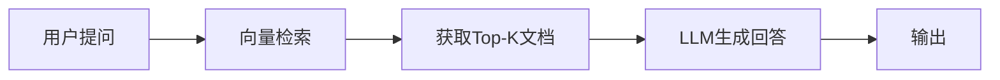
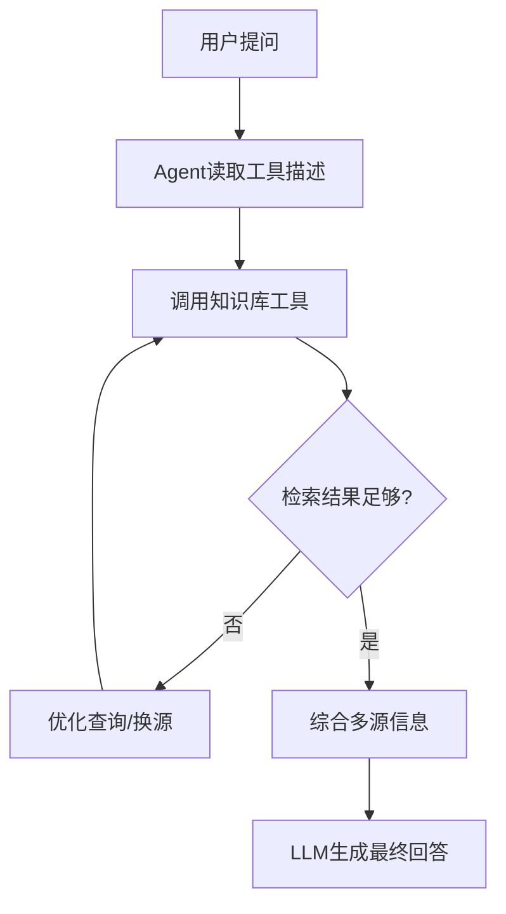
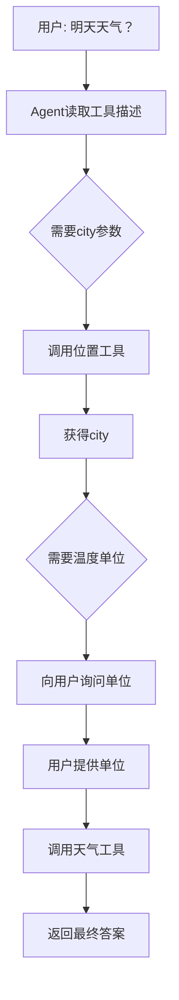
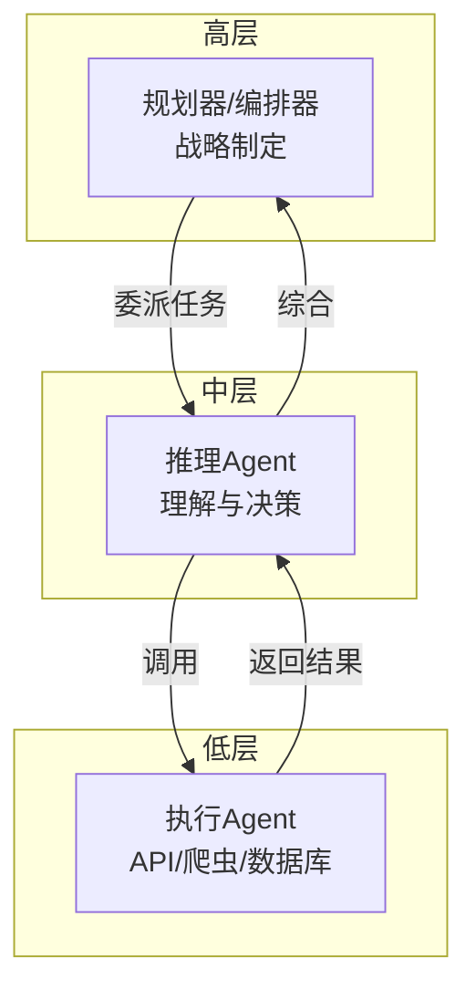

# 《AI Agents in Practice》章节总结

## 书籍信息
- **书名**：AI Agents in Practice: Design, Implement, and Scale Autonomous AI Systems for Production
- **作者**：Valentina Alto
- **出版社**：Packt Publishing
- **ISBN**：978-1-80580-135-1
- **PDF 状态**：基于提供的文本内容（包含第1-125页），为早期访问出版物，文本可读性较高，部分页面存在OCR识别痕迹但整体完整。
- **OCR 状态**：内容清晰，偶有格式偏移（如页眉页脚错位），但未影响核心信息提取。

## 目录说明
- **目录识别情况**：依据第5-8页及第9-10页的目录结构，本书共9章。本次上传内容完整覆盖第1章、第2章、第3章全文，第4章至第9章仅存目录标题，无正文。
- **章节对应依据**：严格按照原书目录顺序，对第1-3章进行逐章总结。
- **OCR 修复说明**：未发现重大识别错误；部分图表（如Figure 1.1等）以文字描述形式存在，已根据描述重建逻辑流程。

## 全书核心主题（基于1-3章）
本书聚焦于生产环境中自主AI系统的设计、实现与扩展。作者从生成式AI工作流的演进出发，阐释了从狭义AI到基础模型、大语言模型（LLM）的发展历程，并引入了检索增强生成（RAG）、多模态、推理模型等关键突破。在此基础上，指出LLM本身的局限性（缺乏长期记忆、无法自主决策、难以执行多步任务等），由此引出AI Agent的概念——一种结合LLM、记忆、工具调用与编排层的智能实体。第二章进一步定义了AI Agent的组成（LLM、系统消息、记忆、工具、知识库、编排层），并将其分为检索型、任务型和自主型三类。第三章强调AI编排器的必要性，剖析其核心组件（工作流管理、记忆处理、工具集成、错误处理、安全合规），并对比了LangChain、LlamaIndex、AutoGen等主流编排器。整体而言，本书为开发者提供了一条从概念到落地的清晰路径：如何通过编排器将LLM转化为能够自主感知、推理、行动并与外部环境交互的智能体系统。

---

## 第1章：Evolution of GenAI Workflows since November 2022

### 1. 核心论点
**问题**：自2022年11月以来，生成式AI工作流经历了怎样的演进？为什么单靠LLM不足以构建真正智能的系统？
**观点**：作者认为，LLM从简单的文本生成发展到与数据对话（RAG）、多模态融合，但仍缺乏持久目标、长期记忆、自主决策和外部交互能力。因此，需要在LLM之上增加一个“智能层”——即AI Agent——以实现推理、规划与行动。

### 2. 关键概念/事件
- **基础模型（Foundation Models）**：在大规模多样化数据上预训练的通用模型，可通过微调适应多种任务，是LLM的母体。
- **涌现行为（Emergent Behaviors）**：当模型规模（参数、数据、训练时间）达到一定程度时，意外出现的复杂能力，如上下文学习、思维链推理、类比推理等。
- **检索增强生成（RAG）**：通过向量数据库检索外部知识，将检索结果与用户查询一同输入LLM，生成基于事实的、可溯源的回答，降低幻觉风险。
- **多模态LLM（MLLM）**：能同时处理文本、图像、音频、视频等多种数据类型的模型，如GPT-4o、Gemini。
- **推理语言模型（RLM）**：如OpenAI o1/o3、DeepSeek R1，通过“内部思维链”延长推理时间，在数学、编程等复杂任务上表现优异，但计算成本更高。

### 3. 逻辑推演/叙事脉络
作者首先回顾了从“狭义AI”到“基础模型”的范式转变，指出传统模型碎片化、脆弱、维护成本高的缺点。然后深入LLM内部机制（tokenization、embedding、transformer、反向传播），并对比了私有LLM（闭源、API付费）与开源LLM（可本地部署）。接着，梳理了近期三大突破：
- **小型语言模型（SLM）与微调**：通过LoRA、Adapter tuning等高效微调技术，让SLM在特定领域达到接近LLM的性能，同时降低资源消耗。
- **模型蒸馏**：将大型教师模型的“软标签”（概率分布）传授给学生模型，在保持精度的前提下大幅压缩模型尺寸。
- **推理模型**：以DeepSeek R1为代表，采用纯强化学习+多阶段训练，以极低成本实现与顶级模型媲美的推理能力。
随后，作者描绘了通往AI Agent的路径：从纯文本生成 → RAG（与数据对话）→ 多模态交互，每一步都暴露了LLM的局限性（无记忆、无自主、无多步执行、无外部交互）。因此，必须引入AI Agent作为额外的智能层。

### 4. 经典金句/数据
> “The key innovation behind foundation models is transfer learning. Rather than learning from scratch, these models transfer knowledge gained from general training to specific problems.” (p.15)
> “In the context of language models, hallucination refers to the generation of information that is plausible-sounding but false or unsupported by factual data.” (p.45)
> DeepSeek R1训练成本：约2000块NVIDIA H800 GPU，55天，560万美元。(p.41-42)
> OpenAI o3在ARC-AGI基准测试中得分75.7%。(p.37-38)

---

## 第2章：The Rise of AI Agents

### 1. 核心论点
**问题**：什么是AI Agent？它由哪些核心组件构成？有哪些不同类型？
**观点**：作者定义AI Agent为一种能够感知环境、推理目标、做出决策并执行行动的软件实体，其核心在于将LLM作为“推理引擎”，并辅以系统消息、记忆、工具、知识库和编排层。根据复杂度和自主性，Agent可分为检索型（Agentic RAG）、任务型（自动化特定操作）和自主型（规划、自适应、持续学习）三大类。

### 2. 关键概念/事件
- **Agent的演进路线**：RPA（规则驱动）→ 传统ML/RL Agent（学习但不泛化）→ LLM-based Agent（通用推理+工具调用）→ 多Agent系统与自复制Agent → AGI Agent。
- **Agent核心组件**：LLM（大脑）、系统消息（角色/约束）、记忆（短/长期）、工具（API/数据库/脚本）、知识库（专有数据）、编排层（任务流控制）。
- **工具自然语言描述**：每个工具都附带人类可读的描述，LLM根据用户问题阅读描述并自主决定调用哪个工具。
- **检索型Agent（Agentic RAG）**：将知识源视为“工具”，可迭代、多步检索，动态调整搜索策略，优于传统单次RAG。
- **自主型Agent**：能结合检索与行动，自主规划、分解任务、执行并基于反馈自我调整，实现端到端流程自动化（如诊所排班系统）。

### 3. 逻辑推演/叙事脉络
作者从自动化历史切入：RPA严格遵循预定义规则，缺乏灵活性；传统ML/RL Agent（如AlphaGo）能在特定领域学习，但无法跨领域泛化。LLM的出现带来了突破——它们不仅能理解自然语言，还能通过工具描述“学会”调用外部能力。作者以“AI导师”为例，详细拆解了每个组件的作用：LLM生成解释，系统消息确保教育导向，记忆跟踪学生历史，知识库引用教材，工具调用日历插件。接着，对比了传统RAG与Agentic RAG：前者一次检索后直接生成答案；后者可以递归检索、识别信息缺口、多源综合，从而输出更完整准确的回答。任务型Agent进一步将检索与行动结合，例如自动处理患者预约邮件、查询系统、草拟回复、最终完成预订。自主型Agent则拥有最高自由度：它能够监控多渠道输入、动态优先级排序、实时适应突发状况（如医生请假），并在每天结束时分析结果进行持续学习。最后，作者强调自主程度是可配置的，需根据业务场景和对精度的信心来决定。

### 4. 流程图（Agentic RAG对比）

#### 传统RAG流程

#### 检索型Agent（Agentic RAG）流程

### 5. 经典金句/数据
> “An AI agent is a software-based entity capable of perceiving its environment, reasoning about its goals, making decisions, and executing actions—often autonomously—through interaction with external systems.” (p.65)
> “System message: Think about the system message as the ‘mission’ of the agent.” (p.65)
> “The real power of an AI agent comes to life when they can combine retrieval skills with actionable tasks.” (p.79)
> 自主型Agent在诊所排班中的持续学习：“At day’s end, it analyzes outcomes, updates patient preferences, and adjusts future prioritization logic.” (p.88)

---

## 第3章：The Need for an AI Orchestrator

### 1. 核心论点
**问题**：为什么复杂的AI Agent系统需要编排器？编排器提供哪些核心能力？
**观点**：随着AI Agent能力增强、组件增多，必须有一个中心枢纽来管理工作流、记忆、工具集成、错误处理和安全性。编排器通过抽象化与模块化，让不同层级的Agent（执行层、推理层、规划层）各司其职，实现可扩展、可维护的智能系统。

### 2. 关键概念/事件
- **自主性（Autonomy）**：Agent能够自主决定调用哪些工具、何时向用户询问缺失参数、如何组合多步行动。例如，天气Agent自动从位置工具获取城市参数，再向用户询问温度单位。
- **抽象与模块化**：将复杂系统分解为可互换、可复用的组件。以城市交通管理为例：交叉口Agent（实时信号控制）、区域协调Agent（多路口平衡）、全市系统（长期规划与应急响应）。
- **编排器核心组件**：
  - 工作流管理：顺序、并行、条件、分层、群聊等多种模式。
  - 记忆处理：短期（会话内）、长期（向量数据库）、语义缓存（基于embedding的近似匹配）。
  - 工具集成：API、数据库、外部计算。
  - 错误处理与监控：日志、重试、人工介入。
  - 安全与合规：认证、限流、隐私合规、偏见过滤。
- **主流编排器对比**：
  - LangChain：模块化框架，适合快速集成LLM与工具。
  - LlamaIndex：专注数据检索，适合知识密集型Agent。
  - AutoGen：多Agent协作，支持对话式任务分解。
  - LangGraph：基于图的多Agent工作流。
  - Langflow：可视化低代码界面。
  - Semantic Kernel（微软）：企业级集成，插件化。

### 3. 逻辑推演/叙事脉络
作者首先指出，直接调用LLM API无法满足现代Agent的需求——因为Agent需要自主决策、工具调用、记忆管理等。编排器应运而生。为了说明自主性的重要性，作者对比了非Agentic流程（固定步骤的RAG）与Agentic流程（Agent根据描述自主选择工具）。在天气查询示例中，Agent发现缺少参数后，先调用位置工具获取城市，再向用户询问温度单位，最终完成调用——这一切无需硬编码“if…else”。接着，通过城市交通分层系统和OpenAI Operator的案例，阐释了抽象与模块化的价值：低级Agent执行具体操作，中级Agent负责理解与决策，高级Agent制定战略。每一层只关注自己的抽象级别，从而避免系统过载。然后，作者详细拆解编排器的五个核心组件，并给出实际场景（如法律AI检索、银行欺诈检测、医疗AI需人工确认）。最后，提供了如何根据用例选择编排器的指南：快速原型用LangChain，数据密集型用LlamaIndex，多Agent协作用AutoGen/LangGraph，企业级用Semantic Kernel，可视化设计用Langflow。

### 4. 方法流程图（Agent自主决策示例）

#### 天气Agent自主推理流程

#### 编排器分层抽象模型

### 5. 经典金句/数据
> “AI orchestrators emerged in response to this need. Rather than simply offering pre-built components, they provide a framework for structuring interactions, managing dependencies, and maintaining control over multi-agent or modular workflows.” (p.92-93)
> “Autonomy refers to an AI agent’s capacity to operate independently, making decisions and executing actions without human intervention.” (p.96)
> “Abstraction refers to breaking down and simplifying complexity. It is what makes these systems comprehensible and scalable.” (p.102)
> OpenAI Operator采用分层多Agent架构：Web控制器（低级）→ 视觉与推理（中级）→ 规划器（高级）。(p.107)
> 语义缓存定义：基于embedding的近似匹配缓存，而非传统精确key-value匹配。(p.113-114)

---

## 后续章节提示（基于目录）
根据原书目录（第9-10页），本书剩余章节包括：
- **第4章**：The need for Memory and Context Management（记忆与上下文管理的必要性）
- **第5章**：The need for Tools and External Integrations（工具与外部集成的必要性）
- **第6章**：Building your first AI Agent with LangChain（使用LangChain构建第一个AI Agent）
- **第7章**：What happens if we put multiple AI Agents into the same room?（多Agent系统）
- **第8章**：Responsible AI（负责任的AI）
- **第9章**：Conclusion（结论）

由于上传的PDF内容仅止于第3章，以上章节的正文无法提取。如需完整总结，请提供后续章节的文本。