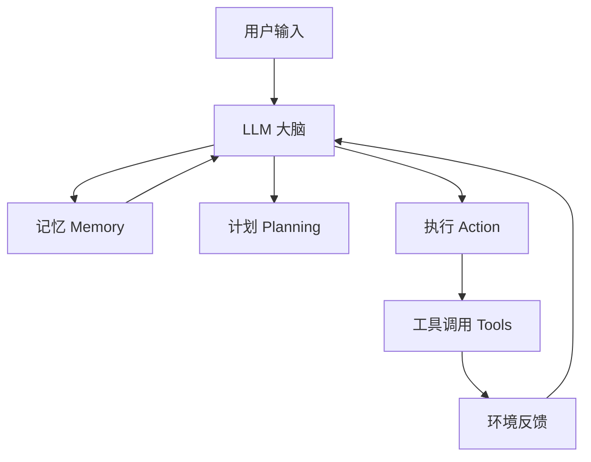
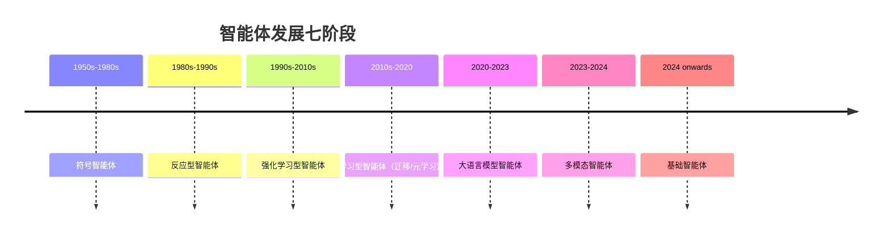
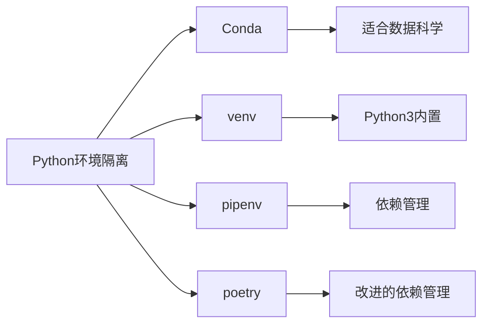
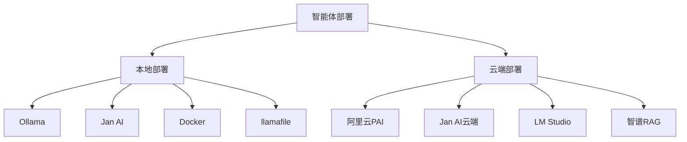
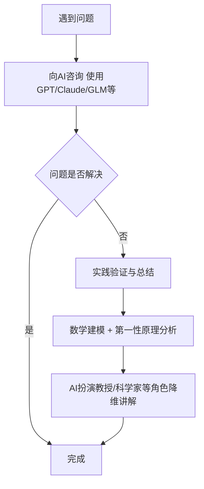
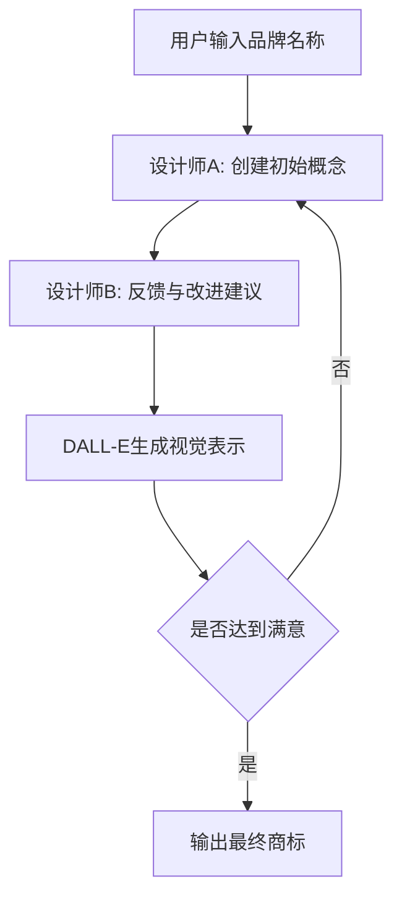
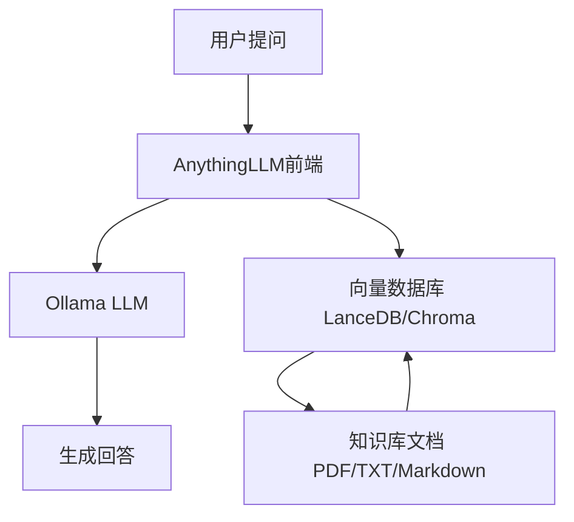

# 《AI Agent实战指南：构建高效、可协作的智能体》章节总结

## 书籍信息
- 书名：AI Agent实战指南：构建高效、可协作的智能体
- 作者：谭星星
- 出版社：机械工业出版社
- 出版时间：2025-09-19
- ISBN：9787111790358

## 目录说明
- 目录识别情况：清晰，共四个部分18章，外加前言、后记、作者简介。
- 章节对应依据：基于PDF文本提取的章节标题及内容。
- OCR修复说明：PDF为数字文本，识别完整，无严重错漏。

## 全书核心主题
本书系统讲解AI Agent（智能体）的核心理论、构建工具、部署维护及实际应用。作者认为，基于大语言模型的智能体是实现通用人工智能（AGI）的重要路径。全书从智能体定义、发展历程入手，详细介绍GPTs、GLMs、LangChain、Open Interpreter等主流框架的安装配置与编写方法，深入探讨提示词优化、测试、性能优化、算力优化等关键技术，并给出教育、科学、绘画、内容生成、数据分析、医疗、编程、客服等领域的丰富案例。最终强调结构化提示词的重要性，展望智能体作为未来第一生产力的前景。

---

## 前言 / 导论

### 核心论点
本书旨在帮助读者从零开始理解并实践智能体技术，推动计算范式从符号编码向自然语言编程转变。作者认为，掌握自然语言的人都能创建个性化智能体，成为AGI时代的超级创造者。

### 关键概念
- 智能体（AI Agent）：基于大语言模型，具备记忆、计划、执行和工具调用能力的自主实体。
- GPTs：OpenAI推出的智能体平台，支持无代码创建。
- GLMs：智谱AI推出的智能体平台，对标GPTs。
- LangChain：高度可定制的智能体开发框架。
- Open Interpreter：本地运行的代码解释器，可实现自动化编程任务。

### 逻辑推演
从ChatGPT的突破引出智能体技术的爆发，指出AutoGPT等自主智能体掀起了行业热潮。作者强调，智能体不仅适用于教育、医疗、设计、客服等领域，而且将成为每个人和企业的赋能工具。本书按照“基础→工具→部署→应用”四部分组织，兼顾理论与实践。

### 经典金句
> “每位掌握自然语言的人都可以轻松创建个性化智能体，为个人和企业赋能，成为AGI时代的超级创造者。” (p.3)

---

## 第一部分：智能体基础

## 第1章 智能体的定义与发展

### 核心论点
本章解决“什么是智能体”以及“智能体如何演进”的问题。作者综合哲学与AI视角定义智能体，并梳理从符号智能体到基础智能体的七代发展历程，指出大语言模型驱动的智能体是通往AGI的关键方向。

### 关键概念
- 智能体核心特征：自主性、感知能力、反应性和主动性、社交能力、目标导向、适应性。
- 翁荔（Lilian Weng）定义：智能体 = LLM + 记忆 + 计划 + 执行 + 工具调用。
- 发展七阶段：符号智能体 → 反应型智能体 → 强化学习型智能体 → 学习型智能体（迁移/元学习）→ 大语言模型智能体 → 多模态智能体 → 基础智能体。
- 基础智能体：英伟达Jim Fan提出，一个学习如何在不同世界中行动的单一模型，技能和具身大幅提升。

### 逻辑推演
从1956年达特茅斯会议AI诞生，到马文·明斯基提出Agent概念，再到深度学习、Transformer、ChatGPT的突破，作者展示智能体从简单代理到自主决策实体的演进。特别强调AutoGPT（2023年3月）作为首个基于GPT-4的自主智能体的里程碑意义。最后指出，智能体被认为是实现AGI的最有前景方向。

### 流程图

#### LLM驱动的智能体结构

#### 智能体发展历程

### 经典金句
> “智能体由LLM驱动，具备记忆能力、计划能力、执行能力，并能调用工具，进行循环调整，以完成一系列目标任务。” (p.10)
> “我们出生得太晚，无法探索地球，未来几十年的科学发现将令人惊叹。” —— Sam Altman (p.14)

---

## 第2章 常见的智能体

### 核心论点
本章提供全球智能体平台的索引地图，按编码工具、生产力工具、通用任务工具、自主创建工具、数据分析工具、商业智能工具及其他领域分类介绍。重点详解GPTs、GLMs、LangChain、Open Interpreter四大主流平台。

### 关键概念
- 编码智能体：GitHub Copilot、Claude Code、Gemini CLI等。
- 生产力智能体：Notion AI、Microsoft 365 Copilot等。
- 自主创建工具：GPTs、GLMs、Coze、Dify等。
- GPTs：基于OpenAI GPT模型，支持联网搜索、数据处理、绘画、知识库、Action API。
- GLMs：智谱AI对标GPTs，支持对话生成智能体，提示词长度4096字。
- LangChain：模块化框架，含库、模板、LangServe、LangSmith。
- Open Interpreter：本地运行代码，支持Python、JS、Shell，可控制浏览器、处理文件。

### 逻辑推演
作者首先介绍DeepSeek V2/V3/R1等国产模型对降低部署成本的贡献，然后分七类列举代表性智能体工具。随后重点展开GPTs和GLMs的创建权限（私有/分享/公开）、功能配置；LangChain的四大组件及安装方式；Open Interpreter的本地执行能力。最后按任务规模（小/中/大/超大规模）给出应用建议。

### 经典金句
> “GPTs代表了一种全新的应用方式，一种基于自然语言编程的创新LLM应用创建模式。” (p.22)
> “未来所有应用都将被AI重新定义。” (p.25)

---

## 第3章 智能体核心技术

### 核心论点
本章用类比方式解释大语言模型智能体的三大核心技术：自然语言处理、多模态技术、逻辑推理与任务决策。旨在帮助非专业读者理解模型原理。

### 关键概念
- 自然语言处理（NLP）：计算机通过学习语言模型，预测下一个Token，实现翻译、摘要、情感分析。
- 多模态技术：同时处理文本、图像、音频，实现听、说、读、写、画自由切换。
- 逻辑推理：包括演绎推理（从一般到特殊）、归纳推理（从特殊到一般）、类比推理（迁移）。
- 任务决策：智能体评估选项、预测后果、选择最佳行动方案。MoE模型（如Mixtral）每次只激活部分专家，降低算力。

### 逻辑推演
作者将语言模型比作“大脑”，参数比作“神经元”，说明Transformer和GPT预训练技术如何让机器理解语言。多模态部分以GPT-4o为例展示语音自然度。逻辑推理部分用三段论、黑天鹅、梵高风格类比说明三种推理类型。任务决策部分对比GPT-3.5（全参数激活）与MoE（部分激活），解释决策过程。

### 经典金句
> “自然语言处理一直被认为是计算机技术中最具挑战性的任务之一……现在，计算机不仅能听、说、读、写，还能在多种语言之间无障碍切换。” (p.26)
> “模型的逻辑推理能力在预训练和微调后基本固定，后续的操作不会影响推理能力。” (p.32)

---

## 第二部分：智能体构建工具与实操

## 第4章 工具安装与配置

### 核心论点
本章提供GPTs、GLMs、Python环境、LangChain、Open Interpreter的具体安装与配置步骤，使读者能快速上手搭建开发环境。

### 关键概念
- GPTs配置：创建入口、提示词配置（Create/Configure）、功能选择（Web Search、Canvas、4o图片生成、Code Interpreter）、知识库（≤10个文档）、Action API配置。
- GLMs配置：对话生成配置、模型能力调用（联网、AI绘画、代码）、知识库（支持1000个文件，1亿字）、插件市场、高级配置（temperature）。
- Python环境：Windows/macOS/Linux安装Python 3.11.5及pip；虚拟环境（Conda、venv、pipenv、poetry）。
- LangChain配置：pip安装核心包、开发环境变量（API Key）、模板添加、LangServe部署。
- Open Interpreter配置：Python SDK安装、环境变量配置、基础测试。

### 逻辑推演
先以GPTs和GLMs为例展示无代码配置流程，再为需要编程的读者提供Python环境搭建（含虚拟环境对比），然后逐步安装LangChain和Open Interpreter并测试基本功能。

### 流程图

#### Python虚拟环境工具选择

### 经典金句
> “智能体的发展仍然处在高速发展初期，生态逐渐会迈向成熟，GPTs和GLMs已具备一定的商业应用能力。” (p.68)

---

## 第5章 构建智能体

### 核心论点
本章手把手教读者创建第一个智能体（GLMs、GPTs、LangChain、Open Interpreter）。强调无代码平台适合所有人，编程平台适合技术人员。

### 关键概念
- GLMs智能体编写：使用“角色+技能+目标+要求”公式描述，自动生成配置，支持发布（私密/分享/公开）。
- GPTs智能体编写：结构化提示词模板（Markdown格式），高级模板含Profile、Role、Goals、Skills、Limit、Step、Init等。
- LangChain智能体编写：基于API，适合企业级应用，需分析需求、挑选组件、编程开发。
- Open Interpreter智能体编写：本地运行，代码安全性需重点关注。

### 逻辑推演
以“全球图书馆助手”为例演示GLMs创建全过程：输入描述→生成配置→测试→发布。GPTs部分给出高质量提问公式（背景+角色+思维模型+理论模型+专业术语+关键词+业务场景）及完整结构化模板。LangChain展示数字员工智能体示例。Open Interpreter展示简单代码调用。

### 经典金句
> “2025年被视为‘智能体元年’，智能体技术从理论快速走向大规模商用。” (p.102)

---

## 第6章 智能体测试与优化

### 核心论点
本章聚焦提示词优化、测试方法、性能优化和算力优化。提出智能体 = 大语言模型 + 知识库 + 提示词 + 提问指令集合的公式。

### 关键概念
- 提示词优化：清晰明确、上下文相关、示例引导、思维链、多样性、评估测试。结构化提示词优于非结构化。
- 高质量提问公式：背景 + 角色 + 思维模型 + 理论模型 + 专业术语 + 关键词 + 业务场景。
- 测试方法：单元测试、集成测试、系统测试、可用性测试、兼容性测试、安全性测试。附详细评分体系（学科、行业、交互、安全等15项，满分100）。
- 性能优化：基准测试、负载测试、压力测试、稳定性测试、云服务优化、Docker优化、本地优化、多智能体优化、算法优化、数据处理优化、网络通信优化等。
- 算力优化：模型简化（量化GPTQ/GGUF/AWQ）、并发并行处理、混合模型调用。

### 逻辑推演
先给出智能体公式，然后分别优化模型基座、知识库、提示词、提问指令。提示词部分重点介绍结构化模板和福格模型微习惯案例。测试部分提供可复用的评分智能体提示词。性能优化从16个维度展开，算力优化强调量化和混合调用。

### 经典金句
> “好的提示词通常有以下特征：清晰明确性、上下文相关性、示例引导、思维链、多样性与变体、评估和测试。” (p.105)

---

## 第三部分：智能体部署与维护

## 第7章 智能体部署

### 核心论点
本章介绍智能体的本地部署（Open Interpreter、Ollama、Jan AI、Docker、llamafile）和云端部署（阿里云PAI、Jan AI云端、LM Studio、智谱RAG），以及大语言模型接入（智谱AI、LiteLLM、FastAPI）和安全隐私保护。

### 关键概念
- 本地部署：Ollama部署Yi模型、Chatbot-Ollama交互界面、Jan AI客户端、Docker部署chatglm.cpp和One API、llamafile部署Mistral。
- 云端部署：阿里云PAI-EAS支持ModelScope、HuggingFace、Triton、TF Serving、SDWebUI、大语言模型一键部署。
- 大语言模型接入：智谱AI同步/异步/SSE调用；LiteLLM聚合100+模型；FastAPI+Uvicorn构建本地Web服务。
- 安全与隐私：最小权限原则、安全通信（HTTPS/AES）、数据加密、遵守法律法规（GDPR等）、安全审计与监控、内外网隔离。

### 逻辑推演
先展示多种本地部署方式（从Ollama到Docker容器），再介绍云端PAI平台的多种模型部署选项，最后给出模型接入代码示例和安全部署最佳实践。

### 流程图

#### 智能体部署方式对比

### 经典金句
> “智能体的部署是一个复杂而多样的过程，它不仅要求技术人员掌握多种技能，还要求部署过程是细致和周到的。” (p.143)

---

## 第8章 智能体的持续维护与升级

### 核心论点
本章讨论智能体上线后的日常维护工作，包括软硬件升级、输入更新、接口升级、故障维护、安全合规策略等。

### 关键概念
- 软硬件维护：服务器软件更新、硬件检查、云服务升级、Docker容器升级（新镜像+滚动更新）、CI/CD自动化测试。
- 输入更新：添加新需求（需求收集→规范化→设计→开发→测试→部署→文档更新）、优化提示词、完善提问指令集、更新知识库。
- 接入升级：更新Action接口、升级大语言模型API（变更评估→依赖性审查→测试→代码更新→部署→监控）。
- 故障维护：故障检测→诊断→快速响应→修复→预防措施→沟通→持续改进。
- 安全合规：系统安全策略更新、备份服务（RTO/RPO）、对外服务API版本管理、模型和应用合规备案。

### 逻辑推演
从软硬件维护入手，强调版本控制、自动化测试、灰度发布。然后分别阐述如何添加新需求、优化提示词、完善指令集、更新知识库。接入升级部分重点关注API变更评估和测试。故障维护给出标准流程。最后强调备份、对外服务管理和合规备案。

### 经典金句
> “维护和升级是运维的基本职责，是一项常态化工作。为了确保系统的稳定性和安全性，有必要建立运维制度。” (p.166)

---

## 第四部分：智能体应用实例

## 第9章 教育辅助智能体

### 核心论点
本章展示智能体在自学中的强大降维能力，通过辩证分析、第一性原理、学习方法、知识体系构建、万能演示等方法，使复杂知识变得易懂。提供知识简化助手、辩证分析助手、第一性原理分析助手、学习方法助手、书海导航助手等实例。

### 关键概念
- 知识降维：将高阶知识转化为儿童能听懂的方式。
- 辩证分析：用对立统一、质量互变、否定之否定分析问题。
- 第一性原理：剥离假设，回到基本事实重构解决方案。
- 学习方法：个性化学习路径、提问式学习、知识体系构建。
- 书海导航：推荐领域开创性、核心突破、重大影响书籍。

### 逻辑推演
作者先总结基于AI的学习方法论（优先向AI咨询→实践验证→数学建模→虚拟角色扮演），然后逐一给出各智能体的提示词配置和测试示例。例如知识简化助手用比喻、故事、可视化、实验四种方式简化知识；辩证分析助手用辩证法分析“学习的本质”；第一性原理助手从能量进化角度分析生命进化。

### 流程图

#### AI辅助学习方法论

### 经典金句
> “智能体最能影响和改变的领域是什么？……我认为会是教育和科学。” (p.191)

---

## 第10章 科学探索智能体

### 核心论点
本章构建数学、物理、化学、生物、天文、地球科学等领域的智能体，利用大语言模型的交叉知识体系辅助科学探索。

### 关键概念
- 数学解答老师：研究基础数学、应用数学、计算数学、概率统计等，建立数学模型。
- 物理探究器：研究物质、能量、力热光声电磁、量子力学、相对论。
- 化学智匠：覆盖有机、无机、物理、分析、生物化学等，定向进化提高酶活性。
- 生物探秘者：研究细胞衰老分子机制，端粒、氧化应激、DNA损伤。
- 星海探究器：宇宙学、黑洞、暗能量、宇宙膨胀加速机制。
- 地球科学科普专家：地球内部结构、地震、太阳活动对气候影响。

### 逻辑推演
每个智能体采用统一模板：工作任务描述→名称→配置信息（身份、能力、细节）→开场白→问题建议→典型提问与回答。例如数学助手演示学习路径，物理助手解释时空曲率，化学助手回答蛋白质工程，生物助手探究衰老机制，天文助手分析暗能量，地球科学助手分析太阳活动影响。

### 经典金句
> “利用智能体的能力，快速建立自然科学知识体系，探索新的自然科学理论和技术。” (p.218)

---

## 第11章 绘画设计智能体

### 核心论点
本章利用GPT-4o的绘画能力，创建商标设计助手、插花设计助手、时尚搭配顾问、数字绘画智能体，展示AI在多模态创意设计中的迭代能力。

### 关键概念
- 商标设计助手：模拟设计师A和B对话，三轮迭代优化，使用DALL-E生成视觉效果。
- 插花设计助手：输入花艺场景、品种、植物、搭配物件，输出组合建议并生成花艺图。
- 时尚搭配顾问：根据年龄、性别，结合全球时尚趋势，迭代设计穿搭并生成草图。
- 数字绘画智能体：模拟摄影参数（场景、时间、天气、光线、光圈、ISO、焦距等），给出设备技巧建议，生成摄影样例图。
- 绘画工具对比：Midjourney（效果图，随机性强）、GPT-4o（遵循性较好）、Stable Diffusion（工业级控制，ControlNet）。

### 逻辑推演
以商标设计为例，详细展示三轮迭代：设计师A提出初步概念（字母A+I结合+电路板细节），设计师B反馈改进，DALL-E生成草图，再迭代两次得到最终设计。插花和时尚搭配类似。数字绘画智能体提供完整摄影参数模板。

### 流程图

#### 商标设计迭代流程

### 经典金句
> “AI绘画为绘画带来了更多的可能和创新，使得绘画过程更加智能化、自动化和个性化。” (p.240)

---

## 第12章 内容生成智能体

### 核心论点
本章创建自媒体营销内容助手、PPT框架助手、内容精炼师、模板内容生成助手，展示智能体在内容创作中的高效性，并介绍内容定制的三种策略。

### 关键概念
- 自媒体营销内容助手：根据主题、平台（公众号/知乎/小红书）、目标受众，生成爆款文章框架，可调用绘画智能体配图。
- PPT框架助手：输入汇报内容，生成大纲并细化小节。
- 内容精炼师：运用第一性原理、系统思维、批判性思维，生成200字以内易传播摘要。
- 模板内容生成助手：根据知识库中的模板（如红杉资本商业计划书）生成定制格式内容。
- 内容定制三种策略：提示词中设模板（快速但有限）、知识库文档设模板（简洁方便）、提问时临时指定模板（灵活）。

### 逻辑推演
先给出自媒体助手完整结构化提示词，强调市场分析、主题选择、提纲制定、发布推广。PPT助手和内容精炼师提供简洁模板。模板内容生成助手展示如何将红杉商业计划书模板存入知识库，然后根据提问生成对应内容。

### 经典金句
> “智能体在内容生成和管理上的灵活性体现在其格式和规则的设置上，这不仅局限于提示词，还可以在知识库文档中进行定义。” (p.252)

---

## 第13章 个性化数据分析智能体

### 核心论点
本章构建全球学术助手、全球产品增长情报中心、全球创新情报助手、全球创新情报搜集助理等数据智能体，用于搜索、分析、整理学术研究、产品增长和创新趋势。

### 关键概念
- 全球学术助手：以Markdown表格收集特定时间范围学术报告，分析甘特创新曲线。
- 全球产品增长情报中心：收集产品增长数据（序列号、名称、发布日期、国家、客户数、下载数、官网），生成表格并预测趋势。
- 全球创新情报助手：收集行业创新数据（新产品发布、技术突破、合作伙伴关系）。
- 全球创新情报搜集助理：从创新平台（Kickstarter、Product Hunt、GitHub）、学术平台（Google Scholar、arXiv）、创投平台（Crunchbase、AngelList）、媒体平台（BBC、CNN）、社交平台（Twitter、LinkedIn）筛选情报。

### 逻辑推演
每个智能体都强调Markdown表格输出和网络浏览能力。学术助手可分析图片和上传文档；产品增长助手支持中英文提问；创新情报助手可预测未来趋势；搜集助理内置大量平台列表，限制输出来源。

### 经典金句
> “个性化数据分析智能体是一项跨领域的技术，它涵盖了多模态学习、文本检索、组织情报、企业智能情报服务等多个关键领域。” (p.270)

---

## 第14章 健康与医疗智能体

### 核心论点
本章创建医学研究助手（GPT和GLM版本），利用大语言模型在医学考试中的高分能力，辅助疾病诊断、治疗建议、预防措施、康复指导、药物研究等。

### 关键概念
- 医学研究助手：研究人体结构与功能、疾病诊断与康复新技术、预防医学、口腔医学、特殊环境医学、药物成分与生物活性、中医药学和中西医结合。
- 能力：疾病诊断、治疗方法建议、预防措施、康复指导、药物研究、中医药研究。
- 应用领域：临床辅助（图像解读、工作流改善）、科研辅助（交叉分析）、智慧医疗生态系统（应用体验层+数据分析层+基础架构层）。

### 逻辑推演
以GPT和GLM两个平台给出相同提示词，强调医学伦理和信息准确性。提问示例包括“运动引起的膝盖损伤治疗”“熬夜对免疫系统的影响”等。

### 经典金句
> “个性化医疗智能体终将走进千家万户，成为新型的家庭数字医生，真正实现科技造福人类的愿景。” (p.278)

---

## 第15章 编程技术探索智能体

### 核心论点
本章创建编程算法学习助手和软件技术选型助手，利用大语言模型辅助算法演示、代码实现、技术选型（编程语言、框架、设计模式、架构模式）。

### 关键概念
- 编程算法学习助手：演示算法原理、Python代码实现、效率分析（时间复杂度/空间复杂度）、优缺点、适用场景。支持决策树、快速排序、动态规划、贪心、CNN等。
- 软件技术选型助手：根据需求推荐最佳编程语言、框架、设计模式、架构模式。
- 全自主AI程序员Devin：能够规划执行复杂工程任务、使用开发者工具、主动协作、学习新技术、端到端构建部署、查找修复Bug、训练微调AI模型、处理GitHub issues。

### 逻辑推演
算法助手提供结构化输出模板（算法原理→代码实现→算法分析→效率分析→优缺点）。技术选型助手强调数据匹配和方案评估。最后介绍Devin作为未来编程智能体的标杆。

### 经典金句
> “大语言模型技术几乎能够轻松解决大部分过程中的难题。智能体的分析和生成技术文档的能力已经超过了人类，并且其编码能力也逐渐接近人类。” (p.279)

---

## 第16章 客户服务智能体

### 核心论点
本章基于Dify AI和Coze平台，以及本地RAG方案，构建企业客户服务智能体。强调图形化操作、知识库、插件集成。

### 关键概念
- Dify AI：开源智能体部署平台，支持本地/云端。创建助手→配置模型→自动生成提示词→添加上下文知识库→工具集成（DALL-E、企业微信等）→发布嵌入网站。
- Coze：字节跳动智能应用平台，支持插件（新闻、照片、实用工具、搜索、金融等）、工作流可视化编排、记忆（知识库+数据库）、高级（开场白、语音）。
- 本地RAG：AnythingLLM + Ollama + GGUF模型。硬件要求：2B模型可无独显，7B以上推荐8GB内存+3060显卡。

### 逻辑推演
先详细演示Dify AI创建客服智能体的步骤（创建→配置→提示词→知识库→工具→发布）。然后介绍Coze的丰富插件生态和工作流。最后给出本地RAG部署命令和配置。

### 流程图

#### 本地RAG客服智能体架构

### 经典金句
> “基于RAG技术的客户服务智能体代表了人工智能在提升客户服务体验方面的前沿应用。” (p.295)

---

## 第17章 数据分析智能体

### 核心论点
本章使用Open Interpreter、GPT数据分析助手、GLM数据分析助手三种工具进行数据分析，涵盖数据清洗、描述性统计、可视化、分类模型训练、情感分析等。

### 关键概念
- Open Interpreter本地分析：运行Qwen模型，支持CSV分析（平均值、中位数、标准差、分布图）、数据预处理（填充缺失值、移除异常值）、时间序列折线图、文本情感分析（饼图）、分类模型（逻辑回归、准确率/召回率/F1）。
- GPT数据分析助手：提供数据分析全流程（数据收集→清洗→探索→建模→评估→解释→报告撰写），支持描述性、探索性、假设检验、回归、聚类、关联规则、时间序列、文本挖掘等。
- GLM数据分析助手：类似功能，支持表格输出。
- 工具对比：Code Interpreter（已合并到GPTs，易用）、Open Interpreter（本地、无限制）、ChatGLM代码解释器（内置）。

### 逻辑推演
先展示Open Interpreter的命令行调用和实际提问（情感分析图已给出）。然后给出GPT数据分析助手的完整结构化提示词（含Profile、Role、Background、Scene等）。GLM助手类似。最后总结三种工具的适用场景。

### 经典金句
> “利用智能体，无论是在线调用还是本地部署数据分析工具，都已成为个人和企业的一项基础业务。” (p.309)

---

## 第18章 结构化提示词生成智能体

### 核心论点
本章创建结构化提示词自动生成助手和评估助手，基于MECE方法和结构化思维模板，帮助用户高效编写高质量提示词。

### 关键概念
- 结构化提示词公式：辅助提示词 = 预设角色 + 能力描述 + 限制描述 + 常识知识输入 + 输入输出定制。
- 模板要素：Description、Role、Communication methods、Background、Scene、Style、Key words、Key figures、Goals、Skills、Knowledge system、Limit、TemplateFormat、Language differences、Step、Init。
- 生成助手：输入需求（如“生成软件工程师结构化提示词”），按Markdown模板输出完整提示词。
- 评估助手：从清晰度、相关性、创新性、实用性等维度评估，给出优化建议。

### 逻辑推演
受Mr.-Ranedeer-AI-Tutor项目启发，作者提出结构化模板。生成助手要求每个结构输出5个建议，并确保Init内容。评估助手包含评估者、开发者、用户三个角色，强调数据驱动和客观公正。最后给出GLM版本的一键生成实现。

### 经典金句
> “自动化提示词生成技术是提升我们与人工智能系统互动效率的得力助手。” (p.323)

---

## 后记

### 核心论点
智能体是AGI的主流途径，主流设计模式包括反思、工具使用、规划、多智能体协作。未来每个人都能拥有大量24小时活跃的智能体，构建智能体团队，智能体将无处不在。

### 关键概念
- 反思：LLM自我检查工作并提出改进。
- 工具使用：提供搜索、代码执行等工具。
- 规划：制订并执行多步骤计划。
- 多智能体协作：多个智能体分工、讨论、辩论。
- DeepSeek稀疏MoE模型：参数规模大，推理训练成本小，证明私人训练模型可行。

### 经典金句
> “智能体代表了未来AGI的最高科技形式，将成为未来科技的第一生产力。” (p.325)

---

## 作者简介
谭星星，分微科技创始人，16年科技互联网从业经验，曾任职大厂与央企，参与全球核心网络建设、国家级电子政务项目。AI领域连续创业10年，深耕教育智能、工业智能、机器人、电子政务。发起ChatGPT中国应用社区、家酿人工智能俱乐部等开放平台。合著《成为提问工程师》。

---

> 说明：本总结基于PDF文本提取，所有图表（Mermaid）根据书中描述重建，未虚构内容。部分页码因原书版权页未完全连续，以提取文本为准。