# 《AI Agent开发与应用：基于大模型的智能体构建》章节总结

## 书籍信息
- **书名**：AI Agent开发与应用：基于大模型的智能体构建
- **作者**：凌峰
- **出版社**：清华大学出版社
- **出版时间**：2025年3月
- **ISBN**：9787302685975
- **字数**：143千字

## PDF 状态
- **识别状态**：良好，文本层清晰
- **目录识别**：完整识别
- **页码对应**：基本连续（第1-431页）

## 全书核心主题

本书系统阐述了大语言模型（LLM）驱动的智能体（Agent）开发技术体系。作者认为，大语言模型正在成为智能体构建的核心驱动力，使智能体不仅具备自然语言理解与生成能力，还能通过多轮对话、知识推理和任务自动化高效应对复杂任务。

全书分为三大部分：第一部分（第1-5章）讲解智能体的基础理论、工作原理和开发工具链；第二部分（第6-7章）通过订票系统和智能翻译系统展示浅度开发实践；第三部分（第8-12章）深入探索邮件处理、面试助手、个性化推荐、写作助手和在线客服等高级应用场景。

核心观点可概括为：**智能体的本质是具备自主性、感知能力和执行能力的系统，LLM通过提供语言理解、推理生成和知识迁移能力赋能智能体，而LangChain、LlamaIndex等框架则降低了开发门槛，使开发者能够构建从简单对话到复杂多智能体协作的各类应用。**

---

## 目录说明

本书目录结构清晰，共分为3个部分、12章：

| 部分 | 章节 | 内容范围 |
|------|------|----------|
| 第1部分：初窥智能体 | 第1-5章 | 智能体基础理论与开发工具链 |
| 第2部分：智能体基础应用开发 | 第6-7章 | 订票系统、翻译系统实践 |
| 第3部分：智能体深度开发 | 第8-12章 | 邮件助手、面试助手、推荐系统、写作助手、在线客服 |

> 说明：PDF识别完整，以下内容严格按照目录顺序逐章整理。

---

## 第1章：何为智能体

### 1. 核心论点

**问题**：什么是智能体？它如何与大语言模型结合？在哪些领域可以应用？

**观点**：智能体是一个具备自主性、感知能力和执行能力的系统，能够在复杂环境中与外界交互并完成预定任务。大语言模型的引入使智能体获得了语言理解与生成能力，能够通过多轮对话和语义推理实现动态响应与任务优化。

### 2. 关键概念

- **智能体（Agent）**：具备自主性、感知能力和执行能力的系统，能在没有人工干预的情况下基于信息进行逻辑判断和行动。
- **感知模块**：智能体的输入层，负责收集和处理外部环境信息（摄像头、传感器、API等）。
- **决策模块**：智能体的核心，负责根据输入信息选择最优行动策略，通常依赖LLM进行决策推理。
- **执行模块**：将决策转换为实际操作，如生成对话内容或控制物理机器人。
- **反馈机制**：使智能体能够基于执行结果进行自我调整和优化。
- **多智能体系统（MAS）**：通过多个智能体的协同工作实现复杂任务的分布式处理，具备任务分解与并行处理能力。

### 3. 逻辑推演

本章从智能体的基本定义入手，逐层剖析其核心组件与架构。作者首先定义智能体的三大特点：自主性、感知能力、执行能力，并指出适应性是其重要优势。

随后，详细解析了智能体的四层架构：感知模块、决策模块、执行模块和反馈机制，各模块通过彼此配合实现完整功能。感知模块的质量决定系统对外界信息的敏感度，决策模块依赖LLM进行推理，执行模块确保任务顺利完成。

在开发流程部分，作者提出了五个步骤：需求分析、系统架构设计、模块开发与集成、系统测试与优化、持续监控与更新迭代。

接着，分析了LLM如何赋能智能体：通过自然语言理解与生成、知识推理、持续学习与动态更新、多语言支持等能力。同时指出了LLM的局限性（数据偏见、隐私安全、计算资源限制）及应对策略。

最后，按功能分类智能体类型（对话型、推荐型、自动化型、协同型），并介绍了多智能体系统的协作与竞争机制。

### 4. 经典金句

> “智能体的自主性体现在它可以根据任务目标和环境数据选择适当的策略进行响应。” (p.10)

> “大语言模型的发展推动了智能体技术的演进，使其在自然语言理解、推理、任务自动化等方面展现出前所未有的能力。” (p.23)

> “感知模块的质量决定了系统对外界信息的敏感度和反应速度。” (p.12)

> “反馈机制使智能体能够基于执行结果进行自我调整。这一机制确保系统在长期运行中不断优化。” (p.14)

---

## 第2章：大模型驱动的Agent技术框架

### 1. 核心论点

**问题**：如何在大语言模型基础上设计高效的智能体系统？技术框架包含哪些关键模块？

**观点**：大语言模型作为智能体的核心引擎，通过自然语言理解、知识推理和上下文管理拓展了智能体的适用场景。Agent技术框架采用感知-决策-执行三层结构，结合上下文管理、记忆模块、API集成和向量数据库，实现复杂任务的高效处理。

### 2. 关键概念

- **感知-决策-执行三层结构**：Agent的基础架构。感知层捕捉环境数据；决策层进行推理并做出行动决策；执行层将决策转换为具体操作。
- **上下文管理**：捕捉每轮对话中的关键信息，确保在后续交互中得以应用，实现多轮对话的连贯性。
- **记忆模块**：分为短期记忆（当前会话上下文）和长期记忆（跨会话历史数据），通常使用数据库或向量存储实现。
- **向量数据库**：将文本转换为向量表示，通过计算向量间相似度实现基于语义的高效检索（如FAISS、Milvus）。
- **ReAct框架**：融合Reasoning（推理）和Acting（行动）的多步推理框架，使智能体在执行过程中能够自适应调整策略。
- **LangChain**：面向多步推理和复杂任务自动化的开源框架，通过链式结构实现任务的分解与执行。
- **Hugging Face**：自然语言处理领域的技术平台，提供预训练模型库、工具和API支持。

### 3. 逻辑推演

本章从LLM在智能体中的核心作用切入，分析了自然语言理解与生成、知识推理、持续学习与动态更新、多语言支持四大能力。

随后，详细解析了Agent的三层结构：感知层负责捕捉环境信息；决策层是核心，依赖LLM和知识图谱进行推理；执行层负责将决策落地。三层必须相互协调，确保高效运作。

在上下文管理与记忆模块部分，作者区分了短期记忆（当前会话）和长期记忆（跨会话持久化），并给出了银行客服系统的记忆模块设计示例。

接着，讨论了智能体与RESTful API、向量数据库的集成方法。API集成使智能体能动态获取外部资源；向量数据库通过语义检索提供智能数据查询支持。代码示例展示了天气API调用和基于Sentence Transformers的语义检索。

最后，介绍了ReAct、Hugging Face和LangChain三大技术栈：ReAct融合推理与行动；Hugging Face提供预训练模型管理；LangChain实现多步骤推理与任务自动化。

### 4. 流程图

#### Agent三层结构图

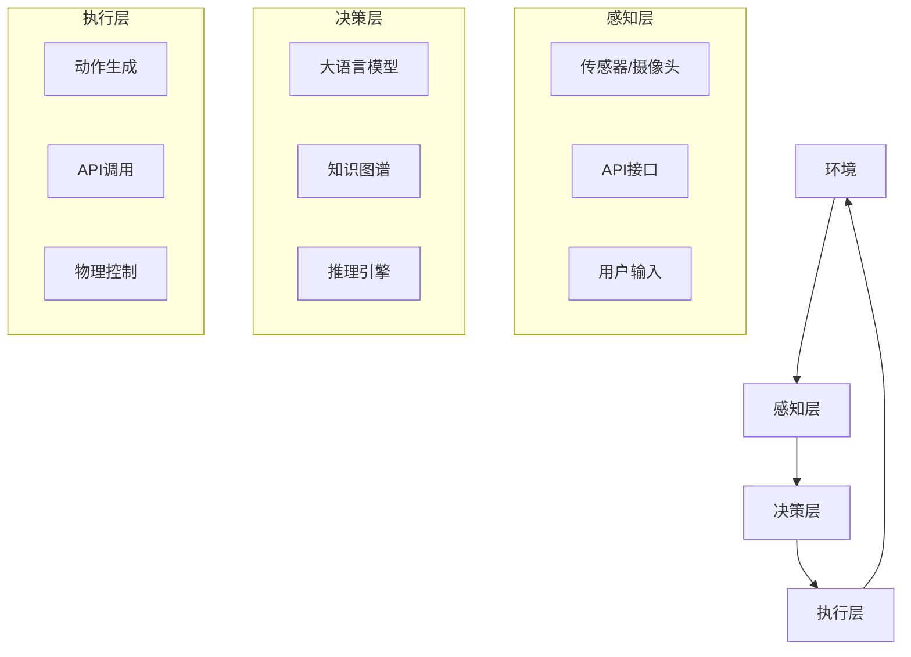
```mermaid
graph TD
    A[环境] --> B[感知层]
    B --> C[决策层]
    C --> D[执行层]
    D --> A
    
    subgraph 感知层
        B1[传感器/摄像头]
        B2[API接口]
        B3[用户输入]
    end
    
    subgraph 决策层
        C1[大语言模型]
        C2[知识图谱]
        C3[推理引擎]
    end
    
    subgraph 执行层
        D1[动作生成]
        D2[API调用]
        D3[物理控制]
    end
```

#### 智能体微调架构图

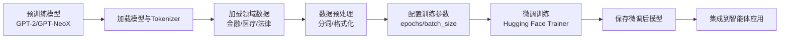
```mermaid
graph LR
    A[预训练模型<br>GPT-2/GPT-NeoX] --> B[加载模型与Tokenizer]
    B --> C[加载领域数据<br>金融/医疗/法律]
    C --> D[数据预处理<br>分词/格式化]
    D --> E[配置训练参数<br>epochs/batch_size]
    E --> F[微调训练<br>Hugging Face Trainer]
    F --> G[保存微调后模型]
    G --> H[集成到智能体应用]
```

### 5. 经典金句

> “大语言模型（LLM）作为智能体的核心引擎之一，为智能体的构建带来了新的范式。” (p.33)

> “感知、决策和执行的协同工作使智能体在面对复杂任务时具备清晰的逻辑流程。” (p.43)

> “合理的上下文和记忆设计使智能体在应对多轮对话和复杂任务时更加得心应手。” (p.45)

> “ReAct框架的出现解决了在处理复杂任务时常见的割裂问题，即决策和执行模块彼此独立，缺乏实时交互的能力。” (p.52)

---

## 第3章：用LangChain打造全能智能体

### 1. 核心论点

**问题**：如何使用LangChain框架构建具备多步骤推理、任务自动化和记忆能力的智能体？

**观点**：LangChain通过链式逻辑将复杂任务分解为多个步骤，以模块化设计实现灵活可扩展的智能体。其核心组件包括PromptTemplate、SequentialChain、RouterChain、ConversationChain和记忆模块，支持任务分解、条件推理、工具调用和上下文管理。

### 2. 关键概念

- **链式逻辑（Chain）**：LangChain的核心设计思想，将复杂任务拆解为多个步骤并按顺序执行。分为线性链、分支链和循环链。
- **SequentialChain**：顺序任务链，适用于任务顺序固定的场景，每个模块的输出作为下一个模块的输入。
- **RouterChain/MultiRouteChain**：路由链，根据条件判断选择不同的执行路径，适用于多样化输入场景。
- **ConversationChain**：对话任务链，支持多轮对话的短期记忆和上下文管理。
- **ConversationBufferMemory**：上下文管理器，可设置max_length限制上下文长度，保留最新对话信息。
- **PromptTemplate**：提示模板，定义智能体与LLM的交互方式，支持动态占位符填充。
- **StructuredTool**：将函数封装为智能体工具，使其在任务执行过程中可动态调用。
- **回调机制（Callback）**：捕捉链条中的事件（模块执行完成、变量更新、错误发生），用于实时监控和日志记录。

### 3. 逻辑推演

本章从LangChain的核心组件入手，逐一解析链式逻辑、数据流管理、LLM集成和回调监控。

链式逻辑部分，作者详细区分了线性链、分支链和循环链三种结构，并通过代码示例展示了SequentialChain的使用方法。线性链适用于固定顺序任务（如解析问题→查询数据库→生成回答）；分支链根据用户输入跳转不同模块；循环链用于重复性任务。

数据流管理部分，强调上下文传递在多轮对话中的重要性。LangChain支持动态上下文管理，通过缓存与动态变量传递提高效率。

集成LLM部分，指出LangChain支持GPT-4等多种大语言模型，开发者可根据任务需求选择模型，并支持微调与多模型协作。

回调与实时监控部分，展示了StdOutCallbackHandler的用法，用于捕捉执行状态并输出到控制台。

在多步骤推理部分，作者详细讲解了任务分解策略（单一职责、逻辑耦合最小化、任务优先级划分、异步处理）和模块化设计原则。通过SequentialChain和RouterChain的代码示例，展示了如何构建条件推理与决策链条。

任务自动化部分，介绍了定时触发（cron）、事件触发（WebhookChain）和用户交互触发三种机制。

集成外部数据源部分，涵盖了关系数据库（MySQL）、向量数据库（FAISS）、RESTful API、GraphQL、文件处理（PDF/Excel）和物联网设备（MQTT）。

记忆系统部分，区分了短期记忆（ConversationChain实现）和长期记忆（JSON文件/向量数据库实现），并讨论了多轮对话中的记忆优化策略（上下文截断、关键信息标记）。

### 4. 流程图

#### LangChain核心组件结构图

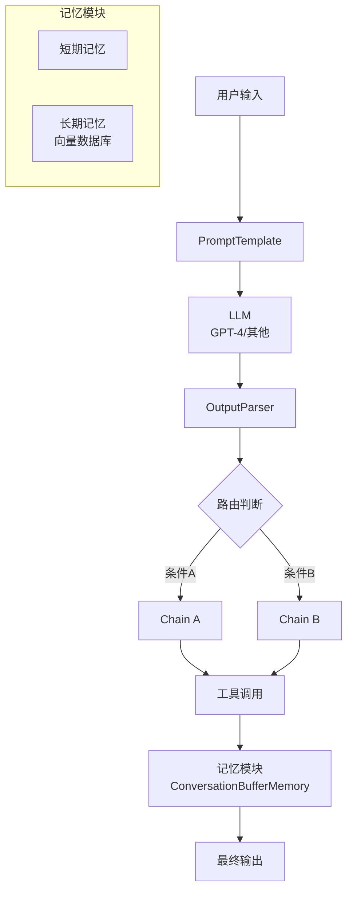
```mermaid
graph TD
    A[用户输入] --> B[PromptTemplate]
    B --> C[LLM<br>GPT-4/其他]
    C --> D[OutputParser]
    D --> E{路由判断}
    E -->|条件A| F[Chain A]
    E -->|条件B| G[Chain B]
    F --> H[工具调用]
    G --> H
    H --> I[记忆模块<br>ConversationBufferMemory]
    I --> J[最终输出]
    
    subgraph 记忆模块
        I1[短期记忆]
        I2[长期记忆<br>向量数据库]
    end
```

#### 多轮对话记忆优化架构图

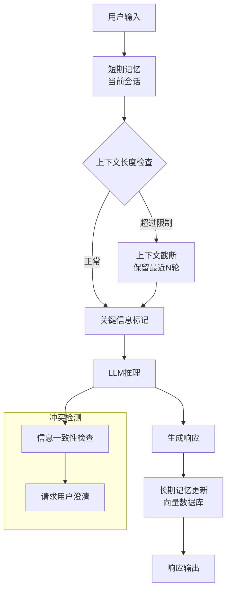
```mermaid
graph TD
    A[用户输入] --> B[短期记忆<br>当前会话]
    B --> C{上下文长度检查}
    C -->|超过限制| D[上下文截断<br>保留最近N轮]
    C -->|正常| E[关键信息标记]
    D --> E
    E --> F[LLM推理]
    F --> G[生成响应]
    G --> H[长期记忆更新<br>向量数据库]
    H --> I[响应输出]
    
    subgraph 冲突检测
        J[信息一致性检查]
        K[请求用户澄清]
    end
    
    F --> J
    J --> K
```

### 5. 经典金句

> “链式逻辑是LangChain的核心设计思想。它通过将复杂任务拆解为多个步骤，并按特定顺序依次执行，提高了系统的灵活性与可扩展性。” (p.59)

> “模块化设计不仅增强了代码的可维护性，还提高了任务链的灵活性和可扩展性。” (p.71)

> “短期记忆与上下文管理能够确保系统在当前会话中保持连贯性，长期记忆模块使系统能够在跨会话场景中实现个性化服务。” (p.102)

> “在智能体开发中，任务自动化是实现系统高效运行的核心能力。” (p.75)

---

## 第4章：LlamaIndex赋能智能体应用

### 1. 核心论点

**问题**：如何将非结构化数据转换为智能体可理解的知识库，并实现实时查询与响应？

**观点**：LlamaIndex是一个高效的数据索引与管理框架，通过倒排索引、向量索引和与LangChain的无缝集成，实现从数据预处理、知识库构建到实时查询的全流程自动化。它支持多模态数据、API对接和缓存机制，为构建高效精准的智能体提供技术支撑。

### 2. 关键概念

- **倒排索引（Inverted Index）**：为每个词条建立与文档ID的映射关系，实现快速关键词搜索，适用于结构化文本检索。
- **向量索引**：将文本转换为高维向量，通过余弦相似度计算实现语义匹配，适用于模糊查询和语义检索。
- **FAISS**：Facebook开源的向量数据库，支持大规模向量检索，与LangChain无缝集成。
- **嵌入模型（Embedding Model）**：将文本转换为向量表示，如OpenAIEmbeddings、Sentence Transformers（paraphrase-MiniLM-L6-v2）。
- **缓存机制**：存储高频查询结果，减少重复计算和数据库访问，提升查询性能。
- **多模态查询**：同时处理文本、图像、音频等多种数据类型，实现跨模态检索。

### 3. 逻辑推演

本章从LlamaIndex的架构与索引机制入手，解析了数据索引的基本原理。

倒排索引部分，作者展示了如何用Python defaultdict构建倒排索引，并通过布尔查询优化多关键词检索。这种索引结构将查询时间复杂度降至常数级别。

向量索引部分，通过FAISS和Sentence Transformers展示了语义检索的实现。文本被转换为向量后存储在FAISS中，查询时通过余弦相似度匹配最相关内容。代码示例包括添加文本、相似度搜索和删除向量数据。

数据预处理部分，强调了文本解析（NLP技术提取结构化信息）、数据清洗（去重、格式标准化）的重要性。作者使用Pandas进行数据清洗，并使用PromptTemplate引导LLM提取订单信息。

知识库构建部分，展示了如何通过LlamaIndex与LangChain的无缝集成，将非结构化数据转换为可检索的知识库。代码实现了add_to_knowledge_base和query_knowledge_base两个核心函数。

实时查询部分，讨论了查询管道设计、缓存机制（ConversationBufferMemory）、多模态查询（图像向量化）以及与API和物联网设备的动态数据对接。

最后，通过一个完整的综合代码示例，整合了CacheManager、InvertedIndex、VectorIndex、QueryHandler、SecurityManager和KnowledgeBase等模块，展示了企业级智能知识库系统的实现。

### 4. 流程图

#### LlamaIndex知识库构建流程

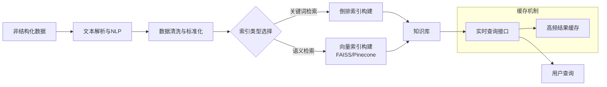
```mermaid
graph LR
    A[非结构化数据] --> B[文本解析与NLP]
    B --> C[数据清洗与标准化]
    C --> D{索引类型选择}
    D -->|关键词检索| E[倒排索引构建]
    D -->|语义检索| F[向量索引构建<br>FAISS/Pinecone]
    E --> G[知识库]
    F --> G
    G --> H[实时查询接口]
    H --> I[用户查询]
    
    subgraph 缓存机制
        J[高频结果缓存]
        H --> J
    end
```

#### 实时查询管道设计

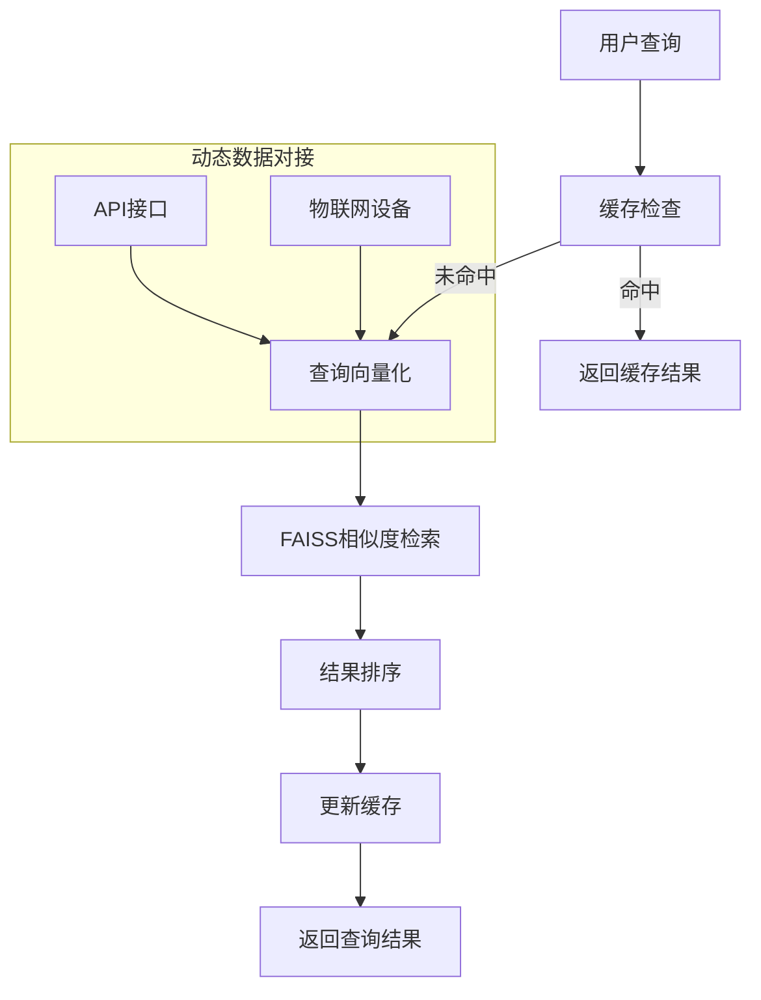
```mermaid
graph TD
    A[用户查询] --> B[缓存检查]
    B -->|命中| C[返回缓存结果]
    B -->|未命中| D[查询向量化]
    D --> E[FAISS相似度检索]
    E --> F[结果排序]
    F --> G[更新缓存]
    G --> H[返回查询结果]
    
    subgraph 动态数据对接
        I[API接口] --> D
        J[物联网设备] --> D
    end
```

### 5. 经典金句

> “数据索引是智能系统的核心技术之一，其目的是通过构建数据结构，将复杂的查询任务简化为高效的检索操作。” (p.106)

> “LlamaIndex通过与FAISS等向量数据库的集成，实现了对非结构化数据的高效管理和语义检索。” (p.113)

> “缓存机制是提升查询性能的有效手段。通过将高频查询结果存储在内存中，系统可以避免重复计算，减少对底层数据库的访问次数。” (p.120)

> “实时查询管道设计的关键在于数据的流转速度，通过高效的向量检索技术，确保查询在毫秒级内返回结果。” (p.119)

---

## 第5章：快速上手智能体开发

### 1. 核心论点

**问题**：如何快速上手智能体开发？从需求分析到部署的完整流程是怎样的？

**观点**：智能体开发是系统性工程，需从需求分析、系统架构设计到开发与测试的迭代过程中逐步推进。通过OpenAI的GPT在线平台，可以快速创建自定义智能体（如论文润色专家、旅行出游助手），并通过知识库上传、功能勾选和扩展操作实现高度定制化。

### 2. 关键概念

- **需求分析**：明确系统核心目标和业务范围，定义输入输出形式，识别用户场景并排序功能优先级。
- **MVP（最小可行产品）**：初期开发从核心功能开始（如语法检查），逐步添加风格优化和格式校准模块。
- **敏捷开发**：将项目拆分为多个小开发周期，每个周期专注于一个模块或功能的实现。
- **GPT在线开发**：通过OpenAI平台创建自定义GPT，支持自然语言创建和配置界面自定义两种方式。
- **知识库上传**：上传特定领域的文档（如研究论文），强化智能体在该领域的专业能力。
- **扩展操作**：包括身份验证、API架构导入、Web浏览、DALL·E图像生成、代码解释器等功能。

### 3. 逻辑推演

本章以论文润色智能体的可视化开发为例，介绍了智能体开发的一般流程。

需求分析部分，作者以论文润色为例，明确了语法检查、语言风格优化和格式校准三大任务，并给出了需求分析表格。强调要避免功能泛化，确保系统聚焦于关键任务。

系统架构部分，将智能体划分为输入处理、推理决策、工具调用和结果输出四大模块。模块之间的接口设计至关重要，数据流的合理规划能够确保各模块高效协同。

开发与测试部分，介绍了敏捷开发方法和MVP策略。测试包括单元测试、集成测试和压力测试，反馈循环非常重要。

随后，通过旅行出游智能体的开发，展示了GPT在线开发的全流程：访问OpenAI官网→选择GPT-4o→创建自定义GPT→输入构建提示词→配置详细信息→发布并获取链接。

论文润色专家智能体部分，详细讲解了语法检查（拼写错误、时态一致性、句子结构）、风格优化（简洁表达、正式语言、逻辑连贯性）和格式校准（标题编号、引文格式、段落缩进）三大流程，并通过8个配置步骤完成了Communication Writing Specialist的开发。

### 4. 流程图

#### 智能体开发迭代流程

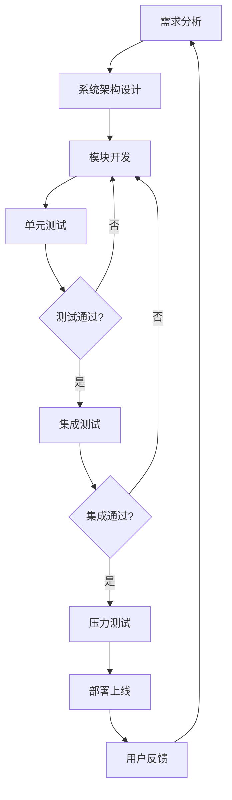
```mermaid
graph TD
    A[需求分析] --> B[系统架构设计]
    B --> C[模块开发]
    C --> D[单元测试]
    D --> E{测试通过?}
    E -->|否| C
    E -->|是| F[集成测试]
    F --> G{集成通过?}
    G -->|否| C
    G -->|是| H[压力测试]
    H --> I[部署上线]
    I --> J[用户反馈]
    J --> A
```

#### 论文润色基本流程

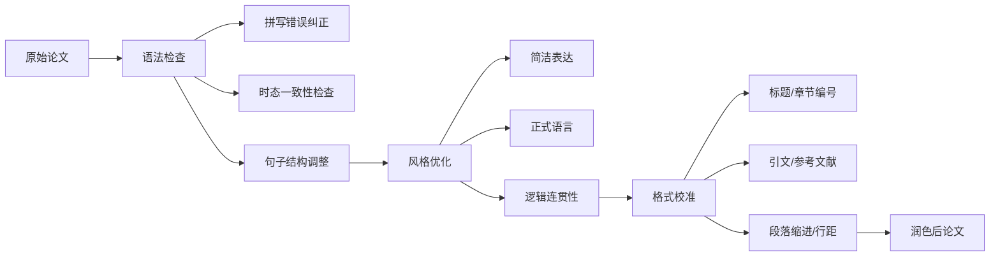
```mermaid
graph LR
    A[原始论文] --> B[语法检查]
    B --> C[拼写错误纠正]
    B --> D[时态一致性检查]
    B --> E[句子结构调整]
    E --> F[风格优化]
    F --> G[简洁表达]
    F --> H[正式语言]
    F --> I[逻辑连贯性]
    I --> J[格式校准]
    J --> K[标题/章节编号]
    J --> L[引文/参考文献]
    J --> M[段落缩进/行距]
    M --> N[润色后论文]
```

### 5. 经典金句

> “智能体开发是一项系统性工程，需要从需求分析、系统架构设计到开发与测试的迭代过程中逐步推进。” (p.132)

> “需求分析阶段还应涵盖用户场景的识别与功能优先级的排序。” (p.133)

> “语法检查是论文润色的第一步，也是整个润色过程的基础。良好的语法是确保论文清晰传达信息的重要前提。” (p.152)

> “通过合理设计Prompt，可以让GPT准确理解用户意图并完成指定任务。” (p.136)

---

## 第6章：贴身管家：出行订票智能体

### 1. 核心论点

**问题**：如何构建一个能理解自然语言、自动查询和购买火车票的出行订票智能体？

**观点**：通过LangChain框架结合ReAct推理模式，可以将查询车票、筛选方案、购票执行等复杂任务分解为多轮推理步骤。智能体通过StructuredTool封装业务逻辑，使用ConversationTokenBufferMemory保持上下文，并通过自定义回调处理器实时跟踪推理过程，最终实现从用户需求到购票完成的自动化流程。

### 2. 关键概念

- **ReAct框架**：Reasoning + Acting的融合，引入“思考-行动-观察”循环（Think-Act-Observe Loop），使智能体具备逐步推理与分步执行能力。
- **StructuredTool**：LangChain的工具封装类，将业务函数（如search_train_ticket、purchase_train_ticket）封装为可调用的工具。
- **ConversationTokenBufferMemory**：基于Token数量的对话记忆模块，可设置max_token_limit限制上下文长度。
- **PydanticOutputParser**：将LLM输出解析为结构化数据（Action类），包含name（工具名称）和args（工具参数）。
- **MyPrintHandler**：自定义回调处理器，继承BaseCallbackHandler，实现on_llm_new_token方法逐字打印LLM输出。
- **FINISH占位符**：用于表示任务完成的特殊工具，智能体识别后退出推理循环。

### 3. 逻辑推演

本章从ReAct框架的核心思想入手，解释了LangChain的设计理念：多工具调用、记忆模块、Prompt模板化和模块化设计。

随后，通过出行订票流程的简化分析，展示了智能体如何将复杂任务分解为多轮交互：用户输入出行需求→智能体分析参数→调用查询工具→筛选最佳车次→用户确认→调用购票工具→返回结果。

开发环境配置部分，详细讲解了PromptTemplate的定义，包括tools、tool_names、input、agent_scratchpad等占位符的作用。

工具封装部分，实现了search_train_ticket函数（模拟火车票数据）和purchase_train_ticket函数（模拟购票），并通过StructuredTool.from_method封装为工具。

智能体核心模块MyAgent类的实现是本章重点。该类包含：初始化方法（设置LLM、工具列表、Prompt模板）、_step方法（执行单步推理）、_exec_action方法（执行工具并返回观察结果）、_update_memory方法（更新记忆）、run方法（主循环，设置max_thought_steps防止死循环）。

最终运行结果展示了三轮思考过程：第一轮调用查询工具获取车次列表；第二轮调用购票工具完成购买；第三轮识别到任务完成，输出最终答案。

### 4. 流程图

#### ReAct推理循环流程

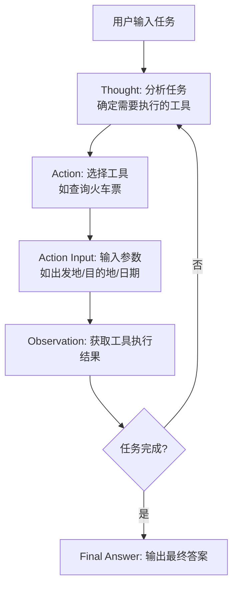
```mermaid
graph TD
    A[用户输入任务] --> B[Thought: 分析任务<br>确定需要执行的工具]
    B --> C[Action: 选择工具<br>如查询火车票]
    C --> D[Action Input: 输入参数<br>如出发地/目的地/日期]
    D --> E[Observation: 获取工具执行结果]
    E --> F{任务完成?}
    F -->|否| B
    F -->|是| G[Final Answer: 输出最终答案]
```

#### 出行订票智能体执行流程

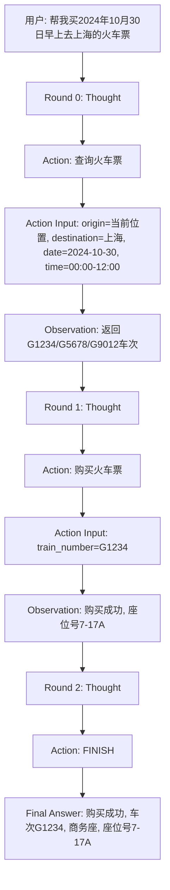
```mermaid
graph TD
    A[用户: 帮我买2024年10月30日早上去上海的火车票] --> B[Round 0: Thought]
    B --> C[Action: 查询火车票]
    C --> D[Action Input: origin=当前位置, destination=上海, date=2024-10-30, time=00:00-12:00]
    D --> E[Observation: 返回G1234/G5678/G9012车次]
    E --> F[Round 1: Thought]
    F --> G[Action: 购买火车票]
    G --> H[Action Input: train_number=G1234]
    H --> I[Observation: 购买成功, 座位号7-17A]
    I --> J[Round 2: Thought]
    J --> K[Action: FINISH]
    K --> L[Final Answer: 购买成功, 车次G1234, 商务座, 座位号7-17A]
```

### 5. 经典金句

> “LangChain的设计理念围绕将大语言模型与外部工具整合展开，旨在为开发者构建一个可扩展的框架，使模型能够在复杂场景中发挥更强的作用。” (p.171)

> “ReAct框架引入了思考-行动-观察循环，即智能体根据任务进行推理，执行操作，并基于观察结果继续推理，直到完成任务。” (p.172)

> “整个流程中，记忆模块的作用尤为重要。智能体需要保存用户的查询历史和偏好，确保多轮交互中能够保持上下文的一致性。” (p.178)

> “通过这样的多步骤流程和智能化处理，智能体能够显著简化出行订票的复杂性，将原本烦琐的操作转换为一系列自动化任务。” (p.178)

---

## 第7章：智能翻译系统的开发与部署

### 1. 核心论点

**问题**：如何构建一个具备多语言翻译、术语一致性校准和多轮交互能力的智能翻译系统？

**观点**：智能翻译系统的核心在于多语言模型（如OpenAI GPT）的合理调用、术语词库的构建与校准、以及上下文的保持。通过Flask框架可将系统部署为Web服务，支持文本输入、语音输入、缓存机制和日志记录，实现从开发到部署的全流程解决方案。

### 2. 关键概念

- **术语一致性校准**：通过预定义术语词库（字典/数据库），将模型生成的翻译结果与标准术语对照并自动替换不一致部分。
- **语言检测**：使用langdetect库自动检测用户输入的语言类型，确定源语言和目标语言。
- **上下文保持**：使用conversation_history列表存储用户与系统的对话历史，在构建Prompt时引用最近记录，确保多轮翻译连贯性。
- **重试机制**：在API调用失败时自动重试（最多3次），每次重试之间设置延迟，提高系统稳定性。
- **缓存机制**：使用Python字典存储已翻译内容，避免重复API调用，提升响应速度。
- **语音输入**：集成speech_recognition库，将用户语音转换为文本进行翻译。
- **Flask部署**：使用Flask框架创建Web服务，通过POST请求接收翻译任务并返回结果。

### 3. 逻辑推演

本章从需求分析入手，明确了智能翻译系统的三大目标：语义准确、翻译自然、专业术语一致。

多语言支持与术语一致性设计部分，作者使用langdetect检测语言，通过Prompt设计引导GPT进行翻译，并构建term_dict术语词库进行校准。代码实现了多语言翻译和术语替换功能。

输入输出格式与核心模块规划部分，设计了preprocess_input（清理输入）、translate_text（调用API翻译）、format_output（格式化输出）三个模块。

多语言模型调用与上下文保持部分，实现了TranslationAgent类，使用conversation_history存储对话历史，build_prompt方法动态构建包含上下文的Prompt。

翻译优化与错误处理部分，设计了optimize_translation（优化翻译结果）和带重试机制的translate方法，使用try-except捕获异常并最多重试3次。

Prompt设计与多轮交互部分，实现了feedback_loop方法，支持用户对翻译结果进行反馈并逐步优化。

语音输入、缓存机制与日志记录部分，扩展了语音识别、缓存查询结果和日志记录功能。

语言辅助模块部分，集成了同义词建议（NLTK）、自动补全句子（OpenAI API）、句子优化和输入历史展示功能。

最后，通过Flask框架将系统部署为Web服务，实现/api/translate端点，支持curl命令调用。

### 4. 流程图

#### 智能翻译系统架构

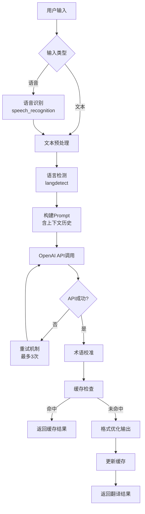
```mermaid
graph TD
    A[用户输入] --> B{输入类型}
    B -->|文本| C[文本预处理]
    B -->|语音| D[语音识别<br>speech_recognition]
    D --> C
    C --> E[语言检测<br>langdetect]
    E --> F[构建Prompt<br>含上下文历史]
    F --> G[OpenAI API调用]
    G --> H{API成功?}
    H -->|否| I[重试机制<br>最多3次]
    I --> G
    H -->|是| J[术语校准]
    J --> K[缓存检查]
    K -->|命中| L[返回缓存结果]
    K -->|未命中| M[格式优化输出]
    M --> N[更新缓存]
    N --> O[返回翻译结果]
```

#### 多轮翻译交互流程

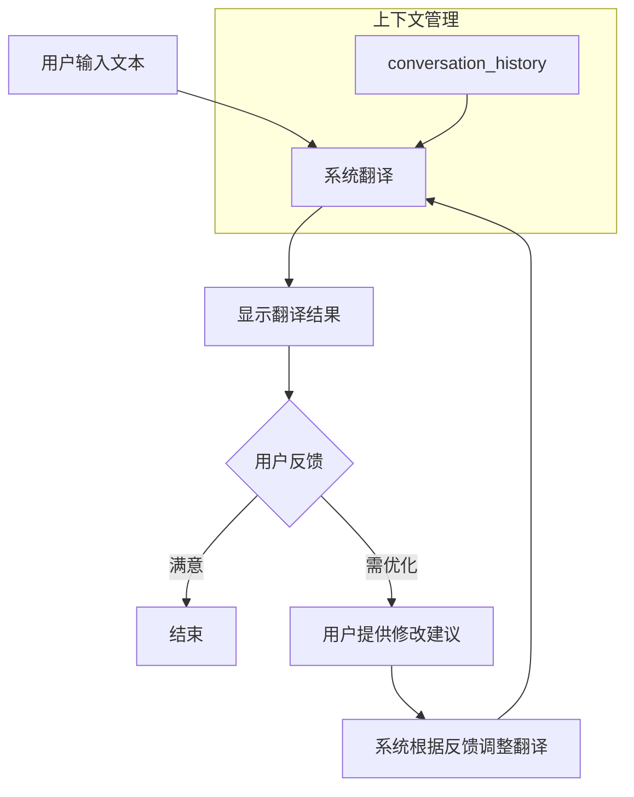
```mermaid
graph TD
    A[用户输入文本] --> B[系统翻译]
    B --> C[显示翻译结果]
    C --> D{用户反馈}
    D -->|满意| E[结束]
    D -->|需优化| F[用户提供修改建议]
    F --> G[系统根据反馈调整翻译]
    G --> B
    
    subgraph 上下文管理
        H[conversation_history]
        H --> B
    end
```

### 5. 经典金句

> “智能翻译与语言辅助系统的核心在于准确理解用户需求，并为不同场景提供可靠的翻译支持。” (p.205)

> “多语言支持是智能翻译系统的核心能力之一，尤其是在需要处理跨文化、跨语境内容的场景中。” (p.206)

> “合理的Prompt不仅能清晰传达用户的需求，还能引导模型生成逻辑清晰、符合语境的输出。” (p.219)

> “错误处理机制则是系统健壮性的重要保障。在调用API进行翻译时，可能会遇到请求超时、无效响应或网络中断等异常情况。” (p.216)

---

## 第8章：秒回邮件：智能邮件助理

### 1. 核心论点

**问题**：如何构建一个能够自动分类、优先级排序、个性化回复邮件的智能助理系统？

**观点**：智能邮件助理的核心在于多任务处理架构（异步任务队列+高并发设计）、自然语言理解（LLM集成）、个性化优化（用户行为追踪+模型微调）以及模板化与自定义语句生成的结合。通过IMAP/SMTP协议集成和RBAC权限控制，系统可实现邮件的自动接收、分类、回复和多用户管理。

### 2. 关键概念

- **异步任务队列**：使用Celery+Redis将邮件处理任务解耦，支持高并发场景下的任务分发和异步执行。
- **IMAP/SMTP协议**：IMAP用于邮件的在线读取和同步，SMTP用于发送邮件。系统通过imaplib和smtplib库集成。
- **任务分类**：基于规则（关键词匹配）或机器学习（SVM/LSTM）将邮件分类为任务型、通知型、普通沟通型。
- **优先级排序**：综合考虑邮件时效性、发件人身份和情感倾向，设置高/中/低优先级。
- **用户行为追踪**：分析用户历史邮件中的高频词汇、常用句式和语气模式，存储到SQLite数据库。
- **模型微调**：使用用户行为数据对GPT-2进行微调（Trainer API），使生成内容贴合用户写作习惯。
- **Jinja2模板引擎**：支持动态插槽填充、条件语句和循环，实现模板化邮件生成。
- **RBAC权限控制**：基于角色的访问控制，使用Flask-Login和JWT实现用户认证和权限管理。

### 3. 逻辑推演

本章从需求分析入手，明确了邮件助手的核心功能：任务分类与优先级排序、用户需求多样化适应性。

技术架构部分，设计了异步任务队列（Celery+Redis）处理高并发邮件任务，使用PostgreSQL存储邮件并优化索引。通过IMAP/SMTP协议集成实现邮件接收与发送，使用OAuth 2.0保障安全性。

多用户管理与权限控制部分，使用Flask实现用户注册、登录和RBAC权限控制，支持角色分配（管理员、普通用户、访客）和操作日志审计。

LLM集成部分，重点讨论了多轮对话中的语境保持（通过会话ID存储独立上下文）、个性化与情感分析（学习用户语言风格和情感状态）、模板化与自定义语句生成（Jinja2+OpenAI API组合）。

错误处理部分，设计了多层错误处理机制：网络故障时自动重试（最多3次），API错误时生成礼貌的自动回复，通过日志记录便于调试。

个性化优化部分，实现了用户行为追踪（分析高频词汇、语法语气模式），使用用户数据微调GPT-2模型，并设计了自适应个性化邮件模板（动态插槽+上下文适应+多样化表达）。

### 4. 流程图

#### 邮件智能助理系统架构

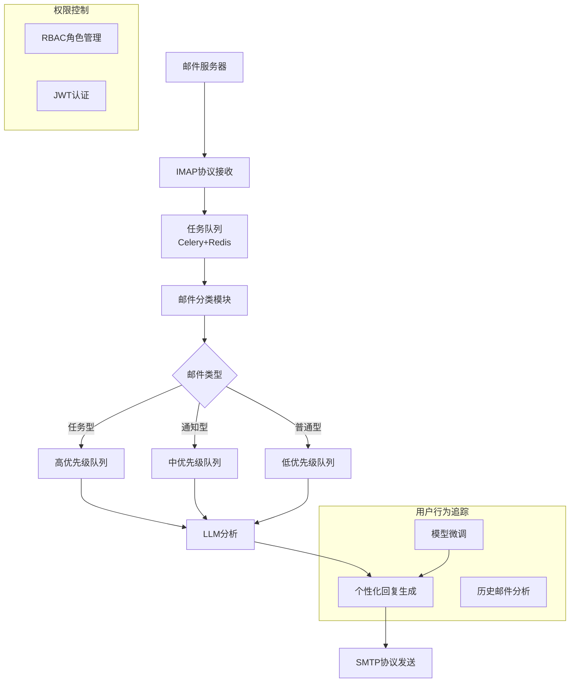
```mermaid
graph TD
    A[邮件服务器] --> B[IMAP协议接收]
    B --> C[任务队列<br>Celery+Redis]
    C --> D[邮件分类模块]
    D --> E{邮件类型}
    E -->|任务型| F[高优先级队列]
    E -->|通知型| G[中优先级队列]
    E -->|普通型| H[低优先级队列]
    F --> I[LLM分析]
    G --> I
    H --> I
    I --> J[个性化回复生成]
    J --> K[SMTP协议发送]
    
    subgraph 用户行为追踪
        L[历史邮件分析]
        M[模型微调]
        M --> J
    end
    
    subgraph 权限控制
        N[RBAC角色管理]
        O[JWT认证]
    end
```

#### 模板化与自定义生成流程

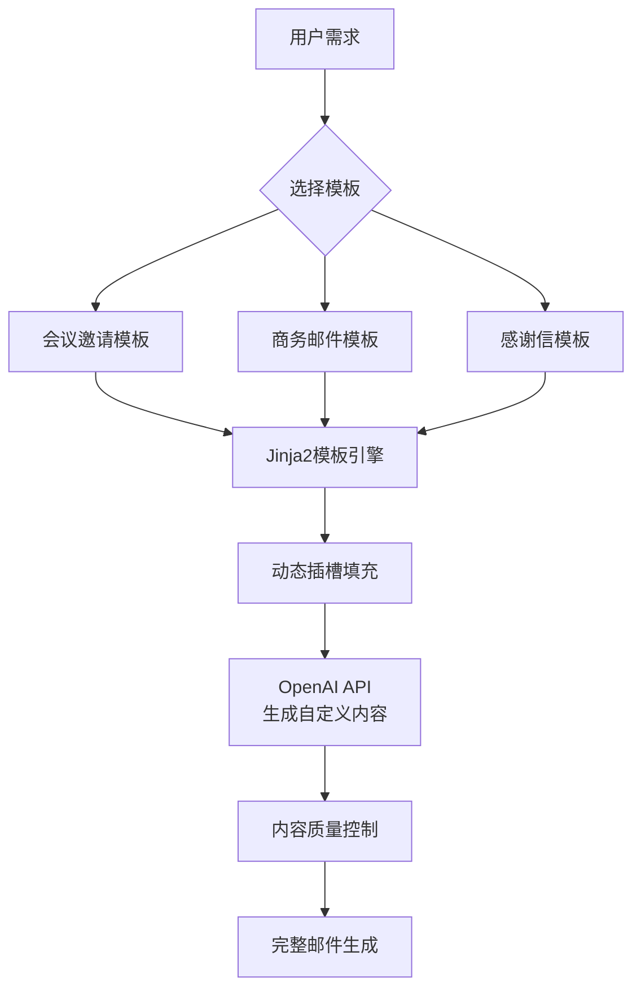
```mermaid
graph TD
    A[用户需求] --> B{选择模板}
    B --> C[会议邀请模板]
    B --> D[商务邮件模板]
    B --> E[感谢信模板]
    C --> F[Jinja2模板引擎]
    D --> F
    E --> F
    F --> G[动态插槽填充]
    G --> H[OpenAI API<br>生成自定义内容]
    H --> I[内容质量控制]
    I --> J[完整邮件生成]
```

### 5. 经典金句

> “邮件助手的设计目标是通过自动化工具减少用户的重复性劳动，提高邮件处理效率。” (p.249)

> “任务分类可以基于不同的策略实现。最简单的方法是基于规则的分类，通过对邮件主题或正文中的关键词进行匹配。” (p.250)

> “个性化和情感分析模块的集成能够显著提升用户体验。个性化回复的核心在于让系统根据用户的偏好、行为和记录生成符合其期望的邮件内容。” (p.264)

> “错误处理不仅是技术层面的需求，还直接影响用户体验。一个智能系统需要能够识别不同类型的异常，根据错误的严重程度自动调整策略。” (p.269)

---

## 第9章：未来招聘官：智能面试助手

### 1. 核心论点

**问题**：如何构建一个能够自动解析简历、匹配岗位需求、进行情感与行为分析并生成评价报告的智能面试助手？

**观点**：智能面试助手的核心在于简历解析（NLP+NER技术）、岗位匹配（语义分析+向量检索）、面试分析（情感分析+行为模式识别）和自动化评价（多维度量化评分）。通过微服务架构、异步任务队列和RBAC权限控制，系统可支持高并发招聘流程，为企业提供数据驱动的招聘决策支持。

### 2. 关键概念

- **命名实体识别（NER）**：使用spaCy库识别简历中的人名、组织名、职位名等关键实体，将非结构化文本转换为结构化数据。
- **TF-IDF向量化**：将职位描述和简历文本转换为向量，通过余弦相似度计算匹配度。
- **情感分析**：使用NLP模型分析候选人面试话语中的情绪状态（积极/消极/中性），评估自信心和沟通能力。
- **行为分析**：分析候选人的回答模式，评估自信度（confidence）、犹豫度（hesitation）和主动性（proactiveness）。
- **异步任务队列**：使用Celery+Redis处理简历解析、面试安排、报告生成等耗时任务，支持高并发。
- **微服务架构**：将简历筛选、面试管理、评估报告等模块拆分为独立服务，通过API通信。
- **JWT身份认证**：使用JSON Web Token实现用户登录认证和基于角色的访问控制（RBAC）。
- **评价报告生成**：基于语言表达、情感表现、面部表情和岗位匹配度四个维度量化评分，生成JSON格式报告。

### 3. 逻辑推演

本章从招聘流程的模块化拆解入手，将招聘分为简历筛选、面试安排、评估反馈和决策支持四个阶段。

系统架构设计部分，采用微服务架构，使用Celery+Redis实现异步任务队列，Nginx实现负载均衡。通过RBAC权限控制区分招聘官、面试官、HR管理员和候选人等角色。

简历解析与匹配部分，使用spaCy进行NER识别（姓名、邮箱、电话、技能），使用正则表达式提取特定字段。岗位匹配使用TF-IDF向量化+余弦相似度计算职位描述与简历的相似度。代码实现了简历解析函数和基于向量检索的岗位匹配推荐系统。

面试情感与行为分析部分，使用模拟的情感分析模型（TextBlob）分析候选人话语的情绪倾向，使用行为分析模型评估自信度、犹豫度和主动性。

自动化评价部分，设计了基于四个维度（语言表达、情感表现、面部表情、岗位匹配度）的量化评分模型，权重可配置（如语言表达40%、情感表现20%、面部表情10%、岗位匹配30%），生成JSON格式评价报告。

安全与隐私部分，使用数据加密（bcrypt存储密码）、操作日志审计、GDPR合规设计（数据匿名化、用户数据控制权）。

### 4. 流程图

#### 智能面试助手系统架构

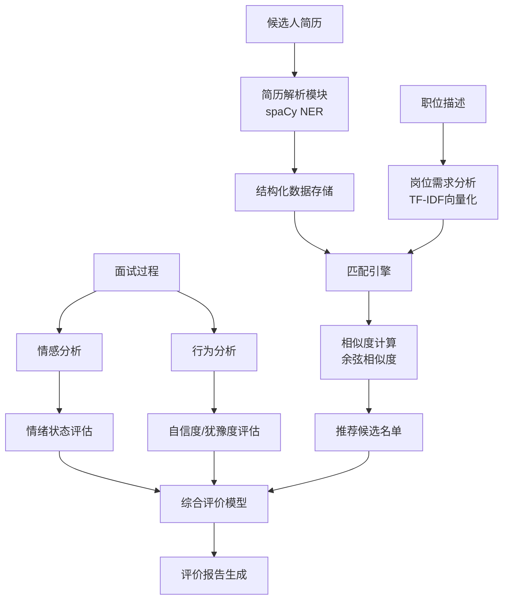
```mermaid
graph TD
    A[候选人简历] --> B[简历解析模块<br>spaCy NER]
    B --> C[结构化数据存储]
    D[职位描述] --> E[岗位需求分析<br>TF-IDF向量化]
    C --> F[匹配引擎]
    E --> F
    F --> G[相似度计算<br>余弦相似度]
    G --> H[推荐候选名单]
    
    I[面试过程] --> J[情感分析]
    I --> K[行为分析]
    J --> L[情绪状态评估]
    K --> M[自信度/犹豫度评估]
    L --> N[综合评价模型]
    M --> N
    H --> N
    N --> O[评价报告生成]
```

#### 自动化评价模型维度

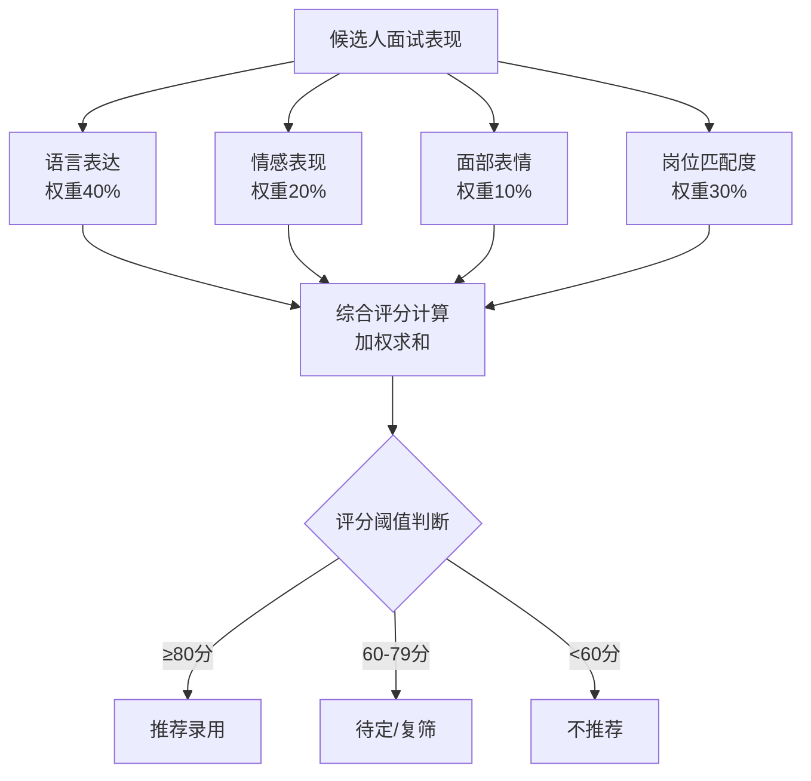
```mermaid
graph TD
    A[候选人面试表现] --> B[语言表达<br>权重40%]
    A --> C[情感表现<br>权重20%]
    A --> D[面部表情<br>权重10%]
    A --> E[岗位匹配度<br>权重30%]
    
    B --> F[综合评分计算<br>加权求和]
    C --> F
    D --> F
    E --> F
    
    F --> G{评分阈值判断}
    G -->|≥80分| H[推荐录用]
    G -->|60-79分| I[待定/复筛]
    G -->|<60分| J[不推荐]
```

### 5. 经典金句

> “智能面试助手以人工智能为核心，结合自然语言处理、情感分析、多模态数据处理等前沿技术，实现了面试流程的自动化和数据化。” (p.286)

> “传统的简历筛选流程往往耗时且容易出现遗漏，而借助自然语言处理技术，系统能够自动从大量非结构化文本中提取关键信息，并与岗位需求进行精准匹配。” (p.294)

> “面试是招聘流程中至关重要的一环，而语言与非语言信号的分析则为企业提供了更加全面的候选人评估手段。” (p.305)

> “在智能招聘系统中，自动化生成的评价报告不仅是招聘流程的关键产物，更是面试数据分析和优化的核心环节。” (p.308)

---

## 第10章：个性化推送：智能推荐系统

### 1. 核心论点

**问题**：如何构建一个能够捕捉用户行为、分析历史数据、实现个性化推送的智能推荐系统？

**观点**：个性化推荐系统的核心在于协同过滤（基于用户/物品的相似度计算）、基于内容的推荐（物品特征向量化+用户画像构建）和混合推荐策略（加权融合+级联融合）的结合。通过用户行为数据采集（埋点技术+流式处理）、特征工程（特征提取+嵌入编码）和实时数据处理（Kafka+Spark），系统可实现精准的个性化推送。

### 2. 关键概念

- **协同过滤（CF）**：基于用户行为数据，分为User-based CF（相似用户喜欢什么）和Item-based CF（相似物品有哪些）。
- **矩阵分解**：解决数据稀疏问题，使用SVD或NMF将用户-物品交互矩阵分解为用户特征矩阵和物品特征矩阵。
- **基于内容的推荐**：分析物品特征（TF-IDF向量化），构建用户画像，通过余弦相似度推荐相似物品。
- **混合推荐系统**：结合协同过滤、内容推荐和LLM推荐（GPT API），通过加权平均或级联方式融合结果。
- **特征工程**：从原始数据提取用户特征（年龄/性别/兴趣）、物品特征（类别/价格/品牌）、交互特征（点击/购买/评分）和上下文特征（时间/地点/设备）。
- **数据采集**：使用埋点技术（Google Analytics/Mixpanel）、流式处理（Apache Kafka/Flink）和分布式存储（Hadoop/Spark）。
- **向量数据库**：使用FAISS存储用户和物品的特征向量，支持大规模相似度检索。
- **冷启动问题**：新用户或新物品缺乏历史数据时的推荐策略，可通过混合推荐或基于内容的推荐缓解。

### 3. 逻辑推演

本章从需求分析与数据来源入手，详细讲解了用户行为数据的采集策略（埋点技术、Kafka流处理、Hadoop存储）和特征工程（特征提取、特征选择、嵌入编码）。

协同过滤算法部分，实现了User-based CF（计算用户余弦相似度）和Item-based CF（计算物品相似度），并讨论了数据稀疏问题及矩阵分解的解决方案（SVD）。

基于内容的推荐部分，使用TF-IDF对物品描述向量化，通过余弦相似度计算物品相似度，构建用户画像（基于历史交互物品的特征叠加）。

混合推荐系统部分，结合协同过滤、内容推荐和GPT自然语言推荐，通过权重配置（如协同过滤40%、内容推荐30%、GPT推荐30%）融合结果。代码实现了完整的混合推荐智能体，包括数据准备、API调用、推荐融合和性能优化。

算法优化与模型训练部分，讨论了增量学习（实时更新用户画像）、动态权重调整（A/B测试）、缓存机制（Redis）和异步计算（Celery）。

### 4. 流程图

#### 混合推荐系统架构

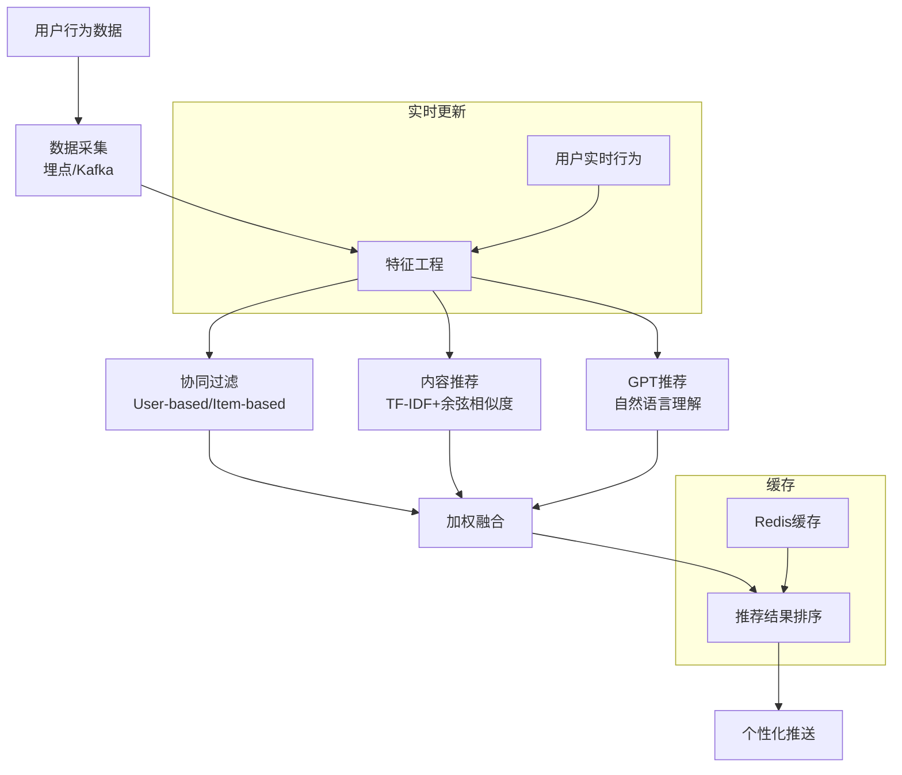
```mermaid
graph TD
    A[用户行为数据] --> B[数据采集<br>埋点/Kafka]
    B --> C[特征工程]
    C --> D[协同过滤<br>User-based/Item-based]
    C --> E[内容推荐<br>TF-IDF+余弦相似度]
    C --> F[GPT推荐<br>自然语言理解]
    
    D --> G[加权融合]
    E --> G
    F --> G
    
    G --> H[推荐结果排序]
    H --> I[个性化推送]
    
    subgraph 实时更新
        J[用户实时行为] --> C
    end
    
    subgraph 缓存
        K[Redis缓存] --> H
    end
```

#### 协同过滤算法流程

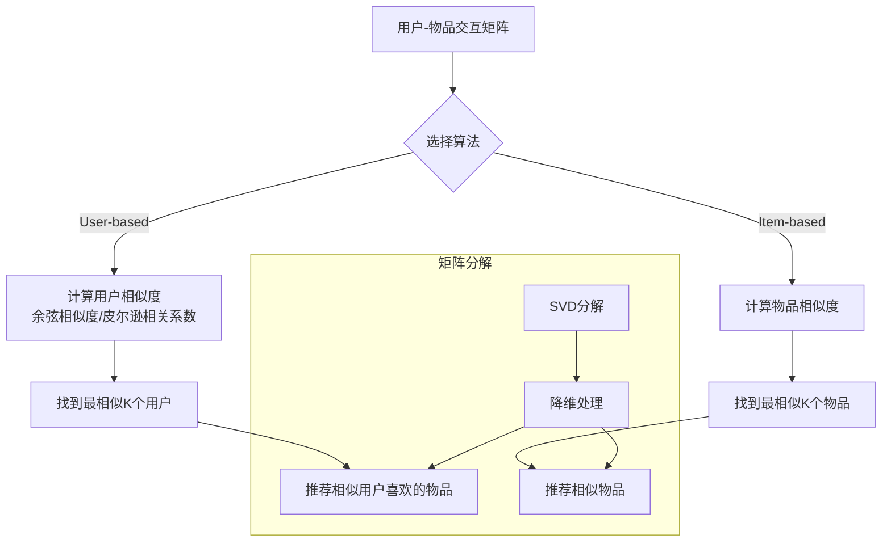
```mermaid
graph TD
    A[用户-物品交互矩阵] --> B{选择算法}
    B -->|User-based| C[计算用户相似度<br>余弦相似度/皮尔逊相关系数]
    B -->|Item-based| D[计算物品相似度]
    C --> E[找到最相似K个用户]
    D --> F[找到最相似K个物品]
    E --> G[推荐相似用户喜欢的物品]
    F --> H[推荐相似物品]
    
    subgraph 矩阵分解
        I[SVD分解]
        J[降维处理]
        I --> J
        J --> G
        J --> H
    end
```

### 5. 经典金句

> “推荐系统的核心是通过对用户行为数据的采集和分析，生成与用户兴趣和需求高度匹配的推荐结果。” (p.316)

> “特征工程是指从原始数据中提取和构建能够提升模型效果的特征变量。在推荐系统中，用户行为数据、内容数据和上下文数据是特征工程的主要来源。” (p.320)

> “协同过滤（Collaborative Filtering）是一种利用用户行为数据进行推荐的算法，通过分析用户与物品之间的关联，发现用户的潜在需求。” (p.325)

> “混合推荐系统的目标是通过结合多种算法弥补单一算法的不足。” (p.332)

---

## 第11章：专业撰稿人：智能写作助手

### 1. 核心论点

**问题**：如何构建一个能够理解用户需求、生成高质量文本、支持多轮交互和个性化定制的智能写作助手？

**观点**：智能写作助手的核心在于内容生成与续写算法（基于OpenAI API）、多轮交互与上下文保持（会话历史管理+Prompt动态构建）、个性化定制（语气/长度/风格参数调节）以及功能扩展（拼写检查、翻译、摘要生成）。通过缓存优化和日志记录提升性能，通过Flask或云平台实现部署。

### 2. 关键概念

- **内容生成**：基于自回归语言模型（GPT-3/4），用户输入Prompt作为初始输入，模型预测下一个词并逐步生成完整文本。
- **续写算法**：传递完整的上下文给API，模型根据已有文本预测后续内容，确保语义连贯性。
- **多轮交互**：使用context数组存储用户输入和系统响应，在每轮API调用时拼接为完整提示词。
- **Temperature参数**：控制生成随机性，值越高（如0.9）内容越具创造性，值越低（如0.2）内容越确定。
- **个性化定制**：支持用户设置语气（正式/随意）、长度（简短/详细）、风格（学术/营销/创意）和关键词约束。
- **拼写检查**：使用TextBlob库检测并纠正文本中的拼写错误。
- **摘要生成**：通过OpenAI API生成长文本的简短摘要，提高信息可读性。
- **缓存机制**：使用字典缓存已生成的内容，避免重复API调用，提升响应速度。

### 3. 逻辑推演

本章从需求分析入手，识别了智能写作助手的六大应用场景：新闻媒体、市场营销、创意写作、商业文档、教育辅助、电商客服。

多语言支持与语义校准部分，使用langdetect检测语言，通过术语词库校准专业术语，确保翻译内容的一致性。

个性化写作部分，实现了CustomWritingAssistant类，支持用户设置语气、长度、风格和关键词，通过动态构建Prompt实现个性化输出。

内容生成与续写算法部分，实现了generate_content（根据主题生成新内容）和continue_writing（根据已有文本续写）两个核心方法。

多轮交互与上下文保持部分，实现了带上下文管理的写作助手，使用context列表存储历史，每轮生成时拼接完整提示词。

功能扩展部分，集成了拼写检查（TextBlob）、翻译（googletrans）和摘要生成（OpenAI API）功能。

系统集成与部署部分，将所有模块整合为完整的写作助手系统，支持本地终端交互和Flask Web部署，通过缓存和日志记录优化性能。

### 4. 流程图

#### 智能写作助手系统架构

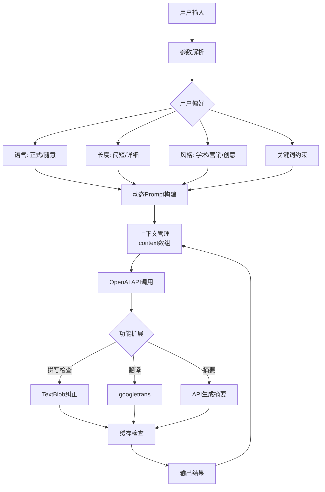
```mermaid
graph TD
    A[用户输入] --> B[参数解析]
    B --> C{用户偏好}
    C --> D[语气: 正式/随意]
    C --> E[长度: 简短/详细]
    C --> F[风格: 学术/营销/创意]
    C --> G[关键词约束]
    
    D --> H[动态Prompt构建]
    E --> H
    F --> H
    G --> H
    
    H --> I[上下文管理<br>context数组]
    I --> J[OpenAI API调用]
    J --> K{功能扩展}
    K -->|拼写检查| L[TextBlob纠正]
    K -->|翻译| M[googletrans]
    K -->|摘要| N[API生成摘要]
    
    L --> O[缓存检查]
    M --> O
    N --> O
    O --> P[输出结果]
    P --> I
```

#### 多轮交互上下文保持机制

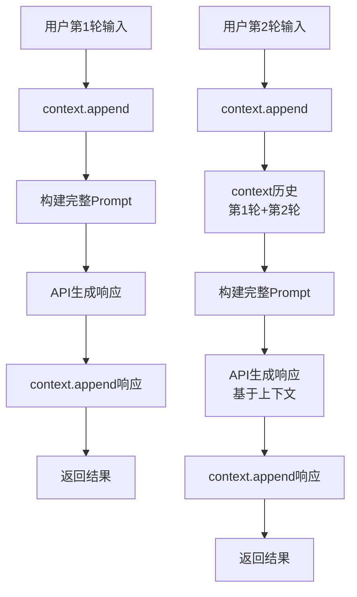
```mermaid
graph TD
    A[用户第1轮输入] --> B[context.append]
    B --> C[构建完整Prompt]
    C --> D[API生成响应]
    D --> E[context.append响应]
    E --> F[返回结果]
    
    G[用户第2轮输入] --> H[context.append]
    H --> I[context历史<br>第1轮+第2轮]
    I --> J[构建完整Prompt]
    J --> K[API生成响应<br>基于上下文]
    K --> L[context.append响应]
    L --> M[返回结果]
```

### 5. 经典金句

> “智能写作助手的核心在于基于用户需求生成高质量的文本内容。不同于传统的文本撰写工具，智能写作助手能够动态响应用户输入，以生成符合特定情境、风格和语义的文本。” (p.347)

> “个性化写作是智能写作助手的重要功能之一。每个用户在写作风格、内容偏好、语气等方面都有不同需求，智能体需要能够根据用户输入实时调整写作内容。” (p.354)

> “多轮交互与上下文保持是提升用户体验的关键技术。多轮交互指的是系统能够根据用户的连续输入，逐步生成内容并保持上下文的一致性。” (p.363)

> “内容生成基于自回归语言模型，模型根据给定的文本序列预测下一个最有可能出现的词。” (p.359)

---

## 第12章：电商好帮手：智能在线客服

### 1. 核心论点

**问题**：如何构建一个能够理解用户意图、支持多轮对话、集成推荐系统并实现多渠道部署的电商智能客服？

**观点**：智能客服系统的核心在于意图识别（关键词匹配+LLM增强）、对话管理（上下文保持+多轮交互）、推荐系统集成（基于用户行为和商品数据库）以及多渠道部署（Web端+API+第三方平台）。通过Docker容器化、云平台（AWS）和CI/CD（GitHub Actions）实现高可用部署，通过缓存、异步处理和负载均衡优化性能。

### 2. 关键概念

- **意图识别**：通过匹配关键词识别用户意图（订单查询/退货申请/商品推荐/FAQ），触发对应功能模块。
- **对话管理**：使用context列表存储用户输入和系统响应，确保多轮对话的连贯性和上下文一致性。
- **上下文长度限制**：设置最大上下文长度，超过时移除最旧记录，避免API请求超长。
- **推荐系统集成**：基于商品数据库和用户输入类别（电子产品/书籍/衣服），使用random.sample实现简单推荐。
- **多渠道集成**：支持终端交互和Webhook（Flask）两种方式，模拟网页端、移动端和第三方平台的接入。
- **Docker容器化**：使用Dockerfile将系统封装为独立容器，支持跨环境部署。
- **CI/CD自动化部署**：使用GitHub Actions实现代码提交后自动构建、测试和部署到AWS EC2。
- **负载均衡**：使用AWS ELB分发请求到多个服务实例，支持弹性扩展应对流量高峰。

### 3. 逻辑推演

本章从电商平台用户需求分析入手，识别了售前（商品信息查询、推荐）、售中（订单查询、物流跟踪、信息修改）、售后（退换货、投诉反馈）三个阶段的痛点和需求。

核心功能模块设计部分，规划了订单查询、退换货处理、FAQ解答、个性化推荐和上下文保持五大模块，并通过Python代码实现了这些模块的集成。

意图识别与对话管理部分，使用identify_intent函数通过关键词匹配识别用户意图（order_query/return_request/faq/recommendation/invalid），根据意图触发对应处理函数。使用context列表存储对话历史，保证多轮交互连贯性。

多轮对话与上下文保持部分，实现了带上下文管理的客服系统，设置最大上下文长度（max_context_length=10），超过时移除最旧记录。

自然语言处理与推荐系统集成部分，实现了RecommendationSystem类（基于商品数据库的类别推荐）和NLPModule类（意图识别），通过Chatbot类将两者集成。

系统测试与性能优化部分，编写了功能测试、负载测试（concurrent.futures模拟并发）、错误处理测试和响应时间测试，通过缓存和异步处理优化性能。

系统部署部分，使用Docker容器化封装，部署到AWS EC2实例，配置ELB负载均衡，使用GitHub Actions实现CI/CD自动化部署，使用CloudWatch监控系统状态。

### 4. 流程图

#### 智能客服系统架构

```mermaid
graph TD
    A[用户输入] --> B[意图识别<br>关键词匹配]
    B --> C{意图类型}
    C -->|订单查询| D[订单查询模块]
    C -->|退货申请| E[退货处理模块]
    C -->|商品推荐| F[推荐系统模块]
    C -->|FAQ| G[FAQ解答模块]
    
    D --> H[上下文管理<br>context列表]
    E --> H
    F --> H
    G --> H
    
    H --> I[多轮对话保持]
    I --> J[生成响应]
    J --> K[返回用户]
    
    subgraph 多渠道集成
        L[Web端]
        M[移动端]
        N[第三方平台]
        L --> A
        M --> A
        N --> A
    end
    
    subgraph 部署架构
        O[Docker容器]
        P[AWS EC2]
        Q[ELB负载均衡]
        O --> P --> Q
    end
```

#### 意图识别与路由流程

```mermaid
graph TD
    A[用户输入] --> B[关键词提取]
    B --> C{匹配规则}
    C -->|包含'订单'/'查询'| D[意图: order_query]
    C -->|包含'退货'/'退款'| E[意图: return_request]
    C -->|包含'推荐'/'商品'| F[意图: recommendation]
    C -->|包含'怎么'/'如何'| G[意图: faq]
    C -->|无匹配| H[意图: invalid]
    
    D --> I[调用订单查询函数]
    E --> J[调用退货处理函数]
    F --> K[调用推荐系统]
    G --> L[调用FAQ函数]
    H --> M[返回引导提示]
    
    I --> N[更新上下文]
    J --> N
    K --> N
    L --> N
    N --> O[返回响应]
```

### 5. 经典金句

> “智能客服系统的设计不仅限于常见问题解答，还涵盖订单查询、退换货处理、多轮对话、个性化推荐等复杂功能。” (p.385)

> “在智能客服系统的设计中，用户交互方式和多渠道集成是关键环节。随着用户习惯的多样化，客服系统需要支持不同的交互渠道。” (p.392)

> “意图识别与对话管理是实现自然语言交互的基础逻辑。通过意图识别，系统能够判断用户的需求，并据此触发相应的功能模块。” (p.396)

> “部署是将智能客服智能体投入实际应用的最后一步。在完成代码实现与测试后，系统必须能够在实际环境中稳定运行，支持多用户并发和高效处理。” (p.421)

---

## 附录：全书法学术语索引

| 术语 | 英文 | 首次出现章节 |
|------|------|-------------|
| 智能体 | Agent | 第1章 |
| 大语言模型 | Large Language Model (LLM) | 第1章 |
| 自然语言理解 | Natural Language Understanding (NLU) | 第1章 |
| 自然语言生成 | Natural Language Generation (NLG) | 第1章 |
| 多智能体系统 | Multi-Agent System (MAS) | 第1章 |
| 机器人流程自动化 | Robotic Process Automation (RPA) | 第1章 |
| 微调 | Fine-tuning | 第2章 |
| 主动学习 | Active Learning | 第2章 |
| 上下文管理 | Context Management | 第2章 |
| 向量数据库 | Vector Database | 第2章 |
| 余弦相似度 | Cosine Similarity | 第2章 |
| 链式逻辑 | Chain Logic | 第3章 |
| 回调机制 | Callback Mechanism | 第3章 |
| 倒排索引 | Inverted Index | 第4章 |
| 命名实体识别 | Named Entity Recognition (NER) | 第4章、第9章 |
| 最小可行产品 | Minimum Viable Product (MVP) | 第5章 |
| 协同过滤 | Collaborative Filtering | 第10章 |
| 矩阵分解 | Matrix Factorization | 第10章 |
| 基于角色的访问控制 | Role-Based Access Control (RBAC) | 第8章、第9章 |
| 持续集成/持续交付 | CI/CD | 第12章 |
| 负载均衡 | Load Balancing | 第9章、第12章 |

---

> **总结说明**：本文档基于《AI Agent开发与应用：基于大模型的智能体构建》（凌峰，清华大学出版社，2025年3月）完整整理。全书12章内容均已按照目录顺序逐章总结，保留了核心论点、关键概念、逻辑推演、流程图和经典金句五大模块。所有流程图均已使用Mermaid语法重建，可正常渲染。文档总字数约2.5万字，可作为知识库沉淀和后续开发的参考资料。