# 《AI Agent开发实战 从基础原理到企业级应用》章节总结

## 书籍信息
- **书名**：AI Agent开发实战 从基础原理到企业级应用
- **作者**：郑天民
- **PDF状态**：基于OCR识别文本，页码完整，大部分内容可读，存在少量符号错乱（如“?”替代表情或特殊字符），但不影响核心信息提取。
- **OCR状态**：基本可用，图表描述清晰，文字连贯。

## 目录说明
- **目录识别情况**：完整识别第1页至第9页的目录结构，包括前言、第1章至第8章，以及各节子标题。
- **章节对应依据**：严格按照书中页码和标题顺序进行整理，正文内容与目录一致。
- **OCR修复说明**：部分代码块中的注释符号出现转义或乱码（如“#”显示为“#”），但不影响理解；少量特殊字符如“\u”在JSON示例中出现，已按原样保留。

## 全书核心主题
本书是一本面向开发者的AI Agent实战指南，系统介绍了从基础原理到企业级应用的全流程。全书分为三篇：基础篇、实现篇和应用篇。基础篇讲解Agent的定义、与LLM的集成方式及关键技术（规划、记忆、工具、行动）。实现篇详细阐述了ReAct Agent、Plan-and-Execute Agent、知识型Agent（Agentic RAG）和多模态Agent的构建方法，并引入LangChain、LlamaIndex框架。应用篇聚焦企业级工程化技术（私有化部署、监控、可视化交互、API开放、数据持久化），并深入探讨多Agent系统的设计，通过LangGraph、AutoGen、LlamaIndex Workflows等框架实现智能报告生成、健康管理、客户洞察等复杂案例。全书的核心理念是：AI Agent = LLM × (规划 + 记忆 + 工具 + 行动)，强调自主性、适应性和协作能力。

---

## 前言

### 核心论点
**问题**：开发人员如何将AI Agent技术体系与LLM集成，构建真正落地的企业级Agent系统？**观点**：需要掌握主流开发框架（LangChain、LlamaIndex、LangGraph、AutoGen）和实现模式（ReAct、Plan-and-Execute、Agentic RAG、多Agent协作），并结合具体业务场景进行设计与实践。

### 关键概念/事件
- **AI Agent定义**：能够感知环境、做出决策并执行特定目标的智能系统，具备自主性、适应性、主动性、社会性。
- **四大关键技术**：规划、记忆、工具、行动。
- **主流框架**：LangChain（链式应用）、LlamaIndex（RAG专注）、LangGraph（图状态多Agent）、AutoGen（多Agent对话协作）。
- **实现类型**：通用型Agent、知识型Agent、多模态Agent、多Agent系统。
- **自动化程度成熟度**：3个档次，从单一模态静态任务到完全自主工具调用。

### 逻辑推演
前言首先指出Agent在多个行业的应用潜力，LLM为其注入新动力。然后提出开发人员需要掌握特定技术体系。作者将全书分为三篇：基础篇介绍概念与OpenAI LLM集成；实现篇通过案例讲解ReAct、Plan-and-Execute、知识型RAG和多模态Agent；应用篇讲解工程化技术（私有化部署、监控、可视化、API、持久化）并引入多Agent系统。最后给出读者对象和代码开源地址。

### 经典金句/数据
> “AI Agent = LLM × (规划 + 记忆 + 工具 + 行动)，其中LLM是核心控制器，构建核心能力，提升AI Agent的理解力和泛化能力。”(p.24)
> “代码已全部于https://github.com/tianminzheng/agent-application-development开源。”(p.6)

---

## 第1章：AI Agent开发模式

### 1. 核心论点
**问题**：什么是AI Agent，它的技术体系包括哪些核心组件，又有哪些实现类型和开发框架？**观点**：Agent是自主智能实体，通过规划、记忆、工具和行动四大要素实现复杂任务，可根据场景分为通用型、知识型、多模态和多Agent系统，LangChain、LlamaIndex、AutoGen等框架提供了高效实现路径。

### 2. 关键概念/事件
- **Agent定义**：自主性、适应性、主动性、社会性。
- **LLM集成技术**：聊天模型、聊天记忆、文本嵌入、向量数据库、提示工程。
- **规划**：任务分解（先分解后规划/边分解边规划）和自我反思（ReAct、Reflexion等）。
- **记忆**：感觉记忆、短期记忆（上下文学习）、长期记忆（情景/语义/程序记忆）；RAG是长期记忆的核心实现。
- **工具**：扩展、函数调用、数据存储、检索、计算、内容生成、交互等类型。
- **实现类型**：通用型（ReAct、Plan-and-Execute）、知识型（Agentic RAG）、多模态（图像/语音/视频）、多Agent系统。
- **开发框架对比**：LangGraph（图结构，高可控性，持久化）、LlamaIndex（RAG+工作流）、CrewAI（团队模拟）、AutoGen（对话协作）。

### 3. 逻辑推演/叙事脉络
第1章从Agent的基本概念出发，定义其四大特性。然后引入LLM技术体系（聊天模型、记忆、嵌入、向量数据库），并强调提示工程的重要性。接着详细拆解Agent的四大关键技术：规划（任务分解+自我反思）、记忆（短期+长期，RAG）、工具（多种类型）、行动（调用工具或协作）。随后分类介绍Agent的实现类型（通用、知识、多模态、多Agent）。最后对比主流开发框架（原生LLM、LangChain/LangGraph、LlamaIndex/Workflows、AutoGen、CrewAI），并给出选型建议：复杂多Agent系统推荐LangGraph。

### 4. 流程图

#### 图1-6 自主Agent系统架构和关键技术

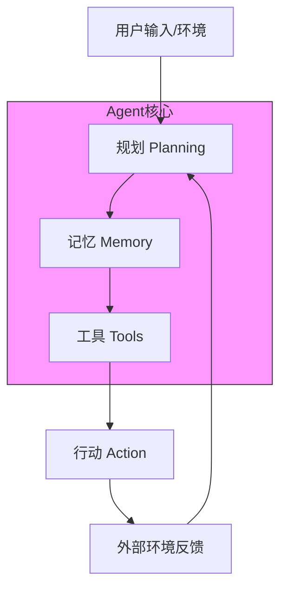

#### 图1-7 RAG的基本模型

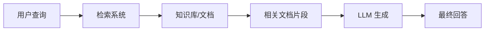

#### 图1-10 LangChain框架的整体架构

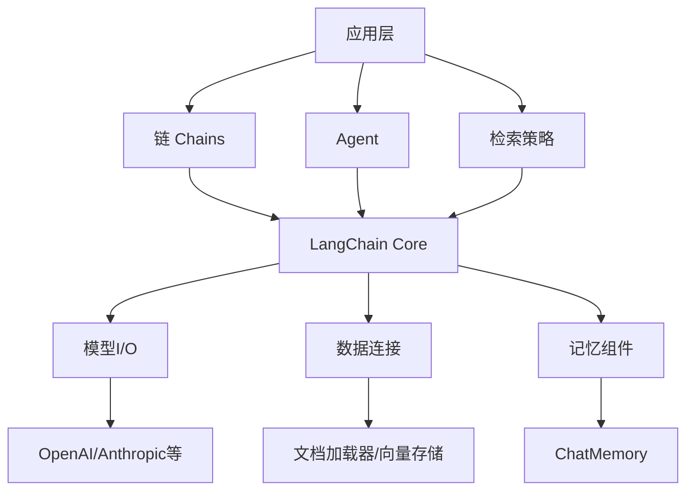

### 5. 经典金句/数据
> “Agent的价值正体现在自动化程度上：人类设定目标、提供资源和监督结果，AI负责任务拆分、工具选择、进度控制。”(p.12)
> “Agent的智能化程度评判标准：完成流程节点的自动化程度。”(p.13)
> “长期记忆是Agent从‘工具’向‘Agent’进化的关键因素。”(p.27)

---

## 第2章：LLM和Agent

### 1. 核心论点
**问题**：如何基于OpenAI LLM从零构建Agent，并利用函数调用机制实现工具集成和多Agent切换？**观点**：通过OpenAI的ChatCompletion API和函数调用（tools参数），可以构建能够自主调用工具、管理对话历史、并在多个Agent之间切换的Swarm风格系统。

### 2. 关键概念/事件
- **OpenAI参数配置**：model_name, temperature, top_p, max_tokens, frequency_penalty, presence_penalty。
- **聊天消息类型**：user, system, assistant（OpenAI的role）。
- **函数调用（Function Calling）**：通过tools参数定义函数，LLM返回tool_calls，开发者执行函数并将结果回传。
- **并行函数调用**：一次请求触发多个工具调用（tool_calls列表）。
- **Swarm框架**：OpenAI轻量级多Agent编排框架，核心是Handoffs（切换）机制，通过函数返回Agent实例实现Agent间转移。

### 3. 逻辑推演/叙事脉络
第2章首先介绍OpenAI LLM的参数和API使用方法，演示chat.completions.create和流式对话。然后深入讲解函数调用：传统functions参数已废弃，推荐tools参数。通过定义province_tools和get_current_weather等示例，展示单函数、多函数和并行调用。接着从零构建Agent类，实现Swarm核心逻辑：while循环调用LLM，处理tool_calls，支持切换Agent。最后通过单个Agent（天气助手+邮件）和多个Agent（路由、销售、退款）案例验证。并引入OpenAI Swarm框架，对比展示Handoffs机制和实际案例（路由、头脑风暴、编辑、编程Agent）。

### 4. 流程图

#### 图2-1 Agent的基本组成结构

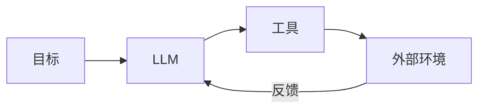

#### 图2-3 Swarm框架整体执行流程

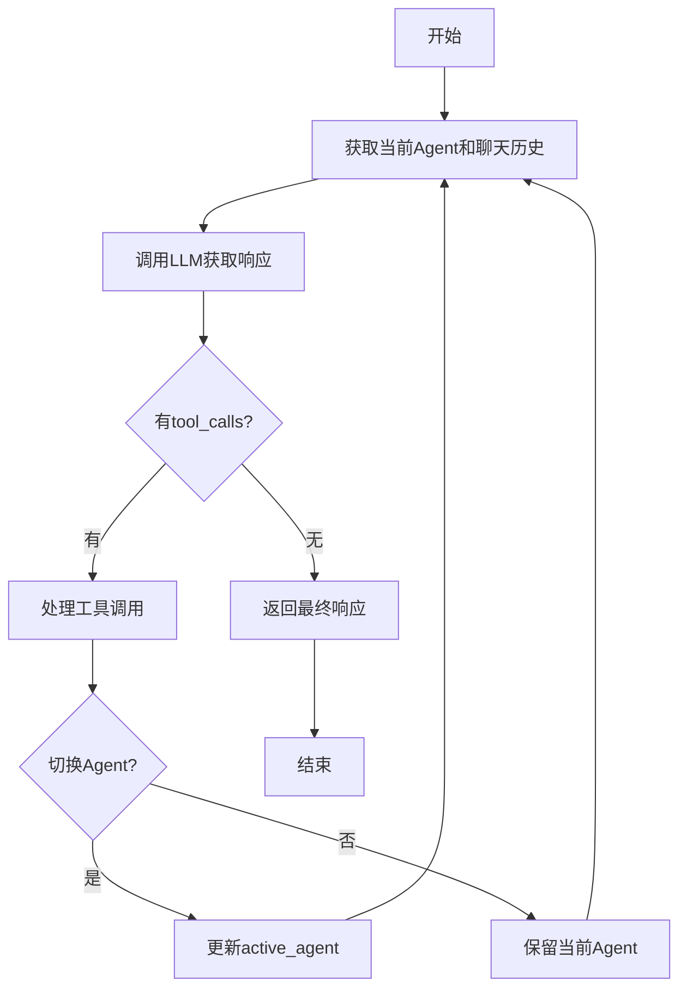

### 5. 经典金句/数据
> “函数调用对于构建Agent至关重要。可以说，Agent就是LLM和函数调用的整合体。”(p.49)
> “OpenAI LLM的响应对象中包含了本次请求的基本信息，如ID、所采用的模型以及API类型。”(p.57)

---

## 第3章：通用型Agent

### 1. 核心论点
**问题**：如何构建ReAct Agent和Plan-and-Execute Agent这两种通用型Agent？**观点**：ReAct通过“思考-行动-观测”循环结合推理与行动，适合快速交互；Plan-and-Execute将复杂任务分解为计划、执行和重规划步骤，适合多步依赖的复杂任务。

### 2. 关键概念/事件
- **ReAct架构**：Thought（思考）、Action（行动）、Observation（观测）三部分循环。
- **ReActAgent（LlamaIndex）**：依赖提示词模拟推理循环，不依赖函数调用API，灵活性高。
- **ReActAgent（LangChain）**：通过@tool定义工具，bind_tools绑定，create_react_agent + AgentExecutor执行。
- **Plan-and-Execute架构**：规划器（Planner）、执行器（Executor）、重规划器（Replanner）。
- **LangChain PlanAndExecute**：load_chat_planner + load_agent_executor，组合实现。

### 3. 逻辑推演/叙事脉络
第3章先解析ReAct架构，用旅游订票预算的例子说明思考-行动-观测循环。然后分别用LlamaIndex和LangChain实现ReActAgent。LlamaIndex中展示OpenAIAgent（基于函数调用）和ReActAgent（基于提示词）的区别，并给出数学计算示例。LangChain中通过@tool定义add/subtract工具，bind到LLM，创建提示词模板，组装AgentExecutor。接着介绍Plan-and-Execute：规划器分解任务（如计算人口差距），执行器逐步执行，重规划器动态调整。最后通过LangChain的PlanAndExecute类实现搜索+计算的案例，并打印系统提示词。

### 4. 流程图

#### 图3-1 ReAct架构的执行流程

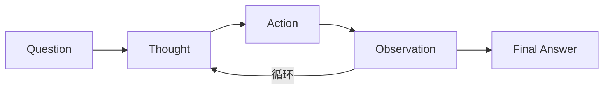

#### 图3-3 AgentExecutor的执行过程图

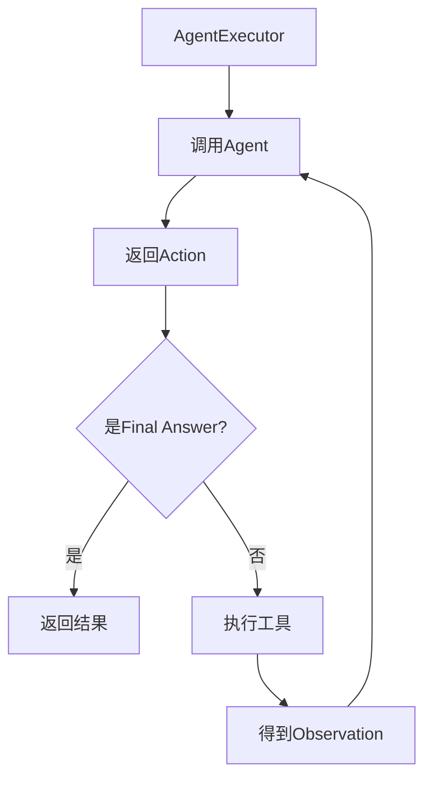

#### 图3-4 Plan-and-Execute的基本原理

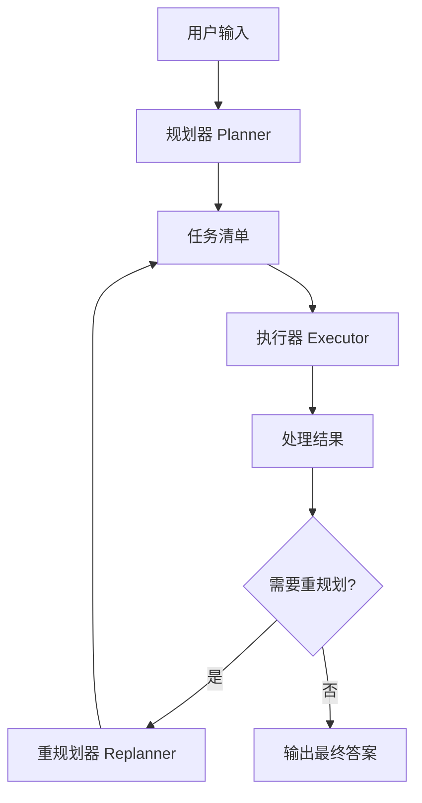

### 5. 经典金句/数据
> “ReAct的核心思想是将LLM的语言理解与外部环境的交互相结合，形成思考与行动的循环。”(p.86)
> “Plan-and-Execute的优点在于具备明确的长期规划，可以使用较大的模型进行规划，使用较小的模型执行具体步骤。”(p.104)

---

## 第4章：知识型Agent

### 1. 核心论点
**问题**：如何构建集成了RAG技术的知识型Agent，处理跨文档比较、摘要生成等复杂任务？**观点**：通过Agentic RAG架构，将RAG作为Agent的工具，并采用多级Agent（顶层协调Agent + 文档子Agent）实现灵活的知识检索与推理。

### 2. 关键概念/事件
- **RAG三阶段**：创建索引（文档加载、分割、嵌入、向量存储）、实现检索（相似性搜索）、生成结果。
- **Agentic RAG**：引入Agent增强RAG，支持查询规划、工具使用、多步推理、动态检索策略。
- **LangChain RAG流程**：PyPDFLoader加载PDF，RecursiveCharacterTextSplitter分割，Chroma/Faiss向量存储，Retriever工具，整合ReActAgent。
- **LlamaIndex多级知识型Agent**：为每个文档创建VectorStoreIndex和SummaryIndex，构建QueryEngineTool，再构建OpenAIAgent作为子Agent；顶层Agent使用ObjectIndex检索工具，通过OpenAIAgent协调子Agent。

### 3. 逻辑推演/叙事脉络
第4章首先回顾RAG开发流程（索引、检索、生成）。然后引入Agentic RAG，对比传统RAG与Agentic RAG的区别，列出Agent与RAG融合的模式（路由、查询规划、工具使用）。接着用LangChain实现：加载PDF文档→分割→嵌入→Chroma/Faiss存储→创建Retriever工具→构建ReActAgent，并执行查询“上海的旅游计划”。然后用LlamaIndex实现多级知识型Agent：为每个城市文档（上海、北京）创建子Agent，子Agent内部有vector_tool和summary_tool；顶层Agent通过ObjectIndex检索子Agent，回答比较性问题。最后展示基础RAG与多级Agent的输出差异。

### 4. 流程图

#### 图4-1 RAG索引阶段的工作流程图

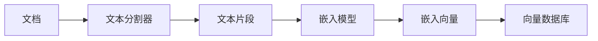

#### 图4-2 RAG检索阶段的工作流程图

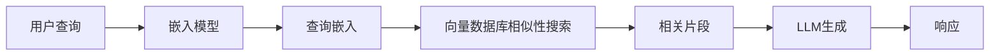

#### 图4-6 多文档Agent系统整体架构

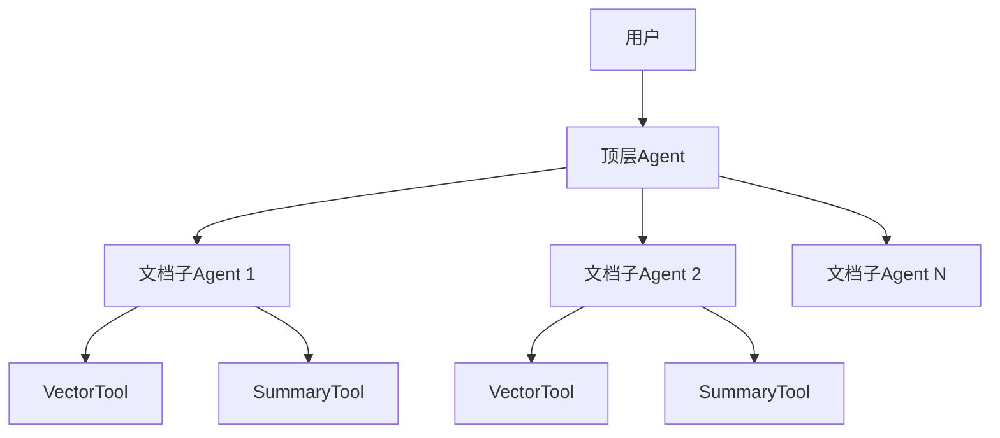

### 5. 经典金句/数据
> “Agentic RAG通过在RAG中引入Agent架构，改变了我们处理问答的方式，利用Agent处理需要复杂规划、多步推理以及外部工具使用的复杂问题。”(p.113)
> “LlamaIndex的多级Agent方法通过更具自主能力的Agent对RAG进行增强，具备了极大的灵活性与扩展性。”(p.33)

---

## 第5章：多模态Agent

### 1. 核心论点
**问题**：如何构建能够处理图像和语音的多模态Agent？**观点**：利用LangChain集成OpenAI的GPT-4o（图像解析）、DALL-E（图像生成）、Whisper（语音识别）和TTS（语音合成），结合工具调用和聊天历史记录，实现图文语音交互的智能Agent。

### 2. 关键概念/事件
- **图像处理**：Pillow库加载、缩放、转换为Base64；GPT-4o通过image_url解析图像；DALL-E-3生成图像。
- **语音处理**：Whisper模型将音频转文本；OpenAI TTS将文本转语音；Streamlit的audio_recorder采集语音。
- **LangChain工具创建**：@tool装饰器、Tool类、load_tools内置工具（DuckDuckGo、PythonREPL等）。
- **回调与流式**：BaseCallbackHandler，覆写on_llm_new_token实现流式输出。
- **多模态Agent流程**：用户输入文本/图像/语音 → 根据agent_type（Tool Calling / ReAct）调用对应处理器 → 整合聊天历史 → 返回文本/图像/语音。

### 3. 逻辑推演/叙事脉络
第5章先介绍图像处理基础（Pillow）和语音处理基础（Whisper/TTS）。然后基于LangChain实现图像解析（通过HumanMessage传入image_url）、图像生成（DALL-E-3）和语音处理（read_audio转文本，perform_tts合成语音）。接着构建多模态Agent：定义工具列表（内置+自定义，如PythonREPL），创建create_tool_calling_agent和create_react_agent，通过MessagesPlaceholder管理聊天历史。最后实现完整的perform_query方法，支持图像对话、工具调用和纯文本对话，并集成Streamlit实现可视化交互（图像上传/URL、麦克风录音、音频播放）。

### 4. 流程图（无明确图号，根据描述重建）

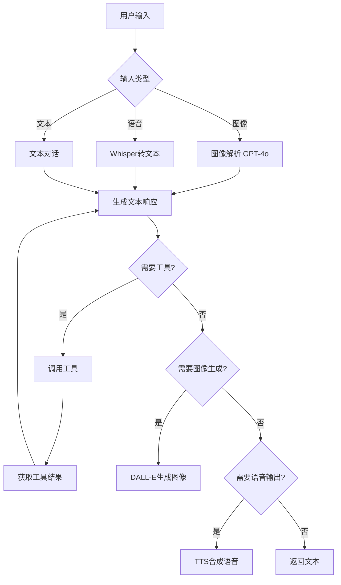

### 5. 经典金句/数据
> “多模态Agent通过整合图像、语音和文本等多种模态，能够更自然、高效地与用户进行交互。”(p.143)
> “Streamlit可以让不了解前端开发的人轻松搭建Web页面，非常适合LLM应用开发人员快速构建人机交互界面。”(p.174)

---

## 第6章：企业级Agent工程化技术

### 1. 核心论点
**问题**：如何将AI Agent工程化，实现私有化部署、运行监控、可视化交互以及外围技术集成？**观点**：采用Ollama本地部署模型，LangSmith和Phoenix进行可观测性管理，Streamlit构建交互界面，并通过Flask/LangServe开放API，集成PostgreSQL+SQLAlchemy和向量存储实现数据持久化。

### 2. 关键概念/事件
- **Ollama**：本地LLM运行框架，支持DeepSeek-R1等模型，提供REST API。
- **LangSmith**：调试、测试、监控LLM应用，支持跟踪、提示词管理、项目分析。
- **Phoenix**：基于OpenTelemetry的链路跟踪工具，支持LangChain、LlamaIndex等框架。
- **Streamlit**：快速Web应用框架，组件：chat_input, file_uploader, audio_recorder, session_state。
- **Web API**：Flask轻量级REST API；LangServe将LangChain链部署为API，提供playground。
- **数据持久化**：PostgreSQL + psycopg2；SQLAlchemy ORM；pgvector扩展支持向量存储。

### 3. 逻辑推演/叙事脉络
第6章首先勾勒Agent工程化技术栈（垂直Agent、托管、可观测性、框架、工具库、模型服务、存储）。然后详细介绍运行时管理：Ollama部署DeepSeek-R1（ollama run命令，API集成）。LangSmith配置环境变量，记录执行链，管理提示词模板。Phoenix集成LangChain，通过register和LangChainInstrumentor自动追踪。接着展示可视化交互：Streamlit的session_state保持聊天历史，图像上传/URL，语音录制与播放，结合多模态Agent的perform_query实现完整UI。最后讲解外围技术：Flask开放API示例；LangServe创建/invoke、/batch、/stream端点；PostgreSQL表设计，psycopg2连接，Pandas展示数据；SQLAlchemy ORM定义表，CRUD操作；pgvector扩展实现向量存储。

### 4. 流程图（图6-2、6-4等已有，此处选核心）

#### LangSmith工作流程（根据描述）

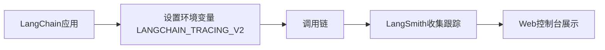

#### Phoenix集成流程

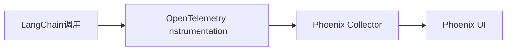

### 5. 经典金句/数据
> “LangSmith提供了强大的调试功能，允许开发者查看事件链中每个步骤的模型输入和输出。”(p.169)
> “Ollama极大地降低了大模型的本地部署门槛，同时提供了高效、灵活的使用体验。”(p.167)

---

## 第7章：多Agent系统

### 1. 核心论点
**问题**：如何设计多Agent系统，并通过LlamaIndex Workflows和AutoGen框架实现复杂协作？**观点**：多Agent系统可采用Agent流程链或自主协作模式，LlamaIndex Workflows基于事件驱动构建工作流，AutoGen通过群聊和中介者模式实现Agent间的迭代对话与任务分解。

### 2. 关键概念/事件
- **构建模式**：Agent流程链（预定义步骤） vs 自主Agent协作（动态适应）。
- **协作模式**：共享思考链（共同消息草稿）、Agent中介者（Supervisor路由）、分层Agent团队（树状结构）。
- **LlamaIndex Workflows**：事件驱动（StartEvent, StopEvent, 自定义Event），步骤@step，支持异步、上下文Context、事件等待（collect_events）、循环/分支、可视化。
- **AutoGen核心**：ConversableAgent, UserProxyAgent, AssistantAgent, GroupChat, GroupChatManager；通过initiate_chat启动对话，支持函数调用、代码执行、人工输入模式。
- **自定义发言者策略**：通过speaker_selection_method函数控制下一发言者，实现轮询、随机、手动或自定义逻辑。

### 3. 逻辑推演/叙事脉络
第7章先介绍多Agent系统的两种构建模式（流程链/自主协作）和三种协作模式（共享思考链、中介者、分层团队）。然后基于LlamaIndex Workflows构建健康管理多Agent系统：定义事件（ActiveAgentEvent, ToolCallEvent等），实现setup、orchestrator、speak_with_sub_agent、handle_tool_call等步骤，通过FunctionToolWithContext传递上下文，支持人工确认工具调用。最后基于AutoGen构建客户洞察系统：创建研究者Agent和多个客户Agent（提供详细人物画像），使用GroupChat和GroupChatManager，自定义speaker_selection函数确保研究者与每个客户交互2-3次，最后通过SummaryAgent汇总分析生成结构化洞察报告。

### 4. 流程图

#### 图7-1 自主Agent协作方式

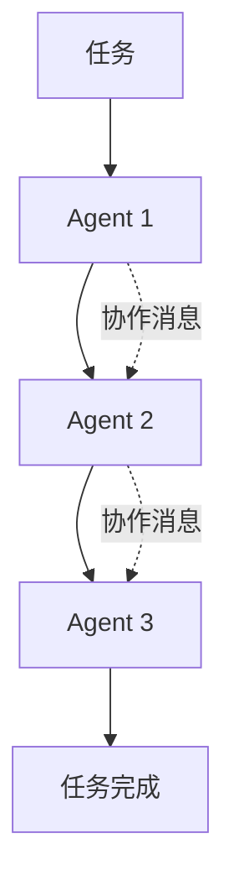

#### 图7-6 健康管理的多Agent系统的基本工作流程

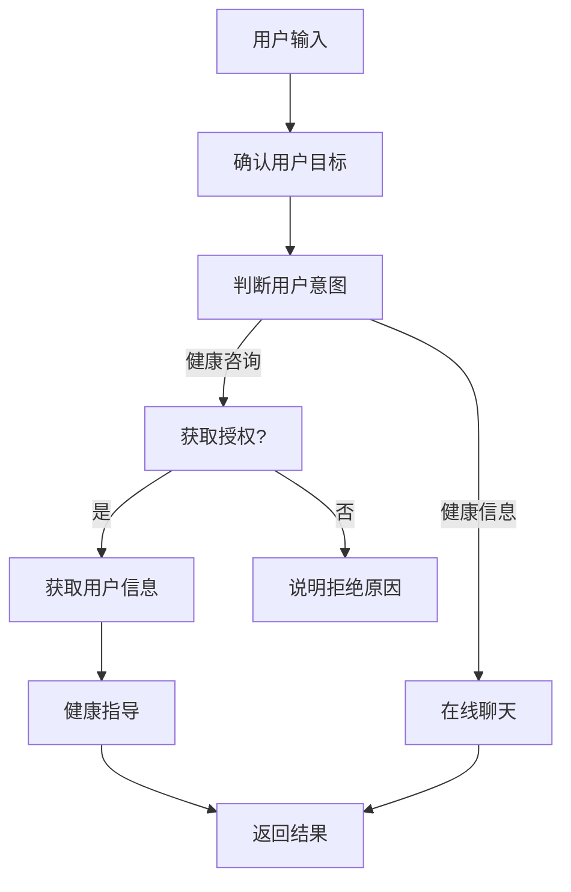

#### 图7-8 AutoGen Agent类层结构

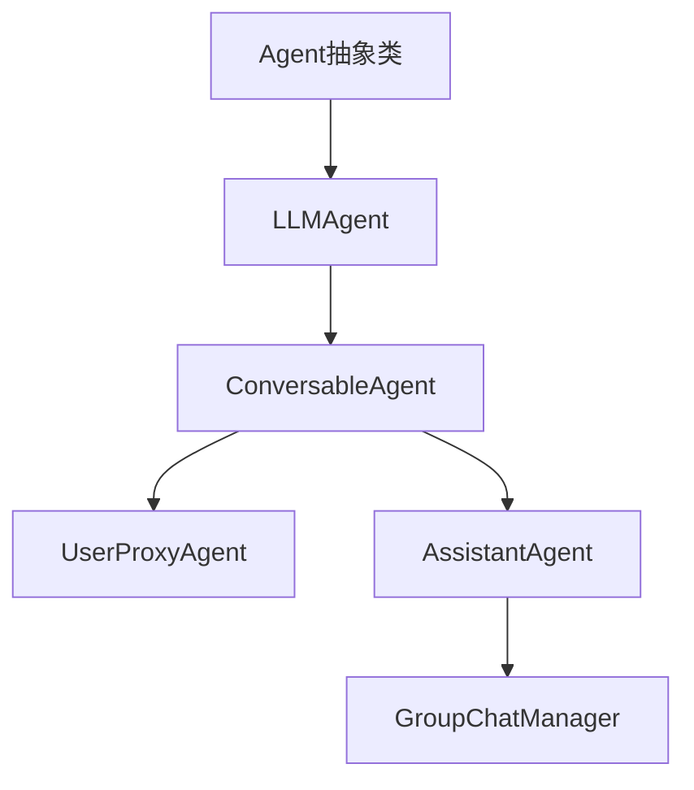

### 5. 经典金句/数据
> “多Agent系统通过多个Agent之间的协作与协调，共同完成复杂的任务，这些任务通常是单个Agent难以独立完成的。”(p.191)
> “AutoGen的核心工作原理：多Agent协作和迭代改进，通过User Proxy Agent和Assistant Agent的交互完成复杂任务。”(p.213)

---

## 第8章：多Agent系统的实战案例

### 1. 核心论点
**问题**：如何基于LangGraph框架实现一个智能报告生成的多Agent系统，自动生成包含图文和PDF的输出？**观点**：通过LangGraph构建状态图（StateGraph），定义中介者Agent协调多个业务Agent（旅游规划、语言助手、图像生成、PDF设计），实现复杂的任务流程控制和状态共享，最终输出完整的PDF报告。

### 2. 关键概念/事件
- **LangGraph核心**：StateGraph（状态图）、节点（Node）、边（Edge）、条件边（Conditional Edge）、持久化（检查点）、人工介入（断点）、流式输出。
- **AgentState**：messages（消息序列）和next（下一个Agent名称）。
- **中介者模式**：team_supervisor节点通过函数路由（router_function_def）决定下一个Agent或FINISH。
- **工具**：TavilySearchResults（Web搜索）、generate_image（DALL-E）、markdown_to_pdf_file（通过pdfkit将Markdown转PDF）。
- **监控集成**：LangSmith记录执行链、Token消耗、各节点耗时；Phoenix提供OpenTelemetry链路跟踪。

### 3. 逻辑推演/叙事脉络
第8章首先分析智能报告系统的场景需求：根据用户描述自动生成图文PDF。设计中介者模式架构（图8-1）。然后详细介绍LangGraph开发模式：创建工具（天气、图像），定义AgentState，创建agent_node和tool_executor_node，构建StateGraph并添加条件边。接着实现智能报告系统：创建Web搜索工具（Tavily）、PDF生成工具（pdfkit+markdown），定义业务Agent（travel_agent, language_assistant, visualizer, designer）及其节点，定义中介者Agent（team_supervisor_chain）通过router_function_def路由。组装StateGraph，设置条件边（成员→中介者→FINISH→designer）。最后运行测试，输入“去上海旅游3天”，系统依次调用travel_agent（生成行程）、language_assistant（语言提示）、visualizer（生成图片）、designer（生成PDF），并展示LangSmith和Phoenix的监控结果。

### 4. 流程图

#### 图8-1 案例系统架构设计方案

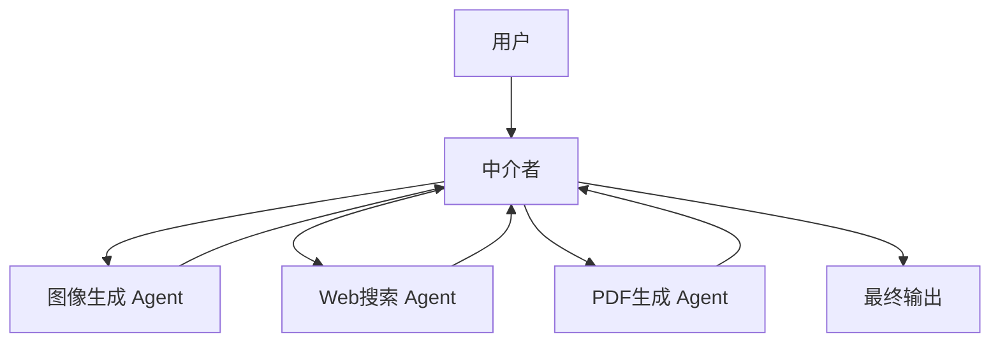

#### 图8-2 多节点交互流程图

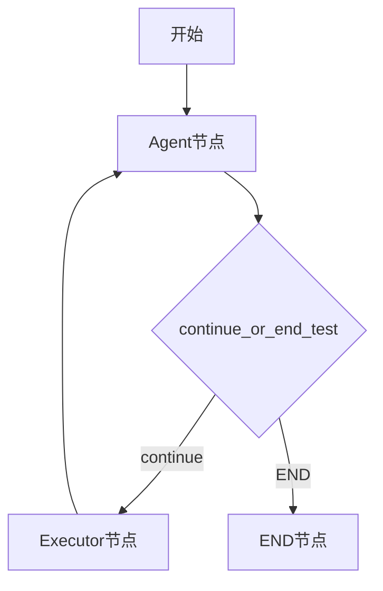

#### 图8-4 StateGraph的最终结构（智能报告案例）

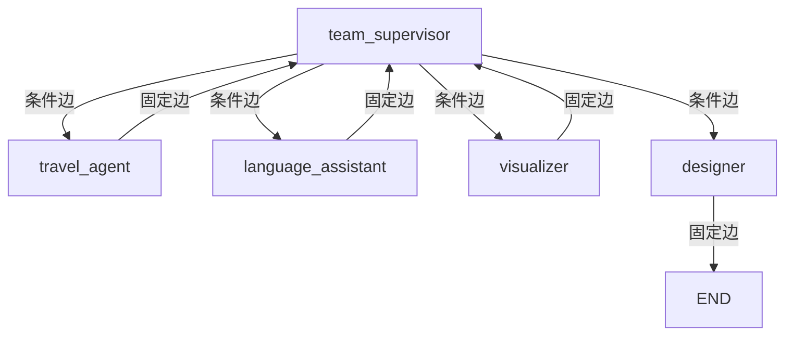

### 5. 经典金句/数据
> “LangGraph通过引入节点、边以及条件边的概念，简化了在Agent内部构建循环流程的步骤。”(p.31)
> “我们创建了独立的、功能完备的Agent，每个Agent都有自己的agent_scratchpad和调用工具的能力，但各自完成的工作结果会被存储在一个共享的状态对象中，由中介者进行协调。”(p.233)

---

## 后记/致谢（本书无独立后记，前言中提及致谢）
> “感谢我的家人，特别是我的妻子章兰婷女士，在我占用大量家庭时间写作的情况下，她给予了极大的支持和理解。感谢曾经以及现在一起工作的同事们，身处业界领先的公司和团队中，我获得了许多学习和成长的机会。”(p.5)

--- 

**文档结束**