# 《AI-Native白皮书》章节总结

## 书籍信息
- **书名**：AI-Native白皮书
- **作者**：创原会、华为云 联合出版
- **主编**：顾炯炯（华为 Fellow、华为云首席架构师）
- **PDF 状态**：文字版（页码从第6页开始，前有封面及序）
- **OCR 状态**：可完整识别，章节层级清晰

## 目录说明
- **目录识别情况**：完整识别，包含6个主要章节及附录
- **章节对应依据**：严格按PDF目录结构（Page 4-5）进行整理
- **OCR 修复说明**：无显著错漏，图表描述清晰

---

## 全书核心主题

本白皮书系统阐述了AI-Native（AI原生）技术架构的理论体系、关键技术及行业实践。全书围绕“智能内生”这一核心范式，提出AI-Native技术总体参考架构（资源层-OS层-应用层），深入解析了华为云在多元算力超节点（CloudMatrix）、AI原生云存储（EMS/SFS Turbo）、极简云网络（CloudGrid）、柔性计算、昇腾云生态等方面的创新实践。

书中强调，AI-Native的本质是从“AI+产业”到“产业×AI”的范式跃迁，其特征包括：AI First设计哲学、数据与知识双轮驱动、自学习自适应能力、统一模型基座、Agentic行动能力及极致性价比的多元算力支撑。白皮书还涵盖了大模型安全、行业应用案例（金山办公、美宜佳、值得买等）及未来展望，为企业智能化转型提供了完整的参考框架。

---

## 序

### 核心论点

本章主要讨论AI技术重塑生产方式及AI-Native架构的战略价值问题。
作者认为：AI正从“智能对话助手”向“全能任务执行者（AI Agent）”跃迁，AI-Native架构的核心价值在于重塑企业基础设施基因，驱动企业向“智能有机体”演进。

### 关键概念/事件

- **AI Agent元年来临**：2025年被称为“Agent元年”，企业开始扎堆投入Agentic应用智能化改造。
- **昇腾超节点突破**：华为昇腾云服务与CloudMatrix算力平台实现计算与存储资源的超高速对等互联，大模型训练性能提升68%、推理效率提升30%。
- **Agentic群体智能**：通过多Agent协同框架（角色定义引擎、任务分解器、动态编排中枢）构建可进化的智能生态系统。

### 经典金句/数据

> “2025年，AI大模型将完成从‘智能对话助手’向‘全能任务执行者（AI Agent）’的跃迁。”
> “技术的价值在于普惠——我们愿以自身在云计算、AI、行业数字化领域的深厚积累，与全球客户、开发者及生态伙伴携手，共同探索AI-Native的无限可能。”

---

## 01 前言

### 1.1 背景

#### 核心论点

本章主要讨论生成式AI技术突破对产业格局的重塑问题。
作者认为：生成式AI正以革命性姿态引领第四次工业革命，推动技术范式从“数据驱动-AI使能-算力支撑”三位一体的根本转变。

#### 关键概念

- **DeepSeek突破**：V3/R1开源大模型打破硅谷垄断，DeepSeek-OCR实现超长上下文的颠覆式创新。
- **智能内生**：AI原生系统的本质特征，不再依赖人工规则配置，通过持续学习形成动态优化能力。

### 1.2 白皮书的目的

#### 核心论点

白皮书旨在阐明AI-Native技术的内涵与价值，并分享参考架构与最佳实践。
作者认为：AI-Native系统区别于传统嵌入式AI，具备架构层面的智能内生性、数据层面的自进化能力、业务层面的价值涌现性。

#### 关键概念

- **三大核心特征**：智能内生性（Intelligence-Native）、自进化能力（Autonomous Evolution）、价值涌现性（Emergent Value）。
- **三层架构**：AI-Native资源层、AI-Native OS层、AI-Native应用层。

---

## 02 AI-Native技术概述

### 2.1 AI-Native的定义与特征

#### 核心论点

本章主要解决“什么是真正的AI-Native系统”的定义问题。
作者认为：AI-Native是一个从L0到L5的成熟度频谱，其核心特征是“AI First”、数据与知识驱动、自学习自适应、统一模型基座、Agentic行动及多元算力支撑。

#### 关键概念

- **AI First**：从系统设计伊始便将AI作为核心组件，AI在研发流程中“左移”。
- **数据与知识双轮驱动**：自动从海量数据中提取信息，结合知识图谱进行决策。
- **自学习、自适应、自优化**：系统能够根据实时数据不断自我学习，动态调整策略。
- **统一基础模型基座**：通过参数共享、知识蒸馏和迁移学习，形成覆盖语言、视觉、决策等多模态的“认知底座”。
- **Agentic AI**：具备自主性与工具调用能力，可从“智能助手”升级为“智能执行者”。
- **极致性价比的多元算力**：基于超节点架构的多元算力池，兼容CPU/DPU/NPU等异构芯片。

### 2.2 AI-Native技术的价值与意义

#### 核心论点

本章讨论AI-Native能为企业带来哪些具体价值的问题。
作者认为：AI-Native从业务运营、功能创新、开发部署、运维到商业模式五个维度实现全面升级。

#### 逻辑推演

1. **精益化业务运营**：通过数据驱动优化每个环节，减少资源浪费。
2. **业务功能创新与增强**：挖掘传统方法无法识别的机会，提供个性化推荐、智能客服等。
3. **开发与部署自动化**：减少人工干预，提升敏捷性。
4. **运维与优化自动驾驶**：自我监控、故障预测、自动修复。
5. **商业模式创新与产业升级**：服务定制化、智能产品开发、平台化经营。

### 2.3 AI Native架构设计方法论

#### 核心论点

本章讨论如何设计AI-Native架构的问题。
作者认为：AI-Native架构强调数据的重要性、智能模型的持续更新与优化能力，以及多层次技术整合（数据层-计算层-应用层）。

### 2.4 Native架构成熟度评估标准

#### 核心论点

本章讨论如何评估一个系统的AI-Native成熟度问题。
作者认为：应从协作水平、数据治理能力、模型生命周期管理能力、运维自动化程度、系统自进化能力等维度评估，分为Level-0到Level-5六个等级。

---

## 03 AI-Native技术架构

### 3.1 AI-Native技术总体参考架构

#### 核心论点

本章提出AI-Native技术的总体架构。
作者认为：架构分为三层——AI-Native资源层（算力基石）、AI-Native OS层（智能中枢）、AI-Native应用层（百模千态赋能业务）。

#### 总体架构图

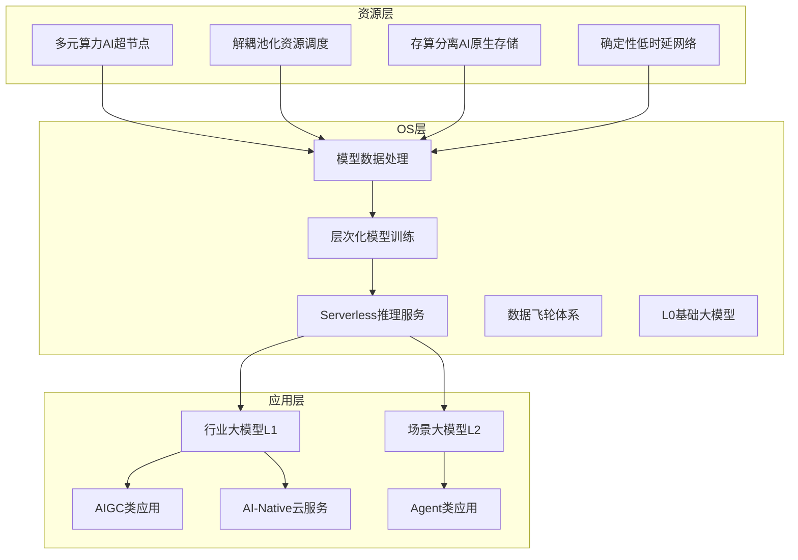

---

### 3.2 AI-Native资源层关键技术解析

#### 3.2.1 对等计算、解耦池化的多元算力AI超节点

##### 核心论点

本章讨论大规模AI集群资源管理面临的问题与解决方案。
作者认为：超节点架构（去中心化的紧耦合架构）通过资源管理模型切片、拓扑感知、高可用机制，实现对等计算与解耦池化。

##### 关键概念

- **超节点资源切片（slice）**：XPU、CPU和内存的组合，通过图匹配算法确保资源节点之间存在直连Edge。
- **借轨通信**：设备间互联路径中断时，通过其他设备跳转实现通信。
- **故障设备替换**：超节点内预留部分设备，故障时快速替换。

##### 逻辑推演

问题：集群规模快速膨胀、AI芯片种类繁多、参数面网络管理复杂。
观点：构建面向超节点架构的资源管理方案，包括资源切片、拓扑感知、故障替换三大能力。

---

#### 3.2.2 软硬解耦、细粒度资源调度

##### 核心论点

本章讨论AI算力资源利用率低的问题及解决方案。
作者认为：通过细粒度切分、智能弹性伸缩、训推混部、系统快照故障快速恢复，可提升资源利用率。

##### 关键概念

- **细粒度切分**：支持NPU、内存、存储IO、网络吞吐等维度的任意比例组合。
- **训推混部**：将调用量低谷时多余的推理资源腾挪给训练使用。
- **系统级快照**：NPU故障时直接从剩余节点获取完整任务状态并重新拉起。

---

#### 3.2.3 存算分离、极致IO吞吐的AI原生云存储

##### 核心论点

本章讨论AI训练与推理中“存力”成为效率瓶颈的问题。
作者认为：通过数据联动、缓存加速、计算-内存-存储三层极致分离架构，可解决CheckPoint慢、数据加载慢、DRAM利用率低、显存内存墙等问题。

##### 关键概念

- **CheckPoint瓶颈**：大模型训练中，CheckPoint大小可达21TB（GPT-4），保存与恢复成为训练瓶颈。
- **三级缓存加速**：L1服务端内存缓存 + L2客户端内存缓存 + L3 AI Turbo SDK。
- **EMS（弹性内存服务）**：将传统“计算-存储”两层架构升级为“计算-内存-存储”三层架构。

##### 存储架构图

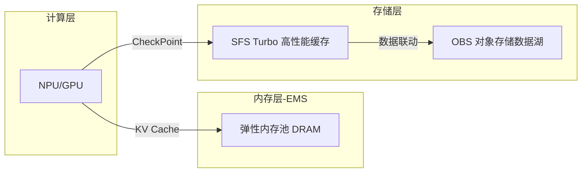

##### 经典金句/数据

> “GPT-4模型参数约为3.52TB，CheckPoint大小是21.12TB。存储写带宽需求352GBps，读带宽需求2112GBps。”
> “AI加速器的峰值计算能力20年增长9万倍，内存带宽仅提高30倍。” (p.28-29)

---

#### 3.2.4 无阻塞、确定性低时延的AI原生云网络

##### 核心论点

本章讨论数据中心网络架构演进及AI原生网络需求。
作者认为：数据中心网络已进入3.0时代（超大东西向流量、大带宽、无损网络），需通过Spine-Leaf架构、RoCEv2、SRv6网络切片等技术实现无阻塞、确定性低时延网络。

##### 关键技术

- **ADN（应用传送网络）**：叠加在Internet之上的Overlay网络，提供多级QoS保障。
- **IRP（智能路由协议）**：去MPLS VPN多层协议，实现千级节点分钟级部署。
- **大禹分层控制器**：全局控制器拉通数据中心与广域网控制器。

##### ADN网络架构图

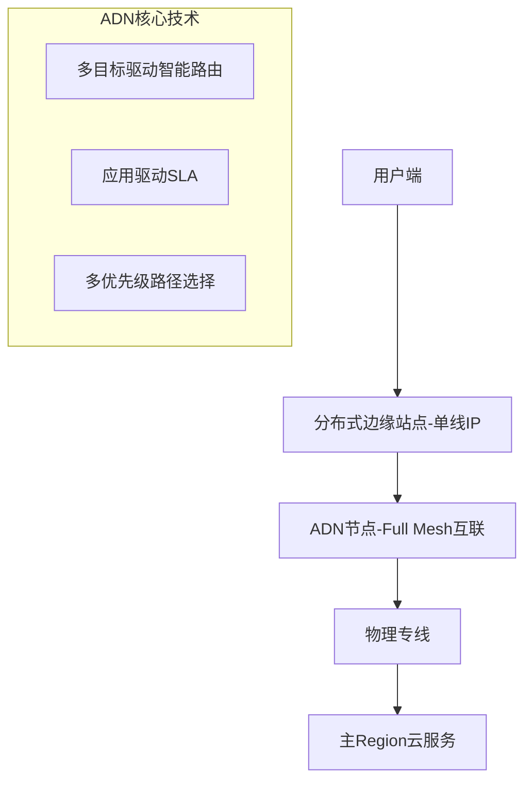

---

#### 3.2.5 华为云AI-Native云基础设施实践

##### 3.2.5.1 CloudMatrix多元算力超节点HPS

##### 核心论点

本章介绍华为CloudMatrix超节点架构。
作者认为：CloudMatrix超越了以CPU为中心的层次化设计，通过统一总线（UB）网络实现异构组件间直接高性能通信，提供可扩展的TP/EP通信、灵活资源组合、统一基础设施、内存级存储性能四大能力。

##### CloudMatrix架构图

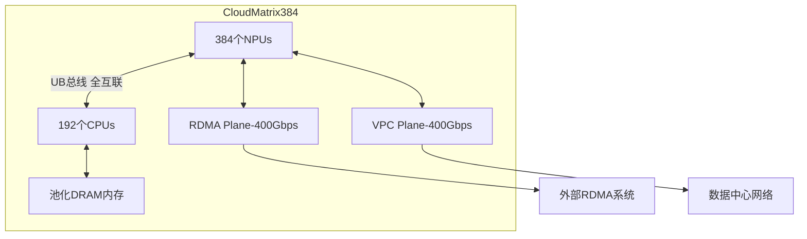

##### 3.2.5.3 EMS & SFS Turbo AI原生云存储

##### 核心论点

本章详细介绍华为云EMS（弹性内存服务）的架构与技术。
作者认为：通过“计算-内存-存储”三层架构，EMS可解决显存内存墙问题，支持以存代算、显存扩展、计算卸载三大加速技术。

##### EMS关键技术图

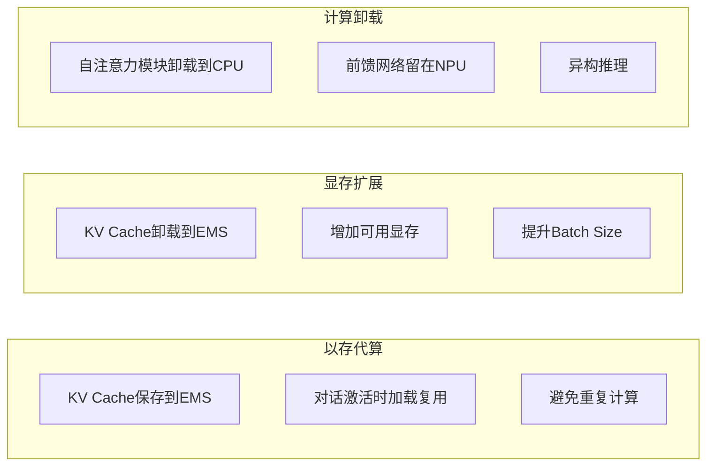

##### 3.2.5.5 柔性计算多元算力范式

##### 核心论点

本章介绍华为云柔性智算架构。
作者认为：通过NPU用户态虚拟化（FlexNPU）、AI驱动智能伸缩与混部、AI模型算力建模画像、AI算力全域多优先级抢占式调度四大创新，可大幅提升AI算力集群利用率。

##### 柔性智算架构图

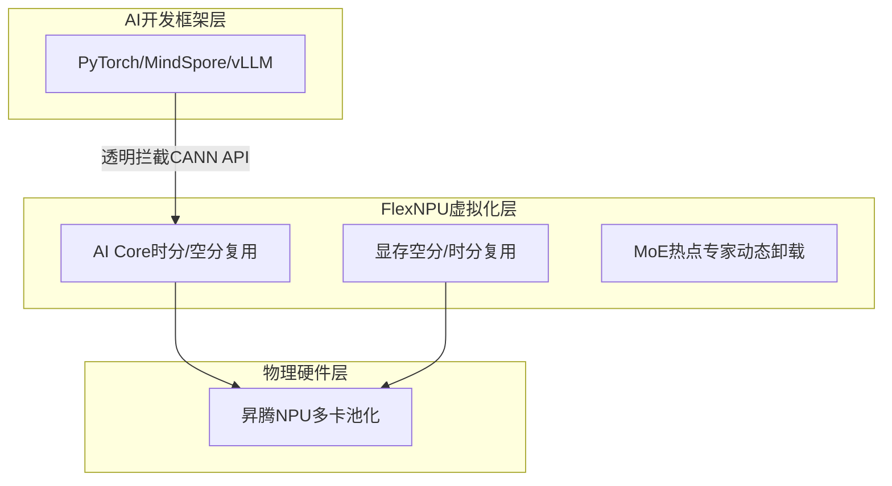

##### 经典金句/数据

> “预计当前昇腾云的MaaS推理平台可通过AI驱动的推理算力水平伸缩挖掘用于支撑训练任务混部的NPU算力空间，约占当前MaaS推理服务总算力的34.87%。” (p.63)
> “FlexNPU支持多模型共卡混部场景下算子级AI Core的时分复用。”

---

### 3.3 AI-Native OS层关键技术解析

#### 3.3.1 模型数据处理与准备

##### 核心论点

本章讨论大模型数据处理的核心技术。
作者认为：多模态数据融合、智能数据处理、数据回流、数据智能体是提升数据处理效率的关键。

##### 关键概念

- **多模态数据融合**：将文本、图像、音频、视频映射到共享嵌入空间（如CLIP）。
- **知识湖**：沉淀知识治理方法论（GEIR），提供知识治理管理工具。
- **数智大模型**：高质量数据集+增量预训练+SFT微调对齐，构建面向数据任务的专业大模型。

##### 数据智能体架构图

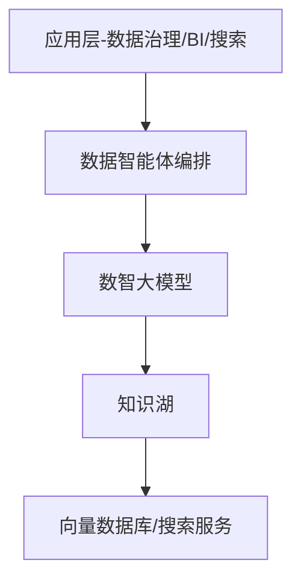

---

#### 3.3.2 层次化、可持续迭代的模型训练

##### 3.3.2.1 基础大模型

##### 核心论点

本章综述NLP、多模态、CV、科学计算、预测大模型的技术趋势与关键特征。
作者认为：大模型正从“快思考”向“慢思考推理模型”演进（如DeepSeek-R1、OpenAI-O1），通过强化学习（GRPO/PPO）提升数学、代码等推理能力。

##### 关键概念

- **MLA（多头潜在注意力）**：通过低秩联合压缩，将Key和Value压缩到一个向量，可压缩90%显存空间。
- **MoE（混合专家）**：通过动态选择专门子模型处理输入的不同部分，激活率通常5%-30%。
- **GRPO算法**：一种强化学习训练技术，用于提升推理模型的逻辑推理能力。

##### 大模型演进趋势图

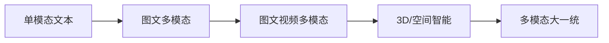

##### 3.3.2.3 行业化、场景化大模型的SFT微调及后训练对齐

##### 核心论点

本章讨论大模型行业落地中的增量训练技术。
作者认为：通过增量预训练、行业微调、强化微调（RFT）、RLHF、LoRA等方法，可用更小模型、更低成本实现更好行业效果。

##### 训练方法对比

- **SFT（监督微调）**：快速提升行业能力，少量数据即可。
- **RFT（强化微调）**：深层迭代推理能力，适用于有标准答案的场景。
- **RLHF**：基于人类反馈的强化学习，优化模型评估质量。
- **LoRA**：添加低秩矩阵实现微调，不大幅改变原始模型结构。

---

#### 3.3.3 弹性按需的Serverless化模型推理服务

##### 核心论点

本章讨论Serverless化推理服务的架构与关键技术。
作者认为：通过推理引擎（FlowServe）、HBM池化、RTC（Relational Tensor Cache）、PD分离、分布式调度算法，可实现按需加载、即时调度、自动伸缩。

##### Serverless推理架构图

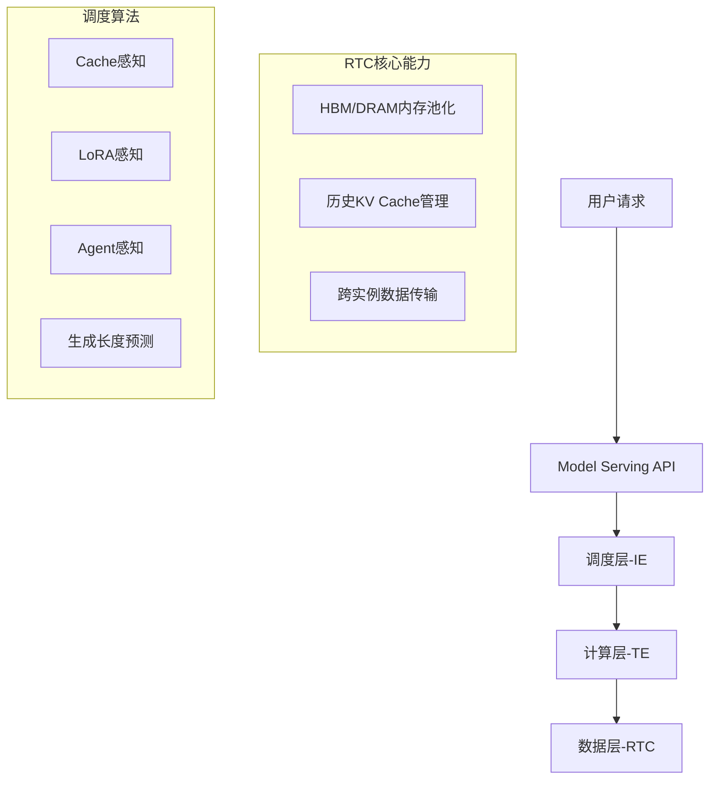

##### 经典金句/数据

> “RTC实现了推理实例内和推理实例间的HBM池化、互通，使得计算任务能够灵活地访问共享的高带宽内存资源。”
> “Cache感知算法预期可以将缓存命中率提升20%至50%。”

---

### 3.4 AI-Native软硬协同优化极致性价比

#### 核心论点

本章讨论如何通过软硬协同实现大模型极致性价比。
作者认为：通过稀疏MoE架构、MLA、MTP、通信隐藏、动态负载均衡、FP8混合精度计算等技术，可大幅降低训练和推理成本。

#### 关键技术

- **稀疏MoE**：激活率仅5.5%（DeepSeek V3，37B/671B），极大压缩成本。
- **MLA**：KV Cache压缩90%显存空间。
- **MTP（多Token预测）**：训练效率提升1倍。
- **DualPipe流水线**：双向流水线并行，提升性能30%以上。
- **FP8混合精度**：显存、带宽占用减半，误差维持在0.25%以下。

#### MoE架构图

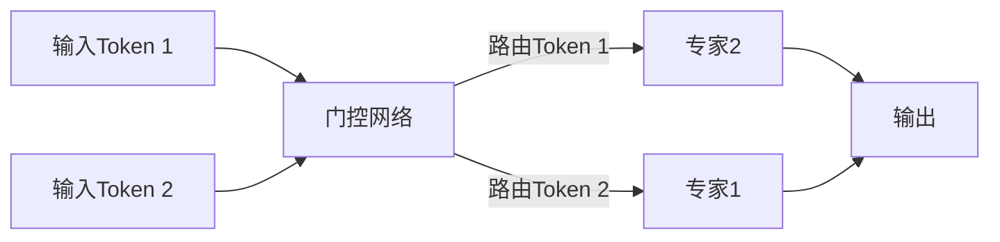

---

### 3.5 AI-Native技术赋能的云服务

#### 核心论点

本章介绍华为云如何用AI-Native技术赋能各类云服务。
作者认为：通过盘古大模型，CodeArts、安全云脑、数据库、数据治理、云运维等云服务可实现智能化升级。

#### 关键案例

- **CodeArts盘古助手**：代码生成、单元测试、代码解释、代码调试，代码有效接纳率20%-30%。
- **安全云脑盘古助手**：攻击研判处置（<3分钟，准确率85%+）、恶意脚本识别、攻击溯源。
- **数据库盘古助手**：数据库问答智能体、运维智能体、SQL优化智能体。
- **DataArts Studio智能分析助手**：AutoETL自动化、AI辅助生成SQL、知识湖构筑。

---

### 3.6 AI-Native应用

#### 3.6.1 AI Agent成为确定性未来

##### 核心论点

本章讨论AI Agent为什么是确定性趋势。
作者认为：大模型作为“知识与经验”的压缩，可实现零成本传承与复制，AI Agent从根本上重塑人机交互模式、内容生产方式、软件定制方式。

##### 企业AI Agent三层价值

1. **知识与经验压缩**：大模型承载持续积累的领域知识
2. **场景Agentic技能**：赋能方案设计、产品开发、营销、客服
3. **工具的革命**：驱动各行各业生产效率跃升

#### 3.6.2 AI Agent与AI-Native应用架构

##### 核心论点

本章对比传统软件与AI Agent的决策模式差异。
作者认为：AI Agent是基于模型实时预测和推理做出决策，而非遵循预定义脚本，具有动态规划、工具调用、自我纠错能力。

#### 3.6.3 AI Agent应用开发框架

##### 核心论点

本章介绍AI Agent开发框架的分类。
作者认为：开发方式分为零码构建（一句话生成）、低码构建（工作流编排）、高码构建（Python SDK），运行时包括数据服务、模型服务、规划与编排、模型应用四层。

##### 华为云Versatile Agent平台架构

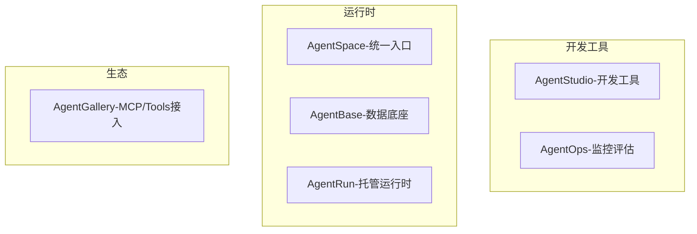

#### 3.6.5 华为云AI Agent应用工程实践

##### 核心论点

本章提出企业AI Agent落地的系统化方法。
作者认为：“五阶八步”方法（场景识别、流程重构、组织能力准备、数据与知识准备、AI Agent开发与持续运营）及“AI场景十二问”可保障落地成功率。

---

### 3.7 大模型安全

#### 3.7.1 大模型面临的安全风险与合规要求

##### 核心论点

本章系统梳理大模型面临的安全风险。
作者认为：风险包括提示注入、敏感信息泄露、供应链风险、数据中毒、不当输出处理、过度代理、系统提示泄露、向量嵌入不安全、虚假信息、无限制资源消耗等十大类（OWASP 2025）。

##### OWASP TOP 10风险图

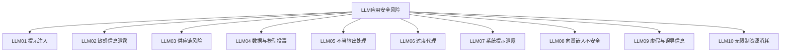

#### 3.7.2 大模型安全技术

##### 核心论点

本章介绍大模型安全防护技术体系。
作者认为：应从数据安全（内容合规、版权、隐私）、模型内生安全（对抗鲁棒性、价值观对齐）、推理安全（提示注入防护、幻觉防护、内容审核）、安全运营四个维度构建防护体系。

##### 华为云大模型安全解决方案

- **数据安全**：KMS加密、数据水印、机密计算
- **模型安全**：DevSecOps、对抗训练、红队测试
- **运行安全**：应用安全网关、多维度攻击特征拦截
- **运营安全**：资产清单、态势感知、事件响应

---

## 04 AI-Native技术在各行业领域的应用

### 4.1 AI-Native行业垂直应用

#### 4.1.1 金山办公实践案例

##### 核心论点

本章介绍WPS AI如何通过AI-Native技术重构办公软件。
作者认为：通过“分层×开放×多模型适配”架构，WPS AI知识库实现智能问答（准确率90%+）、智能创作、知识图谱、智能抽取等能力。

##### WPS AI DOCS技术架构

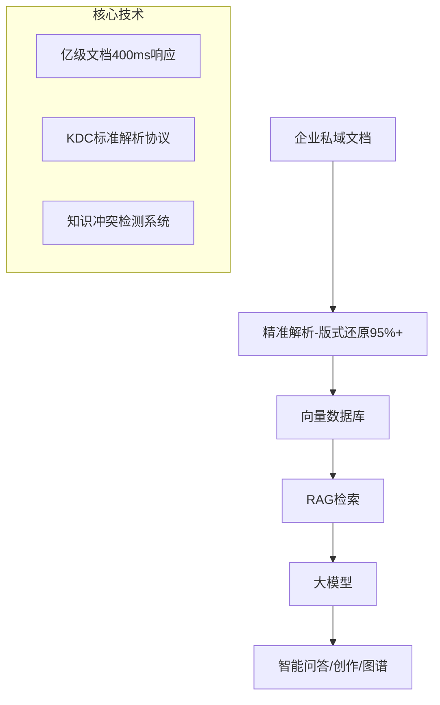

#### 4.1.2 美宜佳实践案例

##### 核心论点

本章介绍美宜佳如何通过AI技术打造智慧门店。
作者认为：通过数字店员（24小时多语言富情感服务）、智能商品运营、全域营销、物联网架构，实现“增收、降本、协同”三大目标。

#### 4.1.3 值得买科技实践案例

##### 核心论点

本章介绍“小值”购物助手的AI-Native架构。
作者认为：消费领域AI应用面临实时性要求高、事实性约束严格两大挑战，需通过RAG、思维链、多工具调度来解决。

##### 购物助手架构图

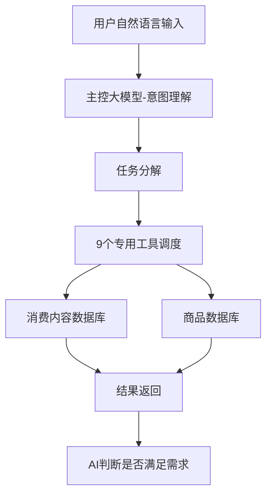

#### 4.1.4 汉得信息实践案例

##### 核心论点

本章介绍AI赋能制造企业产销S&OP决策会议。
作者认为：通过“大语言模型+RAG”构建S&OP全流程智能决策体系，可从“经验驱动”升级为“数据-知识双轮驱动”。

---

### 4.2 华为云AI-Native行业应用实践

#### 4.2.1 医学大模型行业应用实践

##### 核心论点

本章介绍盘古医学大模型的应用场景。
作者认为：通过“知识+数据”双轮驱动，医学大模型可实现检验数据智能治理、AI辅助诊断、智能健康档案、智能病历生成等能力。

#### 4.2.2 金融大模型行业应用实践

##### 核心论点

本章介绍金融大模型的应用场景地图。
作者认为：金融大模型可实现智慧信贷（分钟级审批）、对客服务（智能客服）、办公助手（跨国翻译、会议纪要）、运营管理（投研报告生成）等能力。

#### 4.2.3 气象大模型行业应用实践

##### 核心论点

本章介绍盘古气象大模型的突破性应用。
作者认为：气象大模型解决了传统数值预报数据利用率低（仅5%）、算力需求大、时效性差三大痛点，台风路径预测准确率超过欧洲气象中心25%。

#### 4.2.4 矿山大模型行业应用实践

##### 核心论点

本章介绍矿山大模型“1+4+N”架构体系。
作者认为：通过统一AI平台+四大核心能力模块（智能感知、数字孪生、决策优化、安全防护）+N个场景化解决方案，可解决模型泛化不足、动态工况适应性弱、数据安全隐患等痛点。

#### 4.2.5 政务大模型行业实践案例

##### 核心论点

本章介绍盘古政务大模型如何推动“民意速办”。
作者认为：通过智能接报（工单“一字不填”，准确率98%）、智能分拨（准确率90%+）、智能标签、指挥中心等能力，可撬动现代化城市治理高质量发展。

---

## 05 AI-Native技术的关键挑战

### 核心论点

本章系统梳理AI-Native技术面临的七大关键挑战。

### 关键挑战

1. **模型透明性与可解释性问题**：AI“黑箱”特性影响金融、医疗等敏感领域的信任度，需引入XAI技术及输出推理过程（如DeepSeek）。
2. **模型安全治理挑战**：包括对抗攻击、提示注入、无限资源消耗、敏感信息泄露等，需从训练、应用、监控多层面保障。
3. **数据与隐私问题**：数据孤岛、数据安全、隐私保护，需建设数据共享平台、加密存储、权限控制、GDPR合规。
4. **异构、多代际硬件的高效协同使用**：跨厂商、跨代际硬件统一调度，需硬件抽象层、动态资源分配、开放标准（OpenXLA）。
5. **模型能力评价体系构建问题**：不同行业需求差异化大，需定制化评估标准，平衡主观与客观指标。
6. **大模型幻觉问题的治理与突破**：事实性幻觉和忠实性幻觉，需通过高质量训练数据、RAG、强化学习、事实核查系统解决。
7. **多Agent协同与自治挑战**：动态环境规划可靠性、多Agent通信与竞争、工具使用安全性、身份与记忆一致性维持。

---

## 06 AI-Native技术的未来展望

### 核心论点

本章展望AI-Native技术的五大演进方向。
作者认为：未来AI将从Transformer向更高效架构（Mamba、SNN、类脑计算、世界模型）演进，走向物理世界实现AGI，算力架构向任务定制化与量子协同演进，人机协同从工具辅助到共生共创，伦理治理从被动合规到主动价值对齐。

### 五大演进方向

1. **算法架构突破**：从Transformer到Mamba、SNN、类脑计算、具身智能、世界模型
2. **环境交互跃迁**：从数字智能到物理智能，走向物理世界是AGI必经之路
3. **算力架构重构**：从通用芯片到任务定制化（LPU、Sohu芯片）与量子协同
4. **人机协同进化**：从工具辅助到共生共创，通过MCP/A2A协议实现跨模态融合
5. **伦理治理升级**：从被动合规到主动价值对齐，结合因果推理、XAI、区块链

### 经典金句

> “只有完成从‘数据智能’到‘物理智能’的跃迁，AI才能真正理解并改变现实世界，而这正是实现AGI不可绕过的终极路径。”
> “人机协同将成为未来工作和生活的新常态，共同推动社会的进步和发展，创造更加美好的未来。”

---

## 后记

### 核心论点

本章介绍创原会的发展历程及对白皮书的支持。
作者认为：创原会自2020年由华为云、中国信通院、CNCF共同发起，持续引领产业发展，2025年提出“智能进化，全面拥抱AI-Native”。

### 创原会技术共识演进

- **2021**：云原生2.0（七大新价值）
- **2022**：云原生2.0十大新范式
- **2023**：深度云化，成就云原生企业
- **2024**：云原生×AI，开启数智化跃迁（八大跃迁）
- **2025**：智能进化，全面拥抱AI-Native

---

> 说明：本总结基于PDF可识别内容完整整理，图表已用Mermaid语法重建，未添加书中不存在的信息。