# 《AI做课变现全攻略》章节总结

## 书籍信息
- **书名**：AI做课变现全攻略：与爱共创教学设计、爆款课程与商业闭环
- **作者**：袁茹锦
- **出版社**：人民邮电出版社
- **出版时间**：2025年7月
- **ISBN**：9787115685063
- **字数**：192千字

## 目录说明
- 目录识别情况：完整，包含前言、7个主章节及后记。
- 章节对应依据：依据原书电子版目录结构逐章整理。
- OCR/修复说明：内容为数字原版，识别清晰，无缺失。

## 全书核心主题
本书系统讲解如何借助AI技术完成课程开发、教学设计、PPT制作及商业变现的全流程。作者提出“AI作为合作伙伴”的理念，提供33个提示词模板，覆盖从课程定位、内容萃取、结构搭建、案例设计到产品矩阵与变现路径的各个阶段。核心观点是：AI无法替代人类的创意与情感联结，但能极大提升效率；真正的赢家是懂得用AI放大自身独特价值的课程开发者。

---

## 前言：把专业变成课，AI能帮的远不止省时间（含秋叶序）
### 核心论点
问题：专业高手难以将隐性经验转化为课程。观点：AI不是万能药，但能辅助分析学员痛点、提炼内容、优化结构；课程开发的关键仍是“把知识变成学员能用的东西”。

### 关键事件
- 工程师讲技术变成“说天书”
- HR卡在流程拆解
- 团队用AI生成内容零散无逻辑
- 袁老师13年培训经验，8000+学员验证
- 案例：将《微习惯》变成“习惯启动器”工具包

### 经典金句
> “做课不是知识的搬运，是价值的放大。”  
> “真正的赢家不是‘会用工具’，而是‘让工具帮自己把优势放大’。”

---

## 前言（作者自序）
### 核心论点
问题：做课门槛高，过程痛苦。观点：AI可将做课效率提升10倍，人类负责创意与决策，AI负责执行。

### 关键概念
- 课程开发的“杠杆效应”：展现专业、传承经验、获得话语权、连接人脉、建立个人品牌。
- AI作为“创意导演”：带领多个AI“员工”分工协作。

### 逻辑推演
作者从自身辅导经历出发，指出传统做课耗时且易失败。2023年ChatGPT出现后，她探索出“AI+课程开发+运营”组合拳，帮助学员快速产出爆款课。强调用户为价值、洞察、独特付费，而非工具。

### 经典金句
> “这个时代最值钱的能力，不是会用工具，而是能用工具创造独特价值。”  
> “真正的赢家，从来不是那些最会使用工具的人，而是最懂得用工具创造独特价值的人。”

---

## 第1章：AI赋能，课程开发轻松高效
### 1. 核心论点
问题：为何要开发课程？如何借助AI高效完成？观点：课程是势能放大器，AI可应用于6个阶段（定位、内容、结构、课件、教学活动、产品规划），显著提升效率与质量。

### 2. 关键概念
- **课程开发的真相**：不是内容堆砌，而是知识产品设计（如小麦→面包）。
- **AI能力**：数据处理、个性化分析、快速响应。
- **6个阶段**：精准定位、开发内容、搭建结构、制作课件、设计教学活动、规划产品。
- **与AI沟通6原则**：明确提示词、多轮互动、提供上下文、展开讨论、角色设定、引导思考。
- **RTABC对话模型**：Role（角色）、Task（任务）、Aim（目标）、Background（背景）、Condition（条件）。
- **细节三问法**：信息太粗问细节、信息抽象问例子、信息满意问补充。
- **与AI共舞法**：多角度提问、第三人称视角、角色互换。
- **激发AI潜能的“六脉神剑”**：身份赋能、角色匹配、情境定制、问题重塑、问题组装、案例借鉴。

### 3. 逻辑推演
本章首先通过个人品牌、知识变现、能力提升、人际关系四个维度论证开发课程的必要性。接着指出传统误区（以为只是做PPT），强调AI能提升效率（1个月→1周）。然后详细分解6个阶段中AI的具体应用，并给出大量对话示例。最后重点传授与AI沟通的技巧：6原则、RTABC模型、细节三问法、六脉神剑，使读者能精准提需求。

### 4. 流程图

#### 开发爆款课的6个阶段
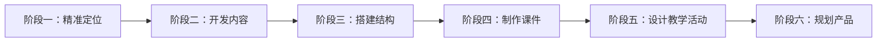

#### 课程开发的常见误区与真相（图1-1）
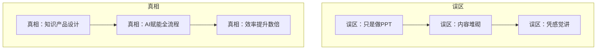

#### 搭建课程结构的意义（图1-3）
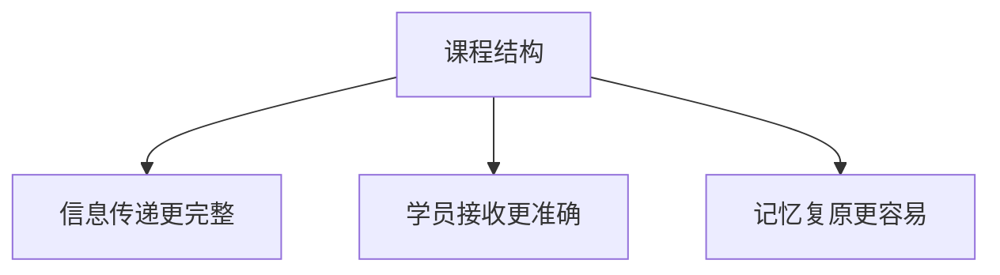

#### 与AI有效沟通的6个原则（表1-2）
| 原则 | 解释 | 提示词举例 |
|------|------|-------------|
| 明确提示词，有层次感 | 清晰、分层递进 | “请以2025年市场分析为主题，写3000字报告，包含竞品对比...” |
| 多轮互动，持续优化 | 纠偏与共创 | “请重新给我5条关于知识付费的金句，要求通俗易懂、朗朗上口...” |
| 提供上下文，情境设定 | 提供背景、设定目标 | 告知授课情境：谁讲、听众、场合、目的 |
| 展开讨论，激发潜能 | 基于AI内容深入讨论 | “请参考刚才的课程大纲，向我提问并辩论...” |
| 角色设定，赋予身份 | 多角色协同 | “你是一名营养师，请提供一周饮食计划” |
| 引导思考，逐步推理 | 避免仓促回答 | “让我们一步步思考：先列出收入来源，再计算成本...” |

#### RTABC对话模型（表1-3）
| 英文 | 中文 | 对话启发 |
|------|------|----------|
| Role | 角色 | 请AI充当什么角色 |
| Task | 任务 | 帮完成什么任务 |
| Aim | 目标 | 做这件事要达成的目标 |
| Background | 背景 | 提供相关背景或情境 |
| Condition | 条件 | 提供其他要求或条件 |

#### 激发AI潜能的“六脉神剑”（表1-4）
| 剑法 | 表达方式 |
|------|----------|
| 身份赋能法 | 假设“你是谁+你会什么+任务内容” |
| 角色匹配法 | 告知“我是谁+我的背景+任务内容” |
| 情境定制法 | 告知“角色+任务场景+任务内容” |
| 问题重塑法 | 提出需求/问题+建议更好的版本 |
| 问题组装法 | 提出需求+你可提出一系列附加问题来问我 |
| 案例借鉴法 | 学习案例+总结优点+模仿案例完成任务 |

### 5. 经典金句/数据
> “不会用AI的人开发课程靠灵感，会用AI的人开发课程盯成效。”  
> “一个工具的价值不仅在于它的功能，更在于我们如何激发出它的无限潜能。”  
> 数据：借助AI，2天线下课开发时间从半个月压缩到3天搞定3门课。

---

## 第2章：精准发力，打造“吸睛”的课程定位
### 1. 核心论点
问题：如何找到有竞争力的课程定位？观点：定位公式 = 个人定位（擅长点+兴趣点）+ 市场定位（刚性需求+聚焦领域）+ 卖点定位（锚定用户+有护城河）。需避开“伪兴趣区”和“伪擅长区”两大陷阱。

### 2. 关键概念
- **个人定位三角度**：输出过的内容、被反复提问的问题、最想表达的内容。
- **市场定位框架**：这门课是给[特定人群]的，帮他们[解决某类具体问题]，最终让他们[做出可落地的成果]。
- **挖掘卖点3步法**：锚定用户 → 验证真金（真痛点）→ 塑造卖点（差异化）。
- **验证真痛点的3种方法**：专业化调研（问卷、访谈、社群答疑）、社交媒体痛点搜索、极简产品（9.9元体验包）验证。
- **塑造卖点的4种思路**：细分市场定制方案、提炼概念跨界融合、细分需求独辟蹊径、创设体验记忆留痕。
- **好标题3要素**：对象、内容、价值。
- **6招制胜标题法**：数字法、价值法、提问法、类比法、角色法、英文缩写法。

### 3. 逻辑推演
本章从两大陷阱（伪兴趣区、伪擅长区）入手，用案例说明定位失误的后果。然后提出个人定位挖掘方法（输出内容、高频问题、内心渴望）。接着强调“以终为始”的市场定位，必须定义用户可感知、可验证的学习成果。之后详细讲解卖点挖掘：先锚定用户（同理心地图分析），再用问卷、访谈、社群答疑、社交媒体、极简产品验证真痛点。最后给出塑造卖点的4种差异化思路，以及标题创作的6种方法和AI辅助生成标题的3种策略。

### 4. 流程图

#### 挖掘卖点3步法（图2-1）
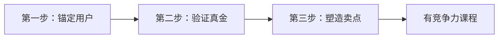

#### 挖掘用户痛点的3种方法（图2-2）
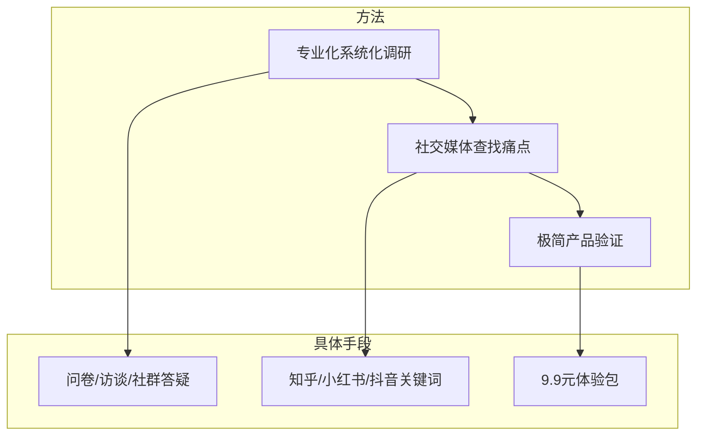

#### 6招制胜标题法（图2-5）
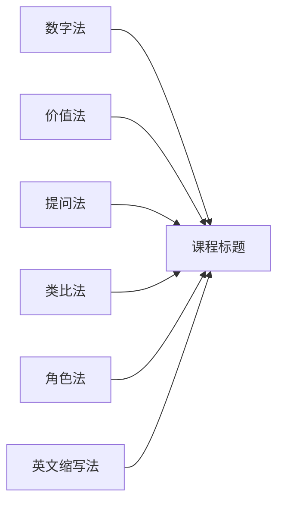

### 5. 经典金句/数据
> “专业只是入场券，定位才是生死线。”  
> “用户不为‘知识’买单，只为‘改变后的自己’付费。”  
> “课程有没有市场竞争力，取决于你是否找到了某类学员的高频痛点，是否给出了一套切实可行的解决方案。”  
> 案例：理财课程聚焦宝妈后，收入增长3倍。

---

## 第3章：灵感无限，AI激发内容创意
### 1. 核心论点
问题：如何用AI将书中精华、优秀经验、实战案例转化为课程内容？观点：通过“化书成课”将多本书融合成原创课程；通过经验萃取将隐性经验显性化；通过“借风使船”对话法设计高价值案例。

### 2. 关键概念
- **化书成课**：不是复制书中内容，而是将“作者写给读者的内容”变成“老师带学生解决问题的工具”。三大必改：改结构、改语言、改交付。
- **化书成课5步法**：选书、消化内容、设计框架、内容转化、增加互动。
- **AI化书提示词**：结构化提示词，让AI学习多本书并生成原创课程大纲。
- **经验萃取**：将高手的隐性经验提炼为可复制的步骤、工具、话术。
- **经验萃取公式**：请AI扮演角色+能力+身份，解决特定问题，要求“有创意的解决方案”。
- **案例5特点**：真实性、完整性、典型性、冲突性、细节性。
- **“借风使船”对话法**：①问AI需要什么信息；②提供背景并请求撰写案例；③让AI分析教学要点和提问清单。

### 3. 逻辑推演
首先用对比（不化书vs化书）说明化书成课的必要性（定价10-30倍差距）。然后给出传统化书流程，并展示AI如何辅助选书、整合多本书生成大纲。接着转向经验萃取：解释为什么隐性经验难以传递，给出与AI对话的“萃取公式”和“善挖经验”多轮提示词。最后是案例设计：强调案例的5个特点，并详细演示“借风使船”三步法，让AI先问需求、再写案例、最后分析教学点。

### 4. 流程图

#### 化书成课示意（图3-1）
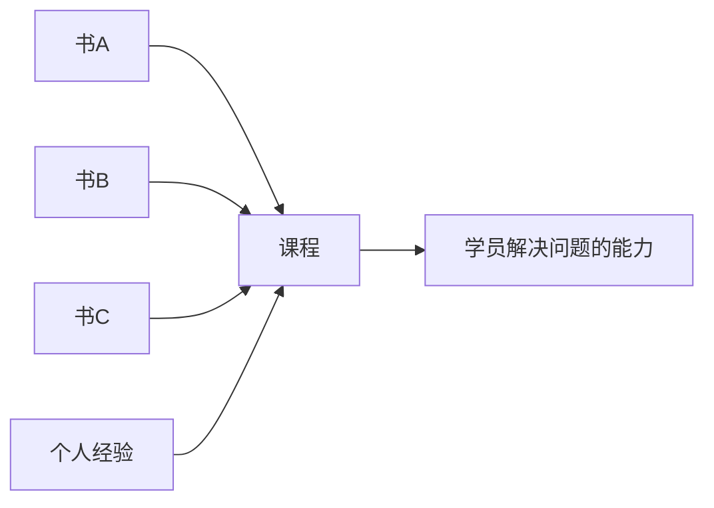

#### 开发课程的素材组合思维（图3-3）
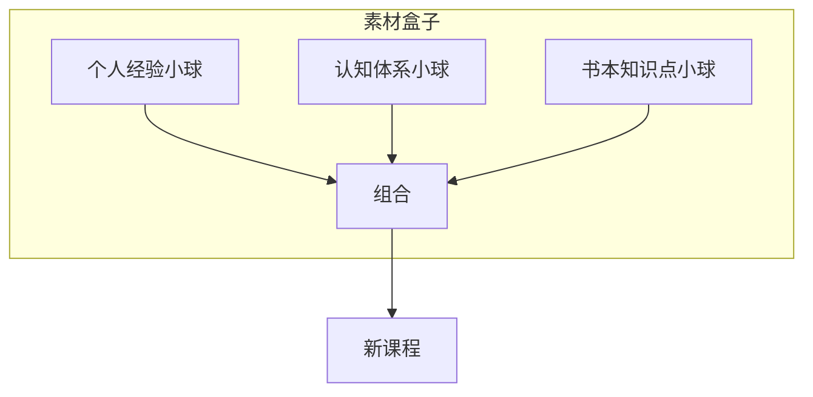

#### 确保内容原创性的5种方法（表3-3）
- 使用原创材料
- 正确引用和参考
- 避免直接复制
- 设计独特的课程结构
- 鼓励内容创新

#### “借风使船”对话法（图3-10）
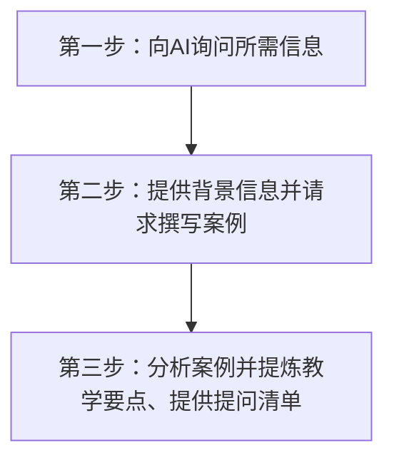

### 5. 经典金句/数据
> “学员买的不是知识，而是‘改变的可能性’。”  
> “真正的化书成课是一种升华工具，可以让读书输出的过程完成从生搬硬套到独创思维系统的升级。”  
> “爆款课从来不属于‘理论最厉害的人’，而是属于‘擅长提炼知识、萃取实战经验的人’。”  
> 数据：化书后的课程定价可达图书定价的10-30倍，完课率从18%提升至89%。

---

## 第4章：授课不愁，AI打造课程结构
### 1. 核心论点
问题：如何设计有吸引力的开场、结尾及整体授课逻辑？观点：开场9种方法、结尾6种方法，课程结构分宏观（整体谋篇布局）和微观（语句逻辑），线上与线下课程结构有不同经典模式。

### 2. 关键概念
- **课程开场9法**：故事、悬念提问、视频/动画、互动游戏、引经据典、情境设置讨论、实物展示、数据列举、问题讨论。
- **课程结尾6法**：总结提炼、行动号召、故事回顾、时间胶囊、反转分享、团队视觉总结。
- **宏观授课逻辑**：需遵循人类认知规律（前后、层次、因果、认知顺序）。
- **微观授课逻辑**：语句之间的连接，避免6种逻辑问题（内容不完整、碎片化、次序颠倒、预设不足、省略不当、话题断裂）。
- **线上课程4种经典结构**：黄金圈法则(Why-What-How)、PREP结构(观点-理由-例子-观点)、时间轴结构、PPSC问题解决结构。
- **线下课程5种经典结构**：流程式、并列式、对比式、问题式、情境式。

### 3. 逻辑推演
首先强调开场和结尾的重要性，分别列出9种开场法和6种结尾法，并给出AI提示词模板。然后转入授课逻辑：区分宏观和微观层面，指出常见逻辑问题。接着针对线上和线下学员特点，分别给出4种线上结构和5种线下结构，并用大量示例说明如何“喂养”AI来生成符合这些结构的课程大纲。特别演示了PPSC结构的二阶段提示词。

### 4. 流程图

#### 课程开场（图4-1）与结尾（图4-2）示意
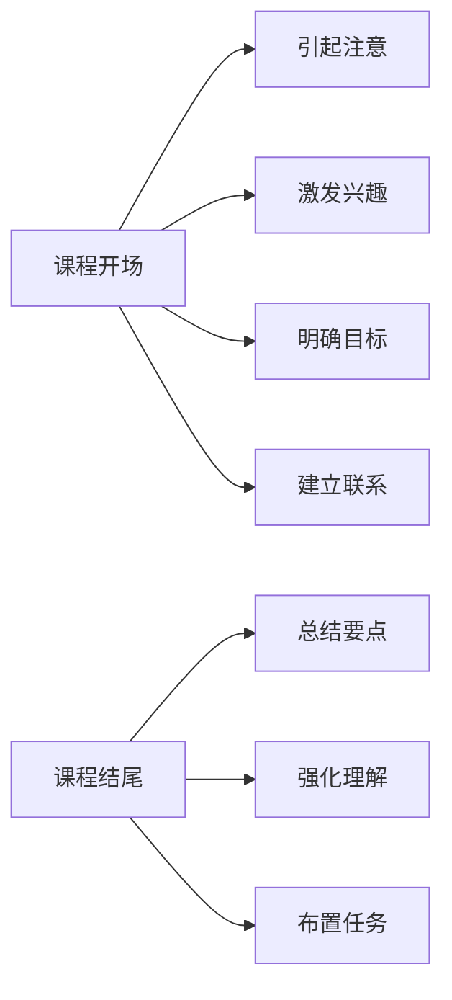

#### 黄金圈法则结构
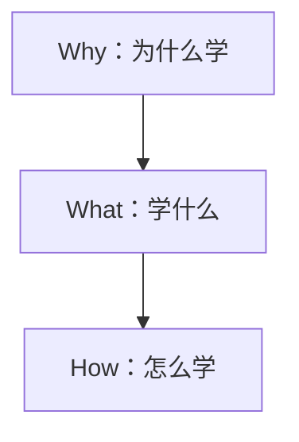

#### 线下课程流程式结构（图4-3）
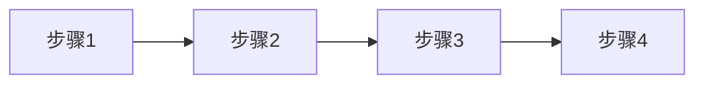

#### 线下课程并列式结构（图4-4）
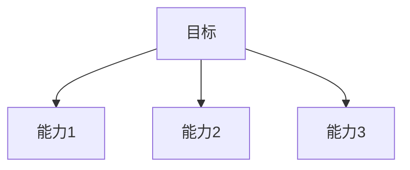

#### PPSC问题解决结构
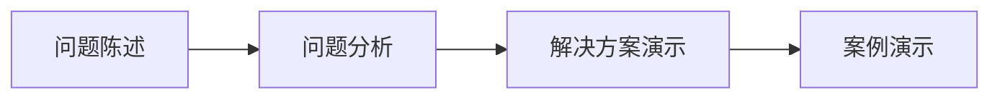

### 5. 经典金句/数据
> “精妙的开场是学员无法拒绝的邀请，而有力的结尾，则是你送他们奔赴世界的起点。”  
> “开场抓住眼球，结尾征服内心。”  
> “课程结构既能帮助学员融入课程的逻辑并获得更深的记忆，也能成为实践的参考依据。”  
> 数据：逻辑清晰的课程，学员信息接收率可从30%提升至80%。

---

## 第5章：高效成课，AI制作“有颜有型”的教学PPT
### 1. 核心论点
问题：如何快速用AI制作高质量教学PPT？观点：先让大模型梳理内容框架（使用PPT内容梳理/转化提示词），再用AI PPT工具（MindShow、AiPPT、讯飞智文）生成初稿，最后人工优化逻辑、风格、信息量、图文搭配。

### 2. 关键概念
- **两种场景**：碎片化内容需提炼；完整内容需原样转化。
- **两个提示词模板**：PPT内容梳理提示词、PPT内容转化提示词。
- **三种AI PPT工具**：MindShow（支持多格式导入）、AiPPT（模板丰富、可深度编辑）、讯飞智文（免费、生成演讲稿、AI配图）。
- **PPT设计4要素**：逻辑清晰、风格一致、信息适量、图文并茂。
- **风格一致性**：字体选择、颜色数量（主色+强调色）、排版统一。
- **图文并茂原则**：文不如字、字不如表、表不如图。注意图片版权。

### 3. 逻辑推演
首先指出AI生成PPT的核心是内容质量，而非简单排版。给出两种场景的提示词模板。然后介绍三种主流AI PPT工具及其优缺点对比。最后重点讲授PPT设计思维：通过案例展示如何将文字过多的PPT改造为逻辑清晰、色彩一致、信息适量、图文并茂的专业课件。特别强调颜色搭配原则和图片版权问题。

### 4. 流程图

#### 使用AI制作PPT的6个注意事项（表5-1）
- 明确角色和目标
- 提供精确指示
- 利用Markdown格式
- 训练AI以提升效果
- 适时感谢和鼓励AI
- 手动检查和调整

#### 使用Kimi+DeepSeek生成PPT流程
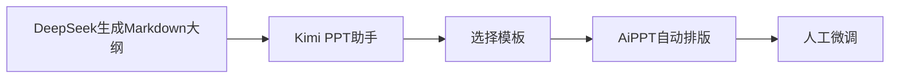

#### PPT设计三元素（图5-22）
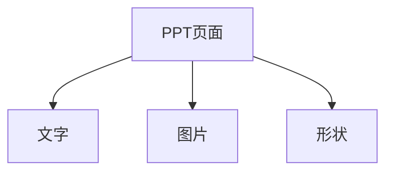

#### 确保PPT逻辑清晰的6种方法（表5-3）
- 明确培训目的
- 确定PPT内容
- 划分结构层次
- 使用清晰标题
- 使用编号/项目符号
- 保持内容连贯性

### 5. 经典金句/数据
> “PPT的核心始终在于内容。”  
> “简洁与表达内容的多少无关，关键在于对元素的逻辑安排和中心思想的把握。”  
> “一张好的图片胜过千言万语。”  
> 对比案例：修改前后PPT效果差异显著，学员注意力与理解力大幅提升。

---

## 第6章：教学设计，AI创设学习体验
### 1. 核心论点
问题：如何选择并设计有效的教学方法，让学员真正参与、记住、会用？观点：基于“学习金字塔”，必须从被动学习转向主动学习。AI可辅助设计知识点的讲解步骤和学习活动。

### 2. 关键概念
- **学习金字塔**：听讲留存5%，阅读10%，视听20%，演示30%，讨论50%，实践75%，教授他人90%。
- **成年人学习四大原则**：自愿、经验、自主、行动。
- **9种教学方法**：课堂讲授、案例教学、角色扮演、道具教学、问题研讨、技能演练、游戏活动、学思测评、视频教学。
- **教学方法选择三要素**：课程主题、学员画像、自身技术储备。
- **AI辅助讲解步骤**：使用加涅9步教学流程等经典模型。
- **AI辅助学习活动**：可生成问题讨论型、技能演练型、案例分析型等三类活动设计。

### 3. 逻辑推演
开篇用“维生素”比喻说明教学设计的重要性。然后引入学习金字塔，强调主动学习（讨论、实践、教授他人）的高留存率。接着提出成年人学习的四大原则，并指出教学方法选择的三大常见问题（不科学、不知如何选、应用不到位）。之后详细讲解9种教学方法的操作流程、适用场景和注意事项，每法均附示例。最后展示如何用AI构思知识点的讲解步骤（加涅9步）和学习活动（三种类型），并给出具体提示词和AI回复示例。

### 4. 流程图

#### 学习金字塔（图6-1）
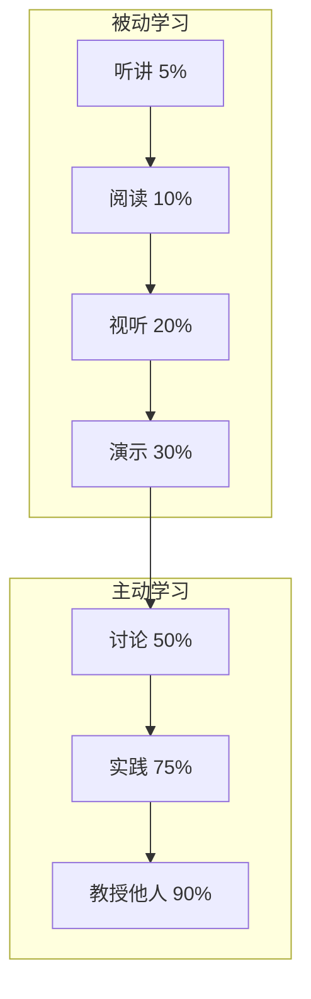

#### 四大核心赋能引擎（图6-2）
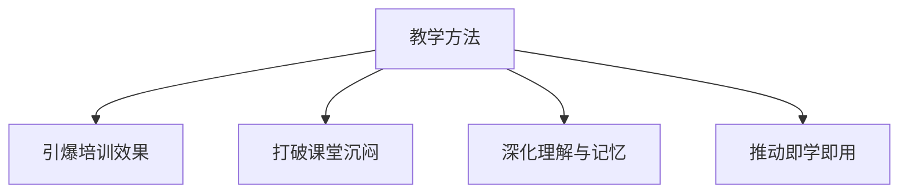

#### 案例教学法6步流程（图6-4）
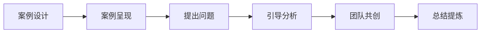

#### 角色扮演法特定要求（图6-5）
- 采用真实背景资料
- 对角色的要求明确
- 为角色设定任务目标
- 设计冲突
- 归纳解决方案
- 设置观察员

#### 问题研讨法5个角色（表6-2）
| 角色 | 职责 |
|------|------|
| 组长 | 组织讨论、掌控进度 |
| 记录官 | 记录关键点 |
| 时间官 | 倒计时提醒 |
| 协调官 | 协调分歧 |
| 陈词官 | 汇报成果 |

### 5. 经典金句/数据
> “教是最好的学。”  
> “真正的学习不是听来的，而是做出来的，只有通过亲身体验，才能获得深刻的理解。”  
> “最有效的培训形式就是能够激发学员内在动机的教学形式。”  
> 数据：学习金字塔中教授他人的学习内容留存率高达90%。

---

## 第7章：轻松变现，AI解码课程变现
### 1. 核心论点
问题：如何系统化设计课程产品矩阵、包装课程、规划变现路径？观点：从单品思维转向产品矩阵思维，设计引流课、回报课、福利课、信任课四类产品；用海报、卖点提炼、AIDA文案包装；用课程产品商业画布9模块规划变现。

### 2. 关键概念
- **课程商业思维5维评估**：内容→产品、单品→矩阵、销售→推广、定价焦虑→分层变现、单一角色→多重身份。
- **课程产品矩阵**：引流课（低价吸引）、回报课（高价值核心）、福利课（赠品/附加）、信任课（系列微课建立口碑）。
- **产品组合策略**：高端建立差异、中端形成信任、低端薄利多销。
- **海报10个关键信息**：课程标题、价值、受众、讲师资质、内容、教学方式、学习成果、价格、成功案例、品牌形象。
- **卖点提炼3句式**：强调解决问题、强调改变效果、强调核心理念。
- **AIDA文案模型**：注意→兴趣→欲望→行动。作者总结公式：引发兴趣→建立信任→激发需求→强调差异→展示成果→促成成交。
- **课程产品商业画布9模块**：重要合作、关键业务、核心资源、价值主张、用户关系、营销策略、细分市场、成本结构、收入来源。
- **6大核心资源**：知识与能力、人际关系、环境、课程、工具、外脑。
- **4种用户关系**：师生、师徒、合作、合伙人。

### 3. 逻辑推演
首先给出商业思维自测表，引导读者诊断现状。然后详细阐述产品矩阵策略：引流课、回报课、福利课、信任课的定义、作用和组合方式，并附变现地图。接着讲课程包装：海报设计10要素、卖点提炼4种思路和3种句式、AIDA文案撰写公式。最后用商业画布9个模块系统规划变现路径，每模块均给出AI提示词模板和实际案例。末尾强调AI无法替代情感联结、个性化教学、即时反馈、非常规活动及AI幻觉的应对策略。

### 4. 流程图

#### 无体系课程 vs 有体系课程对比（图7-1）
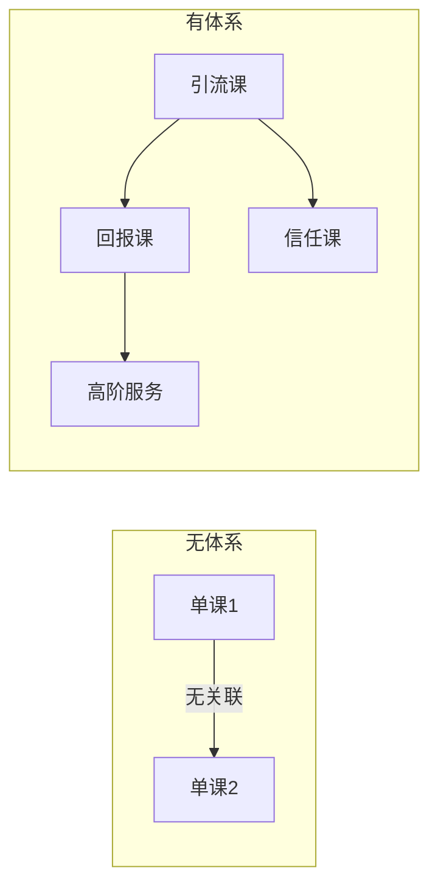

#### 课程产品矩阵变现地图（图7-2）
```mermaid
graph TD
    subgraph 引流课
        Y[低价/免费] --> YU[吸引用户]
    end
    subgraph 回报课
        H[高价值] --> HC[核心利润]
    end
    subgraph 福利课
        F[赠品] --> FG[提升惊喜感]
    end
    subgraph 信任课
        X[系列微课] --> XR[建立口碑]
    end
    YU --> HC
    XR --> HC
    FG --> HC
```

#### 课程产品商业画布（图7-6）
```mermaid
graph TD
    KP[重要合作] --> KA[关键业务]
    KR[核心资源] --> VP[价值主张]
    VP --> CR[用户关系]
    VP --> CS[细分市场]
    KA --> VP
    VP --> CH[营销策略]
    CS --> CH
    CH --> R[收入来源]
    C[成本结构] --> R
```

#### 合作共赢的原则（图7-7）
- 让对方觉得靠谱、放心
- 最大限度为对方创造利益
- 建立壁垒，做同角色不做的事
- 发表独特见解，做有趣灵魂

#### 故事化设计卖点思路（图7-5）
```mermaid
graph LR
    A[确定故事核心] --> B[构建故事框架] --> C[创造共鸣] --> D[行动号召]
```

#### AIDA模型在课程文案中的应用
```mermaid
graph LR
    A[注意：吸引眼球标题] --> I[兴趣：展示课程好处]
    I --> D[欲望：描述具体收益]
    D --> A2[行动：明确号召]
```

### 5. 经典金句/数据
> “做课程如同做产品，单门课程‘单打独斗’，不如多门课程‘组合出击’。”  
> “卖点不是营销的伎俩，而是课程与用户灵魂共振的回响。”  
> “真正的变现‘护城河’，不是一次爆款，而是你基于反馈循环进化出下一个爆款的能力。”  
> 案例：学员通过建立产品矩阵，收入从单课增长10倍以上；徐老师通过闭门会年复购率超60%。

---

## 后记：从好奇到探索
### 核心论点
作者回顾自己从2022年底接触ChatGPT，到探索AI+课程开发，再到写出本书的心路历程。强调成人达己的使命感，鼓励读者勇于实践。

### 关键事件
- 2022年底关注ChatGPT
- 3个多月研发“AI开发课程变现营”
- 2023年AI成为工作生活伙伴
- 2023年底注册“AI课程炼金术”版权
- 写作6个月，修改39遍定稿

### 经典金句
> “为天地立心，为生民立命，为往圣继绝学，为万世开太平。”  
> “使命感的力量强过任何人为的激励。”  
> “人一定不会被AI替代，但一定会被善用AI的人超越。”

---

## 附录：特别福利
- 关注微信公众号“醒职场”（zhichang321），回复“AI课程”可领取：全书图片文件、168页配套PPT课件、33个提示词模板、300条培训/知识内容创作金句。

--- 

**总结完成**。本Markdown文档严格按照原书目录顺序，逐章提炼核心论点、关键概念、逻辑推演、流程图（Mermaid重绘）和经典金句，未添加原文不存在内容，符合知识库沉淀要求。