# 《AI工程：大模型应用开发实战》章节总结

## 书籍信息
- **书名**：AI工程：大模型应用开发实战
- **英文原名**：AI Engineering: Building Applications with Foundation Models
- **作者**：【越】奇普·萱 (Chip Huyen)
- **译者**：宝玉
- **出版社**：人民邮电出版社
- **出版时间**：2026年1月
- **ISBN**：9787115686398

## PDF 状态
- **OCR 状态**：完整识别，文本可提取
- **页码范围**：1-511
- **内容完整性**：全书完整，包含正文、图表、脚注等

## 目录说明
- **目录识别情况**：清晰识别，共10章正文 + 前言、后记等
- **章节对应依据**：按原书页码顺序逐章整理

---

## 全书核心主题

本书系统地阐述了“AI工程”的核心方法——如何基于现成的基础模型（LLM、LMM）构建高效、实用的AI应用。

全书核心论点：
1. **AI工程与传统ML工程的区别**：AI工程更少关注模型开发，更多关注模型的适配和评估
2. **评估是最大挑战**：由于基础模型的开放性，评估成为AI工程中最困难的环节
3. **数据是第一竞争力**：随着模型商品化，数据将成为主要差异化因素
4. **系统化方法**：AI工程应遵循系统化的实验、评估和迭代流程

---

## 第1章：基于基础模型构建AI应用入门

### 核心论点

**问题**：什么是AI工程？为什么它会成为独立学科？

**观点**：
1. AI工程是从ML工程演变而来，专注于利用现成的基础模型构建应用
2. 三种因素推动了AI工程兴起：通用的AI能力、AI投资增加、构建AI应用门槛降低

### 关键概念

| 概念 | 解释 |
|------|------|
| **自回归语言模型** | 仅利用前序token预测下一个token，目前文本生成的首选模型 |
| **掩码语言模型** | 通过上下文信息预测序列中任意位置缺失的token（填空） |
| **自监督学习** | 模型直接从输入数据中自行推断标签，突破数据标注瓶颈 |
| **基础模型** | 大语言模型和多模态大模型的统称，可作为基础进一步构建应用 |
| **参数** | ML模型中的变量，训练过程中不断更新，衡量模型大小 |

### 逻辑推演

作者首先从语言模型的历史演变切入，解释自监督方法如何使模型规模扩展到LLM。随后讨论LLM如何融合多模态数据演变为基础模型。接着展示基础模型催生的大量应用场景（编程、图像制作、写作、教育、聊天机器人等）。最后提出AI工程技术栈的三层结构（应用开发层、模型开发层、基础设施层），并对比AI工程与ML工程的区别。

### AI工程技术栈

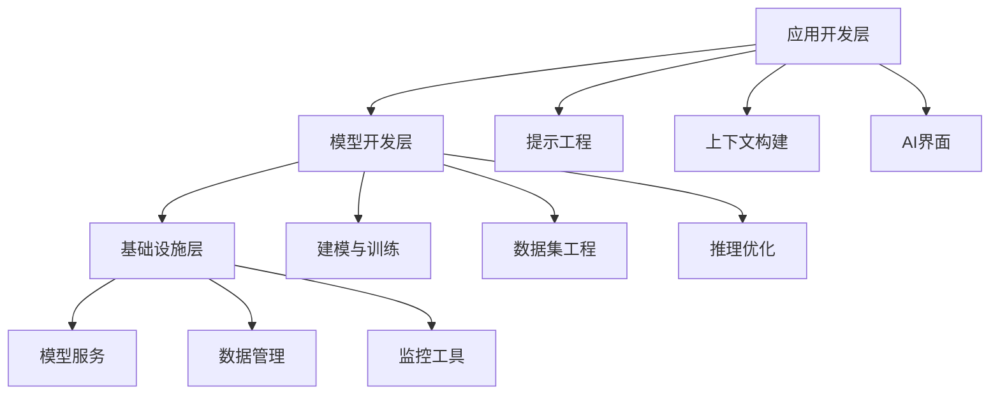

### AI工程 vs ML工程

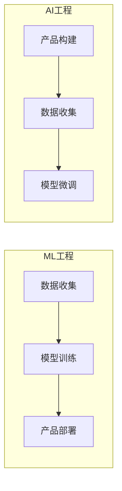

### 经典金句

> “工具更新换代很快，底层知识的生命力更为持久。” (p.15)

> “由于基础模型本身的能力已经相当出色，构建一个有趣的演示可能并不需要太多时间。然而，一个好的初步演示并不意味着最终产品也会很好。” (p.56)

> “AI工程其实就是在软件工程的技术栈中加入了AI模型。” —— Anton Bacaj (p.68)

---

## 第2章：理解基础模型

### 核心论点

**问题**：基础模型的设计决策如何影响下游应用？

**观点**：模型的能力和局限性主要由训练数据、模型架构与规模、后训练对齐三方面决定。

### 关键概念

| 概念 | 解释 |
|------|------|
| **Transformer架构** | 基于注意力机制，完全摒弃RNN，输入可并行处理 |
| **注意力机制** | 使用Q、K、V三个向量，计算token之间的相关性 |
| **采样** | 模型根据概率分布生成输出token的过程 |
| **温度** | 调整logit分布，控制输出的创造性与可预测性 |
| **RLHF** | 基于人类反馈的强化学习，用于偏好微调 |
| **困惑度(PPL)** | 衡量模型预测下一个token时的不确定程度 |

### 采样策略对比

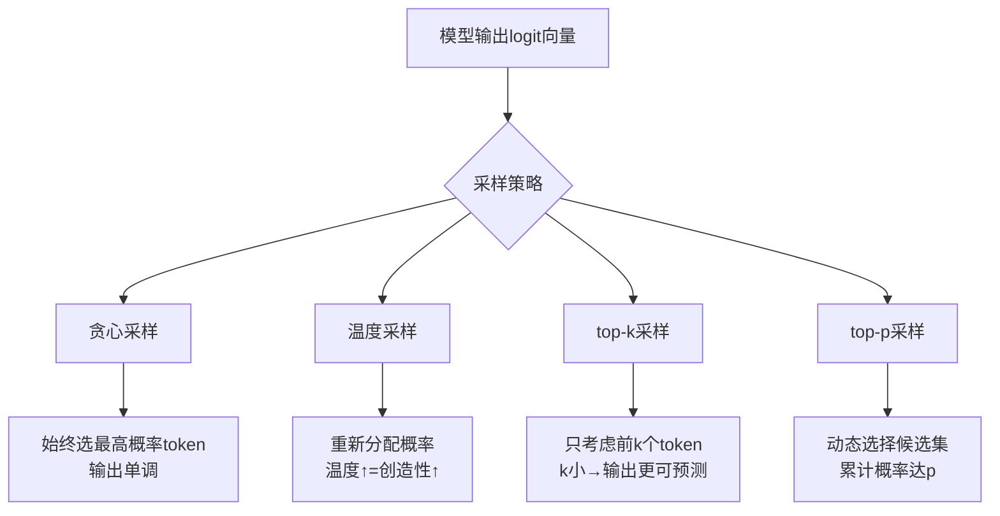

### 幻觉成因

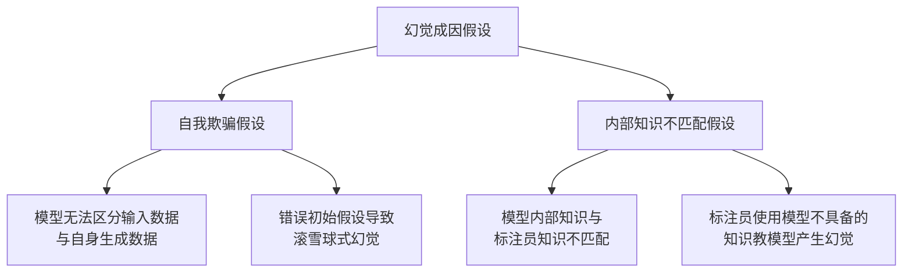

### 经典金句

> “AI模型生成响应的方式决定了其具有概率性。任何概率非零的事情，无论多么离奇或错误，都可能被AI生成。” (p.127)

> “幻觉问题许多企业AI应用场景的最大障碍。” (p.127)

---

## 第3章：评估方法论

### 核心论点

**问题**：如何评估开放式的、非确定性的模型输出？

**观点**：评估基础模型面临5大挑战：模型越智能越难评估、开放式特性、黑盒性、基准测试饱和、评估范围扩大。

### 关键概念

| 概念 | 解释 |
|------|------|
| **困惑度(PPL)** | 熵或交叉熵的指数形式，衡量不确定性 |
| **交叉熵** | 衡量模型预测下一个token的难度 |
| **功能正确性** | 评估系统是否实现了预期功能（如代码pass@k） |
| **词汇相似度** | 衡量两个文本在词汇层面的重叠程度（BLEU、ROUGE） |
| **语义相似度** | 基于嵌入向量计算文本含义相似度 |
| **AI当裁判** | 使用AI来评估AI的输出 |

### 评估方法分类

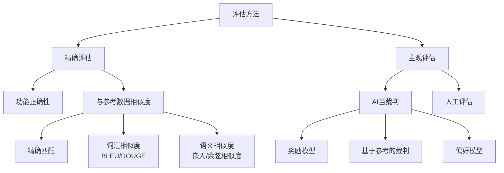

### 经典金句

> “出人意料的是，很多时候，仅靠评估就够了。” —— Greg Brockman (p.135)

> “AI模型越智能，对其进行评估就越困难。” (p.136)

> “评估方法的开发几乎没有得到系统性的关注。” —— DeepMind (p.139)

---

## 第4章：评估AI系统

### 核心论点

**问题**：如何为具体应用构建可靠的评估流水线？

**观点**：评估驱动开发——在构建之前就定义好评估标准，综合使用领域特定能力、生成能力、指令遵循能力、成本和延迟4类标准。

### 关键概念

| 概念 | 解释 |
|------|------|
| **事实一致性** | 输出与给定上下文或公开知识的一致性 |
| **局部事实一致性** | 与明确提供的上下文对比 |
| **全局事实一致性** | 与公开知识对比 |
| **自我验证** | 模型生成多个响应，通过一致性判断幻觉 |
| **SAFE** | 使用搜索引擎结果验证响应真实性 |
| **IFEval** | 评估模型遵循25种格式指令的能力 |

### 模型选择工作流

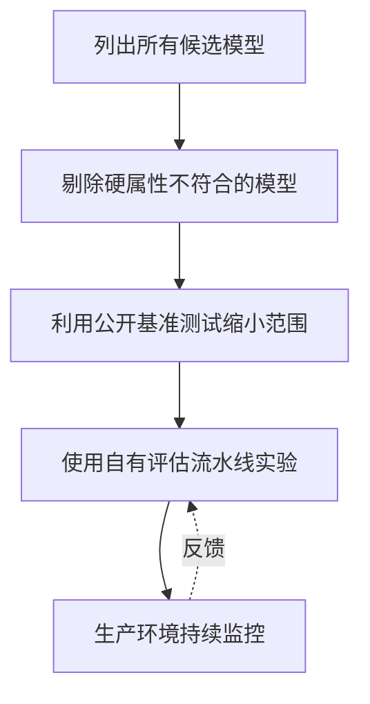

### 开源模型 vs 模型API

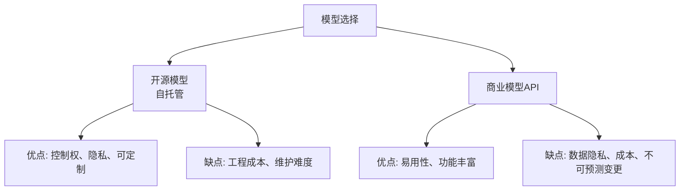

### 经典金句

> “一个已部署但无法评估的应用更糟，因为它不仅需要维护成本，而且下线它的成本可能更高。” (p.180)

> “我认为评估是AI应用落地的最大瓶颈。构建可靠的评估流水线，将解锁许多新的应用场景。” (p.181)

> “在投入时间、资金和资源构建应用之前，明确如何对其进行评估至关重要。” (p.181)

---

## 第5章：提示工程

### 核心论点

**问题**：如何设计有效的提示词引导模型执行任务？

**观点**：提示工程是“人与AI沟通的艺术”，需要清晰明确的指令、充足的上下文、任务拆分、思维链和系统化迭代。

### 关键概念

| 概念 | 解释 |
|------|------|
| **上下文学习** | 仅凭提示词中的示例学习如何执行任务，无需更新权重 |
| **零样本/少样本** | 提示词中提供的示例数量 |
| **系统提示词** | 任务描述或角色设定 |
| **用户提示词** | 具体的任务指令 |
| **CoT(思维链)** | 要求模型逐步思考，提升推理能力 |
| **提示词注入** | 恶意诱导模型执行有害指令 |

### 提示工程最佳实践

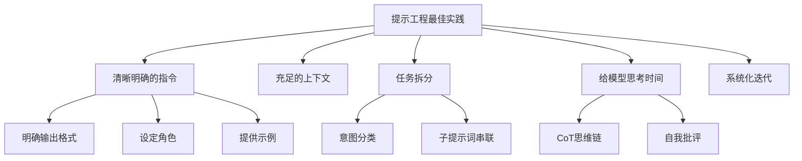

### 经典金句

> “提示工程上手的简单性容易让人误以为它并不复杂。人人都会沟通，但并非每个人都是沟通高手。” (p.229)

> “问题不在于提示工程本身——这是一项真实且有用的技能，真正的问题在于人们只懂提示工程。” (p.229)

> “在撰写系统提示词的时候，要假设它有一天会被公开。” (p.256)

---

## 第6章：RAG与智能体

### 核心论点

**问题**：如何为模型构建相关上下文并赋予其执行能力？

**观点**：RAG解决信息缺失问题，智能体通过工具使用扩展模型能力。RAG关注“事实”，微调关注“形式”。

### 关键概念

| 概念 | 解释 |
|------|------|
| **RAG** | 从外部记忆源检索相关信息增强模型生成能力 |
| **基于词项的检索** | 使用关键词相关性检索（Elasticsearch、BM25） |
| **基于嵌入的检索** | 使用语义相似度检索（向量数据库） |
| **智能体** | 能够规划并使用工具完成任务的AI系统 |
| **函数调用** | 模型使用外部工具的API机制 |
| **ReAct** | 推理与动作交替进行的智能体范式 |

### RAG架构

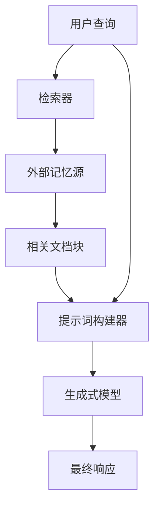

### 智能体控制流

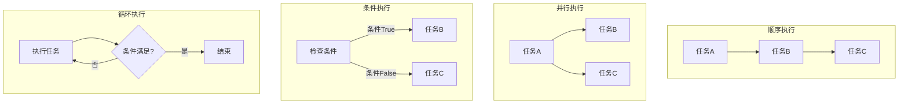

### RAG vs 微调

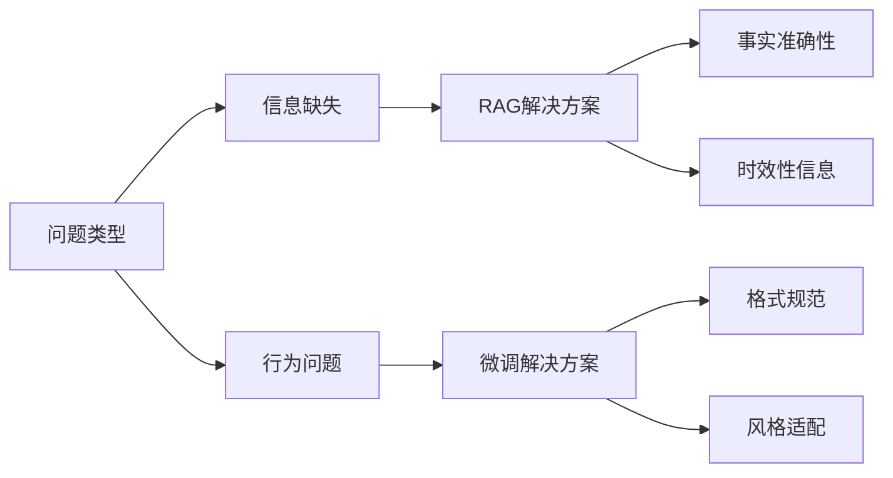

### 经典金句

> “RAG关注事实，而微调关注形式。” (p.336)

> “许多人认为只要模型的上下文长度足够长，RAG就会被淘汰。我并不认同这一观点。” (p.274)

> “智能体是任何能够感知其环境并作用于环境的事物。” —— Stuart Russell & Peter Norvig (p.295)

---

## 第7章：微调

### 核心论点

**问题**：如何通过调整模型权重使模型适配特定任务？

**观点**：微调面临内存瓶颈，PEFT技术通过减少可训练参数量解决该问题。LoRA是最流行的PEFT方法，通过低秩分解实现高效微调。

### 关键概念

| 概念 | 解释 |
|------|------|
| **迁移学习** | 将从一项任务中获得的知识迁移到新任务 |
| **全量微调** | 更新模型所有参数，资源消耗大 |
| **PEFT** | 参数高效微调，用少量参数达到接近全量微调的性能 |
| **LoRA** | 低秩分解，将权重矩阵分解为两个小矩阵的乘积 |
| **QLoRA** | 量化LoRA，在4位精度下微调 |
| **量化** | 降低数值精度以减少内存占用 |

### 微调内存计算

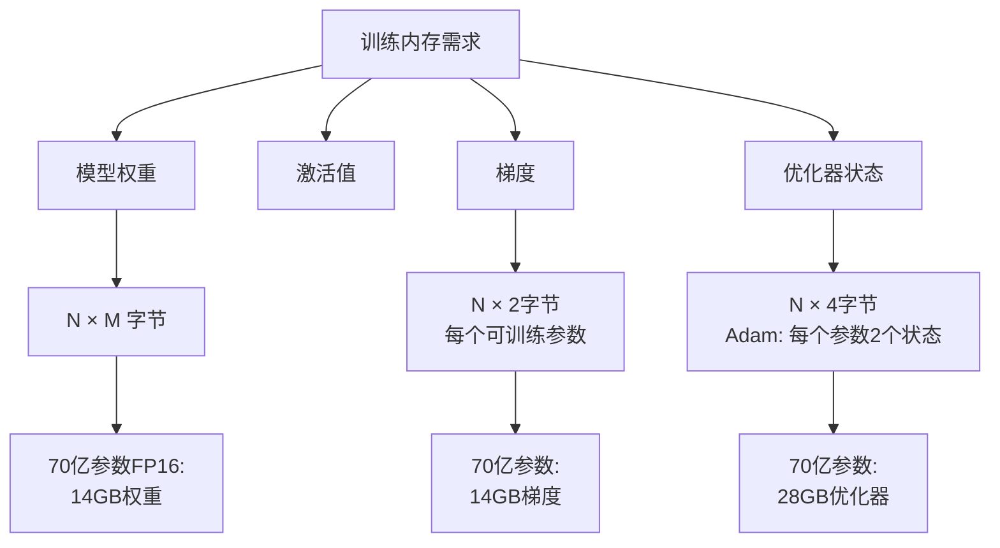

### LoRA工作原理

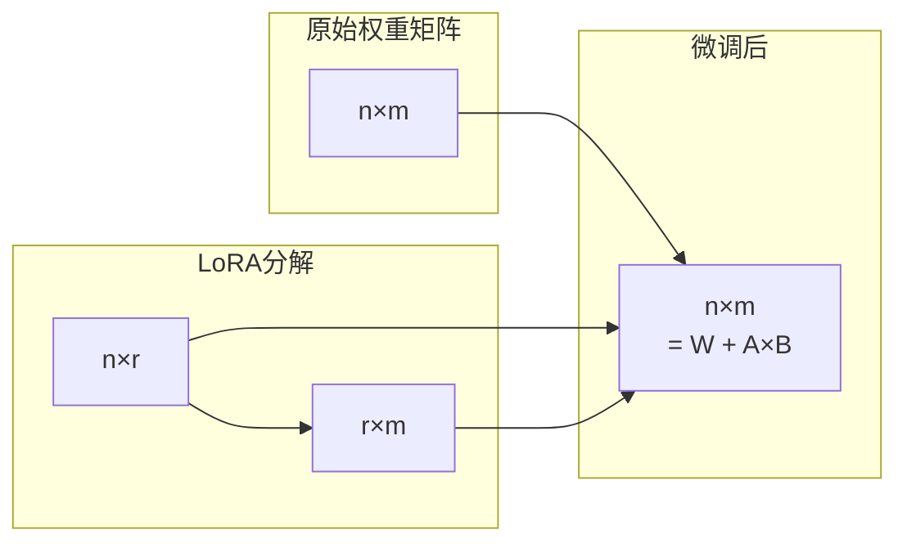

### 经典金句

> “预训练实际上起到了压缩机制的作用，有利于后续任务。一个LLM训练得越充分，就越容易用少量可训练参数和少量数据进行微调。” (p.358)

> “业内常说：微调本身不难，难的是获取用于微调的数据。” (p.379)

---

## 第8章：数据集工程

### 核心论点

**问题**：如何构建高质量的训练数据集？

**观点**：数据策展需遵循三大标准：质量、覆盖度、数量。少量高质量数据优于大量含噪数据。AI合成数据可规模化生成，但需严格验证。

### 关键概念

| 概念 | 解释 |
|------|------|
| **数据策展** | 构建数据集的科学过程，需深入理解模型学习机制 |
| **数据覆盖度** | 数据集应覆盖应用的所有问题范围（多样性） |
| **数据合成** | 人工生成数据以替代或补充真实数据 |
| **反向指令** | 以高质量内容为基础，生成能引导出这些内容的提示词 |
| **模型蒸馏** | 用小模型（学生）模仿大模型（教师）的行为 |
| **模型坍塌** | 递归使用AI生成数据训练导致模型性能下降 |

### 数据合成流程（Llama 3案例）

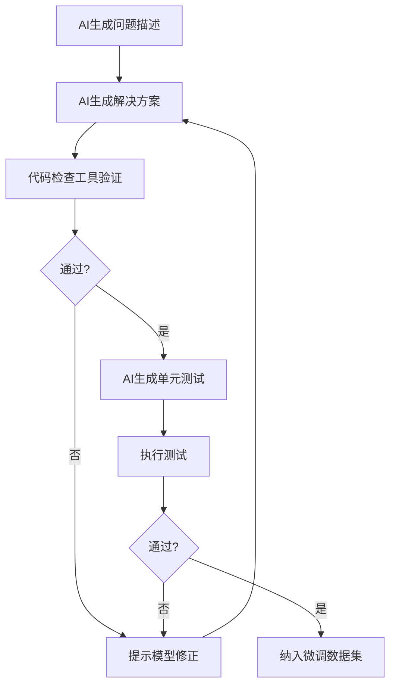

### 经典金句

> “人工检查数据可能是机器学习领域中最被低估的高价值的活动。” —— Greg Brockman (p.413)

> “少量高质量的数据往往优于大量含噪数据。” (p.384)

> “如果你担心输入token成本，可以通过微调来控制。” (p.417)

---

## 第9章：推理优化

### 核心论点

**问题**：如何让模型运行得更快、成本更低？

**观点**：推理优化可在模型、硬件、服务三个层面进行。量化是最有效的模型压缩方法，连续批处理和推测解码是重要的服务端优化。

### 关键概念

| 概念 | 解释 |
|------|------|
| **TTFT** | 首个token生成时间，对应预填充阶段 |
| **TPOT** | 每个输出token生成时间，对应解码阶段 |
| **MFU** | 模型每秒浮点运算利用率 = 实际/理论峰值 |
| **推测解码** | 用草稿模型生成token，目标模型并行验证 |
| **连续批处理** | 响应完成后立即返回，并在该位置加入新请求 |
| **KV缓存** | 存储键值向量供复用，避免重复计算 |

### 推理延迟分解

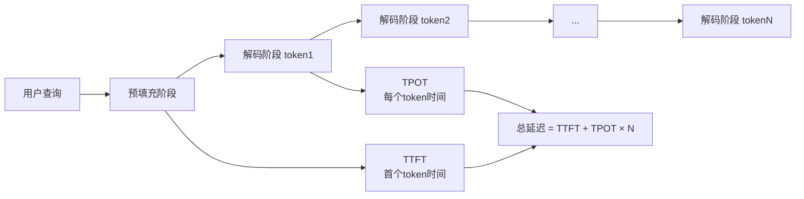

### 推测解码工作流

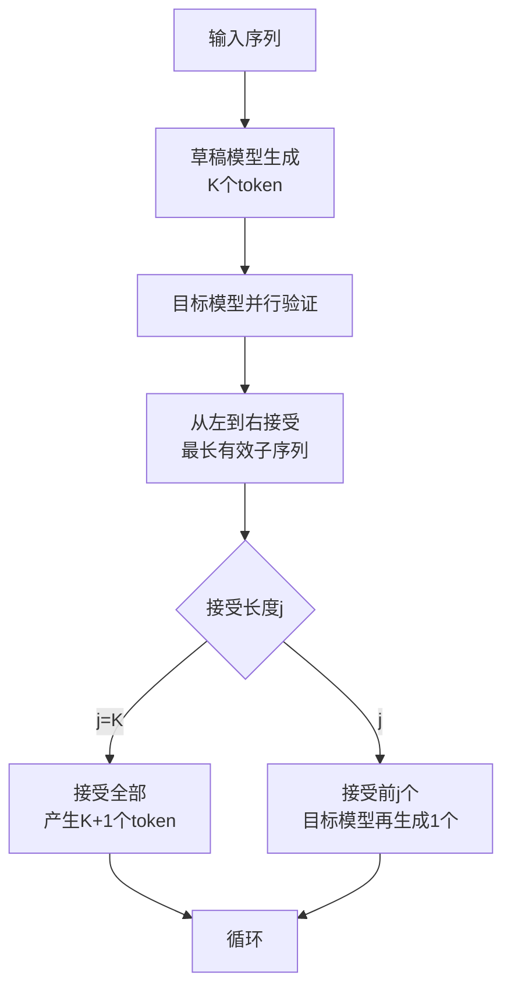

### 经典金句

> “一张翻转后的猫的图像，其内容仍然是一只猫；一张经过轻微裁剪的足球比赛图像，依然呈现足球比赛场景。” (p.399)

> “由于其概率性，重试同一个查询可能会得到不同的响应。” (p.466)

> “量化已经接近极限——每个数值无法低于1位。” (p.440)

---

## 第10章：AI工程架构与用户反馈

### 核心论点

**问题**：如何将所有组件整合为完整的AI应用系统？

**观点**：AI架构应从最简单形态开始，逐步添加上下文增强、防护措施、路由器、缓存和智能体模式。用户反馈是数据飞轮的核心。

### 关键概念

| 概念 | 解释 |
|------|------|
| **模型网关** | 统一API与不同模型交互，实现访问控制和成本管理 |
| **精确缓存** | 请求完全一致时使用缓存结果 |
| **语义缓存** | 查询语义相似时复用缓存结果 |
| **显式反馈** | 用户明确提供的信息（点赞、评分） |
| **隐式反馈** | 从用户行为推断的信息（编辑、重新生成） |
| **恶性反馈循环** | 预测结果影响反馈，反馈放大初始偏差 |

### 完整AI应用架构

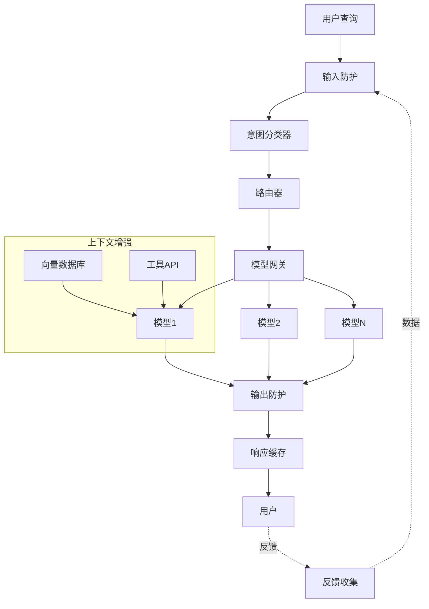

### 反馈类型分类

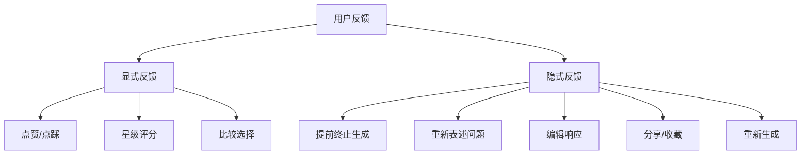

### 经典金句

> “一个成熟完善的AI架构往往十分复杂。应从最简单的架构开始，逐步添加更多组件。” (p.461)

> “反馈应无缝融入用户的工作流程。用户应能轻松地提供反馈，而无须额外的烦琐操作。” (p.497)

> “用户反馈对于提升用户体验至关重要，但如果不加甄别地使用，可能会固化偏见甚至毁掉产品。” (p.504)

---

## 后记

### 核心内容

作者分享写作感悟，并提供联系方式：
- **X**：@chipro
- **LinkedIn**：chiphuyen
- **邮箱**：hi@huyenchip.com
- **GitHub仓库**：https://github.com/chiphuyen/aie-book

### 经典金句

> “技术写作最难的部分并不是找到正确的答案，而是提出恰当的问题。” (p.506)

> “AI工程面临诸多挑战，并不是所有挑战都充满乐趣，但每一个挑战都是你我成长和创造价值的机会。” (p.506)

---

## 关于作者

**奇普·萱（Chip Huyen）**
- 作家、计算机科学家，专注于机器学习系统领域
- 曾任教于Snorkel AI、NVIDIA
- 创立AI基础设施初创公司（后被收购）
- 斯坦福大学教授"机器学习系统设计"课程
- 著有《机器学习系统设计》及四本越南语畅销书

---

## 封面简介

封面动物：**漠林鸮（Strix butleri）**
- 原产于阿曼、伊朗和阿联酋的"无耳鸮"
- 面部浅灰色和深灰色，眼睛橙色
- IUCN保护状态：LC（无危）