# 《AI提效手册：豆包+即梦+剪映+飞书+扣子5合1实操指南》章节总结

## 书籍信息
- **书名**：AI提效手册：豆包+即梦+剪映+飞书+扣子5合1实操指南
- **作者**：秋叶，刘晓阳
- **出版社**：人民邮电出版社
- **出版年份**：2026年2月第1版
- **PDF状态**：基于文本层提取，内容完整可读
- **OCR状态**：良好，无严重错漏

## 全书核心主题

本书旨在帮助职场人士掌握五款国产主流AI效率工具（豆包、即梦、剪映、飞书、扣子），通过“实战案例+步骤拆解”的方式，构建一套完整的职场技能体系。

核心观点是：AI不是替代人类的威胁，而是继“电力”和“互联网”之后的第三次赋能个体的革命性力量。读者应从“执行者”升级为懂得指挥AI工具队伍协同工作的“指挥官”，将琐碎重复的工作交给AI，把精力集中在战略、创意与决策上。

## 目录说明

本书分为5篇，共14章：
- **第1篇 豆包篇**（第1-2章）：AI对话与内容生成
- **第2篇 即梦篇**（第3-6章）：AI图像与视频生成
- **第3篇 剪映篇**（第7-8章）：AI视频剪辑与包装
- **第4篇 飞书篇**（第9-11章）：AI协作与知识管理
- **第5篇 扣子篇**（第12-13章）：AI智能体定制与自动化

以下按原书目录顺序逐章总结。

---

## 第1篇 豆包篇

### 引言（第15页）

**核心论点**：职场人常被搜索资料、写文案、读长文档、做PPT等基础工作拖累，这些琐碎任务正在吞噬本应用于深度思考的时间。豆包可以帮助解决这些问题，让用户告别加班与重复劳动。

**关键概念**：
- 豆包的四大核心能力：AI搜索、AI写作、AI阅读、AI PPT

---

## 第1章：新手怕难？3分钟轻松上手豆包

### 1. 核心论点

本章解决新手如何快速上手豆包的问题。作者认为：好的结果始于好的提问，掌握基础操作、精准提问与深度互动三种能力，就能将豆包变成工作中的智能伙伴。

### 2. 关键概念

- **背景定位**：通过定义角色、品牌信息、用户画像，让AI从通用模型切换为领域专家
- **目标明确**：精准告诉AI最终要交付的成果（动作、名称、数量）
- **要求细化**：把对“完美结果”的评判标准变成AI可逐项执行的任务清单
- **提示词迭代**：通过补充关键信息、调整表述方式、限定输出边界来优化AI输出
- **多轮对话三阶段**：定义问题→迭代方案→总结复盘

### 3. 逻辑推演

本章从“如何让AI听懂你的意思”出发，提出了一个三层递进的提示词框架：

**第一步：背景定位**。默认的豆包是通用模型，需要通过角色定义、品牌信息、用户画像三个要素，强制其切换为领域专家角色。

**第二步：目标明确**。模糊的目标（如“给我一些创意”）会导致模糊的输出。需要明确动作、交付成果名称和数量。

**第三步：要求细化**。提供输出结构的详细要求，如活动名称、口号、用户洞察、创意故事、渠道建议等。

接着，本章介绍了从“及格”到“优秀”的迭代技巧：
1. **补充关键信息**：提供成功范例、明确负面清单、补充竞争信息
2. **调整表述方式**：将形容词替换为“动词+方法”、使用角色扮演或风格类比、提出引导性问题而非模糊命令
3. **限定输出边界**：规定格式、设定量化指标、排除无关内容

最后，介绍了多轮对话的三个阶段：
- **第一阶段**：先明确核心目标、已有信息和信息缺口，再向AI提问
- **第二阶段**：绘制框架、追问核心难点、追问细节确认信息可靠性
- **第三阶段**：总结复盘，形成可交付的最终成果

### 4. 经典金句

> “好的结果，始于一次好的提问。”

> “一个粗糙的、不包含任何有效信息的提示词，必然只能换回一个通用的、低价值的答案。”

> “高质量的输出往往源于高质量的输入。”

---

## 第2章：从小白到高手，解锁豆包的4个核心功能

### 1. 核心论点

本章解决职场人最耗时的四件事——找资料、读长文、写稿子、做PPT。作者认为：AI搜索、AI写作、AI阅读、AI PPT这四个功能可以将过去的“耗时大户”变成未来的“效率利器”。

### 2. 关键概念

- **AI搜索**：通过结构化提示词，让AI完成“筛选、阅读、摘录、初步整合”的自动化
- **知识整合三层面**：追问事实（案例、原理、数据）→追问观点（不同角色观点、批判性观点、趋势性观点）
- **AI写作**：策划“爆款”→激活创意→内容润色，用户角色从“执行者”转变为“创意总监”
- **AI阅读**：掌握框架→跨章提问→成果转化
- **AI PPT**：明确主题（观点、数据、行动）→套用模板

### 3. 流程图

#### AI搜索的知识整合流程

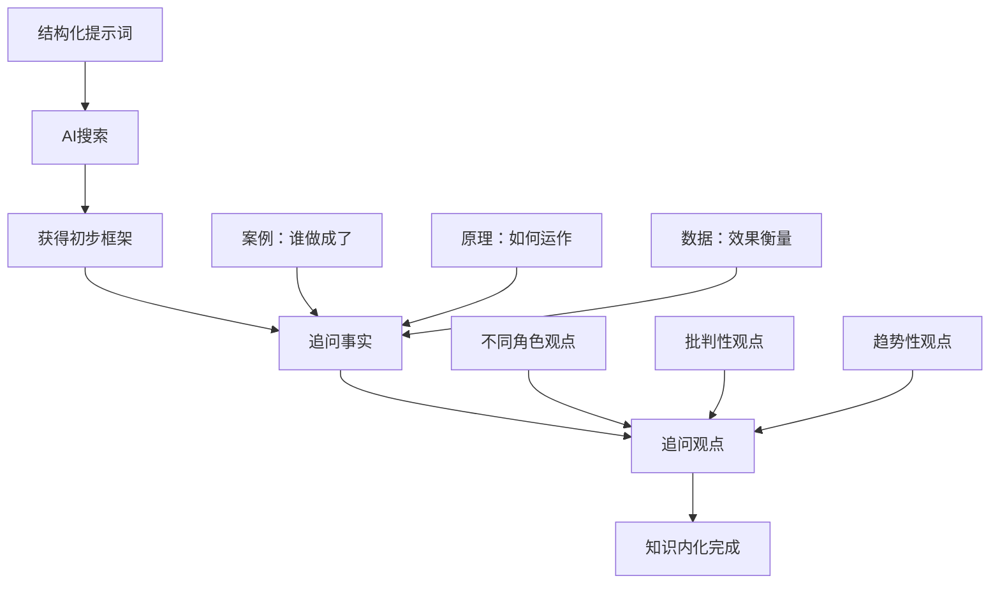

#### AI写作的创意管理流程

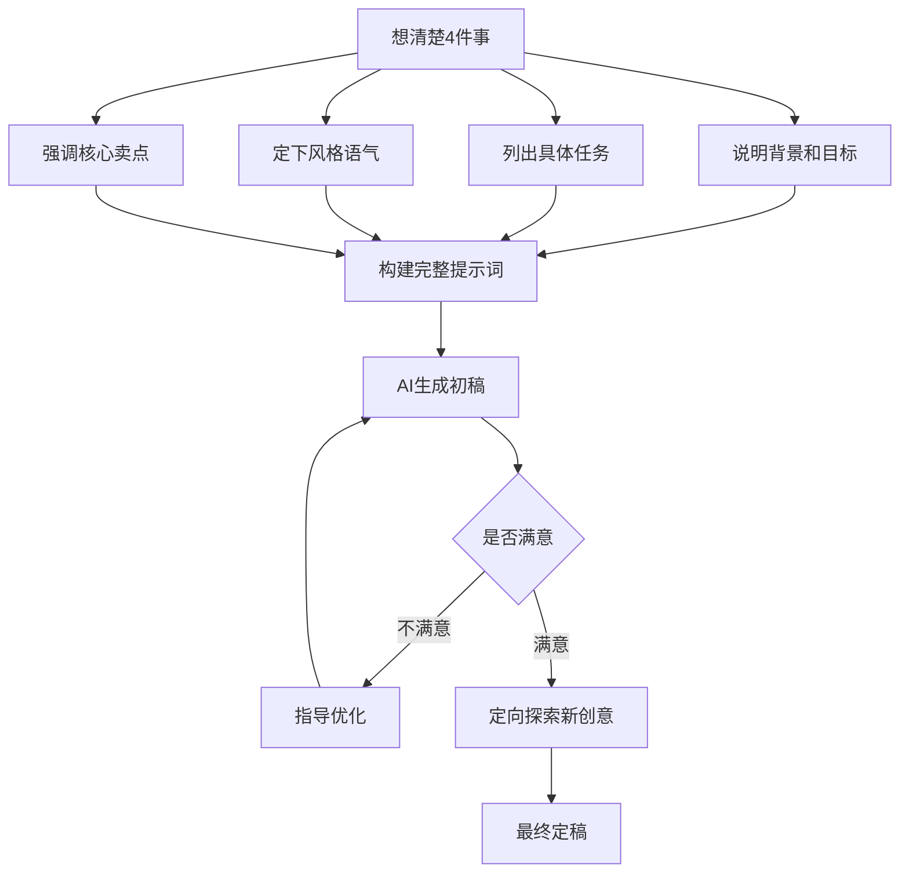

#### AI阅读的高效处理流程

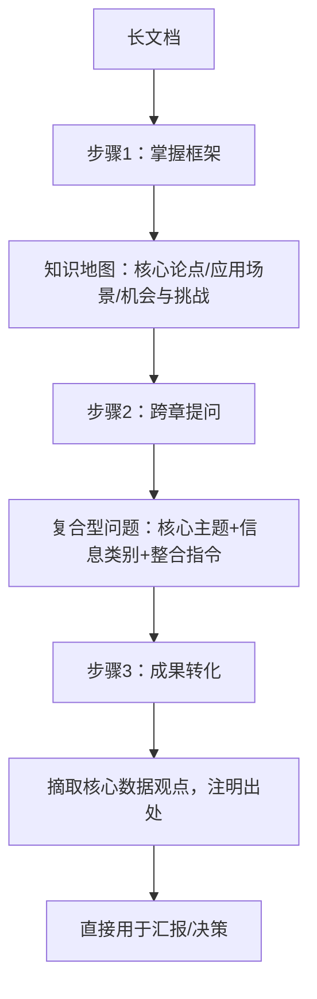

#### AI PPT制作流程

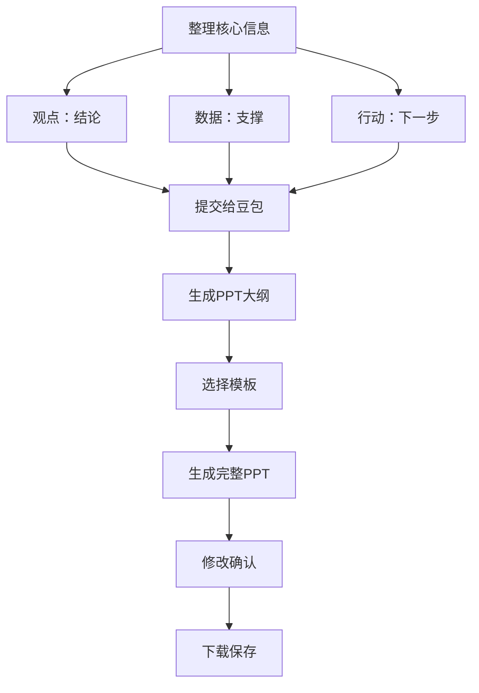

### 4. 经典金句

> “工作的核心是最后的‘分析与创造’，但你大部分时间可能耗在了前期的筛选、阅读和摘录上。”

> “你不再是内容的生产者，而是创意的把控者和决策者。”

> “阅读的最终目的不是‘读过’，而是‘为我所用’。”

---

## 第2篇 即梦篇

### 引言（第45页）

**核心论点**：视觉创作的门槛（无绘画基础、拍摄成本高、修图技术难）正在让创意难以落地。即梦AI让每个人都成为“视觉创作者”——输入文字就能生成图片，上传照片就能打造写真。

---

## 第3章：不会画画？输入文字就能生成图片

### 1. 核心论点

本章解决无绘画基础人群的视觉表达问题。作者认为：通过“主体+环境+风格”的提示词公式，任何人都能通过文字描述生成精准、高质量的图像。

### 2. 关键概念

- **即梦AI四大板块**：灵感（学习他人提示词）、生成（输入提示词生图）、资产（保存历史记录）、画布（简化版Photoshop）
- **图片模型选择**：
  - 图片4.0：适合二次创作、增删元素、多图合成
  - 图片3.1：适合生图或换脸写真，画面表现力强
  - 图片3.0：适合生成包含文字的图片
- **提示词公式**：主体 + 环境 + 风格
- **表情包生成公式**：角色 + 动作情绪 + 风格 + 图片布局（3×3网格图，纯色背景）

### 3. 流程图

#### 图片生成流程

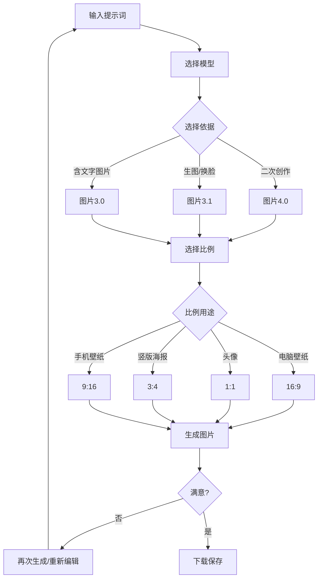

### 4. 经典金句

> “即使知道提示词公式，提示词还是不好写，这是很多人用即梦AI时的卡点。其实解决方案很简单，让豆包帮助你精准生成。”

> “选对模型能直接提升输出效果。”

---

## 第4章：想拍大片？随时随地就能得到专业写真

### 1. 核心论点

本章解决专业摄影门槛高（设备昂贵、布光复杂、后期烦琐）的问题。作者认为：通过人像写真功能，上传一张正脸照片，30秒就能生成证件照、职场形象照、异域风格写真、汉服写真等。

### 2. 关键概念

- **人像写真功能**：精准捕捉面部特征，生成与本人高度一致的写真
- **智能参考功能**：识别产品瑕疵，自动优化光影，提升质感
- **证件照生成**：上传正脸照片 + 提示词（背景、风格、着装）+ 人像写真参考图
- **电商修图通用提示词**：“将这张产品图片进行商业级精修，去除瑕疵、划痕，电影级别光影，提升质感，亮度提高”

### 3. 流程图

#### 证件照/形象照生成流程

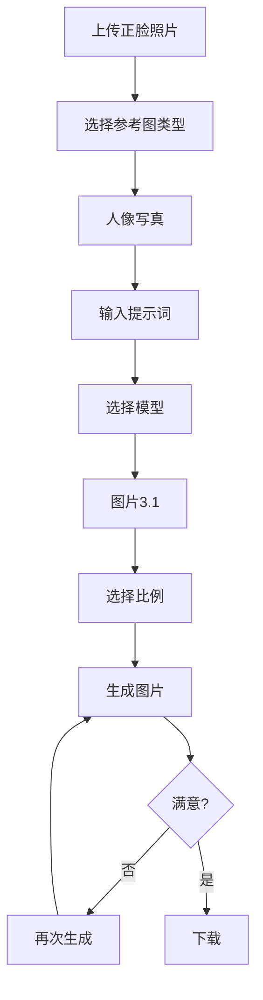

#### 电商修图流程

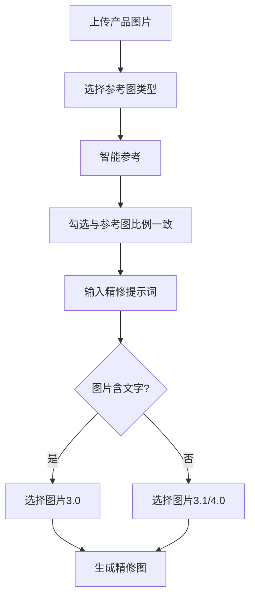

### 4. 经典金句

> “AI需要明确的提示词，而‘主体+环境+风格’的提示词公式就是最优解。”

> “即梦AI所做的，本质上是用深度学习算法，把专业摄影师的修图逻辑和技术，打包成了一套普通人也能轻松上手的智能工具。”

---

## 第5章：设计没人帮？自己就能做专业电商视觉设计

### 1. 核心论点

本章解决无设计基础人群的电商视觉设计难题。作者认为：通过即梦AI，无需掌握设计逻辑，仅需上传产品图并输入提示词，就能生成版式与配色精准匹配产品调性的电商主图、活动海报和可商用字体图。

### 2. 关键概念

- **护肤品海报公式**：文案 + 环境 + 风格
- **活动海报公式**：文案 + 环境 + 风格 + 色彩 + 构图
- **字体设计**：通过提示词生成可商用的书法文字、特效文字，从根源规避字体侵权问题
- **文字图片化**：将文字作为视觉图形使用，如书法标题

### 3. 流程图

#### 电商主图生成流程

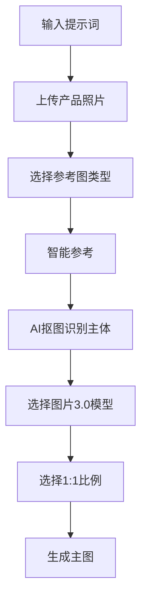

### 4. 经典金句

> “无须在字体选择上纠结，针对海报标题字、艺术书法字等需求，只需输入风格要求与具体文案，AI即可生成专属字体图，且生成的字体可直接商用，从根源上规避了字体侵权问题。”

---

## 第6章：不会做视频？新手也能制作好看视频

### 1. 核心论点

本章解决零基础人群的视频制作难题。作者认为：即梦AI的视频生成功能将视频制作拆成“你提需求”和“AI生成”两个环节，用文字描述直接生成古风短片、产品宣传视频、城市宣传视频等。

### 2. 关键概念

- **首尾帧功能**：上传首帧和尾帧两张图片，AI自动生成中间过渡效果
- **古风视频制作两步法**：正脸照片→古装照片→古风视频
- **老照片动画**：上传老照片，不输入提示词，AI自主创作动态视频
- **视频模型**：视频S2.0（极速生成）、视频3.0（高质量）

### 3. 流程图

#### 首尾帧视频制作流程

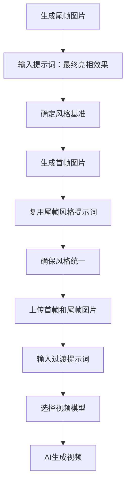

#### 古风视频制作流程

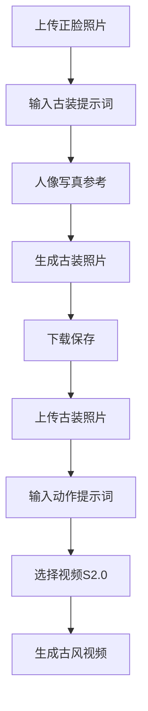

### 4. 经典金句

> “即梦AI的视频生成功能，本质上是把视频制作的复杂流程拆成了‘你提需求’和‘AI生成’两个简单环节。”

> “用科技为时光赋予温度，就能让那些停留在照片里的珍贵回忆，突破静态的限制，以更鲜活的形态延续下去。”

---

## 第3篇 剪映篇

### 引言（第89页）

**核心论点**：不懂剪辑技巧、不会处理口播卡壳、担心视频没有字幕——这些难题正在阻碍内容传播。剪映让专业视频制作变简单：一键成片、智能字幕、数字人视频。

---

## 第7章：剪辑太难？AI帮助你快速剪出好视频

### 1. 核心论点

本章解决剪辑门槛高的问题。作者认为：通过剪同款、AI文字成片、营销成片三个功能，任何人都能快速制作企业宣传片、微课视频、商品介绍视频。

### 2. 关键概念

- **剪同款**：将视频创作简化为“替换素材”一个核心动作
- **AI文字成片**：导入文字讲稿，AI自动匹配画面、配音、字幕
- **营销成片**：上传产品素材、输入产品名称和卖点，AI自动创作文案并完成剪辑
- **视频比例**：16:9（教学视频）、9:16（抖音短视频）

### 3. 流程图

#### 企业宣传片制作流程

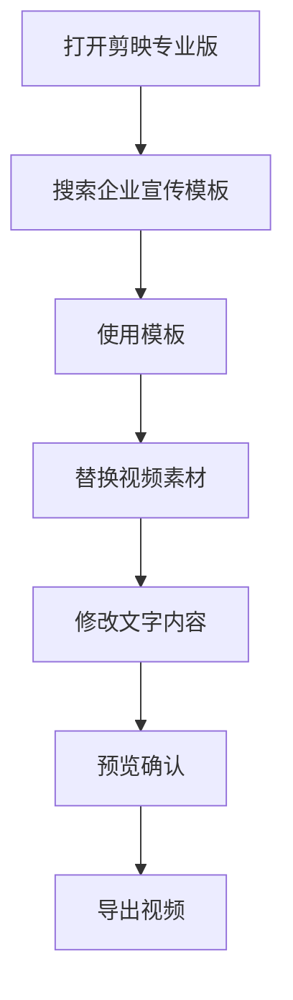

#### AI文字成片制作流程

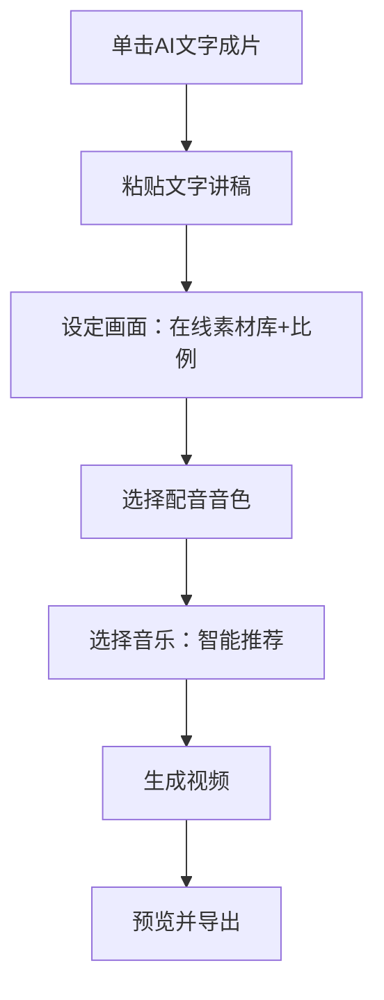

#### 营销成片制作流程

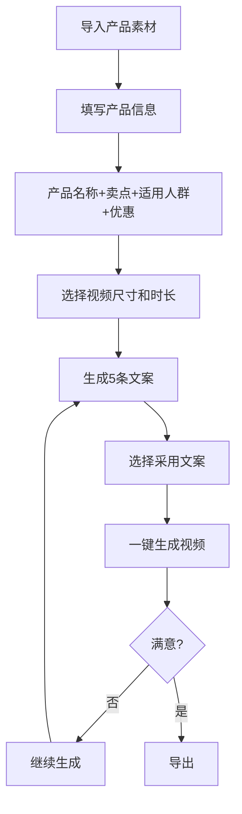

---

## 第8章：视频不专业？包装一下更出彩

### 1. 核心论点

本章解决视频初稿粗糙的问题。作者认为：通过智能字幕、智能剪口播、数字人功能，可以在不增加工作量的情况下显著提升视频质感。

### 2. 关键概念

- **智能字幕**：自动识别视频语音，一键生成时间轴精准的字幕
- **智能剪口播**：自动识别并删除“嗯”“啊”等语气词、口误、停顿片段
- **数字人**：输入文案，选择虚拟形象，生成口型精准的讲解视频
- **字幕批量美化**：一次修改同步应用到所有字幕条

### 3. 流程图

#### 智能剪口播流程

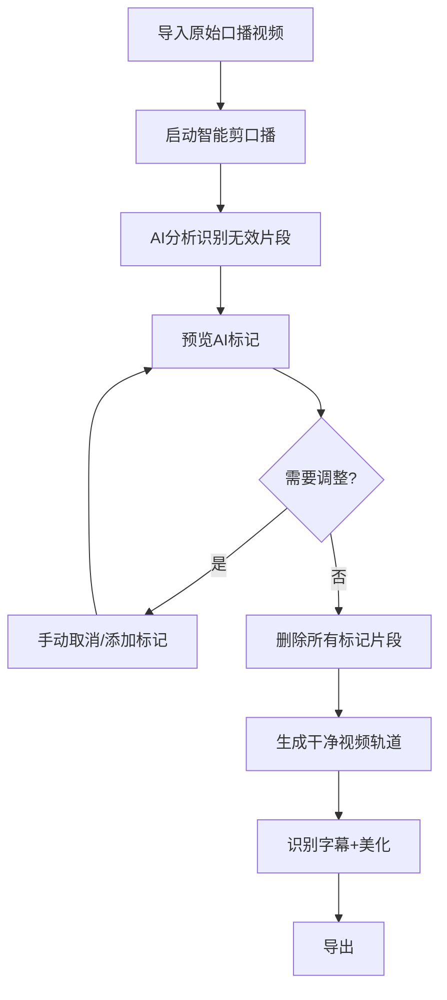

#### 数字人视频制作流程

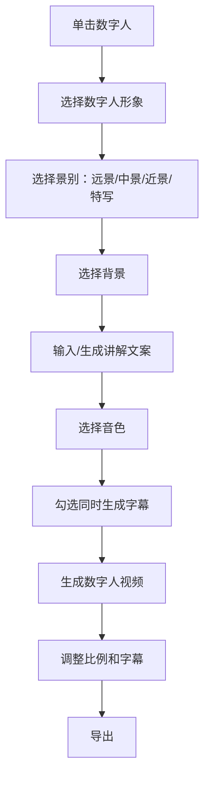

### 4. 经典金句

> “剪映的智能字幕功能能自动识别视频语音，一键生成时间轴精准的字幕，将原本数小时的工作压缩至几十秒。”

> “剪映的数字人功能提供了一个有效方案：只需提供文案，就能选择一个合适的虚拟形象，生成口型精准、表达自然的讲解视频。”

---

## 第4篇 飞书篇

### 引言（第119页）

**核心论点**：数据整理靠手动、团队协作信息分散、知识随员工离职流失——这些问题正在拉低团队效率。飞书提供多维表格、云文档、知识库的智能协作解决方案。

---

## 第9章：不会做表？AI助力轻松搞定

### 1. 核心论点

本章解决数据处理中的无效努力问题。作者认为：通过飞书多维表格的日历视图和AI字段功能，可以一键生成电子日历、用AI编写复杂公式、批量处理数据。

### 2. 关键概念

- **多维表格 vs 传统表格**：行叫“记录”，列叫“字段”，每个字段数据类型确定
- **日历视图**：将表格中的工作事项一键转换成电子日历
- **公式字段+AI生成**：用自然语言描述需求，AI自动编写公式（如“根据身份证号提取员工出生日期”）
- **AI字段捷径**：借助大模型根据已有字段推导结果（如根据身份证号提取籍贯）
- **自动化流程**：设置触发条件（如“到达记录中的时间时”）和执行操作（如“发送飞书消息”）

### 3. 流程图

#### 电子日历生成流程

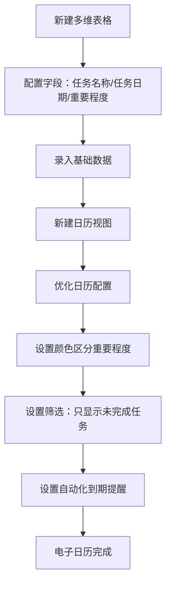

#### AI公式生成流程

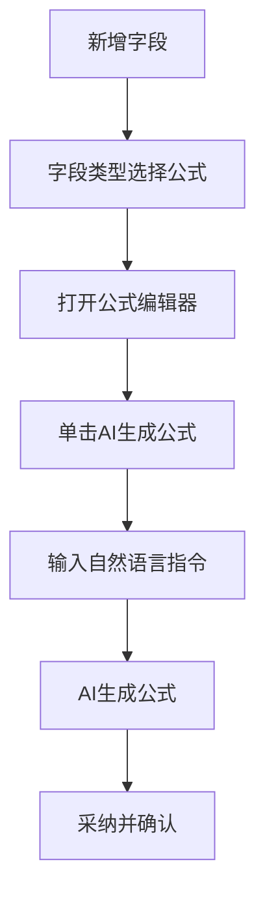

### 4. 经典金句

> “在多维表格中，每一个字段的数据类型是确定的。正是这些字段类型的存在，确保了数据的规范性。”

> “由于大模型自身一直存在尚未完美解决的‘幻觉’问题，对于AI输出的内容，大家需要注意甄别并谨慎使用。”

---

## 第10章：写作没思路？多人协作更高效

### 1. 核心论点

本章解决文档协作中的版本混乱、沟通成本高、排版耗时问题。作者认为：通过套用模板、高效排版、多人线上协同，可以让写作更轻松，协作更流畅。

### 2. 关键概念

- **模板库**：一键套用立项申请表、可行性分析报告等场景化模板
- **内容块**：飞书文档中内容管理的基础单位，可拖曳移动、创建分栏
- **目录自动生成**：添加标题后，正文左侧自动生成可点击的目录
- **群名片嵌入**：在文档中嵌入群名片，读者可单击加入讨论
- **投票组件**：在文档中添加投票，实时查看结果

### 3. 流程图

#### 文档排版技巧

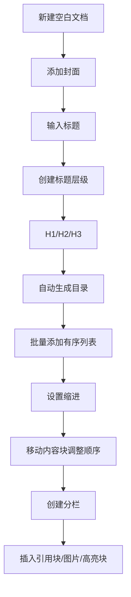

#### 线上协同团建文档流程

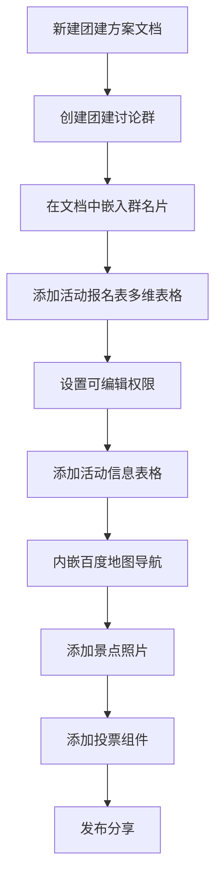

### 4. 经典金句

> “在飞书文档中，内容管理的基础单位叫作‘内容块’。一个内容块就是一个整体，可以用鼠标拖曳内容块，将其移动到文档中的任意位置。”

---

## 第11章：经验难留存？AI知识库来帮忙

### 1. 核心论点

本章解决企业知识随人员流动而流失的问题。作者认为：通过飞书知识库的集中管理、批量维护与AI知识问答，可以让经验得以沉淀、随时调用。

### 2. 关键概念

- **知识库**：云文档（文档、表格、思维笔记等）的结构化集合
- **四种填充方式**：手动编辑、迁入已有云文档、导入为在线文档、上传本地文件
- **批量操作**：创建副本、移动、添加快捷方式、设置密级、转移所有权、删除
- **快捷方式 vs 副本**：快捷方式会同步原文档变更；副本不会
- **AI知识问答**：基于指定知识库进行检索和回答，避免AI“幻觉”

### 3. 流程图

#### 知识库搭建流程

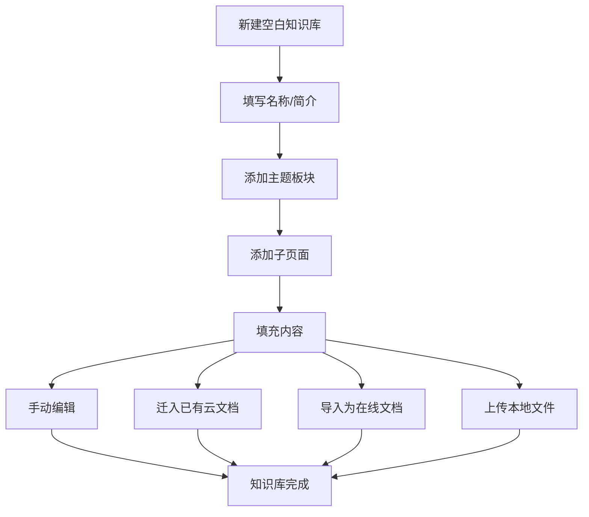

#### 批量操作流程

```mermaid
graph TD
    A[进入批量操作模式] --> B{选择操作}
    B -->|创建副本| C[复制文档到新知识库]
    B -->|移动| D[移动到其他知识库，原位置删除]
    B -->|添加快捷方式| E[添加引用，同步更新]
    B -->|删除| F[删除文档]
```

#### AI知识问答配置流程

```mermaid
graph TD
    A[打开飞书知识问答] --> B[固定到导航栏]
    B --> C[配置知识范围]
    C --> D[选择云文档]
    D --> E[选择全部知识库]
    E --> F[勾选指定知识库]
    F --> G[提问]
    G --> H[AI检索知识库]
    H --> I[返回基于知识库的答案]
```

### 4. 经典金句

> “知识库的结构可以通过目录设置进行管理，它直接决定知识的可访问性、复用效率和管理成本。”

> “引入AI知识问答功能，只需要向AI提问，AI就能自动搜索知识库内的信息，避免AI‘幻觉’，让AI提供的建议更精准。”

---

## 第5篇 扣子篇

### 引言（第177页）

**核心论点**：通用型AI工具无法解决特有的业务问题。通过扣子平台，无需代码基础就能定制专属智能体（写公文、解答用户问题、生成行业日报），从AI的使用者变身为AI的创造者。

---

## 第12章：想有专属AI助手？用扣子定制专属功能

### 1. 核心论点

本章解决通用AI工具不够贴合需求的问题。作者认为：通过扣子平台的智能体功能，可以定制公文大师、AI产品专家、行业日报等专属AI助手。

### 2. 关键概念

- **三种智能体模式**：
  - 单Agent（自主规划模式）：最灵活，适合开放式对话
  - 单Agent（对话流模式）：由工作流严格控制，适合流程化任务
  - 多Agents：多个子智能体，适合复杂集成应用
- **四段式提示词框架**：角色 + 技能 + 示例 + 限制
- **插件**：赋予智能体联网搜索、图片生成等能力
- **知识库**：上传私有文档，让AI基于这些内容回答
- **触发器**：设置定时任务，实现自动推送（如每日行业日报）

### 3. 流程图

#### 智能体创建流程

```mermaid
graph TD
    A[分析需求] --> B[创建智能体]
    B --> C[填写名称/功能介绍/图标]
    C --> D[选择工作模式]
    D --> E[编写人设与回复逻辑]
    E --> F[使用四段式框架]
    F --> G[选择模型]
    G --> H{需要技能?}
    H -->|是| I[添加插件/知识库]
    I --> J[优化沟通功能]
    H -->|否| J
    J --> K[开场白+预置问题]
    K --> L[测试与调试]
    L --> M{满意?}
    M -->|否| E
    M -->|是| N[发布智能体]
```

#### 知识库问答智能体工作流程

```mermaid
graph TD
    A[用户提问] --> B[智能体接收]
    B --> C[检索知识库]
    C --> D{找到答案?}
    D -->|是| E[基于知识库回答]
    E --> F[附上资料来源]
    D -->|否| G[回答：未查询到，建议联系人工客服]
```

#### 行业日报智能体工作流程

```mermaid
graph TD
    A[用户输入行业名称] --> B[智能体提取关键词]
    B --> C[调用新闻搜索插件]
    C --> D[获取实时新闻]
    D --> E[筛选3-5条核心新闻]
    E --> F[提炼摘要]
    F --> G[按格式撰写日报]
    G --> H[返回给用户]
    
    I[触发器设置] --> J[定时自动执行]
    J --> A
```

### 4. 经典金句

> “扣子平台允许用户根据特定的工作需求，创建一个能处理高频任务的定制化智能体。”

> “一份结构清晰、指令明确的提示词能让智能体的输出质量实现质的飞跃。”

> “默认情况下，大模型只能利用其内部已有的知识进行回复。但如果任务需要获取实时信息、访问特定网页、利用外部工具或查询你的私有知识，就需要为其配置‘技能’。”

---

## 第13章：工作又多又烦？快交给AI自动化

> 说明：该部分PDF识别不完整（第191-207页内容缺失或仅包含图片），以下内容基于可见文本整理。

### 1. 核心论点（基于目录和可见内容）

本章解决重复性工作占用大量时间的问题。作者认为：通过扣子的工作流功能，可以将复杂的重复任务（如沟通分析、海报创作）拆解为结构化步骤，实现自动化处理。

### 2. 关键概念（基于目录）

- **AI情商教练**：搭建自动化工作流，模拟情商教练的沟通分析
- **工作流画布**：可视化搭建工作流的界面
- **核心节点**：工作流中的关键处理单元
- **营销海报自动化**：输入产品名，自动生成宣传海报

### 3. 流程图（基于目录重建）

#### 工作流搭建流程

```mermaid
graph TD
    A[规划工作逻辑] --> B[搭建工作空间]
    B --> C[创建工作流画布]
    C --> D[添加核心节点]
    D --> E[连接节点]
    E --> F[配置节点参数]
    F --> G[试运行验收]
    G --> H{满意?}
    H -->|否| D
    H -->|是| I[投入使用]
```

#### 自动化营销海报工作流

```mermaid
graph TD
    A[输入产品名] --> B[AI分析产品特征]
    B --> C[生成文案]
    C --> D[生成图片]
    D --> E[图文合成]
    E --> F[输出海报]
```

---

## 你的旅程，才刚刚开始（第206页）

**核心论点**：读完这本书，收获的不只是几款工具的操作技巧，而是一次工作思维的升级——从“执行者”升级为懂得指挥AI工具队伍协同工作的“指挥官”。

**关键信息**：
- 将学会把琐碎、重复的工作交给AI
- 把精力集中在战略、创意与决策上
- 那些真正体现人类价值的核心任务

> “这本书无法承诺让你成为下一个时代的巨人，但它至少能为你插上一对名为AI的翅膀。”

> “现在，请让我们一起学习如何借助AI飞翔。”