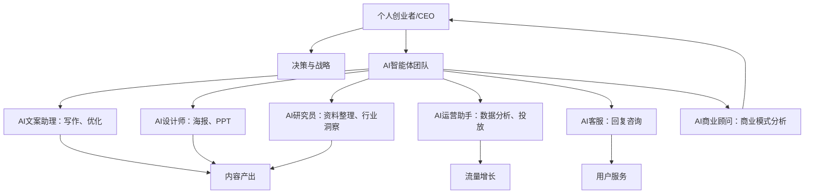
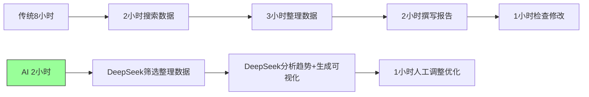
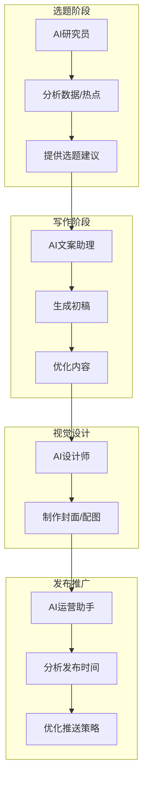
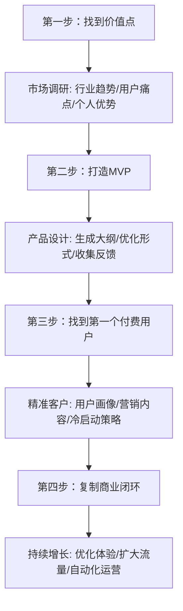
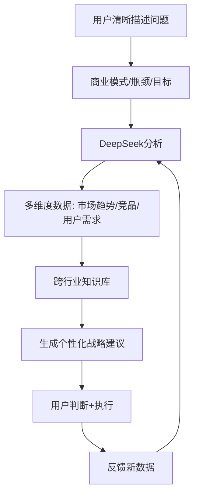

# 《AI新个体：用DeepSeek重塑一人公司》章节总结

## 书籍信息
- 书名：AI新个体：用DeepSeek重塑一人公司
- 作者：鱼堂主；阿猫
- 出版社：人民邮电出版社
- 出版时间：2025年4月
- ISBN：9787115670236
- 字数：67千字

## 目录说明
- 目录识别情况：完整识别，包含序言、第一章至第六章及附录。
- 章节对应依据：基于OCR文本中的标题层级。
- OCR修复说明：文本识别基本完整，个别页码标记不连续，但内容连续。图表未以图像形式提供，仅文字描述，故无法重建精确视觉图，但可根据描述提炼逻辑关系。

## 全书核心主题
本书围绕“一人公司2.0”模式展开，核心观点是：DeepSeek等AI工具不是简单的效率工具，而是认知放大器、虚拟员工和商业杠杆。普通人可以通过AI重构学习方式、工作方式和商业模式，以“个人+AI团队”的形式打造智能化一人公司。全书从认知觉醒、效率革命、组织新生、实用技巧、创业全流程、职场提效等多个维度，提供了大量实操方法和案例，强调AI时代竞争的核心是“你+AI”与“别人+AI”的竞争，认知差距将成为最大的贫富差距。

---

## 序言

### 核心论点
问题：如何让普通人快速感受到AI的强大并抓住时代机遇？  
观点：DeepSeek等AI模型的出现是普通人的“改命机遇”，其影响力不亚于房地产、互联网、公众号、短视频等重大浪潮。AI已成为作者的“认知加速器”和“效率放大器”，每个人都可以通过AI实现10倍效率提升。

### 关键概念/事件
- 口头写作：使用豆包App的“文字润色官”AI智能体，将语音转化为条理分明的文字并润色，15分钟完成3000字文章初稿。
- 认知加速器：遇到难以阐释的概念时，与AI对话5分钟即可获得全面解释，将过去数月的研究时间缩短到几分钟。
- 实操课程配套：作者提供免费实操课程，在公众号“阿猫读书”回复“拥抱AI”即可领取。

### 逻辑推演/叙事脉络
作者从自身创作经历出发：以往写3000字文章需1小时，现在用AI口头写作15分钟完成初稿；以往概念阐释需查阅大量资料，现在与AI对话5分钟解决。进而断言AI将渗透生活各方面（智能导航、智能家居、海报设计、课程大纲等）。最后对比历史机遇（房地产、互联网、公众号、短视频），认为AI时代的机会更大，鼓励读者拥抱AI。

### 经典金句/数据
> “以往，要完成一篇3000字左右、逻辑清晰且内容充实的文章，我差不多要全神贯注地花费一小时。但现在，……15分钟左右，一篇高质量的文章初稿就呈现在眼前。”
> “过去可能要耗费一年半载才能解决的知识难题，现在短短几分钟就能迎刃而解。”
> “AI时代带来的机遇，其影响力丝毫不亚于这些改变时代进程的重大事件。”

---

## 第一章：AI时代的一人公司革命

### 第一节：从个体户到智能商业体的进化

#### 核心论点
问题：AI如何改变一人公司的定义和运作方式？  
观点：AI时代的一人公司是由个人主导、AI智能技术辅助的小型商业体，其核心优势在于商业闭环和可复制性。一人公司不再单打独斗，而是“一个人+AI智能体员工”的团队协作模式。

#### 关键概念/事件
- 商业闭环：业务体系能够自我驱动、持续盈利（如自媒体、社群营销、知识付费环环相扣）。
- 可复制性：数字产品（在线课程、社群内容等）可重复销售，边际成本极低。
- AI赋能领域：内容创作（辅助写作、营销文案）、客户服务（智能客服）、市场分析（数据分析）、自动化运营（社群管理、私域营销）。

#### 逻辑推演/叙事脉络
作者从自身创业经历出发：早期亲力亲为所有环节（编辑、文案、产品、销售、运营、客服），导致精力高度紧张。AI出现后，以写作为例，将基础编辑工作交给AI，节省时间。进一步指出AI让个体像企业一样运作，打破时间和人力局限。最后强调一人公司的低成本运作（无办公场地、无人员开支）和可扩展性（逐步增加远程助理或外包）。

#### 流程图：一人公司AI团队协作模式

#### 经典金句/数据
> “一人公司2.0模式正式开启——让AI成为你的第二大脑。”
> “一人公司的核心优势：商业闭环、可复制性。”
> “在AI的协助下，一人公司就可以承担更多职能，例如产品设计、营销推广、数据分析等。”

---

### 第二节：认知觉醒：用AI重构你的大脑

#### 核心论点
问题：为什么传统学习方式效率低下？AI如何重构学习？  
观点：传统学习是“线性”的（一页一页啃书），效率极低。AI将学习方式从“无目标囤积式”转变为“即时应用式”，通过精准式、筛选式、对话式、即时验证式学习，让学习效率提升10倍。AI时代的竞争是“你+AI”与“别人+AI”的竞争。

#### 关键概念/事件
- 问答式学习：AI时代回归最原始但最高效的学习方式——直接提问，AI回答。
- 精准式学习：不用翻几十页书，直接问AI获取答案。
- 筛选式学习：让AI筛选核心知识点，忽略低效信息。
- 对话式学习：像与导师交流一样持续追问。
- 即时验证：AI可马上测试学习成果。

#### 逻辑推演/叙事脉络
作者指出过去学习方式的四个问题：个人思维局限、思考广度深度不够、信息过载失去焦点、凭感觉做判断。然后提出DeepSeek可作为“认知放大器”，帮助打破认知盲区。以学习“商业模型”为例，对比传统方法（买书啃几个月）和AI方法（直接解释、推荐、模拟、生成计划书）。结论：今天不用AI，未来可能被AI淘汰。

#### 经典金句/数据
> “AI时代的全新竞争，不仅是个人能力较量，更是‘你+AI’和‘别人+AI’的竞争。”
> “认知觉醒，从用AI开始。”
> “如果你现在不学会用AI，那就意味着你每天都在浪费自己最宝贵的资源——时间。”

---

### 第三节：效率革命：DeepSeek深度工作法

#### 核心论点
问题：如何用AI彻底改变工作逻辑，从低效重复劳动中解放出来？  
观点：过去的工作方式依赖个人经验积累和精力投入，效率低下。DeepSeek深度工作法的核心是让AI处理低效重复任务，让人专注于高价值深度工作。未来高效人士是能管理AI的人，而不是仅仅管理时间的人。

#### 关键概念/事件
- 深度工作法：将市场分析报告从8小时压缩到2小时以内（AI筛选数据、分析趋势、生成可视化报告）。
- AI行业顾问：模拟资深专家思维，帮助新人快速理解行业术语、趋势、案例，避开常见误区。
- 优先级筛选：利用DeepSeek区分“重要的事”和“紧急的事”，避免在低价值任务上浪费时间。
- 一人公司提速：写书从5-6个月缩短到1个月。

#### 逻辑推演/叙事脉络
作者先列举低效工作场景（整理会议纪要、做项目方案、写报告、写邮件），指出根源是依赖个人经验。然后提出DeepSeek深度工作法：以市场分析报告为例，对比传统8小时流程与AI2小时流程。进一步说明AI可充当行业顾问、任务筛选工具。最后以自己的公司为例，写书流程提速5倍以上，强调工作方式从“手动模式”进化到“AI模式”。

#### 流程图：AI辅助市场分析报告流程

#### 经典金句/数据
> “过去的高效人士，是能管理时间的人；未来的高效人士，是能管理AI的人。”
> “不是AI取代你，而是‘你+AI’取代不会用AI的人。”
> “以前写一本书至少要5-6个月，现在最快1个月就能写完。”

---

### 第四节：组织新生：一人公司的AI团队架构

#### 核心论点
问题：如何从单打独斗升级为“个人CEO+AI员工团队”的组织形态？  
观点：一人公司2.0不再是个人单打独斗，而是个人与无数AI员工组成的智能化团队。你就是CEO，AI负责执行。通过建立AI工作流，可以实现自动化运营和指数级成长。

#### 关键概念/事件
- AI员工岗位：AI文案助理、AI设计师、AI运营助手、AI客服、AI研究员、AI商业顾问。
- 核心业务确定：明确你的价值主张和盈利模式（自媒体内容生产、知识付费等）。
- 任务拆解：将工作流程拆解并分配给不同AI员工（如选题→AI研究员，写作→AI文案助理，配图→AI设计师，推广→AI运营助手）。
- AI工作流：整合不同AI工具协同工作，例如从选题到发布的全自动内容创作系统。

#### 逻辑推演/叙事脉络
作者首先对比过去一人公司依赖的三个核心能力（内容输出、产品打造、流量运营）——必须亲力亲为，效率极低。然后提出AI时代可以雇佣智能AI团队，每个AI员工承担不同岗位职能。接着详细说明如何运作：第一步选定核心业务，第二步拆解任务分配AI助手，第三步建立AI工作流。最后强调AI时代最重要的认知升级：你不是一个人在战斗。

#### 流程图：AI内容创作工作流

#### 经典金句/数据
> “你不再是一个人在战斗，而是你与无数AI员工共同组成的智能化团队在战斗。”
> “你就是CEO，AI是你的团队成员。你负责决策，AI负责执行。”
> “一个人如果不会用AI，他的成长就只是线性的；但如果他能高效运用AI，他的成长甚至可以是指数级的。”

---

## 第二章：认知革命：为什么普通人更需要AI杠杆

### 第一节：AI时代，普通人有哪些新机会

#### 核心论点
问题：普通人缺资源、缺背景、缺经验，AI如何补齐短板？  
观点：AI是普通人最难得的跃迁机会，它可以像“随身顾问”一样提供商业建议、行业报告、决策优化，让普通人在信息层面不输给起点更高的人。AI的杠杆效应能撬动原本不属于普通人的机会。

#### 关键概念/事件
- 普通人缺失的三样东西：资源（资金、人脉）、经验（行业规则、产品打法）、试错机会（失败成本高）。
- AI作为“随身顾问”：替代专业咨询师、行业报告订阅、创业导师指点。
- 杠杆效应：用AI轻松撬动原本不属于你的机会。
- 加速分化：不会用AI的人还在低效重复劳动，会用AI的人已经优化商业决策。

#### 逻辑推演/叙事脉络
作者指出成功创业者往往站在更高起点（家族从商、朋友深耕行业、投资人支持）。普通人缺资源、经验、试错机会。AI出现后，普通人可以免费获得顶级顾问级别的建议。以创业为例，传统方式需要从零摸索、痛苦试错；AI时代可以直接用AI做市场调研、竞品分析、商业计划书、优化广告、客户服务。结论：AI是这个时代的“杠杆”，普通人若想突破天花板，必须学会使用AI。

#### 经典金句/数据
> “如果你没有资源、没有背景、没有经验，也没有多少试错的机会，那你比任何人都更需要AI。”
> “普通人突然获得了‘外挂’——原本需要花几年时间积累的经验，现在通过AI，几天就能得到答案。”
> “你不一定要成为AI的开发者，但你一定要成为AI的使用者。”

---

### 第二节：如何用DeepSeek打开认知，让你聪明10倍

#### 核心论点
问题：为什么仅靠自己很难打破认知？DeepSeek如何帮助深度思考？  
观点：认知局限源于思维路径依赖、视角单一、信息过载和凭感觉判断。DeepSeek可以跨学科思考、填补思维盲区、整合碎片化信息为系统化框架，帮助实现从“聪明”到“聪明10倍”的跨越。

#### 关键概念/事件
- 认知难以打破的四个原因：个人思维局限、思考广度深度不够、信息过多失去焦点、凭感觉做判断。
- 深度思考反思框架：背景（问题属于哪些领域）、原因（核心是什么）、可能路径（如何用跨学科分析）。
- 触点扩展法：学习新概念时，主动关联其他领域知识（如二八法则关联机会成本、资源分配）。
- 从静态学习到动态思维：AI能实时反馈盲点和逻辑漏洞，帮助主动反思假设。

#### 逻辑推演/叙事脉络
作者先指出传统认知提升依赖他人分享新观点，然后分析为什么自己很难打破认知（四个原因）。提出深度思考的核心是“对自己思考过程的反思”。然后介绍“触点扩展法”。接着以DeepSeek为例，给出打破认知盲区的三个方法：跨学科思考、快速整合信息、填补思维盲区。最后从四个方面说明AI让人从“聪明”到“聪明10倍”：碎片化→系统化、静态学习→动态思维、快速迭代、AI作为辅助伙伴。

#### 经典金句/数据
> “对自己思考过程的反思，就是突破认知局限的核心。”
> “我们人类是有思维路径依赖的，即思考问题喜欢用熟悉的解决思路，但是DeepSeek没有，它每次思考时应用的都是全新的思维。”
> “真正的聪明，不仅依赖于知识的积累，还要依赖于多角度的思考、深度的分析和持续的自我更新。”

---

### 第三节：DeepSeek重构大脑，AI时代的认知觉醒

#### 核心论点
问题：AI如何重构大脑的工作方式，实现从信息筛选到直接思考、从单点思维到系统思维、从经验判断到数据决策？  
观点：DeepSeek能帮助减少无效认知负担、打破线性思考模式、避免主观偏见、实现10倍学习效率。认知差距将成为AI时代最大的贫富差距。

#### 关键概念/事件
- 从“信息筛选”到“直接思考”：DeepSeek过滤信息，直接生成文章大纲，作者从3-4天资料整理缩短到AI快速提炼。
- 从“单点思维”到“系统思维”：AI自动关联不同领域知识（如健身房续费率问题，结合心理学、市场营销、经济学分析）。
- 从“经验判断”到“数据决策”：AI基于海量数据避免情绪偏见（如双十一选品，AI发现便携搅拌杯替代榨汁机的趋势）。
- 从“低效学习”到“精准吸收”：直接提问获得精准答案，避免阅读300页书只用到2-3条原则。

#### 逻辑推演/叙事脉络
作者指出传统学习方式存在信息筛选困难、单一思维模式、学习成本高等局限。然后分四个维度说明DeepSeek如何重构大脑：减少认知负担（写作案例）、系统思维（健身房案例）、数据决策（电商选品案例）、精准学习（销售文案案例）。最后强调AI时代认知差距是最致命的差距，不是AI抢饭碗，而是别人用AI变得更强。提醒现在不入门，未来门槛更高。

#### 经典金句/数据
> “写完文章后，以前我只能靠自己校对……现在，我可以先把文章交给AI审核，它会自动核查案例、优化逻辑。”
> “过去，我们学习方式是‘先囤知识，再找机会应用’，可很多时候我们学了许多内容，真正能用上的却不到20%。”
> “AI时代，认知差距才是最大的贫富差距。”
> “现在正是AI时代的‘窗口期’，如果你现在不学，未来可能真的要花更多时间、更多成本，才能追上来。”

---

### 第四节：用DeepSeek三大核心能力，帮你认知升级

#### 核心论点
问题：DeepSeek的三大核心能力是什么？如何利用它们提升学习与工作效率？  
观点：DeepSeek具备内容推理、数据搜索、知识调研三大能力，分别解决思维混乱、信息检索低效、碎片化学习的问题，帮助用户建立清晰的逻辑框架、精准提取关键信息、系统化掌握新领域知识。

#### 关键概念/事件
- 内容推理：构建逻辑框架、深度分析问题、优化表达方式。例如针对“AI在金融行业的应用”，DeepSeek自动划分银行、保险、投资等领域。
- 数据搜索：精准提问、筛选权威来源、提炼关键信息。例如询问“2023年全球电动车市场份额排名”，DeepSeek整合最新行业报告直接输出数据。
- 知识调研：快速建立知识体系、通俗化解读专业概念、推荐权威学习资料。例如学习人工智能时，输入“请提供人工智能领域的基础知识框架”，获得系统化学习指南。

#### 逻辑推演/叙事脉络
作者先提出知识工作者面临的三个挑战（思维混乱、缺乏方向、难以获取权威信息）。然后分别介绍三大能力，每个能力都包含“问题—解决方案—具体示例”的结构。最后总结：人与人之间比拼的不是谁掌握的信息更多，而是谁能够更好地利用AI处理信息。

#### 经典金句/数据
> “DeepSeek不仅是一个搜索工具，更像是一个智能思维助手，能够帮助我们优化学习与工作方式，提升思考深度和决策质量。”
> “学会使用DeepSeek，不仅能够提升个人竞争力，还能在未来的智能化时代抢占先机。”

---

## 第三章：使用DeepSeek的必备技巧

### 第一节：深度理解AI的类型：工具型与脑力型

#### 核心论点
问题：为什么传统的“写指令”方式对DeepSeek行不通？  
观点：DeepSeek属于“脑力型AI”（野生军师），而非“工具型AI”（听话的机器人）。使用脑力型AI的关键是讲清楚背景故事，而不是发指令。三个野路子心法：说人话、暴露弱点、让AI替你试错。

#### 关键概念/事件
- 工具型AI：执行力强但呆板，只能执行明确指令（如翻译、缩写、查资料）。
- 脑力型AI：能像顾问一样进行复杂决策，需要用户讲清楚背景。
- 错误提问 vs 正确提问：小白问“开一人公司的流程”得到百科式答案；有经验者说“存款6万，怕亏光，会写文案但接不到单”，DeepSeek给出“技能+信息差”个性化建议。
- 三个心法：先说“人话”（别装腔作势）、暴露弱点（AI喜欢真实的你）、让AI替你试错（如“怎么改成抖音风”）。

#### 逻辑推演/叙事脉络
作者先指出很多人用“给领导写报告”的方式与AI互动，这在DeepSeek上行不通。然后区分工具型AI和脑力型AI。通过一人公司创业案例对比错误和正确提问方式。最后给出三个心法，强调DeepSeek的优势是提供个性化的商业顾问级建议。

#### 经典金句/数据
> “DeepSeek可不是普通的‘答题机器’，而是一个真正会‘动脑’的AI。”
> “脑力型AI堪称‘野生军师’。这种AI能像一个真正的顾问一样，帮助你进行复杂的决策。但有一个重点：它需要你讲清楚背景故事，而不是单纯发指令。”
> “暴露弱点比装完美更有效。”

---

### 第二节：与AI沟通的效率革命：从书面到口语

#### 核心论点
问题：为什么口语化交流比书面指令更高效？  
观点：打字速度（50-80字/分钟）远低于说话速度（120-150字/分钟），且口语中“废话”往往是AI推理的关键线索。三个心法：用抱怨代替提问、允许自己说半句话、把DeepSeek当“杠精朋友”。口语化能让AI发挥更大潜力。

#### 关键概念/事件
- 效率数据：打字50-80字/分钟，说话120-150字/分钟，口语是打字的两倍。
- 口语中的细节：如“存款焦虑”“经验年限”等看似无关的细节，成为AI给出精准风险对冲策略的关键。
- 三个心法：用抱怨代替提问（如“气死了！甲方拼命压价”）、允许说半句话（如“我想做餐饮……对了，现在抖音上那个…”）、把AI当杠精朋友（让AI找出计划中最可能崩盘的三个点）。
- 技术背景：主流大模型训练数据中书面语和口语比例约为3:7，AI更擅长理解自然表达。

#### 逻辑推演/叙事脉络
作者先批评80%的用户仍用书面指令与DeepSeek互动，本质上是用搜索引擎的逻辑驱动智能工具。然后对比打字和口语的效率差异，以设计师转型案例说明口语交流如何让AI给出深度追问和灵活方案。接着给出三个心法，最后从技术角度解释口语化能激发AI潜力。

#### 经典金句/数据
> “普通人打字的速度是每分钟50～80字，而说话的速度是每分钟120～150字，大概是打字速度的两倍。”
> “那些看似随口说出的‘废话’，反而成了DeepSeek能够理解问题上下文的关键。”
> “与其拘泥于书面表达，不如用更自然、更贴近生活的方式与DeepSeek交流。”

---

### 第三节：破解DeepSeek的“思考黑箱”：如何避免被AI误导

#### 核心论点
问题：AI给出的答案可能误导用户，如何利用DeepSeek的“深度思考”推理过程避免陷阱？  
观点：DeepSeek的“深度思考”模式展示了推理过程，用户应像查错题本一样检查AI的推理步骤，找出“跳跃式结论”，并让AI自己反驳自己，从而避免被误导。

#### 关键概念/事件
- 场景一（副业选择）：直接问“做什么副业最赚钱”得到自媒体、电商等通用答案；使用深度思考后，AI推理出78%的人副业赚不到3000元，结合小琳每天只有2小时且无特殊技能，推荐“代购超市打折菜”。
- 场景二（房产投资）：AI直接说“现在是买房好时机”，但深度思考显示参考数据是2021年的，且假设收入稳定增长，实际企业可能裁员，最终建议“租房+定投指数基金”。
- 破解三步法：检查推理过程（考虑因素、排除选项、风险）、找出跳跃式结论（追问“怎么从A跳到B”）、让AI自己反驳自己（假设你是毒舌朋友吐槽建议）。

#### 逻辑推演/叙事脉络
作者通过两个场景展示直接答案与深度思考结果的差异。然后给出三步法，并以小明副业为例说明如何检查AI假设（默认他能早上5点起床）。最后提供实践清单：提问必看推理过程、重点检查三处（猜测情况、过时信息、致命弱点）、定期复盘。

#### 经典金句/数据
> “当你提问时，不仅要关注答案本身，还要关注DeepSeek给出答案时的推理过程。”
> “这种反向思维能够帮助你识别AI思维中的‘跳跃性’结论，并找到更适合自己的解决方案。”
> “让DeepSeek自己反驳自己……避免盲目跟从AI的建议。”

---

### 第四节：破解DeepSeek的“黑话”：如何让AI说“人话”

#### 核心论点
问题：DeepSeek经常输出专业术语、抽象概念和“学霸”式回答，如何让它说人话？  
观点：通过魔法指令（绑定身份标签、场景具象化、限制知识水平）和魔法后缀（如“用小学生能听懂的话解释”），可以让DeepSeek将“黑话”翻译成通俗易懂的“人话”。

#### 关键概念/事件
- 三种崩溃模式：“黑话”模式（术语堆砌）、抽象模式（模糊概念）、学霸模式（专业理论）。
- 破解咒语示例：“请用菜市场卖土豆的大妈能听懂的话解释”“举个具体例子”“别用课本术语！直接告诉我第一步做什么”。
- 魔法指令：绑定身份标签（“假设我是刚毕业的大学生，卖过奶茶但没做过线上生意”）、场景具象化（“如果开的是社区文具店，怎样才能让小学生每天都想来”）、限制知识水平（“用教幼儿园小朋友数糖果的方式说明”）。
- 人话改造工具箱：魔法后缀（“用小学生能听懂的话解释”）、紧急救援（“停！请用小学生能理解的话重说一遍”）、自查清单。

#### 逻辑推演/叙事脉络
作者先以“如何提升小红书流量”为例，展示DeepSeek输出“需优化CTR指标，结合UGC生态构建用户心智”等黑话，指出这不是用户的错。然后分类三种崩溃模式并给出对应破解咒语。接着提供三条魔法指令，并用副业选择、健身计划等案例展示前后对比。最后给出立刻能用的人话改造工具箱。

#### 经典金句/数据
> “每个字都认识，可连起来却完全不明白是什么意思。其实，这并不是你的错，而是DeepSeek默认了你是一个专家。”
> “魔法指令：假设我是刚毕业的大学生，卖过奶茶但没做过线上生意，请用摆摊经历中的元素比喻流量池。”
> “让DeepSeek说‘人话’，就是这么简单！”

---

## 第四章：用DeepSeek打造一人公司

### 第一节：用DeepSeek搭建一人公司的全流程

#### 核心论点
问题：从零到可持续盈利的一人公司需要哪些步骤？AI如何赋能每个环节？  
观点：一人公司搭建四步法——找到价值点（市场调研）、打造MVP（最小可行产品）、找到第一个付费用户、复制商业闭环。AI在每一步都扮演市场分析师、产品策划师、营销顾问的角色。

#### 关键概念/事件
- 第一步：用DeepSeek分析行业趋势、挖掘用户痛点、评估个人优势。
- 第二步：用DeepSeek设计MVP（生成课程大纲、优化产品形式、分析用户反馈）。
- 第三步：用DeepSeek获取精准客户（描绘用户画像、优化营销内容、制定冷启动策略）。
- 第四步：用DeepSeek复制成功模式（优化用户体验、扩大流量渠道、构建自动化流程）。

#### 逻辑推演/叙事脉络
作者先提出一人公司成功依赖有价值的产品或服务。然后分四步详细说明每个步骤中AI的具体用途。每一步都包含“如何用DeepSeek”的操作指令示例和结果预期。最后强调AI让个人创业从“个体努力”转变为“系统化运营”。

#### 流程图：一人公司搭建四步法

#### 经典金句/数据
> “一人公司不再意味着孤军奋战，而是意味着你可以借助AI工具搭建一个‘智能化团队’。”
> “AI不仅是一个工具，更是你的市场分析师、产品策划师、营销顾问。”

---

### 第二节：如何让AI做你的自媒体知识库

#### 核心论点
问题：创作者如何解决灵感枯竭、知识管理混乱、效率低下、输出质量不稳定的问题？  
观点：通过AI（特别是ima平台）搭建个人知识库，实现“存、找、用、合”的知识闭环。聚焦一个领域，建立知识点拆解库、基础方法模型库、实战案例库，通过高频实战（拆解、练习、复盘）将知识转化为能力，最终实现知识变现。

#### 关键概念/事件
- 传统知识管理局限：资料零散、依赖大脑记忆、重复劳动。
- AI知识库四大目标：随时存储、随时查找、随时应用、随时整合。
- ima平台功能：上传文件到个人知识库，AI自动分类、提炼要点；直接提问快速检索；调用知识生成内容；整合形成个人观点。
- 三大核心知识库：知识点拆解（概念清晰化）、基础方法模型库（方法论可执行）、实战案例库（真实案例拆解）。
- 高频实战三步：每天拆解5个知识点、每天使用1个知识点应用到实战、复盘优化形成闭环。

#### 逻辑推演/叙事脉络
作者先列出创作者四大难题，然后对比传统方式（手写笔记、文件夹分类）的弊端。接着介绍ima平台如何实现存、找、用、合。再给出高效积累知识的四步：第一步选择一个领域深耕；第二步建立三大核心知识库；第三步通过拆解、练习、复盘高频实战；第四步知识变现（先测试、沉淀产品、分阶段提升）。

#### 经典金句/数据
> “借助AI和系统化方法，我们能够在短时间内完成高效的知识积累，并实现持续输出，让个人品牌影响力不断提升。”
> “研究任何学习方法，都不如真正去实践有意义，只有实际运用知识才能有切实体会。”
> “知识变现并非简单的赚钱，而是运用知识取得成果后，获得反馈，并持续优化。”

---

### 第三节：如何用AI跑通第一个赚钱的项目

#### 核心论点
问题：普通人如何从零开始，用AI搭建一个能赚钱的知识型项目（以AI读书项目为例）？  
观点：第一步做“AI工具人”提供价值（图书摘要、书单推荐、资料整理）；第二步利用“信息差”产品化（整理文章、书评、攻略）；第三步参与别人项目或自己做社群/课程；第四步跑通完整的商业闭环（确定主题→列出要点→确定框架→写成文章→做成课程→引流→分销→升级）。

#### 关键概念/事件
- 从兴趣到商业闭环：只是热爱读书是兴趣，靠读书赚钱必须思考知识变现。
- AI工具人的服务：生成5分钟图书精华、关键金句摘录、主题书单、个性化书单、整理学习资料、输出思维导图、AI解读短视频。
- 信息差生意：大多数人没时间搜索整理，AI可快速整合。
- 产品化路径：参与别人项目→做书单社群→做课程（如何用AI高效阅读）→做付费读书会。
- 跑通闭环十步：确定主题→列出50个关键词→确定模板框架→写成50篇文章→整理成课程→制作海报建群→分销→早期重销量→引流私域→围绕私域研发产品。

#### 逻辑推演/叙事脉络
作者先指出很多人做自媒体凭兴趣，无法变现。然后以AI读书项目为例，分四步讲解：第一步用AI提供解读、书单、资料整理等工具人服务；第二步将信息差转化为产品（文章、书评、攻略）；第三步参与项目或自己做社群/课程；第四步详细拆解十步闭环。最后强调不要只“学会使用AI”，要用AI创造实际商业价值。

#### 经典金句/数据
> “人们愿意为价值买单，而不是为你的个人兴趣买单。”
> “自媒体的本质是关于‘信息差’的生意。”
> “最重要的不是‘学会使用AI’，而是要利用AI去创造实际的商业价值。”

---

### 第四节：用AI重塑自媒体创作生态——从“写作”到“调教”

#### 核心论点
问题：AI如何改变自媒体创作的核心竞争力？  
观点：未来自媒体创作可能不再需要亲自写作，因为大多数人写作能力不足以在竞争中脱颖而出。AI生成60分的内容，创作者的竞争将转向“调教AI”的能力——通过多次指令将内容从60分提升到80分甚至更高。此外，AI让个体也能实现“自媒体矩阵”玩法，通过大量产出内容获取平台流量。

#### 关键概念/事件
- 调教AI的关键指令：“不够具体，要更加具体”“缺少例子”“AI味太重，参考这篇风格”“太浅显，要深刻一点”“开头不够吸引人，参考爆款”。
- 自媒体矩阵：过去只有机构能用大量账号和人力获取流量；现在个体借助AI可以同时运营多个账号，产出大量内容。
- 流量分配逻辑：平台不仅看内容质量，还看输出量。有时候流量关键在于是否足够“努力”（产出量大）。

#### 逻辑推演/叙事脉络
作者先提出颠覆性观点：未来自媒体创作可能不再需要亲自写作。原因是大部人写作能力不足，提升需要一两年时间，而AI生成的内容已达60分。然后说明AI助力选题（让AI找热门选题）、内容生成（口述转文字）、调教提升（5次以上调整）。接着介绍AI赋能的矩阵玩法。最后指出AI并非万能，需要创作者的调教能力和市场敏锐度，保持独立思考和创新精神。

#### 经典金句/数据
> “在未来，自媒体创作可能不再需要创作者亲自写作。”
> “未来自媒体创作者之间的竞争将不再是写作能力的比拼，而是看谁能更好地调教AI，将其输出的内容从60分提升到80分甚至更高。”
> “平台分配流量不仅看内容质量，还看创作者的输出量。”

---

### 第五节：AI赋能销售：从内容创作到客户转化

#### 核心论点
问题：如何利用AI进行销售，特别是朋友圈文案和私信谈单？  
观点：新手应从分销别人产品开始。AI可以生成高质量朋友圈文案（通过豆包App的“朋友圈文案”智能体），并通过调教让文案从60分到80分。AI销售助手可以扮演“销冠”角色，自动回复客户咨询，化解价格异议等，大幅提升销售效率。

#### 关键概念/事件
- 分销起点：不需要从零打造产品，销售已验证产品，降低风险，快速掌握销售技能。
- 朋友圈文案AI生成：在豆包App中搜索“朋友圈文案”智能体，输入产品信息和风格要求，生成10条不重复文案。
- AI销售助手：创建智能体时设定“你是销冠”，客户问“产品太贵了”时，AI回复强调性价比、陪伴式指导、学员案例等。
- 未来展望：当客户也会用AI时，将是AI与AI之间的战斗，谁能更好调教AI谁就占优势。

#### 逻辑推演/叙事脉络
作者先建议从分销开始。然后以朋友圈为核心私域触点，介绍豆包App的朋友圈文案智能体。举例销售“觉醒创富社”社群产品，输入基本信息后AI生成10条文案，并可进一步调教（加幽默感、模仿风格、突出卖点）。接着介绍AI销售助手处理私信咨询，设定为“销冠”后能巧妙化解价格异议。最后展望未来AI对AI的销售竞争。

#### 经典金句/数据
> “你只需要将产品信息输入这个AI智能体中，它就能帮助你高效地回复客户咨询。”
> “在设定AI时，你可以明确指出‘你是销冠’。这样一来，当客户提出诸如‘你的产品太贵了’这样的问题时，AI的回复就会非常精彩。”
> “未来，当我们的客户也都会用AI的时候，他或许也会在讨价还价时使用AI，那就是AI和AI之间的战斗了。”

---

## 第五章：钢铁侠同款智能管家上线！让AI成为你的24小时全能助手

### 第一节：用好AI助理，必须要有老板心态

#### 核心论点
问题：为什么很多人感受不到AI的价值？如何才能真正用好AI助理？  
观点：缺乏实际业务需求、习惯亲力亲为、不善于外包事务是三大障碍。使用AI需要“老板心态”——敢于分配任务、信任AI能力、给予充分机会展示能力。学会将琐碎事务外包给AI，才能腾出时间专注于高价值工作。

#### 关键概念/事件
- 智能手机类比：AI如同当年的智能手机，需要时间普及，现在认知和实践领先的人将占优势。
- 老板心态：不是简单指挥，而是懂得合理分配任务，充分信任“员工”能力。很多人问几句发现答案不如预期就放弃，如同招聘一个员工只问了几个问题就拒绝。
- 外包思维：时间紧张时请家政打扫屋子，同样道理，购物清单、数据录入、行程安排等都可交给AI。

#### 逻辑推演/叙事脉络
作者先以智能手机普及过程类比AI现状，指出现在仍是窗口期。然后分析三个导致无法感受AI价值的原因：缺乏业务需求、缺乏外包心态、不善于发现可外包事务。接着强调老板心态的重要性，以招聘员工为例说明不能轻易放弃AI。最后建议学会将琐碎事务外包给AI，让自己专注于创造性工作。

#### 经典金句/数据
> “使用AI却截然不同，此时你摇身一变成了‘老板’，AI就是你的‘员工’。”
> “一次简单的问答交流，远远无法让AI展现出全部实力。我们需要深入探索它的功能，精心设计问题，逐步引导它给出更优质的答案。”
> “当我们的时间很紧张时，就不必亲自打扫屋子，而是可以将这项工作外包给家政人员。”

---

### 第二节：把AI当作超级助理，效率提高10倍

#### 核心论点
问题：豆包App的AI智能体如何成为超级助理？有哪些实用的智能体案例？  
观点：豆包App的AI智能体解决了一个关键痛点——避免重复输入指令。用户可以创建个性化智能体（如口语写作、添加固定开头结尾、高情商回复、智能买菜、智能秘书、文案大白话），让AI自动完成特定任务，大幅提升效率。

#### 关键概念/事件
- AI智能体优势：一次性设定描述指令（风格、要求），之后直接“扔”给智能体即可自动处理。
- 助理1号口语写作：按住按钮说话，自动转化为优化后的文字。作者外出灵感闪现时用手机记录，以前只能记要点，现在完整记录并优化。
- 助理2号添加固定开头结尾：每天写日课，智能体自动添加第几天、内容概括、结尾提醒。
- 助理3号高情商回复：别人感谢时，智能体生成温暖亲切的回应。
- 助理4号智能买菜：输入口味偏好（如清淡），智能体推荐荤素搭配的菜谱。
- 助理5号智能秘书：口语说出待办事项，智能体自动总结清单、添加任务、划掉已完成。
- 助理6号文案大白话：将晦涩难懂的话转化为简单直白的表述。

#### 逻辑推演/叙事脉络
作者先介绍豆包App的AI智能体核心亮点。以文章修改为例，对比每次输入“帮我修改文章”的繁琐和创建智能体后一键处理的便捷。然后详细展示6个实用智能体的创建方法和使用效果，每个都配有具体案例和截图描述。最后展望未来人人拥有如钢铁侠贾维斯般的AI助理。

#### 经典金句/数据
> “AI智能体切实解决了一个我们在使用AI过程中频繁遭遇的关键痛点……如果每次都重复输入冗长的起始指令，时间一长，这种重复性操作不仅耗时费力，还极易让人产生厌烦情绪。”
> “如此神奇的AI智能体该如何创建呢？其实操作过程简单得超乎你的想象。”
> “千万别被‘AI智能体’这个看似高深莫测的词吓住，大胆尝试，你会发现一个全新的高效世界正为你敞开大门。”

---

### 第三节：把AI当作生活顾问，优化生活方式

#### 核心论点
问题：AI如何帮助理财规划、情绪管理和日常倾诉？  
观点：DeepSeek可以作为理财顾问（分析财务健康度、找出消费黑洞）、情绪顾问（基于神经科学建议运动、调节激素）、以及随时在线的倾听者（心理咨询AI智能体，通过反问引导思考）。

#### 关键概念/事件
- 理财顾问：输入月薪、固定支出、存款、目标（如三年存30万首付），DeepSeek输出诊断报告：月储蓄率、消费黑洞（如周末酒吧消费）、风险预警（活期存款损失潜在收益）。
- 情绪顾问：基于多巴胺、内啡肽、催产素、皮质醇等激素机制。作者压力大时，DeepSeek建议每隔一段时间伸展运动、听音乐，降低皮质醇，促进内啡肽和多巴胺分泌。具体数据：每周三次有氧运动，每次30分钟，可将皮质醇降低20%。
- 心理咨询AI智能体：可语音交流，AI会反问引导（如“你的主要业务是什么？是不是目标定得太高了？”），帮助梳理问题。

#### 逻辑推演/叙事脉络
作者先指出一人公司不仅是商业能力集合，还应涵盖理财、健康、情绪等生活领域。然后分三个场景：理财顾问（输入财务数据获得诊断报告）、情绪顾问（基于化学激素的运动建议）、倾诉伙伴（AI智能体通过反问引导思考）。每个场景都有具体指令示例和效果描述。

#### 经典金句/数据
> “它就会根据我当时的身体状况和运动习惯，给出详细的分析和建议……通过每周进行三次有氧运动，每次30分钟，可以将我的皮质醇水平降低20%左右。”
> “我们每个人都有这样的时刻，心里装满了烦恼，渴望向别人倾诉……但是当我开始向AI智能体倾诉烦恼后，我发现它随时随地都在这里。”
> “AI的反问过程其实也是不断促进你思考的过程，随着交流的深入，问题的答案就会逐渐浮出水面。”

---

### 第四节：把AI当作行动顾问，从知道到做到

#### 核心论点
问题：如何借助DeepSeek拆解概念，将知识转化为行动？  
观点：一个人能理解多少概念及理解深度决定了他有多聪明。通过指令“请帮我把这个概念拆分成至少5个最重要的要素”，DeepSeek可以生成公式化拆解（如一人公司利润公式）。拆解后追问“有哪些可执行的方法”，即可从“知道”跨越到“做到”。但需辩证看待AI建议，保持判断力。

#### 关键概念/事件
- 拆解指令：“我想要理解这个概念，请帮我把这个概念拆分成至少5个最重要的要素，并且用中文的形式进行表达。”
- 一人公司利润公式：利润= [流量×转化率×客单价×（1+用户推荐值）] - 总成本（表5-1展示了5大核心要素拆解）。
- 拆解的意义：避免单一视角，获得“老板视角”。很多人对“公司”的理解仅限于产品，忽略“获取客户”（流量）等关键环节。
- 从知道到做到：拆解后继续问“有哪些可执行的获取流量的方法”，DeepSeek会梳理可行建议。

#### 逻辑推演/叙事脉络
作者指出理解概念的深度与个人能力关联。然后给出拆解指令，以“一人公司”为例展示DeepSeek输出的利润公式和5大要素。接着解释拆解的意义——让人意识到“流量”等被忽略的重要环节。最后说明追问可执行方法即可从知道到做到，但提醒要辩证看待AI建议，保持独立思考。

#### 经典金句/数据
> “一个人能理解多少概念以及他对这些概念的理解深度，往往决定了他有多聪明。”
> “通过AI的解读，我们会有进一步的理解……假设你没有拆解‘公司’这个概念，你可能就会忽略这个最重要的获取客户的环节。”
> “在AI时代，个人的判断力和独立思考能力会越来越重要，这也是决定你能否真正发挥AI价值的核心要素。”

---

### 第五节：把AI当成商业顾问，突破商业卡点

#### 核心论点
问题：AI如何提供顶级商业顾问级别的建议？  
观点：DeepSeek可以像费用10万元以上的商业顾问一样，基于用户清晰描述的问题、商业模式和瓶颈，提供个性化、跨行业、数据驱动的战略建议。AI能同时处理大量数据，提炼洞察，并随时间不断优化策略。未来每个创业者都能拥有24小时待命的AI顾问。

#### 关键概念/事件
- 个性化商业建议：输入团队基本情况（岗位职责、增长点、市场挑战），DeepSeek给出流程再造、资源重新分配等具体方案。
- 产品体系优化案例：针对三个价格带产品（万元“觉醒合伙人”、4000元“觉醒者训练营”、200元“觉醒创富社”），DeepSeek建议分别强化高端服务、增加实战案例、优化线上课程和互动。
- 作者震惊：这些建议比自己花几万元找的咨询公司提供的还要好。
- 未来竞争核心：判断力（判断AI建议是否有用）和执行力（将方案落地）。

#### 逻辑推演/叙事脉络
作者先指出过去获取专业商业咨询需要巨额费用。然后以自己团队为例，DeepSeek在管理决策、战略发展上提供精准建议。接着展示“一人公司AI俱乐部”年度行动指南大纲（战略规划篇、流量基建、学习攻防战、变现窗口、终极心法）。再以产品体系优化案例说明AI建议的质量。最后强调AI将改变传统商业咨询格局，每个人都能拥有顶级顾问。

#### 流程图：AI商业顾问工作流程

#### 经典金句/数据
> “这就像聘请了一位咨询费用在10万元以上的商业咨询顾问，但我们付出的成本几乎为零。”
> “我看到DeepSeek的回复时感到震惊，因为这些建议比我曾经花了几万元找的咨询公司提供的还要好。”
> “有了AI之后，未来很可能大家竞争的就是判断力和执行力了。”
> “在未来，借助AI，每个人就是自己的商业顾问。”

---

## 第六章：成长加速器：如何用AI高效学习，快速成长积累

### 第一节：从零开始入门一个新领域的实用方法

#### 核心论点
问题：如何用AI快速入门一个全新领域？  
观点：五步法——明确学习目标、利用AI建立系统框架、构建系统化笔记（结构化+思维导图）、结合个人经验优化AI生成内容、学以致用输出成果（文章、视频、社群分享、课程）。AI让学习从“信息囤积”变为“精准吸收”。

#### 关键概念/事件
- 第一步：明确学习目标（掌握知识/解决具体问题/完成项目），不同目标不同方法。
- 第二步：AI建立知识框架（如“请总结自媒体运营的核心知识框架”），并深入拆解关键概念。
- 第三步：构建系统化笔记：标准化结构（图书介绍、关键概念、实践方法、个人思考）+ AI生成思维导图。
- 第四步：优化AI内容：适配不同场景（公众号长文/短视频脚本/社群金句），结合个人经历让内容更生动。
- 第五步：输出成果：写文章、做短视频、社群分享、开发课程或咨询。

#### 逻辑推演/叙事脉络
作者先指出信息爆炸时代学习的痛点。然后分五步详细说明，每步都有具体指令示例和操作建议。强调学习的关键在于“记住并能应用”，AI生成的思维导图可加强新知与原有认知的关联。最后总结：AI时代学习的核心是筛选、理解、应用知识。

#### 经典金句/数据
> “学习不是记住的越多越好，重点在于抓住核心知识内容。”
> “AI的优势是能迅速整理信息，但AI生成的内容往往缺乏个性化，有时不符合实际应用场景。为了让AI输出的知识内容更加可用，我们需要对这些内容进行二次优化。”
> “掌握了AI的使用方法，你不仅能学得更快，还能把学习成果转化为竞争力，真正做到‘学有所用，学有所值’。”

---

### 第二节：5步拆书法：如何借助AI一年读完100本书

#### 核心论点
问题：如何用AI高效阅读，实现一年100本书的目标？  
观点：五步拆书法——选对工具（DeepSeek/Kimi擅长深度分析，包阅AI/秘塔AI擅长处理长文本）、输入指令启动拆解、逐章追问构建系统化笔记、结合个人经验优化内容、输出拆书成品多场景复用（文章/短视频/知识卡片/社群干货）。AI让阅读从“输入”到“输出”形成闭环。

#### 关键概念/事件
- 工具选择：DeepSeek/Kimi适合深入分析核心内容；包阅AI/秘塔AI适合上传PDF长文本。
- 明确拆书方向：个人学习（构建系统化知识体系）vs 内容变现（打造可输出知识资产）。
- 拆书结构：图书介绍、核心主题、关键观点、方法论总结。
- 优化技巧：调整语言风格、补充细节、结合个人经验、调整逻辑结构。
- 多场景复用：公众号长文、短视频脚本（3分钟）、知识卡片、社群干货分享。

#### 逻辑推演/叙事脉络
作者先提出阅读痛点（时间有限、效率低下）。然后分五步：第一步选对工具并明确拆书方向；第二步输入指令（线上资源直接提问，本地PDF上传解析）；第三步逐章追问，构建结构化笔记和可视化思维导图；第四步结合个人经验优化（语言、细节、故事、逻辑）；第五步输出成多种内容形态。最后强调AI让一年100本书变得可行。

#### 流程图：AI拆书法五步流程

#### 经典金句/数据
> “AI的价值并不只是帮我们‘读书读得更快’，还有帮助我们从阅读到理解，再到应用，最终把图书的价值最大化。”
> “在你开始使用AI工具拆书前，不妨花5分钟先思考以下问题：这本书对我来说最重要的部分是什么？我要如何将书中的内容应用到实际工作或生活中？”
> “通过合理的内容拆解，一本书可以被高效地转化为不同的内容形态，以适应各种传播渠道，实现知识变现和长期积累。”

---

### 第三节：赋能职场：如何用AI为职场提效

#### 核心论点
问题：AI如何优化PPT制作、会议纪要整理、工作总结撰写三大职场场景？  
观点：AI可以快速生成PPT大纲、填充内容、一键排版（如AiPPT）；语音工具转录会议内容，AI提炼纪要和待办任务；AI提取工作数据、生成标准化总结框架、优化语言表达。这些工具可大幅减少重复性劳动，提升职场竞争力。

#### 关键概念/事件
- PPT制作三步：AI生成大纲（如“xx产品的市场营销策略PPT大纲”）、AI生成详细内容（每页100字演讲内容+案例+数据）、AI生成版式（AiPPT一键排版）。
- 会议纪要三步：AI语音工具（通义听悟、腾讯会议）转录会议内容；AI提炼会议主题、关键讨论点、决策事项、待办任务；AI生成个性化任务执行方案。
- 工作总结三步：AI提取工作数据（导入日常工作记录、项目进展等）；AI生成标准化总结框架（主要任务、关键成果、挑战与应对、下阶段计划）；AI优化语言表达，突出个人贡献。

#### 逻辑推演/叙事脉络
作者先指出职场效率决定竞争力。然后分三个场景详细说明AI应用。每个场景都包含“传统痛点→AI解决方案→具体指令示例”的结构。最后强调未来的职场比拼的是能否高效利用AI工具。

#### 经典金句/数据
> “高效制作PPT的第一步是先搭建清晰的内容框架。从前，我们通常需要查阅大量资料，手动整理，而AI工具可以帮助我们快速生成一份不错的大纲。”
> “AI语音转录工具不仅可以将会议内容转换为文本，还可以进一步优化，提炼出标准化的会议纪要。”
> “未来的职场，不仅比拼努力程度，更考验你是否能高效利用AI工具。”

---

### 第四节：高效协作：如何用AI提升职场执行力

#### 核心论点
问题：AI如何提升职场执行力（信息获取、资源整合、创意激发、任务分解）？  
观点：AI可以在四个关键环节提升执行力：辅助调研（快速生成行业分析报告）、资源整合（按主题分类存入知识库、自动摘要）、激发创意（头脑风暴助手，提供10个营销创意）、任务分解（生成详细任务分解方案和里程碑节点）。具体应用包括会议管理、活动策划、可行性分析。

#### 关键概念/事件
- 执行力不足的四种表现：缺乏清晰方向、信息过载、创意受限、行动力受阻。
- AI辅助调研：生成行业分析报告、总结2025年短视频营销趋势、对比竞品数据。
- AI资源整合：归纳行业研究资料、生成行业知识地图、自动摘要20页报告提炼5个关键点。
- AI激发创意：提供10个针对年轻人的产品营销创意、模拟消费者反馈、分析热门营销手法。
- AI任务分解：生成任务分解方案、设定里程碑节点（第1个月原型设计，第2个月用户测试，第3个月上线）、生成每日/每周任务清单。
- 应用场景：会议管理（会前议程、会中转录、会后纪要）、活动策划（初步方案、任务分工、风险评估）、可行性分析（数据支持、成本评估、风险预测）。

#### 逻辑推演/叙事脉络
作者先指出执行力不足的常见表现。然后从四个方面说明AI如何提升执行力：辅助调研、资源整合、激发创意、任务分解，每方面都有具体指令示例。接着给出会议管理、活动策划、可行性分析三个具体应用场景。最后总结：真正的赢家不是工作时间更长的人，而是能更聪明地利用AI提升执行效率的人。

#### 经典金句/数据
> “执行力的提升，不仅需要我们强化个人意志力，更需要高效的工作方法和AI工具的支持。”
> “AI工具可以充当‘头脑风暴助手’，帮助你拓展思维，发现新的解决方案。”
> “很多人执行力不足的原因是目标过于长远，导致行动难以推进。AI工具可以帮助你拆解任务，使其更具可执行性。”
> “在未来的职场竞争中，真正的赢家不是那些工作时间更长的人，而是那些能更聪明地利用AI提升执行效率的人。”

---

## 附录：一人公司的真实案例分享

### 核心论点
附录包含三个普通人的真实案例，展示了如何从零或低谷通过一人公司模式和AI实现逆袭。案例强调：认知觉醒、社群支持、AI工具（特别是DeepSeek）是改变命运的关键杠杆。

### 案例一：小雨（21岁，电商导师）
- 17岁开始电商，陷入“选品-爆单-封号”循环。
- 接触“一人公司”概念后，用两个月跑通商业闭环，赚到30万元。
- DeepSeek问世后，运营3个AI智能分身：内容中枢（自动生成选题）、数字员工（售后回复）、策略军师（长远策略）。
- 金句：“真正的安全感来自持续进化的能力。它藏在每次认知觉醒的战栗里，在每次与AI的深度对话中。”

### 案例二：水龙（1996年，私域IP教练）
- 大二创业，公司倒闭负债，打工还债。
- 遇见阿猫老师后，从依赖员工转为聚焦个人能力，靠内容销售一年变现200多万元（净利润超100万元），还清负债。
- 大量使用DeepSeek写文章、优化销售文案、做会议总结。
- 金句：“‘AI+自媒体’让我拥有了众多AI免费员工，真正成为一人公司的CEO。”

### 案例三：公子正（31岁，自由职业教练）
- 裸辞创业失败，失业失恋双重打击。
- 在阿猫帮助下，2024年从农村青年到一年旅居20座城市，赚到第一个100万元。
- 与阿猫合作推出写作课，10天卖出4200多份。
- 金句：“在这个充满奇迹的时代，让AI的力量帮助更多像我一样的普通人开启一人公司，走上自由和富有之路。”

### 附录总结
三个案例共同证明：普通人通过“一人公司+AI+高能量社群”可以突破资源、背景、经验的限制，实现财务自由和生活方式自由。AI不是替代人，而是放大人的能力。