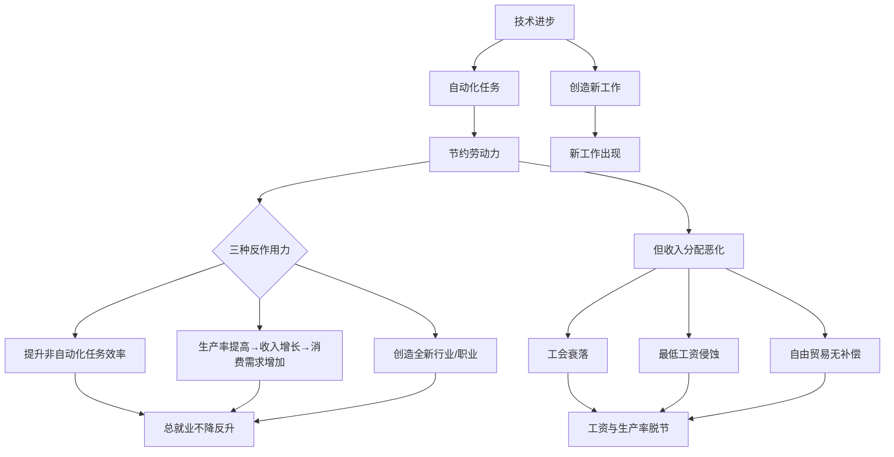
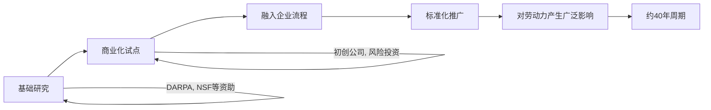

# 《AI时代的工作》章节总结

## 书籍信息
- 书名：AI时代的工作
- 作者：【美】戴维·奥托；戴维·明德尔；伊丽莎白·雷诺兹
- 译者：向晶
- 出版社：中信出版集团
- 出版时间：2025年5月
- ISBN：9787521774719
- 字数：96千字
- PDF状态：EPUB文本来源，内容完整
- OCR状态：非扫描版，文本可正常提取

## 目录说明
- 目录识别情况：完整识别全书结构，包括“CIDEG文库”总序、序、第一篇（第一章至第三章）、第二篇（第四章至第七章）、致谢、研究简报清单、小组成员名单。
- 章节对应依据：严格按原文标题和层级输出。
- OCR修复说明：无OCR错误，文本可直接使用。

## 全书核心主题
本书由麻省理工学院未来工作特别小组成员合著，系统分析了人工智能、机器人、自动驾驶等技术对劳动力市场的影响。作者反驳了“技术导致大规模失业”的流行叙事，指出历史表明技术进步会创造新工作，但当前美国面临的核心问题是生产率增长与工资中位数增长脱节、不平等加剧、工作质量下降。全书提出三大改革支柱：投资技能与培训、提高工作质量、扩大并引导创新。作者认为，技术变革的缓慢演变为政策干预提供了窗口，通过制度创新（如最低工资、失业保险、工会代表权、税收再平衡等）可以共享科技繁荣。

---

## “CIDEG文库”总序

### 核心论点
问题：CIDEG文库的设立目的和延续意义是什么？
观点：该文库旨在从比较视角理解不同经济制度的演变，汲取历史经验，为工业发展和环境治理提供政策信息。在当前日益分裂的世界中，促进不同经济制度间的相互理解尤为重要。

### 关键概念
- CIDEG：清华大学产业发展与环境治理研究中心
- 制度变革：经济差异反映历史偶然和经验，但可通过普遍理性框架鼓励有益的制度变革

### 经典金句
> “客观地理解不同经济制度的演变、从具有不同历史经验的经济体汲取适当的政策教训，这一点的重要性非但没有减弱，相反，在这个日益分裂和孤立的世界，努力实现不同经济制度之间的相互理解比以往任何时候都更加重要。”

---

## 序（罗伯特·索洛）

### 核心论点
问题：技术进步与失业、结构性失业、劳动收入份额下降之间有何关系？
观点：20世纪60年代的结构性失业争论与当前的技术焦虑相似。过去四十年，劳动收入份额从约3/4下降到约2/3，实际工资增速赶不上生产率增速，中等技能岗位消失。教育和培训虽重要，但不能保证更高就业率。

### 关键概念
- 结构性失业：失业工人与就业岗位不适配（错误技能、教育不足）
- 劳动收入份额：国民收入中用于支付工资和薪水的比例
- 中等技能岗位消失：戴维·奥托发现的就业极化现象

### 逻辑推演
索洛以1961年自己在经济顾问委员会的经历为引，对比当时对“自动化”的担忧与当前对“机器人”的焦虑。他指出，过去四十年劳动份额持续下滑，工资与生产率脱节，原因包括中等技能岗位转移至低收入国家、工会力量削弱、雇主市场势力增强等。他提醒，不要将问题简单归咎于失业者特征或技术，而应全面审视经济。

### 经典金句
> “在20世纪前七十多年的时间里，美国资本主义用四分之三的国民收入支付工资和薪水……过去的大约四十年里，这一比例持续下滑。到新冠疫情暴发之际，国民收入中用于支付工资薪水的份额大约仅有三分之二。”

---

# 第一篇

## 第一章：前言

### 核心论点
问题：为何需要关注人工智能和机器人对工作的影响？麻省理工学院未来工作特别小组的研究目的是什么？
观点：技术不会导致大规模失业，但会加剧不平等。生产率提高并未惠及大多数工人。核心挑战是扩大就业机会、补充并影响技术创新，通过制度革新建立新的“游戏规则”。

### 关键概念
- 特别小组：麻省理工学院2018年成立，研究新兴技术与工作的关系
- 大分化：生产率与工人工资增长脱节
- 制度因素：决定技术发明、应用和分配的关键
- 中美博弈：技术脱钩可能阻碍创新

### 逻辑推演
作者从智能手机、无人驾驶等十年前的新鲜事物说起，指出当前技术焦虑虽被媒体放大，但实际影响逐步显现。特别小组研究发现，没有证据表明自动化导致总就业持续下降。相反，问题在于收入分配极端不平等。新冠疫情、中美脱钩等新因素进一步复杂化未来工作图景。全书分为两篇：第一篇分析技术演变和就业影响；第二篇提出政策与制度改革建议。

### 经典金句
> “工作不仅是收入来源，更是我们学习和锻炼感知力、想象力及判断力，进行社会合作，做出建设性社会贡献的一种方式。” ——乔希·科恩

> “未来的核心挑战，也就是未来要做的工作，就是扩大劳动力市场的就业机会以迎接、补充并影响技术创新。”

---

## 第二章：劳动力市场和经济增长

### 核心论点
问题：自动化会导致大规模失业吗？为什么生产率提高了工人收入却没有同步增长？
观点：技术进步创造的新工作超过其摧毁的旧工作，但美国特有的制度变革（工会衰落、最低工资侵蚀、自由贸易无补偿）导致收入不平等扩大、劳动份额下降。美国并未从不平等中获得更高的经济增长或代际流动。

### 关键概念
- 自动化的三种反作用力：
  1. 提升非自动化任务的劳动效率
  2. 生产率提高带来收入增长，刺激消费需求
  3. 创造全新的工作模式、行业和职业
- 大分化：1948-1978年生产率与工资同步增长95%以上；1978-2016年生产率增长66%，工资中位数仅增长11%
- 就业两极化：高工资和低工资职业增长，中等工资职业萎缩
- 劳动份额：从约2/3下降到约60%，2000年后加速下滑
- 超级明星公司：技术变革使经济活动向大企业集中，这些企业资本密集、劳动份额低

### 逻辑推演
本章首先纠正“自动化导致失业”的误解，通过历史数据（1890-2000年美国就业人口比例每十年上升）和实证研究证明，自动化会激发三种反作用力创造新工作。图2.1显示2018年63%的职业在1940年不存在。然而，生产率与工资脱节是真实问题：图2.2、2.3显示大学学历工人工资大幅增长，高中及以下学历工人实际工资下滑。原因有三：技术进步偏向高技能；中国加入WTO冲击制造业；制度弱化（工会覆盖率从26%降至12%，联邦最低工资实际价值比1979年低35%）。与其他发达国家对比，美国低技能工人时薪仅相当于加拿大的74%、德国的57%。美国代际流动性在富裕国家中最低，经济增长也不比其他发达国家快。

### 流程图

### 经典金句
> “1948—1978年，美国劳动生产率提高108%，年均增长2.4%。同一时期，生产工人和非管理人员的平均工资同步增长95%。1978—2016年，美国单位小时总产出增长了66%，年均增速1.3%。然而在同一时期，生产工人和非管理人员的工资仅提高12%。”

> “美国低技能工人的工资收入仅相当于英国的79%，加拿大的74%，德国的57%。”

> “在富裕的民主国家中，美国代际流动性最低，远低于法国、德国、瑞典、澳大利亚或加拿大。”

---

## 第三章：技术和创新

### 核心论点
问题：人工智能、机器人、自动驾驶等新技术将如何影响就业？它们会迅速取代人类吗？
观点：技术变革的重大影响需几十年才能显现，当前人工智能是“狭义人工智能”，动态环境中的灵活性仍是人类优势。自动驾驶、仓储机器人、制造业机器人等采用缓慢，且往往补充而非完全替代人类。管理实践、组织文化决定技术采用方式。

### 关键概念
- 狭义人工智能：解决有限特定问题，依赖人类生成数据，缺乏稳健性和可解释性
- 通用人工智能（AGI）：真正的人类大脑级智能，仍遥遥无期
- 40年周期：技术从研发到广泛影响通常需数十年
- J形曲线：技术接受路径缓慢渐进，然后加速突破
- 协作机器人：安全、低速、低成本，但产量较低

### 逻辑推演
本章通过保险、医疗保健、自动驾驶、仓储物流、制造业等多个行业案例，展示技术采用的渐进性。保险业中，机器人流程自动化未达预期，人工智能目前仅用于辅助审计；医疗保健中，电子病历投资巨大但生产率提升有限，医疗转录员等岗位被替代；自动驾驶仍需安全驾驶员和远程管理，完全无人驾驶至少需十年；仓储业中，电子商务带来就业增长，但分拣、包装仍依赖人工；制造业中，中小企业机器人采用率极低，大公司也处于实验阶段。结论：技术是逐步演变的，人类的选择（管理、政策）决定其影响方向。

### 流程图（技术采用周期）

### 经典金句
> “未来已来，只是分布不均匀。” ——威廉·吉布森

> “咨询公司对我们这样的公司造成了巨大的损失，他们告诉我们使用这些新的人工智能可以节约数十亿美元。我们已经使用了一些人工智能，但并没有产生显著影响。”

> “在仓储领域，能够识别、抓取和操纵各种物品流的机械手臂仍处于起步阶段。”

---

# 第二篇

## 第四章：教育和培训：找到好工作的路径

### 核心论点
问题：如何通过教育和培训帮助工人适应技术变革？
观点：四年制大学学位回报率大幅上升，但社区学院和行业培训计划也能带来可观收益。成功的行业培训计划具备与雇主紧密合作、职业准备技能培训、就业安置、配套支持等要素。美国培训体系分散但灵活，需要增加投资、扩大区域合作、创新教学方法。

### 关键概念
- 行业培训计划：针对特定行业（医疗、IT、制造）的密集培训（6个月内），包含筛选、职业技能、就业安置、后续支持
- 社区学院：每年招收近700万学生，提供学位、毕业证、证书，回报率因专业而异（医疗保健类14%-45%）
- 中介机构：非营利组织连接雇主和培训机构，如JVS、Year Up
- 学徒制：高中或中学后，结合课堂与工作经验，南卡罗来纳州模式成功
- 在线教育：MOOC、混合在线、虚拟现实，仍有完成率低等挑战

### 逻辑推演
本章首先说明大学学位溢价从1981年的48%升至2005年的97%，但社区学院和行业培训也能提供可观回报。通过随机对照试验证明，行业培训计划可使参与者收入提高14%-39%，效果持续3-9年。这些计划的关键要素包括：筛选、软技能培训、行业认可证书、雇主合作、支持服务。社区学院成功案例（印第安河州立学院）依赖区域伙伴关系、数据驱动、先进设施。学徒制在美国扩展至60多万人，南卡州“卡罗来纳学徒”计划成功。私人部门培训存在种族差距，公共资金不足（WIOA支出从46亿降至28亿）。在线教育有潜力但需结合面授。

### 经典金句
> “处在工资和技能分布低端的工人接受的培训较少。调查还发现，在获得雇主提供的培训方面，种族和民族之间存在巨大差异。”

> “2001—2019财年，《劳动力投资法案》/《劳动力创新和机会法案》的支出从46.2亿美元降至28.2亿美元。”

---

## 第五章：工作质量

### 核心论点
问题：为什么美国低薪工人的工作质量远低于其他发达国家？如何改善？
观点：美国特有的制度选择（最低工资侵蚀、失业保险覆盖不足、工会衰落、股东资本主义至上）导致低薪工人工资极低、福利缺失。需提高最低工资、改革失业保险、恢复工人集体谈判权和利益相关者地位。

### 关键概念
- 失业保险：覆盖自雇者、低薪兼职工人不足；领取福利的失业者比例降至30%以下
- 最低工资：联邦最低工资实际价值与1950年持平，比1979年低35%
- 工会覆盖率：从1979年26%降至2019年12%（私人部门仅6%）
- 话语权差距：工人对工作场所问题（薪酬、技术引入方式）的影响力小于应有水平
- 另类代表模式：全美家政工人联盟、自由职业者工会、农场工人联合会等

### 逻辑推演
本章指出美国低薪工人（家庭保健助理、餐饮服务等）工资比加拿大低26%，且缺乏带薪病假、医保等福利。失业保险制度将自雇者、兼职工人排除在外，且资格认定困难。最低工资被政治博弈侵蚀，但经济证据表明精心调校的最低工资对就业负面影响极小，能有效提高低薪工人收入。工会衰落削弱了工人议价能力，但公众支持工会比例升至65%，工人渴望更多话语权。股东资本主义强调股东价值最大化，但商业圆桌会议2019年宣言转向利益相关者资本主义。改革方向：提高最低工资并指数化、扩大失业保险覆盖、修改《全国劳资关系法案》允许新代表形式。

### 经典金句
> “经购买力平价调整后的美国低工资工人的工资比从事类似职业的加拿大工人低26%。”

> “1979—2017年，集体谈判协议覆盖的美国工人比例从26%降至12%。在私人部门，这一比例从21%降到6%。”

> “65%的美国人现在表示‘支持’工会。这是自2000年以来的最高水平。”

---

## 第六章：支持创新的制度

### 核心论点
问题：联邦政府在技术创新中应扮演什么角色？如何引导创新使工人受益？
观点：美国历史上的重大技术突破（半导体、互联网、人工智能、生物技术）均源于联邦研发投资。但近年公共研发支出占GDP比重从40%降至25%，需增加投资并引导至“高难度技术”，同时改革税法（目前资本税率远低于劳动税率），扩大创新地理范围。

### 关键概念
- 联邦研发体系：从西点军校、国防部高级研究计划局到国家科学基金会，长期支持基础研究和任务导向项目
- 高难度技术：需要长时间、高投入的突破性技术（先进制造、量子计算、清洁能源）
- 税收扭曲：劳动力平均税率约25%，资本税率降至5%左右，激励自动化替代劳动
- 折旧免税额：企业可立即扣除资本投资，鼓励用机器取代工人
- 区域创新扩散：创新越来越集中于少数城市，需通过联邦研发投资带动落后地区

### 逻辑推演
本章回顾美国联邦研发历史（曼哈顿计划、阿波罗登月、国防部高级研究计划局网络技术），指出私人部门不愿投资长期基础研究。当前美国研发总支出占GDP比重（2.7%）低于德国（2.9%），公共份额持续下降。税收政策严重偏向资本：设备软件税率仅5%，劳动力税率25%，导致企业用机器替代工人。作者建议：增加联邦研发支出，设立“大创新基金”应对气候变化等挑战；重新平衡资本税和劳动税（取消过度折旧免税额）；对S类公司和C类公司统一征税；颁布雇主培训税收抵免。同时，通过地区性研发投资（如格鲁伯和约翰逊提议）扩大创新的地理分布。

### 经典金句
> “过去40年，劳动力的平均税率约为25%，而设备、软件和建筑物等被归类为资本的东西税率较低，而且近年来这一税率持续下降……20世纪90年代，软件和设备的平均税率仅为15%，现在已经降至5%左右。”

> “美国研发总支出占GDP的比重在过去30年里保持相对稳定，但公共投资在研发中所占的比重从1985年的约40%降至2015年的约25%。”

---

## 第七章：结论和政策建议

### 核心论点
问题：综合全书分析，美国应如何应对AI时代的工作挑战？
观点：技术进步不会导致无工作未来，但需三大支柱改革：1）技能与培训投资；2）提高工作质量；3）扩大并引导创新。具体建议包括：增加联邦培训资助、提高最低工资并指数化、改革失业保险、更新劳动法、增加研发支出、再平衡资本与劳动税率。

### 关键概念（三大支柱）
- 技能与培训：促进私人培训投资、增加联邦资助、支持社区学院、严格评估计划、改善劳动力市场信息、投资在线教学
- 工作质量：提高最低工资至工资中位数40%以上、扩大失业保险覆盖（按工时而非收入）、加强劳动法、允许新代表形式
- 创新：增加联邦研发支出、设定国家级研究目标（以人为本的人工智能）、援助中小企业、扩大创新地理、再平衡资本与劳动税、颁布培训税收抵免

### 逻辑推演
本章将前六章的分析转化为具体政策建议。首先重申核心发现：未来20年职位空缺将超过工人数，但需制度革新确保共享繁荣。然后分三大支柱列出详细建议，每条均有经济证据支持。最后强调：提高工人经济安全与拥抱技术变革并非非此即彼，而是相互促进的。

### 经典金句
> “太多美国人担心，技术进步虽然会让国家变得更加富裕，但会威胁到他们的生计。”

> “在提高工人的经济安全与拥抱持续的技术变革和创新之间并不是非此即彼的关系，可以说，要实现后者，就必须确保前者。”

---

## 致谢

本书感谢麻省理工学院未来工作特别小组成员、顾问委员会、研究顾问委员会、编辑蒂姆·艾佩尔、管理团队及数十名学生和研究人员的贡献。

---

## 麻省理工学院未来工作特别小组研究简报清单

共21份研究简报，涵盖失业保险、税收与自动化、城市机会、制造业、医疗保健技术、生产率悖论、好工作、增材制造、工厂未来、中国人工智能发展、德国丹麦职业培训、工人话语权、自动驾驶汽车、人工智能与工作、物流、成人技能培训、认知科学、工业机器人、教育技术、全民基本收入、机器人象征意义等主题。

---

## 麻特省理工学院未来工作特别小组成员

- 联合主席：戴维·奥托、戴维·明德尔
- 执行主任：伊丽莎白·雷诺兹
- 成员：苏珊娜·伯杰、埃里克·布莱恩约弗森、约翰·哈特、黄亚生、托马斯·科昌、约翰·伦纳德、保罗·奥斯特曼、丹妮拉·鲁斯、桑杰·萨尔玛、朱莉·沙阿、凯瑟琳·特伦、约翰·范里宁、克里斯蒂娜·沃利等
- 顾问团：罗伯特·索洛、埃里克·施密特、金妮·罗梅蒂、凯伦·米尔斯等