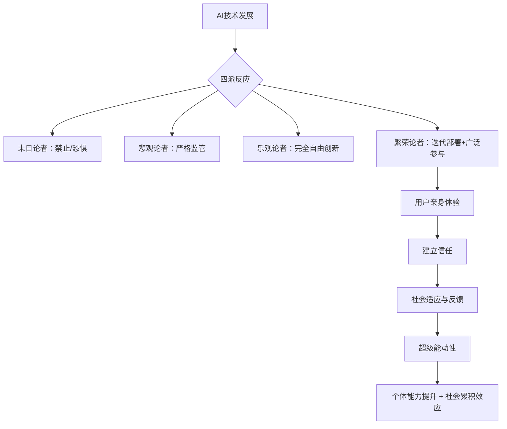
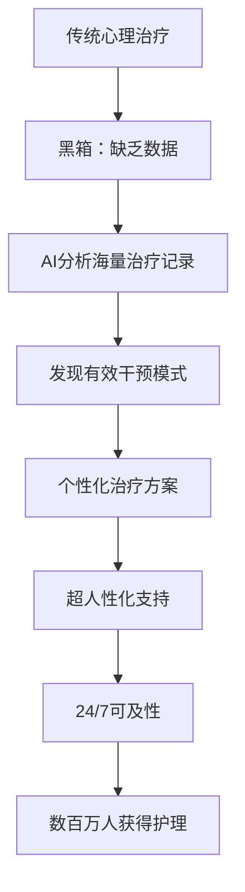
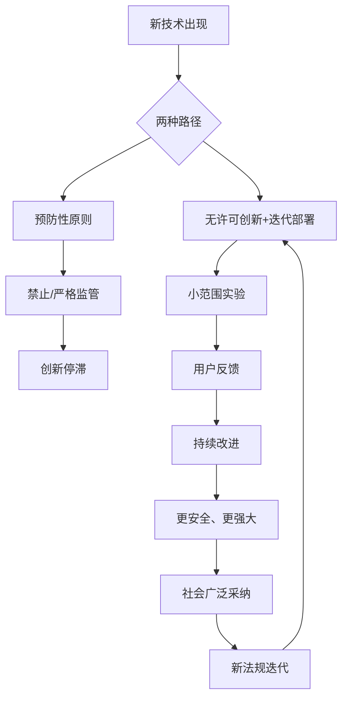
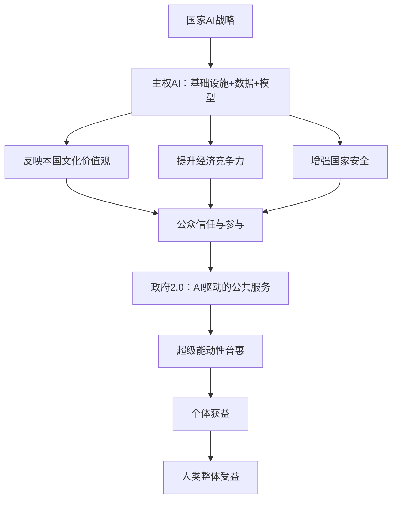

# 《AI赋能》章节总结

## 书籍信息
- 书名：AI赋能（SUPERAGENCY）
- 作者：[美] 里德·霍夫曼（Reid Hoffman）、[美] 格雷格·贝亚托（Greg Beato）
- 译者：陆坚
- 出版社：浙江教育出版社·湛庐
- 出版时间：2025年5月
- PDF状态：基于OCR文本提取，部分页码识别完整，图表未能完全还原
- OCR状态：文本可读，部分页码有错位或缺失，已基于可见内容整理

## 目录说明
- 目录识别：原文无独立目录页，根据正文标题和页码顺序整理出以下结构：
  - 译者序
  - 中文版序
  - 前言
  - 原则1～原则10（共10章）
  - 后记
  - 致谢
  - 第一部分：重磅导读（多位专家）
- 章节对应依据：严格按原文出现的标题和页码顺序
- OCR修复说明：部分图表（如未提供原始图）无法完全还原，已用文字描述或Mermaid重建逻辑关系

## 全书核心主题
本书围绕“AI如何增强人类能动性”展开。作者里德·霍夫曼（繁荣论者）提出“超级能动性”概念：在AI赋能下，个体和集体能够突破限制，实现潜能最大化。全书批判末日论和悲观论的过度恐惧，反对乐观论的无约束放任，主张通过“迭代部署”和“技术人文主义指南针”推动AI发展。核心原则包括：以人为本、广泛参与、迭代部署、建立信任、将AI视为个人意志的延伸。作者结合领英、OpenAI等实践经验，论证AI将像汽车、GPS一样成为提升人类自由的工具，并最终实现社会层面的普惠。

---

## 译者序：与其担忧不确定的未来，不如去创造一个更美好的未来
### 核心论点
问题：面对AI的不确定性，应持何种态度？  
观点：不应被动担忧，而应积极创造更美好的未来。作者引用苏格拉底对书面文字的批评，指出AI使“苏格拉底式对话”焕发新形态。

### 关键概念
- **超级能动性**：在AI赋能下，个体和集体突破限制、实现潜能最大化的状态。
- **四派分类**：末日论者、悲观论者、乐观论者、繁荣论者。
- **技术人文主义指南针**：以人为本，将人类能动性置于AI发展中心。
- **迭代部署**：通过广泛参与和持续反馈，在真实场景中逐步完善AI。

### 逻辑推演
译者从自身犹豫翻译本书开始，因苏格拉底对话的启发而决定投入。随后解释“超级能动性”的英文agency在哲学中的含义——人类行动能力。对比四派观点后，作者自认繁荣论者，强调广泛参与和迭代部署。最后通过计算机、汽车、GPS的历史案例说明：新技术总伴随恐惧，但最终增强人类能力。

### 经典金句/数据
> “防止糟糕未来的最好办法就是积极地打造更美好的未来。”
> “与其担忧一个不确定的未来，不如去积极创造一个更美好的未来。”
> 中国已有2.5亿人在多个领域应用生成式AI（中文版序数据）。

---

## 中文版序：当我们信任与拥抱AI时，就真的启动了AI的超级潜力
### 核心论点
问题：如何释放AI的超级潜力？  
观点：信任与广泛普及是核心。中国庞大的用户群体（2.5亿人应用生成式AI）将在全球AI演进中发挥重要作用。

### 关键概念
- **信任循环**：用户亲身体验→建立信任→形成良性循环→产生超级能动性。
- **闪电式扩张**：中美是真正掌握此精髓的创新热土。

### 逻辑推演
作者强调AI应成为全人类共同塑造的资源。中国用户基数全球最大，其独特经验将影响全球AI方向。信任的建立必须通过实践，而非自上而下的禁止。最终，人类与AI共同构建的未来取决于当下的选择。

### 经典金句/数据
> “当信任基础与普及程度形成良性循环时，便会产生强大的协同效应。”
> 中国已有2.5亿人在多个领域应用生成式AI。

---

## 前言：技术的每一次迭代，都在让我们迈入理想的AI未来
### 核心论点
问题：为什么不应试图禁止或限制AI发展？  
观点：技术越强大，协调禁止越困难；防止糟糕未来的最可靠方法是主动创造更好的未来。

### 关键概念
- **技术人**：人类不断创造工具增强能力，也被工具塑造。
- **技术人文主义指南针**：动态导航工具，以人文主义为核心，增强个体和集体能动性。
- **迭代部署**：边做边学，在真实世界中测试和改进。

### 逻辑推演
从历史上印刷机、电话、汽车引发的恐惧说起，到20世纪60年代对计算机的担忧。指出预测未来很难，阻止未来更难。竞争和协调失败使得禁止不可行。作者以自身经历（PayPal、领英、OpenAI、InflectionAI）说明深度参与才能推动积极变革。最后回到苏格拉底对书面文字的批评，指出新技术最终增加了作者和读者的能动性。

### 经典金句/数据
> “从根本上说，防止出现糟糕的未来的最可靠方法是朝着一个更好的未来前进。”
> “我们不仅仅是智人，还是‘技术人’。”
> ChatGPT在5天内吸引首批100万用户，2个月达1亿用户。

---

## 原则1：AI焦虑时代，超级能动性让我们找回人生掌控权
### 核心论点
问题：AI是否会削弱人类对生活的掌控？  
观点：AI将成为合成智能，像工业革命的合成能源一样极大地扩展人类能动性，实现“超级能动性”。

### 关键概念
- **超级能动性**：大量个体被AI赋能，社会层面产生累积效应，人人受益。
- **能动性**：个体做出选择、独立行动、影响自己生活的能力。
- **四派分类**：
  - 末日论者：AI可能毁灭人类。
  - 悲观论者：关注近期风险（失业、偏见、虚假信息）。
  - 乐观论者：坚信AI积极影响远超负面。
  - 繁荣论者（作者立场）：乐观但倡导广泛参与和迭代部署。
- **迭代部署**：OpenAI的方法，邀请公众参与开发过程，而非等专家确认完美后再发布。

### 逻辑推演
从2022年底科技行业动荡（Meta、亚马逊裁员，FTX破产）引出ChatGPT横空出世，引发巨大关注和两极反应。作者指出，大多数人对AI的担忧本质是对人类能动性的担忧。回顾工业革命：合成能源虽带来问题，但最终极大扩展了人类可能性。AI将带来认知革命，合成智能将像合成能源一样扩展人类潜力。关键不是禁止，而是让AI服务于人、与人合作。繁荣论者倡导迭代部署，因为信任始于接触和使用。

### 流程图

### 经典金句/数据
> “AI应该是人类个体意志的延伸，并且在自由精神下，尽可能广泛和公平地分布。”（OpenAI创始愿景）
> “信任始于接触，并随着人们对新事物的使用而发展。”
> ChatGPT发布5天获100万用户，2个月达1亿用户。

---

## 原则2：当AI学会“撒谎”，我们如何选择相信谁、信任什么
### 核心论点
问题：在AI可能产生虚假信息的情况下，如何建立信任？  
观点：越多地拥抱AI，越能有效利用数据和信息，从而在几乎所有领域增强能动性。历史上的隐私恐慌（如1960年代联邦数据中心提案）最终被证明是过度担忧。

### 关键概念
- **数据转化为大知识**：将“大数据”通过AI转化为可用的知识和洞察。
- **私人公地**：由营利性公司运营但为公众创造巨大价值的数字平台（如谷歌地图、维基百科、领英）。
- **消费者盈余**：用户免费获得服务所感知的价值远超平台获取的收入。

### 逻辑推演
从乔治·奥威尔《1984》的“老大哥”形象引入，回顾1960年代计算机兴起时的隐私恐慌。1963年美国国税局用IBM7074处理纳税申报引发担忧；1965年提议设立“联邦数据中心”遭强烈反对，被认为会导致“数字化人”失去个性。但历史证明，计算机技术并未剥夺人的能动性，反而促进了个性化、定制化和包容性。领英的案例说明：分享更多信息（职业身份）可以扩大信任网络。现在人类已进入信息产出远超自身处理能力的阶段，AI是唯一能将大数据转化为大知识的工具。

### 经典金句/数据
> “我们正处于一个信息产出超过自身有效利用能力的阶段。”
> “通过广泛分布智能，赋予人们作为其个人意志延伸的AI工具，我们可以将‘大数据’转化为‘大知识’。”
> 2024年全球数据量预计达147泽字节；每分钟全球产生的数据足以填满1390亿本电子书。

---

## 原则3：你无法马上见到医生，但可以随时使用AI
### 核心论点
问题：在医疗等高风险领域，AI是否应该被使用？  
观点：技术悲观主义会导致忽视AI的巨大积极潜力。在心理健康护理领域，AI可以变“黑箱心理治疗”为“大知识心理治疗”，实现超人性化支持。

### 关键概念
- **黑箱心理治疗**：传统心理治疗中，哪些干预有效往往不透明。
- **大知识心理治疗**：利用AI分析海量治疗记录，发现有效干预模式。
- **超人性化**：AI模拟同理心，可能帮助人类成为更善良、更有耐心的自己。
- **Koko案例**：AI辅助同伴互助心理健康平台，因“模拟同理心”引发争议，但其运作是透明的。

### 逻辑推演
批评技术悲观主义（只看负面）和“技术解决主义”（过度简化）。以Koko事件为例：开发者添加GPT-3辅助回复功能后遭舆论攻击，但实际运作透明且用户无投诉。作者指出，悲观者关注假想风险，而Koko聚焦解决真实问题（心理健康资源短缺）。数据表明，ChatGPT在医患对话中共情评分超越人类医生（78.6%情况下评分更高）。AI可以分析160000次会话、2000万条信息，发现“复杂反思”和“肯定”等干预效果更好。最终提出AI心理健康护理的三阶段：辅助记录、协作参与、完全自主护理。

### 流程图

### 经典金句/数据
> “从最好的可能结果的角度思考并不意味着你忽视潜在的负面结果，而是意味着你通过设想你想要的未来并朝着它前进。”
> 78.6%的情况下，ChatGPT的回答评分高于人类医生（JAMA Internal Medicine研究）。
> 美国有1.29亿人生活在心理健康护理专业人员短缺地区，等待时间3～6个月。

---

## 原则4：AI不是选择题而是生存题，普通人何以用AI获得百万消费者盈余
### 核心论点
问题：大型科技公司是否掠夺了用户价值？  
观点：用户与平台之间是共生关系，创造了巨大“消费者盈余”。AI将进一步放大私人公地的价值，使每个用户获得数百万美元的消费者盈余。

### 关键概念
- **私人公地**：营利性公司运营的免费或低成本数字平台，用户贡献数据换取服务，双方获益。
- **消费者盈余**：用户感知价值与支付价格之差。Facebook用户愿意接受48美元停用一个月（中位数）。
- **数据农业**：将数据视为非竞争性资源，共享、聚合、创新，而非“提取操作”。

### 逻辑推演
反驳肖莎娜·朱布夫《监控资本主义》的“掠夺”论。指出谷歌、Facebook等平台创造了巨大价值：YouTube成为人类知识宝库，维基百科免费取代数千美元的百科全书。通过经济学家布林约尔松的实验：用户放弃搜索引擎一年愿意接受的中位数补偿金为17530美元。数码摄影案例：2000年每张照片成本50美分，2015年几乎为零，拍摄量从800亿增至1.6万亿张。AI将成为所有服务的智能界面层，多模态AI（如GPT-4o）将进一步提升价值。结论：即使大语言模型不再进步，普通年轻人一生中从中获得的消费者盈余也可能达数百万美元。

### 经典金句/数据
> “当那些沉睡的、未被充分利用的数据被重新利用、合成并以新颖的方式转化时，不是掠夺，而是对资源的有效利用与再创造。”
> Facebook用户停用一个月的中位数补偿金为48美元，而Meta每月每用户收入仅3.72美元，用户感知价值是创造价值的12倍。
> 放弃搜索引擎一年：17530美元；放弃电子邮件：8414美元；放弃数字地图：3648美元。

---

## 原则5：超级进化时代，“最强大的模型”依然会把“最低级的错误”
### 核心论点
问题：AI仍然会犯低级错误，我们还能信任它吗？  
观点：测试和基准测试是推动AI进步的关键机制，应将关注点从“完美”转向“可接受的错误率”和“社会效用”。

### 关键概念
- **基准测试**：标准化测试（如SuperGLUE、TruthfulQA、RealToxicityPrompts），衡量模型在准确性、公平性、安全性等多维度的表现。
- **聊天机器人竞技场**：基于人类偏好评估大语言模型的开源平台，用户盲测投票，形成排行榜。
- **数据污染**：训练数据无意中包含测试数据，导致性能指标虚高。

### 逻辑推演
批判“军备竞赛”比喻，指出AI发展更像铁人三项赛，核心是持续测试。从图灵测试到SuperGLUE，基准测试推动了模型进步。例如InstructGPT在TruthfulQA上真实输出率从22.4%提升到41.3%，GPT-4在RealToxicityPrompts上有害输出率降至0.73%。但模型仍会犯错误（如将斑马识别为烤面包机）。悲观者利用这些错误质疑可靠性，但人类也会犯错。关键不是零错误，而是可接受的错误率和持续改进。聊天机器人竞技场通过集体投票实现了民主化评估，指向“监管2.0”未来。

### 经典金句/数据
> “测试将关注点从合规性提升到了持续改进上。”
> GPT-4在RealToxicityPrompts上有害内容输出率仅0.73%，而GPT-3为23.3%。
> “聊天机器人竞技场”对超过130个模型进行排名。

---

## 原则6：AI创新VS安全恐慌：迭代部署的AI才能给予我们超能力
### 核心论点
问题：如何在创新与安全之间找到平衡？  
观点：不应盲目追求零风险，而应通过迭代部署和无许可创新，在真实环境中管控风险。历史证明（汽车、GPS）这种方式最终提升了安全性和能动性。

### 关键概念
- **无许可创新**：允许创新者在没有预先批准的情况下自由实验，通过市场和社会反馈迭代改进。
- **预防性原则**：新技术需“自证清白”才能部署，往往导致停滞。
- **迭代部署**：逐步发布、收集反馈、持续改进，同时让社会有时间适应。

### 逻辑推演
比较预防性原则（如欧盟GDPR、旧金山送货机器人禁令）与无许可创新（如美国1990年代互联网政策）。以汽车发展史为例：早期汽车被视为“魔鬼马车”，但通过无许可创新（速度测试、公路拉力赛），技术迅速改进。同时法规迭代部署（限速、驾照、红绿灯），最终死亡率下降93%。作者反问：如果1913年就禁止高速汽车，会失去多少自由和进步？结论：AI应走同样道路，让公众通过使用来建立信任和判断风险。

### 流程图

### 经典金句/数据
> “新能力总是伴随着新风险。但我们不应盲目追求零风险，而应致力于理解现实环境中的风险，并有条不紊地努力管控和降低这些风险。”
> 1923年美国机动车死亡率每1.6亿千米18.65人死亡，现在降至1.33人，下降了93%。

---

## 原则7：理性看待AI焦虑，AI助手如何让我们的工作效率提升1000倍
### 核心论点
问题：AI如何像GPS一样成为生活导航工具？  
观点：大语言模型是信息世界的GPS，它能帮助我们在复杂信息环境中导航，尤其对初学者和弱势群体提升最大。

### 关键概念
- **信息GPS**：大语言模型提供情境感知的指引，帮助用户在信息海洋中找到路径。
- **潜在专业知识**：模型通过训练隐性吸收的所有知识，用户通过具体指令可解锁这些知识。
- **多模态AI**：能同时处理文本、音频、图像和视频，实现更自然的交互。

### 逻辑推演
从GPS的历史说起：军事技术，因客机误击事件向民用开放，后取消“选择性可用性”政策，催生了万亿级经济效益。GPS增强了物理世界的导航能力；大语言模型则增强信息世界的导航能力。研究表明，使用AI使工作效率提升14%～37%，且对经验较少的用户提升更显著。AI可以帮助非母语者理解法律文件、帮助视障者“看见”世界、帮助学生学习。关键在于：AI不是取代人类，而是成为初学者的快速进阶工具，让智能不再稀缺。

### 经典金句/数据
> “你越能熟练地运用AI来驾驭21世纪的生活，你就越能在现实世界中开辟出自己的道路。”
> 使用ChatGPT的员工完成任务速度比未使用者快37%；客户服务代理效率提升14%。
> GPS技术1984-2017年为美国公共部门创造1.4万亿美元经济效益。

---

## 原则8：当AI能为我们“完美决策”，动态契约才能让它安全且有效地融入社会
### 核心论点
问题：当AI实现完美控制（如强制酒驾检测），是否会侵犯个人自由？  
观点：我们需要“动态契约”——公众在AI合法化过程中发挥积极作用，通过代码即法律的方式，同时保留灵活性和道德判断。

### 关键概念
- **代码即法律**：软件架构决定了网络空间的行为规则。
- **非合同**：自动化执行的协议（如智能合约），取代传统合同中的协商和信任。
- **动态法律**：基于机器学习算法的合约，能根据环境数据动态调整条款。
- **被统治者的同意**：政府的正当权力源于人民的自愿同意，AI治理也应如此。

### 逻辑推演
设想2027年场景：汽车强制安装酒精检测系统，AI拒绝酒驾者启动，甚至建议看电影等待酒醒。这种“完美控制”引发自由争议。劳伦斯·莱斯格在《代码》中指出，架构的约束取代了法律中的自由裁量。但智能合约（基于区块链）可以提供更公平、透明的交易。动态法律（结合机器学习）可以适应变化，但也带来可解释性挑战。关键在于：公众必须成为AI合法化过程的积极参与者，而非被动顾客。只有获得“被统治者的同意”，AI才能安全融入社会。

### 经典金句/数据
> “如果我们的长期目标是将AI安全且有效地融入社会，而非简单地禁止它，那么公众就必须在AI的合法化过程中发挥积极和实质性的作用。”
> 美国国会2021年通过法案，可能最早2026年强制新车安装驾驶员酒精检测安全系统。

---

## 原则9：在高智能AI面前，与AI目标一致、协同进化是最好的出路
### 核心论点
问题：AI将如何改变我们对自由的认知？  
观点：技术不断塑造着自由的边界。从汽车、高速公路到未来的AI，真正的自由不是无约束，而是通过集体协调的基础设施获得更大范围的个人自主。

### 关键概念
- **网络化的自主性**：个体繁荣带动社区繁荣，社区繁荣反过来增强个体能力。
- **美国州际公路系统**：公共工程的典范，通过大规模协调创造了前所未有的个人出行自由。
- **唐纳大队**：1846年西行拓荒者因缺乏基础设施而遭遇灾难，对比今天轻松穿越美国。

### 逻辑推演
对比1846年唐纳大队（87人仅40人幸存，耗时9个月）与今天28小时驾车穿越美国。后者依赖法规（驾照、限速）、基础设施（州际公路）、技术（GPS）和公共服务。自由不是绝对的无约束，而是通过社会协作获得更大范围的行动能力。汽车普及催生了红绿灯、驾照等新法规，这些法规表面上限制自由，实则使更多人能够安全驾驶。AI也将如此：我们需要新的法规和规范，但这些规范最终会扩展而非缩减人的自由。韩国的疫情应对案例说明：透明、参与、互惠的AI系统能增强社会凝聚力。

### 经典金句/数据
> “随着新技术逐渐融入社会，新的法规和规范也应运而生，这些变革不断塑造着我们对自由的认知。”
> 美国州际公路系统每年创造7420亿美元经济价值，事故死亡率低于其他道路50%。

---

## 原则10：“政府2.0”时代，让每个个体从AI中获益越多，人类整体受益就越大
### 核心论点
问题：国家应如何应对AI时代？  
观点：主权AI至关重要——每个国家需要掌握自身智能的生产。政府应采用技术人文主义指南针，将AI融入公共服务，增强公众参与，实现超级能动性的普惠。

### 关键概念
- **主权AI**：每个国家需要拥有自己的AI基础设施、数据和模型，以保护文化和价值观。
- **政府2.0**：政府从服务提供者转变为平台搭建者、公众行动召集人。
- **Polis/Remesh**：AI驱动的公众参与工具，用于大规模对话和共识发现。

### 逻辑推演
以卢德派（19世纪英国破坏机器的织工）的虚构反事实历史说明：如果英国因恐惧而拒绝工业化，最终会失去竞争力、人才外流。今天的AI就是新工业革命。黄仁勋提出“主权AI”：每个国家需要掌握自己的智能生产。法国、新加坡已投资建设反映本国文化的AI。美国虽有领先企业，但需避免过度监管。政府应像亚马逊一样提供便捷服务（“IRS Prime”），利用AI工具（如Polis）促进公众参与立法，增强社会凝聚力。结论：国家层面对AI投入越大，每个个体获益越多；每个个体获益越多，人类整体受益越大。

### 流程图

### 经典金句/数据
> “每个个体从AI中获益越多，人类整体受益就越大。”
> 黄仁勋：“这是一场新工业革命的开始。每个国家都需要掌握自身智能的生产。”
> 哈佛民调：亚马逊在美国机构中排名第一，谷歌第三，超过军队和最高法院。

---

## 后记：重回哥白尼与麦哲伦之前的时代，我们正在探寻人类繁荣的最佳路径
### 核心论点
问题：在AI带来的未知中，我们如何找到最佳路径？  
观点：技术是推动人类繁荣的关键力量。以超级能动性为指导，以“被治理者的同意”为准则，借助技术人文主义指南针，我们能够实现人类价值的更大体现。

### 关键概念
- **探索性思维**：面对未知，不是等待确凿证据，而是主动探索、实验、适应。
- **风险组合**：将AI视为同时应对多种生存威胁（流行病、气候变化等）的战略资源。

### 逻辑推演
回顾书中核心原则：以人为本、数据共享赋能、创新与安全协同、超级能动性。当前我们像哥白尼和麦哲伦之前的时代，对未知充满好奇与不安。但历史证明，技术是推动人类繁荣的关键力量。如果当初等待汽车绝对安全，我们可能还在马粪中行走；如果等待智能手机完美，我们会失去无数便利。AI的潜在益处如此巨大（医疗、教育、气候、能源），不应因恐惧而停滞。我们需要的是迭代部署、广泛参与、持续学习，主动创造更美好的未来。

### 经典金句/数据
> “技术是推动人类繁荣的、经久不衰的关键力量。”
> “如果没有技术，我们的人口数量会大幅减少，寿命也将减半，生活的多彩与激情亦会黯然失色。”

---

## 致谢
### 内容摘要
作者里德·霍夫曼感谢合作者格雷格·贝亚托，以及AI领域的众多同行：穆斯塔法·苏莱曼、山姆·奥尔特曼、格雷格·布罗克曼、萨提亚·纳德拉、埃里克·施密特、比尔·盖茨、德米斯·哈萨比斯、李飞飞等。感谢经纪人克里斯蒂·弗莱彻、出版商马德琳·麦金托什及作者权益团队。感谢霍夫曼的团队（阿里亚·芬格等）和播客《规模大师》的合作者。格雷格·贝亚托感谢Claude、ChatGPT、Gemini等模型的协助，以及众多提供反馈和建议的朋友。

---

## 第一部分：重磅导读
### 01 技术是人类能动性的延伸（陆奇，奇绩创坛创始人）
核心观点：技术是人类能动性的延伸。AI技术延伸了人的核心能力（认知和决策）。平衡“无许可创新”与“预防性原则”是技术进步的必要动态。技术安全的解法不是停止创新，而是在动态探索中化解风险。

### 02 什么是真正的问题（韦青，微软中国首席技术官）
核心观点：真正的问题不是技术，而是人。人与技术是乘法关系（1×100=100），若人自身为0或-1，技术越强越糟。人类需要保持主观能动性，不能被机器异化。教育的核心是21世纪新扫盲运动（微积分、线性代数、概率论）。

### 03 善AI，以能动，赋自由（杨斌，清华大学教授）
核心观点：AI是“能动性放大器”。选择行动乐观主义，通过广泛参与和迭代部署，让AI成为人类自由的延伸。私人公地的概念值得深入思考，它创造了巨大的消费者盈余和社会价值。

### 04 超级能动性：如何将人类潜能提升到新高度（胡泳，北京大学教授）
核心观点：AI正从“工具”转变为“合作伙伴”。五大创新：增强智能与推理、代理式AI、多模态、硬件提升、透明度提高。企业领导者需将人类能动性作为首要目标。

### 05 AI时代“成为完整的人”（王颐，哈佛中心上海执行董事）
核心观点：AI教育的价值在于解放人类创造性，培养“完整的人”。需要警惕“技术马太效应”，教育者应从知识传授者转型为“认知架构师”。

### 06 致命的自负：技术乌托邦的当代迷思（段永朝，苇草智酷）
核心观点：对技术乐观主义持批判态度。哈耶克《致命的自负》提醒：人类知识有必然的局限性。技术人文主义可能过于理想化，需要更多谦卑和反思。

### 07 AI赋能：技术人文主义的未来（檀林，北大汇丰商学院）
核心观点：提出“技术民主化三定律”：迭代部署、技术人文主义指南针、个体作为技术演进的核心节点。AI应成为“数字副官”，而非替代者。

### 08 AI时代，更需坚守人的信念与能动性（陈楸帆，科幻作家）
核心观点：AI创作工具无法替代人类对生命体验的深度探索。能动性是人与人之间的最大分水岭。AI素养是“元能力”，帮助人们在技术辅助下明晰自我定位。

---

## 文档结束
> 说明：本总结基于OCR识别文本，部分内容（如原书图表、部分页码）无法完整还原，已用文字描述或Mermaid重建逻辑关系。所有引用均来自原文。