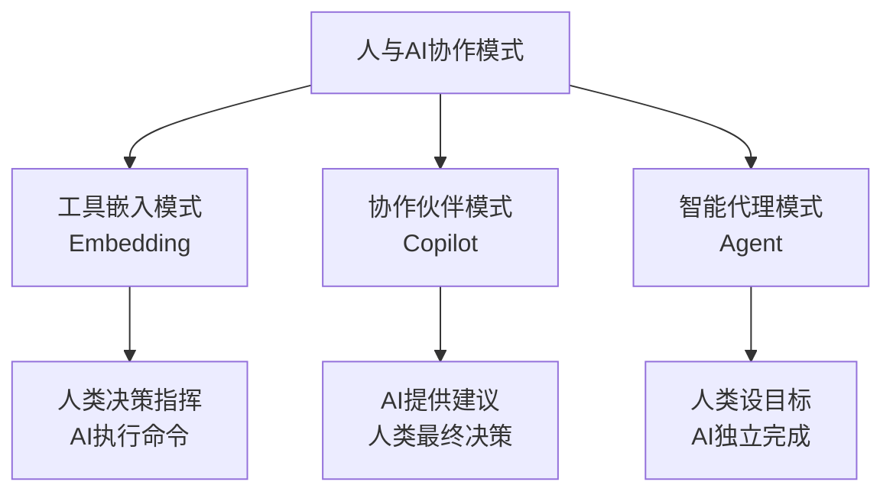
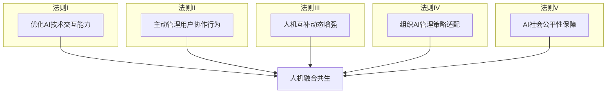
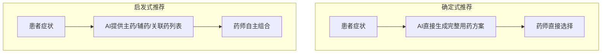
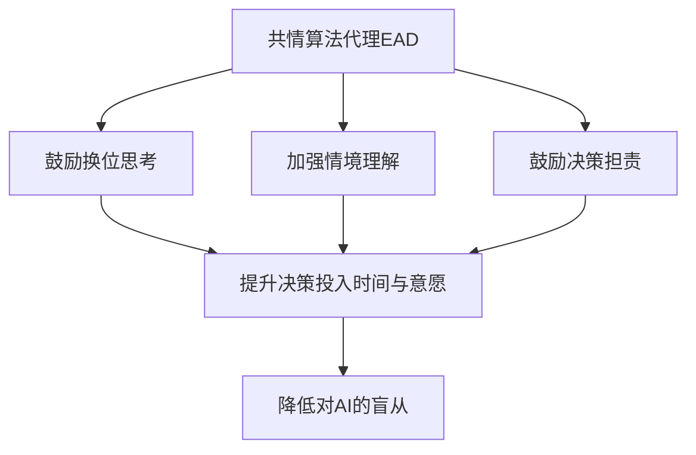
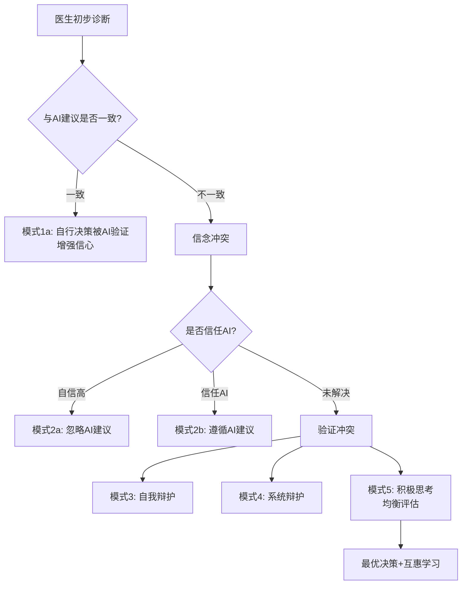
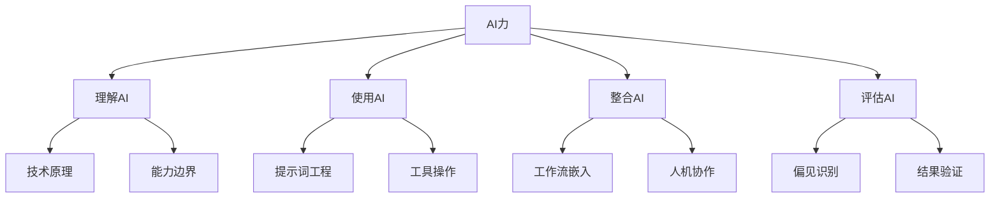
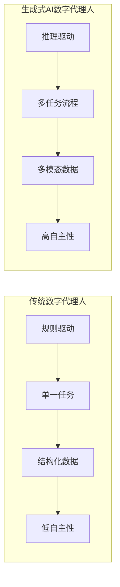
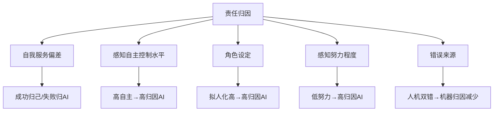
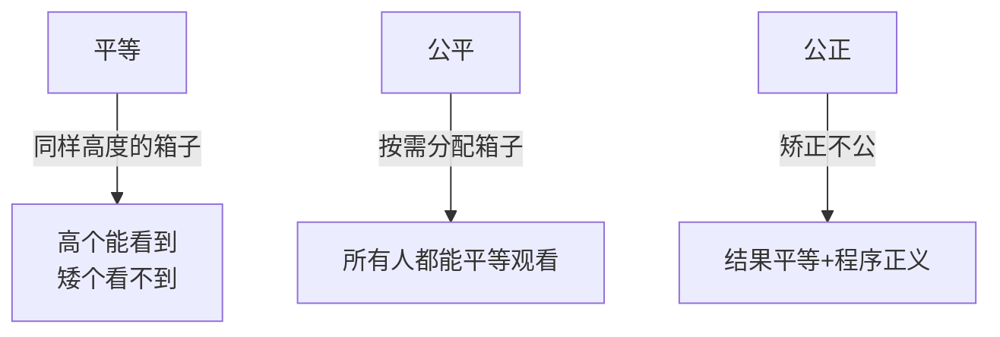

# 《AI革命：人机融合共生的五大法则》章节总结

## 书籍信息
- 书名：AI革命：人机融合共生的五大法则
- 作者：卢向华
- 出版社：机械工业出版社
- 出版时间：2025年11月
- PDF 状态：可识别文本（基于OCR整理）
- OCR 状态：文本基本完整，页码和部分图表需重建

## 目录说明
- 目录识别情况：完整识别前言、第1-7章、后记
- 章节对应依据：基于正文中的标题层级（## 开头）
- OCR 修复说明：部分图表（如页码标注、图片）无法完整还原，已通过Mermaid重建逻辑关系；页码信息不完整，引用时不标注页码

## 全书核心主题
本书聚焦于AI技术革命背景下，如何促进人类与AI系统的融合共生。作者指出，AI技术的独特属性（高度智能化、黑箱性、双向增强性）带来了新的技术悖论和信任挑战。为了解决这些问题，本书提出了五大法则：优化AI技术交互能力、主动管理用户协作行为、提升人机互补动态增强、适配组织AI管理策略、保障AI社会公平性。全书从技术、用户、人机关系、组织、社会五个维度系统阐述了构建可持续人机共生关系的路径，旨在帮助企业和管理者实现AI技术的价值落地。

---

## 前言

### 核心论点
AI技术正从“技术创新”阶段进入“技术革命”阶段，但用户与AI的融合共生面临天然矛盾（技术指数级进化 vs 人类认知线性增长）。本书旨在探索如何通过优化AI系统、主动管理用户行为、组织策略适配和社会公平保障，促进人机融合共生。

### 关键概念/事件
- 技术悖论：技术解决老问题但带来新问题。
- 生成式AI突破：2022年大模型开启通用AI时代。
- 人机融合共生挑战：AI的黑箱性、自主性增加用户风险和不确定性。

### 逻辑推演
前言首先提出AI技术发展的现状与政府“人工智能+”行动，引出技术革命对用户行为的深远影响。引用刘易斯·芒福德观点：技术先改变人才能改变世界。接着分析人机融合共生的天然矛盾（技术进化速度 vs 认知增长、有限理性 vs 最优决策）。然后介绍本书结构：第1-2章背景与挑战，第3-7章五大法则。最后说明目标读者和致谢。

### 经典金句/数据
> “我们原以为技术能改变世界，但是它要先改变人，才能改变世界。” ——刘易斯·芒福德

---

## 第1章：技术与人类：共生共融

### 核心论点
问题：新技术（尤其是AI）为何总是带来复杂矛盾的影响？如何从历史中寻找人机共生的解法？
观点：技术悖论不可避免，但通过教育、政策、企业管理，人类可以逐渐接受新技术，实现价值共创。企业已成为推动人机融合的主体。

### 关键概念/事件
- **技术悖论**：技术推动进步的同时带来负面影响（效率与公平、自主与控制、依赖与独立、短期与长期、技术与伦理、技术与文化、创新与保守）。
- **卢德运动**（1811-1816）：英国工人破坏机器，反抗工业化带来的失业，持续近五十年。
- **技能偏向效应**：技术发展更惠及高技能劳动力，加大贫富差距。
- **企业作为主体**：20世纪末以来，企业替代政府、行业协会，成为推动员工适应新技术的核心角色。

### 逻辑推演
本章从第一次工业革命（机械化）开始，描述卢德运动→工人逐渐接受→创造新就业。第二次工业革命（电气化、内燃机）出现“照明战争”、马车夫抗议，政府和企业通过教育、培训推动转型。第三次工业革命（计算机）出现技能鸿沟，教育机构、风投等多元主体参与。最后进入数字化革命，企业承担培训、心理支持、数据安全等责任。结论：技术悖论不可避免，但积极应对可推动社会进步。

### 流程图（历史技术革命演进）

### 经典金句/数据
> “训练员工比裁员要好得多。” ——理查德·布兰森

---

## 第2章：AI技术与人类的融合共生

### 核心论点
问题：AI技术的独特性（智能化、黑箱性、双向增强性）给人机融合共生带来哪些新挑战？
观点：传统认知信任不足以支撑人机协作，还需情感信任和组织信任；五大法则框架是解决问题的系统路径。

### 关键概念/事件
- **AI发展阶段**：1956达特茅斯会议→专家系统→机器学习→神经网络→深度学习→AlphaGo→大模型→通用AI。
- **AI独特属性**：
  - 高度智能化：可执行创造性任务（如ChatGPT-4在发散思维测试中超越人类）。
  - 黑箱性：算法复杂、数据质量、涌现/泛化导致不可解释。
  - 双向增强性：人调整行为以适应AI，AI从人类反馈中学习。
- **人机融合共生模式**：工具嵌入(Embedding)、协作伙伴(Copilot)、智能代理(Agent)。
- **信任分类**：认知信任、情感信任、组织信任、可持续信任。

### 逻辑推演
先梳理AI技术演进史（从1956到通用AI时代）。然后分析三大独特性：智能化带来创造力外化与能力退化风险；黑箱性导致用户质疑公平性，但某些场景仍有价值（最佳结果、低成本错误、激发灵感）；双向增强性通过“算法想象”和人类反馈强化学习(RLHF)实现共同演化。接着介绍人机融合共生特征（主动协同、情感协同、多场景衔接）及三种协作模式。最后提出信任挑战和五大法则框架（技术优化、用户管理、互补增强、组织适配、社会公平）。

### 流程图（人机协作模式分类）

### 流程图（五大法则框架）

### 经典金句/数据
> “AI是人类的能力的延伸，而人类则是AI能力的放大器。”
> ChatGPT-4在创造性思维测试中已超越人类（Hubert等，Nature子刊，2024）。

---

## 第3章：法则I：AI技术交互能力优化

### 核心论点
问题：如何通过AI系统的交互设计增强用户信任，促进人机融合？
观点：坚持“以人为本”，从拟人化、可靠性、透明性和结果呈现四个维度优化交互设计。

### 关键概念/事件
- **拟人化**：外形、行为、逻辑、情感拟人化；恐怖谷效应（拟人度过高反致恐惧）。
- **可靠性**：稳定性+准确性；感知可靠性受口碑、解释、交互质量影响。
- **透明性**：算法透明、数据透明、结果透明；“信任幻觉”现象（即使不查看解释，接入权也提升信任）。
- **结果呈现**：点估计vs区间估计；确定式推荐vs启发式推荐。

### 逻辑推演
首先讨论拟人化的两面性：正面（CASA理论、相似吸引）可提升信任，负面（恐怖谷、不切实际期望）需平衡。提出用户中心原则和情境适应原则。其次讨论可靠性：感知可靠性的重要性，案例（智能客服转人工、GPT提供来源链接）。设计原则包括提供解释、提升信息质量、管理口碑。然后讨论透明性：尽管过度透明可能导致防御性行为或算法欺骗，但整体上透明性增强信任。设计原则包括模型可解释性（LIME/SHAP）、可视化、因果推断等。最后讨论结果呈现：研究发现区间估计可能降低采纳程度，启发式推荐（列表）比确定式推荐更受药师欢迎。

### 流程图（恐怖谷效应）

### 流程图（两种AI荐药系统）

### 经典金句/数据
> “AI概览唤起率仅7%，谷歌的AI搜索出师不利。”（36氪）
> 北京环球影城“可解释AI”工程使服务投诉率下降34%。

---

## 第4章：法则II：用户协作行为主动管理

### 核心论点
问题：用户在人机协作中常出现AI抗拒或AI惰化两种负向行为，如何主动管理？
观点：人类在复杂情境适应、认知推理、创新创造、社会适应方面具有不可替代价值；企业需针对性克服抗拒和惰化，并考虑用户异质性。

### 关键概念/事件
- **AI抗拒**：因黑箱性、物种主义偏见、隐私/工作威胁导致抵制。案例：智能采血机器人、AI面试评分低于真人。
- **AI惰化**：过度依赖AI导致技能退化、责任推诿。案例：Uber自动驾驶致死、ChatGPT导致创意同质化。
- **主动管理对策**：
  - 对抗抗拒：提升有用性/易用性/可信度（TAM模型）；强化情感连接（伙伴关系增加幸福感）；共情感知设计；组织推动（领导态度、培训）。
  - 对抗惰化：明确职责划分；延迟展示AI建议（认知强迫技巧）；激励机制；增加透明性；共情算法代理（换位思考、情境理解、决策担责）。
- **用户异质性**：人格（大五人格）和专业能力影响协作效果。高外倾性更信任AI；高技能专家可能更不依从AI但能从AI中获益更多。

### 逻辑推演
先阐述人类四大独特价值（复杂情境适应、认知推理、创新创造、社会适应）。然后分析AI抗拒的根源（黑箱、物种主义、隐私威胁），提出跨越鸿沟的四类对策（技术接受模型、情感连接、共情设计、组织管理）。接着转向AI惰化，描述其隐形成因（社会惰化、角色变化、认知负荷降低、责任规避），提出缓解策略（明确职责、延迟AI建议、激励机制、透明性、共情算法代理）。最后讨论用户异质性（人格、专业能力）对协作行为的影响，强调个性化管理。

### 流程图（共情算法代理助推策略）

### 经典金句/数据
> “使用AI的人比AI技术本身更为关键。” ——李宁
> 84.88%高校学生使用过AI工具（《中国青年报》调查）。
> 共情算法代理实验证明助推策略有效提升决策投入。

---

## 第5章：法则III：人机互补动态增强

### 核心论点
问题：如何实现人机能力的长期动态互补与协同进化？
观点：通过合理的角色定位与任务分配、互补增强机制设计（系统优化+人的能力增强）、以及互惠式双向学习，实现人机系统持续演化。

### 关键概念/事件
- **角色定位**：AI可分为服务助理型、分析预测型、决策支持型、整合管理型、生成创造型。人类角色：使用者、监控者、决策者、管理者。
- **任务分配维度**：任务可计算性、主观性、复杂性。高计算任务AI主导；高主观任务人类主导；复杂任务AI辅助。
- **人机互补增强机制**：
  - 系统优化视角：人机回环(RLHF)、建立沟通协作机制、增强算法自主性。
  - 人的能力增强视角：AIQ（人工智能商数）、AI力模型。
- **互惠式双向学习**：人向机器学习（通过AI建议更新认知），机器向人学习（通过反馈迭代）。自我调节理论解释经验丰富者更能从AI升级中获益。

### 流程图（人机双向学习过程）

### 流程图（AI力模型）

### 经典金句/数据
> “便利店创始人：整个经营过程中，每一个有人的节点都会导致效率下降。” ——案例反证人的不可替代性。
> 人与AI协作组的荐药品种数（2.7种）高于纯AI（1.9种）和纯药师（1.8种），患者接受度综合最优。

---

## 第6章：法则IV：组织AI管理策略适配

### 核心论点
问题：AI引入企业后，对岗位需求、技能要求、数字代理人管理和责任归因带来哪些冲击？如何适配管理？
观点：企业需动态调整岗位技能策略（软技能+复合技能），有效管理AI数字代理人（目标对齐、价值对齐、风险防范），并设计责任归因机制（提升感知担责）。

### 关键概念/事件
- **岗位变化**：AI暴露度高的职业（财务、翻译、银行等）需求下降；低暴露度职业（技能工、家政、物流）需求上升。总体净创造约12%新增岗位（普华永道）。
- **技能要求变化**：软技能（学习能力、沟通、共情）成关键；显性知识技能下降；复合技能（技术+业务）增加。
- **AI数字代理人**：传统RPA vs 生成式AI智能体（自主、多模态、多任务、高频交互）。管理挑战：目标不一致、透明度缺乏、协同危机。
- **责任归因**：AI无法成为法律/道德责任主体，但用户会感知AI的“担责”。影响因素：自我服务偏差、自主控制水平、角色设定、努力程度、错误来源。

### 逻辑推演
首先分析AI对就业市场的总体影响（替代效应 vs 收入效应）和差异化影响（AI暴露度指标）。然后讨论技能要求变化（软技能上升、显性知识下降、复合技能增加），提出管理策略（培训、跨学科能力、创新思维）。接着引入AI数字代理人概念，对比传统与生成式AI代理的特征，分析管理挑战（目标对齐、黑箱、协同危机），提出对策（技术增强、价值观对齐、风险防范）。最后讨论责任归因：为何AI不能担责，但用户仍会归因；影响因素及管理对策（增加主人翁意识、角色外行为）。

### 流程图（传统的 vs 生成式AI数字代理人）

### 流程图（AI责任归因影响因素）

### 经典金句/数据
> “当AI医生指出用户的错误时，用户并没有觉得不礼貌，反而觉得负责。” ——作者团队研究
> 普华永道预计AI未来20年将净创造约12%新增岗位（约9000万个）。
> 2023年未来就业报告：超半数雇主认为分析思维和创造性思维最应优先培养。

---

## 第7章：法则V：AI社会公平性保障

### 核心论点
问题：AI系统为何会产生不公平？如何保障AI与人类价值对齐并提升公平性？
观点：通过AI价值对齐（RICE原则）、识别算法偏差（数据、算法、交互偏差），并采取技术优化、企业自律、外部他律等策略，可以缓解不公平问题。

### 关键概念/事件
- **AI价值对齐**：RICE原则（鲁棒性、可解释性、可控性、道德性）。对齐路径：RLHF、自设计保护、动态持续性、AI治理AI。
- **公平性维度**：个体公平 vs 群体公平；起点公平、过程公平、结果公平。
- **算法偏差来源**：
  - 数据偏差：样本比例偏差、固有社会偏见、标注主观偏见。
  - 算法偏差：特征选择、优化目标、用户互动反馈。
- **缓解策略**：
  - 技术优化：改进数据采集（重采样、合成数据）、调整模型（公平性约束）、增强透明性、融入专家经验。
  - 企业自律：伦理委员会、产品审查、员工培训。
  - 外部他律：法规（GDPR、算法责任法案、中国《互联网信息服务算法推荐管理规定》）、公益组织（算法正义联盟）。

### 流程图（平等、公平与公正的区别）

### 流程图（企业层面AI公平性挑战生命周期）

### 经典金句/数据
> “我们给图像贴上的标签，反映的是我们的世界观。” ——Trevor Paglen
> 亚马逊AI招聘算法因性别偏见被关闭。
> 微软Face API修正数据后，深色女性识别准确率从65.3%升至83.5%。

---

## 后记

### 核心论点
总结全书五大法则，强调人机融合共生需要技术、用户、组织、社会多层面协同努力。AI技术发展是不断演进的过程，五大法则只是当前阶段的探索，呼吁读者共同推动人机共生。

### 关键概念/事件
- 五大法则回顾：
  1. 优化AI技术交互能力（拟人化、可靠、透明、结果呈现）
  2. 主动管理用户协作行为（克服抗拒与惰化）
  3. 人机互补动态增强（角色分配、互补机制、双向学习）
  4. 组织AI管理策略适配（岗位技能、数字代理人、责任归因）
  5. AI社会公平性保障（价值对齐、偏差治理）
- 未来展望：技术持续进步，人类不断学习，共同寻找推动人机融合共生的法则。

### 逻辑推演
后记简要重述五大法则的核心内容，强调AI技术大规模应用的关键在于解决人机协作摩擦。呼吁学术界和业界继续探索，促进AI技术可持续发展。

### 经典金句/数据
> “技术在进步，人类亦然，我们也将不断地向更多的同行学习。”