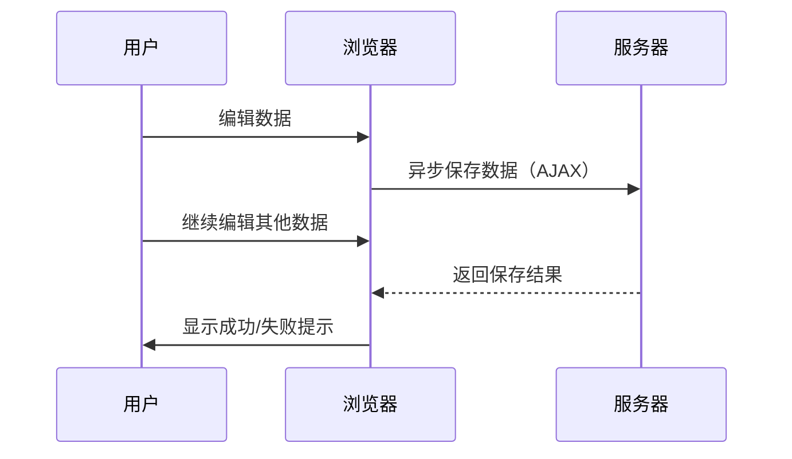
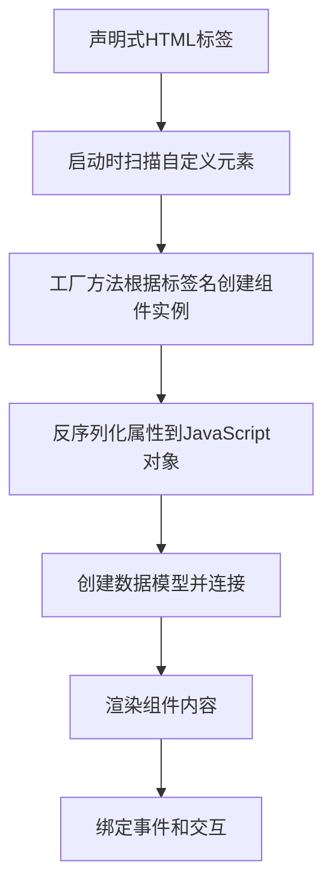

# 《AJAX企业级开发》章节总结

## 书籍信息

- 书名：AJAX企业级开发
- 作者：[加] David Johnson, Alexei White, Andre Charland 著；张祖良，荣浩，高冰 译
- 出版社：人民邮电出版社
- 出版年份：2008
- PDF状态：扫描版，文本层完整
- OCR状态：良好

## 目录说明

- 目录识别情况：完整（第1章至第11章+附录）
- 章节对应依据：按原书顺序
- OCR修复说明：无

## 全书核心主题

本书面向企业级AJAX开发，涵盖从设计、架构、组件构建到性能优化、安全性、可用性等全方位内容。强调使用MVC模式、声明式组件、离线存储、Web服务集成等高级技术，并通过案例研究展示企业应用中的最佳实践。

---

## 第1章：AJAX和RIA

### 核心论点

本章阐述AJAX在企业应用中的价值：改善用户体验、减少网络和服务器负载、创建新型数据驱动的应用。

### 关键概念/事件

- **传统Web应用之痛**：全页面刷新、低效的数据编辑、糟糕的交互。
- **AJAX优势**：异步请求、局部刷新、类似桌面的交互（拖拽、快捷键）。
- **企业采用驱动**：可用性提升、网络利用率提高、数据为中心、技能复用。
- **替代技术**：XUL、XAML、Java Applet、Flash/Flex、OpenLaszlo。
- **统计数据**：2006年已有约19%的企业部署了AJAX产品系统。

### 逻辑推演/叙事脉络

从企业CRM/ERP系统的低效出发，对比传统Web应用和AJAX应用在数据编辑场景下的时序图，展示AJAX如何让用户继续工作而不必等待。然后引用调查数据说明AJAX在企业中的普及趋势。最后概述全书内容。

### 流程图

### 经典金句/数据

> “AJAX不仅能够改善陈旧过时的Web架构，而且还可以使基于Web的应用在可用性和用户体验方面与桌面应用的地位相互竞争，甚至是超越桌面应用。” (p.1)

---

## 第2章：AJAX构建块

### 核心论点

本章系统介绍AJAX的核心技术：JavaScript面向对象编程、DOM操作、CSS动态样式、事件处理、XMLHttpRequest以及数据传输格式（XML/JSON）。

### 关键概念/事件

- **JavaScript OOP**：构造函数、原型（prototype）、继承、闭包、命名空间。
- **DOM操作**：getElementById、createElement、appendChild、innerHTML。
- **CSS动态样式**：style对象、className、样式表规则操作。
- **跨浏览器事件**：attachEvent vs addEventListener，事件冒泡/捕获。
- **XMLHttpRequest**：创建、发送请求、处理响应（同步/异步）。
- **数据格式**：XML（DOM解析）、JSON（eval解析）。

### 逻辑推演/叙事脉络

先讲解JavaScript类型、闭包、面向对象实现（包括私有成员和继承）。然后演示DOM基本操作和动态创建内容。接着讨论CSS样式动态修改。重点讲解跨浏览器事件模型的封装。最后深入XHR对象的使用和工厂模式封装。

### 经典金句/数据

> “在JavaScript中，所有的函数都是对象，这提供了极大的灵活性。” (p.17)

---

## 第3章：Web浏览器中的AJAX

### 核心论点

本章讨论如何在浏览器中实现基于组件的AJAX开发，重点介绍MVC模式在客户端的应用，以及如何启动、加载和调试AJAX组件。

### 关键概念/事件

- **渐增AJAX**：在现有应用中逐步引入AJAX组件，而非完全重写。
- **DOCTYPE与盒子模型**：标准模式vs怪异模式，IE的盒子模型差异。
- **启动技术**：onload事件、DOMContentLoaded、延迟脚本（defer）、条件注释。
- **MVC模式**：视图（HTML/DOM）、控制器（事件处理）、模型（数据存储）。
- **观察者模式**：使用SubjectHelper实现模型变化通知视图更新。

### 逻辑推演/叙事脉络

先讨论基于组件的AJAX开发的优势（可复用、服务器中立）。然后分析HTML标准和浏览器兼容性问题（DOCTYPE、盒子模型）。接着介绍多种启动AJAX组件的方法，并强调“当好邻居”（不破坏其他脚本）。最后详细实现一个基于MVC的客户端数据模型和事件管理器。

### 经典金句/数据

> “MVC模式通常被运用在基于客户端和服务器的上下文中，在客户端实现视图，在服务器封装控制器和模型。” (p.66)

---

## 第4章：AJAX组件

### 核心论点

本章讲解如何构建可复用的AJAX用户界面组件，比较命令式与声明式组件的优劣，并通过一个完整的数据网格（DataGrid）示例演示声明式组件的实现。

### 关键概念/事件

- **命令式组件**：通过JavaScript代码动态创建，如Google Maps。
- **声明式组件**：使用自定义HTML标签描述组件，解析后生成实例。
- **行为式组件**：对现有HTML元素增加AJAX行为（如可排序表格）。
- **数据绑定**：将客户端数据模型绑定到视图，支持单结点和结点集。
- **模板技术**：XSLT、字符串模板、JSON模板。
- **事件和继承**：组件生命周期、反序列化、事件处理。

### 逻辑推演/叙事脉络

先比较命令式和声明式方法（以Google Maps为例）。然后展示如何将命令式组件转化为声明式组件，使用自定义命名空间和工厂方法。接着以数据网格为例，详细讲解组件设计（UML类图）、反序列化、模板渲染、数据源连接（RemoteDataModel）。最后提供完整的声明式使用示例。

### 流程图

### 经典金句/数据

> “声明式编程仅仅是一段XML代码片段，这种方式意味着我们能够使用XML Schema确保一段声明的代码能够遵循所期望的XML结构。” (p.104)

---

## 第5章：从设计到部署

### 核心论点

本章覆盖AJAX应用从设计、原型、测试到部署的完整生命周期，重点讨论性能优化、测试驱动开发、调试工具和部署技巧。

### 关键概念/事件

- **设计**：MVC建模、性能预考虑（带宽、JavaScript效率、缓存策略）。
- **原型**：线框绘制、交互瞬间矩阵、使用Visio/Fireworks模拟。
- **测试**：JSUnit（单元测试）、Selenium（功能测试）、持续集成。
- **调试**：Venkman、MS Script Debugger、Firebug、Fiddler。
- **部署**：JavaScript压缩（Gzip、Minify）、图片合并、代码混淆、文档生成（JSDoc）。

### 逻辑推演/叙事脉络

按照软件工程流程：设计→原型→测试→部署。每部分给出具体工具和方法，如使用Firebug分析网络流量、使用JSUnit进行TDD、使用Gzip压缩JavaScript等。强调性能基线测量和避免过早优化。

### 经典金句/数据

> “在AJAX应用中，性能问题必须重点对待，它既包括了JavaScript的性能，也包括了网络加载数据的等待时间和服务器负载。” (p.131)

---

## 第6章：AJAX架构

### 核心论点

本章讨论AJAX应用的架构决策：异步消息、服务器推送（Comet）、缓存策略、并发控制、离线存储等。

### 关键概念/事件

- **多层架构**：客户端层、表现层、业务逻辑层、集成层、数据层。
- **轮询 vs 推送**：轮询（setInterval）简单但浪费资源，Comet（长连接）实时性好但服务器压力大。
- **缓存**：浏览器缓存、服务器缓存、数据库缓存、组件级缓存。
- **并发控制**：悲观锁定、乐观锁定、冲突检测与解决。
- **离线AJAX**：Firefox DOM Storage、IE userData、Flash SharedObject。
- **可伸缩性**：负载平衡、群集、数据库分区。

### 逻辑推演/叙事脉络

先介绍n层架构的概念，然后比较轮询和服务器推送两种数据更新模式。接着详细讨论缓存的各种层次和实现方法。然后分析并发问题，给出乐观锁定的实现（使用ETag/If-Match）。最后介绍离线存储技术，并讨论离线应用的并发同步问题。

### 经典金句/数据

> “Comet是一种数据推送技术模式，包含了发送异步XHR请求到服务器，并且希望服务器在延缓一段时间间隔后给出响应。” (p.163)

---

## 第7章：Web Service和安全性

### 核心论点

本章讲解如何在AJAX中使用Web服务（SOAP、REST），以及AJAX应用面临的主要安全问题：XSS、CSRF、SQL注入、JSON劫持等。

### 关键概念/事件

- **Web服务协议**：REST、XML-RPC、SOAP。
- **跨域访问**：服务器代理、URL片段标识符、Flash跨域XML、脚本注入（JSONP）。
- **XSS防御**：输出编码、HttpOnly Cookie、内容安全策略。
- **CSRF防御**：请求令牌、验证Referer、双重提交Cookie。
- **SQL注入防御**：预处理语句、存储过程、白名单输入验证。
- **数据加密**：SSL、客户端加密（JavaScript加密不可信）。

### 逻辑推演/叙事脉络

先介绍各种Web服务协议在AJAX中的应用方式。然后重点解决跨域问题，给出多种解决方案及安全性分析。接着系统阐述AJAX安全威胁，每类攻击都给出防御措施。最后强调防火墙和SSL的作用。

### 经典金句/数据

> “SSL可以阻止第三方窃听传输的数据，但是一旦服务端的响应信息到达客户端，就会在用户的机器上对传输数据进行解密。” (p.94)

---

## 第8章：AJAX可用性

### 核心论点

本章讨论AJAX应用的可用性问题：后退按钮、书签、页面大小、自动提交，以及可访问性（屏幕阅读器、键盘导航）。

### 关键概念/事件

- **后退按钮问题**：使用URL哈希（#）或HTML5 History API模拟导航。
- **书签**：通过location.hash保存状态，页面加载时恢复。
- **页面大小**：避免过大JS库，按需加载。
- **自动提交**：使用防抖（debounce）避免频繁请求。
- **可访问性**：为屏幕阅读器提供替代内容（noscript）、使用ARIA角色、键盘事件支持。
- **可用性测试**：线框测试、用户测试、软件辅助测试。

### 逻辑推演/叙事脉络

首先列举AJAX应用常见的可用性陷阱。然后给出后退按钮和书签的解决方案（iframe history、hashchange）。接着讨论页面大小和自动提交的优化。重点讲解如何使AJAX应用兼容屏幕阅读器（JAWS）和键盘用户。最后介绍可用性测试方法。

### 经典金句/数据

> “Web应用中，大多数用户已经习惯了完全页面刷新的方式，因此突然改变可能让他们感到困惑。” (p.219)

---

## 第9章：用户界面模式

### 核心论点

本章总结常见的AJAX UI设计模式，包括显示模式（拖拽、进度条、工具提示、即时编辑）和交互模式（实时搜索、即时表单验证、主从视图）。

### 关键概念/事件

- **拖拽**：使用script.aculo.us或jQuery UI实现可排序列表。
- **进度条**：轮询服务器获取任务完成百分比，动态更新进度显示。
- **即时编辑**：双击文本变为可编辑输入框，失焦时保存。
- **实时搜索**：输入时动态过滤结果列表，使用防抖技术。
- **即时表单验证**：输入时实时验证，显示错误提示。
- **主从视图**：点击主列表项，从视图显示详细信息（通过Ajax加载）。

### 逻辑推演/叙事脉络

每个模式给出场景描述、实现要点和代码示例。重点演示使用Prototype/Scriptaculous实现拖拽排序，以及使用XHR实现实时搜索。强调用户反馈（如加载指示器、颜色淡出）。

### 经典金句/数据

> “YFT是指取页面中有变化的部分，并置为黄色，过一段时间后再让黄色逐渐褪色，直到恢复为原来的背景色。” (p.18)

---

## 第10章：风险和最佳实践

### 核心论点

本章评估AJAX项目的风险来源（技术、文化、市场），并提出最佳实践：渐进增强、不唐突的JavaScript、Google网站地图、可视化提示等。

### 关键概念/事件

- **技术风险**：浏览器兼容性、可维护性、第三方框架过时。
- **文化风险**：用户期望、培训成本、法律合规（可访问性）。
- **市场风险**：搜索引擎索引、盈利模式、竞争对手。
- **渐进增强**：先构建基本功能（无JavaScript），再添加AJAX增强。
- **不唐突的JavaScript**：将JavaScript与HTML分离，避免onclick属性。
- **网站地图**：提供HTML站点地图或XML sitemap，帮助搜索引擎爬取。
- **可视化提示**：加载指示器、颜色淡出、进度条。

### 逻辑推演/叙事脉络

首先列出三大类风险，并详细分析每种风险的具体表现。然后给出对应的最佳实践，强调“渐进增强”原则：确保网站在JavaScript禁用时仍然可用。最后提出评估和决策框架。

### 经典金句/数据

> “渐进增强和不唐突的JavaScript是构建健壮、可访问、易于维护的AJAX应用的关键。” (p.267)

---

## 第11章：案例研究

### 核心论点

本章通过三个真实企业案例（美国国防部网站、Agrium公司、国际物流公司）展示AJAX技术的实际应用效果和经验教训。

### 关键概念/事件

- **美国国防部网站**：使用AJAX改善内部工具的用户体验，提高效率。
- **Agrium公司**：将传统报表系统改为AJAX驱动的实时仪表板。
- **国际物流公司**：使用AJAX实现实时货物跟踪和地图显示。
- **共同经验**：先进行小规模试点，培训用户，确保后端服务稳定，重视性能测试。

### 逻辑推演/叙事脉络

每个案例介绍背景、挑战、解决方案、采用的技术和成果。总结出企业级AJAX成功的关键因素：高层支持、用户参与、迭代开发、充分测试。

### 经典金句/数据

> “企业级AJAX的成功不仅仅是技术问题，更是组织变革和用户接受的问题。” (p.283)

---

