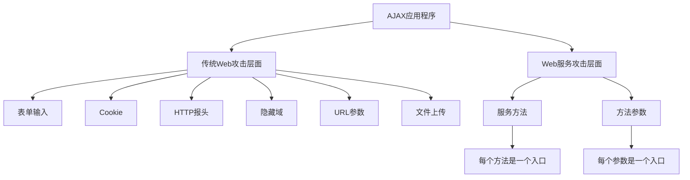
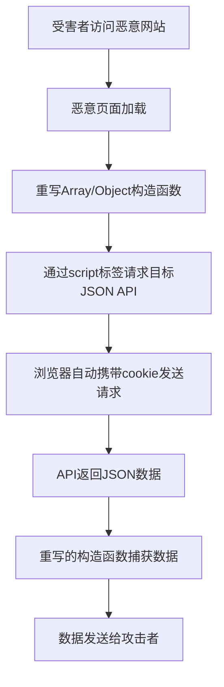

# 《AJAX安全技术》章节总结

## 书籍信息

- 书名：AJAX安全技术
- 作者：[美] Billy Hoffman, Bryan Sullivan 著；张若飞 主译
- 出版社：电子工业出版社
- 出版年份：2009
- PDF状态：扫描版，文本层质量较好，图片清晰
- OCR状态：可完整识别

## 目录说明

- 目录识别情况：完整目录（第1章至第15章+附录）
- 章节对应依据：按原书顺序
- OCR修复说明：无明显错漏

## 全书核心主题

本书是防范AJAX安全漏洞的实用指南。系统分析了AJAX应用程序面临的独特安全风险，包括过度细分的Web服务、控制流程篡改、JSON劫持、客户端存储攻击、跨站脚本和SQL注入的变种等。通过真实案例（MySpace Samy蠕虫、Yahoo! Yamanner蠕虫）讲解攻击原理，并提供防御策略和最佳实践。

---

## 第1章：AJAX安全介绍

### 核心论点

本章介绍AJAX的基本概念、架构演变及其安全影响。作者指出：AJAX同时具有胖客户端和瘦客户端的安全缺陷，因此更易受攻击。

### 关键概念/事件

- **AJAX架构定位**：介于胖客户端和瘦客户端之间，既在客户端处理逻辑，又依赖服务器通信。
- **同源策略**：JavaScript只能访问同一域、协议、端口的资源。
- **安全风险来源**：复杂度增加、透明度增加、攻击面扩大。
- **攻击目标**：窃取数据、冒充用户、篡改页面、拒绝服务。

### 逻辑推演/叙事脉络

先回顾胖客户端（逻辑暴露）和瘦客户端（网络传输易拦截）的安全问题，然后指出AJAX继承了二者的缺陷。接着分析为什么AJAX成为攻击目标：价值高、防御薄弱。最后强调开发人员必须重新思考安全设计。

### 经典金句/数据

> “从安全角度讲，AJAX实际上是最差的一种架构，因为它囊括了另外两种架构中所有的安全缺陷。” (p.35)

---

## 第2章：劫持

### 核心论点

通过一个虚构的在线旅行网站HighTechVacations.net被攻击的故事，演示攻击者如何利用AJAX漏洞（票务代码硬编码、客户端数据绑定、暴露的管理API）进行渗透。

### 关键概念/事件

- **票务代码破解**：客户端JavaScript中的加密算法被逆向，所有优惠码泄露。
- **SQL注入+客户端绑定**：服务端返回原始错误信息，客户端未处理，攻击者直接读取数据库所有表。
- **暴露的管理API**：未授权访问的addUser服务，通过调试参数创建管理员后门。
- **攻击工具**：Firebug、HTTP代理、HTTP编辑器、JavaScript反混淆器。

### 逻辑推演/叙事脉络

以故事线展开：Eve从查看源代码、禁用右键菜单绕过，到使用Firebug和反混淆工具分析JavaScript，然后利用SQL注入获取全部用户数据，最后通过调用隐藏的Web服务创建管理员账户。每个攻击步骤都对应一种典型漏洞。

### 经典金句/数据

> “服务端API的存在同样也增加了应用程序的攻击层面。” (p.40)

---

## 第3章：Web攻击

### 核心论点

本章分类介绍传统Web攻击（资源枚举、参数操纵、XSS、CSRF、SQL注入等）的原理及其在AJAX环境下的表现形式。

### 关键概念/事件

- **资源枚举**：猜解备份文件、测试页面、日志文件等孤立资源。
- **参数操纵**：SQL注入、XPath注入、命令执行、文件提取。
- **跨站脚本（XSS）**：反射型、存储型、DOM-based，窃取cookie、钓鱼。
- **跨站请求伪造（CSRF）**：利用已认证用户的会话发送恶意请求。
- **拒绝服务（DoS）**：洪水请求使服务器过载。

### 逻辑推演/叙事脉络

按攻击类别依次讲解，每个类别配以真实案例和代码示例。强调输入验证的重要性，并比较黑名单和白名单验证的优劣。

### 经典金句/数据

> “黑名单验证只能有效地防止已知的威胁，却对将来可能产生的威胁无能为力。” (p.109)

---

## 第4章：AJAX攻击层面

### 核心论点

本章定义“攻击层面”概念，并指出AJAX应用程序的攻击层面是传统Web应用和Web服务的超集，因此需要保护更多的入口。

### 关键概念/事件

- **攻击层面**：应用程序中所有可能被攻击者利用的入口点。
- **传统输入点**：表单输入、cookie、HTTP报头、隐藏域、URL参数、上传文件。
- **Web服务输入点**：方法名、参数（每个参数都是一个攻击点）。
- **AJAX特有的输入点**：通过JavaScript暴露的服务端API、客户端序列化数据、JSON回调。
- **输入验证策略**：白名单优于黑名单，正则表达式定义合法格式。

### 逻辑推演/叙事脉络

用银行金库与超市的类比说明多入口带来的安全挑战。然后枚举传统Web应用和Web服务的攻击层面，再叠加得到AJAX的攻击层面。最后详细讨论如何实施有效的输入验证，包括验证富客户端数据（XML、二进制、JavaScript代码）。

### 流程图

### 经典金句/数据

> “安全最差的入口决定建筑的整体安全性，正如一条铁链的强度只由最弱的环节决定。” (p.92)

---

## 第5章：AJAX代码的复杂性

### 核心论点

本章分析导致AJAX安全漏洞的复杂性因素：多语言混合、JavaScript的怪异特性（解释型、弱类型）、异步编程带来的竞争条件和死锁。

### 关键概念/事件

- **多语言差异**：数组索引（0-based vs 1-based）、字符串操作（replace、substring）、代码注释可见性。
- **JavaScript弱类型**：变量作用域、隐式全局变量、eval动态执行。
- **竞争条件**：多个线程同时访问共享资源，导致数据不一致（如银行存款并发问题）。
- **死锁**：资源互相等待，导致系统挂起。
- **客户端同步无效**：安全措施必须在服务端实施。

### 逻辑推演/叙事脉络

先指出AJAX涉及多种语言（JavaScript、PHP、SQL、HTML、CSS），不同语言间的细微差别容易引入漏洞。然后深入JavaScript的特性（解释执行、弱类型、prototype继承）如何导致意外行为。接着分析异步编程的难点：竞争条件和死锁，并用银行转账示例说明。最后给出解决同步问题的建议。

### 经典金句/数据

> “千万不要以为不通过Web浏览器，黑客们就无法进行攻击。” (p.95)

---

## 第6章：AJAX应用程序的透明度

### 核心论点

本章论述AJAX应用程序比传统Web应用更透明（白盒），攻击者可以通过查看源代码、分析API、调试JavaScript来了解系统内部逻辑，从而更容易发现漏洞。

### 关键概念/事件

- **黑盒 vs 白盒**：传统Web应用是黑盒，AJAX应用是白盒（源代码可读）。
- **API暴露**：服务端方法签名、参数类型在客户端可见。
- **常见错误**：不恰当的身份认证、过度细化服务端API、在JavaScript中存储会话状态、硬编码敏感数据、客户端数据转换。
- **混淆的局限性**：只能增加阅读难度，不能阻止有决心的攻击者。
- **防御建议**：将核心业务逻辑放在服务端，只在客户端保留表示层逻辑。

### 逻辑推演/叙事脉络

比较天气预报网站非AJAX版和AJAX版的透明程度，展示AJAX版暴露了更多实现细节（调用哪些Web服务、参数格式）。然后列举常见的因透明度过高导致的安全错误。最后讨论“通过隐藏来保证安全”的误区，强调混淆不能替代真正的安全机制。

### 经典金句/数据

> “永远不要相信，客户端代码会按照预先的设计去执行，甚至可能都没有执行。” (p.166)

---

## 第7章：劫持AJAX应用程序

### 核心论点

本章展示攻击者如何通过JavaScript的方法覆盖和原型篡改，劫持AJAX框架（如Prototype）、拦截JSON API响应，从而窃取敏感数据。

### 关键概念/事件

- **方法重写**：JavaScript允许重新定义已有方法（如alert、Array构造函数）。
- **劫持Prototype**：覆盖Ajax.Request和onSuccess回调，截获所有AJAX通信。
- **即时AJAX**：动态加载的JavaScript代码也可以被劫持。
- **JSON劫持**：利用CSRF和重写Array/Object构造函数，窃取返回的JSON数据。
- **防御**：在JSON响应前添加死循环（for(;;);）防止恶意脚本解析。

### 逻辑推演/叙事脉络

先展示如何通过闭包重写window.alert，然后扩展到劫持Prototype框架的Ajax.Request。接着介绍“即时AJAX”的劫持技术，使用HOOK工具监控动态加载的方法。最后重点讲解JSON劫持的原理和攻击步骤，并通过Gmail案例说明防御措施。

### 流程图

### 经典金句/数据

> “JavaScript程序可以在执行过程中对自身进行修改，这使得其他的JavaScript程序可以劫持AJAX应用程序。” (p.175)

---

## 第8章：攻击客户端存储

### 核心论点

本章详细分析各种客户端存储机制（Cookie、Flash LSO、DOM Storage、IE userData）的安全问题，包括跨域访问、数据泄露、篡改等。

### 关键概念/事件

- **Cookie**：会话劫持、跨域访问控制（domain/path/secure/HttpOnly标志）。
- **Flash LSO**：可存储大量数据，跨域策略文件配置不当可能导致数据泄露。
- **DOM Storage**：sessionStorage和globalStorage，同源策略但存储容量大。
- **IE userData**：持久化存储，无加密，可被其他站点读取（如果路径配置不当）。
- **攻击方式**：跨域攻击、跨目录攻击、跨端口攻击。
- **防御**：避免存储敏感数据，设置合理的过期时间和访问控制。

### 逻辑推演/叙事脉络

按存储类型分别介绍其工作原理、访问控制规则和存储能力。然后分析每种存储可能存在的安全漏洞，并给出攻击示例。最后总结一般性的客户端存储安全建议。

### 经典金句/数据

> “客户端的机器是一个可以用来存放数据的安全地方？错误观点。” (p.199)

---

## 第9章：离线AJAX应用程序

### 核心论点

本章讨论离线AJAX（Google Gears、Dojo.Offline）的安全风险，包括本地服务器数据泄露、SQL注入、密钥管理等问题。

### 关键概念/事件

- **Google Gears**：提供本地数据库（SQLite）、本地服务器、工作者池。
- **安全缺陷**：本地服务器中的文件可能被恶意脚本读取；数据库未加密；SQL注入风险。
- **Dojo.Offline**：使用密钥加密本地数据，密钥存储在客户端，可能被窃取。
- **客户端SQL注入**：恶意JavaScript可以构造SQL语句查询本地数据库中的敏感信息。
- **防御**：对本地存储的数据进行加密，使用参数化查询，限制离线应用的权限。

### 逻辑推演/叙事脉络

首先介绍离线AJAX的需求和实现技术（Google Gears、Dojo.Offline）。然后分析各自的安全特性及其缺点，重点演示如何通过JavaScript注入攻击本地数据库。最后提出改进措施：强加密、输入验证、及时清理敏感数据。

### 经典金句/数据

> “客户端SQL注入同样危险，因为离线应用中可能存储了用户的个人信息或缓存的企业数据。” (p.230)

---

## 第10章：请求来源问题

### 核心论点

本章讨论HTTP请求来源的不可靠性，以及如何利用XMLHttpRequest进行跨站请求伪造和窃取数据。提出防范措施：验证Referer、使用一次性令牌（CSRF token）。

### 关键概念/事件

- **请求来源不确定性**：服务器无法区分请求来自合法用户还是攻击者。
- **JavaScript发送HTTP请求**：XHR、Image对象、script标签等。
- **窃取数据**：通过XHR获取其他域的资源（受同源策略限制），但可以利用XSS绕过。
- **CSRF防御**：在表单中添加随机令牌，服务端验证令牌。
- **Referer检查**：不可靠，因为Referer可以被伪造或缺失。

### 逻辑推演/叙事脉络

先说明Web服务器面对HTTP请求时无法确认来源。然后展示JavaScript可以通过多种方式发送请求，包括跨域（通过JSONP）。接着分析如何结合XSS和XHR窃取敏感数据。最后给出防范CSRF和XSS的综合建议。

### 经典金句/数据

> “跨站请求伪造攻击是通过受害人的浏览器，使用网站对受害人的信任授权直接发送伪造的请求。” (p.86)

---

## 第11章：Web Mashup和聚合程序

### 核心论点

本章分析Mashup程序的安全风险，特别是通过代理脚本访问第三方API时可能产生的注入攻击和信任问题。

### 关键概念/事件

- **Mashup**：组合多个外部数据源（如Google地图+房产信息）。
- **代理脚本**：绕过同源策略，但代理本身可能被滥用（攻击者通过代理访问任意URL）。
- **输入验证**：代理脚本必须严格验证目标URL，防止SSRF（服务端请求伪造）。
- **信任降级**：Mashup依赖第三方服务，第三方被攻击则Mashup也受影响。
- **防御**：使用白名单限制代理可访问的域名，对返回数据进行过滤。

### 逻辑推演/叙事脉络

介绍Web从“人类Web”到“机器Web”的演变，引出Mashup的概念和示例（ChicagoCrime.org、HousingMaps.com）。然后分析Mashup的架构：客户端直接调用第三方API（跨域限制）或通过本地代理。重点讨论代理脚本的安全漏洞，以及如何通过输入验证防范。最后讨论聚合网站的安全性和信任模型。

### 经典金句/数据

> “如果一个攻击者能够控制代理脚本，他就可以读取内网中的任何资源，或者发起对其他系统的攻击。” (p.276)

---

## 第12章：攻击表现层

### 核心论点

本章阐述攻击者如何通过篡改CSS样式表来改变页面外观、隐藏内容或误导用户，以及如何从CSS中挖掘敏感信息。

### 关键概念/事件

- **表现分离**：CSS控制样式，但攻击者可以修改CSS来隐藏表单字段或改变按钮行为。
- **数据挖掘**：通过CSS选择器（如属性选择器）可以探测页面中的特定内容。
- **外观篡改**：覆盖原有样式，使钓鱼表单看起来像合法表单。
- **防御**：使用内容安全策略（CSP），限制内联样式和外部样式表的来源。

### 逻辑推演/叙事脉络

先说明CSS的作用和动态修改样式的方法。然后演示攻击者如何利用用户脚本或XSS注入CSS，将页面中的登录表单替换为恶意的钓鱼表单。接着介绍通过CSS属性选择器窃取CSRF令牌的技术。最后提出防范措施：限制样式来源、使用CSP。

### 经典金句/数据

> “CSS不仅用于美化，还可以作为攻击向量，攻击者可以利用它隐藏内容、误导用户或窃取信息。” (p.294)

---

## 第13章：JavaScript蠕虫

### 核心论点

本章通过分析Samy蠕虫和Yamanner蠕虫的真实案例，讲解JavaScript蠕虫的传播机制、危害以及防范方法。

### 关键概念/事件

- **Samy蠕虫**：2005年10月感染MySpace，利用XSS漏洞传播，在用户个人资料中添加“Samy is my hero”。
- **传播方式**：通过AJAX请求将恶意代码复制到受害者的个人资料，然后所有浏览该资料的用户被感染。
- **Yamanner蠕虫**：感染Yahoo!邮件，利用XSS漏洞，向所有联系人发送恶意邮件。
- **蠕虫携带的代码**：窃取cookie、发送垃圾邮件、进行DDoS攻击。
- **防御**：对用户输入进行严格的HTML过滤，使用HttpOnly Cookie，实施同源策略。

### 逻辑推演/叙事脉络

先介绍传统计算机病毒与JavaScript蠕虫的区别。然后详细解析Samy蠕虫的源代码（附录A），解释其如何利用MySpace的XSS漏洞和AJAX功能实现自动传播。接着分析Yamanner蠕虫的工作原理。最后总结从这些案例中汲取的教训：输入验证、输出编码、限制跨域请求。

### 经典金句/数据

> “MySpace还没有使用AJAX！实际上，Samy蠕虫是通过MySpace代码中的一个安全漏洞将AJAX代码注入到MySpace中的。” (p.23)

---

## 第14章：测试AJAX应用程序

### 核心论点

本章指导如何对AJAX应用程序进行安全测试，包括使用自动化工具（Sprajax、Paros Proxy、WebInspect）和手工测试方法。

### 关键概念/事件

- **测试挑战**：AJAX应用动态加载内容，传统爬虫无法发现所有页面和API。
- **Sprajax**：专门用于AJAX应用的安全测试工具，能够解析JavaScript并发现Web服务调用。
- **Paros Proxy**：HTTP代理，可拦截和修改请求，用于手工测试。
- **LAPSE**：Eclipse插件，用于静态分析Java代码中的安全漏洞。
- **WebInspect**：商业Web应用扫描器，支持AJAX。
- **手动测试**：使用Firebug、HTTP Editor等工具分析请求和响应。

### 逻辑推演/叙事脉络

首先指出传统Web漏洞扫描器对AJAX应用失效，因为很多请求是JavaScript动态生成的。然后介绍专门针对AJAX的测试工具及其原理。最后强调自动化测试与手工测试相结合的重要性。

### 经典金句/数据

> “并不是所有人都使用浏览器来查看网页——攻击者使用自定义的HTTP客户端，可以绕过任何客户端限制。” (p.349)

---

## 第15章：AJAX框架分析

### 核心论点

本章评估主流AJAX框架（ASP.NET AJAX、Sajax、Prototype等）的安全特性，指出常见的配置错误和编码缺陷。

### 关键概念/事件

- **ASP.NET AJAX**：ScriptService默认允许GET/POST，需要添加[ScriptMethod(UseHttpGet=false)]限制；ValidateRequest可防止XSS但可能误拦；ViewStateUserKey可防CSRF。
- **Sajax（PHP）**：容易受到CSRF攻击，因为所有请求都是GET且没有令牌。
- **Java EE**：DWR框架需要正确配置访问权限，避免暴露危险方法。
- **Prototype**：客户端框架，本身不引入服务端漏洞，但滥用其Ajax.Request可能导致安全问题。
- **通用建议**：最小化暴露的服务端方法，使用CSRF令牌，验证输入，输出编码。

### 逻辑推演/叙事脉络

逐一分析各框架的安全机制和已知缺陷，给出配置建议。最后总结：框架不能自动解决安全问题，开发者仍需理解底层原理。

### 经典金句/数据

> “框架的使用实际上阻碍了开发人员对应用程序内部实现机制的深入了解。” (p.40)

---

