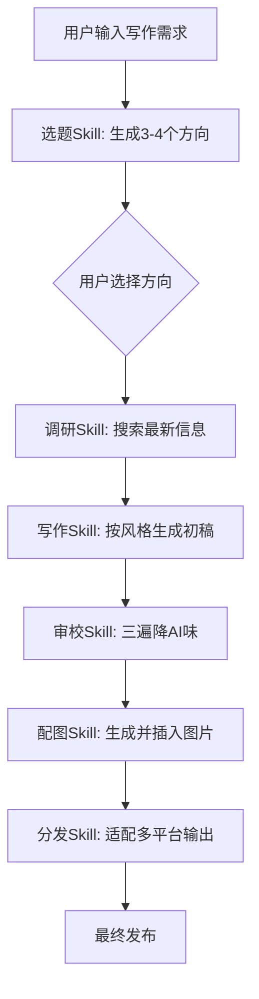
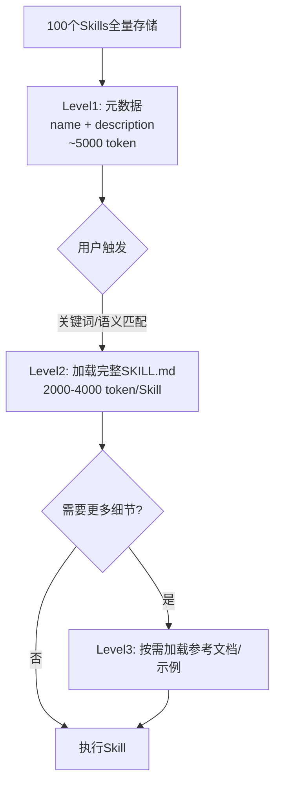
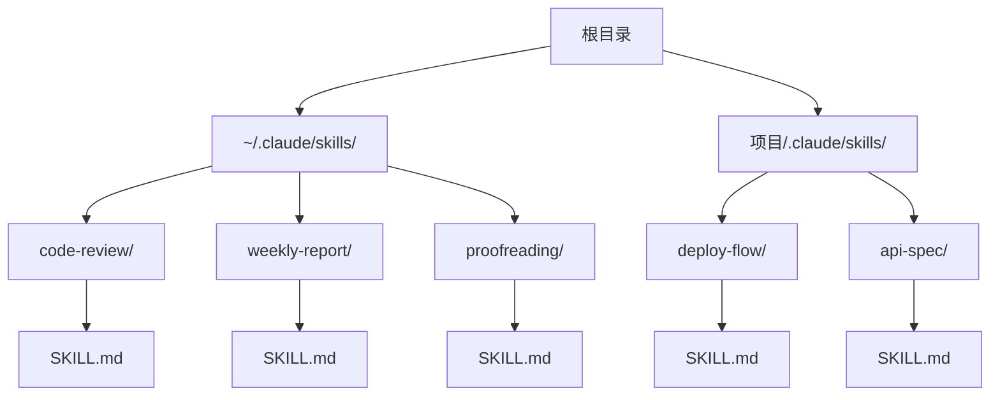
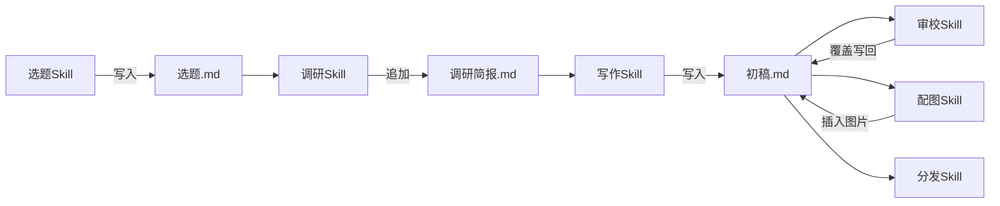
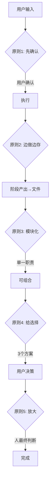
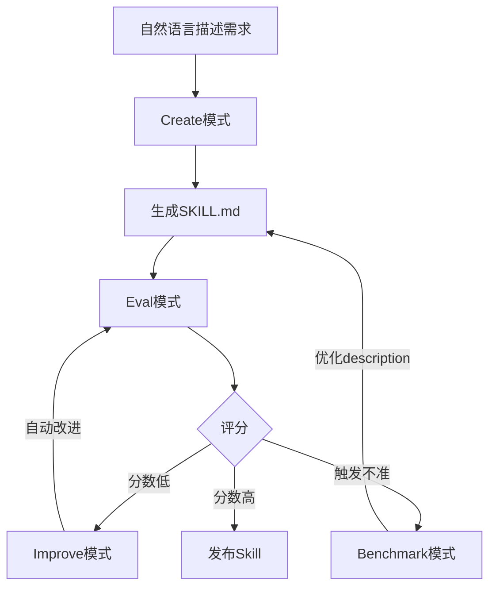
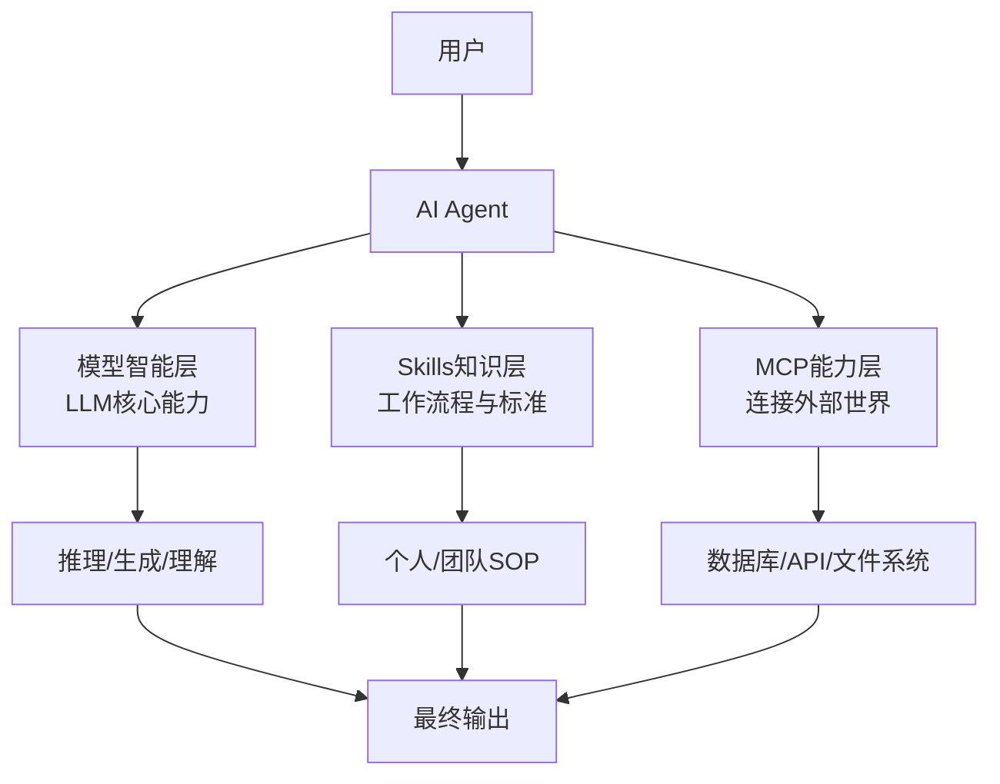

# 《Agent Skills橙皮书：给AI装技能的完全指南》章节总结

## 书籍信息
- **书名**：Agent Skills橙皮书：给AI装技能的完全指南
- **作者**：花叔
- **出品时间**：2026年4月12日
- **PDF状态**：完整，包含正文、目录、附录
- **OCR状态**：基本完整，部分页面有轻微文本偏移但内容可识别

## 目录说明
- **目录识别情况**：本书共10章正文 + 5个附录，无独立目录页，章节结构从正文中提取
- **章节对应依据**：按书中明确的章节标题（01-10）及附录A-E顺序整理
- **OCR修复说明**：部分页面底部有转载提示水印，但不影响正文理解

## 全书核心主题
本书系统讲解了AI Agent Skills的概念、原理、实战创建方法和未来趋势。作者认为，Skills是继Chat、Tool Use、MCP之后AI工具的第四次进化——从“AI能做什么”转向“AI按你的方式做”。Skills的本质是SKILL.md格式的自然语言文档，通过模块化、可触发、可分享的特性，让AI能够学习并固化用户的工作流程、审美偏好和质量标准。全书从概念建立、生态全景、安装使用，到自主创建、设计模式、未来展望，提供了一套完整的“给AI装技能”的方法论。核心观点是：Skills是AI时代的“工作SOP”，创建Skill的过程本身就是对自身工作方式的审视与优化。

---

## 第1章：AI工具的下一个进化

### 1. 核心论点
**问题**：为什么每次和AI对话都要从零开始教它自己的工作方式？  
**观点**：Agent Skills解决了AI“不记得”用户工作流程的问题，让AI从通用助手变成懂你的专属助手。

### 2. 关键概念/事件
- **四次进化**：Chat时代（2022）→ Tool Use/函数调用（2023）→ MCP协议（2024）→ Agent Skills（2025）
- **MCP vs Skills**：MCP是“手”（连接外部世界的能力接口），Skills是“新员工手册”（按你的方式做事的流程知识）
- **操作系统类比**：MCP=USB驱动，Skills=App应用
- **行业采纳**：截至2026年4月，20+产品支持Agent Skills标准（Claude Code、Cursor、GitHub Copilot等）

### 3. 逻辑推演/叙事脉络
作者从自身经历出发：用AI写公众号两年、做了几十个Skills，发现最大痛点是每次新对话AI都失忆。然后回溯AI工具的四次进化，用类比说明Skills在其中的位置——它不是让AI更聪明，而是让AI更懂你。最后用一篇公众号文章的完整工作流（选题→调研→写作→审校→配图→分发）展示多个Skills如何串联，并预告全书结构。

### 4. 方法流程图

### 5. 经典金句/数据
> “Skills解决的是一个更本质的问题：AI怎么按你的方式做。” (p.8)

> “MCP给了AI‘手’，Skills给了AI‘工作手册’。” (p.9)

> “20多个产品已经支持……意味着你写的一个SKILL.md文件，可以在所有这些产品上运行。” (p.12)

---

## 第2章：Skills的本质

### 1. 核心论点
**问题**：Skill到底是什么？和System Prompt、MCP、Cursor Rules有什么区别？  
**观点**：Skill本质上是一个叫SKILL.md的Markdown文本文件，通过模块化设计实现按需加载，与全局System Prompt有本质区别。

### 2. 关键概念/事件
- **SKILL.md结构**：YAML frontmatter（name + description）+ Markdown正文（执行流程）
- **三层特性**：模块化（按需加载）、可触发（关键词/语义匹配）、可分享（跨工具运行）
- **vs System Prompt**：全局永久加载 vs 模块化按需加载；27个Skills全写进System Prompt会占大量上下文
- **vs MCP**：能力接口 vs 知识和流程；Skill负责决策（先做什么），MCP负责执行（调接口）
- **vs Cursor Rules**：本质相同，但Skills是2025年底发布的开放标准，统一了各家碎片化格式
- **三遍审校案例**：6大类AI腔识别清单 + 花生风格改写规则，约300行

### 3. 逻辑推演/叙事脉络
作者先给出最简周报Skill例子（15行），拆解frontmatter和正文两层结构。然后逐一对比System Prompt、MCP、Cursor Rules，用表格和类比说明差异。最后以真实的三遍审校Skill（300行）展示真实复杂度，强调“与其给AI抽象指令，不如给具体示例”的核心设计原则。

### 4. 关键概念表

| 概念 | 本质 | 加载方式 | 作用 |
|------|------|----------|------|
| System Prompt | 全局规则 | 永久加载 | 公司规章制度 |
| Skill | 模块化文档 | 按需加载 | 岗位操作手册 |
| MCP | 能力接口 | 工具调用 | 连接外部服务 |

### 5. 经典金句/数据
> “一个Skill，本质上就是一个叫SKILL.md的文本文件。Markdown格式，用自然语言写成。没有代码，没有编译，没有API调用。” (p.16)

> “Skills的模块化设计，本质上是在有限的上下文窗口里做资源调度。” (p.19)

> “与其给AI抽象的指令，不如给它具体的示例。” (p.23)

---

## 第3章：Skills背后的原理

### 1. 核心论点
**问题**：凭什么一个文本文件就能改变AI的行为？  
**观点**：Skills利用了LLM的三个底层特性——指令遵循、上下文学习、条件触发，配合渐进式披露的加载架构，实现了低成本、高效率的行为定制。

### 2. 关键概念/事件
- **指令遵循**：LLM经过指令微调，对结构化指令（YAML + Markdown）理解最准确
- **上下文窗口**：LLM的“工作记忆”，Skills必须按需加载不能全量塞入
- **渐进式披露（Progressive Disclosure）**：三层架构——Level 1元数据（~5000 token）、Level 2完整SKILL.md（触发时加载）、Level 3附加资源（按需引用）
- **三种触发机制**：显式调用（/skill-name）> 关键词匹配 > 语义匹配
- **执行模型**：理解指令 → 规划步骤 → 调用工具（MCP）→ 执行 → 输出验证
- **Skill黄金长度**：500-2000字（太短没用，太长关键信息被淹没）

### 3. 逻辑推演/叙事脉络
作者先抛出问题“为什么文本文件能改变AI行为”，然后逐一解释三个底层原理。重点讲渐进式披露架构如何用最小token开销实现最大能力覆盖（装100个Skill，平时只有元数据在上下文）。接着讲触发机制的三级优先级和执行模型的五步流程。最后分享反直觉发现：好Skill不是越详细越好，500-2000字是最佳区间，并给出token占用估算。

### 4. 渐进式披露架构图

### 5. 经典金句/数据
> “Skills有效，是因为它利用了大语言模型的三个底层特性：指令遵循、上下文学习、条件触发。” (p.26)

> “好的菜谱不会告诉你怎么握刀、怎么开火。它假设你有基本的厨房常识。” (p.31)

> “1000字的中文大约是1500-2000 token。一个典型的Skill（1000-2000字）大约占2000-4000 token。” (p.32)

---

## 第4章：Skills生态全景

### 1. 核心论点
**问题**：去哪里找Skill？怎么判断好坏？  
**观点**：Skills数量已超100万，但质量参差不齐。知道去哪找、怎么选，比找到多少更重要。2026年最值得关注的新方向是“蒸馏宇宙”——从工具型Skill扩展到认知型Skill。

### 2. 关键概念/事件
- **开放标准**：agentskills.io，github.com/anthropics/skills，20+产品采纳
- **七大Sources**：Anthropic官方（标杆）、skills.sh（Vercel）、AgentSkill.sh（10.6万）、SkillsMP（70万+）、SkillHub（7000+有AI评审）、腾讯SkillHub（1.3万+国内）、字节生态
- **选Skill的5个标准**：触发条件清晰、执行步骤可验证、上下文占用合理、有示例、有版本记录
- **蒸馏宇宙**：2026年3月底爆发，同事.skill（离职同事→Skill）、前任.skill、自己.skill、反蒸馏.skill
- **女娲.skill**：作者开源项目，蒸馏思维框架层（乔布斯、马斯克、芒格、费曼等8个），两天GitHub star破千

### 3. 逻辑推演/叙事脉络
作者先说明生态现状（100万+ Skills但好用<1%），然后按官方到社区顺序介绍7个Sources，给出横向对比表格。接着提出5个选Skill标准（按重要性排序）。重点展开“蒸馏宇宙”现象：从同事.skill引爆，到女娲.skill把蒸馏从行为层推进到思维框架层。最后推荐DeepLearning.AI的免费课程。

### 4. 选Skill标准表格

| 标准 | 说明 | 重要性 |
|------|------|--------|
| 触发条件清晰 | description中有具体触发词 | ★★★★★ |
| 执行步骤可验证 | 有明确的步骤和检查点 | ★★★★☆ |
| 上下文占用合理 | 不超过2000-3000字 | ★★★☆☆ |
| 有示例 | 提供输入/输出示例 | ★★★☆☆ |
| 有版本记录 | 能追踪迭代历史 | ★★☆☆☆ |

### 5. 经典金句/数据
> “全网加起来超过100万个Skills，但真正好用的可能不到1%。” (p.36)

> “蒸馏宇宙证明了一件事：Skills已经从开发者工具破圈到了大众视野。” (p.43)

> “一边是工具型Skills（帮你做事），一边是认知型Skills（帮你思考）。后者的出现，让Skills从‘自动化工具’升级成了‘思维扩展器’。” (p.44)

---

## 第5章：安装你的第一个Skill

### 1. 核心论点
**问题**：怎么安装Skill？装在哪里？  
**观点**：安装Skill就是把SKILL.md文件放到正确目录。有四个层级（Enterprise/Personal/Project/Plugin），优先级从高到低。Claude Code、Cursor等工具都有对应的安装方式。

### 2. 关键概念/事件
- **四个层级**：Enterprise（公司级，最高优先级）→ Personal（用户级，~/.claude/skills/）→ Project（项目级，.claude/skills/）→ Plugin（插件级，命名空间隔离）
- **三种安装方式**：手动创建目录放文件、从市场/learn安装、从GitHub clone
- **路径规则**：`.claude/skills/skill-name/SKILL.md`（必须子文件夹，不能直接放skills/下）
- **验证方法**：说触发词看AI是否按流程走，或用/skills命令查看已加载Skills
- **三个上手Skill**：hello-world（验证安装）、frontend-design（官方示例）、proofreading（审校）

### 3. 逻辑推演/叙事脉络
作者强调安装Skill不需要编译依赖，本质就是放文件。然后讲四个层级的优先级关系，用文件树示例说明。接着分别介绍Claude Code、Cursor和其他主流工具的安装方式（规律都是`.[工具名]/skills/`）。给出验证方法和三个上手Skill的安装步骤。最后列出90%问题的三个排查方向：路径错误、触发词不匹配、YAML格式错误。

### 4. 文件目录结构图

### 5. 经典金句/数据
> “安装Skill比你想象的简单。最简单的方式就是把一个文件放到正确的目录。” (p.47)

> “把不常用的Skill从全局配置移到项目级配置，只在需要的项目里加载。” (p.61)

> “排查Skill不生效时，最快的方法是用斜杠命令强制触发。” (p.62)

---

## 第6章：用好Skills的实战技巧

### 1. 核心论点
**问题**：装了一堆Skill但感觉“没什么用”，问题出在哪？  
**观点**：Skill装上了只是开始。会触发、会组合、会排错，才算真正用起来了。核心技巧是三种触发方式的灵活运用、用文件系统串联多个Skills形成流水线、以及系统化的排查方法。

### 2. 关键概念/事件
- **三种触发方式**：显式（/skill-name，80%使用）、隐式（关键词匹配）、强制（/trigger）
- **排查四原因**：触发词不匹配、多Skill抢触发词、上下文太长Skill被挤出、Skill本身写得差
- **流水线串联**：用文件系统作为Skills之间的传送带（选题→调研→写作→审校，每步产出写入文件）
- **三遍审校实战**：事实核查 → 降AI味（6大类识别清单）→ 细节打磨 + 传播力审查
- **配图Skill**：17种视觉风格 + 两条路径（AI插画/HTML+CSS截图）
- **数据分析Skill**：多专家并行分析（趋势/异常/对比/建议），输出HTML报告

### 3. 逻辑推演/叙事脉络
作者先指出常见误区：装了很多Skill但从不触发。然后详细讲解三种触发方式及使用比例（80%显式、15%强制、5%隐式）。接着给出系统性排查方法（四个原因+斜杠命令测试法）。重点展示“流水线串联”模式：用文件系统作为接口，每一步产出写入文件，即使会话中断也能断点续传。最后用审校、配图、数据分析三个实战案例展示Skill在实际工作中的应用效果。

### 4. 流水线串联流程图

### 5. 经典金句/数据
> “用文件系统作为Skills之间的传送带。即使对话中断了，只要文件还在，下一个Skill就能从断点继续。” (p.63)

> “Skill的价值不在于AI做了你做不了的事，而在于AI用你习惯的方式做了你不想重复做的事。” (p.68)

> “先确认Skill能被触发，再优化Skill的产出质量。这两个是完全不同的问题。” (p.69)

---

## 第7章：创建你的第一个Skill

### 1. 核心论点
**问题**：不会编程，能创建Skill吗？  
**观点**：创建Skill的本质是把隐性知识变成显性文档，不需要写一行代码。核心是发现自己的工作模式，用自然语言写成结构化指令。

### 2. 关键概念/事件
- **隐性知识发现**：花3分钟想“每周五写周报，你是不是总会先翻聊天记录？按项目分类而不是时间？结尾写计划？关键数据加粗？”——这些“是不是”就是Skill内容
- **会议纪要Skill完整示例**：name + description + 执行步骤（确认输入→提取关键信息→按模板整理→写入文件）+ 注意事项
- **5个设计原则**：
  1. 先确认再动手（重要决策等用户点头）
  2. 边做边存（每阶段保存到文件）
  3. 模块化可组合（一个Skill只做一件事）
  4. 给选择不给答案（提供3个方案让用户选）
  5. 放大你而不是替代你（关键判断始终在人手里）
- **维护迭代**：审校Skill已迭代十几个版本，Skill超过3000字考虑拆分

### 3. 逻辑推演/叙事脉络
作者先用“你脑子里那套‘我每次都这样做’的流程是可以固化下来的”破题。然后引导读者发现自己的隐性知识（周报例子）。接着给出完整的会议纪要Skill作为模板，逐行拆解每个部分的作用。重点讲5个设计原则，每个原则都配有作者踩过的坑（如“先确认再动手”来自2000字白费的教训）。最后强调Skill需要迭代维护，不是一劳永逸。

### 4. 5个设计原则示意图

### 5. 经典金句/数据
> “创建Skill的本质，就是把你的隐性知识变成显性文档。” (p.71)

> “如果你要教一个刚入职的新人做这件事，你会怎么说？那些话，就是Skill的内容。” (p.71)

> “Skill是放大器，不是替代者。好的Skill让你做得更好更快，但关键判断始终在你手里。” (p.79)

---

## 第8章：用skill-creator自动创建Skills

### 1. 核心论点
**问题**：手写Skill不知道写得好不好，有没有工具帮忙？  
**观点**：Anthropic官方的skill-creator是一个meta-skill，用软件工程的严谨性（创建→评估→改进→验证）来创作Skill。Eval模式尤其有价值，能帮你看到自己Skill的盲点。

### 2. 关键概念/事件
- **四种模式**：
  - Create：自然语言描述 → 生成完整SKILL.md（先问澄清问题）
  - Eval：生成测试用例，对比“有Skill vs 无Skill”产出差异，用assertions评分
  - Improve：读取Eval结果，针对薄弱环节自动改进
  - Benchmark：优化description字段，提升触发精度
- **完整工作流**：Create → Eval → Improve → Benchmark，约10-15分钟
- **自动优化（hill-climbing）**：作者自建的huashu-auto-skill-optimizer，用7维度rubric自动打分→改进→保留高分版本
- **使用策略**：新手→Create模式；已有Skill→Eval+Improve；触发不准→Benchmark

### 3. 逻辑推演/叙事脉络
作者先指出手写的痛点：不知道自己写得好不好。然后介绍skill-creator的四种模式，重点讲Eval模式的价值——作者用它评估自认为“已经很好了”的审校Skill，结果发现有些测试用例里有Skill和没Skill差异很小，说明指令不够具体。接着给出完整工作流（创建PR描述生成Skill的例子）。最后讨论自动优化的边界（擅长结构性改进，不擅长“品味”层面），以及什么时候手写、什么时候用工具的建议。

### 4. skill-creator工作流程图

### 5. 经典金句/数据
> “skill-creator最大的价值不是帮你写Skill，而是帮你看到自己的Skill哪里有问题。” (p.88)

> “写Skill就像写代码。Create是scaffold，Eval是测试，Improve是重构，Benchmark是触发精度调优。” (p.89)

> “自动优化不是万能的。它擅长改进结构性的问题，但不擅长改进‘品味’层面的东西。” (p.87)

---

## 第9章：高级Skills设计模式

### 1. 核心论点
**问题**：面对复杂需求，Skill该怎么设计？  
**观点**：好用的Skill基本都能归入6种设计模式。掌握这些模式后，面对新需求不再是“从0到1的创造”，而是“从0.5到1的调整”。

### 2. 关键概念/事件
- **模式1 检查清单型**：AI逐项检查、标记问题、给出建议。案例：三遍审校Skill（6大类AI腔识别清单，分三遍执行）
- **模式2 多方案选择型**：AI不做决策做分析，提供3-4个方案及优劣分析，决策权在人。案例：选题生成Skill（每个方案有明确劣势）
- **模式3 多阶段流水线型**：大任务拆成多阶段，每阶段有明确输入输出，检查点分隔。案例：书籍PDF制作Skill（5阶段，每阶段产出写入文件）
- **模式4 外部API集成型**：调用外部服务，关键是错误处理和边界情况。案例：飞书集成Skill（图片三步法：创建block→上传拿token→PATCH替换）
- **模式5 多Agent协作型**：拆成独立子任务，多个Agent并行执行，最后合并。案例：蜂群开发Skill（纯git自组织，无master agent）
- **模式6 思维蒸馏型**：从公开材料提取思维框架，生成可对话推理的Skill。案例：女娲.skill（6 Agent采集→三重验证筛选→结构化输出）
- **模式组合**：真实Skill往往是2-3种模式的组合（如配图Skill=多方案选择+API集成+检查清单）

### 3. 逻辑推演/叙事脉络
作者先说明设计模式的价值（积木化思考）。然后逐一介绍6种模式，每种给出定义、适用场景、真实案例和设计技巧。重点对比思维蒸馏型和角色扮演的三个区别（能力来源、定位、价值）。最后用公众号配图Skill展示模式组合（多方案选择型→API集成型→检查清单型），并给出速查表格。

### 4. 6种设计模式速查表

| 模式 | 核心思想 | 适用场景 | 代表案例 |
|------|----------|----------|----------|
| 检查清单型 | 逐项检查，标记问题 | 审校、代码review | 三遍审校 |
| 多方案选择型 | AI分析，人决策 | 选题、设计风格 | 选题生成 |
| 多阶段流水线型 | 拆阶段，检查点分隔 | 端到端工作流 | 书籍PDF制作 |
| 外部API集成型 | 调服务，处理边界 | 飞书、图床 | 飞书集成 |
| 多Agent协作型 | 并行执行，合并结果 | 大规模独立任务 | 蜂群开发 |
| 思维蒸馏型 | 提取框架，运行推理 | 人物/领域方法论 | 女娲 |

### 5. 经典金句/数据
> “建筑有哥特式、巴洛克式，代码有单例、观察者，Skill也有自己的设计模式。” (p.91)

> “只有提供真实的差异对比，选择才有意义。如果每个方案都说‘效果好’，那等于什么都没说。” (p.93)

> “多Agent并行听起来很酷，但有个前提：子任务之间必须真正独立。” (p.98)

> “把自己的工作流程skill化的人，恰恰是最不容易被Skill替代的人。因为他把重复的部分交给了Skill，自己腾出手来去想新的东西。” (p.110)

---

## 第10章：Skills的未来

### 1. 核心论点
**问题**：Skills会往什么方向发展？对个人和团队意味着什么？  
**观点**：Skills正在从个人工具走向团队知识沉淀，催生创作者经济，并与MCP深度融合。未来Agent可能自动创建Skills，但创造力始终是人的护城河。

### 2. 关键概念/事件
- **团队知识沉淀**：新员工装上团队Skills，AI按团队标准干活。传统知识管理（写文档）的问题：写了没人看，看了记不住，记住了执行走样。Skills是AI会主动执行的活知识
- **Skills经济**：类似WordPress插件/Chrome扩展/npm包生态。已现苗头：免费基础版+付费高级版、订阅制套件、企业定制
- **Skills+MCP深度融合**：MCP Server和Skill会成套出现（如“飞书套件”），构成完整能力栈：模型智能 + MCP能力 + Skills知识
- **Agent自创Skills**：AI观察用户工作模式，自动提炼成Skill。Claude Code的Memory功能已在做类似事情
- **适合Skill化的边界**：适合有固定流程、重复执行、有明确标准的工作；不太适合高度创造性、每次不同、深度人际互动的场景

### 3. 逻辑推演/叙事脉络
作者从个人工具到团队知识沉淀展开，指出Skills比传统知识管理的优势（AI主动执行而非人被动阅读）。然后分析Skills经济的三层可能（免费基础版、订阅套件、企业定制），类比WordPress插件生态。接着讲Skills与MCP的融合趋势，以及Agent自创Skills的愿景。最后回到“蒸馏宇宙”引发的思考：哪些能被Skill化，哪些不能——写不进SKILL.md的那部分才是真正的护城河。

### 4. 完整AI Agent能力栈图

### 5. 经典金句/数据
> “Skills不是给人看的文档，它是AI会主动执行的活知识。” (p.106)

> “有个悖论：把自己的工作流程skill化的人，恰恰是最不容易被Skill替代的人。” (p.110)

> “写不进去的那部分，才是你真正的护城河。” (p.111)

> “一个可能的未来：你的简历上不再只写‘精通Python’，还会写‘创建了50个生产级Skills，覆盖内容创作全流程’。” (p.114)

---

## 附录

### 附录A：推荐Skills清单
按使用场景分类（内容创作、开发、数据分析、效率工具等），来源标注“官方”或“社区”。核心建议：访问skills.sh或agentskill.sh浏览最新目录。

### 附录B：SKILL.md模板
- **起步模板**：name + description + 执行步骤（4步）+ 输出格式 + 注意事项
- **进阶模板**：增加前置检查、质量检查清单、参考资源、协作方式

### 附录C：花生的Skills索引
作者实际在用的全部Skills，按功能领域分组：
- 内容创作核心（8个）
- 视频生态（8个）
- 视觉配图（4个）
- 文档出版（3个）
- 系统基础设施（4个）
- 人物视角与蒸馏（9个，含女娲工具+8个已蒸馏人物）

### 附录D：常用资源链接
- 标准与文档：agentskills.io, github.com/anthropics/skills
- Skills市场：skills.sh, agentskill.sh, skillsmp.com, skillhub.club
- 开源蒸馏工具：github.com/huashu/was
- 学习资源：DeepLearning.AI课程
- 花叔频道

### 附录E：术语表
包含Skills、MCP、Context Window、Progressive Disclosure、Distillation、Frontmatter、Trigger、Pipeline等核心术语定义。

---

## 全书总结

《Agent Skills橙皮书》系统地回答了“如何让AI按我的方式工作”这一核心问题。作者花叔从自身两年实践出发，将Skills定义为“AI时代的SOP”——它不是代码，而是结构化的自然语言文档；它不是全局规则，而是按需加载的模块化能力；它不是替代人的自动化脚本，而是放大人的放大器。

全书的价值在于：概念篇建立了正确的认知框架（Skills vs MCP vs System Prompt），实战篇提供了可操作的安装和使用方法，创作篇给出了从零创建到高级设计的完整路径。尤其是“思维蒸馏型”设计模式和“蒸馏宇宙”现象的讨论，将Skills从工具层面提升到了“认识你自己”的哲学层面——当你能把自己的工作方式写成SKILL.md时，你也就看清了哪些是重复、哪些是创造。

最后，作者给出了最朴素的建议：从一个小的、具体的Skill开始。不需要完美，迭代着来。这个过程本身，就是对自己工作方式的重新审视与优化。