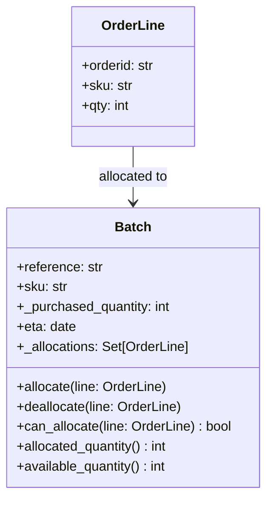
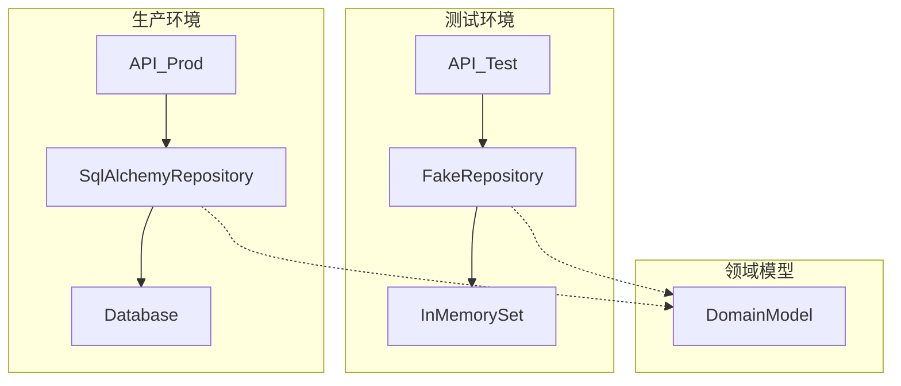
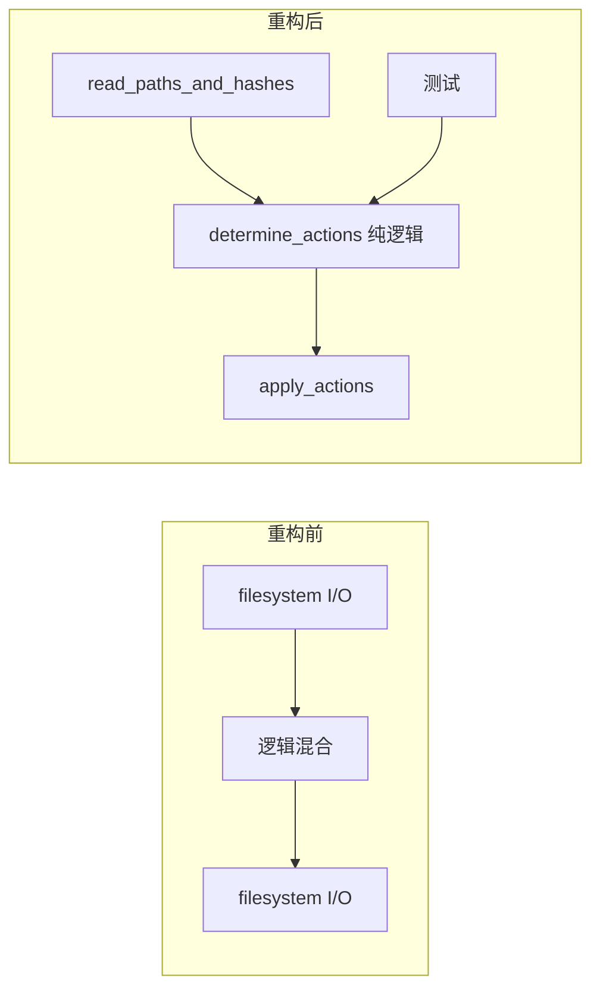
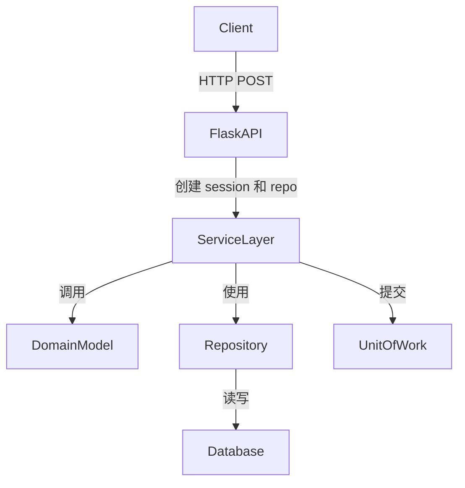
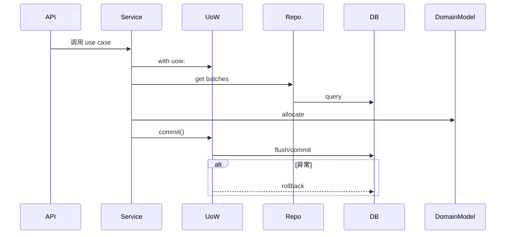
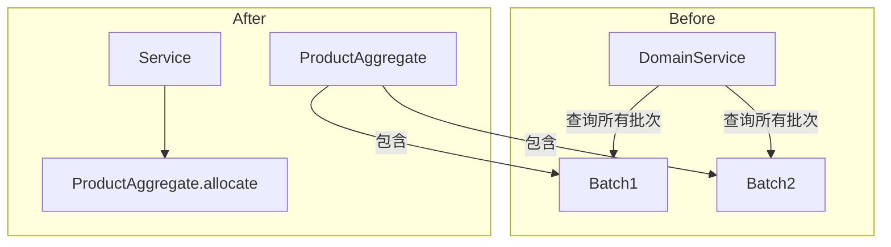
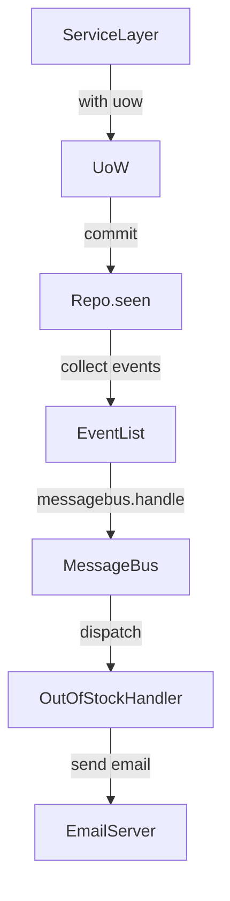
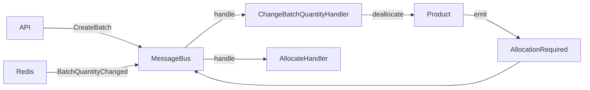
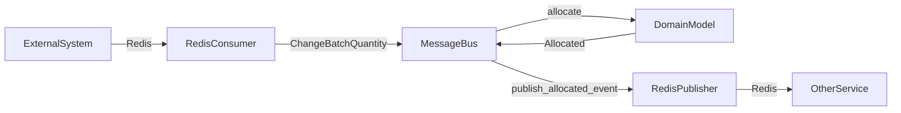
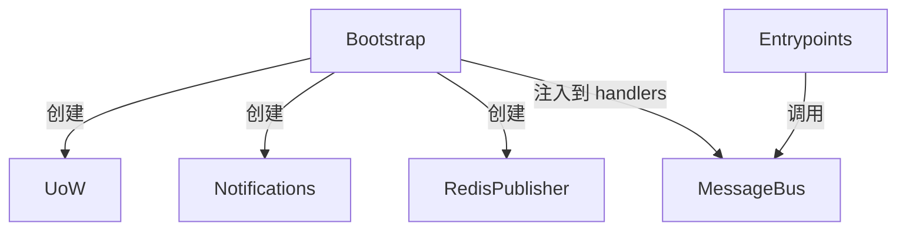

# 《Architecture Patterns with Python》章节总结

## 书籍信息

- **书名**：Architecture Patterns with Python: Enabling Test-Driven Development, Domain-Driven Design, and Event-Driven Microservices
- **作者**：Harry J.W. Percival & Bob Gregory
- **出版社**：O'Reilly Media
- **出版年份**：2020年3月第一版
- **PDF 状态**：完整，文本可提取（非扫描版，系原生电子版）
- **OCR 状态**：无需 OCR 修复，文本清晰

## 目录说明

- **目录识别情况**：完整识别，包括前言、第一部分（共7章）、第二部分（共6章）、附录和索引。
- **章节对应依据**：根据书中实际标题和页码顺序整理。
- **OCR 修复说明**：无。

## 全书核心主题

本书旨在为 Python 开发者提供一套用于管理复杂业务软件的架构模式，重点结合测试驱动开发（TDD）、领域驱动设计（DDD）和事件驱动架构。作者通过一个真实的库存分配示例应用，逐步引入领域模型、仓储模式、工作单元、服务层、领域事件、消息总线、CQRS 和依赖注入等经典模式。核心论点是：通过依赖倒置原则将领域逻辑与基础设施解耦，可以构建可测试、可演化、高内聚低耦合的系统，避免“大泥球”反模式。书中强调，这些模式并非适用于所有场景（简单 CRUD 应用无需过度设计），但对于复杂业务领域，能显著降低长期维护成本。

---

## 前言

### 核心论点

本书旨在解决 Python 开发者在构建复杂业务系统时面临的管理复杂性、测试困难和架构混乱的问题。作者认为，通过应用 TDD、DDD 和事件驱动架构中的经典模式，可以构建可测试、可维护且易于演化的系统。

### 关键概念

- **大泥球（Big Ball of Mud）**：软件自然趋向混沌状态，缺乏结构，所有组件相互耦合，难以修改。
- **封装与抽象**：通过识别任务并交给定义良好的对象或函数（抽象）来简化行为，提高表达性和可测试性。
- **分层架构（Layered Architecture）**：将代码分为用户界面、业务逻辑和数据访问层，但容易导致依赖方向错误。
- **依赖倒置原则（Dependency Inversion Principle, DIP）**：高层模块不应依赖低层模块，两者都应依赖抽象；抽象不应依赖细节，细节应依赖抽象。
- **领域模型（Domain Model）**：位于中心的业务逻辑层，应独立于基础设施。

### 逻辑推演

作者首先指出大多数设计失败的原因是业务逻辑分散在各层，形成难以更改的“大泥球”。然后提出解决问题的三个工具：TDD（确保正确性和重构信心）、DDD（聚焦业务领域建模）、事件驱动架构（管理跨应用复杂性）。全书结构分为两部分：第一部分构建支持领域建模的架构（仓储、服务层、工作单元等）；第二部分转向事件驱动架构（领域事件、消息总线、CQRS、依赖注入）。作者强调，这些模式并非新发明，而是对经典文献的 Python 化实现。

### 经典金句

> “A big ball of mud is the natural state of software in the same way that wilderness is the natural state of your garden. It takes energy and direction to prevent the collapse.”
> 
> “All problems in computer science can be solved by adding another level of indirection.” – David Wheeler

---

## 第一章：领域建模

### 核心论点

本章解决如何用代码建模业务流程，并使其与 TDD 高度兼容。作者认为，领域模型应该位于架构的核心，独立于外部依赖，并通过单元测试驱动其设计。

### 关键概念

- **领域模型（Domain Model）**：对业务问题的心智地图的编码，使用业务语言（通用语言）表达规则。
- **实体（Entity）**：具有长期身份标识的对象（如 Batch），即使属性改变仍可识别。
- **值对象（Value Object）**：由数据唯一标识的不可变对象（如 OrderLine），无独立身份。
- **领域服务（Domain Service）**：不适合放在实体或值对象中的业务操作，通常实现为函数。
- **领域异常（Domain Exception）**：表达领域概念的异常（如 OutOfStock）。

### 逻辑推演

作者从与业务专家的对话中提取出分配库存的规则，然后通过 TDD 编写测试，逐步构建 Batch 和 OrderLine 类。从简单的可用数量递减开始，引入 `can_allocate` 方法，最终因为需要支持 `deallocate` 而重构 Batch 以跟踪分配集合。接着引入值对象 OrderLine 和实体 Batch 的区别。最后实现领域服务函数 `allocate`，用于在多个批次中选择合适的批次进行分配，并引入领域异常处理缺货情况。

### 流程图



### 经典金句

> “Most developers have never seen a domain model, only a data model.” – Cyrille Martraire
> 
> “Sometimes, it just isn't a thing.” – Eric Evans (on domain services)

---

## 第二章：仓储模式

### 核心论点

本章解决如何将领域模型与持久化存储解耦。作者提出仓储模式（Repository Pattern）作为对数据存储的抽象，使得领域模型无需知道数据库细节，从而提升可测试性和可维护性。

### 关键概念

- **仓储（Repository）**：介于领域模型和数据层之间的抽象，提供类似内存集合的接口（add, get, list）。
- **持久化无知（Persistence Ignorance）**：领域模型不依赖任何持久化技术。
- **端口与适配器（Ports and Adapters）**：高层模块定义端口（抽象接口），低层模块实现适配器。
- **依赖倒置**：ORM 依赖领域模型，而非相反。

### 逻辑推演

作者首先展示传统 ORM（如 SQLAlchemy 声明式）如何导致领域模型直接依赖数据库列，违背持久化无知。然后演示 SQLAlchemy 的“经典映射”方式，将表定义与领域模型分开，使 ORM 依赖模型。接着引入仓储模式：定义 `AbstractRepository` 抽象基类，实现 `SqlAlchemyRepository` 和用于测试的 `FakeRepository`。仓储模式显著简化了 API 端点代码，并使得单元测试可以完全在内存中进行，无需真实数据库。

### 流程图



### 经典金句

> “The most important thing an ORM gives us is persistence ignorance.”
> 
> “Building fakes for your abstractions is an excellent way to get design feedback: if it's hard to fake, the abstraction is probably too complicated.”

---

## 第三章：关于耦合与抽象的简短插曲

### 核心论点

本章探讨什么是好的抽象、抽象如何减少耦合，以及抽象如何提升可测试性。作者通过一个同步两个目录的示例，展示了如何将核心逻辑与 I/O 操作解耦，并用依赖注入和 fake 对象进行测试。

### 关键概念

- **耦合（Coupling）**：组件之间相互依赖的程度。全局耦合使更改困难，局部耦合是高内聚的表现。
- **抽象（Abstraction）**：隐藏复杂细节的简化接口。
- **函数式核心，命令式外壳（Functional Core, Imperative Shell）**：将状态变更推到外围，核心保持纯函数。
- **依赖注入（Dependency Injection）**：将依赖作为参数显式传入，便于替换和测试。
- **Fake vs Mock**：Fake 是轻量级可工作实现，Mock 用于验证交互。

### 逻辑推演

作者首先用 `os.walk` 和 `hashlib` 实现目录同步，但该代码与文件系统紧密耦合，难以测试。然后重构：将 I/O 部分提取为 `read_paths_and_hashes`，将逻辑部分提取为 `determine_actions`，后者接收字典并返回动作列表。测试因此变得简单。进一步，使用依赖注入将 `reader` 和 `filesystem` 作为参数传入，并实现 `FakeFileSystem` 用于测试。作者解释了为何避免使用 `mock.patch`：它不改进设计、导致测试脆弱、难以理解。

### 流程图



### 经典金句

> “Designing for testability really means designing for extensibility.”
> 
> “We view TDD as a design practice first and a testing practice second.”

---

## 第四章：第一个用例——Flask API 与服务层

### 核心论点

本章介绍服务层模式，用于编排工作流和定义系统用例。作者展示如何将 Flask API 作为薄薄的一层，委托给服务层，服务层再调用领域模型和仓储。通过服务层，可以编写快速单元测试（使用 `FakeRepository`），避免慢速端到端测试的泛滥。

### 关键概念

- **服务层（Service Layer）**：编排用例的层，处理从仓储获取数据、调用领域服务、提交/回滚事务。
- **应用服务 vs 领域服务**：应用服务（服务层）处理请求编排；领域服务处理纯业务逻辑。
- **测试金字塔**：多数测试为快速单元测试，少量集成测试和端到端测试。
- **依赖抽象**：服务层依赖 `AbstractRepository`，运行时可注入 `SqlAlchemyRepository` 或 `FakeRepository`。

### 逻辑推演

作者先编写端到端测试，然后实现最简单的 Flask 端点，但发现需要处理提交和错误。端到端测试数量开始失控。于是引入服务层函数 `allocate`，它接收 `line, repo, session`，执行验证、调用领域服务、提交。服务层通过 `FakeRepository` 和 `FakeSession` 进行单元测试。最终 Flask 端点变得很薄，端到端测试仅保留一两个快乐/不快乐路径。

### 流程图



### 经典金句

> “A typical service-layer function: fetch objects, make checks, call domain service, save/update.”
> 
> “Depend on abstractions.”

---

## 第五章：高速挡与低速挡的 TDD

### 核心论点

本章讨论何时在服务层编写测试，何时在领域层编写测试。作者提出“高速挡/低速挡”隐喻：大部分时候使用服务层测试（高速挡），因为耦合低、覆盖广；在探索复杂业务逻辑时降档到领域模型测试（低速挡），以获取更好的反馈和可执行文档。

### 关键概念

- **测试金字塔**：服务层测试应占多数，领域层测试少量，端到端测试极少。
- **高速挡**：测试服务层，低耦合，适合常规功能添加和 bug 修复。
- **低速挡**：测试领域模型，高反馈，适合新项目启动或棘手问题。
- **完全解耦服务层测试**：通过将服务层 API 改为使用原始类型（字符串、整数等），并添加必要的服务（如 `add_batch`），使测试完全不依赖领域对象。

### 逻辑推演

作者计算测试数量，发现已有健康金字塔。然后讨论是否应将领域层测试迁移到服务层：服务层测试更稳定，重构时改动少；但领域层测试提供快速反馈和文档。作者建议在开发新功能或复杂逻辑时先用低速挡（领域模型），稳定后提升到高速挡（服务层）。为完全解耦，将服务层参数从 `OrderLine` 对象改为原始类型，并增加 `add_batch` 服务，使测试仅依赖服务层本身，完全不触及领域模型。

### 经典金句

> “Every line of code that we put in a test is like a blob of glue, holding the system in a particular shape. The more low-level tests we have, the harder it will be to change things.”

---

## 第六章：工作单元模式

### 核心论点

本章介绍工作单元（Unit of Work, UoW）模式，作为原子操作的抽象。UoW 与仓储协作，管理数据库事务的生命周期，并提供 Pythonic 的上下文管理器接口，使服务层完全与数据层解耦。

### 关键概念

- **工作单元（Unit of Work）**：表示一个原子操作，跟踪对象变化，并在 commit 时一次性持久化。
- **上下文管理器**：Python 的 `with` 语句，用于自动处理事务的开始和提交/回滚。
- **原子性**：一组操作要么全部成功，要么全部不生效。
- **“不要 Mock 你不拥有的东西”**：通过抽象自己的 UoW 而不是直接 mock SQLAlchemy Session，得到更简洁的设计。

### 逻辑推演

作者先展示没有 UoW 时，API 需要手动管理 session 和 repository，并显式 commit。引入 UoW 后，API 只需初始化 UoW 并调用服务层，服务层内部使用 `with uow:` 块。UoW 的 `__enter__` 创建 session 和 repository，`__exit__` 默认回滚，只有显式调用 `commit()` 才持久化。作者实现了 `SqlAlchemyUnitOfWork` 和 `FakeUnitOfWork`，并修改服务层接受 UoW 作为唯一依赖。最后通过示例（重新分配、修改批次数量）展示 UoW 如何将多个操作分组为原子单位。

### 流程图



### 经典金句

> “Don't mock what you don't own.”
> 
> “We prefer requiring the explicit commit so that we have to choose when to flush state. The default behavior is to not change anything.”

---

## 第七章：聚合与一致性边界

### 核心论点

本章引入聚合（Aggregate）模式，用于定义一致性边界。作者说明如何选择合适的聚合来保护业务不变量，并通过乐观并发控制（版本号）处理并发冲突，避免锁表性能问题。

### 关键概念

- **聚合（Aggregate）**：将一组相关对象视为一个单元，通过根实体访问，保证内部一致性。
- **不变量（Invariant）**：在操作完成后必须保持为真的条件（如不能超卖）。
- **乐观并发控制（Optimistic Concurrency Control）**：使用版本号检测冲突，失败时重试。
- **边界（Boundary）**：聚合是事务和一致性的边界，一次只更新一个聚合。
- **Product 聚合**：示例中将所有相同 SKU 的批次聚合为 Product。

### 逻辑推演

作者讨论不变量（订单行只能分配给一个批次，不能超卖）和并发问题。提出聚合作为解决方案：每个聚合定义一致性边界，一次只修改一个聚合。选择 Product（按 SKU）作为聚合，将 `allocate` 从领域服务变为 Product 的方法。仓储改为 `ProductRepository`，服务层相应调整。然后处理性能：加载所有批次可能过多，但实际通常可接受。最后实现版本号乐观锁：在 Product 上增加 `version_number`，提交时检查版本，利用数据库 `REPEATABLE READ` 或 `SELECT FOR UPDATE` 实现。编写集成测试验证并发冲突。

### 流程图



### 经典金句

> “An AGGREGATE is a cluster of associated objects that we treat as a unit for the purpose of data changes.” – Eric Evans
> 
> “Aggregates are your entrypoints into the domain model. By restricting the number of ways that things can be changed, we make the system easier to reason about.”

---

## 第八章：事件与消息总线

### 核心论点

本章引入领域事件和消息总线模式，用于解耦工作流中的副作用。作者通过“缺货时发送邮件”需求，展示如何将事件记录在领域模型中，并由消息总线调用相应的处理器。

### 关键概念

- **领域事件（Domain Event）**：表示系统中发生的有意义的事实（如 `OutOfStock`）。
- **消息总线（Message Bus）**：简单发布-订阅系统，将事件映射到处理器函数。
- **单一职责原则（SRP）**：避免在分配用例中混入邮件发送逻辑。
- **选项1**：服务层显式收集事件并传递给总线。
- **选项2**：服务层自身创建并发布事件。
- **选项3**：工作单元收集事件并发布到总线（最终选择）。

### 逻辑推演

作者先尝试将邮件发送放在 API 端点、领域模型和服务层，都违反 SRP。然后设计领域事件：定义 `OutOfStock` 事件，让 `Product.allocate` 在缺货时记录事件到 `self.events` 列表。消息总线根据事件类型调用处理器（如 `send_out_of_stock_notification`）。三种连接方式：服务层显式传递（不优雅）、服务层自己发布（还行）、UoW 在 `commit` 后自动收集并发布事件（最优雅）。最终方案：仓储跟踪 `seen` 聚合，UoW 的 `commit` 调用 `publish_events`，遍历 `seen` 中聚合的 `events` 并传递给消息总线。服务层完全干净。

### 流程图



### 经典金句

> “Rule of thumb: if you can't describe what your function does without using words like 'then' or 'and,' you might be violating the SRP.”
> 
> “The magic words 'When X, then Y' often tell us about an event.”

---

## 第九章：全面转向消息总线

### 核心论点

本章将整个应用程序重构为基于消息的处理机制：所有输入（包括 API 请求）都被转换为命令/事件，由消息总线处理。通过这种方式，新需求（批次数量变更导致的重新分配）可以完全利用现有的事件处理链。

### 关键概念

- **事件作为系统输入**：API 端点不再直接调用服务层，而是创建事件并交给消息总线。
- **处理器与服务的统一**：原来的服务函数（如 `allocate`）变成事件处理器，具有相同的签名 `(event, uow)`。
- **事件队列**：消息总线维护一个队列，处理当前事件时产生的新事件会加入队列。
- **测试统一为事件驱动**：所有测试现在通过 `messagebus.handle(event, uow)` 调用。

### 逻辑推演

作者先定义 `BatchCreated` 和 `AllocationRequired` 事件，将 `services.py` 重命名为 `handlers.py`，修改所有 handler 接受 `event` 和 `uow`。消息总线增加队列处理，并暂时保留结果返回的 hack。API 端点改为创建事件并调用总线。接着实现新需求：`BatchQuantityChanged` 事件触发 `change_batch_quantity` 处理器，该处理器调用模型方法减少数量，如果导致负库存则调用 `deallocate_one` 并发出新的 `AllocationRequired` 事件，该事件再次由总线处理。测试覆盖整个工作流。可选地，可使用假消息总线进行隔离测试。

### 流程图



### 经典金句

> “Our ongoing objective with these architectural patterns is to try to have the complexity of our application grow more slowly than its size.”

---

## 第十章：命令与命令处理器

### 核心论点

本章区分“命令”（命令式，代表意图，预期失败时向上传递异常）和“事件”（过去式，代表事实，失败不应影响原操作）。作者修改消息总线以不同方式处理命令和事件。

### 关键概念

- **命令（Command）**：意图的表示，如 `CreateBatch`、`Allocate`，只有一个处理器，失败时抛出异常。
- **事件（Event）**：事实的表示，如 `OutOfStock`，可有多个处理器，失败时仅记录日志。
- **命令-事件分离**：命令用于变更，事件用于通知。
- **重试机制**：使用 `tenacity` 库为事件处理器添加指数退避重试。

### 逻辑推演

作者将之前的事件类（`BatchCreated`、`AllocationRequired`、`BatchQuantityChanged`）转换为命令类（`CreateBatch`、`Allocate`、`ChangeBatchQuantity`）。消息总线根据消息类型分发：命令处理器捕获异常后重新抛出；事件处理器捕获异常后记录并继续。命令映射到单一处理器，事件映射到多个处理器。添加重试逻辑到事件处理循环。通过这种分离，命令的失败会传递给调用者（如 API 返回 400），而事件的失败不会影响主流程。

### 经典金句

> “Commands capture intent. Events capture facts about things that happened in the past.”
> 
> “By separating out these concerns, we have made it possible for things to fail in isolation, which improves the overall reliability of the system.”

---

## 第十一章：事件驱动架构——使用事件集成微服务

### 核心论点

本章展示如何将事件驱动架构扩展到微服务集成：使用外部消息代理（如 Redis Pub/Sub）接收外部事件和发布内部事件，实现服务之间的松散耦合和时序解耦。

### 关键概念

- **分布式大泥球（Distributed Big Ball of Mud）**：基于名词划分的微服务导致强耦合的同步调用链。
- **时序解耦（Temporal Decoupling）**：通过异步消息，服务可独立失败和恢复。
- **Redis Pub/Sub**：用作轻量级消息代理。
- **事件消费者（Event Consumer）**：从外部通道读取事件并转换为命令。
- **事件发布器（Event Publisher）**：将内部领域事件发布到外部通道。

### 逻辑推演

作者指出基于名词的微服务（如 Orders、Batches、Warehouse）会导致同步调用链和错误传播。更好的是基于动词（如 Allocation）。实现方式：定义外部事件 `BatchQuantityChanged`，编写 Redis 消费者将该 JSON 消息转换为命令 `ChangeBatchQuantity` 并放入消息总线。同时定义 `Allocated` 事件，并添加处理器 `publish_allocated_event`，将事件发布到 Redis 的 `line_allocated` 通道。端到端测试验证：通过 Redis 发送 `change_batch_quantity`，最终在 `line_allocated` 通道收到 `Allocated` 事件。注意：Redis Pub/Sub 不可靠，生产环境应使用 Event Store、Kafka 等。

### 流程图



### 经典金句

> “Events can come from the outside, but they can also be published externally. We use events to talk to the outside world.”
> 
> “Event notification is nice because it implies a low level of coupling, and is pretty simple to set up. It can become problematic, however, if there really is a logical flow that runs over various event notifications.” – Martin Fowler

---

## 第十二章：命令查询职责分离（CQRS）

### 核心论点

本章介绍 CQRS：将读操作（查询）与写操作（命令）分离。写操作使用复杂的领域模型保证一致性；读操作使用简单的查询（甚至原始 SQL 或单独的读模型）优化性能和可扩展性。

### 关键概念

- **CQRS**：Command Query Responsibility Segregation，读写分离。
- **读模型（Read Model）**：专门为查询优化的数据结构，可能是反范式的表、视图或 Redis 缓存。
- **写模型（Write Model）**：领域模型，专注于不变式和业务规则。
- **事件更新读模型**：通过领域事件处理器（如 `Allocated` 事件）同步更新读模型表。

### 逻辑推演

作者指出领域模型针对写操作优化，不适合复杂查询。示例：需要查询某个订单的所有分配。尝试使用现有仓储和领域模型会非常笨拙且性能差。更简洁的是直接编写 SQL 查询或使用 ORM 的简单查询。更进一步，可以创建一个独立的 `allocations_view` 表，并通过 `Allocated` 事件的处理器插入/删除记录。这样查询变成简单的 `SELECT ... FROM allocations_view WHERE orderid = ...`。读模型甚至可以存储在 Redis 中，完全独立于写数据库。测试通过消息总线进行设置，然后读视图进行断言。CQRS 提供了巨大的灵活性和性能优势，但增加了复杂性，仅在必要时采用。

### 流程图

```mermaid
graph TD
    subgraph Write Side
        Command -> DomainModel -> Event -> Handler -> ReadModelTable
    end
    subgraph Read Side
        Query -> ReadModelTable -> Result
    end
```

### 经典金句

> “Your domain model is not optimized for read operations.”
> 
> “Event handlers are a great way to manage updates to a read model, if you decide you need one.”

---

## 第十三章：依赖注入（与启动脚本）

### 核心论点

本章解决依赖管理问题：随着适配器增多，手动传递依赖变得繁琐。作者引入启动脚本（bootstrap）作为组合根，集中创建和注入依赖，并展示两种依赖注入方式（闭包/偏函数和类），以及如何测试注入后的组件。

### 关键概念

- **组合根（Composition Root）**：应用启动时组装所有依赖的地方（bootstrap 脚本）。
- **显式依赖 vs 隐式依赖**：显式依赖通过参数传递，更易于测试和替换。
- **手动依赖注入**：使用闭包、`functools.partial` 或类来捕获依赖。
- **适配器抽象**：为外部服务（如邮件、通知）定义 ABC，并提供真实实现和假实现。
- **集成测试真实适配器**：使用 Docker 中的 MailHog 测试真实邮件发送。

### 逻辑推演

作者回顾已有依赖（UoW, send_mail, publish），指出它们已通过参数显式传递，但每次调用服务层都需要手动实例化。解决方案：创建一个 `bootstrap` 函数，初始化 ORM、创建默认 UoW、邮件发送器等，然后通过依赖注入将依赖绑定到处理器，最后返回配置好的 `MessageBus` 实例。处理器通过闭包或偏函数注入依赖。消息总线从静态模块变成可配置的类。在测试中，可以覆盖 bootstrap 的默认参数，使用 `FakeUnitOfWork` 和假的邮件/发布函数。最后，以通知适配器为例，展示如何定义 `AbstractNotifications`、实现 `EmailNotifications` 和 `FakeNotifications`，并在集成测试中连接真实邮件服务器 MailHog。

### 流程图



### 经典金句

> “Explicit is better than implicit.” – The Zen of Python
> 
> “Define your API using an ABC. Implement the real thing. Build a fake and use it for tests. Find a less fake version you can put into your Docker environment. Test the less fake 'real' thing. Profit!”

---

## 结语：从这到那——如何应用到现有系统

### 核心论点

本章为希望将书中模式应用到现有遗留系统的开发者提供实践指导。强调逐步改进、识别用例、分离关注点、识别聚合边界，并通过事件拦截逐步替换旧系统。

### 关键概念

- **大泥球修复步骤**：首先提取服务层，将用例集中到单一函数中，然后逐步将 I/O 和领域逻辑分离。
- **识别聚合**：寻找一致性边界，用引用替代直接对象引用。
- **事件拦截（Event Interception）**：在新系统中监听旧系统的事件，逐步接管功能。
- **走查骨架（Walking Skeleton）**：先部署一个只记录事件的极简系统，验证基础设施。

### 逻辑推演

作者建议先从分离纠缠的责任开始：为每个用例创建服务层函数，处理事务、获取数据、调用领域逻辑、持久化。然后识别聚合，用标识符替换直接对象引用，避免跨聚合事务。对于向微服务演进，使用“绞杀者模式”（Strangler Fig）：让新系统监听旧系统的事件，逐步替换功能。最后，通过事件风暴（Event Storming）和 CRC 建模与业务方统一语言，以 TDD 探索领域模型。

### 经典金句

> “It's never too late to start weeding an overgrown garden.”
> 
> “Don't try to boil the ocean, and don't be too afraid of making mistakes.”

---

## 附录摘要

- **附录A：总结图与表**：概述架构中各层（领域、服务层、适配器、入口点）和组件（实体、值对象、聚合、事件、命令、仓储、工作单元、消息总线等）。
- **附录B：模板项目结构**：介绍 `src/` 布局、Docker、docker-compose、Makefile、环境变量配置、测试目录组织等。
- **附录C：用 CSV 实现一切**：展示如何通过实现 CSV 版本的仓储和工作单元，完全替换数据库，证明架构的灵活性。
- **附录D：Django 中的仓储和工作单元**：演示如何在 Django 中实现仓储模式（使用 Django ORM 的经典映射）和工作单元，以及为何比 SQLAlchemy 更麻烦。
- **附录E：验证**：区分语法验证（边缘）、语义验证（消息总线/服务层）和语用验证（领域模型），并介绍 Tolerant Reader 模式。