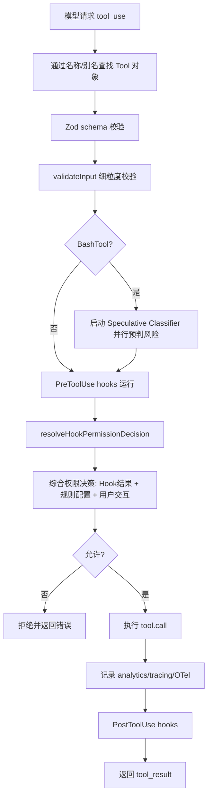
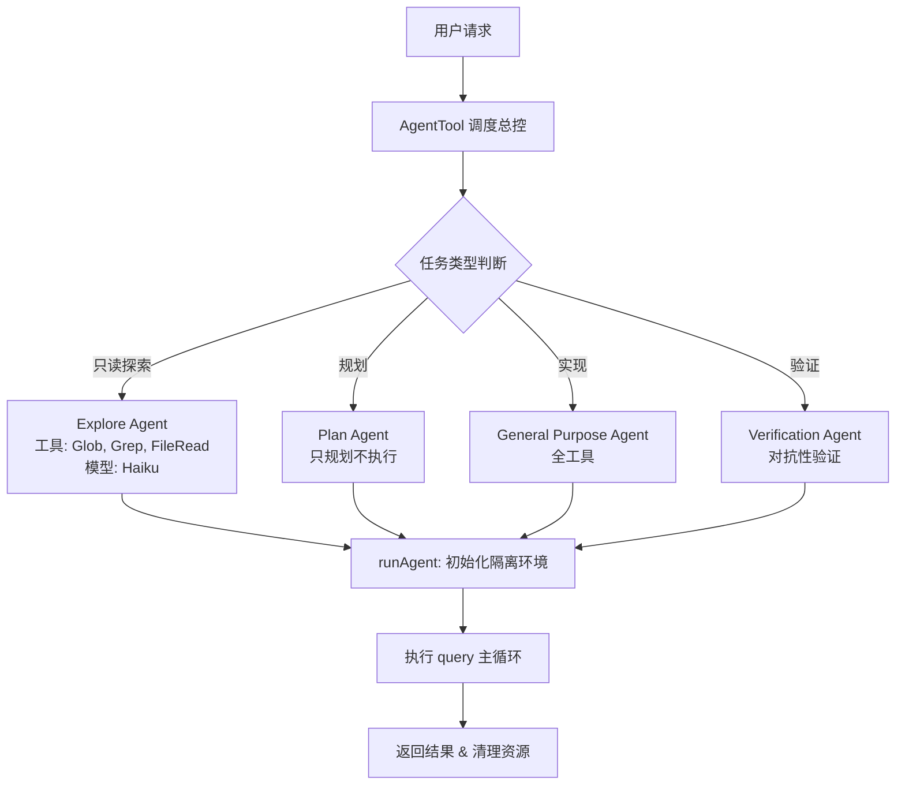
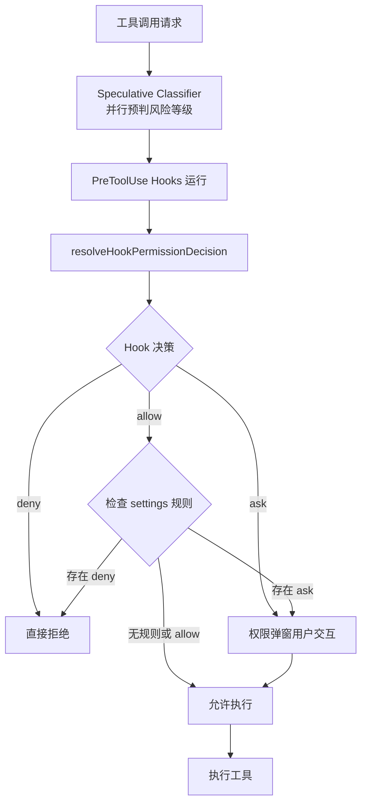
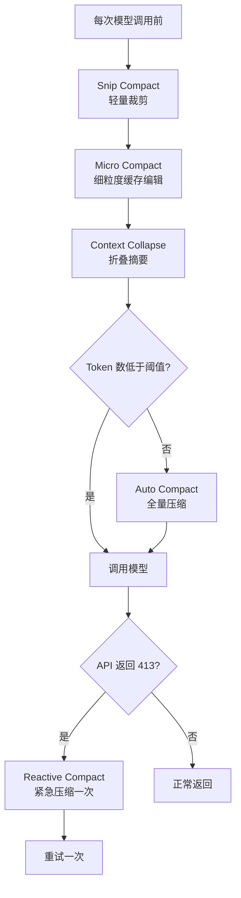

# 《Claude Code 源码架构深度解析 V2.0》章节总结

## 书籍信息

- **书名**：Claude Code 源码架构深度解析 V2.0 从4756 个文件里读懂 Agent 系统工程
- **作者**：Xiao Tan
- **PDF 状态**：文本可识别，部分表格符号缺失（如问号显示为“？”），但整体内容完整
- **OCR 状态**：良好，页码和章节层级可清晰识别

## 目录说明

- **目录识别情况**：PDF 第2-3页提供了完整目录，共10个主章节，含子节编号。
- **章节对应依据**：正文从第4页开始，严格按目录顺序展开。
- **OCR 修复说明**：无实质性错漏，少量表格中的“?”符号不影响理解。

## 全书核心主题

本书通过对 Claude Code（一个工业级 AI Coding Agent）的源码分析，揭示了其作为“Agent 操作系统”而非简单 CLI 工具的设计哲学。作者从4756个源码文件中提炼出七层核心架构：主循环与 Prompt 编排、42个工具治理流水线、多 Agent 分工调度、三层安全防护、生态扩展机制、上下文预算管理以及产品化工程实践。核心观点是：可靠的 Agent 系统不依赖模型自觉，而依赖于制度化的行为约束、明确的角色拆分、可治理的工具调用和严格的上下文预算管理。

---

## 第1章：全局视角：CLI 工具 vs Agent Operating System

### 核心论点

**问题**：Claude Code 的代码库有4756个文件，远超普通 coding agent，它到底是一个 CLI 工具还是一个操作系统？
**观点**：作者认为 Claude Code 的本质是“Agent Operating System”——它有平台化入口、命令系统控制面、多运行时支持，而非简单的命令行封装。

### 关键概念/事件

- **Fast‑path 分发**：CLI 入口根据参数（如 `--version`、`daemon`）快速分流，避免加载完整运行时，提升响应速度。
- **Dynamic import**：只有未命中 fast‑path 时才动态加载主模块，降低冷启动成本。
- **命令系统**：`src/commands/` 下有101个命令，是用户与系统交互的控制面，也是插件和技能的生态入口。
- **平台化设计**：同一 agent 运行时同时服务 CLI、MCP 协议、SDK、IDE 插件。

### 逻辑推演

作者首先用代码规模（4756个文件、`main.tsx` 4683行）建立直观感受，然后分析 `cli.tsx` 的 fast‑path 机制，说明产品化思维体现在“按需加载”。接着指出命令系统不仅是快捷操作，更是生态入口。最终得出“这不是 CLI 工具，而是 Agent 操作系统”的结论。

### 经典金句/数据

> “这不是过度设计。当你的 CLI 工具每天被上百万次调用的时候，--version 的响应速度直接影响用户体验和 CI 流水线性能。” (p.5)

- 源码规模：`utils/` 564文件，`components/` 389文件，`commands/` 207文件，`tools/` 184文件。
- `main.tsx` 4,683行，`query.ts` 1,729行。

---

## 第2章：引擎：主循环与 Prompt 编排

### 核心论点

**问题**：Agent 如何管理一个请求从输入到输出的完整生命周期？
**观点**：通过一个 `while(true)` 状态机（`query.ts`）和分层的 Prompt 组装系统，实现流式工具执行、缓存友好的 Prompt 分区以及严格的行为规范。

### 关键概念/事件

- **状态机主循环**：`query.ts` 中 `while(true)` + `state` 对象，有9个不同的 `continue` 点对应不同重试/继续原因。
- **Streaming Tool Execution**：模型还在输出时，已完成的 tool_use block 立即执行，减少用户等待。
- **Prompt 静态/动态分区**：用 `SYSTEM_PROMPT_DYNAMIC_BOUNDARY` 标记分割可缓存静态部分与会变动态部分，优化 API 前缀缓存。
- **行为规范制度化**：`getSimpleDoingTasksSection()` 明确列出“不要加用户没要求的功能”“不要过度抽象”等硬性规则。

### 逻辑推演

从用户输入开始，经过 `query()` 进入 `queryLoop()`。每次迭代执行：上下文压缩 → 组装 system prompt → 调用模型 API → 流式处理响应 → 工具执行 → 附件注入 → 下一轮。作者强调递归改状态机是为了避免爆栈。Prompt 分区设计直接服务于成本控制（缓存复用）。行为规范部分则说明：不依赖模型自觉，而将期望写进 prompt。

### 流程图

```mermaid
graph TD
    A[用户输入] --> B[query() 函数]
    B --> C[进入 queryLoop while(true)]
    C --> D[上下文预处理: snip compact → micro compact → context collapse → auto compact]
    D --> E[Token 预算检查]
    E --> F[调用模型 API]
    F --> G[流式响应处理]
    G --> H{包含 tool_use?}
    H -->|是| I[StreamingToolExecutor 边收边执行]
    I --> J[工具执行完成]
    J --> K[注入 attachments / skills / commands]
    K --> C
    H -->|否| L[Stop hooks + token budget 检查]
    L --> M{继续?}
    M -->|是| C
    M -->|否| N[结束]
```

### 经典金句/数据

> “不要指望一个LLM每次都’想到’该怎么做。制度化的行为比临场发挥稳定得多。” (p.9)

- `query.ts` 1729 行，9个不同的 continue 点。
- 静态 prompt 部分可缓存，动态部分用 `DANGEROUS_uncachedSystemPromptSection()` 每次重算（如 MCP instructions）。

---

## 第3章：工具系统：42 个工具和一条治理流水线

### 核心论点

**问题**：如何确保模型调用工具时不会产生意外后果？
**观点**：每个工具都有完整的接口（含权限、并发安全、只读标记），并通过 `toolExecution.ts` 中的14步流水线进行输入校验、权限决策、Hook 处理和可观测性记录。

### 关键概念/事件

- **Tool 接口**：除 `call()` 外，还包含 `inputSchema`、`validateInput()`、`checkPermissions()`、`isReadOnly()`、`isConcurrencySafe()` 等，以及6个以上 render 方法。
- **fail‑closed 默认值**：新工具如未声明 `isConcurrencySafe` 默认 false，未声明 `isReadOnly` 默认 true（会写），默认严格。
- **工具执行流水线**：从名字解析 → Zod 校验 → 细粒度校验 → Speculative classifier（仅 Bash） → PreToolUse hooks → 权限决策 → 执行 → 遥测 → PostToolUse hooks。
- **42 个工具**：涵盖文件操作、Shell 执行、Agent 调度、MCP、Web 搜索、用户交互等。

### 逻辑推演

作者先展示 Tool 接口的复杂性，强调每个工具不是简单函数。然后说明 `buildTool()` 工厂函数提供的 fail‑closed 默认值如何避免配置遗漏。接着分类列出42个工具。最后详细拆解 `toolExecution.ts` 的14步流水线，突出 speculative classifier（并行预判风险）和 Hook 系统的参与。

### 流程图



### 经典金句/数据

> “新写一个工具的时候，如果忘了声明并发安全性，系统会默认它不安全，串行执行。这种’忘了就严格’的设计，避免了一个很常见的问题。” (p.9)

- `toolExecution.ts` 1,745行；42个工具目录。
- Speculative classifier 在权限决策前并行运行，不阻塞主流程。

---

## 第4章：多 Agent 体系：分工和调度

### 核心论点

**问题**：为什么需要多个 Agent，而不是一个通用 Agent 完成所有事？
**观点**：将探索、规划、验证、执行等职责拆分为独立 Agent，每个有严格的工具限制和专用 prompt，可以显著提升任务质量和安全性。

### 关键概念/事件

- **Explore Agent**：只读专家，禁止任何写操作，仅用 Glob/Grep/FileRead 和只读 Bash 命令。
- **Verification Agent**：对抗性验证，130行最狠的 prompt，强制要求实际运行检查并识别验证者自我合理化倾向。
- **AgentTool.tsx**：调度总控（1397行），处理 fork、内置 agent、多 agent 协作、worktree 隔离等。
- **Fork path cache 优化**：fork 子任务时尽量继承主线程的 system prompt 和模型，以复用 prompt 缓存。
- **runAgent.ts**：子 Agent 的完整运行时（973行），包括 MCP 初始化、file state cache、权限模式、生命周期清理。

### 逻辑推演

作者先列出6个内建 Agent，说明分工的必要性。然后详细解析 Explore Agent 的只读限制和性能优化（Haiku 模型）。接着用大量篇幅剖析 Verification Agent 的 prompt 设计，包括强制验证动作、列出逃避借口、要求自我识别合理化倾向。最后通过 AgentTool 和 runAgent 展示调度与运行时的复杂性，特别强调 fork path 对缓存复用的精妙考量。

### 流程图（多 Agent 调度）



### 经典金句/数据

> “这种设计在传统软件工程里是常识：写代码的人不应该是验收代码的人。但在AI Agent系统里，大部分产品还没做到这一步。” (p.12)

- Verification Agent prompt 130行。
- `AgentTool.tsx` 1397行，`runAgent.ts` 973行。
- Fork 路径要求“不换模型”以保持前缀缓存匹配。

---

## 第5章：安全层：权限、Hook 和三层防护网

### 核心论点

**问题**：如何防止模型执行危险命令或绕过安全策略？
**观点**：通过三层互不绕过的防护网（Speculative Classifier、Hook Policy Layer、Permission Decision）以及强大的 Pre/Post ToolUse Hook 系统，实现“强大但受控”的安全模型。

### 关键概念/事件

- **权限系统**：`PermissionMode`（default/plan/auto）、`PermissionRule`（allow/deny/ask）、bash 风险分类器。
- **Hook 系统**：支持 PreToolUse、PostToolUse、PostToolUseFailure 三个时点，Hook 可以返回 allow/ask/deny、修改输入、阻断流程、注入上下文。
- **resolveHookPermissionDecision**：定义关键规则——Hook 的 allow 不能绕过 settings 中的 deny/ask 规则。
- **三层防护网**：
  1. Speculative Classifier（并行预判 Bash 风险）
  2. Hook Policy Layer（运行时策略调整）
  3. Permission Decision（综合规则和用户交互的最终决策）

### 逻辑推演

先概览权限目录（27个文件）。然后深入 Hook 系统，列举 Pre‑hook 能做的6件事。接着重点分析 `resolveHookPermissionDecision` 的逻辑：Hook allow 仍要过 settings 规则；Hook deny 直接生效；Hook ask 传给权限弹窗。最后归纳三层防护的协作与隔离，强调任何一层不能绕过另一层。

### 流程图（安全决策流）



### 经典金句/数据

> “强大但受控是工程成熟度的标志。” (p.15)

- `utils/permissions/` 下27个文件；`toolHooks.ts` 650行。
- Hook allow 不能绕过 settings deny，这是安全模型的核心约束。

---

## 第6章：生态：Skill、Plugin、MCP

### 核心论点

**问题**：如何扩展 Agent 的能力而不破坏核心系统？
**观点**：Skill（带元数据的 workflow）、Plugin（影响模型行为）、MCP（工具桥+行为说明注入）三层扩展机制，关键是让模型“感知到”自己拥有这些能力。

### 关键概念/事件

- **Skill**：带 frontmatter 的 markdown 文件，可声明 allowed‑tools、model、effort hints，要求模型必须调用 `SkillTool` 执行，不能仅提到。
- **Plugin**：能提供 markdown commands、hooks、output styles、MCP server 配置，影响模型 prompt 和行为。
- **MCP**：不仅是工具注册表，还能通过 `instructions` 字段向 system prompt 注入工具使用说明，让模型知道“什么时候该用、怎么用”。
- **模型感知能力**：通过 skills 列表、agent 列表、MCP instructions、session‑specific guidance、command integration 等多通道让模型知道当前可用扩展。

### 逻辑推演

依次介绍 Skill、Plugin、MCP 的形态和能力。强调 Skill 必须被调用而非提及；Plugin 影响模型行为层面；MCP 的 instructions 注入是关键增值。最后指出生态成功的核心是模型“感知到”自己的能力，否则扩展等于不存在。

### 经典金句/数据

> “很多平台也有插件系统、也有工具市场，但模型本身不知道这些东西存在。就像你给一个人配了一整套工具箱，但他不知道箱子里有什么。” (p.17)

- 17个 bundled skills；`utils/plugins/` 42个文件；`services/mcp/` 23个文件。
- MCP instructions 使用 `DANGEROUS_uncachedSystemPromptSection()`，因为 server 可能动态连接/断开。

---

## 第7章：上下文经济学：Token 就是预算

### 核心论点

**问题**：在有限的上下文窗口中，如何最大化有用信息的密度？
**观点**：通过四道渐进式压缩机制、Reactive Compact 兜底、Token Budget 系统以及按需注入等策略，将 token 视为预算进行精细管理。

### 关键概念/事件

- **四道压缩机制**（顺序执行）：
  1. Snip Compact：裁剪过长历史消息
  2. Micro Compact：基于 tool_use_id 的缓存编辑
  3. Context Collapse：折叠不活跃上下文为摘要
  4. Auto Compact：接近阈值时全量压缩
- **Reactive Compact**：收到 API 413（prompt too long）后触发紧急压缩，每个 turn 仅尝试一次。
- **Token Budget**：用户指定 token 目标（如 `+500k`），系统追踪输出 token，接近目标时注入 nudge 消息让模型继续。
- **按需注入**：Skill 匹配到才注入；MCP instructions 按连接状态注入；memory prefetch 与 skill discovery prefetch 在流式输出时并行预取。

### 逻辑推演

作者首先按照 query.ts 中的顺序解释四道压缩，强调轻量级先执行，避免不必要的重量压缩。然后说明 Reactive Compact 作为 API 413 的兜底，并有防循环设计。接着介绍 Token Budget 系统如何让长任务延续。最后列举其他优化（按需注入、结果持久化等）。

### 流程图（压缩决策）



### 经典金句/数据

> “每个 token 都有成本，每条信息都占空间。能缓存的要缓存，能按需加载的不要一开始就塞进去，能压缩的要压缩。” (p.19)

- 四道压缩机制在 `query.ts` 中顺序执行。
- Reactive compact 有 `hasAttemptedReactiveCompact` 标记防止无限循环。

---

## 第8章：产品化：从 prototype 到 product

### 核心论点

**问题**：为什么很多 Agent 系统第一天跑得挺好，第二天就出问题？
**观点**：产品化在于处理“第二天”的问题——任务中断续接、脏状态清理、进程泄漏、会话恢复。Claude Code 通过生命周期管理、Bridge 系统、统一状态管理和 Telemetry 来解决这些问题。

### 关键概念/事件

- **生命周期管理**：`runAgent.ts` 中明确的清理链：`recordSidechainTranscript`、`writeAgentMetadata`、`killShellTasksForAgent`、清理 session hooks、文件状态、todos 等。
- **Bridge 系统**：`bridge/` 31个文件，实现远程控制和 IDE 集成，允许 CLI 控制远程容器、IDE 插件连接运行时。
- **State 管理**：`state/AppState.tsx` 和 `store.ts` 统一管理权限模式、MCP 连接、工具配置等全局状态。
- **UI 层**：React + Ink 构建完整 TUI 应用（`components/` 389文件，`ink/` 96文件），含权限弹窗、进度条、diff 显示等。
- **Telemetry**：`services/analytics/`、`utils/telemetry/` 覆盖 Datadog、Perfetto tracing、OTel，以及 cost tracker 和 rate limit 管理。

### 逻辑推演

作者先指出大部分系统在第一天跑得好，第二天问题暴露。然后列举 `runAgent.ts` 中的清理函数，说明 Claude Code 对脏状态有明确处理。接着介绍 Bridge 系统如何实现跨环境连接。State 管理和 UI 层展示其工程完整性。最后通过 Telemetry 说明可观测性也是产品化的一部分。

### 经典金句/数据

> “第一天跑起来不难。难的是任务中断怎么续、脏状态怎么清、进程泄漏怎么办、session怎么恢复。这些问题不解决，产品就只能是Demo。” (p.20)

- `runAgent.ts` 清理链包含至少7类资源。
- Bridge 系统31个文件，components 389文件。

---

## 第9章：从源码里提炼出的设计原则

### 核心论点

**问题**：从4756个文件中可以归纳出哪些可复用的 Agent 系统设计原则？
**观点**：七条原则——不信任模型自觉、把角色拆开、工具调用要有治理、上下文是预算、安全层互不绕过、生态关键是模型感知、产品化在于处理第二天。

### 关键概念/事件

- **不信任模型的自觉性**：好行为要写成制度，对应 `getSimpleDoingTasksSection()`。
- **把角色拆开**：至少分开做事的人和验收的人，对应 Verification Agent。
- **工具调用要有治理**：14步 pipeline 决定异常表现。
- **上下文是预算**：缓存、按需加载、压缩，对应动态边界和四道压缩。
- **安全层要互不绕过**：三层防护互相配合但不能绕过，对应 `resolveHookPermissionDecision`。
- **生态的关键是模型感知**：让模型看到自己的能力清单，对应 MCP instructions、skill discovery。
- **产品化在于处理第二天**：清理链、会话恢复等。

### 逻辑推演

作者逐一列出七条原则，每一条都回指前文的具体源码模块。例如原则1对应第2章的行为规范 prompt；原则2对应第4章的多 Agent 分工；原则3对应第3章的工具流水线；原则4对应第7章的上下文经济学；原则5对应第5章的安全层；原则6对应第6章的生态；原则7对应第8章的产品化。形成完整闭环。

### 经典金句/数据

> “这些不是空洞的口号，每一条都有对应的源码实现做支撑。” (p.19)

---

## 第10章：附录：核心文件索引

### 核心论点

**问题**：如何快速定位 Claude Code 源码中的关键模块？
**观点**：按入口与主循环、Prompt 系统、工具执行、Agent 系统、权限与安全、生态扩展、上下文管理等分类列出核心文件及其行数。

### 关键概念/事件

（本附录为索引，无核心论点，仅列出文件路径和行数）

### 文件索引（节选）

**入口与主循环**
- `src/entrypoints/cli.tsx` — CLI入口，fast‑path分发
- `src/main.tsx` — 主应用，4683行
- `src/query.ts` — 主循环状态机，1729行
- `src/QueryEngine.ts` — 1295行
- `src/Tool.ts` — 工具基类，792行

**Prompt 系统**
- `src/constants/prompts.ts` — 914行
- `src/constants/systemPromptSections.ts` — section缓存
- `src/tools/*/prompt.ts` — 36个工具独立 prompt

**工具执行**
- `src/services/tools/toolExecution.ts` — 1745行
- `src/services/tools/toolHooks.ts` — 650行
- `src/services/tools/StreamingToolExecutor.ts`

**Agent 系统**
- `src/tools/AgentTool/AgentTool.tsx` — 1397行
- `src/tools/AgentTool/runAgent.ts` — 973行
- `src/tools/AgentTool/built‑in/verificationAgent.ts` 等

**权限与安全**
- `src/utils/permissions/` — 27个文件
- `src/utils/permissions/bashClassifier.ts`
- `src/utils/permissions/dangerousPatterns.ts`

**生态扩展**
- `src/skills/` — 17个 bundled skills
- `src/utils/plugins/` — 42个文件
- `src/services/mcp/` — 23个文件

**上下文管理**
- `src/services/compact/` — 11个文件
- `src/query/tokenBudget.ts`

---

> 说明：附录中部分文件行数在原 PDF 中未完整列出，以上基于可见内容整理。