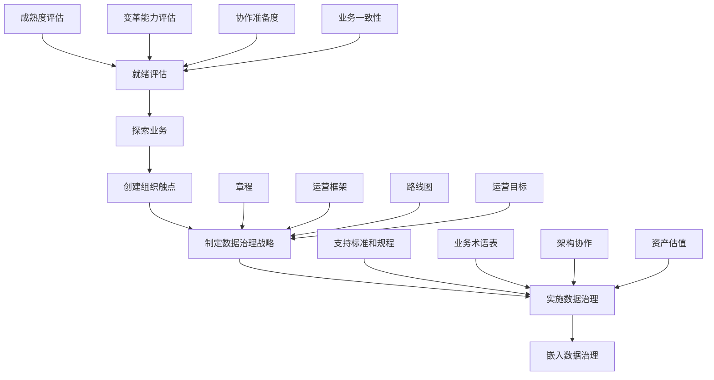
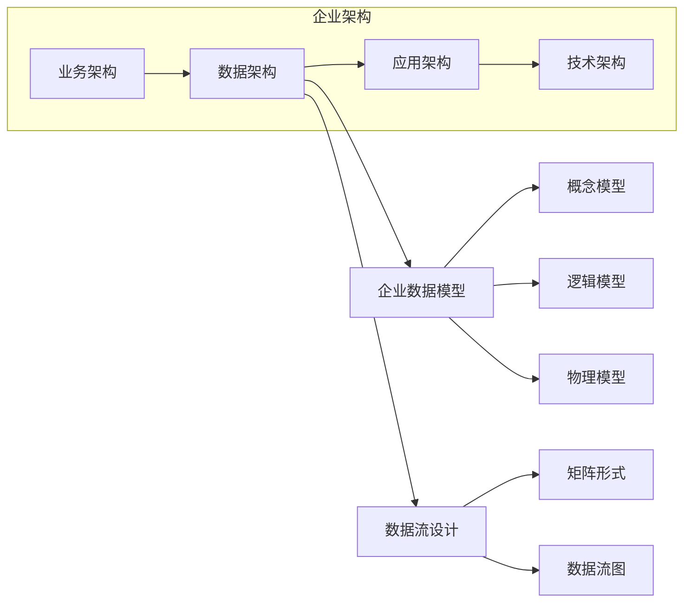
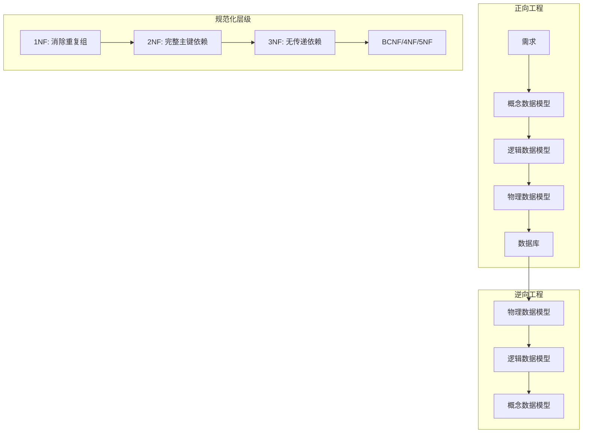
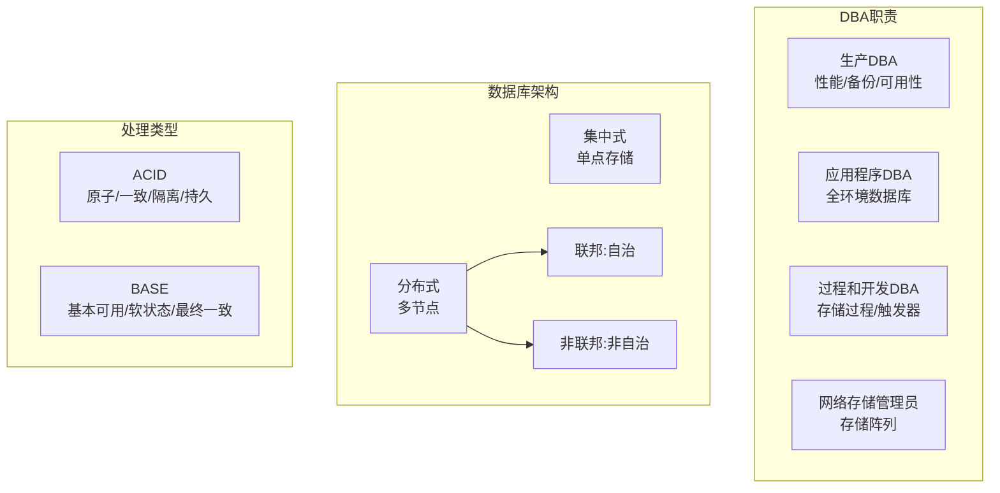
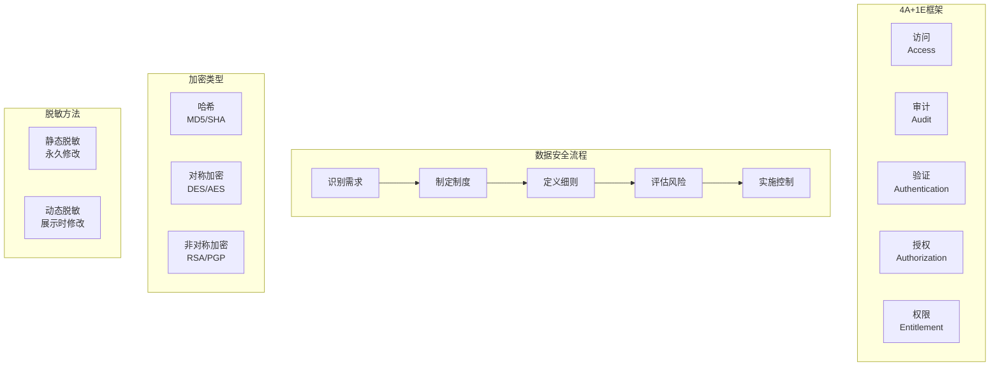

# 《DAMA数据管理知识体系指南（原书第2版修订版）》章节总结

## 书籍信息
- **书名**：DAMA数据管理知识体系指南（原书第2版修订版）
- **作者**：美国DAMA国际 著
- **译者**：上海市静安区国际数据管理协会 译
- **PDF状态**：内容可识别，包含完整目录和前7章正文，后续章节有目录索引但正文内容未完整上传。
- **OCR状态**：文本可读性良好，页码连续，存在部分扫描痕迹但不影响理解。

## 目录说明
- **目录识别情况**：完整识别目录结构，涵盖第1章至第17章及附录。
- **章节对应依据**：严格依据PDF页码顺序和目录层级。
- **OCR修复说明**：部分页面正文内容不完整（如第7章后缺失），已标注说明。

## 全书核心主题

本书由DAMA国际组织全球数据管理领域顶尖专家撰写，是数据管理领域的权威指南。全书围绕一个核心问题展开：**组织如何将数据真正作为资产进行管理，并从中持续获得价值**。

作者通过建立系统化的数据管理知识体系（DMBOK），定义了11个核心知识领域（数据治理、数据架构、数据建模与设计、数据存储与操作、数据安全、数据集成与互操作、文档与内容管理、参考数据与主数据、数据仓库与商务智能、元数据管理、数据质量管理），并辅以数据处理伦理、大数据与数据科学、成熟度评估、组织角色与变革管理等扩展主题。全书强调：数据管理不仅是技术问题，更是业务问题，需要跨职能协作、领导层承诺和文化变革。

---

## 第1章：数据管理

### 1. 核心论点

**问题**：组织认识到数据是重要资产，但很少有机构能真正将其作为资产进行管理并持续获得价值。为什么？如何解决？

**观点**：数据管理是对数据相关规划、制度、程序和实践进行开发、执行和监督的活动。数据具有独特属性（不消耗、可复制、易流动），必须通过系统化的原则、框架和跨职能协作，才能在数据全生命周期中交付、控制和保护数据，并提升其价值。

### 2. 关键概念

- **数据管理**：对数据相关规划、制度、程序和实践进行开发、执行和监督的活动，目的是在数据全生命周期中交付、控制和保护数据，并提升其价值。
- **数据与信息的关系**：数据被称为信息的“原材料”，信息被称为“上下文中的数据”。两者相互交织，在整个DMBOK中可互换使用。
- **数据资产**：数据是一种经济资源，能够被拥有或控制、持有或产生价值。数据在使用时不会被消耗，可以同时被多人使用。
- **数据管理12项原则**：包括数据是独特资产、价值可用经济术语表达、管理数据即管理质量、需要元数据、需规划、跨职能、企业级视角、多视角考量、贯穿全生命周期、管理风险、驱动IT决策、需要领导承诺。
- **DAMA数据管理框架**：包括DAMA车轮图（知识领域）、环境因素六边形图（人、流程、技术关系）、知识领域语境关系图（SIPOC模型）。

### 3. 逻辑推演

本章从数据管理的基本定义出发，首先阐述业务驱动因素（获取竞争优势、提升决策质量）和目标（满足信息需求、保护数据、确保质量、有效利用）。接着深入探讨数据与信息的关系，提出数据作为资产的特殊性，并据此提炼出12项数据管理原则。

然后，本章系统分析了数据管理面临的13大挑战，包括数据估值困难、数据质量管理、元数据管理、跨职能协作、企业视角建立、数据生命周期管理、数据风险等。每个挑战都揭示了数据管理不同于其他资产管理的独特之处。

最后，本章介绍了DAMA数据管理框架的多种呈现方式（战略一致性模型、阿姆斯特丹信息模型、DAMA车轮图、DMBOK金字塔、进化后的车轮图），为全书知识领域奠定理论基础。

### 4. 经典金句/数据

> “数据资产的价值既不会突如其来，也不能凭空捏造，它只有在有明确意图、合理计划、全面协作和坚实投入的有效管治中才能得到。” (p.27)

> “数据和信息不仅仅是组织为了获取未来价值而投资的资产，它们对于大多数组织的日常运营也至关重要。它们被称为数字经济的‘货币’‘生命之血’，甚至是‘新的石油’。” (p.27)

> “低质量的数据对于任何组织来说代价都是高昂的，专家们普遍认为组织在处理数据质量问题上的支出占收入的10%～30%。” (p.34)

> “数据管理原则：数据在使用时不会被消耗；数据的价值可以并且应该用经济术语来表达；管理数据意味着管理数据的质量。” (p.31)

---

## 第2章：数据处理伦理

### 1. 核心论点

**问题**：组织如何处理数据的伦理问题？为什么仅遵守法律法规不足以防范数据滥用风险？

**观点**：数据处理伦理指如何以符合伦理原则的方式获取、存储、管理、使用和处置数据。核心伦理原则包括尊重他人、行善（不伤害、利益最大化）、公正。随着数据环境快速发展，立法速度跟不上变革，组织必须建立数据伦理文化，将伦理视为竞争优势。

### 2. 关键概念

- **数据处理伦理**：基于是非观念的行为准则，聚焦公平、尊重、责任、诚信、品质、可靠性、透明度和信任，防止数据被滥用。
- **贝尔蒙特原则**：医学研究领域的伦理原则，适用于信息管理，包括尊重他人、行善（不伤害+利益最大化）、公正。
- **GDPR原则**：欧盟通用数据保护条例的8项原则：公平合法透明、目标限制、数据最少化、准确性、存储限制、完整保密性、问责机制。
- **违背伦理的风险场景**：时机选择操纵、可视化误导、定义不清的比较、偏见（预设结论、抽样偏见、文化偏见）、数据混淆/编辑不当。
- **道德风险模型**：用于分析数据项目的4个关键领域：如何选择群体、如何获取数据、分析重点、如何获取结果。

### 3. 逻辑推演

本章从伦理的基本定义入手，引用生物伦理学的贝尔蒙特原则作为数据伦理的出发点。然后详细分析了各国隐私法（欧盟GDPR、加拿大PIPEDA、美国FTC标准）背后的伦理原则，揭示法律只能提供框架而非覆盖所有情况。

接着，本章列举了违背伦理数据处理的具体表现：时机选择操纵、可视化误导、无效比较、各种形式的偏见、数据转换中的伦理风险、数据混淆与编辑不当。每个都配有实际案例说明。

最后，本章提出了建立数据伦理文化的具体步骤：评审现状、识别原则与风险、制定战略与路线图、采用道德风险模型。强调数据治理必须监督数据伦理，CDMP认证要求签署正式伦理原则。

### 4. 经典金句/数据

> “伦理指‘即便在没有人注意的情况下也正确地做事’。——爱德华·戴明” (p.54)

> “当人们将数据视为一种资产时，其内心是否还能铭记数据也会影响、代表或改变人。个人数据不同于其他原始‘资产’，如石油或煤炭。” (p.55)

> “符合伦理的数据处理需要积极地承担相关责任。确保数据的可信包括对数据质量维度的度量（如准确性和及时性），还包含基本的真实性和透明度。” (p.59)

> “2012年，美国有19.32%的用户不受防病毒系统的保护，它们大概率会成为僵尸计算机。” (p.193)

---

## 第3章：数据治理

### 1. 核心论点

**问题**：组织如何建立有效的决策机制来管理数据资产？数据治理与数据管理有何区别？

**观点**：数据治理是对数据资产管理工作履行职权和实施管控的行为，目标是确保数据根据相关制度和最佳实践得到良好管理。数据治理是“监督”，数据管理是“执行”。成功的数据治理需要领导力、共担责任、多层级框架、可持续性和文化变革。

### 2. 关键概念

- **数据治理 vs 数据管理**：数据治理确保数据被恰当地管理（监督），数据管理直接管理数据（执行）。类似于审计与财务管理的关系。
- **数据治理组织构成**：数据治理指导委员会（最高权力）、数据治理委员会（DGC，管理举措）、数据治理办公室（DGO，企业级标准）、数据管理专员（业务+技术）。
- **运营模型类型**：集中式（单一机构监督全部）、复制式（各业务单元独立采用相同模型）、联邦式（中央协调+业务单元自治）。
- **数据管理专员类型**：首席、高级、企业级、业务、数据所有者、技术、协调型。最优秀的数据管理专员通常是被发掘出来的，而非刻意培养。
- **数据制度**：将原则和意图整编为指令性基础规则，描述“做什么”和“不做什么”，相对较少、简明扼要。

### 3. 逻辑推演

本章首先界定数据治理的职能范围：战略、制度、标准、监督、合规、问题管理、项目发起、资产估值。然后区分数据治理与IT治理的差异——IT治理关注硬件、软件和技术架构，数据治理只关注数据资产管理。

接着，本章分析业务驱动因素：降低风险（安全、隐私、合规）和优化流程（数据质量、元数据、开发效率、供应商管理）。提出数据治理的6项原则：领导力、业务驱动、共担责任、多层级、基于框架、基于原则。

在活动部分，本章详细描述了数据治理的实施路径：就绪评估（成熟度、变革能力、协作准备度、业务一致性）→ 制定战略（章程、运营框架、路线图、运营目标）→ 实施（支持标准、建立业务术语表、与架构协作、定义估值方法）→ 嵌入持续运营。

最后，本章给出度量指标：价值贡献、风险降低、运营效率、有效性、可持续性、合规性等。

### 4. 经典金句/数据

> “数据治理职能可以指导所有其他数据管理职能。数据治理的目标是确保数据根据相关制度和最佳实践得到良好的管理。” (p.68)

> “数据治理本身并不是目标，目标是使数据管理直接与组织战略相协调。它越能够高效地帮助解决组织的问题，人们就越可能改变自身行为和实施相关数据治理实践。” (p.70)

> “DAMA-DMBOK1指出：‘最优秀的数据管理专员通常是被发掘出来的，而非刻意培养的。’” (p.76)

> “数据治理的驱动力通常在于降低风险或者优化流程。” (p.70)

### 5. 方法流程图

---

## 第4章：数据架构

### 1. 核心论点

**问题**：组织如何从企业级视角设计和管理数据资产，使其与业务战略对齐？

**观点**：数据架构是数据管理的基础，包括企业数据模型（数据结构和规范）和数据流设计（数据血缘和流转路径）。数据架构的目标是搭建业务战略和技术实现之间的桥梁，成为变革、转型和敏捷响应的推动者。

### 2. 关键概念

- **企业架构类型**：业务架构（如何创造价值）、数据架构（如何组织和管理数据）、应用架构（应用结构和功能）、技术架构（物理技术元素）。
- **Zachman框架**：6×6矩阵，列是“问询式沟通”（什么、怎样、哪里、谁、何时、为什么），行是“具象化转换”（规划者、所有者、设计者、建造者、实施者、用户视角）。
- **企业数据模型**：包括主题域概念模型、逻辑模型、物理模型。可采用自上而下（从主题域开始）或自下而上（从现有模型抽象）方法构建。
- **数据流设计**：映射数据在业务流程、应用程序、存储位置、业务角色之间的流转，可用二维矩阵或数据流图呈现。
- **业务能力数据依赖链**：从最独立的业务能力开始（如产品管理、客户管理），到依赖度最高的能力结束（如客户发票管理依赖客户管理和销售订单管理）。

### 3. 逻辑推演

本章从架构的定义出发，区分企业架构的四种类型，突出数据架构的核心地位。介绍了Zachman框架作为理解架构不同视角的工具。

然后，本章详细阐述企业数据架构的两个核心组件：企业数据模型（概念→逻辑→物理，横向和纵向映射）和数据流设计（血缘记录，矩阵或图形呈现）。强调企业数据模型应在不同细节级别上分层迭代构建。

在活动部分，本章提出建立企业数据架构的5项工作：制定策略、文化建设、组织工作、确定方法、产出结果。特别强调在项目中管理企业需求，区分瀑布法、迭代法、敏捷法中数据架构师的不同角色。

最后，本章讨论数据架构治理，包括监督项目、管理架构设计、定义标准、创建工件，并给出度量指标：架构标准遵从性、实用性（复用/替换比例）、业务价值（敏捷性、质量、运营效率）。

### 4. 经典金句/数据

> “架构一词常被用以描述信息系统设计的多个方面。在国际标准ISO/IEC42010:2007中，架构被定义为：‘系统的基本结构，具体体现在相关的组件、组件之间的相互关系和环境，以及设计和演变的原则。’” (p.92)

> “数据架构是数据管理的基础。由于大多数组织都拥有超出个人理解能力的数据，有必要采用不同层级的抽象呈现组织的数据，以便人们理解数据和基于数据做出管理决策。” (p.92)

> “当数据架构全面支持整个企业的需求时才是最有价值的。企业数据架构是实现整个企业数据标准化及数据集成的保证。” (p.93)

> “我们正处于终端客户数字化的第三波浪潮之中。第一波浪潮是银行和金融交易；第二波浪潮是各种数字服务交互；第三波浪潮中，汽车、医疗设备和工具制造等传统行业也正在进行数字化转型。” (p.93)

### 5. 方法流程图

---

## 第5章：数据建模和设计

### 1. 核心论点

**问题**：如何通过数据模型发现、分析和确定数据需求，并以精准形式表示和沟通这些需求？

**观点**：数据建模是数据管理的关键组成部分，通过概念、逻辑、物理三个层次，采用关系型、维度型、面向对象、基于事实、基于时序、NoSQL等不同方案，将业务需求转化为可实施的数据结构。数据模型是元数据的重要形式，提供通用词汇表、捕获组织知识、作为沟通工具。

### 2. 关键概念

- **数据模型层次**：概念数据模型（高阶业务需求）、逻辑数据模型（详细数据需求，独立于技术）、物理数据模型（技术解决方案，依赖具体DBMS）。
- **建模方案**：关系型（信息工程符号）、维度型（轴符号，事实表+维度表）、面向对象（UML）、基于事实（ORM/FCO-IM）、基于时序（数据保管库、锚建模）、NoSQL（文档、键值、列存储、图）。
- **规范化**：1NF（消除重复组）→ 2NF（完整主键依赖）→ 3NF（无传递依赖）→ BCNF → 4NF → 5NF。规范化模型一般指满足第三范式。
- **逆规范化**：刻意将范式化逻辑模型转换为具有冗余的物理表，主要目的是提高性能（避免连接成本、创建小副本、预计算）。但会带来数据错误风险。
- **数据模型计分卡**：10个质量指标（需求满足度、完整性、实例匹配度、结构合理性、通用性、命名标准、可读性、定义情况、架构一致性、元数据匹配度），总分100分。

### 3. 逻辑推演

本章首先界定可被建模的四种数据类型：类别信息、资源信息、业务事件信息、交易详情信息。然后详细解析数据模型的三个核心组件：实体（定义、图形表示、标识符）、关系（基数、元数、外键）、属性（域、键分类）。

接着，本章系统介绍6种建模方案及其适用场景，特别强调：即使在NoSQL数据库中，也建议先建立概念和逻辑模型，再设计物理模型。通过教育领域的案例，对比关系模型（捕获业务规则）和维度模型（回答业务问题）的差异。

在活动部分，本章详细说明正向工程的完整流程：概念建模（选择模式、整合术语）→ 逻辑建模（分析需求、添加属性、分配键）→ 物理建模（解决抽象实体、添加索引、分区、视图）。同时介绍逆向工程（从现有数据库反向生成模型）。

最后，本章提出PRISM数据库设计原则（性能、可重用性、完整性、安全、可维护性）和数据模型计分卡评审方法，强调数据模型需要版本管理和变更控制。

### 4. 经典金句/数据

> “数据建模是发现、分析和确定数据需求的过程，然后用一种被称为数据模型的精准形式来表示和沟通这些需求。” (p.113)

> “数据模型描述并使组织能够理解其数据资产。” (p.113)

> “规范化规则分为多个范式级别，规范化模型一般指的是满足第三范式中的数据。” (p.132)

> “逆规范化刻意将范式化的逻辑数据模型实体转换成具有冗余或重复数据结构的物理表。首要原因就是提高性能。” (p.131)

> “PRISM设计原则：性能和易用性、可重用性、完整性、安全性、可维护性。” (p.140)

### 5. 方法流程图

---

## 第6章：数据存储和操作

### 1. 核心论点

**问题**：如何通过数据库设计、实现和技术支撑，在数据全生命周期内最大化数据价值？

**观点**：数据存储和操作包括数据库支撑（从建立到备份、清除、监控、调优）和数据库技术支撑（界定技术需求、管理技术、解决问题）。数据库管理员（DBA）发挥关键作用，需遵循自动化、可复用、最佳实践、标准适配、合理预期等原则。

### 2. 关键概念

- **数据库架构类型**：集中式（单点存储，有风险）、分布式（多节点，横向扩展，高可用）。分布式细分为联邦（自治）和非联邦（非自治）。
- **ACID vs BASE**：ACID（原子性、一致性、隔离性、持久性）适用于关系型OLTP；BASE（基本可用、软状态、最终一致性）适用于NoSQL大数据场景。CAP定理：分布式系统只能三选二（一致性、可用性、分区容错性）。
- **数据库处理类型**：OLTP（面向行，事务处理）、OLAP（面向列，分析处理）、内存数据库、列式数据库、空间数据库、键值对数据库、图数据库、三元组数据库。
- **DBA角色细分**：生产DBA（性能、备份、可用性）、应用程序DBA（特定数据库全环境）、过程和开发DBA（存储过程、触发器）、网络存储管理员（NSA，存储阵列）。
- **数据生命周期管理**：归档（迁移到低成本介质）、容量增长预测、变更数据捕获（CDC，日志复制）、数据清除、数据复制（主动/被动、日志传送/镜像）、弹性和恢复、数据留存、数据分片。

### 3. 逻辑推演

本章首先界定数据存储和操作的两项子活动：数据库支撑（生命周期管理）和数据库技术支撑（技术架构与管理）。强调业务连续性是主要驱动力。

接着，详细解析DBA的多种角色及其职责分工，以及集中式与分布式数据库的优劣对比。深入讨论ACID与BASE两种处理类型的差异，并引入CAP定理解释分布式系统中的权衡。

在活动部分，本章系统描述：管理数据库技术（理解、评估、选择、监控）和数据库操作（理解需求、规划业务连续性、创建实例、管理性能、维护备用环境、管理测试数据集、数据迁移）。特别强调备份与恢复测试的重要性。

最后，本章提出PRISM设计原则在存储领域的应用，并给出度量指标：存储容量、事务频率、查询性能、备份大小、可用性、问题解决时间等。强调信息资产跟踪和数据审计。

### 4. 经典金句/数据

> “DBA是数据管理专业中最常见、最被广泛认可的角色。在所有数据专业人员中，DBA是组织中最早被建立且最广为人知的角色。” (p.151)

> “CAP定理指出，在任何共享数据的分布式系统里，这三种要求最多同时满足两个，也就是只能‘三选二’。” (p.156)

> “如果备份不可用或不可读，就没有办法从灾难中恢复任何系统，既浪费了备份的时间，还会产生不必要的成本，还不如不备份。” (p.169)

> “数据管理的一个重要原则是，维护数据的成本不应超过它产生的价值。” (p.164)

> “据估计，2012年全球17%的计算机（11亿台计算机中约有1.87亿台）没有病毒防护措施。” (p.193)

### 5. 方法流程图

---

## 第7章：数据安全

### 1. 核心论点

**问题**：组织如何保护数据资产免受不当访问，同时确保合法访问，并遵守隐私和保密法规？

**观点**：数据安全包括安全制度和规程的规划、建设与执行，为数据和信息资产提供正确的身份验证、授权、访问和审计（4A+1E：访问、审计、验证、授权、权限）。有效的数据安全需协同合作、企业统筹、主动管理、明确问责、元数据驱动、减少暴露面。

### 2. 关键概念

- **4A+1E安全框架**：访问（授权用户及时访问）、审计（审查合规性）、验证（验证身份）、授权（授予权限）、权限（用户可访问的所有数据总和）。
- **风险分类**：关键风险数据（CRD，高财务价值）、高风险数据（HRD，竞争优势）、中等风险数据（MRD，低实际价值）。
- **加密类型**：哈希（MD5/SHA）、对称加密（DES/3DES/AES，单密钥）、非对称加密（RSA/PGP，公钥+私钥）。
- **数据脱敏方法**：静态脱敏（永久修改，不落地/本库）、动态脱敏（展示时修改）、替换、混排、时空变换、数值变换、置空、随机、加密、表达式脱敏、键值脱敏。
- **安全威胁**：后门、机器人/僵尸、Cookie、防火墙、DMZ、超级用户账户、键盘记录器、SQL注入、默认密码、服务账户滥用。

### 3. 逻辑推演

本章首先界定数据安全的业务驱动因素：降低风险（合规、声誉、法律）和促进业务增长（客户信任、竞争优势）。提出将安全视为资产，通过元数据标记安全分类。

接着，详细解析关键安全概念：漏洞（系统弱点）、威胁（潜在攻击）、风险（损失可能性）、风险分类（CRD/HRD/MRD）。介绍4A+1E框架和监控机制（主动/被动）。

在技术层面，本章系统讲解加密算法（哈希、对称、非对称）和数据脱敏方法（静态/动态，10种具体技术）。针对网络安全，解释后门、僵尸网络、防火墙、DMZ、VPN、渗透测试等术语。

在活动部分，本章描述数据安全实施流程：识别需求（利益相关方、法规、业务、合同）→ 制定制度 → 定义细则（保密等级、监管类别）→ 评估风险（滥用授权、SQL注入、默认密码）→ 实施控制（身份管理、密码标准、多因素识别）。

最后，本章讨论数据安全治理，强调数据安全与企业架构的集成，给出度量指标：安全事件数量、修复时间、审计合规率等。

### 4. 经典金句/数据

> “数据安全包括安全制度和规程的规划、建设与执行，为数据和信息资产提供正确的身份验证、授权、访问和审计。” (p.184)

> “有效的数据安全制度和流程确保正确的用户能以正确的方式使用和更新数据，并且所有不当的访问和更新是被限制的。” (p.184)

> “最小化授权是一项重要的安全原则，仅允许用户、进程或程序访问其合法目的所允许的信息。” (p.194)

> “在将所有输入数据上传服务器处理之前对其进行清理。”——SQL注入防范 (p.200)

> “清除默认密码是每次实施过程中的重要安全步骤。” (p.200)

### 5. 方法流程图

---

> **说明**：该PDF后续章节（第8章至第17章）仅有目录索引，正文内容未完整上传。上述总结基于已识别的第1-7章正文内容整理。如需后续章节的总结，请提供完整PDF文件。