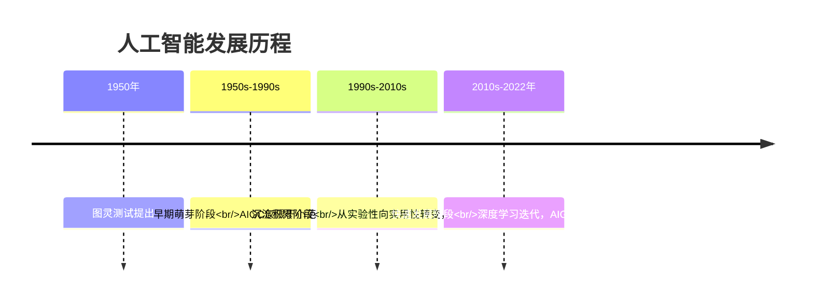
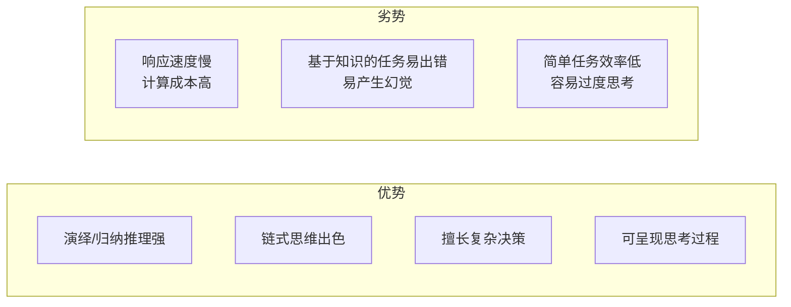
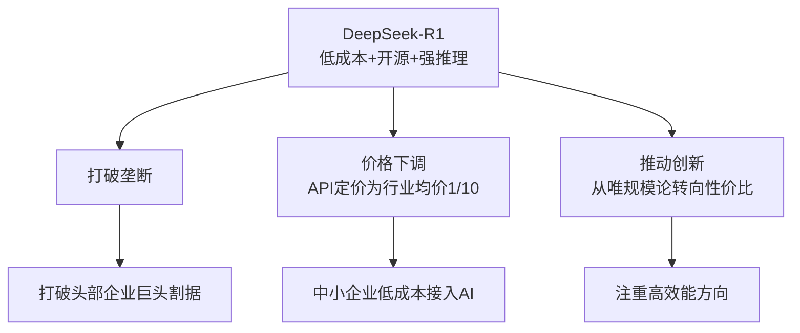
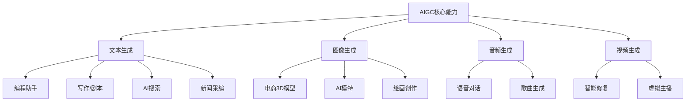
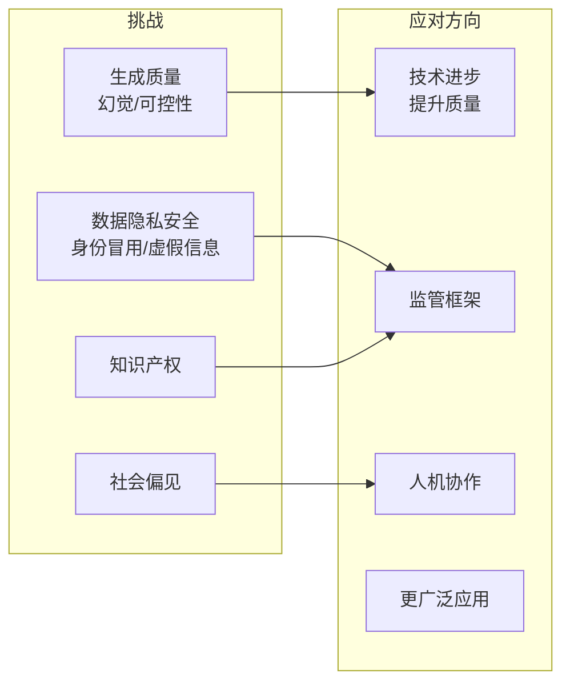
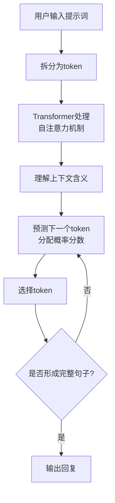
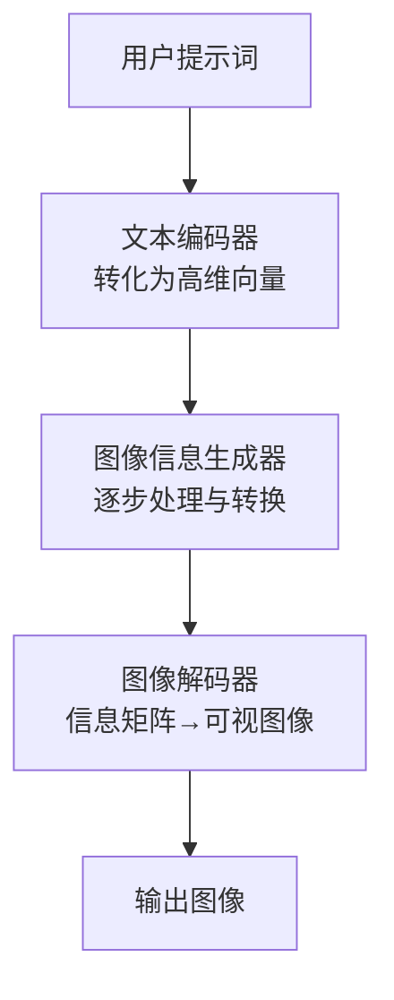
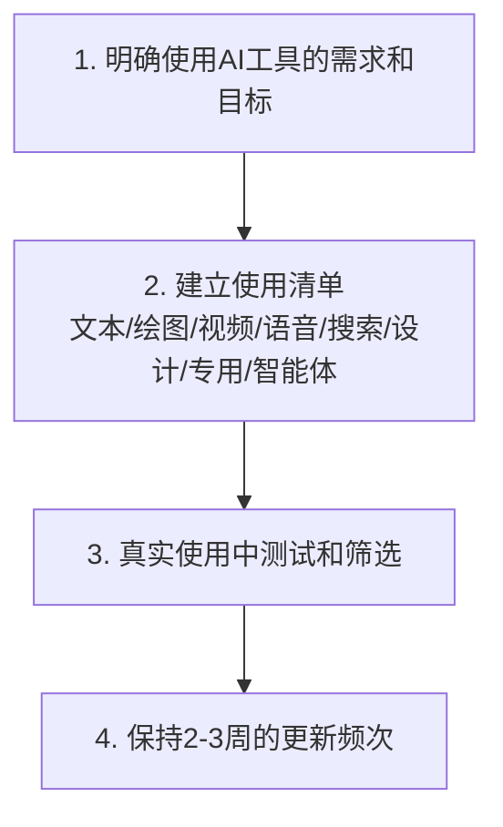
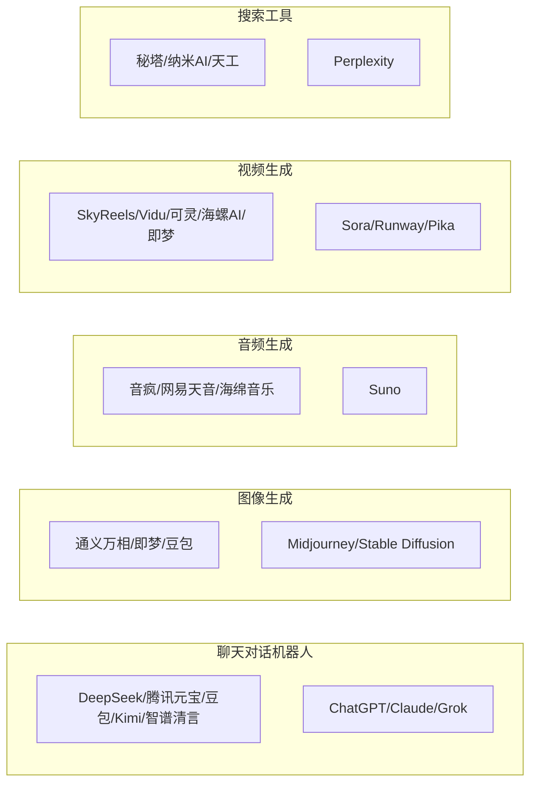

# 《DeepSeek内部研讨系列：DeepSeek与AIGC应用》章节总结

## 书籍信息
- 书名：DeepSeek内部研讨系列：DeepSeek与AIGC应用
- 作者：AI肖睿团队（孙萍、周嵘、李娜、张惠军、刘誉）
- 出版/发布方：北大青鸟人工智能研究院、北大计算机学院元宇宙技术研究所、北大教育学院学习科学实验室
- 时间：2025年2月20日
- PDF状态：扫描版，基于OCR提取文本，部分图像、表格和排版可能不完整
- OCR状态：文本内容基本可读，存在图片占位符（如`image[[...]]`），部分表格以文本形式呈现，已尽力还原

## 目录说明
根据PDF第3页目录，全书共4章：
1. 详解DeepSeek R1
2. AIGC的概念和应用
3. AIGC的能力揭秘
4. 选择AIGC工具

此外，包含前言/导论（第1-2页的讲座说明）和全书总结（第97-98页）。本总结按顺序完整覆盖。

## 全书核心主题
本书是DeepSeek内部研讨系列讲座的讲稿，面向不具备专业AI技术背景的听众，系统介绍DeepSeek-R1模型的核心概念、优势及行业影响，同时扩展到AIGC的底层工作机制、应用场景和工具选择。作者指出，当前网络对DeepSeek的讨论多停留在工具层面，容易误导初学者，因此本书旨在提供深度、实用、落地的AI应用指导。全书强调：DeepSeek-R1以低成本、开源和卓越推理能力打破了传统大模型“堆算力”的路径，AIGC正在重塑多个行业，但面临幻觉、隐私、伦理等挑战，未来需要人机协作与科学工具选择。

---

## 前言/导论：讲座说明

### 核心论点
- **问题**：当前网络上关于DeepSeek的内容多停留在工具应用层面，容易对初级AI应用人员造成概念和思维方式误导；听众需要理解DeepSeek和AIGC的深层次价值。
- **观点**：通过介绍DeepSeek-R1的概念、优势、历史地位，以及大模型和AIGC的底层工作机制，帮助读者突破工具局限，科学选择与高效使用AI工具。

### 关键概念/事件
- **DeepSeek-R1**：低成本、开源、推理能力卓越的大模型，在数学、编程和复杂逻辑任务中表现优异。
- **AIGC底层机制**：理解大模型如何工作，而非仅停留在应用层面。
- **工具应用误区**：当前网络内容易误导初学者，需要系统性澄清。

### 逻辑推演
讲座首先分析DeepSeek-R1为何备受瞩目，然后深入大模型和AIGC的底层机制，最后提供选择和使用AI工具的实用指南。目的是让听众获得更落地的AI应用价值。

### 经典金句/数据
> “尽管DeepSeek-R1以其低成本和开源策略为行业带来变革，但当前网络上的大量相关内容仅停留在工具应用层面，易对初级AI应用人员造成概念和思维方式的误导，这也是本次讲座希望解决的问题。” (p.2)

---

## 第1章：详解DeepSeek-R1

### 1. 核心论点
- **问题**：DeepSeek-R1是什么？它为何能引起行业震动？它在AIGC领域处于什么地位？
- **观点**：DeepSeek-R1以低成本（训练成本560万美元）、开源策略和卓越的推理能力（媲美OpenAI o1）脱颖而出，尤其在复杂逻辑推理、数学和编程任务中表现优异，打破了硅谷传统的“堆算力、拼资本”的大模型发展路径。

### 2. 关键概念/事件
- **生成模型 vs 推理模型**：生成模型（如GPT-4o）擅长通用对话、多模态处理；推理模型（如DeepSeek-R1）侧重于复杂推理、数学、编程，展示链式思考过程，但响应较慢。
- **思维链（Chain of Thought）**：让模型进行“慢思考”，逐步推理解决问题。
- **蒸馏（Distillation）**：在不损失能力的情况下缩小模型规模，例如DeepSeek-R1-Distill-Qwen-7B等蒸馏版模型。
- **强化学习（Reinforcement Learning）**：让模型自我探索和训练，提升推理能力。
- **DeepSeek公司背景**：2023年7月成立，由量化私募“幻方量化”孵化，管理资金超600亿元。

### 3. 逻辑推演/叙事脉络
本章从人工智能发展历程（图灵测试→早期萌芽→沉淀积累→快速发展）引入大模型术语。接着对比生成模型与推理模型的差异，指出推理模型的优劣势（推理强但成本高、易幻觉）。然后聚焦DeepSeek-R1：其性能对齐OpenAI o1，推理成本低至每百万Token 0.14美元，训练成本仅560万美元（远低于美国巨头的数亿至数十亿美元）。R1对行业的重大影响包括打破垄断、推动价格下调、促使行业从“唯规模论”转向“性价比”和“高效能”。最后介绍了DeepSeek产品的官方渠道、模型版本（满血版671B和多个蒸馏版）、能力特点（理科强、通用能力略低于V3、幻觉率较高、语言混杂问题）以及应用场景（推理密集型任务、教育科研、文档分析等）。还列举了接入DeepSeek-R1的第三方服务（腾讯、百度、字节、阿里、教育公司、手机厂商等）。

### 4. 流程图/图表重建

#### 人工智能发展历程（Mermaid）

#### 推理模型的优劣势

#### DeepSeek R1对AI行业的重大影响

### 5. 经典金句/数据
> “DeepSeek-R1的推理能力进入了第一梯队（媲美OpenAI o1），但训练和推理成本低、速度快、全部开源。” (p.14)

> “DeepSeek打破了硅谷传统的‘堆算力、拼资本’的大模型发展路径。” (p.14)

> 训练成本：560万美元；推理成本：每百万Token 0.14美元 (p.14)

> DeepSeek-R1幻觉率（Vectara‘s HHEM 2.1）：14.3%，高于DeepSeek V3的3.9% (p.24)

---

## 第2章：AIGC的概念和应用

### 1. 核心论点
- **问题**：AIGC是什么？它在哪些领域有实际应用？带来哪些价值和挑战？
- **观点**：AIGC（人工智能生成内容）涵盖文本、图像、音频、视频等生成，已在电商、新闻传媒、影视、游戏、教育、金融等行业提升效率、降低成本、增强创新，但同时也面临数据隐私、伦理、生成质量、就业结构变化等挑战。

### 2. 关键概念/事件
- **AI vs AGI**：AI人工智能；AGI通用人工智能，指具备人类水平的智能。
- **生成式AI vs 决策式AI**：生成式AI创造新内容；决策式AI做判断和分类。
- **AIGC典型应用**：
  - 文本：编程助手（Cursor、Copilot）、写作（小说、剧本）、搜索（Perplexity、秘塔）、新闻采编（快笔小新）。
  - 图像：AI生成绘画（获奖作品）、百米画卷《西湖全景图》借助AI一年完成5000个建筑。
  - 音频：语音对话、歌曲生成（千秋诗颂）。
  - 视频：智能图像修复、虚拟主播。
- **Gartner新兴技术成熟度曲线（2023）**：生成式AI处于期望膨胀期，预计2-5年内产生巨大效益；到2026年超过80%的企业将使用生成式AI。

### 3. 逻辑推演/叙事脉络
本章首先梳理AI相关术语，然后通过大量案例展示AIGC在文本、图像、音频、视频生成方面的多样化应用。接着分行业详细说明：电商（3D模型、AI模特、虚拟主播）、内容广告（全流程参与、虚拟偶像）、新闻传媒（采编和传播环节的AI主播）、影视（智能修复）、游戏（研发环节）、其他行业（教育、金融等）。之后分析AIGC带来的挑战：生成质量（幻觉、可控性）、数据隐私安全、社会偏见、知识产权等。最后展望未来：技术进步、更广泛应用、人机协作、监管框架发展。并引用麦肯锡报告预测：到2030年欧洲和美国多达30%的工作时间可能自动化，STEM和医疗保健岗位需求上升，办公室和客服岗位下降，技术和社交情感技能需求增加。

### 4. 流程图/图表重建

#### AIGC行业应用概览（Mermaid）

#### AIGC的挑战与应对

### 5. 经典金句/数据
> “到2026年，Gartner预测超过80%的企业将使用生成式AI的API或模型，或在生产环境中部署支持生成式AI的应用，而在2023年初这一比例不到5%。” (p.52)

> “到2030年，欧洲和美国多达30%的工作时间可能实现自动化。” (p.53)

> “技能类型需求变化：技术技能大幅增长；社交和情感技能成为‘新宠’；认知技能（文字和信息处理、编程、科研、工程等）需求预计减少14%。” (p.54)

---

## 第3章：AIGC的能力揭秘

### 1. 核心论点
- **问题**：AIGC（特别是文本生成和图像生成）背后的技术原理是什么？
- **观点**：文本生成基于Transformer架构的大语言模型（LLM），通过预训练和自回归预测下一个token来工作；图像生成以Stable Diffusion为代表，通过文本编码器、图像信息生成器和图像解码器三大组件将文本转化为图像。两种技术各有优势和局限。

### 2. 关键概念/事件
- **GPT**：生成式预训练变换模型（Generative Pre-trained Transformer）。
- **Transformer架构**：通过自注意力机制处理token之间的关系，识别上下文含义。
- **自回归生成**：基于已有token，预测下一个token的概率分数，重复直到形成完整句子。
- **训练语料**：GPT-3使用了约700GB数据（维基百科、图书、论文、Common Crawl等），约5000亿token；GPT-4参数达1.8万亿。
- **上下文窗口**：GPT-3.5为4096 token，GPT-4为8192 token。
- **图像生成三大组件**：
  - 文本编码器：将提示词转化为高维向量。
  - 图像信息生成器：逐步处理并转换为图像数据。
  - 图像解码器：将信息矩阵转换为可视化图像。

### 3. 逻辑推演/叙事脉络
本章分两大部分：文本生成奥秘和图像生成奥秘。

文本生成部分：以GPT-4o为例，从图灵测试引入，介绍LLM的核心工作机制——将输入拆分为token，用Transformer处理，基于上下文预测下一个token（概率预测+文字接龙），自回归生成完整回复。然后分析优势（语言理解、世界知识、一定推理能力）和劣势（幻觉、知识库有限、上下文窗口限制）。进一步探讨对话能力：多轮对话（上下文编码、自注意力机制、窗口限制）、语言转换（不同语言和编程语言）、意图和情感分析。最后总结文本生成能力的优先级：文本分析 > 文本润色 > 文本生成，并给出使用建议（分段处理、明确指示、补充背景等）。

图像生成部分：以Stable Diffusion为例，介绍文生图和图生图技术。三大组件工作流程：用户提示词 → 文本编码器（向量化）→ 图像信息生成器（逐步处理）→ 图像解码器（输出图像）。优势：降低门槛、提高效率、艺术风格多样化；局限：精确控制困难、随机性强、复杂场景理解不足。

### 4. 流程图/图表重建

#### 大语言模型（LLM）工作原理

#### 图像生成（Stable Diffusion）工作流程

### 5. 经典金句/数据
> “LLM工作原理：概率预测+文字接龙。” (p.62)

> “GPT-4参数：1.8万亿参数；上下文窗口：8192个token。” (p.64)

> “典型的新技能学习曲线：规模到达临界点之后才会迅速增长。” (p.64)

> “文本分析 > 文本润色 > 文本生成——使用优先级。” (p.74)

---

## 第4章：选择AIGC工具

### 1. 核心论点
- **问题**：面对众多AIGC工具，如何科学选择和高效使用？
- **观点**：根据自身需求明确目标，建立工具清单（以1-2个为主、其它为辅），在实际使用中测试筛选，并保持2-3周的更新频次。不同工具在推理能力、多模态支持、长文本处理、搜索效率等方面各有侧重，需对应场景选择。

### 2. 关键概念/事件
- **工具类型**：聊天对话机器人、图像生成、音频生成、视频生成、搜索工具。
- **国内代表**：
  - 聊天：DeepSeek、腾讯元宝、豆包、Kimi、智谱清言。
  - 图像：通义万相、即梦、豆包。
  - 音频：音疯、网易天音、海绵音乐。
  - 视频：SkyReels、Vidu、可灵、海螺AI、即梦。
  - 搜索：秘塔、纳米AI、天工。
- **国外代表**：ChatGPT、Claude、Grok、Midjourney、Stable Diffusion、Suno、Sora、Runway、Pika、Perplexity。
- **工具特点对比**：
  - DeepSeek：文本模态，推理能力强。
  - 豆包：多模态，语音情感能力强。
  - Kimi：多模态，超长文本（20万字上下文），搜索和推理能力强。
  - 智谱清言：多模态。
  - 通义千问：效率工具，代码能力强。
  - 腾讯元宝：可使用微信生态，接入DeepSeek-R1。

### 3. 逻辑推演/叙事脉络
本章先给出AI工具导航网站，然后分类列举国内外工具。接着以腾讯元宝、豆包、Kimi、音疯、Vidu、秘塔为例进行现场演示和功能说明（如Kimi的20万字上下文、网络搜索、Kimi Copilot插件；秘塔的全网/文库/学术/图片/播客搜索）。最后提出四步选择法：1）明确需求目标；2）建立使用清单（按类别分，以1-2个为主）；3）真实使用中测试筛选；4）保持2-3周的更新频次。

### 4. 流程图/图表重建

#### AIGC工具选择四步法

#### AIGC工具类型与代表（国内/国外）

### 5. 经典金句/数据
> “Kimi超长上下文：一次性阅读50份文档，支持20万字上下文输入。” (p.90)

> “选择AIGC工具：以1-2个为主，其它为辅；保持2-3周的更新频次。” (p.96)

---

## 全书总结

### 核心论点
AIGC技术正在重塑各行各业，DeepSeek-R1作为低成本、开源、强推理的标杆，开启了AI发展的新路径。面对技术快速演进带来的机遇与挑战，我们需要保持开放心态，积极学习AIGC基础知识，关注行业应用案例，跟踪最新趋势，与AI共舞，实现人机融合。

### 经典金句
> “与AI共舞，实现AI与人类的完美融合。让我们以DeepSeek-R1为起点，持续探索AIGC的无限可能。在AI时代的技术浪潮中，我们既是见证者，更是参与者。” (p.97)

---

*本总结基于PDF OCR文本整理，部分图表和图片内容已尽力还原。如有OCR错漏或页面缺失，以原文为准。*