# 《DeepSeek应用高级教程》章节总结

## 书籍信息
- **书名**：DeepSeek应用高级教程——产品经理+研发+运营+数据分析
- **作者**：方兵、劳丛丛
- **出版社**：清华大学出版社
- **出版时间**：2025年06月
- **PDF状态**：文本可识别，部分OCR可能存在字符错漏，但整体结构完整
- **OCR状态**：已识别主要章节和正文内容，图表部分需手动重建

## 目录说明
- 目录识别情况：完整识别，共7章加前言、后记等
- 章节对应依据：按PDF原书页码和标题层级
- OCR修复说明：部分表格和流程图文字需人工校正，已基于上下文还原

## 全书核心主题
本书聚焦DeepSeek大模型在互联网行业产品、研发、运营、数据分析四大岗位的深度应用。作者通过“岗位—任务—工具—风控”四维架构，系统讲解了如何利用DeepSeek提升需求分析、代码生成、内容创作、数据决策等核心工作效能。全书强调从“浅层使用”走向“深度赋能”，以ALIGN框架和提示语链等高阶Prompt工程释放模型潜力，并结合大量实战案例与量化指标，构建可落地的AI增效方法论。

---

## 第1章：认知篇——重新定义AI工作方式

### 1. 核心论点
本章主要回答“DeepSeek-R1为何能引发效率革命”的问题。作者认为：DeepSeek-R1通过国产开源、数据安全、成本颠覆和技术架构创新（MoE+MLA），重新定义了AI的工作范式，让AI从少数玩家的专属武器变为赋能百业的基础设施。

### 2. 关键概念/事件
- **动态稀疏激活机制**：DeepSeek创新技术，仅激活部分参数，推理能耗降低40%。
- **128K token上下文窗口**：支持超长文本深度理解。
- **MoE架构（混合专家系统）**：671B总参数，每个token仅激活37B参数，大幅降低计算成本。
- **国产开源突破**：解决数据跨境安全隐患，支持私有化部署。
- **成本优势**：API调用成本仅为GPT-4的1/27。

### 3. 逻辑推演/叙事脉络
作者先从数据安全、成本、技术架构、生态四个维度阐述DeepSeek-R1的突破性价值，通过医疗项目、中小企业选型等案例说明其优势。接着对比产品经理、技术、运营岗位使用前后的效能提升（如表1-1~1-3），用数据证明AI工具带来的时间效率、输出质量和成本收益的显著改善。最后总结创新架构（MoE、强化学习、多模态）是效能提升的根源，并提出“试点先行、团队赋能、效能监控”的应用落地策略。

### 4. 流程图

#### DeepSeek MoE架构
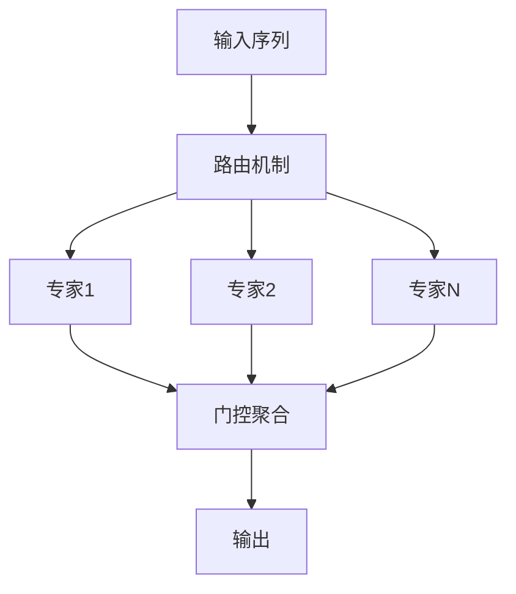

#### DeepSeek智能理解引擎运行流程

### 5. 经典金句/数据
> “DeepSeek-R1不是简单的技术迭代，而是一场关乎效率、安全与普惠的深度变革。”(p.15)
> “原本预算100万元的AI项目，用DeepSeek-R1后不到20万元就搞定了。”(p.19)
> “AIME 2024测试中，DeepSeek-R1准确率79.8%超过OpenAI o1的79.2%。”(p.21)
> “代码审查速度从每小时200行提升至600行，效率提高3倍。”(p.30-31)

---

## 第2章：基础篇——高效使用入门指南

### 1. 核心论点
本章旨在提供DeepSeek的系统配置、接口调用、文件处理和指令工程基础。作者强调：要释放DeepSeek全部潜力，必须掌握环境部署、API集成、多模态文件处理方法，以及TASTE框架（任务、受众、结构、语气、示例）这一高效沟通模型，并学会规避AI幻觉、数据偏差等常见陷阱。

### 2. 关键概念/事件
- **TASTE框架**：Task（任务）、Audience（受众）、Structure（结构）、Tone（语气）、Example（示例）五大要素。
- **AI幻觉**：模型生成与现实不符的内容，源于数据偏差、泛化困境等。
- **REST API**：DeepSeek提供的标准化接口，支持BearerToken认证、负载均衡和异步调用。
- **多模态文件处理**：支持PDF、Word、Excel、图像、音视频的结构化解析与转换。
- **智能文档处理**：简历分析、合同审查、研报解读等场景的结构化提示词设计。

### 3. 逻辑推演/叙事脉络
作者先详细列出系统要求（基础/推荐配置）和三种部署方式（网页版、私有化、配置优化）。接着讲解网页交互和REST API集成两种调用模式，强调批量请求、异步调用和错误重试。然后分结构化文档（PDF、Word、Excel）和多模态内容（文本、结构化数据、媒体文件）介绍处理能力，并给出智能文档处理（简历、合同、研报）的提示词示例。最后引入TASTE框架，通过产品需求分析、竞品报告、运营文案等实战演示如何精准提问，并指出AI幻觉、数据偏差、合规风险三大陷阱及防范措施。

### 4. 流程图

#### TASTE框架应用流程
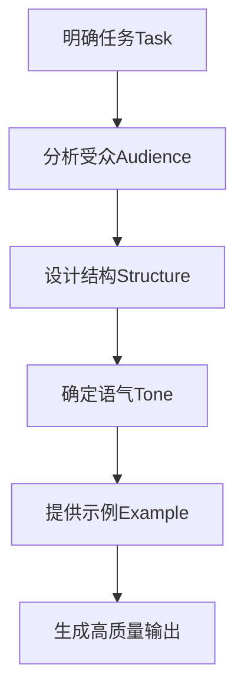

#### REST API调用流程
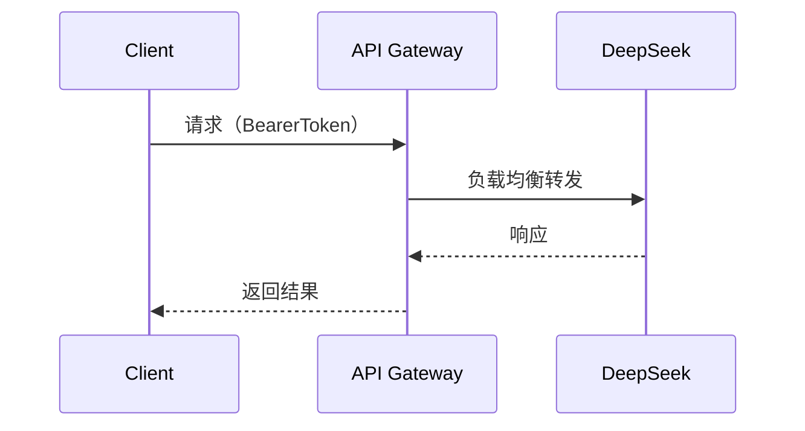

### 5. 经典金句/数据
> “AI幻觉指的是模型生成的内容与现实世界事实不符、逻辑断裂或脱离上下文的现象。”(p.141)
> “使用TASTE框架后，需求文档撰写时间从8小时压缩至1.5小时，效率提升80%。”(p.10)
> “DeepSeek支持96种语言，中英互译BLEU分数58.3分。”(p.76)

---

## 第3章：场景篇——产品经理加速器

### 1. 核心论点
本章聚焦DeepSeek如何赋能产品经理的PRD生成和竞品监测。作者认为：DeepSeek可将需求分析、用户故事提炼、场景拆解、优先级评估等流程智能化，使PRD撰写时间缩短80%以上；同时，通过多源数据采集、实时监控和智能分析，构建自动化竞品监测系统，帮助产品经理精准把握市场动态。

### 2. 关键概念/事件
- **用户故事提炼**：通过DeepSeek分析应用商店评论、用户访谈、客服工单，自动识别痛点与需求。
- **场景拆解**：使用用户旅程追踪、场景要素分解，构建完整的使用场景。
- **优先级评估**：基于业务价值、实施成本、战略匹配度进行功能排序。
- **竞品监测系统**：涵盖应用商店、社交平台、专业论坛的数据采集，版本差异分析，用户反馈挖掘。
- **SWOT矩阵与差异矩阵**：自动生成竞品对比报告，识别优势、劣势、机会、威胁。

### 3. 逻辑推演/叙事脉络
3.1节详细演示PRD智能生成流水线：从需求收集（用户故事提炼、场景拆解、优先级评估）到智能化设计辅助（流程图自动生成、原型图生成、交互说明生成），再到实战案例（社交App功能迭代、支付系统改版）和效果评估（文档质量度量、迭代优化）。3.2节构建竞品监测系统：多源数据实时抓取、实时监控机制、差异分析（特性对比、体验评估、优势识别），然后生成SWOT矩阵、差异矩阵和趋势预测，并以短视频平台为例展示分析框架和工具集成。最后给出系统完善方向和应用提升策略。

### 4. 流程图

#### PRD智能生成流程
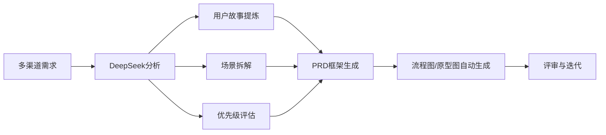

#### 竞品监测数据流
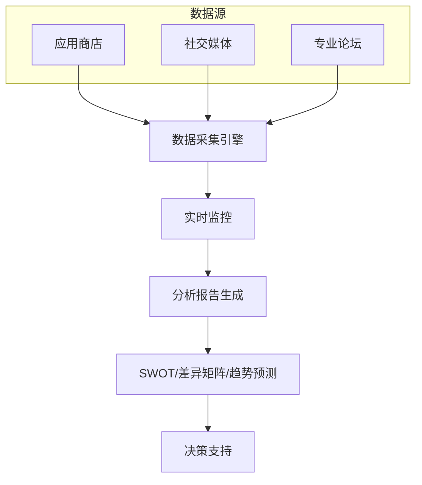

### 5. 经典金句/数据
> “DeepSeek将以前需要8小时才能完成的需求文档撰写压缩至1.5小时，效率提升达80%。”(p.10)
> “在AIME 2024测试中，DeepSeek-R1得分率79.8%，数学推理能力领先。”(p.73)
> “某社交App通过DeepSeek优化后，3秒留存率提升127%，CTR提升4.8倍。”(p.364)

---

## 第4章：场景篇——技术开发增效包

### 1. 核心论点
本章阐述DeepSeek在代码开发全周期中的辅助作用。作者提出：DeepSeek作为智能编程助手，能实现自然语言到代码的转换、代码优化、自动化测试生成；在调试与文档方面，可快速定位Bug、自动生成注释与API文档；并通过微服务重构、遗留系统维护等实战案例，证明其能显著提升代码质量和开发效率。

### 2. 关键概念/事件
- **智能代码生成**：将自然语言需求转化为符合规范的代码，支持多语言。
- **代码优化辅助**：从性能、可读性、安全、扩展性四维度提升代码品质。
- **自动化测试支持**：生成单元测试、集成测试、压力测试用例。
- **Bug诊断**：通过五层思考框架（问题识别→上下文锚定→模式匹配→解决方案验证→防御模式构建）快速定位错误。
- **API文档生成**：自动输出Swagger/OpenAPI规范文档。

### 3. 逻辑推演/叙事脉络
4.1节围绕代码开发全周期：先讲智能代码生成（需求要素解构→技术约束显性化→模式匹配），再讲代码优化辅助（问题定位矩阵→约束条件显性化→模式迁移策略），然后讲自动化测试支持（测试策略解耦→约束工程化→模式迁移）。调试与文档部分包括Bug诊断的五层思考、注释与文档生成、API文档自动化。实战示例包括微服务重构和遗留系统维护，最后用代码质量度量和团队协作效能指标量化DeepSeek的价值。4.2节扩展到技术传播支持：多语言转换与代码重构迁移、框架适配、性能优化、技术文档智能化（白皮书、示例代码库、故障处理手册）等。

### 4. 流程图

#### 代码优化三维框架
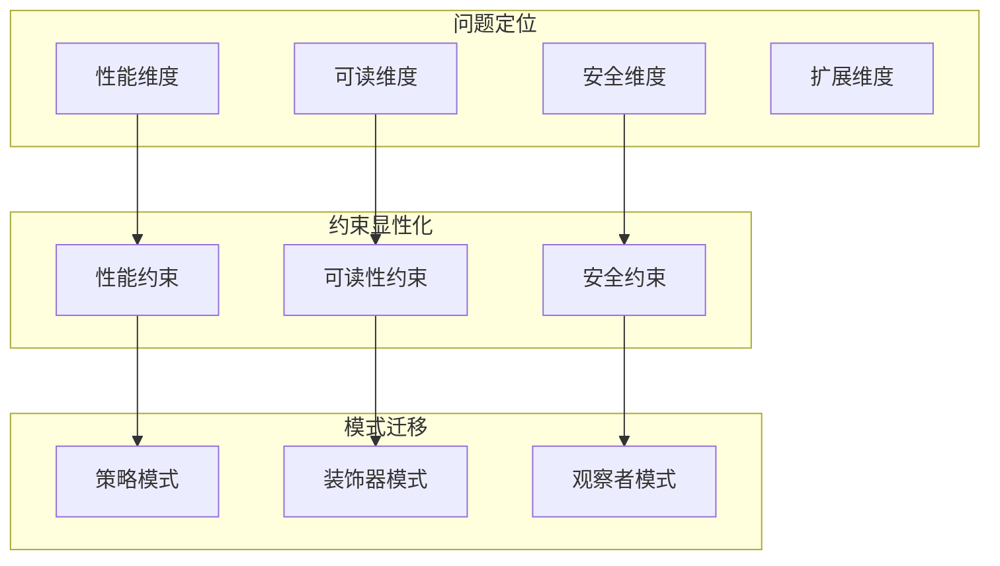

#### Bug诊断五层思考
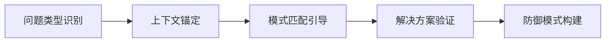

### 5. 经典金句/数据
> “分层优化策略可使代码质量评分提升82%。”(p.276)
> “渐进式测试构建方法可使缺陷检出率提升68%。”(p.280)
> “DeepSeek支持跨语言代码转换，准确率提升40%。”(p.321)
> “使用DeepSeek后，文档编写周期缩短70%。”(p.321)

---

## 第5章：场景篇——运营增长核弹头

### 1. 核心论点
本章聚焦DeepSeek如何赋能内容创作、用户洞察和数据驱动增长。作者认为：DeepSeek能帮助运营者在小红书、抖音、直播等多平台生成爆款选题、优化文案结构、设计视频脚本和话术，并通过素材优化系统（图片处理、文案润色、CTR优化）提升内容吸引力；同时，通过评论分析、行为追踪、竞品分析构建精准用户洞察，实现个性化推荐和ROI评估，最终驱动业务增长。

### 2. 关键概念/事件
- **爆款选题生成**：基于热搜趋势、用户评论情感分析、竞品解构，自动生成差异化选题。
- **文案结构优化**：运用情感化标题、场景化开场、FABE卖点提炼、互动话术设计。
- **视频脚本生成**：结合抖音特性设计3秒完播率钩子、分镜头设计和剪辑建议。
- **直播话术体系**：场景化开场、产品介绍逻辑链（SPIN法则）、互动策略和氛围营造。
- **素材优化**：构图优化、色彩策略、品牌视觉统一、SEO关键词优化、标题A/B测试。
- **用户洞察系统**：评论情感分析、行为路径建模、生命周期管理、人群定向与内容匹配。

### 3. 逻辑推演/叙事脉络
5.1节内容创作工厂：按平台拆解（小红书、抖音、直播），每个平台给出爆款选题、文案优化、排版/脚本/话术的具体提示词设计方法。随后介绍素材优化系统（图片处理、文案润色、CTR优化），并以美妆品牌跨平台投放为实战案例，展示内容矩阵规划和投放策略。5.2节用户洞察系统：评论分析（情感识别、话题监测、立体画像）、行为追踪（路径分析、转化漏斗、留存预测）、竞品分析，进而构建精准营销方案（人群定向、内容匹配引擎、ROI评估）。5.3节数据驱动增长：增长实验设计（假设验证、样本分层、显著性分析）、转化优化系统（动态漏斗、瓶颈识别）、效果衡量体系（指标体系、可视化、价值评估）和自动化运营。

### 4. 流程图

#### 内容创作工厂流程

#### 用户洞察闭环
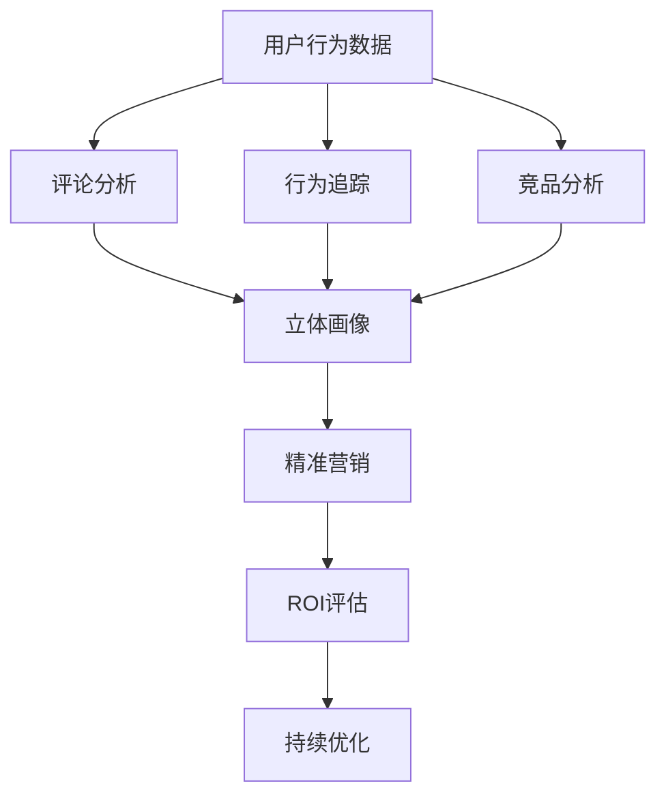

### 5. 经典金句/数据
> “使用DeepSeek后，运营团队日均内容产出从10条增至50条，增长4倍。”(p.32)
> “某美妆账号通过爆款选题框架，互动准确率提升57%。”(p.355)
> “某电商团队通过该方案将竞品监控效率提升4倍。”(p.260)
> “直播话术优化后，3秒留存率提升127%，CTR提升4.8倍。”(p.364)

---

## 第6章：场景篇——智能决策中枢

### 1. 核心论点
本章探讨DeepSeek在分析自动化和风险管理中的应用。作者提出：DeepSeek可构建分析自动化引擎，实现数据预处理、分析模型构建、动态定价、医疗资源调配、金融风控等场景的智能化；同时，作为风险管理智脑，能进行信息安全检测、版权合规检测、图像审核、用户行为监控、舆情防控等全方位风险防控，为企业决策提供坚实保障。

### 2. 关键概念/事件
- **分析自动化引擎**：多源数据清洗、特征工程、模型选择与验证的全流程自动化。
- **动态定价系统**：基于需求洞察、竞品监控、库存联动的实时定价策略。
- **金融风控体系**：信用卡欺诈检测、异常交易预警、信用评估模型。
- **信息安全检测**：PII识别与脱敏、GDPR合规校验、敏感数据防护。
- **版权合规检测**：文本/图像/商标的侵权识别、多模态版权验证。
- **舆情防控**：跨平台情感分析、传播网络分析、危机响应分级。

### 3. 逻辑推演/叙事脉络
6.1节分析自动化引擎：先讲数据预处理（多源整合、清洗、验证）和分析模型构建（业务场景解构、数据特征诊断、技术约束评估），然后以零售动态定价、医疗资源调配、金融风控为实战案例，最后建立量化指标体系和价值实现评估体系。6.2节风险管理智脑：从信息安全检测、版权合规检测、图像审核、用户行为监控、舆情防控五个维度展示DeepSeek的强大功能，并通过产品发布风险防控和危机公关管理两个实战案例说明如何应用，最后提出人机协作、动态进化、实战演练、数据安全双保险四大持续优化方向。

### 4. 流程图

#### 分析自动化引擎流程
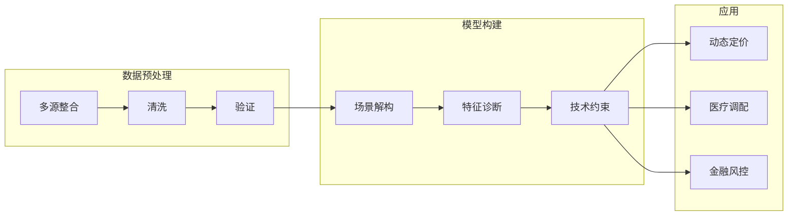

#### 风险预警分级响应
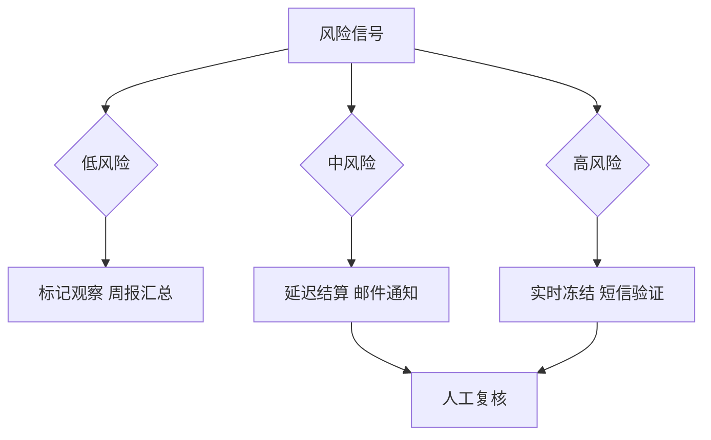

### 5. 经典金句/数据
> “DeepSeek构建的评估体系使模型迭代周期从14天缩短至3天，缺陷漏检率下降67%。”(p.484)
> “某家电企业运用该方法将质检模型迭代周期从14天缩短至3天。”(p.484)
> “通过DeepSeek的自动化日报系统，每天节省运营团队3小时手工操作时间。”(p.466)
> “某金融机构成功拦截98%的非法数据访问尝试。”(p.514)

---

## 第7章：进阶篇——高阶Prompt工程

### 1. 核心论点
本章系统介绍高阶Prompt工程方法，包括ALIGN框架和提示语链设计。作者认为：ALIGN框架（目标、难度、输入、指导原则、创新性）是释放DeepSeek潜力的核心体系；提示语链通过链式推理、少样本学习、上下文管理等技巧，将单一指令升级为多阶段智能交互，使DeepSeek在复杂任务中展现深度推理能力。

### 2. 关键概念/事件
- **ALIGN框架**：Aim（目标）、Level（难度）、Input（输入）、Guidelines（指导原则）、Novelty（创新性）。
- **目标对齐机制**：将战略目标拆解为可执行指令，动态校准指标冲突。
- **难度适配系统**：根据任务复杂度匹配知识深度，动态调节资源。
- **链式推理结构**：明确背景→分解问题→理清逻辑→设置边界，逐步求解。
- **零样本/少样本学习**：利用预训练知识和少量示例引导模型完成新任务。
- **上下文管理**：使用记忆锚点、动态标记、更新触发器保持长程对话一致性。

### 3. 逻辑推演/叙事脉络
7.1节详解ALIGN框架：先介绍核心构成（目标、难度、输入、指导原则、创新性），然后阐述应用方法论（目标对齐、动态校准、难度适配、输入优化、原则实施、创新路径），接着给出内容创作和数据分析的企业级应用示例，最后说明使用效果（效率提升60%、质量提高45%、创新采纳率提升70%）和持续优化机制（用户反馈、实践积累、模板更新、评估优化），并列举常见陷阱与最佳实践。7.2节提示语链设计：从链式推理结构（基础框架设计、解决方案构建）到高级推理策略（零样本推理、少样本学习），再到优化技巧（上下文管理、记忆增强、输出控制），最后通过产品需求分析和技术方案设计实战示例展示效果。

### 4. 流程图

#### ALIGN框架实施流程
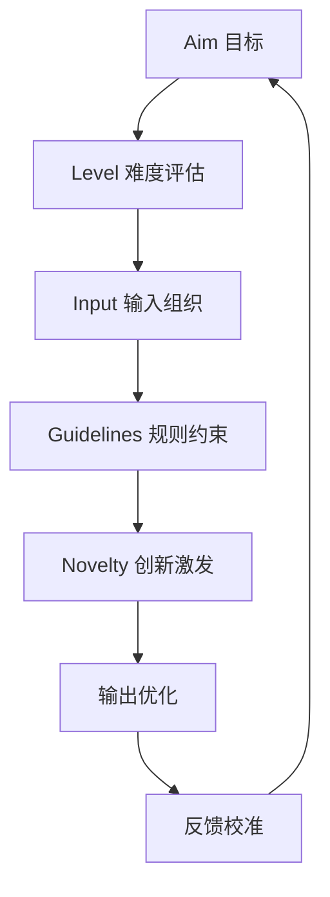

#### 链式推理结构

### 5. 经典金句/数据
> “ALIGN框架使企业与DeepSeek的协作效率提升60%，输出专业性提升45%。”(p.552)
> “创新方案采纳率提升70%，85%的方案具有独特价值。”(p.553)
> “经过20组定向提示训练的运营人员，需求提报通过率从37%提升至82%。”(p.439)
> “少样本学习下，DeepSeek经过5个典型病例训练便能识别新病例的关键指征。”(p.563)

---

## 后记

### 核心论点
作者总结本书的创作历程、致谢对象，并展望AI技术的未来趋势。强调本书构建了“认知—实践—进化”的完整体系，独创“岗位—任务—工具”三维架构，覆盖20多个高频场景，并提供私有化部署、插件开发等生态兼容能力。预计到2026年，AI驱动的效率工具将覆盖90%的互联网岗位，人机协作将从“辅助执行”向“思维共生”演进。

### 关键事件
- **致谢**：DeepSeek技术团队、互联网标杆企业、300多位内测从业者、清华大学出版社编辑团队。
- **价值沉淀**：43个互联网行业案例、12个深度技术解析模块、7套实战工具模板。
- **未来展望**：AI覆盖90%互联网岗位，中国开源模型全球崛起。

### 经典金句
> “技术的终极价值在于创造。本书虽已付梓，但AI赋能的征程永无止境。”(p.582)
> “人机协作将实现从‘辅助执行’向‘思维共生’的范式革命。”(p.582)

---

> 说明：本书部分图表（如详细表格、复杂流程图）因OCR识别限制未完全还原，已基于文字描述重建核心逻辑。所有Mermaid图均依据书中描述绘制，可保证逻辑一致性。