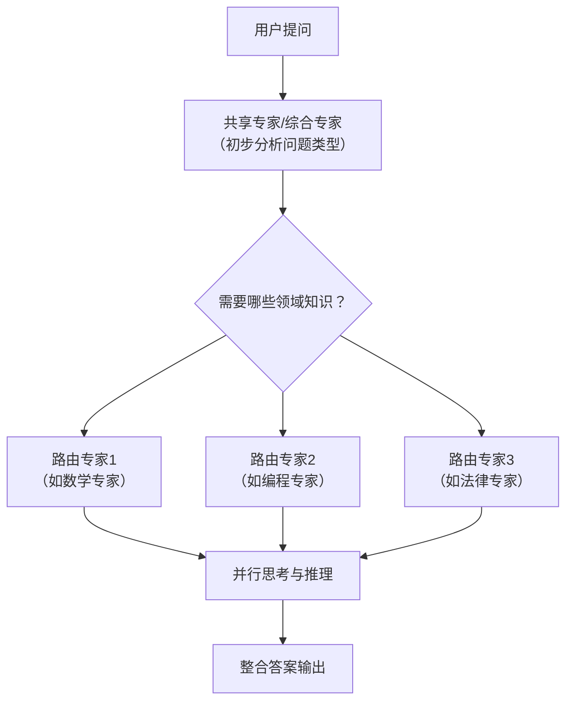
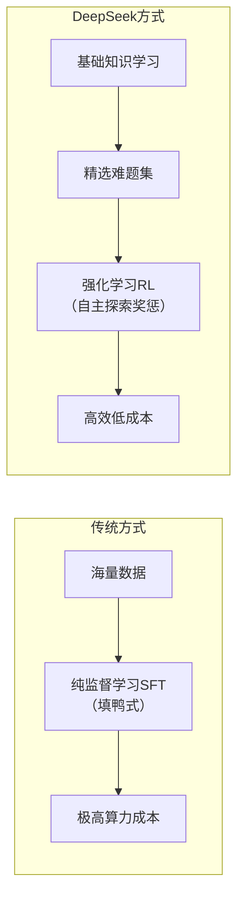
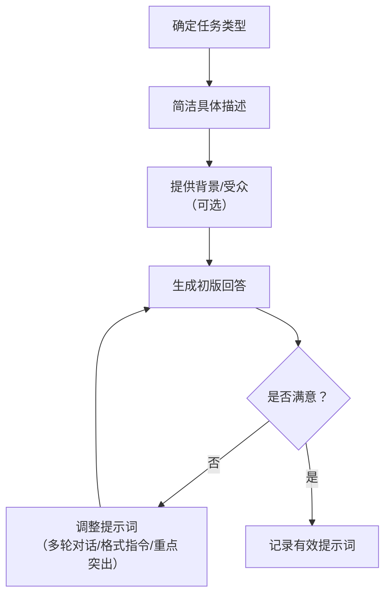
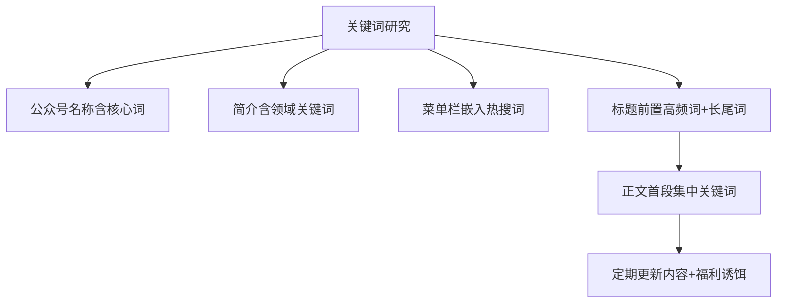
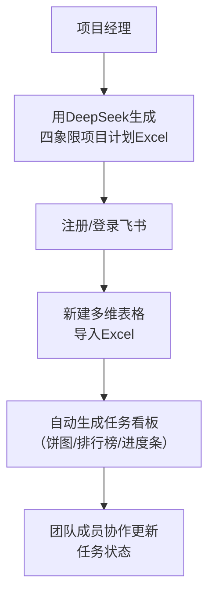
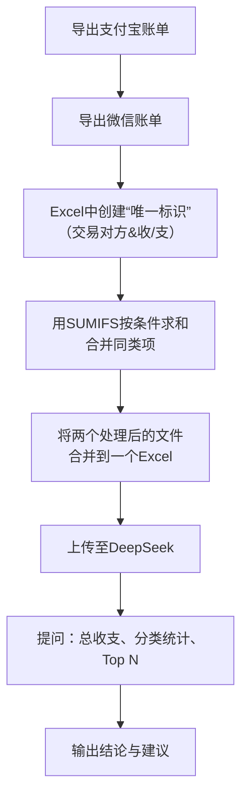
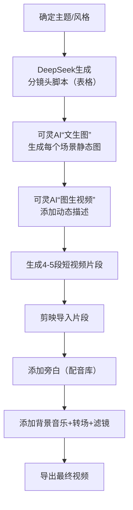
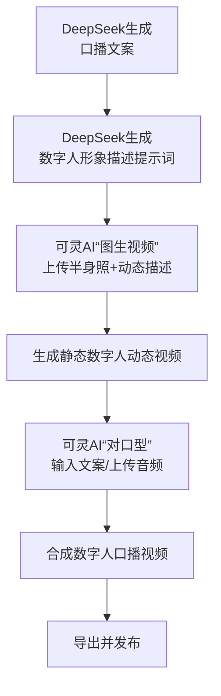
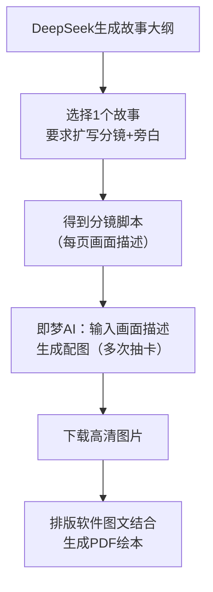
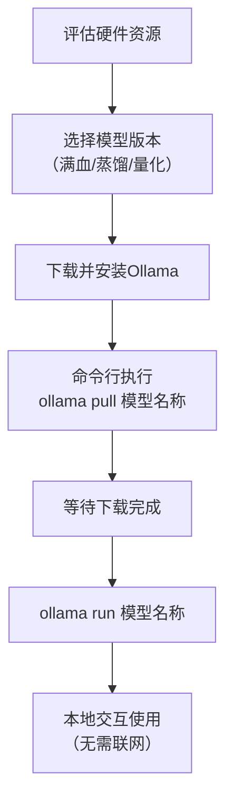

# 《DeepSeek超简单入门：从小白到AI达人》章节总结

## 书籍信息
- 书名：DeepSeek超简单入门：从小白到AI达人
- 作者：于君泽、刘家松、廖兵、张栋、周丽霞
- 出版社：机械工业出版社
- 出版时间：2025年4月
- ISBN：9787111780144
- 字数：119千字
- PDF状态：基于OCR识别文本，整体可读，存在少量页码错位、重复行和识别偏差（如“口”代替特殊符号、个别单位错误）。
- OCR状态：可识别主要内容，图表未完整还原，部分界面截图无法呈现，但逻辑描述完整。

## 目录说明
- 目录识别情况：完整识别前言、第1～10章及推荐阅读。
- 章节对应依据：按书中页码顺序逐章提取。
- OCR修复说明：对明显的错别字（如“泥子”实为“腻子”）和重复段落进行了逻辑推断；未改变原文观点。

## 全书核心主题
本书是一本面向普通用户和初学者的DeepSeek操作指南。作者从AI大模型的技术原理讲起，用通俗语言解释DeepSeek的混合专家架构、思维链、低成本训练等核心优势。全书贯穿“实践导向”，通过大量真实场景（写作、办公、数据分析、自媒体、数字人、教育、私有化部署）展示如何借助DeepSeek提升效率、激发创造力。核心观点是：AI不是替代人类的工具，而是增强人类能力、降低技术门槛的“超级助手”。书中强调“提问能力”和“提示词技巧”是人机协作的关键，并展望了AI在个性化学习、智能家居、职业转型等方面的未来影响。

---

## 第1章：初识DeepSeek

### 1. 核心论点
- 问题：DeepSeek是什么？为何能以极低成本实现接近GPT-4的性能？
- 观点：DeepSeek是中国AI领跑者，其“会思考的AI”（思维链可视化）和“技术落地的实干派”（大幅降低算力要求）两大特性，使其成为推动全民AI时代的关键力量。

### 2. 关键概念/事件
- **中国AI领跑者**：DeepSeek于2023年7月成立，2025年初因R1模型开源和性能比肩GPT-4而全球爆火。
- **会思考的AI**：通过思维链（Chain-of-Thought）技术，将推理步骤可视化，用户可看到“解题过程”而非仅答案。
- **思维链(CoT)**：AI像人类一样逐步推理，分解问题、建立逻辑链条、标注不确定性。
- **技术落地的实干派**：采用稀疏注意力、MoE（混合专家）、FP8混合精度训练等，训练成本仅557.6万美元（DeepSeek-V3），远低于GPT-4。
- **私有化部署价值**：企业可将DeepSeek部署于内部服务器，提升数据安全并降低成本（如汽车质检效率提升5倍）。

### 3. 逻辑推演
作者首先用三个标签定义DeepSeek，接着回顾其发展里程碑（2023.7成立→2023.11 DeepSeek Coder→2024.5 V2→2024.12 V3→2025.1 R1开源）。然后深入解释技术优势：MoE如同医院分诊台，先由“共享专家”分析问题，再派“路由专家”处理；强化学习（RL）结合监督微调（SFT）替代传统“填鸭式”训练，使模型在少量指导下自我优化。最后列举企业应用案例（汽车、券商、投顾、自动驾驶），论证私有化部署的现实收益。

### 4. 流程图

#### DeepSeek MoE工作流程（基于书中比喻）

#### DeepSeek训练方法对比

### 5. 经典金句/数据
> “DeepSeek不仅是一个答案提供者，它还具备针对问题的超强自我思考和推理能力。” (p.13)
> “DeepSeek-V3仅使用GPT-4 10%的参数量就能达到GPT-4 80%的性能。” (p.14)
> “训练成本仅为557.6万美元。” (p.10)
> “某汽车制造商利用DeepSeek进行AI质检，单条生产线检测效率提升5倍，缺陷检出率从92%提升至99.6%。” (p.16)

---

## 第2章：DeepSeek快速上手

### 1. 核心论点
- 问题：用户如何快速注册、使用DeepSeek，并掌握提示词技巧？
- 观点：通过PC/App注册、界面导航、理解不同版本（满血版/蒸馏版/量化版）的适用场景，并遵循“明确目标、简洁具体、提供上下文”三原则编写提示词，即可高效使用DeepSeek。

### 2. 关键概念/事件
- **验证码/微信扫码登录**：支持手机号验证码、账号密码、微信扫码三种方式。
- **R1模型开关**：开启后展示深度思考过程，提升回答质量。
- **联网搜索**：可实时检索网络信息。
- **满血版(671B)**：完整参数，需专业服务器，适合高精度企业场景。
- **蒸馏版(1.5B～70B)**：通过知识蒸馏压缩，个人电脑可运行。
- **量化版**：降低精度（如FP4/INT8），减少显存占用，适合资源受限环境。
- **提示词三原则**：明确任务类型、简洁具体、提供背景信息/目标受众。

### 3. 逻辑推演
作者先分PC端和App端讲解注册、登录、安装步骤（包括apk下载）。然后对比满血版、蒸馏版、量化版的参数规模、硬件门槛和典型应用，给出选择建议（企业选满血版或蒸馏版，个人开发者选蒸馏版或量化版）。最后重点讲解提示词：什么是提示词、优质提示词的作用、构建原则（明确目标、简洁具体、提供上下文），并用大量正反案例对比（如“写一篇关于环保的文章” vs “写一篇800字左右的演讲稿”）。还介绍了优化提示词的方法：多轮对话、格式指令、重点突出指令、记录有效提示词等。

### 4. 流程图

#### 提示词构建与优化流程

### 5. 经典金句/数据
> “提示词是用户与DeepSeek沟通的‘指令语言’。” (p.39)
> “清晰、明确的提示词就像一把精准的钥匙，能帮助DeepSeek准确理解用户的想法。” (p.40)
> 非具体提示词 vs 具体提示词输出对比：具体提示词生成了完整演讲稿（含数据、案例、号召），非具体提示词则输出抽象散文式内容。(p.41-44)

---

## 第3章：DeepSeek辅助高质量写作

### 1. 核心论点
- 问题：创作者如何利用DeepSeek突破灵感枯竭、结构混乱、内容平淡等写作瓶颈？
- 观点：DeepSeek可全流程辅助写作——从主题挖掘（干货类/热点类）、结构搭建（金字塔/并列式/STAR/SCQA/PREP等）、内容生成（标题、开头、结尾、初稿），到文章优化（润色、SEO）和内容卡片制作，大幅提升创作效率和质量。

### 2. 关键概念/事件
- **干货类主题挖掘**：使用提示词框架“我是【方向】写作者，受众是【受众】，需要写关于【主题】的50个干货选题”。
- **热点类主题挖掘**：结合热点事件与自身方向生成50个选题。
- **常见文章结构**：金字塔、并列式/清单式、STAR（情境-任务-行动-结果）、三幕式、SCQA（情境-冲突-疑问-回答）、PREP（观点-原因-例子-观点）。
- **标题优化**：吸引眼球（悬念/数字/流行语）、准确清晰、简洁明了、引发共鸣。
- **SEO优化**：关键词布局（长尾词、语义关联）、标题首段小标题自然嵌入、公众号名称/简介/菜单栏优化、使用微信指数等工具。
- **内容卡片HTML生成**：DeepSeek可直接输出带图标的卡片HTML代码，并支持下载为PNG/JPEG。

### 3. 逻辑推演
作者先论证AI为何能辅助写作（海量知识储备、快速生成、精准理解、提供灵感、持续学习）。然后分步演示：主题挖掘（给出两个完整案例，分别生成50个育儿干货选题和50个结合“×××回归”热点的亲子选题）；结构搭建（以“AI改变行为模式”为例，分别用金字塔结构和自由大纲输出）；内容生成（标题优化、开头撰写、结尾写作、初稿生成，每步均给出提示词框架和输出示例）；文章优化（文案润色——提供10余种润色要求如语法纠错、修辞添加等；SEO优化——公众号名称、简介、菜单栏、文章标题的具体优化案例）；最后展示如何利用DeepSeek生成内容卡片的HTML代码并在剪映中运行下载。

### 4. 流程图

#### 文章创作全流程

#### SEO优化框架（公众号）

### 5. 经典金句/数据
> “好的标题能大幅提升内容的传播范围与速度。” (p.78)
> “运用比喻、排比、设问等修辞手法，增强文本的表现力和感染力。” (p.98)
> 案例：优化前标题“奶粉冲泡全攻略：水温、比例、储存避坑指南”，优化后“当心！这3个冲泡动作正在偷走宝宝营养”。(p.81)
> “微信SEO中，名称长度控制在6～8字，适配移动端显示。” (p.105)

---

## 第4章：重塑企业办公

### 1. 核心论点
- 问题：AI如何从哪些维度重塑企业办公，并通过具体工具（DeepSeek+飞书）实现任务管理？
- 观点：AI提升工作效率（自动化流程、智能助手、快速决策）、优化沟通协作（会议助手、实时翻译）、数据驱动决策、降低运营成本、创新工作方式（智能文档、数字人、远程支持）。通过DeepSeek生成项目计划，导入飞书多维表格可实现可视化的任务跟踪与管理。

### 2. 关键概念/事件
- **AI重塑办公的7个维度**：工作效率、沟通协作、数据驱动决策、运营优化、创新工作方式、个性化体验、数字化转型。
- **四象限任务管理**：重要紧急、重要不紧急、紧急不重要、不紧急不重要。
- **飞书多维表格**：支持导入Excel，自动生成任务看板（饼图、排行榜等）。
- **WPS合同审查**：使用WPS灵犀“合同审查”功能，可对DeepSeek生成的合同进行法律风险批注。

### 3. 逻辑推演
作者先列举AI重塑办公的核心维度，然后通过一个项目经理的案例：用DeepSeek生成包含四象限任务类型的Excel模板（含优先级颜色、进度条、自动提醒公式）。接着指导注册飞书账号，并将该Excel导入飞书多维表格，生成仪表盘（饼图按任务类型统计）。最后演示如何用DeepSeek生成劳动合同模板，并利用WPS的AI合同审查功能获得近20条专业建议。

### 4. 流程图

#### 任务管理流程（DeepSeek+飞书）

### 5. 经典金句/数据
> “AI进一步突破传统办公场景的效能边界……回答了‘如何高效’的问题。” (p.123)
> “WPS合同审查给出了近20项专业建议，以批注形式附在文件中。” (p.141)
> 案例：生成的Excel模板包含条件格式（P0红色，P1橙色等），自动提醒公式 =IF(AND(状态="进行中",TODAY()>截止日期),"！延期",...)。(p.126-127)

---

## 第5章：DeepSeek辅助数据分析

### 1. 核心论点
- 问题：普通用户如何整合多平台（支付宝、微信、银行卡）收支数据，并剥离家庭内部转账进行真实分析？
- 观点：通过导出各平台账单、利用DeepSeek指导Excel数据合并（按“交易对方+收/支”聚合），再上传至DeepSeek进行智能分析，可快速获得收支结构、分类统计和可视化结论。同样，DeepSeek也能帮助比较装修报价单，识别价格异常和项目覆盖差异。

### 2. 关键概念/事件
- **多平台数据导出**：支付宝“开具交易流水证明”、微信“下载账单”功能，均需通过邮箱接收加密文件。
- **数据合并方法**：在Excel中创建“唯一标识”列（交易对方&收/支），使用SUMIFS函数按条件求和，再删除重复项。
- **DeepSeek分析能力**：可逐行计算总收入/支出，按业务种类分类，输出金额占比和项数。
- **WPS AI数据分析**：内置“AI数据分析”功能，可直接对话式统计（如“列出收入的Top10”）。
- **装修报价比较**：上传两家报价单图片，DeepSeek提取文字并按项目类别对比价格、覆盖范围和异常项（如铝扣板吊顶10元/㎡远低于市场价）。

### 3. 逻辑推演
以小军的财务管理需求为例：①从支付宝、微信分别导出月度账单（详细步骤截图）；②因DeepSeek不擅长处理几百条原始数据，改用先Excel合并的方法：用“交易对方+收/支”作为唯一标识，SUMIFS求和，将400条数据压缩到几十条；③将处理后的两个文件上传DeepSeek，提问“计算总收支、分类金额”，得到收入集中生活服务类（95.3%），支出食品与餐饮类（46.7%）等结论；④也可用WPS AI完成类似分析。装修案例中，上传两张报价单图片，DeepSeek提取文字（需注意提示词要求“按原图顺序”），然后让DeepSeek比较两家公司，输出价格对比表、项目覆盖分析和风险提醒（如材料范围模糊、低价陷阱）。

### 4. 流程图

#### 个人收支数据分析流程

### 5. 经典金句/数据
> “当数据分析从IT部门的专属技能变为全民工具，一场静默的认知革命已然到来。” (p.142)
> “DeepSeek当下并不擅长处理几百条规模的数据，因此笔者调整了思路——先合并再分析。” (p.163)
> 装修比较中，DeepSeek识别出“A公司泥水工程标注纯人工，B公司未明确材料”，建议要求明确品牌和工艺。(p.187)

---

## 第6章：DeepSeek赋能自媒体内容创作

### 1. 核心论点
- 问题：创作者如何利用DeepSeek组合其他AI工具（海绵音乐、剪映、可灵AI）高效产出音乐、图文视频和AI视频？
- 观点：DeepSeek负责创意生成（歌词、文案、分镜头脚本），海绵音乐生成旋律，剪映“图文成片”自动配图配音，可灵AI生成动态视频及数字人。人机协作模式让创作者成为“导演+AI训练师”，大幅降低素材门槛和制作时间。

### 2. 关键概念/事件
- **AI音乐**：通过海绵音乐，输入歌词（DeepSeek生成）和风格参数，自动生成旋律并导出视频。
- **图文视频**：剪映“图文成片”功能，输入文案后自动匹配网络图片、背景音乐和配音。
- **分镜头脚本**：DeepSeek可按表格形式输出场景、时间、画面描述、旁白。
- **可灵AI图生视频**：支持“首尾帧”图生视频，可对上传图片添加动态描述（如“慢速横移镜头+雨滴下落0.8x”），生成5秒短视频。
- **后期剪辑**：剪映中合并多段视频，添加旁白（配音库）、滤镜（如“情绪电影”）、转场效果。

### 3. 逻辑推演
作者依次演示三个组合：
1. **DeepSeek+海绵音乐**：以“青春校园”主题，让DeepSeek生成民谣歌词《纸飞机与课桌诗》，粘贴到海绵音乐“自定义写词”，选择曲风“民谣”、心情“浪漫”、音色“女声温暖”，生成三首编曲，下载为视频。
2. **DeepSeek+剪映图文成片**：以“深圳旅游攻略”为例，DeepSeek生成五大景点介绍（含开场、结尾），粘贴到剪映“自由编辑文案”，生成视频后手动替换匹配度低的图片、调整音乐。
3. **DeepSeek+可灵AI+剪映**：以“王家卫风格18岁女孩写真”为例，DeepSeek生成4个场景的分镜头表格（画面描述+旁白），依次在可灵AI“文生图”生成静态图片，再进入“图生视频”添加动态描述（如“镜头缓慢拉近，雨滴撞击玻璃慢镜头”），生成4段5秒视频，最后在剪映中拼接、添加旁白（剪映配音库）、添加“情绪电影”滤镜并导出。

### 4. 流程图

#### AI视频创作流程（DeepSeek+可灵AI+剪映）

### 5. 经典金句/数据
> “创作者在这里既是导演，也是AI训练师。” (p.189)
> “剪映图文成片：只需输入文字，即可自动生成视频，包括图片匹配、字幕添加和背景音乐。” (p.199)
> 案例：可灵AI生成王家卫风格图片时，提示词包含“35mm胶片颗粒，浅景深，动态模糊”。(p.208)

---

## 第7章：DeepSeek赋能数字人营销

### 1. 核心论点
- 问题：如何利用DeepSeek快速创建数字人视频，并应用于营销场景？
- 观点：DeepSeek生成高质量口播文案和数字人形象描述提示词，结合剪映数字人模板或可灵AI“图生视频+对口型”功能，可低成本、高效率制作产品介绍、客户服务、品牌推广等视频。数字人营销需遵循明确目标、内容规划、技术落地、风险管控、长效运营五个实践步骤。

### 2. 关键概念/事件
- **数字人视频优势**：高效内容生成、高度定制化、成本效益显著、多语言支持、持续优化。
- **数字人技术类型**：
  - 数字人模板（剪映内置形象）
  - 定制数字人（上传照片/视频生成）
  - 个人视频对口型（上传照片+文本，AI生成口型）
- **剪映数字人操作**：选择形象（如“高端销售”）→ 输入文案（DeepSeek生成）→ 配音选择（音色）→ 调整背景/字幕/语速 → 导出。
- **可灵AI对口型**：上传个人半身照 → 生成静态图 → “对口型”功能 → 输入文本或上传本地配音 → 合成动态数字人视频。
- **营销最佳实践**：SMART目标设定、三段式文案（痛点引爆+价值传递+行动号召）、A/B测试、合规性检查（关键词过滤库）、生命周期管理（导入期/成长期/成熟期）。

### 3. 逻辑推演
先分析数字人视频的五大优势和四大应用场景（产品介绍、客户服务、品牌推广、教育培训）。然后对比三类数字人技术，列出国内主流平台费用参考。接着演示DeepSeek如何赋能：生成电商带货数字人描述提示词（如“30岁男主播，时尚商务装，直播间灯光柔和”）和蓝牙耳机口播文案（30秒版本）。实操部分分两节：
- **剪映数字人**：选形象→配音（粘贴DeepSeek文案）→调整背景字幕→导出。
- **可灵AI数字人**：上传正面半身照→“图生视频”添加动态描述（如“微微抬起右手”）→“对口型”功能，输入文案或上传音频→生成并下载无水印视频。
最后给出数字人营销的最佳实践框架：明确目标（品牌认知/用户互动/转化驱动）、内容规划（三段式文案+形象设计原则）、技术落地（工具矩阵+智能迭代）、风险管控（版权/伦理/数据安全）、长效运营（运营日历+持续优化）。

### 4. 流程图

#### 数字人视频制作流程（DeepSeek+可灵AI）

#### 营销内容三段式文案结构

### 5. 经典金句/数据
> “DeepSeek在这一过程中发挥了关键作用，它能够快速生成高质量的文案和数字人形象描述提示词。” (p.221)
> “合规性检查：设置关键词过滤库，如‘治愈率100%’‘根治’‘永不复发’等。” (p.242)
> 案例：剪映数字人形象推荐“历史解说”适合知识分享，“高端销售”适合产品介绍。(p.232)

---

## 第8章：DeepSeek赋能教育

### 1. 核心论点
- 问题：如何利用DeepSeek制作儿童绘本、实现个性化学习辅导、辅助课程与课件设计？
- 观点：DeepSeek通过生成故事大纲、分镜脚本和画面描述，结合即梦AI绘图，可快速制作高质量儿童绘本；通过诊断评估、量身定制学习计划、巩固测试三步实现个性化辅导；还能自动生成教学大纲、知识点提炼，并配合KIMI的PPT助手一键生成课件。

### 2. 关键概念/事件
- **儿童绘本制作流程**：DeepSeek生成故事（5个版本可选）→ 扩写分镜脚本（每页画面描述+旁白）→ 即梦AI“图片生成”配图（可多次“抽卡”选最优）→ 排版软件图文结合。
- **个性化学习辅导三步**：
  1. 诊断评估：DeepSeek自动出题测试，分析知识薄弱点（如二次函数）。
  2. 定制计划：分解知识点（如配方法、顶点式、求根公式），提供每日练习建议。
  3. 巩固测试：根据学习情况生成针对性测试题。
- **自动批改作业**：拍照上传，DeepSeek识别文字并判断对错，分析解题思路。
- **课程课件设计**：DeepSeek生成教学大纲（含时间分配、互动活动）→ 提炼知识点列表 → 将大纲+知识点融合为Markdown → 在KIMI中选择“PPT助手”，一键生成PPT并下载。

### 3. 逻辑推演
先指出传统儿童绘本创作门槛高、周期长，DeepSeek+AI绘图可解决这些问题。演示：输入“请为我编写5个儿童绘本故事”，DeepSeek输出大纲（如《过家家中的安全小卫士》），选择其中一个，要求“扩写分镜画面和旁白”，DeepSeek输出表格形式的分镜脚本。然后将每个画面的描述粘贴到即梦AI，选择模型“图片2.1”、比例3:2，多次生成直至满意，下载超清图片。最后用排版软件合成图文绘本。

个性化学习部分：以初二数学为例，让DeepSeek“进行评估”，系统自动生成自测题（基础/中等/挑战），并给出常见薄弱点建议。然后针对“二次函数没学会”，DeepSeek输出专项突破指南（核心知识框架、易错点、专项练习、学习建议）。最后可要求“进行巩固测试”。

课件设计部分：以“勾股定理”为例，让DeepSeek生成教学大纲（40分钟，含情境引入、定理探究、分层应用、总结升华），再提炼知识点，然后将大纲和知识点融合为Markdown格式。将该Markdown复制到KIMI的“PPT助手”，一键生成PPT并下载。

### 4. 流程图

#### 儿童绘本制作流程

#### 个性化学习辅导三步法

### 5. 经典金句/数据
> “DeepSeek在思考过程中展现出了极为详尽且系统化的分析能力。” (p.249)
> “AI绘画多次生成的过程比喻为‘抽卡’。” (p.254)
> 二次函数学习计划中，DeepSeek建议“每日一练：每天做2道不同题型的二次函数题”。(p.271)
> “KIMI将自动根据输入的知识点内容自动完成每一页PPT的制作。” (p.285)

---

## 第9章：DeepSeek私有化部署

### 1. 核心论点
- 问题：企业为何需要私有化部署DeepSeek？如何低成本、高效率完成本地部署？
- 观点：私有化部署可保障数据安全、满足定制化需求、提升稳定性与响应速度。通过Ollama开源框架，只需选择合适的模型版本（根据硬件配置），运行几条命令即可在本地下载并运行DeepSeek模型，实现离线使用。

### 2. 关键概念/事件
- **私有化部署定义**：将DeepSeek从公共云端迁移至企业内部服务器，所有数据处理在内部网络完成。
- **核心价值**：数据安全（防止泄露）、定制化（注入行业知识）、稳定性（不受公网波动影响）。
- **Ollama**：开源框架，支持一键下载、运行大模型，无可视化界面，通过命令行操作。
- **硬件选型参考**：
  - 满血版(671B)：需1TB内存+双H100卡（企业级）
  - 蒸馏版(8B/32B)：24GB显存（中高端显卡）
  - 量化版(1.5B～8B)：8GB显存甚至CPU运行
- **部署命令**：`ollama pull deepseek-r1:8b`（下载），`ollama run deepseek-r1:8b`（运行），`ollama list`（查看已下载模型）。

### 3. 逻辑推演
作者先类比“将智能助手请到家中”，解释私有化部署的定义和三大价值。然后给出典型的部署三步骤：
1. **模型选型**：根据硬件条件选择满血版/蒸馏版/量化版（提供硬件配置表）。
2. **环境准备**：下载Ollama客户端（Windows/Mac/Linux），安装后在任务栏出现图标，验证`localhost:11434`显示“Ollama is running”。
3. **部署运行**：打开命令行（管理员），执行`ollama pull deepseek-r1:8b`下载模型（显示进度），完成后`ollama run deepseek-r1:8b`进入交互界面，输入问题即可获得本地模型的回答（断网也可用）。最后提醒多测试优化，并参与技术社区交流。

### 4. 流程图

#### DeepSeek私有化部署流程（Ollama）

### 5. 经典金句/数据
> “私有化部署就像在企业内部搭建了一个隔音效果极佳的会议室，所有的对话和数据交互都在这个安全的空间内完成。” (p.289)
> 硬件配置参考：蒸馏版8B需24GB显存，量化版1.5B可在手机端运行。(p.290-291)
> “Ollama是一个开源框架，专为在本地机器上便捷部署和运行大型语言模型而设计。” (p.291)
> 验证命令：浏览器输入`localhost:11434`，显示“Ollama is running”即成功。(p.298)

---

## 第10章：DeepSeek的未来发展趋势

### 1. 核心论点
- 问题：DeepSeek未来可能如何演进？对行业、职业和生活将产生哪些影响？
- 观点：技术上将更智能适配、多模态交互、成本普惠化；用户生态从工具变为伙伴（垂直渗透、社群共创、银发族突破）；全球化需应对地缘政治和文化适配；伦理上面临内容安全、数据隐私和防滥用挑战；最终目标是“增强创造力”而非替代人类，并在医疗、金融、制造等行业深度应用，同时催生新职业、淘汰旧岗位。

### 2. 关键概念/事件
- **技术演进**：预判用户意图、多模态交互（语音/图像/VR）、成本控制推动普惠化。
- **用户生态**：垂直领域渗透（自适应学习、可穿戴健康）、社群化人机共创（AI技能商店）、银发族突破（方言识别）。
- **全球化布局**：技术开源+本地化合规、文化适配精细化运营、与硬件厂商合作预装。
- **伦理挑战**：分级响应机制（高风险话题提示咨询专业人士）、数据护照（用户自主选择训练数据）、防沉迷提示。
- **行业应用预测**：
  - 医疗：AI辅助诊断、远程健康管理、个性化医疗。
  - 金融：智能风控、智能投顾、动态智能合约。
  - 制造/建筑：柔性生产、建筑方案优化、按需生产。
- **职业变迁**：夕阳职业（基础翻译、传统记者、基础会计）；新兴岗位（AI绘画专员、AI视频创作者、AI编程辅助工程师）。

### 3. 逻辑推演
作者从五个维度展开未来预测：
1. **技术演进**：从“好用”到“懂你”，举例DeepSeek可结合聊天记录推荐职业路径。
2. **用户生态**：从工具变伙伴，如教育领域自适应系统、银发族方言交互。
3. **全球化布局**：地缘政治下的博弈（技术开源+本地合规），文化适配（东南亚节日祝福、欧洲无痕对话模式）。
4. **伦理挑战**：内容安全（分级响应）、数据隐私（数据护照）、防滥用（防沉迷提示）。
5. **行业与职业**：医疗、金融、制造的具体案例；列出可能消失的职业和新兴岗位图谱。
最后展望未来生活场景（智能唤醒、数字分身、云端瑜伽等），强调AI的终极意义是“增强创造力”和“推动社会协作模式变革”。

### 4. 流程图

#### DeepSeek未来演进的关键维度

### 5. 经典金句/数据
> “DeepSeek的终极意义不在于技术参数的领先，而在于重新定义人机协作的可能性。” (p.314)
> “未来，DeepSeek可能会显著加速诊断与精准治疗的进程……将传统需数年的靶点发现缩短至几周。” (p.315-316)
> “夕阳职业预警：基础翻译员、传统记者、基础会计；新兴岗位：AI绘画与设计专员、AI视频内容创作者、AI编程辅助工程师。” (p.320)
> “早晨7:00，睡眠监测床垫依据你的睡眠数据，自动调节房间温湿度……脑机接口将数据上传到DeepSeek。” (p.322-323)

---

> 说明：本书还包含“推荐阅读”页面，但无具体内容，故未总结。全书总结基于OCR识别文本，部分界面截图和表格细节无法完全还原，但核心逻辑和方法已完整提取。