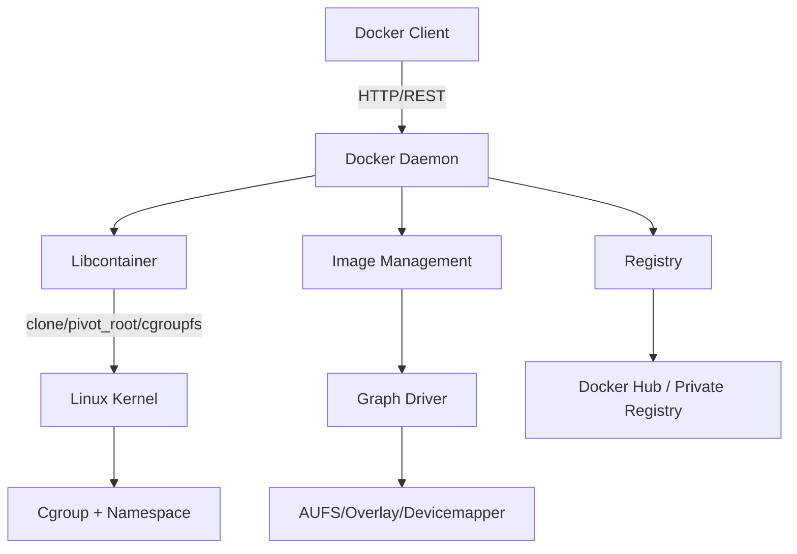
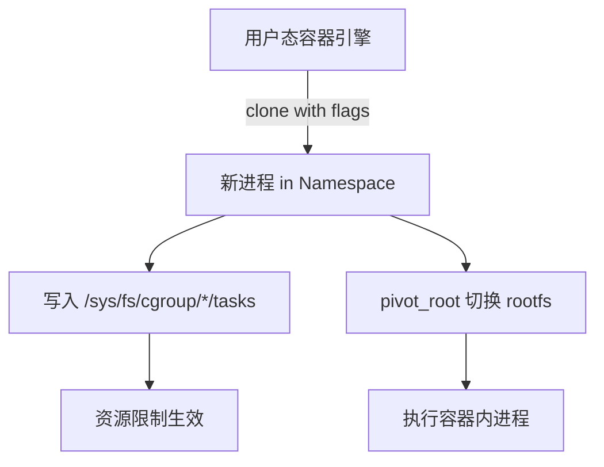
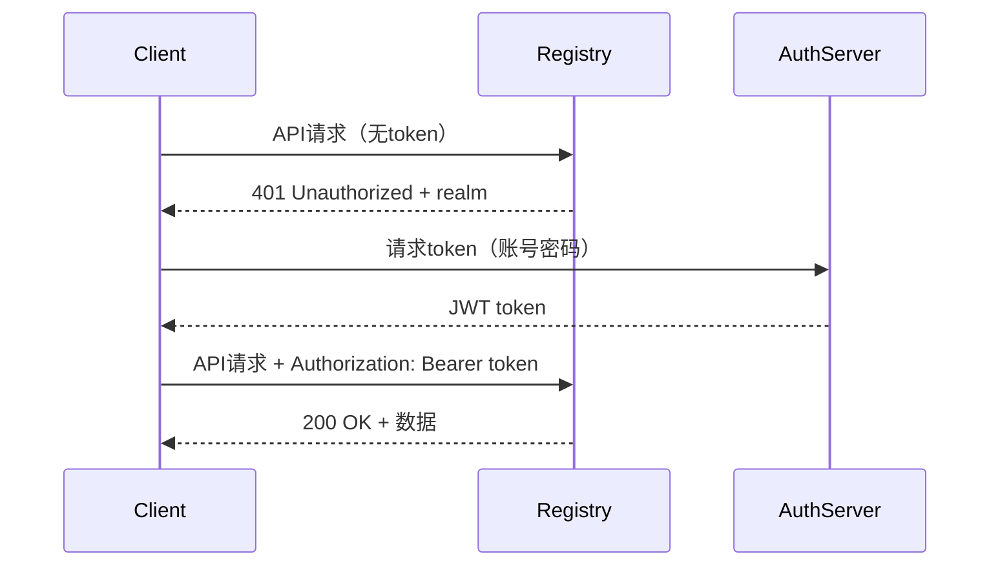
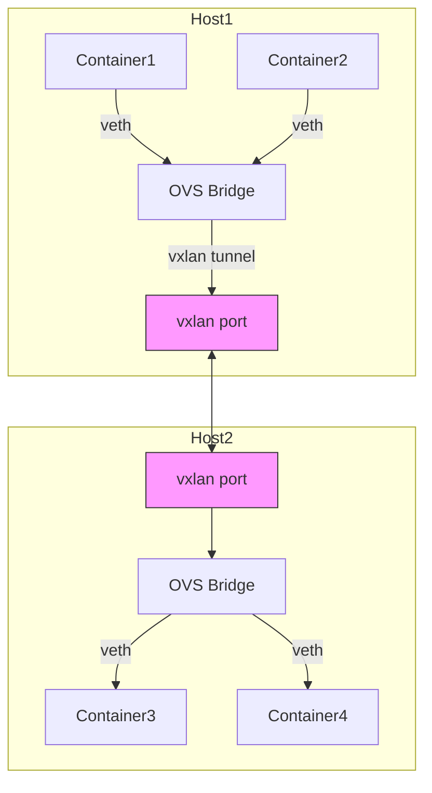
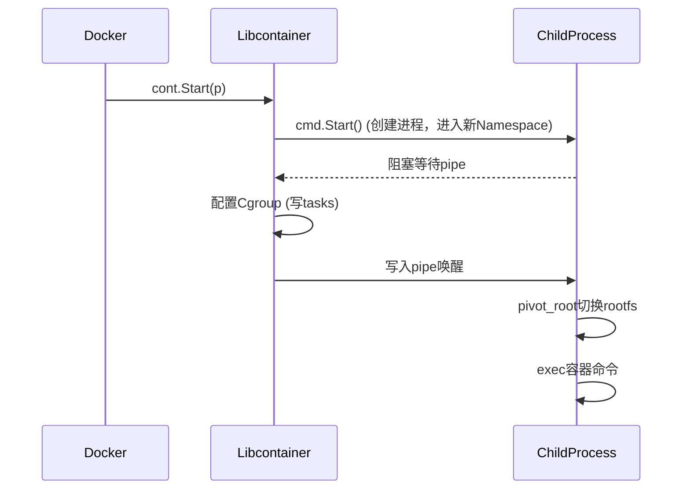
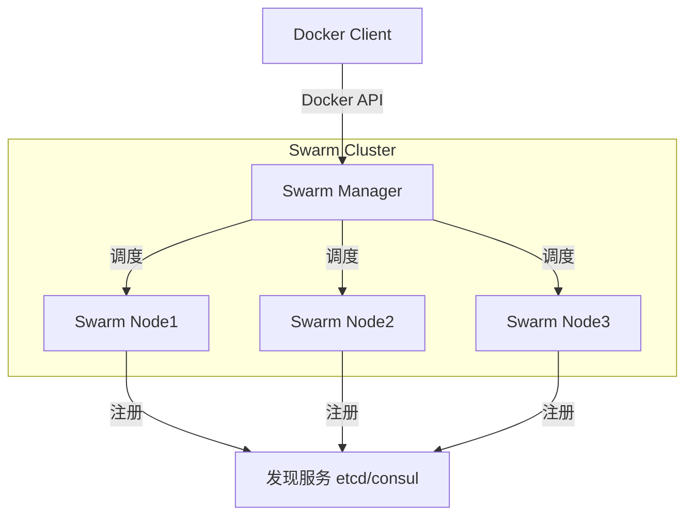

# 《Docker进阶与实战》章节总结

## 书籍信息
- 书名：Docker进阶与实战（Docker Pro）
- 作者：华为Docker实践小组 著
- PDF状态：基于文本提取，部分页码存在OCR识别不完整或错位
- OCR状态：文本可读，但部分章节（如第11章）内容不完整，部分图表需基于文字描述重建

## 目录说明
- 目录识别情况：基于书中实际页码和标题提取，与正文顺序基本一致
- 章节对应依据：严格按照书中标题层级（第X章）进行整理
- OCR修复说明：对于识别不完整的部分（如第11章后半缺失），已在相应章节注明；流程图基于文字描述使用Mermaid重建

## 全书核心主题
本书由华为Docker实践小组撰写，面向有一定Docker基础的读者，系统梳理Docker的关键技术原理和高级使用技巧。全书以Docker 1.8版本为基础，从容器技术（Cgroup、Namespace）出发，深入讲解Docker镜像、仓库、网络、卷管理、API、安全、Libcontainer等核心模块，并通过实战案例展示Web应用部署和集群管理。此外，还介绍了Docker生态圈、测试方法和参与开源开发的流程。核心观点：Docker并非全新发明，而是对已有内核技术（Cgroup、Namespace、UnionFS）的创新组合，形成了“Build, Ship and Run”的应用交付体系。

---

## 序

### 核心论点
作者团队来自华为操作系统内核开发，指出Docker的核心技术（Cgroup、Namespace、Aufs）早已存在，但通过Docker引擎的组合焕发出全新吸引力。问题在于：为什么这些“大叔辈”的技术能爆发？观点：换位思考（从开发到运维/应用开发者）才能理解Docker成功的本质。

### 关键概念/事件
- **Cgroup**：Google 2006年启动，用于资源控制
- **Namespace**：从Mount namespace逐步演进，实现多种隔离
- **Aufs**：1993年起源，实现联合文件系统
- **Docker的爆发**：不是技术先进性，而是组合创新与生态建设

### 逻辑推演/叙事脉络
序言从操作系统内核开发者的视角出发，指出Docker所用技术虽不新，但通过组合和封装，解决了应用打包、分发、部署的实际问题。作者通过角色转换（戴上运维/开发帽子），理解了Docker成功的原因，并希望通过本书将经验传播给更多读者。

### 经典金句/数据
> “这些‘大叔辈’的技术，通过 Docker 引擎的组合，焕发出‘小鲜肉’的吸引力。” (p.4)

> “与其说是容器造就了 Docker，不如说是它们造就了彼此” (p.39)

---

## 前言

### 核心论点
本书定位为进阶图书，适合有一定基础的读者，重点讲解关键技术原理和高级使用技巧，帮助读者部署生产环境并发挥Docker价值。

### 关键概念/事件
- **目标读者**：一般Docker用户和生态圈开发者
- **内容特点**：按功能模块划分，深入分析每个模块，包含高级用法和实战问题
- **版本**：基于Docker 1.8
- **团队**：华为Docker实践小组一线开发者和社区贡献者

### 逻辑推演/叙事脉络
前言解释了写作动机（国内Docker发展火热，华为有积累愿分享），介绍了本书的内容结构（不重复入门知识，侧重系统梳理和高级技巧），并致谢了相关人员和团队。

---

## 第1章：Docker简介

### 核心论点
本章解决“Docker是什么”的问题。作者认为Docker是一个开源的容器引擎，通过镜像打包、Registry统一管理，实现“Build, Ship and Run”流程，相比传统虚拟化更轻量、高效。

### 关键概念/事件
- **Docker历史**：2013年由dotCloud开源，后改名Docker.Inc，加入Linux基金会
- **架构特点**：无Hypervisor层，通过Libcontainer与内核交互
- **核心组件**：客户端、daemon、容器、镜像、Registry
- **镜像分层**：利用Union mount（AUFS/Overlay）实现共享和写时复制

### 逻辑推演/叙事脉络
本章从历史和发展入手，介绍Docker架构图，然后逐项解释五大核心概念。接着给出安装和使用方法（apt-get、docker命令、man手册）。最后澄清两个常见问题：Docker在LXC基础上做了什么（跨主机部署、以应用为中心、版本管理等），以及与虚拟机的区别（共享内核、轻量级、秒级启动）。

### 流程图



### 经典金句/数据
> “Docker 的容器就是‘软件界的集装箱’，它可以安装任意的软件和库文件，做任意的运行环境配置。” (p.15)

> “我们可以很轻松地在一台普通的 Linux 机器上运行 100 个或者更多的 Docker 容器” (p.22)

---

## 第2章：关于容器技术

### 核心论点
本章解决“什么是容器技术以及Docker与容器关系”的问题。作者认为容器技术主要由Cgroup（资源控制）和Namespace（访问隔离）构成，再加上rootfs和容器引擎。容器技术历史悠久（chroot 1982年），Docker使其重获新生。

### 关键概念/事件
- **Cgroup**：控制组，限制CPU、内存、blkio等，子系统包括cpuset、cpu、memory等
- **Namespace**：命名空间，隔离UTS、IPC、PID、Mount、Network、User
- **容器创建原理**：clone系统调用创建新Namespace，将pid写入cgroup tasks文件，执行pivot_root切换根文件系统
- **容器发展历史**：chroot(1982) → pivot_root(2000) → OpenVZ(2005) → Cgroup/Namespace进入内核(2006-2008) → Docker(2013)

### 逻辑推演/叙事脉络
本章从容器技术的前世今生讲起，给出容器最小组成公式，然后用代码抽象演示创建原理。接着详细介绍Cgroup的接口、子系统和Namespace的6种类型及使用方法。最后讨论容器与Docker的关系：Docker为容器而生，容器使Docker更强大，两者相辅相成。

### 流程图



### 经典金句/数据
> “容器 = cgroup + namespace + rootfs + 容器引擎（用户态工具）” (p.26)

> “Docker 是为容器而生的。” (p.39)

---

## 第3章：理解Docker镜像

### 核心论点
本章解决“Docker镜像是什么以及如何组织”的问题。作者认为镜像是启动容器的只读模板，采用分层文件系统和写时复制技术，实现了空间复用和Git式管理。

### 关键概念/事件
- **镜像表示法**：`[Registry/]Namespace/Repository:Tag`，类似Github
- **镜像层**：每个镜像由多个layer组成，layer ID类似Git commit
- **联合挂载**：OverlayFS、AUFS等将多个目录联合挂载为一个
- **写时复制**：容器修改文件时复制到可写层，不影响下层
- **Git式管理**：借鉴Git的分层和仓库概念

### 逻辑推演/叙事脉络
首先介绍镜像概念和表示法，然后通过docker images、build、pull、push等命令说明镜像生命周期管理。接着分析镜像的组织结构（graph目录、repositories-overlay、元数据JSON），最后扩展联合挂载、写时复制和Git式管理的原理，并以OverlayFS为例演示覆盖、新增、删除操作。

### 经典金句/数据
> “Docker 镜像是用来启动容器的只读模板，是容器启动所需要的 rootfs” (p.28)

> “Docker 引入联合挂载技术使镜像分层成为可能；而 Git 式的管理方式，使基础镜像的重用成为可能。” (p.37)

---

## 第4章：仓库进阶

### 核心论点
本章解决“如何管理和分发Docker镜像”的问题。作者详细介绍了仓库（Repository）的概念、Docker Hub的功能、Registry V2的API及鉴权机制，并给出部署私有仓库和Index的方法。

### 关键概念/事件
- **仓库组成**：镜像存储系统 + 账户管理系统
- **Docker Hub**：官方公共仓库，支持在线编译、账户管理、组织协作
- **Registry V2**：开源项目distribution，支持快速上传下载、分布式存储、Webhook通知
- **Registry API**：RESTful接口，包括manifest操作、blob上传（整体/分段）、鉴权token
- **鉴权机制**：基于OAuth 2.0和JWT，由Auth Server签发token
- **私有仓库部署**：运行registry容器 + Nginx反向代理 + TLS证书
- **Index**：扩展的账户管理系统，含控制单元、鉴权模块、数据库

### 逻辑推演/叙事脉络
首先定义仓库和镜像的关系，演示push/pull/search命令。然后介绍Docker Hub的优点和网页结构。接着深入Registry V2的架构、API命令清单，重点分析manifest和上传下载流程（初始化、整体/分段上传、取消上传）。再说明鉴权机制（401响应 → 访问Auth Server → 获取token → 访问Registry）。最后给出部署私有仓库的方法（运行容器、Nginx反向代理）和Index的设计（控制单元、数据库表、UI）。

### 流程图



### 经典金句/数据
> “仓库下面包含着一组镜像，镜像之间用标签（tag）区分。” (p.42)

> “Docker Hub 属开源社区性质，为 Docker 开发者服务，在发布形式和服务功能上很大程度模仿了 Github。” (p.44)

---

## 第5章：Docker网络

### 核心论点
本章解决“Docker容器如何通信”的问题。作者指出原生Docker网络存在短板（性能、功能），介绍了Libnetwork提出的CNM模型，并详细讲解了五种网络模式（bridge、host、none、container、overlay）以及手动跨主机多子网配置方法，最后对比了Weave、Flannel、SocketPlane等第三方方案。

### 关键概念/事件
- **CNM模型**：沙盒（Sandbox）、端点（Endpoint）、网络（Network）
- **Libnetwork驱动**：bridge、host、null、remote、overlay
- **bridge模式**：默认模式，通过docker0网桥和veth pair通信，使用iptables做NAT
- **container模式**：与另一容器共享Network Namespace
- **host模式**：与主机共享Network Namespace
- **overlay模式**：基于vxlan隧道和KV存储（consul/etcd）实现跨主机多子网
- **手动跨主机方案**：使用Open vSwitch创建网桥、vxlan端口、veth pair，分配tag实现vlan隔离
- **第三方方案**：Weave（用户态路由）、Flannel（etcd+UDP）、SocketPlane（OVS+Consul，已被Docker收购）

### 逻辑推演/叙事脉络
首先介绍Docker网络现状和Libnetwork的CNM模型。然后详细演示五种网络模式的使用和底层原理（iptables规则、网桥、veth pair）。接着通过一个完整示例（两台主机、两个vlan）手动配置跨主机多子网网络，使用ovs-vsctl和ip命令。最后对比Weave、Flannel、SocketPlane的特点和不足。

### 流程图



### 经典金句/数据
> “纯粹的 Docker 原生网络功能无法满足广大云计算厂商的需要，于是一大批第三方的 SDN 解决方案如雨后春笋般涌现出来” (p.71)

> “Docker 的网络实质上是操纵 Network Namespace、网桥、虚拟网卡及 iptables 实现的” (p.90)

---

## 第6章：容器卷管理

### 核心论点
本章解决“容器数据持久化和共享”的问题。作者介绍了Docker原生的数据卷和数据卷容器，以及1.8版本引入的卷插件机制，并以Convoy为例说明卷插件的使用、API和发现机制。

### 关键概念/事件
- **数据卷**：通过`-v`参数创建，绕过联合文件系统，持久化存储
- **数据卷容器**：使用`--volumes-from`共享卷
- **备份迁移**：通过`docker run --rm -v`挂载数据卷并使用tar打包
- **卷插件**：实现REST API（Create、Mount、Path、Unmount、Remove等），Docker通过socket或spec文件发现插件
- **Convoy**：单节点卷插件，支持DeviceMapper、VFS、EBS，可快照和备份
- **Flocker**：支持卷迁移，但复杂且单点

### 逻辑推演/叙事脉络
首先介绍数据卷的创建（`-v`）、主机目录挂载、数据卷容器共享。然后指出原生卷管理的不足（仅本地、无生命周期管理）。接着引出卷插件，以Convoy为例演示安装、运行daemon、使用`--volume-driver`创建卷。最后剖析卷插件的工作原理（daemon监听REST API）、API接口（6个方法）和插件发现机制（搜索路径/run/docker/plugins等）。

### 经典金句/数据
> “卷管理在实际应用中扮演着重要的角色，可以说任何应用只要产生数据，就会用到卷管理。” (p.99)

> “Docker 1.8 版本引入卷插件机制...允许使用第三方插件来管理容器中的数据。” (p.102)

---

## 第7章：Docker API

### 核心论点
本章解决“如何通过API与Docker交互”的问题。作者介绍了Docker的RESTful API（Remote API、Registry API、Hub API），并通过多个由浅入深的示例演示API的使用，最后用一个完整的“Build, Ship and Run”场景串联所有API。

### 关键概念/事件
- **REST**：表述性状态转移，Docker API符合RESTful风格
- **Docker Remote API**：对应docker命令，如`/images/json`、`/containers/create`
- **配置远程访问**：修改DOCKER_OPTS或other_args，添加`-H tcp://0.0.0.0:5678`
- **常用API示例**：
  - `GET /images/json` 列出镜像
  - `POST /containers/{id}/copy` 拷贝文件
  - `POST /containers/{id}/exec` + `/exec/{id}/start` 执行命令
  - `POST /build` 基于Dockerfile构建镜像
- **完整场景**：构建Python Web Server镜像 → push到私有Registry → pull到另一主机 → 创建并启动容器 → 访问和查看日志

### 逻辑推演/叙事脉络
首先介绍REST和Docker API种类。然后指导读者配置Docker daemon远程访问（Ubuntu/Red Hat），并用curl验证。接着通过初级示例（获取镜像列表、拷贝文件）展示API调用；中级示例展示docker exec对应的两步API（创建exec实例、启动exec）；以及docker build对应的`/build` API（需要tar包）。最后用一个科幻故事串联“Build→Ship→Run”全过程，涵盖镜像构建、tag、push、pull、容器创建启动、日志查看等API。

### 经典金句/数据
> “简洁易用的 Docker API 对 Docker 及周边生态的迅速崛起起到了不可估量的促进作用。” (p.108)

> “Docker 提供了三类 RESTful API：Docker Remote API、Docker Registry API、Docker Hub API。” (p.110)

---

## 第8章：Docker安全

### 核心论点
本章解决“Docker容器是否安全以及如何加固”的问题。作者认为容器与主机共享内核，隔离性不足，安全性是最大挑战。并系统介绍了多种安全策略（Cgroup、capability、SELinux、AppArmor、Seccomp等），通过Shocker攻击实例展示了安全加固的必要性和方法。

### 关键概念/事件
- **安全性问题**：容器与主机共享内核，Namespace隔离不完善（如/proc、syslog未隔离）
- **安全策略**：
  - Cgroup限制CPU、内存、blkio
  - ulimit限制系统资源
  - 容器组网隔离
  - 镜像签名（Notary/TUF）
  - 日志驱动（syslog等）
  - 监控（docker stats）
  - 只读根文件系统
  - capability白名单（默认去除敏感cap）
  - SELinux/AppArmor强制访问控制
  - Seccomp限制系统调用
- **Shocker攻击**：利用`open_by_handle_at`系统调用逃逸容器读取host的/etc/shadow
- **加固实践**：去掉`dac_read_search` capability，或启用SELinux/AppArmor即可防御
- **遗留问题**：User Namespace未支持、非root运行daemon、热升级、磁盘限额、网络I/O限制

### 逻辑推演/叙事脉络
首先指出Docker安全的三方面（容器、镜像、daemon），重点在于容器安全性（共用内核）。然后逐一介绍Cgroup限制、ulimit、组网、虚拟机嵌套、镜像签名、日志、监控、只读rootfs、capability（默认白名单）、SELinux（策略模块）、AppArmor（配置文件）、Seccomp、grsecurity等策略。接着通过Shocker攻击实例演示逃逸，并展示如何通过`--cap-drop=dac_read_search`或SELinux/AppArmor加固。最后总结User Namespace、非root daemon等遗留问题。

### 经典金句/数据
> “容器安全性问题的根源在于，容器和 host 共用内核，因此受攻击面特别大” (p.144)

> “Docker 的隔离性还远达不到虚拟机的水平，应该避免把 Docker 容器当成虚拟机来使用” (p.166)

---

## 第9章：Libcontainer简介

### 核心论点
本章解决“Docker底层如何管理容器”的问题。作者认为Libcontainer是真正的容器引擎，Docker通过调用Libcontainer API实现容器生命周期管理。并介绍了runC（OCI标准实现）与Libcontainer的关系。

### 关键概念/事件
- **Libcontainer**：Go语言库，提供Container接口（ID、状态、进程、统计、Start、Destroy、Pause、Resume等）
- **容器创建原理**：golang中通过`exec.Cmd`和`SysProcAttr.Cloneflags`创建新Namespace；通过写入cgroupfs实现资源限制；通过`pivot_root`切换根文件系统
- **启动流程**：Docker收集配置 → 调用Libcontainer创建子进程 → 子进程进入新Namespace并阻塞 → 父进程配置Cgroup → 父进程通过pipe唤醒子进程 → 子进程执行pivot_root和init
- **runC**：OCI的容器runtime工具，从Libcontainer的nsinit演变而来，通过JSON配置文件定义容器
- **功能扩展**：Checkpoint/Restore（基于CRIU）、修改容器配置等

### 逻辑推演/叙事脉络
首先澄清Libcontainer才是真正的“容器引擎”，Docker是更高层的管理工具。然后展示Libcontainer的Container接口，归纳出功能（运行、暂停、销毁、信号、信息获取、配置修改、Checkpoint/Restore）。接着分析技术原理：golang中创建Namespace的方法、Cgroup配置时机、pivot_root切换rootfs，并给出完整的容器启动流程图。最后介绍runC的由来、工作原理（读取JSON配置）和未来（成为OCI标准runtime）。

### 流程图



### 经典金句/数据
> “Libcontainer 才是真正的容器引擎，而 Docker 是建立在引擎之上、更高层面、功能也更强大的容器管理工具。” (p.167)

> “runC 就是从 Libcontainer 演变而来的” (p.178)

---

## 第10章：Docker实战

### 核心论点
本章通过一个完整的Web应用部署案例，演示Dockerfile编写、镜像构建、HTTPS配置、静态/动态挂载源码、多容器协作（docker-compose）等实战技能。

### 关键概念/事件
- **Dockerfile指令**：FROM、MAINTAINER、RUN、EXPOSE、CMD、ENTRYPOINT、VOLUME、ENV、ADD、COPY
- **镜像制作原理**：Docker解析Dockerfile → 以基础镜像创建容器 → 顺序执行命令 → commit为新镜像
- **HTTPS Tomcat镜像**：生成SSL证书，通过`docker run -v`挂载证书到容器，修改server.xml，commit新镜像
- **静态导入 vs 动态挂载**：静态使用COPY指令，动态使用VOLUME+`-v`挂载
- **多容器应用**：前端Tomcat、后台bkservice、认证auth、MySQL，使用docker-compose定义links、volumes、ports等
- **docker-compose**：通过YML文件定义服务，`docker-compose up`一键启动

### 逻辑推演/叙事脉络
首先介绍Dockerfile的基本语法和示例。然后以HTTPS Web站点为例，选择Tomcat基础镜像，生成证书，修改配置，制作HTTPS镜像。接着将Web源码导入镜像（静态COPY或动态VOLUME挂载）。最后扩展为多容器后台服务：定义bkservice、auth、MySQL模块，给出工程目录结构和docker-compose.yml，使用`docker-compose rm/build/up`整体部署。

### 经典金句/数据
> “Docker 的最佳实践是一个容器只运行一个进程” (p.197)

> “对于 Docker 的学习，最好的学习方式就是实践” (p.196)

---

## 第11章：Docker集群管理

> 说明：该部分PDF识别不完整，仅保留可识别内容（Compose、Machine、Swarm概述），缺失11.4 Docker在OpenStack上的集群实战和11.5本章小结。

### 核心论点
本章介绍Docker官方三大编排工具：Compose（单机多容器编排）、Machine（多平台安装Docker）、Swarm（原生集群管理），三者结合可实现Docker集群管理。

### 关键概念/事件
- **Compose**：使用YML文件定义多容器应用，通过`docker-compose up`启动，支持build、links、volumes、ports等
- **Machine**：命令行工具，通过驱动（VirtualBox、AWS等）在任意主机安装Docker，创建Docker host
- **Swarm**：将多个Docker主机抽象为单一虚拟Docker主机，提供标准Docker API，支持多种调度策略（随机、 binpack、spread等）
- **Swarm架构**：Swarm Manager + Swarm Node，使用发现服务（etcd、consul、zookeeper）注册节点

### 逻辑推演/叙事脉络
首先介绍Compose的作用和docker-compose.yml示例。然后说明Machine的架构（驱动+虚拟机+boot2docker）和运行流程（create → eval → run）。最后介绍Swarm的“swap, plug and play”原则、内部架构（Manager通过调度器分配容器到Node）。

### 流程图



---

## 第12章：Docker生态圈

### 核心论点
本章介绍Docker生态圈的重点项目和发展方向，包括编排工具（Kubernetes、Mesos、Compose等）、容器操作系统（CoreOS、RancherOS、Project Atomic）、PaaS平台（Deis、Flynn、Tsuru）以及OCI组织。

### 关键概念/事件
- **编排**：容器集群的调度和管理，包括Compose（单机）、Swarm（Docker原生）、Kubernetes（Google）、Mesos（Apache）等
- **容器操作系统**：极简Linux发行版，仅包含运行容器所需组件，如CoreOS（基于ChromeOS）、RancherOS（PID1为Docker）、Project Atomic（Red Hat）
- **PaaS平台**：基于容器的应用部署平台，如Deis（Heroku-like）、Flynn（开源PaaS）、Tsuru
- **OCI**：Open Container Initiative，Linux基金会下的开放容器标准，制定runtime规范和image规范
- **Docker公司发展方向**：完善网络、安全、热升级，推动OCI标准化

### 逻辑推演/叙事脉络
首先概括生态圈的范围（编排、容器OS、PaaS等）。然后分别介绍编排工具（Kubernetes、Mesos的对比）、容器操作系统（三个主流发行版的特点）、PaaS平台的实现方式。最后讨论生态圈未来发展：Docker公司自身的产品路线、OCI组织的作用（避免碎片化）、以及各方竞争合作的格局。

### 经典金句/数据
> “Docker 正在建立以容器为基础的工具集标准。” (p.21)  （注：引自第1章，但符合生态圈主题）

> “OCI 的成立...避免了标准被单一商业公司主导，有利于容器技术长期健康发展。” （基于原文p.209-210整理）

---

## 第13章：Docker测试

### 核心论点
本章解决“如何测试Docker自身以及如何用Docker进行测试”的问题。作者介绍了Docker的测试框架（基于Go的testing、集成测试使用shunit2）、运行测试用例的方法，以及Docker在持续集成（Jenkins+Docker）中的应用。

### 关键概念/事件
- **Docker自身测试**：单元测试（Go test）、集成测试（`integration-cli`目录下shunit2脚本）
- **运行测试**：`make test`、`./test.sh`、在容器内手动运行单个测试用例
- **测试用例组**：包括构建、启动、网络、卷等功能的集成测试
- **Docker在测试中的应用**：快速创建隔离测试环境、与Jenkins结合实现自动化环境配置
- **Jenkins+Docker**：用Docker容器作为Jenkins的slave，每次构建使用干净环境

### 逻辑推演/叙事脉络
首先介绍Docker自身的测试框架和如何运行测试（包括在容器中手动运行）。然后指出Docker测试需要改进的方面（覆盖率、稳定性）。接着讨论Docker技术对测试的革命性影响（环境一致性、快速启动、并行测试），最后给出Jenkins+Docker自动化环境配置的实践。

### 经典金句/数据
> “Docker 对测试的革命性影响：环境一致性、快速启动、并行测试。” (p.221)

---

## 第14章：参与Docker开发

> 说明：该部分PDF识别不完整（标题为“第14章”，但内容只包含14.2编译自己的Docker和14.3开源沟通交流，缺少14.1和14.4-14.5的部分）。

### 核心论点
本章指导读者如何编译自己的Docker、参与开源社区沟通交流，并了解Docker项目的组织架构。

### 关键概念/事件
- **编译Docker**：使用`make`工具，或手动启动容器编译，支持编译静态或动态链接的可执行文件
- **沟通渠道**：GitHub issues、邮件列表、IRC（#docker-dev）、Slack、社区会议
- **开源建议**：从小处着手（文档、测试用例）、遵循贡献指南、签署CLA、提交PR前运行测试
- **项目组织架构**：维护者（maintainer）、核心贡献者、一般贡献者；Docker公司主导但鼓励社区参与

### 逻辑推演/叙事脉络
提供编译Docker的两种方法（make和容器内编译），然后给出参与开源沟通的建议（先阅读文档、礼貌提问、提交测试用例）。最后介绍Docker项目的管理模型（BDFL-like但逐渐开放）。

---

## 附录A：FAQ

### 核心论点
列出Docker常见问题的解答，包括如何删除容器、如何查看日志、容器与虚拟机的区别、如何进入容器等。

### 关键问题（基于内容推断）
- 如何删除所有停止的容器：`docker rm $(docker ps -a -q)`
- 如何查看容器日志：`docker logs <container>`
- 如何进入运行中的容器：`docker exec -it <container> bash`
- 如何备份数据卷：`docker run --rm --volumes-from <container> -v $(pwd):/backup ubuntu tar cvf /backup/backup.tar /data`

---

## 附录B：常用Dockerfile

### 核心论点
提供常用Dockerfile模板，如Nginx、Node.js、Python、Java等。

### 示例（基于内容）
```dockerfile
# Node.js 基础镜像
FROM node:6
WORKDIR /app
COPY package.json .
RUN npm install
COPY . .
CMD ["npm", "start"]
```

---

## 附录C：Docker信息获取渠道

### 核心论点
列出学习Docker的官方和社区资源。

### 资源列表
- 官网：https://www.docker.com
- 文档：https://docs.docker.com
- GitHub：https://github.com/docker/docker
- 博客：https://blog.docker.com
- 社区论坛：https://forums.docker.com
- IRC：#docker 和 #docker-dev on Freenode
- Stack Overflow：标签 docker

---

> 总结完毕。由于原PDF存在OCR识别不完整、章节内容缺失（如第11章实战部分、第14章部分），本总结基于可识别的文本进行结构化整理，缺失处已标注说明。流程图基于文字描述使用Mermaid重建，保持了逻辑关系的准确性。