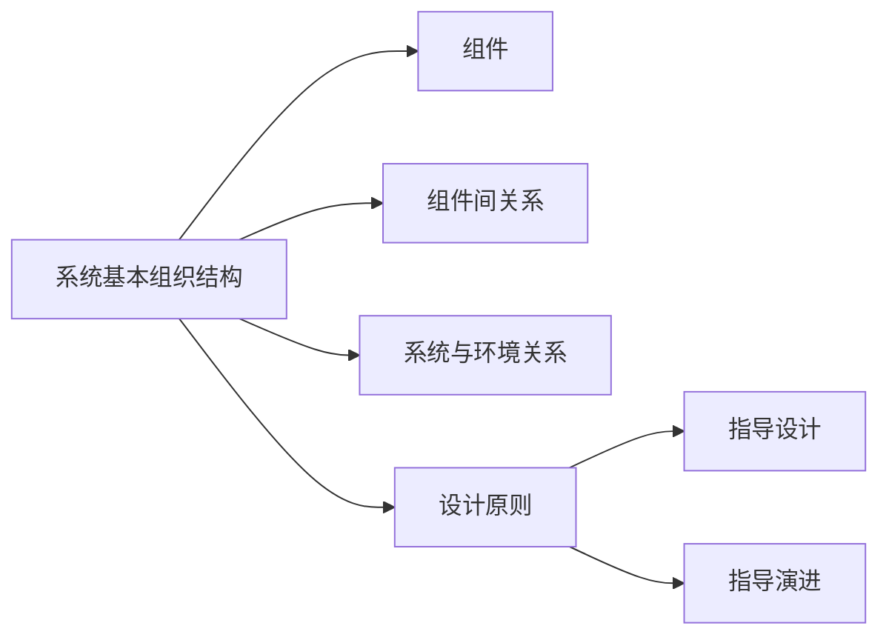
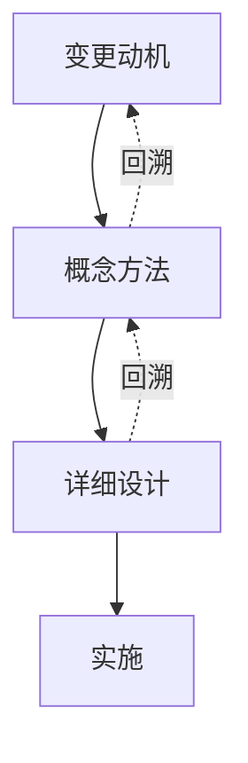
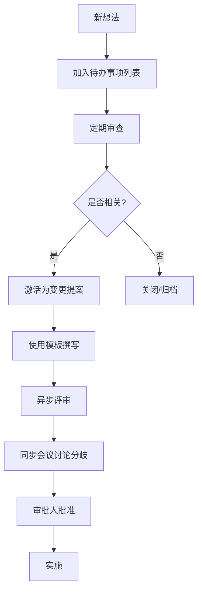

# 《Effective软件架构：更快地构建更好的软件》章节总结

## 书籍信息
- **书名**：Effective软件架构：更快地构建更好的软件 (Effective Software Architecture: Building Better Software Faster)
- **作者**：[美] 奥利弗·戈德曼（Oliver Goldman）
- **译者**：费良宏
- **出版社**：机械工业出版社
- **PDF 状态**：文本清晰，结构完整
- **OCR 状态**：高质量，无需大量修复

## 目录说明
- **目录识别情况**：完整识别，包含前言、10个主章节、结论及参考文献。
- **章节对应依据**：严格遵循原书目录结构，从第1章“软件架构”到第10章“产品团队”。
- **OCR 修复说明**：无明显缺失或错位，内容基于原文精准提炼。

## 全书核心主题

本书并非一本关于特定技术栈或架构风格（如微服务、DDD）的技术手册，而是一本关于**如何在一个组织中有效实践软件架构**的指南。作者指出，软件架构的核心在于管理复杂性，通过定义系统的基本组织结构、组件关系以及指导设计和演进的原则，来应对持续的变更。

全书围绕“变更”这一核心主题展开，提出了一套完整的架构实践流程：
1.  **理解背景**：明确系统概念、可靠性需求及产品家族关系。
2.  **管理变更**：通过动机、概念、细节三个阶段，利用变更提案和待办事项列表进行管理。
3.  **设计与决策**：采用分解与组合、循序渐进、并行处理等设计策略，并建立高效的决策机制。
4.  **沟通与协作**：强调书面文档、统一命名、词典维护以及与产品、工程、测试等团队的紧密合作。
5.  **团队建设**：探讨架构团队的组织结构（集中式、虚拟式、混合式）、领导力及文化培养。

作者主张，高效的软件架构实践能够帮助组织更快地构建更好的软件，其关键在于将架构视为一种可预测、可重复的变更管理流程，而非孤立的设计活动。

---

## 前言

### 核心论点
软件系统的复杂性日益增加，架构师不仅需要具备技术能力，更需要掌握如何在组织中有效地实践架构，包括管理变更、制定决策和团队协作。

### 关键概念/事件
- **架构的定义**：系统的基本组织结构，体现在组件、关系、环境及设计原则中。
- **复杂性的危害**：导致不可预测的行为、缺陷传播、理解困难，是软件的大敌。
- **架构师的困境**：许多资深架构师个人能力优秀，但缺乏团队层面的有效整合和流程规范。

### 逻辑推演/叙事脉络
作者回顾了自己的职业生涯，从早期对软件科学的粗浅理解，到后来领导大型复杂系统架构设计的经验。他指出，仅仅掌握算法或特定架构风格不足以构建成功的产品，真正的挑战在于如何将架构技能应用于庞大的产品开发流程中，特别是如何管理“变更”。本书旨在填补关于“人员、角色和团队”在架构实践中作用的空白。

### 经典金句/数据
> “复杂性是软件的大敌，而规范的架构实践则是对抗它的最佳武器。”
> “仅熟悉某种特定架构，也远不足以创建出应用该架构的系统。”

---

## 第1章：软件架构

### 核心论点
软件架构是系统的基本组织结构，包括组件、它们之间的关系、环境以及指导设计和演进的原则。架构不仅是当前状态的描述，更是未来演进的模板。

### 关键概念/事件
- **基本组织结构**：超越外部约束（如云平台、移动OS）的系统内部一致性结构。
- **组件与关系**：组件是构建块，关系是连接方式；关系的管理与组件本身同样重要。
- **架构原则**：指导决策的规则或信念，用于约束设计空间，提高一致性和决策速度。
- **架构演进**：架构必须随时间发展，原则需同时控制设计和设计的演进。

### 逻辑推演/叙事脉络
本章从IEEE标准定义出发，逐层解析架构的要素。首先区分了随机系统与有组织系统的区别，强调基本组织结构的重要性。接着讨论了组件如何体现架构假设（如本地磁盘访问 vs 云端缓存），以及组件间关系对系统复杂性的影响。最后引出“原则决定设计”的观点，指出架构师的核心工作是制定并贯彻原则，以管理系统随时间的演进。

### 流程图（如存在）

### 经典金句/数据
> “架构是一个系统的基本组织结构，具体体现在其各个组成部分、它们之间的关系和环境，以及其设计和演化所遵循的原则。”
> “原则的重要性不仅在于它规定了我们能做什么，还在于它约束了我们不能做什么。”

---

## 第2章：架构的背景

### 核心论点
架构设计不是在真空中进行的，必须考虑系统实现的概念、可靠性需求、产品家族关系、平台特性以及标准规范等背景因素。

### 关键概念/事件
- **概念（Concepts）**：系统所要表达的逻辑模型，需在所有利益相关者间达成共识。
- **具有重要架构意义的需求（ASR）**：必须在架构层面解决的需求，通常涉及非功能性需求或数据结构根本性变化。
- **产品家族**：包括多平台发布、产品线、产品套件，需管理核心与边缘、套件与产品的关系。
- **平台建设**：平台是吸引开发者和用户的生态系统，架构即平台的构建块。

### 逻辑推演/叙事脉络
本章首先强调“概念”的一致性对避免混乱的重要性。随后讨论可靠性作为ASR的具体体现，指出架构需为可靠性提供基础支持。接着深入探讨产品家族的各种形态（多平台、产品线、套件），提出了“核心-边缘”及“套件核心-套件边缘-产品核心-产品边缘”的四象限架构模型。最后讨论了标准规范的使用及其对架构的强化作用。

### 经典金句/数据
> “概念是产品差异化的因素之一。虽然更优秀的概念不一定总能胜出，但在某些情况下，它们能够提供无与伦比的优势。”
> “如果需求发生变化，需要进行多大程度的返工？如果答案是‘需要进行大量返工’，则该需求就是具有重要架构意义的需求。”

---

## 第3章：变更

### 核心论点
变更是软件开发的常态，架构的核心价值在于管理变更。通过理解变更的动机、类型和轨迹，秉持投资思维和简洁性原则，以增量方式推动架构演进。

### 关键概念/事件
- **变更三阶段**：动机（为什么变）、概念（变什么）、细节（怎么变）。
- **产品驱动 vs 技术驱动**：区分由市场需求和技术进步引发的变更，评估其轨迹。
- **简洁性**：系统越简洁，适应变更能力越强；复杂性是病毒，需持续对抗。
- **投资思维**：每次变更都是对系统的投资，需评估长期回报，避免短期战术性修复带来的长期债务。
- **增量交付**：将大变更拆解为小步骤，平衡长期愿景与当前工作。

### 逻辑推演/叙事脉络
本章定义了变更的三个阶段，并指出过程非线性。接着分类讨论了产品驱动和技术驱动的变更，引入“功能发展轨迹”模型（变更速率 vs 不确定性）。重点阐述了简洁性的重要性，指出复杂性如何降低质量和开发速度。随后提出“投资思维”，反对短视的战术性变更，倡导在战术与战略间取得平衡。最后介绍增量交付策略，通过维护愿景、待办事项和当前工作三类列表来管理演进。

### 流程图（如存在）

### 经典金句/数据
> “短期方法的问题在于，‘短期’仅体现在前期工作量上。解决方案的其他所有环节……都是长期的。”
> “一个系统想要为未知的未来做好最佳准备，最好的方法始终是追求简洁性。”

---

## 第4章：流程

### 核心论点
有效的架构实践依赖于结构化的变更管理流程，包括编写系统文档、确立愿景、撰写变更提案、维护待办事项列表以及评审机制。

### 关键概念/事件
- **系统文档**：准确描述当前状态是评估变更的前提，需持续维护以防失效。
- **架构愿景**：描述未来3-5年的理想架构状态，引导团队同步前进。
- **变更提案**：记录变更的动机、概念和细节，作为讨论和审批的核心载体。
- **架构待办事项列表**：跟踪过去、现在和未来的变更提案，作为外部记忆库。
- **备选方案**：在概念阶段探索多种方案，避免过早锁定单一路径。

### 逻辑推演/叙事脉络
本章首先强调文档的重要性，指出缺乏文档会导致重复工作和错误。接着介绍“奔向愿景”，说明愿景文档的作用和维护频率。核心部分介绍了“变更提案”机制，将其作为管理变更的容器，并区分了动机、概念和设计阶段。随后讨论了维护待办事项列表的重要性，以及如何通过考虑备选方案和学会说“不”来优化决策。最后简要提及紧急性与重要性的区分，以及文档更新作为变更闭环的最后一步

### 流程图（如存在）

### 经典金句/数据
> “如果我们不清楚现有的架构和设计，就无法对未来的变更做出理性且明智的决策。”
> “愿景的真正价值不在于其正确与否，也不在于它是否鼓舞人心，而在于它能够推动系统全体同步变化并朝着同一方向发展。”

---

## 第5章：设计

### 核心论点
设计是将问题转化为解决方案的过程，应通过分解、组合、循序渐进和并行处理等结构化方法进行，并在开放环境下工作以获取反馈。

### 关键概念/事件
- **加速设计**：通过架构原则施加约束，减少选项，加速决策。
- **分解与组合**：将大问题拆解为小问题，并确保各部分能有效重新组合。
- **循序渐进**：逐步交付中间结果，降低风险，获取反馈。
- **并行处理**：利用分解实现团队并行工作，注意接口协调成本。
- **康威定律**：系统设计受限于组织沟通结构，可利用此定律优化组织架构。
- **开放工作**：尽早分享设计草案，获取反馈，避免路径依赖。

### 逻辑推演/叙事脉络
本章首先指出设计需在约束下进行，架构原则通过减少选项来加速设计。接着详细阐述了设计的核心方法：分解（递归拆解问题）和组合（确保接口高效、标准化）。随后介绍了时间维度上的“循序渐进”和人员维度上的“并行处理”，并引用康威定律说明组织结构与设计的关系。强调在开放环境下工作，通过早期反馈改进设计。最后讨论了何时放弃设计方案以及设计完成后的冻结原则。

### 经典金句/数据
> “过多的灵活性反而会对系统造成负担……架构作为一种约束就显得尤为重要。”
> “康威定律：设计系统的组织，其设计成果往往受限于自身内部的沟通结构，最终产出的设计方案会成为组织沟通结构的映射。”

---

## 第6章：决策

### 核心论点
决策是架构实践的核心，应建立结构化的决策流程，通过一系列关键问题（如信息充分性、代价、确定性等）来提高决策效率和质量。

### 关键概念/事件
- **信息充分性**：追求“足够”的信息而非“所有”信息，避免分析瘫痪。
- **决策时效性**：意识到决策期间系统仍在变化，快速决策可减少干扰。
- **决策拆解**：将复杂决策拆解为独立的小决策，或合并相关决策。
- **持续成本**：评估“不这样做”的代价，关注维持现状的隐性成本。
- **犯错代价**：区分可逆与不可逆决策，在低代价决策上快速试错。
- **责任分配**：明确决策者、批准者、建议者等角色，适当授权。

### 逻辑推演/叙事脉络
本章通过一系列问题引导读者优化决策过程。首先讨论信息收集，强调停止收集的时机。接着指出决策期间的动态变化，强调速度。然后探讨如何拆解或合并决策以简化问题。重点分析了“不这样做的代价”和“技术债”的本质，指出持续成本常被忽视。随后讨论犯错的代价，建议在低风险领域快速决策。最后讨论决策的责任归属，提倡根据决策影响范围进行授权或上报，并确保决策符合架构愿景。

### 经典金句/数据
> “做决策时，重点是获取足够的信息，而不是贪大求全。”
> “技术债就好比是超出支付能力却依然用信用卡预支以享受的假期。”

---

## 第7章：实践

### 核心论点
高效的架构实践依赖于具体的工具和流程，包括架构待办事项列表、目录、模板、评审机制以及对速度和思考时间的管理。

### 关键概念/事件
- **架构待办事项列表**：记录所有变更提案，作为共享外部记忆库，定期审查。
- **目录**：软件组件和数据模型的元数据记录，补充系统文档。
- **模板**：标准化变更提案结构，提高写作和评审效率，充当检查清单。
- **评审流程**：结合异步（书面评论）和同步（会议）评审，明确审批人责任。
- **速度管理**：基于历史数据估算设计时间，设定预期，监控偏差。
- **思考时间**：在日历中预留专注时间，用于深度思考，避免被会议填满。

### 逻辑推演/叙事脉络
本章详细介绍了支撑架构流程的具体实践。首先重申待办事项列表的作用，强调其作为记忆辅助和任务追踪工具的价值。接着介绍软件和数据目录的建立。重点阐述了模板的使用，列出了优质模板应包含的部分（状态、摘要、详细设计、可靠性等）。随后详细描述了评审流程，推荐异步优先、会议辅助的模式，并明确了审批人的责任。最后讨论了如何通过历史数据管理速度，以及为何必须预留专门的思考时间。

### 流程图（如存在）

### 经典金句/数据
> “待办事项列表就像一个可靠的记忆助手，帮助团队暂时忘记那些尚未到执行阶段的想法。”
> “如果你发现自己的工作时间被各种会议挤占，那么请务必排定优先次序……留出时间专注于思考。”

---

## 第8章：沟通

### 核心论点
沟通的目标是建立共识，应高度重视书面文档，辅以有效的对话，并通过信息架构、统一命名和词典来降低认知负荷，确保信息可发现和理解。

### 关键概念/事件
- **心智模型**：沟通的目标是让听众构建与作者一致的心智模型，并通过“往返测试”验证。
- **书面优先**：书面文档具有异步、持久、可扩展优势，能促使思路清晰。
- **谈话补充**：对话用于建立默契、解决分歧和快速达成共识，但需书面记录结果。
- **信息架构**：对文档进行分类（已发布、进展中、参考文献、计划），便于检索。
- **命名规范**：名称应具有描述性、一致性，避免代号和缩略词，变更时需彻底替换。
- **词典**：维护术语定义，链接至文档，消除歧义，促进概念清晰化。

### 逻辑推演/叙事脉络
本章首先提出沟通的目标是共识，通过心智模型的一致性来衡量。强调书面文档作为沟通基石的重要性，因其能克服时空限制并促进思考。接着讨论谈话的价值，特别是在团队建设和解决复杂分歧时，但强调谈话结果必须书面化。随后详细介绍信息架构的构建，包括文档分类和状态标记。重点阐述命名原则，提倡描述性和结构化命名。最后介绍词典的作用，建议将其嵌入文档体系，通过链接实现术语的统一管理。

### 经典金句/数据
> “检验交流是否有效传达理解的最佳方式就是，观察对方能否运用他们自己的心智模型……来重新描述系统的概念模型。”
> “好的命名应该要具有描述性……‘实体格式转换服务’会是一个更好的名称，因为它明确告知了使用者这项服务的用途。”

---

## 第9章：架构团队

### 核心论点
架构团队的组织结构应根据规模和项目性质选择（集中式、虚拟式、混合式），并注重领导力、责任落实、人才培养、多样性及团队文化建设。

### 关键概念/事件
- **专业化**：根据项目规模和架构复杂度决定是否需要专职架构师。
- **组织结构**：
    - **集中式**：所有架构师向同一领导汇报，利于协调但可能脱离工程。
    - **虚拟式**：架构师分散在各团队，利于融入但沟通成本高。
    - **混合式**：结合两者，核心架构师集中，其他分散，平衡协调与落地。
- **责任**：架构师需对设计的实施和运营结果负责，避免“象牙塔”现象。
- **人才与文化**：建立职业发展路径，导师计划，倡导团队合作、谦逊、伙伴关系、客户中心和严谨的文化。
- **聚会与峰会**：通过线下聚会、研讨会和峰会增强团队凝聚力和跨团队交流。

### 逻辑推演/叙事脉络
本章首先讨论架构师是否应成为独立角色，指出取决于规模和项目创新性。接着详细比较三种团队组织结构及其优缺点，推荐混合模式以平衡集中协调与工程融入。强调架构师必须对实施结果负责，全程参与变更生命周期。随后探讨人才挖掘、培养和多样性的重要性。最后重点阐述团队文化的五个要素（合作、谦逊、伙伴、客户、严谨），并建议通过定期聚会和峰会来强化团队纽带和知识共享。

### 经典金句/数据
> “无论架构设计以何种形式呈现，忽视现实似乎对架构师们来说都是一种风险，以至于‘象牙塔架构师’这一绰号应运而生。”
> “团队则意味着共同承担责任，成员们协力合作，朝着目标努力，最终由集体收获成功或面对失败。”

---

## 第10章：产品团队

### 核心论点
架构师需与产品管理、用户体验、项目管理、工程、测试和运营等团队紧密协作，明确各方职责边界，通过概念共识和流程配合，共同推动产品成功。

### 关键概念/事件
- **与产品管理**：获取清晰的需求和能力轨迹，帮助产品经理理解实现成本和概念模型，避免过度规定实现细节。
- **与用户体验**：共同确立系统概念，确保UI准确传达内在逻辑，建立用户正确的心智模型。
- **与项目管理**：明确架构工作的范围和依赖关系，协助估算，采用“完成-完成”而非“完成-开始”的依赖模式。
- **与工程团队**：熟悉现有代码，邀请工程师早期参与设计评审，尊重工程实现的专业性，不强制编码但需保持可信度。
- **与测试团队**：提供高质量文档以辅助测试用例设计，考虑可测试性（日志、接口注入），利用测试结果改进设计。
- **与运营团队**：考虑部署和运营需求（版本兼容性、状态迁移），利用平台能力，共同应对生产环境问题。

### 逻辑推演/叙事脉络
本章逐一分析与各职能团队的合作模式。首先强调与产品经理的合作，重点在于需求的概念化分析和成本评估。接着讨论与UX团队在概念模型上的一致性。随后指出与项目管理团队在依赖管理和估算上的协作技巧。在与工程团队部分，强调架构师需了解代码现状，并尊重工程实现。与测试团队部分，提倡早期介入和设计可测试性。最后，与运营团队的合作聚焦于部署策略和版本兼容性，强调架构需适应渐进式部署的现实。

### 经典金句/数据
> “架构师是否必须编写代码？……编码能力和架构可信度之间也不应被视为存在必然的联系……编写代码的能力并不能取代团队协作的辛勤付出。”
> “新版本软件不仅是分阶段部署的，而且在许多系统中，旧版本软件也可以部署并覆盖在新版本的软件之上。”

---

## 结论

### 核心论点
软件架构实践虽复杂，但其核心方法是简单且务实的。通过建立愿景、恢复文档、优化变更流程和加强团队协作，任何组织都可以提升架构效能，从而更快地构建更好的软件。

### 关键概念/事件
- **愿景导向**：组织需明确架构实践的愿景。
- **架构恢复**：若缺乏文档，首要任务是重建系统当前状态的描述。
- **流程迭代**：从小处着手改进变更流程（如引入待办列表、模板），逐步优化。
- **全局视角**：架构师需整合各方需求，提供 cohesive 的整体视图。

### 逻辑推演/叙事脉络
作者总结全书，重申软件复杂性带来的挑战以及架构在管理复杂性中的关键作用。指出架构实践并非高深莫测，而是由文档、决策、沟通等平凡但重要的工作组成。最后给出行动建议：从制定愿景、恢复文档、引入待办事项列表和模板等小规模改进开始，逐步建立高效的架构实践体系，最终实现1+1>2的团队效能。

### 经典金句/数据
> “人人皆可掌握架构，这对每个人来说都是一个好消息。”
> “简而言之，组织如何实践软件架构对其开发和交付适用软件的能力具有越来越大的影响。”