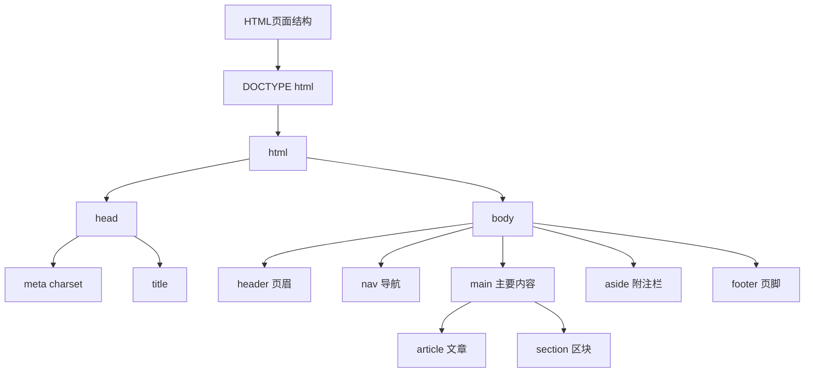
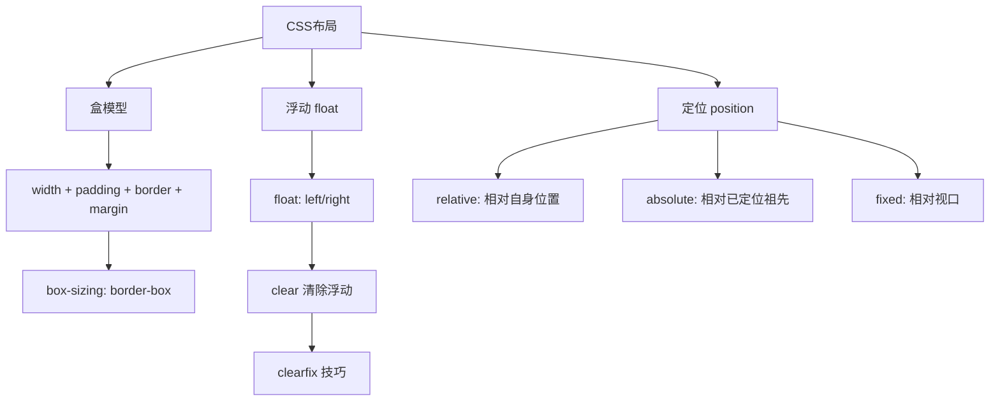
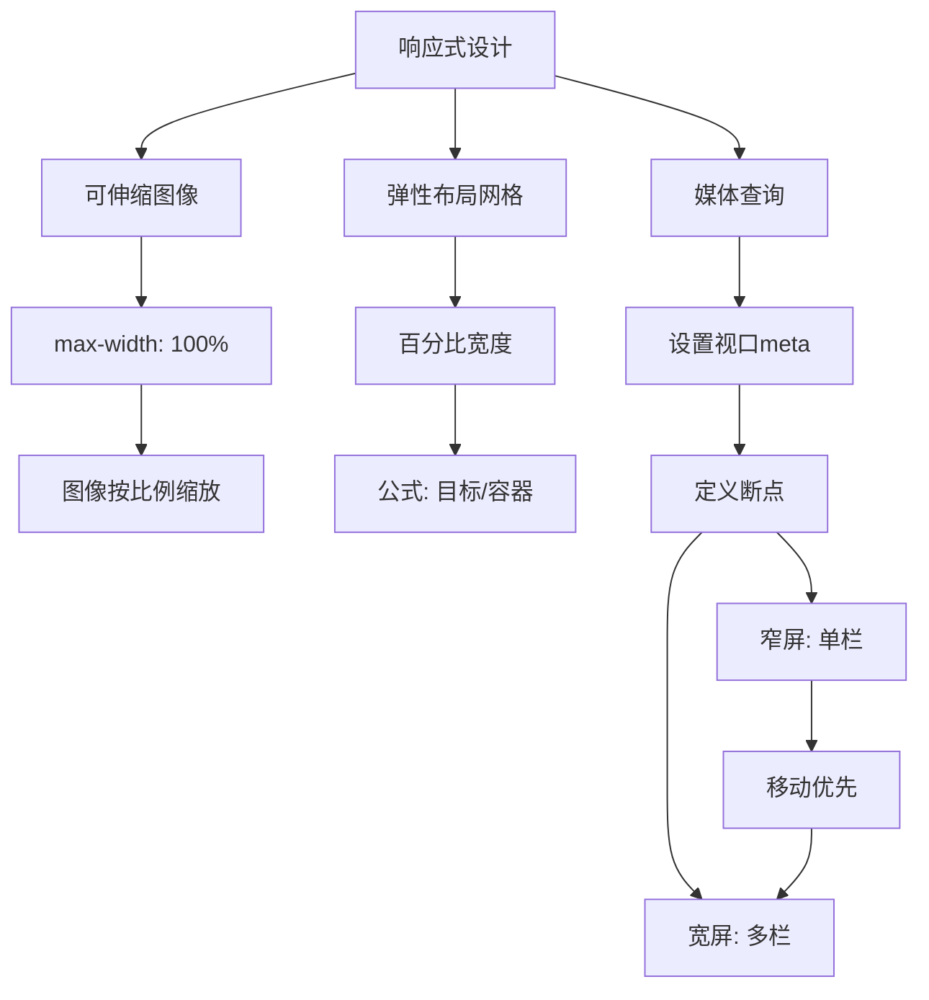

# 《HTML5与CSS3基础教程（第8版）》章节总结

## 书籍信息

- 书名：HTML5与CSS3基础教程（第8版）
- 作者：[美] Elizabeth Castro, Bruce Hyslop
- 译者：望以文
- PDF 状态：可识别
- OCR 状态：良好

## 全书核心主题

本书是 HTML 和 CSS 的经典入门教程，全面介绍创建网页的基础知识。内容包括 HTML 文档结构、语义元素、文本格式化、图像、链接、列表、表格、表单、CSS 选择器、文本样式、布局、响应式设计、Web 字体、CSS3 增强效果、视频音频、JavaScript 添加、测试调试、网站发布等。本书强调渐进增强和语义化 HTML 的最佳实践。

---

## 第1章：网页的构造块

### 核心论点

本章解决“网页由什么构成、HTML 的基本概念是什么”的问题。作者介绍了 HTML 文档的三个主要成分：文本内容、对其他文件的引用、标记，以及基本 HTML 页面的结构。

### 关键概念/事件

- **HTML 元素**：描述内容的标签，如 `<h1>`、`
`、`<a>`
- **属性（Attribute）**：元素的额外信息，如 `href`、`src`、`alt`
- **DOCTYPE**：`<!DOCTYPE html>` 声明页面为 HTML5
- **`<html>`、`<head>`、`<body>`**：HTML 文档的三个主要部分
- **`<title>`**：页面标题，显示在浏览器标签页
- **语义化 HTML**：用最恰当的 HTML 元素标记内容
- **块级元素 vs 行内元素**：块级从新行开始，行内与其他内容同行

### 经典金句/数据

> “HTML 描述的是网页内容的含义，即语义（semantics）。” (p.13)

> “HTML 之美，一部分在于人们能很容易掌握它的基础，构建一些页面，并在此基础上不断取得进步。” (p.15)

---

## 第2章：处理网页文件

### 核心论点

本章解决“如何创建、保存、组织网页文件”的问题。作者介绍了文本编辑器的选择、文件命名规范、保存为 .html 格式、组织文件夹结构、在浏览器中查看网页等方法。

### 关键概念/事件

- **文本编辑器**：记事本、TextWrangler、Sublime Text 等
- **文件命名**：全部小写，用短横线分隔单词，使用 .html 扩展名
- **UTF-8 编码**：推荐使用的字符编码
- **默认页面**：`index.html` 作为目录的默认页面
- **查看源代码**：浏览器中右键选择“查看源代码”

### 经典金句/数据

> “网页的文件名决定了访问者在访问你的页面时需要输入的文本，因此，文件名和文件夹名只用小写字母可以最大程度地避免访问者的输入错误。” (p.10)

---

## 第3章：基本HTML结构

### 核心论点

本章解决“如何用 HTML5 语义元素构建页面结构”的问题。作者介绍了 DOCTYPE、html、head、body、header、nav、main、article、section、aside、footer、div 等元素，以及 ARIA 地标角色的使用。

### 关键概念/事件

- **`<header>`**：页眉，可包含标志、导航、搜索框
- **`<nav>`**：主要导航链接组
- **`<main>`**：页面主要内容（每个页面只能有一个）
- **`<article>`**：独立的内容块（博客文章、新闻报道）
- **`<section>`**：具有相似主题的内容区块
- **`<aside>`**：附注栏、侧边栏、引述
- **`<footer>`**：页脚，包含版权、作者信息
- **ARIA 地标角色**：`role="banner"`、`role="navigation"`、`role="main"` 等，提升可访问性

### 流程图

### 经典金句/数据

> “header 不一定要像示例那样包含一个 nav 元素，不过在大多数情况下，如果 header 包含导航性链接，就可以用 nav。” (p.38)

> “aside 的例子还包括重要引述、侧栏、指向相关文章的一组链接、广告、Twitter 源、相关产品列表。” (p.46)

---

## 第4章：文本

### 核心论点

本章解决“如何用 HTML 元素标记各类文本内容”的问题。作者介绍了段落、标题、引用、时间、缩写、上标/下标、代码、预格式化文本等元素的用法。

### 关键概念/事件

- **`
`**：段落
- **`<small>`**：细则（免责声明、版权信息）
- **`<strong>` 和 `<em>`**：重要文本和强调文本
- **`<figure>` 和 `<figcaption>`**：图和图题
- **`<cite>`**：引用来源名称（作品标题）
- **`<blockquote>` 和 `<q>`**：块级引用和行内引用
- **`<time>`**：日期和时间
- **`<abbr>`**：缩写词
- **`<code>`**：代码
- **`<pre>`**：预格式化文本（保留空格和换行）
- **`<mark>`**：突出显示文本
- **` `**：换行
- **``**：无语义的行内容器

### 经典金句/数据

> “small 表示细则一类的旁注，通常包括免责声明、注意事项、法律限制、版权信息等。” (p.64)

> “永远不要使用 b 元素代替 strong，也不要使用 i 元素代替 em。尽管它们在浏览器中显示的样式是一样的，但它们的含义却很不一样。” (p.66)

---

## 第5章：图像

### 核心论点

本章解决“如何在网页中使用图像”的问题。作者介绍了 Web 图像的格式（JPEG、PNG、GIF）、透明度、Retina 显示屏准备、图像优化、`` 元素的使用、替代文本、图像尺寸等。

### 关键概念/事件

- **JPEG**：适合照片，有损压缩
- **PNG**：适合图标、标识，支持透明，无损压缩
- **GIF**：适合动画，支持透明但效果不如 PNG
- **alpha 透明**：PNG 支持部分透明
- **Retina 显示屏**：需要创建双倍尺寸图像，以一半尺寸显示
- **`alt` 属性**：图像无法显示时的替代文本
- **`width` 和 `height`**：指定图像尺寸
- **favicon**：网站图标，16x16 像素

### 经典金句/数据

> “大多数照片都应保存为 JPEG 格式，图标、标识等颜色较少的图像应保存为 PNG 格式。” (p.99)

> “为了让 Retina 显示屏及类似的显示屏上的图像看起来更锐利，应将图像的尺寸扩大为原先的两倍，但仅以一半的尺寸显示它们。” (p.110)

---

## 第6章：链接

### 核心论点

本章解决“如何创建各种类型的链接”的问题。作者介绍了指向其他网页的链接、锚链接、电子邮件链接、电话链接、块级链接等。

### 关键概念/事件

- **`<a>` 元素**：创建链接
- **`href` 属性**：指定目标 URL
- **相对 URL vs 绝对 URL**：站内用相对，站外用绝对
- **锚链接**：`<a href="#anchor-name">` 跳转到页面内特定位置
- **`id` 属性**：创建锚点
- **`mailto:`**：电子邮件链接
- **`tel:`**：电话号码链接（移动端）
- **`target="_blank"`**：在新窗口打开（不推荐）
- **块级链接**：HTML5 允许在 `<a>` 中包含块级元素

### 经典金句/数据

> “链接是万维网的命脉。没有它们，每个页面都只能独立存在，同其他所有页面完全地分开。” (p.113)

> “应该始终避免使用‘点击此处’作为标签。当用户快速扫过页面上的链接时，会发现‘点击此处’缺乏上下文。” (p.117)

---

## 第7章：CSS构造块

### 核心论点

本章解决“CSS 的基本语法和工作原理是什么”的问题。作者介绍了样式规则的构造、选择器、声明、继承、层叠（特殊性、顺序、重要性）、CSS 颜色值等。

### 关键概念/事件

- **样式规则**：`selector { property: value; }`
- **继承**：子元素继承父元素的某些属性（如 `font-family`、`color`）
- **层叠**：当多条规则冲突时，根据特殊性、顺序、重要性决定
- **特殊性**：ID 选择器 > 类选择器 > 元素选择器
- **顺序**：后出现的规则优先级更高
- **`!important`**：强制最高优先级（谨慎使用）
- **颜色表示**：颜色名、十六进制（`#rrggbb`）、RGB（`rgb()`）、RGBA（`rgba()`）、HSL、HSLA

### 经典金句/数据

> “继承可以简化样式表。设想你要为页面中的每个元素单独设置字体，多么恐怖！” (p.127)

> “你编写的样式会覆盖浏览器的默认样式。当两个或两个以上的样式发生冲突时，会应用特殊性高的样式声明。” (p.131)

---

## 第8章：操作样式表

### 核心论点

本章解决“如何创建和使用样式表”的问题。作者介绍了三种使用 CSS 的方式：外部样式表（推荐）、嵌入样式表（`<style>`）、内联样式（`style` 属性，不推荐）。

### 关键概念/事件

- **外部样式表**：独立 .css 文件，通过 `<link>` 引用
- **嵌入样式表**：在 `<style>` 元素中定义样式
- **内联样式**：在元素的 `style` 属性中定义样式（不推荐）
- **`<link rel="stylesheet" href="style.css">`**：引用外部样式表
- **`media` 属性**：指定样式表适用的输出设备（screen、print）
- **`@media` 规则**：在样式表中针对不同媒体类型定义样式

### 经典金句/数据

> “对外部样式表进行修改时，所有引用它的页面也会自动更新。这是外部样式表的神奇力量！” (p.141)

> “内联样式是最不可取的方法，因为它将内容（HTML）和表现（CSS）混在了一起，严重地违背了最佳实践。” (p.143)

---

## 第9章：定义选择器

### 核心论点

本章解决“如何精确选择要格式化的元素”的问题。作者介绍了各种 CSS 选择器的用法：元素选择器、类选择器、ID 选择器、上下文选择器、子元素选择器、相邻同胞选择器、伪类、属性选择器、选择器组合等。

### 关键概念/事件

- **元素选择器**：`p { }`
- **类选择器**：`.classname { }`（推荐，可复用）
- **ID 选择器**：`#idname { }`（页面唯一，不推荐用于样式）
- **上下文选择器**：`.article p`（选择 .article 内的所有 p）
- **子元素选择器**：`.article > p`（选择 .article 的直接子元素 p）
- **相邻同胞选择器**：`h2 + p`（选择紧接 h2 的 p）
- **伪类**：`:link`、`:visited`、`:hover`、`:active`、`:focus`
- **属性选择器**：`a[href="http://"]`、`a[href^="http"]`、`a[href$=".pdf"]`
- **组合选择器**：`h1, h2, h3 { }`

### 经典金句/数据

> “编写 CSS 的一个重要目标就是让选择器尽可能的简单，仅保持必要的特殊性。” (p.152)

> “推荐使用 class 选择器而不是 ID 选择器。class 可以在多个元素上复用。” (p.153)

---

## 第10章：为文本添加样式

### 核心论点

本章解决“如何用 CSS 控制文本样式”的问题。作者介绍了字体家族、替代字体、斜体、粗体、字体大小、行高、颜色、背景、间距、缩进、对齐、大小写转换、小型大写字母、文本装饰、空白处理等属性。

### 关键概念/事件

- **`font-family`**：指定字体，使用字体栈提供后备
- **`font-size`**：可使用像素（px）、em、百分比、rem
- **`em` 单位**：相对于当前元素的字体大小
- **`rem` 单位**：相对于根元素（html）的字体大小
- **`line-height`**：行高，使用无单位数字（与字体大小相乘）
- **`color`**：文本颜色
- **`background-color`**：背景颜色
- **`text-align`**：左对齐、右对齐、居中、两端对齐
- **`text-transform`**：大写、小写、首字母大写
- **`text-decoration`**：下划线、删除线
- **`white-space`**：控制空格处理（`pre`、`nowrap`）

### 经典金句/数据

> “以像素为单位设置字体大小，使用 Internet Explorer 的访问者将无法使用浏览器的文本大小选项对文本进行放大或缩小。这是要用 em 或百分比控制字体大小的原因之一。” (p.183)

> “默认情况下，浏览器会在标题和段落之间，以及不同的段落之间添加垂直间距。使用 CSS 可以控制所有内容元素的格式。” (p.63)

---

## 第11章：用CSS进行布局

### 核心论点

本章解决“如何用 CSS 实现网页布局”的问题。作者介绍了盒模型、`display` 属性、`width`/`height`、内边距（padding）、边框（border）、外边距（margin）、浮动（float）、清除浮动（clear）、定位（position）、`z-index`、溢出（overflow）等布局技术。

### 关键概念/事件

- **盒模型**：内容 + 内边距 + 边框 + 外边距
- **`box-sizing: border-box`**：让 width 包含内边距和边框
- **`display`**：`block`、`inline`、`inline-block`、`none`
- **`float`**：`left`、`right`，用于创建多栏布局
- **`clear`**：`left`、`right`、`both`，清除浮动
- **`clearfix`**：让父容器包含浮动元素的技巧
- **`position`**：`static`（默认）、`relative`、`absolute`、`fixed`
- **`z-index`**：控制重叠元素的堆叠顺序
- **`overflow`**：`visible`、`hidden`、`scroll`、`auto`

### 流程图

### 经典金句/数据

> “每个元素都有盒子，这决定了该元素所占的空间及其外观。” (p.210)

> “使用 clearfix 方法可以让浮动元素的父容器在高度上包含浮动元素。” (p.228)

---

## 第12章：构建响应式网站

### 核心论点

本章解决“如何构建适应不同设备的响应式网站”的问题。作者详细介绍了响应式设计的三大支柱：可伸缩图像（`max-width: 100%`）、弹性布局网格（百分比宽度）、媒体查询（根据屏幕宽度应用不同样式）。

### 关键概念/事件

- **可伸缩图像**：`img { max-width: 100%; }`，省略 `width`/`height` 属性
- **弹性布局网格**：使用百分比宽度，公式：目标宽度 / 容器宽度 = 百分比值
- **视口 meta 标签**：`<meta name="viewport" content="width=device-width, initial-scale=1">`
- **媒体查询**：`@media (min-width: 768px) { ... }`
- **移动优先**：先写移动版样式，再用媒体查询为更大屏幕增强
- **断点（Breakpoint）**：内容需要调整的宽度临界点
- **Respond.js**：让旧版 IE 支持媒体查询的 polyfill

### 流程图

### 经典金句/数据

> “响应式 Web 设计（responsive Web design）是 Ethan Marcotte 创建的术语，他的方法植根于灵活的图像、灵活的基于网格的布局和媒体查询。” (p.238)

> “移动优先方法：首先为所有的设备提供基准样式，然后使用媒体查询逐渐为更大的屏幕定义样式。” (p.251)

---

## 第13章：使用Web字体

### 核心论点

本章解决“如何在网页中使用自定义字体”的问题。作者介绍了 `@font-face` 规则、字体格式（WOFF、EOT、TTF、SVG）、Font Squirrel 字体生成器、Google Fonts 服务，以及如何为 Web 字体应用斜体和粗体。

### 关键概念/事件

- **`@font-face`**：CSS 规则，用于注册 Web 字体
- **WOFF**：Web 开放字体格式，推荐使用
- **EOT**：嵌入式 OpenType，仅 IE 支持
- **TTF/OTF**：TrueType/OpenType，桌面字体格式
- **Font Squirrel**：免费 Web 字体下载和生成器
- **Google Fonts**：免费的 Web 字体服务，简单易用
- **子集（Subsetting）**：只包含所需字符，减小文件大小
- **每种样式/粗细需要单独的字体文件**

### 经典金句/数据

> “使用 Web 字体，尤其是使用多种 Web 字体的一个潜在风险是它们可能会增加页面的‘重量’。我谈论的不是炸薯条和甜甜圈，我谈论的是千字节和兆字节。” (p.261)

> “通常，一个页面中不应使用两个（最多三个）以上的 Web 字体。” (p.265)

---

## 第14章：使用CSS3进行增强

### 核心论点

本章解决“如何使用 CSS3 增强网页视觉效果”的问题。作者介绍了厂商前缀、圆角（`border-radius`）、文本阴影（`text-shadow`）、盒子阴影（`box-shadow`）、多重背景、渐变（`linear-gradient`、`radial-gradient`）、不透明度（`opacity`）、生成内容（`:before`/`:after`）、sprite 拼合图像等。

### 关键概念/事件

- **厂商前缀**：`-webkit-`、`-moz-`、`-ms-`、`-o-`
- **`border-radius`**：圆角，可单独设置每个角
- **`text-shadow`**：`x-offset y-offset blur-radius color`
- **`box-shadow`**：支持 `inset` 内阴影和 `spread` 扩展半径
- **多重背景**：用逗号分隔多个背景图像
- **线性渐变**：`linear-gradient(direction, color-stop1, color-stop2)`
- **径向渐变**：`radial-gradient(shape size at position, color-stop1, color-stop2)`
- **`opacity`**：不透明度，0（透明）到 1（不透明）
- **`:before` 和 `:after`**：生成内容伪元素
- **sprite**：将多个图像拼合成一个，减少 HTTP 请求

### 经典金句/数据

> “这些 CSS3 属性中，border-radius 在 IE9+ 支持，box-shadow 在 IE9+ 支持，text-shadow 在 IE10+ 支持。” (p.278)

> “使用多重背景可以减少对某些元素的需求，这类元素存在只是为了用 CSS 添加额外的背景图像。” (p.288)

---

## 第15章：列表

### 核心论点

本章解决“如何用 HTML 创建各种列表”的问题。作者介绍了有序列表（`<ol>`）、无序列表（`<ul>`）、描述列表（`<dl>`），以及列表样式的 CSS 控制（`list-style-type`、`list-style-position`、`list-style-image`、嵌套列表）。

### 关键概念/事件

- **`<ol>`**：有序列表，使用数字编号
- **`<ul>`**：无序列表，使用符号标记
- **`<li>`**：列表项
- **`<dl>`**：描述列表（名-值对）
- **`<dt>`**：术语/名称
- **`<dd>`**：描述/值
- **`list-style-type`**：标记类型（disc、circle、square、decimal、lower-roman 等）
- **`list-style-position`**：标记位置（inside、outside）
- **自定义标记**：使用背景图像替代默认标记

### 经典金句/数据

> “如果列表项的顺序对于列表来说非常关键，那么这种情况有序列表就是恰当的选择。” (p.301)

> “在万维网上，无序列表是对大多数类型的导航进行标记的事实标准。” (p.301)

---

## 第16章：表单

### 核心论点

本章解决“如何创建 Web 表单”的问题。作者介绍了 HTML5 表单的新特性（`placeholder`、`required`、`pattern`、`autofocus`）、新输入类型（`email`、`url`、`tel`、`search`、`number`、`date` 等）、文本框、密码框、单选按钮、复选框、文本区域、选择框、文件上传、提交按钮等。

### 关键概念/事件

- **`<form>`**：表单容器，`action` 和 `method` 属性
- **`<fieldset>` 和 `<legend>`**：分组表单元素
- **`<label>`**：标签，`for` 属性关联控件
- **`<input type="text">`**：文本框
- **`<input type="password">`**：密码框
- **`<input type="email">`**：电子邮件框，内置验证
- **`<input type="url">`**：URL 框，内置验证
- **`<input type="tel">`**：电话框，移动端调出数字键盘
- **`<input type="search">`**：搜索框
- **`<input type="number">`**：数字框，支持 `min`/`max`/`step`
- **`<input type="range">`**：滑动条
- **`<input type="radio">`**：单选按钮，同 `name` 为一组
- **`<input type="checkbox">`**：复选框
- **`<textarea>`**：多行文本区域
- **`<select>` 和 `<option>`**：下拉选择框
- **`<input type="file">`**：文件上传
- **`<input type="submit">`**：提交按钮
- **`required` 属性**：必填字段
- **`pattern` 属性**：正则表达式验证

### 经典金句/数据

> “表单有两个基本组成部分：访问者在页面上可以看见并填写的控件、标签和按钮的集合；以及用于获取信息并将其转化为可以读取或计算的格式的处理脚本。” (p.318)

> “如果不知道使用 GET 还是 POST，就使用 POST，这样数据不会暴露在 URL 中。” (p.323)

---

## 第17章：视频、音频和其他多媒体

### 核心论点

本章解决“如何在网页中添加视频和音频”的问题。作者介绍了 `<video>` 和 `<audio>` 元素、视频/音频文件格式、控件、自动播放、循环、海报图像、多种来源（`<source>`）、备用 Flash 播放器、可访问性等。

### 关键概念/事件

- **`<video>` 元素**：嵌入视频，支持 `controls`、`autoplay`、`loop`、`poster`、`preload` 属性
- **`<audio>` 元素**：嵌入音频，类似 `<video>`
- **`<source>` 元素**：指定多种格式的媒体文件
- **视频格式**：MP4（H.264）、WebM、Ogg Theora
- **音频格式**：MP3、Ogg Vorbis、WAV
- **MIME 类型**：需在服务器正确配置
- **MediaElement.js**：提供统一播放器外观和 Flash 后备的 JavaScript 库
- **WebVTT**：视频字幕格式

### 经典金句/数据

> “HTML5 出现之前，为网页添加多媒体的唯一办法就是使用第三方的插件。HTML5 通过引入原生的多媒体改变了这一状况。” (p.349)

> “开发者至少需要为视频提供两种格式（MP4 和 WebM），才能确保获得所有兼容 HTML5 的浏览器的支持。” (p.351)

---

## 第18章：表格

### 核心论点

本章解决“如何用 HTML 创建表格”的问题。作者介绍了表格的基本结构（`<table>`、`<tr>`、`<td>`、`<th>`）、表格头部/主体/尾部（`<thead>`、`<tbody>`、`<tfoot>`）、单元格合并（`colspan`、`rowspan`）。

### 关键概念/事件

- **`<table>`**：表格容器
- **`<caption>`**：表格标题
- **`<thead>`**：表格头部（列标题）
- **`<tbody>`**：表格主体（数据行）
- **`<tfoot>`**：表格尾部（汇总行）
- **`<tr>`**：表格行
- **`<th>`**：标题单元格，`scope` 属性指定是列标题还是行标题
- **`<td>`**：数据单元格
- **`colspan`**：单元格跨越多列
- **`rowspan`**：单元格跨越多行
- **`border-collapse: collapse`**：合并单元格边框

### 经典金句/数据

> “在日常生活中，我们对表格式数据已经很熟悉了。这种数据有多种形式，如财务数据、调查数据、事件日历、公交车时刻表、电视节目表等。” (p.368)

---

## 第19章：添加JavaScript

### 核心论点

本章解决“如何在网页中添加 JavaScript”的问题。作者介绍了加载外部脚本、添加嵌入脚本、JavaScript 事件处理等基础知识。

### 关键概念/事件

- **``**：引用外部 JavaScript 文件
- **嵌入脚本**：``
- **脚本放置位置**：推荐放在 `</body>` 结束标签前，避免阻塞页面渲染
- **压缩脚本**：使用 `.min.js` 版本减少文件大小
- **事件处理程序**：`onclick`、`onload`、`onmouseover`、`onsubmit` 等

### 经典金句/数据

> “HTML 定义网页的内容，CSS 定义网页的表现，JavaScript 则定义特殊的行为。” (p.373)

> “在大多数情况下，JavaScript 的特性都是用于增强访问者体验的——它们在由 HTML 和 CSS 构建的核心体验的基础上进行增强。” (p.373)

---

## 第20章：测试和调试网页

### 核心论点

本章解决“如何测试和调试网页”的问题。作者介绍了 HTML/CSS 验证器、多浏览器测试、调试技巧、常见错误排查等。

### 关键概念/事件

- **HTML 验证器**：http://validator.w3.org、http://html5.validator.nu
- **CSS 验证器**：http://jigsaw.w3.org/css-validator
- **浏览器开发工具**：Chrome DevTools、Firebug、IE F12 工具
- **测试浏览器**：Chrome、Firefox、IE8+、Safari
- **移动测试**：iOS Simulator、BrowserStack、Sauce Labs
- **常见错误**：拼写错误、路径错误、大小写不匹配、忘记上传文件等

### 经典金句/数据

> “一个 HTML 错误可能导致多个验证器报错结果。因此，应该按照从上往下的顺序，一次修复少量错误后就立刻再次验证。” (p.382)

> “IE8 的市场份额会越来越少，最终可能会从你的验证清单中消失。” (p.384)

---

## 第21章：发布网站

### 核心论点

本章解决“如何将网站发布到万维网”的问题。作者介绍了获取域名、寻找 Web 主机、将文件传送到服务器的步骤。

### 关键概念/事件

- **域名注册商**：Namecheap、Hover
- **Web 主机提供商**：考虑磁盘空间、带宽、技术支持
- **FTP 客户端**：FileZilla、CyberDuck
- **域名服务器（DNS）设置**：将域名指向 Web 主机
- **默认页面**：`index.html` 作为目录默认页面

### 经典金句/数据

> “在发布页面之前和之后，要确保对页面进行彻底的测试。” (p.392)

> “当你修改域名服务器设置时，通常需要 24 至 48 小时（最多 72 小时）的时间，相应的更新才能传播到整个万维网。” (p.394)

# 