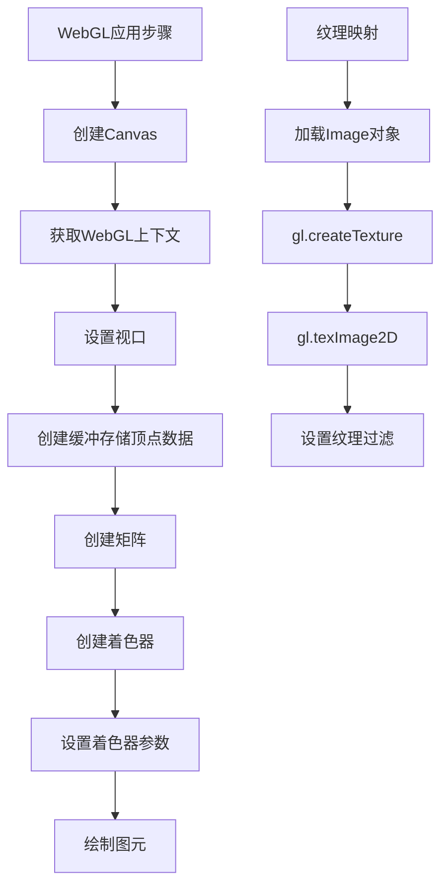
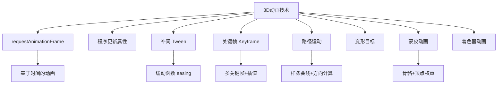
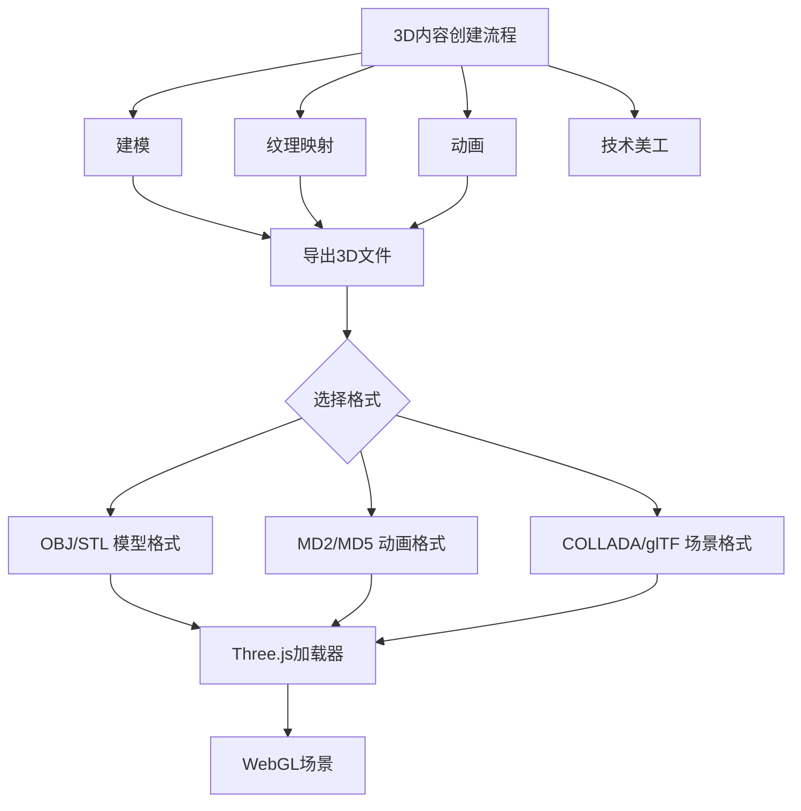
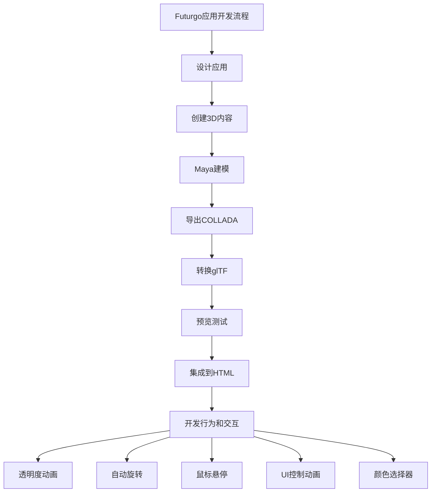
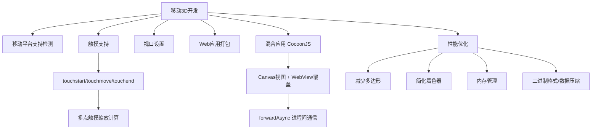

# 《HTML5与WebGL编程》章节总结

## 书籍信息

- 书名：HTML5与WebGL编程
- 作者：[美] Tony Parisi
- 译者：潘征
- PDF 状态：可识别
- OCR 状态：良好（部分注释标记需注意）

## 全书核心主题

本书全面讲解使用 HTML5 和 WebGL 开发 3D 应用的技术。全书分两部分：第一部分介绍基础知识，包括 WebGL API、Three.js 框架、3D 图形概念、动画技术、CSS3 和 Canvas 的 3D 应用；第二部分介绍应用开发技术，包括 3D 内容制作流程、3D 引擎和框架、简单 3D 应用开发、3D 环境开发、移动 3D 应用开发。

---

## 第1章：绪论

### 核心论点

本章解决“HTML5 如何成为新型视觉媒介、3D 图形的基本概念是什么”的问题。作者介绍了 HTML5 图形技术（WebGL、CSS3 3D、Canvas 2D）、浏览器平台发展、3D 图形核心概念（坐标系、网格、材质、纹理、光源、变换、矩阵、相机、透视、着色器）。

### 关键概念/事件

- **100000 Stars**：Google 创建的 3D 银河系飞行模拟程序，展示 WebGL 能力
- **WebGL**：硬件加速 3D 渲染 API，基于 OpenGL ES
- **CSS3 3D 变换**：为 HTML 元素添加 3D 效果
- **Canvas 2D**：2D 绘图 API，可用于软件渲染 3D
- **3D 坐标系**：x（水平）、y（垂直）、z（深度）
- **网格（Mesh）**：由多边形（三角形/四边形）和顶点构成
- **纹理映射**：用位图定义物体表面外观
- **变换矩阵**：4x4 矩阵，表示平移、旋转、缩放
- **相机、视口、投影**：定义观察点和 3D 到 2D 的映射
- **着色器（Shader）**：GLSL 编写的程序，控制顶点和像素渲染

### 经典金句/数据

> “3D 图形通常被渲染在 2D 平面的显示设备上。这并不是说 3D 图形不能被展示为可以用立体眼镜观看的立体图像——只是说，这不是必需的。” (p.7)

> “着色器为程序员的双手注入了神奇的力量：借助着色器，程序员可以精准地控制每一个像素和每一次图像渲染。” (p.11)

---

## 第2章：WebGL：实时3D渲染

### 核心论点

本章解决“WebGL 的底层 API 如何使用”的问题。作者介绍了 WebGL 绘图上下文、视口、缓冲（类型化数组）、矩阵、着色器（顶点/片段）、绘制图元、创建 3D 几何体、添加动画、纹理映射。

### 关键概念/事件

- **WebGL 上下文**：`canvas.getContext("webgl")` 或 `"experimental-webgl"`
- **视口（Viewport）**：`gl.viewport(0, 0, canvas.width, canvas.height)`
- **缓冲（Buffer）**：存储顶点数据，使用 `Float32Array` 类型化数组
- **模型-视图矩阵**：定义物体位置和相机位置
- **投影矩阵**：3D 到 2D 的映射
- **顶点着色器**：处理顶点位置
- **片段着色器**：处理像素颜色
- **图元（Primitive）**：三角形、点、线
- **纹理映射**：使用 `Image` 对象作为纹理源

### 流程图

### 经典金句/数据

> “WebGL 非常精巧，这使得 WebGL 应用的开发者们需要做更多的工作。3D 场景本身不具备 DOM 结构，也没有原生支持的用于加载几何图形和动画的 3D 文件格式。” (p.15)

---

## 第3章：Three.js——一款JavaScript3D引擎

### 核心论点

本章解决“如何使用 Three.js 简化 WebGL 开发”的问题。作者介绍了 Three.js 的代表性项目、工程结构、基本用法（创建渲染器、场景、相机、网格、材质、光照、运行循环）。

### 关键概念/事件

- **Three.js**：最流行的 WebGL 开发库，由 Ricardo Cabello（Mr.doob）创建
- **代表性项目**：RO.ME“3 Dreams of Black”、汽车配置器、小型武器交易可视化、HexGL 游戏
- **THREE.WebGLRenderer**：WebGL 渲染器
- **THREE.Scene**：场景根节点
- **THREE.PerspectiveCamera**：透视相机
- **THREE.Mesh**：网格 = 几何体 + 材质
- **THREE.CubeGeometry**：立方体几何体
- **THREE.MeshBasicMaterial**：基础材质（无光照）
- **THREE.MeshPhongMaterial**：Phong 材质（有光照、镜面反射）
- **requestAnimationFrame**：动画循环

### 经典金句/数据

> “Three.js 已经成为 WebGL 开发的事实选择。你在互联网上能看到的大多数 WebGL 优秀内容都是使用 Three.js 来构建的。” (p.35)

> “有了 Three.js，我们可以创建出产品级的可视化效果。” (p.36)

---

## 第4章：Three.js中的图形和渲染

### 核心论点

本章解决“Three.js 如何实现图形绘制和渲染”的问题。作者介绍了几何图形和网格（预置形状、路径挤出、BufferGeometry）、场景图和变换层级、材质（Basic、Phong、Lambert）、多重纹理（凹凸贴图、法向量贴图、环境贴图）、光源（定向光、点光源、聚光灯、环境光）、阴影、着色器（ShaderMaterial）。

### 关键概念/事件

- **预置几何体**：CubeGeometry、SphereGeometry、CylinderGeometry
- **路径和挤出**：Shape、ExtrudeGeometry
- **BufferGeometry**：优化版几何体，使用类型化数组
- **场景图（Scene Graph）**：父子层级结构，变换可继承
- **变换属性**：position、rotation（欧拉角）、scale
- **材质类型**：MeshBasicMaterial（无光照）、MeshPhongMaterial（有光照）、MeshLambertMaterial（漫反射）
- **凹凸贴图（Bump Map）**：用灰度图模拟表面凹凸
- **法向量贴图（Normal Map）**：用 RGB 图编码法向量
- **环境贴图（Environment Map）**：模拟反射，使用立方体纹理
- **光源类型**：DirectionalLight、PointLight、SpotLight、AmbientLight
- **阴影**：需开启 `shadowMapEnabled`，设置 `castShadow`/`receiveShadow`
- **ShaderMaterial**：自定义 GLSL 着色器

### 经典金句/数据

> “场景图在表示具有层级结构的复杂物体时特别有用。变换层级中，子物体继承了父层级的变换信息。” (p.57)

> “材质定义了 3D 网格的外观属性，包括颜色、透明度、发光以及纹理。” (p.61)

---

## 第5章：3D动画

### 核心论点

本章解决“如何为 3D 场景添加动画”的问题。作者介绍了 `requestAnimationFrame()` 驱动动画、基于帧和基于时间的动画、程序更新属性、补间（Tween.js）、关键帧动画（Keyframe.js）、路径运动、变形目标、蒙皮动画、着色器动画。

### 关键概念/事件

- **`requestAnimationFrame()`**：与浏览器刷新率同步的动画循环
- **基于帧 vs 基于时间**：基于时间确保不同帧率下速度一致
- **补间（Tween）**：属性值平滑过渡，使用缓动函数
- **Tween.js**：流行的补间库
- **关键帧动画**：多个关键帧和插值，可控制不同间隔
- **Keyframe.js**：作者编写的简单关键帧库
- **样条曲线**：Catmull-Rom 样条，用于路径动画
- **变形目标（Morph Target）**：基于顶点插值的形状动画
- **蒙皮动画（Skinning）**：骨骼驱动网格变形，适合角色动画
- **着色器动画**：在 GLSL 中实现 GPU 加速的顶点/像素动画

### 流程图

### 经典金句/数据

> “动画意味着随着时间改变屏幕上的图像。有了动画以后，静态的 3D 场景就有了生命。” (p.81)

> “requestAnimationFrame() 可以说是 HTML5 引进的一个最重要的特性。” (p.84)

---

## 第6章：CSS3：高级页面效果

### 核心论点

本章解决“如何使用 CSS3 创建 3D 页面效果”的问题。作者介绍了 CSS 3D 变换（`transform`、`perspective`、`transform-style`、`backface-visibility`）、CSS 过渡（`transition`）、CSS 动画（`@keyframes`）、以及挑战 CSS 极限的 3D 物体和环境渲染。

### 关键概念/事件

- **CSS 3D 变换**：`translate3d`、`rotateY`、`scale3d`
- **`perspective`**：透视深度，`perspective-origin` 控制消失点
- **`transform-style: preserve-3d`**：让子元素继承 3D 变换
- **`backface-visibility`**：控制背面是否可见
- **CSS 过渡**：`transition: property duration timing-function delay`
- **CSS 动画**：`@keyframes` 定义关键帧，`animation` 属性应用
- **3D 物体**：用多个平面元素组合成立方体等
- **CSS 自定义滤镜**：使用 GLSL 着色器（实验性）
- **Three.js CSS 渲染器**：用 CSS 3D 渲染 Three.js 场景

### 经典金句/数据

> “使用 CSS3，单个元素或整个页面都可以通过动画、图片滤镜，以及 2D 或 3D 变换变得生动起来。” (p.110)

> “CSS3 的开发比 WebGL 更加简单；然而，开发者只能访问浏览器内置的特性。3D CSS 以牺牲强大和灵活性来换取了简单易用。” (p.110)

---

## 第7章：Canvas：通用2D绘图

### 核心论点

本章解决“如何使用 Canvas 2D API 进行绘图以及渲染 3D”的问题。作者介绍了 Canvas 2D 上下文、绘图 API（形状、路径、图像、文本、填充、变换）、基于 Canvas 的 3D 渲染库（K3D、Three.js Canvas 渲染器），以及软件渲染 3D 的性能和效果权衡。

### 关键概念/事件

- **Canvas 2D 上下文**：`canvas.getContext("2d")`
- **绘图 API**：`fillRect`、`stroke`、`drawImage`、`fillText`、`beginPath`、`lineTo`、`bezierCurveTo`
- **状态管理**：`save()` 和 `restore()` 保存/恢复绘图状态
- **软件渲染 3D**：需要手动实现变换、着色、三角形排序、深度排序
- **K3D**：基于 Canvas 的 3D 库
- **Three.js Canvas 渲染器**：作为 WebGL 不可用时的降级方案
- **性能问题**：三角形排序 O(N log N)，无深度缓存，纹理过滤差

### 经典金句/数据

> “在某些场景下，我们需要考虑使用 Canvas 2D 而不是 WebGL。一种场景是，尽管 WebGL 很普及，但 iOS 的 Safari 中并不支持。” (p.137)

> “使用 Three.js，我们可以在有条件使用 WebGL 的时候使用 WebGL，在没条件的时候使用 Canvas，而这不需要修改太多代码。” (p.148)

---

## 第8章：3D内容制作流程

### 核心论点

本章解决“如何创建和导入 3D 内容”的问题。作者介绍了 3D 内容创建流程（建模、纹理映射、动画、技术美工）、3D 建模和动画工具（Autodesk Maya/3ds Max、Blender、SketchUp、Poser）、基于浏览器的集成环境（Verold、Sketchfab、SculptGL）、3D 文件格式（OBJ、STL、MD2/MD5、BVH、COLLADA、glTF、FBX）、以及使用 Three.js 加载各种格式的方法。

### 关键概念/事件

- **建模**：创建 3D 多边形网格
- **纹理映射（UV 映射）**：将 2D 图像贴到 3D 表面
- **技术美工**：编写着色器、创建骨骼、格式转换
- **Autodesk Maya/3ds Max**：专业 3D 工具
- **Blender**：免费开源的 3D 工具
- **COLLADA**：基于 XML 的全功能场景格式
- **glTF**：Khronos 为 WebGL 开发的新格式，基于 JSON，支持二进制数据
- **Three.js JSON 格式**：Three.js 原生格式
- **Three.js 加载器**：JSONLoader、BinaryLoader、ColladaLoader、glTFLoader

### 流程图

### 经典金句/数据

> “COLLADA 并不像 X3D 那样有明确的技术目标，而是试图完整保存从 3D 软件中可以输出的所有信息，使得它可以被后续的软件使用。” (p.173)

> “glTF 是专门为 WebGL 设计的格式，它使用 JSON 表示场景结构，使用二进制文件存储几何数据，加载速度更快。” (p.175)

---

## 第9章：3D引擎和框架

### 核心论点

本章解决“有哪些 WebGL 框架、框架应具备什么特性”的问题。作者介绍了框架的概念（抽象层次、默认行为、扩展性、反向控制流）、WebGL 框架需求、现有的 WebGL 框架（游戏引擎：playcanvas、Turbulenz、Goo Engine；展示框架：tQuery、Voodoo.js、PhiloGL），以及作者开发的 Vizi 框架（基于组件的架构）。

### 关键概念/事件

- **框架 vs 库**：框架提供反向控制流（Hollywood Principle）
- **WebGL 框架需求**：环境设置、能力检测、场景创建、运行循环、图形渲染、对象模型、交互、导航、行为、资源加载、内存管理
- **游戏引擎**：playcanvas、Turbulenz、Goo Engine、Babylon.js、KickJS
- **展示框架**：tQuery（jQuery 风格 API）、Voodoo.js、PhiloGL
- **Vizi**：基于组件的 3D 框架，作者开发，用于本书示例
- **Vizi 架构**：Application、Object、Component、Behavior、Picker

### 经典金句/数据

> “我热爱框架……只要它是我的。” (p.191)

> “Vizi 使用基于组件的对象模型，类似于 Unity 游戏引擎。对象是容器，组件提供视觉、行为、交互等功能。” (p.200)

---

## 第10章：开发一个简单的3D应用

### 核心论点

本章通过 Futurgo 概念车示例，展示开发一个简单 3D 应用的完整流程：设计应用、创建 3D 内容（Maya 导出 COLLADA → glTF）、预览测试（Vizi 预览工具）、集成到应用、开发 3D 行为和交互（透明度动画、旋转、鼠标悬停、UI 控制、颜色选择器）。

### 关键概念/事件

- **Futurgo 概念车**：贯穿本章和后续章节的示例项目
- **设计原型**：TC Chang 设计的 Futurgo 概念车
- **Maya → COLLADA → glTF**：内容制作流程
- **Vizi.Viewer**：预览工具，支持模型查看、场景统计、相机/灯光/动画控制
- **Vizi.Loader**：加载 glTF/COLLADA 文件
- **Vizi.findNode() / map()**：场景图查询 API
- **Vizi.FadeBehavior**：透明度动画
- **Vizi.RotateBehavior**：旋转动画
- **Vizi.Picker**：鼠标交互（悬停显示信息）
- **颜色选择器**：改变车身颜色

### 流程图

### 经典金句/数据

> “Futurgo 模型有约 96,000 个三角形，导出为 glTF 格式后约 6 MB。” (p.212)

> “Vizi 的场景图 API 提供了类似 jQuery 的 findNode() 和 map() 方法，方便查询和遍历场景中的对象。” (p.223)

---

## 第11章：开发一个3D环境

### 核心论点

本章通过 Futurgo 城市环境示例，展示开发复杂 3D 环境的技术：创建环境素材、预览测试（第一人称预览、场景图检查、对象属性检查、边界框显示）、skybox 背景、集成场景和车辆、第一人称导航（相机控制器、鼠标视角、碰撞检测）、多相机使用、定时动画过渡、对象行为脚本、声音添加、动态纹理渲染。

### 关键概念/事件

- **城市环境**：来自 TurboSquid 的 3D 城市场景
- **Vizi 预览工具增强**：第一人称预览、场景图树（dynatree）、对象属性检查、边界框显示
- **skybox**：立方体纹理背景，营造无限远环境
- **第一人称导航**：WASD 键盘控制、鼠标视角、碰撞检测、地形跟随
- **多相机**：外部视角和车内驾驶视角切换
- **Vizi.FirstPersonControllerScript**：第一人称控制器实现
- **碰撞检测**：光线投射（Raycaster）
- **声音**：HTML5 `<audio>` 元素，城市环境音和碰撞音
- **动态纹理**：Canvas 2D API 绘制仪表盘，实时更新指针位置

### 经典金句/数据

> “skybox 是一个内面贴图的背景立方体，用于创建天空全景，让物体看起来像是在一个广阔的环境中。” (p.247)

> “第一人称导航的核心是相机控制器，负责处理键盘输入、鼠标视角和碰撞检测。” (p.256)

> “动态纹理使用 Canvas 2D API 绘制仪表盘，然后作为 Three.js 纹理贴到 3D 模型上，实现实时更新的仪表显示。” (p.272)

---

## 第12章：开发移动3D应用

### 核心论点

本章解决“如何在移动设备上开发 3D 应用”的问题。作者介绍了移动 3D 平台（iOS、Android、Firefox OS 等）、移动浏览器开发要点（触摸支持、viewport 设置、多点触摸缩放）、Web 应用打包发布、原生/HTML5 混合应用（CocoonJS）、移动 3D 性能优化。

### 关键概念/事件

- **移动平台支持**：iOS（Safari 不支持 WebGL，仅 iAds 支持）、Android（Chrome/Firefox 支持）、Kindle Fire HDX（Silk 支持）
- **触摸事件**：`touchstart`、`touchmove`、`touchend`、`touchcancel`
- **多点触摸缩放**：计算两个触摸点距离变化
- **viewport meta 标签**：`user-scalable=no` 禁用用户缩放
- **Chrome 调试**：Overrides 面板模拟触摸事件
- **Web 应用打包**：Amazon 和 Firefox OS 的 manifest 文件
- **CocoonJS**：将 HTML5 应用打包为原生 iOS/Android 应用，支持 WebGL
- **混合应用**：Canvas 视图 + WebView 覆盖视图，通过 `forwardAsync()` 通信
- **性能优化**：减少多边形、简化着色器、管理内存、使用二进制格式

### 流程图

### 经典金句/数据

> “iOS 上的 Safari 和 Chrome 都不支持 WebGL，但 iAds 框架中可以使用 WebGL。” (p.279)

> “CocoonJS 可以将 HTML5/JavaScript 应用打包为原生 iOS/Android 应用，提供对 Canvas、WebGL、Web Audio、Web Sockets 的支持。” (p.290)

> “移动设备上的性能优化至关重要：减少多边形数量、简化着色器、注意垃圾回收、使用二进制格式如 glTF。” (p.298)