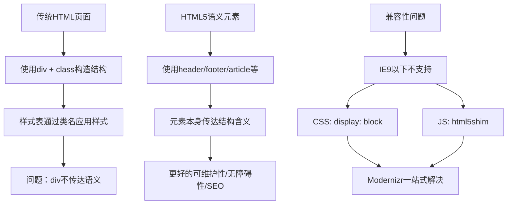
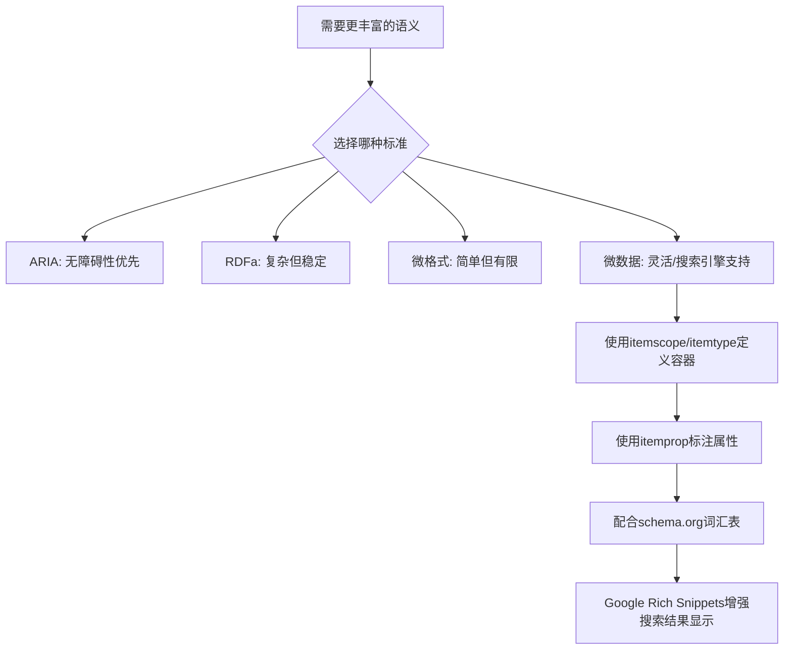
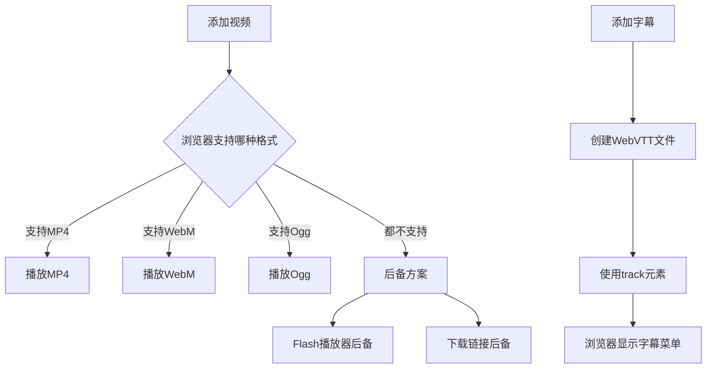
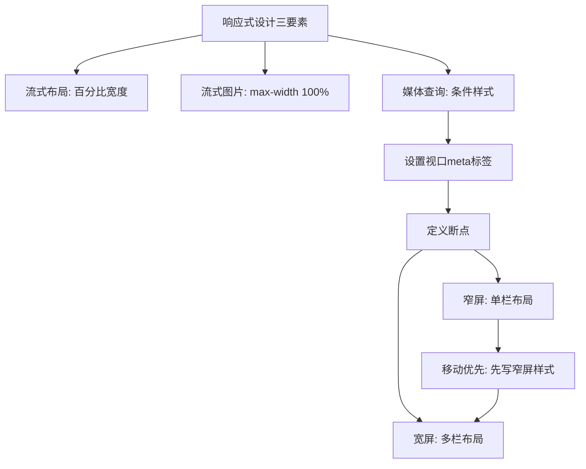
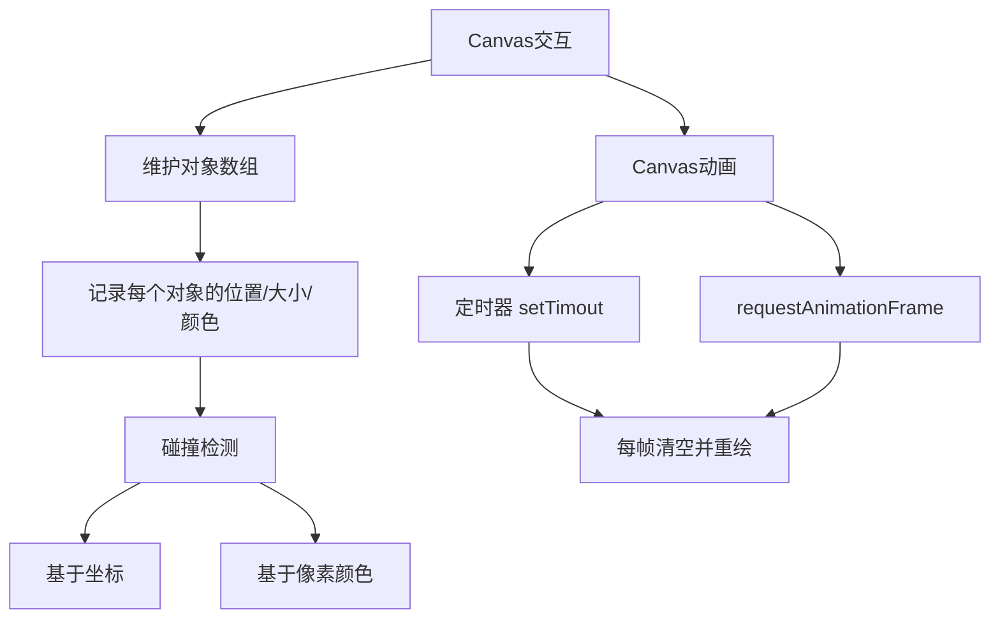
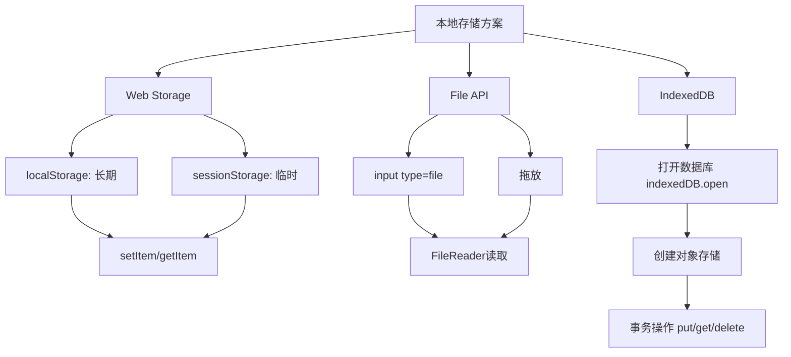
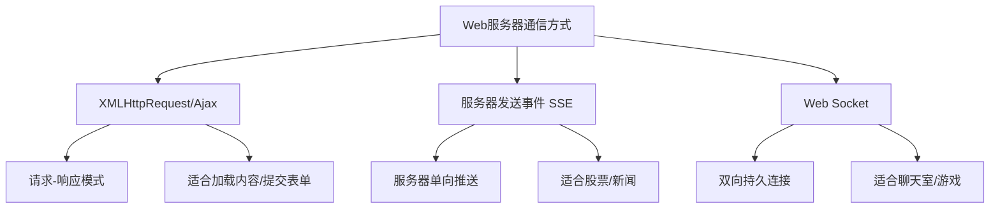
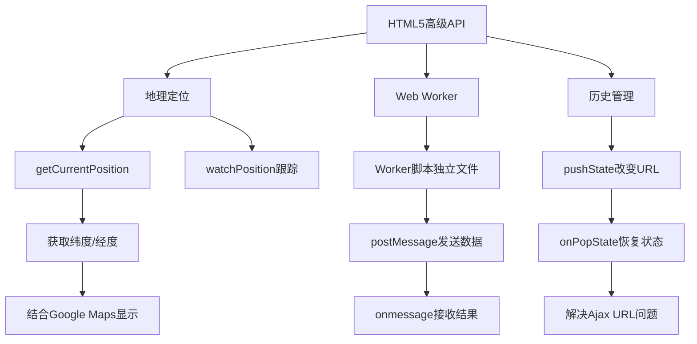

# 《HTML5秘籍（第2版）》章节总结

## 书籍信息

- 书名：HTML5秘籍（第2版）
- 作者：[美] Matthew MacDonald
- 译者：李松峰、朱巍、刘帅
- PDF 状态：可识别
- OCR 状态：良好

## 目录说明

- 目录识别情况：完整识别
- 章节对应依据：原书目录结构
- OCR 修复说明：无明显错漏

## 全书核心主题

本书系统介绍 HTML5 的核心技术与应用，涵盖标记语言、语义元素、Web 表单、多媒体、图形绘制、数据存储、离线应用、通信技术等。全书分为四个部分：现代标记、视频/图形/特效、构建 Web 应用、附录。作者强调 HTML5 的设计理念是“不破坏 Web”、“修补牛蹄子路”和“实用至上”，并详细介绍了如何在实际开发中处理浏览器兼容性问题。

---

## 第1章：HTML5简介

### 核心论点

本章解决“HTML5 从何而来、为何诞生、如何使用”的问题。作者认为 HTML5 是对 Web 现实的回归，其设计理念是“不破坏已有的 Web”、“修补牛蹄子路”（标准化已广泛应用的技术）和“实用至上”。

### 关键概念/事件

- **WHATWG**：由 Opera、Mozilla、苹果组成的 Web 超文本应用技术工作组，是 HTML5 的缔造者
- **XHTML 2.0 失败**：因要求过于严格、不向后兼容、制定过程缓慢而失败
- **不破坏 Web**：HTML5 的核心设计原则，确保已有网页继续工作
- **文档类型声明**：`<!DOCTYPE html>` 是最短的有效声明，可触发所有浏览器的标准模式
- **Modernizr**：用于检测浏览器对 HTML5/CSS3 功能支持情况的 JavaScript 库
- **腻子脚本（Polyfill）**：填补旧浏览器对 HTML5 功能支持的代码库

### 逻辑推演

从 HTML 的历史讲起：W3C 在 1998 年停止维护 HTML，转向 XHTML；XHTML 1.0 更严格但并未被浏览器严格执行；XHTML 2.0 因过于激进、不向后兼容而失败。与此同时，WHATWG 开始开发更务实的 Web 应用 1.0 和 Web 表单 2.0，最终演变为 HTML5。2007 年 W3C 放弃 XHTML 2.0，转而将 HTML5 改造为正式标准。HTML5 的核心原理是：(1) 不破坏已有网页；(2) 标准化已被广泛使用的技术；(3) 以实用为目的进行改变。

### 经典金句/数据

> “HTML5 是一个叛逆。它是由一群自由思想者组成的团队设计出来的，这个团队的成员并不负责制定官方 HTML 标准。” (p.3)

> “HTML5 代表未来。苹果、谷歌和微软等大软件公司都在鼎力支持它。” (p.3)

> “不破坏 Web 的意思是标准不应该引入导致已有的网页无法工作的改变。” (p.10)

---

## 第2章：用语义元素构造网页

### 核心论点

本章解决“如何用更有意义的 HTML 元素替代无意义的 `
` 来构造网页结构”的问题。作者认为语义元素可以让页面结构更清晰、更易于维护、提升无障碍性和搜索引擎优化。

### 关键概念/事件

- **语义元素**：为内容赋予额外含义的 HTML 元素，如 `<header>`、`<footer>`、`<article>`
- **`<figure>` 和 `<figcaption>`**：用于标注插图和图题
- **`<aside>`**：表示与周围文本没有密切关系的内容（附注、侧边栏、醒目引文）
- **`<nav>`**：标注导航链接组
- **`<section>`**：表示带标题的内容区块（最后考虑的语义元素）
- **HTML5 垫片（Shim）**：让 IE9 以下版本支持 HTML5 语义元素的 JavaScript 脚本

### 逻辑推演

传统的页面用 `
` 加类名（如 `.Header`、`.Footer`）来构造结构，但 `
` 本身不传达任何语义信息。HTML5 引入了 `<header>`、`<footer>`、`<article>`、`<nav>`、`<aside>`、`<section>` 等语义元素。这些元素与 `
` 行为相同（块级显示），但能传达出内容的含义。

对于旧版 IE（IE8 及更早），需要使用 CSS 规则将这些元素设为 `display: block`，并通过 JavaScript（html5shim）让 IE 识别它们。Modernizr 内置了这种支持。

### 流程图

### 经典金句/数据

> “所有语义元素都有一个显著的特点：不真正做任何事。” (p.36)

> “使用语义元素的理由：容易修改和维护、无障碍性、搜索引擎优化、未来的功能。” (p.36)

> “HTML5 没有‘content’元素，所以仍然可以使用 `
` 元素。” (p.41)

---

## 第3章：编写更有意义的标记

### 核心论点

本章解决“如何为网页添加更细粒度的语义信息”的问题。作者介绍了文本级语义元素（`<time>`、`<output>`、`<mark>`）以及三种语义标准（ARIA、RDFa、微格式、微数据），重点讲解了微数据及其在搜索引擎优化中的应用。

### 关键概念/事件

- **`<time>` 元素**：标注日期和时间，使用 `datetime` 属性提供机器可读格式
- **`<mark>` 元素**：突出显示文本（默认黄色背景）
- **微数据（Microdata）**：使用 `itemscope`、`itemtype`、`itemprop` 属性为内容添加语义
- **schema.org**：微软、谷歌、雅虎、Yandex 共同创建的微数据词汇表网站
- **Google Rich Snippets**：谷歌利用语义数据增强搜索结果显示的功能
- **结构化数据测试工具**：谷歌提供的验证语义标记的工具

### 逻辑推演

HTML5 新增了三个文本级语义元素：`<time>` 用于标注日期时间、`<output>` 用于标注 JavaScript 返回值、`<mark>` 用于突出显示文本。但这些远不够用，因此需要更强大的语义标准。

介绍了四种标准：ARIA（提升无障碍性）、RDFa（复杂但稳定）、微格式（简单但功能有限）、微数据（灵活且被搜索引擎支持）。微数据使用 `itemscope`、`itemtype`、`itemprop` 属性，配合 schema.org 词汇表，可标注人物、事件、评论、食谱等内容。谷歌的 Rich Snippets 会利用这些数据在搜索结果中显示更丰富的信息（如星级评分、价格、活动时间等）。

### 流程图

### 经典金句/数据

> “光知道针对 HTML5 的某项功能有一个腻子脚本还不够。在自己的网站中实际地使用它们之前，必须先在各种浏览器上测试。” (p.33)

> “完备的元数据可以提升用户点击访问你的网站的可能性。你要做的就是在页面中放入正确的语义数据，然后谷歌等搜索引擎可以找到它们并构建一个漂亮的搜索列表。” (p.84)

---

## 第4章：构建更好的Web表单

### 核心论点

本章解决“如何利用 HTML5 新特性构建更好的 Web 表单”的问题。作者介绍了占位符、自动焦点、表单验证、新的输入控件类型（email、url、number、range、date 等）、`<datalist>` 建议列表、`<progress>` 和 `<meter>` 进度条等内容。

### 关键概念/事件

- **`placeholder` 属性**：在文本框中显示提示性占位文本
- **`autofocus` 属性**：页面加载时自动让指定控件获得焦点
- **`required` 属性**：标记必填字段
- **`pattern` 属性**：使用正则表达式验证输入
- **`setCustomValidity()` 方法**：自定义验证逻辑
- **新输入类型**：email、url、search、tel、number、range、date、color
- **`<datalist>` 元素**：为文本框提供下拉建议列表
- **`<progress>` 和 `<meter>`**：进度条和计量条

### 逻辑推演

传统表单的验证需要编写 JavaScript 代码。HTML5 将验证功能内置到浏览器中：使用 `required` 标记必填字段，使用 `pattern` 配合正则表达式验证格式，使用 `setCustomValidity()` 实现自定义验证。浏览器会在提交时拦截无效数据并显示提示。

新输入类型（email、url、number、range、date 等）让浏览器可以提供专用键盘（移动端）和内置验证。`<datalist>` 可为文本框提供建议列表。`<progress>` 和 `<meter>` 提供可视化进度和计量显示。

浏览器支持情况不一，可使用 Modernizr 检测，或使用 HTML5Forms 等腻子脚本兼容旧浏览器。

### 经典金句/数据

> “HTML5 表单验证的基本原理就是你来告诉浏览器要验证哪个字段，但具体验证的细节，你不用管。” (p.99)

> “无论采用什么方式，过程都差不多：检查表单数据，对数据进行某种处理，然后再发回一个新网页。” (p.92)

> “验证的两个地方：客户端验证（为访客提供方便）、服务器端验证（确保数据正确性）。” (p.100)

---

## 第5章：音频与视频

### 核心论点

本章解决“如何在 HTML5 中无插件播放音频和视频”的问题。作者介绍了 `<audio>` 和 `<video>` 元素的使用、媒体格式支持情况、后备措施（多格式支持、Flash 后备）、JavaScript 控制播放器以及视频字幕。

### 关键概念/事件

- **`<audio>` 和 `<video>` 元素**：HTML5 原生多媒体播放
- **格式问题**：MP3/MP4（H.264）、Ogg Vorbis/Theora、WebM 之间的兼容性
- **后备措施**：使用 `<source>` 提供多种格式，使用 Flash 作为旧浏览器的后备
- **MediaElement.js**：统一播放器外观并提供 Flash 后备的 JavaScript 库
- **WebVTT**：Web 视频文本轨道格式，用于字幕
- **`<track>` 元素**：为视频添加字幕轨道

### 逻辑推演

过去视频播放依赖 Flash 插件，但 Flash 在移动端（iOS）不支持且存在性能问题。HTML5 的 `<video>` 和 `<audio>` 元素提供了原生解决方案。但浏览器厂商对格式支持不一致：IE/Safari 支持 MP4，Firefox/Opera 支持 Ogg 和 WebM。解决方案是使用 `<source>` 提供多种格式，浏览器会自动选择第一个支持的格式。

对于不支持 HTML5 媒体的旧浏览器（如 IE8），可以嵌套 Flash 播放器作为后备。使用 MediaElement.js 等库可以简化这一过程并统一播放器外观。

### 流程图

### 经典金句/数据

> “思科的报告指出，这个趋势没有放慢的迹象，并预测到 2017 年网络流量的 80% 都将用于视频。” (p.125)

> “H.264 编码的视频占有 80% 以上的上网用户。这个比例已相当高，但就其自身而言还不够高。” (p.134)

> “YouTube 提供一个试用版 HTML5 视频播放器。要体验，请访问 www.youtube.com/html5。” (p.126)

---

## 第6章：美妙的CSS3字体和特效

### 核心论点

本章解决“如何使用 CSS3 为网页添加丰富视觉效果”的问题。作者介绍了 CSS3 的使用策略（开发商前缀、Modernizr）、盒子样式（透明、圆角、阴影、渐变）、过渡效果、变换、Web 字体和多栏文本。

### 关键概念/事件

- **开发商前缀**：`-webkit-`、`-moz-`、`-ms-`、`-o-`，用于还在开发中的 CSS 属性
- **`border-radius`**：圆角效果
- **`rgba()` 和 `opacity`**：透明效果
- **`box-shadow` 和 `text-shadow`**：阴影效果
- **`linear-gradient()` 和 `radial-gradient()`**：渐变效果
- **过渡（transition）**：让样式变化平滑过渡
- **变换（transform）**：移动、缩放、旋转、斜切元素
- **@font-face**：使用自定义 Web 字体
- **Google Fonts**：免费的 Web 字体服务

### 逻辑推演

CSS3 是一组独立的标准模块，浏览器支持情况不一。使用开发商前缀可以确保实验性功能正常工作，而 Modernizr 可以检测支持情况并提供后备样式。

CSS3 新增了许多美化功能：`border-radius` 创建圆角，`rgba()` 和 `opacity` 实现透明，`box-shadow` 添加阴影，`linear-gradient()` 创建渐变。过渡（transition）让样式变化平滑，变换（transform）可以旋转、缩放、移动元素。

Web 字体通过 `@font-face` 规则实现，需要提供多种格式（EOT、WOFF、TTF、SVG）以兼容各浏览器。Font Squirrel 提供免费字体和字体生成器，Google Fonts 提供更简单的引用方式。

### 经典金句/数据

> “CSS3 是 Web 样式设计的未来，但它还没有制定完成。许多模块都在修订和评审当中，没有一款浏览器支持全部模块。” (p.152)

> “网站没有必要在所有浏览器中都长得一模一样。” (p.153)

> “以前，Web 设计人员只能使用少数几种安全字体。任何一位有点经验的设计师都知道，字体在营造文档氛围的过程中，具有不可替代的重要作用。” (p.177)

---

## 第7章：CSS3与响应式Web设计

### 核心论点

本章解决“如何让网站适应不同屏幕尺寸和设备”的问题。作者介绍了响应式设计的三大基础技术：流式布局（使用百分比宽度）、流式图片（`max-width: 100%`）、媒体查询（根据屏幕宽度应用不同样式）。

### 关键概念/事件

- **流式布局**：使用百分比而非像素设置栏宽，让布局随窗口缩放
- **流式图片**：`img { max-width: 100%; }` 让图片不超出容器
- **流式排版**：使用 em 或 rem 而非像素设置字号
- **视口（viewport）**：移动浏览器显示网页的区域，需设置 `<meta name="viewport">`
- **媒体查询**：`@media (max-width: 568px) { ... }`，根据条件应用不同样式
- **移动优先设计**：先设计移动版布局，再通过媒体查询为更大屏幕增强

### 逻辑推演

响应式设计是应对不同屏幕尺寸的解决方案。其核心包括：(1) 流式布局——使用百分比宽度让栏随窗口缩放；(2) 流式图片——设置 `max-width: 100%` 让图片不溢出容器；(3) 媒体查询——根据窗口宽度应用不同样式（如窄屏时让两栏变成一栏）。

移动设备需要设置视口 meta 标签（`width=device-width, initial-scale=1`）告诉浏览器不要自动缩放页面。媒体查询可以使用 `min-width` 和 `max-width` 设置断点，常见断点有 320px（手机纵向）、480px（手机横向/大屏手机）、768px（平板纵向）、960px（桌面）。

### 流程图

### 经典金句/数据

> “窗口大小不定是 Web 诞生之初就存在的问题。经过多年的实战，网页设计师已经为此发明了很多技术，有的精妙，有的粗鄙，但目标都是为了实现响应式设计。” (p.187)

> “移动优先设计：先在 HTML 中把 Content 放在 NavSidebar 前面，然后用 CSS 创建多栏布局。” (p.202)

---

## 第8章：基本Canvas绘图

### 核心论点

本章解决“如何使用 Canvas 元素进行基本绘图”的问题。作者介绍了 Canvas 的坐标系、绘图上下文、绘制直线/路径/形状/曲线、变换、透明度和合成操作，并构建了一个简单的画图程序。

### 关键概念/事件

- **Canvas 元素**：`<canvas id="drawingCanvas" width="500" height="300">`
- **绘图上下文**：`canvas.getContext("2d")`，所有绘图操作的对象
- **坐标系**：左上角为原点 (0,0)，x 向右增加，y 向下增加
- **路径方法**：`beginPath()`、`moveTo()`、`lineTo()`、`closePath()`、`stroke()`、`fill()`
- **曲线方法**：`arc()`、`bezierCurveTo()`、`quadraticCurveTo()`
- **变换**：`translate()`、`rotate()`、`scale()`
- **透明度**：`rgba()` 函数或 `globalAlpha` 属性
- **合成操作**：`globalCompositeOperation` 控制重叠图形的混合方式

### 逻辑推演

Canvas 是一个通过 JavaScript 绘图的 HTML 元素。首先获取 Canvas 元素和 2D 上下文，然后使用上下文方法绘图。基本操作包括：`moveTo()` 移动到起点，`lineTo()` 画线，`stroke()` 描边；`fillRect()` 填充矩形；`arc()` 画圆弧。

变换可以移动坐标系原点（`translate`）、旋转（`rotate`）、缩放（`scale`），简化复杂绘图。透明度可通过 `rgba()` 或 `globalAlpha` 设置。合成操作（如 `source-over`、`xor`）控制新图形与已有图形的叠加方式。

画图程序示例展示了如何通过鼠标事件（mousedown、mousemove、mouseup）在 Canvas 上绘制线条，以及如何将画布保存为图像（`toDataURL()`）。

### 经典金句/数据

> “Canvas 是最重要的 HTML5 工具之一，这块‘画布’能够把你内心深处的‘毕加索’释放出来。” (p.207)

> “与其他 HTML 元素相比，`<canvas>` 独特的地方是需要 JavaScript 来操作。不使用 JavaScript，就无法绘制图形，也不能画出图画。” (p.207)

---

## 第9章：高级Canvas技术：交互性和动画

### 核心论点

本章解决“如何为 Canvas 添加交互性和动画”的问题。作者介绍了绘制图像和文本、阴影与填充（图案、渐变）、碰撞检测、动画（requestAnimationFrame）、以及迷宫游戏示例。

### 关键概念/事件

- **`drawImage()`**：在画布上绘制图片，支持裁剪和缩放
- **`fillText()` 和 `strokeText()`**：绘制文本
- **阴影属性**：`shadowColor`、`shadowBlur`、`shadowOffsetX/Y`
- **图案填充**：`createPattern()` 用图片平铺填充
- **渐变填充**：`createLinearGradient()`、`createRadialGradient()`
- **碰撞检测**：基于坐标的数学计算或基于像素颜色检测
- **动画循环**：使用 `setTimeout` 或 `requestAnimationFrame`
- **像素操作**：`getImageData()`、`putImageData()` 读取和修改像素

### 逻辑推演

Canvas 是非保留性绘图界面，不记录已绘制的对象。要实现交互（如选择、拖动图形），需要自己维护对象数组，记录每个对象的位置、大小、颜色等属性。碰撞检测有两种方式：(1) 基于坐标的数学计算（如点到圆心的距离）；(2) 基于像素颜色检测（如读取像素颜色判断是否碰到墙）。

动画通过定时器（`setTimeout` 或 `requestAnimationFrame`）驱动，每帧清空画布并重新绘制所有对象。基于时间的动画使用 `Date.now()` 计算时间差，确保不同帧率下动画速度一致。

迷宫游戏示例综合运用了图像绘制、键盘控制、碰撞检测（基于像素颜色）等技术。

### 流程图

### 经典金句/数据

> “Canvas 是一种非保留性的绘图界面。换句话说，它不会记录过去执行的绘图操作，而只是保持最终结果——构成图像的彩色像素。” (p.249)

> “任何动画的关键都在于调用 setTimeout()。” (p.255)

---

## 第10章：数据存储

### 核心论点

本章解决“如何在用户本地存储数据”的问题。作者介绍了 Web Storage（`localStorage` 和 `sessionStorage`）、File API（读取本地文件）、IndexedDB（浏览器数据库）三种本地存储方案。

### 关键概念/事件

- **`localStorage`**：长期保存数据，跨页面/跨会话
- **`sessionStorage`**：临时保存数据，窗口关闭即清除
- **JSON 编码**：`JSON.stringify()` 和 `JSON.parse()`，用于保存对象
- **File API**：通过 `FileReader` 读取用户选择的文件
- **拖放读取**：通过 `ondrop` 事件读取拖拽到页面的文件
- **IndexedDB**：浏览器内置的 NoSQL 数据库，支持异步操作
- **对象存储（ObjectStore）**：IndexedDB 中的数据表

### 逻辑推演

Web Storage 提供了两种存储方式：`localStorage`（长期）和 `sessionStorage`（临时）。存储的数据是键值对，只能保存字符串，保存对象需用 `JSON.stringify()`。每个域名有约 5MB 空间。

File API 让 JavaScript 可以读取用户本地文件。通过 `<input type="file">` 或拖放获取文件对象，然后用 `FileReader` 读取文本或图片（`readAsText`、`readAsDataURL`）。

IndexedDB 是更强大的本地数据库，支持异步操作、索引查询、大数据存储。使用时需要：打开数据库、创建对象存储、使用事务进行增删改查。操作是异步的，需要处理 `onsuccess` 和 `onerror` 事件。

### 流程图

### 经典金句/数据

> “Web 存储这个名字误人不浅啊，本来网页保存的信息根本就不在 Web（网）上，而是实实在在地保存在用户的计算机上，从来不会离开。” (p.271)

> “大多数浏览器都把本地存储限制为 5 MB 以下。” (p.271)

> “IndexedDB 存储数据的方式是面向对象的，而非传统的关系型数据表。” (p.291)

---

## 第11章：离线应用

### 核心论点

本章解决“如何让 Web 应用在离线时也能工作”的问题。作者介绍了使用描述文件（manifest）缓存资源、更新缓存、检测在线状态、监听更新等技术。

### 关键概念/事件

- **描述文件（Manifest）**：文本文件，列出需要缓存的文件，以 `CACHE MANIFEST` 开头
- **CACHE 区块**：列出需要缓存的文件
- **NETWORK 区块**：列出必须在线访问的文件（永不缓存）
- **FALLBACK 区块**：列出在线/离线时的替换文件
- **`navigator.onLine` 属性**：检测浏览器是否在线（不完全可靠）
- **`applicationCache` 对象**：用于监听缓存更新的 JavaScript 接口
- **`onUpdateReady` 事件**：新版本已下载完成，可提示用户刷新页面

### 逻辑推演

离线应用的核心是描述文件。在 `<html>` 中添加 `manifest` 属性指向描述文件，浏览器会下载并缓存文件中列出的所有资源。描述文件以 `CACHE MANIFEST` 开头，可以包含 `CACHE:`、`NETWORK:`、`FALLBACK:` 三个区块。

更新应用需要修改描述文件（如修改版本号注释），浏览器检测到描述文件更新后会重新下载所有文件。通过 `applicationCache` 对象可以监听更新进度，并在 `onUpdateReady` 时提示用户刷新页面。

检测在线状态可用 `navigator.onLine`，但更可靠的是通过 FALLBACK 区块创建 `online.js` 和 `offline.js` 两个版本，根据加载哪个版本来判断是否在线。

### 经典金句/数据

> “离线应用并不适合所有网页。比如，把查询股票报价的网页转换成离线应用毫无意义。” (p.300)

> “最佳经验法则是给苹果设备（像 iPad 和 iPhone）分配 50 MB 空间，给 Android 设备分配将近 85 MB 空间。” (p.309)

---

## 第12章：与Web服务器通信

### 核心论点

本章解决“网页如何与 Web 服务器通信”的问题。作者介绍了三种方式：`XMLHttpRequest`（Ajax，请求-响应式）、服务器发送事件（Server-Sent Events，服务器单向推送）、Web Socket（双向持久连接）。

### 关键概念/事件

- **`XMLHttpRequest` 对象**：在后台发送请求获取数据，不刷新页面
- **Ajax**：异步 JavaScript 和 XML 的缩写，实现流畅的 Web 应用
- **服务器发送事件**：使用 `EventSource` 对象接收服务器主动推送的消息
- **轮询**：定时向服务器请求新数据，效率较低
- **Web Socket**：双向持久连接，适合聊天室、游戏等实时应用
- **`ws://` 协议**：Web Socket 的 URL 协议

### 逻辑推演

`XMLHttpRequest` 是最早的服务器通信方式，通过 `open()`、`send()` 发送请求，通过 `onreadystatechange` 接收响应。适合请求-响应模式的场景（如加载新内容、提交表单）。

服务器发送事件（SSE）让服务器可以主动推送消息。客户端创建 `EventSource` 对象并指定 URL，服务器以 `data: 消息\n\n` 格式发送消息。适合股票行情、新闻推送等单向推送场景。

Web Socket 提供双向持久连接，适合需要实时双向通信的场景（如聊天室、多人游戏）。服务器需要专门的 Web Socket 服务器，客户端创建 `WebSocket` 对象并处理 `onmessage` 事件。

### 流程图

### 经典金句/数据

> “如果成千上万的用户都这样轮询，无疑会给服务器造成无谓的压力。” (p.326)

> “Web Socket 标准让开发人员非常兴奋，而且已经获得相当多的浏览器支持。” (p.333)

---

## 第13章：地理定位、Web Worker和历史管理

### 核心论点

本章解决“三个现代 Web 应用开发难题”的问题：获取用户位置、后台执行耗时任务、管理页面 URL 与状态的同步。作者分别介绍了 Geolocation API、Web Worker、会话历史管理。

### 关键概念/事件

- **地理定位（Geolocation）**：`navigator.geolocation.getCurrentPosition()` 获取用户坐标
- **精度（accuracy）**：以米为单位表示定位精确度
- **Web Worker**：在后台线程执行 JavaScript 代码，不阻塞 UI
- **`postMessage()`**：网页与 Worker 之间传递消息的方法
- **会话历史管理**：`history.pushState()` 改变 URL 而不刷新页面
- **`onPopState` 事件**：用户点击前进/后退时触发，用于恢复页面状态
- **hashbang URL**：`#!/slide5` 形式的 URL，是 history API 出现前的解决方案

### 逻辑推演

地理定位通过 `getCurrentPosition()` 获取用户位置，可设置 `enableHighAccuracy`、`timeout`、`maximumAge` 选项。需要用户授权。成功回调返回 `position.coords.latitude` 和 `longitude`。

Web Worker 让耗时任务在后台执行，不阻塞 UI。Worker 代码放在单独文件中，通过 `new Worker("script.js")` 创建，通过 `postMessage()` 和 `onmessage` 与主线程通信。

会话历史管理解决 Ajax 应用中的 URL 问题：动态加载内容后 URL 不变，导致无法书签/分享特定状态。`pushState()` 可以改变 URL 而不刷新页面，`onPopState` 事件在用户点击前进/后退时触发，可根据保存的状态恢复页面。

### 流程图

### 经典金句/数据

> “只要不是神经有问题，人们都会提出类似这样的问题：几行代码就能确定我现在在哪个咖啡馆里面？是不是有什么隐藏的程序在跟踪我呀？” (p.340)

> “为了解决 JavaScript 阻塞页面的问题，HTML5 提出了更好的解决方案，一个叫 Web Worker 的对象，能够在后台完成工作。” (p.350)

> “不同的内容，相同的 URL”——这导致了历史管理功能的诞生 (p.361)

---

## 附录A：CSS基础

### 核心论点

本附录为 CSS 入门教程，介绍 CSS 的基本概念、选择器、属性、盒模型、布局等基础知识。

### 关键概念/事件

- **样式表**：包含样式规则的文本文件，通过 `<link>` 链接到 HTML
- **选择器（Selector）**：指定要格式化的元素（元素名、类、ID、上下文）
- **类选择器**：`.classname`，可应用于多个元素
- **ID 选择器**：`#idname`，页面中唯一
- **上下文选择符**：`.Content h2` 选择位于特定祖先内的元素
- **伪类**：`:link`、`:visited`、`:hover`、`:active`、`:focus`
- **盒模型**：每个元素包含内容、内边距（padding）、边框（border）、外边距（margin）
- **浮动（float）**：让元素向左或向右浮动，实现多栏布局
- **定位（position）**：`static`、`relative`、`absolute`、`fixed`

### 经典金句/数据

> “不夸张地说，没有 CSS（也就是‘层叠样式表’）标准，就没有现代的 Web 设计。” (p.368)

> “现代 Web 开发建立在一个简单的原理基础上：HTML 标记用于把页面结构化为逻辑区块，而 CSS 样式表用于格式化。” (p.369)

---

## 附录B：JavaScript：页面的大脑

### 核心论点

本附录为 JavaScript 入门教程，介绍如何在网页中使用 JavaScript、变量、函数、条件逻辑、循环、数组、对象等基础知识。

### 关键概念/事件

- **`<script>` 元素**：嵌入或引用 JavaScript 代码
- **函数**：`function showMessage() { ... }`
- **变量**：`var myVariable = value;`
- **条件逻辑**：`if (condition) { ... } else { ... }`
- **循环**：`for (var i=0; i<array.length; i++) { ... }`
- **数组**：`var colors = ["red", "green", "blue"];`
- **对象**：通过对象定义函数或对象字面量 `{ key: value }`
- **`document.getElementById()`**：获取页面元素
- **`innerHTML`**：修改元素内容
- **事件**：`onclick`、`onload`、`onmouseover` 等

### 经典金句/数据

> “曾经有一段时间，网上只有标记。那时候，页面里只包含文本和 HTML 标签，除此之外就没有什么别的了。” (p.381)

> “JavaScript 代码是在沙箱里运行的。什么意思？就是它的能力是受限制的。” (p.397)

# 