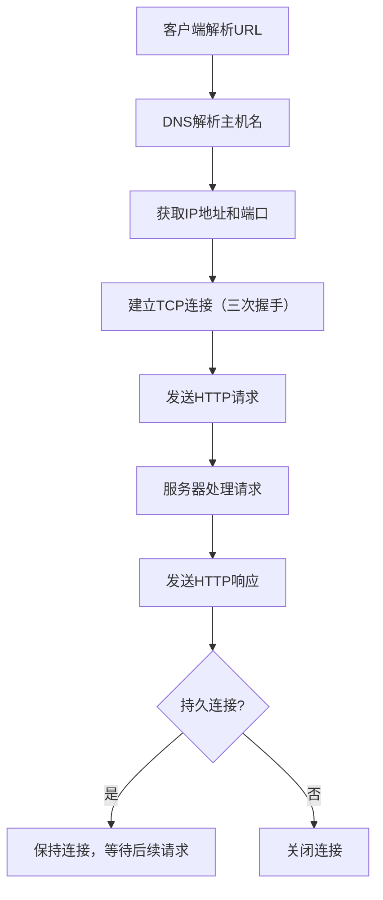
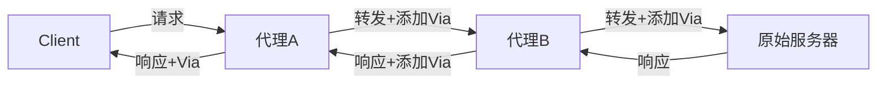
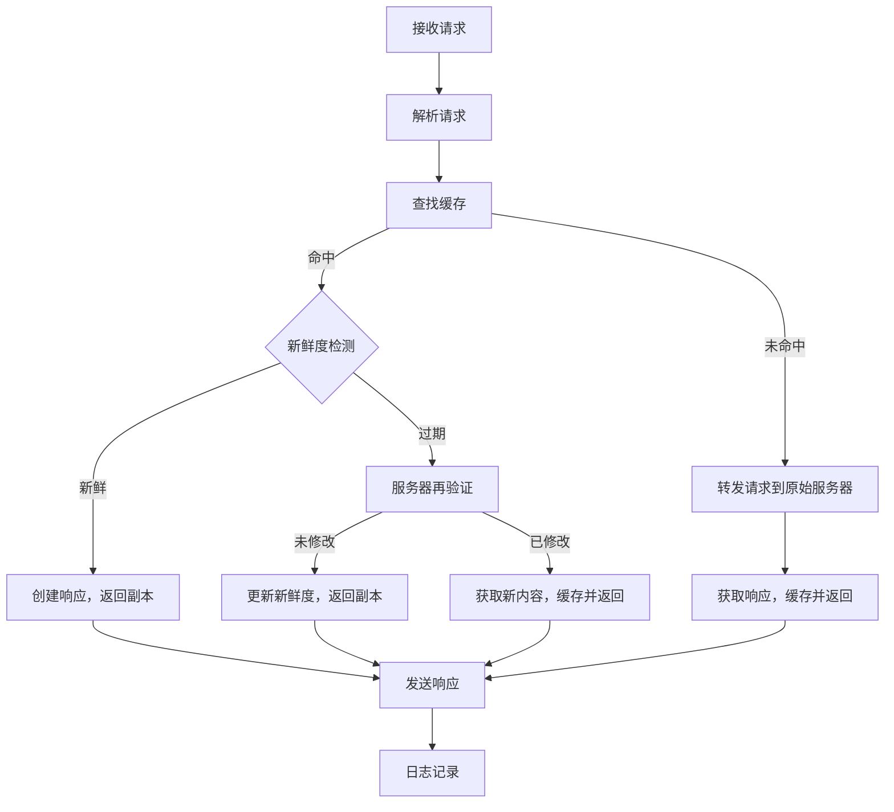
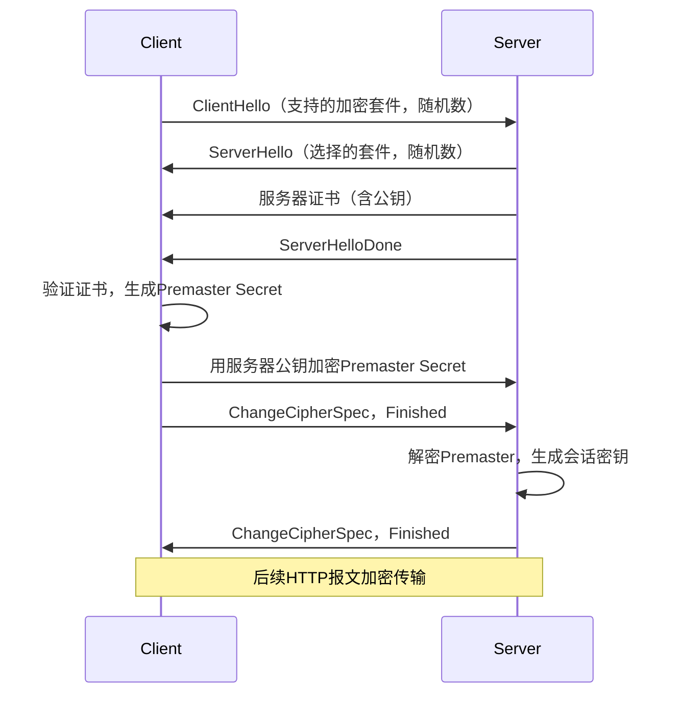

# 《HTTP权威指南》章节总结

## 书籍信息
- 书名：HTTP权威指南（HTTP: The Definitive Guide）
- 作者：David Gourley, Brian Totty, Marjorie Sayer, Sailu Reddy, Anshu Aggarwal
- 译者：陈涓，赵振平
- 出版社：人民邮电出版社 / O'Reilly
- PDF状态：基于OCR识别文本，部分页面可能存在识别错漏或顺序混乱
- OCR状态：存在部分字符识别错误、页码缺失、图表不可见等问题，但主要文本内容可读

## 目录说明
- 目录识别情况：原书目录位于PDF第12~27页，包含第1~21章及附录A~H
- 章节对应依据：按原书目录顺序整理，本章节总结基于可见正文内容
- OCR修复说明：部分页面（如第7章以后）存在重复或乱码，已尽量基于可识别内容提炼；无法确定的内容已标注

## 全书核心主题
本书是HTTP及相关Web技术的权威著作，系统讲解了HTTP协议的工作原理、报文结构、连接管理、Web服务器、代理、缓存、安全、国际化、内容协商、Web托管、发布系统、重定向与负载均衡、日志记录等。作者不仅解释“怎么做”，更深入说明“为什么这样做”，涵盖了Web开发、系统架构、性能优化、安全防护等实践领域。全书分为五大部分：HTTP基础、HTTP结构、识别/认证与安全、实体/编码/国际化、内容发布与分发，最后附有8个参考附录。

---

## 第1章：HTTP概述

### 核心论点
本章解决“HTTP是什么以及如何工作”的基本问题。作者认为HTTP是因特网的多媒体信使，通过可靠的数据传输协议（TCP/IP）在Web客户端和服务器之间传送各种资源。

### 关键概念
- **HTTP**：超文本传输协议，应用层协议，基于TCP/IP。
- **Web客户端和服务器**：客户端（如浏览器）发送请求，服务器返回响应。
- **资源**：Web内容的源头，可以是静态文件或动态生成内容的程序。
- **MIME类型**：标记数据格式的文本标签，如text/html、image/jpeg。
- **URI/URL/URN**：URI统一资源标识符，URL为常见形式（含协议、服务器、路径），URN为位置无关的名字。
- **事务**：一个请求加一个响应，通过HTTP报文完成。
- **方法**：GET、POST、PUT、DELETE、HEAD等。
- **状态码**：三位数字（如200 OK、404 Not Found）。
- **报文**：纯文本，包含起始行、首部、主体。
- **连接**：HTTP基于TCP，通过IP地址和端口号建立连接。

### 逻辑推演
1. 引出HTTP作为万维网通用语言。
2. 解释客户端-服务器模型，以浏览器获取页面为例。
3. 介绍资源类型（静态/动态）及MIME标记。
4. 说明URI（尤其是URL）的组成和作用。
5. 详述HTTP事务（方法+状态码）及复合页面多事务。
6. 展示报文结构和Telnet交互实例。
7. 介绍协议版本演进（0.9→1.0→1.1→NG）。
8. 概述Web结构组件：代理、缓存、网关、隧道、Agent代理。

### 经典金句
> “HTTP使用的是可靠的数据传输协议，因此即使数据来自地球的另一端，它也能够确保数据在传输的过程中不会被损坏或产生混乱。”（p.31）

---

## 第2章：URL与资源

### 核心论点
URL是因特网资源的标准化名称，告诉应用程序如何找到并访问资源。作者详细解析URL语法、编码规则及常见方案，并展望URN的未来。

### 关键概念
- **URL语法**：`<scheme>://<user>:<password>@<host>:<port>/<path>;<params>?<query>#<frag>`
- **方案**：如http、https、ftp、mailto等。
- **主机与端口**：默认HTTP端口80。
- **路径**：资源在服务器上的本地名。
- **参数**：名/值对，用分号分隔。
- **查询字符串**：问号后，常用`key=value&`格式。
- **片段**：井号后，客户端内部使用，不发送给服务器。
- **相对URL**：相对于基础URL解析，便于资源迁移。
- **URL编码**：百分号+十六进制ASCII码，处理不安全字符。
- **URN**：统一资源名，位置无关，如`urn:ietf:rfc:2141`。

### 逻辑推演
1. 从日常命名类比引出URL的必要性。
2. 分拆URL的9个组件，逐一解释。
3. 演示相对URL解析算法（RFC1808/2396）。
4. 讨论字符集限制与编码机制。
5. 列举常见方案（http、https、ftp、mailto、file、news、telnet）。
6. 指出URL的缺点（绑定位置），引出URN和PURL作为未来方向。

### 经典金句
> “URL 是一种强有力的工具。它可以用来命名所有现存对象，而且可以很方便地包含一些新格式。”（p.42）

---

## 第3章：HTTP报文

### 核心论点
HTTP报文是客户端与服务器之间交换的数据块。本章解决如何创建、解析和理解报文的问题，包括报文结构、方法、状态码和首部。

### 关键概念
- **报文流向**：流入源端服务器，向下游流动。
- **报文三部分**：起始行、首部、主体。
- **请求行**：方法 + 请求URL + 版本。
- **响应行**：版本 + 状态码 + 原因短语。
- **方法**：GET、HEAD、POST、PUT、TRACE、OPTIONS、DELETE。
- **安全方法**：GET和HEAD被认为是安全的（不产生动作）。
- **状态码分类**：1xx信息，2xx成功，3xx重定向，4xx客户端错误，5xx服务器错误。
- **首部类型**：通用、请求、响应、实体、扩展。
- **常见首部**：Date、Content-Length、Content-Type、Accept、Server等。

### 逻辑推演
1. 定义报文流方向（上游/下游）。
2. 给出请求和响应的语法格式。
3. 逐一解释起始行的各个组成部分。
4. 详细说明7种主要方法及TRACE/OPTIONS的特殊用途。
5. 按类别列出所有状态码（100~599）及其含义。
6. 分类介绍首部，并给出示例。
7. 提及版本0.9的简单报文格式。

### 经典金句
> “状态码为客户端提供了一种理解事务处理结果的便捷方式。”（p.62）

---

## 第4章：连接管理

### 核心论点
HTTP连接管理是影响性能的关键。作者解释TCP连接的特性、时延来源，以及HTTP如何通过并行、持久、管道化连接优化性能。

### 关键概念
- **TCP连接**：可靠、有序、无差错的数据管道，通过IP分组传输。
- **TCP时延**：连接建立握手、慢启动、延迟确认、Nagle算法、TIME_WAIT。
- **Connection首部**：控制逐跳选项，如`Connection: close`。
- **串行事务**：每个事务单独连接，时延叠加。
- **并行连接**：多条TCP并发，提高感知速度，但消耗资源。
- **持久连接**：重用TCP连接（HTTP/1.0+ keep-alive，HTTP/1.1默认）。
- **管道化连接**：在持久连接上同时发送多个请求，按序响应。

### 流程图（Mermaid重建）

### 逻辑推演
1. 介绍TCP连接的基础（套接字编程、分组传输）。
2. 分析HTTP事务的时延组成（DNS、握手、传输、处理）。
3. 深入TCP性能问题（握手、慢启动、Nagle、延迟确认、TIME_WAIT）。
4. 引出Connection首部的正确用法。
5. 对比串行、并行、持久、管道化连接的优缺点。
6. 解释keep-alive（HTTP/1.0+）的哑代理问题及Proxy-Connection变通。
7. 说明HTTP/1.1持久连接的规则。
8. 讨论关闭连接的策略（半关闭 vs 完全关闭，重置风险）。

### 经典金句
> “HTTP 连接管理有点像魔术，应当从经验与实践，而不仅仅是出版的文献中学习。”（p.79）

---

## 第5章：Web服务器

### 核心论点
Web服务器是万维网的骨干。本章介绍不同形态的Web服务器（通用软件、设备、嵌入式），并详细说明服务器处理HTTP请求的七个步骤。

### 关键概念
- **Web服务器实现**：通用软件（Apache、IIS）、设备（Cobalt RaQ）、嵌入式（IPic）。
- **最小Perl服务器**：type-o-serve，用于诊断。
- **七步骤**：接受连接 → 接收请求 → 处理请求 → 访问资源 → 构建响应 → 发送响应 → 记录日志。
- **docroot**：文档根目录，虚拟主机使用不同docroot。
- **动态资源映射**：CGI、服务器扩展API。
- **MIME类型确定**：扩展名、魔法分类、显式配置、内容协商。
- **重定向**：永久/临时删除、URL增强、负载均衡等。

### 逻辑推演
1. 列举Web服务器的多样形式。
2. 给出一个30行Perl服务器示例，用于调试。
3. 逐步展开七步处理流程：
   - 接受连接：识别客户端、ident查找。
   - 接收请求：解析报文，内部表示，I/O结构（单线程/多线程/复用）。
   - 处理请求：根据方法行动。
   - 访问资源：docroot、虚拟托管、用户目录、目录索引。
   - 构建响应：MIME类型、重定向。
   - 发送响应：持久连接的处理。
   - 记录日志。
4. 讨论Apache配置指令示例。

### 经典金句
> “Web 服务器每天会分发出数十亿的 Web 页面。这些页面可以告诉你天气情况，装载在线商店的购物车，还能帮你找到许久未联系的高中同学。”（p.115）

---

## 第6章：代理

### 核心论点
代理是位于客户端和服务器之间的中间实体，可以改善安全性、提高性能、节省费用。本章解释代理的类型、部署方式、报文修改规则以及如何追踪代理链。

### 关键概念
- **代理 vs 网关**：代理使用相同协议，网关转换协议。
- **私有代理 vs 共享代理**：私有代理（客户端专用），共享代理（公共缓存）。
- **代理用途**：儿童过滤器、文档访问控制、安全防火墙、Web缓存、反向代理（替代物/加速器）、内容路由器、转码器、匿名者。
- **代理部署**：出口、入口、反向代理、网络交换点。
- **代理层次结构**：父代理、子代理，动态内容路由。
- **流量导向代理**：修改客户端、拦截代理、修改DNS、修改Web服务器（重定向）。
- **客户端配置**：手工、PAC（JavaScript自动配置）、WPAD（自动发现）。
- **Via首部**：记录报文经过的中间节点，用于诊断循环。
- **TRACE方法**：回送收到的请求，配合Max-Forwards限制跳数。
- **代理认证**：407 Proxy Authentication Required。

### 流程图（Mermaid重建：代理链及Via）

### 逻辑推演
1. 定义代理的双重角色（既是客户端又是服务器）。
2. 列出代理的多种应用场景，每个场景配图解释。
3. 讨论代理的网络位置及层次结构（静态/动态内容路由）。
4. 说明流量如何导向代理（四种方法）。
5. 详述客户端代理配置（手工、PAC、WPAD）。
6. 比较代理请求与服务器请求的URI差异（完整URI vs 部分URI），以及拦截代理的挑战。
7. 介绍Via首部的语法、请求/响应路径、隐私处理。
8. 使用TRACE和Max-Forwards进行代理链诊断。
9. 代理认证机制。
10. 互操作性：OPTIONS方法、Allow首部。

### 经典金句
> “代理服务器位于客户端和服务器设备之间，这些设备实现的协议可能有所不同，可能存在着很棘手的问题。”（p.165）

---

## 第7章：缓存

> 说明：该部分PDF识别不完整，大量页面重复或乱码。以下内容基于第7章前半部分可读文本整理。

### 核心论点
Web缓存可以自动保存常用文档副本，减少冗余数据传输、缓解带宽瓶颈、降低距离时延、防止瞬间拥塞。本章解释缓存命中和未命中、再验证机制以及新鲜度控制。

### 关键概念
- **缓存命中**：请求的副本存在于缓存中，直接返回。
- **缓存未命中**：缓存没有副本，转发给原始服务器。
- **再验证**：检查缓存副本是否仍然新鲜，使用条件请求（If-Modified-Since、If-None-Match）。
- **命中率**：请求命中缓存的比例；字节命中率：命中字节的比例。
- **私有缓存**：单个用户专用（浏览器缓存）。
- **公有代理缓存**：多个用户共享。
- **缓存层次结构**：父子缓存，网状缓存，内容路由。
- **新鲜度**：通过`Expires`或`Cache-Control: max-age`定义。
- **条件方法**：`If-Modified-Since`，`If-None-Match`（实体标签ETag）。

### 流程图（Mermaid重建：缓存处理步骤）

### 逻辑推演
1. 提出缓存解决的四个问题：冗余传输、带宽瓶颈、瞬间拥塞、距离时延。
2. 通过传输时延表格和光速计算量化缓存收益。
3. 区分命中/未命中/再验证，定义命中率。
4. 展示缓存拓扑：私有、公有、层次、网状。
5. 详述缓存处理七步骤。
6. 解释新鲜度检测机制（文档过期、服务器再验证、条件方法）。
7. 介绍控制缓存的HTTP首部：`Cache-Control`（no-store, no-cache, max-age等）、`Expires`、`must-revalidate`。
8. 给出Apache和HTML meta标签的缓存设置方法。
9. 讨论缓存与广告的冲突（日志迁移、命中计数）。

### 经典金句
> “缓存在破坏瞬间拥塞（Flash Crowds）时显得非常重要。”（p.171）

---

## 第8章：集成点：网关、隧道及中继

### 核心论点
网关将HTTP与其他协议连接，隧道在HTTP上盲转发非HTTP数据，中继是简单的HTTP转发代理。本章解决如何通过网关和隧道实现HTTP与其他应用程序的集成。

### 关键概念
- **网关**：协议转换器，如HTTP/FTP网关、HTTP/HTTPS网关。
- **CGI**：通用网关接口，服务器扩展。
- **服务器扩展API**：NSAPI、ISAPI等。
- **隧道**：通过HTTP连接承载非HTTP流量（如SSL）。
- **CONNECT方法**：用于建立HTTP隧道。
- **中继**：简单的HTTP代理，不进行首部解析。

### 逻辑推演
1. 区分网关（不同协议）与代理（相同协议）。
2. 分类网关：协议网关（HTTP/*，HTTP/HTTPS，HTTPS/HTTP），资源网关（CGI、API）。
3. 介绍Web服务和应用程序接口。
4. 隧道机制：CONNECT方法建立TCP连接，然后盲转发数据。
5. SSL隧道穿过防火墙的典型用法。
6. 中继的简单性与风险。

### 经典金句
> “网关扮演的是‘协议转换器’的角色，即使客户端和服务器使用的是不同的协议，客户端也可以通过它完成与服务器之间的事务处理。”（p.137）

---

## 第9章：机器人

> 说明：本章内容PDF识别不完整，以下基于可读部分整理。

### 核心论点
Web机器人是自动执行HTTP请求的软件（如网络爬虫）。本章介绍爬虫如何遍历Web、避免循环、处理链接、遵循排除标准（robots.txt）。

### 关键概念
- **爬虫**：从根集开始，提取链接，标准化相对URL，避免环路。
- **避免循环**：使用访问历史（面包屑）、规范化URL、限制深度。
- **机器人HTTP**：识别请求首部（User-Agent、From）、条件请求、遵守robots.txt。
- **robots.txt**：存放在网站根目录，定义允许/禁止的路径。
- **Robot Exclusion标准**：`User-agent: *` `Disallow: /private/`
- **META标签**：`<meta name="robots" content="noindex">`

### 逻辑推演
1. 定义机器人的类型（爬虫、搜索引擎机器人）。
2. 解释爬行策略：根集、链接提取、相对URL解析。
3. 分析环路和重复问题（别名、动态URL、文件系统链接）。
4. 说明robots.txt的格式、缓存、示例。
5. 介绍搜索引擎的大格局：全文索引、查询排序。

---

## 第10章：HTTP-NG

### 核心论点
HTTP-NG（HTTP下一代）是HTTP/1.1后继结构的原型，关注性能优化和更强的服务逻辑远程执行框架。该研究于1998年终止，未被广泛采用。

### 关键概念
- **HTTP发展中存在的问题**：连接管理复杂、性能不足、扩展性差。
- **HTTP-NG活动**：模块化、功能增强。
- **三层结构**：报文传输层、远程调用层、Web应用层。
- **WebMUX**：复用协议。
- **二进制连接协议**。
- **现状**：已停止，无取代HTTP/1.1的计划。

---

## 第11章：客户端识别与cookie机制

### 核心论点
HTTP是无状态的，但网站需要识别用户以提供个性化内容。本章介绍几种识别技术（HTTP首部、客户端IP、用户登录、胖URL），并重点讲解cookie的工作原理和安全隐私问题。

### 关键概念
- **HTTP首部**：User-Agent、Referer、From等，但不可靠。
- **客户端IP地址**：代理和NAT导致不唯一。
- **用户登录**：HTTP认证（基本/摘要）。
- **胖URL**：在URL中嵌入会话信息，维护状态。
- **Cookie**：服务器通过`Set-Cookie`首部在客户端存储小文本，客户端在后续请求中通过`Cookie`首部回传。
- **Cookie类型**：会话cookie（临时）、持久cookie（有有效期）。
- **Cookie组件**：name、value、domain、path、expires、secure、HttpOnly。
- **Cookie版本**：Version 0（Netscape），Version 1（RFC 2965）。
- **隐私问题**：第三方cookie、跟踪用户行为。

### 逻辑推演
1. 提出无状态HTTP的局限。
2. 依次分析各种识别技术的优缺点。
3. 详细介绍cookie的工作流程：
   - 服务器返回`Set-Cookie`
   - 客户端存储并在后续请求中携带`Cookie`
4. 区分版本0和版本1的语法差异。
5. 讨论cookie与会话跟踪、缓存交互以及安全隐私。

### 经典金句
> “Cookie 是服务器用来在客户端存储小文本的机制，从而实现用户识别和状态保持。”（p.279）

---

## 第12章：基本认证机制

### 核心论点
HTTP提供简单的质询/响应认证框架。基本认证将用户名和密码用Base-64编码（非加密）传输，安全性很低，但易于实现。

### 关键概念
- **认证框架**：质询（401 Unauthorized + WWW-Authenticate）与响应（Authorization）。
- **安全域**：realm，将资源分组，共享认证。
- **基本认证**：用户名和密码冒号拼接后Base-64编码。
- **代理认证**：407 + Proxy-Authenticate，Proxy-Authorization。
- **安全缺陷**：密码以明文（仅编码）传输，易被窃听和重放。

### 逻辑推演
1. 介绍HTTP认证的质询/响应模型。
2. 给出基本认证实例（请求、质询、编码、响应）。
3. 说明代理认证的相似性。
4. 逐一列举基本认证的安全缺陷：Base-64可逆、无重放保护、无完整性保护、服务器存储明文密码风险。

### 经典金句
> “基本认证简单快捷，但并不安全。”（p.300）

---

## 第13章：摘要认证

### 核心论点
摘要认证是对基本认证的改进，使用哈希函数（MD5）保护密码，并通过随机数（nonce）防止重放攻击，但仍存在中间人攻击等风险。

### 关键概念
- **摘要**：单向哈希，无法从摘要恢复密码。
- **随机数**：服务器生成的唯一值，使每次认证不同，防止重放。
- **摘要计算**：合并A1（安全信息，含密码）和A2（报文信息），然后哈希。
- **算法**：MD5、MD5-sess。
- **保护质量**：qop选项（auth、auth-int）。
- **预授权**：客户端计算下一个随机数的摘要，减少一次往返。
- **安全性考虑**：词典攻击、中间人攻击、存储密码、选择明文攻击。

### 逻辑推演
1. 指出基本认证的不足。
2. 引入摘要认证：不发送密码，发送密码的哈希。
3. 解释随机数机制：每次401响应携带nonce，客户端用nonce+密码+其他信息计算摘要。
4. 详细展开摘要算法的输入（A1、A2）和计算步骤。
5. 讨论增强保护质量（完整性校验）。
6. 列出实际使用中的问题（多重质询、缓存、URI重写）。
7. 深入安全性分析，指出残余弱点。

---

## 第14章：安全HTTP

### 核心论点
安全HTTP（HTTPS）在HTTP之下添加SSL/TLS层，提供机密性、完整性和服务器/客户端认证。本章介绍数字加密、证书、SSL握手及通过代理隧道传输HTTPS。

### 关键概念
- **HTTPS**：`https://`方案，默认端口443。
- **数字加密**：对称密钥（DES、AES）、公开密钥（RSA）、混合加密。
- **数字签名**：用私钥对摘要加密，验证完整性。
- **数字证书**：X.509 v3，包含公钥、主体、有效期、签名。
- **SSL握手**：交换加密参数、认证服务器、生成会话密钥。
- **证书有效性**：检查签名、有效期、域名匹配、吊销列表。
- **代理隧道**：用CONNECT方法建立SSL隧道。

### 流程图（Mermaid重建：SSL握手简化）

### 逻辑推演
1. 阐述HTTP的安全需求：机密性、完整性、认证。
2. 讲解对称加密、公开加密、数字签名的基础原理。
3. 介绍数字证书的结构和验证流程。
4. 详细说明HTTPS的建立过程：SSL握手、证书交换、密钥协商。
5. 给出OpenSSL客户端示例。
6. 处理代理隧道：CONNECT方法建立SSL透传。

---

## 第15章：实体和编码

### 核心论点
HTTP报文中的实体是实际传输的“货物”。本章讨论实体的长度计算、内容编码、传输编码、范围请求以及验证码。

### 关键概念
- **实体**：实体首部+实体主体。
- **Content-Length**：实体主体的字节数，用于持久连接和检测截尾。
- **内容编码**：压缩（gzip、compress、deflate），通过`Content-Encoding`标识。
- **传输编码**：分块编码（chunked），使动态内容可以一边生成一边发送。
- **分块编码**：每个块包含长度和块数据，最后以0长度块结束。
- **多部分媒体类型**：`multipart/form-data`（表单提交）、`multipart/byteranges`（范围响应）。
- **范围请求**：`Range`首部，响应状态码206 Partial Content。
- **差异编码**：传输前后差异，节省带宽。
- **验证码**：`ETag`和`Last-Modified`，用于条件请求。

### 逻辑推演
1. 区分报文（容器）和实体（货物）。
2. Content-Length的规则：持久连接必须、分块编码可省略。
3. 内容编码的过程：服务器编码，客户端解码。
4. 传输编码的分块机制：解决动态内容提前知道长度的问题。
5. 结合内容编码和分块编码（先内容后传输）。
6. 多部分媒体的格式。
7. 范围请求的使用场景（断点续传）。
8. 差异编码的原理。
9. 验证码与条件请求。

---

## 第16章：国际化

### 核心论点
HTTP支持全球多种语言和字符集。本章解释字符集、字符编码方案、语言标记以及如何在HTTP首部中协商国际化内容。

### 关键概念
- **字符集**：如UTF-8、ISO-8859-1，将字符映射到二进制码。
- **字符编码方案**：固定长度（UTF-32）、可变长度（UTF-8）、多字节（Shift-JIS）。
- **MIME charset值**：IANA注册。
- **Content-Type**：`text/html; charset=utf-8`
- **Accept-Charset**：客户端告知可接受的字符集。
- **语言标记**：`en`、`zh-CN`、`fr`等，遵循RFC 3066。
- **Content-Language**：实体使用的语言。
- **Accept-Language**：客户端偏好的语言。
- **国际化URI**：非ASCII字符转义为UTF-8再百分号编码。

### 逻辑推演
1. 介绍HTTP对国际内容的支持：字符集和语言标记。
2. 区分字符、字形、编码字符集、字符编码方案。
3. 列出常见编码方案（US-ASCII、ISO-8859系列、UTF-8）。
4. 语言标记的结构（主标记-子标记），大小写不敏感。
5. 首部使用示例：`Accept-Language: zh-CN,en;q=0.7`。
6. URI中的国际化：转义机制。

---

## 第17章：内容协商与转码

### 核心论点
同一资源可能有多种表示（不同语言、格式、编码）。内容协商机制让客户端和服务器选择最合适的版本。转码则在代理端动态转换内容。

### 关键概念
- **内容协商**：客户端驱动、服务器驱动、透明协商。
- **客户端驱动**：服务器返回300 Multiple Choices，客户端选择。
- **服务器驱动**：服务器检查Accept-*首部，返回最佳版本（需要预先存储多个变体）。
- **协商首部**：Accept、Accept-Language、Accept-Charset、Accept-Encoding，带质量值q。
- **Vary首部**：告诉缓存需要根据哪些请求首部来区分响应。
- **转码**：格式转换、信息综合、内容注入。
- **静态预生成 vs 动态转码**。

### 逻辑推演
1. 提出协商的必要性。
2. 对比三种协商方式。
3. 详解服务器驱动协商的质量值计算。
4. Apache的内容协商配置（Multiviews）。
5. Vary首部对缓存的影响。
6. 转码的类型和实现。

---

## 第18章：Web主机托管

### 核心论点
虚拟主机托管使多个网站共享同一台服务器。本章介绍基于Host首部的虚拟托管、镜像服务器集群和内容分发网络（CDN）。

### 关键概念
- **虚拟主机托管**：多个域名解析到同一IP，Web服务器根据Host首部分派请求。
- **Host首部**：HTTP/1.1强制要求，解决虚拟主机缺少主机信息的问题。
- **镜像服务器集群**：多台服务器内容相同，通过DNS轮询或负载均衡重定向。
- **内容分发网络（CDN）**：反向代理缓存遍布全球，将内容推送到靠近用户的边缘节点。

### 逻辑推演
1. 说明虚拟托管的动机（节省IP地址和服务器资源）。
2. 分析虚拟托管面临的困境（早期HTTP请求不包含主机名）。
3. 介绍三种解决方案：通过不同IP、不同端口、Host首部。
4. HTTP/1.1的Host首部成为标准。
5. 提高可靠性的集群和CDN机制。

---

## 第19章：发布系统

### 核心论点
为了方便内容发布和协作，HTTP扩展出WebDAV协议。本章介绍FrontPage服务器扩展和WebDAV的方法、锁定、属性等。

### 关键概念
- **FrontPage扩展**：通过RPC协议远程管理网站。
- **WebDAV**：HTTP扩展，用于协作写作。
- **WebDAV方法**：LOCK、UNLOCK、MKCOL、COPY、MOVE、PROPFIND、PROPPATCH。
- **锁定**：防止覆写冲突，支持共享锁和排他锁。
- **属性**：元数据（作者、修改时间等），XML格式。
- **版本管理**：DeltaV扩展。

### 逻辑推演
1. 介绍发布系统的需求。
2. FrontPage的服务器扩展和RPC。
3. WebDAV的设计目标：取代FTP for 写作。
4. 逐个讲解WebDAV新增方法及用途。
5. 锁定机制和XML属性查询。

---

## 第20章：重定向与负载均衡

### 核心论点
重定向将客户端从原始地址导向其他服务器，用于负载均衡、故障转移、内容分发。本章介绍多种重定向协议（HTTP重定向、DNS重定向、任播、IP转发、ICP、CARP、HTCP等）。

### 关键概念
- **重定向原因**：负载均衡、就近访问、故障转移、内容路由。
- **HTTP重定向**：3xx状态码 + Location首部。
- **DNS重定向**：DNS服务器根据客户端IP返回不同A记录。
- **任播寻址**：多台服务器共享同一IP，路由协议决定目标。
- **IP MAC转发**：交换机改写MAC地址。
- **IP地址转发**：网络层地址转换。
- **代理自动配置（PAC）**：JavaScript函数决定代理。
- **WPAD**：自动发现代理配置。
- **ICP**：因特网缓存协议，查询邻居缓存。
- **CARP**：缓存阵列路由协议，一致性哈希。
- **HTCP**：超文本缓存协议，缓存间控制。

### 逻辑推演
1. 列出需要重定向的场景。
2. 比较各重定向协议的优缺点（粒度、性能、部署难度）。
3. 重点分析HTTP重定向：灵活但增加一次往返。
4. DNS重定向：广泛使用但生效慢。
5. 代理自动配置和发现。
6. 缓存间协议（ICP、CARP、HTCP）。

---

## 第21章：日志记录与使用情况跟踪

### 核心论点
Web服务器和代理记录事务日志，用于分析、监控和计费。本章介绍常见日志格式、命中率测量以及隐私问题。

### 关键概念
- **日志内容**：请求时间、客户端IP、方法、URL、状态码、响应大小、User-Agent、Referer。
- **常见日志格式（CLF）**：`host ident authuser date request status bytes`
- **组合日志格式**：CLF + Referer + User-Agent。
- **网景扩展日志格式**：包含cookie等。
- **Squid代理日志格式**。
- **命中率测量**：通过Meter首部（很少使用）。
- **隐私考虑**：匿名化IP、删除敏感信息。

### 逻辑推演
1. 为什么要记录日志。
2. 给出CLF和组合格式的示例。
3. 介绍扩展格式（网景、Squid）。
4. 讨论命中率测量的困难（缓存命中在代理侧）。
5. 隐私法规和最佳实践。

---

## 附录部分（A~H）

> 说明：附录内容为参考列表，无叙事结构。以下仅列出各附录主题。

- **附录A URI方案**：常见URI方案列表（http、https、ftp、mailto、file等）。
- **附录B HTTP状态码**：所有HTTP状态码及原因短语。
- **附录C HTTP首部参考**：按字母排序的首部字段列表，包含描述和语法。
- **附录D MIME类型**：MIME类型注册表。
- **附录E Base-64编码**：Base-64编码原理和实现。
- **附录F 摘要认证**：摘要认证的详细计算示例和算法。
- **附录G 语言标记**：IANA语言标记列表（如en、zh、fr等）。
- **附录H MIME字符集注册表**：字符集名称和编码标准。

> 说明：附录具体内容因PDF识别不完整，未详细展开。