# 《Hadoop应用架构》章节总结

## 书籍信息

- 书名：《Hadoop应用架构》
- 作者：[美] Mark Grover, Ted Malaska, Jonathan Seidman, Gwen Shapira
- PDF 状态：完整
- OCR 状态：良好，文本可识别

## 目录说明

- 目录识别情况：完整识别，共10章正文+附录
- 章节对应依据：按原书目录顺序逐章整理
- OCR 修复说明：无重大修复需求

## 全书核心主题

本书系统讲解如何将Hadoop生态系统的各种工具有效集成，形成完整的端到端大数据解决方案。全书分为两部分：第一部分（第1-7章）介绍Hadoop应用架构设计的关键考虑因素（数据建模、数据移动、数据处理、协调调度、近实时处理等）；第二部分（第8-10章）通过三个完整案例研究（点击流分析、欺诈检测、数据仓库）展示如何将第一部分的理论付诸实践。核心观点是：理解“何时使用什么工具”比“如何使用工具”更重要，成功的Hadoop应用需要在性能、可靠性、成本和复杂度之间找到平衡。

---

## 第一部分：考虑Hadoop应用的架构设计

---

## 第1章：Hadoop数据建模

### 1. 核心论点

**问题**：Hadoop的Schema-on-Read虽然灵活，但如果不加规划地存储数据，会导致存储效率低下、处理性能差、元数据管理混乱。

**观点**：通过合理选择文件格式（Avro/Parquet/SequenceFile）、压缩算法（Snappy/LZO/Gzip）、以及HDFS/HBase的模式设计，可以在Schema-on-Read的灵活性基础上，大幅提升存储效率和查询性能。

### 2. 关键概念

| 概念           | 解释                                   |
| -------------- | -------------------------------------- |
| Schema-on-Read | 数据加载时不校验模式，查询时才应用结构 |
| 可分片压缩     | 压缩后的文件可被分成多个分片并行处理   |
| Avro           | 跨语言的序列化系统，支持模式演进       |
| Parquet        | 列式存储格式，适合只访问部分列的查询   |
| SequenceFile   | Hadoop原生二进制键值对格式             |
| RCFile/ORC     | Hive优化的列式存储格式                 |

### 3. 文件格式对比

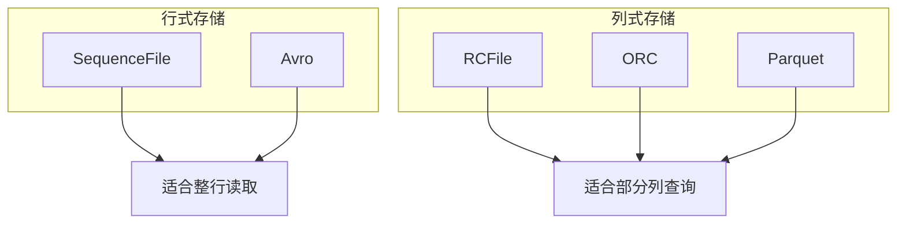

### 4. 压缩算法推荐

| 算法   | 压缩率 | 速度 | 可分片       | 推荐场景       |
| ------ | ------ | ---- | ------------ | -------------- |
| Snappy | 中等   | 极快 | 否           | 与容器格式联用 |
| LZO    | 中等   | 快   | 是（需索引） | 纯文本文件     |
| Gzip   | 高     | 中等 | 否           | 与容器格式联用 |
| bzip2  | 最高   | 慢   | 是           | 归档场景       |

### 5. HDFS目录结构建议

```mermaid
graph TD
    A[/] --> B[/user/用户名]
    A --> C[/etl/组/应用/过程/]
    C --> D[input]
    C --> E[processing]
    C --> F[output]
    C --> G[bad]
    A --> H[/tmp]
    A --> I[/data/数据集]
    A --> J[/app/组/应用/版本/]
    A --> K[/metadata/]
```

### 6. HBase模式设计核心

**行键设计原则**：

1. 唯一性
2. 分布均匀（避免时间戳反模式）
3. 支持扫描
4. 尽量短（节省存储）
5. 可读性

**列簇设计**：

- 不同访问频率的列分属不同列簇
- 不同变化频率的列分属不同列簇
- 列名尽量短

**TTL（Time-To-Live）**：

- 基于时间戳自动清除过期数据
- 优于手动扫描删除

### 7. 经典金句/数据

> “Hadoop最强大的一个功能就是可以存储任何一种格式的数据。”

**推荐配置**：

- HDFS块大小：64MB或128MB
- 桶大小：HDFS块大小的若干倍
- Region大小：20GB（经验值）

---

## 第2章：Hadoop数据移动

### 1. 核心论点

**问题**：将数据从各种来源（RDBMS、日志、文件系统）导入/导出Hadoop时，需要考虑时效性、增量更新、访问模式、网络瓶颈等多个因素。

**观点**：通过合理选择采集工具（文件传输、Sqoop、Flume、Kafka），并根据数据特点（批量/流式、结构化/非结构化）设计采集架构，可以实现可靠、高效的数据移动。

### 2. 关键概念

| 概念                 | 解释                            |
| -------------------- | ------------------------------- |
| 数据采集时效性       | 从数据产生到可访问的时间间隔    |
| 增量更新             | 只采集新增/修改的数据，而非全量 |
| 被动推送 vs 主动请求 | 数据是主动拉取还是被动接收      |
| Sqoop                | RDBMS与Hadoop间的批量传输       |
| Flume                | 基于事件的流式数据采集          |
| Kafka                | 分布式发布-订阅消息系统         |

### 3. 时效性分类

| 类型       | 时间          | 推荐工具            |
| ---------- | ------------- | ------------------- |
| 大型批处理 | 15分钟-数小时 | 文件传输、Sqoop     |
| 小型批处理 | 2-15分钟      | Flume               |
| 近实时决策 | 2秒-2分钟     | Flume/Kafka         |
| 近实时事件 | 100毫秒-2秒   | Kafka + Storm/Spark |
| 实时       | <100毫秒      | 自定义C/C++         |

### 4. Sqoop架构

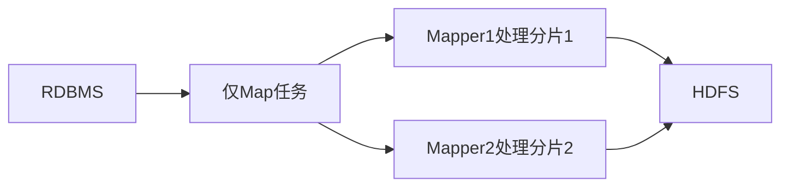

**Sqoop最佳实践**：

- 选择可分片的列（索引/分区键）
- 使用数据库专用连接器
- 从较少Mapper开始，逐步增加
- 使用公平调度器控制并行度

### 5. Flume架构

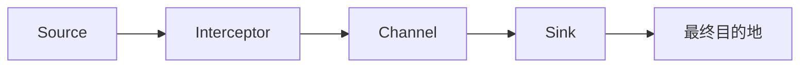

**Flume组件**：

- **Source**：数据入口（Avro、SpoolDir、HTTP、JMS）
- **Interceptor**：事件拦截处理（过滤、格式化）
- **Channel**：缓冲区（Memory、File、JDBC）
- **Sink**：数据出口（HDFS、HBase、Solr）

### 6. Kafka与Hadoop集成

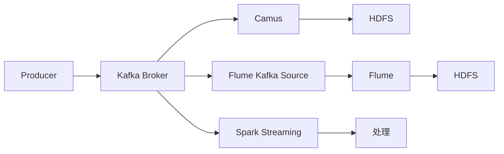

**Kafka特点**：

- 主题分区有序
- 支持至少一次/至多一次/仅一次语义
- 存储配置时长内的所有消息
- 支持消息重放

### 7. 经典金句/数据

> “Sqoop是一种数据抽取方法，用于从外部存储系统中提取数据。”

**Sqoop性能测试**（批量写入）：

| 批量大小 | 每秒Put次数 |
| -------- | ----------- |
| 1        | 3,180       |
| 10       | 5,820       |
| 100      | 38,400      |
| 1000     | 120,000     |

---

## 第3章：Hadoop数据处理

### 1. 核心论点

**问题**：Hadoop生态有众多数据处理框架（MapReduce、Spark、Hive、Impala、Pig等），如何根据场景选择合适的工具？

**观点**：MapReduce适合底层控制和批处理ETL；Spark适合迭代算法和内存计算；Hive适合SQL批处理查询；Impala适合低延迟交互式查询；Pig适合复杂ETL数据流。

### 2. 关键概念

| 概念             | 解释                            |
| ---------------- | ------------------------------- |
| MapReduce        | 基于Map和Reduce阶段的批处理框架 |
| Spark            | 基于RDD的内存计算框架           |
| Hive             | SQL-on-Hadoop，适合容错批处理   |
| Impala           | MPP SQL引擎，低延迟查询         |
| Pig              | 过程式数据流语言                |
| Crunch/Cascading | Java MapReduce抽象层            |

### 3. MapReduce核心组件

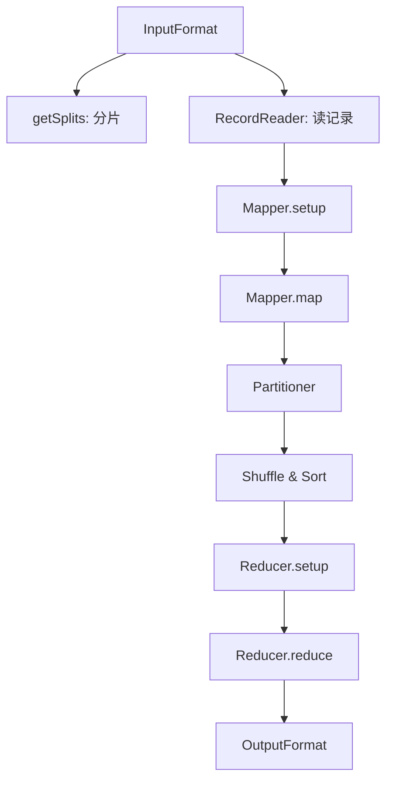

### 4. Spark vs MapReduce

| 维度     | MapReduce  | Spark         |
| -------- | ---------- | ------------- |
| 中间数据 | 写磁盘     | 内存缓存      |
| 启动时间 | 10-30秒    | 更快          |
| 迭代算法 | 低效       | 高效          |
| 编程模型 | Map+Reduce | 丰富转换+动作 |
| 容错     | 任务重试   | RDD血缘重建   |

### 5. 工具选择决策树

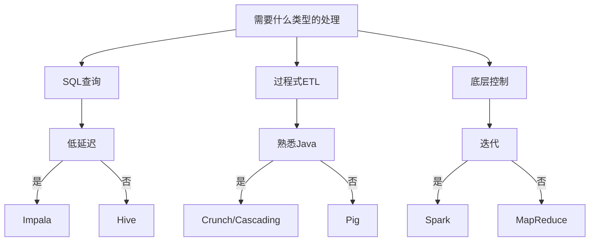

### 6. Impala设计特点

- 无共享架构，MPP设计
- 长期运行的后台服务（无启动开销）
- 使用C++实现（无GC延迟）
- 支持LLVM编译查询优化
- 复用Hive元数据服务

### 7. 经典金句/数据

> “MapReduce的代码通常会有很多bug，维护成本较高。”

**Impala关联策略**：

- 广播式关联：小表广播到所有节点
- 分区后散列关联：两表均分区，适合大表关联

---

## 第4章：Hadoop数据处理通用范式

### 1. 核心论点

**问题**：Hadoop上有一些常见的数据处理任务（去重、开窗分析、时间序列更新），如何高效实现？

**观点**：通过Spark和SQL两种方式实现这三种范式，可以根据团队技能和场景选择合适工具。Spark适合复杂逻辑和灵活控制，SQL适合简洁表达和快速开发。

### 2. 三种范式

| 范式         | 问题                            | 解决方案                   |
| ------------ | ------------------------------- | -------------------------- |
| 依主键去重   | 数据采集可能产生重复            | reduceByKey + 保留最新记录 |
| 数据开窗分析 | 需要前后文判断高峰/低谷         | 排序 + 前后记录比较        |
| 时间序列更新 | 记录随时间变化（生效/失效时间） | 分区 + 合并操作            |

### 3. 去重（Spark实现）

```scala
val keyValueRDD = dedupOriginalDataRDD.map(t => {
    val splits = t._2.toString.split(",")
    (splits(0), (splits(1), splits(2)))
})
val reducedRDD = keyValueRDD.reduceByKey((a, b) => 
    if (a._1.compareTo(b._1) > 0) a else b
)
```

### 4. 开窗分析（SQL实现）

```sql
SELECT PRIMARY_KEY, POSITION, EVENT_VALUE,
    CASE 
        WHEN EVENT_VALUE < LEAD_EVENT_VALUE AND EVENT_VALUE < LAG_EVENT_VALUE 
            THEN 'VALLEY'
        WHEN EVENT_VALUE > LEAD_EVENT_VALUE AND EVENT_VALUE > LAG_EVENT_VALUE 
            THEN 'PEAK'
        ELSE 'SLOPE'
    END AS POINT_TYPE
FROM (
    SELECT 
        LEAD(EVENT_VALUE) OVER(PARTITION BY PRIMARY_KEY ORDER BY POSITION) AS LEAD_EVENT_VALUE,
        LAG(EVENT_VALUE) OVER(PARTITION BY PRIMARY_KEY ORDER BY POSITION) AS LAG_EVENT_VALUE
    FROM PEAK_AND_VALLEY_TABLE
) A
```

### 5. 时间序列更新策略

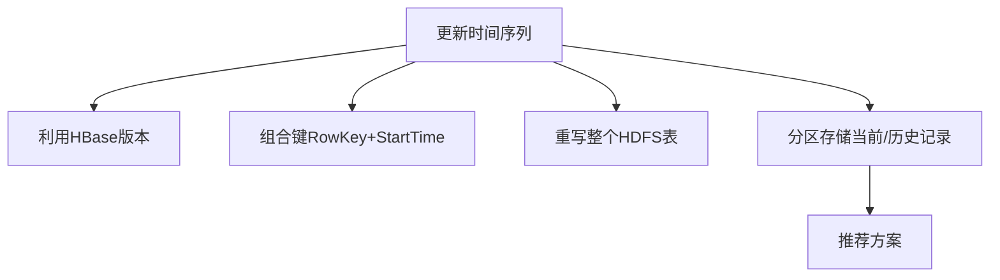

### 6. 时间序列更新（Spark实现）

```scala
// 自定义分区：按primaryKey分区，按primaryKey+startTime排序
val partitioner = new Partitioner {
    override def numPartitions: Int = numberOfPartitions
    override def getPartition(key: Any): Int = 
        Math.abs(key.asInstanceOf[TimeDataKey].uniqueId.hashCode() % numPartitions)
}

// 遍历每个primaryKey，更新endTime
val updatedEndedRecords = partedSortedRDD.mapPartitions(it => {
    var lastUniqueId = ""
    var lastRecord: (TimeDataKey, TimeDataValue) = null
    it.foreach(r => {
        if (!r._1.uniqueId.equals(lastUniqueId)) {
            if (lastRecord != null) results.+=(lastRecord)
            lastUniqueId = r._1.uniqueId
            lastRecord = null
        } else {
            if (lastRecord != null) lastRecord._2.endTime = r._1.startTime
        }
        lastRecord = r
    })
    results.iterator
})
```

### 7. 经典金句/数据

> “SQL在Hadoop平台上仍然是强大的数据处理和数据分析抽象。”

**关键结论**：

- Spark和SQL各有优势，不是替代关系
- 分区策略影响性能（分区大小应为HDFS块大小的若干倍）
- 时间序列更新推荐：HDFS分区存储 + 合并操作

---

## 第5章：Hadoop图处理

### 1. 核心论点

**问题**：MapReduce的“剥洋葱”式图处理需要多次遍历全图，磁盘I/O开销巨大。

**观点**：Giraph（Google Pregel的开源实现）和GraphX（Spark图处理库）通过BSP（块同步并行）模型，支持在分布式环境中高效处理大规模图数据。

### 2. 关键概念

| 概念   | 解释                                                     |
| ------ | -------------------------------------------------------- |
| 图     | 由顶点和边组成的数据结构                                 |
| BSP    | 块同步并行模型，superstep内可发消息，superstep结束时同步 |
| Pregel | Google的图处理框架，BSP模型的实现                        |
| Giraph | Pregel的开源实现                                         |
| GraphX | Spark的图处理组件                                        |

### 3. BSP模型流程

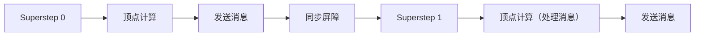

### 4. Giraph架构

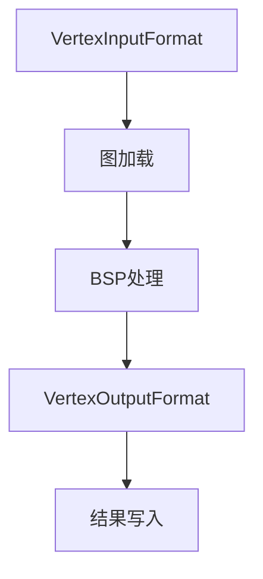

**Giraph核心组件**：

- **Vertex**：顶点ID + 顶点值 + 边列表
- **MasterCompute**：每个superstep开始时运行
- **WorkerContext**：superstep前后运行
- **Computation**：顶点计算逻辑
- **Aggregator**：跨顶点聚合（类似计数器）

### 5. Giraph代码示例（僵尸咬人）

```java
public void compute(Vertex<LongWritable, Text, LongWritable> vertex,
                    Iterable<LongWritable> messages) {
    if (getSuperstep() == 0) {
        if (vertex.getValue().toString().equals("Zombie")) {
            // 僵尸咬周围的人
            for (Edge<LongWritable, LongWritable> edge : vertex.getEdges()) {
                sendMessage(edge.getTargetVertexId(), newMessage);
            }
        }
    } else {
        // 处理咬人消息
        if (messages.iterator().hasNext()) {
            vertex.setValue(new Text("Zombie." + getSuperstep()));
            // 继续传播
        }
    }
}
```

### 6. GraphX实现对比

```scala
// GraphX仅需20行代码实现相同逻辑
val graphBites = graph.pregel(0L)(
    (id, dist, message) => {
        if (dist.equals("Zombie")) dist + "_" + message
        else if (message != 0) "Zombie_" + message
        else dist + "_" + message
    },
    triplet => {
        if (triplet.srcAttr.startsWith("Zombie") && triplet.dstAttr.startsWith("Human")) {
            Iterator((triplet.dstId, extractStep(triplet.srcAttr) + 1))
        } else Iterator.empty
    },
    (a, b) => math.min(a, b)
)
```

### 7. 工具选择建议

| 场景                     | 推荐工具 | 理由                      |
| ------------------------ | -------- | ------------------------- |
| 纯图处理，需要稳定方案   | Giraph   | 更成熟，支持万亿边        |
| 图处理是解决方案的一部分 | GraphX   | 与Spark无缝集成，代码灵活 |

### 8. 经典金句/数据

> “图数据处理与图数据查询是不同的概念。”

**关键数据**：

- Giraph宣称可处理一万亿条边
- GraphX是相对年轻的工具，但发展迅速

---

## 第6章：协调调度

### 1. 核心论点

**问题**：Hadoop应用通常包含多个数据处理步骤，手动调度容易出错且难以管理。

**观点**：Oozie作为Hadoop生态的工作流引擎，通过工作流（操作DAG）和协调器（时间/数据触发）的XML定义，可以实现复杂数据处理流程的自动化调度和管理。

### 2. 关键概念

| 概念      | 解释                     |
| --------- | ------------------------ |
| 工作流    | 操作的控制依赖DAG        |
| 协调器    | 基于时间或数据触发工作流 |
| Bundle    | 协调器的集合             |
| 扇入/扇出 | 工作流中的并行模式       |
| 分支决策  | 基于前操作结果选择路径   |

### 3. Oozie架构

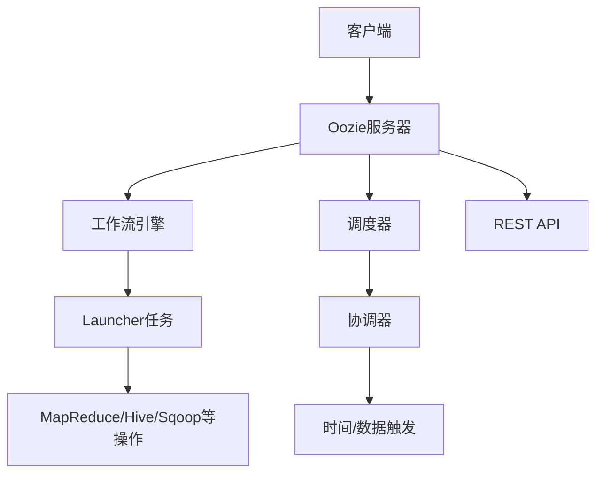

### 4. 工作流模式

**点对点式**：


**扇出式（Fork-Join）**：

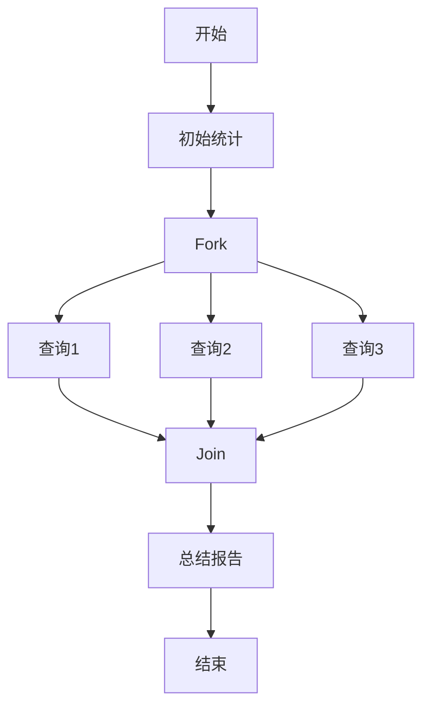

**分支决策式**：

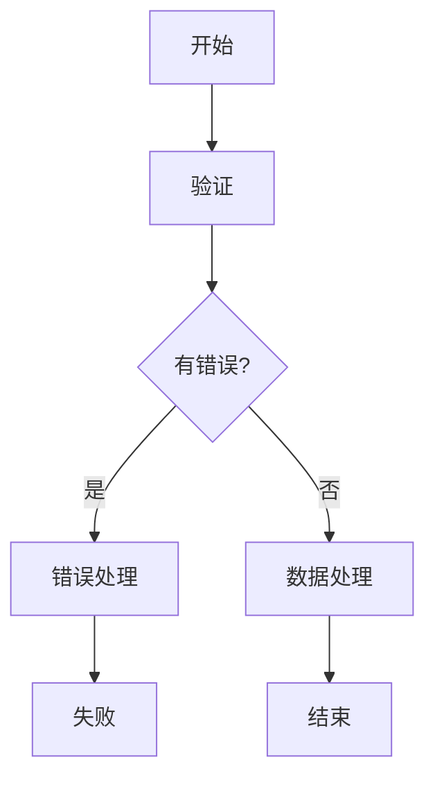

### 5. Oozie配置示例

```xml
<workflow-app name="aggregate_and_load">
    <start to="aggregate"/>
    <action name="aggregate">
        <hive>
            <script>populate_agg_table.sql</script>
        </hive>
        <ok to="sqoop_export"/>
        <error to="kill"/>
    </action>
    <action name="sqoop_export">
        <sqoop>
            <arg>export</arg>
            <arg>--connect</arg>
            <arg>jdbc:oracle:thin:@/orahost:1521/oracle</arg>
        </sqoop>
        <ok to="end"/>
        <error to="kill"/>
    </action>
    <kill name="kill">
        <message>Workflow failed</message>
    </kill>
    <end name="end"/>
</workflow-app>
```

### 6. 协调器配置

```xml
<coordinator-app name="hourly-aggregation" 
    frequency="${coord:minutes(60)}"
    start="2014-01-19T08:00Z"
    timezone="America/Los_Angeles">
    
    <dataset name="logs" frequency="${coord:days(1)}">
        <uri-template>hdfs:///app/logs/${YEAR}/${MONTH}/${DAY}</uri-template>
        <done-flag>_DONE</done-flag>
    </dataset>
    
    <input-events>
        <data-in name="input" dataset="logs">
            <instance>${coord:current(-1)}</instance>
        </data-in>
    </input-events>
    
    <action>
        <workflow>
            <app-path>${workflowRoot}/process.xml</app-path>
        </workflow>
    </action>
</coordinator-app>
```

### 7. 经典金句/数据

> “工作流协调调度是应用框架中很重要的一部分，但是经常被忽略。”

**Oozie vs Azkaban**：

| 维度       | Oozie                | Azkaban    |
| ---------- | -------------------- | ---------- |
| 工作流定义 | XML                  | .job文件   |
| 可伸缩性   | 更好（Launcher任务） | 一般       |
| UI         | 通过Hue              | 内置Web UI |
| 调度       | 时间+数据触发        | 时间触发   |

---

## 第7章：Hadoop近实时处理

### 1. 核心论点

**问题**：MapReduce批处理无法满足实时/近实时数据处理需求（秒级到毫秒级延迟）。

**观点**：Storm提供纯流处理（低延迟、逐事件处理），Spark Streaming提供微批处理（高吞吐、容错好），Trident是Storm上的微批抽象。选择取决于延迟要求、容错需求和开发复杂度。

### 2. 关键概念

| 概念            | 解释                              |
| --------------- | --------------------------------- |
| 近实时(NRT)     | 几秒到几百毫秒的数据处理          |
| 流处理          | 持续处理到来的数据，直到应用停止  |
| Microbatch      | 将事件分组为小批次处理            |
| Storm拓扑       | 计算图，节点是spout/bolt          |
| Trident         | Storm上的高层抽象，支持仅一次语义 |
| Spark Streaming | 基于DStream的微批处理框架         |

### 3. 流处理 vs 微批处理

| 维度       | 流处理(Storm) | 微批处理(Spark Streaming) |
| ---------- | ------------- | ------------------------- |
| 延迟       | 毫秒级        | 秒级（2-5秒）             |
| 吞吐量     | 较低          | 较高                      |
| 容错       | at-least-once | exactly-once              |
| 状态管理   | 需外部存储    | 内置支持                  |
| 开发复杂度 | 较高          | 较低                      |

### 4. Storm架构

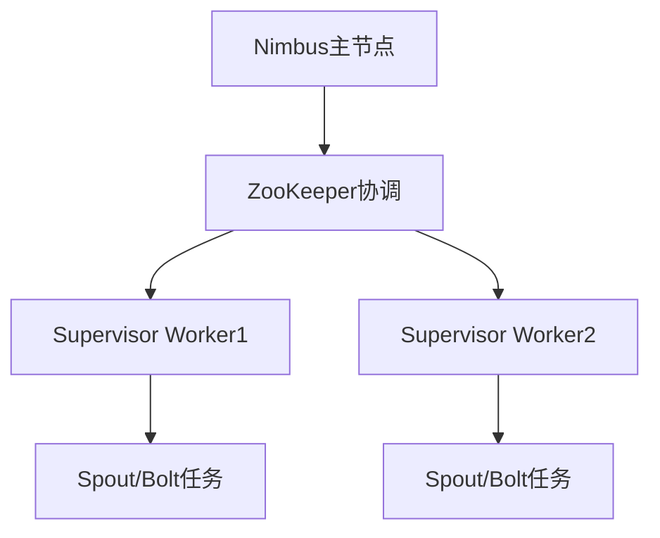

**Storm核心组件**：

- **Spout**：数据流来源
- **Bolt**：数据处理单元
- **元组**：数据模型（有序字段列表）
- **数据流**：元组序列
- **分组**：Shuffle、Field、All、Global

### 5. Storm示例（简单移动平均）

```java
// Spout: 数据源
public class StockTicksSpout extends BaseRichSpout {
    public void nextTuple() {
        for (String tick : ticks) {
            outputCollector.emit(new Values(tick), tick);
        }
    }
}

// Bolt: 解析
public class ParseTicksBolt extends BaseRichBolt {
    public void execute(Tuple tuple) {
        String tick = tuple.getStringByField("tick");
        String[] parts = tick.split(",");
        outputCollector.emit(new Values(parts[0], parts[4]));
        outputCollector.ack(tuple);
    }
}

// 拓扑定义
TopologyBuilder builder = new TopologyBuilder();
builder.setSpout("spout", new StockTicksSpout());
builder.setBolt("parse", new ParseTicksBolt())
       .shuffleGrouping("spout");
builder.setBolt("avg", new CalcMovingAvgBolt(), 2)
       .fieldsGrouping("parse", new Fields("ticker"));
```

### 6. Spark Streaming示例

```scala
val ssc = new StreamingContext(sc, Seconds(1))

// 创建DStream
val rawStream = ssc.socketTextStream(host, port)

// 转换（延迟执行）
val words = rawStream.flatMap(_.split(" "))
val pairs = words.map(word => (word, 1))

// 有状态处理
val stateStream = pairs.updateStateByKey((seq, opt) => {
    var sum = opt.getOrElse(0L)
    seq.foreach(sum += _)
    Some(sum)
})

// 窗口函数
val windowCount = words.countByValueAndWindow(Seconds(20), Seconds(6))

// 动作（触发执行）
stateStream.print()

ssc.start()
```

### 7. 工具选择矩阵

| 需求                                 | 推荐工具             |
| ------------------------------------ | -------------------- |
| 低延迟（<500ms）数据扩充、验证、报警 | Flume拦截器          |
| 低延迟（<500ms）聚合、窗口           | Storm                |
| 高吞吐、可接受秒级延迟、需容错       | Spark Streaming      |
| 复杂数据流（包含多种处理）           | Spark Streaming      |
| 需与HDFS深度集成                     | Flume + 相应处理引擎 |

### 8. 经典金句/数据

> “Hadoop现在能够作为一个持续处理数据的平台。”

**批量写入性能对比**：

| 批量大小 | 每秒Put次数 |
| -------- | ----------- |
| 1        | 3,180       |
| 1000     | 120,000     |

---

## 第二部分：案例研究

---

## 第8章：点击流分析

### 1. 核心论点

**问题**：网站日志数据量大（日增数GB）、半结构化、需要及时分析用户行为。

**观点**：通过Flume采集点击日志到HDFS，使用Spark/Hive进行数据清洗、去重、会话生成，最终通过Impala进行SQL分析，可以高效回答PV、UV、跳出率、转化率等业务问题。

### 2. 架构设计

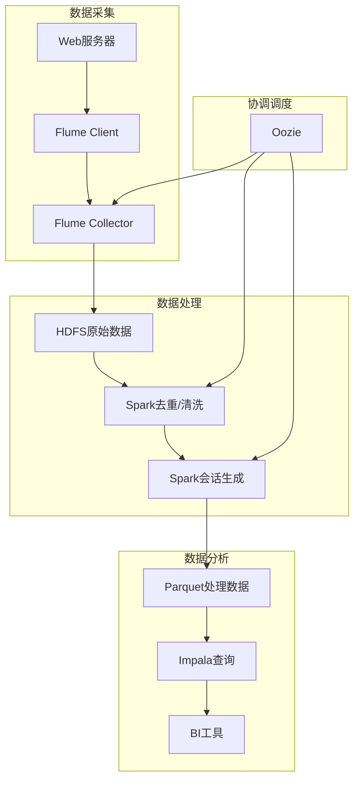

### 3. 数据采集细节

**客户端层**：

```properties
client.sources.r1.type = spooldir
client.sources.r1.spoolDir = /opt/weblogs
client.sources.r1.interceptors.i1.type = timestamp
client.sinks.k1.type = avro
client.sinks.k1.hostname = collector1
```

**收集器层**：

```properties
collector.sources.r1.type = avro
collector.sources.r1.port = 4141
collector.sinks.k1.type = hdfs
collector.sinks.k1.hdfs.path = /Weblogs/combined/%Y/%m/%d
collector.sinks.k1.hdfs.fileType = DataStream
```

### 4. 会话生成算法

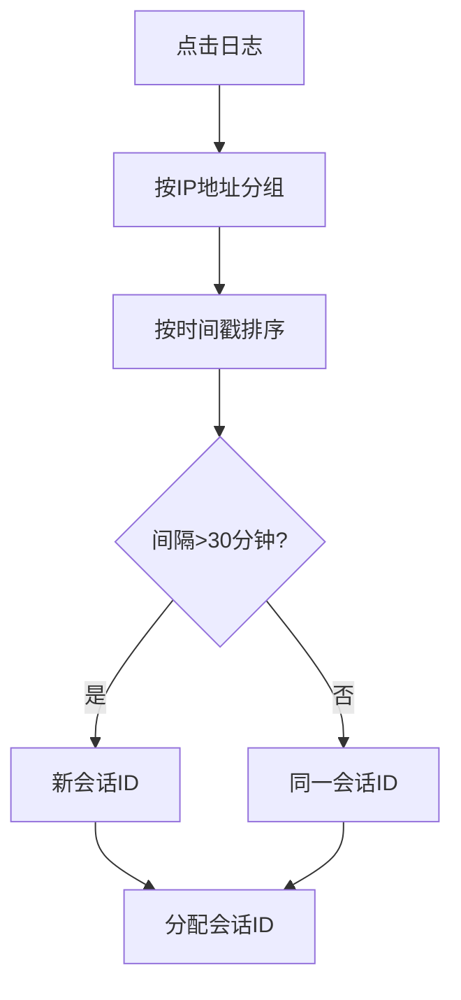

### 5. 关键查询示例

**平均会话时长**：

```sql
SELECT AVG(session_length)/60 avg_minutes
FROM (
    SELECT MAX(ts) - MIN(ts) session_length
    FROM apache_log_parquet
    GROUP BY session_id
) t
```

**跳出率**：

```sql
SELECT (SUM(CASE WHEN count!=1 THEN 0 ELSE 1 END))*100/COUNT(*) bounce_rate
FROM (
    SELECT session_id, COUNT(*) count
    FROM apache_log_parquet
    GROUP BY session_id
) t
```

### 6. Oozie协调器

```xml
<coordinator-app name="prepare-clickstream" frequency="${coord:days(1)}">
    <datasets>
        <dataset name="rawlogs" frequency="${coord:days(1)}">
            <uri-template>/etl/rawlogs/year=${YEAR}/month=${MONTH}/day=${DAY}</uri-template>
            <done-flag></done-flag>
        </dataset>
    </datasets>
    <input-events>
        <data-in name="readyIndicator" dataset="rawlogs">
            <instance>${coord:current(1)}</instance>
        </data-in>
    </input-events>
    <action>
        <workflow>
            <app-path>${workflowRoot}/processing.xml</app-path>
        </workflow>
    </action>
</coordinator-app>
```

### 7. 经典金句/数据

> “点击流分析通常分析用户浏览网站产生的事件。”

**关键数据**：

- 活跃站点日增日志：数GB
- 会话超时阈值：30分钟
- 分区建议：平均大小至少是HDFS块大小的若干倍（如1GB）

---

## 第9章：欺诈检测

### 1. 核心论点

**问题**：欺诈检测需要毫秒级响应（快速反应）和PB级数据分析（背景学习），单系统难以兼顾。

**观点**：通过分层架构——客户端（HBase画像存储+缓存）处理实时决策，Flume/Kafka采集事件，Spark Streaming进行近实时分析，HDFS/Spark进行批量探索性分析——可以实现高可用、可扩展的欺诈检测系统。

### 2. 架构设计

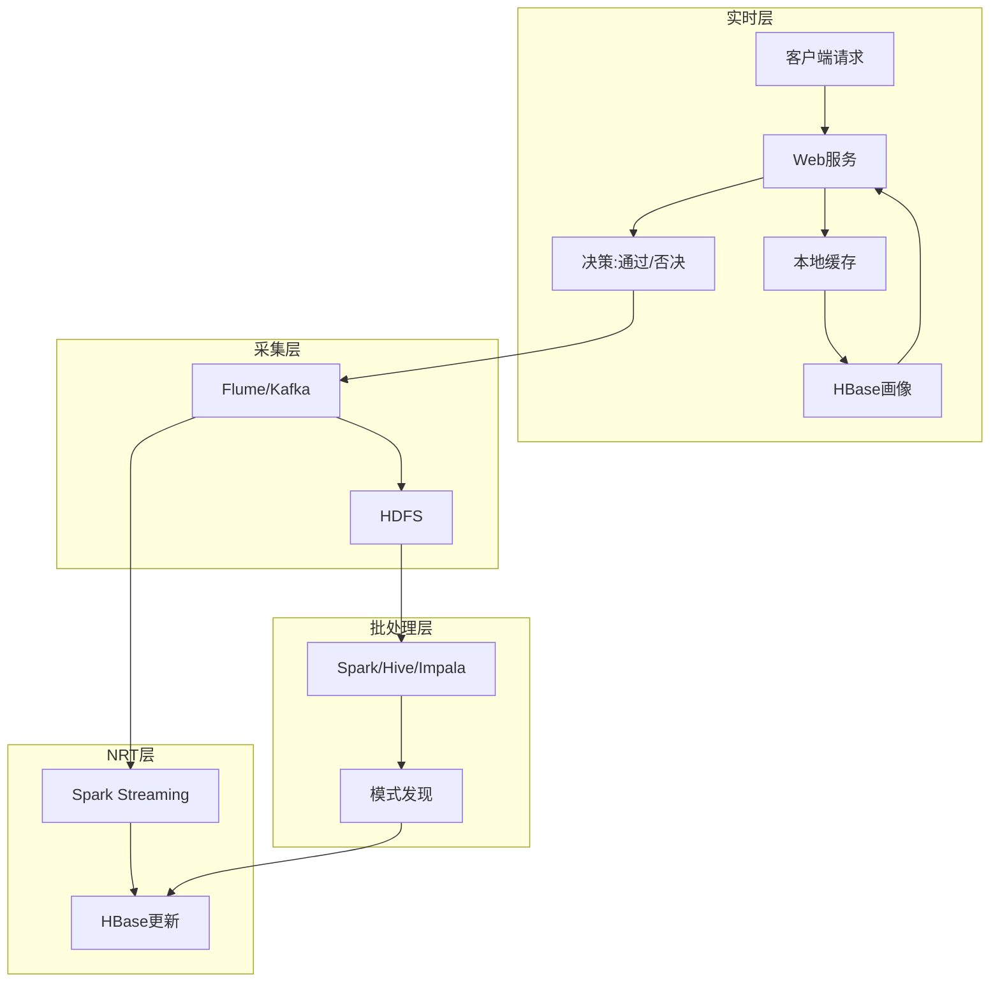

### 3. HBase数据模型

**画像字段分类**：

- 几乎不变：username、age、firstLogIn
- 频繁变化：lastLogIn、lastLogInIpAddress
- 计数器：logInCount、totalSells、totalPurchases
- 历史信息：last20LogOnIpAddresses

**HBase操作**：

```java
// 获取画像
Get get = new Get(rowKey);
Result result = table.get(get);

// 更新画像（Check-and-Put保证原子性）
Put put = new Put(rowKey);
put.add("profile", "json", Bytes.toBytes(json));
table.checkAndPut(rowKey, "profile", "timestamp", 
                   Bytes.toBytes(previousTimestamp), put);
```

### 4. 客户端缓存策略

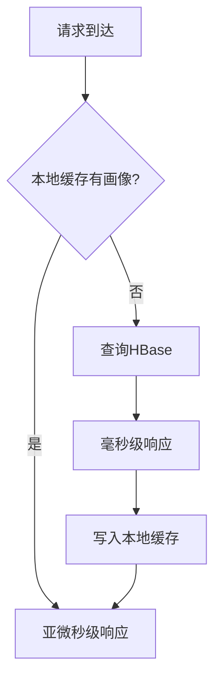

### 5. 近实时处理

**窗口分析**：检测全局模式（如新iPhone发布日的异常购买）


### 6. 探索性分析

**机器学习方法**：

- 监督学习：SVM、贝叶斯网络（标记欺诈交易）
- 无监督学习：K-means聚类（发现相似行为簇）

### 7. 架构对比

| 架构           | 优点           | 缺点             |
| -------------- | -------------- | ---------------- |
| Flume拦截器    | 低延迟，解耦   | 结果难返回请求者 |
| Kafka+Storm    | 可扩展，可靠   | 增加复杂度       |
| 业务规则引擎   | 模型可独立更新 | 额外组件         |
| 本方案（分层） | 综合优势       | 实现复杂         |

### 8. 经典金句/数据

> “欺诈检测系统的核心在于区分正常行为与异常行为，并据此采取行动。”

**关键指标**：

- 实时决策延迟：毫秒级
- HBase BlockCache：将热数据保留内存
- 版本数配置：至少20（保存历史）

---

## 第10章：数据仓库

### 1. 核心论点

**问题**：传统EDW面临成本高昂、扩展性差、灵活性不足等挑战，如何用Hadoop增强？

**观点**：通过将ELT处理迁移到Hadoop、用HDFS在线归档历史数据、支持探索性分析，Hadoop可以成为EDW的理想补充方案，缓解EDW压力、降低存储成本、释放数据价值。

### 2. 传统EDW挑战

| 挑战     | 描述                       |
| -------- | -------------------------- |
| 失信SLA  | 数据量增长导致处理时间延长 |
| 资源竞争 | ETL与用户查询争抢资源      |
| 高昂成本 | 扩容和软件许可费用高       |
| 灵活性差 | 难以响应需求变更           |

### 3. Hadoop增强方案

```mermaid
graph TD
    subgraph 传统部分
        A[OLTP] --> B[ETL工具]
        B --> C[EDW]
        C --> D[BI工具]
    end
    subgraph Hadoop部分
        A --> E[Sqoop]
        E --> F[Hadoop]
        F --> G[Hive/Impala]
        G --> D
        F --> C[数据归档]
    end
```

### 4. 数据建模

**OLTP vs Hadoop数据模型**：

| 维度     | OLTP            | Hadoop                   |
| -------- | --------------- | ------------------------ |
| 规范化   | 高度规范（3NF） | 反规范（星型）           |
| 更新     | 原地更新        | 追加+合并                |
| 历史     | 不保留          | 保留历史（user_history） |
| 存储格式 | 行存储          | Parquet/Avro             |

**MovieLens案例表结构**：

```mermaid
graph TD
    subgraph 维表
        A[movie: Parquet, 不分区]
        B[user: Parquet, 不分区]
        C[user_history: Avro, 按天分区]
    end
    subgraph 事实表
        D[user_rating: Parquet, 按天分区]
        E[user_rating_fact: Avro, 按天分区]
    end
```

### 5. 数据采集（Sqoop）

**全量导入（movie表）**：

```bash
sqoop import --query 'SELECT movie.*, group_concat(genre.name)
    FROM movie JOIN movie_genre ON ... JOIN genre ON ...
    WHERE ${CONDITIONS} GROUP BY movie.id'
    --as-avrodatafile --target-dir /data/movielens/movie
```

**增量导入（user_rating_fact）**：

```bash
sqoop job --create user_rating_import \
    -- import --table user_rating \
    --incremental lastmodified --check-column timestamp \
    --as-parquetfile --hive-import
```

### 6. 数据合并（User表）

```mermaid
graph LR
    A[user旧表] --> C[JOIN]
    B[user_upserts增量] --> C
    C --> D[合并结果]
    D --> E[user_tmp临时表]
    E --> F[原子性替换user表]
```

### 7. Oozie工作流

```mermaid
graph TD
    A[开始] --> B[Sqoop导入movies]
    A --> C[Sqoop导入users增量]
    A --> D[Sqoop导入ratings增量]
    B --> E[合并user表]
    C --> E
    E --> F[聚合movie_rating]
    D --> G[合并rating表]
    G --> F
    F --> H[Sqoop导出到EDW]
    H --> I[结束]
```

### 8. 经典金句/数据

> “使用Hadoop作为EDW的补充，可以缓解EDW压力、降低存储成本、释放数据价值。”

**Hadoop数据仓库优势**：

- 存储成本：商用硬件，远低于专有EDW
- 灵活性：Schema-on-Read，支持模式演进
- 归档：在线归档，数据仍可查询
- 探索性分析：沙盒环境，不影响生产

---

## 全书总结

《Hadoop应用架构》是一部系统讲解Hadoop生态系统集成与应用的实践指南。全书核心脉络如下：

**第一部分：架构设计要素**

1. **数据建模**：文件格式（Avro/Parquet）、压缩算法、HDFS/HBase模式设计
2. **数据移动**：Sqoop（批量）、Flume（流式）、Kafka（消息）
3. **数据处理**：MapReduce、Spark、Hive、Impala、Pig的选择与使用
4. **通用范式**：去重、开窗、时间序列更新的实现
5. **图处理**：Giraph和GraphX的BSP模型
6. **协调调度**：Oozie工作流和协调器
7. **近实时处理**：Storm、Trident、Spark Streaming

**第二部分：完整案例研究**

1. **点击流分析**：Flume采集 → Spark清洗/会话生成 → Impala分析
2. **欺诈检测**：HBase画像 → 实时决策 → Kafka/Flume采集 → 批处理学习
3. **数据仓库**：Sqoop导入 → Hadoop ELT → 合并/聚合 → Sqoop导出

**核心方法论**：

- 没有“银弹”工具，需要根据场景选择
- 架构设计需平衡性能、可靠性、成本和复杂度
- 数据湖泊 + 数据仓库的混合架构是最佳实践
- 工作流自动化是生产级应用的必备组件


