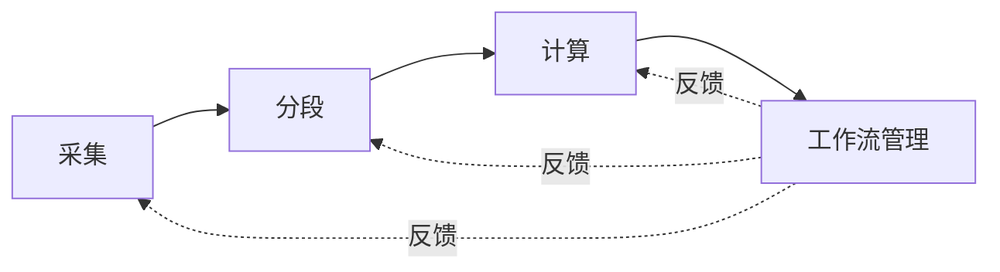
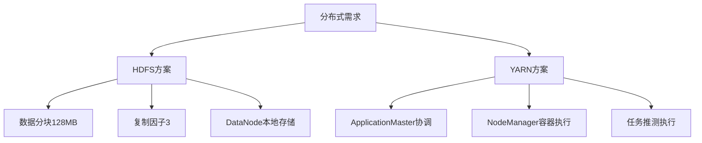
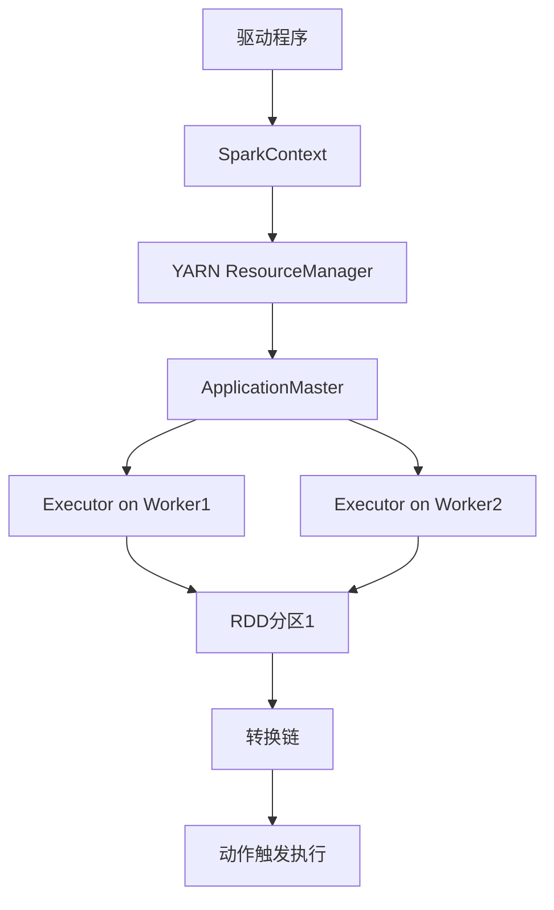
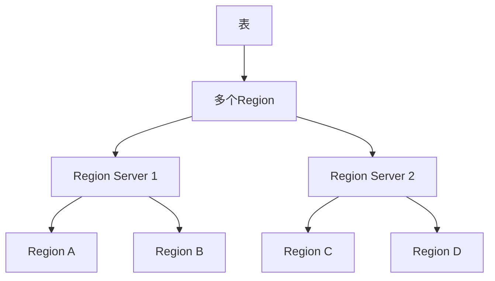
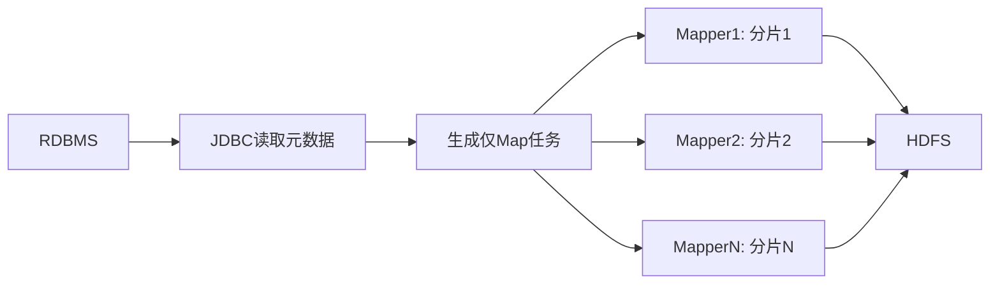
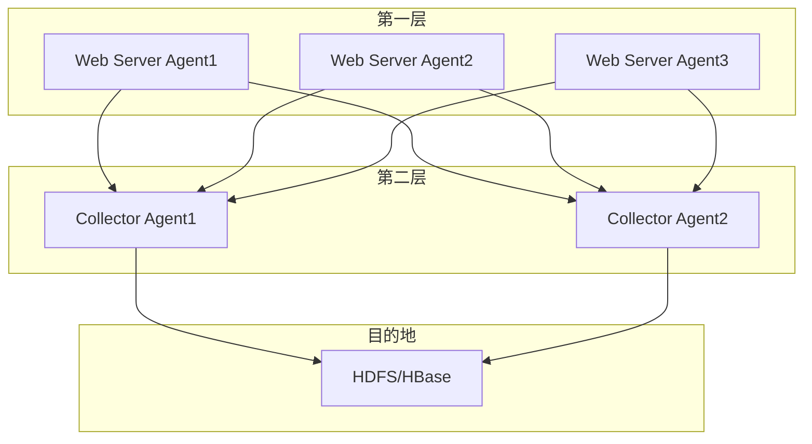
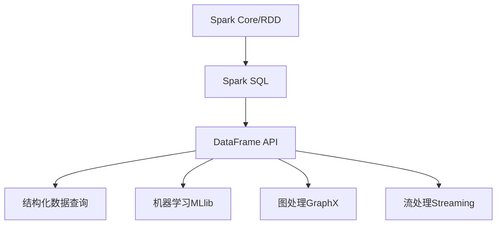
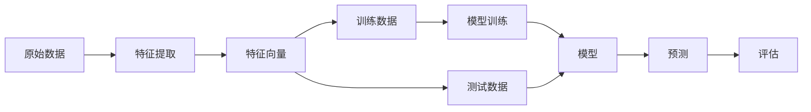
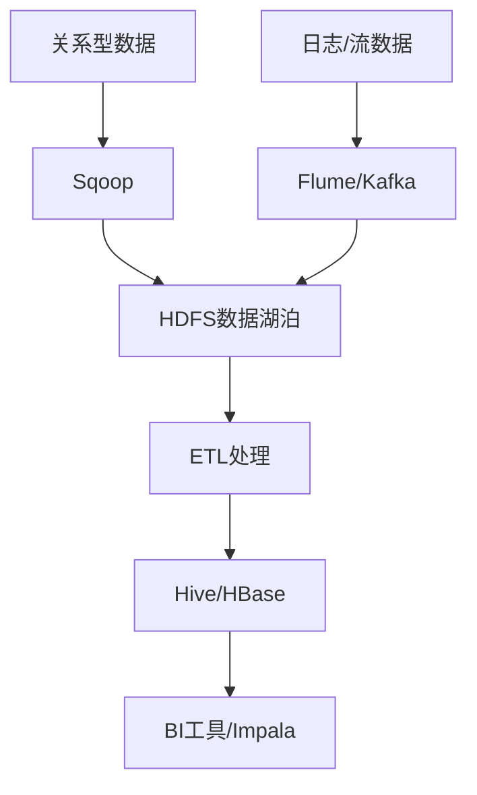
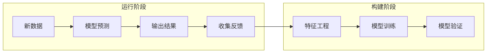

# 《Hadoop数据分析》章节总结

## 书籍信息

- 书名：《Hadoop数据分析》
- 作者：[美] Benjamin Bengfort, Jenny Kim
- PDF 状态：完整
- OCR 状态：良好，文本可识别

## 目录说明

- 目录识别情况：完整识别，共10章正文+附录
- 章节对应依据：按原书目录顺序逐章整理
- OCR 修复说明：无重大修复需求

## 全书核心主题

本书从数据科学家的视角系统介绍Hadoop分布式计算和分析。全书分为两大部分：第一部分介绍分布式计算的核心概念（HDFS、YARN、MapReduce、Spark），第二部分深入讲解数据科学家常用的工具和工作流（Hive、HBase、Sqoop、Flume、Pig、Spark SQL、MLlib）。核心观点是：Hadoop已经从集群计算的抽象演变为大数据操作系统，而数据科学家需要从根本上转变从串行到并行的思维方式，才能真正发挥大数据分析的潜力。

---

## 第1章：数据产品时代

### 1. 核心论点

**问题**：传统数据科学流水线（采集→整理→建模→报告）是人力驱动的单向流程，无法构建自适应的数据产品。

**观点**：数据产品是从数据中获取价值并产生新数据的经济引擎，需要采用包含采集、分段、计算、工作流管理四个阶段的迭代模型，结合Hadoop实现可扩展的自动化解决方案。

### 2. 关键概念

| 概念           | 解释                                                 |
| -------------- | ---------------------------------------------------- |
| 数据产品       | 数据与统计算法的结合，从数据获取价值，再产生更多数据 |
| 数据科学流水线 | 采集→整理→建模→报告/可视化的线性分析流程             |
| 大数据工作流   | 采集→分段→计算→工作流管理的迭代模型                  |
| Lambda架构     | 同时支持批处理和流处理的数据处理架构                 |

### 3. 逻辑推演

**数据产品定义演进**：

1. 简单定义：数据+算法 = 应用程序
2. 进阶定义：从数据获取价值，再创造更多数据（Mike Loukides）
3. 完整定义：自适应、广泛适用，从数据中学习，影响人类行为

**大数据工作流四阶段**：



### 4. 经典案例

| 案例                  | 数据量                | 成果                       |
| --------------------- | --------------------- | -------------------------- |
| Lady Gaga BornThisWay | 1.3万亿条社交媒体信息 | LittleMonsters.com社交网络 |
| ShotSpotter声学传感器 | 实时脉冲声检测        | 预测枪击事件位置           |
| HAT个性化数据集合     | 个人传感器数据        | 解决数据所有权问题         |

### 5. 经典金句/数据

> “数据科学家（名词）：指比所有软件工程师更擅长统计学，并且比所有统计学家更擅长软件工程的人。” —— Josh Wills

> “大数据世界正在兴起。” —— 《经济学人》，2011年9月

**预测数据**：到2020年，每年生成和复制的数据将达到44ZB（44万亿GB）

---

## 第2章：大数据操作系统

### 1. 核心论点

**问题**：分布式系统必须满足容错性、可恢复性、一致性、可扩展性四项基本要求，如何通过Hadoop实现这些要求？

**观点**：HDFS和YARN共同构成大数据操作系统，通过数据本地计算、数据块复制、任务容错等机制，实现了在廉价商用硬件上的可靠分布式存储和计算。

### 2. 关键概念

| 概念            | 解释                                          |
| --------------- | --------------------------------------------- |
| HDFS            | Hadoop分布式文件系统，管理集群磁盘上的数据    |
| YARN            | 集群资源管理器，分配计算资源给应用程序        |
| NameNode        | HDFS master服务，存储文件元数据和位置信息     |
| DataNode        | HDFS worker服务，存储和管理本地磁盘上的数据块 |
| ResourceManager | YARN master服务，分配和监视集群资源           |
| NodeManager     | YARN worker服务，运行和管理处理任务           |

### 3. 逻辑推演

**分布式系统四要求**：

- 容错性 → 组件失败不影响整体
- 可恢复性 → 故障时不丢失数据
- 一致性 → 任务失败不影响最终结果
- 可扩展性 → 负载增加导致性能下降而非故障

**Hadoop实现机制**：



**集群节点类型**：

- Master节点：NameNode、Secondary NameNode、ResourceManager
- Worker节点：DataNode、NodeManager

### 4. 基本命令示例

| 命令                                           | 功能              |
| ---------------------------------------------- | ----------------- |
| `hadoop fs -copyFromLocal <src> <dst>`         | 复制文件到HDFS    |
| `hadoop fs -ls`                                | 列出HDFS目录      |
| `hadoop fs -cat <file> \| less`                | 查看HDFS文件内容  |
| `hadoop jar wc.jar WordCount <input> <output>` | 提交MapReduce作业 |
| `hadoop job -kill <jobID>`                     | 终止运行中的作业  |

### 5. 经典金句/数据

> “Hadoop已经演变成了包含各种工具的生态系统。”

**关键数据**：

- HDFS默认块大小：128MB
- 默认复制因子：3
- NameNode Web UI端口：50070
- ResourceManager Web UI端口：8088

---

## 第3章：Python框架和Hadoop Streaming

### 1. 核心论点

**问题**：MapReduce的Java API对数据科学家不友好，如何用Python等语言编写MapReduce作业？

**观点**：Hadoop Streaming通过标准Unix流（stdin/stdout）让任何可执行程序作为mapper/reducer，配合Python的微框架，可以高效地开发大规模数据分析作业。

### 2. 关键概念

| 概念             | 解释                                                  |
| ---------------- | ----------------------------------------------------- |
| Hadoop Streaming | 将可执行程序指定为mapper/reducer的实用程序            |
| 微框架           | 封装Streaming细节的Python基类，支持Mapper/Reducer抽象 |
| Combiner         | 在Mapper端进行局部reduce，减少网络流量                |
| Partitioner      | 控制如何将键空间划分给不同的reducer                   |
| 作业链           | 多个MapReduce作业串联完成复杂算法                     |

### 3. 核心代码模式

**Mapper模板**：

```python
#!/usr/bin/env python
import sys
for line in sys.stdin:
    for word in line.split():
        sys.stdout.write(f"{word}\t1\n")
```

**Reducer模板**：

```python
#!/usr/bin/env python
import sys
cur_key = None
total = 0
for line in sys.stdin:
    key, val = line.split("\t")
    if key == cur_key:
        total += int(val)
    else:
        if cur_key:
            sys.stdout.write(f"{cur_key}\t{total}\n")
        cur_key = key
        total = int(val)
```

### 4. 逻辑推演

**Streaming数据流**：


**Combiner作用**：

- 问题：Mapper产生大量中间数据，网络传输成为瓶颈
- 解决：在Mapper端局部reduce，减少shuffle数据量
- 条件：运算必须满足交换律和结合律

**Partitioner作用**：

- 默认：HashPartitioner（键散列值 % reducer数）
- 自定义：解决数据倾斜、实现特定分区逻辑

### 5. 常用框架对比

| 框架         | 特点                          |
| ------------ | ----------------------------- |
| mrjob (Yelp) | 支持本地/EMR/Hadoop，单个文件 |
| dumbo        | 封装Streaming，使用TypedBytes |
| pydoop       | 封装Hadoop Pipes（C++ API）   |
| hadoopy      | Cython封装Streaming           |

### 6. 经典金句/数据

> “许多机器学习算法特别是有监督学习，都基于优化技术，这些优化技术是迭代的。”

**测试命令**：

```bash
cat input.csv | ./mapper.py | sort | ./reducer.py
```

---

## 第4章：Spark内存计算

### 1. 核心论点

**问题**：MapReduce的批处理模型不适合迭代算法和交互式查询，中间数据写回磁盘导致高昂I/O成本。

**观点**：Spark通过弹性分布式数据集（RDD）在内存中缓存数据，结合DAG执行引擎，比MapReduce快10-20倍，适合迭代式机器学习和交互式数据分析。

### 2. 关键概念

| 概念                 | 解释                                       |
| -------------------- | ------------------------------------------ |
| RDD                  | 弹性分布式数据集，分区的只读对象集合       |
| 转换(Transformation) | 创建新RDD的操作（如map、filter），延迟执行 |
| 动作(Action)         | 触发实际计算的操作（如reduce、collect）    |
| DAG                  | 有向无环图，描述数据流步骤                 |
| 广播变量             | 分发到所有worker的只读数据                 |
| 累加器               | worker可更新的共享变量（仅加法）           |

### 3. 核心代码模式

**SparkContext初始化**：

```python
from pyspark import SparkConf, SparkContext
conf = SparkConf().setAppName("MyApp")
sc = SparkContext(conf=conf)
```

**RDD操作示例**：

```python
# 创建RDD
text = sc.textFile("shakespeare.txt")
# 转换（延迟执行）
words = text.flatMap(lambda line: line.split())
pairs = words.map(lambda word: (word, 1))
counts = pairs.reduceByKey(lambda a, b: a + b)
# 动作（触发计算）
counts.saveAsTextFile("wc")
```

### 4. 逻辑推演

**MapReduce vs Spark 对比**：

| 维度         | MapReduce           | Spark                 |
| ------------ | ------------------- | --------------------- |
| 中间数据存储 | 磁盘（HDFS）        | 内存（RDD）           |
| 迭代算法     | 低效（多次磁盘I/O） | 高效（内存缓存）      |
| 编程模型     | Map+Reduce          | 丰富转换+动作         |
| 交互式分析   | 不支持              | 支持（PySpark shell） |
| DAG优化      | 无                  | 有                    |

**Spark执行机制**：



### 5. 航班延误分析示例

```python
# 广播查找表
airlines = dict(sc.textFile("airlines.csv").map(split).collect())
airline_lookup = sc.broadcast(airlines)

# 处理航班数据
flights = sc.textFile("flights.csv").map(split).map(parse)
delays = flights.map(lambda f: (airline_lookup.value[f.airline], 
                                 f.dep_delay + f.arv_delay))
delays = delays.reduceByKey(add).collect()
```

### 6. 经典金句/数据

> “Spark正迅速成为数据科学平台的首选。”

**执行模式**：

- `yarn-client`：驱动程序在客户端进程，适合交互式
- `yarn-cluster`：驱动程序在ApplicationMaster，适合长时间作业

---

## 第5章：分布式分析和模式

### 1. 核心论点

**问题**：许多算法不能轻易转换为有向无环图，如何在分布式环境中进行高级数据分析？

**观点**：通过键计算、概要、索引、过滤等设计模式，将大数据集分解为可放入单机内存的“最后一英里”数据，然后在串行环境中进行分析验证。

### 2. 关键概念

| 概念           | 解释                                    |
| -------------- | --------------------------------------- |
| 复合键         | 在多个维度上划分键空间或携带特定信息    |
| pair vs stripe | 矩阵计算的两种分布式方法                |
| 概要           | 通过聚合、分组、统计度量描述数据集      |
| TF-IDF         | 词频-逆文档频率，衡量词条对文档的重要性 |
| 倒排索引       | 从索引项到文档位置的映射                |
| 布隆过滤器     | 紧凑的概率型数据结构，用于集合成员测试  |

### 3. 核心公式

**TF-IDF**：

```
w_{i,j} = tf_{i,j} × log(N / df_i)
```

- tf：词条在文档中的出现频率
- N：语料库文档总数
- df：包含该词条的文档数

**Pearson相关系数**：

```
r = Σ(x_i - x̄)(y_i - ȳ) / (√Σ(x_i - x̄)² × √Σ(y_i - ȳ)²)
```

### 4. 逻辑推演

**最后一英里计算策略**：


**设计模式分类**：

| 类别     | 操作             | 示例                        |
| -------- | ---------------- | --------------------------- |
| 概要     | 聚合、索引、分组 | 统计描述、TF-IDF            |
| 过滤     | 子集、抽样、谓词 | top N、蓄水库抽样、布隆过滤 |
| 数据组织 | 重组、分区       | 复合键、pair/stripe         |
| 连接     | 多源合并         | Map端连接、Reduce端连接     |

**Top N实现**：

- 每个mapper输出本地top N
- reducer从所有mapper输出中选全局top N
- 使用堆(heap)维护，内存高效

**蓄水库抽样**：

- 每个元素被选中的概率相等
- 无需预先知道数据集大小
- 并行实现：分配随机数，选top N

### 5. 布隆过滤器

```python
from pybloomfilter import BloomFilter
bloom = BloomFilter(1000000, 0.1, 'filter.bloom')
# 添加元素
bloom.add(item)
# 测试成员（无假阴性，有假阳性）
if item in bloom:
    # 可能在集合中
```

### 6. 经典金句/数据

> “要想吃掉一头大象，也得一口一口来。” —— Creighton Abrams

**关键数据**：

- 最后一英里内存建议：≤128GB（高性价比机器配置）
- 布隆过滤器：无假阴性，假阳性率可配置
- 线性模型验证：使用Scikit-learn的Ridge回归

---

## 第6章：数据挖掘和数据仓储

### 1. 核心论点

**问题**：传统数据仓库的ETL操作占70-80%的成本，且对半结构化/非结构化数据处理能力有限。

**观点**：Hive提供SQL-on-Hadoop接口用于批处理OLAP查询，HBase提供NoSQL列式存储用于实时随机访问，二者结合可构建灵活的大规模数据仓储方案。

### 2. 关键概念

| 概念           | 解释                               |
| -------------- | ---------------------------------- |
| Hive           | 数据仓储框架，提供SQL接口（HQL）   |
| Hive Metastore | 存储元数据的关系型数据库           |
| HBase          | 列式NoSQL数据库，提供随机读/写访问 |
| 行键           | HBase的唯一标识符，决定数据分布    |
| 列簇           | 相关列的存储容器                   |
| TTL            | 基于时间戳自动清除数据             |

### 3. 核心HQL示例

**建表**：

```sql
CREATE EXTERNAL TABLE apache_log (
    host STRING, identity STRING, user STRING,
    time STRING, request STRING, status STRING
)
ROW FORMAT SERDE 'org.apache.hadoop.hive.serde2.RegexSerDe'
WITH SERDEPROPERTIES ("input.regex" = "...")
STORED AS TEXTFILE;
```

**查询**：

```sql
SELECT month, count(1) AS count
FROM (
    SELECT split(time, '/')[1] AS month
    FROM apache_log
) t
GROUP BY month ORDER BY count DESC;
```

### 4. 逻辑推演

**HBase vs 传统RDBMS**：

| 维度 | RDBMS     | HBase            |
| ---- | --------- | ---------------- |
| 模式 | 写时模式  | 读时模式，无模式 |
| 存储 | 行存储    | 列族存储         |
| 访问 | 随机+顺序 | 按键随机访问     |
| 更新 | 原地更新  | 版本化追加       |
| 事务 | ACID      | 单行原子性       |

**HBase行键设计原则**：

1. 唯一性
2. 分布均匀（避免时间戳反模式）
3. 支持范围扫描
4. 行键短（节省存储）
5. 可读性

**Region服务器拓扑**：



### 5. HBase基本操作

```bash
# 创建表
create 'linkshare', 'link'
# 插入数据
put 'linkshare', 'rowkey', 'link:title', 'Apache HBase'
# 计数器
incr 'linkshare', 'rowkey', 'statistics:share', 1
# 查询
get 'linkshare', 'rowkey'
# 扫描
scan 'linkshare', {COLUMNS => ['link:title'], STARTROW => 'org'}
```

### 6. 经典金句/数据

> “ETL将占数据仓储成本、风险和实施时间的70%-80%。”

**Hive数据类型**：TINYINT、SMALLINT、INT、BIGINT、FLOAT、DOUBLE、BOOLEAN、STRING、TIMESTAMP

---

## 第7章：数据采集

### 1. 核心论点

**问题**：如何将关系数据库中的结构化数据和日志/社交媒体中的流式数据高效采集到Hadoop？

**观点**：Sqoop用于RDBMS与Hadoop间的批量数据传输（通过JDBC + MapReduce），Flume用于高吞吐流式数据采集（基于事件的架构），二者结合可覆盖大多数数据采集场景。

### 2. 关键概念

| 概念        | 解释                                        |
| ----------- | ------------------------------------------- |
| Sqoop       | 关系数据库与Hadoop之间的批量传输工具        |
| Flume       | 流式数据采集、聚合和移动系统                |
| Flume Agent | 数据流的基本单元（Source + Channel + Sink） |
| Avro        | 轻量级RPC协议，支持数据序列化               |
| 扇入式架构  | 多个第一层Agent将数据发送到第二层聚合Agent  |

### 3. 核心命令示例

**Sqoop导入**：

```bash
sqoop import --connect jdbc:mysql://localhost:3306/db \
  --username root --table mytable -m 4 \
  --target-dir /user/hadoop/mytable
```

**Sqoop增量导入**：

```bash
sqoop job --create myimport \
  -- import --connect jdbc:mysql://localhost:3306/db \
  --table mytable --incremental append \
  --check-column id --last-value 0
```

**Flume配置**：

```properties
# Source
agent.sources.r1.type = spooldir
agent.sources.r1.spoolDir = /tmp/impressions
# Channel
agent.channels.ch1.type = FILE
# Sink
agent.sinks.k1.type = hdfs
agent.sinks.k1.hdfs.path = /user/hadoop/impressions
```

### 4. 逻辑推演

**Sqoop工作原理**：



**Flume数据流**：


**Flume扇入式架构**：



### 5. 性能调优要点

| 组件           | 调优建议                                         |
| -------------- | ------------------------------------------------ |
| Sqoop          | 选择合适分片列（索引/分区键），使用专用连接器    |
| Flume          | 使用File Channel保证可靠性，配置多个Sink提高吞吐 |
| Memory Channel | 性能最佳，但数据可能丢失                         |
| File Channel   | 持久化可靠，可配置多磁盘                         |

### 6. 经典金句/数据

> “Sqoop的设计初衷是在关系数据库和Hadoop数据存储之间传输数据。”

**MySQL导入示例数据量**：3272条记录，导入时间约15秒

---

## 第8章：使用高级API进行分析

### 1. 核心论点

**问题**：原生MapReduce开发周期长、代码冗长，不适合迭代处理和交互式数据挖掘。

**观点**：Pig提供过程式的数据流语言，适合ETL任务；Spark的DataFrame API提供关系查询接口，结合UDF和优化的执行引擎，比RDD操作快4-5倍。

### 2. 关键概念

| 概念         | 解释                                    |
| ------------ | --------------------------------------- |
| Pig Latin    | Pig的过程式数据流语言                   |
| Grunt        | Pig的命令行接口                         |
| 关系/包/元组 | Pig的数据容器（表、无序集合、有序字段） |
| UDF          | 用户定义函数，扩展Pig功能               |
| DataFrame    | 带模式的数据表，包装RDD的分布式集合     |
| Spark SQL    | 在Spark中使用SQL查询结构化数据的模块    |

### 3. 核心代码示例

**Pig Latin**：

```pig
-- 加载数据
tweets = LOAD 'tweets.tsv' USING PigStorage('\t') AS (id, url, date, text);
-- 过滤
english = FILTER tweets BY lang == 'en';
-- 分词
tokenized = FOREACH english GENERATE id, FLATTEN(TOKENIZE(text)) AS word;
-- 分组聚合
grouped = GROUP tokenized BY id;
counts = FOREACH grouped GENERATE group, COUNT(tokenized);
-- 存储
STORE counts INTO 'output';
```

**Spark DataFrame**：

```python
from pyspark.sql import SQLContext
sqlContext = SQLContext(sc)

# 加载JSON
df = sqlContext.read.json("data.json")
df.registerTempTable("mytable")

# SQL查询
result = sqlContext.sql("SELECT dept, AVG(age) FROM mytable GROUP BY dept")

# DataFrame API
result = df.groupBy("dept").avg("age")
```

### 4. 逻辑推演

**Pig执行流程**：


**DataFrame vs RDD性能**：

- DataFrame操作比硬编码RDD快4-5倍
- 消除Python和JVM之间的性能差距
- 通过Catalyst优化器和Tungsten执行引擎实现

**DataFrame与Spark关系**：



### 5. UDF示例

```python
from pyspark.sql.functions import udf
from pyspark.sql.types import StringType

def classify(score):
    return "POSITIVE" if score >= 0 else "NEGATIVE"

classify_udf = udf(classify, StringType())
df = df.withColumn("classification", classify_udf(df["score"]))
```

### 6. 经典金句/数据

> “DataFrame为Hadoop或Spark的Python程序员提供了广泛的、前所未有的分析可能性。”

**DataFrame性能提升**：比RDD快4-5倍

---

## 第9章：机器学习

### 1. 核心论点

**问题**：传统单机机器学习库（如Scikit-learn、Weka）无法处理分布式数据集。

**观点**：Spark MLlib提供了可扩展的机器学习算法（协同过滤、分类、聚类），利用Spark的内存计算和RDD操作，可以在大型数据集上高效训练模型。

### 2. 关键概念

| 概念     | 解释                                |
| -------- | ----------------------------------- |
| 协同过滤 | 基于用户/物品相似性的推荐算法       |
| ALS      | 交替最小二乘法，MLlib的协同过滤实现 |
| 分类     | 有监督学习，将数据分到预定义类别    |
| 逻辑回归 | 二分类算法，输出概率值              |
| 聚类     | 无监督学习，将相似数据分组          |
| K-means  | 基于质心的聚类算法                  |

### 3. 核心代码示例

**ALS协同过滤**：

```python
from pyspark.mllib.recommendation import ALS

# 训练模型
model = ALS.train(ratings, rank=8, iterations=10, lambda_=0.1)

# 预测
predictions = model.predictAll(partners.map(lambda x: (user_id, x)))

# 评估RMSE
rmse = sqrt(predictions.map(lambda x: (x[2] - actual) ** 2).reduce(add) / n)
```

**逻辑回归分类**：

```python
from pyspark.mllib.classification import LogisticRegressionWithLBFGS
from pyspark.mllib.feature import HashingTF

# 特征提取
tf = HashingTF(numFeatures=10000)
vectors = tf.transform(words)

# 训练
model = LogisticRegressionWithLBFGS.train(labeled_points)

# 预测
prediction = model.predict(test_vector)
```

**K-means聚类**：

```python
from pyspark.mllib.clustering import KMeans

# 训练
model = KMeans.train(data, k=6, maxIterations=10)

# 获取簇中心
centers = model.clusterCenters

# 计算WSSSE（簇内平方误差和）
def error(point):
    center = model.centers[model.predict(point)]
    return sqrt(sum([x**2 for x in (point - center)]))
WSSSE = training.map(error).reduce(lambda x, y: x + y)
```

### 4. 逻辑推演

**机器学习流水线**：



**MLlib支持的算法**：

| 类别     | 算法                              |
| -------- | --------------------------------- |
| 协同过滤 | ALS                               |
| 分类     | 逻辑回归、SVM、朴素贝叶斯、决策树 |
| 回归     | 线性回归、岭回归、Lasso           |
| 聚类     | K-means、Gaussian mixture         |
| 降维     | PCA、SVD                          |

### 5. RMSE计算

```
RMSE = √( (1/n) × Σ(model_i - observed_i)² )
```

- 值越小，拟合度越高
- 与评分值单位相同

### 6. 经典金句/数据

> “大多数机器学习算法都涉及大规模计算。”

**推荐系统数据规模**：168791份用户资料，100万+条评分数据

---

## 第10章：总结：分布式数据科学实战

### 1. 核心论点

**问题**：如何将Hadoop生态系统的各种工具整合到完整的数据产品生命周期中？

**观点**：数据产品生命周期以数据湖泊（HDFS）为核心，通过Sqoop/Flume采集数据，经过ETL处理（Hive/Pig/Spark）后，通过MLlib训练模型，最终将模型部署到生产环境。机器学习生命周期包含构建阶段（特征工程+训练）和运行阶段（预测+反馈）。

### 2. 关键概念

| 概念             | 解释                               |
| ---------------- | ---------------------------------- |
| 数据湖泊         | 存储原始未处理数据的系统，读时模式 |
| 数据仓库         | 存储处理后的结构化数据，写时模式   |
| Lambda架构       | 批处理层 + 流处理层 + 服务层       |
| 机器学习生命周期 | 构建阶段 + 运行阶段                |
| 模型表示         | 拟合后用于预测的参数集合           |

### 3. 逻辑推演

**数据产品生命周期**：


**混合数据仓库架构**：



**机器学习生命周期**：



### 4. 模型表示大小对比

| 模型       | 表示大小                   |
| ---------- | -------------------------- |
| 线性模型   | 很小（系数+截距）          |
| 贝叶斯模型 | 与特征数量成正比           |
| 随机森林   | 中等（决策树集合）         |
| K最近邻    | 很大（需存储所有训练实例） |

### 5. 经典金句/数据

> “几乎所有机器学习算法都在单个实例表上运行。”

**Lambda架构三层**：

- Batch层：存储主数据集，预计算Batch视图
- Serving层：索引Batch视图，支持低延迟查询
- Speed层：近实时处理，增量更新视图

---

## 全书总结

《Hadoop数据分析》从数据科学家的实践视角，系统介绍了Hadoop生态系统的工具链和工作流。全书核心脉络如下：

**第一部分：分布式计算入门**

1. 数据产品概念与大数据工作流
2. Hadoop核心架构（HDFS + YARN）
3. MapReduce编程（Java/Python Streaming）
4. Spark内存计算（RDD/DataFrame）
5. 分布式设计模式（概要/索引/过滤）

**第二部分：大数据科学工具链**

6. 数据仓储（Hive/HBase）
7. 数据采集（Sqoop/Flume）
8. 高级API（Pig/Spark SQL）
9. 机器学习（Spark MLlib）
10. 整合实践：数据产品生命周期

核心观点：Hadoop已经从单一的计算框架演变为大数据操作系统，数据科学家需要从串行思维转变为并行思维，学会将复杂算法分解为分布式数据流，才能在PB级数据上构建有效的数据产品。

---


# 