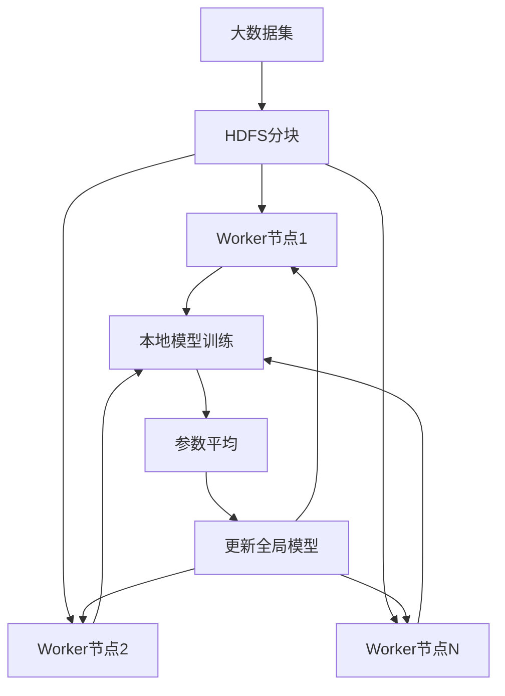
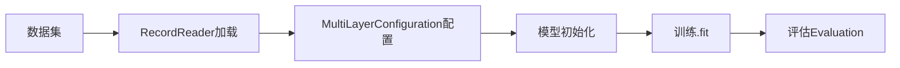
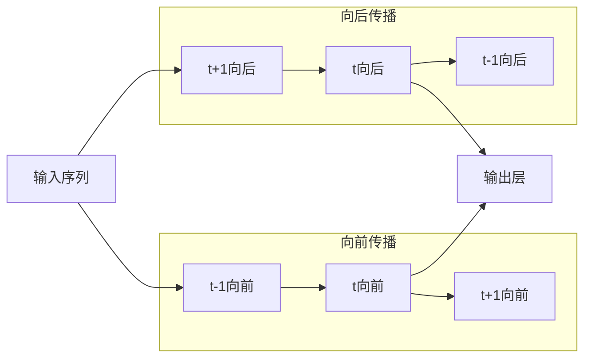
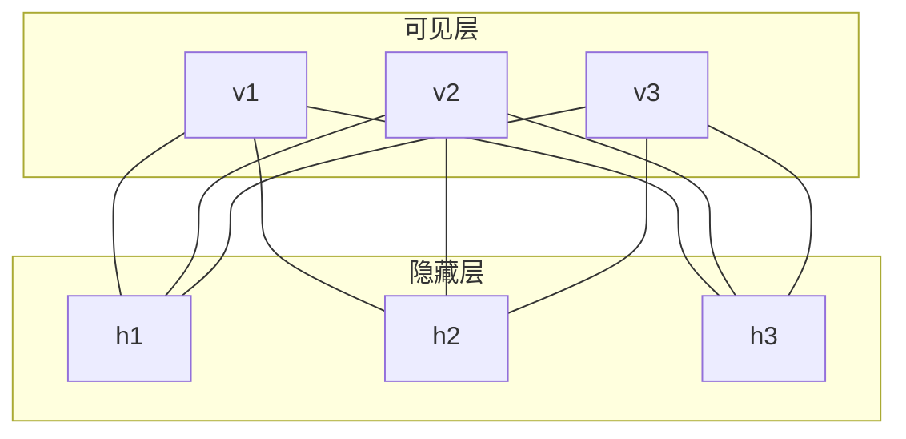
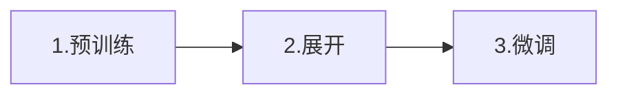
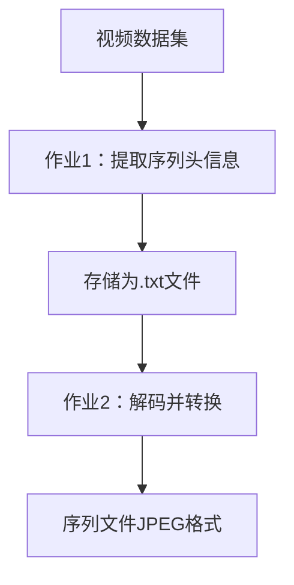
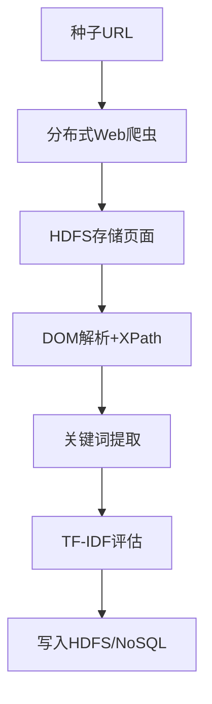

# 《Hadoop深度学习》章节总结

## 书籍信息

- 书名：《Hadoop深度学习》
- 作者：[印] 迪帕延·德夫
- PDF 状态：完整，含封面、版权、目录、正文、参考文献
- OCR 状态：良好，文本可识别

## 目录说明

- 目录识别情况：完整识别，共7章正文+前言+附录
- 章节对应依据：按原书目录顺序逐章整理
- OCR 修复说明：无重大修复需求

## 全书核心主题

本书系统讲解如何利用 Hadoop 平台在深度神经网络中部署大规模数据集。作者从深度学习的基本概念出发，依次介绍卷积神经网络、循环神经网络、受限玻尔兹曼机、自动编码器等模型，重点阐释这些模型如何在分布式环境下运行。全书的核心论点是：深度学习算法与 Hadoop 分布式计算框架的结合，能够有效解决高维数据处理、梯度消失、过拟合等传统机器学习面临的挑战，最终实现从海量数据中提取有价值信息的目标。

---

## 第1章：深度学习介绍

### 1. 核心论点

**问题**：传统机器学习算法在处理高维数据时面临维度诅咒、梯度消失等问题，难以从海量非结构化数据中自动提取高级特征。

**观点**：深度学习通过构建多层次的表征和层次化特征集，能够自动从原始数据中学习复杂表征，有效解决上述问题，是人工智能领域的重要突破。

### 2. 关键概念

| 概念         | 解释                                                         |
| ------------ | ------------------------------------------------------------ |
| 维度诅咒     | 随着数据维度增加，特征数量呈指数级增长，导致模型训练极度困难 |
| 梯度消失     | 深度神经网络中，前层梯度变得极小，导致权值更新不明显，影响训练效果 |
| 分布式表征   | 感知特征是多个因素共同作用的结果，表征分布在不同层上，涉及不同尺度 |
| 深度前馈网络 | 具有两个或以上隐藏层的神经网络，没有循环结构                 |
| 表征学习     | 根据数据当前层的表征来推断下一层数据的表征                   |

### 3. 逻辑推演

**递进结构**：

1. **问题提出**：人工智能系统成功的关键在于数据表征方式，但手工设计特征提取极为困难
2. **解决方案引入**：深度学习通过多层次自动学习特征，无需外部灌输
3. **核心挑战分析**：
   - 维度诅咒 → 深度学习通过深层网络配置管理模型复杂性
   - 梯度消失 → 长短期记忆网络等技术可有效解决
4. **网络分类**：
   - 深度生成模型：RBM、DBN、自动编码器等
   - 深度判别模型：CNN、RNN、CRF等

### 4. 经典金句/数据

> “到目前为止，人工智能的最大危险是人们过早地断定了他们了解人工智能。” —— Eliezer Yudkowsky

> “深度学习的海浪已拍打计算语言学的海岸多年，但2015年似乎是海啸全力袭击主要的自然语言处理会议的一年。” —— Christopher D. Manning

**关键数据**：

- 2006年：Hinton等人提出深度学习概念
- 2012年：Krizhevsky在ImageNet数据集上实现重大突破
- 微软曾提出150层甚至近1000层的超深层网络研究

---

## 第2章：大规模数据的分布式深度学习

### 1. 核心论点

**问题**：海量数据（EB级）的处理对传统集中式计算系统构成巨大挑战，深度学习模型在大数据环境下面临内存、处理能力等多重瓶颈。

**观点**：通过Hadoop的YARN、HDFS和MapReduce等组件，结合Deeplearning4j框架，可以实现深度学习的分布式训练，有效处理4V大数据。

### 2. 关键概念

| 概念           | 解释                                               |
| -------------- | -------------------------------------------------- |
| 大数据4V       | 数量、多样性、速度、真实性                         |
| 小批量处理     | 每个节点一次接收约10个元素的小块数据，提高处理精度 |
| 参数平均       | 各worker节点返回参数后，主节点计算平均值再分发     |
| Deeplearning4j | JVM开源深度学习框架，支持与Hadoop/Spark集成        |
| 迭代MapReduce  | 多个MapReduce操作序列，适合深度学习等迭代算法      |

### 3. 逻辑推演

**论证链条**：

1. **大数据挑战**：
   - 数据量 → 需分布式框架
   - 多样性 → 需半监督学习
   - 高速 → 需在线学习/SGD
   - 真实性 → 需数据规范化

2. **Hadoop解决路径**：
   - HDFS：分布式存储、容错、高可用
   - YARN：资源管理与调度
   - MapReduce/迭代MapReduce：并行计算

3. **设计重要特征**：
   - 小批量处理 → 防止过拟合
   - 参数平均 → 同步结果、分布式训练

4. **Deeplearning4j实现**：
   - 数据并行性
   - JVM科学计算（ND4J）
   - 与Spark/YARN集成

### 4. 流程图

#### 分布式深度学习架构



#### Deeplearning4j配置流程



### 5. 经典金句/数据

> “除了上帝，我们只相信数据！” —— W.Edwards Deming

**关键数据**：

- 互联网每天处理约2PB数据
- 2006年数字数据规模：0.18ZB → 2011年：1.8ZB → 2015年：10ZB → 2020年预计：30-35ZB
- Facebook用户：2亿，数据量约21PB

---

## 第3章：卷积神经网络

### 1. 核心论点

**问题**：传统神经网络在处理高维图像数据时，全连接方式导致参数爆炸和过拟合问题。

**观点**：卷积神经网络通过稀疏连接、参数共享和平移不变性三大特性，结合卷积层、ReLU层、池化层和全连接层的组合，能够高效处理图像识别等视觉任务。

### 2. 关键概念

| 概念       | 解释                                       |
| ---------- | ------------------------------------------ |
| 卷积       | 两个函数乘积的积分，一个函数被反转和移位   |
| 稀疏连接   | 卷积核小于输入，每个神经元仅与局部输入连接 |
| 参数共享   | 同一深度切片的所有元素共享相同参数         |
| 平移不变性 | 输出随输入变化以相同方式变化               |
| 感受野     | 滤波器作用的先前层的总面积                 |

### 3. 核心超参数公式

**输出图像空间大小**：

```
O = (W - K + 2P) / S + 1
```

- W：输入图像大小
- K：滤波器大小
- P：零填充数量
- S：步长

**零填充公式**（当 S=1，保持输入输出相同大小）：

```
P = (K - 1) / 2
```

### 4. 逻辑推演

**层结构递进**：

```
输入 → 卷积 → ReLU → 池化 → 全连接
深度CNN：上述层重复堆叠
```

**三大特性论证**：

1. **稀疏连接** → 降低时间复杂度 O(p×q) → O(n×q)
2. **参数共享** → 降低空间复杂度，存储参数从 p×q 降至 n
3. **平移不变性** → 发现特征后可在其他位置识别

**分布式训练策略**：

- 卷积层（90-95%计算量）：数据并行
- 全连接层（5-10%计算量）：模型并行

### 5. 经典金句/数据

> “计算机能否思考”这个问题并不比“潜水艇能否游泳”这个问题更有趣。” —— Edgerv W.Dijkstra

**关键数据**：

| 模型             | 深度  | 训练时间 |
| ---------------- | ----- | -------- |
| AlexNet          | 8层   | 5-6天    |
| VGG Net          | 19层  | 2-3周    |
| Microsoft ResNet | 152层 | 2-3周    |

---

## 第4章：循环神经网络

### 1. 核心论点

**问题**：传统深度神经网络无法处理可变长序列数据，且随时间反向传播时面临梯度消失/爆炸问题。

**观点**：循环神经网络通过内在记忆机制保存历史信息，结合长短期记忆单元（LSTM）和双向传播策略，能够有效处理语音识别、手写识别、语言建模等序列建模任务。

### 2. 关键概念

| 概念             | 解释                                                     |
| ---------------- | -------------------------------------------------------- |
| RNN记忆          | 隐藏状态保留前面序列的信息，作为持久化记忆               |
| 随时间反向传播   | 将RNN展开为深度前馈网络，计算每个时间步长的误差          |
| 长短期记忆(LSTM) | 通过记忆单元和三个控制门（写入/读取/遗忘）维持恒定误差流 |
| 双向RNN          | 同时考虑过去和未来信息，克服单向RNN信息局限              |
| 异步SGD          | 分布式训练RNN的优化方法                                  |

### 3. 核心公式

**隐藏状态**：

```
S_t = φ(U x_t + W s_{t-1})
```

**输出**：

```
O_t = softmax(V s_t)
```

**总误差**：

```
E_total(t1, tn) = Σ_{t=t1}^{tn} E_t(o_t, ō_t) = - Σ_{t=t1}^{tn} o_t log ō_t
```

**权值更新**：

```
ΔW_ij = -η Σ_{t=t0}^{t_{n-1}} δE_t/δW_ij
```

### 4. 逻辑推演

**五种输入-输出关系**：

1. 一对一：图像分类
2. 一对多：图像字幕
3. 多对一：情感分析
4. 多对多（可变）：机器翻译
5. 多对多（固定）：视频分类

**梯度消失问题 → LSTM解决方案**：

- 问题：展开后层数极深，梯度逐层传递时消失/爆炸
- LSTM解决：记忆单元的线性特性保持恒定误差，支持数百时间步长

**单向RNN局限 → 双向RNN解决**：

- 局限：无法获取未来信息
- 解决：隐藏状态分向前/向后两部分

### 5. 流程图

#### 双向RNN结构



### 6. 经典金句/数据

> “我觉得大脑本质上就像计算机，而意识则好比计算机程序。” —— 史蒂芬·霍金

> “如果训练香草神经网络是对函数进行优化，那么训练循环网络则是对程序进行优化。” —— Alex Lebrun

---

## 第5章：受限玻尔兹曼机

### 1. 核心论点

**问题**：判别模型只能基于观测变量预测不可观测变量，无法从隐藏参数随机生成可见数据值。

**观点**：受限玻尔兹曼机作为生成式概率图模型，通过基于能量的模型框架和二分图结构，能够学习数据集的概率分布，并可作为构建深度信念网络等深层模型的基础模块。

### 2. 关键概念

| 概念                | 解释                                             |
| ------------------- | ------------------------------------------------ |
| 基于能量的模型      | 通过能量函数衡量变量配置相关性，低能量=高相关    |
| 玻尔兹曼机          | 对称连接的随机神经网络，用于学习二元向量概率分布 |
| 受限玻尔兹曼机(RBM) | 两层二分图结构，同一层内无连接                   |
| 深度信念网络(DBN)   | 多个RBM堆叠，顶部两层无向、其他层有向            |
| 卷积RBM             | 在传统RBM中引入卷积操作，提取高维图像局部特征    |

### 3. 核心公式

**玻尔兹曼机联合概率**：

```
p(x) = exp(-E(x)) / Z
```

**RBM能量函数**：

```
E(v,h) = -a^T v - b^T h - v^T W h
```

**深度信念网络训练**：

- 逐层贪婪训练：先训练底层RBM，其输出作为上层输入
- 每层学习后，概率分布根据上层参数重新定义

### 4. 逻辑推演

**递进结构**：

1. 玻尔兹曼机 → 受限玻尔兹曼机（去掉层内连接）
2. RBM → 深度信念网络（堆叠多个RBM）
3. 标准RBM → 卷积RBM（处理高维图像）

**分布式训练策略**：

- Gibbs采样在Map阶段分配到多个DataNode
- 每次迭代：Mapper计算近似梯度 → Reducer更新参数

**性能对比**：

| 模型 | 传统训练时间 | 分布式训练时间 |
| ---- | ------------ | -------------- |
| RBM  | 6小时44分    | 1小时13分      |
| DBN  | 31小时4分    | 10小时35分     |

### 5. 流程图

#### RBM结构图



### 6. 经典金句/数据

> “我无法创建的事物正是我无法理解的。” —— Richard Feynman

**关键数据**：

- MNIST数据集：训练集6万张图像，测试集1万张
- HDFS块大小：64MB，复制因子：4
- 每个节点最多运行：26个mapper、4个reducer

---

## 第6章：自动编码器

### 1. 核心论点

**问题**：简单自动编码器可能仅复制输入而非提取有用特征，且欠完备/过完备结构各有局限。

**观点**：通过稀疏约束、深度架构和降噪机制，正则化自动编码器能够有效学习数据的有用表征，广泛应用于降维、特征学习和信息检索。

### 2. 关键概念

| 概念           | 解释                                                     |
| -------------- | -------------------------------------------------------- |
| 自动编码器     | 具有隐藏层的神经网络，训练学习恒等函数，将输入复制到输出 |
| 欠完备/过完备  | 隐藏层维度低于/高于输入维度                              |
| 稀疏自动编码器 | 添加稀疏性约束，仅使用少量隐藏单元                       |
| 深度自动编码器 | 多个编码器和解码器堆叠                                   |
| 降噪自动编码器 | 输入损坏数据，训练恢复原始干净数据                       |

### 3. 核心公式

**编码**：

```
h = f(k) = W k + b
```

**解码**：

```
r = g(h)
```

**损失函数**：

```
L(k, g(f(k)))
```

**稀疏编码**：

```
k = Σ_i a_i v_i
```

**降噪自动编码器**：

```
h = f(k') ， r = g(h)
```

- k' 为损坏输入，目标是 r ≈ k

### 4. 逻辑推演

**深度自动编码器训练三步法**：



**各阶段说明**：

1. **预训练**：逐层训练RBM栈，每层学习特征作为下层输入
2. **展开**：生成编码器和解码器网络，初始使用相同权值（转置）
3. **微调**：反向传播对整个网络进行端到端优化

**稀疏等级k的选择策略**：

- 低稀疏性(k=10)：识别全局特征，适合浅层分类
- 高稀疏性(k=200)：识别局部特征，适合深度网络预训练
- 策略：从高稀疏性开始，逐步降低到目标值

### 5. 应用场景

| 应用     | 原理                                         |
| -------- | -------------------------------------------- |
| 降维     | 克服维度诅咒，降低数据维度                   |
| 信息检索 | 生成低维二进制编码，构建键值存储（语义散列） |
| 图像搜索 | 压缩高维图像为小向量，进行相似性匹配         |

### 6. 经典金句/数据

> “人们担心计算机会变得太过智能并接管世界，然而实际问题是计算机太笨了，并且已经接管了世界。” —— Pedro Domingos

---

## 第7章：用Hadoop玩转深度学习

### 1. 核心论点

**问题**：大规模视频、图像和自然语言数据的处理需要分布式解决方案，但压缩格式、非结构化特性带来技术挑战。

**观点**：通过Map-Reduce作业结合HDFS的分布式存储，可以实现大规模视频解码、图像处理和自然语言处理，有效提取热点数据中的价值信息。

### 2. 关键概念

| 概念             | 解释                                                   |
| ---------------- | ------------------------------------------------------ |
| 分布式视频解码   | 将视频比特流分块，并行解码后转换为序列文件（JPEG格式） |
| Hadoop Streaming | 使用可执行脚本作为mapper/reducer，调用图像处理程序     |
| TF-IDF           | 词频-逆文档频率，评估关键词在语料库中的重要程度        |
| Web爬虫架构      | 分布式URL发现、页面获取、关键词提取的并行处理          |

### 3. TF-IDF公式

```
TF-IDF_i = TF_i × IDF_i
```

- TF_i = f_i / n_d（词频：词i在文档d中的出现频率 / 文档d总词数）
- IDF_i = log(N_D / N_i)（逆文档频率：语料库文档总数 / 包含词i的文档数）

### 4. 逻辑推演

**视频解码流程**（两个Map-Reduce作业）：



**自然语言处理架构**：



### 5. 图像处理方案

**Map-Only作业策略**：

- 使用Hadoop Streaming + shell脚本
- 图像文件列表作为输入
- Mapper执行所有操作：加载→处理→写回HDFS
- Reducer数量设为0

**内存消耗计算示例**：

```
81025像素 × 86273像素 × 3(RGB) × 32位 = 78.12 GB
```

### 6. 经典金句/数据

> “蛮荒时期的人们用公牛拉动重物，当公牛拉不动时，他们不会尝试培育更大的公牛。我们也不应该尝试使用更强的计算机，而应该使用更多的计算机系统。” —— Grace Hopper

---

## 全书总结

《Hadoop深度学习》是一部系统讲解如何在分布式环境下部署深度学习模型的专著。全书以“深度学习模型 + Hadoop分布式框架 = 海量数据处理能力”为核心主线，从理论到实践完整覆盖以下内容：

1. **理论基础**：深度学习的动机、挑战与优势
2. **分布式架构**：HDFS、YARN、MapReduce、Deeplearning4j
3. **核心模型**：CNN、RNN、RBM、自动编码器的原理与分布式实现
4. **实践应用**：视频处理、图像处理、自然语言处理的Hadoop解决方案

作者强调：深度学习的价值在于从非结构化数据中自动提取复杂表征，而Hadoop的价值在于为这种提取提供可扩展、高容错的分布式计算平台。二者的结合，使得数据产品的构建成为可能。

---


# 