# 《Hello-Agents: 从零开始构建智能体系统原理与实践教程》章节总结

## 书籍信息
- **书名**：Hello-Agents: 从零开始构建智能体系统原理与实践教程
- **作者**：Datawhale 社区（陈思州、孙韬、姜舒凡、黄佩林、曾鑫民 等）
- **PDF 状态**：完整文本识别，含水印保护
- **OCR 状态**：文本可读，图表需人工重建

## 目录说明
- **目录识别情况**：完整识别，包含前言、五大部分（16章）、习题、参考文献、致谢。
- **章节对应依据**：按照 PDF 中“内容导航”部分及各章标题顺序。
- **OCR 修复说明**：少量页码标注错位，但内容完整；部分流程图依赖文字描述重建。

## 全书核心主题
本书系统讲解从零开始构建大语言模型驱动的智能体（Agent）系统。内容覆盖智能体的基本概念、历史演进、大语言模型基础，重点实现 ReAct、Plan-and-Solve、Reflection 等经典范式，并逐步构建自有框架 HelloAgents。在此基础上，深入记忆与检索、上下文工程、通信协议（MCP/A2A/ANP）、强化学习训练（Agentic-RL）及性能评估。最后通过智能旅行助手、深度研究智能体、赛博小镇三个完整案例，以及毕业设计，引导读者将理论转化为实际多智能体应用。全书强调“理论与实践并重”，目标是让读者从 LLM 使用者成长为智能体系统构建者。

---

## 前言
### 核心论点
> 从“百模大战”到“Agent元年”，技术焦点从训练大模型转向构建智能体应用。当前系统性、重实践的教程匮乏，本书旨在提供从零开始的智能体构建指南，帮助读者理解核心原理、亲手实现框架并完成真实案例。

### 关键概念/事件
- **Agent元年（2025）**：智能体成为人工智能应用的核心方向。
- **两派 Agent**：软件工程类（Dify, Coze）与 AI 原生类（LLM 驱动）。
- **Hello-Agents 项目**：Datawhale 发起的开源智能体学习教程。

### 逻辑推演/叙事脉络
前言首先点明大语言模型从“对话工具”到“行动者”的转变，指出当前缺乏系统性教程。接着介绍本书的目标：从零构建智能体，涵盖理论、实践和高级扩展，最后通过综合案例和毕业设计完成学习闭环。强调动手实践的重要性。

### 经典金句/数据
> “最好的学习方式就是动手实践。”
> “希望这本教程能成为你探索智能体世界的起点，能够从一名大语言模型的‘使用者’，蜕变为一名智能体系统的‘构建者’。”

---

## 第一章：初识智能体
### 核心论点
> 什么是大语言模型驱动的智能体？它通过传感器感知环境，通过执行器采取行动，以达成特定目标。现代智能体具备自主推理和使用工具的能力，其运行机制是“感知-思考-行动-观察”的循环。

### 关键概念/事件
- **智能体定义**：能够感知环境并自主行动以达成目标的实体。
- **PEAS模型**：性能度量、环境、执行器、传感器。
- **智能体类型**：反应式、规划式、混合式；符号主义、亚符号主义、神经符号主义。
- **ReAct 范式**：Thought（思考）- Action（行动）- Observation（观察）循环。
- **工作流 vs Agent**：工作流是预设指令，Agent 是自主目标驱动。

### 逻辑推演/叙事脉络
从智能体定义出发，对比传统智能体与 LLM 驱动新范式。通过“智能旅行助手”案例展示 5 分钟实现第一个 Agent。接着分析智能体协作模式（开发者工具 vs 自主协作者），最后区分 Workflow 与 Agent。

### 流程图（重建）

**智能体与环境交互循环**
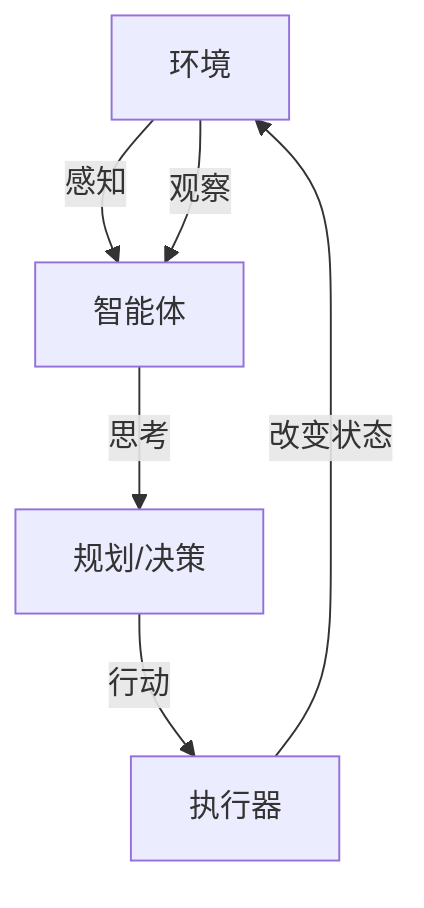

**ReAct 工作流**
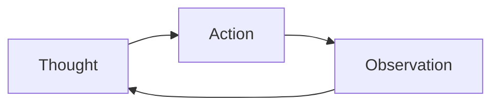

### 经典金句/数据
> “我们正从开发专用自动化工具转向构建能自主解决问题的系统。”
> “核心不再是编写代码，而是引导一个通用的‘大脑’去规划、行动和学习。”
> “如果说 ReAct 像一个经验丰富的侦探，那么 Plan-and-Solve 则更像一位建筑师。”

### 习题（部分）
- 分析 case 中主体是否属于智能体及类型。
- 用 PEAS 模型设计“智能健身教练”任务环境。
- Workflow 与 Agent 的优缺点及组合方案。
- 添加记忆、备选方案、反思功能到旅行助手。
- 应用系统1/系统2理论到具体场景。
- 分析智能体幻觉及评估方法。

---

## 第二章：智能体发展史
### 核心论点
> 智能体的发展经历了符号主义、联结主义和行为主义三大思潮的演进。从基于规则的专家系统、ELIZA，到马文·明斯基的“心智社会”，再到强化学习和预训练大模型，现代智能体是多种思想的融合。

### 关键概念/事件
- **物理符号系统假说（PSSH）**：智能的本质是符号的计算与处理。
- **专家系统（MYCIN）**：基于 IF-THEN 规则的医疗诊断系统。
- **ELIZA**：通过模式匹配模拟心理治疗师的早期聊天机器人。
- **心智社会**：明斯基提出，智能从大量简单智能体的协作中涌现。
- **AlphaGo**：结合深度强化学习与蒙特卡洛树搜索，击败人类棋手。
- **Transformer 与 GPT**：奠定现代 LLM 基础，Decoder-Only 架构。

### 逻辑推演/叙事脉络
按时间顺序：符号主义（1950s-1970s）→ 专家系统与联结主义复苏（1980s）→ 第二次 AI 低谷与强化学习（1990s-2000s）→ 深度学习时代（2010s）→ 大模型时代（2020-2022）→ 智能体时代（2023至今）。每个阶段的局限驱动下一阶段创新。

### 经典金句/数据
> “What magical trick makes us intelligent? The trick is that there is no trick.” — Marvin Minsky
> “物理符号系统假说：任何一个物理符号系统都具备产生通用智能行为的充分手段。”
> 表2.1：传统智能体与 LLM 驱动智能体核心对比（从核心引擎、知识来源、处理指令等维度）

### 习题（部分）
- 物理符号系统假说的充分性与必要性挑战。
- MYCIN 未能大规模应用的原因及现代设计。
- 扩展 ELIZA 并对比 ChatGPT。
- 心智社会理论与现代多智能体系统的异同。
- 强化学习 vs 监督学习（以超级马里奥为例）。
- 预训练如何解决知识获取瓶颈。

---

## 第三章：大语言模型基础
### 核心论点
> 现代智能体的核心是大语言模型。本章讲解从 N-gram 到 Transformer 的演进，Decoder-Only 架构的优势，提示工程、分词原理，以及模型缩放法则和幻觉问题。

### 关键概念/事件
- **N-gram 与马尔可夫假设**：基于词频的条件概率模型。
- **词嵌入（Word Embedding）**：将词映射为连续向量，捕捉语义。
- **Transformer**：自注意力机制，支持并行计算。
- **Decoder-Only 架构**：自回归生成，适合对话与代码任务。
- **分词（Tokenization）**：BPE、WordPiece、SentencePiece。
- **缩放法则**：模型性能与参数量、数据量、计算量呈幂律关系。
- **幻觉（Hallucination）**：模型生成与事实不符的内容。

### 逻辑推演/叙事脉络
从统计语言模型到神经网络语言模型，到 RNN/LSTM，再到 Transformer 和 Decoder-Only 架构。然后介绍与 LLM 交互的方法（提示工程、采样参数、分词），并展示本地部署开源模型。接着分析模型选型的关键因素，最后讨论缩放法则、涌现能力和幻觉问题。

### 流程图（重建）

**Transformer 架构（简化）**
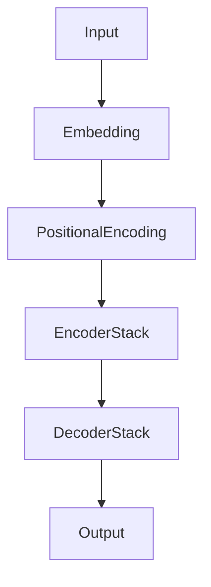

### 经典金句/数据
> “预测下一个词”这一简单范式开启了大语言模型时代。
> 温度参数控制随机性：低温度（0-0.3）输出确定性，高温度（0.7-2）输出创新性。
> “模型幻觉的本质是过度自信地‘编造’信息。”

### 习题（部分）
- 计算 Bigram 概率。
- Transformer 自注意力与并行处理。
- BPE 解决了什么问题？
- 本地部署开源模型并对比闭源模型。
- 缓解幻觉的 RAG 等方法。
- 设计论文辅助阅读智能体。

---

## 第四章：智能体经典范式构建
### 核心论点
> 本章从零实现三种经典智能体范式：ReAct（推理与行动结合）、Plan-and-Solve（先规划后执行）、Reflection（自我反思与迭代优化）。通过亲手编码理解其优劣与适用场景。

### 关键概念/事件
- **ReAct**：Thought → Action → Observation 循环，动态调整。
- **Plan-and-Solve**：先分解任务为步骤列表，再逐步执行。
- **Reflection**：执行 → 反思 → 优化，内部纠错回路。
- **工具（Tool）**：智能体调用的外部函数（搜索、计算等）。
- **提示词模板**：规范 LLM 输出格式，解析 Action。

### 逻辑推演/叙事脉络
先准备环境（安装依赖、配置 API、封装 LLM 客户端），然后分别实现三种范式：ReAct 强调动态交互，Plan-and-Solve 强调结构化分解，Reflection 强调自我改进。每个范式都有示例代码和运行分析，最后对比表格。

### 流程图（重建）

**ReAct 循环**
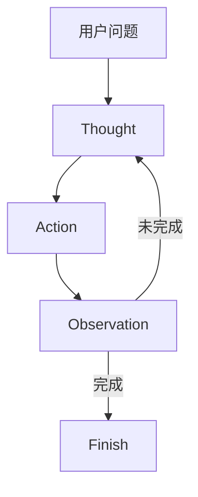

**Plan-and-Solve 两阶段**
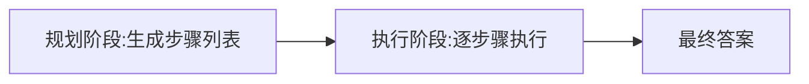

**Reflection 迭代循环**
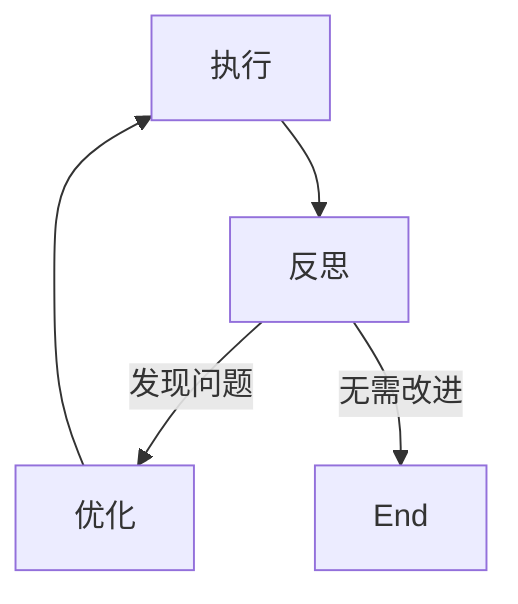

### 经典金句/数据
> “ReAct 让智能体边想边做，动态调整；Plan-and-Solve 三思而后行；Reflection 赋予自我修正能力。”
> 表4.1：不同 Agent Loop 的选择策略（不确定任务→ReAct，逻辑清晰→Plan-and-Solve，质量要求高→Reflection）

### 习题（部分）
- 三种范式本质区别及组合使用。
- 正则表达式解析的脆弱性与改进方案。
- 为 ReAct 添加计算器工具。
- 动态重规划机制设计。
- Reflection 多维度评估设计。

---

## 第五章：基于低代码平台的智能体搭建
### 核心论点
> 低代码平台（Coze、Dify、n8n）通过图形化、模块化方式大幅降低智能体开发门槛，适合快速验证原型和业务集成。本章实践三个代表性平台，并分析其优势与局限。

### 关键概念/事件
- **Coze**（字节跳动）：零代码拖拽，丰富插件，一键发布多平台。
- **Dify**（开源）：全栈 LLM 应用平台，支持工作流、RAG、模型管理。
- **n8n**（开源工作流自动化）：连接数百个服务，嵌入 AI 能力。
- **MCP（Model Context Protocol）**：标准化智能体与工具的通信协议（Coze 当时未支持）。

### 逻辑推演/叙事脉络
先说明低代码平台的价值（降低门槛、提升效率、可视化），然后分别以 Coze 的“每日 AI 简报”、Dify 的“超级智能体个人助手”、n8n 的“智能邮件助手”为案例，展示搭建过程。最后对比三个平台，给出选型建议。

### 流程图（重建）

**Dify 多智能体架构（问题分类器路由）**
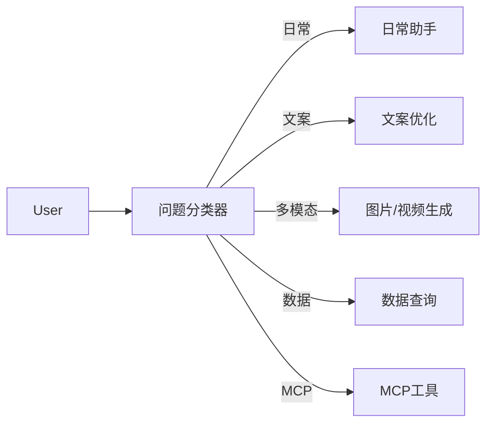

### 经典金句/数据
> “低代码平台并非要取代代码，而是提供了一种更高层次的抽象。”
> Coze 限制：不支持 MCP（写作时）；Dify 企业版定价较高；n8n 内置存储非持久化。

### 习题（部分）
- 三个平台设计理念区别与混合开发模式。
- Coze 自动推送简报及 MCP 的意义。
- Dify 多智能体路由与数据库方案。
- n8n 持久化存储与附件处理。
- 提示词设计差异。
- 为各平台开发自定义插件。

---

## 第六章：框架开发实践
### 核心论点
> 本章介绍四个主流智能体框架：AutoGen（对话驱动）、AgentScope（工程化消息驱动）、CAMEL（角色扮演）、LangGraph（状态图控制）。通过对比理解不同设计哲学。

### 关键概念/事件
- **AutoGen**：可对话智能体，RoundRobinGroupChat 轮询协调。
- **AgentScope**：消息驱动，支持分布式、容错、可观测性。
- **CAMEL**：角色扮演 + 引导性提示，双智能体自主协作。
- **LangGraph**：状态图（State Graph），节点与边，天然支持循环。
- **涌现式协作 vs 显式控制**：前者依赖角色定义，后者依赖流程编排。

### 逻辑推演/叙事脉络
从手动实现到框架开发的必要性（复用、解耦、状态管理、可观测性）。然后分别介绍四个框架的核心概念和实战案例（AutoGen 软件开发团队、AgentScope 三国狼人杀、CAMEL 电子书创作、LangGraph 三步问答助手），最后对比总结。

### 流程图（重建）

**AutoGen 轮询群聊**
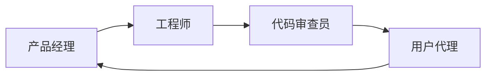

**LangGraph 状态图示例**
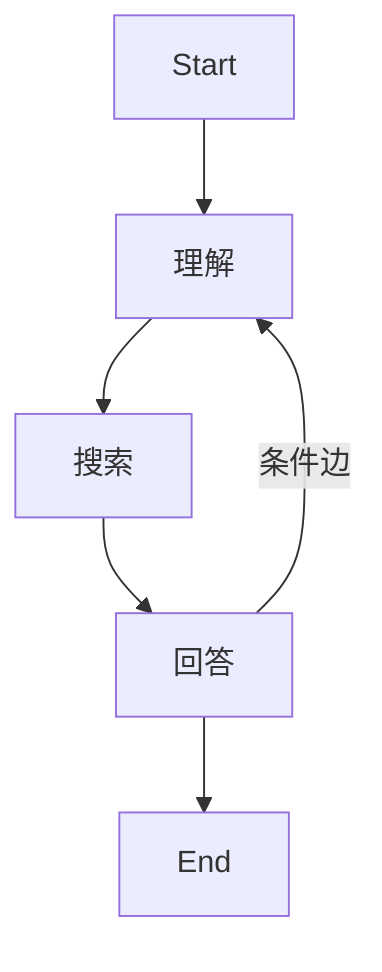

### 经典金句/数据
> “每个框架都有自己实现智能体构建的思路：AutoGen 以对话驱动协作，AgentScope 工程化优先，CAMEL 轻量级角色扮演，LangGraph 精确控制流程。”
> 表6.1：四种框架核心概念、主要优势、典型应用场景。

### 习题（部分）
- 对比两个框架的协作模式与控制方式。
- AutoGen 动态回退机制。
- AgentScope 消息驱动优势与分布式挑战。
- CAMEL 冲突解决与 workforce 机制。
- LangGraph 循环特性设计复杂流程。
- 为智能客服、科研写作、金融风控选择框架。

---

## 第七章：构建你的智能体框架
### 核心论点
> 从零构建自有框架 HelloAgents，设计理念：轻量级、教学友好、基于标准 API、渐进式学习、万物皆为工具。本章实现核心组件：LLM 客户端、消息类、配置类、Agent 基类，并重构四种范式。

### 关键概念/事件
- **HelloAgentsLLM**：多提供商支持（OpenAI、ModelScope、本地 VLLM/Ollama），自动检测机制。
- **Message 类**：统一消息格式，兼容 OpenAI API。
- **Config 类**：集中配置管理。
- **Agent 基类**：抽象 run 方法，历史记录管理。
- **工具系统**：Tool 基类、ToolRegistry、函数注册。
- **范式框架化**：SimpleAgent、ReActAgent、ReflectionAgent、PlanAndSolveAgent。

### 逻辑推演/叙事脉络
先说明自建框架的必要性（市面框架黑盒、依赖重、迭代快）。然后设计整体架构，逐步实现基础组件（LLM、Message、Config、Agent）。接着将第四章的四种范式框架化，最后构建工具系统（基类、注册机制、自定义工具示例）。

### 流程图（重建）

**HelloAgents 工具调用流程**
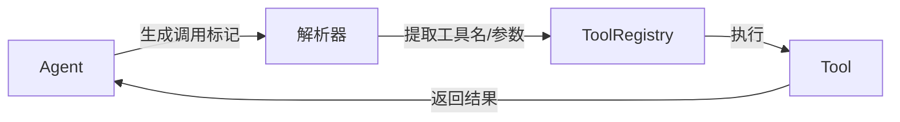

### 经典金句/数据
> “除了核心的 Agent 类，一切皆为 Tools。” —— 统一抽象消除不必要的复杂度。
> 表7.1：HelloAgentsLLM 不同版本特性对比（支持 12+ 提供商、自动检测、本地模型等）。

### 习题（部分）
- 自建框架的优势与局限。
- 扩展 HelloAgentsLLM 支持新供应商。
- 单例模式在 Config 中的应用。
- 框架化四种范式的改进点。
- 设计 Tree-of-Thought Agent。
- 工具系统统一接口与链式调用。

---

## 第八章：记忆与检索
### 核心论点
> 借鉴人类记忆认知科学，为智能体构建记忆系统（工作记忆、情景记忆、语义记忆、感知记忆）和 RAG 系统。通过 MemoryTool 和 RAGTool 实现持久化知识检索与上下文增强。

### 关键概念/事件
- **工作记忆**：短期，TTL 管理，纯内存。
- **情景记忆**：事件序列，SQLite + Qdrant。
- **语义记忆**：知识图谱，Qdrant + Neo4j。
- **感知记忆**：多模态数据。
- **RAG**：检索增强生成，文档处理→分块→向量化→检索→生成。
- **高级检索**：多查询扩展（MQE）、假设文档嵌入（HyDE）。

### 逻辑推演/叙事脉络
从人类记忆分层得到启发，设计四层记忆系统。先快速体验 MemoryTool，再深入实现 MemoryManager、四种记忆类型、存储后端。RAG 部分讲解架构、文档处理、智能分块、向量存储和高级检索策略。最后通过“智能文档问答助手”案例整合记忆与 RAG。

### 流程图（重建）

**记忆系统架构**
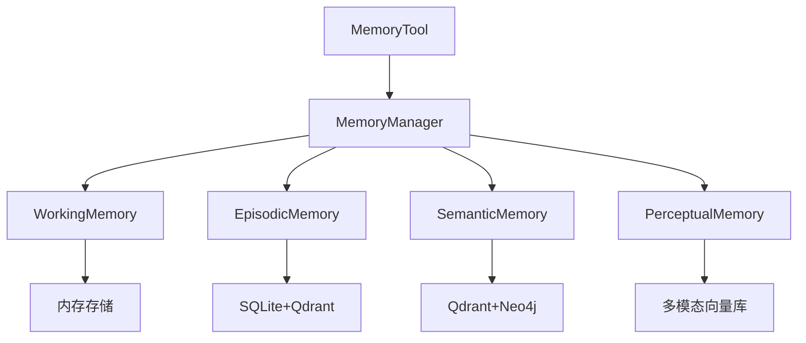

**RAG 流程**
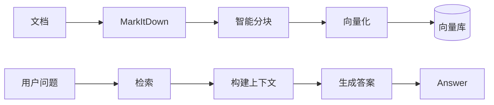

### 经典金句/数据
> “感知记忆的评分公式：(向量相似度 × 0.8 + 时间近因性 × 0.2) × (0.8 + 重要性 × 0.4)。”
> 语义记忆检索混合向量（0.7）和图（0.3）权重。

### 习题（部分）
- 四种记忆类型的评分公式差异。
- 为“个人健康管理助手”组合记忆类型。
- 处理无标题文档的分块策略。
- 对比 MQE 与 HyDE。
- 智能遗忘与记忆归档设计。
- 知识图谱质量评估。

---

## 第九章：上下文工程
### 核心论点
> 上下文工程（Context Engineering）关注在每次模型调用前如何拼装优化输入上下文，以提升正确性、鲁棒性与效率。GSSC 流水线（Gather-Select-Structure-Compress）是实现这一目标的核心方法。

### 关键概念/事件
- **上下文工程 vs 提示工程**：前者管理整体 token 状态，后者关注指令写法。
- **上下文腐蚀**：随着 token 增加，信息回忆能力下降。
- **GSSC 流水线**：汇集、选择、结构化、压缩。
- **NoteTool**：Markdown+YAML 结构化笔记，用于长时程任务。
- **TerminalTool**：安全的命令行工具，实现即时（JIT）上下文检索。

### 逻辑推演/叙事脉络
先定义上下文工程及其重要性（上下文腐蚀、注意力预算）。介绍有效上下文的组件（系统提示、工具、示例）。然后讲解 GSSC 流水线，结合 HelloAgents 的 ContextBuilder 实现。接着介绍 NoteTool 和 TerminalTool，最后通过“长程代码库维护助手”案例整合三者。

### 流程图（重建）

**GSSC 流水线**
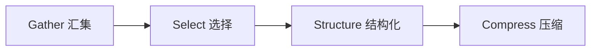

**长程智能体工作流**
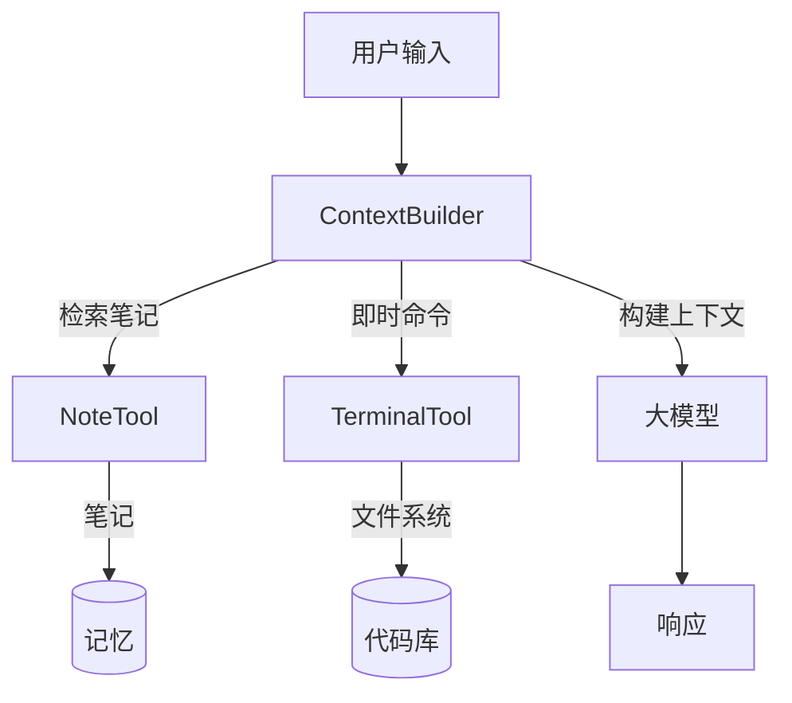

### 经典金句/数据
> “上下文必须被视作一种有限资源，且具有边际收益递减。”
> “智能体 = 在循环中自主调用工具的 LLM。”

### 习题（部分）
- 上下文腐蚀现象与 JIT 上下文策略。
- GSSC 各阶段失效影响。
- 为 ContextBuilder 添加质量评估。
- 笔记自动整理与断点续传。
- 渐进式披露的探索引导机制。

---

## 第十章：智能体通信协议
### 核心论点
> 智能体通信协议标准化了智能体与工具（MCP）、智能体之间（A2A）、大规模智能体网络（ANP）的交互。MCP 作为“智能体的 USB-C”，A2A 实现点对点协作，ANP 提供服务发现与路由。

### 关键概念/事件
- **MCP（Model Context Protocol）**：Anthropic 提出，Host-Client-Server 架构，支持 Tools、Resources、Prompts。
- **A2A（Agent-to-Agent）**：Google 提出，点对点任务委托，任务生命周期管理。
- **ANP（Agent Network Protocol）**：去中心化服务发现与注册。
- **传输方式**：Memory、Stdio、HTTP、SSE、StreamableHTTP。
- **Smithery**：MCP 服务器发布平台。

### 逻辑推演/叙事脉络
先说明为何需要通信协议（解决工具集成困境、动态发现、协作缺失）。对比三种协议的设计理念与适用场景。然后分别实战 MCP（客户端使用、内置演示服务器、GitHub MCP 服务）、A2A（智能体服务与客户端）、ANP（服务发现）。最后展示如何构建自定义 MCP 服务器并发布到 Smithery。

### 流程图（重建）

**MCP 三层架构**
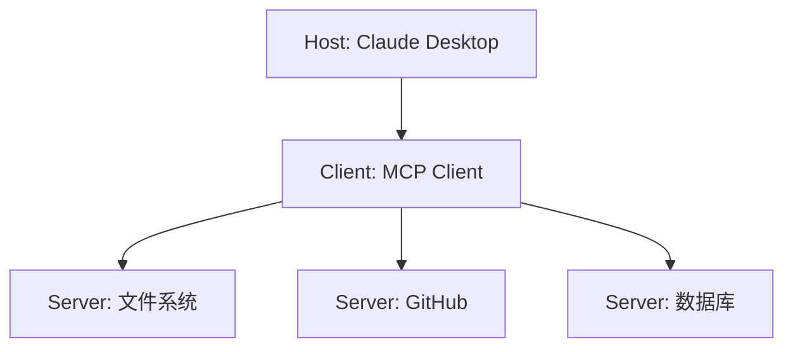

**A2A 请求生命周期**
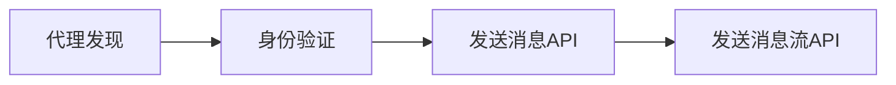

### 经典金句/数据
> “MCP 就像 USB-C 统一了各种设备的连接方式一样，统一了智能体与外部工具的交互方式。”
> 表10.1：MCP、A2A、ANP 对比（设计理念、适用场景、核心能力）。

### 习题（部分）
- 三种协议解决的核心问题及组合使用。
- 扩展 MCP 服务器添加数据库工具。
- A2A 冲突解决与投票机制。
- ANP 网络拓扑与容错机制。
- 权限控制与加密方案。

---

## 第十一章：Agentic-RL
### 核心论点
> Agentic RL 将 LLM 作为可学习策略，嵌入智能体的感知-决策-执行循环，通过强化学习优化多步任务表现。本章讲解从 SFT 到 GRPO 的训练流程，并实现数学推理智能体。

### 关键概念/事件
- **PBRFT vs Agentic RL**：单步偏好优化 vs 多步累积奖励。
- **SFT（监督微调）**：学习任务格式和基本推理。
- **LoRA**：低秩适配，参数高效微调。
- **GRPO（Group Relative Policy Optimization）**：无需价值模型，使用组内相对奖励。
- **奖励函数**：准确率、长度惩罚、步骤奖励。
- **GSM8K 数据集**：小学数学应用题。

### 逻辑推演/叙事脉络
从 LLM 训练全景图（预训练 → SFT → 奖励建模 → RLHF）引出 Agentic RL 的核心理念。然后介绍数据集（GSM8K）和奖励函数设计。接着实战 SFT 训练，再进入 GRPO 训练（原理、参数、监控）。最后进行模型评估、错误分析和完整训练流程。

### 流程图（重建）

**LLM 训练全景图**
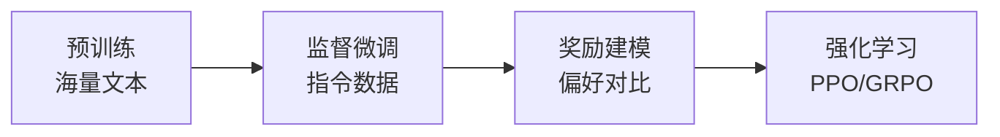

**GRPO 训练循环**
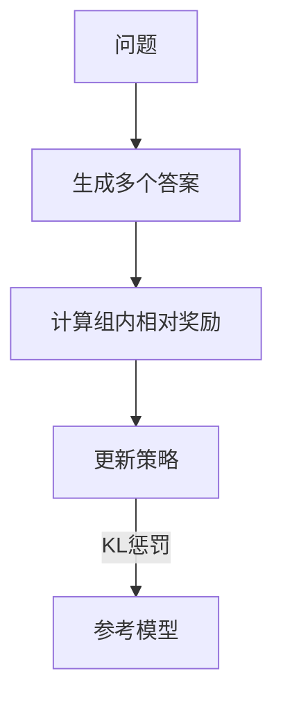

### 经典金句/数据
> “Agentic RL 的目标是赋予 LLM 智能体六大核心能力：推理、工具使用、记忆、规划、自我改进、感知。”
> 表11.6：PPO vs GRPO 对比（价值模型、显存占用、训练稳定性）。

### 习题（部分）
- PBRFT 与 Agentic RL 的 MDP 差异。
- 为代码调试助手设计强化学习框架。
- LoRA 原理与适用场景。
- 精细奖励函数设计及“奖励黑客”防御。
- 工具学习的课程学习方案。

---

## 第十二章：智能体性能评估
### 核心论点
> 评估智能体需要标准化基准和指标。本章聚焦 BFCL（工具调用能力）、GAIA（通用 AI 助手能力）和数据生成质量评估（LLM Judge + Win Rate + 人工验证）。

### 关键概念/事件
- **BFCL**：Berkeley Function Calling Leaderboard，AST 匹配评估工具调用。
- **GAIA**：Meta + Hugging Face，466 个真实世界问题，准精确匹配。
- **LLM Judge**：使用大语言模型作为评委，多维度评分。
- **Win Rate**：成对对比生成数据与参考数据的优劣。
- **AIME 数据集**：数学竞赛题目，用于生成质量评估。

### 逻辑推演/叙事脉络
先介绍评估的必要性和主流基准。然后分别实现 BFCL 评估（数据集加载、AST 匹配、官方工具集成）、GAIA 评估（数据集获取、准精确匹配、报告生成）、数据生成质量评估（LLM Judge、Win Rate、人工验证界面）。最后通过“AIME 题目生成与评估”案例展示完整流程。

### 流程图（重建）

**BFCL 评估流程**
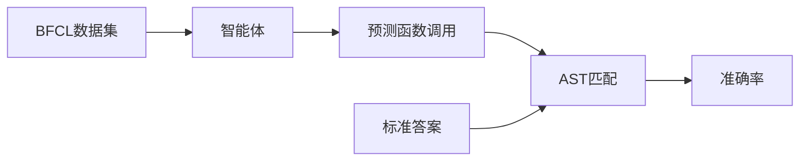

**GAIA 准精确匹配**
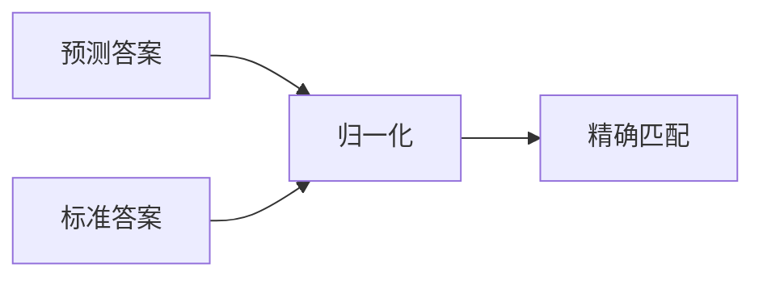

### 经典金句/数据
> “BFCL 使用抽象语法树（AST）进行智能匹配，而不是简单的字符串匹配。”
> GAIA 要求输出格式：`FINAL ANSWER: [答案]`。
> 表12.1：BFCL 四个类别（simple, multiple, parallel, irrelevance）。

### 习题（部分）
- BFCL 与 GAIA 评估方法差异及优缺点。
- AST 匹配的误判与改进。
- 为 GAIA 设计 Level 4 任务。
- LLM Judge 的偏见与多评委聚合。
- 分层评估策略与持续监控系统。

---

## 第十三章：智能旅行助手
### 核心论点
> 综合运用多智能体协作、MCP 工具集成、前后端开发，构建一个完整的智能旅行助手。用户输入目的地、日期、偏好，系统自动生成包含景点、酒店、行程、预算、地图的旅行计划。

### 关键概念/事件
- **多智能体协作**：AttractionSearchAgent、WeatherQueryAgent、HotelAgent、PlannerAgent。
- **MCP 集成**：高德地图 MCP 服务器（amap-mcp-server），提供搜索、天气、POI 等工具。
- **数据模型**：Pydantic 定义 Location、Attraction、DayPlan、TripPlan 等。
- **前端技术栈**：Vue3 + TypeScript + Ant Design Vue + 高德地图 API。
- **导出功能**：html2canvas + jsPDF。

### 逻辑推演/叙事脉络
先概述项目目标与架构，然后设计数据模型（自底向上）。接着设计多智能体协作（四个 Agent 的职责与提示词）。再集成高德地图 MCP 和 Unsplash 图片 API。最后实现前端（表单、进度条、地图、编辑、导出）并展示完整运行效果。

### 流程图（重建）

**智能旅行助手多智能体协作流程**
```mermaid
graph LR
    User[用户表单] --> Backend[FastAPI]
    Backend --> Att[景点搜索Agent]
    Backend --> Wea[天气查询Agent]
    Backend --> Hot[酒店推荐Agent]
    Att --> Plan[行程规划Agent]
    Wea --> Plan
    Hot --> Plan
    Plan --> Result[完整计划]
```

### 经典金句/数据
> “通过多 Agent 协作，我们把一个复杂的旅行规划任务分解成了四个简单的子任务。”
> 预算自动计算：景点门票 + 酒店 + 餐饮 + 交通。

### 习题（部分）
- 无（本章为实战案例，习题未单独列出，但鼓励读者扩展功能）

---

## 第十四章：自动化深度研究智能体
### 核心论点
> 构建一个 TODO 驱动的研究智能体，将研究主题分解为子任务，通过搜索、总结、报告生成三个阶段，自动完成信息收集和结构化报告撰写。

### 关键概念/事件
- **TODO 驱动研究范式**：规划 → 执行 → 报告。
- **三 Agent 协作**：TODO Planner、Task Summarizer、Report Writer。
- **ToolAwareSimpleAgent**：可监听工具调用的 Agent，用于实时进度反馈。
- **多搜索引擎**：Tavily、DuckDuckGo、Perplexity 等，支持 Advanced 组合模式。
- **NoteTool**：持久化研究笔记与进度。

### 逻辑推演/叙事脉络
从需求出发（信息过载、缺少结构），设计 TODO 驱动范式。实现三个专门 Agent，并扩展 SearchTool 支持多种搜索引擎。通过 ToolAwareSimpleAgent 监听工具调用，实现前端 SSE 实时进度。最后整合成完整系统，展示运行效果。

### 流程图（重建）

**深度研究三阶段**
```mermaid
graph LR
    P[规划:生成子任务] --> E[执行:搜索+总结] --> R[报告:整合Markdown]
```

**SSE 进度推送**
```mermaid
graph LR
    FE[前端] -->|HTTP请求| BE[后端]
    BE -->|SSE事件流| FE
    BE -->|子任务完成| FE
    BE -->|最终报告| FE
```

### 经典金句/数据
> “TODO 驱动的研究范式将复杂的研究主题分解为可执行的子任务。”
> 研究规划 Agent 输出 JSON 格式的子任务列表（title, intent, query）。

### 习题（部分）
- 无（实战案例，鼓励读者扩展）

---

## 第十五章：构建赛博小镇
### 核心论点
> 将 HelloAgents 与 Godot 游戏引擎结合，创造 2D 像素风格的 AI 小镇。NPC 拥有记忆、好感度系统，玩家可以通过自然语言与 NPC 对话，NPC 会基于角色设定和记忆做出个性化回应。

### 关键概念/事件
- **NPC 智能体**：每个 NPC 是一个 SimpleAgent，有独立角色设定（Python 工程师、产品经理、UI 设计师）。
- **记忆系统**：短期记忆（对话连贯）+ 长期记忆（向量检索历史）。
- **好感度系统**：五级（陌生→熟悉→友好→亲密→挚友），LLM 分析情感，动态调整。
- **批量对话生成**：轻负载模式，一次性生成所有 NPC 背景对话，降低 API 成本。
- **Godot 场景系统**：节点树、场景实例化、信号通信。
- **前后端通信**：FastAPI + HTTP 请求，Godot 的 HTTPRequest 节点。

### 逻辑推演/叙事脉络
先介绍项目目标和架构（Godot + FastAPI + HelloAgents）。然后设计 NPC 智能体（角色设定、记忆集成、批量生成）。实现好感度系统（等级、计算逻辑、影响对话）。后端构建 FastAPI 应用、API 路由、状态管理和日志。前端用 Godot 构建场景（玩家、NPC、对话 UI），实现玩家控制、NPC 巡逻、交互检测。最后通过 API 客户端连接前后端，完成实时对话。

### 流程图（重建）

**赛博小镇前后端通信**
```mermaid
graph LR
    Player[玩家] -->|按E键| Godot[Godot前端]
    Godot -->|HTTP POST| FastAPI[FastAPI后端]
    FastAPI -->|调用| Agent[NPC Agent]
    Agent -->|检索记忆| Mem[(记忆库)]
    Agent -->|LLM| Reply[生成回复]
    Reply -->|好感度更新| Rel[好感度管理器]
    Reply -->|返回| Godot
    Godot -->|显示对话| UI[对话UI]
```

**好感度计算流程**
```mermaid
graph LR
    Message[玩家消息+NPC回复] --> LLM_Sent[情感分析]
    LLM_Sent --> Change[分数变化(-3,+2,+5)]
    Change --> Update[更新好感度]
    Update --> Level[映射等级]
```

### 经典金句/数据
> “批量生成器让一次 API 调用就能获得所有 NPC 的回复，成本降低到原来的 1/3。”
> 好感度等级：0-20 陌生，21-40 熟悉，41-60 友好，61-80 亲密，81-100 挚友。

### 习题（部分）
- 无（实战案例，鼓励扩展多人、任务、NPC 互动等）

---

## 第十六章：毕业设计：构建属于你的多智能体应用
### 核心论点
> 指导读者独立完成一个多智能体应用，通过开源协作提交到 Hello-Agents 共创项目仓库。涵盖选题、开发、测试、文档、PR 提交全流程，并提供完整示例（CodeReviewAgent）。

### 关键概念/事件
- **选题原则**：实用性、技术综合性、可完成性。
- **推荐方向**：生产力工具、学习辅助、创意娱乐、数据分析、生活服务。
- **项目结构**：README、requirements.txt、main.ipynb、data、outputs、src。
- **大文件处理**：使用外部链接或独立仓库，保持主仓库轻量化。
- **提交 PR**：标题格式 `[毕业设计] 项目名称 - 简短描述`，填写 PR 模板。
- **示例项目**：CodeReviewAgent（代码结构分析、风格检查、LLM 生成报告）。

### 逻辑推演/叙事脉络
先说明毕业设计的意义（从使用者到构建者）。然后给出选题指南、开发环境准备（Fork 仓库、目录结构）。接着详细讲解如何编写 README、requirements.txt、Jupyter Notebook。提供大文件处理方案和自检清单。最后以 CodeReviewAgent 为示例展示完整项目结构和核心代码。

### 流程图（重建）

**毕业设计提交流程**
```mermaid
graph LR
    Fork[Fork主仓库] --> Clone[克隆到本地]
    Clone --> Branch[创建开发分支]
    Branch --> Develop[开发项目]
    Develop --> Commit[提交代码]
    Commit --> Push[推送到远程]
    Push --> PR[创建Pull Request]
    PR --> Review[社区Review]
    Review --> Merge[合并到主仓库]
```

### 经典金句/数据
> “最好的学习方式就是动手实践。”
> PR 标题统一格式：`[毕业设计] 项目名称 - 简短描述`。

### 习题（部分）
- 无（本章为毕业设计指导，鼓励读者完成自己的项目）

---

## 致谢与附录
### 核心内容
- **核心贡献者**：陈思州、孙韬、姜舒凡、黄佩林、曾鑫民 等。
- **特别感谢**：@Sm1les 及所有贡献者。
- **开源许可**：知识共享署名-非商业性使用-相同方式共享 4.0 国际许可协议。
- **社区信息**：Datawhale 公众号二维码，欢迎 Star 和贡献。

### 经典金句/数据
> “如果这个项目对你有帮助，请给我们一个 Star！”

---

*文档生成基于 PDF 文本识别，部分图表为逻辑重建，所有内容忠实于原文。*