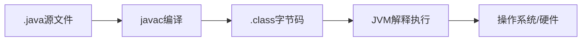
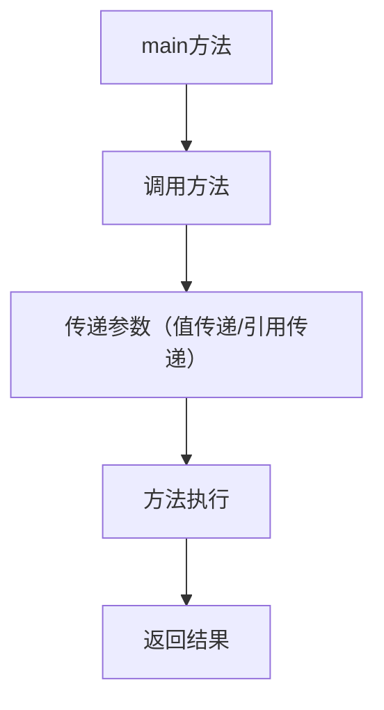
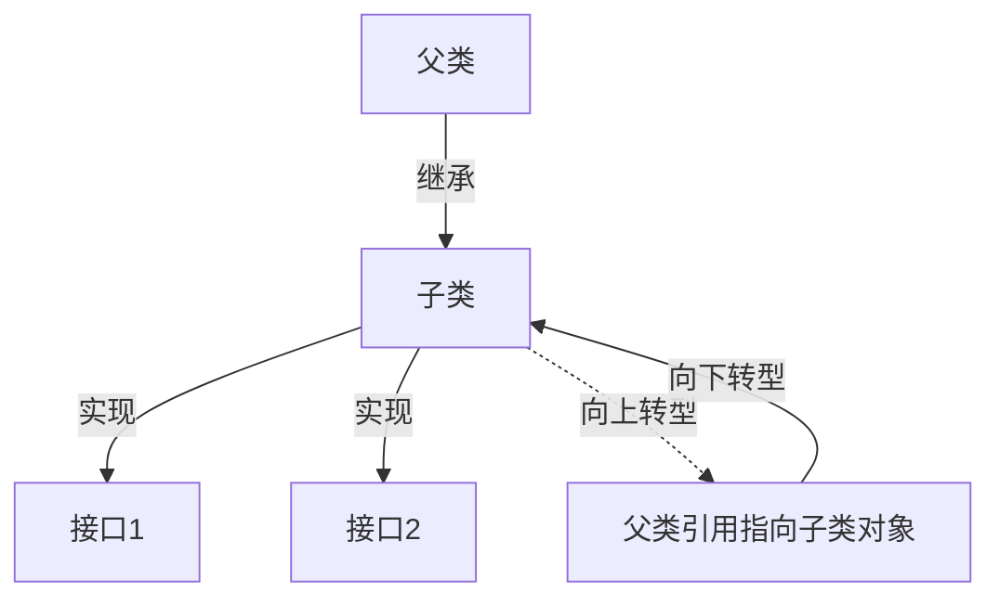

# 《JAVA开发实战经典》章节总结

## 书籍信息

- 书名：JAVA开发实战经典
- 作者：张靓、顾慧敏 等
- PDF 状态：较完整，目录清晰
- OCR 状态：良好

## 目录说明

- 第1部分：Java语言介绍、基本数据类型、运算符、选择与循环、数组与方法
- 第2部分：面向对象（封装、继承、多态、抽象类、接口、异常、包等）

## 全书核心主题

本书通过一个贯穿案例“Romulus考试管理系统”，系统讲解 Java 基础及面向对象编程。内容涵盖 Java 概述、环境搭建、基础语法、类与对象、封装、继承、多态、抽象类、接口、异常、多线程、数据结构、JDBC、I/O、网络编程、GUI（Swing）、JAR、XML、JNI 等，注重实践与案例结合。

---

## 第1章：Java概述及开发环境搭建

### 核心论点

介绍 Java 历史、特性、JVM 原理，并指导安装配置 JDK，编写第一个 Java 程序。

### 关键概念

- Java 三大平台：J2SE/J2ME/J2EE（后更名为 Java SE/ME/EE）
- JVM：实现跨平台的核心
- Path 和 classpath 的作用

### 流程图

---

## 第2章：简单的Java程序

### 核心论点

介绍 Java 程序基本组成：类、main 方法、注释、标识符、关键字、变量与常量。

### 关键概念

- public class 类名必须与文件名一致
- main 方法签名：`public static void main(String[] args)`
- 注释：单行 `//`，多行 `/* */`，文档 `/** */`
- 标识符规则：字母、数字、下划线、$，不能以数字开头

---

## 第3章：Java基础程序设计

### 核心论点

详细讲解 Java 数据类型、类型转换、运算符、表达式、语句（选择、循环）、break/continue。

### 关键概念

- 基本类型：byte, short, int, long, float, double, char, boolean
- 类型转换：自动（扩大）和强制（缩小）
- 运算符优先级、短路与（&&）、短路或（||）
- 流程控制：if-else, switch, for, while, do-while

### 逻辑推演

从变量声明 → 表达式计算 → 条件判断 → 循环控制，逐步建立程序逻辑。

---

## 第4章：数组与方法

### 核心论点

数组的定义、静态初始化、动态初始化、多维数组；方法的定义、重载、递归、参数传递。

### 关键概念

- 数组是引用类型，使用 `new` 分配内存
- 数组长度：`数组名.length`
- 方法重载：同名不同参数
- 递归：方法调用自身，必须有结束条件

### 流程图

---

## 第5章：面向对象（基础篇）

### 核心论点

类和对象的关系、封装性、构造方法、this、static、代码块、内部类、单例模式。

### 关键概念

- 类：属性 + 方法
- 封装：private + setter/getter
- 构造方法：名称与类相同，无返回值，可重载
- this：调用本类属性、方法、构造器
- static：静态属性/方法，类级别共享
- 单例模式：私有构造器 + 静态方法返回唯一实例

### 逻辑推演

封装隐藏内部数据 → 通过公开方法访问 → 构造方法保证初始化 → static 实现全局共享 → 单例控制实例数量。

---

## 第6章：面向对象（高级篇）

### 核心论点

继承、覆写、super、final、抽象类、接口、多态、Object 类、包装类、匿名内部类。

### 关键概念

- 继承：`extends`，子类复用父类
- 方法覆写：子类重新定义父类方法，权限不能更严格
- super：调用父类构造/方法
- final：修饰类（不能继承）、方法（不能覆写）、变量（常量）
- 抽象类：`abstract`，不能实例化，子类必须实现抽象方法
- 接口：`interface`，多继承，全局常量+抽象方法
- 多态：向上转型、向下转型

### 流程图

---

## 第7章：异常处理

### 核心论点

异常概念、try-catch-finally、throws、throw、自定义异常。

### 关键概念

- 异常体系：Throwable → Error / Exception
- 检查异常（Checked）与运行时异常（RuntimeException）
- try-catch-finally 处理异常
- throws 声明抛出，throw 手动抛出

### 逻辑推演

程序可能出错 → 使用 try 包裹可能出错的代码 → catch 捕获并处理 → finally 资源释放。

---

## 第8章：多线程

### 核心论点

线程概念、创建方式（Thread/Runnable）、生命周期、同步（synchronized）、wait/notify。

### 关键概念

- 创建线程：继承 Thread 或实现 Runnable
- 线程状态：新建、就绪、运行、阻塞、死亡
- 同步：解决数据竞争，使用 synchronized 方法或块
- 线程通信：wait()、notify()、notifyAll()

---

## 第9章：Java 数据结构

### 核心论点

Java 集合框架：Collection（List、Set）、Map、迭代器、Comparable、Collections 工具类。

### 关键概念

- List：有序可重复（ArrayList、LinkedList）
- Set：无序不重复（HashSet、TreeSet）
- Map：键值对（HashMap、TreeMap）
- 泛型：类型安全
- 排序：实现 Comparable 或使用 Comparator

---

## 第10章：JDBC

### 核心论点

JDBC 原理、四种驱动、Connection、Statement、ResultSet、PreparedStatement、事务。

### 关键概念

- 加载驱动：`Class.forName("driver")`
- 获取连接：`DriverManager.getConnection(url,user,password)`
- 执行 SQL：`Statement.executeQuery()` / `executeUpdate()`
- 预编译：`PreparedStatement` 防 SQL 注入
- 事务：`setAutoCommit(false)`、`commit()`、`rollback()`

---

## 第11章：输入输出

### 核心论点

I/O 流分类（字节流/字符流）、节点流/处理流、File 类、序列化。

### 关键概念

- InputStream/OutputStream 字节流
- Reader/Writer 字符流
- 缓冲流：BufferedInputStream/BufferedReader
- 对象序列化：Serializable 接口

---

## 第12章：网络编程

### 核心论点

TCP/UDP 编程，Socket、ServerSocket，URL 处理。

### 关键概念

- TCP：Socket/ServerSocket，面向连接
- UDP：DatagramSocket，无连接
- 多线程服务器：每个客户端一个线程处理

---

## 第13章：用户界面

### 核心论点

AWT、Swing 组件，事件处理，布局管理器。

### 关键概念

- JFrame、JPanel、JButton 等组件
- 事件监听：ActionListener 等
- 布局：FlowLayout、BorderLayout、GridLayout

---

（后续章节从略，全书涵盖 JAR、XML、JNI 等）

---

# 