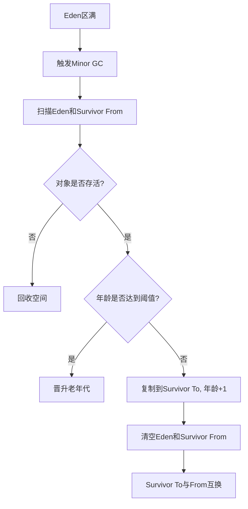
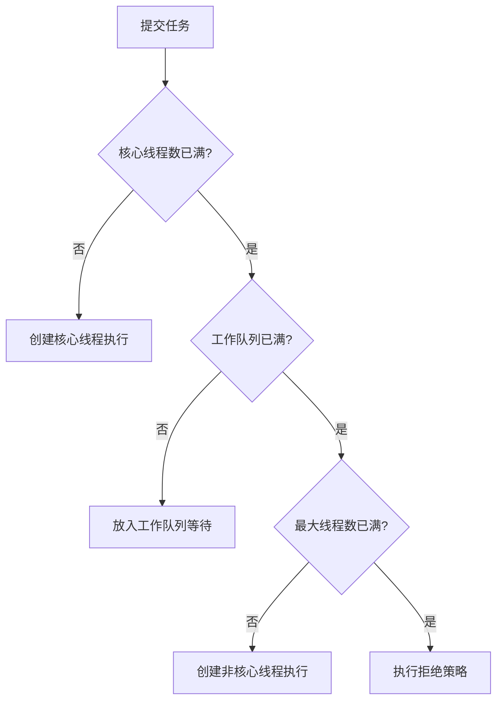
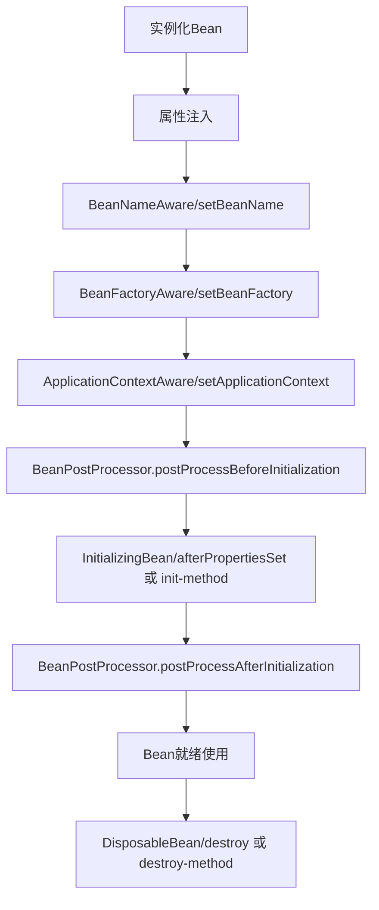
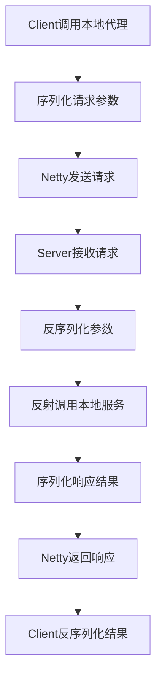

# 《JAVA架构知识库整理》章节总结

## 书籍信息

- **书名**：JAVA架构知识库整理
- **作者**：未知（文档未明确标注具体作者，内容为技术知识汇总）
- **PDF 状态**：文本可识别，结构清晰，包含目录与正文。
- **OCR 状态**：良好，少量格式错位（如表格、代码块），已进行人工校正与结构化重组。

## 目录说明

- **目录识别情况**：文档包含完整的30个主要章节，涵盖JVM、集合、并发、Spring、微服务、中间件、数据库、大数据等Java后端核心技术栈。
- **章节对应依据**：严格遵循文档原始目录顺序（1.目录 -> 30.云计算）。
- **OCR 修复说明**：修正了部分因PDF转换导致的断行、乱码及表格对齐问题；将分散的代码片段整合至对应的概念解释中；统一了标题层级。

## 全书核心主题

本书是一份全面的Java后端架构知识体系指南，旨在为Java开发者提供从基础到高级的系统性知识梳理。内容覆盖JVM底层原理、Java集合框架、多线程并发编程、Spring家族核心原理、微服务架构组件、高性能网络通信（Netty/RPC）、主流中间件（Zookeeper/Kafka/RabbitMQ/Redis）、分布式数据库（HBase/Cassandra/MongoDB）、大数据生态（Hadoop/Spark/Storm）以及云计算基础。全书强调理论与实践结合，不仅解释了“是什么”，还深入探讨了“为什么”和“怎么做”，适合用于构建个人技术知识库或作为面试复习大纲。

---

## 第2章：JVM

### 1. 核心论点

本章解决Java程序如何在虚拟机中运行及内存管理的问题。作者核心观点是：理解JVM内存模型、垃圾回收机制及类加载过程，是进行Java性能调优和解决内存泄漏问题的基础。

### 2. 关键概念 / 关键事件

- **JVM内存区域**：分为线程私有（程序计数器、虚拟机栈、本地方法栈）和线程共享（堆、方法区/元空间）。
- **垃圾回收算法**：包括标记-清除、复制算法、标记-整理及分代收集算法。新生代常用复制算法，老年代常用标记-整理。
- **GC收集器**：Serial、ParNew、Parallel Scavenge/Old、CMS（低停顿）、G1（分区收集，可预测停顿）。
- **类加载机制**：加载、验证、准备、解析、初始化五个阶段，遵循双亲委派模型。

### 3. 逻辑推演 / 叙事脉络

本章首先介绍JVM的基本概念及其跨平台原理。接着详细拆解JVM运行时内存区域，区分线程私有与共享区域，重点讲解堆内存的分代结构（新生代、老年代）。随后深入垃圾回收机制，从如何判断对象存活（引用计数、可达性分析）到具体的回收算法，再到不同场景下的GC收集器选择。最后阐述类加载机制及双亲委派模型的重要性，确保核心类库的安全性与唯一性。

### 4. 经典金句 / 数据

> “Java堆从GC的角度还可以细分为:新生代(Eden区、From Survivor区和 To Survivor区)和老年代。”

> “元空间并不在虚拟机中，而是使用本地内存。因此，默认情况下，元空间的大小仅受本地内存限制。”

### 5. 方法流程图

#### Minor GC 过程

---

## 第3章：JAVA集合

### 1. 核心论点

本章解决Java中数据存储与管理的问题。作者核心观点是：根据不同场景（读写频率、线程安全、排序需求）选择合适的集合实现类（ArrayList, HashMap, ConcurrentHashMap等）是提升程序性能的关键。

### 2. 关键概念 / 关键事件

- **List实现**：ArrayList（数组，随机访问快）、LinkedList（链表，插入删除快）、Vector（线程安全，效率低）。
- **Map实现**：HashMap（数组+链表+红黑树，非线程安全）、ConcurrentHashMap（分段锁/CAS+ synchronized，线程安全）、TreeMap（有序）。
- **Set实现**：HashSet（基于HashMap）、TreeSet（基于TreeMap）、LinkedHashSet（有序）。
- **HashMap演进**：JDK7使用数组+链表，JDK8引入红黑树优化哈希冲突严重时的查询性能（O(n) -> O(logN)）。

### 3. 逻辑推演 / 叙事脉络

本章从Collection接口继承关系入手，分别介绍List、Set、Map三大体系。重点剖析HashMap的内部结构及其在JDK7与JDK8中的实现差异，特别是红黑树的引入条件。随后对比线程安全的HashTable、Collections.synchronizedMap与ConcurrentHashMap，强调ConcurrentHashMap在高并发下的优势（分段锁/JDK8的CAS+Sync）。最后简述其他集合类的特点及应用场景。

### 4. 经典金句 / 数据

> “HashMap最多只允许一条记录的键为null，允许多条记录的值为null。”

> “当链表中的元素超过了8个以后，会将链表转换为红黑树，在这些位置进行查找的时候可以降低时间复杂度为O(logN)。”

---

## 第4章：JAVA多线程并发

### 1. 核心论点

本章解决Java程序中并发执行与线程安全的问题。作者核心观点是：掌握线程生命周期、锁机制（synchronized, ReentrantLock, CAS）、线程池原理及并发工具类（AQS, CountDownLatch等）是构建高并发系统的基础。

### 2. 关键概念 / 关键事件

- **线程状态**：NEW, RUNNABLE, BLOCKED, WAITING, TIMED_WAITING, TERMINATED。
- **锁机制**：悲观锁（synchronized, ReentrantLock）、乐观锁（CAS, AtomicInteger）、偏向锁/轻量级锁/重量级锁升级过程。
- **线程池**：核心参数（corePoolSize, maximumPoolSize, workQueue, handler），四种拒绝策略。
- **AQS**：AbstractQueuedSynchronizer，并发包的核心框架，维护state和FIFO等待队列。
- **volatile**：保证可见性和禁止指令重排，不保证原子性。

### 3. 逻辑推演 / 叙事脉络

本章首先介绍线程的创建方式及生命周期状态。接着深入探讨线程安全问题，引出锁的概念，详细对比synchronized与ReentrantLock的实现原理及优劣。随后讲解轻量级的volatile关键字及其适用场景。重点阐述线程池的工作原理、参数配置及拒绝策略，强调资源复用。最后介绍JUC包下的并发工具类（CountDownLatch, CyclicBarrier, Semaphore）及AQS抽象队列同步器的核心设计思想。

### 4. 经典金句 / 数据

> “synchronized是一个重量级操作，需要调用操作系统相关接口，性能是低效的... Java1.6进行了很多优化，引入了偏向锁和轻量级锁。”

> “CAS操作是抱着乐观的态度进行的，它总是认为自己可以成功完成操作。”

### 5. 方法流程图

#### 线程池执行流程

---

## 第5章：JAVA基础

### 1. 核心论点

本章解决Java语言核心特性理解与应用的问题。作者核心观点是：深入理解异常处理、反射、注解、泛型、序列化及内部类等基础机制，有助于编写更灵活、健壮且易于维护的代码。

### 2. 关键概念 / 关键事件

- **异常体系**：Error（不可控）、Exception（RuntimeException运行时, CheckedException检查时）。
- **反射**：运行时获取类信息（Class, Method, Field），动态创建对象，破坏封装性但提供灵活性。
- **注解**：元数据机制，配合反射实现框架功能（如Spring IOC/AOP）。
- **泛型**：编译期类型检查，类型擦除机制（运行时泛型信息丢失）。
- **序列化**：Serializable接口，transient关键字，serialVersionUID版本控制。

### 3. 逻辑推演 / 叙事脉络

本章从异常分类及处理策略开始，区分运行时异常与检查异常。接着介绍反射机制，说明其如何在运行时动态操作类与方法，是框架设计的基石。随后讲解注解的定义、元注解及处理器实现。再探讨泛型的本质（类型擦除）及使用规范。最后涵盖对象克隆（深/浅拷贝）与序列化机制，强调持久化与远程传输中的注意事项。

### 4. 经典金句 / 数据

> “Java中的泛型基本上都是在编译器这个层次来实现的... 这个过程就称为类型擦除。”

> “序列化并不保存静态变量... transient关键字阻止该变量被序列化到文件中。”

---

## 第6章：SPRING原理

### 1. 核心论点

本章解决Spring框架核心机制理解的问题。作者核心观点是：掌握IOC（控制反转）与AOP（面向切面编程）的原理，以及Bean的生命周期，是熟练使用Spring及其生态（Spring MVC, Spring Boot）的前提。

### 2. 关键概念 / 关键事件

- **IOC容器**：BeanFactory与ApplicationContext，依赖注入（构造器、Setter、自动装配）。
- **Bean生命周期**：实例化 -> 属性赋值 -> 初始化（Aware接口, PostProcessor, init-method） -> 销毁。
- **AOP代理**：JDK动态代理（接口）与CGLIB代理（子类），切面、切入点、通知概念。
- **Spring MVC**：DispatcherServlet核心流程，HandlerMapping, Controller, ViewResolver。
- **Spring Boot**：自动配置原理，Starter机制，内嵌容器。

### 3. 逻辑推演 / 叙事脉络

本章首先概述Spring的特点（轻量、IOC、AOP）。深入解析IOC容器实现，包括BeanDefinition注册、BeanFactory层级结构及Bean的生命周期全过程。接着详解AOP原理，对比JDK与CGLIB代理的选择策略。随后梳理Spring MVC的请求处理流程。最后简要介绍Spring Boot的自动配置机制及JPA事务原理，体现Spring生态的演进。

### 4. 经典金句 / 数据

> “Spring通过一个配置文件描述Bean及Bean之间的依赖关系，利用Java语言的反射功能实例化Bean并建立Bean之间的依赖关系。”

> “默认的策略是如果目标类是接口，则使用JDK动态代理技术，否则使用Cglib来生成代理。”

### 5. 方法流程图

#### Spring Bean 生命周期

---

## 第7章：微服务

### 1. 核心论点

本章解决分布式系统服务治理的问题。作者核心观点是：微服务架构需要通过服务注册发现、API网关、配置中心、熔断器等组件来解决服务间通信、容错及管理复杂性。

### 2. 关键概念 / 关键事件

- **服务注册发现**：Client侧（Zookeeper）与Server侧（Eureka/Consul），客户端发现与服务端发现模式。
- **API网关**：请求转发、负载均衡、安全认证、协议转换（Zuul/Spring Cloud Gateway）。
- **配置中心**：集中管理配置，实时刷新（Zookeeper/Spring Cloud Config）。
- **服务熔断**：Hystrix断路器机制（Open/Half-Open/Closed），防止雪崩效应。
- **服务跟踪**：Sleuth + Zipkin，Trace ID与Span ID链路追踪。

### 3. 逻辑推演 / 叙事脉络

本章从微服务核心组件入手，首先介绍服务注册与发现的两种模式及常见实现（Zookeeper, Eureka）。接着阐述API网关作为系统入口的作用（路由、过滤、聚合）。随后讨论分布式配置管理的重要性及实现。重点讲解服务容错机制，以Hystrix为例说明熔断器原理。最后提及服务跟踪与API管理，形成完整的微服务治理闭环。

### 4. 经典金句 / 数据

> “熔断器的原理很简单，如同电力过载保护器... 如果它在一段时间内侦测到许多类似的错误，会强迫其以后的多个调用快速失败。”

---

## 第8章：NETTY与 RPC

### 1. 核心论点

本章解决高性能网络通信与远程过程调用的问题。作者核心观点是：Netty基于NIO和Reactor模型提供了高性能异步通信能力，是构建RPC框架（如Dubbo）的理想底层基础。

### 2. 关键概念 / 关键事件

- **Netty核心**：Channel, Buffer, Selector, EventLoopGroup, Pipeline。
- **高性能设计**：零拷贝（Direct Buffer）、内存池、无锁串行化、Reactor线程模型（单/多/主从）。
- **RPC实现**：动态代理（客户端）、服务暴露（服务端）、序列化（Protobuf/Hessian）、通信协议设计。
- **序列化对比**：Protobuf（高效、二进制）、Thrift（跨语言）、JSON（可读性好但体积大）。

### 3. 逻辑推演 / 叙事脉络

本章首先介绍Netty的高性能特性及其背后的NIO多路复用原理。详细解析Netty的Reactor线程模型及零拷贝等技术优化手段。接着转入RPC主题，定义RPC概念，拆解其核心流程（代理、编解码、通信）。对比多种序列化协议的优劣。最后简述RMI及Protobuf/Thrift的具体应用，展示如何基于Netty构建高效的RPC系统。

### 4. 经典金句 / 数据

> “Netty采用了串行无锁化设计，在IO线程内部进行串行操作，避免多线程竞争导致的性能下降。”

### 5. 方法流程图

#### RPC 通讯过程

---

## 第9章：网络

### 1. 核心论点

本章解决计算机网络基础与协议细节的问题。作者核心观点是：深入理解TCP/IP协议栈、HTTP/HTTPS原理及负载均衡策略，是排查网络问题和优化Web性能的基础。

### 2. 关键概念 / 关键事件

- **TCP/IP**：三次握手（SYN, SYN-ACK, ACK）、四次挥手、滑动窗口、拥塞控制。
- **HTTP/HTTPS**：无状态协议、状态码（200, 301, 404, 500）、SSL/TLS加密流程。
- **负载均衡**：四层（LVS/Nginx TCP） vs 七层（Nginx HTTP/HAProxy），算法（轮询、加权、最少连接）。
- **CDN**：内容分发网络，边缘节点缓存，DNS调度。

### 3. 逻辑推演 / 叙事脉络

本章从OSI七层模型与TCP/IP四层模型概览开始。重点剖析TCP连接的建立与断开过程（握手/挥手），解释其可靠性保障。接着介绍应用层HTTP协议的工作流程、状态码含义及HTTPS的安全机制（证书交换、对称加密）。最后探讨负载均衡的技术选型（L4 vs L7）及CDN加速原理，构建完整的网络知识体系。

### 4. 经典金句 / 数据

> “TCP建立连接要进行三次握手，而断开连接要进行四次。这是由于TCP的半关闭造成的。”

---

## 第10章：日志

### 1. 核心论点

本章解决系统日志记录与分析的问题。作者核心观点是：合理使用日志框架（SLF4J+Logback）并结合ELK栈进行集中式日志管理，是系统监控与故障排查的关键。

### 2. 关键概念 / 关键事件

- **日志门面**：SLF4J，解耦日志实现。
- **日志实现**：Log4j（老牌）、Logback（高性能、原生支持SLF4J）。
- **ELK栈**：Elasticsearch（存储检索）、Logstash（收集过滤）、Kibana（可视化）。

### 3. 逻辑推演 / 叙事脉络

本章首先介绍日志门面SLF4J的作用。对比Log4j与Logback的优缺点，推荐Logback。最后引入大规模日志处理方案ELK，简述各组件职责，形成从日志生成到收集、存储、展示的完整链路。

---

## 第11章：ZOOKEEPER

### 1. 核心论点

本章解决分布式协调服务的问题。作者核心观点是：Zookeeper基于ZAB协议提供强一致性保证，适用于分布式锁、Leader选举、配置管理等场景。

### 2. 关键概念 / 关键事件

- **角色**：Leader（处理写请求）、Follower（处理读请求、投票）、Observer（不参与投票）。
- **ZAB协议**：原子广播协议，包含恢复模式（选主）和广播模式（同步）。
- **数据模型**：树形结构Znode，四种节点类型（持久/临时，顺序/非顺序）。
- **Watcher机制**：一次性触发，用于监听节点变化。

### 3. 逻辑推演 / 叙事脉络

本章介绍Zookeeper的核心概念及集群角色。深入解析ZAB协议的两个阶段：崩溃恢复（Leader选举）和消息广播。详细说明Znode的类型及其应用场景。最后简述其工作原理（原子广播）及投票机制，强调其在分布式系统中的一致性保障。

### 4. 经典金句 / 数据

> “ZAB协议有两种模式，它们分别是恢复模式（选主）和广播模式（同步）。”

---

## 第12章：KAFKA

### 1. 核心论点

本章解决高吞吐量消息队列的问题。作者核心观点是：Kafka通过顺序读写、零拷贝、分页索引等设计实现了极高的吞吐能力，适合大数据日志采集与流处理。

### 2. 关键概念 / 关键事件

- **核心组件**：Broker, Topic, Partition, Offset, Producer, Consumer Group。
- **存储设计**：Segment分段存储，稀疏索引，顺序追加写。
- **高吞吐原理**：批量发送、压缩、零拷贝（sendfile）。
- **消费者组**：组内均衡消费Partition，组间广播。

### 3. 逻辑推演 / 叙事脉络

本章首先介绍Kafka的基本概念。重点解析其数据存储设计（Partition分段、索引），解释其高吞吐量的来源（顺序IO、零拷贝）。接着探讨生产者负载均衡与批量发送策略，以及消费者组的重平衡机制。最后简述其与Zookeeper的交互（旧版本依赖，新版本逐步去ZK化）。

### 4. 经典金句 / 数据

> “Kafka不删除已消费的消息... 对于partition，顺序读写磁盘数据，以时间复杂度O(1)方式提供消息持久化能力。”

---

## 第13章：RABBITMQ

### 1. 核心论点

本章解决灵活路由消息队列的问题。作者核心观点是：RabbitMQ基于AMQP协议，通过Exchange路由机制提供了比Kafka更灵活的消息分发能力，适合复杂业务逻辑解耦。

### 2. 关键概念 / 关键事件

- **核心组件**：Producer, Exchange, Queue, Binding, Consumer。
- **Exchange类型**：Direct（精确匹配）、Fanout（广播）、Topic（模式匹配）、Headers。
- **可靠性保障**：持久化、ACK确认机制、镜像队列。

### 3. 逻辑推演 / 叙事脉络

本章介绍RabbitMQ的架构组件。重点详解四种Exchange类型的路由规则及其应用场景。探讨消息可靠性保障机制（持久化、确认）。对比其与Kafka的差异（灵活性 vs 吞吐量）。

### 4. 经典金句 / 数据

> “Fanout：每个发到fanout类型交换器的消息都会分到所有绑定的队列上去... fanout类型转发消息是最快的。”

---

## 第14章：HBASE

### 1. 核心论点

本章解决海量数据列式存储的问题。作者核心观点是：HBase基于HDFS构建，通过RowKey设计与列族存储实现了海量数据的随机实时读写，适合宽表场景。

### 2. 关键概念 / 关键事件

- **数据模型**：RowKey, Column Family, Cell, Timestamp。
- **架构**：HMaster, RegionServer, Zookeeper, HDFS。
- **读写流程**：Write-Ahead Log (WAL), MemStore, StoreFile (HFile), Compaction。
- **寻址**：.META.表（旧版本）或 Meta Region，Zookeeper引导。

### 3. 逻辑推演 / 叙事脉络

本章介绍HBase的列式存储概念。解析其核心数据模型（RowKey重要性）。详述系统架构组件及交互。重点剖析写流程（WAL+MemStore）与读流程（BlockCache+MemStore+StoreFile），以及Compaction合并机制。最后对比HBase与Cassandra的优劣。

### 4. 经典金句 / 数据

> “HBase只支持3种查询方式：基于Rowkey的单行查询，基于Rowkey的范围扫描，全表扫描。”

---

## 第15章：MONGODB

### 1. 核心论点

本章解决文档型NoSQL数据库应用的问题。作者核心观点是：MongoDB以BSON格式存储数据， schema-free特性使其适合快速迭代及半结构化数据存储。

### 2. 关键概念 / 关键事件

- **文档模型**：Collection, Document, BSON。
- **特性**：动态Schema, 丰富的查询语言, GridFS文件存储。
- **扩展性**：Replica Set（副本集）, Sharding（分片）。

### 3. 逻辑推演 / 叙事脉络

本章简述MongoDB的概念与特点。强调其文档存储的灵活性与查询能力的丰富性。介绍其高可用（副本集）与水平扩展（分片）机制。

---

## 第16章：CASSANDRA

### 1. 核心论点

本章解决高可用分布式宽列存储的问题。作者核心观点是：Cassandra采用P2P架构与最终一致性模型，牺牲强一致性以换取极高的写入可用性与线性扩展能力。

### 2. 关键概念 / 关键事件

- **架构**：P2P, Gossip协议, Consistent Hashing（虚拟节点）。
- **数据模型**：Keyspace, Column Family, Super Column。
- **一致性**：Tunable Consistency (N, W, R策略), Read Repair。
- **存储引擎**：CommitLog, MemTable, SSTable, Bloom Filter。

### 3. 逻辑推演 / 叙事脉络

本章介绍Cassandra的P2P架构与Gossip通信机制。详解一致性哈希与虚拟节点如何解决数据均衡问题。阐述其可调一致性级别（NWR）及读写修复机制。最后解析其LSM树存储引擎结构（SSTable, Bloom Filter），强调其写优化特性。

### 4. 经典金句 / 数据

> “Cassandra总是认为返回数据是对的... 删除一个column其实只是插入一个关于这个column的墓碑（tombstone）。”

---

## 第17章：设计模式

### 1. 核心论点

本章解决软件设计中常见问题的标准化解决方案。作者核心观点是：熟练掌握23种设计模式，有助于提高代码的可复用性、可扩展性与可维护性。

### 2. 关键概念 / 关键事件

- **创建型**：单例、工厂、建造者、原型。
- **结构型**：适配器、装饰器、代理、外观。
- **行为型**：观察者、策略、模板方法、责任链。

### 3. 逻辑推演 / 叙事脉络

本章列举了常见的设计模式分类及具体模式名称。虽未展开每个模式的详细代码，但强调了其在解耦与复用中的作用。建议结合实际场景（如Spring源码中的应用）进行深入理解。

---

## 第18章：负载均衡

### 1. 核心论点

本章解决流量分发与服务高可用的问题。作者核心观点是：根据网络层级（L4/L7）选择合适的负载均衡器（LVS/Nginx/HAProxy）及算法，是构建高并发集群的第一步。

### 2. 关键概念 / 关键事件

- **L4 vs L7**：四层基于IP/Port，性能高；七层基于HTTP内容，功能强。
- **LVS模式**：NAT（地址转换）, DR（直接路由）, TUN（隧道）, FullNAT。
- **算法**：轮询、加权、最少连接、IP Hash。
- **Keepalived**：VRRP协议，实现LVS/Nginx的高可用切换。

### 3. 逻辑推演 / 叙事脉络

本章对比四层与七层负载均衡的优缺点。重点详解LVS的四种工作模式及其适用场景。介绍常见的调度算法。最后提及Keepalived在实现负载均衡器自身高可用中的作用。

### 4. 经典金句 / 数据

> “DR模式的效率很高，但是配置稍微复杂一点... 日1000-2000W PV或者并发请求1万一下都可以考虑用haproxy/nginx。”

---

## 第19章：数据库

### 1. 核心论点

本章解决关系型数据库核心原理与优化的问题。作者核心观点是：深入理解存储引擎（InnoDB）、索引结构（B+树）、事务隔离级别及锁机制，是进行SQL优化与设计的基础。

### 2. 关键概念 / 关键事件

- **存储引擎**：InnoDB（支持事务、行锁、B+树）, MyISAM（不支持事务、表锁）。
- **索引**：B+树结构，聚簇索引 vs 非聚簇索引，最左前缀原则。
- **事务ACID**：原子性、一致性、隔离性、持久性。
- **锁**：行锁、表锁、间隙锁，乐观锁 vs 悲观锁。
- **分布式事务**：2PC, 3PC, 柔性事务（TCC, 最大努力通知）。

### 3. 逻辑推演 / 叙事脉络

本章从存储引擎对比入手，重点解析InnoDB的B+树索引原理。阐述事务ACID特性及隔离级别带来的问题（脏读、幻读）。详解锁机制及其并发控制策略。最后延伸至分布式环境下的事务解决方案（2PC/3PC/柔性事务），应对微服务架构挑战。

### 4. 经典金句 / 数据

> “最左前缀匹配原则，非常重要的原则。”

> “CAP原则又称CAP定理，指的是在一个分布式系统中，Consistency（一致性）、Availability（可用性）、Partition tolerance（分区容忍性），三者不可得兼。”

---

## 第20章：一致性算法

### 1. 核心论点

本章解决分布式系统数据一致性问题。作者核心观点是：Paxos、Raft、ZAB等共识算法是分布式存储与协调服务的核心，确保在部分节点故障时系统仍能达成一致性。

### 2. 关键概念 / 关键事件

- **Paxos**：Proposer, Acceptor, Learner，两阶段提交。
- **Raft**：Leader, Follower, Candidate，Term任期，日志复制。
- **ZAB**：Zookeeper专用，类似Raft但侧重主备切换。
- **NWR**：Quorum机制，W+R>N保证强一致性。
- **Gossip**：最终一致性，病毒式传播。

### 3. 逻辑推演 / 叙事脉络

本章介绍几种主流一致性算法。简述Paxos的复杂性。重点讲解更易理解的Raft算法（选举、日志复制）。对比ZAB与Raft的异同。介绍NWR模型及Gossip协议在去中心化系统中的应用。

### 4. 经典金句 / 数据

> “Raft强调的是易懂（Understandability）... Raft把算法流程分为三个子问题：选举、日志复制、安全性。”

---

## 第21章：JAVA算法

### 1. 核心论点

本章解决常见数据结构与算法实现的问题。作者核心观点是：掌握排序、查找、递归等基本算法，是提升逻辑思维与解决复杂编程问题的能力基础。

### 2. 关键概念 / 关键事件

- **排序**：冒泡、插入、快速排序、归并排序、希尔排序、桶排序、基数排序。
- **查找**：二分查找。
- **其他**：剪枝、回溯、最短路径（Dijkstra）、最大子数组。

### 3. 逻辑推演 / 叙事脉络

本章列举了多种经典算法的Java实现代码。重点展示了快速排序、归并排序等高效排序算法的逻辑。提供了二分查找等基础查找算法示例。旨在通过代码实践巩固算法基础。

### 4. 经典金句 / 数据

> “快速排序的原理：选择一个关键值作为基准值。比基准值小的都在左边序列，比基准值大的都在右边。”

---

## 第22章：数据结构

### 1. 核心论点

本章解决数据组织与存储结构的问题。作者核心观点是：理解栈、队列、链表、树（二叉树、红黑树、B树）、哈希表等数据结构特性，是选择合适容器与优化算法的前提。

### 2. 关键概念 / 关键事件

- **线性结构**：栈（LIFO）、队列（FIFO）、链表。
- **树结构**：二叉排序树、红黑树（自平衡、旋转）、B-Tree/B+Tree（多路平衡、磁盘友好）。
- **哈希**：散列表，冲突解决（链地址法）。
- **位图**：Bitmap，节省空间的状态标记。

### 3. 逻辑推演 / 叙事脉络

本章依次介绍常见数据结构。重点解析红黑树的五大特性及旋转操作，解释其为何被用于HashMap/TreeMap。详解B+树结构及其在数据库索引中的应用。简述哈希表原理及位图的应用场景。

### 4. 经典金句 / 数据

> “B+树的叶子节点包含全部关键字信息... 所有的非终端结点可以看成是索引部分。”

---

## 第23章：加密算法

### 1. 核心论点

本章解决数据安全与完整性校验问题。作者核心观点是：合理运用对称加密（AES）、非对称加密（RSA）及哈希摘要（MD5/CRC），可保障数据传输与存储的安全。

### 2. 关键概念 / 关键事件

- **对称加密**：AES，密钥相同，速度快。
- **非对称加密**：RSA，公钥加密私钥解密，速度慢，用于密钥交换/签名。
- **哈希/校验**：MD5（摘要，不可逆），CRC（校验码）。

### 3. 逻辑推演 / 叙事脉络

本章简述AES与RSA的原理及应用场景对比。介绍MD5在文件校验与密码存储中的应用。提及CRC在数据传输错误检测中的作用。

---

## 第24章：分布式缓存

### 1. 核心论点

本章解决缓存常见问题与策略。作者核心观点是：正确处理缓存穿透、雪崩、击穿等问题，并制定合理的预热、更新与降级策略，是保障后端稳定性的关键。

### 2. 关键概念 / 关键事件

- **缓存雪崩**：大量Key同时过期，解决：随机过期时间、互斥锁。
- **缓存穿透**：查询不存在数据，解决：布隆过滤器、缓存空对象。
- **缓存预热**：上线前加载热点数据。
- **缓存降级**：高峰期牺牲非核心服务，保核心。

### 3. 逻辑推演 / 叙事脉络

本章定义并解析缓存雪崩、穿透、击穿三大难题及其解决方案。介绍缓存预热、更新策略（定时/惰性）。最后阐述缓存降级在极端流量下的保护作用。

### 4. 经典金句 / 数据

> “最常见的则是采用布隆过滤器，将所有可能存在的数据哈希到一个足够大的bitmap中... 从而避免了对底层存储系统的查询压力。”

---

## 第25章：HADOOP

### 1. 核心论点

本章解决大数据离线存储与计算问题。作者核心观点是：HDFS提供分布式存储，MapReduce提供分布式计算，YARN提供资源调度，三者构成大数据生态基石。

### 2. 关键概念 / 关键事件

- **HDFS**：NameNode（元数据）, DataNode（数据块）, SecondaryNameNode（Checkpoint）。
- **MapReduce**：JobTracker/TaskTracker（旧）, Map/Reduce阶段, Shuffle过程。
- **YARN**：ResourceManager, NodeManager, ApplicationMaster。

### 3. 逻辑推演 / 叙事脉络

本章介绍Hadoop核心组件。详解HDFS架构及读写流程。解析MapReduce的计算模型及Shuffle关键过程。最后介绍YARN的资源调度架构，取代旧版JT/TT，实现多框架共用集群。

### 4. 经典金句 / 数据

> “HDFS以固定大小的block为基本单位存储数据... 默认情况下block大小为64MB（新版128MB）。”

---

## 第26章：SPARK

### 1. 核心论点

本章解决大数据内存迭代计算问题。作者核心观点是：Spark基于RDD内存计算模型，比MapReduce更快，支持批处理、流处理、SQL及机器学习统一引擎。

### 2. 关键概念 / 关键事件

- **RDD**：弹性分布式数据集，Transformation（延迟） vs Action（触发）。
- **架构**：Driver, Executor, Cluster Manager (Standalone/YARN)。
- **组件**：Spark Core, SQL, Streaming, MLlib, GraphX。
- **DAG**：有向无环图，Stage划分。

### 3. 逻辑推演 / 叙事脉络

本章介绍Spark核心概念RDD及其算子分类。解析Spark运行架构及任务提交流程（DAGScheduler, TaskScheduler）。对比其与Hadoop MR的优势（内存迭代）。简述其生态组件。

### 4. 经典金句 / 数据

> “Transformation操作是延迟计算的... Action算子会触发Spark提交作业。”

---

## 第27章：STORM

### 1. 核心论点

本章解决实时流计算问题。作者核心观点是：Storm提供低延迟的实时数据处理能力，通过Topology模型（Spout/Bolt）实现无限数据流的持续计算。

### 2. 关键概念 / 关键事件

- **架构**：Nimbus（主控）, Supervisor（工作）, Worker, Executor, Task。
- **编程模型**：Spout（源）, Bolt（处理）, Tuple（数据单元）, Stream Grouping（分流策略）。
- **可靠性**：ACK机制，保证消息不丢失。

### 3. 逻辑推演 / 叙事脉络

本章介绍Storm集群角色及进程/线程/任务层级关系。详解Topology编程模型及Stream Grouping策略（Shuffle, Fields, All等）。强调其实时性与低延迟特性。

### 4. 经典金句 / 数据

> “Storm中最重要的抽象，应该就是Stream grouping了，它能够控制Spout/Bolt对应的Task以什么样的方式来分发Tuple。”

---

## 第28章：YARN

### 1. 核心论点

本章解决集群资源统一调度问题。作者核心观点是：YARN将资源管理与任务调度分离，使Hadoop集群能同时运行MR、Spark等多种计算框架，提高资源利用率。

### 2. 关键概念 / 关键事件

- **组件**：ResourceManager（全局资源）, NodeManager（单节点资源）, ApplicationMaster（单应用管理）, Container（资源抽象）。
- **流程**：App提交 -> RM启动AM -> AM申请资源 -> NM启动Container。

### 3. 逻辑推演 / 叙事脉络

本章介绍YARN三大核心组件职责。详细梳理应用程序在YARN上的运行全流程。强调其作为操作系统般的资源管理角色。

---

## 第29章：机器学习

### 1. 核心论点

本章简述常见机器学习算法。作者核心观点是：了解决策树、SVM、聚类、神经网络等基本概念，有助于拓展技术视野，适应AI融合趋势。

### 2. 关键概念 / 关键事件

- **监督学习**：决策树、随机森林、逻辑回归、SVM、朴素贝叶斯。
- **无监督学习**：K-Means聚类。
- **其他**：KNN, Adaboost, 神经网络。

### 3. 逻辑推演 / 叙事脉络

本章仅列出常见算法名称，未深入数学原理。旨在提供知识地图，建议读者针对特定算法深入学习。

---

## 第30章：云计算

### 1. 核心论点

本章解决基础设施虚拟化与服务化问题。作者核心观点是：IaaS/PaaS/SaaS分层服务模式及Docker容器化技术，正在重塑软件交付与运维方式。

### 2. 关键概念 / 关键事件

- **服务模型**：IaaS（基础设施）, PaaS（平台）, SaaS（软件）。
- **Docker**：Namespace（隔离）, Cgroups（限制）, UnionFS（镜像分层）, Container（运行时）。
- **OpenStack**：开源云平台管理系统。

### 3. 逻辑推演 / 叙事脉络

本章介绍云计算三种服务模式。重点解析Docker核心技术原理（Namespace, Cgroups, UnionFS），解释容器如何实现轻量级隔离与快速部署。简述OpenStack作用。

### 4. 经典金句 / 数据

> “容器和镜像的区别就在于，所有的镜像都是只读的，而每一个容器其实等于镜像加上一个可读写的层。”