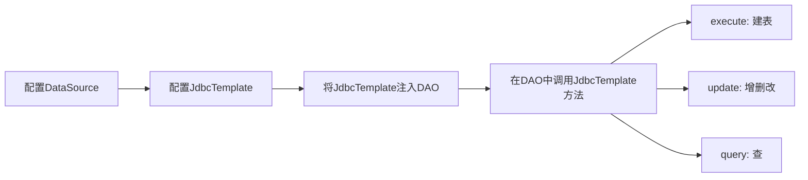
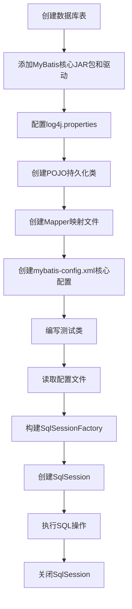
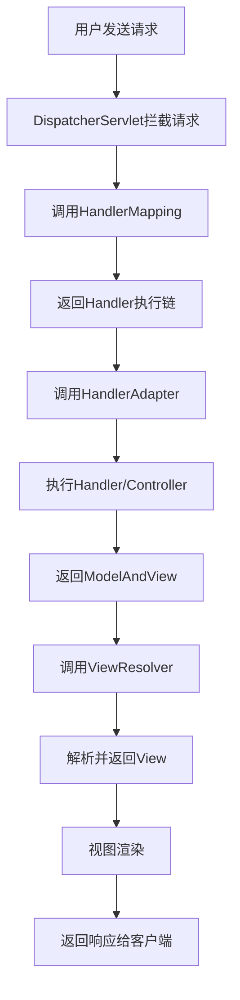
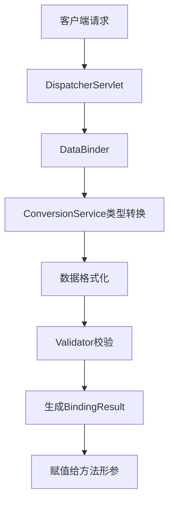
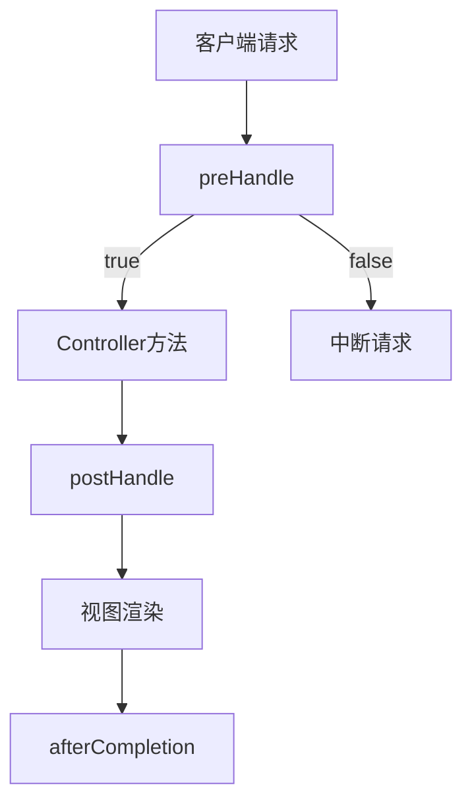
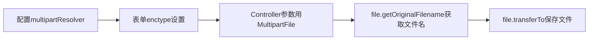

# 《Java EE企业级应用开发教程（Spring+Spring MVC+MyBatis）》章节总结

## 书籍信息
- **书名**：Java EE企业级应用开发教程（Spring+Spring MVC+MyBatis）
- **作者**：黑马程序员
- **出版社**：人民邮电出版社
- **出版时间**：2017年9月第1版
- **PDF状态**：完整（共5个part文件，约325页）
- **OCR状态**：已识别，部分页面存在识别偏移但内容完整

## 目录说明
- **目录识别情况**：完整识别全书18章目录结构
- **章节对应依据**：按原书页码顺序整理
- **OCR修复说明**：部分代码块存在格式偏移，已基于上下文修正

## 全书核心主题

本书系统讲解Java EE轻量级开发框架SSM（Spring+Spring MVC+MyBatis）的核心知识与应用。全书分为四大模块：

1. **Spring框架（第1-5章）**：从IoC/DI容器、Bean管理、AOP面向切面编程，到数据库支持和事务管理，构建完整的Spring知识体系。

2. **MyBatis框架（第6-10章）**：从ORM概念、核心配置、动态SQL、关联映射，到与Spring的整合，掌握持久层框架的使用。

3. **Spring MVC框架（第11-16章）**：从入门配置、核心注解、数据绑定、JSON交互、拦截器，到文件上传下载，掌握Web层开发技术。

4. **综合实战（第17-18章）**：SSM三大框架整合，并通过BOOT客户管理系统完整演示企业级开发全流程。

---

## 第1章：Spring的基本应用

### 1. 核心论点

**问题**：企业级Java开发中如何降低组件间的耦合度、简化开发流程？

**观点**：Spring通过IoC（控制反转）和DI（依赖注入）机制，将对象的创建和依赖关系管理交给Spring容器，实现松耦合、可测试、易维护的企业级应用开发。

### 2. 关键概念

- **Spring**：分层的Java SE/EE full-stack轻量级开源框架，以IoC和AOP为内核，使用基本JavaBean完成EJB的工作。
- **IoC（控制反转）**：对象的实例不再由调用者创建，而是由Spring容器创建，控制权由应用代码转移到Spring容器。
- **DI（依赖注入）**：Spring容器负责将被依赖对象赋值给调用者的成员变量，动态地将所依赖的对象注入Bean组件中。
- **ApplicationContext**：BeanFactory的子接口，包含BeanFactory所有功能，还添加了对国际化、资源访问、事件传播的支持。
- **BeanFactory**：基础类型的IoC容器，负责初始化各种Bean并调用它们的生命周期方法。

### 3. 逻辑推演

**Spring的优点推导过程**：
1. **问题起点**：传统Java EE开发中，EJB臃肿、低效，对象间耦合度高。
2. **解决方案引入**：Spring采用非侵入式设计，使应用程序代码对框架依赖最小化。
3. **核心机制**：Spring容器作为“大工厂”，统一管理所有对象的创建和依赖关系。
4. **功能扩展**：支持AOP集中处理通用任务（安全、事务、日志）；支持声明式事务管理。
5. **生态整合**：方便集成Struts、Hibernate、MyBatis等优秀框架，降低Java EE API使用难度。

**依赖注入的两种实现方式**：
- **属性setter方法注入**（最常用）：通过调用无参构造器实例化Bean后，调用该Bean的setter方法注入依赖。
- **构造方法注入**：通过调用带参数的构造方法实现，每个参数代表一个依赖。

### 4. Spring体系结构图

```mermaid
graph TD
    subgraph “Core Container”
        Beans[Beans模块]
        Core[Core模块]
        Context[Context模块]
        SpEL[SpEL模块]
    end
    
    subgraph “Data Access/Integration”
        JDBC[JDBC模块]
        ORM[ORM模块]
        OXM[OXM模块]
        JMS[JMS模块]
        Transactions[Transactions模块]
    end
    
    subgraph “Web”
        WebSocket[WebSocket模块]
        Servlet[Servlet模块]
        Web[Web模块]
        Portlet[Portlet模块]
    end
    
    subgraph “Other”
        AOP[AOP模块]
        Aspects[Aspects模块]
        Instrumentation[Instrumentation模块]
        Messaging[Messaging模块]
        Test[Test模块]
    end
```

### 5. 经典金句/数据

> “Spring是一个大工厂，可以将所有对象的创建和依赖关系的维护工作都交给Spring容器管理，大大地降低了组件之间的耦合性。”（p.2）

> “依赖注入的作用就是在使用Spring框架创建对象时，动态地将其所依赖的对象注入Bean组件中。”（p.11）

> “当某个Java对象（调用者）需要调用另一个Java对象（被调用者）时，在传统模式下，调用者通常会采用‘new被调用者’的代码方式来创建对象，这种方式会导致调用者与被调用者之间的耦合性增加。”（p.11）

---

## 第2章：Spring中的Bean

### 1. 核心论点

**问题**：如何高效地配置、实例化和管理Spring容器中的Bean？

**观点**：Spring通过<bean>元素的属性配置支持三种实例化方式（构造器、静态工厂、实例工厂），并通过作用域和生命周期管理实现Bean的精细化控制，同时提供XML、注解和自动装配三种装配方式满足不同场景需求。

### 2. 关键概念

- **Bean实例化的三种方式**：
  - **构造器实例化**：Spring容器通过Bean对应类中默认的无参构造方法来实例化Bean（最常用）。
  - **静态工厂方式实例化**：通过静态工厂类的方法创建Bean实例，配置中使用factory-method属性指定静态工厂方法。
  - **实例工厂方式实例化**：通过实例工厂类的非静态方法创建Bean实例，配置中使用factory-bean和factory-method属性。
- **Bean的作用域**：singleton（单例，默认）、prototype（原型）、request、session、globalSession、application、websocket共7种。
- **Bean的生命周期**：从实例化→属性注入→Aware接口方法→初始化方法→使用→销毁方法的完整过程。
- **Bean的装配方式**：基于XML装配（设值注入/构造注入）、基于Annotation装配、自动装配（byName/byType）。

### 3. 逻辑推演

**Bean生命周期的递进过程**：
1. **实例化阶段**：调用构造方法或工厂方法实例化Bean。
2. **属性注入阶段**：利用依赖注入完成所有属性值的配置注入。
3. **Aware接口处理**：依次执行BeanNameAware→BeanFactoryAware→ApplicationContextAware。
4. **初始化阶段**：BeanPostProcessor预初始化→InitializingBean→自定义init-method→BeanPostProcessor后初始化。
5. **使用阶段**：根据作用域（singleton存入缓存池/prototype交给调用者）决定Spring的管理范围。
6. **销毁阶段**：DisposableBean的destroy()方法→自定义destroy-method。

**三种装配方式的比较**：
- XML装配：配置清晰但臃肿，适合大型项目的基础配置。
- 注解装配：简化配置，@Repository/@Service/@Controller/@Component分别标注不同层次，配合@ComponentScan使用。
- 自动装配：通过autowire属性（byName/byType）自动匹配，进一步减少配置量。

### 4. 经典金句/数据

> “Spring容器可以管理singleton作用域的Bean的生命周期，在此作用域下，Spring能够精确地知道该Bean何时被创建，何时初始化完成以及何时被销毁。”（p.23）

> “@Autowired默认按照Bean类型装配，而@Resource默认按照Bean实例名称进行装配。”（p.28）

> “设置autowire=‘byName’后，Spring会自动寻找userService Bean中的属性，并将其属性名称与配置文件中定义的Bean做匹配。”（p.33）

---

## 第3章：Spring AOP

### 1. 核心论点

**问题**：如何将分散在各个方法中的重复代码（事务、日志、权限）以横向抽取的方式统一管理？

**观点**：AOP（面向切面编程）通过动态代理技术（JDK代理或CGLIB代理）将横切关注点从业务逻辑中分离，在不修改源代码的情况下为目标对象添加增强处理，实现代码复用和松耦合。

### 2. 关键概念

- **AOP术语**：
  - **Aspect（切面）**：封装用于横向插入系统功能的类。
  - **Joinpoint（连接点）**：程序执行过程中的某个阶段点（Spring中指甲方法的调用）。
  - **Pointcut（切入点）**：需要处理的连接点的集合（如所有以add开头的方法）。
  - **Advice（通知/增强处理）**：在特定切入点执行的程序代码（切面类中的方法）。
  - **Target Object（目标对象）**：被通知的对象（被增强对象）。
  - **Proxy（代理）**：将通知应用到目标对象后动态创建的对象。
  - **Weaving（织入）**：将切面代码插入到目标对象上生成代理对象的过程。
- **通知类型**：前置通知(MethodBeforeAdvice)、后置通知(AfterReturningAdvice)、环绕通知(MethodInterceptor)、异常通知(ThrowsAdvice)、引介通知(IntroductionInterceptor)。
- **动态代理**：
  - **JDK动态代理**：通过java.lang.reflect.Proxy类实现，要求目标对象实现接口。
  - **CGLIB代理**：通过字节码技术生成目标类的子类，对没有实现接口的类进行代理。

### 3. 逻辑推演

**AOP解决的问题推导**：
1. **问题起点**：传统OOP中，事务处理、日志记录等代码分散在各个方法中，修改成本高、出错率大。
2. **解决方案**：AOP采用横向抽取机制，将重复代码提取出来，在程序编译或运行时应用到需要执行的地方。
3. **技术实现**：Spring提供两种动态代理方式——JDK动态代理（有接口）和CGLIB代理（无接口）。
4. **框架演进**：从Spring 2.0开始引入对AspectJ的支持，提供更强大的AOP功能，推荐使用AspectJ进行开发。

**JDK动态代理 vs CGLIB代理**：
- JDK代理：要求目标类实现接口，通过Proxy.newProxyInstance()创建代理对象。
- CGLIB代理：不要求实现接口，通过Enhancer创建目标类的子类作为代理对象。

### 4. AspectJ开发流程图

```mermaid
graph TD
    A[定义切面类MyAspect] --> B[添加@Aspect注解]
    B --> C[定义切入点@Pointcut]
    C --> D[定义通知方法]
    
    D --> E1[@Before 前置通知]
    D --> E2[@AfterReturning 后置通知]
    D --> E3[@Around 环绕通知]
    D --> E4[@AfterThrowing 异常通知]
    D --> E5[@After 最终通知]
    
    E1 --> F[在springmvc-config.xml中配置]
    E2 --> F
    E3 --> F
    E4 --> F
    E5 --> F
    
    F --> G[<context:component-scan base-package/>]
    G --> H[<aop:aspectj-autoproxy/>]
```

### 5. 经典金句/数据

> “AOP采取横向抽取机制，将分散在各个方法中的重复代码提取出来，然后在程序编译或运行时，再将这些提取出来的代码应用到需要执行的地方。”（p.35）

> “Spring中的AOP代理默认就是使用JDK动态代理的方式来实现的。”（p.41）

> “虽然使用嵌套查询的方式比较简单，但是MyBatis嵌套查询的方式要执行多条SQL语句，这对于大型数据集集合和列表展示不是很好。”（p.145，技术原理可类比AOP代理选择）

---

## 第4章：Spring的数据库开发

### 1. 核心论点

**问题**：如何简化JDBC开发中烦琐的数据库操作代码和错误处理？

**观点**：Spring的JdbcTemplate类封装了JDBC核心功能，通过模板方法模式大大简化了数据库操作，开发者只需关注SQL语句和参数传递，无需处理资源获取、释放和异常转换。

### 2. 关键概念

- **JdbcTemplate**：Spring JDBC的核心类，继承自JdbcAccessor，实现JdbcOperations接口，提供了添加、修改、查询和删除等操作。
- **DataSource**：Spring配置中的数据源，负责获取数据库连接，支持连接池和分布式事务。
- **SQLExceptionTranslator**：负责对SQLException进行转译工作，将检查型异常转换为Spring的非检查型异常。
- **JdbcTemplate常用方法**：
  - `execute(String sql)`：执行DDL语句（如建表）
  - `update(String sql, Object... args)`：执行DML语句（增、删、改）
  - `query(String sql, RowMapper rowMapper)`：执行查询，返回List结果集
  - `queryForObject(String sql, RowMapper rowMapper, Object... args)`：查询单条记录

### 3. 逻辑推演

**Spring JDBC的设计思路**：
1. **问题识别**：传统JDBC需要手动管理连接、预编译语句、结果集解析和异常处理，代码冗长且容易出错。
2. **模板封装**：JdbcTemplate将固定的流程（获取连接、创建Statement、处理结果、关闭资源）封装，开发者只需提供变化的SQL和参数。
3. **异常简化**：SQLExceptionTranslator将JDBC的检查型异常转换为DataAccessException（非检查型），简化异常处理。
4. **配置驱动**：在applicationContext.xml中配置DataSource和JdbcTemplate，通过依赖注入在DAO中使用。

**JdbcTemplate使用示例流程**：


### 4. 经典金句/数据

> “JdbcTemplate类是Spring框架数据抽象层的基础，其他更高层次的抽象类都是构建于JdbcTemplate类之上。”（p.57）

> “Spring JDBC模块主要由4个包组成，分别是core（核心包）、dataSource（数据源包）、object（对象包）和support（支持包）。”（p.57）

---

## 第5章：Spring的事务管理

### 1. 核心论点

**问题**：如何在Spring中简化事务管理的编程工作，实现事务逻辑与业务逻辑的解耦？

**观点**：Spring通过声明式事务管理（基于XML或Annotation）将事务管理作为“切面”织入到业务目标类中，开发者只需声明事务规则，无需手动编写事务代码，极大提高开发效率。

### 2. 关键概念

- **PlatformTransactionManager**：平台事务管理器接口，提供getTransaction()、commit()、rollback()三个核心方法。常见实现类：DataSourceTransactionManager（JDBC）、HibernateTransactionManager、JtaTransactionManager。
- **TransactionDefinition**：事务定义对象，定义事务规则：隔离级别、传播行为、超时时间、是否只读。
- **TransactionStatus**：事务状态对象，描述事务的状态信息（是否有保存点、是否新事务、是否回滚等）。
- **事务传播行为**（7种）：REQUIRED（默认）、SUPPORTS、MANDATORY、REQUIRES_NEW、NOT_SUPPORTED、NEVER、NESTED。
- **声明式事务管理**：通过AOP技术实现，将事务管理作为“切面”代码单独编写，然后织入到业务目标类中。

### 3. 逻辑推演

**编程式事务 vs 声明式事务**：
- 编程式事务：手动编写事务开始、提交、回滚代码，侵入性强。
- 声明式事务（推荐）：在配置文件中声明事务规则，或在方法上添加@Transactional注解，零侵入。

**基于XML的声明式事务配置**：
1. 配置事务管理器（DataSourceTransactionManager）
2. 编写通知（<tx:advice>）定义事务增强规则
3. 编写AOP配置（<aop:config>）将通知织入到切入点

**基于Annotation的声明式事务配置**：
1. 在Spring配置文件中注册`<tx:annotation-driven transaction-manager="transactionManager"/>`
2. 在需要事务的类或方法上添加`@Transactional`注解

### 4. 经典金句/数据

> “声明式事务管理最大的优点在于开发者无须通过编程的方式来管理事务，只需在配置文件中进行相关的事务规则声明，就可以将事务规则应用到业务逻辑中。”（p.75）

> “如果没有指定事务的传播行为，Spring默认传播行为是REQUIRED。”（p.75）

> “数据的查询不会影响原数据的改变，所以不需要进行事务管理，而对于数据的插入、更新和删除操作，必须进行事务管理。”（p.75）

---

## 第6章：初识MyBatis

### 1. 核心论点

**问题**：相比于Hibernate的全表映射，有没有更灵活、可优化SQL的持久层框架？

**观点**：MyBatis是一个半自动映射的ORM框架，支持普通SQL查询、存储过程和高级映射，开发者可以手动编写SQL并优化性能，适合复杂查询和性能要求高的互联网项目。

### 2. 关键概念

- **MyBatis**：支持普通SQL查询、存储过程和高级映射的持久层框架，消除了JDBC代码和参数的手动设置。
- **ORM（对象关系映射）**：通过描述Java对象与数据库表之间的映射关系，自动将Java对象持久化到关系型数据库表中。
- **Hibernate vs MyBatis**：
  - Hibernate：全表映射，自动生成SQL，开发效率高但SQL优化困难，不适合复杂查询。
  - MyBatis：半自动映射，需手动编写SQL，可配置动态SQL并优化，适合复杂和性能要求高的项目。
- **MyBatis工作原理**：读取配置→加载映射文件→构建SqlSessionFactory→创建SqlSession→Executor执行SQL→MappedStatement映射→输入参数映射→输出结果映射。

### 3. 逻辑推演

**MyBatis框架执行流程**：
1. 读取mybatis-config.xml全局配置文件（数据库连接信息）
2. 加载Mapper.xml映射文件（SQL语句配置）
3. 构建SqlSessionFactory会话工厂
4. 创建SqlSession对象（包含执行SQL的所有方法）
5. Executor接口操作数据库，动态生成SQL
6. MappedStatement封装映射信息（SQL的id、参数等）
7. 输入参数映射：将Java对象映射到SQL语句中
8. 输出结果映射：将SQL执行结果映射到Java对象

**MyBatis入门操作步骤**：


### 4. 经典金句/数据

> “MyBatis是一个半自动映射的框架。这里所谓的‘半自动’是相对于Hibernate全表映射而言的，MyBatis需要手动匹配提供POJO、SQL和映射关系，而Hibernate只需提供POJO和映射关系即可。”（p.85）

> “使用MyBatis可以配置动态SQL并优化SQL，可以通过配置决定SQL的映射规则，它还支持存储过程等。对于一些复杂的和需要优化性能的项目来说，显然使用MyBatis更加合适。”（p.85）

---

## 第7章：MyBatis的核心配置

### 1. 核心论点

**问题**：MyBatis的核心对象和核心文件是如何协同工作的？

**观点**：SqlSessionFactory和SqlSession是MyBatis的两个核心对象，前者负责创建后者，后者执行持久化操作。配置文件中的<configuration>元素包含properties、settings、typeAliases、environments、mappers等子元素，映射文件中的<mapper>元素通过<select>、<insert>、<update>、<delete>、<sql>、<resultMap>等子元素定义SQL映射规则。

### 2. 关键概念

- **SqlSessionFactory**：单个数据库映射关系经过编译后的内存镜像，线程安全，用于创建SqlSession。建议使用单例模式。
- **SqlSession**：应用程序与持久层之间执行交互操作的单线程对象，线程不安全，使用范围应在一次请求或一个方法中，使用后及时关闭。
- **配置文件主要元素**：properties（外部化配置）、settings（改变运行时行为）、typeAliases（设置别名）、typeHandler（类型转换）、objectFactory（对象工厂）、plugins（插件）、environments（环境配置）、mappers（映射器位置）。
- **映射文件主要元素**：<select>（查询）、<insert>（插入）、<update>（更新）、<delete>（删除）、<sql>（可重用SQL片段）、<resultMap>（结果映射集）。

### 3. 逻辑推演

**<resultMap>解决属性名与列名不一致**：
- 问题：数据表列名（如t_id、t_name）与POJO属性名（id、name）不一致时，MyBatis无法自动赋值。
- 解决：使用<resultMap>定义映射规则，通过<id>和<result>的property和column属性手动映射。

**配置文件的顺序约束**：
<configuration>的子元素必须按以下顺序配置，否则MyBatis解析时会报错：
properties → settings → typeAliases → typeHandlers → objectFactory → objectWrapperFactory → plugins → environments → databaseIdProvider → mappers

### 4. 经典金句/数据

> “SqlSessionFactory对象是线程安全的，它一旦被创建，在整个应用执行期间都会存在。如果多次地创建同一个数据库的SqlSessionFactory，那么此数据库的资源将很容易被耗尽。”（p.102）

> “每一个线程都应该有一个自己的SqlSession实例，并且该实例是不能被共享的。同时，SqlSession实例也是线程不安全的。”（p.102）

> “<resultMap>元素是MyBatis中最重要也是最强大的元素。它的主要作用是定义映射规则、级联的更新以及定义类型转化器等。”（p.119）

---

## 第8章：动态SQL

### 1. 核心论点

**问题**：如何根据不同的查询条件动态组装SQL语句，避免手动拼接SQL的烦琐和安全隐患？

**观点**：MyBatis提供了<if>、<choose>/<when>/<otherwise>、<where>/<trim>、<set>、<foreach>、<bind>等动态SQL元素，能够根据条件动态生成SQL，既解决了SQL拼接的复杂性，又在一定程度上防止了SQL注入。

### 2. 关键概念

- **<if>**：单条件分支判断，test属性为true时拼接SQL片段。
- **<choose>/<when>/<otherwise>**：多条件分支选择，类似switch-case-default，只选择一个分支执行。
- **<where>/<trim>**：辅助元素，<where>自动处理AND/OR前缀，<trim>可自定义前缀和后缀处理规则。
- **<set>**：用于更新操作，动态前置SET关键字并去除最后一个逗号。
- **<foreach>**：循环遍历数组或集合，常用于IN条件语句。属性：item、index、collection、open、close、separator。
- **<bind>**：从OGNL表达式创建变量并绑定到上下文，解决不同数据库模糊查询SQL拼接的差异问题。

### 3. 逻辑推演

**动态SQL解决的问题**：
1. **问题起点**：传统JDBC需要根据条件手动拼接SQL，代码复杂且容易出错。
2. **条件判断**：<if>元素实现条件判断，但"where 1=1"写法不优雅。
3. **优化方案**：<where>元素自动处理条件前缀，<set>元素自动处理更新字段的逗号。
4. **循环处理**：<foreach>元素解决IN条件查询的批量操作问题。
5. **跨数据库兼容**：<bind>元素统一不同数据库的模糊查询语法。

**<foreach>的collection属性注意事项**：
- 单参数且为数组时：collection="array"
- 单参数且为List时：collection="list"（或collection="collection"）
- 多参数封装为Map时：collection="Map的键"
- POJO包装类时：collection="集合属性名"

### 4. 经典金句/数据

> “在使用<foreach>时最关键也是最容易出错的就是collection属性，该属性是必须指定的。”（p.134）

> “MyBatis提供了<bind>元素来解决这一问题，我们完全不必使用数据库语言，只要使用MyBatis的语言即可与所需参数连接。”（p.134）

---

## 第9章：MyBatis的关联映射

### 1. 核心论点

**问题**：如何处理多表之间的关联关系（一对一、一对多、多对多）并映射到Java对象？

**观点**：MyBatis通过<resultMap>的<association>（一对一）和<collection>（一对多/多对多）子元素处理关联映射，支持嵌套查询（执行多条SQL）和嵌套结果（一条复杂SQL）两种方式，开发者可根据性能需求选择。

### 2. 关键概念

- **三种关联关系**：
  - **一对一**：在本类中定义对方类型的对象。如Person持有IdCard。
  - **一对多**：在多的一方添加一的一方的主键作为外键。如User持有List<Orders>。
  - **多对多**：产生中间关系表，两张表的主键作为外键。如Orders持有List<Product>。
- **<association>**：一对一关联映射元素，可配置property、column、javaType、select、fetchType属性。
- **<collection>**：一对多/多对多关联映射元素，可配置property、ofType、select等属性。ofType指定集合中元素的类型。
- **嵌套查询**：先执行一条SQL，再通过select属性执行另一条SQL获取关联对象。简单但可能产生N+1查询问题。
- **嵌套结果**：一条复杂的多表关联SQL，通过<resultMap>手动映射所有字段。性能更好。

### 3. 逻辑推演

**一对一关联案例（人与身份证）**：
- 嵌套查询方式：先查询tb_person，再通过card_id执行tb_idcard的查询。
- 嵌套结果方式：一条SQL同时查询两张表，通过<association>子元素映射。

**一对多关联案例（用户与订单）**：
- 在User类中添加`List<Orders> ordersList`属性。
- 使用<collection>映射，ofType指定Orders类型。

**多对多关联案例（订单与商品）**：
- 需要中间表tb_ordersitem维护关系。
- 在Orders类中添加`List<Product> productList`属性。
- 查询时通过中间表关联商品信息。

### 4. 经典金句/数据

> “MyBatis在映射文件中加载关联关系对象主要通过两种方式：嵌套查询和嵌套结果。嵌套查询是指通过执行另外一条SQL映射语句来返回预期的复杂类型；嵌套结果是使用嵌套结果映射来处理重复的联合结果的子集。”（p.140）

> “使用嵌套查询的方式比较简单，但是从图9-6中可以看出，MyBatis嵌套查询的方式要执行多条SQL语句，这对于大型数据集集合和列表展示不是很好。”（p.145）

---

## 第10章：MyBatis与Spring的整合

### 1. 核心论点

**问题**：如何将MyBatis与Spring框架无缝整合，实现数据源管理、事务管理和DAO层开发的最佳实践？

**观点**：通过mybatis-spring中间件，将MyBatis的SqlSessionFactory交由Spring管理，支持传统DAO方式（继承SqlSessionDaoSupport）和Mapper接口方式（MapperFactoryBean/MapperScannerConfigurer）两种整合方案，同时利用Spring声明式事务管理MyBatis操作。

### 2. 关键概念

- **mybatis-spring中间件**：MyBatis社区开发的整合框架的JAR包（mybatis-spring-1.3.1.jar）。
- **SqlSessionFactoryBean**：Spring中用于构建SqlSessionFactory的类，需注入dataSource和configLocation。
- **MapperScannerConfigurer**：自动扫描指定包下的Mapper接口，生成代理对象，无需逐个配置。
- **传统DAO整合**：DAO实现类继承SqlSessionDaoSupport，通过getSqlSession()获取SqlSession执行操作。
- **Mapper接口整合**：
  - MapperFactoryBean：为单个Mapper接口生成代理对象。
  - MapperScannerConfigurer：批量扫描包，自动生成所有Mapper代理（推荐）。

### 3. 逻辑推演

**整合步骤**：
```mermaid
graph TD
    A[准备JAR包] --> B[编写db.properties]
    B --> C[配置applicationContext.xml]
    C --> D[配置数据源DataSource]
    D --> E[配置事务管理器]
    E --> F[配置SqlSessionFactoryBean]
    F --> G[配置MapperScannerConfigurer]
    G --> H[编写Mapper接口和映射文件]
    H --> I[编写Service层使用@Autowired注入Mapper]
```

**Mapper接口编程规范**：
1. Mapper接口名称与Mapper.xml映射文件名称一致
2. Mapper.xml的namespace与Mapper接口的类路径相同
3. 接口方法名与映射文件中的SQL语句id相同
4. 接口方法参数类型与parameterType相同
5. 接口方法返回类型与resultType相同

### 4. 经典金句/数据

> “Mapper接口编程方式只需要程序员编写Mapper接口（相当于DAO接口），然后由MyBatis框架根据接口的定义创建接口的动态代理对象。”（p.167）

> “在通常情况下，MapperScannerConfigurer在使用时只需通过basePackage属性指定需要扫描的包即可，Spring会自动地通过包中的接口来生成映射器。”（p.167）

---

## 第11章：Spring MVC入门

### 1. 核心论点

**问题**：Spring MVC与Struts2相比有何优势，如何快速搭建一个Spring MVC应用？

**观点**：Spring MVC是Spring提供的Web MVC设计模式实现，具有灵活性强、易于集成、自动绑定用户输入、支持多种视图技术等优点。前端控制器DispatcherServlet是核心组件，通过配置即可完成请求的拦截和分发。

### 2. 关键概念

- **Spring MVC**：Spring提供的轻量级Web框架，实现了Web MVC设计模式。
- **DispatcherServlet**：前端控制器，Spring MVC的核心，负责拦截请求并分发到对应的Controller。
- **Controller**：后端控制器，处理具体业务逻辑，返回ModelAndView对象。
- **HandlerMapping**：处理器映射器，根据请求URL找到具体的处理器。
- **HandlerAdapter**：处理器适配器，调用执行Handler中的方法。
- **ViewResolver**：视图解析器，解析逻辑视图名到物理视图路径。

### 3. 逻辑推演

**Spring MVC工作流程**：


**第一个Spring MVC应用步骤**：
1. 创建Web项目，添加Spring MVC相关JAR包
2. 在web.xml中配置DispatcherServlet，指定springmvc-config.xml位置
3. 创建Controller类实现Controller接口
4. 在springmvc-config.xml中配置HandlerMapping、HandlerAdapter、ViewResolver
5. 创建JSP视图页面
6. 部署测试

### 4. 经典金句/数据

> “Spring MVC是Spring提供的一个实现了Web MVC设计模式的轻量级Web框架。它与Struts2框架一样，都属于MVC框架，但其使用和性能等方面比Struts2更加优异。”（p.173）

> “在上述执行过程中，DispatcherServlet、HandlerMapping、HandlerAdapter和ViewResolver对象的工作是在框架内部执行的，开发人员并不需要关心这些对象内部的实现过程。”（p.178）

---

## 第12章：Spring MVC的核心类和注解

### 1. 核心论点

**问题**：如何使用注解方式简化Spring MVC的开发，替代传统的实现Controller接口方式？

**观点**：Spring 2.5后新增@Controller和@RequestMapping注解，通过组件扫描器自动识别控制器类和方法映射，大幅简化配置。@RequestMapping可标注在类或方法上，支持method、params、headers等属性，配合组合注解（@GetMapping等）进一步简化代码。

### 2. 关键概念

- **@Controller**：标注在控制器类上，通过Spring扫描机制识别为控制器。
- **@RequestMapping**：映射请求URL到方法或类，可指定value、method、params、headers等属性。
- **组合注解**：@GetMapping、@PostMapping、@PutMapping、@DeleteMapping、@PatchMapping，是@RequestMapping(method=RequestMethod.XXX)的缩写。
- **请求处理方法的参数类型**：HttpServletRequest/Response、HttpSession、Model、@RequestParam、@PathVariable等。
- **请求处理方法的返回类型**：ModelAndView、String、void、Map、View、ResponseEntity等。
- **ViewResolver**：视图解析器，配置prefix和suffix属性简化视图路径。

### 3. 逻辑推演

**注解驱动开发的优势**：
1. **传统方式**：实现Controller接口，一个类只能处理一个请求动作，需要在配置文件中逐个配置处理器映射器、适配器。
2. **注解方式**：@Controller标注类，@RequestMapping标注方法，一个类可处理多个请求，Spring自动注册HandlerMapping和HandlerAdapter。
3. **配置简化**：只需`<context:component-scan>`扫描包和`<mvc:annotation-driven>`启用注解支持。

**@Controller使用步骤**：
```mermaid
graph LR
    A[添加@Controller注解] --> B[添加@RequestMapping]
    B --> C[配置组件扫描器]
    C --> D[配置视图解析器]
    D --> E[引入spring-aop JAR包]
```

### 4. 经典金句/数据

> “在Spring 2.5之前，只能使用实现Controller接口的方式来开发一个控制器。在Spring 2.5之后，新增加了基于注解的控制器以及其他一些常用注解，这些注解的使用极大地减少了程序员的开发工作。”（p.180）

> “Controller接口的实现类只能处理一个单一的请求动作，而基于注解的控制器可以同时处理多个请求动作，在使用上更加的灵活。”（p.181）

---

## 第13章：数据绑定

### 1. 核心论点

**问题**：如何处理客户端请求参数到后台方法参数的转换和绑定？

**观点**：Spring MVC通过DataBinder组件和ConversionService将请求参数自动绑定到方法参数，支持默认类型（HttpServletRequest等）、简单类型（int/String等）、POJO类型、包装POJO类型、数组、集合等多种数据绑定方式，并支持自定义Converter/Formatter处理特殊类型（如日期）。

### 2. 关键概念

- **数据绑定**：将请求消息数据与后台方法参数建立连接的过程，通过DataBinder和ConversionService实现。
- **@RequestParam**：用于解决请求参数名与方法形参名不一致的问题，可指定value、required、defaultValue属性。
- **POJO类型绑定**：将所有关联的请求参数封装在一个POJO中，要求表单元素name属性与POJO属性名一致。
- **包装POJO绑定**：POJO中包含另一个简单POJO，参数名格式为“对象.属性”（如user.username）。
- **@Value**：用于从properties文件中读取配置值注入到属性中。
- **自定义Converter**：实现Converter<S,T>接口，在Spring配置中注册ConversionServiceFactoryBean。
- **自定义Formatter**：实现Formatter<T>接口，源类型必须是String，注册FormattingConversionServiceFactoryBean。

### 3. 逻辑推演

**数据绑定过程**：


**POJO类型绑定注意点**：
- 表单name属性必须与POJO属性名完全一致
- 使用中文时需要配置CharacterEncodingFilter解决乱码

**数组绑定**：适用于批量操作（如批量删除），方法参数定义为Integer[] ids，表单中多个同名checkbox。

**集合绑定**：需要使用包装POJO，在包装类中定义List/Set集合属性，方法参数使用包装类型。

### 4. 经典金句/数据

> “Spring MVC框架会通过数据绑定组件（DataBinder）将请求参数串的内容进行类型转换，然后将转换后的值赋给控制器类中方法的形参。”（p.191）

> “在使用POJO类型数据绑定时，前端请求的参数名必须与要绑定的POJO类中的属性名一样，否则后台接收的参数值为null。”（p.197）

---

## 第14章：JSON数据交互和RESTful支持

### 1. 核心论点

**问题**：如何在Spring MVC中实现JSON格式的数据交互以及RESTful风格的请求处理？

**观点**：Spring MVC通过@RequestBody和@ResponseBody注解，配合MappingJackson2HttpMessageConverter实现JSON与Java对象的自动转换。RESTful风格将请求参数变成请求路径的一部分，使用HTTP方法语义（GET/POST/PUT/DELETE）对应操作类型。

### 2. 关键概念

- **JSON数据结构**：对象结构（{key:value}）和数组结构（[value1,value2]）。
- **HttpMessageConverter<T>**：Spring提供的消息转换接口，MappingJackson2HttpMessageConverter是其JSON实现类。
- **@RequestBody**：将请求体中的JSON数据绑定到方法的形参上。
- **@ResponseBody**：将方法返回的Java对象直接转换为JSON格式响应给客户端。
- **RESTful**：一种软件架构风格，将请求参数变成请求路径的一部分，如`/user/1`代替`/user?id=1`。
- **@PathVariable**：接收RESTful风格请求中的URL变量，映射到方法形参。
- **静态资源配置**：<mvc:resources>、<mvc:default-servlet-handler>、Tomcat默认Servlet三种方式。

### 3. 逻辑推演

**JSON数据交互实现**：
1. 添加Jackson三个JAR包（annotations、core、databind）
2. 在springmvc-config.xml中配置`<mvc:annotation-driven/>`（自动注册消息转换器）
3. Controller方法中使用@RequestBody接收、@ResponseBody返回
4. 前端使用AJAX发送JSON数据，contentType设置为"application/json"

**RESTful风格实现**：
1. @RequestMapping的value中使用`{变量名}`占位符
2. 方法参数使用`@PathVariable("变量名")`接收
3. 通过method属性指定请求方式（GET/POST/PUT/DELETE）
4. 前端AJAX请求路径中使用实际值替换占位符

### 4. 经典金句/数据

> “JSON相对于XML来说，解析速度更快，占用空间更小。因此在实际开发中，使用JSON格式的数据进行前后台的数据交互是很常见的。”（p.212）

> “RESTful风格就是把请求参数变成请求路径的一种风格。”（p.221）

> “@ResponseBody注解用于直接返回return对象。该注解用在方法上。”（p.214）

---

## 第15章：拦截器

### 1. 核心论点

**问题**：如何在Spring MVC中实现对请求的预处理和后处理，如权限验证、日志记录？

**观点**：Spring MVC的拦截器（Interceptor）类似于Servlet过滤器，通过实现HandlerInterceptor接口或继承HandlerInterceptorAdapter，在preHandle、postHandle、afterCompletion三个生命周期方法中实现横切逻辑。多个拦截器时，preHandle按配置顺序执行，postHandle和afterCompletion按反序执行。

### 2. 关键概念

- **HandlerInterceptor接口**：定义拦截器的标准方式，包含三个方法：
  - `preHandle()`：控制器方法前执行，返回true继续，false中断
  - `postHandle()`：控制器方法后、视图解析前执行
  - `afterCompletion()`：整个请求完成后执行（视图渲染后）
- **拦截器配置**：
  - 全局拦截器：`<bean class="拦截器类"/>` 拦截所有请求
  - 路径拦截器：`<mvc:interceptor>` + `<mvc:mapping path="路径"/>` 拦截指定路径
  - 排除路径：`<mvc:exclude-mapping path="路径"/>`

### 3. 逻辑推演

**单个拦截器执行流程**：


**多个拦截器执行流程**（Interceptor1在前，Interceptor2在后）：
- preHandle：Interceptor1 → Interceptor2 → Controller
- postHandle：Controller → Interceptor2 → Interceptor1
- afterCompletion：Interceptor2 → Interceptor1

**用户登录权限验证案例**：
1. LoginInterceptor检查Session中是否有USER_SESSION
2. 拦截所有请求，但/login.action请求放行
3. 未登录用户转发到登录页面并提示"请先登录"
4. 登录成功后用户信息存入Session

### 4. 经典金句/数据

> “preHandler()方法的返回值表示是否中断后续操作。当其返回值为true时，表示继续向下执行；当其返回值为false时，会中断后续的所有操作。”（p.226）

> “当有多个拦截器同时工作时，它们的preHandle()方法会按照配置文件中拦截器的配置顺序执行，而它们的postHandle()方法和afterCompletion()方法则会按照配置顺序的反序执行。”（p.230）

---

## 第16章：文件上传和下载

### 1. 核心论点

**问题**：如何在Spring MVC中实现文件上传和下载功能，并解决中文文件名的乱码问题？

**观点**：Spring MVC通过CommonsMultipartResolver（依赖Apache Commons FileUpload）处理multipart/form-data类型的请求，使用MultipartFile接口接收上传文件。文件下载通过ResponseEntity<byte[]>返回文件数据，中文文件名需根据浏览器类型进行编码转换。

### 2. 关键概念

- **文件上传表单三要素**：
  - method="post"
  - enctype="multipart/form-data"
  - `<input type="file" name="filename"/>`
- **CommonsMultipartResolver**：Spring MVC中的多部件解析器，需配置id="multipartResolver"。
- **MultipartFile接口**：封装上传文件，主要方法：getOriginalFilename()、getSize()、isEmpty()、transferTo(File dest)。
- **ResponseEntity<byte[]>**：Spring MVC中用于文件下载的返回类型，可设置响应头控制下载行为。
- **中文文件名乱码解决**：IE浏览器用UTF-8编码，其他浏览器用ISO-8859-1编码，通过User-Agent判断浏览器类型。

### 3. 逻辑推演

**文件上传实现**：


**多文件上传**：使用`List<MultipartFile>`或MultipartFile数组接收，配合前端input的multiple属性。

**中文文件名下载解决步骤**：
1. 前端使用URLEncoder.encode(filename, "UTF-8")编码
2. 后端根据User-Agent判断浏览器
3. IE使用URLEncoder.encode，其他使用new String(filename.getBytes("UTF-8"), "ISO-8859-1")
4. headers.setContentDispositionFormData("attachment", filename)

### 4. 经典金句/数据

> “多数文件上传都是通过表单形式提交给后台服务器的，因此，要实现文件上传功能，就需要提供一个文件上传的表单，该表单必须满足以下3个条件：form表单的method属性设置为post；form表单的enctype属性设置为multipart/form-data；提供<input type=‘file’ name=‘filename’/>的文件上传输入框。”（p.241）

> “Spring MVC为文件上传提供了直接的支持，这种支持是通过MultipartResolver对象实现的。”（p.241）

---

## 第17章：SSM框架整合

### 1. 核心论点

**问题**：如何将Spring、Spring MVC、MyBatis三大框架整合在一起，构建完整的企业级开发环境？

**观点**：由于Spring MVC是Spring框架的一部分，SSM整合的核心是Spring与MyBatis的整合（通过mybatis-spring）以及Spring MVC与MyBatis的协同工作。通过配置数据源、SqlSessionFactory、MapperScannerConfigurer，以及事务管理器，实现三大框架的无缝集成。

### 2. 关键概念

- **整合思路**：Spring与MyBatis整合 + Spring MVC与MyBatis整合，Spring作为核心容器管理所有对象。
- **applicationContext.xml配置内容**：
  - 读取db.properties
  - 配置DataSource（使用DBCP连接池）
  - 配置事务管理器（DataSourceTransactionManager）
  - 配置SqlSessionFactoryBean（注入dataSource和mybatis-config.xml）
  - 配置MapperScannerConfigurer（扫描DAO包）
  - 配置组件扫描（扫描Service包）
- **mybatis-config.xml配置**：只需配置typeAliases（设置POJO包别名）
- **springmvc-config.xml配置**：扫描Controller包、注解驱动、视图解析器、静态资源配置
- **web.xml配置**：Spring监听器（ContextLoaderListener）、编码过滤器、DispatcherServlet

### 3. 逻辑推演

**整合配置文件结构**：
```mermaid
graph TD
    subgraph “web.xml”
        A1[ContextLoaderListener]
        A2[CharacterEncodingFilter]
        A3[DispatcherServlet]
    end
    
    subgraph “applicationContext.xml”
        B1[DataSource]
        B2[TransactionManager]
        B3[SqlSessionFactoryBean]
        B4[MapperScannerConfigurer]
        B5[Service扫描]
    end
    
    subgraph “springmvc-config.xml”
        C1[Controller扫描]
        C2[注解驱动]
        C3[ViewResolver]
        C4[静态资源配置]
    end
    
    subgraph “mybatis-config.xml”
        D1[typeAliases]
    end
    
    B3 --> D1
    A3 --> C1
    A1 --> B1
```

**整合测试步骤**：
1. 创建POJO持久化类（Customer）
2. 创建DAO接口和Mapper.xml（CustomerDao + CustomerDao.xml）
3. 创建Service接口和实现类（@Service、@Autowired注入DAO）
4. 创建Controller类（@Controller、@Autowired注入Service）
5. 创建JSP视图页面
6. 启动测试

### 4. 经典金句/数据

> “由于Spring MVC是Spring框架中的一个模块，所以Spring MVC与Spring之间不存在整合的问题，只要引入相应JAR包就可以直接使用。因此SSM框架的整合就只涉及Spring与MyBatis的整合，以及Spring MVC与MyBatis的整合。”（p.253）

> “在实际开发时，为了避免Spring配置文件中的信息过于臃肿，通常会将Spring配置文件中的信息按照不同的功能分散在多个配置文件中。”（p.255）

---

## 第18章：BOOT客户管理系统

### 1. 核心论点

**问题**：如何综合运用SSM框架开发一个完整的企业级客户管理系统？

**观点**：通过BOOT客户管理系统的实战开发，将SSM框架整合应用于用户登录（含拦截器权限验证）、客户管理（增删改查+分页+条件查询）等核心模块，验证框架整合的可行性和高效性。

### 2. 关键概念

- **系统架构分层**：持久层(PO) → 数据访问层(DAO) → 业务逻辑层(Service) → Web表现层(Controller+JSP)
- **核心模块**：
  - **用户登录模块**：用户认证、Session管理、登录拦截器、退出登录
  - **客户管理模块**：条件查询、分页查询（Page对象+自定义标签）、添加客户、修改客户、删除客户
- **数据库表**：sys_user（系统用户表）、customer（客户信息表）、base_dict（数据字典表）
- **分页实现**：Page<T>泛型类（total、page、size、rows）+ NavigationTag自定义标签（基于JSP TagSupport）
- **数据字典**：客户来源（dict_type_code='002'）、所属行业（'001'）、客户级别（'006'）

### 3. 逻辑推演

**登录拦截器实现流程**：
```mermaid
graph TD
    A[用户请求] --> B{URL包含/login.action?}
    B -->|是| C[放行]
    B -->|否| D[获取Session]
    D --> E{Session有USER_SESSION?}
    E -->|是| F[放行]
    E -->|否| G[转发到登录页面]
    G --> H[提示"请先登录"]
```

**客户查询实现**：
1. CustomerController接收page、rows、custName等条件参数
2. CustomerService根据条件查询Page<Customer>对象
3. CustomerDao.xml中使用动态SQL（<where>+<if>）组合条件
4. 使用limit #{start},#{rows}实现分页
5. 通过LEFT JOIN关联base_dict查询字典项名称
6. JSP中使用JSTL和自定义分页标签<itheima:page>展示

**客户添加/修改/删除**：
- 添加：模态框表单 → 异步POST → Controller → Service → DAO → 返回"OK"
- 修改：先AJAX获取客户详情回显 → 修改 → 异步POST → 返回"OK"
- 删除：confirm确认 → 异步POST → 返回"OK" → 刷新页面

### 4. 经典金句/数据

> “在实际应用中，无论是企业级项目，还是互联网项目，使用最多的一定是查询操作。不管是在列表中展示所有数据的操作，还是对单个数据的修改或者删除操作，都需要先查询并展示出数据库中的数据。”（p.286）

> “要使用Spring MVC中的拦截器，就需要对拦截器类进行定义和配置。通常拦截器类可以通过两种方式来定义。一种是通过实现HandlerInterceptor接口...另一种是通过实现WebRequestInterceptor接口...”（p.226）

---

## 附录：核心JAR包清单

### Spring框架（10个）
aoppalliance-1.0.jar、aspectjweaver-1.8.10.jar、spring-aop-4.3.6.RELEASE.jar、spring-aspects-4.3.6.RELEASE.jar、spring-beans-4.3.6.RELEASE.jar、spring-context-4.3.6.RELEASE.jar、spring-core-4.3.6.RELEASE.jar、spring-expression-4.3.6.RELEASE.jar、spring-jdbc-4.3.6.RELEASE.jar、spring-tx-4.3.6.RELEASE.jar

### Spring MVC（2个）
spring-web-4.3.6.RELEASE.jar、spring-webmvc-4.3.6.RELEASE.jar

### MyBatis（13个）
mybatis-3.4.2.jar + lib目录下12个依赖包（ant、asm、cglib、commons-logging、javassist、log4j、ognl、slf4j等）

### 其他整合包
mybatis-spring-1.3.1.jar、mysql-connector-java-5.1.40-bin.jar、commons-dbcp2-2.1.1.jar、commons-pool2-2.4.2.jar、taglibs-standard-impl-1.2.5.jar、taglibs-standard-spec-1.2.5.jar、jackson系列3个包、commons-lang3-3.4.jar

---

> 说明：本总结基于PDF OCR识别内容整理，部分代码块可能存在格式偏移，核心知识点已按原书结构和逻辑完整呈现。