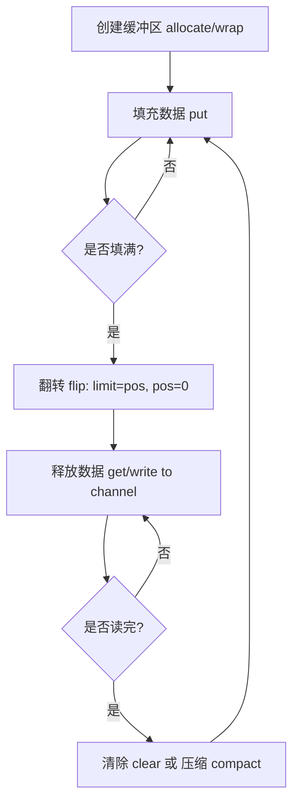
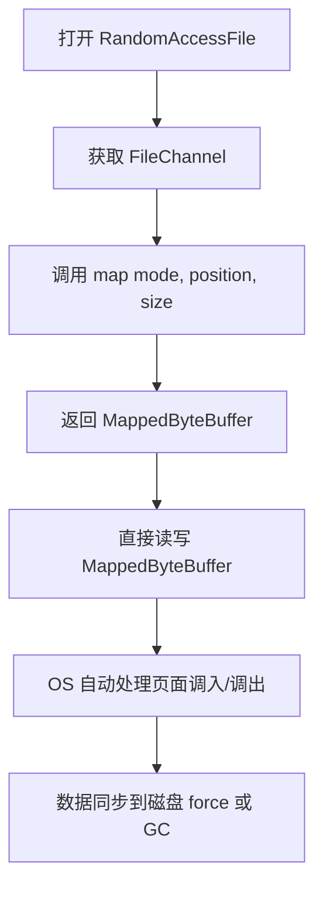
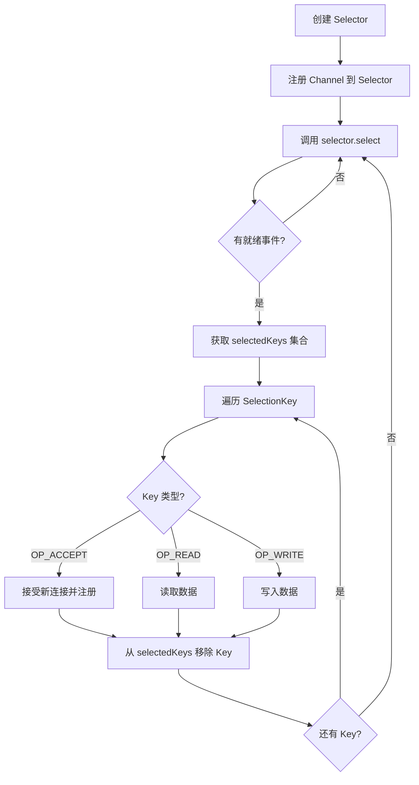
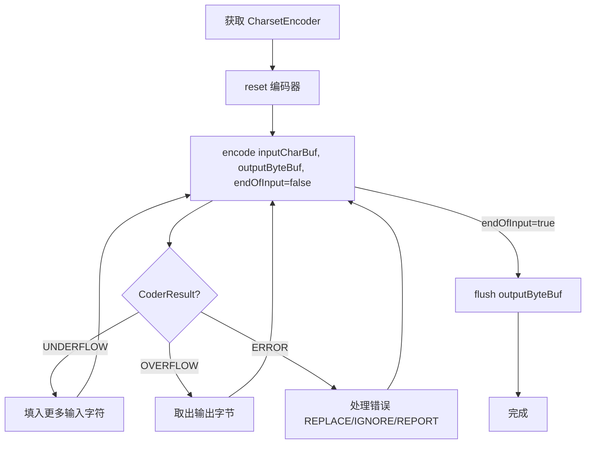

# 《Java NIO》章节总结

## 书籍信息
- **书名**：Java NIO (中文版)
- **作者**：Ron Hitchens 著，裴小星 译
- **出版商**：O’Reilly
- **版本**：第一版 (2002年8月)，基于 JDK 1.4
- **PDF 状态**：文本清晰，OCR 识别完整，结构完整。
- **OCR 状态**：高质量，无需大量修复。

## 目录说明
- **目录识别情况**：完整识别，包含前言、六章正文及三个附录。
- **章节对应依据**：严格遵循原书目录结构：简介、缓冲区、通道、选择器、正则表达式、字符集。
- **OCR 修复说明**：部分代码片段和表格已根据上下文逻辑进行格式化整理，确保可读性。

## 全书核心主题
本书深入探讨了 Java 2 Standard Edition (J2SE) 1.4 版本引入的新 I/O API（即 `java.nio` 包及其子包）。传统 Java I/O (`java.io`) 基于流模型，虽然抽象良好但在处理大量数据时效率低下且缺乏可伸缩性。NIO 引入了缓冲区 (Buffer)、通道 (Channel) 和选择器 (Selector) 三大核心概念，旨在利用底层操作系统的原生 I/O 特性（如非阻塞 I/O、内存映射文件、文件锁定、多路复用等），从而极大提升 Java 应用程序在 I/O 密集场景下的性能、可伸缩性和可靠性。此外，本书还涵盖了随 JDK 1.4 一同发布的正则表达式 API (`java.util.regex`) 和可插拔字符集映射系统 (`java.nio.charset`)。本书的目标读者是中高级 Java 程序员，旨在帮助他们理解底层 I/O 机制并充分利用 NIO 潜能。

---

## 前言

### 核心论点
传统 Java I/O 在企业级应用中存在性能瓶颈，主要源于其基于流的抽象与操作系统底层高效 I/O 机制的不匹配。NIO 的引入是为了弥补这一差距，使 Java 在 I/O 性能上不再逊色于本地编译语言。

### 关键概念
- **JSR 51**：Java 规范请求 #51，定义了 NIO 的技术规范。
- **Merlin**：J2SE 1.4 的代号。
- **妥协与优势**：Java “一次编写，到处运行”的优势导致了 I/O 层的抽象妥协，NIO 试图在保持平台独立性的同时暴露更多底层能力。

### 逻辑推演
作者指出，Java 早期的 I/O 类为了跨平台兼容性，牺牲了对特定操作系统高效 I/O 特性（如文件锁定、非块 I/O、就绪性选择）的支持。随着 JVM 性能的提升，CPU 不再是瓶颈，I/O 成为主要制约因素。JCP 通过 JSR 51 引入了 NIO，使得 Java 能够访问现代操作系统普遍具备的高性能 I/O 服务。

---

## 第1章：简介

### 核心论点
I/O 操作通常比 CPU 处理慢几个数量级，因此优化 I/O 效率对整体应用性能至关重要。理解操作系统层面的 I/O 机制（如缓冲区、虚拟内存、分页）是掌握 NIO 的基础。

### 关键概念
- **I/O 与 CPU 时间比较**：I/O 延迟远高于数据处理时间，优化 I/O 带来的收益远大于优化 CPU 代码。
- **用户空间与内核空间**：I/O 操作涉及数据在用户空间（JVM）和内核空间之间的拷贝。
- **虚拟内存与分页**：现代操作系统使用虚拟内存和分页技术管理内存，磁盘 I/O 本质上是页面调度。
- **内存映射文件**：通过将文件映射到虚拟内存，避免显式的 read/write 系统调用和数据拷贝。
- **文件锁定**：协调多进程对共享文件的访问，分为共享锁和独占锁。
- **流 I/O 与块 I/O**：流 I/O 面向字节序列，块 I/O 面向固定大小的数据块；NIO 更贴近块 I/O 和底层硬件特性。

### 逻辑推演
本章首先通过数据对比说明 I/O 优化的重要性。接着回顾了操作系统层面的 I/O 基础：数据如何通过 DMA 进入内核缓冲区，再拷贝到用户缓冲区。介绍了虚拟内存如何允许内核和用户空间共享物理页，从而减少拷贝（内存映射的核心原理）。最后区分了面向块的 I/O（文件）和面向流的 I/O（网络、终端），为后续介绍 NIO 的核心组件做铺垫。

### 经典金句
> “计算机毫无用处，除了答案什么也没有。” ——毕加索

> “时间就是金钱。企业购置的用于部署大型应用的计算机系统，其 I/O 性能异常卓越……而 Java 迄今为止一直无法充分利用这一点。”

---

## 第2章：缓冲区

### 核心论点
缓冲区 (Buffer) 是 NIO 的数据容器，是通道 (Channel) 进行数据传输的来源或目标。理解缓冲区的属性（容量、上界、位置、标记）及其状态转换（填充、翻转、释放、压缩）是使用 NIO 的基础。

### 关键概念
- **Buffer 属性**：
    - **Capacity**：固定大小，创建后不可变。
    - **Limit**：第一个不可读/写元素的索引。
    - **Position**：下一个可读/写元素的索引。
    - **Mark**：备忘位置。
    - 关系：`0 <= mark <= position <= limit <= capacity`
- **翻转 (flip)**：将缓冲区从填充模式切换到释放模式（`limit = position; position = 0`）。
- **清除 (clear)**：重置缓冲区以便重新填充（`position = 0; limit = capacity`），不清除数据。
- **压缩 (compact)**：保留未读数据，将其移至缓冲区起始位置，便于继续填充。
- **直接缓冲区 (Direct Buffer)**：内存分配在 JVM 堆外，适合与通道进行高效 I/O 操作，避免额外的拷贝。
- **视图缓冲区 (View Buffer)**：基于 ByteBuffer 创建的其他类型缓冲区（如 IntBuffer, CharBuffer），共享底层数据但提供不同类型视角。
- **字节顺序 (Byte Order)**：大端 (Big-Endian) 与小端 (Little-Endian)，ByteBuffer 默认为大端，可通过 `order()` 修改。

### 逻辑推演
本章详细介绍了 Buffer 类的层次结构和基本 API。首先解释了四个核心属性及其相互关系。然后通过示例演示了如何向缓冲区放入数据（put）、翻转缓冲区以准备读取（flip）、从缓冲区获取数据（get）以及清除或压缩缓冲区。接着讨论了批量移动数据的方法以提高效率。随后重点讲解了 ByteBuffer 的特殊性，包括直接缓冲区的优势（零拷贝潜力）和视图缓冲区的用法。最后介绍了字节顺序的重要性及其在多字节数据类型处理中的作用。

### 方法流程图

### 经典金句
> “缓冲区并不是多线程安全的。如果您想以多线程同时存取特定的缓冲区，您需要在存取缓冲区之前进行同步。”

> “直接缓冲区是 I/O 的最佳选择，但可能比创建非直接缓冲区要花费更高的成本。”

---

## 第3章：通道

### 核心论点
通道 (Channel) 是连接缓冲区与 I/O 服务（文件、套接字）的导管。它支持双向传输、散射/聚集 (Scatter/Gather)、文件锁定、内存映射以及通道间直接传输，提供了比传统流更高效、功能更丰富的 I/O 操作方式。

### 关键概念
- **Channel 接口**：基本操作为 `isOpen()` 和 `close()`。
- **FileChannel**：
    - 只能阻塞模式。
    - 支持 `map()` 创建内存映射文件 (MappedByteBuffer)。
    - 支持 `lock()` 和 `tryLock()` 进行文件锁定。
    - 支持 `transferTo()` / `transferFrom()` 实现高效的通道间数据传输（零拷贝潜力）。
- **SocketChannel**：
    - 支持非阻塞模式。
    - 支持异步连接 (`connect()`, `finishConnect()`)。
- **ServerSocketChannel**：
    - 用于监听传入连接，`accept()` 返回 SocketChannel。
    - 支持非阻塞模式，若无连接则返回 null。
- **DatagramChannel**：
    - 面向 UDP，无连接，支持 `send()` 和 `receive()`。
    - 可“连接”到特定地址以过滤数据包。
- **Scatter/Gather**：
    - **Scatter**：从通道读取数据分散到多个缓冲区。
    - **Gather**：从多个缓冲区聚集数据写入通道。
    - 减少数据拷贝和系统调用次数。
- **Pipe**：
    - 进程内单向数据传输，包含 SinkChannel (写) 和 SourceChannel (读)。

### 逻辑推演
本章首先介绍 Channel 的基本概念和生命周期（打开、关闭、中断语义）。接着详细阐述了 Scatter/Gather 机制及其在高效数据处理中的应用。随后分节深入讨论了 FileChannel（文件锁定、内存映射、通道传输）、SocketChannel（非阻塞、异步连接）、ServerSocketChannel 和 DatagramChannel 的具体用法和特性。最后介绍了 Pipe 用于线程间通信的场景。强调了通道与底层操作系统 I/O 服务的紧密映射关系。

### 方法流程图：FileChannel 内存映射

### 经典金句
> “通道是一种途径，借助该途径，可以用最小的总开销来访问操作系统本身的 I/O 服务。”

> “文件锁旨在在进程级别上判优文件访问，比如在主要的程序组件之间或者在集成其他供应商的组件时。如果您需要控制多个 Java 线程的并发访问，您可能需要实施您自己的、轻量级的锁定方案。”

---

## 第4章：选择器

### 核心论点
选择器 (Selector) 实现了就绪性选择 (Readiness Selection)，允许单线程监控多个通道的 I/O 事件（读、写、连接、接受）。这是构建高可伸缩性、非阻塞网络服务器的核心机制，避免了为每个连接创建线程的资源消耗。

### 关键概念
- **Selector**：管理注册通道的就绪状态。
- **SelectableChannel**：可注册到 Selector 的通道（如 SocketChannel, ServerSocketChannel）。必须配置为非阻塞模式。
- **SelectionKey**：封装通道与选择器的注册关系，包含：
    - **Interest Ops**：感兴趣的操作集合 (OP_READ, OP_WRITE, OP_CONNECT, OP_ACCEPT)。
    - **Ready Ops**：已就绪的操作集合。
    - **Attachment**：可附加任意对象，用于存储上下文信息。
- **选择过程**：
    1. 清理已取消的键。
    2. 检查注册键的 interest 集合，调用底层 OS 查询就绪状态。
    3. 更新已选择键集合 (selectedKeys)。
    4. 返回就绪通道数量。
- **wakeup()**：唤醒阻塞在 `select()` 上的线程。
- **并发管理**：Selector 本身线程安全，但键集合不是。遍历 selectedKeys 时需移除已处理的键。

### 逻辑推演
本章首先通过银行出纳员的比喻解释就绪选择的概念及其相对于多线程模型的优势。接着详细介绍了 Selector、SelectableChannel 和 SelectionKey 三个核心类及其交互关系。重点讲解了如何将通道注册到选择器，如何调用 `select()` 等待事件，以及如何遍历和处理 `selectedKeys`。最后讨论了选择器的并发问题和异步关闭能力，并给出了使用线程池处理就绪通道的示例，展示了如何结合单线程选择和多线程处理以实现最佳性能。

### 方法流程图：Selector 工作循环

### 经典金句
> “就绪选择的真正价值在于潜在的大量的通道可以同时进行就绪状态的检查。”

> “简单地询问每个通道是否已经就绪的方法是可行的，在您的代码或一个类库的包里的某些代码需要遍历每一个候选的通道并按顺序进行检查的时候，仍然是有问题的……主要的问题是，这种检查不是原子性的。”

---

## 第5章：正则表达式

### 核心论点
JDK 1.4 引入了 `java.util.regex` 包，提供了类似 Perl 的正则表达式处理能力。通过 Pattern（编译后的正则表达式）和 Matcher（匹配引擎）两个核心类，Java 能够高效地进行复杂的文本模式匹配、查找和替换。

### 关键概念
- **Pattern**：不可变的编译后的正则表达式对象。线程安全。
- **Matcher**：状态化的匹配引擎，针对特定输入序列执行匹配。非线程安全。
- **CharSequence**：字符序列接口，String, StringBuffer, CharBuffer 均实现此接口，作为正则操作的输入。
- **匹配操作**：
    - `matches()`：整个序列匹配。
    - `lookingAt()`：前缀匹配。
    - `find()`：查找下一个子序列匹配。
- **捕获组 (Capture Group)**：括号内的子表达式，可通过 `group(n)` 获取匹配内容。
- **替换**：`replaceFirst()`, `replaceAll()`, 以及更灵活的 `appendReplacement()` 和 `appendTail()`。
- **分裂**：`Pattern.split()` 基于正则分隔字符串。

### 逻辑推演
本章首先介绍了正则表达式的背景及其在 Java 中的实现概况。接着详细讲解了 Pattern 和 Matcher 类的 API，包括编译、匹配、查找、分组和替换等操作。通过示例展示了如何使用这些类进行文件 grep、邮箱验证等实际任务。最后总结了 String 类中新增的正则便捷方法，并提供了正则表达式语法的快速参考表。

### 经典金句
> “正则表达式是描述或表达在目标字符序列内匹配一定字符模式的字符序列。”

> “Perl 享有较高水平的正则表达式集成……java.util.regex 包为 Java 带来了福音，它可以提供与 Perl 同等水平的表达能力。”

---

## 第6章：字符集

### 核心论点
`java.nio.charset` 包提供了一套灵活、可扩展的字符集编码和解码机制。它分离了字符集定义、编码器 (CharsetEncoder) 和解码器 (CharsetDecoder)，支持错误处理策略配置，并通过 SPI (Service Provider Interface) 允许用户自定义字符集。

### 关键概念
- **Charset**：封装编码字符集和编码方案的抽象类。线程安全。
- **CharsetEncoder**：将字符序列转换为字节序列。状态化，非线程安全。
- **CharsetDecoder**：将字节序列转换为字符序列。状态化，非线程安全。
- **CodingErrorAction**：错误处理策略：REPORT (抛出异常), IGNORE (忽略), REPLACE (替换)。
- **CoderResult**：编码/解码操作的结果，指示下溢 (Underflow)、上溢 (Overflow)、 malformed input 或 unmappable character。
- **SPI (CharsetProvider)**：允许通过 `META-INF/services` 机制注册自定义字符集。
- **标准字符集**：US-ASCII, ISO-8859-1, UTF-8, UTF-16BE, UTF-16LE, UTF-16。

### 逻辑推演
本章首先定义了字符集、编码字符集和字符编码方案的区别。接着介绍了 Charset 类及其工厂方法。重点讲解了 CharsetEncoder 和 CharsetDecoder 的工作流程，包括复位、编码/解码循环、处理缓冲区上下溢以及错误处理。最后详细介绍了如何通过实现 CharsetProvider  SPI 来扩展新的字符集，并给出了 Rot13 字符集的完整实现示例。

### 方法流程图：编码过程

### 经典金句
> “在 Java 平台上，我们没有奢侈的 Babelfish 技术……但我们仍必须处理多种语言以及组成这些语言的多个字符。”

> “字符集是由一个编码字符集和一个相关编码方案组成的。”

---

## 附录 A. NIO与 JNI

### 核心论点
NIO 的直接缓冲区 (Direct Buffer) 机制通过新的 JNI 函数 (`NewDirectByteBuffer`, `GetDirectBufferAddress`) 实现了 Java 堆外内存与本地代码的高效共享，避免了数据拷贝，提升了与本地库（如 OpenGL）交互的性能。

### 关键概念
- **NewDirectByteBuffer**：JNI 函数，将本地内存包装为 Java ByteBuffer 对象。
- **GetDirectBufferAddress/Capacity**：JNI 函数，获取直接缓冲区的本地地址和大小。
- **优势**：零拷贝、保留 Java 语义（边界检查、GC）、支持视图和通道 I/O。

---

## 附录 B. 可选择通道 SPI

### 核心论点
NIO 的选择器机制也是通过 SPI (`SelectorProvider`) 可插拔的。开发者可以通过实现 `AbstractSelectableChannel`, `AbstractSelector` 等类来创建自定义的通道和选择器实现，但这通常仅适用于 JVM 厂商或高端中间件开发者。

### 关键概念
- **SelectorProvider**：工厂类，用于创建 Selector 和各种 SelectableChannel。
- **AbstractSelectableChannel**：可选择通道的基类。
- **AbstractSelector**：选择器的基类。

---

## 附录 C. NIO快速参考

### 内容说明
本附录提供了 `java.nio`, `java.nio.channels`, `java.nio.channels.spi`, `java.nio.charset`, `java.nio.charset.spi`, `java.util.regex` 包中主要类和接口的 API 快速参考列表，包括方法签名和简要说明。适合作为开发时的查阅手册。