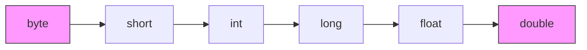

# 《Java Notes for Professionals》章节总结

## 书籍信息

- **书名**：Java Notes for Professionals
- **来源**：GoalKicker.com (基于 Stack Overflow Documentation 整理)
- **作者**：Stack Overflow 社区贡献者
- **PDF 状态**：完整，共 958 页
- **OCR 状态**：良好，文本清晰可识别

## 目录说明

- **目录识别情况**：本书包含 185 个章节及多个附录，涵盖了从 Java 基础语法到高级并发、网络编程、JVM  internals 的全方位内容。
- **章节对应依据**：严格按照 PDF 中的 Chapter 1 至 Chapter 185 以及 Appendix A-D 的顺序进行整理。
- **OCR 修复说明**：部分代码片段中的特殊字符（如泛型符号 `<>`）在 OCR 中可能显示不全，已根据 Java 语法规范进行修正。

## 全书核心主题

本书是一部面向专业开发者的 Java 技术参考手册，其核心目标是提供“即查即用”的代码示例和最佳实践。不同于传统教程的线性叙事，本书采用模块化结构，每个章节独立解决一个特定的技术问题或概念。

全书覆盖了 Java SE 的核心领域：
1.  **基础语法与类型系统**：包括基本数据类型、字符串处理、数组、集合框架（List, Set, Map）、泛型、枚举等。
2.  **面向对象特性**：深入探讨类、对象、继承、多态、接口、抽象类、内部类以及反射机制。
3.  **异常处理与 I/O**：详细讲解了异常体系、try-with-resources、文件 I/O、NIO、序列化以及控制台输入输出。
4.  **并发编程**：重点介绍了线程创建、同步机制、锁、原子类、并发集合、Executor 框架以及 Fork/Join 池。
5.  **新特性支持**：大量篇幅用于 Java 8+ 的新特性，如 Lambda 表达式、Stream API、Optional、默认方法、日期时间 API (java.time) 以及模块系统（Java 9+）。
6.  **高级主题**：涉及 JVM 内存模型、垃圾回收、类加载器、JNI、JMX、安全加密、网络编程（Socket, HTTP, RMI）以及构建部署（JAR, Maven, Ant）。

本书强调实战性，提供了大量关于常见陷阱（Pitfalls）的警告，如空指针异常、并发修改异常、自动装箱陷阱等，旨在帮助开发者编写更健壮、高效的 Java 代码。

---

## 第1章：Getting started with Java Language

### 核心论点

本章旨在引导初学者快速搭建 Java 开发环境并运行第一个程序，强调文件名与类名的一致性以及编译运行的基本流程。

### 关键概念/事件

- **HelloWorld 程序**：Java 入门的标准示例，包含类定义、main 方法和打印语句。
- **javac 编译器**将 `.java` 源文件编译为 `.class` 字节码文件。
- **java 命令**：启动 JVM 并执行指定类的 main 方法。
- **环境变量配置**：正确设置 `PATH` 和 `JAVA_HOME以确命令行工具可用。

### 逻辑推演/叙事脉络

首先介绍创建一个名为 `HelloWorld.java`的文件，其中包含一个 public 类 HelloWorld 和标准的 main 入口点。接着解释编译过程，指出文件名必须与公共类名完全匹配。随后演示如何使用 `javac` 进行编译，并处理常见的“命令未找到”错误，指导用户配置 Windows 或 Linux 下的环境变量。最后，通过 `java HelloWorld` 运行程序，并拆解代码结构，解释 `public static void main` 各部分的含义以及 `System.out.println` 的执行逻辑。

### 经典金句/数据

> "For Java to recognize this as a public class... the filename must be the same as the class name... with a .java extension."

---

## 第2章：Type Conversion

### 核心论点

本章阐述 Java 中不同类型之间的转换规则，区分隐式转换（ widening ）和显式转换（ narrowing/casting ），并指出潜在的数据丢失风险。

### 关键概念/事件

- **隐式转换**：小范围类型自动转换为大范围类型（如 byte -> int -> double）。
- **显式转换**：大范围类型强制转换为小范围类型，需使用 `(type)` 语法，可能导致精度丢失或溢出。
- **布尔类型限制**：boolean 不能与其他任何基本类型相互转换。
- **对象转换**：涉及向上转型（隐式）和向下转型（显式，需 instanceof 检查以防 ClassCastException）。

### 逻辑推演/叙事脉络

首先介绍数值基本类型的隐式转换链，说明为何这是安全的。接着引入显式转换，展示如何将 double 强制转为 int，并警告小数部分会被截断。随后讨论非数值类型，强调 boolean 的隔离性。最后扩展到引用类型，解释子类到父类的自动转换，以及父类到子类的强制转换需要运行时类型检查，推荐使用 `instanceof` 进行安全判断。

### 流程图

---

## 第3章：Getters and Setters

### 核心论点

Getter 和 Setter 是封装数据的核心机制，它们不仅提供访问权限控制，还允许在赋值或取值时加入逻辑约束，优于直接暴露公共字段。

### 关键概念/事件

- **封装原则**：字段设为 private，通过 public 方法访问。
- **约束实现**：在 Setter 中验证数据合法性（如非空、范围检查）。
- **可扩展性**：未来可在 Getter/Setter 中添加同步、日志或计算逻辑，而不改变外部接口。
- **命名规范**：`getVariableName()` / `setVariableName()`，布尔类型使用 `isVariableName()`。

### 逻辑推演/叙事脉络

首先展示一个简单的 CountHolder 类，对比公共字段与 Getter/Setter 的功能等价性。接着论证为何后者更优：当需要添加同步（synchronized）或验证逻辑时，使用 Getter/Setter 无需修改调用方代码，而公共字段则会导致破坏性变更。最后介绍标准的命名约定，并指出这是 JavaBean 规范的一部分。

---

## 第4章：Reference Data Types

### 核心论点

区分基本类型（存储值）和引用类型（存储内存地址），解释解引用（dereferencing）及 null 指针异常的成因。

### 关键概念/事件

- **实例化**：使用 `new` 关键字在堆上分配内存并返回引用。
- **解引用**：通过 `.` 操作符访问对象成员。
- **NullPointerException**：当引用为 null 时尝试解引用所抛出的异常。

### 逻辑推演/叙事脉络

首先定义引用变量指向堆中对象的过程。接着解释 `obj.toString()` 这样的调用实际上是跟随引用找到对象并执行方法。最后指出如果引用为 null，由于没有实际对象存在，JVM 无法执行方法，从而抛出 NullPointerException。

---

## 第5章：Java Compiler-'javac'

### 核心论点

详细介绍 javac 编译器的使用，包括基本编译、包结构处理、多文件编译以及针对不同 Java版本的交叉编译选项。

### 关键概念/事件

- **基本编译**：`javac File.java` 生成 `File.class`。
- **包结构**：源文件目录结构需与 package 声明一致，编译时需指定路径。
- **通配符编译**：使用 `*.java` 编译目录下所有文件。
- **交叉编译**：使用 `-source` 和 `-target` 选项兼容旧版本 JVM，配合 `-bootclasspath` 确保 API 兼容性。

### 逻辑推演/叙事脉络

从最简单的单文件编译开始，指出类名与文件名的关系。然后引入包的概念，说明目录结构的重要性及编译时的路径处理。接着展示如何一次性编译多个文件。最后深入高级用法，解释如何在较新的 JDK 上编译出能在旧 JVM 上运行的字节码，强调 `-bootclasspath` 对于防止使用新版 API 的重要性。

---

## 第6章：Documenting Java Code

### 核心论点

Javadoc 是 Java 标准的文档生成工具，通过特定格式的注释生成 HTML API 文档，支持丰富的标签以描述类、方法、参数及异常。

### 关键概念/事件

- **Javadoc 注释**：以 `/**` 开头，`*/` 结尾。
- **常用标签**：`@param`, `@return`, `@throws`, `@see`, `@deprecated`。
- **内联标签**：`{@link}`, `{@code}`, `{@literal}` 用于增强文档可读性。
- **包文档**：通过 `package-info.java` 为包级别添加文档。

### 逻辑推演/叙事脉络

首先介绍 Javadoc 的基本语法结构。接着详细列出类和方法文档中常用的块标签及其用途。随后讲解如何在文档中插入代码片段和链接，特别处理特殊字符转义。最后提及包级别的文档生成方式，强调文档对于 API 维护的重要性。

---

## 第7章：Command line Argument Processing

### 核心论点

讲解如何在 Java 程序中接收和处理命令行参数，从简单的手动解析到使用第三方库处理复杂选项。

### 关键概念/事件

- **args 数组**：main 方法接收的 String 数组，不含 null 元素。
- **手动解析**：遍历 args 数组，识别标志（flags）和参数值。
- **GWT ToolBase**：Google Web Toolkit 提供的简单参数解析工具示例。
- **错误处理**：参数缺失或格式错误时应打印用法提示并退出。

### 逻辑推演/叙事脉络

首先说明 `String[] args` 的结构。接着通过几个案例逐步增加复杂度：无参数、固定数量参数、带标志的参数。展示如何通过循环和 switch/if 语句手动解析参数。最后指出对于复杂场景，建议使用专门的解析库，并简要提及 GWT 的实现思路。

---

## 第8章：The Java Command-'java' and 'javaw'

### 核心论点

详解 java 启动命令的使用，包括类路径设置、常见错误排查、库依赖处理以及 JVM 选项配置。

### 关键概念/事件

- **入口点**：必须是 `public static void main(String[] args)`。
- **类路径（Classpath）**：通过 `-cp` 或 `CLASSPATH` 环境变量指定类和库的位置。
- **常见错误**："Could not find or load main class" 通常由类名错误或类路径缺失引起。
- **JAR 执行**：`java -jar app.jar` 忽略类路径，使用 Manifest 中的配置。
- **JVM 选项**：`-D` 设置系统属性，`-Xms/-Xmx` 设置内存，`-ea` 启用断言。

### 逻辑推演/叙事脉络

首先定义合法的 main 方法签名。接着深入探讨“找不到主类”错误的多种原因及排查步骤。然后讲解如何处理带有依赖库的应用，推荐脚本封装或 Fat JAR。最后列举常用的 JVM 启动参数，区分标准选项、非标准选项（-X）和高级选项（-XX），并说明空格在参数中的处理技巧。

---

## 第9章：Literals

### 核心论点

介绍 Java 中各种字面量的表示法，包括数字进制、字符串、字符、布尔值及 null，强调下划线分隔符提升可读性。

### 关键概念/事件

- **数字字面量**：十进制、十六进制（0x）、八进制（0）、二进制（0b）。
- **下划线分隔**：Java 7+ 支持在数字中使用 `_` 提高可读性。
- **字符串字面量**：双引号包裹，支持转义字符，不可跨行（需拼接）。
- **特殊值**：`null` 表示空引用，`true/false` 表示布尔值。

### 逻辑推演/叙事脉络

首先展示整数的不同进制表示，特别警告前导零导致的八进制陷阱。接着介绍 Java 7 引入的下划线功能及其使用限制。随后讲解浮点数、布尔值和字符字面量。最后详细讨论字符串字面量，包括转义序列、Unicode 转义以及长字符串的拼接技巧，提及字符串池的概念。

---

## 第10章：Primitive Data Types

### 核心论点

概述 Java 的 8 种基本数据类型，比较它们的内存占用、取值范围及默认值，并讨论基本类型与包装类的性能差异。

### 关键概念/事件

- **整数类型**：byte, short, int, long，注意溢出行为。
- **浮点类型**：float, double，遵循 IEEE 754 标准，存在精度问题。
- **其他类型**：char (16-bit Unicode), boolean。
- **装箱开销**：包装类（Integer, Double 等）占用更多内存且涉及间接引用，影响性能。

### 逻辑推演/叙事脉络

逐一介绍每种基本类型的特性、范围和默认值。特别指出 char 的本质是无符号整数。接着对比基本类型与对应的包装类，量化内存消耗差异（如 int 4字节 vs Integer 16字节+引用）。最后提醒在高性能场景或大集合中优先使用基本类型数组或专用库。

---

## 第11章：Strings

### 核心论点

String 是 Java 中最常用的不可变对象，本章涵盖字符串比较、操作、池化机制及性能优化建议。

### 关键概念/事件

- **不可变性**：String 一旦创建不可修改，操作产生新对象。
- **比较**：使用 `equals()` 而非 `==`，注意 `equalsIgnoreCase` 的区域设置敏感性。
- **字符串池**：字面量存入池中以节省内存，`intern()` 可手动入池。
- **拼接性能**：循环中避免使用 `+`，改用 `StringBuilder`。
- **常用操作**：split, join, substring, trim, replace。

### 逻辑推演/叙事脉络

首先强调 String 的不可变性及其对线程安全的好处。接着深入讲解比较操作的陷阱，特别是 `==` 引用比较与 `equals` 内容比较的区别。随后解释字符串池的工作原理及 Java 7 前后池位置的变化（PermGen 到 Heap）。最后提供性能建议，展示 StringBuilder 在循环拼接中的优势，并列举常用的字符串处理方法。

---

## 第12章：StringBuffer

### 核心论点

StringBuffer 是线程安全的可变字符序列，适用于多线程环境下的字符串构建。

### 关键概念/事件

- **可变性**：允许追加、插入、删除字符。
- **线程安全**：方法同步，适合多线程共享。
- **主要方法**：append, insert, delete, reverse。

### 逻辑推演/叙事脉络

简述 StringBuffer 作为 String 的可变替代品的角色。指出其核心优势在于线程安全，但代价是性能略低于非同步的 StringBuilder。列举常用操作方法，展示其与 String 的区别。

---

## 第13章：StringBuilder

### 核心论点

StringBuilder 是非线程安全的可变字符序列，性能优于 StringBuffer，是单线程字符串构建的首选。

### 关键概念/事件

- **非同步**：无锁开销，速度更快。
- **适用场景**：局部变量、单线程环境。
- **重复字符串**：利用 StringBuilder 高效生成重复字符串。
- **对比**：StringBuilder vs StringBuffer vs StringJoiner。

### 逻辑推演/叙事脉络

介绍 StringBuilder 作为 StringBuffer 的高性能替代品。强调在单线程环境下应优先使用它。通过代码示例展示其在循环拼接和重复字符串生成中的效率。最后简要对比几种字符串构建工具的适用场景。

---

## 第14章：String Tokenizer

### 核心论点

StringTokenizer 是遗留类，用于将字符串分解为令牌，虽然简单但不支持正则分隔符，推荐被 String.split 取代。

### 关键概念/事件

- **基本用法**：指定分隔符集合。
- **局限性**：不支持正则，不保留空令牌。
- **替代方案**：String.split() 或 Scanner。

### 逻辑推演/叙事脉络

展示 StringTokenizer 的基本构造和遍历方法。指出其设计初衷是简单快速，但功能有限。明确建议在新代码中使用 String.split 或正则表达式以获得更灵活的控制。

---

## 第15章：Splitting a string into fixed length parts

### 核心论点

介绍如何将字符串按固定长度或特定模式切割成子串数组。

### 关键概念/事件

- **正则切割**：使用 `split("(?<=\\G.{8})")` 按固定长度切割。
- **Lookbehind**：利用 `\G` 锚点匹配上一次结束位置。

### 逻辑推演/叙事脉络

直接给出使用正则表达式 Lookbehind 和 `\G` 锚点实现固定长度切割的技巧。解释该正则的含义：匹配每 N 个字符后的位置。提供变长切割的思路。

---

## 第16章：Date Class

### 核心论点

java.util.Date 是旧的日期 API，存在诸多设计缺陷，本章介绍其基本用法及与 java.sql.Date 的转换，强烈建议迁移至 Java 8 Time API。

### 关键概念/事件

- **过时性**：Date 可变、年份从 1900 开始、月份从 0 开始。
- **格式化**：使用 SimpleDateFormat 进行字符串转换。
- **SQL 转换**：java.util.Date 与 java.sql.Date 互转。
- **Java 8 迁移**：推荐使用 LocalDate, LocalDateTime。

### 逻辑推演/叙事脉络

首先展示 Date 的基本创建和输出。接着指出其易错点（如月份索引）。演示如何使用 SimpleDateFormat 格式化日期。介绍 JDBC 场景中 util.Date 与 sql.Date 的转换。最后强烈建议读者转向 java.time 包，展示简单的映射关系。

---

## 第17章：Dates and Time(java.time.*)

### 核心论点

Java 8 引入的 java.time 包提供了不可变、线程安全且直观的日期时间 API，彻底解决了旧 API 的问题。

### 关键概念/事件

- **核心类**：LocalDate, LocalTime, LocalDateTime, ZonedDateTime, Instant。
- **不可变性**：所有操作返回新实例。
- **时区处理**：ZoneId, ZoneOffset。
- **计算差异**：ChronoUnit, Period, Duration。

### 逻辑推演/叙事脉络

介绍 java.time 的设计哲学：不可变、清晰分离日期、时间和时区。逐一介绍核心类及其创建方式。展示如何进行日期加减、计算两个日期之间的天数或小时数。强调其在并发环境下的安全性及代码可读性的提升。

---

## 第18章：LocalTime

### 核心论点

LocalTime 代表不带日期的时间，适用于仅关注时刻的场景，如每日定时任务。

### 关键概念/事件

- **创建**：now(), of(), parse()。
- **计算间隔**：until(), ChronoUnit.between()。
- **时区无关**：不包含时区信息。

### 逻辑推演/叙事脉络

展示 LocalTime 的基本实例化方法。演示如何计算两个时间点之间的分钟、秒数差异。指出其局限性：不涉及日期和时区，因此不适合跨天或跨时区计算。

---

## 第19章：BigDecimal

### 核心论点

BigDecimal 用于高精度decimal运算，特别是金融计算，避免了 float/double 的二进制精度误差。

### 关键概念/事件

- **精度保证**：任意精度，无舍入误差。
- **构造陷阱**：务必使用 String 构造函数，避免 double 构造函数引入误差。
- **比较**：使用 compareTo 而非 equals（equals 比较标度）。
- **运算**：add, subtract, multiply, divide（需指定舍入模式）。

### 逻辑推演/叙事脉络

首先通过 float 运算误差的案例引出 BigDecimal 的必要性。重点警告构造函数的选择：`new BigDecimal("0.1")` 是正确的，`new BigDecimal(0.1)` 是错误的。讲解加减乘除操作，特别强调除法必须指定精度和舍入模式以防无限循环小数异常。最后说明 compareTo 与 equals 的区别。

---

## 第20章：BigInteger

### 核心论点

BigInteger 支持任意精度的整数运算，适用于超出 long 范围的大数处理。

### 关键概念/事件

- **大数运算**：加、减、乘、除、模、幂、GCD。
- **位操作**：and, or, xor, shift。
- **随机生成**：probablePrime, random。

### 逻辑推演/叙事脉络

介绍 BigInteger 的基本构造和常量（ZERO, ONE, TEN）。展示基本的算术运算方法。介绍其在密码学中常用的位操作和大素数生成功能。强调其不可变性。

---

## 第21章：NumberFormat

### 核心论点

NumberFormat 用于根据区域设置格式化数字、货币和百分比。

### 关键概念/事件

- **本地化**：根据不同 Locale 显示数字格式。
- **类型**：getNumberInstance, getCurrencyInstance, getPercentInstance。
- **控制精度**：setMinimumFractionDigits, setMaximumFractionDigits。

### 逻辑推演/叙事脉络

展示如何获取不同区域的数字格式化器。演示整数、浮点数、货币和百分比的格式化输出。介绍如何自定义小数位数以满足特定显示需求。

---

## 第22章：Bit Manipulation

### 核心论点

位操作允许直接操作整数的二进制位，常用于标志位管理、权限控制和底层优化。

### 关键概念/事件

- **基本操作**：AND (&), OR (|), XOR (^), NOT (~)。
- **位移**：左移 (<<), 右移 (>>, >>>)。
- ** BitSet**：Java 提供的动态位向量类。
- **应用**：检查、设置、清除特定位。

### 逻辑推演/叙事脉络

首先回顾二进制基础。展示如何使用掩码（Mask）来检查、设置和清除特定位。介绍 Java 的 BitSet 类，展示其便捷的 API 用于处理大规模位集合。最后提及无符号右移 `>>>` 的特殊用途。

---

## 第23章：Arrays

### 核心论点

数组是固定大小的同类型元素集合，本章涵盖创建、初始化、遍历、排序及常见陷阱。

### 关键概念/事件

- **声明与初始化**：`new Type[size]` 或 `{val1, val2}`。
- **多维数组**：实际上是数组的数组，可以是参差不齐的（Jagged）。
- **工具类**：Arrays.sort, Arrays.toString, Arrays.copyOf。
- **陷阱**：ArrayIndexOutOfBoundsException, 协变导致的 ArrayStoreException。

### 逻辑推演/叙事脉络

从基本的一维数组创建开始，展示静态初始化和动态初始化。接着解释多维数组的本质，展示不规则数组的创建。介绍 Arrays 实用类提供的排序、搜索和转换功能。最后警告数组协变带来的运行时类型安全风险，建议使用集合替代。

---

## 第24章：Collections

### 核心论点

集合框架提供了比数组更灵活的数据结构，本章重点介绍 List, Set, Map 的基本操作及迭代时的注意事项。

### 关键概念/事件

- **迭代移除**：必须使用 Iterator.remove()，否则抛出 ConcurrentModificationException。
- **工厂方法**：Arrays.asList, Collections.emptyList。
- **同步包装**：Collections.synchronizedList。
- **不可变集合**：Collections.unmodifiableList。

### 逻辑推演/叙事脉络

首先展示常见的集合创建方式。重点讲解在遍历集合时删除元素的正确做法：使用 Iterator。解释 ConcurrentModificationException 的成因。介绍如何创建空集合、单例集合以及同步和不可变视图。

---

## 第25章：Lists

### 核心论点

List 是有序集合，允许重复元素，本章对比 ArrayList 和 LinkedList 的特性及使用场景。

### 关键概念/事件

- **ArrayList**：基于动态数组，随机访问快，中间插入慢。
- **LinkedList**：基于双向链表，插入删除快，随机访问慢。
- **操作**：add, remove, get, set, subList。
- **排序**：Collections.sort, List.sort。

### 逻辑推演/叙事脉络

介绍 List 接口的主要实现类。对比 ArrayList 和 LinkedList 的性能特征，指导用户根据读写模式选择。展示常用的增删改查操作。介绍如何对 List 进行自然排序或自定义排序。

---

## 第26章：Sets

### 核心论点

Set 是不允许重复元素的集合，本章介绍 HashSet, TreeSet, LinkedHashSet 的区别。

### 关键概念/事件

- **HashSet**：基于哈希表，无序，最快。
- **TreeSet**：基于红黑树，有序，较慢。
- **LinkedHashSet**：维持插入顺序。
- **去重**：利用 Set 特性快速去除 List 中的重复项。

### 逻辑推演/叙事脉络

分别介绍三种主要 Set 实现的底层结构和特性。展示如何根据是否需要排序或维持顺序来选择实现类。提供一个利用 HashSet 快速去重的实用代码片段。

---

## 第27章：List vs Set

### 核心论点

对比 List 和 Set 的核心差异：有序性与唯一性。

### 关键概念/事件

- **List**：有序，可重复，通过索引访问。
- **Set**：无序（通常），唯一，通过迭代访问。
- **选择依据**：是否需要保留重复项和插入顺序。

### 逻辑推演/叙事脉络

通过表格或列表形式清晰列出两者的区别。强调 List 适合序列数据处理，Set 适合成员资格测试和去重。

---

## 第28章：Maps

### 核心论点

Map 是键值对映射，本章详解 HashMap, TreeMap, LinkedHashMap 的使用及高效迭代技巧。

### 关键概念/事件

- **HashMap**：无序，允许 null 键/值，性能最高。
- **TreeMap**：按键排序。
- **LinkedHashMap**：维持插入顺序或访问顺序。
- **迭代**：entrySet() 比 keySet()+get() 更高效。
- **Java 8 默认方法**：computeIfAbsent, merge, putIfAbsent。

### 逻辑推演/叙事脉络

介绍 Map 的基本概念和主要实现类。重点讲解迭代 Map 的最佳实践：使用 entrySet 避免二次查找。详细介绍 Java 8 引入的丰富默认方法，展示如何简化常见的条件放入、合并值等操作。

---

## 第29章：LinkedHashMap

### 核心论点

LinkedHashMap 结合了哈希表的速度和链表的顺序维持能力，适用于需要预测迭代顺序的场景。

### 关键概念/事件

- **插入顺序**：默认维持元素插入的顺序。
- **访问顺序**：构造时指定 accessOrder=true，可用于实现 LRU 缓存。
- **removeEldestEntry**：重写此方法可实现自动淘汰策略。

### 逻辑推演/叙事脉络

解释 LinkedHashMap 如何在其 Entry 节点中维护双向链表。展示基本的插入顺序迭代。进一步展示如何利用访问顺序和 removeEldestEntry 构建一个简单的 LRU 缓存。

---

## 第30章：WeakHashMap

### 核心论点

WeakHashMap 使用弱引用存储键，当键不再被外部强引用时，条目会被自动垃圾回收，适用于缓存场景。

### 关键概念/事件

- **弱引用键**：键只被 WeakHashMap 引用时，GC 可回收。
- **自动清理**：无需手动移除过期条目。
- **适用场景**：元数据关联、临时缓存。

### 逻辑推演/叙事脉络

解释 WeakReference 的概念。展示 WeakHashMap 的行为：当键对象置为 null 并触发 GC 后，Map 中的对应条目消失。对比其与普通 HashMap 在内存管理上的差异。

---

## 第31章：SortedMap

### 核心论点

SortedMap 接口保证键的排序，通常由 TreeMap 实现。

### 关键概念/事件

- **自然排序或 Comparator**。
- **子视图**：subMap, headMap, tailMap。
- **首尾元素**：firstKey, lastKey。

### 逻辑推演/叙事脉络

简述 SortedMap 的特性。展示如何获取映射的子集视图，这些视图是原 Map 的动态投影。

---

## 第32章：TreeMap and TreeSet

### 核心论点

TreeMap 和 TreeSet 基于红黑树，提供有序的键/元素存储，支持高效的范围查询。

### 关键概念/事件

- **红黑树**：自平衡二叉搜索树，O(log n) 操作。
- **Comparable/Comparator**：必须提供排序逻辑。
- **线程不安全**：需外部同步或使用 Collections.synchronizedSortedMap。

### 逻辑推演/叙事脉络

介绍 TreeMap/TreeSet 的底层数据结构。强调键/元素必须实现 Comparable 或提供 Comparator。展示基本的增删查操作及有序遍历。警告其非线程安全性。

---

## 第33章：Queues and Deques

### 核心论点

Queue 是 FIFO 集合，Deque 支持两端操作，本章介绍 PriorityQueue, ArrayDeque 等实现。

### 关键概念/事件

- **Queue**：offer, poll, peek。
- **Deque**：addFirst, addLast, removeFirst, removeLast。
- **PriorityQueue**：基于堆，元素按优先级出队。
- **BlockingQueue**：线程安全，支持阻塞操作。

### 逻辑推演/叙事脉络

定义 Queue 和 Deque 的接口契约。介绍 PriorityQueue 的工作原理及其在任务调度中的应用。简述 BlockingQueue 在生产者-消费者模式中的作用。

---

## 第34章：Dequeue Interface

### 核心论点

Deque 接口定义了双端队列的操作，支持栈和队列两种语义。

### 关键概念/事件

- **栈操作**：push, pop, peek。
- **队列操作**：offer, poll。
- **实现类**：ArrayDeque, LinkedList。

### 逻辑推演/叙事脉络

展示 Deque 如何同时充当栈和队列。对比 ArrayDeque（数组实现，更快）和 LinkedList（链表实现，更多内存开销）。

---

## 第35章：Enums

### 核心论点

枚举类型提供了一种安全、受限的值集合，支持字段、方法和构造函数，是实现单例和状态机的理想选择。

### 关键概念/事件

- **基本定义**：enum Season { SPRING, SUMMER }。
- **高级特性**：构造函数、字段、抽象方法。
- **单例模式**：Effective Java 推荐的单例实现方式。
- **EnumSet/EnumMap**：高性能专用集合。

### 逻辑推演/叙事脉络

从最简单的枚举定义开始。逐步展示如何给枚举添加属性和行为。解释枚举如何实现接口和抽象方法，实现多态。最后介绍 EnumSet 和 EnumMap 的优势，以及利用枚举实现线程安全单例的模式。

---

## 第36章：Enum Map

### 核心论点

EnumMap 是专为枚举键设计的高效 Map 实现，内部使用数组存储。

### 关键概念/事件

- **高性能**：比 HashMap 更快，内存更少。
- **类型安全**：键必须是特定枚举类型。
- **顺序**：维持枚举声明的顺序。

### 逻辑推演/叙事脉络

展示 EnumMap 的创建和使用。强调其在键为枚举时的性能优势和类型安全性。

---

## 第37章：EnumSet class

### 核心论点

EnumSet 是专为枚举设计的高性能 Set 实现，内部使用位向量。

### 关键概念/事件

- **位向量**：极其紧凑，操作极快。
- **工厂方法**：of, range, allOf, noneOf。
- **集合运算**：union, intersection 等。

### 逻辑推演/叙事脉络

介绍 EnumSet 的底层位图结构。展示各种静态工厂方法的用法。演示集合间的位运算操作。

---

## 第38章：Enum starting with number

### 核心论点

Java 枚举常量不能以数字开头，可通过下划线前缀或自定义映射解决。

### 关键概念/事件

- **命名限制**：标识符规则。
- ** workaround**：使用 `_100A` 或在 enum 中存储原始字符串值。

### 逻辑推演/叙事脉络

指出 Java 标识符规范禁止数字开头。提供两种解决方案：一是命名时加下划线，二是定义一个字段存储原始字符串，并通过静态方法查找。

---

## 第39章：Hashtable

### 核心论点

Hashtable 是遗留的线程安全 Map，已被 ConcurrentHashMap 取代，不建议在新代码中使用。

### 关键概念/事件

- **线程安全**：方法同步，性能差。
- **不允许 null**：键和值均不能为 null。
- **替代者**：HashMap (非线程安全), ConcurrentHashMap (并发安全)。

### 逻辑推演/叙事脉络

简述 Hashtable 的历史地位。指出其缺点：粗粒度锁导致并发性能低下，以及不支持 null 的限制。强烈建议使用现代替代方案。

---

## 第40章：Operators

### 核心论点

详解 Java 的各种运算符，包括算术、关系、逻辑、位运算及三元运算符，强调优先级和短路特性。

### 关键概念/事件

- **算术运算符**：+, -, *, /, %。
- **关系运算符**：==, !=, <, >, <=, >=。
- **逻辑运算符**：&&, || (短路), &, | (非短路)。
- **三元运算符**：condition ? trueVal : falseVal。
- **instanceof**：类型检查。

### 逻辑推演/叙事脉络

分类介绍各类运算符。特别强调 `&&` 和 `||` 的短路行为及其在防止空指针异常中的应用。解释三元运算符作为简洁 if-else 的替代。提醒 `==` 在对象比较中的陷阱。

---

## 第41章：Constructors

### 核心论点

构造函数用于初始化对象，支持重载和链式调用（this/super）。

### 关键概念/事件

- **默认构造函数**：若无显式定义，编译器提供无参构造。
- **this()**：调用同类其他构造。
- **super()**：调用父类构造，必须是第一句。
- **访问修饰符**：可以是 private, protected 等。

### 逻辑推演/叙事脉络

展示构造函数的基本定义。解释编译器何时生成默认构造。演示如何使用 this 和 super 进行构造链式调用，强调 super 必须位于首行。

---

## 第42章：Object Class Methods and Constructor

### 核心论点

Object 是所有类的根父类，本章详解其核心方法：equals, hashCode, toString, clone, wait/notify。

### 关键概念/事件

- **equals/hashCode**：必须同时重写，保持契约。
- **toString**：提供对象字符串表示。
- **clone**：浅拷贝，需实现 Cloneable。
- **wait/notify**：线程间通信机制。

### 逻辑推演/叙事脉络

逐一讲解 Object 的关键方法。重点阐述 equals 和 hashCode 的契约关系：相等对象必须有相同哈希码。展示如何正确重写这两个方法。简述 toString 的调试价值。解释 clone 的浅拷贝特性及 wait/notify 的基本用法。

---

## 第43章：Annotations

### 核心论点

注解提供元数据，不影响程序逻辑，但可被编译器或运行时读取，用于配置、检查和代码生成。

### 关键概念/事件

- **元注解**：@Target, @Retention, @Inherited, @Repeatable。
- **内置注解**：@Override, @Deprecated, @SuppressWarnings。
- **运行时处理**：通过反射读取注解。
- **编译时处理**：Annotation Processor。

### 逻辑推演/叙事脉络

介绍注解的基本语法。详解四个元注解的作用：目标、保留策略、继承性、重复性。展示如何定义自定义注解。演示如何通过反射在运行时获取注解信息。简述注解处理器在编译时的作用。

---

## 第44章：Immutable Class

### 核心论点

不可变类一旦创建状态不可更改，具有线程安全、可缓存等优点，设计时需遵循特定规则。

### 关键概念/事件

- **规则**：类 final，字段 private final，不提供 setter，防御性拷贝可变字段。
- **优点**：线程安全，无需同步，可作为 Map 键。
- **示例**：String, Integer, BigDecimal。

### 逻辑推演/叙事脉络

列出构建不可变类的四条黄金规则。通过代码示例展示如何防御性拷贝传入的可变对象（如 Date 或 List）。解释不可变对象在并发环境下的天然优势。

---

## 第45章：Immutable Objects

### 核心论点

进一步探讨不可变对象的设计模式，特别是处理内部可变引用的情况。

### 关键概念/事件

- **防御性拷贝**：在 getter 和 constructor 中拷贝可变对象。
- **深度不可变**：确保所有引用层级都不可变。

### 逻辑推演/叙事脉络

通过一个包含 List 字段的类为例，展示如果不进行防御性拷贝，外部仍可修改内部状态。展示正确的做法：在构造函数中拷贝传入列表，在 getter 中返回副本或不可变视图。

---

## 第46章：Visibility(controlling access to members of a class)

### 核心论点

Java 提供四种访问控制级别：private, default (package-private), protected, public，用于封装和保护数据。

### 关键概念/事件

- **private**：仅本类可见。
- **default**：同包可见。
- **protected**：同包及子类可见。
- **public**：全局可见。
- **接口成员**：默认为 public。

### 逻辑推演/叙事脉络

通过表格或代码示例清晰界定四种修饰符的可见范围。特别指出接口中字段的隐含 public static final 和方法的隐含 public abstract 特性。

---

## 第47章：Generics

### 核心论点

泛型提供编译时类型安全，避免运行时 ClassCastException，支持通配符和边界限制。

### 关键概念/事件

- **类型擦除**：运行时泛型信息丢失。
- **通配符**：? extends T (上限), ? super T (下限)。
- **PECS 原则**：Producer Extends, Consumer Super。
- **类型推断**：Diamond operator <>。

### 逻辑推演/叙事脉络

介绍泛型的基本语法和好处。深入解释类型擦除机制及其限制（如不能 new T()）。重点讲解通配符的使用场景，引入 PECS 原则帮助记忆何时使用 extends 或 super。展示 Java 7 的菱形操作符简化代码。

---

## 第48章：Classes and Objects

### 核心论点

类是对象的蓝图，对象是类的实例，本章涵盖类的基本结构、方法重载/重写及静态成员。

### 关键概念/事件

- **实例 vs 静态**：静态成员属于类，实例成员属于对象。
- **重载**：同名不同参。
- **重写**：子类覆盖父类方法。
- **初始化块**：static {} 和 {}。

### 逻辑推演/叙事脉络

展示一个完整类的结构。区分静态上下文和实例上下文。解释方法重载（编译时多态）和重写（运行时多态）的区别。介绍初始化块的执行顺序。

---

## 第49章：Local Inner Class

### 核心论点

局部内部类定义在方法内部，仅在方法块内可见，可访问最终局部变量。

### 关键概念/事件

- **作用域**：仅限定义它的方法块。
- **访问限制**：只能访问 final 或 effectively final 的局部变量。

### 逻辑推演/叙事脉络

展示在方法中定义类的语法。解释其生命周期随方法调用结束而结束。强调对局部变量的访问限制。

---

## 第50章：Nested and Inner Classes

### 核心论点

嵌套类分为静态嵌套类和非静态内部类，前者不持有外部类引用，后者持有。

### 关键概念/事件

- **静态嵌套类**：独立于外部实例，类似顶层类。
- **内部类**：隐含持有外部类引用 `Outer.this`。
- **匿名内部类**：无名子类，常用于回调。
- **访问控制**：内部类可访问外部类私有成员。

### 逻辑推演/叙事脉络

对比静态和非静态嵌套类的内存行为和用途。展示如何从外部实例化内部类（`outer.new Inner()`）。介绍匿名内部类的简洁写法及其在 Java 8 后被 Lambda 取代的趋势。

---

## 第51章：The java.util.Objects Class

### 核心论点

Objects 工具类提供 null-safe 的操作方法，简化 null 检查和比较。

### 关键概念/事件

- **isNull/nonNull**：布尔判断。
- **equals/hashCode**：null-safe 版本。
- **requireNonNull**：参数校验，抛 NPE。

### 逻辑推演/叙事脉络

展示如何使用 Objects.equals 避免手动 null 检查。介绍 requireNonNull 在构造函数或 setter 中进行参数校验的简洁用法。

---

## 第52章：Default Methods

### 核心论点

Java 8 接口默认方法允许在不破坏实现类的前提下扩展接口功能。

### 关键概念/事件

- **向后兼容**：为旧接口添加新方法。
- **多重继承冲突**：类优先，最具体接口优先，否则需显式重写解决。
- **调用超接口默认方法**：`InterfaceName.super.method()`。

### 逻辑推演/叙事脉络

解释默认方法出现的背景：Lambda 表达式需要向 Collection 等旧接口添加方法。展示默认方法的语法。详细讲解多重继承时的冲突解决规则。

---

## 第53章：Packages

### 核心论点

包用于组织类和避免命名冲突，提供访问控制边界。

### 关键概念/事件

- **命名规范**：反向域名。
- **package-info.java**：包级别文档和注解。
- **默认访问**：同包可见。

### 逻辑推演/叙事脉络

介绍包声明语法和目录结构对应关系。解释包在命名空间管理和访问控制中的作用。

---

## 第54章：Inheritance

### 核心论点

继承允许子类复用父类代码，支持多态，但需谨慎使用以避免脆弱基类问题。

### 关键概念/事件

- **extends**：单继承。
- **super**：访问父类成员。
- **方法重写**：@Override 注解。
- **Liskov 替换原则**：子类应能替换父类。
- **final 类/方法**：阻止继承/重写。

### 逻辑推演/叙事脉络

展示基本的继承语法。解释 super 关键字的用法。强调多态的力量：父类引用指向子类对象。介绍 Liskov 替换原则作为良好继承设计的指导。讨论 final 的限制作用。

---

## 第55章：Reference Types

### 核心论点

Java 有四种引用类型：强、软、弱、虚，影响垃圾回收行为。

### 关键概念/事件

- **Strong**：默认，阻止 GC。
- **Soft**：内存不足时回收，适合缓存。
- **Weak**：下次 GC 时回收，适合规范映射。
- **Phantom**：回收后通知，适合资源清理。

### 逻辑推演/叙事脉络

定义四种引用强度。通过示例展示它们在 GC 过程中的不同表现。推荐 SoftReference 用于缓存，WeakReference 用于防止内存泄漏的映射。

---

## 第56章：Console I/O

### 核心论点

介绍从控制台读取输入和写入输出的多种方式。

### 关键概念/事件

- **Scanner**：解析基本类型和字符串。
- **BufferedReader**：高效读取行。
- **System.console**：无回显密码输入。
- **格式化输出**：System.out.printf。

### 逻辑推演/叙事脉络

对比 Scanner 和 BufferedReader 的优缺点。展示 System.console().readPassword() 的安全输入特性。介绍 printf 格式化字符串。

---

## 第57章：Streams

### 核心论点

Stream API 提供声明式数据处理流水线，支持并行处理，极大简化集合操作。

### 关键概念/事件

- **中间操作**：filter, map, sorted (懒执行)。
- **终端操作**：collect, forEach, reduce (触发执行)。
- **并行流**：parallel()。
- **收集器**：Collectors.toList, groupingBy。

### 逻辑推演/叙事脉络

介绍 Stream 的概念：数据源 -> 中间操作 -> 终端操作。通过代码示例展示过滤、映射、排序和收集。解释懒执行特性。展示并行流的简单启用方式。介绍强大的 Collectors 工具类。

---

## 第58章：InputStreams and OutputStreams

### 核心论点

字节流用于处理二进制数据，需妥善关闭以释放资源。

### 关键概念/事件

- **基类**：InputStream, OutputStream。
- **装饰器**：BufferedInputStream, DataInputStream。
- **Try-with-resources**：自动关闭。
- **复制**：transferTo (Java 9+) 或缓冲区循环。

### 逻辑推演/叙事脉络

展示基本的文件读写。强调 Try-with-resources 的重要性。介绍缓冲流提升性能。展示如何在流之间复制数据。

---

## 第59章：Readers and Writers

### 核心论点

字符流用于处理文本数据，自动处理编码转换。

### 关键概念/事件

- **基类**：Reader, Writer。
- **桥接**：InputStreamReader, OutputStreamWriter。
- **BufferedReader/Writer**：提高效率，readLine。

### 逻辑推演/叙事脉络

区分字节流和字符流。展示如何使用 InputStreamReader 指定编码将字节流转换为字符流。介绍 BufferedReader 的 readLine 方法。

---

## 第60章：Preferences

### 核心论点

Preferences API 提供跨平台的轻量级持久化存储，适用于用户配置。

### 关键概念/事件

- **节点树**：基于包名或自定义路径。
- **用户 vs 系统**：userNodeForPackage, systemNodeForPackage。
- **类型支持**：int, boolean, String 等。
- **导出/导入**：XML 格式。

### 逻辑推演/叙事脉络

展示如何获取 Preferences 节点。演示存取值操作。介绍监听器和导出功能。指出其局限性：不适合大数据量。

---

## 第61章：Collection Factory Methods

### 核心论点

Java 9+ 引入 List.of, Set.of, Map.of 创建不可变集合，代码更简洁。

### 关键概念/事件

- **不可变**：尝试修改抛 UnsupportedOperationException。
- **简洁**：无需 new ArrayList<>()。
- **null 限制**：不允许 null 元素。

### 逻辑推演/叙事脉络

展示新旧创建集合方式的对比。强调新方法的简洁性和不可变性带来的安全优势。

---

## 第62章：Alternative Collections

### 核心论点

第三方库如 Guava, Apache Commons 提供更丰富的集合实现，如 Multimap, BiMap。

### 关键概念/事件

- **Multimap**：一键多值。
- **BiMap**：双向映射。
- **Table**：行列值三维映射。

### 逻辑推演/叙事脉络

介绍标准库的不足。展示 Guava Multimap 如何解决一键多值问题。简述其他特殊集合的用途。

---

## 第63章：Concurrent Collections

### 核心论点

java.util.concurrent 包提供线程安全的集合，优于 Collections.synchronizedXXX。

### 关键概念/事件

- **ConcurrentHashMap**：分段锁/CAS，高并发。
- **CopyOnWriteArrayList**：读多写少场景。
- **BlockingQueue**：线程间交换数据。

### 逻辑推演/叙事脉络

对比 synchronized 包装器和并发集合的性能差异。重点介绍 ConcurrentHashMap 的高并发原理。介绍 CopyOnWriteArrayList 的适用场景。

---

## 第64章：Choosing Collections

### 核心论点

根据需求（有序、唯一、并发、性能）选择合适的集合实现。

### 关键概念/事件

- **决策树**：是否需要键值对？是否有序？是否线程安全？
- **默认选择**：ArrayList, HashMap, HashSet。

### 逻辑推演/叙事脉络

提供一张决策流程图或指南，帮助开发者在面对具体场景时快速锁定合适的集合类。

---

## 第65章：super keyword

### 核心论点

super 用于引用父类成员，解决名称遮蔽和构造链调用。

### 关键概念/事件

- **super.method()**：调用父类被重写的方法。
- **super.field**：访问父类被遮蔽的字段。
- **super()**：调用父类构造。

### 逻辑推演/叙事脉络

通过代码示例展示 super 在方法重写和字段遮蔽场景下的用法。强调构造器中 super() 的隐式存在。

---

## 第66章：Serialization

### 核心论点

序列化将对象状态转换为字节流，用于持久化或网络传输，需注意版本兼容性。

### 关键概念/事件

- **Serializable 接口**：标记接口。
- **serialVersionUID**：版本控制。
- **transient**：跳过字段序列化。
- **自定义**：writeObject/readObject。

### 逻辑推演/叙事脉络

展示基本的序列化代码。解释 serialVersionUID 的重要性。介绍 transient 关键字。演示如何通过自定义方法控制序列化过程。

---

## 第67章：Optional

### 核心论点

Optional 容器类用于优雅地处理 null 值，避免 NPE，鼓励函数式风格。

### 关键概念/事件

- **创建**：of, ofNullable, empty。
- **消费**：ifPresent, orElse, orElseThrow。
- **映射**：map, flatMap。
- **陷阱**：不要用作字段或参数。

### 逻辑推演/叙事脉络

展示传统 null 检查的繁琐。引入 Optional 的链式调用。解释 map 和 flatMap 的区别。警告不要滥用 Optional 作为类字段。

---

## 第68章：Object References

### 核心论点

澄清 Java 只有值传递，对象引用也是值传递（传递引用的副本）。

### 关键概念/事件

- **值传递**：方法内修改引用指向不影响外部。
- **状态修改**：方法内修改对象状态影响外部。

### 逻辑推演/叙事脉络

通过代码实验证明：交换两个对象引用的方法无效，但修改对象内部字段有效。图解引用传递机制。

---

## 第69章：Exceptions and exception handling

### 核心论点

异常处理机制用于应对运行时错误，区分 Checked 和 Unchecked 异常。

### 关键概念/事件

- **Try-catch-finally**。
- **Checked Exception**：必须处理或声明。
- **Unchecked Exception**：RuntimeException 及其子类。
- **Try-with-resources**。
- **自定义异常**。

### 逻辑推演/叙事脉络

介绍异常层次结构。展示基本的 try-catch 用法。解释 finally 块的必然执行。详细介绍 Java 7 的 Try-with-resources。讨论何时使用 Checked vs Unchecked 异常。

---

## 第70章：Calendar and its Subclasses

### 核心论点

Calendar 是旧的日期处理类，笨重且易错，建议迁移至 java.time。

### 关键概念/事件

- **月份从 0 开始**：常见错误源。
- **可变性**：线程不安全。
- **GregorianCalendar**：主要实现。

### 逻辑推演/叙事脉络

展示 Calendar 的基本用法。指出其反直觉的设计（如月份索引）。强调其可变性导致的线程安全问题。再次推荐 java.time。

---

## 第71章：Using the static keyword

### 核心论点

static 成员属于类而非实例，用于共享数据和工具方法。

### 关键概念/事件

- **静态字段**：类级别共享。
- **静态方法**：无需实例即可调用。
- **静态块**：类加载时执行一次。
- **静态内部类**：不持有外部引用。

### 逻辑推演/叙事脉络

解释 static 的内存分布。展示静态初始化的顺序。对比静态方法和实例方法的适用场景。

---

## 第72章：Properties Class

### 核心论点

Properties 类用于处理键值对配置文件，支持 XML 和 properties 格式。

### 关键概念/事件

- **load/store**：读写流。
- **默认值**：getProperty(key, default)。
- **线程安全**：同步方法。

### 逻辑推演/叙事脉络

展示加载 properties 文件的代码。演示读取带默认值的属性。介绍 XML 格式的读写。

---

## 第73章：Lambda Expressions

### 核心论点

Lambda 表达式提供简洁的匿名函数实现，是函数式编程的基础。

### 关键概念/事件

- **语法**：(args) -> body。
- **函数式接口**：只有一个抽象方法的接口。
- **方法引用**：Class::method。
- **变量捕获**：只能捕获 final 或 effectively final 变量。

### 逻辑推演/叙事脉络

从匿名内部类过渡到 Lambda。展示 Lambda 的各种简写形式。介绍方法引用的四种类型。解释变量捕获的限制。

---

## 第74章：Basic Control Structures

### 核心论点

回顾 Java 的基本控制流：if, switch, for, while, do-while。

### 关键概念/事件

- **Switch String**：Java 7+ 支持。
- **Enhanced For**：foreach。
- **Break/Continue**：标签用法。

### 逻辑推演/叙事脉络

简要回顾各语句语法。特别指出 Switch 对 String 和 Enum 的支持。展示带标签的 break 用于跳出多层循环。

---

## 第75章：BufferedWriter

### 核心论点

BufferedWriter 提供缓冲输出，提高写入效率，支持 newline 方法。

### 关键概念/事件

- **缓冲**：减少 IO 次数。
- **newLine()**：平台无关换行。

### 逻辑推演/叙事脉络

展示 BufferedWriter 的包装用法。强调 flush 和 close 的重要性。

---

## 第76章：New File I/O

### 核心论点

Java 7 NIO.2 (java.nio.file) 提供更现代、灵活的文件操作 API。

### 关键概念/事件

- **Path/Paths**：路径表示。
- **Files**：静态工具类，copy, move, delete, readAllBytes。
- **WatchService**：文件监控。

### 逻辑推演/叙事脉络

对比旧 File 类和新 Path API。展示 Files 类的便捷方法。介绍 WatchService 的基本用法。

---

## 第77章：File I/O

### 核心论点

传统 java.io.File 类的使用及迁移指南。

### 关键概念/事件

- **File 对象**：抽象路径名。
- **递归遍历**：listFiles。
- **迁移**：推荐使用 Paths 和 Files。

### 逻辑推演/叙事脉络

展示 File 类的基本操作。指出其缺点（如缺乏异常详细信息）。提供迁移到 NIO.2 的建议。

---

## 第78章：Scanner

### 核心论点

Scanner 用于解析文本输入，支持正则分隔符和基本类型解析。

### 关键概念/事件

- **next/nextLine**：区别。
- **hasNext**：检查是否有下一项。
- **资源关闭**：注意不要关闭 System.in。

### 逻辑推演/叙事脉络

展示 Scanner 解析文件和字符串。解释 nextInt 后 nextLine 的陷阱（残留换行符）。

---

## 第79章：Interfaces

### 核心论点

接口定义行为契约，支持多重实现和默认方法。

### 关键概念/事件

- **implements**：实现接口。
- **多重实现**：类可实现多个接口。
- **默认方法**：提供默认实现。
- **静态方法**：接口可有静态工具方法。

### 逻辑推演/叙事脉络

定义接口语法。展示类实现多个接口。解释默认方法如何解决接口演进问题。

---

## 第80章：Regular Expressions

### 核心论点

正则表达式用于强大的字符串匹配和替换，通过 Pattern 和 Matcher 类使用。

### 关键概念/事件

- **Pattern.compile**：预编译提升性能。
- **Matcher**：匹配操作。
- **分组**：捕获组。
- **常见陷阱**：特殊字符转义。

### 逻辑推演/叙事脉络

展示基本匹配代码。解释分组提取。提醒正则性能开销，建议复用 Pattern 实例。

---

## 第81章：Comparable and Comparator

### 核心论点

两种排序接口：Comparable 内在排序，Comparator 外在策略。

### 关键概念/事件

- **Comparable**：compareTo 方法，自然顺序。
- **Comparator**：compare 方法，灵活策略。
- **Lambda Comparator**：Comparator.comparing。

### 逻辑推演/叙事脉络

展示实现 Comparable 的类。展示使用匿名类或 Lambda 创建 Comparator。介绍 Java 8 Comparator 链式组合方法。

---

## 第82章：Java Floating Point Operations

### 核心论点

浮点数运算存在精度误差，比较时需使用 epsilon 或 BigDecimal。

### 关键概念/事件

- **IEEE 754**：标准。
- **精度丢失**：0.1 + 0.2 != 0.3。
- **特殊值**：NaN, Infinity。
- **strictfp**：严格浮点计算。

### 逻辑推演/叙事脉络

演示浮点误差。介绍 Double.compare 和 epsilon 比较法。解释 NaN 的特性（NaN != NaN）。

---

## 第83章：Currency and Money

### 核心论点

处理货币应使用 BigDecimal 或 JSR 354 (Money API)，避免 double。

### 关键概念/事件

- **BigDecimal**：精确计算。
- **Currency 类**：ISO 代码。
- **JSR 354**：专门的货币 API（需第三方库）。

### 逻辑推演/叙事脉络

指出 double 处理货币的危害。展示 BigDecimal 的正确用法。介绍 JavaMoney 项目。

---

## 第84章：Object Cloning

### 核心论点

克隆对象需实现 Cloneable 接口，注意深拷贝与浅拷贝的区别。

### 关键概念/事件

- **Cloneable**：标记接口。
- **super.clone()**：调用父类克隆。
- **深拷贝**：递归克隆可变字段。
- **替代方案**：拷贝构造函数或序列化。

### 逻辑推演/叙事脉络

展示浅拷贝的问题。演示如何实现深拷贝。指出 Cloneable 的设计缺陷，推荐拷贝构造函数。

---

## 第85章：Recursion

### 核心论点

递归是方法调用自身，需有终止条件，注意栈溢出风险。

### 关键概念/事件

- **基准情况**：停止递归。
- **递归步骤**：缩小问题规模。
- **尾递归**：Java 不优化尾递归。
- **栈溢出**：StackOverflowError。

### 逻辑推演/叙事脉络

通过阶乘或斐波那契数列示例。解释递归调用栈。警告深度递归的风险，建议迭代替代。

---

## 第86章：Converting to and from Strings

### 核心论点

字符串与基本类型、对象之间的转换方法。

### 关键概念/事件

- **valueOf**：通用转换。
- **parseXXX**：String 转基本类型。
- **toString**：对象转 String。
- **Charset**：字节与字符串转换需指定编码。

### 逻辑推演/叙事脉络

列举各类转换方法。强调字节转字符串时必须指定 Charset 以避免乱码。

---

## 第87章：Random Number Generation

### 核心论点

Random 类生成伪随机数，SecureRandom 用于安全场景。

### 关键概念/事件

- **Random**：线程安全但竞争开销大。
- **ThreadLocalRandom**：高并发推荐。
- **SecureRandom**：加密强度。
- **nextInt(bound)**：指定范围。

### 逻辑推演/叙事脉络

对比 Random 和 ThreadLocalRandom 的性能。展示 SecureRandom 的用法。

---

## 第88章：Singletons

### 核心论点

单例模式确保类只有一个实例，枚举是实现单例的最佳方式。

### 关键概念/事件

- **饿汉/懒汉**：基本实现。
- **双重检查锁定**：volatile + synchronized。
- **枚举单例**：线程安全，防反射/序列化破坏。

### 逻辑推演/叙事脉络

展示几种单例实现。分析双重检查锁定的细节。强烈推荐枚举单例。

---

## 第89章：Autoboxing

### 核心论点

自动装箱/拆箱方便但带来性能开销和 NPE 风险。

### 关键概念/事件

- **缓存**：Integer 缓存 -128~127。
- **NPE**：null 拆箱抛异常。
- **性能**：循环中避免装箱。

### 逻辑推演/叙事脉络

解释自动装箱机制。展示 `==` 比较 Integer 的陷阱（缓存范围内为 true）。警告 null 拆箱。

---

## 第90章：2D Graphics in Java

### 核心论点

Java 2D API 用于绘图，涉及 Graphics2D 对象。

### 关键概念/事件

- **Paint/Component**：自定义绘制。
- **Graphics2D**：高级绘图。
- **BufferedImage**：离屏渲染。

### 逻辑推演/叙事脉络

展示在 JPanel 中重写 paintComponent。介绍基本形状绘制。

---

## 第91章：JAXB

### 核心论点

JAXB 实现 Java 对象与 XML 的双向绑定。

### 关键概念/事件

- **@XmlRootElement**：根元素。
- **Marshaller**：对象转 XML。
- **Unmarshaller**：XML 转对象。
- **Java 11 移除**：需引入外部库。

### 逻辑推演/叙事脉络

展示注解 POJO。演示编组和解组过程。指出 JAXB 在模块化 Java 中的变化。

---

## 第92章：Class- Java Reflection

### 核心论点

反射允许运行时检查类结构，动态创建对象和调用方法。

### 关键概念/事件

- **Class 对象**：反射入口。
- **getField/getMethod**：获取成员。
- **setAccessible**：突破私有限制。
- **性能**：反射较慢，需缓存。

### 逻辑推演/叙事脉络

展示获取 Class 对象的三种方式。演示动态调用方法。警告性能开销和安全限制。

---

## 第93章：Networking

### 核心论点

Java 提供 Socket API 进行 TCP/UDP 通信。

### 关键概念/事件

- **ServerSocket/Socket**：TCP。
- **DatagramSocket**：UDP。
- **InetAddress**：IP 地址。

### 逻辑推演/叙事脉络

展示简单的 Echo 服务器和客户端代码。解释阻塞 IO 特性。

---

## 第94章：NIO- Networking

### 核心论点

NIO 提供非阻塞网络 IO，基于 Selector 和 Channel。

### 关键概念/事件

- **Selector**：多路复用。
- **Channel**：双向数据传输。
- **Buffer**：数据容器。

### 逻辑推演/叙事脉络

解释 Reactor 模式。展示 Selector 注册和轮询过程。对比 BIO 和 NIO 的适用场景。

---

## 第95章：HttpURLConnection

### 核心论点

JDK 内置的 HTTP 客户端，轻量但 API 繁琐。

### 关键概念/事件

- **GET/POST**：设置请求方法。
- **Header**：设置请求头。
- **Response Code**：检查响应状态。

### 逻辑推演/叙事脉络

展示发起 GET 和 POST 请求的代码。指出其易用性不足，推荐 HttpClient (Java 11+) 或第三方库。

---

## 第96章：JAX-WS

### 核心论点

JAX-WS 用于构建 SOAP Web Services。

### 关键概念/事件

- **@WebService**：服务端点。
- **WSDL**：服务描述。
- **Client Proxy**：客户端代理。

### 逻辑推演/叙事脉络

简述 SOAP 服务发布和调用流程。指出 SOAP 的复杂性及 REST 的流行趋势。

---

## 第97章：Nashorn JavaScript engine

### 核心论点

Nashorn 是 Java 8 的 JS 引擎，允许在 JVM 中执行 JS 代码。

### 关键概念/事件

- **ScriptEngine**：执行 JS。
- **Bindings**：Java 与 JS 变量交互。
- **Java 11 移除**：被 GraalVM 取代。

### 逻辑推演/叙事脉络

展示嵌入 JS 代码。演示 Java 对象暴露给 JS。指出其废弃状态。

---

## 第98章：Java Native Interface

### 核心论点

JNI 允许 Java 调用 C/C++ 代码。

### 关键概念/事件

- **native 方法**：声明原生方法。
- **javah**：生成头文件。
- **System.loadLibrary**：加载 DLL/SO。

### 逻辑推演/叙事脉络

简述 JNI 开发流程。警告其复杂性和平台依赖性。

---

## 第99章：Functional Interfaces

### 核心论点

函数式接口是 Lambda 的目标类型，java.util.function 包提供常用接口。

### 关键概念/事件

- **@FunctionalInterface**：编译检查。
- **Predicate, Function, Consumer, Supplier**：四大核心接口。

### 逻辑推演/叙事脉络

列出常用函数式接口及其方法签名。展示它们在 Stream 中的应用。

---

## 第100章：Fluent Interface

### 核心论点

流式接口通过链式调用提高代码可读性。

### 关键概念/事件

- **返回 this**：方法返回当前对象。
- **Builder 模式**：典型应用。

### 逻辑推演/叙事脉络

展示 StringBuilder 或 Stream 的链式调用。演示如何设计自己的流式 API。

---

## 第101章：Remote Method Invocation (RMI)

### 核心论点

RMI 允许 Java 对象在不同 JVM 间远程调用。

### 关键概念/事件

- **Registry**：注册服务。
- **Stub/Skeleton**：代理对象。
- **Serializable**：参数需序列化。

### 逻辑推演/叙事脉络

简述 RMI 架构。展示接口定义和服务注册。指出其重量级及被 Web Service 取代的趋势。

---

## 第102章：Iterator and Iterable

### 核心论点

迭代器模式统一集合遍历方式，支持移除操作。

### 关键概念/事件

- **Iterable**：提供 iterator。
- **Iterator**：hasNext, next, remove。
- **Fail-fast**：并发修改抛异常。

### 逻辑推演/叙事脉络

展示手动迭代循环。解释 foreach 语法糖背后的 Iterator。

---

## 第103章：Reflection API

### 核心论点

反射 API 提供深入的类 introspection 和操作能力。

### 关键概念/事件

- **Field/Method/Constructor**：成员对象。
- **invoke**：动态调用。
- **Proxy**：动态代理。

### 逻辑推演/叙事脉络

深入展示字段访问和方法调用。介绍动态代理在 AOP 中的应用。

---

## 第104章：ByteBuffer

### 核心论点

ByteBuffer 用于 NIO 中的高效缓冲区操作。

### 关键概念/事件

- **Direct vs Heap**：直接内存 vs 堆内存。
- **Flip/Clear**：模式切换。
- **Get/Put**：读写数据。

### 逻辑推演/叙事脉络

解释 Buffer 的位置、限制、容量概念。展示直接缓冲区在 IO 中的优势。

---

## 第105章：Applets

### 核心论点

Applet 是嵌入浏览器的 Java 程序，已过时并被禁用。

### 关键概念/事件

- **生命周期**：init, start, stop, destroy。
- **安全沙箱**：限制本地访问。
- **现状**：现代浏览器不再支持。

### 逻辑推演/叙事脉络

简述 Applet 历史。明确指出其已废弃，不建议学习或使用。

---

## 第106章：Expressions

### 核心论点

表达式求值规则，包括运算符优先级和结合性。

### 关键概念/事件

- **优先级**：算术 > 关系 > 逻辑。
- **短路**：&&, ||。
- **赋值**：右结合。

### 逻辑推演/叙事脉络

通过复杂表达式解析优先级。强调使用括号提高可读性。

---

## 第107章：JSON in Java

### 核心论点

Java 处理 JSON 需借助第三方库（Jackson, Gson, JSON-B）。

### 关键概念/事件

- **Jackson**： ObjectMapper, JsonNode。
- **Gson**： GsonBuilder。
- **Binding**：JSON 与 POJO 互转。

### 逻辑推演/叙事脉络

展示使用 Jackson 解析和生成 JSON。对比不同库的特点。

---

## 第108章：XML Parsing using the JAXP APIs

### 核心论点

JAXP 提供 DOM, SAX, StAX 三种 XML 解析方式。

### 关键概念/事件

- **DOM**：树结构，内存占用大，随机访问。
- **SAX**：事件驱动，低内存，单向。
- **StAX**：拉式解析，平衡之选。

### 逻辑推演/叙事脉络

对比三种解析器的适用场景。推荐 StAX 为大文件解析首选。

---

## 第109章：XML XPath Evaluation

### 核心论点

XPath 用于在 XML 文档中定位节点。

### 关键概念/事件

- **XPathFactory**：创建评估器。
- **表达式**：/root/child, //node。
- **结果类型**：Node, String, Number。

### 逻辑推演/叙事脉络

展示使用 XPath 提取特定元素值。

---

## 第110章：XOM- XML Object Model

### 核心论点

XOM 是一个简洁高效的 XML 处理库，优于标准 DOM。

### 关键概念/事件

- **Builder**：解析 XML。
- **Element**：节点操作。
- **序列化**：输出 XML。

### 逻辑推演/叙事脉络

展示 XOM 的简洁 API。指出其非标准库，需额外依赖。

---

## 第111章：Polymorphism

### 核心论点

多态允许同一接口表现不同行为，是 OOP 核心。

### 关键概念/事件

- **动态绑定**：运行时决定调用哪个方法。
- **向上转型**：父类引用指向子类对象。
- **Liskov 替换**：子类可替换父类。

### 逻辑推演/叙事脉络

通过动物叫声示例展示多态。解释编译时类型与运行时类型的区别。

---

## 第112章：Encapsulation

### 核心论点

封装隐藏内部实现，暴露受控接口，保护不变量。

### 关键概念/事件

- **Private 字段**：防止直接访问。
- **Public 方法**：受控访问。
- **不变量**：构造函数和 Setter 中维护。

### 逻辑推演/叙事脉络

展示封装如何防止非法状态。解释封装对代码维护性的贡献。

---

## 第113章：Java Agents

### 核心论点

Java Agent 允许在运行时修改字节码，用于监控、 profiling。

### 关键概念/事件

- **premain/agentmain**：入口点。
- **Instrumentation**：转换类。
- **Bytecode Manipulation**：ASM, Javassist。

### 逻辑推演/叙事脉络

简述 Agent 加载机制。展示简单的类转换示例。

---

## 第114章：Varargs(Variable Argument)

### 核心论点

可变参数允许方法接受不定数量参数，底层为数组。

### 关键概念/事件

- **语法**：Type... args。
- **限制**：只能是最后一个参数。
- **性能**：每次调用创建数组。

### 逻辑推演/叙事脉络

展示 varargs 方法定义和调用。警告频繁调用时的内存开销。

---

## 第115章：Logging(java.util.logging)

### 核心论点

JUL 是 JDK 内置日志框架，轻量但功能有限。

### 关键概念/事件

- **Logger**：记录消息。
- **Level**：SEVERE, INFO, FINE。
- **Handler**：输出目的地。

### 逻辑推演/叙事脉络

展示基本日志记录。指出生产环境通常使用 SLF4J + Logback/Log4j2。

---

## 第116章：log4j/ log4j2

### 核心论点

Log4j2 是高性能异步日志框架，支持插件化配置。

### 关键概念/事件

- **Configuration**：XML/JSON/YAML。
- **Appender**：控制台、文件、数据库。
- **Async Logger**：高性能关键。

### 逻辑推演/叙事脉络

展示 log4j2.xml 配置。解释 Logger 获取和日志写入流程。

---

## 第117章：Oracle Official Code Standard

### 核心论点

Oracle 官方代码规范指导一致性和可读性。

### 关键概念/事件

- **命名**：驼峰，包名小写。
- **格式**：缩进 4 空格，大括号位置。
- **注释**：Javadoc 标准。

### 逻辑推演/叙事脉络

列举关键规范点。强调团队一致性重于个人偏好。

---

## 第118章：Character encoding

### 核心论点

正确处理字符编码避免乱码，UTF-8 是首选。

### 关键概念/事件

- **Charset**：编码标准。
- **InputStreamReader**：指定编码读取。
- **StandardCharsets**：常量。

### 逻辑推演/叙事脉络

展示读写 UTF-8 文件。解释字节与字符的区别。

---

## 第119章：Apache Commons Lang

### 核心论点

Commons Lang 提供 StringUtils, ObjectUtils 等实用工具。

### 关键概念/事件

- **StringUtils**：isEmpty, join, split。
- **EqualsBuilder/HashCodeBuilder**：简化重写。

### 逻辑推演/叙事脉络

展示常用工具方法。强调其 null-safe 特性。

---

## 第120章：Localization and Internationalization

### 核心论点

I18N 支持多语言和本地化格式。

### 关键概念/事件

- **Locale**：区域设置。
- **ResourceBundle**：加载翻译文件。
- **DateFormat/NumberFormat**：本地化格式。

### 逻辑推演/叙事脉络

展示根据 Locale 格式化日期和数字。介绍 ResourceBundle 加载 properties 文件。

---

## 第121章：Parallel programming with Fork/Join framework

### 核心论点

Fork/Join 框架用于递归任务的并行处理，工作窃取算法。

### 关键概念/事件

- **RecursiveTask/Action**：任务定义。
- **fork/join**：分裂与合并。
- **ForkJoinPool**：执行器。

### 逻辑推演/叙事脉络

通过归并排序或大数组求和示例。解释工作窃取原理。

---

## 第122章：Non-Access Modifiers

### 核心论点

final, static, abstract, synchronized, volatile, transient, native, strictfp 修饰符详解。

### 关键概念/事件

- **final**：不可变。
- **volatile**：可见性。
- **transient**：不序列化。
- **native**：原生方法。

### 逻辑推演/叙事脉络

逐一解释每个修饰符的语义和应用场景。

---

## 第123章：Process

### 核心论点

Runtime.exec 和 ProcessBuilder 用于启动外部进程。

### 关键概念/事件

- **ProcessBuilder**：推荐方式，灵活配置。
- **InputStream/OutputStream**：进程通信。
- **waitFor**：等待结束。

### 逻辑推演/叙事脉络

展示启动 subprocess。解释如何处理 stdout/stderr 死锁问题（需单独线程读取）。

---

## 第124章：Java Native Access

### 核心论点

JNA 简化 JNI 调用，无需编写 C 头文件。

### 关键概念/事件

- **Library 接口**：映射 DLL/SO。
- **Structure**：映射结构体。
- **便利性**：纯 Java 开发。

### 逻辑推演/叙事脉络

展示调用系统 API 示例。对比 JNA 与 JNI 的复杂度。

---

## 第125章：Modules

### 核心论点

Java 9 模块系统（Jigsaw）提供强封装和依赖管理。

### 关键概念/事件

- **module-info.java**：模块描述。
- **exports/requires**：暴露和依赖。
- **JPMS**：Java Platform Module System。

### 逻辑推演/叙事脉络

展示模块定义。解释迁移类路径到模块路径的挑战。

---

## 第126章：Concurrent Programming (Threads)

### 核心论点

多线程编程基础，线程生命周期及同步。

### 关键概念/事件

- **Thread/Runnable**：创建线程。
- **synchronized**：内置锁。
- **wait/notify**：协作。
- **Interrupt**：中断机制。

### 逻辑推演/叙事脉络

展示线程创建和启动。解释 synchronized 的重入性。演示生产者-消费者模型。

---

## 第127章：Executor, ExecutorService and Thread pools

### 核心论点

Executor 框架管理线程池，解耦任务提交与执行。

### 关键概念/事件

- **ThreadPoolExecutor**：核心实现。
- **Executors 工厂**：newFixedThreadPool 等。
- **Future**：异步结果。
- **Shutdown**：优雅关闭。

### 逻辑推演/叙事脉络

展示提交任务到线程池。解释核心线程数、最大线程数、队列的关系。

---

## 第128章：ThreadLocal

### 核心论点

ThreadLocal 提供线程隔离变量，避免同步。

### 关键概念/事件

- **set/get**：存取当前线程值。
- **initialValue**：初始值。
- **内存泄漏**：线程池场景需 remove。

### 逻辑推演/叙事脉络

展示 ThreadLocal 用法。警告在线程池中使用时必须手动清理以防内存泄漏。

---

## 第129章：Using ThreadPoolExecutor in MultiThreaded applications

### 核心论点

深入 ThreadPoolExecutor 配置和调优。

### 关键概念/事件

- **Core/Max Pool Size**。
- **KeepAliveTime**。
- **RejectedExecutionHandler**：拒绝策略。

### 逻辑推演/叙事脉络

详解构造函数参数。展示自定义拒绝策略。

---

## 第130章：Common Java Pitfalls

### 核心论点

汇总常见编程错误，如 == 比较字符串、忽略返回值等。

### 关键概念/事件

- **String Comparison**：用 equals。
- **Autoboxing NPE**。
- **Raw Types**：避免使用。

### 逻辑推演/叙事脉络

列举典型错误代码及修正方案。

---

## 第131章：Java Pitfalls- Exception usage

### 核心论点

异常使用的误区，如吞掉异常、捕获 Throwable。

### 关键概念/事件

- **Don't catch Throwable**。
- **Don't ignore exceptions**。
- **Use specific exceptions**。

### 逻辑推演/叙事脉络

展示错误的异常处理模式。解释为何应抛出具体异常。

---

## 第132章：Java Pitfalls- Language syntax

### 核心论点

语法陷阱，如 switch fall-through, dangling else。

### 关键概念/事件

- **Switch Break**：遗漏导致穿透。
- **Octal Literals**：前导 0。
- **Assignment in Condition**：if (a=b)。

### 逻辑推演/叙事脉络

通过代码片段展示这些隐蔽错误。

---

## 第133章：Java Pitfalls- Threads and Concurrency

### 核心论点

并发陷阱，如虚假唤醒、死锁、可见性问题。

### 关键概念/事件

- **Volatile**：仅保证可见性，不保证原子性。
- **Deadlock**：资源循环等待。
- **Spurious Wakeup**：wait 需在循环中。

### 逻辑推演/叙事脉络

解释 volatile 的局限。展示死锁示例。强调 wait 的标准写法。

---

## 第134章：Java Pitfalls- Nulls and NullPointerException

### 核心论点

NPE 是最常见异常，预防策略包括 Optional 和 Objects。

### 关键概念/事件

- **Defensive Coding**：检查 null。
- **Optional**：函数式处理。
- **Annotations**：@Nullable/@Nonnull。

### 逻辑推演/叙事脉络

展示 NPE 常见场景。介绍预防工具。

---

## 第135章：Java Pitfalls- Performance Issues

### 核心论点

性能陷阱，如字符串拼接、自动装箱、同步开销。

### 关键概念/事件

- **String Concatenation in Loop**。
- **Boxing in Loops**。
- **Fine-grained Sync**。

### 逻辑推演/叙事脉络

通过基准测试对比展示性能差异。

---

## 第136章：ServiceLoader

### 核心论点

ServiceLoader 实现 SPI（服务提供者接口），用于插件化架构。

### 关键概念/事件

- **META-INF/services**。
- **load()**：加载实现。
- **Lazy Loading**：按需加载。

### 逻辑推演/叙事脉络

展示定义服务和发现服务的流程。

---

## 第137章：Classloaders

### 核心论点

类加载器负责加载类，支持隔离和热部署。

### 关键概念/事件

- **Hierarchy**：Bootstrap, Extension, Application。
- **Delegation Model**：父优先。
- **Custom ClassLoader**：自定义加载逻辑。

### 逻辑推演/叙事脉络

解释双亲委派模型。展示自定义 ClassLoader 示例。

---

## 第138章：Creating Images Programmatically

### 核心论点

Java 2D API 生成和处理图像。

### 关键概念/事件

- **BufferedImage**：内存图像。
- **Graphics2D**：绘图上下文。
- **ImageIO**：读写文件。

### 逻辑推演/叙事脉络

展示创建空白图像并绘制图形。保存为 PNG/JPG。

---

## 第139章：Atomic Types

### 核心论点

原子类提供无锁线程安全操作，基于 CAS。

### 关键概念/事件

- **AtomicInteger/Long**。
- **compareAndSet**。
- **ABA Problem**：版本号解决。

### 逻辑推演/叙事脉络

展示原子计数器。解释 CAS 原理。

---

## 第140章：RSA Encryption

### 核心论点

RSA 非对称加密算法实现。

### 关键概念/事件

- **KeyPairGenerator**：生成密钥对。
- **Cipher**：加密/解密。
- **PublicKey/PrivateKey**。

### 逻辑推演/叙事脉络

展示生成密钥、加密数据、解密数据的完整流程。

---

## 第141章：Secure objects

### 核心论点

SealedObject 和 SignedObject 提供对象机密性和完整性保护。

### 关键概念/事件

- **SealedObject**：加密对象。
- **SignedObject**：签名对象。

### 逻辑推演/叙事脉络

展示如何密封和解封对象。

---

## 第142章：Security & Cryptography

### 核心论点

JCA/JCE 提供加密、密钥管理、证书处理功能。

### 关键概念/事件

- **MessageDigest**：哈希。
- **KeyStore**：密钥存储。
- **CertificateFactory**：证书解析。

### 逻辑推演/叙事脉络

展示计算 SHA-256 哈希。加载 Keystore。

---

## 第143章：Security & Cryptography

### 核心论点

进一步探讨安全最佳实践。

### 关键概念/事件

- **SecureRandom**。
- **Salted Hash**：密码存储。
- **AES/GCM**：对称加密。

### 逻辑推演/叙事脉络

展示密码加盐哈希。演示 AES 加密。

---

## 第144章：SecurityManager

### 核心论点

SecurityManager 控制代码权限，Java 17 已废弃。

### 关键概念/事件

- **Policy File**：权限配置。
- **checkPermission**：检查点。
- **Deprecation**：现代 Java 不再推荐。

### 逻辑推演/叙事脉络

简述其历史作用。指出其复杂性和废弃状态。

---

## 第145章：JNDI

### 核心论点

JNDI 提供命名和目录服务接口，常用于查找数据源。

### 关键概念/事件

- **InitialContext**：入口。
- **lookup**：查找资源。
- **RMI/LDAP**：后端实现。

### 逻辑推演/叙事脉络

展示查找 JNDI 数据源。

---

## 第146章：sun.misc.Unsafe

### 核心论点

Unsafe 提供底层内存操作，非公开 API，风险高。

### 关键概念/事件

- **allocateMemory**：堆外内存。
- **compareAndSwap**：CAS 原语。
- **Restricted**：Java 9+ 限制访问。

### 逻辑推演/叙事脉络

警告其不稳定性。展示获取 Unsafe 实例的黑客手法。

---

## 第147章：Java Memory Model

### 核心论点

JMM 定义多线程内存可见性和有序性规则。

### 关键概念/事件

- **Happens-before**：先行发生原则。
- **Volatile**：禁止重排序，保证可见性。
- **Atomicity**：long/double 拆分问题。

### 逻辑推演/叙事脉络

解释 JMM 的核心概念。展示 volatile 如何保证顺序。

---

## 第148章：Java deployment

### 核心论点

打包和部署 Java 应用的方式。

### 关键概念/事件

- **JAR**：基本打包。
- **WAR/EAR**：Web/企业应用。
- **Web Start**：已废弃。

### 逻辑推演/叙事脉络

简述各种包格式。推荐 Fat JAR 或模块化部署。

---

## 第149章：Java plugin system implementations

### 核心论点

实现插件系统的几种方式。

### 关键概念/事件

- **URLClassLoader**：动态加载 JAR。
- **ServiceLoader**：标准 SPI。
- **OSGi**：复杂模块系统。

### 逻辑推演/叙事脉络

展示使用 URLClassLoader 加载外部 JAR 中的类。

---

## 第150章：JavaBean

### 核心论点

JavaBean 规范定义可重用组件标准。

### 关键概念/事件

- **No-arg Constructor**。
- **Private Properties**。
- **Public Getters/Setters**。
- **Serializable**。

### 逻辑推演/叙事脉络

展示符合规范的 Bean 类。

---

## 第151章：Java SE 7 Features

### 核心论点

Java 7 新特性概览。

### 关键概念/事件

- **Diamond Operator <>**。
- **Try-with-resources**。
- **String in Switch**。
- **Multi-catch**。

### 逻辑推演/叙事脉络

逐一展示语法糖和改进。

---

## 第152章：Java SE 8 Features

### 核心论点

Java 8 革命性更新，Lambda 和 Stream。

### 关键概念/事件

- **Lambda Expressions**。
- **Stream API**。
- **Default Methods**。
- **Date/Time API**。
- **Optional**。

### 逻辑推演/叙事脉络

重点介绍 Lambda 和 Stream 如何改变编程风格。

---

## 第153章：Dynamic Method Dispatch

### 核心论点

动态方法分派是多态的底层机制。

### 关键概念/事件

- **Vtable**：虚方法表。
- **Runtime Binding**：运行时绑定。

### 逻辑推演/叙事脉络

解释 JVM 如何通过 vtable 找到正确的方法实现。

---

## 第154章：Generating Java Code

### 核心论点

代码生成技术，如注解处理器、字节码生成。

### 关键概念/事件

- **Annotation Processing**。
- **Bytecode Generation** (ASM, ByteBuddy)。
- **Template Engines**。

### 逻辑推演/叙事脉络

简述代码生成的应用场景。

---

## 第155章：JShell

### 核心论点

JShell 是 Java 9 引入的 REPL 工具，用于快速原型开发。

### 关键概念/事件

- **Interactive**：即时反馈。
- **Snippets**：代码片段。
- **Commands**：/list, /edit, /drop。

### 逻辑推演/叙事脉络

展示基本交互会话。

---

## 第156章：Stack-Walking API

### 核心论点

Java 9 StackWalker 提供高效栈遍历。

### 关键概念/事件

- **StackWalker**：惰性遍历。
- **Filtering**：过滤帧。
- **Performance**：优于 Throwable.getStackTrace。

### 逻辑推演/叙事脉络

展示获取调用者类的代码。

---

## 第157章：Sockets

### 核心论点

基础 Socket 编程。

### 关键概念/事件

- **TCP/IP**。
- **Input/Output Streams**。

### 逻辑推演/叙事脉络

简述 Socket 连接建立过程。

---

## 第158章：Java Sockets

### 核心论点

更详细的 Socket 示例。

### 关键概念/事件

- **Echo Server**。
- **Client-Server Interaction**。

### 逻辑推演/叙事脉络

提供完整的双向通信代码。

---

## 第159章：FTP(File Transfer Protocol)

### 核心论点

使用 Apache Commons Net 进行 FTP 操作。

### 关键概念/事件

- **FTPClient**：连接、登录、上传、下载。
- **Passive Mode**：防火墙友好。

### 逻辑推演/叙事脉络

展示文件上传下载流程。

---

## 第160章：Using Other Scripting Languages in Java

### 核心论点

ScriptEngine API 支持嵌入脚本语言。

### 关键概念/事件

- **ScriptEngineManager**。
- **Bindings**：变量共享。
- **Invocable**：调用脚本函数。

### 逻辑推演/叙事脉络

展示执行 JavaScript 代码。

---

## 第161章：C++ Comparison

### 核心论点

Java 与 C++ 的关键差异对比。

### 关键概念/事件

- **Memory Management**：GC vs Manual。
- **Pointers**：引用 vs 指针。
- **Multiple Inheritance**：接口 vs 类。

### 逻辑推演/叙事脉络

表格对比两者特性。

---

## 第162章：Audio

### 核心论点

Java Sound API 处理音频。

### 关键概念/事件

- **Clip**：短音频播放。
- **SourceDataLine**：流式播放。
- **MIDI**：合成音乐。

### 逻辑推演/叙事脉络

展示播放 WAV 文件。

---

## 第163章：Java Print Service

### 核心论点

Java Print Service API 进行打印作业。

### 关键概念/事件

- **PrintServiceLookup**：查找打印机。
- **DocPrintJob**：提交作业。
- **Attributes**：纸张、双面等。

### 逻辑推演/叙事脉络

展示发送文档到打印机。

---

## 第164章：CompletableFuture

### 核心论点

CompletableFuture 支持异步编程和组合。

### 关键概念/事件

- **supplyAsync/runAsync**。
- **thenApply/thenAccept**。
- **allOf/anyOf**。
- **Exception Handling**：exceptionally。

### 逻辑推演/叙事脉络

展示异步任务链式编排。

---

## 第165章：Runtime Commands

### 核心论点

Runtime 类提供 JVM 运行时信息。

### 关键概念/事件

- **gc()**：建议 GC。
- **exit()**：退出 JVM。
- **addShutdownHook**：清理资源。

### 逻辑推演/叙事脉络

展示注册关闭钩子。

---

## 第166章：Unit Testing

### 核心论点

单元测试重要性及 JUnit 基础。

### 关键概念/事件

- **@Test**。
- **Assertions**。
- **Setup/Teardown**。

### 逻辑推演/叙事脉络

简述测试结构。

---

## 第167章：Asserting

### 核心论点

assert 关键字用于开发期调试。

### 关键概念/事件

- **enable assertions (-ea)**。
- **AssertionError**。

### 逻辑推演/叙事脉络

展示 assert 用法。指出生产环境通常禁用。

---

## 第168章：Multi-Release JAR Files

### 核心论点

MR JAR 允许在一个 JAR 中包含多版本类。

### 关键概念/事件

- **META-INF/versions**。
- **Runtime Selection**：JVM 自动选择。

### 逻辑推演/叙事脉络

解释 MR JAR 结构。

---

## 第169章：Just in Time(JIT) compiler

### 核心论点

JIT 编译器将字节码编译为本地代码以提升性能。

### 关键概念/事件

- **HotSpot**。
- **Compilation Thresholds**。
- **Inlining**。

### 逻辑推演/叙事脉络

简述 JIT 工作原理。

---

## 第170章：Bytecode Modification

### 核心论点

运行时修改字节码，AOP 基础。

### 关键概念/事件

- **ASM**。
- **Javassist**。
- **Instrumentation API**。

### 逻辑推演/叙事脉络

展示简单的类转换。

---

## 第171章：Disassembling and Decompiling

### 核心论点

查看字节码和反编译源码。

### 关键概念/事件

- **javap**：反汇编。
- **JD-GUI/CFR**：反编译器。

### 逻辑推演/叙事脉络

展示 javap 输出。

---

## 第172章：JMX

### 核心论点

JMX 用于管理和监控 Java 应用。

### 关键概念/事件

- **MBean**：管理接口。
- **MBeanServer**：注册中心。
- **JConsole/VisualVM**：客户端。

### 逻辑推演/叙事脉络

展示注册和访问 MBean。

---

## 第173章：Java Virtual Machine(JVM)

### 核心论点

JVM 架构概览。

### 关键概念/事件

- **Heap/Stack**。
- **GC Roots**。
- **Execution Engine**。

### 逻辑推演/叙事脉络

简述 JVM 内存区域。

---

## 第174章：XJC

### 核心论点

XJC 将 XML Schema 编译为 Java 类。

### 关键概念/事件

- **JAXB Binding**。
- **Schema Compilation**。

### 逻辑推演/叙事脉络

展示 xjc 命令用法。

---

## 第175章：JVM Flags

### 核心论点

常用 JVM 启动参数。

### 关键概念/事件

- **-Xms/-Xmx**：堆大小。
- **-XX:+UseG1GC**：垃圾收集器。
- **-verbose:gc**：GC 日志。

### 逻辑推演/叙事脉络

列举关键参数。

---

## 第176章：JVM Tool Interface

### 核心论点

JVMTI 提供底层探针接口。

### 关键概念/事件

- **Agent**。
- **Events**。
- **Capabilities**。

### 逻辑推演/叙事脉络

简述 JVMTI 用途。

---

## 第177章：Java Memory Management

### 核心论点

内存管理机制，GC 算法。

### 关键概念/事件

- **Generational GC**：Young/Old。
- **Stop-the-world**。
- **Tuning**。

### 逻辑推演/叙事脉络

解释分代收集理论。

---

## 第178章：Java Performance Tuning

### 核心论点

性能调优方法论。

### 关键概念/事件

- **Profiling**。
- **Bottleneck Analysis**。
- **Microbenchmarks (JMH)**。

### 逻辑推演/叙事脉络

强调测量优于猜测。

---

## 第179章：Benchmarks

### 核心论点

使用 JMH 进行准确基准测试。

### 关键概念/事件

- **Warmup**。
- **Blackhole**。
- **State**。

### 逻辑推演/叙事脉络

展示 JMH 注解用法。

---

## 第180章：FileUpload to AWS

### 核心论点

使用 AWS SDK 上传文件到 S3。

### 关键概念/事件

- **AmazonS3 Client**。
- **PutObjectRequest**。
- **Credentials**。

### 逻辑推演/叙事脉络

展示上传代码片段。

---

## 第181章：AppDynamics and TIBCO BusinessWorks Instrumentation for Easy Integration

### 核心论点

集成监控代理。

### 关键概念/事件

- **Java Agent**。
- **Configuration**。

### 逻辑推演/叙事脉络

简述配置步骤。

---

## Appendix A: Installing Java(Standard Edition)

### 核心论点

各平台安装指南。

### 关键概念/事件

- **Windows**：exe/msi。
- **Linux**：apt/yum/tar.gz。
- **macOS**：dmg/pkg。
- **Environment Variables**：JAVA_HOME, PATH。

### 逻辑推演/叙事脉络

分平台列出步骤。

---

## Appendix B: Java Editions, Versions, Releases and Distributions

### 核心论点

Java 版本历史和发行版区别。

### 关键概念/事件

- **SE/EE/ME**。
- **LTS Versions**：8, 11, 17, 21。
- **OpenJDK vs Oracle JDK**。

### 逻辑推演/叙事脉络

表格展示版本时间线。

---

## Appendix C: The Classpath

### 核心论点

类路径机制详解。

### 关键概念/事件

- **Separators**：; vs :。
- **Wildcards**：*。
- **Manifest Class-Path**。

### 逻辑推演/叙事脉络

解释类加载搜索顺序。

---

## Appendix D: Resources(on classpath)

### 核心论点

加载类路径资源文件。

### 关键概念/事件

- **getResourceAsStream**。
- **ClassLoader vs Class**。
- **Absolute vs Relative paths**。

### 逻辑推演/叙事脉络

展示加载 properties 或图片资源。