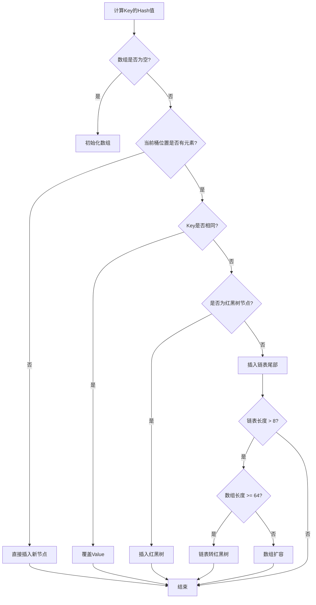
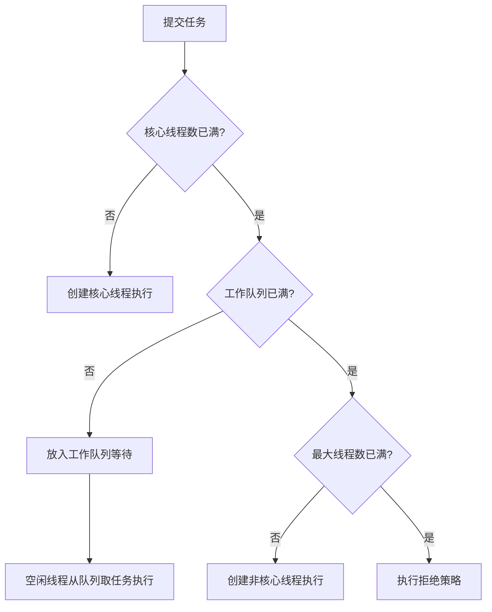
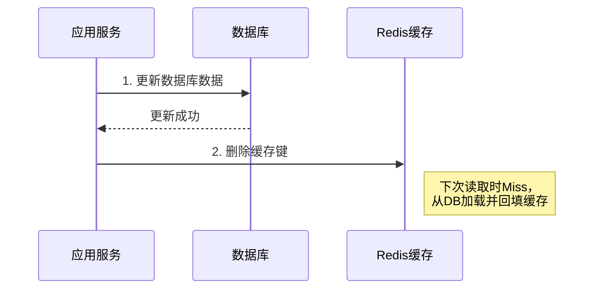

# 《JavaGuide面试突击版》与《Java集合框架常见面试题》结构化知识档案

## 书籍信息

- **书名**：
    1. 《JavaGuide面试突击版》 (v3.0)
    2. 《Java集合框架常见面试题》 (剖析面试最常见问题之 Java集合框架)
- **作者**：Guide哥 (SnailClimb)
- **PDF 状态**：文本可提取，结构清晰，包含大量代码片段和面试真题。
- **OCR 状态**：良好，无需特殊修复说明。

## 目录说明

- **目录识别情况**：
    - 《JavaGuide面试突击版》拥有完整的十章节结构，涵盖备战面试、Java基础、计算机基础、数据库、常用框架、认证授权、面经、微服务、真实大厂面试现场及开源项目推荐。
    - 《Java集合框架常见面试题》作为专题补充，深度解析 Collection 和 Map 体系。
- **章节对应依据**：严格按照提供的 PDF 目录顺序进行整合。由于《Java集合框架常见面试题》的内容在《JavaGuide》中也有涉及（2.2节），本总结将以《JavaGuide面试突击版》为主干，将《Java集合框架常见面试题》中的深度细节融合进对应的“Java集合”章节，以确保知识的完整性和深度。
- **OCR 修复说明**：无重大缺失，部分代码块中的特殊符号（如 `WX` 代表 `==`，`êX` 代表 `!=`，`ñó` 代表 `<<`，`jk` 或 `e>f` 代表 `>>>`）已在总结中修正为标准 Java 语法或明确说明。

## 全书核心主题

本书是一份专为 Java 开发者准备的面试突击指南，旨在通过系统化的知识梳理和真实大厂面试经验分享，帮助读者高效准备技术面试。内容覆盖从 Java 基础（集合、多线程、JVM）到计算机基础（网络、操作系统、数据结构算法），再到主流框架（Spring, MyBatis, Kafka, Netty）及分布式中间件（Redis, Zookeeper）。书中不仅提供了标准答案，还强调了底层原理、源码分析及实际应用场景，并收录了阿里、字节、拼多多等大厂的真实面经，强调“基础扎实”与“原理深入”并重，反对死记硬背，倡导理解性记忆与工程化思维。

---

## 第1章：备战面试

### 1. 核心论点

本章解决如何高效获取面试机会及准备面试材料的问题。作者认为，面试是有章可循的，关键在于简历的质量、自我介绍的策略以及对目标公司的定向复习，而非临考背题。

### 2. 关键概念/事件

- **STAR法则**：Situation（情境）、Task（任务）、Action（行动）、Result（结果）。用于清晰描述项目经历，体现逻辑性。
- **FAB法则**：Feature（特征）、Advantage（优势）、Benefit（利益）。用于在简历中突出个人优势及对公司的价值。
- **定向复习**：针对特定公司查找面经，了解其技术栈偏好和面试风格，提前准备特定知识点。
- **简历包装原则**：不夸大，但需突出亮点；不会的技术不要写；项目经历要体现解决的问题和使用的技术深度。

### 3. 逻辑推演/叙事脉络

本章首先分析了校招（秋招/春招）的时间窗口和难度差异，指出秋招含金量更高。接着，详细拆解了简历编写的两大法则（STAR/FAB），强调项目经历应侧重于“解决了什么问题”和“学到了什么”。随后，提供了自我介绍的模板（区分HR面和技术面），并列举了面试前的准备工作清单（着装、携带材料、刷题、逻辑题）。最后，通过回答常见困惑（如学历歧视、非科班出路、培训班利弊），鼓励读者通过项目和竞赛弥补劣势，强调自学能力和基础的重要性。

### 4. 经典金句/数据

> “面试和工作实际上是两回事，可能很多面试未通过的人，工作能力比你强的多，反之亦然。”
> “聪明的人会把面试官往自己擅长的领域领，其他人则被面试官牵着鼻子走。”
> “一定要有一门自己的特长...公司不需要你什么都会，但是在某一方面你一定要有过于常人的优点。”

---

## 第2章：Java基础+集合+多线程+JVM

### 1. 核心论点

本章是Java面试的核心，解决对Java语言底层机制、并发编程模型及虚拟机内存管理的理解问题。作者强调，不仅要会用API，更要懂底层原理（如HashMap扩容、线程池参数、GC算法），这是区分初级与高级开发者的关键。

### 2. 关键概念/事件

- **HashMap底层演变**：JDK 1.7为数组+链表；JDK 1.8引入红黑树（链表长度>8且数组长度>=64时转换），优化了哈希冲突下的查询效率（O(N) -> O(logN)）。
- **ConcurrentHashMap线程安全实现**：JDK 1.7使用分段锁（Segment）；JDK 1.8摒弃Segment，采用CAS + synchronized锁定链表/红黑树头节点，粒度更细，并发度更高。
- **线程池核心参数**：corePoolSize, maximumPoolSize, keepAliveTime, workQueue, threadFactory, handler。阿里巴巴规范禁止使用Executors创建，推荐手动构建ThreadPoolExecutor以规避OOM风险。
- **JVM内存区域**：堆（Heap）、方法区（Metaspace）、虚拟机栈、本地方法栈、程序计数器。重点在于对象分配策略（TLAB、Eden/Survivor/Old Gen）及GC算法（标记-清除、复制、标记-整理）。
- **volatile与synchronized**：volatile保证可见性和有序性（禁止指令重排），不保证原子性；synchronized保证原子性、可见性、有序性，JDK 1.6后引入偏向锁、轻量级锁等优化。

### 3. 逻辑推演/叙事脉络

本章从Java基础特性（面向对象、String不可变性、自动装箱）入手，过渡到集合框架。在集合部分，重点对比了List/Set/Map的实现差异，深入剖析HashMap的哈希扰动函数、扩容机制及线程不安全原因。随后进入多线程领域，从进程/线程区别讲到JMM（Java内存模型），详解volatile、synchronized、ReentrantLock、AQS、ThreadLocal及线程池原理。最后深入JVM，讲解内存结构、对象创建过程、垃圾回收算法及常见收集器（CMS, G1）的特点，形成从应用层到虚拟机层的完整知识闭环。

### 4. 流程图/图表处理

#### HashMap put操作流程图 (JDK 1.8)

#### 线程池执行流程

### 5. 经典金句/数据

> “HashMap的长度为什么是2的幂次方？为了能让HashMap存取高效，尽量较少碰撞... (n-1) & hash 等价于 hash % length，前提是length是2的n次方，且位运算效率高于取模。”
> “volatile关键字能保证数据的可见性，但不能保证数据的原子性。synchronized关键字两者都能保证。”
> “JDK 1.8之后，ConcurrentHashMap取消了Segment分段锁，采用CAS和synchronized来保证并发安全... synchronized只锁定当前链表或红黑二叉树的首节点。”

---

## 第3章：计算机基础

### 1. 核心论点

本章解决计算机网络、数据结构与算法、操作系统的基础理论问题。作者指出，这些是程序员的“内功”，决定了职业发展的上限，尤其在大厂面试中，对TCP/IP、OS内存管理、常见算法的考察非常深入。

### 2. 关键概念/事件

- **TCP三次握手与四次挥手**：握手确认双方收发能力正常；挥手确保数据完全传输完毕。重点在于SYN/ACK标志位及状态变迁（TIME_WAIT）。
- **HTTP与HTTPS**：HTTPS在HTTP基础上加入SSL/TLS层，通过非对称加密交换密钥，对称加密传输数据，保证安全性。
- **B+树与索引**：MySQL InnoDB使用B+树，叶子节点存储数据且形成链表，适合范围查询和磁盘IO优化（矮胖结构，减少IO次数）。
- **进程与线程**：进程是资源分配单位，线程是CPU调度单位。线程共享堆和方法区，独占栈、PC、本地方法栈。
- **虚拟内存与页面置换**：利用局部性原理，通过页表映射逻辑地址与物理地址。常见置换算法：LRU（最近最久未使用）、FIFO。

### 3. 逻辑推演/叙事脉络

本章分为三大部分。网络部分从OSI七层模型切入，重点讲解TCP可靠性保障（滑动窗口、拥塞控制、ARQ）及HTTP协议演进。数据结构部分简述常见结构（队列、栈、树、图），重点介绍B/B+树在数据库索引中的应用及红黑树在集合/Map中的应用。操作系统部分聚焦进程管理（状态、通信IPC）、内存管理（分页/分段、虚拟内存）及死锁条件与避免。逻辑上遵循“网络通信 -> 数据存储结构 -> 系统资源管理”的路径。

### 4. 经典金句/数据

> “TCP三次握手最主要的目的就是双方确认自己与对方的发送与接收是正常的。”
> “B+树的叶子节点链表结构相比于B-树便于扫库，和范围检索... 这是数据库选用B+树的最主要原因。”
> “虚拟内存的重要意义是它定义了一个连续的虚拟地址空间，并且把内存扩展到硬盘空间... 让每个进程产生了一种自己在独享主存的错觉。”

---

## 第4章：数据库面试题总结

### 1. 核心论点

本章解决关系型数据库（MySQL）和非关系型数据库（Redis）的核心原理及优化问题。强调索引设计、事务隔离级别、锁机制以及缓存一致性策略是高并发系统设计的基石。

### 2. 关键概念/事件

- **MySQL索引**：聚簇索引（InnoDB，数据即索引） vs 非聚簇索引（MyISAM）。最左前缀原则，覆盖索引，索引下推。
- **事务隔离级别**：READ-UNCOMMITTED, READ-COMMITTED, REPEATABLE-READ (MySQL默认), SERIALIZABLE。MVCC（多版本并发控制）在RR和RC级别下实现非阻塞读。
- **Redis持久化**：RDB（快照，恢复快，可能丢数据） vs AOF（追加日志，数据全，文件大）。推荐混合持久化。
- **缓存问题**：缓存穿透（布隆过滤器/空值缓存）、缓存雪崩（随机过期时间/高可用集群）、缓存击穿（互斥锁/逻辑过期）。
- **双写一致性**：先更新数据库再删除缓存（Cache Aside Pattern），延时双删，或监听Binlog异步删除。

### 3. 逻辑推演/叙事脉络

首先介绍MySQL存储引擎差异（InnoDB vs MyISAM），深入讲解索引数据结构（B+树）及优化技巧。接着探讨事务ACID特性及隔离级别带来的并发问题（脏读、幻读等），引出MVCC和锁机制（行锁、间隙锁）。随后转向Redis，分析其单线程模型、数据结构应用场景、持久化机制及内存淘汰策略。最后重点讨论缓存与数据库的一致性难题及解决方案，形成完整的存储层知识体系。

### 4. 流程图/图表处理

#### 缓存更新策略 (Cache Aside Pattern)

### 5. 经典金句/数据

> “InnoDB支持事务、行级锁和MVCC，是MySQL默认的存储引擎。MyISAM不支持事务，仅支持表级锁。”
> “MySQL InnoDB存储引擎在REPEATABLE-READ事务隔离级别下使用的是Next-Key Lock锁算法，因此可以避免幻读的产生。”
> “布隆过滤器说某个元素存在，小概率会误判。布隆过滤器说某个元素不在，那么这个元素一定不在。”

---

## 第5章：常用框架面试题总结

### 1. 核心论点

本章解决Spring全家桶、MyBatis、Kafka、Netty等主流框架的原理及应用问题。强调理解框架的设计模式、核心组件生命周期及底层通信机制，而非仅仅会使用注解。

### 2. 关键概念/事件

- **Spring IOC/AOP**：IOC通过BeanFactory管理对象依赖；AOP基于动态代理（JDK Proxy/CGLIB）实现切面逻辑。
- **Spring Bean生命周期**：实例化 -> 属性赋值 -> 初始化（Aware接口, PostProcessor, init-method） -> 销毁。
- **MyBatis插件原理**：基于JDK动态代理拦截ParameterHandler, ResultSetHandler, StatementHandler, Executor四大对象。
- **Kafka消息可靠性**：ACK机制（acks=all），副本同步（min.insync.replicas），幂等性生产者，事务消息。
- **Netty线程模型**：Reactor模式，BossGroup处理连接，WorkerGroup处理IO读写。零拷贝（CompositeByteBuf, FileRegion）。

### 3. 逻辑推演/叙事脉络

从Spring核心（IOC/AOP）出发，延伸至Web层（Spring MVC流程）和事务管理。接着讲解ORM框架MyBatis的映射原理、动态SQL及插件机制。随后进入中间件领域，分析Kafka的高吞吐原理（顺序写、零拷贝、批处理）及消息不丢失/不重复消费方案。最后深入Netty，解析其高性能NIO封装、线程模型及粘包拆包解决方案，体现从业务框架到底层通信框架的技术纵深。

### 4. 经典金句/数据

> “Spring AOP属于运行时增强，而AspectJ是编译时增强。Spring AOP基于代理(Proxying)，而AspectJ基于字节码操作(Bytecode Manipulation)。”
> “Kafka通过给特定Topic指定多个Partition，而各个Partition可以分布在不同的Broker上，这样便能提供比较好的并发能力（负载均衡）。”
> “Netty成功地找到了一种在不妥协可维护性和性能的情况下实现易于开发，性能，稳定性和灵活性的方法。”

---

## 第6章：认证授权

### 1. 核心论点

本章解决Web系统中的身份认证（Authentication）与权限控制（Authorization）问题。对比Session/Cookie与Token/JWT的优劣，并介绍OAuth 2.0和SSO的标准实现。

### 2. 关键概念/事件

- **Session vs Token**：Session服务端存储状态，依赖Cookie；Token（JWT）客户端存储，无状态，适合分布式/移动端。
- **CSRF攻击**：跨站请求伪造。Cookie自动携带导致风险，Token需手动添加Header可防御。
- **OAuth 2.0**：授权协议，四种模式（授权码、隐式、密码、客户端凭证），常用于第三方登录。
- **SSO（单点登录）**：一处登录，多处访问。通常基于CAS或OAuth 2.0实现。

### 3. 逻辑推演/叙事脉络

首先辨析认证与授权的概念。接着对比传统Session机制与现代Token机制，指出Session在分布式环境下的局限性及JWT的优势。随后深入安全领域，解释CSRF原理及Token的防御机制。最后介绍行业标准OAuth 2.0及其与SSO的区别与应用场景，构建完整的身份安全视图。

### 4. 经典金句/数据

> “认证(Authentication)：你是谁。授权(Authorization)：你有权限干什么。”
> “JWT本质上就一段签名的JSON格式的数据。由于它是带有签名的，因此接收者便可以验证它的真实性。”
> “Cookie无法防止CSRF攻击，因为浏览器会自动携带Cookie；而Token通常放在Header中，需要前端代码显式添加，跨站脚本无法获取。”

---

## 第7章：优质面经

### 1. 核心论点

本章通过真实大厂（阿里、字节、拼多多、Bigo等）面试案例，展示面试考察的重点与应对策略。强调基础扎实、项目深度、算法能力及沟通表达的重要性。

### 2. 关键概念/事件

- **阿里面试特点**：重视基础（JVM、并发、网络），深挖项目难点，考察学习能力和价值观。
- **字节面试特点**：算法题必考（LeetCode中等难度），重视手写代码能力，追问原理直至边界。
- **项目介绍策略**：STAR法则，突出个人贡献，预设难点与解决方案（如缓存穿透、OOM排查）。
- **心态调整**：面试是双向选择，失败是常态，复盘比结果更重要。

### 3. 逻辑推演/叙事脉络

收录多篇读者投稿的面经，按公司分类。每篇面经包含背景、多轮面试问题记录及总结。问题涵盖自我介绍、项目深挖、基础知识（Java、DB、Network）、算法手写及HR面。通过不同候选人的经历，归纳出大厂面试的共性：基础必须牢固，项目必须有思考，算法必须熟练，沟通必须清晰。

### 4. 经典金句/数据

> “面试官都有一个特点，会抓住一个值得深入的点或者你没说清楚的点深入下去直到你把这个点讲清楚，不然面试官会觉得你并没有真正理解。”
> “基础！基础！基础！重要的事情说三遍，无论是什么阶段的程序员，基础都是最重要的。”
> “面试前要做好两件事：简历和自我介绍... 简历提到的技术一定是自己深入研究过的。”

---

## 第8章：微服务/分布式

### 1. 核心论点

本章简要列出微服务与分布式系统的核心考点，如网关、限流、分布式ID、RPC、Dubbo等。指出这部分内容通常结合具体项目经验考察，建议参考进阶资料。

### 2. 关键概念/事件

- **网关**：路由、过滤、限流、鉴权。常见组件：Spring Cloud Gateway, Zuul, Nginx。
- **分布式ID**：UUID（无序）、数据库自增（性能瓶颈）、Snowflake（推特雪花算法，趋势递增）、Leaf（美团）。
- **RPC框架**：Dubbo, gRPC。核心要素：序列化、网络传输、动态代理、负载均衡。
- **限流算法**：计数器、滑动窗口、漏桶、令牌桶。

### 3. 逻辑推演/叙事脉络

以问答列表形式呈现，涵盖微服务架构中的关键组件和设计决策。由于内容较广，书中引导读者前往知识星球获取详细解答，此处主要起到知识地图的作用，提醒读者关注分布式系统的一致性与可用性权衡。

---

## 第9章：真实大厂面试现场

### 1. 核心论点

通过模拟对话形式，还原阿里面试官与候选人的互动，生动展示如何将理论知识应用于实际问题解答。强调“知其然更知其所以然”。

### 2. 关键概念/事件

- **电商系统架构**：分层设计（展示层、服务层、持久层），Dubbo RPC调用，Zookeeper注册中心，Redis缓存，MQ削峰。
- **缓存穿透解决**：布隆过滤器预判，空值缓存短期过期。
- **JVM调优**：OOM排查步骤（dump内存，MAT分析，定位大对象/泄漏点）。
- **Netty粘包拆包**：LengthFieldBasedFrameDecoder，自定义协议头。

### 3. 逻辑推演/叙事脉络

采用剧本式对话，面试官提出问题，候选人回答并内心OS（心理活动）。内容覆盖项目架构介绍、中间件选型理由、底层原理追问（如TCP握手、HashMap扩容、JMM）。通过这种形式，展示了面试中如何引导话题、如何承认不足并展示学习能力，以及如何将分散的知识点串联成体系。

### 4. 经典金句/数据

> “面试官：你这说的太简单了！能不能稍微详细一点，最好能画图给我解释一下。”
> “我：内心os: '都2019年了，大部分面试者都能对消息队列的为系统带来的这两个好处倒背如流了，如果你想走的更远就要别别人懂的更深一点！'”

---

## 第10章：开源项目推荐

### 1. 核心论点

推荐一系列高质量的Java学习开源项目，涵盖基础教程、面试指南、源码分析及算法题解。鼓励读者参与开源，通过阅读优秀代码提升技术水平。

### 2. 关键概念/事件

- **JavaGuide**：本文档来源，全面的Java知识总结。
- **CS-Notes**：计算机基础与算法题解。
- **advanced-java**：互联网高阶知识（高并发、分布式）。
- **LeetCodeAnimation**：动画演示算法题解，直观易懂。

### 3. 逻辑推演/叙事脉络

列出项目名称、简介及推荐理由。分类为教程类、面试类、算法类。强调这些项目在社区中的影响力及对个人成长的帮助，鼓励读者Star、Fork并贡献代码。

### 4. 经典金句/数据

> “开源项目在于大家的参与，这才使得它的价值得到提升。”
> “生活要继续，学习也要继续。”