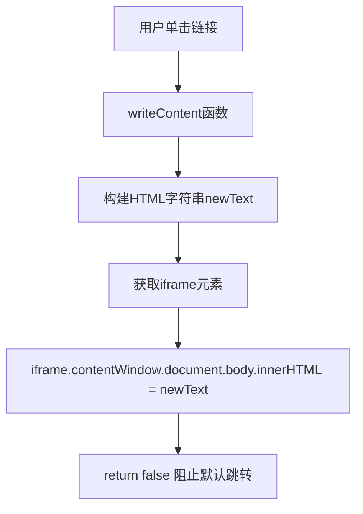
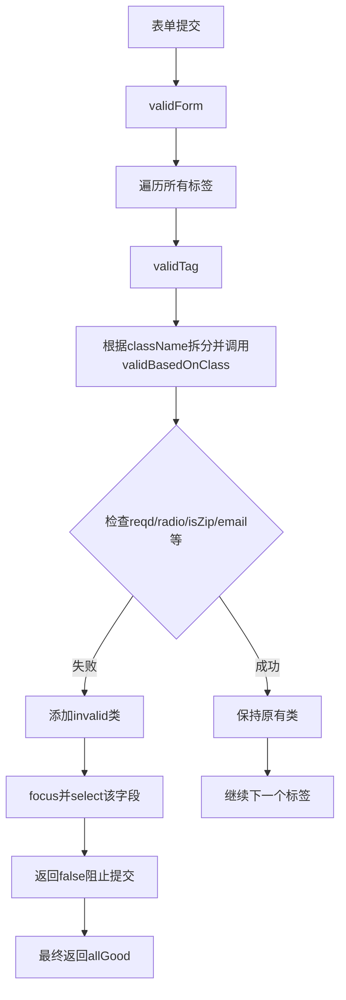

# 《JavaScript基础教程（第8版）》章节总结

## 书籍信息
- 书名：JavaScript基础教程（第8版）
- 作者：Tom Negrino, Dori Smith
- PDF状态：完整（OCR文本，含页码）
- OCR状态：可读，部分表格和图片信息缺失

## 目录说明
- 目录识别情况：完整，包含第1章至第17章及附录A-D
- 章节对应依据：基于PDF中提取的目录结构
- OCR修复说明：部分代码示例中的箭头（→）表示续行，已保留；部分图像描述以`image[[...]]`形式标注，无法完全还原。

## 全书核心主题
本书是JavaScript入门经典教材，循序渐进地讲解JavaScript语言基础、DOM操作、事件处理、图像效果、表单验证、正则表达式、cookie、Ajax以及jQuery框架。全书强调从基础到实践，通过大量示例和步骤讲解，帮助读者掌握网页交互与动态效果的实现方法。第8版新增了jQuery相关内容，并更新了浏览器兼容性建议（IE7+、Firefox、Safari、Chrome等）。核心思想是“无干扰脚本编程”和“渐进增强”。

---

## 第1章：了解JavaScript
### 1. 核心论点
JavaScript是一种客户端脚本语言，用于为网页增加交互性。它不是Java，而是由Netscape发明的基于对象和事件驱动的语言。Ajax是JavaScript与其他技术的组合，用于创建响应式的Web应用。

### 2. 关键概念/事件
- **JavaScript**：解释型脚本语言，嵌入HTML中运行。
- **Ajax**：异步JavaScript和XML，包括XHTML、CSS、DOM、XML/JSON、XMLHttpRequest。
- **对象、属性、方法**：对象是“东西”，属性是其特征，方法是其能做的动作。
- **DOM**：文档对象模型，将页面组织为树形结构，可通过JavaScript操作节点。
- **事件处理程序**：如onclick、onmouseover等，响应用户操作。

### 3. 逻辑推演/叙事脉络
作者首先澄清JavaScript与Java的区别，介绍JavaScript的起源（LiveScript改名）和功能（如表单验证、翻转器、打开新窗口等）。接着说明JavaScript的安全限制（不能写服务器文件、不能关闭非自身打开的窗口等）。然后引入Ajax的定义和优势（如Google Maps）。之后讲解对象、属性、方法、DOM、事件、值和变量、运算符等基础概念。最后强调编写对JavaScript友好的HTML（使用div/span、class/id、分离结构/表现/行为）。

### 4. 经典金句/数据
> “JavaScript是一种可以用来给网页增加交互性的编程语言。”（p.1）
> “Ajax是Asynchronous JavaScript and XML（异步JavaScript和XML）的缩写。”（p.4）

---

## 第2章：开始
### 1. 核心论点
本章教授如何编写第一个JavaScript脚本，包括放置脚本的位置、使用函数、外部脚本、注释、警告框、确认框、提示框、重定向链接、多级条件语句（switch/case）和错误处理（try/catch）。

### 2. 关键概念/事件
- **内部脚本与外部脚本**：外部脚本使用`<script src="...">`，便于维护。
- **window.onload**：确保页面加载完成后执行代码。
- **confirm()**：返回true/false的确认对话框。
- **prompt()**：获取用户输入的文本。
- **switch/case**：多分支条件语句。
- **try/catch/throw**：异常处理机制。

### 3. 逻辑推演/叙事脉络
作者首先展示最简单的`document.write("Hello, world!")`，然后说明更好的做法是使用外部脚本和`innerHTML`。接着讲解函数定义、注释、alert、confirm、prompt。然后演示如何根据用户是否启用JavaScript进行页面重定向（利用`window.location`和`return false`）。再通过switch/case实现多条件判断（总统语录）。最后用平方根计算器示例讲解try/catch错误处理。

### 4. 经典金句/数据
> “无干扰脚本编程（unobtrusive scripting）将代码与HTML分隔开，从而使这两者都更加灵活。”（p.27）

---

## 第3章：第一个Web应用程序
### 1. 核心论点
通过构建一个Bingo卡片游戏，系统讲解循环、函数参数传递、对象探测、数组、有返回值的函数、do/while循环、多种调用脚本的方式、JavaScript与CSS结合，以及字符串数组的应用。

### 2. 关键概念/事件
- **for循环**：计数器初始化、条件、递增。
- **数组**：存储一组信息，索引从0开始。
- **对象探测**：`if(document.getElementById)`检测浏览器是否支持。
- **do/while循环**：至少执行一次，然后检查条件。
- **按位运算**：用于检查获胜组合（二进制位表示）。
- **Math.random()**：生成随机数。

### 3. 逻辑推演/叙事脉络
作者从简单的随机填充Bingo卡片开始，逐步优化：限制每列数字范围（通过列数组）、提取随机数函数、防止重复数字（使用布尔数组）、使用do/while直到找到未使用的数字、允许用户重新生成卡片、添加点击格子改变背景色的交互（利用CSS类切换）、最后实现获胜检查（按位运算）和“Buzzword Bingo”（字符串数组）。

### 4. 流程图（获胜检查逻辑）
```mermaid
graph TD
    A[用户点击格子] --> B[toggleColor: 改变className]
    B --> C[checkWin]
    C --> D[遍历24个格子]
    D --> E[将已标记格子的位权相加 -> setSquares]
    E --> F[遍历预定义的获胜模式数组winners]
    F --> G{ winners[i] & setSquares == winners[i] ? }
    G -->|是| H[设置winningOption = i]
    G -->|否| F
    H --> I[将获胜格子的className设为winningBG]
```

### 5. 经典金句/数据
> “正则表达式是一种对文本字符串进行验证和格式化的极其强大的方式。”（p.131）

---

## 第4章：处理图像
### 1. 核心论点
通过JavaScript实现图像翻转器、三状态翻转器、由链接触发翻转器、多个链接触发同一翻转器、多个翻转器同时处理、循环广告条、带链接的循环广告条、幻灯片和随机图像显示。

### 2. 关键概念/事件
- **翻转器**：`onmouseover`/`onmouseout`改变图片`src`。
- **预加载图像**：使用`new Image()`和赋值`src`提前缓存。
- **三状态翻转器**：增加`onclick`状态。
- **setTimeout()**：定时循环切换图像。
- **随机图像**：`Math.random()`选取数组中的图片。

### 3. 逻辑推演/叙事脉络
作者首先实现最基本的翻转器（直接在HTML中写onmouseover），然后改进为预加载图像的外部脚本。接着添加click状态制作三状态翻转器。然后演示如何用文本链接触发图像翻转（通过`id`关联）。再展示多个链接触发同一个描述区域（利用`className`）。之后实现多翻转器（同时改变描述图和原图阴影）。最后实现循环广告条、带链接的循环广告条、前后控制的幻灯片、随机图像以及随机起始的循环广告条。

### 4. 流程图（高效翻转器初始化）
```mermaid
graph TD
    A[window.onload] --> B[rolloverInit]
    B --> C[遍历document.images]
    C --> D{父节点是A标签?}
    D -->|是| E[setupRollover(image)]
    E --> F[创建outImage对象, src=当前src]
    E --> G[创建overImage对象, src=images/id_on.gif]
    E --> H[设置onmouseout/onmouseover 匿名函数]
    D -->|否| C
```

### 5. 经典金句/数据
> “原图像和替换图像的尺寸应该相同。否则，一些浏览器会替你重新设置尺寸，而调整后的结果可能不理想。”（p.64）

---

## 第5章：窗口与框架
### 1. 核心论点
JavaScript可以控制浏览器窗口和框架，包括防止页面被放入框架、设置框架目标、动态加载iframe、在文档之间共享函数、打开新窗口以及为窗口加载不同内容。

### 2. 关键概念/事件
- **top与self**：`top.location != self.location`检测是否在框架中。
- **iframe**：内联框架，可通过`contentWindow`访问其文档。
- **window.open()**：参数包括URL、窗口名、特性（宽高、工具栏等）。
- **focus()/blur()**：控制窗口焦点。

### 3. 逻辑推演/叙事脉络
作者首先给出防止页面被恶意放入框架的脚本（`top.location.replace(self.location)`）。然后讲解如何通过JavaScript设置链接的`target`属性为iframe的name。接着展示如何用JavaScript加载新页面到iframe（`contentWindow.document.location.href`）。之后演示动态创建iframe内容（写入`innerHTML`）。再讲解跨文档共享函数（通过`parent`引用）。最后介绍打开新窗口的各种方式，以及为同一窗口加载不同内容（通过`this.href`和`window.open`）。

### 4. 流程图（iframe动态内容）


### 5. 经典金句/数据
> “我们创建的新窗口可以包括其中的任意部分或者全部。”（p.92）

---

## 第6章：表单处理
### 1. 核心论点
通过JavaScript增强表单的可用性和验证，包括“选择并转移”导航菜单、动态改变菜单、必须填写的字段、字段间的交叉验证、标识有问题的字段、单选按钮处理、一个字段设置另一个字段、ZIP编码验证和电子邮件地址验证。

### 2. 关键概念/事件
- **选择并转移菜单**：`onchange`事件读取选中项的值，设置`window.location`。
- **动态菜单**：根据第一个菜单的选择，用`new Option()`填充第二个菜单。
- **表单验证框架**：遍历所有元素，根据`className`（如`reqd`）进行验证，添加`invalid`类改变样式。
- **单选按钮组**：通过`radioName`和`checked`属性检查是否至少选中一个。
- **isNaN()/parseInt()**：验证数字和ZIP编码。
- **电子邮件验证**：检查是否有@、点号、无效字符等。

### 3. 逻辑推演/叙事脉络
作者首先实现“选择并转移”菜单（无需Go按钮），并兼容不支持JavaScript的用户（显示noscript按钮）。然后实现动态菜单（根据月份填充天数）。接着构建一个通用的表单验证框架，通过检查`className`中的`reqd`等标识，对未填写的字段添加`invalid`类，用CSS突出显示。然后扩展框架以支持密码匹配验证（利用`crossCheck`函数）。再改进为同时高亮标签。之后展示如何在选择复选框时自动设置单选按钮（`doorSet`函数）。最后分别实现ZIP编码验证（只允许数字）和电子邮件地址的简单验证（检查@、点号、无效字符）。

### 4. 流程图（通用表单验证框架）


### 5. 经典金句/数据
> “这个脚本在很大程度上独立于使用它的HTML页面。”（p.113）

---

## 第7章：表单和正则表达式
### 1. 核心论点
使用正则表达式（RegExp）可以简化字符串验证、提取、格式化和替换任务。本章通过电子邮件验证、文件名验证、姓名提取、姓名格式化和排序、电话号码格式化和验证、翻转器代码优化等示例，展示正则表达式的强大。

### 2. 关键概念/事件
- **正则表达式字面量**：`/pattern/`，可带修饰符`i`（不区分大小写）、`g`（全局）。
- **元字符**：`^`（开头）、`$`（结尾）、`\d`（数字）、`\w`（字母数字下划线）、`\s`（空白）、`+`（一次或多次）、`*`（零次或多次）、`?`（零次或一次）、`{n,m}`（次数）、`[abc]`（字符集）、`()`（分组）、`|`（或）。
- **RegExp方法**：`test()`、`exec()`。
- **String方法**：`match()`、`replace()`、`search()`、`split()`。

### 3. 逻辑推演/叙事脉络
作者先对比第6章的电子邮件验证（27行）与使用正则表达式的版本（4行），展示简洁性。然后通过验证图像文件名（`/^(file|http):\/\/\S+\/\S+\.(gif|jpg|png)$/i`）演示URL验证。接着提取字符串（按换行分割，然后交换名字和姓氏）和格式化字符串（首字母大写）。再实现排序和格式化组合。然后处理电话号码（提取数字并格式化为`(xxx) xxx-xxxx`）。最后用正则表达式优化翻转器脚本：不再需要id，而是通过替换`_off`为`_on`/`_click`动态构造图像名。

### 4. 经典金句/数据
> “正则表达式常常被认为是编程中最棘手的部分之一。”（p.131）
> “这段代码并没有匹配每一种合法的电子邮件地址形式，仅仅匹配你最想让用户输入的形式。”（p.135）

---

## 第8章：处理事件
### 1. 核心论点
事件处理是用户与页面交互的核心。本章详细讲解窗口事件、鼠标事件、表单事件和键盘事件的用法，包括`onload`、`onunload`、`onresize`、`onmousemove`、`onclick`、`ondblclick`、`onblur`、`onfocus`、`onkeydown`等。

### 2. 关键概念/事件
- **addonload()**：处理多个onload事件的通用函数。
- **onresize**：解决Netscape 4.x的bug。
- **onmousedown/oncontextmenu**：禁用右键菜单。
- **onmousemove**：实现“跟随眼睛”效果。
- **ondblclick**：双击缩略图弹出大图。
- **onblur/onfocus**：控制窗口前后顺序，以及表单字段的强制填写。
- **onkeydown**：用左右箭头控制幻灯片。

### 3. 逻辑推演/叙事脉络
作者首先解决多个`window.onload`覆盖问题，提供`addonload`函数。然后演示`onresize`修复、`onfocus`/`onblur`控制窗口层叠。鼠标事件部分：禁用右键菜单、实现转动眼睛效果、双击弹出大图。表单事件部分：在字段失去焦点时强制填写（`onblur`）、防止修改只读字段（`onfocus`+`blur`）。键盘事件：捕获左右箭头键值（37/39），切换幻灯片。

### 4. 流程图（键盘事件处理）
```mermaid
graph TD
    A[按下键盘] --> B[document.onkeydown]
    B --> C[获取按键代码]
    C --> D{左箭头(37)?}
    D -->|是| E[chgSlide(-1)]
    D -->|否| F{右箭头(39)?}
    F -->|是| G[chgSlide(1)]
    F -->|否| H[return false]
    E --> I[更新图片src]
    G --> I
```

### 5. 经典金句/数据
> “如果你确实很担心自己的源代码泄露出去，那么唯一真正可靠的保密方法是不把它放在Web上。”（p.160）

---

## 第9章：JavaScript和cookie
### 1. 核心论点
cookie是服务器发送给浏览器的一小段信息，可用于保存用户偏好、访问计数、上次访问时间等。本章讲解如何创建、读取、显示、删除cookie，以及使用cookie实现计数器和新内容提醒。

### 2. 关键概念/事件
- **cookie格式**：`name=value; expires=date; path=path; domain=domain`
- **document.cookie**：读写cookie的接口。
- **过期日期**：设置`expires`为过去时间可删除cookie。
- **split()**：解析多个cookie。
- **应用**：记录访问次数、上次访问时间、新内容标记。

### 3. 逻辑推演/叙事脉络
作者先创建第一个cookie（保存用户名，过期6个月）。然后读取cookie并显示。接着展示所有cookie的遍历显示。再实现计数器（每访问一次增加计数）。删除cookie通过设置过期时间为昨天。处理多个cookie（记录次数和上次访问时间）。最后实现新内容提醒：比较页面段落`id`中的日期与cookie中的上次访问日期，如果内容更新则添加`newImg`类显示“New!”图标。

### 4. 经典金句/数据
> “cookie只是用户硬盘上一个简单的文本文件，可以在其中存储一些信息，仅此而已。”（p.173）

---

## 第10章：对象和DOM
### 1. 核心论点
通过DOM节点操纵（添加、删除、插入、替换节点）可以动态修改页面结构。本章还介绍了使用对象字面值（JSON风格）编写代码的优势。

### 2. 关键概念/事件
- **节点**：元素节点、文本节点。
- **创建节点**：`document.createElement()`、`document.createTextNode()`。
- **追加节点**：`parentNode.appendChild()`。
- **删除节点**：`parentNode.removeChild()`。
- **插入节点**：`parentNode.insertBefore()`。
- **替换节点**：`parentNode.replaceChild()`。
- **对象字面值**：`{属性:值, 方法:function(){}}`，避免全局命名冲突。

### 3. 逻辑推演/叙事脉络
作者首先演示在文档末尾添加新段落（`createElement`和`appendChild`）。然后删除最后一个段落（`removeChild`）。接着通过单选按钮和下拉列表选择删除特定段落。再实现插入节点（`insertBefore`）。然后实现替换节点（`replaceChild`）。最后将过程式代码改写为对象字面值形式，展示其模块化和简洁性。

### 4. 流程图（节点操作）
```mermaid
graph TD
    A[用户操作] --> B{操作类型}
    B -->|添加| C[createTextNode + createElement p]
    C --> D[appendChild到容器]
    B -->|删除| E[getElementById获取容器中所有p]
    E --> F[removeChild(选中的p)]
    B -->|插入| G[创建新p]
    G --> H[insertBefore(新p, 旧p)]
    B -->|替换| I[创建新p]
    I --> J[replaceChild(新p, 旧p)]
```

### 5. 经典金句/数据
> “对象字面值的一个子集被称为JavaScript Object Notation，简称为JSON。”（p.205）

---

## 第11章：建立动态页面
### 1. 核心论点
使用JavaScript在客户端动态生成日期、时间、倒计时、隐藏/显示层、移动对象等，可以减轻服务器负担并提升用户体验。

### 2. 关键概念/事件
- **Date对象**：获取年、月、日、小时、分钟、秒等。
- **时区转换**：使用`toUTCString()`和`setHours()`计算偏移量。
- **12小时制转换**：判断小时数，显示AM/PM。
- **倒计时**：计算两个日期之间的天数差。
- **显示/隐藏层**：修改`style.display`为`block`或`none`。
- **移动对象**：修改`style.left`，使用`setTimeout`动画。

### 3. 逻辑推演/叙事脉络
作者首先显示当前日期，然后判断是否为周末。接着根据时间返回不同问候语。然后通过时区偏移量计算多个办公室的本地时间（利用UTC）。再实现24/12小时制切换时钟。之后制作倒计时（计算到生日和圣诞节的天数）。然后演示如何隐藏/显示一个浮动层（广告），用户可关闭。最后让广告层在鼠标悬停时向右移动（改变`left`属性）。

### 4. 经典金句/数据
> “JavaScript将日期存储为自1970年1月1日以来的毫秒数。”（p.218）

---

## 第12章：JavaScript应用示例
### 1. 核心论点
综合运用多种技术构建实用组件：可折叠菜单、下拉菜单、带说明的幻灯片、无聊姓名生成器、柱状图生成器、样式表切换器。

### 2. 关键概念/事件
- **可折叠菜单**：通过`onclick`切换`ul`的`display`属性。
- **下拉菜单**：`onmouseover`显示菜单，`onmouseout`隐藏（需处理父div的hover）。
- **幻灯片+说明**：数组存储图片路径和说明文本，按钮切换索引。
- **姓名生成器**：根据名字首字母映射数组元素。
- **柱状图**：动态生成表格，根据数据值设置图像宽度/高度。
- **样式表切换器**：遍历`<link>`标签，启用/禁用样式表，并用cookie保存用户选择。

### 3. 逻辑推演/叙事脉络
作者先实现可折叠菜单（点击标题展开/收起列表）。然后改进为下拉菜单（鼠标悬浮展开，离开整个区域关闭）。再改进为水平菜单并支持键盘导航。接着创建带说明的幻灯片（图像和文本同步切换）。然后制作无聊姓名生成器（根据首字母从三个数组中拼接）。之后用自定义对象存储图表数据，动态生成水平或垂直柱状图。最后实现样式表切换器，允许用户选择不同字体，并用cookie记住偏好。

### 4. 流程图（样式表切换器）
```mermaid
graph TD
    A[页面加载] --> B[initStyle]
    B --> C{存在style cookie?}
    C -->|是| D[读取cookie中的title]
    C -->|否| E[getPreferredStylesheet]
    D --> F[setActiveStylesheet(title)]
    E --> F
    F --> G[遍历link标签]
    G --> H[禁用所有带title的样式表]
    H --> I[启用title匹配的样式表]
    I --> J[设置按钮onclick]
    J --> K[unloadStyle时保存cookie]
```

### 5. 经典金句/数据
> “只需修改步骤3～5中的数组值，就可以将这个图表改为显示几乎任何数据。”（p.246）

---

## 第13章：Ajax简介
### 1. 核心论点
Ajax（Asynchronous JavaScript and XML）是结合HTML/CSS、DOM、XMLHttpRequest、XML/JSON和JavaScript的技术，用于创建无需刷新整个页面的响应式Web应用。

### 2. 关键概念/事件
- **XMLHttpRequest**：核心对象，用于异步请求。
- **readyState**：0=未初始化，1=加载中，2=已加载，3=交互中，4=完成。
- **status**：200表示成功，404等表示错误。
- **responseText / responseXML**：获取服务器返回的数据。
- **跨域限制**：只能请求同源URL（可通过JSONP绕过）。

### 3. 逻辑推演/叙事脉络
作者首先解释Ajax的定义和历史。然后实现第一个Ajax脚本：读取文本文件或XML文件并显示内容。接着解析Flickr的XML数据，提取图片信息并显示缩略图。再实现自动刷新（每5秒重新请求XML并随机显示一张图片）。然后利用JSONP（通过`<script>`标签加载远程JSON）获取Flickr数据。之后构建链接预览：鼠标悬停时异步加载目标页面的内容，并显示在浮动层中。最后实现自动补全表单字段：读取州名XML，根据用户输入过滤并显示匹配项，支持键盘选择。

### 4. 流程图（Ajax请求流程）
```mermaid
graph TD
    A[创建XMLHttpRequest] --> B[设置onreadystatechange回调]
    B --> C[open('GET', url, true)]
    C --> D[send(null)]
    D --> E[等待readyState变化]
    E --> F{readyState == 4?}
    F -->|否| E
    F -->|是| G{status == 200?}
    G -->|是| H[处理responseText或responseXML]
    G -->|否| I[显示错误信息]
    H --> J[更新页面DOM]
```

### 5. 经典金句/数据
> “Ajax应用程序在用户和服务器之间建立一个中介。”（p.254）
> “脚本只能读取它所在的服务器上的文件。”（p.265）

---

## 第14章：工具包、框架和库
### 1. 核心论点
介绍jQuery库的基本用法：如何添加jQuery、更新页面、添加交互（hover/click）、处理自动完成字段。jQuery通过CSS选择器简化DOM操作，并提供了丰富的插件和UI组件。

### 2. 关键概念/事件
- **CDN加载**：`<script src="http://ajax.googleapis.com/ajax/libs/jquery/1/jquery.js">`
- **$(document).ready()**：替代`window.onload`。
- **选择器**：`$("#id")`、`$(".class")`、`$("tag")`。
- **方法**：`append()`、`attr()`、`css()`、`click()`、`hover()`、`autocomplete()`。

### 3. 逻辑推演/叙事脉络
作者首先解释为什么选择jQuery（轻量级、活跃社区、插件架构、速度、易学）。然后演示如何在页面中添加jQuery库。接着实现一个简单的“Welcome to jQuery!”警告框，然后改为更新页面内容（`$("#welcome").append()`）。再实现交互：单击链接改变标题颜色，鼠标悬浮改变按钮颜色。最后用jQuery UI的`autocomplete`方法，仅需几行代码就实现了州名自动补全（对比第13章的大量代码）。

### 4. 经典金句/数据
> “jQuery的流行原因之一是它的选择器与CSS中的选择器非常相似。”（p.282）

---

## 第15章：用jQuery设计页面
### 1. 核心论点
使用jQuery UI可以轻松添加高级UI效果：突出显示新元素（黄色淡出）、可折叠菜单、模态对话框、斑马纹表格、表格排序。

### 2. 关键概念/事件
- **effect("highlight")**：黄色淡出效果。
- **accordion()**：将一组列表转换为可折叠菜单。
- **dialog()**：创建模态对话框，可拖动、可调整大小。
- **斑马纹**：`$("tr:even").addClass("even")`。
- **表格排序插件**：tablesorter，通过`$("#tableId").tablesorter({...})`实现。

### 3. 逻辑推演/叙事脉络
作者首先用`hide()`和`show("slow")`结合`effect("highlight")`实现显示/隐藏文本并高亮。然后使用`accordion()`将无序列表转换为可折叠菜单，并设置选项（动画、自动高度、标题选择器）。接着创建模态对话框，设置覆盖层和按钮。再通过`$("tr:even").addClass("even")`和`mouseover`/`mouseout`添加斑马纹和行高亮。最后引入tablesorter插件，实现按列排序，并添加升序/降序图标和斑马纹部件。

### 4. 经典金句/数据
> “黄色淡出差不多已经成了Web设计的标志。”（p.289）
> “可选的主题有很多：Base、Dark Hive、Hot Sneaks……”（p.297）

---

## 第16章：基于jQuery的应用
### 1. 核心论点
深入使用jQuery和jQuery UI：通过ThemeRoller定制主题、添加日历（单日历和双日历）、实现拖放排序（sortable）、处理外部JSON数据（Twitter feed）、使用音频播放器插件。

### 2. 关键概念/事件
- **ThemeRoller**：在线工具自定义jQuery UI主题。
- **datepicker**：日期选择器，可设置日期格式、月份数、最小/最大日期。
- **sortable**：将列表项变为可拖放排序。
- **$.getJSON()**：跨域获取JSON数据，需服务器支持JSONP。
- **jQuery插件**：如mb.miniPlayer，用于播放HTML5音频。

### 3. 逻辑推演/叙事脉络
作者首先介绍ThemeRoller的使用步骤（从Gallery选择主题→编辑→下载）。然后实现单日历（绑定到div，选择日期后更新span）和双日历（两个输入框，联动限制minDate/maxDate）。接着使用`sortable()`实现图片列表的拖放重新排序。之后通过`$.getJSON()`获取Twitter feed，解析并显示用户信息和推文。最后介绍jQuery音频播放器插件，只需一行`$(".audio").mb_miniPlayer(...)`即可。

### 4. 流程图（双日历联动）
```mermaid
graph TD
    A[页面加载] --> B[绑定datepicker到#from和#to]
    B --> C[设置defaultDate:+1w, numberOfMonths:2]
    C --> D[onSelect事件]
    D --> E{当前字段id是from?}
    E -->|是| F[设置minDate = selectedDate]
    E -->|否| G[设置maxDate = selectedDate]
    F --> H[dates.not(this).datepicker('option', option, date)]
    G --> H
```

### 5. 经典金句/数据
> “jQuery 库包含了一系列丰富的用于页面与后台服务器交互的 Ajax 函数。”（p.306）

---

## 第17章：bookmarklet
### 1. 核心论点
bookmarklet是包含JavaScript代码的书签，可以在不加载新页面的情况下对当前页面进行操作。本章介绍如何创建和使用bookmarklet，并提供了多个实用示例：改变背景颜色、改变页面样式、查询单词、查看图像、显示ISO Latin字符、RGB转十六进制、单位转换、计算器、缩短URL、验证页面、通过电子邮件发送页面、改变窗口大小。

### 2. 关键概念/事件
- **格式**：`javascript:(function(){...})();`，必须在一行内。
- **void()**：用于避免返回值覆盖当前页面。
- **window.getSelection()** 与 **document.selection**：跨浏览器获取选中的文本。
- **TinyURL**：通过API缩短URL。
- **W3C验证器**：`http://validator.w3.org/check?uri=`

### 3. 逻辑推演/叙事脉络
作者首先演示在不同浏览器（Firefox、Safari、IE）中创建bookmarklet的步骤。然后提供改变背景颜色（`document.body.style.background='#FFF'`）和改变CSS样式（动态添加`<link>`）的示例。接着实现字典/词典查询（选中单词或输入，打开answers.com窗口）。再实现查看页面所有图像的表格。然后生成ISO Latin字符对照表。之后提供RGB转十六进制、公里转英里、简单计算器、缩短URL、页面验证、邮件发送、窗口大小调整等功能。

### 4. 经典金句/数据
> “bookmarklet 必须写在一行中。要使用分号把命令连在一起。”（p.328）

---

# 《零基础学JavaScript（第2版）》章节总结

## 书籍信息
- 书名：零基础学JavaScript（第2版）
- 作者：丁士锋、蔡平 等
- PDF状态：完整（OCR文本，含页码）
- OCR状态：可读，部分代码示例完整

## 目录说明
- 目录识别情况：完整，包含第一篇基础篇（第1-7章）、第二篇实用篇（第8-14章）、第三篇Ajax篇（第15-17章），以及“编程实践: JavaScript进阶100例”电子书目录（未详细展开）。
- 章节对应依据：基于PDF中提取的目录结构。
- OCR修复说明：部分代码示例中的箭头（→）表示续行，已保留。

## 全书核心主题
本书是面向零基础读者的JavaScript入门教材，系统讲解JavaScript的基本语法、数据类型、运算符、语句、函数、对象、数组，然后深入讲解浏览器对象模型（BOM）和文档对象模型（DOM），包括窗口、屏幕、历史、地址、文档、表单等对象。最后介绍cookie、Ajax、JSON以及Prototype和jQuery框架。全书以大量示例和代码展示，帮助读者从零开始掌握JavaScript编程。

---

## 第一篇 基础篇

### 第1章：JavaScript简介
#### 1. 核心论点
JavaScript是一种基于对象和事件驱动的脚本语言，可以嵌入HTML中实现交互效果。它与Java不同，具有简单性、安全性、动态性和跨平台性。

#### 2. 关键概念/事件
- **ECMAScript**：JavaScript的正式标准。
- **JavaScript与Java的区别**：解释型 vs 编译型、弱类型 vs 强类型、基于对象 vs 面向对象。
- **运行环境**：浏览器（IE、Firefox、Opera等）和文本编辑器。
- **优点**：客户端验证、操纵页面对象、分布式计算。
- **局限**：浏览器兼容性、安全限制（不能读写本地文件）。

#### 3. 逻辑推演/叙事脉络
作者首先定义JavaScript，然后通过对比Java说明区别。接着介绍运行环境（软件和硬件）。最后总结JavaScript的优点（快速验证、操纵页面、分布式）和局限（浏览器差异、安全性限制）。

---

### 第2章：数据类型、常量与变量
#### 1. 核心论点
JavaScript支持基本数据类型（字符串、数字、布尔）、复合数据类型（对象、数组）和其他类型（函数、null、undefined）。变量是弱类型的，使用`var`定义，有全局和局部作用域。常量是固定值。

#### 2. 关键概念/事件
- **字符串**：单引号或双引号括起来的字符序列，支持转义字符。
- **数字**：不区分整型和浮点型，特殊值Infinity、NaN。
- **布尔**：true/false。
- **数组**：用`[]`定义，索引从0开始。
- **变量作用域**：全局（函数外定义）和局部（函数内用var定义）。
- **保留字**：不能用作变量名，如break、if、else等。

#### 3. 逻辑推演/叙事脉络
作者分别介绍基本数据类型、复合数据类型（对象、数组）和其他类型（函数、null、undefined）。然后讲解隐式和显式类型转换。再介绍常量（整数、浮点、字符串、布尔、数组）。最后详细讲解变量的命名、定义、作用域和注意事项（重复定义、未定义、未赋值等），并列出保留字。

#### 4. 经典金句/数据
> “JavaScript中的变量是没有类型（notype）的，这就意味着在JavaScript中的变量可以是任何一种数据类型。”（p.15）

---

### 第3章：表达式与运算符
#### 1. 核心论点
表达式由操作数和运算符组成。JavaScript提供了丰富的运算符：算术、关系、字符串、赋值、逻辑、逐位、条件、new、typeof、delete等。运算符有优先级。

#### 2. 关键概念/事件
- **算术运算符**：+、-、*、/、%、++、--。
- **关系运算符**：==、===、!=、!==、<、>、<=、>=、in、instanceof。
- **逻辑运算符**：&&、||、!。
- **逐位运算符**：&、|、^、~、<<、>>、>>>。
- **条件运算符**：?:。
- **typeof**：返回操作数类型。
- **delete**：删除对象属性或数组元素。

#### 3. 逻辑推演/叙事脉络
作者先定义表达式和操作数，然后分类介绍所有运算符，每个运算符都配有示例代码和运行结果。最后给出运算符优先级表，并强调递增/递减运算符的前置后置区别。

---

### 第4章：语句
#### 1. 核心论点
JavaScript语句控制程序流程，包括表达式语句、语句块、选择语句（if、switch）、循环语句（while、do...while、for、for...in）、跳转语句（break、continue）、异常处理（throw、try...catch...finally）以及其他语句（var、function、return、with、空语句等）。

#### 2. 关键概念/事件
- **if...else if...else**：多分支选择。
- **switch**：基于值的多分支，需加break。
- **for...in**：遍历对象属性或数组元素。
- **break和continue**：可带标签跳出多层循环。
- **try...catch...finally**：捕获和处理异常。

#### 3. 逻辑推演/叙事脉络
作者逐类讲解语句，从最简单的表达式语句开始，到语句块。然后讲解if、if...else、if...else if、嵌套if和switch。接着讲解while、do...while、for和for...in循环，重点说明区别和死循环避免。再讲解break和continue的用法，包括带标签的跳出。然后讲解throw和try...catch...finally异常处理，并综合示例。最后介绍标签语句、var、function、return、with、空语句和注释。

---

### 第5章：函数
#### 1. 核心论点
函数是可重复使用的代码块，可以带参数和返回值。JavaScript中函数是对象，有属性（length、prototype、caller）和方法（call、apply）。系统内置函数如eval、parseInt、parseFloat、isNaN等。

#### 2. 关键概念/事件
- **定义函数**：function语句、Function()构造函数、表达式定义。
- **参数传递**：任意个数，用arguments对象访问。
- **递归**：函数名递归或arguments.callee。
- **函数的属性**：length（定义参数个数）、prototype（原型对象）、caller（调用者）。
- **系统函数**：escape/unescape、eval、isNaN、parseInt、parseFloat。

#### 3. 逻辑推演/叙事脉络
作者先介绍函数的概念和定义方式（function语句、构造函数、表达式）。然后讲解调用函数（直接调用、事件调用、返回值赋值）。接着详细讲解参数传递（类型不匹配、个数不匹配），并引入arguments对象。再讲递归调用。然后介绍函数的length、prototype、caller属性，以及自定义属性、call/apply方法。最后介绍常用系统函数。

---

### 第6章：对象
#### 1. 核心论点
对象是属性和方法的集合。JavaScript是基于对象的语言，可以通过构造函数或字面量创建对象。对象有原型继承机制。Object是所有对象的基类，提供constructor、toString、toLocaleString、hasOwnProperty等方法和属性。

#### 2. 关键概念/事件
- **对象的属性**：用`.`或`[]`访问。
- **构造函数**：使用`new`调用，内部用`this`初始化。
- **原型对象**：每个函数有prototype属性，所有实例共享原型中的属性和方法。
- **继承**：实例继承构造函数的原型。
- **Object对象**：constructor、toString、valueOf等。
- **其他内置对象**：Boolean、Date、Number、Math、String、Error等。

#### 3. 逻辑推演/叙事脉络
作者先讲解对象、属性、方法的概念。然后介绍创建对象的三种方式（内置构造函数、直接字面量、自定义构造函数）。接着讲解设置和存取属性、枚举属性、删除属性。再详细讲解构造函数（简单、带默认值、带方法）。然后深入原型与继承（对象与类、继承、覆盖、原型对象）。之后介绍Object对象的属性和方法（constructor、toString、toLocaleString、propertyIsEnumerable、hasOwnProperty、isPrototypeOf、valueOf）。最后简要介绍Arguments、Boolean、Date、Number、Math、String等系统对象。

---

### 第7章：数组
#### 1. 核心论点
数组是存储有序数据集合的对象。可以通过构造函数或字面量定义。数组元素可以动态添加、删除，通过索引访问。数组提供多种方法：toString、join、push、pop、shift、unshift、concat、slice、splice、reverse、sort等。

#### 2. 关键概念/事件
- **定义数组**：`new Array()`、`new Array(length)`、`new Array(element0,element1,...)`、`[element0,element1,...]`。
- **数组元素存取**：`arr[index]`，索引从0开始。
- **添加/删除元素**：push/pop（尾部），unshift/shift（头部），splice（任意位置）。
- **数组方法**：join（连接成字符串）、concat（合并）、slice（提取子数组）、reverse（反转）、sort（排序，可自定义比较函数）。

#### 3. 逻辑推演/叙事脉络
作者先介绍数组和数组元素的概念，然后讲解多种定义数组的方式。接着演示存取、添加、删除数组元素，以及获取数组长度（length属性）。最后系统讲解数组的各种方法，每个方法都有示例代码。

---

## 第二篇 实用篇

### 第8章：JavaScript对象层次与事件处理
#### 1. 核心论点
浏览器中的对象形成层次结构（window→document→...）。事件驱动是JavaScript交互的核心，通过将事件与处理代码关联，可以响应用户操作。常用事件包括鼠标事件、键盘事件、加载/卸载事件、焦点事件、表单事件等。

#### 2. 关键概念/事件
- **浏览器对象模型**：window（顶层）、document、location、history、navigator、screen。
- **事件与处理程序关联**：HTML属性（onclick="..."）、DOM属性（element.onclick = function）、addEventListener。
- **事件返回值**：return false可阻止默认行为。
- **this运算符**：在事件处理中指代当前触发事件的元素。

#### 3. 逻辑推演/叙事脉络
作者先画出JavaScript对象层次图，然后讲解事件驱动原理。接着说明如何关联事件处理程序（HTML内联、JavaScript属性赋值、显式调用）。然后介绍事件处理程序的返回值和this的用法。最后分类介绍常用事件：鼠标移动/点击、加载/卸载、焦点、键盘、提交/重置、选择/改变等。

---

### 第9章：窗口与框架
#### 1. 核心论点
Window对象是BOM的顶层，代表浏览器窗口。它提供了对话框（alert、confirm、prompt）、状态栏操作、窗口操作（open、close、resize、move）、定时器（setTimeout、setInterval）以及框架操作（frames集合、parent、top等）。

#### 2. 关键概念/事件
- **对话框**：alert警告、confirm确认、prompt提示。
- **状态栏**：window.status（默认状态），但现代浏览器默认禁用。
- **窗口操作**：window.open、window.close、window.focus/blur、window.moveTo/resizeTo。
- **定时器**：setTimeout（延迟执行）、setInterval（周期执行）、clearTimeout/clearInterval。
- **框架**：通过frames数组访问，parent指向父窗口，top指向顶层窗口。

#### 3. 逻辑推演/叙事脉络
作者先介绍Window对象的属性和方法，然后分别讲解：窗口事件（load、unload、focus、blur、resize、error）、对话框、状态栏、窗口操作（打开、关闭、聚焦、移动、调整大小）、定时器、框架操作（数量、父子关系、名字）。最后列出IE和Netscape特有的方法和属性。

---

### 第10章：屏幕对象与浏览器对象
#### 1. 核心论点
Screen对象提供客户端显示器信息（分辨率、颜色深度等）。Navigator对象提供浏览器信息（名称、版本、用户代理等）。

#### 2. 关键概念/事件
- **Screen属性**：width、height、availWidth、availHeight、colorDepth。
- **Navigator属性**：appName、appVersion、userAgent、platform、cookieEnabled。
- **Navigator子对象**：plugins、mimeTypes。

#### 3. 逻辑推演/叙事脉络
作者先列出Screen对象的属性，并示例获取屏幕分辨率、有效工作区、颜色深度。然后讲解Navigator对象的属性和子对象，用于浏览器检测和插件检测。

---

### 第11章：历史对象与地址对象
#### 1. 核心论点
History对象管理浏览器的历史记录，提供back、forward、go方法。Location对象管理当前URL，可以通过修改href或assign、replace方法跳转页面，或解析URL的各部分（protocol、host、pathname、search等）。

#### 2. 关键概念/事件
- **History方法**：back()、forward()、go(n)。
- **Location属性**：href、protocol、host、hostname、port、pathname、search、hash。
- **Location方法**：assign(url)、replace(url)、reload()。

#### 3. 逻辑推演/叙事脉络
作者先讲解History对象的属性和方法，演示前进、后退、跳转。然后讲解Location对象，解释URL的组成部分，并通过示例获取URL参数、刷新页面、加载新文档。

---

### 第12章：文档对象
#### 1. 核心论点
Document对象代表HTML文档，是DOM的入口。它可以控制页面颜色、背景、标题，动态输出内容（write、writeln），并提供了images、links、anchors等集合。图像对象（Image）可以预加载和替换图片。

#### 2. 关键概念/事件
- **Document属性**：bgColor、fgColor、linkColor、vlinkColor、title、URL、lastModified。
- **Document方法**：write()、writeln()、getElementById()、getElementsByTagName()。
- **图像对象**：src、width、height、complete，可预加载。
- **链接对象**：href、target，可通过links[]集合访问。
- **锚对象**：name，通过anchors[]集合访问。

#### 3. 逻辑推演/叙事脉络
作者先介绍Document对象的属性和方法，然后演示设置超链接颜色、背景颜色、文档信息、在标题栏滚动信息、防止盗链。接着讲解write/writeln输出内容，包括向其他文档输出。然后介绍引用文档元素（getElementById等）。之后专门讲解图像对象（显示图片信息、置换图片、随机图片、动态改变大小、缓存、load事件、显示默认图片）。再讲解链接对象（查看所有链接、翻页程序、网站目录）。最后讲解锚对象及其与链接对象的区别。

---

### 第13章：表单对象
#### 1. 核心论点
Form对象代表HTML表单，可通过表单验证、提交、重置等操作。表单元素包括文本框、按钮、单选框、复选框、下拉列表框、文件上传框、隐藏域等，每个元素都有特定的属性、方法和事件。

#### 2. 关键概念/事件
- **Form属性**：action、method、elements、length。
- **Form方法**：submit()、reset()。
- **Form事件**：onsubmit、onreset。
- **文本框**：value、onblur、onfocus、onselect。
- **按钮**：onclick。
- **单选框/复选框**：checked、value、onclick。
- **下拉列表框**：options集合、selectedIndex、onchange。
- **文件上传框**：value（只读）。
- **隐藏域**：存储数据，用户不可见。

#### 3. 逻辑推演/叙事脉络
作者先介绍Form对象的属性、方法和事件，然后演示表单验证（循环验证、设置提交方式、重置提示、无需提交按钮提交）。接着介绍表单元素的通用属性和命名。然后分类详细讲解文本框（创建、属性、方法、事件、限制字数、自动选择）、按钮（创建、属性、方法、事件、网页调色板、改变文本框大小）、单选框和复选框（创建、属性、方法、事件、分组、默认选项、获取值、限制选项数）、下拉列表框（创建、属性、方法、事件、选项对象、多行多选、翻页、选课程序、二级联动菜单）、文件上传框（创建、属性、注意事项、图片预览）、隐藏域（创建、属性、输入提示）。最后介绍Fieldset元素用于分组。

---

### 第14章：cookie
#### 1. 核心论点
cookie是存储在客户端的小文本文件，用于保存用户信息。通过document.cookie读取和设置。可以设置cookie的生存期（expires）、路径（path）、域（domain）和安全标志（secure）。

#### 2. 关键概念/事件
- **创建cookie**：`document.cookie = "name=value; expires=date; path=path; domain=domain; secure"`
- **读取cookie**：解析`document.cookie`字符串。
- **编码**：使用escape/unescape处理特殊字符。
- **生存期**：expires指定过期日期，不设置则浏览器关闭时失效。
- **路径**：path限制cookie可访问的目录。
- **domain**：允许跨子域共享cookie。

#### 3. 逻辑推演/叙事脉络
作者先介绍cookie的概念和作用。然后演示创建和读取cookie的基本方法。接着讲解如何获取特定cookie的值，以及使用escape/unescape处理中文等特殊字符。再设置cookie的生存期（过期日期）。之后讲解path限制访问路径，domain用于跨子域，secure标志要求HTTPS连接。最后列出使用cookie的注意事项（大小限制、用户禁用等）。

---

## 第三篇 Ajax篇

### 第15章：Ajax初步——无刷新表单提交
#### 1. 核心论点
Ajax的核心是XMLHttpRequest对象，可以实现异步数据传输。本章介绍如何创建XMLHttpRequest对象（兼容IE），设置请求和回调，实现无刷新获取数据。

#### 2. 关键概念/事件
- **XMLHttpRequest**：在IE中用ActiveXObject("Microsoft.XMLHTTP")，其他浏览器用new XMLHttpRequest()。
- **open()**：指定请求方法（GET/POST）、URL、是否异步。
- **send()**：发送请求。
- **onreadystatechange**：监听readyState变化。
- **readyState**：0~4，4表示完成。
- **status**：200表示成功。

#### 3. 逻辑推演/叙事脉络
作者首先展示一个无刷新获取页面的示例。然后介绍Ajax的定义、HTTP协议和异步处理的意义。接着详细讲解XMLHttpRequest对象的建立、操作模型、属性和方法。最后综合实例：替代表单提交，通过Ajax发送数据并接收响应。

---

### 第16章：Ajax应用——构造动态加载的树
#### 1. 核心论点
JSON是一种轻量级的数据交换格式，比XML更简洁。本章通过构建一个动态加载的导航树，综合运用JSON、Ajax和DOM操作。

#### 2. 关键概念/事件
- **JSON**：JavaScript Object Notation，键值对集合，支持数组。
- **JSON格式**：`{"name": "value", "array": [1,2,3]}`。
- **导航树数据结构**：树节点包含id、文本、子节点等。
- **Ajax加载**：异步请求JSON数据，动态创建DOM节点。

#### 3. 逻辑推演/叙事脉络
作者先介绍JSON的定义、基本格式和优缺点。然后分析导航树的数据结构（树形JSON）。接着设计页面的HTML结构。然后分步实现Ajax部分（加载树数据）和DOM构建部分（递归创建节点）。最后在HTML页面中使用导航树。

---

### 第17章：常见的Ajax框架介绍
#### 1. 核心论点
框架是预定义的结构和代码库，可以加速开发。Prototype和jQuery是流行的Ajax框架。Prototype提供了$函数、Ajax.Request和Ajax.Updater。jQuery提供了强大的选择器和$.ajax、$.getJSON等。

#### 2. 关键概念/事件
- **Prototype的$()**：替代document.getElementById，还能返回表单值、转换成数组等。
- **Ajax.Request类**：发送异步请求，可设置回调。
- **Ajax.Updater类**：将服务器返回的HTML直接更新到指定元素。
- **jQuery的实用函数**：$.trim、$.each、$.map等。
- **jQuery的Ajax方法**：$.ajax、$.get、$.post、$.getJSON。

#### 3. 逻辑推演/叙事脉络
作者先定义框架并解释为什么要用框架。然后介绍Prototype框架：$函数、Ajax.Request、Ajax.Updater。接着介绍jQuery框架：实用函数、Ajax支持。最后小结。

---

> 说明：以上总结基于PDF OCR文本，部分代码示例细节可能因识别问题而简化。建议结合原书电子版或光盘源代码学习。