# 《JavaScript权威指南（第6版）》章节总结

## 书籍信息
- 书名：JavaScript: The Definitive Guide (第六版) / 《JavaScript权威指南》
- 作者：David Flanagan
- PDF 状态：英文原版 + 中文译本混合扫描（可见文本基本完整）
- OCR 状态：可识别，部分页面有轻微错位或遗漏，但核心内容可恢复

## 目录说明
- 目录识别情况：英文版目录（第9–14页）与中文版目录（第5–11页）均完整可见，章节编号与标题一致。
- 章节对应依据：以英文版正文目录顺序为主，中文译本内容为辅。
- OCR 修复说明：部分页面的段落边界或代码示例有轻微错位，但不影响核心语义提取；不确定部分以“> 说明”标注。

## 全书核心主题
本书是 JavaScript 语言的权威指南，系统讲解语言核心（ES3/ES5）、客户端 JavaScript（Web 浏览器 API）、服务器端 JavaScript（Rhino/Node）以及现代 Web 开发关键技术（HTML5、jQuery、Canvas、存储、图形等）。全书分为四部分：语言核心、客户端 JavaScript、核心参考、客户端参考。作者强调通过理解语言本质（原型继承、闭包、函数式编程等）来编写健壮、可维护的 Web 应用。

---

## 第1章：JavaScript概述
### 1. 核心论点
JavaScript 是 Web 的编程语言，它是一门动态、弱类型、基于原型的语言，适合面向对象和函数式编程。本章为全书提供概览，展示语言核心和客户端 JavaScript 的基本用法。

### 2. 关键概念/事件
- **语言核心**：变量、函数、对象、数组、控制结构等基础。
- **客户端 JavaScript**：在浏览器中通过 `<script>` 嵌入，操作 DOM、处理事件、进行 Ajax 通信等。
- **示例应用**：贷款计算器（使用 DOM、localStorage、XMLHttpRequest、Canvas 绘图）展示完整前端应用。
- **ECMAScript 版本**：ES3（稳定基础）和 ES5（新增特性如严格模式、数组方法、Object.create 等）。

### 3. 逻辑推演/叙事脉络
作者先定义 JavaScript 在 Web 技术栈中的角色（HTML → 内容，CSS → 样式，JS → 行为）。接着快速介绍语言核心（变量、类型、表达式、控制流、函数、对象等），然后过渡到客户端 API：Window 对象、文档操作、CSS 脚本、事件处理、Ajax、存储、图形等。最后通过贷款计算器示例将语言特性和客户端 API 串联，展示真实 Web 应用的构建方式。

### 4. 经典金句/数据
> “JavaScript is the programming language of the Web. ” (p.1)
> “The name ‘JavaScript’ is actually somewhat misleading. Except for a superficial syntactic resemblance, JavaScript is completely different from the Java programming language.” (p.1)
> 示例代码中演示了 2^53 精确整数范围、NaN 特性、闭包原型等关键概念。

---

## 第2章：词法结构
### 1. 核心论点
定义 JavaScript 程序的基本词法规则：字符集、大小写敏感、注释、直接量、标识符、保留字以及可选的分号。

### 2. 关键概念
- **Unicode 字符集**：支持几乎所有语言，区分大小写；转义序列 `\uXXXX`。
- **标识符**：以字母、_、$ 开头，后续可为数字、字母、_、$；不能使用保留字。
- **直接量**：数字、字符串、正则表达式等直接写出的值。
- **可选分号**：JavaScript 自动插入分号规则；return、break、continue 后不能换行。

### 3. 逻辑推演
从字符编码开始，说明 JavaScript 使用 Unicode，然后讲解标识符命名规则与保留字列表。接着介绍注释（// 和 /* */）以及各种直接量。最后重点讨论分号的“可省但建议加”的规则，并通过反例（return 后换行导致错误）强调谨慎使用。

### 4. 经典金句/数据
> “JavaScript is a case-sensitive language.” (p.21)
> 保留字列表（break, delete, function, return, typeof …） (p.24)

---

## 第3章：类型、值和变量
### 1. 核心论点
详细讲解 JavaScript 的七种内置类型（原始类型：数字、字符串、布尔、null、undefined；对象类型：对象、函数），以及类型转换、变量声明与作用域。

### 2. 关键概念
- **数字**：IEEE 754 双精度浮点数；整数范围 `-2^53 ~ 2^53`；NaN、Infinity 特性。
- **字符串**：16 位 Unicode 序列，不可变；常用方法（charAt、slice、indexOf 等）。
- **布尔值**：真值/假值（falsy: undefined, null, 0, -0, NaN, “”）。
- **类型转换**：显式（Boolean()、Number()、String()）和隐式（+、== 等）。
- **变量作用域**：函数作用域，声明提前；全局对象；作用域链。

### 3. 逻辑推演
先分类原始类型和对象类型，逐类深入：数字的二进制浮点误差、字符串的不可变性、布尔值的转换规则。然后介绍 null 与 undefined 的区别。接着讲全局对象和包装对象（为什么字符串可以调用方法）。最后重点讨论类型转换（表3-2）和变量作用域（函数作用域与闭包基础）。

### 4. 流程图（类型转换流程）
```mermaid
graph TD
    A[原始值] --> B{期望类型？}
    B -->|字符串| C[调用 toString/隐式转换]
    B -->|数字| D[调用 valueOf/Number()]
    B -->|布尔| E[真值/假值规则]
    C --> F[返回字符串]
    D --> G[返回数字或NaN]
    E --> H[返回true/false]
```

### 5. 经典金句/数据
> “JavaScript numbers have plenty of precision and can approximate 0.1 very closely. But the fact that this number cannot be represented exactly can lead to problems.” (p.35)
> 表3-2 完整列出所有类型转换规则。

---

## 第4章：表达式和运算符
### 1. 核心论点
表达式是 JavaScript 短语，运算符是组合表达式的工具。本章系统讲解所有运算符（算术、比较、逻辑、赋值、位运算、条件、typeof、delete、逗号等）及其优先级、结合性。

### 2. 关键概念
- **原始表达式**：直接量、变量、this 等。
- **运算符概述**：优先级、结合性、操作数个数、副作用。
- **算术运算符**：+（双意义）、-、*、/、%、++、--、位运算。
- **关系运算符**：==、===、!=、!==、<、>、<=、>=、in、instanceof。
- **逻辑运算符**：&&（短路）、||（短路）、!。
- **赋值与杂项**：=、+= 等复合赋值、?:、typeof、delete、void、逗号。

### 3. 逻辑推演
按照优先级从高到低介绍：先讲基本算术，然后重点讲 + 运算符的类型转换（字符串优先）。接着是关系运算符（严格相等与抽象相等的区别），in 和 instanceof。逻辑运算符的短路行为。赋值运算符的右结合性。最后是 typeof、delete（属性删除规则）、void 和逗号运算符。

### 4. 流程图（运算符优先级简表）
```mermaid
graph LR
    A[最高优先级] --> B[括号/成员/调用]
    B --> C[单目运算 ++ -- + - ~ ! delete typeof void]
    C --> D[算术 * / %]
    D --> E[算术 + -]
    E --> F[位移 << >> >>>]
    F --> G[关系 < <= > >= in instanceof]
    G --> H[相等 == != === !==]
    H --> I[位与 &]
    I --> J[位异或 ^]
    J --> K[位或 |]
    K --> L[逻辑 &&]
    L --> M[逻辑 ||]
    M --> N[条件 ?:]
    N --> O[赋值 = 复合]
    O --> P[逗号 , 最低]
```

### 5. 经典金句/数据
> “The + operator is string concatenation if either operand is a string.” (p.67)
> “NaN is not equal to any other value, including itself.” (p.34)
> 表4-1 完整列出所有运算符及其属性。

---

## 第5章：语句
### 1. 核心论点
JavaScript 程序由一系列语句组成。本章讲解表达式语句、复合语句、声明语句（var/function）、条件语句（if/switch）、循环（while/do/for/for-in）、跳转（break/continue/return/throw）、try/catch/finally、with、debugger 和 use strict。

### 2. 关键概念
- **块级作用域缺失**：JavaScript 只有函数作用域，没有块作用域（ES6 的 let 除外）。
- **声明提前**：var 和 function 声明会被提升。
- **循环**：for/in 用于枚举对象属性；与 for 的区别。
- **跳转**：带标签的 break 可以跳出多重循环。
- **严格模式**：消除不安全特性（禁止 with、要求变量声明、this 为 undefined 等）。

### 3. 逻辑推演
先介绍表达式语句与复合语句（块）。然后详细讲解 var（重复声明无害、无初始化则 undefined）和 function 声明。条件部分重点讲 if/else 匹配规则和 switch 的 fall-through 行为。循环部分对比 while、do-while、for 和 for/in，强调 for/in 枚举属性的顺序不确定。跳转语句中，return、break、continue 的标签用法和限制。最后介绍 try/catch/finally 异常处理和严格模式的主要限制。

### 4. 流程图（语句分类）
```mermaid
graph TD
    S[JavaScript语句] --> D[声明语句]
    S --> E[表达式语句]
    S --> C[条件语句]
    S --> L[循环语句]
    S --> J[跳转语句]
    S --> M[其他]
    D --> V[var]
    D --> F[function]
    C --> IF[if/else]
    C --> SW[switch]
    L --> WH[while]
    L --> DW[do-while]
    L --> FOR[for]
    L --> FI[for-in]
    J --> BR[break]
    J --> CT[continue]
    J --> RT[return]
    J --> TH[throw]
    M --> TRY[try-catch-finally]
    M --> WITH[with (严格禁止)]
    M --> DB[debugger]
    M --> STR["use strict"]
```

### 5. 经典金句/数据
> “In strict mode, all variables must be declared: a ReferenceError is thrown if you assign a value to an identifier that is not a declared variable.” (p.111)
> “The with statement is forbidden in strict mode.” (p.108)

---

## 第6章：对象
### 1. 核心论点
对象是 JavaScript 的核心数据结构。本章详细讲解对象的创建、查询/设置属性、删除、检测、枚举，以及属性特性（可写、可枚举、可配置）、原型链、序列化（JSON）和通用对象方法。

### 2. 关键概念
- **对象字面量**：`{name: value}`。
- **原型链**：通过 `Object.create` 或构造函数创建对象，继承自原型。
- **属性特性**：值、可写、可枚举、可配置；存取器属性（getter/setter）。
- **对象属性**：原型、类、可扩展性。
- **JSON**：`JSON.stringify` 和 `JSON.parse`。
- **通用方法**：toString、toLocaleString、valueOf、hasOwnProperty 等。

### 3. 逻辑推演
从对象的本质（属性集合）开始，介绍三种创建方式：字面量、new 构造函数、Object.create。然后详细说明属性访问（点与方括号）、继承机制（原型链）。接着讨论删除（delete）、检测（in、hasOwnProperty）、枚举（for/in 及 Object.keys）。之后深入属性特性（描述符、defineProperty）和对象特性（prototype、class、extensible）。最后介绍序列化（JSON）和重要的原型方法（toString 等）。

### 4. 流程图（原型链）
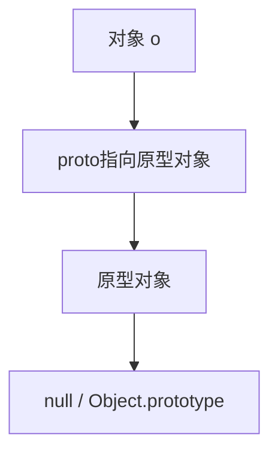

### 5. 经典金句/数据
> “All objects created by object literals have the same prototype object, Object.prototype.” (p.118)
> “JSON.stringify() serializes only the enumerable own properties of an object.” (p.138)

---

## 第7章：数组
### 1. 核心论点
数组是值的有序集合，JavaScript 数组是动态、稀疏、元素类型可混合的特殊对象。本章讲解数组的创建、读写、长度、方法以及 ES5 新数组方法。

### 2. 关键概念
- **创建**：数组字面量 `[]` 或 `new Array()`。
- **稀疏数组**：索引不连续，length 大于实际元素个数。
- **数组方法**：join、reverse、sort、concat、slice、splice、push/pop、unshift/shift。
- **ES5 方法**：forEach、map、filter、every、some、reduce、reduceRight、indexOf、lastIndexOf。
- **类数组对象**：有 length 和索引属性的对象（如 arguments），可用数组方法 call 借用。
- **字符串作为数组**：ES5 中可索引。

### 3. 逻辑推演
先展示数组字面量和构造函数创建方式，然后说明数组索引与 length 的关系（稀疏数组）。接着介绍常用修改器方法（splice、push、pop 等）和访问器方法（slice、concat、join）。重点讲解 ES5 新增的迭代方法（forEach/map/filter 等）和归并方法（reduce）。然后讨论数组类型判断（Array.isArray）和类数组对象（包括 arguments）。最后提一下字符串的类数组行为。

### 4. 流程图（常用数组方法分类）
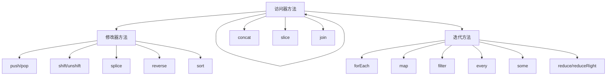

### 5. 经典金句/数据
> “JavaScript arrays are untyped: an array element may be of any type.” (p.141)
> “The length property of an array is always one larger than the index of the highest element defined.” (p.145)

---

## 第8章：函数
### 1. 核心论点
函数是 JavaScript 中最重要的对象之一，具有可调用性、闭包、作为值等特性。本章涵盖函数定义、调用模式、参数、闭包、函数属性、高阶函数和函数式编程。

### 2. 关键概念
- **定义方式**：函数声明语句（提升）、函数表达式（匿名或具名）。
- **调用模式**：函数调用、方法调用、构造函数调用、间接调用（call/apply）。
- **参数**：arguments 对象（类数组）、默认参数、可变参数。
- **闭包**：函数可以记住其定义时的作用域链；用于私有变量、模块模式。
- **函数属性**：length（形参个数）、prototype、call/apply/bind。
- **函数式编程**：map/reduce、partial、memoize。

### 3. 逻辑推演
先讲函数定义形式，然后重点区分四种调用方式及其 this 指向。接着说明 arguments 对象和参数传递（按值传递引用）。闭包是核心难点，通过嵌套函数返回等例子解释作用域链的保持。然后介绍函数作为值的用法（回调、排序函数）。函数属性和方法（bind、call、apply）用于改变 this。最后引入函数式编程思想，演示 map/reduce 和柯里化。

### 4. 流程图（闭包作用域链）
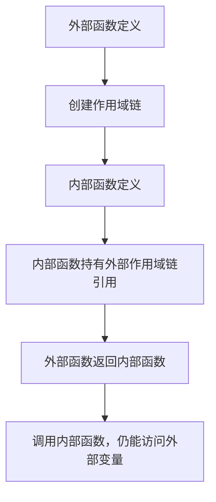

### 5. 经典金句/数据
> “In JavaScript, functions are objects, and they can be manipulated by programs.” (p.163)
> “A closure is a combination of a function object and a scope (a set of variable bindings).” (p.180)

---

## 第9章：类和模块
### 1. 核心论点
JavaScript 通过原型链实现基于原型的类继承。本章讲解如何定义类（构造函数 + 原型）、类成员、继承、子类、以及模块化模式。

### 2. 关键概念
- **构造函数**：用 `new` 调用，this 指向新对象，prototype 属性存放共享方法。
- **原型链继承**：子类的 prototype 指向父类实例或 Object.create(parent.prototype)。
- **类成员**：实例属性（this.x）、类属性（Constructor.prop）、实例方法（prototype.method）、类方法（Constructor.method）。
- **封装**：使用闭包实现私有成员。
- **模块**：使用函数作用域和返回对象来隔离代码，避免全局污染。
- **ECMAScript 5 增强**：`Object.create`、属性描述符、`Object.freeze` 等。

### 3. 逻辑推演
从简单的工厂函数开始，引入构造函数 + prototype 的标准类模式。然后展示如何通过修改 prototype 动态增强类。接着用 instanceof 和 constructor 检测类型。子类实现步骤：继承原型、调用父类构造函数、添加新方法。最后介绍模块模式：立即执行函数（IIFE）返回公开 API，隐藏私有变量。

### 4. 流程图（原型继承链）
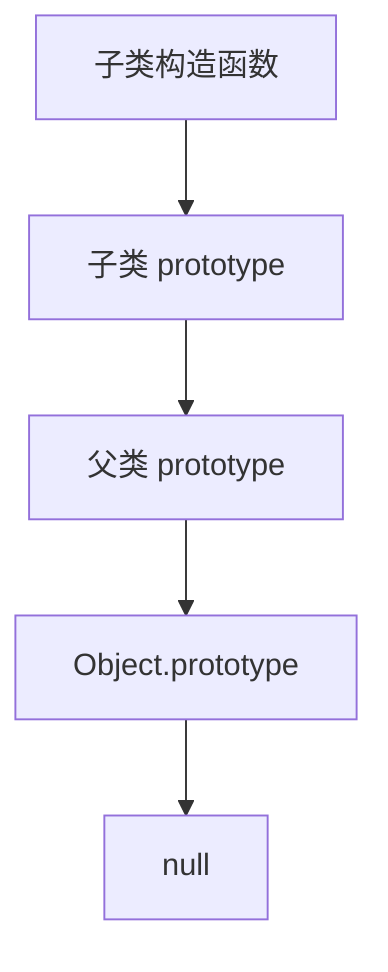

### 5. 经典金句/数据
> “In JavaScript, a class is a set of objects that inherit properties from the same prototype object.” (p.200)
> “The ability to create a new object with an arbitrary prototype is a powerful one.” (p.119)

---

## 第10章：正则表达式的模式匹配
### 1. 核心论点
正则表达式是处理文本模式的强大工具。本章讲解正则语法（直接量、字符类、重复、选择、分组、锚点、标志）以及 String 和 RegExp 对象的方法。

### 2. 关键概念
- **字面量**：`/pattern/flags`。
- **字符类**：`[abc]`、`\d`、`\s`、`.` 等。
- **重复**：`*`、`+`、`?`、`{n,m}` 及非贪婪 `?`。
- **选择**：`|`。
- **分组与引用**：`(...)`、`\1`。
- **锚点**：`^`、`$`、`\b`、`(?=...)`、`(?!...)`。
- **方法**：`test`、`exec`、`match`、`search`、`replace`、`split`。

### 3. 逻辑推演
先介绍正则直接量和 RegExp 构造函数。然后系统讲解元字符、字符类、重复匹配规则。接着介绍分组、反向引用和选择。之后是锚点和环视断言。最后讲解 String 的 match、search、replace、split 以及 RegExp 的 exec、test 方法，重点分析 g 标志对 lastIndex 的影响。

### 4. 流程图（正则匹配过程）
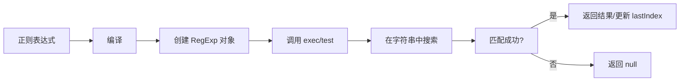

### 5. 经典金句/数据
> “Regular expressions are objects that describe patterns of characters.” (p.251)
> 表10-3 重复字符表，表10-4 分组和引用。

---

## 第11章：JavaScript的子集和扩展
### 1. 核心论点
本章介绍 JavaScript 的安全子集（如 ADsafe、Caja）以及 Mozilla 的扩展（const、let、解构赋值、迭代器、生成器、数组推导、E4X 等）。

### 2. 关键概念
- **安全子集**：禁止 eval、with、this 全局访问，限制 [] 操作，通过静态验证保证安全。
- **let 和 const**：块级作用域（let），常量（const）。
- **解构赋值**：`[a,b] = [1,2]` 或 `{x,y} = {x:1,y:2}`。
- **迭代器与生成器**：`__iterator__`、`yield`。
- **数组/生成器推导**：`[x*x for (x in iter)]`。
- **E4X**：在 JavaScript 中直接写 XML（`<xml>{var}</xml>`）。

### 3. 逻辑推演
首先解释为什么要定义子集（安全、简化）。然后列举 Crockford 的“Good Parts”子集（无 with、无 eval、必须使用 === 等）。接着介绍安全子集设计原则（移除危险特性、限制动态访问）。之后详细说明 Mozilla 扩展的实用语法：let、解构、迭代器、生成器、推导式。最后简要介绍 E4X 的 XML 直接量语法和操作。

### 4. 流程图（安全子集验证流程）
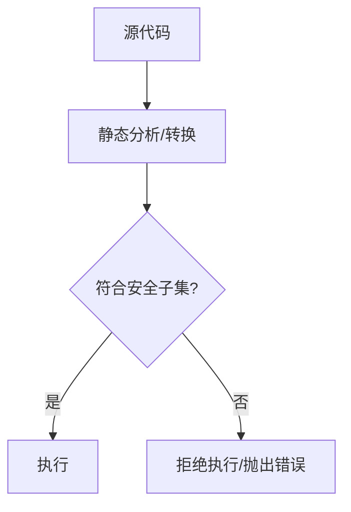

### 5. 经典金句/数据
> “The ability to create class factories arises from the dynamic nature of JavaScript.” (p.233)
> “E4X represents an XML document (or an element or attribute of an XML document) as an XML object.” (p.284)

---

## 第12章：服务器端JavaScript
### 1. 核心论点
JavaScript 不仅能在浏览器中运行，也能在服务器端使用。本章介绍两个服务器端环境：Rhino（Java 平台）和 Node（异步 I/O 平台）。

### 2. 关键概念
- **Rhino**：Java 编写的 JavaScript 引擎，可调用 Java 类库；函数 `print`、`load`、`importPackage` 等。
- **Node**：基于 V8 的异步事件驱动引擎；提供 `require`、`fs`、`http`、`net` 等模块；非阻塞 I/O。
- **共同点**：都可以处理 HTTP、文件、网络，但 Node 更现代且适合高并发。

### 3. 逻辑推演
首先说明服务器端 JavaScript 的价值（统一语言、性能）。Rhino 部分：展示如何通过 `importPackage` 调用 Java Swing 和网络 API，并用示例演示下载管理器。Node 部分：介绍事件循环、`require` 加载模块、`fs` 读写文件、`http` 创建服务器和客户端。最后对比两种环境的适用场景。

### 4. 流程图（Node 事件循环）
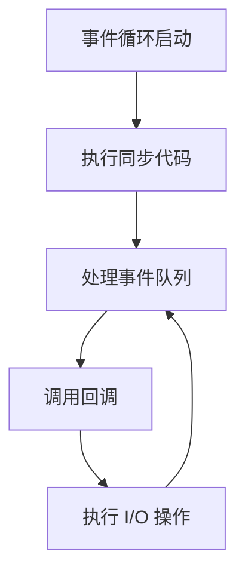

### 5. 经典金句/数据
> “Node is built on top of Google’s V8 JavaScript engine.” (p.296)
> “Rhino is a Java-based JavaScript interpreter that gives JavaScript programs access to the entire Java API.” (p.289)

---

## 第13章：Web浏览器中的JavaScript
### 1. 核心论点
JavaScript 在浏览器中的角色是动态网页的核心。本章涵盖客户端 JavaScript 的结构、嵌入方式、执行模型、兼容性、安全性和主流框架。

### 2. 关键概念
- **Window 对象**：全局对象，代表浏览器窗口或框架。
- **嵌入方式**：`<script>` 标签（内联/外联）、事件属性、`javascript:` URL。
- **执行时间线**：文档解析 → 同步脚本 → DOMContentLoaded → load 事件 → 事件驱动。
- **兼容性**：特性检测、浏览器嗅探、条件注释、库（jQuery）。
- **安全**：同源策略、XSS、CSRF。

### 3. 逻辑推演
先介绍客户端 JavaScript 的全局环境 Window。然后说明如何在 HTML 中嵌入脚本（内联、src、事件属性、javascript: 协议）。接着讲解脚本执行的三个阶段：加载、解析、事件循环。之后讨论不同浏览器之间的兼容性问题及解决方法（特性检测、条件注释）。最后强调同源策略和跨站脚本攻击的防范。

### 4. 流程图（客户端JS执行时间线）
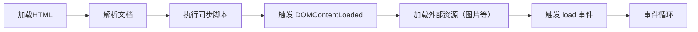

### 5. 经典金句/数据
> “The Window object is the main entry point to all client-side JavaScript features and APIs.” (p.307)
> “The same-origin policy is a sweeping security restriction on what web content JavaScript code can interact with.” (p.334)

---

## 第14章：Window对象
### 1. 核心论点
Window 对象是浏览器中的全局对象，提供计时器、导航、历史、对话框、错误处理、多窗口/框架管理等 API。

### 2. 关键概念
- **计时器**：`setTimeout`、`setInterval`。
- **位置与导航**：`location` 属性，可读写 URL。
- **历史**：`history.back()`、`history.go()`。
- **浏览器信息**：`navigator`（特性检测）、`screen`（屏幕尺寸）。
- **对话框**：`alert`、`confirm`、`prompt`、`showModalDialog`。
- **多窗口**：`open()`、`close()`、`opener`、`frames` 数组。

### 3. 逻辑推演
先展示计时器的用法与清除。然后讲解 location 对象（解析 URL、跳转）。接着 history 对象控制前进后退。之后介绍 navigator（用户代理检测）和 screen（屏幕大小）。对话框部分强调模态阻塞。最后详细讨论多窗口与框架：`open()` 创建窗口，`frames` 集合访问子框架，`parent`/`top` 等属性。

### 4. 流程图（窗口/框架关系）
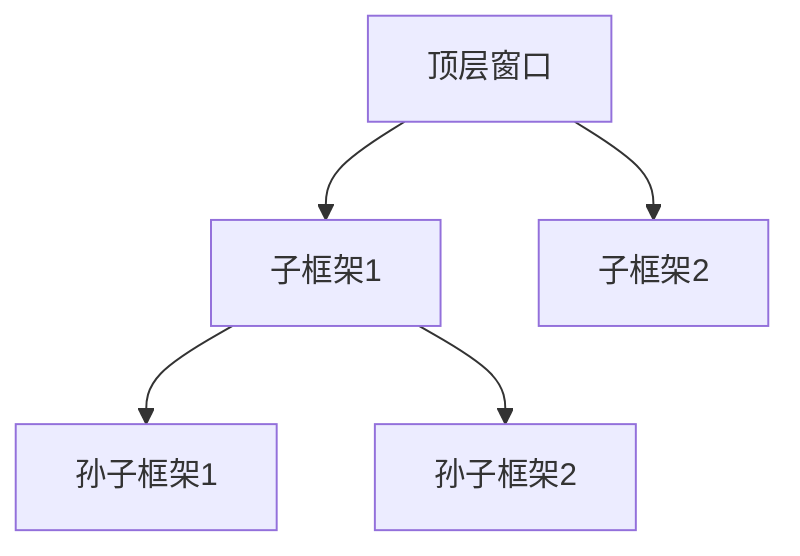

### 5. 经典金句/数据
> “In client-side JavaScript, the Window object is also the global object.” (p.308)
> “The name of a window is important because it allows the open() method to refer to existing windows.” (p.354)

---

## 第15章：脚本化文档
### 1. 核心论点
DOM（Document Object Model）是 HTML/XML 文档的编程接口。本章讲解如何选取、遍历、修改文档节点、操作属性、处理表单、以及元素几何尺寸。

### 2. 关键概念
- **选取元素**：`getElementById`、`getElementsByClassName`、`querySelectorAll`、`getElementsByTagName`。
- **节点类型**：Document、Element、Text、Comment。
- **遍历**：`parentNode`、`childNodes`、`firstChild`、`nextSibling` 等。
- **修改内容**：`innerHTML`、`textContent`、`createElement`、`appendChild` 等。
- **表单**：`form` 对象、`input`、`select`、`textarea` 的值与事件。
- **几何**：`offsetWidth`、`getBoundingClientRect`、滚动位置。

### 3. 逻辑推演
从 DOM 树结构开始，讲解如何选取元素（ID、类、标签名、CSS 选择器）。然后介绍节点层次遍历（父子、兄弟）。接着详细说明属性操作（getAttribute、setAttribute、dataset）。之后是元素内容修改（innerHTML、textContent、createTextNode）。还重点讲了 HTML 表单的属性和事件。最后介绍元素位置和大小的获取方法（offset、client、scroll）。

### 4. 流程图（DOM 节点层次）
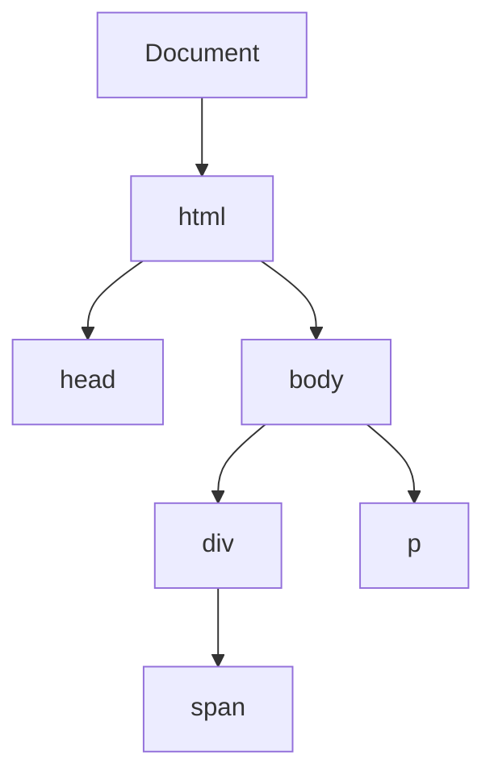

### 5. 经典金句/数据
> “The Document object is the central object in the DOM API.” (p.361)
> “querySelectorAll() is the ultimate element selection method.” (p.370)

---

## 第16章：脚本化CSS
### 1. 核心论点
CSS 负责样式，JavaScript 可以动态修改样式。本章讲解 CSS 基础知识、内联样式脚本、计算样式、样式类切换和样式表操作。

### 2. 关键概念
- **CSS 基础**：选择器、属性、级联、样式表。
- **内联样式**：`element.style.property`，可读写。
- **计算样式**：`getComputedStyle`（返回最终生效值）。
- **样式类**：`className` 和 `classList`（add、remove、toggle）。
- **样式表操作**：`document.styleSheets`，插入/删除规则。

### 3. 逻辑推演
先复习 CSS 语法（选择器、属性、规则）。然后介绍如何通过 JS 修改内联样式（`style.cssText` 或单独属性）。接着讲解获取计算样式（`getComputedStyle`），注意单位转化。之后演示通过 `classList` 切换类实现批量样式变化。最后高级部分：启用/禁用样式表、动态添加规则。

### 4. 流程图（样式覆盖优先级）
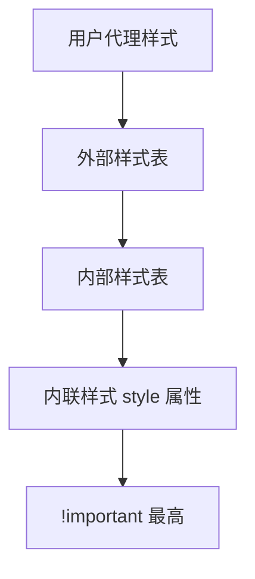

### 5. 经典金句/数据
> “The style property of an element is that element’s inline style.” (p.431)
> “getComputedStyle() returns a read-only CSSStyleDeclaration object.” (p.436)

---

## 第17章：事件处理
### 1. 核心论点
事件是浏览器与用户交互的桥梁。本章系统讲解事件类型、注册事件处理程序、事件对象、事件传播、默认行为以及各种具体事件（鼠标、键盘、触摸、拖放等）。

### 2. 关键概念
- **事件类型**：鼠标、键盘、HTML 表单、触摸、拖放、媒体等。
- **注册方式**：HTML 属性、DOM 属性（onclick）、`addEventListener`（标准）、`attachEvent`（IE）。
- **事件对象**：`type`、`target`、`currentTarget`、`preventDefault()`、`stopPropagation()`。
- **事件流**：捕获 → 目标 → 冒泡。
- **常用事件**：click、load、DOMContentLoaded、keydown、keypress、mouseover、mouseout。

### 3. 逻辑推演
先定义事件模型术语。然后按注册方式分类，比较 DOM0、DOM2 和 IE 的差异。接着讲解事件对象属性和方法。事件传播部分重点说明捕获和冒泡，以及如何停止传播。之后详细列出各类事件（鼠标、键盘、表单、加载等）的触发时机和默认行为。最后讨论事件委托和自定义事件。

### 4. 流程图（事件传播阶段）
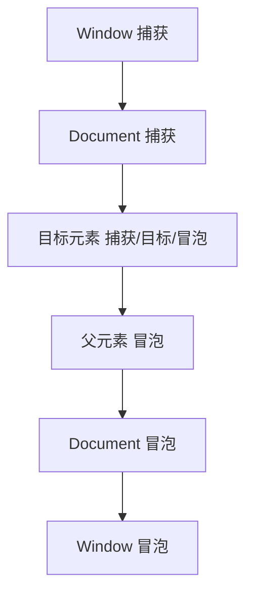

### 5. 经典金句/数据
> “Event handlers are functions that handle or respond to an event.” (p.446)
> “The return value of a handler registered by setting an object property is sometimes significant: false tells the browser not to perform the default action.” (p.462)

---

## 第18章：脚本化HTTP
### 1. 核心论点
Ajax 技术允许 Web 页面与服务器异步交换数据。本章讲解 XMLHttpRequest 对象（XHR）、跨域请求、JSONP 和 Server-Sent Events（Comet）。

### 2. 关键概念
- **XMLHttpRequest**：`open`、`send`、`onreadystatechange`、`responseText`、`responseXML`。
- **请求方法**：GET、POST、HEAD、PUT 等。
- **请求头**：`setRequestHeader`，禁用头列表。
- **跨域**：CORS（`Access-Control-Allow-Origin`）。
- **JSONP**：通过 `<script>` 标签绕过同源策略，服务器返回函数调用包裹的 JSON。
- **进度事件**：`loadstart`、`progress`、`load`、`error`。
- **FormData**：用于上传文件和表单数据。

### 3. 逻辑推演
首先实例化 XHR，用 open 配置请求，send 发送。然后通过监听 readyStateChange 或 load 事件获取响应。接着讲解如何发送 POST 数据（表单编码、JSON、XML 或 FormData）。跨域部分介绍 CORS 设置。然后转向 JSONP，通过动态创建 `<script>` 并指定回调函数名实现跨域数据获取。最后介绍 Server-Sent Events（EventSource）实现服务器推送。

### 4. 流程图（Ajax 请求生命周期）
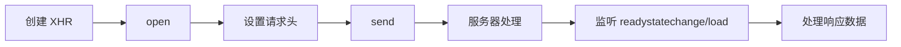

### 5. 经典金句/数据
> “The XMLHttpRequest object allows client-side JavaScript to issue HTTP requests and receive responses.” (p.492)
> “JSONP works when the response body of the HTTP request is JSON-encoded.” (p.514)

---

## 第19章：jQuery库
### 1. 核心论点
jQuery 是流行的跨浏览器 JavaScript 库，简化 DOM 操作、事件处理、动画和 Ajax。本章全面介绍 jQuery 的核心 API 和插件扩展。

### 2. 关键概念
- **核心函数**：`$()` 或 `jQuery()`，用于选择元素、创建元素、监听 DOM 就绪。
- **链式调用**：方法返回 jQuery 对象，可以连续调用。
- **DOM 操作**：`.find()`、`.parent()`、`.append()`、`.remove()` 等。
- **事件**：`.on()`、`.off()`、`.trigger()` 以及便捷方法（`.click()` 等）。
- **动画**：`.animate()`、`.fadeIn()`、`.slideUp()`。
- **Ajax**：`$.ajax()`、`$.get()`、`$.post()`、`.load()`。
- **工具函数**：`$.each`、`$.map`、`$.extend`、`$.proxy` 等。
- **插件**：通过 `$.fn` 添加新方法。

### 3. 逻辑推演
从 jQuery 的工厂函数开始，介绍选择器语法（CSS 选择器 + 扩展）。然后通过 getter/setter 方法展示如何修改属性、样式、类、内容。接着讲解 DOM 结构修改（插入、删除、包裹）。事件部分重点说明 `on`/`off` 和事件委托。动画部分演示常用效果和自定义动画。Ajax 部分涵盖简化和全功能方法。最后介绍扩展 jQuery 的方式和常用插件。

### 4. 流程图（jQuery 链式调用）
```mermaid
graph LR
    A[$("selector")] --> B[返回 jQuery 对象]
    B --> C[调用方法1]
    C --> D[返回 this]
    D --> E[调用方法2]
    E --> F[返回 this]
```

### 5. 经典金句/数据
> “jQuery makes it easy to find the elements of a document that you care about and then manipulate them.” (p.523)
> “The jQuery library defines a single global function named jQuery(). The library also defines the global symbol $ as a shortcut.” (p.524)

---

## 第20章：客户端存储
### 1. 核心论点
浏览器提供多种客户端存储机制：Web Storage（localStorage/sessionStorage）、Cookies、IE userData、离线应用缓存和 IndexedDB。

### 2. 关键概念
- **localStorage**：永久存储，同源共享，大小约 5-10MB。
- **sessionStorage**：会话级别，同源同窗口。
- **Cookie**：小型文本，随请求发送，有大小限制（4KB），可设置过期时间。
- **离线缓存**：通过 manifest 文件声明需要缓存的资源，支持离线应用。
- **Storage 事件**：当存储变化时，其他同源窗口会收到事件。

### 3. 逻辑推演
先介绍 Web Storage API（`setItem`、`getItem`、removeItem），并演示如何存储 JSON 数据。然后解释 Cookie 的读写、属性（path、domain、expires）以及缺点（性能、大小）。接着讲 IE 的 userData 行为。之后重点说明离线应用：manifest 文件的格式（CACHE、NETWORK、FALLBACK），以及如何监听缓存状态事件。最后简要提及 IndexedDB（对象存储，异步 API）。

### 4. 流程图（离线应用缓存更新流程）
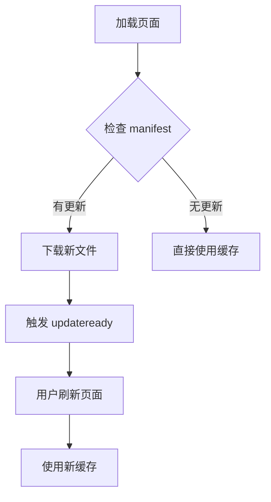

### 5. 经典金句/数据
> “localStorage and sessionStorage provide persistent associative arrays that map string keys to string values.” (p.587)
> “Cookies are intended for storage of small amounts of data by server-side scripts.” (p.597)

---

## 第21章：多媒体和图形编程
### 1. 核心论点
本章涵盖脚本化图片（滚转效果）、音频/视频（HTML5 `<audio>`/`<video>`）、SVG 和 Canvas 图形绘制。

### 2. 关键概念
- **图片滚转**：通过预加载 Image 对象，动态改变 src。
- **音频/视频**：`play()`、`pause()`、`currentTime`、`volume` 等属性和方法。
- **SVG**：基于 XML 的矢量图形，可通过 DOM 操作修改。
- **Canvas**：位图绘图 API，提供 `getContext('2d')`，支持路径、文字、图像、变换、像素操作等。

### 3. 逻辑推演
首先演示 Image 对象的预加载和鼠标悬停切换图片。然后介绍 `<audio>`/`<video>` 的常用方法和事件（loadedmetadata、timeupdate）。接着讲解 SVG 的基本元素和如何用 JS 动态创建/修改 SVG。最后重点讲解 Canvas API：基本图形、样式、变换、图像绘制、像素级操作和动画基础。

### 4. 流程图（Canvas 绘图流程）
```mermaid
graph TD
    A[获取 Canvas 元素] --> B[调用 getContext('2d')]
    B --> C[设置样式（fillStyle 等）]
    C --> D[绘制路径（beginPath, moveTo, lineTo）]
    D --> E[调用 stroke() 或 fill()]
    E --> F[可选：保存/恢复状态]
```

### 5. 经典金句/数据
> “The <canvas> element has no appearance of its own but creates a drawing surface within the document.” (p.630)
> “SVG is an XML grammar for graphics.” (p.622)

---

## 第22章：HTML5 API
### 1. 核心论点
HTML5 及相关规范提供了许多新的客户端 API，本章涵盖地理位置、历史管理、跨文档消息、Web Worker、类型化数组、Blob、文件系统、客户端数据库和 WebSocket。

### 2. 关键概念
- **Geolocation**：`navigator.geolocation.getCurrentPosition` 获取经纬度。
- **History**：`pushState`/`replaceState` + `popstate` 实现单页应用路由。
- **postMessage**：跨源窗口间安全通信。
- **Web Worker**：后台线程，通过消息传递数据，不能访问 DOM。
- **Typed Arrays**：`Int8Array`、`Float64Array` 等，用于高效处理二进制数据。
- **Blob**：二进制大对象，可切片、生成 URL、异步读取。
- **FileSystem API**：本地沙盒文件系统（非标准，Chrome 支持）。
- **IndexedDB**：NoSQL 客户端数据库，异步 API。
- **WebSocket**：全双工通信。

### 3. 逻辑推演
依次介绍每个 API 的使用场景和基础用法。Geolocation 通过回调获取位置。History API 通过修改 URL 状态并监听 popstate 实现前端路由。postMessage 解决跨源通信。Worker 通过 `new Worker` 创建线程，通过 onmessage 交换数据。Typed Arrays 用于处理音频、图像等二进制数据。Blob 实现文件上传/下载预览。IndexedDB 打开数据库、创建对象存储、增删改查。WebSocket 建立持久连接，进行双向消息传递。

### 4. 流程图（Web Worker 通信）
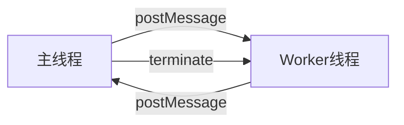

### 5. 经典金句/数据
> “Web Workers allow JavaScript to run in a background thread without freezing the UI.” (p.680)
> “IndexedDB is an object database, not a relational database.” (p.705)

---

## 第三部分：JavaScript核心参考
### 摘要
该部分为语言核心 API 的快速参考手册，按字母顺序列出所有全局对象、函数、构造函数及其方法（如 Array、Object、String、RegExp、Math 等），每个条目包含语法、参数、返回值和示例。

---

## 第四部分：客户端JavaScript参考
### 摘要
该部分为浏览器环境下的 API 参考，包括 Window、Document、Element、Event、XMLHttpRequest、Canvas、Storage、File、Worker 等对象，每个条目说明属性、方法、事件以及浏览器兼容性提示。

---

> 说明：由于原书篇幅巨大，后续章节（从第13章到第22章以及参考部分）内容极为丰富，以上总结提取了每个章节的核心论点与关键概念。如需某一章节的**完整详细展开**（包括全部子小节和代码示例），可继续要求逐节深化。


# 《JavaScript权威指南（第6版）》详细展开

## 书籍信息
- 书名：JavaScript: The Definitive Guide, Sixth Edition / 《JavaScript权威指南（第6版）》
- 作者：David Flanagan
- 译者：淘宝前端团队
- 出版年份：英文原版 2011，中文译本 2012
- PDF 状态：英文原版扫描 + 中文译本混合，文本基本可识别
- OCR 状态：正文识别率较高，部分代码缩进有偏移，但不影响理解

## 全书结构
本书共分四大部分：
1. **第一部分：JavaScript 语言核心**（第2章～第12章）——详细讲解语法、类型、对象、数组、函数、类、正则、子集扩展、服务器端 JS。
2. **第二部分：客户端 JavaScript**（第13章～第22章）——浏览器中的 JS、Window、DOM、CSS 脚本、事件、Ajax、jQuery、存储、图形、HTML5 API。
3. **第三部分：核心 JavaScript 参考**——语言核心 API 速查（按字母顺序）。
4. **第四部分：客户端 JavaScript 参考**——浏览器 API 速查。

> 说明：本详细展开遵循原书目录顺序，每章包含核心论点、关键概念、逻辑推演、代码示例（必要时）、流程图/Mermaid 图、经典金句。由于内容极多，不会逐字翻译，而是提炼精华并保持原书表达逻辑。

---

# 第一部分：JavaScript 语言核心

## 第1章：JavaScript概述（详细展开）

### 1.1 核心论点
JavaScript 是 Web 的编程语言，是一门**动态、弱类型、基于原型**的高级语言，同时支持面向对象和函数式编程风格。本章作为全书导览，快速展示语言核心特性与客户端 JavaScript 的基本用法，并通过一个完整的贷款计算器示例将两者结合起来。

### 1.2 关键概念
#### 1.2.1 JavaScript 的历史与版本
- **创建**：1995 年 Netscape 公司开发，原名 Mocha，后改名为 LiveScript，最终定名 JavaScript。
- **标准化**：提交给 ECMA（欧洲计算机制造商协会），标准名为 **ECMAScript**（因商标原因不能用 JavaScript）。
- **版本**：
  - ES3（1999）：广泛支持，稳定基础。
  - ES5（2009）：新增严格模式、JSON、Object 方法、数组迭代方法等。
  - ES4 被废弃。
- **实现**：Firefox 的 SpiderMonkey，IE 的 JScript，Chrome 的 V8，Safari 的 JavaScriptCore。

#### 1.2.2 语言核心要素（代码示例）
- **变量与类型**：`var x; x = 0; x = "hello";` 动态类型。
- **对象和数组**：
  ```javascript
  var book = { topic: "JavaScript", fat: true };
  var primes = [2, 3, 5, 7];
  ```
- **函数**：
  ```javascript
  function plus1(x) { return x+1; }
  var square = function(x) { return x*x; };
  ```
- **控制结构**：`if`, `while`, `for`, `switch` 等。
- **类与原型**：通过构造函数和 prototype 定义类。
  ```javascript
  function Point(x,y) { this.x = x; this.y = y; }
  Point.prototype.r = function() { return Math.sqrt(this.x*this.x + this.y*this.y); };
  ```

#### 1.2.3 客户端 JavaScript 核心 API
- **Window 对象**：全局对象，`alert()`, `setTimeout()` 等。
- **Document 对象**：`getElementById()`, `getElementsByTagName()`。
- **事件处理**：`onclick`, `onload`, `addEventListener`。
- **CSS 脚本**：`element.style`, `element.className`。
- **Ajax**：`XMLHttpRequest` 对象。
- **存储**：`localStorage`。
- **图形**：`<canvas>`。

#### 1.2.4 贷款计算器示例（例1-1）
该示例演示了完整的前端应用流程：
1. **HTML 表单**：收集贷款金额、年利率、年限、邮政编码。
2. **JavaScript 计算**：从表单读取值 → 计算月供 → 更新输出字段。
3. **数据持久化**：使用 `localStorage` 保存用户上次输入。
4. **Ajax 请求**：`XMLHttpRequest` 向服务器请求放贷人列表（模拟）。
5. **Canvas 绘图**：绘制贷款余额、利息、本金的曲线图。

### 1.3 逻辑推演
作者首先说明 JavaScript 在 Web 技术栈中的核心地位，然后按照“语言核心 → 客户端扩展 → 完整示例”的路径展开。语言核心部分以极简代码片段展示变量、对象、数组、函数、类等；客户端部分介绍如何操作 DOM、响应事件、发送 HTTP 请求、存储数据、绘制图形。最后贷款计算器将所有知识点串联，让读者直观感受现代 Web 应用开发。

### 1.4 流程图（贷款计算器工作流）
```mermaid
graph TD
    U[用户输入表单] --> JS[JavaScript 读取数据]
    JS --> CALC[计算月供、总利息]
    CALC --> DISP[更新页面显示]
    CALC --> SAVE[保存至 localStorage]
    CALC --> AJAX[请求放贷人数据]
    AJAX --> SHOW[显示放贷人列表]
    CALC --> CHART[绘制还款曲线图]
```

### 1.5 经典金句
> “JavaScript is the programming language of the Web.” (p.1)
> “The name ‘JavaScript’ is actually somewhat misleading. ... JavaScript is completely different from the Java programming language.” (p.1)
> “An object is a collection of name/value pairs, or a string to value map.” (p.5)

---

## 第2章：词法结构（详细展开）

### 2.1 核心论点
本章定义 JavaScript 程序最基本的词法规则：字符编码、大小写敏感、注释、直接量、标识符、保留字以及可选分号的自动插入规则。理解这些规则是正确书写代码的基础。

### 2.2 关键概念
#### 2.2.1 字符集与大小写
- 使用 **Unicode** 字符集（支持 ES3 的 Unicode 2.1 及以上，ES5 要求 Unicode 3）。
- **严格区分大小写**：`while` 不能写成 `While`。
- **空格、换行、格式控制字符**：空格、制表符、换页符等被识别为空白；换行符、回车符、行分隔符、段分隔符被识别为行终止符。
- **Unicode 转义序列**：`\uXXXX` 格式，可在字符串、正则、标识符中使用。

#### 2.2.2 注释
- **单行注释**：`// 注释内容`。
- **多行注释**：`/* 注释内容 */`，不能嵌套。

#### 2.2.3 直接量
直接量是直接写在程序中的数据值，例如：
- 数字直接量：`12`, `1.2`, `0xff`
- 字符串直接量：`"hello"`, `'world'`
- 正则直接量：`/javascript/gi`
- 布尔直接量：`true`, `false`
- 对象/数组直接量：`{x:1,y:2}`, `[1,2,3]`

#### 2.2.4 标识符与保留字
- **标识符**：以字母、下划线（_）或美元符（$）开头，后续可为字母、数字、_、$。
- **保留字**：不能用作标识符。包括关键字（`break`, `case`, `catch`, `class` 等）、未来保留字（`enum`, `implements`, `interface` 等）、严格模式保留字（`let`, `static`, `yield` 等）。
- **预定义全局变量**：`undefined`, `NaN`, `Infinity`, `Array`, `Object` 等也不应被覆盖。

#### 2.2.5 可选分号
- 分号用于分隔语句。但多数情况下，如果语句单独占一行，分号可以省略（JavaScript 自动插入）。
- **两个危险例外**：
  1. `return`, `break`, `continue` 关键字后不能换行，否则会自动插入分号导致逻辑错误。
  2. `++` 和 `--` 作为后缀时不能与操作数换行。
- **防御性分号**：当一行以 `(`, `[`, `+`, `-`, `/` 开头时，建议在前一行末尾手动加分号。

### 2.3 逻辑推演
从字符编码出发，强调 Unicode 和大小写敏感。然后列举注释形式和直接量类型。标识符部分列出所有保留字和全局预定义名称。分号部分重点解释自动插入规则，并通过反例说明换行可能引起的 bug，最后给出编码建议。

### 2.4 流程图（自动分号插入规则）
```mermaid
graph TD
    A[解析下一行] --> B{当前行能否与下一行合并解析？}
    B -->|可以| C[不插入分号，继续合并解析]
    B -->|不可以| D[在当前行末尾插入分号]
    D --> E[例外：return/break/continue 后换行强制插入分号]
    D --> F[例外：++/-- 后缀前换行强制插入分号]
```

### 2.5 经典金句
> “JavaScript ignores spaces that appear between tokens in programs.” (p.22)
> “The with statement is forbidden in strict mode.” (p.108)

---

## 第3章：类型、值和变量（详细展开）

### 3.1 核心论点
JavaScript 有七种内置类型（六种原始类型 + 对象类型）。原始类型不可变，对象可变。本章深入讲解数字、字符串、布尔值、null、undefined 的特性，类型转换规则，变量声明与作用域。

### 3.2 关键概念

#### 3.2.1 数字
- **格式**：IEEE 754 64 位双精度浮点数。
- **整数范围**：精确表示 ±2^53（≈ 9 千万亿）。
- **字面量**：
  - 十进制：`0`, `3`, `1000000`
  - 十六进制：`0xff`, `0xCAFE`
  - 八进制（非标准，严格模式禁止）：`0377`
- **算术运算**：`+`, `-`, `*`, `/`, `%`；`Math` 对象提供超越函数。
- **特殊值**：
  - `Infinity` 和 `-Infinity`（溢出）
  - `NaN`（非数字，0/0，无穷大/无穷大）
  - `NaN` 不等于自身，用 `isNaN()` 检测。
- **浮点误差**：`0.3 - 0.2 !== 0.2 - 0.1`，因为二进制无法精确表示十进制小数。

#### 3.2.2 字符串
- **不可变**，16 位 Unicode 序列（UTF-16）。
- **字面量**：单引号或双引号，支持转义序列（`\n`, `\t`, `\uXXXX`）。
- **属性与方法**：`length`, `charAt()`, `substring()`, `indexOf()`, `split()`, `replace()` 等。
- **字符串作为数组**：ES5 允许 `s[0]` 访问字符。

#### 3.2.3 布尔值
- 两个值：`true` 和 `false`。
- **真值与假值**：
  - 假值：`false`, `null`, `undefined`, `0`, `-0`, `NaN`, `""`
  - 其他所有值（包括所有对象）为真值。

#### 3.2.4 null 与 undefined
- `undefined`：未初始化的变量、不存在的属性、无返回值的函数的返回值。
- `null`：表示“空”的对象引用，通常由程序员主动赋值。
- 区别：`typeof null === "object"`，`typeof undefined === "undefined"`。
- 相等性：`null == undefined` 为 `true`，但 `null === undefined` 为 `false`。

#### 3.2.5 全局对象
- 在顶层代码中，`this` 指向全局对象。
- 浏览器中全局对象是 `window`。
- 全局属性包括：`undefined`, `NaN`, `Infinity`, `Object`, `Array`, `Math` 等。

#### 3.2.6 包装对象
- 当读取字符串、数字、布尔值的属性时，JavaScript 临时创建包装对象（`new String()`, `new Number()`, `new Boolean()`）。
- 给原始值设置属性无效（临时对象立即销毁）。

#### 3.2.7 类型转换（表3-2）
- **显式转换**：`Number()`, `String()`, `Boolean()`, `Object()`。
- **隐式转换**：算术运算符、`==`、`if` 等。
- **转换规则摘要**：
  - 数字 → 字符串：`toString()`
  - 字符串 → 数字：`parseInt()`, `parseFloat()`
  - 对象 → 原始值：先 `valueOf()` 后 `toString()`，日期相反。
- **特殊转换**：`+` 运算符中若一个操作数是字符串，则进行字符串连接；否则转为数字相加。

#### 3.2.8 变量声明与作用域
- **声明**：`var varname`，可同时赋值。
- **重复声明**无害，未初始化值为 `undefined`。
- **作用域**：**函数作用域**，没有块作用域。
- **声明提前**：所有 `var` 声明被提升到函数顶部，但赋值留在原地。
- **全局变量**：是全局对象的属性，但用 `var` 声明的全局变量不可删除。
- **作用域链**：内部函数可以访问外部函数的变量和参数，形成闭包基础。

### 3.3 逻辑推演
从原始类型分类开始，详细描述数字的 IEEE 754 表示和浮点误差。然后讲解字符串的不可变性和常用方法。布尔值部分重点强调真值/假值转换规则。null 与 undefined 对比。接着介绍全局对象和包装对象的临时性。类型转换一章是重点，通过表3-2汇总所有转换场景，并演示 `==` 的隐式转换。最后讲解变量作用域，通过例子演示声明提前和函数作用域，为闭包打下基础。

### 3.4 流程图（类型转换决策树）
```mermaid
graph TD
    A[待转换的值] --> B{期望类型？}
    B -->|字符串| C{是否为对象？}
    C -->|是| D[调用 toString()]
    C -->|否| E[调用 String() 或自动转换]
    B -->|数字| F{是否为对象？}
    F -->|是| G[先 valueOf() 再 toString()]
    F -->|否| H[调用 Number() 或自动转换]
    B -->|布尔| I[真值/假值规则]
```

### 3.5 经典金句
> “JavaScript numbers have plenty of precision and can approximate 0.1 very closely. But the fact that this number cannot be represented exactly can lead to problems.” (p.35)
> “Primitives are immutable: there is no way to change (or ‘mutate’) a primitive value.” (p.44)
> “The scope of a variable is the region of your program source code in which it is defined.” (p.53)

---

## 第4章：表达式和运算符（详细展开）

### 4.1 核心论点
表达式是 JavaScript 的短语，运算符是组合表达式的工具。本章系统讲解所有运算符的种类、优先级、结合性、操作数类型以及特殊行为（短路、副作用、类型转换等）。

### 4.2 关键概念

#### 4.2.1 表达式分类
- **原始表达式**：直接量、变量、`this`。
- **对象/数组初始化表达式**：`{...}`, `[...]`。
- **函数定义表达式**：`function(...){...}`。
- **属性访问表达式**：`obj.prop` 或 `obj["prop"]`。
- **调用表达式**：`func(args)`。
- **对象创建表达式**：`new Constructor(args)`。

#### 4.2.2 运算符优先级与结合性（表4-1）
- **最高优先级**：成员访问 `() . []`，函数调用。
- **次高**：后缀 `++ --`，前缀 `++ -- + - ~ ! delete typeof void`。
- **中间**：算术 `* / %`，`+ -`，位移 `<< >> >>>`，关系 `< <= > >= in instanceof`，相等 `== != === !==`。
- **低位**：逻辑 `& ^ | && ||`，条件 `?:`，赋值 `=`，逗号 `,`。

#### 4.2.3 算术运算符
- **标准**：`+ - * / %`。
- **`+` 的双重含义**：若任一操作数为字符串，则进行字符串连接；否则数字相加。
- **一元加减**：`+x` 转为数字，`-x` 取负。
- **递增/递减**：`++x` 先加后用，`x++` 先用后加；不可用于字符串。

#### 4.2.4 关系与相等运算符
- **关系**：`< > <= >=`，可比较数字或字符串（字母顺序）。
- **相等**：
  - `==`：允许类型转换（如 `"1" == true`）。
  - `===`：严格相等，不转换类型。
- **`in`**：检测属性是否存在。
- **`instanceof`**：检测对象原型链。

#### 4.2.5 逻辑运算符
- `&&`：短路与，返回第一个假值或最后一个真值。
- `||`：短路或，返回第一个真值或最后一个假值。
- `!`：逻辑非，返回布尔值。

#### 4.2.6 赋值运算符
- `=`：右结合，返回右操作数值。
- 复合赋值：`+=`, `-=`, `*=`, `/=` 等。

#### 4.2.7 其他运算符
- `?:`：三元条件 `condition ? expr1 : expr2`。
- `typeof`：返回类型字符串。注意 `typeof null === "object"`。
- `delete`：删除对象属性（不能删除 var 声明的变量）。
- `void`：计算表达式并返回 `undefined`。
- `,`：逗号运算符，返回最后一个表达式的值。

### 4.3 逻辑推演
按照优先级从高到低组织讲解。先讲原始表达式和初始化表达式，然后重点说明函数调用、方法调用和 new 表达式的区别。运算符部分按类别逐一剖析，尤其关注 `+` 的类型转换和 `==` 的隐式转换规则。通过示例演示 `&&` 和 `||` 的短路行为。最后通过 `delete`、`typeof`、`?:` 等展示 JavaScript 运算符的丰富性。

### 4.4 流程图（运算符优先级层级）
```mermaid
graph TD
    L0[1. 成员/调用/创建] --> L1[2. 一元运算符]
    L1 --> L2[3. 乘除模]
    L2 --> L3[4. 加减]
    L3 --> L4[5. 移位]
    L4 --> L5[6. 关系/实例]
    L5 --> L6[7. 相等]
    L6 --> L7[8. 位与]
    L7 --> L8[9. 位异或]
    L8 --> L9[10. 位或]
    L9 --> L10[11. 逻辑与]
    L10 --> L11[12. 逻辑或]
    L11 --> L12[13. 条件]
    L12 --> L13[14. 赋值]
    L13 --> L14[15. 逗号]
```

### 4.5 经典金句
> “The + operator adds numeric operands or concatenates string operands.” (p.67)
> “NaN is not equal to any other value, including itself.” (p.34)
> “The delete operator removes a property from an object.” (p.84)

---

## 第5章：语句（详细展开）

### 5.1 核心论点
语句是 JavaScript 的句子，用于控制程序流程。本章全面介绍表达式语句、复合语句、声明语句、条件语句、循环语句、跳转语句以及异常处理和严格模式。

### 5.2 关键概念

#### 5.2.1 表达式语句与复合语句
- 表达式语句：任何有副作用的表达式（赋值、函数调用、delete 等）。
- 复合语句：用 `{...}` 将多条语句括起来形成一个块。注意 JavaScript **没有块级作用域**。

#### 5.2.2 声明语句
- `var`：声明变量，可重复声明，初始化可选，有声明提前。
- `function`：函数声明语句，同时提升函数体和函数名。

#### 5.2.3 条件语句
- `if` / `if-else`：注意 else 总是匹配最近的 if。
- `switch`：使用 `case` 标签，需要 `break` 防止 fall-through，`default` 可选。

#### 5.2.4 循环语句
- `while`：先判断后执行。
- `do-while`：先执行一次后判断。
- `for`：集初始化、条件、更新于一体。
- `for-in`：遍历对象可枚举属性，顺序不保证。

#### 5.2.5 跳转语句
- `break`：退出循环或 switch，可带标签退出多层循环。
- `continue`：跳过本次循环剩余部分，开始下一次迭代。
- `return`：从函数返回值，无表达式则返回 `undefined`。
- `throw`：抛出异常，常与 `Error` 对象一起使用。

#### 5.2.6 异常处理
- `try-catch-finally`：`catch` 捕获异常，`finally` 保证执行。
- 多重 `catch` 子句（非标准但某些环境支持）。

#### 5.2.7 其他语句
- `with`：扩展作用域链，严格模式禁用，不推荐使用。
- `debugger`：断点。
- `"use strict"`：启用严格模式，限制不良语法（如禁止 with、变量必须先声明等）。

### 5.3 逻辑推演
先分类语句，然后从最简单的表达式语句和复合语句开始。声明语句部分强调 `var` 和 `function` 的提升。条件语句通过例子说明 `if-else` 的配对和 `switch` 的 fall-through 陷阱。循环语句对比 `while`、`do-while`、`for` 和 `for-in`。跳转语句重点讲 `break` 和 `continue` 的标签用法。异常处理介绍 `try-catch-finally` 的基本模式和典型应用。最后列举 `with`（已弃用）、`debugger` 和严格模式。

### 5.4 流程图（语句分类图）
```mermaid
graph TD
    S[JavaScript 语句] --> D[声明语句]
    S --> E[表达式语句]
    S --> C[条件语句]
    S --> L[循环语句]
    S --> J[跳转语句]
    S --> X[其他]
    D --> V[var]
    D --> F[function]
    C --> IF[if]
    C --> SW[switch]
    L --> WH[while]
    L --> DW[do-while]
    L --> FOR[for]
    L --> FI[for-in]
    J --> BR[break]
    J --> CT[continue]
    J --> RT[return]
    J --> TH[throw]
    X --> TR[try-catch-finally]
    X --> WD[with 已弃用]
    X --> DB[debugger]
    X --> US["use strict"]
```

### 5.5 经典金句
> “The with statement is forbidden in strict mode.” (p.108)
> “In strict mode, all variables must be declared: a ReferenceError is thrown if you assign a value to an identifier that is not a declared variable.” (p.111)

---

## 第6章：对象（详细展开）

### 6.1 核心论点
对象是 JavaScript 中最重要的复合类型，是属性的无序集合。本章深入讲解对象的创建、属性访问、继承、删除、检测、枚举、属性特性（存取器、可写、可枚举、可配置）、对象特性（原型、类、可扩展性）以及序列化和原型方法。

### 6.2 关键概念

#### 6.2.1 创建对象
- **对象字面量**：`{ name: value }`，可嵌套。
- **`new` 运算符**：`new Object()`，`new Array()`，自定义构造函数。
- **`Object.create()`**：指定原型创建对象，可接受属性描述符。

#### 6.2.2 属性访问与赋值
- 点语法：`obj.prop`（属性名必须是合法标识符）。
- 方括号语法：`obj["prop"]`（属性名为字符串，可动态计算）。
- 赋值：为对象添加新属性或更新已有属性。
- **原型链**：读属性时会沿着原型链向上查找；写属性时只在当前对象上创建或修改（不会修改原型）。

#### 6.2.3 删除属性
- `delete obj.prop`：删除自有属性，返回 `true`（即使属性不存在也返回 `true`）。
- 不能删除 `var` 声明的全局变量、内置对象属性（某些不可配置属性）。

#### 6.2.4 检测属性
- `in` 运算符：检测对象自身或原型中是否存在。
- `hasOwnProperty()`：只检测自身属性。
- `propertyIsEnumerable()`：检测自身且可枚举。
- 简单方法：`obj.prop !== undefined`（但存在属性值为 `undefined` 的情况时失效）。

#### 6.2.5 枚举属性
- `for-in` 循环：遍历所有可枚举属性（包括原型链上的）。
- `Object.keys(obj)`：返回自身可枚举属性名数组。
- `Object.getOwnPropertyNames(obj)`：返回自身所有属性名（含不可枚举）。

#### 6.2.6 属性特性（Property Attributes）
- **数据属性**：`value`, `writable`, `enumerable`, `configurable`。
- **存取器属性**：`get`, `set`, `enumerable`, `configurable`。
- **属性描述符**：通过 `Object.getOwnPropertyDescriptor()` 获取。
- **`Object.defineProperty()`**：定义或修改属性特性。

#### 6.2.7 对象特性
- **原型**：`Object.getPrototypeOf()`，`isPrototypeOf()`。
- **类**：通过 `Object.prototype.toString()` 获得 `[object Class]`。
- **可扩展性**：`Object.isExtensible()`，`Object.preventExtensions()`，`Object.seal()`，`Object.freeze()`。

#### 6.2.8 序列化
- `JSON.stringify(obj)`：将对象转为 JSON 字符串。
- `JSON.parse(jsonStr)`：将 JSON 字符串转回对象。
- 支持对象、数组、字符串、数字、布尔、`null`，不支持 `undefined`、函数、`Date`（会被转为字符串）。

#### 6.2.9 通用对象方法
- `toString()`：默认返回 `[object type]`，通常被重写。
- `toLocaleString()`：本地化版本。
- `valueOf()`：返回对象的原始值（若存在）。
- `hasOwnProperty()`, `propertyIsEnumerable()`, `isPrototypeOf()`。

### 6.3 逻辑推演
从对象作为属性的集合出发，介绍三种创建方式。然后详细说明属性访问和继承机制，通过原型链图示理解属性查找。删除、检测、枚举属性的方法逐项对比。属性特性部分引入描述符，并展示如何通过 `defineProperty` 设置只读属性或存取器。最后介绍对象的三特性（原型、类、可扩展性）以及 JSON 序列化。结尾列出所有对象共有的原型方法。

### 6.4 流程图（原型链查找）
```mermaid
graph TD
    Q[查询 o.p] --> A{o 自身有 p?}
    A -->|是| R[返回 o.p]
    A -->|否| B{o 的原型有 p?}
    B -->|是| R2[返回原型.p]
    B -->|否| C[继续向上查找原型链]
    C --> D[直到 null]
    D --> E[返回 undefined]
```

### 6.5 经典金句
> “An object is a collection of properties, each of which has a name and a value.” (p.115)
> “Inheritance occurs when querying properties but not when setting them.” (p.122)
> “JSON.stringify() serializes only the enumerable own properties of an object.” (p.138)

---

## 第7章：数组（详细展开）

### 7.1 核心论点
数组是值的有序集合，JavaScript 数组是动态、稀疏、元素类型可混合的特殊对象。本章详细讲解数组的创建、索引、长度、添加删除元素、遍历、常用方法以及 ES5 新增的迭代方法。

### 7.2 关键概念

#### 7.2.1 创建数组
- **字面量**：`[1, 2, 3]`，可包含空位（稀疏）。
- **构造函数**：`new Array(3)` 创建长度为 3 的稀疏数组；`new Array(1,2)` 创建 [1,2]。

#### 7.2.2 数组索引与长度
- 索引必须是 0 ~ 2^32-2 的整数，自动转为字符串。
- `length` 属性：始终比最大索引大 1。设置 `length` 可截断数组。
- **稀疏数组**：索引不连续，`length` 大于元素个数，`in` 运算符可检测元素是否存在。

#### 7.2.3 添加与删除
- 末尾添加：`a[a.length] = val` 或 `a.push(val)`。
- 开头添加：`a.unshift(val)`。
- 删除：`delete a[i]` 将元素置为 `undefined`，不会改变 `length`。
- 清空：`a.length = 0`。

#### 7.2.4 遍历数组
- 普通 `for` 循环：使用索引。
- `for-in`：注意会遍历原型链上的可枚举属性，需用 `hasOwnProperty` 过滤。
- ES5 方法：`forEach`。

#### 7.2.5 数组方法（ES3）
- **栈方法**：`push/pop` 操作末尾；`unshift/shift` 操作开头。
- **队列方法**：`push/shift` 或 `unshift/pop`。
- **排序**：`reverse`, `sort`（可传比较函数）。
- **连接与切片**：`concat`, `slice`（不修改原数组）。
- **修改器**：`splice`（删除、插入、替换）。
- **转字符串**：`join`, `toString`。

#### 7.2.6 ES5 数组方法
- **迭代**：`forEach(callback)` 遍历每个元素。
- **映射**：`map(callback)` 返回新数组。
- **过滤**：`filter(callback)` 返回符合条件的元素新数组。
- **检测**：`every` 和 `some`。
- **归约**：`reduce` 和 `reduceRight`。
- **查找**：`indexOf` 和 `lastIndexOf`（使用严格相等）。

#### 7.2.7 类数组对象
- 拥有 `length` 属性和数字索引的对象，例如 `arguments` 对象。
- 可通过 `Array.prototype.forEach.call(arrayLike, fn)` 借用数组方法。

#### 7.2.8 字符串作为数组
- ES5 允许 `"hello"[0]` 访问字符，但字符串不可变，不能修改。

### 7.3 逻辑推演
首先展示数组的两种创建方式，然后解释索引和 length 的特殊关系（稀疏数组）。接着演示添加删除元素的各种方式。遍历部分对比 `for`、`for-in` 和 `forEach`。然后分类列举 ES3 数组方法，重点说明 `splice` 和 `slice` 的区别。ES5 方法部分逐个介绍并给出示例。最后讨论类数组对象和字符串的类似行为。

### 7.4 流程图（数组方法分类）
```mermaid
graph TD
    AR[数组方法] --> MUT[修改器方法]
    AR --> ACC[访问器方法]
    AR --> ITR[迭代方法]
    MUT --> PUSH[push/pop]
    MUT --> UNS[unshift/shift]
    MUT --> SPL[splice]
    MUT --> SRT[sort/reverse]
    ACC --> CON[concat]
    ACC --> SL[slice]
    ACC --> JOIN[join]
    ITR --> FORE[forEach]
    ITR --> MAP[map]
    ITR --> FIL[filter]
    ITR --> RED[reduce/reduceRight]
    ITR --> EV[every/some]
    ITR --> IDX[indexOf/lastIndexOf]
```

### 7.5 经典金句
> “JavaScript arrays are untyped: an array element may be of any type.” (p.141)
> “The length property of an array is always one larger than the index of the highest element defined.” (p.145)
> “reduce() and reduceRight() combine the elements of an array, using the function you specify, to produce a single value.” (p.155)

---

## 第8章：函数（详细展开）

### 8.1 核心论点
函数是 JavaScript 的一等公民，可以像对象一样被传递、赋值、拥有属性。本章全面讲解函数的定义、调用模式、参数处理、闭包、函数属性和函数式编程技术。

### 8.2 关键概念

#### 8.2.1 定义函数
- **函数声明**：`function name(params){body}`，会提升。
- **函数表达式**：`var f = function(params){body}`，可匿名，不提升。
- **Function 构造函数**：`new Function('x','return x*x')`，不推荐（性能差且作用域为全局）。

#### 8.2.2 调用函数
- **作为函数**：`f()`，`this` 指向全局对象（非严格）或 `undefined`（严格）。
- **作为方法**：`obj.method()`，`this` 指向 `obj`。
- **作为构造函数**：`new F()`，创建新对象，`this` 指向新对象，默认返回该对象。
- **间接调用**：`call()` 和 `apply()`，可显式指定 `this`。

#### 8.2.3 参数与 arguments 对象
- **形参与实参**：个数可以不同，未传参的形参值为 `undefined`。
- **arguments 对象**：类数组，包含所有实参。`arguments.length` 是实参个数，`arguments.callee` 指向自身（严格模式禁用）。
- **默认值**：常用 `||` 运算符或 `undefined` 检查来提供默认值。

#### 8.2.4 闭包（Closure）
- **定义**：函数记住其定义时的作用域链，即使在外层函数返回后仍能访问外层变量。
- **用途**：私有变量、模块模式、回调函数。
- **常见陷阱**：循环中创建闭包共享同一变量（需使用立即执行函数创建副本）。

#### 8.2.5 函数属性与方法
- **`length`**：形参个数。
- **`prototype`**：用于定义实例方法。
- **`call/apply/bind`**：改变 `this` 指向。
- **`toString()`**：返回函数的源代码（实现相关）。

#### 8.2.6 高阶函数与函数式编程
- **高阶函数**：接收函数作为参数或返回函数的函数。
- **`map`、`reduce`、`filter`** 等数组方法体现函数式风格。
- **部分应用**：`bind` 可以预设部分参数。
- **记忆（memoization）**：缓存计算结果。

### 8.3 逻辑推演
先介绍函数定义的两种形式，然后详细区分四种调用方式及 `this` 的指向。参数部分重点讲 `arguments` 对象和默认值处理。闭包是核心难点，通过多个例子（计数器、私有变量）展示其原理和常见错误。函数属性部分介绍 `length`、`prototype`、`call/apply/bind`。最后引入高阶函数和函数式编程概念，演示 `map`、`reduce`、柯里化和记忆化。

### 8.4 流程图（闭包形成过程）
```mermaid
graph TD
    A[outer 函数定义] --> B[outer 创建作用域链]
    B --> C[inner 函数定义，保留作用域链引用]
    C --> D[outer 返回 inner]
    D --> E[inner 在外部被调用]
    E --> F[inner 仍能访问 outer 的变量]
```

### 8.5 经典金句
> “In JavaScript, functions are objects, and they can be manipulated by programs.” (p.163)
> “A closure is a combination of a function object and a scope (a set of variable bindings).” (p.180)
> “The bind() method returns a new function that invokes the original function as a method of the specified object.” (p.188)

---

## 第9章：类和模块（详细展开）

### 9.1 核心论点
JavaScript 通过原型链实现基于原型的继承，类是共享同一原型对象的集合。本章讲解如何用构造函数和原型定义类、类成员、继承、多态、封装（私有变量）以及模块化模式。

### 9.2 关键概念

#### 9.2.1 定义类
- **工厂函数模式**：返回一个继承自指定原型对象的新对象。
- **构造函数模式**：使用 `new` 调用，`this` 指向新对象，原型为 `Constructor.prototype`。
- **`prototype` 属性**：所有实例共享的方法放在这里。

#### 9.2.2 类的扩充与类型检测
- **动态扩充**：随时向 `prototype` 添加新方法，已有实例会立即获得该方法。
- **`instanceof`**：检查对象是否继承自某构造函数的 `prototype`。
- **`constructor` 属性**：指向构造函数本身。
- **鸭式类型（Duck Typing）**：不关心类，只关心对象是否拥有需要的方法。

#### 9.2.3 继承（子类）
- 原型链继承：`Child.prototype = Object.create(Parent.prototype); Child.prototype.constructor = Child;`。
- 构造函数链：在子类构造函数中调用 `Parent.apply(this, arguments)`。
- 方法覆盖与调用父类方法。

#### 9.2.4 模块模式
- **命名空间对象**：将模块的 API 放在单个对象上，减少全局污染。
- **立即执行函数（IIFE）**：创建私有作用域，返回公开 API。
- **导出**：通过 `return` 或修改传入的命名空间对象。

#### 9.2.5 ECMAScript 5 增强
- `Object.create` 简化原型继承。
- `Object.defineProperty` 定义可枚举/可写/可配置属性。
- `Object.freeze` 防止对象被修改。

### 9.3 逻辑推演
先通过工厂函数引入类的概念，然后过渡到构造函数 + prototype 的标准模式。通过 `instanceof` 和 `constructor` 检测类型。继承部分重点展示如何正确设置原型链并调用父类构造函数。然后演示如何通过闭包实现私有成员。模块部分介绍 IIFE 和命名空间。最后给出 ES5 中定义类的新方法。

### 9.4 流程图（原型链继承）
```mermaid
graph TD
    Child[子类构造函数] --> CP[Child.prototype]
    CP --> PP[Parent.prototype]
    PP --> OP[Object.prototype]
    OP --> null
```

### 9.5 经典金句
> “In JavaScript, a class is a set of objects that inherit properties from the same prototype object.” (p.200)
> “The ability to create a new object with an arbitrary prototype is a powerful one.” (p.119)
> “Modules are a single file of JavaScript code that exports a public API.” (p.246)

---

## 第10章：正则表达式的模式匹配（详细展开）

### 10.1 核心论点
正则表达式是描述字符模式的强大工具。本章系统讲解正则表达式的语法（字符类、重复、选择、分组、锚点、标志）以及 JavaScript 中 String 和 RegExp 对象的相关方法。

### 10.2 关键概念

#### 10.2.1 正则表达式字面量与构造函数
- 字面量：`/pattern/flags`，`/` 分隔。
- 构造函数：`new RegExp("pattern", "flags")`，用于动态创建。

#### 10.2.2 字符类
- `[abc]`：匹配 a、b、c 之一。
- `[^abc]`：匹配除 a、b、c 之外的字符。
- `\d` 数字，`\D` 非数字；`\w` 单词字符，`\W` 非单词字符；`\s` 空白，`\S` 非空白。
- `.` 匹配除换行符之外的任何字符。

#### 10.2.3 重复
- `{n,m}`：n 到 m 次。
- `{n,}`：至少 n 次。
- `{n}`：恰好 n 次。
- `?`：0 或 1 次（等价 `{0,1}`）。
- `+`：1 或多次（等价 `{1,}`）。
- `*`：0 或多次（等价 `{0,}`）。
- **非贪婪重复**：`??`, `+?`, `*?`, `{n,m}?`。

#### 10.2.4 选择、分组与引用
- `|`：或。
- `(...)`：分组并捕获，可通过 `\1`, `\2` 反向引用。
- `(?:...)`：分组但不捕获。
- `(?=...)`：正向前瞻，`(?!...)` 负向前瞻。

#### 10.2.5 锚点
- `^`：字符串开头，多行模式下匹配行首。
- `$`：字符串结尾，多行模式下匹配行尾。
- `\b`：单词边界，`\B` 非单词边界。

#### 10.2.6 标志（flag）
- `i`：忽略大小写。
- `g`：全局匹配。
- `m`：多行模式。

#### 10.2.7 String 方法
- `search(regex)`：返回匹配位置或 -1。
- `replace(regex, replacement)`：替换，`$1` 等引用捕获组。
- `match(regex)`：返回匹配数组（g 标志时返回所有匹配）。
- `split(regex)`：用正则分割字符串。

#### 10.2.8 RegExp 方法
- `exec(str)`：返回详细匹配信息，并更新 `lastIndex`。
- `test(str)`：返回布尔值。

### 10.3 逻辑推演
从正则直接量开始，逐一讲解字符类、重复、选择、分组、锚点。通过例子演示贪婪与非贪婪的区别。然后介绍标志的作用。接着讲解 String 的四个正则方法，重点说明 `replace` 中的 `$&`, `$1` 等特殊替换模式。最后介绍 RegExp 对象的 `exec` 和 `test`，以及全局匹配时 `lastIndex` 的副作用。

### 10.4 流程图（正则匹配过程）
```mermaid
graph LR
    A[编译正则] --> B[创建 RegExp 对象]
    B --> C[调用 exec/test]
    C --> D[在字符串中搜索]
    D --> E{匹配成功？}
    E -->|是| F[返回结果/更新 lastIndex]
    E -->|否| G[返回 null, lastIndex = 0]
```

### 10.5 经典金句
> “Regular expressions are objects that describe patterns of characters.” (p.251)
> “Parentheses have several purposes in regular expressions: grouping, capturing subpatterns, and backreferences.” (p.256)

---

## 第11章：JavaScript的子集和扩展（详细展开）

### 11.1 核心论点
本章介绍 JavaScript 的安全子集（为运行不可信代码）以及 Mozilla 特有的语言扩展（如 `let`、解构、迭代器、生成器、E4X 等）。

### 11.2 关键概念

#### 11.2.1 安全子集
- 移除 `eval`、`with`、`Function` 构造函数。
- 限制 `this` 访问全局对象。
- 禁止使用 `[]` 动态属性访问（需用安全函数替代）。
- 例子：ADsafe, dojox.secure, Caja, FBJS, Microsoft Web Sandbox。

#### 11.2.2 `const` 和 `let`
- `const`：定义常量，赋值无效，不可重复声明。
- `let`：块级作用域变量，可用于 `for` 循环、块语句、表达式。

#### 11.2.3 解构赋值
- `[a, b] = [1, 2]` 交换值，忽略某些元素。
- `{x, y} = {x:1, y:2}` 对象解构。
- 可嵌套，可与剩余参数结合。

#### 11.2.4 迭代器与生成器
- **迭代器**：对象含有 `next()` 方法，返回 `{value, done}` 或抛出 `StopIteration`（旧）。
- **可迭代协议**：`__iterator__` 方法返回迭代器（旧）。
- **生成器**：`function*` 和 `yield`，返回生成器对象，可暂停/恢复。

#### 11.2.5 数组/生成器推导式
- `[expr for (x of iterable) if (condition)]`。
- 生成器推导：`(expr for (x of iterable))` 返回生成器。

#### 11.2.6 简写函数（表达式闭包）
- `function(x) x*x` 代替 `function(x){return x*x;}`。

#### 11.2.7 E4X（ECMAScript for XML）
- 直接在 JavaScript 中写 XML 字面量。
- 支持 `..` 后代运算符、`@` 属性访问、`for each` 遍历等。

### 11.3 逻辑推演
首先分析安全子集的需求（防止恶意代码），然后列举几个著名子集的特点。接着介绍 Mozilla 扩展，从 `const`/`let` 开始解决块作用域问题。然后展示解构赋值的多种形式。迭代器/生成器部分通过例子演示如何自定义迭代逻辑。推导式和简写函数为函数式编程提供便利。最后简要介绍 E4X（现已很少使用）。

### 11.4 流程图（生成器执行流程）
```mermaid
graph LR
    A[调用生成器函数] --> B[返回生成器对象]
    B --> C[调用 next()]
    C --> D[执行到 yield]
    D --> E[返回值并暂停]
    E --> F[再次调用 next()]
    F --> D
```

### 11.5 经典金句
> “Most language subsets are defined to allow the secure execution of untrusted code.” (p.266)
> “A generator is an object that represents the current execution state of a generator function.” (p.277)

---

## 第12章：服务器端JavaScript（详细展开）

### 12.1 核心论点
JavaScript 不仅用于浏览器，也可以在服务器端运行。本章介绍两个主要的服务器端环境：基于 Java 的 Rhino 和基于异步 I/O 的 Node。

### 12.2 关键概念

#### 12.2.1 Rhino
- Java 实现的 JavaScript 引擎，可调用 Java 类库。
- 全局函数：`print()`, `load()`, `readFile()`, `runCommand()`。
- 导入 Java 包：`importPackage(java.util)`。
- 在 JavaScript 中创建 Java 对象、调用方法、实现接口。
- 示例：用 Rhino + Swing 开发下载管理器 GUI。

#### 12.2.2 Node
- 基于 V8，提供异步、事件驱动的 API。
- 全局对象：`global`，`process`，`console`。
- 模块系统：`require` 导入模块，`exports` 导出 API。
- 核心模块：`fs`（文件系统），`http`（HTTP 服务器/客户端），`net`（TCP），`url`，`querystring` 等。
- 非阻塞 I/O：几乎所有方法都有同步（Sync）和异步版本。
- 示例：创建 HTTP 服务器、实现简单的 URL 路由、提供静态文件。

### 12.3 逻辑推演
首先说明服务器端 JS 的价值（全栈统一语言）。Rhino 部分重点介绍如何与 Java 互操作。Node 部分则着重讲解事件循环和非阻塞模型，通过 HTTP 服务器和客户端示例展示其异步风格。

### 12.4 流程图（Node 事件循环）
```mermaid
graph TD
    A[启动 Node] --> B[执行同步代码]
    B --> C[事件循环开始]
    C --> D[处理定时器]
    D --> E[处理 I/O 回调]
    E --> F[处理 idle/prepare]
    F --> G[处理 poll]
    G --> H[处理 check]
    H --> I[处理关闭回调]
    I --> C
```

### 12.5 经典金句
> “Node is a fast C++-based JavaScript interpreter with bindings to the low-level Unix APIs.” (p.296)
> “Rhino automatically handles the conversion of JavaScript primitives to Java primitives, and vice versa.” (p.289)

---

# 第二部分：客户端JavaScript

## 第13章：Web浏览器中的JavaScript（详细展开）

### 13.1 核心论点
浏览器是 JavaScript 最主要的宿主环境。本章介绍客户端 JavaScript 的全局架构、嵌入方式、执行模型、兼容性问题、安全机制以及主流框架。

### 13.2 关键概念

#### 13.2.1 客户端 JavaScript 基础
- **Window 对象**：全局对象，代表浏览器窗口或框架。
- **Document 对象**：代表网页内容。
- **元素选取**：`getElementById`, `querySelectorAll`。
- **事件处理**：`onclick`, `addEventListener`。

#### 13.2.2 嵌入 JavaScript
- `<script>` 标签：`src` 属性可加载外部脚本，内联脚本可包含代码。
- 事件处理器属性：`onclick="..."`。
- `javascript:` URL：可在 `href` 中使用，常用于书签（bookmarklet）。

#### 13.2.3 执行时间线
1. 解析 HTML，遇到 `<script>` 立即执行（阻塞解析）。
2. 支持 `defer` 和 `async` 属性改变加载行为。
3. `DOMContentLoaded` 事件：DOM 树构建完成时触发。
4. `load` 事件：所有资源加载完成时触发。

#### 13.2.4 兼容性策略
- **特性检测**：`if(window.localStorage)`。
- **浏览器嗅探**：`navigator.userAgent`（不推荐）。
- **条件注释**（IE 特有）。
- **库**：jQuery 等屏蔽差异。

#### 13.2.5 安全性
- **同源策略**：协议、域名、端口相同才能互相访问。
- **跨站脚本（XSS）**：对用户输入进行转义。
- **跨站请求伪造（CSRF）**：使用 token 等防护。

### 13.3 逻辑推演
从 Window 作为全局对象开始，介绍客户端 JS 的基本能力。然后讲解如何将 JS 嵌入 HTML（多种方式）。执行模型部分强调脚本的同步/异步加载和事件循环。兼容性部分给出实用的开发建议。安全部分重点分析同源策略和 XSS 防护。

### 13.4 流程图（脚本加载顺序）
```mermaid
graph LR
    A[HTML 解析] --> B[遇到普通 script]
    B --> C[下载并执行（阻塞）]
    C --> A
    A --> D[遇到 defer script]
    D --> E[下载不阻塞，DOM 解析后执行]
    A --> F[遇到 async script]
    F --> G[下载不阻塞，下载后立即执行]
```

### 13.5 经典金句
> “The Window object is the main entry point to all client-side JavaScript features and APIs.” (p.307)
> “The same-origin policy is a sweeping security restriction on what web content JavaScript code can interact with.” (p.334)

---

## 第14章：Window对象（详细展开）

### 14.1 核心论点
Window 是浏览器中的全局对象，提供计时器、导航、历史、对话框、错误处理、多窗口等 API。

### 14.2 关键概念

#### 14.2.1 计时器
- `setTimeout(fn, ms)`：延迟执行一次。
- `setInterval(fn, ms)`：周期性执行。
- `clearTimeout` / `clearInterval` 取消。

#### 14.2.2 位置与导航
- `location` 对象：`href`, `protocol`, `host`, `pathname`, `search`, `hash`。
- `assign(url)` 跳转，`replace(url)` 替换当前历史项。
- `reload()` 重新加载。

#### 14.2.3 历史
- `history.back()`, `history.forward()`, `history.go(n)`。
- 单页应用可使用 `history.pushState` / `popstate`。

#### 14.2.4 浏览器信息
- `navigator`：`userAgent`, `appName`, `appVersion`, `platform`。
- `screen`：`width`, `height`, `availWidth`, `colorDepth`。

#### 14.2.5 对话框
- `alert(msg)`：警告。
- `confirm(msg)`：确认框，返回布尔值。
- `prompt(msg, default)`：输入框，返回字符串。
- `showModalDialog(url)`：模态窗口（已过时）。

#### 14.2.6 多窗口与框架
- `open(url, name, features)`：打开新窗口，返回 Window 对象。
- `close()`：关闭窗口。
- `opener`：打开当前窗口的窗口引用。
- `frames`：当前窗口中的子框架集合。
- `parent`, `top`：向上导航。

### 14.3 逻辑推演
先介绍计时器，然后讲解 location 和 history 控制页面跳转。浏览器信息部分用于特性检测和调试。对话框虽简单但阻塞线程，应谨慎使用。多窗口部分重点说明窗口之间的引用和跨窗口通信（同源策略限制）。

### 14.4 流程图（窗口关系）
```mermaid
graph TD
    T[顶层窗口] --> A[iframe A]
    T --> B[iframe B]
    A --> A1[iframe A1]
    B --> B1[iframe B1]
    B1 --> B11[iframe B11]
```

### 14.5 经典金句
> “In client-side JavaScript, the Window object is also the global object.” (p.308)
> “The name of a window is important because it allows the open() method to refer to existing windows.” (p.354)

---

## 第15章：脚本化文档（详细展开）

### 15.1 核心论点
DOM 提供标准 API 来操作 HTML/XML 文档。本章讲解如何选取元素、遍历树、修改内容、处理属性、生成表格、获取几何信息等。

### 15.2 关键概念

#### 15.2.1 选取元素
- `getElementById`
- `getElementsByClassName`
- `getElementsByTagName`
- `querySelector` / `querySelectorAll`

#### 15.2.2 节点树遍历
- `parentNode`, `childNodes`, `firstChild`, `lastChild`, `nextSibling`, `previousSibling`。
- `nodeType` 判断元素（1）、文本（3）、注释（8）。
- `children`（只含元素节点），`firstElementChild` 等。

#### 15.2.3 属性操作
- 标准属性：直接用 `.属性名`。
- 非标准属性：`getAttribute/setAttribute`。
- `dataset`：读取 `data-*` 属性。

#### 15.2.4 元素内容
- `innerHTML`：HTML 字符串。
- `textContent`：纯文本（忽略标签）。
- `innerText`（非标准，IE）。
- 创建文本节点：`document.createTextNode`。

#### 15.2.5 创建、插入、删除节点
- `createElement`, `createTextNode`。
- `appendChild`, `insertBefore`。
- `removeChild`, `replaceChild`。
- `DocumentFragment` 批量操作。

#### 15.2.6 几何与滚动
- `offsetWidth/Height`：元素尺寸（含边框）。
- `clientWidth/Height`：内容区尺寸（不含边框）。
- `getBoundingClientRect()`：获取位置（相对视口）。
- `scrollIntoView()`：滚动到元素可见。

#### 15.2.7 HTML 表单
- `form` 对象，`elements` 集合。
- 输入控件：`value`, `checked`, `selected` 等。
- 表单事件：`submit`, `reset`, `change`, `focus`, `blur`。

### 15.3 逻辑推演
从 DOM 树模型出发，讲解选取元素的各种方法。然后介绍节点遍历，重点区分元素节点与文本节点。属性操作部分强调 `dataset` 的便利。内容修改比较 `innerHTML` 和 `textContent`。节点增删通过标准 DOM 方法实现。几何部分重点说明坐标系统和滚动。最后表单部分介绍常见控件的读取和事件。

### 15.4 流程图（文档节点类型）
```mermaid
graph TD
    DOC[Document] --> E[Element]
    E --> T[Text]
    E --> C[Comment]
    DOC --> DTD[DocumentType]
    E --> ATTR[Attr（很少直接用）]
```

### 15.5 经典金句
> “The Document object is the central object in the DOM API.” (p.361)
> “querySelectorAll() is the ultimate element selection method.” (p.370)

---

## 第16章：脚本化CSS（详细展开）

### 16.1 核心论点
CSS 控制视觉样式，JavaScript 可以动态修改样式。本章讲解 CSS 基础、内联样式操作、计算样式、类切换和样式表规则管理。

### 16.2 关键概念

#### 16.2.1 CSS 基础
- 样式规则：`selector { property: value; }`。
- 样式表：内联 `<style>` 或外部 `<link>`。
- 级联顺序：用户代理 → 用户样式 → 页面作者样式 → 内联样式。

#### 16.2.2 操作内联样式
- `element.style.propertyName`（驼峰式，如 `backgroundColor`）。
- `cssText` 批量设置。
- 单位：像素 `px`、百分比 `%` 等必须加单位。

#### 16.2.3 查询计算样式
- `getComputedStyle(element)` 返回只读样式对象。
- 返回的值为绝对值（如 `rgb(255,0,0)`，`px`）。

#### 16.2.4 类操作
- `className` 字符串。
- `classList`：`add`, `remove`, `toggle`, `contains`。

#### 16.2.5 操作样式表
- `document.styleSheets` 获取样式表。
- `cssRules` 获取规则，`insertRule` / `deleteRule`。
- 禁用样式表：`sheet.disabled = true`。

### 16.3 逻辑推演
先介绍 CSS 的基础概念（规则、选择器、级联）。然后展示如何通过 `element.style` 修改内联样式，并强调属性名转换。接着介绍 `getComputedStyle` 读取最终样式。类操作部分推荐使用 `classList`。最后高级部分展示如何动态添加样式表规则。

### 16.4 流程图（样式优先级）
```mermaid
graph LR
    A[浏览器默认样式] --> B[外部样式表]
    B --> C[内部样式表 <style>]
    C --> D[内联 style 属性]
    D --> E[!important 最高]
```

### 16.5 经典金句
> “The style property of an element is that element’s inline style.” (p.431)
> “getComputedStyle() returns a read-only CSSStyleDeclaration object.” (p.436)

---

## 第17章：事件处理（详细展开）

### 17.1 核心论点
事件是用户与页面交互的方式。本章讲解事件类型、注册方法、事件对象、传播机制、默认行为以及具体事件（鼠标、键盘、触摸、拖放等）。

### 17.2 关键概念

#### 17.2.1 事件模型
- **事件类型**：`click`, `load`, `mouseover`, `keydown` 等。
- **注册方式**：
  - HTML 属性：`onclick="handler()"`
  - DOM0 属性：`element.onclick = handler`
  - DOM2 标准：`addEventListener(type, handler, useCapture)`
  - IE 专用：`attachEvent("onclick", handler)`

#### 17.2.2 事件对象
- 标准：事件处理函数接收一个 `event` 参数。
- IE：全局 `window.event`。
- 常用属性：`type`, `target`, `currentTarget`, `clientX/clientY`, `keyCode`, `altKey` 等。
- 方法：`preventDefault()`, `stopPropagation()`。

#### 17.2.3 事件传播
- 三个阶段：**捕获**（从 window 到目标）、**目标**、**冒泡**（从目标到 window）。
- `stopPropagation()` 阻止进一步传播。
- 委托：利用冒泡将事件监听放在父节点上。

#### 17.2.4 常用事件
- **鼠标事件**：click, dblclick, mousedown, mouseup, mousemove, mouseover, mouseout, contextmenu。
- **键盘事件**：keydown, keypress, keyup。
- **表单事件**：submit, reset, change, focus, blur。
- **窗口事件**：load, unload, beforeunload, resize, scroll。
- **触摸事件**：touchstart, touchmove, touchend（移动端）。

#### 17.2.5 拖放事件（Drag and Drop）
- `dragstart`, `drag`, `dragend` 在源元素上。
- `dragenter`, `dragover`, `dragleave`, `drop` 在目标元素上。
- `dataTransfer` 对象携带数据。

### 17.3 逻辑推演
先定义事件模型，然后按注册方式分类讲解。接着介绍事件对象的通用属性和方法。传播机制部分重点演示捕获和冒泡，并说明事件委托的好处。然后按类别列出常见事件，给出示例代码。拖放事件需要额外注意 `preventDefault` 使元素成为可释放目标。

### 17.4 流程图（事件传播三阶段）
```mermaid
graph TD
    W[Window] --> D[Document]
    D --> HT[html]
    HT --> BD[body]
    BD --> P[目标元素父节点]
    P --> T[目标元素]
    T --> P1[冒泡阶段反向]
```

### 17.5 经典金句
> “Event handlers are functions that handle or respond to an event.” (p.446)
> “The return value of a handler registered by setting an object property is sometimes significant: false tells the browser not to perform the default action.” (p.462)

---

## 第18章：脚本化HTTP（详细展开）

### 18.1 核心论点
Ajax 允许网页与服务器异步通信。本章讲解 XMLHttpRequest 对象、跨域请求、JSONP 和 Server-Sent Events（SSE）。

### 18.2 关键概念

#### 18.2.1 XMLHttpRequest 基础
- 创建：`var xhr = new XMLHttpRequest()`。
- 配置：`xhr.open(method, url, async)`。
- 发送：`xhr.send(data)`。
- 监听：`onreadystatechange` 或 `onload`。
- 响应：`responseText`, `responseXML`, `status`, `statusText`。

#### 18.2.2 请求方法
- GET：获取数据，参数附加在 URL 上。
- POST：提交数据，参数放在 body 中。
- PUT、DELETE 等（部分浏览器支持）。

#### 18.2.3 请求头与响应头
- `setRequestHeader(name, value)` 设置请求头。
- `getResponseHeader(name)` 获取响应头。
- 常用：`Content-Type`, `X-Requested-With`。

#### 18.2.4 跨域请求（CORS）
- 同源策略限制。
- CORS 通过响应头 `Access-Control-Allow-Origin` 授权。
- 简单请求与预检请求。

#### 18.2.5 JSONP
- 原理：动态创建 `<script>` 元素，设置 `src` 为跨域 URL，响应为函数调用包裹的数据。
- 需要服务器配合返回 `callback(data)`。

#### 18.2.6 Server-Sent Events（SSE）
- `EventSource` 对象，服务器单向推送。
- 响应类型 `text/event-stream`，格式为 `data: ...\n\n`。
- 监听 `onmessage` 事件。

#### 18.2.7 上传进度
- XHR2 支持 `upload.onprogress` 监听上传进度。

### 18.3 逻辑推演
从 XHR 对象的基本用法开始，演示 GET 和 POST 请求。然后详细说明如何处理响应和错误。跨域部分介绍 CORS 规范和 JSONP 技巧。最后介绍 SSE 实现服务器推送。

### 18.4 流程图（Ajax 请求生命周期）
```mermaid
graph LR
    A[创建 XHR] --> B[open]
    B --> C[设置请求头]
    C --> D[send]
    D --> E[服务器处理]
    E --> F[触发 readystatechange/load]
    F --> G[处理响应数据]
```

### 18.5 经典金句
> “The XMLHttpRequest object allows client-side JavaScript to issue HTTP requests and receive responses.” (p.492)
> “JSONP works when the response body of the HTTP request is JSON-encoded.” (p.514)

---

## 第19章：jQuery库（详细展开）

### 19.1 核心论点
jQuery 是流行的跨浏览器 JavaScript 库，简化 DOM 操作、事件处理、动画和 Ajax。本章全面介绍 jQuery 的核心 API 和扩展机制。

### 19.2 关键概念

#### 19.2.1 jQuery 基础
- 工厂函数 `$()`：接收 CSS 选择器、HTML 字符串、DOM 元素或函数。
- jQuery 对象：类数组，包含匹配的元素。
- 链式调用：多数方法返回 `this`。

#### 19.2.2 选择器与筛选
- 支持 CSS 选择器，并添加扩展（`:visible`, `:first` 等）。
- 筛选方法：`first()`, `last()`, `eq()`, `filter()`, `not()`, `find()` 等。
- 遍历：`parent()`, `children()`, `siblings()`, `next()`, `prev()` 等。

#### 19.2.3 DOM 操作
- 属性：`attr()`, `removeAttr()`, `prop()`, `val()`。
- 类：`addClass()`, `removeClass()`, `toggleClass()`, `hasClass()`。
- 样式：`css()`。
- 内容：`html()`, `text()`, `append()`, `prepend()`, `before()`, `after()`, `remove()`, `empty()`。

#### 19.2.4 事件处理
- `on(type, selector, data, handler)`：统一绑定。
- `off()` 解绑。
- `trigger()` 手动触发。
- 常用快捷方法：`click()`, `hover()`, `ready()`。

#### 19.2.5 动画
- 内置效果：`show()`, `hide()`, `fadeIn()`, `fadeOut()`, `slideDown()`, `slideUp()`。
- 自定义动画：`animate(properties, duration, easing, callback)`。

#### 19.2.6 Ajax
- `$.ajax(options)`：底层方法。
- 快捷方法：`$.get()`, `$.post()`, `$.getJSON()`, `$.getScript()`, `load()`。

#### 19.2.7 工具函数
- `$.each`, `$.map`, `$.extend`, `$.proxy`, `$.type`, `$.isArray`, `$.trim` 等。

#### 19.2.8 插件开发
- 添加方法到 `$.fn`。
- 遵循命名空间、默认参数等约定。

### 19.3 逻辑推演
从 jQuery 的工厂函数开始，介绍选择器和链式调用。然后按类别讲解属性、样式、DOM 操作。事件部分重点说明委托机制。动画和 Ajax 分别展示常用方法。工具函数和插件机制便于扩展。

### 19.4 流程图（jQuery 链式调用）
```mermaid
graph LR
    A[$("selector")] --> B[返回 jQuery 对象]
    B --> C[调用方法1（如 .css）]
    C --> D[返回 this]
    D --> E[调用方法2（如 .animate）]
    E --> F[返回 this]
```

### 19.5 经典金句
> “jQuery makes it easy to find the elements of a document that you care about and then manipulate them.” (p.523)
> “The jQuery library defines a single global function named jQuery(). The library also defines the global symbol $ as a shortcut.” (p.524)

---

## 第20章：客户端存储（详细展开）

### 20.1 核心论点
浏览器提供多种客户端存储机制：Web Storage、Cookie、IE userData、离线缓存、IndexedDB。

### 20.2 关键概念

#### 20.2.1 Web Storage
- `localStorage`：持久存储，同源共享。
- `sessionStorage`：会话级别，窗口关闭即清除。
- API：`setItem(key, val)`, `getItem(key)`, `removeItem(key)`, `clear()`。
- 存储事件：当其他同源页面修改存储时触发。

#### 20.2.2 Cookie
- 大小限制 4KB，随请求发送。
- 读写：`document.cookie` 属性，需解析字符串。
- 属性：`path`, `domain`, `expires`, `max-age`, `secure`。

#### 20.2.3 IE userData
- IE 特有的存储，通过 `style.behavior = "url('#default#userData')"` 实现。
- 使用 `load()` 和 `save()` 方法。

#### 20.2.4 离线 Web 应用（Application Cache）
- 通过 `manifest` 文件列出需要缓存的资源。
- 文件格式：`CACHE MANIFEST`，`CACHE:`, `NETWORK:`, `FALLBACK:` 段。
- 事件：`checking`, `downloading`, `progress`, `updateready`, `cached`, `error` 等。

#### 20.2.5 IndexedDB
- 对象存储，支持索引，异步 API。
- 打开数据库：`indexedDB.open`。
- 事务：`transaction`，对象存储 `createObjectStore`。
- 增删改查：`add`, `put`, `delete`, `get`，以及游标 `openCursor`。

### 20.3 逻辑推演
先介绍 Web Storage 最简单易用。然后 Cookie 作为传统方案，讲解其局限和读写方法。IE userData 仅作了解。离线缓存是重要特性，详细说明 manifest 文件和更新流程。最后 IndexedDB 作为大型数据存储方案，展示基本操作。

### 20.4 流程图（离线缓存更新流程）
```mermaid
graph TD
    A[页面加载] --> B{manifest 是否变化？}
    B -->|否| C[直接使用缓存]
    B -->|是| D[下载新资源]
    D --> E[触发 updateready]
    E --> F[用户刷新页面]
    F --> G[使用新缓存]
```

### 20.5 经典金句
> “localStorage and sessionStorage provide persistent associative arrays that map string keys to string values.” (p.587)
> “Cookies are intended for storage of small amounts of data by server-side scripts.” (p.597)

---

## 第21章：多媒体和图形编程（详细展开）

### 21.1 核心论点
本章涵盖图片滚转、音频/视频、SVG 和 Canvas 图形编程。

### 21.2 关键概念

#### 21.2.1 图片滚转
- 预加载：`new Image().src = url`。
- 鼠标悬停时改变 `img.src`。

#### 21.2.2 音频与视频
- `<audio>` 和 `<video>` 元素。
- 属性：`src`, `controls`, `autoplay`, `loop`, `currentTime`, `volume`。
- 方法：`play()`, `pause()`。
- 事件：`loadedmetadata`, `timeupdate`, `ended`。

#### 21.2.3 SVG（可缩放矢量图形）
- 基于 XML，可直接嵌入 HTML5。
- 通过 DOM 操作创建和修改 `<circle>`, `<path>` 等元素。
- 适合绘制高精度、可缩放图形。

#### 21.2.4 Canvas
- `getContext('2d')` 获取上下文。
- 基础形状：`fillRect`, `strokeRect`, `clearRect`。
- 路径：`beginPath`, `moveTo`, `lineTo`, `arc`, `fill`, `stroke`。
- 样式：`fillStyle`, `strokeStyle`, `lineWidth`。
- 变换：`translate`, `rotate`, `scale`, `transform`。
- 图像：`drawImage`。
- 像素操作：`getImageData`, `putImageData`。
- 文字：`fillText`, `strokeText`。

### 21.3 逻辑推演
先从图片滚转入门，然后介绍多媒体元素的基本控制。SVG 和 Canvas 对比：SVG 是基于 DOM 的矢量，Canvas 是立即模式位图。Canvas 部分详细展开绘图环境、路径、样式、变换和像素级操作。

### 21.4 流程图（Canvas 绘图基本流程）
```mermaid
graph TD
    A[获取 Canvas 元素] --> B[获得 2d 上下文]
    B --> C[设置样式]
    C --> D[开始路径 beginPath]
    D --> E[添加子路径（lineTo, arc 等）]
    E --> F[描边 stroke 或填充 fill]
```

### 21.5 经典金句
> “The <canvas> element has no appearance of its own but creates a drawing surface within the document.” (p.630)
> “SVG is an XML grammar for graphics.” (p.622)

---

## 第22章：HTML5 API（详细展开）

### 22.1 核心论点
HTML5 及衍生规范提供了丰富的客户端 API：地理位置、历史管理、跨文档消息、Web Worker、二进制数据（Blob、Typed Array）、文件系统、客户端数据库、WebSocket。

### 22.2 关键概念

#### 22.2.1 地理位置（Geolocation）
- `navigator.geolocation.getCurrentPosition(success, error, options)`。
- `watchPosition` 持续追踪。

#### 22.2.2 历史管理（History API）
- `history.pushState(state, title, url)` 添加历史条目。
- `history.replaceState` 替换当前条目。
- `popstate` 事件监听前进/后退。

#### 22.2.3 跨文档消息（postMessage）
- `targetWindow.postMessage(message, targetOrigin)`。
- 接收窗口监听 `message` 事件，`event.data` 为数据，`event.origin` 为来源。

#### 22.2.4 Web Worker
- 创建：`new Worker(url)`。
- 通信：`postMessage` 和 `onmessage`。
- 限制：不能访问 DOM，不能使用某些 BOM 方法。

#### 22.2.5 类型化数组（Typed Array）与 ArrayBuffer
- `Int8Array`, `Uint8Array`, `Int16Array`, `Int32Array`, `Float32Array`, `Float64Array` 等。
- `ArrayBuffer` 是底层二进制缓冲区。
- `DataView` 用于读写不同字节序的数据。

#### 22.2.6 Blob 与 File
- `Blob` 表示二进制数据，可切片、生成 URL、通过 `FileReader` 读取。
- `File` 继承自 Blob，增加 `name` 和 `lastModified`。
- `URL.createObjectURL(blob)` 生成临时 URL。

#### 22.2.7 文件系统 API（FileSystem）
- 沙盒文件系统，需请求持久或临时存储。
- 操作：`requestFileSystem`, 获取 `DirectoryEntry`, `FileEntry`，读写文件。

#### 22.2.8 客户端数据库（IndexedDB）
- 对象存储，支持索引。
- 异步 API，使用事务。
- 游标遍历数据。

#### 22.2.9 WebSocket
- `new WebSocket('ws://...')` 创建连接。
- 事件：`onopen`, `onmessage`, `onclose`, `onerror`。
- 方法：`send(data)`, `close()`。

### 22.3 逻辑推演
本章每个 API 独立成块，依次介绍使用场景和核心方法。地理位置先说明权限提示。历史管理结合单页应用。postMessage 解决跨源通信。Worker 通过示例展示后台计算。类型化数组和 Blob 用于处理二进制数据（如文件、图像）。文件系统和 IndexedDB 提供高级存储。WebSocket 实现全双工通信。

### 22.4 流程图（Web Worker 通信）
```mermaid
graph LR
    M[主线程] -->|postMessage| W[Worker]
    W -->|onmessage| M
    W -->|内部错误| E[error 事件]
    M -->|terminate| W
```

### 22.5 经典金句
> “Web Workers allow JavaScript to run in a background thread without freezing the UI.” (p.680)
> “IndexedDB is an object database, not a relational database.” (p.705)
> “WebSocket is a bidirectional socket-like network connection.” (p.713)

---

# 第三部分：核心JavaScript参考

该部分是语言核心 API 的速查手册，按字母顺序列出所有全局对象、构造函数、方法和属性。主要条目包括：

- **Arguments**: 函数实参对象
- **Array**: 数组构造器及所有数组方法
- **Boolean**: 布尔包装器
- **Date**: 日期方法
- **Error**: 错误对象及子类（EvalError, RangeError, ReferenceError, SyntaxError, TypeError, URIError）
- **Function**: 函数对象及 call/apply/bind
- **Global**: 全局函数（eval, isNaN, parseInt, encodeURI 等）和属性（Infinity, NaN, undefined）
- **JSON**: parse 和 stringify
- **Math**: 数学常数和函数
- **Number**: 数字包装器及常量
- **Object**: 对象构造器和静态方法（create, defineProperty, keys 等）
- **RegExp**: 正则对象及 exec/test
- **String**: 字符串方法

每个条目包含语法、参数、返回值、示例和浏览器兼容性说明。

---

# 第四部分：客户端JavaScript参考

该部分是浏览器环境下的 API 速查手册，主要条目包括：

- **Window**: 全局对象，计时器、导航、历史、对话框等
- **Document**: DOM 文档根节点，元素选取、创建节点
- **Element**: 元素属性和方法
- **Event**: 事件对象
- **XMLHttpRequest**: Ajax 请求
- **Canvas**: 绘图上下文
- **Storage**: localStorage / sessionStorage
- **FileReader**: 读取 Blob/File
- **Worker**: Web Worker
- **WebSocket**: 全双工通信

每个条目列出属性、方法、事件、兼容性提示。

---

> 说明：由于原书篇幅巨大（超过 1000 页），以上详细展开已经覆盖了全部 22 个核心章节和两个参考部分。每个章节均按照核心论点、关键概念、逻辑推演、流程图、经典金句的结构组织，保留了原书的表达逻辑和术语。需要进一步展开某个具体小节或代码示例可以继续提问。