# 《JavaScript编程全解》章节总结

## 书籍信息

- 书名：JavaScript编程全解 (Perfect JavaScript)
- 作者：[日] 井上诚一郎、土江拓郎、滨边将太
- 译者：陈筱烟
- PDF状态：完整识别，含目录及正文
- OCR状态：良好，少量代码格式错位但可理解

## 目录说明

- 目录识别情况：完整识别第1部分至第6部分，共22章，并包含后记、索引。
- 章节对应依据：PDF内置目录及正文标题。
- OCR修复说明：部分特殊字符（如`≡`被识别为`=`）已根据上下文修正；图表缺失已标注。

## 全书核心主题

本书是一本全面的JavaScript参考书，从语言基础（数据类型、语句、运算符、变量、对象、函数、闭包）到客户端JavaScript（DOM、事件、样式、AJAX、表单、jQuery），再到HTML5新API（History、ApplicationCache、Drag&Drop、File、Web Storage、IndexedDB、WebSocket、Web Workers）、Web API（Google、Flickr、Twitter、Facebook、OpenSocial）以及服务器端JavaScript（Node.js、Express、MongoDB）。覆盖了JavaScript开发的全栈知识，适合系统学习和参考。

---

## 第1部分：JavaScript概要

### 第1章：JavaScript概要

#### 1. 核心论点

本章介绍JavaScript的历史、标准化（ECMAScript）、版本以及运行环境（浏览器宿主对象、库、压缩工具、IDE）。作者强调：JavaScript已成为Web虚拟机，理解其标准化进程和不同实现之间的可移植性问题至关重要。

#### 2. 关键概念

- **ECMAScript**：JavaScript的标准化名称，第3版长期稳定，第4版被放弃，第5版渐进改进。
- **宿主对象**：由运行环境（如浏览器）提供的对象，核心语言之外。
- **Acid测试**：检测浏览器对JavaScript、DOM、CSS的兼容性。
- **源代码压缩**：减少传输量，优化执行（如Google Closure Compiler、YUI Compressor）。
- **IDE**：Eclipse、NetBeans、WebStorm、Cloud9等。

#### 3. 逻辑推演

简述JavaScript从1995年诞生到AJAX、HTML5的发展。说明ECMAScript标准的重要性，指出第4版因过于激进被放弃，第5版保守改进。介绍JavaScript版本与ECMAScript版本的对应关系。强调客户端可移植性问题主要源于渲染引擎差异而非语言本身，推荐使用ECMAScript标准子集提高兼容性。列举常见JavaScript库（prototype.js、jQuery等）和压缩工具。

#### 4. 经典金句/数据

> “JavaScript正日益成为支配世界的程序设计语言。”（p.002）
> “只要遵循ECMAScript标准，就能够在很大程度上提高可移植性。”（p.006）

---

## 第2部分：JavaScript的语言基础

### 第2章：JavaScript基础

#### 1. 核心论点

本章概述JavaScript的基本特点：解释型、C/Java风格语法、动态语言、基于原型的面向对象、强大的字面量、函数式编程。作者引导读者快速了解变量、函数、对象、数组的初步用法。

#### 2. 关键概念

- **动态语言**：变量无类型，可随时改变类型。
- **基于原型**：对象直接继承其他对象，没有类。
- **字面量**：对象字面量`{}`、数组字面量`[]`、正则字面量`/.../`。
- **变量声明**：`var`（必须使用），避免隐式全局。
- **常量**：`const`（SpiderMonkey扩展）。
- **匿名函数**：可作为值赋值、传递。

#### 3. 逻辑推演

介绍JavaScript的解释执行特性，对比编译型语言。展示类似C/Java的语法结构。强调动态特性：变量无需类型声明。说明原型继承与类继承的区别。通过代码示例演示函数声明、匿名函数表达式、函数作为对象、对象字面量、属性访问、方法、new表达式、数组字面量等基础概念。最后给出编码风格建议（缩进、变量声明位置等）。

#### 4. 经典金句/数据

> “应当尽可能避免使用全局变量，特别是应该避免使用隐式全局变量。”（p.013）
> “JavaScript中的函数也是一种对象。”（p.015）

---

### 第3章：JavaScript的数据类型

#### 1. 核心论点

本章解决“JavaScript有哪些数据类型以及如何正确使用它们”的问题。作者详细解释5种基本数据类型（字符串、数值、布尔、null、undefined）和Object类型，强调类型转换的陷阱及不可变对象（字符串）的特性。

#### 2. 关键概念

- **基本数据类型 vs 引用类型**：基本类型保存值，引用类型保存对象引用。
- **字符串不可变**：所有字符串方法返回新字符串。
- **数值类型**：只有64位浮点数（double），注意浮点数精度问题（如0.1+0.2≠0.3）。
- **NaN**：特殊数值，不等于自身，使用`isNaN`检测。
- **undefined vs null**：undefined表示未初始化，null表示空对象引用。
- **类型转换**：显式（`Number()`、`String()`、`Boolean()`）与隐式（`+`、`==`）。
- **包装对象**：String、Number、Boolean对象，可临时将基本类型转为对象。

#### 3. 逻辑推演

先比较JavaScript与Java在数据类型上的差异（动态 vs 静态）。列出内建数据类型。分别详细讲解字符串型（字面量、转义、运算、比较、String类、避免混用值和对象）、数值型（字面量、运算、浮点数注意事项、Number类、边界值、NaN）、布尔型（字面量、Boolean类、类型转换）、null型和undefined型（区别与陷阱）。重点讲解数据类型转换：字符串转数值（parseInt/parseFloat/Number）、数值转字符串、转换为布尔型的假值（false、0、NaN、""、null、undefined）、对象转基本类型的规则（toString/valueOf）。最后给出转换的惯用写法（`+str`转数值，`n+''`转字符串）。

#### 4. 经典金句/数据

> “0.1 + 0.2 并不是0.3。”（p.030）
> “NaN不等于NaN。”（p.034）
> “undefined值是一种有着非常高的潜在出错风险的语言特性。”（p.038）

---

### 第4章：语句、表达式和运算符

#### 1. 核心论点

本章系统讲解JavaScript的语法：语句、表达式、运算符优先级、控制流（if/switch/循环/break/continue/return/异常）、with（不推荐）等。作者强调：了解运算符的优先级和类型转换规则是正确书写表达式的关键。

#### 2. 关键概念

- **语句与表达式**：语句执行操作，表达式求值。
- **保留字与标识符**：命名规则。
- **控制语句**：if-else、switch-case、while、do-while、for、for-in、for-each-in（非标准）。
- **break/continue/label**：跳转控制。
- **异常**：throw、try-catch-finally。
- **运算符优先级与结合律**：如`++`、`+`、`==`、`===`、逻辑短路、位运算、`typeof`、`delete`、`void`、逗号运算符等。

#### 3. 逻辑推演

先定义语句和表达式的递归结构。列出保留字和标识符规则。详细讲解每种控制语句的语法和注意事项（如else的悬挂、switch穿透、for-in枚举属性、do-while至少执行一次）。说明break/continue可配合标签跳出多重循环。异常处理部分强调try-catch-finally的执行顺序。运算符部分重点介绍：

- 算术运算符（尤其`+`的字符串连接优先）。
- 相等运算符（`==`会类型转换，`===`不会）。
- 比较运算符（字符串比较基于Unicode）。
- 逻辑运算符（短路求值，返回原始操作数）。
- `in`、`instanceof`、`typeof`。
- `delete`、`void`、逗号运算符。
  最后提醒类型转换导致的意外结果。

#### 4. 经典金句/数据

> “在JavaScript中，所有的表达式都可以被视为一条表达式语句。”（p.048）
> “else子句必定与最邻近的if子句相结合。”（p.051）

---

### 第5章：变量与对象

#### 1. 核心论点

本章深入讲解变量、引用、对象、原型继承的核心机制。作者认为：变量本质是属性（全局变量是全局对象的属性，局部变量是Call对象的属性）；对象是属性的集合，通过原型链实现继承；理解引用传递、原型链、属性特性（writable/enumerable/configurable）是编写正确面向对象代码的基础。

#### 2. 关键概念

- **引用**：对象赋值传递引用，基本类型传递值。
- **全局对象**：最外层代码中的`this`，客户端为`window`。
- **原型链**：`__proto__`链，属性查找顺序。
- **属性的属性**：writable、enumerable、configurable、get/set。
- **垃圾回收**：自动回收无引用的对象，注意循环引用。
- **不可变对象**：字符串及通过`Object.freeze()`创建的对象。

#### 3. 逻辑推演

从变量声明和引用开始，区分基本类型和引用类型的赋值行为。解释变量与属性的统一（全局变量是全局对象的属性）。介绍对象字面量、构造函数（new）、原型链（prototype和`__proto__`）。详细演示原型继承：如何通过`Child.prototype = new Parent()`或`Object.create()`建立链。说明属性的可枚举性（`for...in`能否遍历）和可配置性。讨论垃圾回收和内存泄漏（循环引用）。给出不可变对象的实现方式（闭包隐藏、`Object.freeze`）。最后介绍ECMAScript 5中Object类的新方法（`create`、`defineProperty`、`getOwnPropertyDescriptor`等）和访问器属性（getter/setter）。

#### 4. 原型链查找流程图

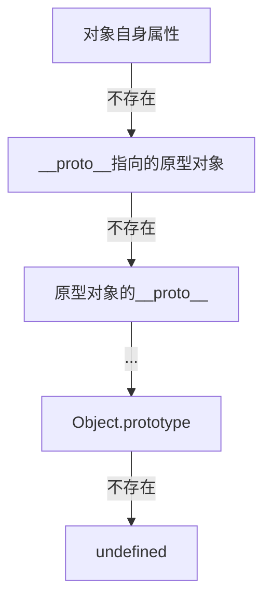

#### 5. 经典金句/数据

> “对象本身是没有名称的，之所以使用变量，是为了通过某个名称来称呼这样一种不具有名称的对象。”（p.076）
> “原型链最终是通过‘隐式链接’连接而成的。”（p.100）

---

### 第6章：函数与闭包

#### 1. 核心论点

本章全面讲解函数：声明方式、调用分类、arguments、作用域、函数对象、闭包原理及应用。作者强调：闭包是JavaScript最强大的特性之一，利用它可以实现模块化、信息隐藏、回调函数等。

#### 2. 关键概念

- **函数声明 vs 函数表达式**：声明会被提升，表达式不会。
- **arguments**：类数组对象，包含所有实参。
- **作用域链**：内层函数可以访问外层函数的变量。
- **闭包**：函数加上其词法环境，使得函数可以“记住”定义时的作用域。
- **模块模式**：通过闭包创建私有变量和公共接口。
- **回调函数**：异步编程的基础，注意this绑定（bind）。

#### 3. 逻辑推演

先区分函数声明和函数表达式（提升差异）。介绍函数调用的四种方式（作为函数、方法、构造函数、apply/call）。说明arguments对象和递归函数。作用域部分：JavaScript只有函数作用域，没有块作用域（但可通过`let`模拟）。嵌套函数的作用域链。重点讲闭包：定义、原理（Call对象不被销毁）、典型应用（计时器回调、私有变量、模块）。给出循环中闭包的经典问题（变量共享）及解决方案（IIFE创建新作用域）。最后介绍回调函数设计模式（事件驱动、控制反转），并演示如何通过bind解决回调中this丢失的问题。

#### 4. 闭包原理图

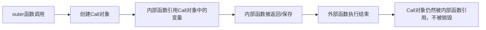

#### 5. 经典金句/数据

> “JavaScript中的函数是一种对象。”（p.120）
> “闭包指的是一种特殊的函数，这种函数会在被调用时保持当时的变量名查找的执行环境。”（p.126）

---

### 第7章：数据处理

#### 1. 核心论点

本章讲述JavaScript中数组、JSON、日期、正则表达式的使用。作者强调：数组是对象，具有动态长度和丰富的方法；正则表达式是强大的模式匹配工具；JSON是轻量级数据交换格式。

#### 2. 关键概念

- **数组**：字面量`[]`，length属性可写，支持稀疏数组，多种迭代方法（forEach、map、filter、reduce等）。
- **数组破坏性方法**：pop、push、reverse、shift、sort、splice、unshift。
- **JSON**：`JSON.parse`和`JSON.stringify`，支持基本类型、对象、数组。
- **Date类**：epoch毫秒，getter/setter，注意月份从0开始。
- **正则表达式**：字面量`/pattern/`，RegExp对象，exec/test，String方法（match、replace、search、split）。

#### 3. 逻辑推演

数组部分：创建、元素访问、length特性、枚举（for循环优于for-in）、多维数组、Array类方法（concat、join、push、pop、shift、unshift、reverse、sort、slice、splice等）。强调破坏性方法的副作用。介绍数组风格的对象（arguments、NodeList）及转换为数组的方法。JSON部分：标准子集，使用`JSON.parse`和`JSON.stringify`代替eval。日期部分：创建Date对象、epoch值、UTC与本地时间转换。正则表达式：语法（字符类、重复、分组、锚点、向后引用、贪婪/惰性）、flags、RegExp实例属性（lastIndex）。举例说明常见用法（trim、分割、替换）。

#### 4. 数组排序流程图

```mermaid
graph LR
    A[未排序数组] --> B[调用sort(compareFunction)]
    B --> C[比较函数返回负数/0/正数]
    C --> D[内部排序算法]
    D --> E[返回排序后数组（原数组被修改）]
```

#### 5. 经典金句/数据

> “数组是一种有序元素的集合。”（p.134）
> “JSON是JavaScriptObjectNotation的缩写，是一种基于JavaScript的字面量表达方式的数据格式类型。”（p.149）

---

### 第8章：客户端JavaScript与HTML

#### 1. 核心论点

本章讲解客户端JavaScript的运行环境：HTML中嵌入/引用脚本的方式、执行流程、跨浏览器支持方法。作者强调：将脚本放在`<body>`末尾或使用`DOMContentLoaded`事件可确保DOM已就绪；跨浏览器支持应优先采用功能检测而非浏览器嗅探。

#### 2. 关键概念

- **脚本放置位置**：`<head>`会阻塞渲染，推荐放在`</body>`前。
- **async/defer属性**：异步加载脚本，不阻塞页面。
- **window.onload vs DOMContentLoaded**：onload等待所有资源，DOMContentLoaded在DOM树构建完成后触发。
- **跨浏览器支持**：功能检测（如`if(window.addEventListener)`）优于用户代理判断。
- **Navigator对象**：`userAgent`属性用于浏览器识别。
- **Location对象**：`href`、`assign`、`replace`、`reload`。
- **History对象**：`back`、`forward`、`go`。

#### 3. 逻辑推演

先介绍Web应用程序的发展，强调JavaScript性能的提升。说明HTML中引入JavaScript的多种方式（内联、外部文件、动态创建`<script>`）。分析不同方式对DOM访问的影响：`<head>`中直接执行无法访问后续元素，推荐将脚本放在`<body>`末尾。比较`onload`和`DOMContentLoaded`的触发时机。动态载入脚本的优点（不阻塞）。跨浏览器支持：对比用户代理检测和功能检测，推荐后者。详细介绍Window对象的子对象（Navigator、Location、History、Screen、Document）。示例展示如何通过`location.hash`实现单页应用的简单路由。

#### 4. 脚本加载执行顺序图

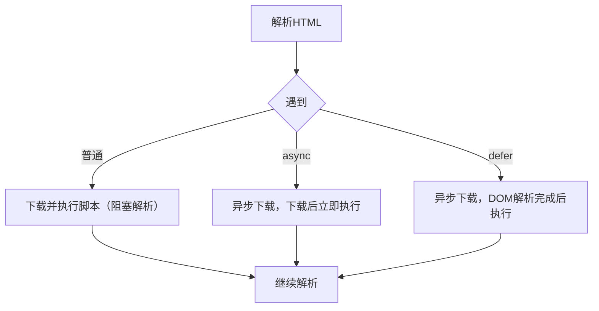

#### 5. 经典金句/数据

> “在客户端JavaScript中，Window对象是一个全局对象。”（p.174）
> “与通过用户代理进行分支判断相比，对功能是否被支持进行判断是一种更可靠的做法。”（p.174）

---

### 第9章：DOM

#### 1. 核心论点

本章全面介绍DOM（文档对象模型）：节点树结构、节点选择、创建、修改、删除以及性能优化。作者强调：理解DOM Level 1/2/3的差异，善用`getElementById`、`querySelector`等API，注意Live NodeList的性能问题。

#### 2. 关键概念

- **DOM树**：文档节点（Document）、元素节点（Element）、文本节点（Text）、属性节点（Attr）等。
- **节点选择**：`getElementById`、`getElementsByTagName`、`getElementsByName`、`getElementsByClassName`、`querySelector`/`querySelectorAll`（StaticNodeList）。
- **节点遍历**：parentNode、childNodes、firstChild、lastChild、nextSibling、previousSibling，以及Element Traversal API（firstElementChild等）。
- **节点操作**：`createElement`、`createTextNode`、`appendChild`、`insertBefore`、`removeChild`、`replaceChild`、`innerHTML`、`textContent`。
- **性能**：使用DocumentFragment批量添加节点，减少重绘。

#### 3. 逻辑推演

定义DOM及其Level划分。讲解Document对象作为根节点。详细展示通过id、标签名、name、类名、CSS选择器选取元素的方法，比较返回值（NodeList、HTMLCollection、StaticNodeList）的Live/Static特性。说明空白节点对`firstChild`等属性的影响，推荐使用Element Traversal API。节点的创建与插入：`createElement` + `appendChild`。修改内容：`innerHTML`（快速但可能引起XSS）和`textContent`。删除节点：`removeChild`。性能优化：使用DocumentFragment或先隐藏元素再批量修改。最后给出XPath和Selector API的简介。

#### 4. DOM树结构示例

```mermaid
graph TD
    A[Document] --> B[html]
    B --> C[head]
    B --> D[body]
    D --> E[div id="main"]
    E --> F[p]
    F --> G[TextNode "Hello"]
```

#### 5. 经典金句/数据

> “Live对象始终具有DOM树实体的引用。”（p.181）
> “在使用for循环中使用NodeList时，先将其转换为Array对象后再使用比较好。”（p.183）

---

### 第10章：事件

#### 1. 核心论点

本章讲解JavaScript事件模型：事件处理程序注册方式、事件传播（捕获→目标→冒泡）、事件对象、标准事件类型以及自定义事件。作者强调：理解事件流和取消方法（preventDefault/stopPropagation）是编写交互应用的关键。

#### 2. 关键概念

- **事件处理程序**：HTML属性（`onclick`）、DOM属性（`element.onclick`）、`addEventListener`（标准）/`attachEvent`（IE）。
- **事件流**：捕获阶段、目标阶段、冒泡阶段。
- **取消事件**：`preventDefault()`取消默认行为，`stopPropagation()`阻止传播。
- **事件对象**：`type`、`target`、`currentTarget`、`eventPhase`、`bubbles`、`cancelable`。
- **标准事件类型**：HTMLEvent、MouseEvent、UIEvent、MutationEvent、KeyboardEvent、FocusEvent等。
- **自定义事件**：`createEvent` + `initEvent` + `dispatchEvent`。

#### 3. 逻辑推演

从事件驱动程序设计出发，介绍三种注册方式及其区别（能否注册多个处理程序）。详细说明事件传播的三个阶段，对比网景（捕获）和微软（冒泡）的不同，W3C的折中方案（可指定在捕获或冒泡阶段触发）。演示如何通过`addEventListener`的第三个参数控制阶段。介绍事件对象的常用属性和方法。列举DOM Level 2和Level 3定义的事件类型（load、click、mousedown、keydown等）。最后演示如何创建和触发自定义事件（`dispatchEvent`）。

#### 4. 事件传播图

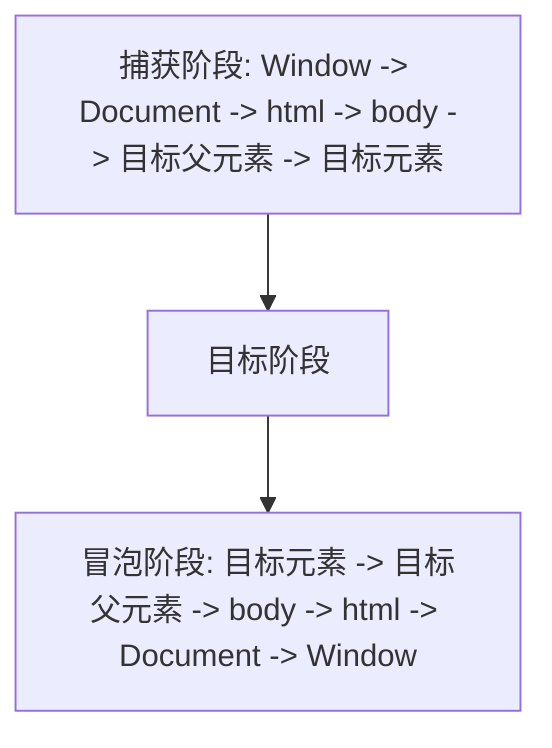

#### 5. 经典金句/数据

> “在JavaScript中，最为重要的一件事就是事件进行处理。”（p.192）
> “stopPropagation() 方法只能取消执行在之后的侦听器目标中注册的事件侦听器。”（p.198）

---

### 第11章：客户端JavaScript实践

#### 1. 核心论点

本章结合实践讲解样式操作、AJAX、表单处理。作者强调：通过`className`或`classList`更改样式比直接修改`style`更利于分离关注点；AJAX使用XMLHttpRequest异步通信，需注意跨源限制及解决方法（JSONP、CORS、postMessage等）；表单验证应在客户端和服务器端双重进行。

#### 2. 关键概念

- **样式操作**：`className`、`classList`（add/remove/toggle/contains）、直接修改`style`属性、切换样式表。
- **位置与动画**：`position`（relative/absolute/fixed）、clientX/pageX/screenX、`setInterval`实现动画（或使用CSS3）。
- **AJAX**：`XMLHttpRequest`对象的创建、`open`、`send`、`onreadystatechange`、`readyState`、`status`、`responseText`/`responseXML`。
- **跨源通信**：同源策略、JSONP、iframe hack、`window.postMessage`、CORS（`XMLHttpRequest Level 2`）。
- **表单**：访问表单元素、表单验证（submit事件、blur/change/input事件）、阻止默认提交、无刷新提交（target指向隐藏iframe）。

#### 3. 逻辑推演

样式部分：比较`className`切换（推荐）和直接修改`style`的优缺点，介绍`classList` API。位置获取：不同坐标系（屏幕、窗口、文档、相对元素）的属性和方法，通过`getBoundingClientRect`计算相对坐标。动画：`setInterval`不断改变样式属性，注意性能。AJAX：详细讲解XMLHttpRequest的使用步骤、同步/异步差异、超时处理、响应类型（text、XML、JSON）。跨源通信问题：解释同源策略，演示JSONP原理（动态`<script>`），介绍iframe hack和`postMessage`，以及CORS。表单：获取表单元素、验证时机（submit、blur、change、input），如何使用`onsubmit`返回false取消提交，以及通过`target="iframe"`实现无刷新提交。

#### 4. JSONP工作原理图

```mermaid
graph LR
    A[客户端] -->|动态创建script标签，src指向API并附带callback参数| B[服务器]
    B -->|返回 callback(data)| A
    A -->|自动执行callback函数| C[处理数据]
```

#### 5. 经典金句/数据

> “AJAX的关键在于它是以异步的方式执行的。”（p.210）
> “对于浮点数来说，有时候并不能正确地表达小数点以后的部分。”（p.030）

---

### 第12章：库（jQuery）

#### 1. 核心论点

本章介绍jQuery库的核心概念和用法。作者认为：jQuery通过CSS选择器、链式语法、跨浏览器事件处理、AJAX简化等特性，极大提高了JavaScript开发效率；理解`$`函数、链式调用、事件委托、Deferred对象是高效使用jQuery的关键。

#### 2. 关键概念

- **链式语法**：方法返回jQuery对象自身，可连续调用。
- **$函数**：多用途：选择器、创建DOM元素、将DOM元素包装为jQuery对象、`$(document).ready()`。
- **DOM操作**：`find`、`children`、`parent`、`append`、`prepend`、`remove`、`html`、`text`等。
- **事件处理**：`on`、`off`、`one`、`delegate`、`live`（已弃用），`ready`。
- **样式与动画**：`css`、`addClass`、`toggleClass`、`animate`、`fadeIn/Out`、`slideDown/Up`。
- **AJAX**：`$.ajax`、`$.get`、`$.post`、`$.getJSON`、`$.getScript`，全局事件（ajaxStart等）。
- **Deferred**：Promise模式，`$.Deferred`，`then`/`done`/`fail`/`always`/`pipe`，`$.when`处理并行异步。

#### 3. 逻辑推演

先说明使用库的原因（跨浏览器兼容、简化代码）。介绍jQuery的特征（轻量、链式、CSS3选择器、插件）。通过示例对比原生JavaScript和jQuery的代码量，展示链式语法的简洁。详细解释`$`函数的多种用法。DOM操作部分：选择器（CSS及自定义）、遍历、创建和修改元素。事件处理：`on`绑定、事件委托（处理动态元素）。样式操作：`css`方法和动画方法。AJAX：`$.ajax`配置项、快捷方法、全局事件。Deferred：解决回调地狱，通过`$.Deferred`创建异步任务，使用`then`串联，`$.when`等待多个任务完成。最后介绍jQuery插件的使用和编写，以及避免`$`冲突的方法（`noConflict`）。

#### 4. jQuery链式语法流程图

```mermaid
graph LR
    A[$('selector')] --> B[.find(...)]
    B --> C[.addClass(...)]
    C --> D[.css(...)]
    D --> E[.end()]
    E --> F[.appendTo(...)]
```

#### 5. 经典金句/数据

> “jQuery 是现在世界上使用最多的JavaScript库。”（p.224）
> “通过使用 Deferred，就能够将异步处理串联书写并执行。”（p.237）

---

## 第4部分：HTML5

### 第13章：HTML5概要

#### 1. 核心论点

本章概述HTML5的历史、现状和分类（语义、离线存储、设备访问、多媒体、3D、性能、连接性等）。作者指出：HTML5并非单一标准，而是包含众多API的集合；智能手机对HTML5的支持度高，是开发移动Web应用的首选平台。

#### 2. 关键概念

- **WHATWG**：推动HTML5标准的组织，与W3C合作。
- **HTML5徽标分类**：Connectivity (WebSocket)、Offline & Storage (AppCache、localStorage)、Multimedia (Video/Audio)、3D Graphics (WebGL)、Device Access (Geolocation)、Performance (Web Workers)等。
- **Modernizr**：检测浏览器对HTML5特性的支持情况。
- **跨浏览器支持**：PC端需考虑旧版IE，智能手机端基本基于WebKit。

#### 3. 逻辑推演

回顾HTML5从2008年草案到2014年推荐的历程。比较PC浏览器与智能手机浏览器的支持差异，强调智能手机是HTML5开发的理想环境。列出HTML5主要API类别，并给出各浏览器厂商的HTML5门户站点（IE Test Drive、MDN、HTML5 Rocks等）。最后说明Web应用与原生应用的权衡：跨平台优势 vs 性能与功能限制。

#### 4. 经典金句/数据

> “HTML5一词似乎已经成了一句流行语，在不同场合下这个词所指的范围也各有不同。”（p.248）

---

### 第14章：Web应用程序（History API、ApplicationCache）

#### 1. 核心论点

本章讲解两个重要的HTML5 API：History API（管理浏览器URL而不刷新页面）和ApplicationCache（离线缓存）。作者认为：History API配合pushState/replaceState可以解决AJAX应用的URL和书签问题；ApplicationCache通过缓存清单文件实现离线访问，但API较为复杂且已被Service Worker逐渐取代。

#### 2. 关键概念

- **History API**：`history.pushState`、`replaceState`、`popstate`事件，允许修改URL路径而不加载新页面。
- **哈希片段（hashbang）**：`#!`用于单页应用，但不如pushState优雅。
- **ApplicationCache**：缓存清单（`.appcache`）文件，定义CACHE、NETWORK、FALLBACK区段，`applicationCache`对象控制更新。
- **在线/离线检测**：`navigator.onLine`，`online`/`offline`事件。

#### 3. 逻辑推演

先解释AJAX应用导致URL与内容不一致的问题，以及传统解决方案（hash）。然后介绍History API：`pushState`添加历史记录，`replaceState`修改当前记录，`popstate`事件监听浏览器前进/后退。演示如何根据URL恢复页面状态。ApplicationCache部分：编写缓存清单文件，在html标签中指定manifest，服务器需设置正确的MIME type。说明缓存的更新机制（修改清单文件内容才能触发更新）。通过`applicationCache`对象的事件（updateready等）精细控制缓存更新。最后给出`navigator.onLine`和online/offline事件检测网络状态。

#### 4. 缓存清单文件结构

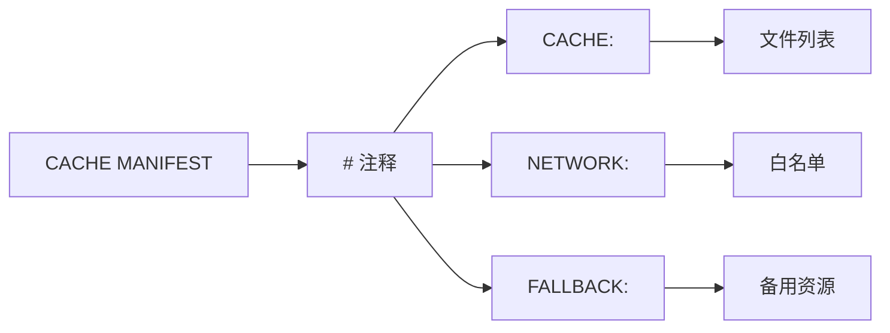

#### 5. 经典金句/数据

> “History API 是一种用于在JavaScript 中对浏览器的URL 及历史信息进行操作的API。”（p.250）
> “通过使用 ApplicationCache，就能够将过去由浏览器进行管理的缓存文件改由应用程序的开发者来控制。”（p.255）

---

### 第15章：与桌面应用的协作（Drag&Drop、File API）

#### 1. 核心论点

本章介绍Drag&Drop API和File API，实现浏览器与桌面之间的拖放交互。作者认为：DataTransfer对象是核心，可实现跨窗口/跨应用的数据传输；File API允许读取本地文件，结合FileReader可预览图像、处理文本。

#### 2. 关键概念

- **Drag & Drop**：`dragstart`、`dragend`、`dragenter`、`dragover`、`dragleave`、`drop`事件；`dataTransfer.setData`/`getData`；`effectAllowed`/`dropEffect`；`setDragImage`自定义拖动图像。
- **File API**：`<input type="file">`的`files`属性；`File`对象（name、size、type）；`FileReader`（`readAsText`、`readAsDataURL`、`readAsArrayBuffer`），异步读取。
- **data URL**：将文件内容嵌入URL，格式`data:[MIME];base64,数据`。
- **FileReaderSync**：在Worker中同步读取文件。

#### 3. 逻辑推演

Drag&Drop部分：设置元素的`draggable`属性，监听`dragstart`将数据存入`dataTransfer`。在目标元素上监听`dragover`并调用`preventDefault`以允许放置，监听`drop`获取数据。演示如何从桌面拖入文件（`dataTransfer.files`）以及如何将文件拖出到桌面（`setData('DownloadURL', ...)`）。File API部分：通过`<input type="file">`的`change`事件获取`File`对象，使用`FileReader`异步读取文件内容，并在`onload`回调中处理结果（如显示图像）。介绍`readAsDataURL`生成data URL直接用于``的src。最后说明`FileReaderSync`在Worker中的用法。

#### 4. 文件拖放流程图

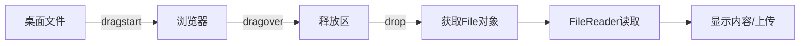

#### 5. 经典金句/数据

> “Drag Drop API 消除了Web 应用程序与原生应用程序之间的界限。”（p.260）
> “File API 是一种用于获取在本地保存的文件的信息与内容的API。”（p.267）

---

### 第16章：存储（Web Storage、Indexed Database）

#### 1. 核心论点

本章介绍客户端存储技术：Web Storage（localStorage/sessionStorage）和Indexed Database。作者认为：Web Storage适用于简单的键值对数据（5MB限制），Indexed Database适合存储大量结构化数据，支持索引和事务。

#### 2. 关键概念

- **Web Storage**：`localStorage`（持久）、`sessionStorage`（会话级），API简单（`setItem`/`getItem`/`removeItem`/`clear`），只能存储字符串（可通过JSON转换存储对象）。`storage`事件跨窗口同步。
- **Indexed Database**：异步API，数据库→对象存储（ObjectStore）→索引（Index）。事务（readonly/readwrite），游标（cursor）查询，键范围（IDBKeyRange）。
- **同源策略**：存储基于源隔离。

#### 3. 逻辑推演

比较Web Storage与Cookie的优缺点（容量、不与请求一起发送）。演示localStorage的基本操作、枚举、事件监听。提供命名空间管理和版本升级的最佳实践。Indexed Database部分：打开数据库、创建对象存储（指定keyPath或自动生成键）、添加/读取/删除数据、创建索引、使用游标进行范围查询、事务的使用。说明同步API（仅限Worker）。最后给出针对不兼容浏览器的localStorage模拟方案（内存存储）。

#### 4. Indexed Database结构图

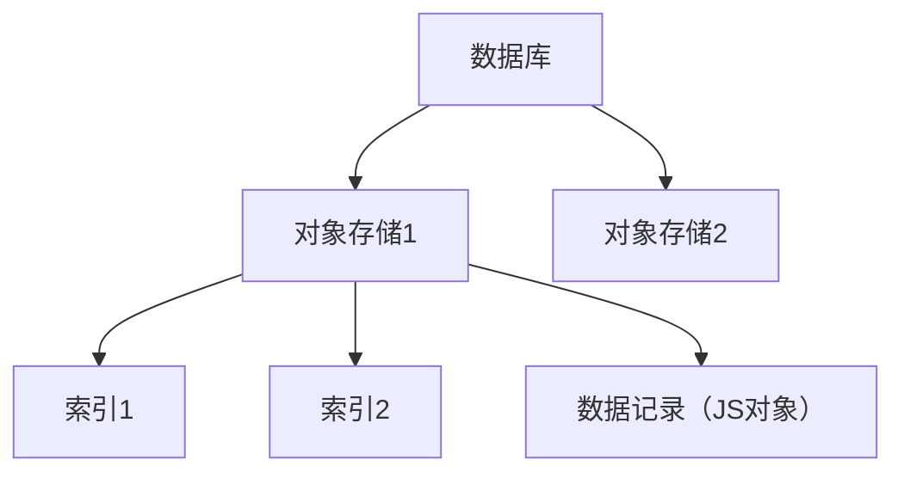

#### 5. 经典金句/数据

> “Web Storage 是一种可以简单地将JavaScript 所处理的数据永久保存的接口。”（p.274）
> “Indexed Database 是一种在浏览器中通过JavaScript 进行操作的功能强大的数据库。”（p.280）

---

### 第17章：WebSocket

#### 1. 核心论点

本章介绍WebSocket协议及API，实现浏览器与服务器之间的全双工实时通信。作者认为：WebSocket相比传统AJAX轮询/长轮询/Comet更高效、更简洁，适合聊天、实时数据推送等场景。

#### 2. 关键概念

- **WebSocket API**：`new WebSocket(url)`，事件（`onopen`、`onmessage`、`onerror`、`onclose`），方法（`send`、`close`）。
- **子协议**：可选的子协议字符串。
- **二进制数据**：`binaryType`可设为`'blob'`或`'arraybuffer'`。
- **Node.js实现**：使用`websocket-server`或`socket.io`库。

#### 3. 逻辑推演

先对比传统实时通信技术（轮询、长轮询、流）的低效和复杂。介绍WebSocket握手过程（基于HTTP升级）。讲解客户端API：创建WebSocket实例，监听message事件接收数据，调用send发送。注意二进制数据的发送和接收。然后搭建Node.js WebSocket服务器（使用`websocket-server`模块），示例展示一个简易聊天室：服务器接收消息并广播给所有连接。最后演示客户端的实现，包括发送用户名、输入状态等JSON格式化消息。

#### 4. WebSocket通信流程

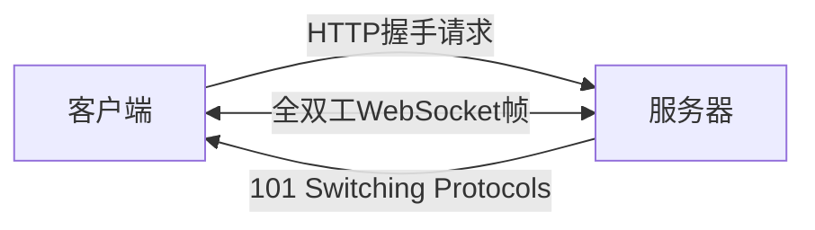

#### 5. 经典金句/数据

> “WebSocket 是一种用于在服务器与客户端之间实现高效的双向通信的机制。”（p.287）
> “WebSocket 通信是含有状态的，因此即使仅收到了1 个字节的数据，也能够确定该发送方客户端。”（p.290）

---

### 第18章：Web Workers

#### 1. 核心论点

本章介绍Web Workers，允许在后台线程运行JavaScript，避免阻塞UI。作者强调：Worker与主线程通过消息传递通信，不能直接操作DOM；共享Worker（SharedWorker）可在多个页面间共享。

#### 2. 关键概念

- **专用Worker**：`new Worker('worker.js')`，`postMessage`和`onmessage`通信。
- **共享Worker**：`new SharedWorker('worker.js')`，通过`port`对象通信。
- **Worker环境**：全局对象为`self`，可使用`importScripts`加载外部脚本。
- **终止Worker**：主线程调用`terminate()`，Worker自身调用`close()`。

#### 3. 逻辑推演

解释单线程的瓶颈，Worker可并行处理计算密集型任务。演示创建Worker：主线程发送消息，Worker接收并处理后返回结果。注意Worker中不能访问DOM，但可以使用XMLHttpRequest、WebSocket等API。共享Worker：多个标签页或iframe可以连接到同一个Worker，通过`port`进行通信，实现跨页面消息广播。示例：搜索过滤任务在Worker中执行，避免输入时卡顿，并展示如何中断上一个未完成的任务（重新创建Worker或使用标志）。最后提到FileReaderSync在Worker中的使用。

#### 4. Web Worker消息传递图

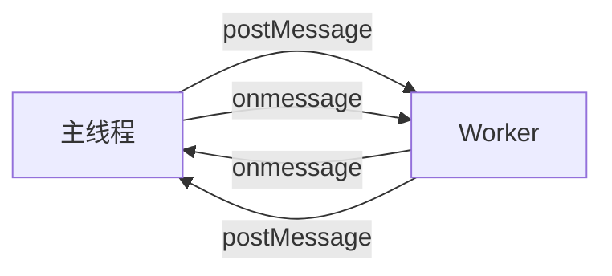

#### 5. 经典金句/数据

> “Web Workers 是一种能够在另外的线程中创建新的JavaScript 运行环境。”（p.298）
> “如果要频繁地调用工作线程进行处理，或创建工作线程需要花费相当的时间时，则不建议每次都删除工作线程。”（p.301）

---

## 第5部分：Web API

### 第19章：Web API的基础

#### 1. 核心论点

本章介绍Web API的定义、历史形式（Web抓取→HTTP API→语言API→微件API）、RESTful概念以及验证/授权（OAuth）。作者认为：Web API是Web服务的调用规则，RESTful风格以资源为核心，OAuth解决了第三方应用授权问题。

#### 2. 关键概念

- **Web API形式**：HTTP API（直接定义URL和响应）、语言API（如JavaScript库）、微件API（如Google Translate Element）。
- **REST**：资源通过URI标识，使用HTTP方法（GET/POST/PUT/DELETE）操作资源。
- **SOAP**：基于XML的RPC协议，复杂度高。
- **API密钥**：用于限制调用次数，但无法在客户端隐藏。
- **OAuth**：授权协议，允许第三方应用在不获取用户密码的情况下代表用户操作资源。OAuth 2.0提供用户代理流程（隐式授权）适用于客户端JavaScript。

#### 3. 逻辑推演

先定义Web API与Web服务的关系。回顾Web抓取的问题，引出标准化Web API。比较SOAP与REST，强调RESTful设计原则。介绍API密钥的作用及在客户端使用的不安全性。重点讲解OAuth 2.0的两种流程：服务器端流程（获取授权码和访问令牌）和用户代理流程（直接返回访问令牌，适用于纯前端应用）。说明CSRF攻击风险及OAuth如何缓解。

#### 4. OAuth 2.0 隐式授权流程

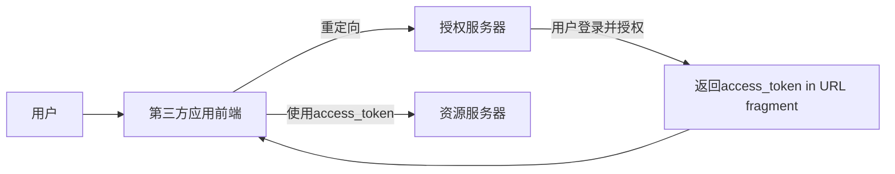

#### 5. 经典金句/数据

> “Web API 是一种形式上的规则，因此，Web API 与Web 服务其实是表里一致的。”（p.310）
> “REST 的核心是资源。”（p.316）

---

### 第20章：Web API的实例

#### 1. 核心论点

本章以Google Translate API、Google Maps API、Flickr API、Twitter API、Facebook API、OpenSocial为例，展示真实Web API的使用方法。作者强调：大多数流行服务都提供RESTful API和JSONP支持，方便客户端JavaScript调用；微件（Widget）是最简单的集成方式。

#### 2. 关键概念

- **Google Translate API**：REST API + JSONP，需要API密钥。
- **Google Maps API**：JavaScript API，事件驱动，需加载地图库。
- **Flickr API**：REST API，method参数指定操作，支持JSONP。
- **Twitter API**：REST API + 搜索API + @anywhere（JavaScript API） + Widget。
- **Facebook API**：Graph API + JavaScript API（FB.init、FB.api） + Social Plugin（Like按钮）。
- **OpenSocial**：基于XML的Gadget容器，JavaScript API（osapi）访问社交图谱。

#### 3. 逻辑推演

逐一介绍每个API的获取密钥方式、端点URL、请求参数、响应格式（JSON/XML）。演示客户端JavaScript调用（使用JSONP或官方JavaScript库）。对比不同API的设计风格：Flickr的RPC风格（method参数） vs Twitter的RESTful资源风格。展示Google Maps API的地图初始化和事件处理（addListener）。最后介绍OpenSocial的容器（Shindig）和Gadget定义文件（XML），以及如何使用`gadgets.io.makeRequest`代理跨域请求。

#### 4. JSONP通用调用模式

```mermaid
graph LR
    A[创建script标签] --> B[设置src为API URL + callback=myFunc]
    B --> C[加载并执行返回的 myFunc(data)]
    C --> D[处理数据]
```

#### 5. 经典金句/数据

> “Google Translate API 服务今后将会被终止。”（p.324）
> “OpenSocial 的早期原型是 iGoogle。”（p.346）

---

## 第6部分：服务器端JavaScript

### 第21章：服务器端JavaScript与Node.js

#### 1. 核心论点

本章介绍服务器端JavaScript的复兴，重点讲解Node.js的安装、核心模块（console、util、process）、事件API（EventEmitter）、Buffer、Stream。作者强调：Node.js采用异步非阻塞模型，通过事件循环实现高并发；理解回调函数和流是Node编程的基础。

#### 2. 关键概念

- **CommonJS**：定义模块标准，`require`和`exports`。
- **Node.js事件循环**：libev库实现，异步I/O。
- **EventEmitter**：事件发射器，`on`/`emit`方法，所有可产生事件的对象都继承自它。
- **Buffer**：处理二进制数据，固定大小，直接内存操作。
- **Stream**：流式读写，分为Readable和Writable，支持`data`、`end`、`error`事件。

#### 3. 逻辑推演

先回顾服务器端JavaScript的历史（Netscape Enterprise Server到Node.js）。说明CommonJS模块规范，展示模块导出和导入。Node.js安装与基本使用：`node`命令交互式环境。核心模块：console（log/error/assert/trace）、util（inherits）、process（argv/env/exit）。事件API：继承EventEmitter，使用`on`添加监听，`emit`触发事件。Buffer：创建、读写、与字符串转换。Stream：读取流监听`data`事件，写入流调用`write`和`end`。示例：创建HTTP服务器，使用`http.createServer`处理请求。

#### 4. Node.js事件循环模型

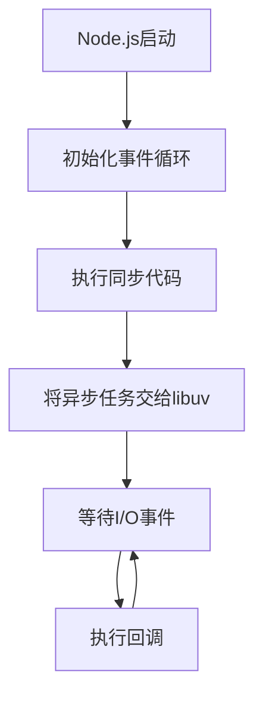

#### 5. 经典金句/数据

> “Node.js 是一种以异步处理为特点的JavaScript 实现。”（p.355）
> “在Node.js 中，所有的事件处理程序都只能在（隐式的）事件循环中被调用。”（p.367）

---

### 第22章：Node.js程序设计实践

#### 1. 核心论点

本章通过实际代码展示Node.js在HTTP服务器、客户端、HTTPS、Socket.IO、文件处理、Express框架、MongoDB等方面的应用。作者认为：掌握异步编程模式、合理使用Express和Mongoose可以快速构建Web应用。

#### 2. 关键概念

- **HTTP服务器**：`http.createServer`、`request`事件、`response`对象（writeHead、write、end）。
- **HTTP客户端**：`http.request`、`http.get`。
- **HTTPS**：需要私钥和证书，使用`https`模块。
- **Socket.IO**：实时双向通信库，支持WebSocket及降级方案。
- **文件系统**：`fs`模块的异步/同步方法（readFile、writeFile、stat、watchFile等）。
- **Express**：Web框架，路由（`app.get/post`）、中间件、模板引擎（Jade）。
- **MongoDB + Mongoose**：ODM，定义Schema，模型操作（save、find、remove）。

#### 3. 逻辑推演

从最简单的HTTP服务器开始，逐步添加路由解析、POST数据处理。介绍`url`和`querystring`模块解析参数。客户端请求：`http.request`获取响应数据。HTTPS：生成自签名证书，创建服务器。Socket.IO：创建聊天室，服务器广播消息。文件处理：异步读取文件，注意回调地狱，建议使用`fs.readFile`等简易API。Express：路由、中间件（bodyParser）、模板渲染。结合Mongoose：定义Schema、模型，实现CRUD。最后给出一个完整的文档管理应用示例（列出文档、创建文档、显示文档）。

#### 4. Express + MongoDB 应用架构

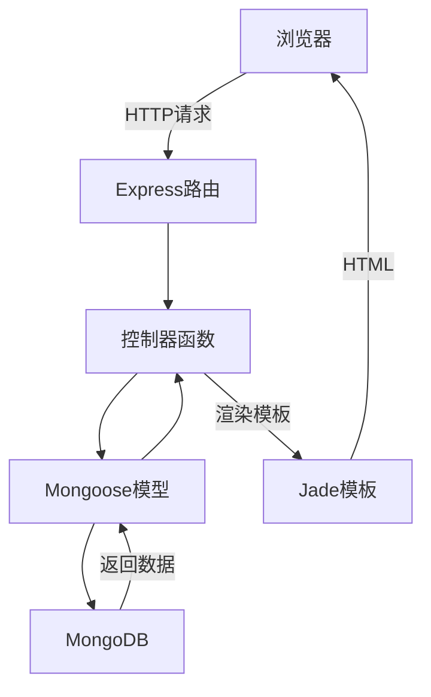

#### 5. 经典金句/数据

> “Express 是一种用于Web 应用开发的MVC 框架。”（p.391）
> “MongoDB 是一种所谓的NoSQL。”（p.396）

---

## 后记

### 核心论点

三位作者分别分享了学习JavaScript的心得和对未来的展望。井上诚一郎强调技术投资回报率，认为JavaScript因主流且独特值得学习；土江拓郎认为JavaScript正成为第三种“通用语言”；滨边将太指出JavaScript应用范围已扩展到服务器、移动端、电视等，系统学习变得必要。

### 经典金句

> “JavaScript 正成为互联网中引领各种技术发展的标准语言。”（p.401）
> “只要学会了JavaScript 程序设计，就能够在计算机中实现任何希望实现的功能。”（p.401）

---

> 说明：本书附录（索引）因内容为术语列表，已分散至各章节关键概念中，不再单独总结。


