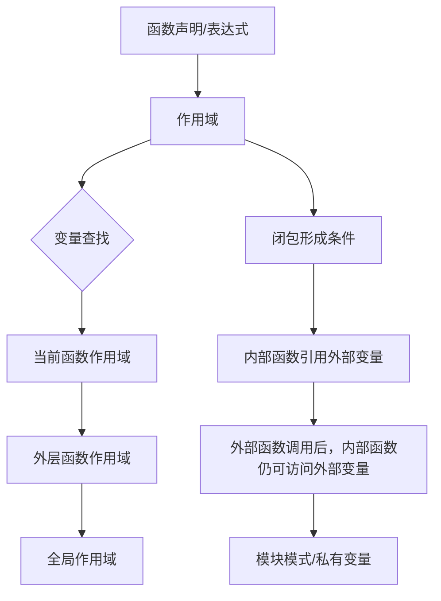
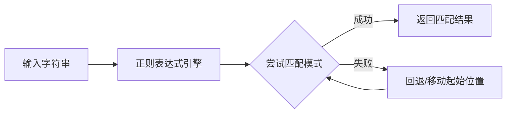
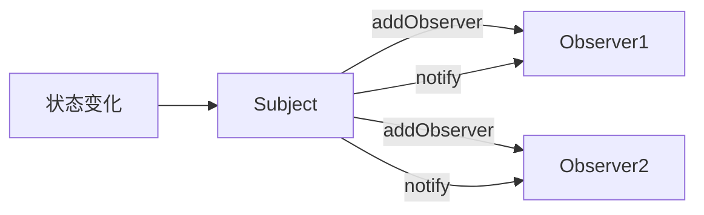
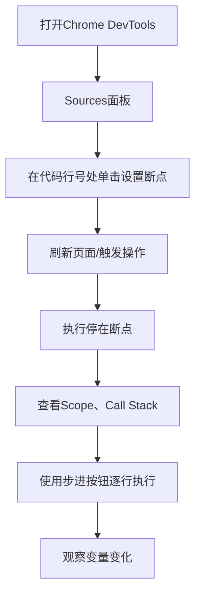
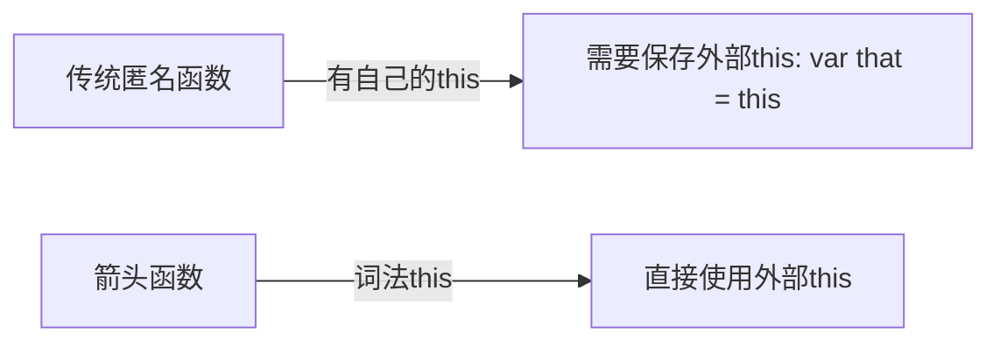
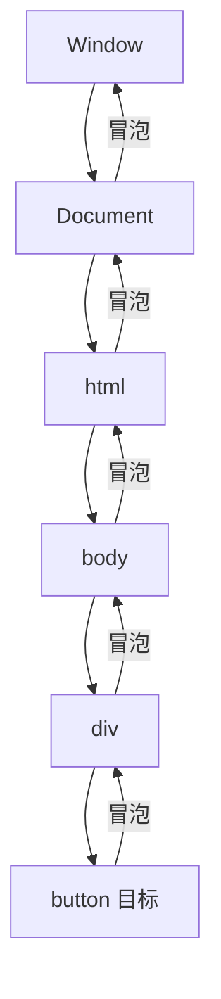
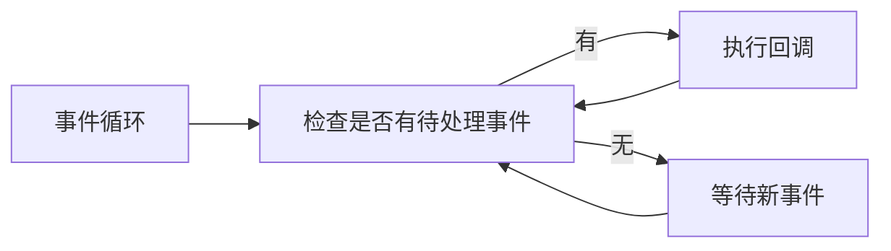

# 《JavaScript编程精粹》章节总结

## 书籍信息

- 书名：JavaScript编程精粹 (Mastering JavaScript)
- 作者：[印度] Ved Antani
- 译者：门佳
- PDF状态：完整识别，含目录及正文
- OCR状态：良好，部分页眉页脚有轻微干扰，可正常提取

## 目录说明

- 目录识别情况：完整识别第1章至第9章，以及前言、致谢等。
- 章节对应依据：PDF内置目录及正文标题。
- OCR修复说明：部分代码块中特殊字符（如`≡`被识别为等号）已根据上下文修正；少量图片无法复原，已标注。

## 全书核心主题

本书旨在帮助开发者真正掌握JavaScript，强调避开语言“不良成分”，使用正确的编码风格和现代工具（jQuery、Underscore.js、Jasmine等）构建可靠、可读、可维护的Web应用。全书从语言基础、函数与闭包、数据结构、面向对象、设计模式、测试调试、ECMAScript6、DOM操作到服务器端JavaScript（Node.js），层层递进，既覆盖核心概念，又关注实际工程实践。

---

## 第1章：JavaScript入门

### 1. 核心论点

本章解决“如何正确开始JavaScript编程”的问题。作者认为：JavaScript被误解最深，但有其坚实的构建基础；学习者应当避开不良成分，坚持使用var、严格相等（===）、代码风格指南等好习惯，从一开始就写出专业代码。

### 2. 关键概念

- **隐式全局变量**：不使用var声明的变量会成为全局对象属性，应绝对避免。
- **NaN**：Not a Number，自身不等于自身，应使用`isNaN()`检测。
- **parseInt基数**：始终指定基数（如10），避免八进制解析。
- **严格相等（===）**：不进行类型转换，推荐使用；避免使用`==`。
- **严格模式（'use strict'）**：消除静默错误，禁止隐式全局等，推荐启用。
- **JSHint**：静态代码检查工具，可发现潜在bug和风格问题。

### 3. 逻辑推演

作者首先简述JavaScript历史（Brendan Eich十天创造原型），说明其为何被误解。然后给出Hello World示例，介绍基本类型（Number、String、Boolean、Symbol、Object、Null、Undefined）及特殊值（NaN、Infinity）。接着详细讲解变量声明、常量、类型转换陷阱（如浮点数精度问题）、字符串操作、布尔对象陷阱、`+`操作符、`++/--`、短路逻辑、`switch`、循环（while/do-while/for）等。重点对比`==`与`===`，强烈建议使用`===`。最后给出代码风格指南（缩进、括号、引号、命名、类型检查等）和严格模式的益处，并推荐使用JSHint。

### 4. 经典金句/数据

> “JavaScript的变量没有变量类型。”（p.21）
> “除非知道自己在做什么，否则要坚持使用var关键字来声明变量。”（p.20）
> “严格相等是检查相等关系时应该使用的正确方法。应该设立这么一条规则：坚持使用===，避免使用==。”（p.35）

---

## 第2章：函数、闭包与模块

### 1. 核心论点

本章解决“如何理解JavaScript中函数的核心地位及闭包机制”的问题。作者认为：函数是头等对象，可以赋值、传参、返回；闭包是函数声明时创建的作用域，使得函数可以访问外部变量，是实现模块化、私有变量和回调的基础。

### 2. 关键概念

- **函数字面量**：function关键字、可选的函数名、参数列表、函数体。
- **匿名函数**：没有名称的函数，常用于回调、IIFE。
- **函数作用域与块作用域**：JavaScript没有块作用域（ES6前），但有函数作用域；变量提升（hoisting）将声明移到顶部。
- **闭包**：函数加上其创建时的作用域，使函数能“记住”外部变量。
- **模块模式**：利用IIFE返回公共接口，隐藏私有变量和函数。

### 3. 逻辑推演

先介绍函数声明与函数表达式的区别，强调函数提升。然后说明函数作为数据（可赋值、传参）。深入作用域：全局作用域、局部作用域、函数作用域、块作用域缺失的问题，通过IIFE模拟块作用域。解释提升（hoisting）现象。接着介绍arguments对象、this的四种绑定（函数调用、方法调用、构造函数调用、apply/call）。重点讲解匿名函数的各种使用场景（对象创建、数组、回调、条件逻辑）。最后系统阐述闭包：定义、原理、计时器与回调中的应用、私有变量实现、循环中的闭包陷阱及解决方案（IIFE创建副本）。模块模式（包括Revealing Module Pattern）和CommonJS/AMD/ES6模块简介。

### 4. 流程图



### 5. 经典金句/数据

> “闭包是在函数声明时所创建的作用域，它使得函数能够访问并处理函数的外部变量。”（p.50）
> “在JavaScript中，函数是头等对象。”（p.34）

---

## 第3章：数据结构及相关操作

### 1. 核心论点

本章解决“如何高效处理数据（正则表达式、数组、集合）”的问题。作者认为：正则表达式是处理字符串的瑞士军刀，数组是JavaScript的基本数据结构，配合Underscore.js等函数式库可以写出更简洁、可读的代码。

### 2. 关键概念

- **正则表达式元字符**：`.`、`\d`、`\w`、`\s`、`^`、`$`、`*`、`+`、`?`、`{n,m}`、分组`()`、向后引用`\1`、贪婪/惰性限定符。
- **数组方法**：concat、join、pop、push、shift、unshift、reverse、sort、indexOf、lastIndexOf、forEach、map、filter、reduce等。
- **Underscore.js**：函数式工具库，提供each、map、reduce、filter、reject、contains、invoke、uniq、partition、compact、without等。
- **ES6 Map与Set**：Map是键值对集合，Set是值不重复的集合。

### 3. 逻辑推演

首先详细讲解正则表达式的创建（字面量与RegExp）、标志（i/g/m）、字符组、重复、边界、向后引用、贪婪与惰性，并给出实际应用（trim、替换多余空格）。然后转向数组：创建方式、length特性、稀疏数组、遍历（for/forEach）、常用方法。重点介绍Underscore.js的函数式方法，强调其使代码更简洁（如`_.range`生成数列、`_.map`转换、`_.reduce`归约）。最后简要介绍ES6的Map和Set，以及数组作为对象的本质（键为字符串、稀疏性带来的for...in陷阱）。编码风格建议使用数组字面量、使用push添加元素。

### 4. 流程图（正则表达式匹配过程）



### 5. 经典金句/数据

> “正则表达式就像是JavaScript 器库中的一把瑞士军刀。”（p.65）
> “JavaScript数组是稀疏的（大部分元素都有默认值），这意味着数组中可以存在间隙。”（p.72）

---

## 第4章：面向对象的JavaScript

### 1. 核心论点

本章解决“JavaScript面向对象（原型继承）如何工作”的问题。作者认为：JavaScript是基于原型的面向对象语言，对象是属性的集合，通过原型链实现继承；理解原型链、实例属性与原型属性的区别是掌握JavaScript OOP的关键。

### 2. 关键概念

- **原型（prototype）**：每个函数都有prototype属性，指向原型对象；每个对象都有内部链接（__proto__）指向其构造函数的原型。
- **原型链**：属性查找时先找自身属性，再沿原型链向上查找，直到Object.prototype。
- **实例属性 vs 原型属性**：实例属性在构造函数中用`this.xxx`定义，每个实例独立；原型属性定义在`Constructor.prototype`上，所有实例共享。
- **继承实现**：`Child.prototype = Object.create(Parent.prototype)` + `Parent.call(this)`。
- **Getter/Setter**：使用`get`/`set`关键字或`Object.defineProperty`。

### 3. 逻辑推演

从面向对象的基本理念（接口编程、组合优于继承）入手，引出JavaScript的对象模型：对象是键值对集合，属性可动态增删。通过构造函数和new操作符模拟类。详细解释原型链：每个对象都有隐式链接，属性读取沿链向上；属性写入只影响自身。演示如何通过组合`Object.create`和构造函数调用实现真正的继承（而不是简单的复制）。比较典型继承（类继承）与原型继承的差异。讨论私有成员（通过闭包实现）、特权方法、公共方法、静态属性的实现方式。最后介绍getter/setter的ES5语法及Underscore.js中`_.keys`、`_.allKeys`、`_.values`等工具。

### 4. 继承实现流程图

```mermaid
graph TD
    A[定义父类构造函数] --> B[定义父类原型方法]
    C[定义子类构造函数] --> D[子类原型 = Object.create(父类原型)]
    D --> E[子类原型.constructor = 子类]
    C --> F[子类构造函数中调用父类构造函数 Parent.call(this)]
    F --> G[new 子类实例]
    G --> H[实例沿原型链访问父类方法]
```

### 5. 经典金句/数据

> “JavaScript对象可视为可修改的键值集合。”（p.75）
> “原型中的属性被绑定到对象实例中构造函数中的属性被绑定到对象实例中。”（p.79）

---

## 第5章：JavaScript模式

### 1. 核心论点

本章解决“如何使用设计模式编写可维护、模块化的JavaScript代码”的问题。作者认为：常见的设计模式（命名空间、模块、工厂、mixin、装饰器、观察者、MV*等）在JavaScript中有其独特的实现方式，正确运用这些模式可以减少全局污染、提高代码复用性和可测试性。

### 2. 关键概念

- **命名空间模式**：使用单一全局对象（如`APP`）封装所有功能，减少全局变量。
- **模块模式**：利用IIFE闭包创建私有作用域，返回公共接口。包括Revealing Module Pattern。
- **工厂模式**：通过一个工厂函数根据类型创建不同对象，隐藏创建细节。
- **Mixin模式**：通过`Object.assign`或`_.extend`将功能混入到目标对象，实现多重继承效果。
- **装饰器模式**：在不修改原有对象的情况下动态添加功能，通过decorators_list实现。
- **观察者模式**：目标（Subject）维护观察者列表，状态变化时通知所有观察者。
- **MV*模式**：MVC、MVP、MVVM在JavaScript前端框架中的应用（以Backbone.js为例）。

### 3. 逻辑推演

先介绍设计模式的分类（创建型、结构型、行为型）。然后逐一讲解JavaScript中常用模式的实现：

- 命名空间：避免冲突。
- 模块模式：结合IIFE和闭包，展示经典模块与Revealing Module。
- 工厂模式：使用`CarFactory.make(type)`动态创建对象。
- Mixin：通过`_.extend`共享功能。
- 装饰器：使用decorators列表依次执行初始化。
- 观察者：实现Subject的add/remove/notify。
- MV*：以Backbone.js为例解释Model、View、Controller（Router）、Presenter、ViewModel的职责。
  最后强调这些模式在大型应用中的重要性。

### 4. 观察者模式结构图



### 5. 经典金句/数据

> “模式为常见问题提供了行之有效的解决方案。”（p.92）
> “模块有助于减少全局作用域污染。”（p.54）

---

## 第6章：测试与调试

### 1. 核心论点

本章解决“如何有效测试和调试JavaScript代码”的问题。作者认为：单元测试（TDD/BDD）是保证代码质量的关键，使用Jasmine等框架可以编写可读的规范；调试方面，Chrome DevTools提供断点、调用栈、作用域查看等强大功能，配合console、严格模式、异常处理可快速定位问题。

### 2. 关键概念

- **单元测试**：测试单个逻辑单元，独立运行，相同输入返回相同输出。
- **TDD（测试驱动开发）**：先写测试，再写实现，最后重构。
- **BDD（行为驱动开发）**：使用自然语言描述测试，Jasmine框架支持。
- **Jasmine**：describe/it/expect/匹配器（toBe、toEqual、toContain等）、spy（模拟依赖）。
- **严格模式**：消除静默错误，帮助调试。
- **Chrome DevTools**：Sources面板设置断点、单步执行、监视变量、Call Stack、Scope。
- **console.log/assert**：简单调试输出。

### 3. 逻辑推演

阐述测试的重要性：保证现有行为、防止新代码破坏规范。介绍TDD的五个步骤（加测试→运行失败→写代码→测试通过→重构）。BDD引入通用语言，以Jasmine为例展示测试套件的写法（describe/it/expect）。演示匹配器和spy的用法（模拟尚未实现的依赖）。调试部分：分类错误类型（语法错误、运行时异常），使用try/catch抛出异常。重点讲解Chrome DevTools的Sources面板：设置断点、单步执行、查看作用域和调用栈。最后推荐使用JSHint进行静态检查。

### 4. 调试流程图



### 5. 经典金句/数据

> “不编写足够的测试几乎总是一个坏主意。”（p.110）
> “测试覆盖面的最显著优势在于它能够确保推送到生产系统的代码几乎是没有错误的。”（p.110）

---

## 第7章：ECMAScript6

### 1. 核心论点

本章解决“如何在当前环境下使用ES6新特性”的问题。作者认为：ES6引入了大量语法增强（块级作用域、箭头函数、解构、类、模块等），但浏览器支持不一致，可通过shim/polyfill和转换编译器（如Babel）立即使用这些新特性。

### 2. 关键概念

- **shim/polyfill**：在旧环境中模拟新API的代码片段。
- **转换编译器（transpiler）**：将ES6代码编译成等价的ES5代码，例如Babel。
- **块级作用域**：`let`和`const`提供块级作用域，解决变量提升问题。
- **默认参数、rest/spread操作符（...）**。
- **解构**：数组和对象的模式匹配赋值。
- **模板字面量**：反引号字符串，支持插值`${}`和多行。
- **箭头函数**：`() => {}`，词法绑定this，简化回调。
- **Map/Set/WeakMap/WeakSet**：新的集合类型。
- **Symbol**：唯一且不可变的值，用作对象属性键。
- **迭代器与for...of**：可迭代协议，`for...of`遍历值。

### 3. 逻辑推演

首先指出ES6已定稿但浏览器支持滞后，引出polyfill和transpiler（重点Babel）。然后逐一讲解重要语法变化：

- `let`/`const`块级作用域，对比`var`。
- 默认参数、rest参数、spread操作符。
- 解构赋值的多种用法。
- 对象字面量简写、计算属性名。
- 模板字符串及标记模板。
- Map/Set的基本操作及WeakMap特点。
- Symbol的创建与用途。
- 迭代器协议和`for...of`循环。
- 箭头函数的语法和this绑定优势。
  最后鼓励开发者立即开始使用Babel等工具将ES6融入工作流。

### 4. 箭头函数this绑定对比



### 5. 经典金句/数据

> “ECMAScript6（ES6）或ECMAScript2015（ES2015）是ECMAScript标准的最新版本。”（p.124）
> “polyfill（也称为shim）是一种模式，它采用旧环境所支持的兼容形式来定义新环境的行为。”（p.124）

---

## 第8章：DOM操作与事件

### 1. 核心论点

本章解决“如何通过JavaScript操作DOM和处理浏览器事件”的问题。作者认为：DOM是HTML的编程接口，使用原生DOM API或jQuery可以高效地选择、遍历、修改节点；事件处理遵循捕获→目标→冒泡三个阶段，jQuery简化了跨浏览器事件绑定和委托。

### 2. 关键概念

- **DOM树**：节点（元素、属性、文本等）组成的树形结构。
- **选择元素**：`getElementById`、`getElementsByTagName`、`getElementsByClassName`、`querySelector`/`querySelectorAll`。
- **遍历与操作**：parentNode、childNodes、firstChild、nextSibling；`createElement`、`appendChild`、`removeChild`、`innerHTML`。
- **事件流**：捕获阶段（从window到目标）、目标阶段、冒泡阶段（从目标到window）。
- **事件处理程序注册**：HTML属性、DOM属性、`addEventListener`（标准）/`attachEvent`（IE）。
- **事件对象**：`type`、`target`、`currentTarget`、`preventDefault()`、`stopPropagation()`。
- **jQuery事件**：`on()`、`off()`、`one()`、`delegate()`、`ready()`。
- **事件委托**：将事件监听器添加到父元素，利用冒泡处理动态子元素。

### 3. 逻辑推演

首先解释DOM的定义和层级。展示原生DOM API如何访问节点（通过id、标签名、类名、CSS选择器）。说明节点创建、插入、删除、内容修改的方法。强调DOM操作性能优化（DocumentFragment）。然后转向事件：事件驱动模型、注册方式的演进（HTML属性→DOM属性→addEventListener）。详细讲解事件传播的三个阶段和取消方法（stopPropagation/preventDefault）。介绍jQuery如何简化事件绑定（`$(document).ready`）、链式语法、事件委托（`on`的选择器参数）以及事件对象的统一。最后通过示例展示jQuery在实际开发中的优势。

### 4. 事件传播流程图



### 5. 经典金句/数据

> “DOM是HTML的编程接口，允许使用JavaScript等脚本语言对其进行结构化的操作。”（p.138）
> “jQuery总是将事件处理程序注册在冒泡阶段。这意味着最具体的元素能够最先响应事件。”（p.149）

---

## 第9章：服务器端JavaScript

### 1. 核心论点

本章解决“如何使用Node.js编写可伸缩的服务器端应用”的问题。作者认为：Node.js采用异步非阻塞事件驱动模型，非常适合I/O密集型应用；理解回调函数、EventEmitter、模块系统、npm是掌握Node.js的关键。

### 2. 关键概念

- **事件循环**：Node.js单线程但通过libev实现异步I/O，避免阻塞。
- **回调函数**：异步操作完成后执行的函数，注意控制流和避免回调地狱。
- **EventEmitter**：核心事件发射器类，用于处理重复事件（如服务器请求）。
- **模块**：CommonJS规范，使用`require`导入，`exports`/`module.exports`导出。
- **npm**：Node包管理器，安装、管理依赖。
- **性能分析**：CPU profiling、Timeline、Memory视图。

### 3. 逻辑推演

比较浏览器与Node.js的异步事件模型，解释为什么Node适合高并发I/O。展示一个简单的HTTP服务器示例，说明`http.createServer`和`listen`。详细解释回调函数：同步与异步的区别、如何避免回调地狱（命名函数、模块化）。介绍计时器（setTimeout/setInterval）和EventEmitter的使用（创建自定义事件、监听事件）。模块部分：创建模块（exports）、使用require、package.json管理依赖。npm基本命令（install、--save）。最后讨论性能分析工具（Chrome DevTools的Profiles、Timeline、Memory），并给出CPU分析和网络性能优化的建议。

### 4. Node.js异步事件循环示意图



### 5. 经典金句/数据

> “Node.js依赖于libev提供事件循环，由libeio使用线程池来提供异步I/O支持。”（p.157）
> “回调函数并不会立刻执行，这改变了代码的组织方式。”（p.159）

---

# 

